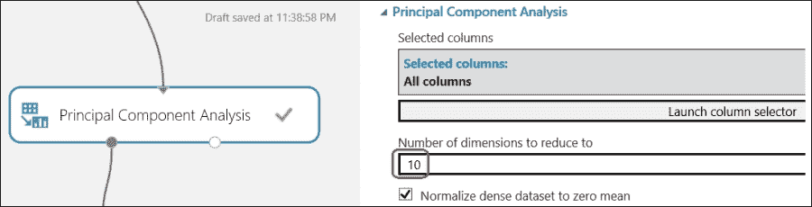
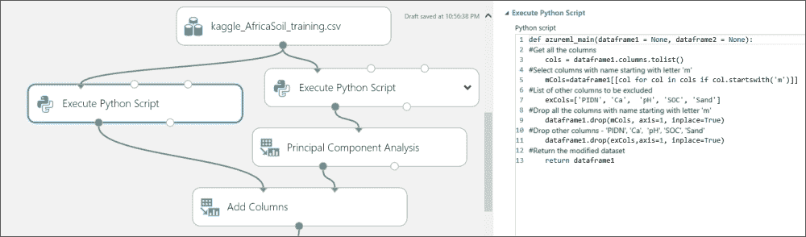
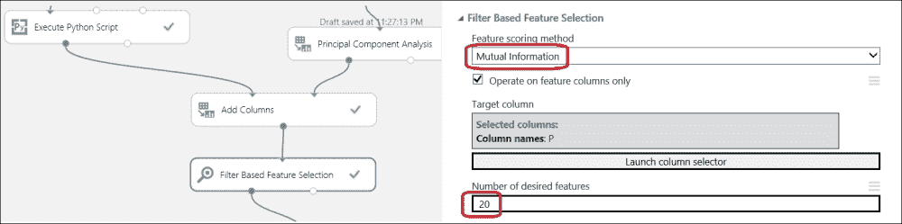
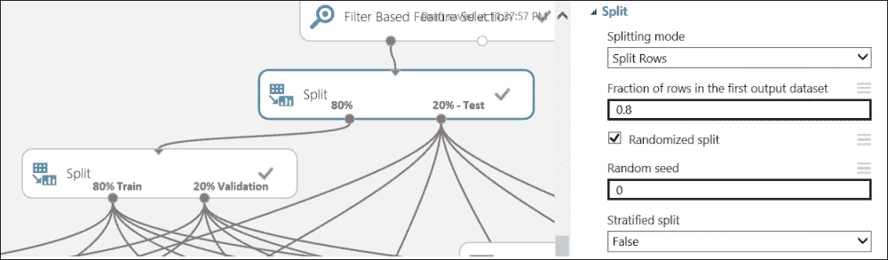
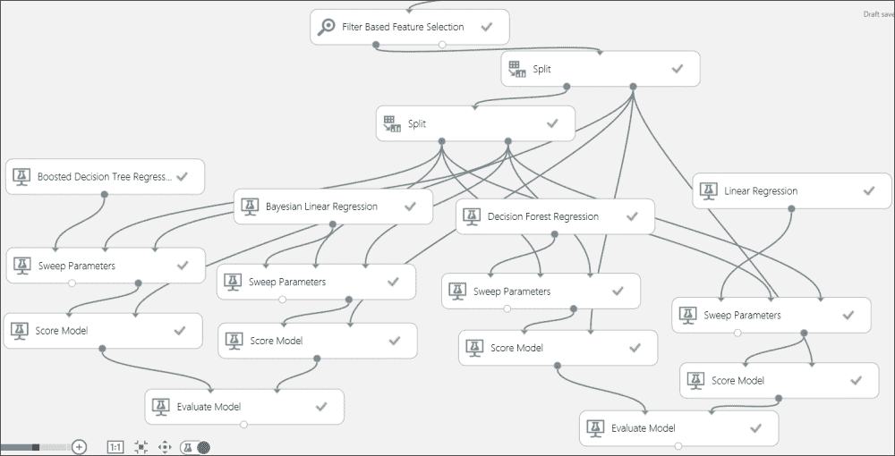

# 第十三章。案例研究练习 II

你在上一章已经解决了一个现实世界的分类问题。在这一章中，我们将以另一个案例研究练习的形式提出一个新的问题，并且我们将用一个非常简单的解决方案来解决它。这个练习代表了一个回归问题。

与上一章类似，它不会提供包含所有详细步骤的逐步指南；然而，它将提供一些提示，以便你可以解决问题。本章假设你已经成功完成了所有前面的章节，或者已经了解 Azure ML。

# 问题定义和范围

问题来自**Kaggle**机器学习竞赛之一，他们在竞赛中提供了一些数据集信息，并要求参赛者使用机器学习技术从测试数据集中进行预测。这是关于**非洲土壤属性预测挑战**。训练数据集包含土壤的不同测量值，并预期参赛者能够预测土壤五个属性（目标变量）的值：**SOC**、**pH**、**Ca**、**P**和**沙**。更多详细信息可以在[`www.kaggle.com/c/afsis-soil-properties/`](https://www.kaggle.com/c/afsis-soil-properties/)找到。

为了本案例研究的目的，我们将只选择一个目标变量，命名为 P，并忽略其他变量。一旦你能够预测一个目标变量，你就可以采用相同的方法来预测其他变量。因此，你应该尝试自己预测所有变量。

# 数据集

你可以下载数据集并找到描述[`www.kaggle.com/c/afsis-soil-properties/data`](https://www.kaggle.com/c/afsis-soil-properties/data)。

数据集已在以下术语列表中解释，如前述网页链接所示：

+   **PIDN**：这是唯一的土壤样本标识符。

+   **SOC**：这指的是土壤有机碳。

+   **pH**：这些是 pH 值。

+   **Ca**：这是 Mehlich-3 可提取的钙。

+   **P**：这是 Mehlich-3 可提取的磷。

+   **沙**：这是沙含量。

+   **m7497.96 - m599.76**：有 3,578 个中红外吸收测量值。例如，“m7497.96”列是 7497.96 cm-1 波数的吸收率。我们建议你移除位于 m2379.76 到 m2352.76 区域的 CO2 光谱带，但你不必这样做。

+   **深度**：这是土壤样本的深度（这有两个类别：“**表层土壤**”和“**底土**”）。他们还从遥感数据源中包含了一些潜在的时空预测因子。以下提供了不同术语的简短变量描述，更多描述可以在 AfSIS 数据中找到。数据已经进行了均值中心化和缩放。

+   **BSA**：这些是从**MODIS**卫星图像中得到的平均长期**黑天空反照率**测量值（在这里，BSAN = 近红外，BSAS = 短波，BSAV = 可见光）。

+   **CTI**: 这指的是从**航天飞机雷达地形测量任务**的高度数据计算出的**复合地形指数**。

+   **ELEV**: 这指的是航天飞机雷达地形测量任务的高度数据。

+   **EVI**: 这是从 MODIS 卫星图像中得到的平均长期**增强植被指数**。

+   **LST**: 这是从 MODIS 卫星图像中得到的平均长期**地表温度**（在此，LSTD = 白天温度和 LSTN = 夜间温度）。

+   **Ref**: 这指的是从 MODIS 卫星图像中得到的平均长期**反射率**测量值（在此，Ref1 = 蓝色，Ref2 = 红色，Ref3 = 近红外，和 Ref7 = 中红外）。

+   **Reli**: 这是从航天飞机雷达地形测量任务的高度数据计算出的**地形起伏**。

+   **TMAP 和 TMFI**: 这指的是平均长期**热带降雨监测任务**数据（在此，TMAP = 平均年降水量，TMFI = 修改后的富尼耶指数）。

下载训练数据集（[`www.kaggle.com/c/afsis-soil-properties/download/train.zip`](https://www.kaggle.com/c/afsis-soil-properties/download/train.zip)）。请注意，您可能需要创建一个账户才能下载数据集。将数据集上传到 ML Studio（为此，请参阅第四章，*在 ML Studio 中导入和导出数据*，以找到有关如何从您的本地机器上传数据集的详细信息）。

# 数据探索和准备

在 ML Studio 中创建一个新的实验。将上传的数据集拖放到画布上并可视化它。如您所见，它有 1157 行和 3600 列。通常，在 Kaggle 竞赛中公开的数据已经过清洗，这为您节省了数据清洗的精力，例如处理缺失值。在 ML Studio 中，您无法看到所有列和行。有 3,578 列包含中红外吸收测量值，并且这些整个列名都以字母'm'开头。您可能希望将它们分开。为此，您可以使用带有以下代码的**执行 Python 脚本**模块，其中内联注释解释了代码行。为此，请参阅第十章，*使用 R 和 Python 扩展*，以找到有关如何在 ML Studio 中集成 Python/R 脚本的详细信息：

```py
def azureml_main(dataframe1 = None, dataframe2 = None):
    #Get all the columns
    cols = dataframe1.columns.tolist()
    #Select columns with name starting with letter 'm'
    dataframe1=dataframe1[[col for col in cols if col.startswith('m')]]
    #Return the modified dataset
    return dataframe1
```

进行中的模型可能如下所示：


或者，您也可以使用**执行 R 脚本**模块和 R 代码来实现相同的功能。

这些提取的 3,578 列几乎无法可视化，并且在模型中处理它们将花费很长时间，尤其是在您使用**参数扫描**模块时。将它们压缩成几行将非常有价值，这样它们就更容易处理了。**主成分分析**模块将非常有帮助，因为它可以从给定的特征中提取出给定数量的最相关特征。**主成分分析**（PCA）是一种流行的技术，它将特征集转换为一个具有降低的维度或更少特征或组件的新特征集；其中包含原始特征集中的大部分信息。ML Studio 中存在的**主成分分析**模块将**降低到多少维度的数量**作为输入，您可以在其中指定期望的低特征数量。

您可以尝试将**10**个组件（用于**降低到多少维度的数量**选项）作为其参数，如图所示：



您可以使用另一个**执行 Python 脚本**模块或**执行 R 脚本**来提取其他相关列，这些列都是除了以'm'开头和其他目标变量（因为我们只对 P 感兴趣）之外的所有列。您还可能想排除 PIDN，它是唯一的土壤样本标识符。让我们看一下下面的截图：



相同的 Python 代码如下：

```py
def azureml_main(dataframe1 = None, dataframe2 = None):
    #Get all the columns 
    cols = dataframe1.columns.tolist()
    #Select columns with name starting with letter 'm'
    mCols=dataframe1[[col for col in cols if col.startswith('m')]]
    #List of other columns to be excluded 
    exCols=['PIDN', 'Ca',  'pH', 'SOC', 'Sand']
    #Drop all the columns with name starting with letter 'm'
    dataframe1.drop(mCols, axis=1, inplace=True)
    #Drop other columns - 'PIDN', 'Ca',  'pH', 'SOC', 'Sand'
    dataframe1.drop(exCols,axis=1, inplace=True)
    #Return the modified dataset 
    return dataframe1
```

使用提取的两组列进行组合，并使用**添加列**模块制作一个数据集。到目前为止，您应该已经有一个降低的特征集，但您仍然需要找到最相关的特征。不必要的数据或噪声可能会降低模型的预测能力，因此应该被排除。**基于过滤的特征选择**模块可以识别数据集中最重要的特征。您可以尝试使用不同数量的期望特征作为参数，并评估整体模型的性能。



在您开始构建模型之前，您需要准备训练、验证和测试数据集。让我们看一下下面的截图：



# 模型开发

在准备数据后，您不确定哪种模型或回归算法对当前问题表现良好。因为目标变量 P 是连续的，您知道这是一个回归问题。因此，尝试不同的算法并选择最佳算法是值得的。您可以使用**参数扫描**模块来获取算法的最佳参数。您需要将三个输入传递给**参数扫描**模块：未训练的算法、训练数据集和验证数据集。使用**评分**模块对测试数据进行评分。使用**评估**模块比较两个模型与评分数据。

你应该尝试不同的算法来选择最佳的一个。下面的图仅作为参考，展示了四种算法。



运行模型并找出对你来说表现最好的算法。

# 模型部署

当你对某个特定模型满意后，将其保存为训练模型，然后为网络服务准备一个实验，并继续部署模型。请参考第十一章，*将模型作为网络服务发布*，以找到如何将模型部署到预发布环境并在 ML Studio 中可视测试的详细信息。

# 摘要

在最后一章中，你解决了另一个现实世界的问题。你从理解问题开始，然后获取了必要的数据。在初步数据探索后，你意识到数据有大量的列，因此你使用 Python 脚本模块首先将数据分为两组特征，然后使用 PCA 算法得到一组减少的特征。然后，你使用了**基于过滤的特征选择**模块，该模块可以从减少的数据集中识别出大多数重要特征。为了选择正确的模型，你尝试了不同的算法，并使用**参数扫描**模块用最佳参数进行训练。最后，你选择了模型，并继续将其发布为网络服务。
