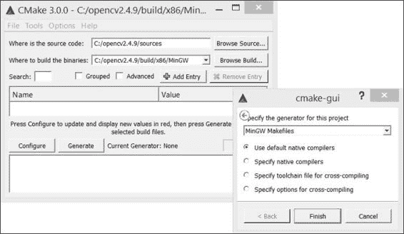
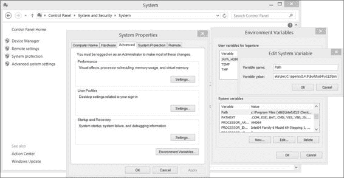
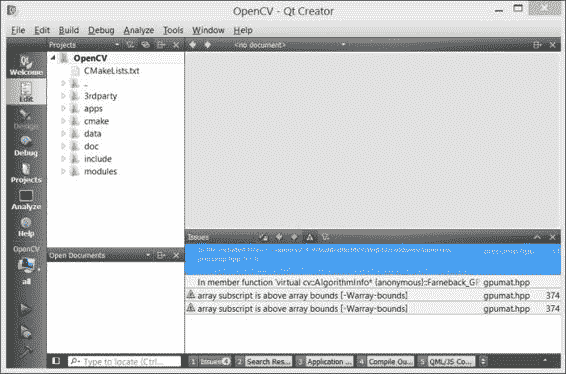
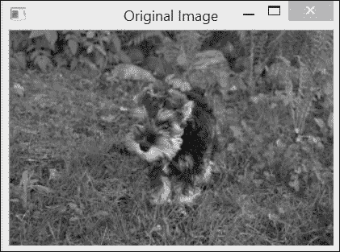
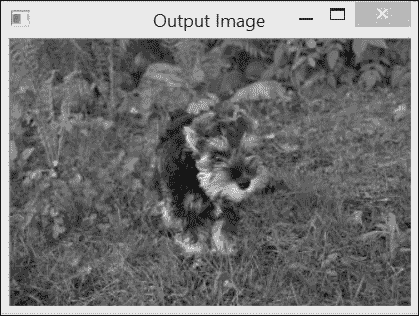
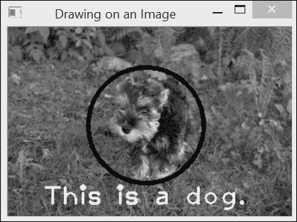
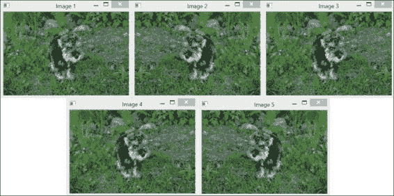
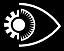
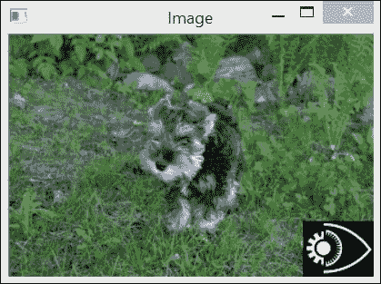
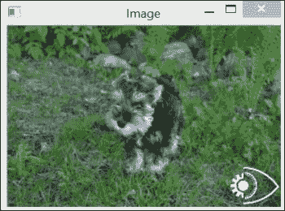

# 第一章. 玩转图像

在本章中，我们将带你开始使用 `OpenCV` 库。你将学习如何执行以下任务：

+   安装 OpenCV 库

+   加载、显示和保存图像

+   探索 cv::Mat 数据结构

+   定义感兴趣区域

# 简介

本章将教授你 OpenCV 的基本元素，并展示如何完成最基本图像处理任务：读取、显示和保存图像。然而，在开始使用 OpenCV 之前，你需要安装这个库。这是一个简单的过程，在第一章的第一个菜谱中有解释。

你所有的计算机视觉应用程序都将涉及图像的处理。这就是为什么 OpenCV 提供给你的最基本工具是一个用于处理图像和矩阵的数据结构。这是一个功能强大的数据结构，具有许多有用的属性和方法。它还包含一个高级内存管理模型，这极大地简化了应用程序的开发。本章的最后两个菜谱将教你如何使用这个重要的 OpenCV 数据结构。

# 安装 OpenCV 库

OpenCV 是一个开源库，用于开发在 Windows、Linux、Android 和 Mac OS 上运行的计算机视觉应用程序。它可以在学术和商业应用程序下使用 BSD 许可证，该许可证允许你自由使用、分发和修改它。本菜谱将向你展示如何在你的机器上安装库。

## 准备工作

当你访问 OpenCV 官方网站 [`opencv.org/`](http://opencv.org/) 时，你将找到库的最新版本、在线文档以及许多其他关于 OpenCV 的有用资源。

## 如何操作...

从 OpenCV 网站进入对应你选择平台（Unix/Windows 或 Android）的 **下载** 页面。从那里，你可以下载 OpenCV 软件包。然后你需要解压它，通常在一个与库版本相对应的目录下（例如，在 Windows 中，你可以在 `C:\OpenCV2.4.9` 下保存未解压的目录）。完成此操作后，你将在选择的位置找到构成库的文件和目录集合。值得注意的是，你将在这里找到 `sources` 目录，它包含所有源文件。（是的，它是开源的！）然而，为了完成库的安装并使其准备好使用，你需要进行一个额外的步骤：为你的选择环境生成库的二进制文件。这确实是你要决定将用于创建你的 OpenCV 应用程序的目标平台的时候。你应该使用哪个操作系统？Windows 还是 Linux？你应该使用哪个编译器？Microsoft VS2013 还是 MinGW？32 位还是 64 位？你将在项目开发中使用的 **集成开发环境**（**IDE**）也将指导你做出这些选择。

注意，如果你在 Windows 操作系统下使用 Visual Studio 进行工作，可执行安装包很可能会不仅安装库源代码，还会安装构建你的应用程序所需的所有预编译的二进制文件。请检查`build`目录；它应该包含`x64`和`x86`子目录（对应 64 位和 32 位版本）。在这些子目录中，你应该找到如`vc10`、`vc11`和`vc12`这样的目录；这些目录包含不同版本 MS Visual Studio 的二进制文件。在这种情况下，你就可以开始使用 OpenCV 了。因此，你可以跳过本食谱中描述的编译步骤，除非你想使用特定选项进行定制构建。

为了完成安装过程并构建 OpenCV 的二进制文件，你需要使用可在[`cmake.org`](http://cmake.org)找到的**CMake**工具。CMake 是另一个开源软件工具，它使用平台无关的配置文件来控制软件系统的编译过程。它为你生成编译软件库所需的环境中的**makefiles**或**工作空间**。因此，你需要下载并安装 CMake。然后你可以通过命令行运行它，但使用 CMake 的 GUI（`cmake-gui`）会更简单。在后一种情况下，你只需要指定包含 OpenCV 库源代码的文件夹和将包含二进制文件的文件夹。你需要点击**Configure**来选择你选择的编译器，然后再次点击**Configure**。



现在，你可以通过点击**Generate**按钮来生成你的项目文件。这些文件将允许你编译库。这是安装过程的最后一步，它将使库在你的开发环境中准备好使用。例如，如果你选择了 Visual Studio，那么你只需要打开 CMake 为你创建的顶级解决方案文件（最可能是`OpenCV.sln`文件）。然后你在 Visual Studio 中发出`Build Solution`命令。为了得到`Release`和`Debug`两种构建，你将不得不重复编译过程两次，一次针对每个配置。创建的`bin`目录包含你的可执行文件在运行时将调用的动态库文件。请确保从控制面板设置你的系统`PATH`环境变量，以便你的操作系统可以在你运行应用程序时找到`dll`文件。



在 Linux 环境中，你将通过运行你的`make`实用工具命令来使用生成的 makefiles。为了完成所有目录的安装，你还需要运行`Build INSTALL`或`sudo make INSTALL`命令。

然而，在您构建库之前，请确保检查 OpenCV 安装程序为您安装了什么；您正在寻找的构建库可能已经存在，这将节省您编译步骤。如果您希望使用 Qt 作为您的 IDE，本食谱的 “更多...” 部分描述了编译 OpenCV 项目的另一种方法。

## 它是如何工作的...

自 2.2 版本以来，OpenCV 库被分为几个模块。这些模块是位于 `lib` 目录中的内置库文件。以下是一些常用模块：

+   包含库的核心功能，特别是基本数据结构和算术函数的 `opencv_core` 模块

+   包含主要图像处理函数的 `opencv_imgproc` 模块

+   包含图像和视频读写函数以及一些用户界面函数的 `opencv_highgui` 模块

+   包含特征点检测器、描述符和特征点匹配框架的 `opencv_features2d` 模块

+   包含相机标定、双视图几何估计和立体功能的 `opencv_calib3d` 模块

+   包含运动估计、特征跟踪和前景提取函数和类的 `opencv_video` 模块

+   包含人脸和人物检测等对象检测函数的 `opencv_objdetect` 模块

该库还包括其他实用模块，这些模块包含机器学习函数（`opencv_ml`）、计算几何算法（`opencv_flann`）、贡献代码（`opencv_contrib`）、过时代码（`opencv_legacy`）和 GPU 加速代码（`opencv_gpu`）。您还会找到其他专门库，它们实现了更高级的功能，例如 `opencv_photo` 用于计算摄影和 `opencv_stitching` 用于图像拼接算法。还有一个名为 `opencv_nonfree` 的库模块，其中包含在使用上可能存在潜在限制的函数。当您编译应用程序时，您必须将程序链接到包含您使用的 OpenCV 函数的库。很可能是前面列出的前三个函数以及一些其他函数，具体取决于您应用程序的范围。

所有这些模块都与它们相关的头文件相关联（位于 `include` 目录中）。因此，典型的 OpenCV C++ 代码将首先包含所需的模块。例如（这是建议的声明风格）：

```py
#include <opencv2/core/core.hpp>
#include <opencv2/imgproc/imgproc.hpp>
#include <opencv2/highgui/highgui.hpp>
```

### 小贴士

**下载示例代码**

您可以从您在 [`www.packtpub.com`](http://www.packtpub.com) 的账户下载您购买的所有 Packt 书籍的示例代码文件。如果您在其他地方购买了这本书，您可以访问 [`www.packtpub.com/support`](http://www.packtpub.com/support) 并注册以直接将文件通过电子邮件发送给您。

您可能会看到以下命令开始的 OpenCV 代码：

```py
#include "cv.h"
```

这是因为它使用了旧式风格，在库被重构为模块之前。最后，请注意，OpenCV 将来将会进行重构；因此，如果你下载的版本比 2.4 更新，你可能不会看到相同的模块划分。

## 还有更多...

OpenCV 网站[`opencv.org/`](http://opencv.org/)包含了关于如何安装库的详细说明。它还包含了一份完整的在线文档，其中包括关于库不同组件的几个教程。

### 使用 Qt 进行 OpenCV 开发

Qt 是一个用于 C++应用程序的跨平台 IDE，作为一个开源项目开发。它提供 LPGL 开源许可证以及商业（付费）许可证，用于开发专有项目。它由两个独立的元素组成：一个名为 Qt Creator 的跨平台 IDE 以及一组 Qt 类库和开发工具。使用 Qt 开发 C++应用程序有以下好处：

+   这是一个由 Qt 社区开发的开源倡议，它为你提供了访问不同 Qt 组件源代码的权限。

+   它是一个跨平台 IDE，这意味着你可以开发可以在不同操作系统上运行的应用程序，例如 Windows、Linux、Mac OS X 等。

+   它包含了一个完整且跨平台的 GUI 库，遵循有效的面向对象和事件驱动模型。

+   Qt 还包括几个跨平台库，这些库可以帮助你开发多媒体、图形、数据库、多线程、Web 应用程序以及许多其他用于设计高级应用程序的有趣构建块。

你可以从[`qt-project.org/`](http://qt-project.org/)下载 Qt。当你安装它时，你会被提供选择不同编译器的选项。在 Windows 下，MinGW 是 Visual Studio 编译器的优秀替代品。

使用 Qt 编译 OpenCV 库特别容易，因为它可以读取 CMake 文件。一旦安装了 OpenCV 和 CMake，只需从 Qt 菜单中选择**打开文件**或**项目...**，然后打开你将在 OpenCV 的`sources`目录下找到的`CMakeLists.txt`文件。这将创建一个 OpenCV 项目，你可以使用 Qt 的`构建项目`命令来构建它。



你可能会得到一些警告，但这些没有后果。

### OpenCV 开发者网站

OpenCV 是一个开源项目，欢迎用户贡献。你可以在[`code.opencv.org`](http://code.opencv.org)访问开发者网站。在其他方面，你可以访问目前正在开发的 OpenCV 版本。社区使用 Git 作为他们的版本控制系统。然后你必须使用它来检出 OpenCV 的最新版本。Git 也是一个免费的开源软件系统；它可能是你可以用来管理你自己的源代码的最佳工具。你可以从[`git-scm.com/`](http://git-scm.com/)下载它。

## 参见

+   我的网站 ([www.laganiere.name](http://www.laganiere.name)) 也展示了如何逐步安装 OpenCV 库的最新版本

+   下一个菜谱的 *还有更多...* 部分解释了如何使用 Qt 创建 OpenCV 项目

# 加载、显示和保存图像

现在是时候运行你的第一个 OpenCV 应用程序了。由于 OpenCV 是关于图像处理的，这个任务将向你展示如何在图像应用程序开发中执行最基本操作。这些操作包括从文件中加载输入图像，在窗口中显示图像，应用处理函数，以及在磁盘上存储输出图像。

## 准备工作

使用你喜欢的 IDE（例如，MS Visual Studio 或 Qt），创建一个新的控制台应用程序，其中包含一个准备填充的 `main` 函数。

## 如何做...

首先要做的是包含头文件，声明你将使用的类和函数。在这里，我们只想显示一个图像，因此我们需要包含声明图像数据结构的核心库和包含所有图形界面函数的 `highgui` 头文件：

```py
#include <opencv2/core/core.hpp>
#include <opencv2/highgui/highgui.hpp>
```

我们的主函数首先声明一个将保存图像的变量。在 OpenCV 2 中，定义 `cv::Mat` 类的对象：

```py
cv::Mat image; // create an empty image
```

这个定义创建了一个大小为 `0 x 0` 的图像。这可以通过访问 `cv::Mat` 的大小属性来确认：

```py
std::cout << "This image is " << image.rows << " x " 
          << image.cols << std::endl;
```

接下来，一个简单的读取函数调用将从一个文件中读取图像，对其进行解码，并分配内存：

```py
image=  cv::imread("puppy.bmp"); // read an input image
```

你现在可以使用这个图像了。然而，你应该首先检查图像是否被正确读取（如果文件找不到，如果文件损坏，或者如果它不是可识别的格式，将发生错误）。图像的有效性通过以下代码进行测试：

```py
if (image.empty()) {  // error handling
   // no image has been created…
   // possibly display an error message
   // and quit the application 
   …
}
```

`empty` 方法在未分配任何图像数据时返回 `true`。

你可能首先想用这个图像做的是显示它。你可以使用 `highgui` 模块中的函数来完成这个操作。首先，声明你想要显示图像的窗口，然后指定要在该特殊窗口上显示的图像：

```py
// define the window (optional)
cv::namedWindow("Original Image");
// show the image 
cv::imshow("Original Image", image);
```

如你所见，窗口是通过名称来标识的。你可以重用这个窗口来稍后显示另一个图像，或者你可以创建具有不同名称的多个窗口。当你运行这个应用程序时，你会看到一个图像窗口，如下所示：



现在，你通常会对此图像应用一些处理。OpenCV 提供了广泛的处理函数，本书中探讨了其中的一些。让我们从一个非常简单的例子开始，这个例子可以水平翻转图像。OpenCV 中的几个图像变换可以在**原地**执行，这意味着变换直接应用于输入图像（不会创建新图像）。翻转方法就是这种情况。然而，我们总是可以创建另一个矩阵来保存输出结果，这正是我们将要做的：

```py
cv::Mat result; // we create another empty image
cv::flip(image,result,1); // positive for horizontal
                          // 0 for vertical,                     
                          // negative for both
```

结果在另一个窗口中显示：

```py
cv::namedWindow("Output Image"); // the output window
cv::imshow("Output Image", result);
```

由于这是一个在到达`main`函数的末尾时会终止的控制台窗口，我们在程序结束前添加了一个额外的`highgui`函数来等待用户按键：

```py
cv::waitKey(0); // 0 to indefinitely wait for a key pressed
                // specifying a positive value will wait for
                // the given amount of msec
```

你可以注意到，输出图像显示在一个独立的窗口中，如下面的截图所示：



最后，你可能想要将处理后的图像保存到你的磁盘上。这是使用以下`highgui`函数完成的：

```py
cv::imwrite("output.bmp", result); // save result
```

文件扩展名决定了将使用哪个编解码器来保存图像。其他流行的支持图像格式包括 JPG、TIFF 和 PNG。

## 它是如何工作的...

OpenCV 的 C++ API 中的所有类和函数都在`cv`命名空间内定义。你有两种方法可以访问它们。首先，在`main`函数的定义之前加上以下声明：

```py
using namespace cv;
```

或者，你可以使用命名空间指定来前缀所有 OpenCV 类和函数名，即`cv::`，正如我们将在本书中所做的那样。使用这个前缀可以使 OpenCV 类和函数更容易识别。

`highgui`模块包含一系列函数，允许你轻松地可视化和与你的图像交互。当你使用`imread`函数加载图像时，你也可以选择将其作为灰度图像读取。这非常有优势，因为许多计算机视觉算法需要灰度图像。在读取图像时即时转换输入的彩色图像可以节省你的时间并最小化你的内存使用。这可以通过以下方式完成：

```py
// read the input image as a gray-scale image
image=  cv::imread("puppy.bmp", CV_LOAD_IMAGE_GRAYSCALE);
```

这将生成一个由无符号字节（C++中的`unsigned char`）组成的图像，OpenCV 使用定义的常量`CV_8U`来指定。或者，有时即使图像被保存为灰度图像，也必须以 3 通道彩色图像的形式读取图像。这可以通过调用带有正第二个参数的`imread`函数来实现：

```py
// read the input image as a 3-channel color image
image=  cv::imread("puppy.bmp", CV_LOAD_IMAGE_COLOR);
```

这次，将创建一个每个像素由 3 个字节组成的图像，在 OpenCV 中指定为`CV_8UC3`。当然，如果你的输入图像已经被保存为灰度图像，所有三个通道将包含相同的值。最后，如果你希望以保存的格式读取图像，只需将第二个参数输入为负值。可以通过使用`channels`方法检查图像中的通道数：

```py
std::cout << "This image has " 
          << image.channels() << " channel(s)";
```

当你使用`imread`打开一个未指定完整路径的图像时（就像我们在这里做的那样），请注意。在这种情况下，将使用默认目录。当你从控制台运行你的应用程序时，这个目录显然是你的可执行文件所在的目录。然而，如果你直接从你的 IDE 运行应用程序，默认目录通常是你项目文件所在的目录。因此，请确保你的输入图像文件位于正确的目录中。

当您使用`imshow`显示由整数组成的图像（指定为`CV_16U`表示 16 位无符号整数，或`CV_32S`表示 32 位有符号整数）时，该图像的像素值首先会被除以 256，试图使其可以用 256 种灰度级别显示。同样，由浮点数组成的图像将通过假设 0.0（显示为黑色）和 1.0（显示为白色）之间的可能值范围来显示。超出此定义范围的值将以白色（对于大于 1.0 的值）或黑色（对于小于 1.0 的值）显示。

`highgui`模块对于构建快速原型应用非常有用。当您准备好生成应用程序的最终版本时，您可能会想使用 IDE 提供的 GUI 模块来构建一个外观更专业的应用程序。

在这里，我们的应用程序同时使用输入和输出图像。作为一个练习，您应该重写这个简单的程序，使其利用函数的就地处理功能，也就是说，不声明输出图像，而是直接写入它：

```py
cv::flip(image,image,1); // in-place processing
```

## 更多...

`highgui`模块包含了一组丰富的函数，这些函数可以帮助您与图像进行交互。使用这些函数，您的应用程序可以响应鼠标或键盘事件。您还可以在图像上绘制形状和写入文本。

### 点击图像

您可以将鼠标编程为在悬停在您创建的图像窗口之一上时执行特定操作。这是通过定义一个合适的**回调**函数来完成的。回调函数是一个您不明确调用的函数，但您的应用程序会根据特定事件（在此处，涉及鼠标与图像窗口交互的事件）来调用它。为了被应用程序识别，回调函数需要具有特定的签名并且必须进行注册。在鼠标事件处理程序的情况下，回调函数必须具有以下签名：

```py
void onMouse( int event, int x, int y, int flags, void* param);
```

第一个参数是一个整数，用于指定哪种类型的鼠标事件触发了回调函数的调用。其他两个参数简单地是事件发生时鼠标位置的像素坐标。标志用于确定在鼠标事件触发时哪个按钮被按下。最后，最后一个参数用于将一个额外的参数以任何对象的指针形式发送到函数。此回调函数可以通过以下调用在应用程序中注册：

```py
cv::setMouseCallback("Original Image", onMouse, 
                     reinterpret_cast<void*>(&image));
```

在此示例中，`onMouse`函数与称为**原始图像**的图像窗口相关联，并且显示的图像地址作为额外参数传递给函数。现在，如果我们定义如以下代码所示的`onMouse`回调函数，那么每次鼠标点击时，相应像素的值将在控制台上显示（这里我们假设它是一个灰度图像）：

```py
void onMouse( int event, int x, int y, int flags, void* param)  {

  cv::Mat *im= reinterpret_cast<cv::Mat*>(param);

  switch (event) {  // dispatch the event

    case CV_EVENT_LBUTTONDOWN: // left mouse button down event

      // display pixel value at (x,y)
      std::cout << "at (" << x << "," << y << ") value is: " 
        << static_cast<int>(
                  im->at<uchar>(cv::Point(x,y))) << std::endl;
      break;
  }
}
```

注意，为了获取 `(x,y)` 处的像素值，我们在这里使用了 `cv::Mat` 对象的 `at` 方法；这已在 第二章 中讨论过，*操作像素*。鼠标事件回调函数还可以接收其他一些事件，包括 `CV_EVENT_MOUSEMOVE, CV_EVENT_LBUTTONUP`, `CV_EVENT_RBUTTONDOWN`, 和 `CV_EVENT_RBUTTONUP`。

### 在图像上绘制

OpenCV 还提供了一些在图像上绘制形状和写入文本的函数。基本形状绘制函数的示例有 `circle`, `ellipse`, `line`, 和 `rectangle`。以下是如何使用 `circle` 函数的示例：

```py
cv::circle(image,             // destination image 
        cv::Point(155,110),   // center coordinate
        65,                   // radius  
        0,                    // color (here black)
        3);                   // thickness
```

`cv::Point` 结构通常在 OpenCV 方法和函数中用于指定像素坐标。请注意，在这里我们假设绘制是在灰度图像上进行的；这就是为什么颜色用单个整数指定。在下一菜谱中，您将学习如何在使用 `cv::Scalar` 结构的颜色图像中指定颜色值。您还可以在图像上写入文本。可以这样做：

```py
cv::putText(image,                  // destination image
        "This is a dog.",           // text
        cv::Point(40,200),          // text position
        cv::FONT_HERSHEY_PLAIN,     // font type
        2.0,                        // font scale
        255,                        // text color (here white)
        2);                         // text thickness
```

在我们的测试图像上调用这两个函数将产生以下截图：



### 使用 Qt 运行示例

如果您想使用 Qt 运行您的 OpenCV 应用程序，您需要创建项目文件。对于本菜谱的示例，以下是项目文件 (`loadDisplaySave.pro`) 的样子：

```py
QT       += core
QT       -= gui

TARGET = loadDisplaySave
CONFIG   += console
CONFIG   -= app_bundle

TEMPLATE = app

SOURCES += loadDisplaySave.cpp
INCLUDEPATH += C:\OpenCV2.4.9\build\include
LIBS += -LC:\OpenCV2.4.9\build\x86\MinGWqt32\lib \
-lopencv_core249 \
-lopencv_imgproc249 \
-lopencv_highgui249
```

此文件显示了您可以在哪里找到 `include and library` 文件。它还列出了示例中使用的库模块。请确保使用与 Qt 所使用的编译器兼容的库二进制文件。请注意，如果您下载了本书示例的源代码，您将找到可以与 Qt（或 CMake）一起打开的 `CMakeLists` 文件，以便创建相关项目。

## 参见

+   `cv::Mat` 类是用于存储您的图像（以及显然，其他矩阵数据）的数据结构。这个数据结构是所有 OpenCV 类和函数的核心；下一菜谱将详细介绍这个数据结构。

+   您可以从 [`github.com/laganiere/`](https://github.com/laganiere/) 下载本书示例的源代码。

# 探索 cv::Mat 数据结构

在前面的菜谱中，您已经了解了 `cv::Mat` 数据结构。正如所提到的，这是库的关键元素。它用于操作图像和矩阵（实际上，从计算和数学的角度来看，图像是一个矩阵）。由于您将在应用程序开发中广泛使用此数据结构，因此熟悉它是必不可少的。值得注意的是，您将在本菜谱中了解到，此数据结构包含一个优雅的内存管理机制，允许高效使用。

## 如何做...

让我们编写以下测试程序，以便我们可以测试 `cv::Mat` 数据结构的不同属性：

```py
#include <iostream>
#include <opencv2/core/core.hpp>
#include <opencv2/highgui/highgui.hpp>

// test function that creates an image
cv::Mat function() {
   // create image
   cv::Mat ima(500,500,CV_8U,50);
   // return it
   return ima;
}

int main() {
  // define image windows
  cv::namedWindow("Image 1"); 
  cv::namedWindow("Image 2"); 
  cv::namedWindow("Image 3"); 
  cv::namedWindow("Image 4"); 
  cv::namedWindow("Image 5"); 
  cv::namedWindow("Image"); 

  // create a new image made of 240 rows and 320 columns
  cv::Mat image1(240,320,CV_8U,100);

  cv::imshow("Image", image1); // show the image
  cv::waitKey(0); // wait for a key pressed

  // re-allocate a new image
  image1.create(200,200,CV_8U);
  image1= 200;

  cv::imshow("Image", image1); // show the image
  cv::waitKey(0); // wait for a key pressed

  // create a red color image
  // channel order is BGR
  cv::Mat image2(240,320,CV_8UC3,cv::Scalar(0,0,255));

  // or:
  // cv::Mat image2(cv::Size(320,240),CV_8UC3);
  // image2= cv::Scalar(0,0,255);

  cv::imshow("Image", image2); // show the image
  cv::waitKey(0); // wait for a key pressed

  // read an image
  cv::Mat image3=  cv::imread("puppy.bmp"); 

  // all these images point to the same data block
  cv::Mat image4(image3);
  image1= image3;

  // these images are new copies of the source image
  image3.copyTo(image2);
  cv::Mat image5= image3.clone();

  // transform the image for testing
  cv::flip(image3,image3,1); 

  // check which images have been affected by the processing
  cv::imshow("Image 3", image3); 
  cv::imshow("Image 1", image1); 
  cv::imshow("Image 2", image2); 
  cv::imshow("Image 4", image4); 
  cv::imshow("Image 5", image5); 
  cv::waitKey(0); // wait for a key pressed

  // get a gray-level image from a function
  cv::Mat gray= function();

  cv::imshow("Image", gray); // show the image
  cv::waitKey(0); // wait for a key pressed

  // read the image in gray scale
  image1= cv::imread("puppy.bmp", CV_LOAD_IMAGE_GRAYSCALE); 
  image1.convertTo(image2,CV_32F,1/255.0,0.0);

  cv::imshow("Image", image2); // show the image
  cv::waitKey(0); // wait for a key pressed

  return 0;
}
```

运行此程序并查看以下生成的图像：



## 它是如何工作的...

`cv::Mat` 数据结构本质上由两部分组成：一个头和一个数据块。头包含了与矩阵相关联的所有信息（大小、通道数、数据类型等）。前面的食谱向您展示了如何访问该结构头中包含的一些属性（例如，通过使用 `cols`、`rows` 或 `channels`）。数据块包含了一个图像的所有像素值。头中包含一个指针变量，它指向这个数据块；它是 `data` 属性。`cv::Mat` 数据结构的一个重要特性是内存块仅在明确请求时才会被复制。确实，大多数操作只是简单地复制 `cv::Mat` 头部，这样多个对象将同时指向相同的数据块。这种内存管理模型使您的应用程序更高效，同时避免了内存泄漏，但必须理解其后果。本食谱的示例说明了这一点。

默认情况下，`cv::Mat` 对象在创建时具有零大小，但您也可以指定初始大小如下：

```py
// create a new image made of 240 rows and 320 columns
cv::Mat image1(240,320,CV_8U,100);
```

在这种情况下，您还需要指定每个矩阵元素的类型；这里为 `CV_8U`，对应于 1 字节像素图像。字母 `U` 表示它是无符号的。您也可以通过使用字母 `S` 来声明有符号数字。对于彩色图像，您将指定三个通道（`CV_8UC3`）。您还可以声明大小为 16 和 32 的整数（例如，`CV_16SC3`）。您还可以访问 32 位和 64 位浮点数（例如，`CV_32F`）。

图像（或矩阵）的每个元素可以由多个值组成（例如，彩色图像的三个通道）；因此，OpenCV 引入了一种简单的数据结构，用于在将像素值传递给函数时使用。它是 `cv::Scalar` 结构，通常用于存储一个或三个值。例如，要创建一个初始化为红色像素的彩色图像，您将编写以下代码：

```py
// create a red color image
// channel order is BGR
cv::Mat image2(240,320,CV_8UC3,cv::Scalar(0,0,255));
```

类似地，灰度图像的初始化也可以使用此结构通过编写 `cv::Scalar(100)` 来完成。

图像大小也经常需要传递给函数。我们已经提到，`cols` 和 `rows` 属性可以用来获取 `cv::Mat` 实例的维度。大小信息也可以通过包含矩阵高度和宽度的 `cv::Size` 结构提供。`size()` 方法允许您获取当前矩阵的大小。这是在许多必须指定矩阵大小的函数中使用的一种格式。

例如，可以创建图像如下：

```py
// create a non-initialized color image 
cv::Mat image2(cv::Size(320,240),CV_8UC3);
```

图像的数据块始终可以使用`create`方法进行分配或重新分配。当一个图像已经被分配时，其旧内容首先被释放。出于效率的考虑，如果新提议的大小和类型与已存在的类型和大小匹配，则不会执行新的内存分配：

```py
// re-allocate a new image
// (only if size or type are different)
image1.create(200,200,CV_8U);
```

当没有更多引用指向给定的`cv::Mat`对象时，分配的内存将自动释放。这非常方便，因为它避免了与 C++中动态内存分配相关的常见内存泄漏问题。这是 OpenCV 2 中的一个关键机制，通过`cv::Mat`类实现引用计数和浅拷贝来完成。因此，当一个图像被赋值给另一个图像时，图像数据（即像素）不会被复制；两个图像将指向相同的内存块。这也适用于按值传递或按值返回的图像。保持引用计数，以便仅在所有对图像的引用都被销毁或赋值给另一个图像时才释放内存：

```py
// all these images point to the same data block
cv::Mat image4(image3);
image1= image3;
```

对前面图像之一应用任何转换也将影响其他图像。如果您想创建图像内容的深度副本，请使用`copyTo`方法。在这种情况下，`create`方法将在目标图像上调用。另一个可以创建图像副本的方法是`clone`方法，它按照以下方式创建一个全新的相同图像：

```py
// these images are new copies of the source image
image3.copyTo(image2);
cv::Mat image5= image3.clone();
```

如果您需要将图像复制到另一个不一定具有相同数据类型的图像中，您必须使用`convertTo`方法：

```py
// convert the image into a floating point image [0,1]
image1.convertTo(image2,CV_32F,1/255.0,0.0);
```

在这个例子中，源图像被复制到一个浮点图像中。该方法包括两个可选参数：缩放因子和偏移量。请注意，然而，两个图像必须具有相同数量的通道。

`cv::Mat`对象的分配模型还允许您安全地编写返回图像的函数（或类方法）：

```py
cv::Mat function() {

   // create image
   cv::Mat ima(240,320,CV_8U,cv::Scalar(100));
   // return it
   return ima;
}
```

我们也可以从我们的`main`函数中调用此函数，如下所示：

```py
   // get a gray-level image
   cv::Mat gray= function();
```

如果我们这样做，那么`gray`变量现在将包含由该函数创建的图像，而不需要额外的内存分配。确实，正如我们解释的那样，只有图像的浅拷贝将从返回的`cv::Mat`实例传输到`gray`图像。当`ima`局部变量超出作用域时，这个变量将被释放，但由于相关的引用计数器指示其内部图像数据被另一个实例（即`gray`变量）引用，其内存块不会被释放。

值得注意的是，在类的情况下，您应该小心，不要返回图像类属性。以下是一个容易出错实现的示例：

```py
class Test {
   // image attribute
   cv::Mat ima;
  public:
     // constructor creating a gray-level image
     Test() : ima(240,320,CV_8U,cv::Scalar(100)) {}

     // method return a class attribute, not a good idea...
     cv::Mat method() { return ima; }
};
```

在这里，如果一个函数调用这个类的这个方法，它会获得图像属性的浅拷贝。如果稍后这个拷贝被修改，`class`属性也会被偷偷修改，这可能会影响类的后续行为（反之亦然）。为了避免这些错误，你应该返回属性的克隆。

## 更多...

当你操作`cv::Mat`类时，你会发现 OpenCV 还包括其他几个相关类。熟悉它们对你来说将非常重要。

### 输入和输出数组

如果你查看 OpenCV 文档，你会看到许多方法和函数接受`cv::InputArray`类型的参数作为输入。这个类型是一个简单的代理类，用于泛化 OpenCV 中数组的概念，从而避免重复几个具有不同输入参数类型的方法或函数的多个版本。这基本上意味着你可以提供一个`cv::Mat`对象或其他兼容类型作为参数。这个类只是一个接口，所以你永远不应该在代码中显式声明它。有趣的是，`cv::InputArray`也可以从流行的`std::vector`类构建。这意味着这样的对象可以用作 OpenCV 方法和函数的输入（只要这样做有意义）。其他兼容类型是`cv::Scalar`和`cv::Vec`；这个结构将在下一章中介绍。还有一个`cv::OutputArray`代理类，用于指定某些方法或函数返回的数组。

### 旧的 IplImage 结构

在 OpenCV 的版本 2 中，引入了一个新的 C++接口。之前，使用了类似 C 的函数和结构（并且仍然可以使用）。特别是，图像是通过`IplImage`结构来操作的。这个结构是从**IPL**库（即**Intel Image Processing**库）继承的，现在已集成到**IPP**库（**Intel Integrated Performance Primitive**库）中。如果你使用的是用旧 C 接口创建的代码和库，你可能需要操作这些`IplImage`结构。幸运的是，有一个方便的方法可以将`IplImage`结构转换为`cv::Mat`对象，如下面的代码所示：

```py
IplImage* iplImage = cvLoadImage("puppy.bmp");
cv::Mat image(iplImage,false);
```

`cvLoadImage`函数是用于加载图像的 C 接口函数。`cv::Mat`对象构造函数中的第二个参数表示数据不会被复制（如果你想要一个新的副本，请将其设置为`true`；默认值为`false`，因此可以省略），也就是说，`IplImage`和`image`将共享相同的数据。在这里，你需要小心不要创建悬空指针。因此，将`IplImage`指针封装在 OpenCV 2 提供的引用计数指针类中更安全：

```py
cv::Ptr<IplImage> iplImage = cvLoadImage("puppy.bmp");
```

否则，如果你需要显式地释放由你的`IplImage`结构指向的内存，你需要这样做：

```py
cvReleaseImage(&iplImage);
```

记住，你应该避免使用这个已弃用的数据结构。相反，始终使用`cv::Mat`数据结构。

## 参见

+   完整的 OpenCV 文档可以在[`docs.opencv.org/`](http://docs.opencv.org/)找到

+   第二章，*操作像素*，将向您展示如何高效地访问和修改由`cv::Mat`类表示的图像的像素值

+   下一个菜谱将解释如何在图像内部定义感兴趣区域

# 定义感兴趣区域

有时，需要将处理函数仅应用于图像的一部分。OpenCV 集成了一个优雅且简单的机制来定义图像中的子区域，并将其作为普通图像进行操作。本菜谱将教你如何在图像内部定义感兴趣区域。

## 准备工作

假设我们想要将一个小图像复制到一个较大的图像上。例如，让我们假设我们想要在我们的测试图像中插入以下小标志：



要做到这一点，可以在一个**感兴趣区域**（**ROI**）上定义复制操作。正如我们将看到的，ROI 的位置将决定标志将插入图像的位置。

## 如何做...

第一步是定义 ROI。一旦定义，ROI 就可以像普通的`cv::Mat`实例一样进行操作。关键是 ROI 确实是一个指向其父图像相同数据缓冲区的`cv::Mat`对象，并且有一个头文件指定 ROI 的坐标。然后，插入标志的操作可以按照以下方式进行：

```py
  // define image ROI at image bottom-right
  cv::Mat imageROI(image, 
              cv::Rect(image.cols-logo.cols, //ROI coordinates
                       image.rows-logo.rows,
                       logo.cols,logo.rows));// ROI size

  // insert logo
  logo.copyTo(imageROI);
```

在这里，`image`是目标图像，而`logo`是标志图像（尺寸较小）。执行前面的代码后，可以得到以下图像：



## 它是如何工作的...

定义 ROI 的一种方法是通过使用`cv::Rect`实例。正如其名所示，它通过指定左上角的位置（构造函数的前两个参数）和矩形的尺寸（宽度在最后两个参数中给出）来描述一个矩形区域。在我们的例子中，我们使用了图像的大小和标志的大小来确定标志将覆盖图像右下角的位置。显然，ROI 应该始终完全位于父图像内部。

ROI 也可以使用行和列的范围来描述。范围是从起始索引到结束索引（不包括两者）的连续序列。`cv::Range`结构用于表示这个概念。因此，ROI 可以通过两个范围来定义；在我们的例子中，ROI 可以等效地定义为以下内容：

```py
imageROI= image(cv::Range(image.rows-logo.rows,image.rows), 
                cv::Range(image.cols-logo.cols,image.cols));
```

在这种情况下，`cv::Mat`的`operator()`函数返回另一个`cv::Mat`实例，然后可以在后续调用中使用它。任何对 ROI 的转换都会影响原始图像的相应区域，因为图像和 ROI 共享相同的数据。由于 ROI 的定义不包括数据的复制，它以恒定的时间执行，无论 ROI 的大小如何。

如果你想要定义由图像的一些行组成的 ROI，可以使用以下调用：

```py
cv::Mat imageROI= image.rowRange(start,end);
```

类似地，对于由图像的一些列组成的 ROI，可以使用以下方法：

```py
cv::Mat imageROI= image.colRange(start,end);
```

## 还有更多...

OpenCV 的方法和函数包括许多在本书的食谱中未讨论的可选参数。当你第一次使用一个函数时，你应该花时间查看文档，以了解更多这个函数提供的可能选项。一个非常常见的选项是定义图像掩码的可能性。

### 使用图像掩码

一些 OpenCV 操作允许你定义一个掩码，该掩码将限制给定函数或方法的应用范围，该函数或方法通常应在所有图像像素上操作。掩码是一个 8 位图像，你应该在你想应用操作的所有位置上设置非零值。在对应于掩码零值的像素位置，图像保持不变。例如，可以使用掩码调用`copyTo`方法。我们可以在这里使用它来复制之前显示的标志的白色部分，如下所示：

```py
// define image ROI at image bottom-right
imageROI= image(cv::Rect(image.cols-logo.cols,
                         image.rows-logo.rows,
                       logo.cols,logo.rows));
// use the logo as a mask (must be gray-level)
cv::Mat mask(logo);

// insert by copying only at locations of non-zero mask
logo.copyTo(imageROI,mask);
```

以下图像是通过执行前面的代码获得的：



我们标志的背景是黑色（因此，它具有值 0）；因此，它很容易被用作复制的图像和掩码。当然，你可以在你的应用程序中定义你选择的掩码；大多数基于像素的 OpenCV 操作都给你使用掩码的机会。

## 参见

+   在第二章的“使用邻接访问扫描图像”食谱中将要使用的`row`和`col`方法，*操作像素*。这些是`rowRange`和`colRange`方法的特殊情况，其中起始和结束索引相等，以便定义单行或单列的 ROI。
