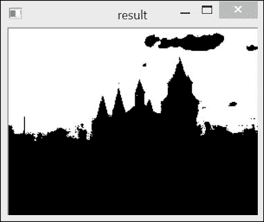
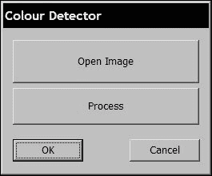
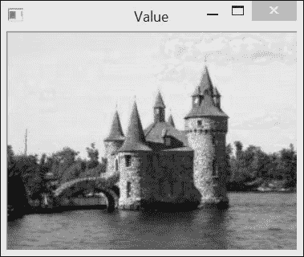
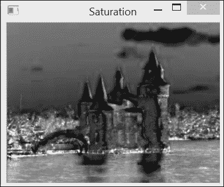
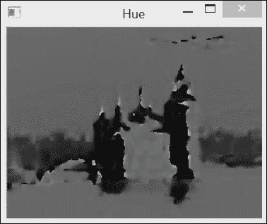
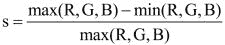
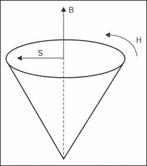
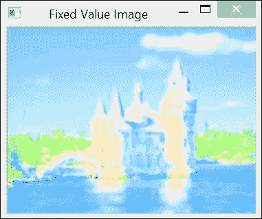
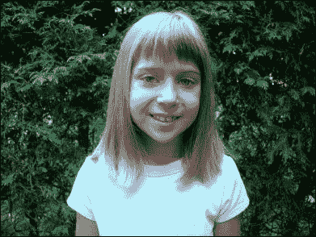
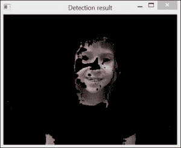

# 第三章：使用类处理颜色图像

在本章中，我们将涵盖以下菜谱：

+   在算法设计中使用策略模式

+   使用控制器设计模式与处理模块通信

+   转换颜色表示

+   使用色调、饱和度和亮度表示颜色

# 简介

良好的计算机视觉程序始于良好的编程实践。构建一个无错误的程序只是开始。你真正想要的是一个你可以和与你一起工作的程序员轻松适应和演化的应用程序。本章将向你展示如何充分利用面向对象编程的一些原则，以构建高质量的软件程序。特别是，我们将介绍一些重要的设计模式，这些模式将帮助你构建易于测试、维护和重用的应用程序组件。

设计模式是软件工程中一个众所周知的概念。基本上，设计模式是对软件设计中频繁出现的通用问题的合理、可重用解决方案。已经引入了许多软件模式，并且得到了很好的记录。优秀的程序员应该掌握这些现有模式的工作知识。

本章还有一个次要目标。它将教会你如何玩转图像颜色。本章使用的示例将展示如何检测给定颜色的像素，最后两个菜谱将解释如何处理不同的颜色空间。

# 在算法设计中使用策略模式

策略设计模式的目标是将算法封装在一个类中。这样，替换给定算法或链式连接几个算法以构建更复杂的过程就变得更容易了。此外，该模式通过尽可能隐藏其复杂性，简化了算法的部署，提供了一个直观的编程接口。

## 准备工作

假设我们想要构建一个简单的算法，该算法将识别图像中所有具有给定颜色的像素。为此，该算法必须接受一个图像和一个颜色作为输入，并将返回一个二值图像，显示具有指定颜色的像素。我们希望接受颜色的容差将是运行算法前要指定的另一个参数。

## 如何做…

一旦使用策略设计模式将算法封装在类中，就可以通过创建这个类的实例来部署它。通常，实例会在程序初始化时创建。在构建时，类实例将使用默认值初始化算法的不同参数，这样它就可以立即投入使用。算法的参数值也可以通过适当的方法进行读取和设置。在具有图形用户界面的应用程序中，这些参数可以通过不同的小部件（文本字段、滑块等）显示和修改，以便用户可以轻松地与之互动。

我们将在下一节中向您展示策略类的结构；让我们从一个示例开始，说明它如何部署和使用。让我们编写一个简单的 main 函数，该函数将运行我们提出的颜色检测算法：

```py
int main()
{
   // 1\. Create image processor object
   ColorDetector cdetect;

   // 2\. Read input image
   cv::Mat image= cv::imread("boldt.jpg");
   if (image.empty())
      return 0;
   // 3\. Set input parameters
   cdetect.setTargetColor(230,190,130); // here blue sky

   cv::namedWindow("result");

   // 4\. Process the image and display the result
   cv::imshow("result",cdetect.process(image));

   cv::waitKey();

   return 0;
}
```

运行此程序以检测前一章中呈现的彩色版本 *城堡* 图像中的蓝天，会产生以下输出：



在这里，白色像素表示所寻求颜色的积极检测，而黑色表示消极。

显然，我们在这个类中封装的算法相对简单（正如我们将在下面看到的那样，它仅由一个扫描循环和一个容差参数组成）。当要实现的算法更复杂、有多个步骤并包含多个参数时，策略设计模式才真正强大。

## 它是如何工作的…

此算法的核心过程很容易构建。它是一个简单的扫描循环，遍历每个像素，比较其颜色与目标颜色。使用我们在前一章的 *使用迭代器扫描图像* 章节中学到的知识，这个循环可以写成以下形式：

```py
     // get the iterators
     cv::Mat_<cv::Vec3b>::const_iterator it= 
                           image.begin<cv::Vec3b>();
     cv::Mat_<cv::Vec3b>::const_iterator itend= 
                           image.end<cv::Vec3b>();
     cv::Mat_<uchar>::iterator itout= result.begin<uchar>();

     // for each pixel
     for ( ; it!= itend; ++it, ++itout) {

            // compute distance from target color
            if (getDistanceToTargetColor(*it)<=maxDist) {
                 *itout= 255;
            } else {
                 *itout= 0;
            }
    }
```

`cv::Mat` 变量的 `image` 指的是输入图像，而 `result` 指的是二值输出图像。因此，第一步是设置所需的迭代器。然后扫描循环就变得容易实现了。在每次迭代中，都会评估当前像素颜色与目标颜色之间的距离，以检查它是否在由 `maxDist` 定义的容差参数内。如果是这样，则将值 `255`（白色）分配给输出图像；如果不是，则分配 `0`（黑色）。为了计算到目标颜色的距离，使用 `getDistanceToTargetColor` 方法。有几种计算这种距离的方法。例如，可以计算包含 RGB 颜色值的三个向量的欧几里得距离。为了使这个计算简单，我们只是将 RGB 值的绝对差值相加（这通常也称为曼哈顿距离）在我们的情况下。请注意，在现代架构中，浮点欧几里得距离可能比简单的曼哈顿距离计算得更快；这也是在设计时需要考虑的事情。此外，为了增加灵活性，我们用 `getColorDistance` 方法来编写 `getDistanceToTargetColor` 方法，如下所示：

```py
// Computes the distance from target color.
int getDistanceToTargetColor(const cv::Vec3b& color) const {
  return getColorDistance(color, target);
}
// Computes the city-block distance between two colors.
int getColorDistance(const cv::Vec3b& color1, 
                     const cv::Vec3b& color2) const {
  return abs(color1[0]-color2[0])+
                abs(color1[1]-color2[1])+
                abs(color1[2]-color2[2]);
}
```

注意我们如何使用 `cv::Vec3d` 来保存代表一个颜色 RGB 值的三个无符号字符。`target` 变量显然指的是指定的目标颜色，正如我们将看到的，它被定义为我们将定义的类算法的一个成员变量。现在，让我们完成处理方法的定义。用户将提供一个输入图像，一旦图像扫描完成，结果就会被返回：

```py
cv::Mat ColorDetector::process(const cv::Mat &image) {

     // re-allocate binary map if necessary
     // same size as input image, but 1-channel
     result.create(image.size(),CV_8U);
     // processing loop above goes here
      ...

     return result;
}
```

每次调用此方法时，检查包含结果的二值图的输出图像是否需要重新分配以适应输入图像的大小是很重要的。这就是为什么我们使用 `cv::Mat` 的 `create` 方法。记住，只有当指定的尺寸或深度与当前图像结构不对应时，此方法才会进行重新分配。

现在我们已经定义了核心处理方法，让我们看看还需要添加哪些附加方法来部署这个算法。我们之前已经确定了我们的算法需要哪些输入和输出数据。因此，我们首先将定义将持有这些数据的类属性：

```py
class ColorDetector {

  private:

     // minimum acceptable distance
     int maxDist; 

     // target color
     cv::Vec3b target;

     // image containing resulting binary map
     cv::Mat result;
```

为了创建一个封装我们算法（我们命名为`ColorDetector`）的类的实例，我们需要定义一个构造函数。记住，策略设计模式的一个目标是将算法部署尽可能简单。可以定义的最简单的构造函数是一个空的构造函数。它将创建一个处于有效状态的类算法实例。然后我们希望构造函数将所有输入参数初始化为其默认值（或通常能给出良好结果的值）。在我们的例子中，我们决定`100`的距离通常是一个可接受的容差参数。我们还设置了默认的目标颜色。我们选择黑色没有特别的原因。目的是确保我们始终以可预测和有效的输入值开始：

```py
     // empty constructor
     // default parameter initialization here
     ColorDetector() : maxDist(100), target(0,0,0) {}
```

到目前为止，创建我们类算法实例的用户可以立即使用有效的图像调用 process 方法并获得有效的输出。这是策略模式的另一个目标，即确保算法始终使用有效的参数运行。显然，这个类的用户将想要使用他们自己的设置。这是通过向用户提供适当的 getter 和 setter 来实现的。让我们从`color`容差参数开始：

```py
     // Sets the color distance threshold.
     // Threshold must be positive, 
     // otherwise distance threshold is set to 0.
     void setColorDistanceThreshold(int distance) {

        if (distance<0)
           distance=0;
        maxDist= distance;
     }

     // Gets the color distance threshold
     int getColorDistanceThreshold() const {

        return maxDist;
     }
```

注意我们首先检查输入的有效性。再次强调，这是为了确保我们的算法永远不会在无效状态下运行。目标颜色可以按照以下方式设置：

```py
     // Sets the color to be detected
     void setTargetColor(uchar blue, 
                         uchar green, 
                         uchar red) {
       // BGR order
       target = cv::Vec3b(blue, green, red);
     }

       // Sets the color to be detected
     void setTargetColor(cv::Vec3b color) {

     target= color;
     }

       // Gets the color to be detected
     cv::Vec3b getTargetColor() const {

       return target;
     }
```

这次有趣的是，我们为用户提供了`setTargetColor`方法的两种定义。在定义的第一版本中，三个颜色分量被指定为三个参数，而在第二版本中，使用`cv::Vec3b`来存储颜色值。再次强调，目的是为了方便用户使用我们的类算法。用户可以简单地选择最适合他们需求的设置器。

## 还有更多...

这个配方向您介绍了使用策略设计模式将算法封装在类中的想法。在这个配方中使用的示例算法包括识别图像中颜色足够接近指定目标颜色的像素。这种计算也可以用其他方法完成。此外，可以使用函数对象来补充实现策略设计模式。

### 计算两个颜色向量之间的距离

要计算两个颜色向量之间的距离，我们使用了以下简单的公式：

```py
return abs(color[0]-target[0])+
       abs(color[1]-target[1])+
       abs(color[2]-target[2]);
```

然而，OpenCV 包含一个用于计算向量欧几里得范数的函数。因此，我们可以按照以下方式计算我们的距离：

```py
return static_cast<int>(
   cv::norm<int,3>(cv::Vec3i(color[0]-target[0],
                             color[1]-target[1],
                             color[2]-target[2])));
```

使用这个`getDistance`方法的定义，可以得到一个非常相似的结果。在这里，我们使用`cv::Vec3i`（一个整数的 3 向量数组）因为减法的结果是一个整数值。

还有趣的是，从 第二章 的 *操作像素* 中回忆起，OpenCV 矩阵和向量数据结构包括基本算术运算符的定义。因此，可以提出以下距离计算的以下定义：

```py
return static_cast<int>(
   cv::norm<uchar,3>(color-target)); // wrong!
```

这个定义乍一看似乎是正确的；然而，它是错误的。这是因为所有这些算子总是包含对 `saturate_cast` 的调用（参见前一章中 *使用邻域访问扫描图像* 的配方），以确保结果保持在输入类型的域内（在这里，它是 `uchar`）。因此，在目标值大于相应颜色值的情况下，将分配值 `0` 而不是预期的负值。正确的公式如下：

```py
   cv::Vec3b dist;
   cv::absdiff(color,target,dist);
   return cv::sum(dist)[0];
```

然而，使用两次函数调用来计算两个 3 向量数组的距离是不高效的。

### 使用 OpenCV 函数

在这个配方中，我们使用循环和迭代器来执行我们的计算。或者，我们也可以通过调用一系列 OpenCV 函数来达到相同的结果。颜色检测方法将如下编写：

```py
  cv::Mat ColorDetector::process(const cv::Mat &image) {

         cv::Mat output;
         // compute absolute difference with target color
         cv::absdiff(image,cv::Scalar(target),output);
         // split the channels into 3 images
         std::vector<cv::Mat> images;
         cv::split(output,images);
         // add the 3 channels (saturation might occurs here)
         output= images[0]+images[1]+images[2];
         // apply threshold
         cv::threshold(output,  // input image
                       output,  // output image
                       maxDist, // threshold (must be < 256)
                       255,     // max value
         cv::THRESH_BINARY_INV); // thresholding mode

         return output;
   }
```

此方法使用 `absdiff` 函数，该函数计算图像像素与标量值之间的绝对差值。除了标量值之外，还可以提供另一个图像作为此函数的第二个参数。在后一种情况下，将应用逐像素差异；因此，两个图像必须具有相同的大小。然后使用 `split` 函数（在 第二章 的 *执行简单的图像算术* 配方的 *更多内容...* 部分中讨论）提取差异图像的各个通道，以便能够将它们相加。需要注意的是，这个总和有时可能大于 `255`，但由于总是应用饱和度，结果将停止在 `255`。结果是，在这个版本中，`maxDist` 参数也必须小于 `256`；如果你认为这种行为不可接受，应该进行修正。最后一步是使用阈值函数创建二值图像。这个函数通常用于将所有像素与阈值值（第三个参数）进行比较，在常规阈值模式（`cv::THRESH_BINARY`）中，它将定义的最大值（第四个参数）分配给所有大于阈值的像素，并将 `0` 分配给其他像素。在这里，我们使用了逆模式（`cv::THRESH_BINARY_INV`），其中定义的最大值分配给值低于或等于阈值的像素。同样值得注意的是 `cv::THRESH_TOZERO_INV` 和 `cv::THRESH_TOZERO` 模式，它们将保持高于或低于阈值的像素不变。

使用 OpenCV 函数总是一个好主意。这样，你可以快速构建复杂的应用程序，并可能减少错误数量。结果通常更高效（归功于 OpenCV 贡献者的优化努力）。然而，当执行许多中间步骤时，你可能会发现结果方法消耗了更多的内存。

### 函数对象或函数

使用 C++ 运算符重载，可以创建一个类，其实例的行为就像函数。想法是重载 `operator()` 方法，使得对类处理方法的调用表现得就像一个简单的函数调用。结果类实例被称为函数对象或**函数**。通常，函数对象包括一个完整的构造函数，这样它就可以在创建后立即使用。例如，你可以在你的 `ColorDetector` 类中添加以下构造函数：

```py
  // full constructor
  ColorDetector(uchar blue, uchar green, uchar red, 
                int maxDist=100): maxDist(maxDist) { 

    // target color
    setTargetColor(blue, green, red);
  }
```

显然，你仍然可以使用之前定义的设置器和获取器。函数方法可以定义如下：

```py
  cv::Mat operator()(const cv::Mat &image) {

    // color detection code here …
  }
```

要使用这个函数方法检测给定的颜色，只需编写以下代码片段：

```py
ColorDetector colordetector(230,190,130,  // color
                                    100); // threshold
cv::Mat result= colordetector(image);   // functor call
```

如你所见，颜色检测方法的调用现在看起来就像一个函数调用。实际上，`colordetector` 变量可以被用作函数的名称。

## 相关阅读

+   由 A. Alexandrescu 引入的策略类设计是策略设计模式的一个有趣变体，其中算法在编译时被选择

+   《设计模式：可复用面向对象软件元素》，Erich Gamma 等著，Addison-Wesley，1994 年，是关于该主题的经典书籍之一

# 使用控制器设计模式与处理模块进行通信

随着你构建更复杂的应用程序，你需要创建多个算法，这些算法可以组合在一起以完成一些高级任务。因此，正确设置应用程序并让所有类进行通信将变得越来越复杂。这时，将应用程序的控制集中在一个类中就变得有利。这就是控制器设计模式背后的想法。控制器是一个在应用程序中扮演中心角色的特定对象，我们将在本食谱中探讨这一点。

## 准备中

使用您喜欢的 IDE，创建一个简单的基于对话框的应用程序，包含两个按钮；一个按钮用于选择图像，另一个按钮用于开始处理，如下所示：



这里，我们使用前一个食谱中的 `ColorDetector` 类。

## 如何做到这一点...

`Controller` 类的作用是首先创建执行应用程序所需的类。在这里，只有一个类，但在更复杂的应用程序中，会创建多个类。此外，我们还需要两个成员变量来保存输入和输出结果：

```py
class ColorDetectController {

  private:

   // the algorithm class
   ColorDetector *cdetect;

   cv::Mat image;   // The image to be processed
   cv::Mat result;  // The image result

  public:

   ColorDetectController() { 

        //setting up the application
        cdetect= new ColorDetector();
   }
```

在这里，我们选择为我们类使用动态分配；你也可以简单地声明一个类变量。然后你需要定义所有用户需要控制应用程序的设置器和获取器：

```py
     // Sets the color distance threshold
     void setColorDistanceThreshold(int distance) {

        cdetect->setColorDistanceThreshold(distance);
     }

     // Gets the color distance threshold
     int getColorDistanceThreshold() const {

        return cdetect->getColorDistanceThreshold();
     }

     // Sets the color to be detected
     void setTargetColor(unsigned char red, 
        unsigned char green, unsigned char blue) {	
             cdetect->setTargetColor(blue,green,red);
     }

     // Gets the color to be detected
     void getTargetColor(unsigned char &red, 
        unsigned char &green, unsigned char &blue) const {

        cv::Vec3b color= cdetect->getTargetColor();

        red= color[2];
        green= color[1];
        blue= color[0];
     }

     // Sets the input image. Reads it from file.
     bool setInputImage(std::string filename) {

        image= cv::imread(filename);

        return !image.empty();
     }

     // Returns the current input image.
     const cv::Mat getInputImage() const {

        return image;
     }
```

你还需要一个将被调用的方法来启动过程：

```py
     // Performs image processing.
     void process() {

        result= cdetect->process(image);
     }
```

此外，你需要一个方法来获取处理的结果：

```py
     // Returns the image result from the latest processing.
     const cv::Mat getLastResult() const {

        return result;
     }
```

最后，当应用程序终止（并且`Controller`类被释放）时，重要的是要清理一切：

```py
     // Deletes processor objects created by the controller.
     ~ColorDetectController() {

        delete cdetect; // release memory of dynamically
     }                  // allocated class instance
```

## 它是如何工作的...

使用前面提到的`Controller`类，程序员可以轻松地为将执行你的算法的应用程序构建一个界面。程序员不需要了解所有类是如何连接在一起的，或者找出哪些类中的哪些方法必须被调用才能使一切正常运行。所有这些都是由`Controller`类完成的。唯一的要求是创建`Controller`类的一个实例。

在`Controller`类中定义的设置器和获取器是部署你的算法所必需的。通常，这些方法只是调用适当类中的相应方法。这里使用的简单示例只包括一个类算法，但在一般情况下，将涉及多个类实例。因此，`Controller`的作用是将请求重定向到适当的类（在面向对象编程中，这种机制称为委托）。控制器模式的另一个目标是简化应用程序类的接口。作为一个这样的简化的例子，考虑`setTargetColor`和`getTargetColor`方法。这两个方法都使用`uchar`来设置和获取感兴趣的颜色。这消除了应用程序程序员了解`cv::Vec3b`类的必要性。

在某些情况下，控制器也会准备应用程序程序员提供的数据。这就是我们在`setInputImage`方法中所做的，其中将对应给定文件名的图像加载到内存中。该方法根据加载操作是否成功返回`true`或`false`（也可能抛出异常来处理这种情况）。

最后，`process`方法是运行算法的方法。此方法不返回结果，必须调用另一个方法才能获取最新处理的结果。

现在，要创建一个使用此控制器的基本基于对话框的应用程序，只需将`ColorDetectController`成员变量添加到对话框类中（这里称为`colordetect`）。作为一个例子，使用 MS Visual Studio 框架，MFC 对话框的`Open 按钮`回调方法如下所示：

```py
// Callback method of "Open" button.
void OnOpen()
{
    // MFC widget to select a file of type bmp or jpg
    CFileDialog dlg(TRUE, _T("*.bmp"), NULL,
     OFN_FILEMUSTEXIST|OFN_PATHMUSTEXIST|OFN_HIDEREADONLY,
     _T("image files (*.bmp; *.jpg) 
         |*.bmp;*.jpg|All Files (*.*)|*.*||"),NULL);

    dlg.m_ofn.lpstrTitle= _T("Open Image");

    // if a filename has been selected
    if (dlg.DoModal() == IDOK) {

      // get the path of the selected filename
      std::string filename= dlg.GetPathName();  

      // set and display the input image
      colordetect.setInputImage(filename);
      cv::imshow("Input Image",colordetect.getInputImage());
    }
}
```

第二个按钮执行`Process`方法，并显示结果如下：

```py
// Callback method of "Process" button.
void OnProcess()
{
   // target color is hard-coded here
   colordetect.setTargetColor(130,190,230);
   // process the input image and display result
   colordetect.process();
   cv::imshow("Output Result",colordetect.getLastResult());
}
```

显然，一个更完整的应用程序将包括额外的小部件，以便允许用户设置算法参数。

## 还有更多...

当你构建一个应用程序时，总是花时间将其结构化，使其易于维护和演进。存在许多架构模式可以帮助你实现这一目标。

### 模型-视图-控制器架构

**模型-视图-控制器**（MVC）架构的目的是生成一个将应用程序逻辑与用户界面明确分离的应用程序。正如其名称所暗示的，MVC 模式涉及三个主要组件。

**模型**包含有关应用程序的信息。它保存了应用程序处理的所有数据。当生成新数据时，它会通知控制器（通常是异步的），然后控制器会要求视图显示新结果。通常，模型会组合几个算法，这些算法可能遵循策略模式实现。所有这些算法都是模型的一部分。

**视图**对应于用户界面。它由不同的小部件组成，这些小部件向用户展示数据并允许用户与应用程序交互。其一个角色是将用户发出的命令发送到控制器。当有新数据可用时，它会刷新自己以显示新信息。

**控制器**是连接视图和模型的模块。它接收来自视图的请求，并将它们转发到模型中适当的方法。当模型改变其状态时，它也会被告知；因此，控制器要求视图刷新以显示新信息。

在 MVC 架构下，用户界面调用控制器方法。它不包含任何应用程序数据，也不实现任何应用程序逻辑。因此，很容易用另一个界面替换它。GUI 的设计者不需要理解应用程序的工作原理。反过来，修改应用程序逻辑也不会影响 GUI。

# 转换颜色表示

早期的食谱教了你如何将算法封装到类中。这样，算法通过简化的接口变得更容易使用。封装还允许你在不影响使用它的类的情况下修改算法的实现。这一点在下一个食谱中得到了说明，我们将修改`ColorDetector`类的算法以使用另一个颜色空间。因此，这个食谱也将是一个介绍使用 OpenCV 进行颜色转换的机会。

## 准备工作

RGB 颜色空间基于红色、绿色和蓝色加色原色的使用。这些颜色被选中是因为当它们组合在一起时，可以产生广泛的颜色范围。实际上，人类视觉系统也是基于颜色的三色感知，其锥体细胞敏感性位于红色、绿色和蓝色光谱周围。它通常是数字图像中的默认颜色空间，因为它们就是这样被获取的。捕获的光线通过红色、绿色和蓝色过滤器。此外，在数字图像中，红色、绿色和蓝色通道被调整，以便当它们以相等比例组合时，可以获得灰度强度，即从黑色`(0,0,0)`到白色`(255,255,255)`。

不幸的是，使用 RGB 颜色空间计算颜色之间的距离并不是衡量两种给定颜色相似性的最佳方式。事实上，RGB 不是一个感知均匀的颜色空间。这意味着在给定距离的两个颜色可能看起来非常相似，而相隔相同距离的另外两种颜色可能看起来非常不同。

为了解决这个问题，已经引入了具有感知均匀性的其他颜色表示。特别是，CIE L*a*b*就是这样一种颜色模型。通过将我们的图像转换为这种表示，图像像素与目标颜色之间的欧几里得距离将变成衡量两种颜色视觉相似性的一个有意义的度量。在这个菜谱中，我们将向您展示如何修改前面的应用程序以便与 CIE L*a*b*一起工作。

## 如何操作…

通过使用`cv::cvtColor` OpenCV 函数，可以在不同颜色空间之间轻松转换图像。让我们在处理方法的开始将输入图像转换为 CIE L*a*b*颜色空间：

```py
cv::Mat ColorDetector::process(const cv::Mat &image) {

     // re-allocate binary map if necessary
     // same size as input image, but 1-channel
     result.create(image.rows,image.cols,CV_8U);
     // Converting to Lab color space 
     cv::cvtColor(image, converted, CV_BGR2Lab);

     // get the iterators of the converted image 
     cv::Mat_<cv::Vec3b>::iterator it= 
                 converted.begin<cv::Vec3b>();
     cv::Mat_<cv::Vec3b>::iterator itend= 
                 converted.end<cv::Vec3b>();
     // get the iterator of the output image 
     cv::Mat_<uchar>::iterator itout= result.begin<uchar>();

     // for each pixel
     for ( ; it!= itend; ++it, ++itout) {
     …
```

转换后的变量包含颜色转换后的图像。在`ColorDetector`类中，它被定义为类属性：

```py
class ColorDetector {

  private:
     // image containing color converted image
     cv::Mat converted;
```

您还需要将输入的目标颜色进行转换。您可以通过创建一个只包含一个像素的临时图像来完成此操作。请注意，您需要保持与早期菜谱相同的签名，即用户继续以 RGB 格式提供目标颜色：

```py
     // Sets the color to be detected
     void setTargetColor(unsigned char red, 
           unsigned char green, unsigned char blue) {

         // Temporary 1-pixel image
         cv::Mat tmp(1,1,CV_8UC3);
         tmp.at<cv::Vec3b>(0,0)= cv::Vec3b(blue, green, red);

         // Converting the target to Lab color space 
         cv::cvtColor(tmp, tmp, CV_BGR2Lab);

         target= tmp.at<cv::Vec3b>(0,0);
     }
```

如果将先前的菜谱的应用程序与这个修改后的类编译，现在它将使用 CIE L*a*b*颜色模型检测目标颜色的像素。

## 它是如何工作的…

当图像从一个色彩空间转换为另一个色彩空间时，会对每个输入像素应用线性或非线性转换以生成输出像素。输出图像的像素类型将与输入图像的类型相匹配。即使您大多数时候使用 8 位像素，您也可以使用浮点图像进行色彩转换（在这种情况下，像素值通常假设在`0`和`1.0`之间变化）或使用整数图像（像素通常在`0`和`65535`之间变化）。然而，像素值的精确范围取决于特定的色彩空间和目标图像类型。例如，在 CIE L*a*b*色彩空间中，表示每个像素亮度的`L`通道在`0`和`100`之间变化，在 8 位图像的情况下，它被重新缩放到`0`和`255`之间。`a`和`b`通道对应于色度成分。这些通道包含有关像素颜色的信息，与其亮度无关。它们的值在`-127`和`127`之间变化；对于 8 位图像，每个值都加上`128`，以便使其适合`0`到`255`的区间。然而，请注意，8 位色彩转换将引入舍入误差，这将使转换不可完美逆转。

大多数常用的色彩空间都是可用的。这只是一个将正确的色彩空间转换代码提供给 OpenCV 函数（对于 CIE L*a*b*，此代码为`CV_BGR2Lab`）的问题。其中之一是 YCrCb，这是 JPEG 压缩中使用的色彩空间。要将色彩空间从 BGR 转换为 YCrCb，代码将是`CV_BGR2YCrCb`。请注意，所有涉及三种常规原色（红色、绿色和蓝色）的转换都在 RGB 和 BGR 顺序中可用。

CIE L*u*v*色彩空间是另一种感知均匀的色彩空间。您可以使用`CV_BGR2Luv`代码将 BGR 转换为 CIE L*u*v。L*a*b*和 L*u*v*使用相同的转换公式来表示亮度通道，但使用不同的表示来表示色度通道。此外，请注意，由于这两个色彩空间为了使其感知均匀而扭曲 RGB 色彩域，这些转换是非线性的（因此，它们在计算上成本较高）。

还有 CIE XYZ 色彩空间（使用`CV_BGR2XYZ`代码）。这是一个用于以设备无关的方式表示任何可感知颜色的标准色彩空间。在 L*u*v 和 L*a*b 色彩空间的计算中，XYZ 色彩空间被用作中间表示。RGB 和 XYZ 之间的转换是线性的。值得注意的是，`Y`通道对应于图像的灰度版本。

HSV 和 HLS 是有趣的色彩空间，因为它们将颜色分解为其色调和饱和度成分以及亮度或明度成分，这是人类描述颜色的一种更自然的方式。

您还可以将彩色图像转换为灰度强度。输出将是一个单通道图像：

```py
         cv::cvtColor(color, gray, CV_BGR2Gray);
```

也可以在另一个方向进行转换，但结果色彩图像的三个通道将完全填充与灰度图像中相应的值。

## 参见

+   第四章中，“使用均值漂移算法寻找对象”的菜谱在 *Counting the Pixels with Histograms* 中使用 HSV 色彩空间来在图像中寻找对象。

+   关于色彩空间理论的许多良好参考资料都可用。其中之一是以下完整的参考书籍：*《色彩空间的结构与性质以及彩色图像的表示》，E. Dubois，Morgan and Claypool Publishers，2009*。

# 使用色调、饱和度和亮度表示颜色

在本章中，我们玩转了图像颜色。我们使用了不同的色彩空间并尝试识别具有特定颜色的图像区域。例如，RGB 色彩空间被认为是有效的，因为它在电子成像系统的捕获和显示颜色方面是有效的，但这种表示方法并不直观。这不是人类思考颜色的方式。我们谈论颜色时，会提到它们的色调、亮度或色彩度（也就是说，它是鲜艳的还是柔和的颜色）。基于色调、饱和度和亮度的 **现象级色彩空间** 被引入，以帮助用户使用对他们来说更直观的属性来指定颜色。在本菜谱中，我们将探讨色调、饱和度和亮度作为描述颜色的手段。

## 如何做…

将 BGR 图像转换为现象级色彩空间是通过之前菜谱中探讨的 `cv::cvtColor` 函数完成的。在这里，我们将使用 `CV_BGR2HSV` 转换代码：

```py
    // convert into HSV space
    cv::Mat hsv;
    cv::cvtColor(image, hsv, CV_BGR2HSV);
```

我们可以使用 `CV_HSV2BGR` 代码回到 BGR 空间。我们可以通过将转换后的图像通道分割成三个独立的图像来可视化每个 HSV 分量，如下所示：

```py
    // split the 3 channels into 3 images
    std::vector<cv::Mat> channels;
    cv::split(hsv,channels);
    // channels[0] is the Hue
    // channels[1] is the Saturation
    // channels[2] is the Value
```

由于我们正在处理 8 位图像，OpenCV 将通道值重新缩放以覆盖 `0` 到 `255` 的范围（除了色调，它将在下一节解释，其范围重新缩放为 `0` 到 `180`）。这非常方便，因为我们能够将这些通道作为灰度图像显示。城堡图像的值通道将如下所示：



在饱和度通道中的相同图像将如下所示：



最后，色调通道的图像如下所示：



这些图像将在下一节进行解释。

## 它是如何工作的…

现象颜色空间被引入，因为它们对应于人类倾向于自然组织颜色的方式。确实，人类更喜欢用直观属性来描述颜色，如色调、色彩丰富度和亮度。这三个属性是大多数现象颜色空间的基础。**色调**表示主导颜色；我们给颜色取的名字（如绿色、黄色、蓝色和红色）对应于不同的色调值。**饱和度**告诉我们颜色的鲜艳程度；柔和的颜色饱和度低，而彩虹的颜色饱和度高。最后，**亮度**是一个主观属性，指的是颜色的亮度。其他现象颜色空间使用颜色**值**或颜色**亮度**的概念作为表征相对颜色强度的方法。

这些颜色成分试图模仿人类对颜色的直观感知。因此，它们没有标准定义。在文献中，你会找到关于色调、饱和度和亮度的几种不同定义和公式。OpenCV 提出了两种现象颜色空间的实现：HSV 颜色空间和 HLS 颜色空间。转换公式略有不同，但它们给出了非常相似的结果。

价值成分可能是最容易解释的。在 OpenCV 对 HSV 空间的实现中，它被定义为三个 BGR 组件中的最大值。这是一个非常简单的亮度概念的实现。为了更好地匹配人类视觉系统，你应该使用 L*a*b*或 L*u*v*颜色空间的 L 通道。

为了计算饱和度，OpenCV 使用基于 BGR 组件的最小值和最大值的公式：



想法是，当三个 R、G 和 B 分量都相等时，对应的灰度颜色将是一个完美的未饱和颜色；因此，它将有 `0` 的饱和度值。饱和度是一个介于 `0` 和 `1.0` 之间的值。对于 8 位图像，饱和度被缩放到 `0` 到 `255` 之间的值，并且当以灰度图像显示时，亮度较高的区域对应于饱和度较高的颜色。例如，从上一节中的饱和度图像中可以看出，水的蓝色比天空的浅蓝色蜡笔颜色饱和度更高，正如预期的那样。根据定义，不同灰度的饱和度值等于零（因为在这种情况下，所有三个 BGR 分量都相等）。这可以在城堡的不同屋顶上观察到，这些屋顶是由深灰色石头制成的。最后，在饱和度图像中，您可能会注意到一些位于原始图像非常暗的区域对应的白色斑点。这是由于饱和度使用的定义造成的。确实，因为饱和度只测量最大和最小 BGR 值之间的相对差异，所以像 (1,0,0) 这样的三元组给出完美的饱和度 `1.0`，即使这种颜色看起来是黑色的。因此，在暗区域测量的饱和度值是不可靠的，不应予以考虑。

颜色的色调通常用一个介于 `0` 到 `360` 度之间的角度值来表示，红色在 `0` 度。在 8 位图像的情况下，OpenCV 将这个角度除以二以适应单字节范围。因此，每个色调值对应于一个特定的颜色色调，与其亮度和饱和度无关。例如，天空和水都有相同的色调值，大约 `200` 度（强度，`100`），这对应于蓝色调；背景中树木的绿色色调大约为 `90` 度。需要注意的是，当评估饱和度非常低的颜色时，色调的可靠性较低。

HSB 颜色空间通常用一个圆锥体来表示，其中圆锥体内部的每一个点都对应一种特定的颜色。角度位置对应颜色的色调，饱和度是距离中心轴的距离，亮度由高度决定。圆锥体的尖端对应于黑色，其色调和饱和度都是未定义的。



通过调整 HSV 值可以创建有趣的效果。使用照片编辑软件可以创建的几种颜色效果是通过这个颜色空间实现的。例如，您可能决定通过为图像的所有像素分配一个恒定的亮度来修改图像，而不改变色调和饱和度。这可以按以下方式完成：

```py
  // convert into HSV space
  cv::Mat hsv;
  cv::cvtColor(image, hsv, CV_BGR2HSV);
  // split the 3 channels into 3 images
  std::vector<cv::Mat> channels;
  cv::split(hsv,channels);
  // Value channel will be 255 for all pixels
  channels[2]= 255;  
  // merge back the channels
  cv::merge(channels,hsv);
  // reconvert to BGR
  cv::Mat newImage;
  cv::cvtColor(hsv,newImage,CV_HSV2BGR);
```

这给出了以下截图，现在看起来像一幅画（参见书中的图形附件以查看此图像的颜色）：



## 还有更多…

当您想要寻找特定颜色的对象时，HSV 颜色空间也非常方便使用。

### 使用颜色进行检测 – 肤色检测

颜色信息对于特定对象的初步检测非常有用。例如，在驾驶辅助应用中检测道路标志可能依赖于标准标志的颜色，以便快速提取潜在的标志候选对象。检测肤色是另一个例子，其中检测到的皮肤区域可以用作图像中存在人类的指示器；这种方法在手势识别中非常常用，其中肤色检测用于检测手部位置。

通常，要使用颜色检测对象，您首先需要收集包含从不同观察条件下捕获的对象的大数据库图像样本。这些将被用来定义您分类器的参数。您还需要选择您将用于分类的颜色表示。对于肤色检测，许多研究表明，来自不同种族群体的肤色在色调-饱和度空间中聚类良好。因此，我们将简单地使用色调和饱和度值来识别以下图像中的肤色（请参阅书籍的图形附件以查看此图像的颜色版本）：



因此，我们定义了一个函数，该函数仅基于值的区间（最小和最大色调，以及最小和最大饱和度）将图像的像素分类为皮肤或非皮肤：

```py
void detectHScolor(const cv::Mat& image,  // input image 
  double minHue, double maxHue,  // Hue interval 
  double minSat, double maxSat,  // saturation interval
  cv::Mat& mask) {               // output mask

  // convert into HSV space
  cv::Mat hsv;
  cv::cvtColor(image, hsv, CV_BGR2HSV);

  // split the 3 channels into 3 images
  std::vector<cv::Mat> channels;
  cv::split(hsv, channels);
  // channels[0] is the Hue
  // channels[1] is the Saturation
  // channels[2] is the Value
  // Hue masking
  cv::Mat mask1; // under maxHue
  cv::threshold(channels[0], mask1, maxHue, 255,
  cv::THRESH_BINARY_INV);
  cv::Mat mask2; // over minHue
  cv::threshold(channels[0], mask2, minHue, 255,
  cv::THRESH_BINARY);

  cv::Mat hueMask; // hue mask
  if (minHue < maxHue)
      hueMask = mask1 & mask2;
  else // if interval crosses the zero-degree axis
      hueMask = mask1 | mask2;

  // Saturation masking
  // under maxSat
  cv::threshold(channels[1], mask1, maxSat, 255,
  cv::THRESH_BINARY_INV);
  // over minSat
  cv::threshold(channels[1], mask2, minSat, 255,
  cv::THRESH_BINARY);

  cv::Mat satMask; // saturation mask
  satMask = mask1 & mask2;

  // combined mask
  mask = hueMask&satMask;
}
```

由于我们有大量的皮肤（和非皮肤）样本可供使用，我们本可以使用一种概率方法，其中观察给定颜色在皮肤类别中的可能性与观察相同颜色在非皮肤类别中的可能性。在这里，我们根据经验定义了我们测试图像的可接受色调-饱和度区间（请记住，色调的 8 位版本从 0 到 180，饱和度从 0 到 255）：

```py
  // detect skin tone
  cv::Mat mask;
  detectHScolor(image, 
        160, 10, // hue from 320 degrees to 20 degrees 
        25, 166, // saturation from ~0.1 to 0.65
        mask);

  // show masked image
  cv::Mat detected(image.size(), CV_8UC3, cv::Scalar(0, 0, 0));
  image.copyTo(detected, mask);
```

以下检测图像是结果：



注意，为了简单起见，我们没有考虑检测中的颜色饱和度。在实践中，排除高饱和度的颜色会减少将明亮的红色误检为皮肤的可能性。显然，可靠的肤色检测需要更复杂、基于大量皮肤样本的分析。同时，保证在不同图像上都有良好的检测效果也非常困难，因为许多因素会影响摄影中的颜色渲染，例如白平衡和照明条件。尽管如此，正如本章所示，仅使用色调信息作为初始检测器就给出了可接受的结果。
