# 第八章. 检测兴趣点

在本章中，我们将介绍以下食谱：

+   检测图像中的角点

+   快速检测特征

+   检测尺度不变特征

+   在多个尺度上检测 FAST 特征

# 简介

在计算机视觉中，兴趣点的概念——也称为**关键点**或**特征点**——已被广泛用于解决物体识别、图像配准、视觉跟踪、3D 重建等问题。这个概念依赖于这样的想法：与其将图像作为一个整体来看待，不如选择图像中的某些特殊点，并对它们进行局部分析。只要在感兴趣的图像中检测到足够数量的此类点，并且这些点是区分性和稳定的特征，可以精确地定位，这种方法就会很有效。

由于它们用于分析图像内容，特征点理想情况下应该在相同的场景或物体位置被检测到，无论图像是从哪个视角、尺度或方向拍摄的。视域不变性是图像分析中一个非常理想化的属性，并且一直是许多研究的对象。正如我们将看到的，不同的检测器有不同的不变性属性。本章重点介绍关键点提取过程本身。接下来的两章将展示如何在不同的上下文中使用兴趣点，例如图像匹配或图像几何估计。

# 检测图像中的角点

当在图像中搜索有趣的特征点时，角点被证明是一个有趣的解决方案。它们确实是易于在图像中定位的局部特征，并且此外，它们在人造物体场景中应该很丰富（它们是由墙壁、门、窗户、桌子等产生的）。角点也很有趣，因为它们是二维特征，可以精确地定位（甚至达到亚像素精度），因为它们位于两条边的交汇处。这与位于均匀区域或物体轮廓上的点以及在其他相同物体的图像上难以精确重复定位的点形成对比。Harris 特征检测器是检测图像中角点的经典方法。我们将在本食谱中探讨这个算子。

## 如何做...

用于检测 Harris 角的基本 OpenCV 函数被称为`cv::cornerHarris`，使用起来非常简单。你可以在输入图像上调用它，结果是一个浮点图像，它给出了每个像素位置的角点强度。然后对这个输出图像应用一个阈值，以获得一组检测到的角点。这可以通过以下代码实现：

```py
   // Detect Harris Corners
   cv::Mat cornerStrength;
   cv::cornerHarris(image,      // input image
                cornerStrength, // image of cornerness
                3,              // neighborhood size
                3,              // aperture size
                0.01);          // Harris parameter

   // threshold the corner strengths
   cv::Mat harrisCorners;
   double threshold= 0.0001; 
   cv::threshold(cornerStrength,harrisCorners,
                 threshold,255,cv::THRESH_BINARY);
```

这是原始图像：

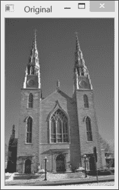

结果是一个二值映射图像，如以下截图所示，为了更好的观看效果已进行反转（即，我们使用了`cv::THRESH_BINARY_INV`而不是`cv::THRESH_BINARY`来获取检测到的角点为黑色）：

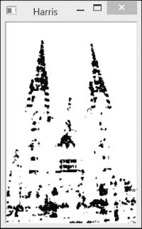

从前面的函数调用中，我们可以观察到这个兴趣点检测器需要几个参数（这些将在下一节中解释），这些参数可能会使其难以调整。此外，获得的角点图包含许多角像素簇，这与我们希望检测良好定位点的愿望相矛盾。因此，我们将尝试通过定义我们自己的类来检测 Harris 角来改进角检测方法。

该类封装了 Harris 参数及其默认值和相应的 getter 和 setter 方法（此处未显示）：

```py
class HarrisDetector {

  private:

     // 32-bit float image of corner strength
     cv::Mat cornerStrength;
     // 32-bit float image of thresholded corners
     cv::Mat cornerTh;
     // image of local maxima (internal)
     cv::Mat localMax;
     // size of neighborhood for derivatives smoothing
     int neighbourhood; 
     // aperture for gradient computation
     int aperture; 
     // Harris parameter
     double k;
     // maximum strength for threshold computation
     double maxStrength;
     // calculated threshold (internal)
     double threshold;
     // size of neighborhood for non-max suppression
     int nonMaxSize; 
     // kernel for non-max suppression
     cv::Mat kernel;

  public:

     HarrisDetector() : neighbourhood(3), aperture(3), 
                        k(0.01), maxStrength(0.0), 
                        threshold(0.01), nonMaxSize(3) {

        // create kernel used in non-maxima suppression
        setLocalMaxWindowSize(nonMaxSize);
     }
```

要在图像上检测 Harris 角，我们进行两个步骤。首先，计算每个像素的 Harris 值：

```py
     // Compute Harris corners
     void detect(const cv::Mat& image) {

        // Harris computation
        cv::cornerHarris(image,cornerStrength,
                neighbourhood,// neighborhood size
                aperture,     // aperture size
                k);           // Harris parameter

        // internal threshold computation 
        cv::minMaxLoc(cornerStrength,
             0&maxStrength);

        // local maxima detection
        cv::Mat dilated;  // temporary image
        cv::dilate(cornerStrength,dilated,cv::Mat());
        cv::compare(cornerStrength,dilated,
                    localMax,cv::CMP_EQ);
     }
```

接下来，根据指定的阈值值获取特征点。由于 Harris 的可能值范围取决于其参数的特定选择，因此阈值被指定为质量水平，该水平定义为图像中计算出的最大 Harris 值的分数：

```py
     // Get the corner map from the computed Harris values
     cv::Mat getCornerMap(double qualityLevel) {

        cv::Mat cornerMap;

        // thresholding the corner strength
        threshold= qualityLevel*maxStrength;
        cv::threshold(cornerStrength,cornerTh,
                      threshold,255,cv::THRESH_BINARY);

        // convert to 8-bit image
        cornerTh.convertTo(cornerMap,CV_8U);

        // non-maxima suppression
        cv::bitwise_and(cornerMap,localMax,cornerMap);

        return cornerMap;
     }
```

此方法返回检测到的特征的二值角点图。将 Harris 特征的检测分为两种方法，这使得我们可以使用不同的阈值（直到获得适当数量的特征点）来测试检测，而无需重复昂贵的计算。也可以以`std::vector`的`cv::Point`形式获取 Harris 特征：

```py
     // Get the feature points from the computed Harris values
     void getCorners(std::vector<cv::Point> &points, 
                     double qualityLevel) {

        // Get the corner map
        cv::Mat cornerMap= getCornerMap(qualityLevel);
        // Get the corners
        getCorners(points, cornerMap);
     }

     // Get the feature points from the computed corner map
     void getCorners(std::vector<cv::Point> &points, 
                     const cv::Mat& cornerMap) {

        // Iterate over the pixels to obtain all features
        for( int y = 0; y < cornerMap.rows; y++ ) {

           const uchar* rowPtr = cornerMap.ptr<uchar>(y);

           for( int x = 0; x < cornerMap.cols; x++ ) {

              // if it is a feature point
              if (rowPtr[x]) {

                 points.push_back(cv::Point(x,y));
              }
           } 
        }
     }
```

本类通过添加一个非极大值抑制步骤来提高 Harris 角检测，这一步骤将在下一节中解释。现在可以使用`cv::circle`函数在图像上绘制检测到的点，如下所示的方法演示：

```py
     // Draw circles at feature point locations on an image
     void drawOnImage(cv::Mat &image, 
        const std::vector<cv::Point> &points, 
        cv::Scalar color= cv::Scalar(255,255,255), 
        int radius=3, int thickness=1) {
        std::vector<cv::Point>::const_iterator it= 
                                       points.begin();

        // for all corners
        while (it!=points.end()) {

           // draw a circle at each corner location
           cv::circle(image,*it,radius,color,thickness);
           ++it;
        }
     }
```

使用此类，Harris 点的检测如下完成：

```py
   // Create Harris detector instance
   HarrisDetector harris;
   // Compute Harris values
   harris.detect(image);
   // Detect Harris corners
   std::vector<cv::Point> pts;
   harris.getCorners(pts,0.02);
   // Draw Harris corners
   harris.drawOnImage(image,pts);
```

这导致以下图像：

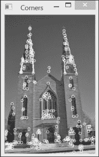

## 如何工作...

为了定义图像中角点的概念，Harris 特征检测器检查围绕潜在兴趣点的小窗口中方向强度的平均变化。如果我们考虑一个位移向量`(u,v)`，平均强度变化由以下公式给出：

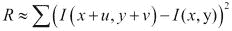

求和是在考虑的像素周围定义的邻域内进行的（这个邻域的大小对应于`cv::cornerHarris`函数的第三个参数）。然后可以计算所有可能方向上的平均强度变化，这导致了一个角点的定义：即在一个方向上平均变化高，而在另一个方向上也高的点。从这个定义出发，Harris 测试如下进行。我们首先获得最大平均强度变化的方向。接下来，我们检查正交方向上的平均强度变化是否也高。如果是这样，那么我们就有一个角点。

从数学上讲，这个条件可以通过使用前一个公式的泰勒展开来近似测试：

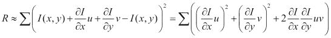

然后将其重写为矩阵形式：

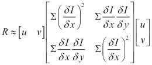

这个矩阵是一个协方差矩阵，它表征了所有方向上强度变化的速度。这个定义涉及到图像的第一导数，这些导数通常使用 Sobel 算子来计算。这是 OpenCV 实现的情况，它是函数的第四个参数，对应于用于计算 Sobel 滤波器的孔径。可以证明，协方差矩阵的两个特征值给出了最大平均强度变化和正交方向上的平均强度变化。然后，如果这两个特征值较低，我们处于一个相对均匀的区域。如果一个特征值较高而另一个较低，我们必须处于一个边缘。最后，如果两个特征值都较高，那么我们处于一个角落位置。因此，一个点要被接受为角落的条件是它必须在高于给定阈值的点上具有协方差矩阵的最小特征值。

哈里斯角算法的原始定义使用特征分解理论的一些性质，以避免显式计算特征值的成本。这些性质如下：

+   矩阵的特征值之积等于其行列式

+   矩阵的特征值之和等于矩阵的对角线之和（也称为矩阵的**迹**）

因此，我们可以通过计算以下分数来验证矩阵的特征值是否较高：

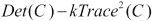

可以很容易地验证，只有当两个特征值都较高时，这个分数才会确实较高。这是`cv::cornerHarris`函数在每个像素位置计算的分数。`k`的值被指定为函数的第五个参数。确定这个参数的最佳值可能很困难。然而，在实践中，已经看到在`0.05`和`0.5`范围内的值通常给出良好的结果。

为了提高检测结果，前一小节中描述的类别增加了一个额外的非极大值抑制步骤。这里的目的是排除相邻的其他哈里斯角。因此，为了被接受，哈里斯角不仅必须有一个高于指定阈值的分数，而且它还必须是一个局部最大值。这个条件是通过使用一个简单的技巧来测试的，该技巧包括在`detect`方法中膨胀哈里斯分数的图像：

```py
        cv::dilate(cornerStrength,dilated,cv::Mat());
```

由于膨胀将每个像素值替换为定义的邻域中的最大值，唯一不会修改的点就是局部最大值。这正是以下等式测试所验证的：

```py
        cv::compare(cornerStrength,dilated, 
                    localMax,cv::CMP_EQ);
```

因此，`localMax`矩阵仅在局部极大值位置为真（即非零）。然后我们使用它在我们自己的`getCornerMap`方法中来抑制所有非极大特征（使用`cv::bitwise_and`函数）。

## 还有更多...

可以对原始的 Harris 角算法进行更多改进。本节描述了 OpenCV 中找到的另一个角检测器，它将 Harris 检测器扩展到使角在图像中分布得更均匀。正如我们将看到的，此操作符在 OpenCV 2 通用接口中为特征检测器提供了一个实现。

### 跟踪的良好特征

随着浮点处理器的出现，为了避免特征值分解而引入的数学简化变得可以忽略不计，因此，基于显式计算的特征值，可以基于 Harris 角进行检测。原则上，这种修改不应显著影响检测结果，但它避免了使用任意的`k`参数。请注意，存在两个函数允许您显式获取 Harris 协方差矩阵的特征值（和特征向量）；这些是`cv::cornerEigenValsAndVecs`和`cv::cornerMinEigenVal`。

第二种修改解决了特征点聚类的问题。事实上，尽管引入了局部极大值条件，但兴趣点在图像中往往分布不均，在高度纹理的位置出现集中。解决这个问题的一个方法是强制两个兴趣点之间保持最小距离。这可以通过以下算法实现。从具有最强 Harris 分数的点（即具有最大最小特征值）开始，只有当兴趣点位于已接受点至少给定距离之外时，才接受兴趣点。这个解决方案在 OpenCV 的`cv::goodFeaturesToTrack`函数中实现，因此得名，因为检测到的特征可以用作视觉跟踪应用中的良好起始集。其调用方式如下：

```py
   // Compute good features to track
   std::vector<cv::Point2f> corners;
   cv::goodFeaturesToTrack(image,  // input image
      corners, // corner image
      500,     // maximum number of corners to be returned
      0.01,    // quality level
      10);     // minimum allowed distance between points
```

除了质量级别阈值值和兴趣点之间可容忍的最小距离之外，该函数还使用可以返回的最大点数（这是可能的，因为点按强度顺序接受）。前面的函数调用产生以下结果：

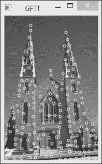

这种方法增加了检测的复杂性，因为它需要根据 Harris 分数对兴趣点进行排序，但它也明显改善了点在图像中的分布。请注意，此函数还包括一个可选标志，请求使用经典角评分定义（使用协方差矩阵的行列式和迹）来检测 Harris 角。

### 特征检测器的通用接口

OpenCV 2 为它的不同兴趣点检测器引入了一个通用接口。这个接口允许在同一个应用程序中轻松测试不同的兴趣点检测器。

接口定义了一个`cv::Keypoint`类，它封装了每个检测到的特征点的属性。对于哈里斯角，仅关键点的位置及其响应强度是相关的。*检测尺度不变特征*菜谱将讨论可以与关键点关联的其他属性。

`cv::FeatureDetector`抽象类基本上强制存在一个具有以下签名的`detect`操作：

```py
   void detect( const Mat& image, vector<KeyPoint>& keypoints,
                const Mat& mask=Mat() ) const;

   void detect( const vector<Mat>& images,
                vector<vector<KeyPoint> >& keypoints,
                const vector<Mat>& masks=
                                   vector<Mat>() ) const;
```

第二种方法允许在图像向量中检测兴趣点。该类还包括其他可以读取和写入检测到的点的文件的方法。

`cv::goodFeaturesToTrack`函数有一个名为`cv::GoodFeaturesToTrackDetector`的包装类，它继承自`cv::FeatureDetector`类。它可以像我们处理 Harris 角类那样使用，如下所示：

```py
   // vector of keypoints
   std::vector<cv::KeyPoint> keypoints;
   // Construction of the Good Feature to Track detector 
  cv::Ptr<cv::FeatureDetector> gftt= 
     new cv::GoodFeaturesToTrackDetector(
     500,  // maximum number of corners to be returned
     0.01, // quality level
     10);  // minimum allowed distance between points
  // point detection using FeatureDetector method
  gftt->detect(image,keypoints);
```

结果与之前获得的结果相同，因为包装器最终调用的函数是相同的。注意我们使用了 OpenCV 2 的智能指针类`(cv::Ptr)`，正如在第一章中解释的那样，*玩转图像*，当引用计数降至零时，会自动释放指向的对象。

## 参见

+   描述哈里斯算子的经典文章由 C. Harris 和 M.J. Stephens 撰写*，A combined corner and edge detector, Alvey Vision Conference, pp. 147–152, 1988*

+   J. Shi 和 C. Tomasi 的论文*Good features to track, Int. Conference on Computer Vision and Pattern Recognition, pp. 593-600, 1994*介绍了这些特征

+   K. Mikolajczyk 和 C. Schmid 的论文*Scale and Affine invariant interest point detectors, International Journal of Computer Vision, vol 60, no 1, pp. 63-86, 2004*提出了一种多尺度且仿射不变性的哈里斯算子

# 快速检测特征

哈里斯算子提出了基于两个垂直方向上强度变化率的角（或更一般地说，兴趣点）的正式数学定义。尽管这是一个合理的定义，但它需要计算图像导数，这是一个代价高昂的操作，尤其是考虑到兴趣点检测通常只是更复杂算法的第一步。

在这个菜谱中，我们介绍另一个特征点算子，称为**FAST**（**加速段测试特征**）。这个算子是专门设计用来快速检测图像中的兴趣点的；是否接受或拒绝一个关键点的决定仅基于少数像素的比较。

## 如何操作...

使用 OpenCV 2 通用接口进行特征点检测使得部署任何特征点检测器变得容易。本食谱中介绍的是 FAST 检测器。正如其名所示，它被设计得很快，以便计算以下内容：

```py
   // vector of keypoints
   std::vector<cv::KeyPoint> keypoints;
   // Construction of the Fast feature detector object 
   cv::Ptr<cv::FeatureDetector> fast= 
   new cv::FastFeatureDetector(
     40); // threshold for detection
   // feature point detection 
   fast->detect(image,keypoints);
```

注意，OpenCV 还提供了一个通用的函数来在图像上绘制关键点：

```py
   cv::drawKeypoints(image,    // original image
      keypoints,               // vector of keypoints
      image,                   // the output image
      cv::Scalar(255,255,255), // keypoint color
      cv::DrawMatchesFlags::DRAW_OVER_OUTIMG); //drawing flag
```

通过指定选择的绘制标志，关键点被绘制在输入图像上，从而产生以下输出结果：

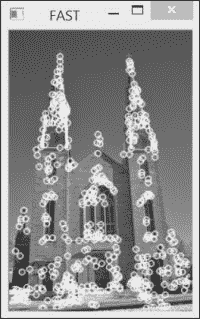

一个有趣的选项是为关键点颜色指定一个负值。在这种情况下，将为每个绘制的圆圈选择不同的随机颜色。

## 它是如何工作的...

与哈里斯点检测器的情况一样，FAST 特征算法源自对“角”的定义。这次，这个定义是基于假设特征点周围的图像强度。是否接受关键点的决定是通过检查以候选点为中心的像素圆来做出的。如果在圆周上找到一个连续点弧，其长度大于圆周长度的 3/4，并且其中所有像素与中心点的强度显著不同（都是较暗或较亮），则宣布存在一个关键点。

这是一个可以快速计算的简单测试。此外，在其原始公式中，该算法使用了一个额外的技巧来进一步加快处理速度。确实，如果我们首先测试圆周上相隔 90 度的四个点（例如，顶部、底部、右侧和左侧点），可以很容易地证明，为了满足之前表达的条件，至少有三个这些点必须与中心像素一样亮或一样暗。

如果不是这种情况，则可以立即拒绝该点，而无需检查圆周上的其他点。这是一个非常有效的测试，因为在实践中，大多数图像点都会被这个简单的 4 比较测试所拒绝。

在原则上，检查像素圆的半径可以是该方法的一个参数。然而，在实践中发现，半径为`3`既可以得到良好的结果，又具有高效率。因此，圆周上需要考虑的像素有`16`个，如下所示：

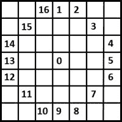

预测试中使用的四个点是**1**、**5**、**9**和**13**像素，并且需要连续的较暗或较亮的点的数量是**12**。然而，观察发现，通过将连续段长度减少到**9**，可以获得更好的检测角在图像间的重复性。这个变体通常被称为**FAST-9**角检测器，这正是 OpenCV 所使用的。请注意，存在一个`cv::FASTX`函数，它提出了 FAST 检测器的另一种变体。

要被认为是明显更暗或更亮，一个点的强度必须至少比中心像素的强度高出一个给定的量；这个值对应于函数调用中指定的阈值参数。这个阈值越大，检测到的角点就越少。

至于 Harris 特征，通常对已找到的角点执行非极大值抑制会更好。因此，需要定义一个角点强度度量。可以考虑几种替代度量，而保留的是以下度量。角点的强度由中心像素与识别出的连续弧上的像素之间的绝对差之和给出。请注意，该算法也可以通过直接函数调用获得：

```py
  cv::FAST(image,     // input image 
         keypoints,   // output vector of keypoints
         40,          // threshold
         false);      // non-max suppression? (or not)
```

然而，由于其灵活性，建议使用`cv::FeatureDetector`接口。

此算法导致非常快的兴趣点检测，因此在速度是关注点时，这是首选的特征。例如，在实时视觉跟踪或对象识别应用中，必须跟踪或匹配实时视频流中的多个点时，情况就是这样。

## 还有更多...

为了提高特征点的检测，OpenCV 提供了额外的工具。确实，有多个类适配器可用，以便更好地控制关键点的提取方式。

### 适应性特征检测

如果你希望更好地控制检测到的点的数量，有一个特殊的`cv::FeatureDetector`类的子类，称为`cv::DynamicAdaptedFeatureDetector`，可供使用。这允许你指定可以检测到的兴趣点数量的区间。在 FAST 特征检测器的情况下，使用方法如下：

```py
  cv::DynamicAdaptedFeatureDetector fastD(
    new cv::FastAdjuster(40), // the feature detector
    150,   // min number of features
    200,   // max number of features
    50);   // max number of iterations
  fastD.detect(image,keypoints); // detect points
```

然后将迭代检测兴趣点。每次迭代后，都会检查检测到的点的数量，并根据需要调整检测器的阈值以产生更多或更少的点；这个过程会重复，直到检测到的点的数量符合指定的区间。指定一个最大迭代次数，以避免该方法在多次检测上花费太多时间。为了以通用方式实现此方法，所使用的`cv::FeatureDetector`类必须实现`cv::AdjusterAdapter`接口。这个类包括一个`tooFew`方法和一个`tooMany`方法，这两个方法都修改检测器的内部阈值以产生更多或更少的关键点。还有一个`good`谓词方法，如果检测器的阈值还可以调整，则返回`true`。使用`cv::DynamicAdaptedFeatureDetector`类可以是一个获得适当数量特征点的良好策略；然而，你必须理解，为了这个好处，你必须付出性能代价。此外，没有保证你确实能在指定的迭代次数内获得所需数量的特征。

你可能已经注意到，我们传递了一个参数，即动态分配对象的地址，以指定适配器类将使用的特征检测器。你可能想知道是否需要在某个时候释放分配的内存以避免内存泄漏。答案是无需释放，这是因为指针被转移到`cv::Ptr<FeatureDetector>`参数，该参数会自动释放指向的对象。

### 网格适应特征检测

第二个有用的类适配器是`cv::GridAdaptedFeatureDetector`类。正如其名所示，它允许你在图像上定义一个网格。然后，这个网格的每个单元格都被限制只能包含最大数量的元素。这里的想法是将检测到的关键点集在图像上以更好的方式分布。在检测图像中的关键点时，确实常见到在特定纹理区域有大量兴趣点的集中。例如，在教堂图像的两个塔上，检测到了一个非常密集的 FAST 点集。这个类适配器可以这样使用：

```py
  cv::GridAdaptedFeatureDetector fastG(
    new cv::FastFeatureDetector(10), // the feature detector
    1200,  // max total number of keypoints
    5,     // number of rows in grid
    2);    // number of cols in grid
  fastG.detect(image,keypoints);
```

类适配器简单地通过使用提供的`cv::FeatureDetector`对象在每个单独的单元格上检测特征点来继续进行。还指定了最大点数。为了不超过指定的最大值，只保留每个单元格中最强的点。

### 金字塔适应特征检测

`cv::PyramidAdaptedFeatureDetector`适配器通过在图像金字塔上应用特征检测器来继续进行。结果被组合在关键点的输出向量中。这可以通过以下方式实现：

```py
  cv::PyramidAdaptedFeatureDetector fastP(
    new cv::FastFeatureDetector(60), // the feature detector
    3);    // number of levels in the pyramid
  fastP.detect(image,keypoints);
```

每个点的坐标都指定在原始图像坐标中。此外，`cv::Keypoint`类的特殊`size`属性被设置为，在原始分辨率的一半处检测到的点被赋予的尺寸是原始图像中检测到的点尺寸的两倍。`cv::drawKeypoints`函数中有一个特殊标志，它将以与关键点`size`属性相等的半径绘制关键点。

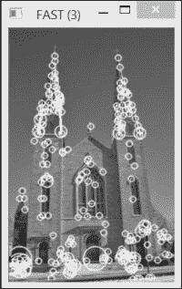

## 参考阅读

+   E. Rosten 和 T. Drummond*的论文《高速角点检测中的机器学习》，载于欧洲计算机视觉会议，第 430-443 页，2006*，详细描述了 FAST 特征算法及其变体。

# 检测尺度不变特征

特征检测的视角不变性在本章的引言中被提出作为一个重要概念。虽然方向不变性，即即使图像旋转也能检测到相同点的能力，已经被迄今为止提出的简单特征点检测器相对较好地处理，但尺度变化的不变性更难实现。为了解决这个问题，计算机视觉中引入了尺度不变特征的概念。这里的想法是，无论物体在何种尺度下被拍摄，都要保持关键点的检测一致性，并且每个检测到的特征点都要关联一个尺度因子。理想情况下，对于在两张不同图像上以不同尺度特征化的同一物体点，两个计算尺度因子的比率应该对应它们各自尺度的比率。近年来，已经提出了几种尺度不变特征，本菜谱介绍了其中之一，即**SURF**特征。SURF 代表加速鲁棒特征，正如我们将看到的，它们不仅是尺度不变特征，而且计算效率也非常高。

## 如何做...

SURF 特征检测器在 OpenCV 中通过`cv::SURF`函数实现。也可以通过`cv::FeatureDetector`使用它，如下所示：

```py
  // Construct the SURF feature detector object
  cv::Ptr<cv::FeatureDetector> detector = new cv::SURF(2000.); // threshold
  // Detect the SURF features
  detector->detect(image,keypoints);
```

要绘制这些特征，我们再次使用带有`DRAW_RICH_KEYPOINTS`标志的`cv::drawKeypoints` OpenCV 函数，这样我们就可以可视化相关的尺度因子：

```py
   // Draw the keypoints with scale and orientation information
   cv::drawKeypoints(image,      // original image
      keypoints,                 // vector of keypoints
      featureImage,              // the resulting image
      cv::Scalar(255,255,255),   // color of the points
      cv::DrawMatchesFlags::DRAW_RICH_KEYPOINTS); //flag
```

检测到特征的结果图像如下：

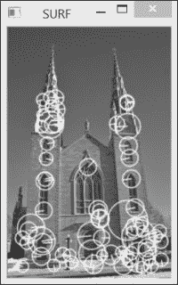

如前一个菜谱中所述，使用`DRAW_RICH_KEYPOINTS`标志得到的关键点圆圈的大小与每个特征的计算尺度成正比。SURF 算法还与每个特征关联一个方向，以使它们对旋转不变。这个方向通过每个绘制圆圈内的辐射线表示。

如果我们以不同的尺度拍摄同一物体的另一张照片，特征检测的结果如下：

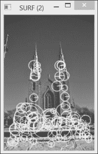

通过仔细观察两张图像上检测到的关键点，可以看出对应圆圈大小的变化通常与尺度变化成正比。例如，考虑教堂右上角窗户的底部部分。在两张图像中，都检测到了该位置的 SURF 特征，并且两个对应的不同大小的圆圈包含相同的视觉元素。当然，并非所有特征都如此，但正如我们在下一章将要发现的，重复率足够高，可以保证两张图像之间良好的匹配。

## 它是如何工作的...

在第六章，“图像滤波”中，我们了解到可以使用高斯滤波器估计图像的导数。这些滤波器使用一个`σ`参数，该参数定义了核的孔径（大小）。正如我们所见，这个`σ`参数对应于构建滤波器使用的高斯函数的方差，并且它隐式地定义了导数评估的尺度。确实，具有较大`σ`值的滤波器会平滑掉图像的更细的细节。这就是为什么我们可以说它在一个更粗的尺度上操作。

现在，如果我们使用高斯滤波器在不同尺度上计算给定图像点的拉普拉斯算子，那么会得到不同的值。观察不同尺度因子下滤波器响应的变化，我们得到一条曲线，最终在`σ`值处达到最大值。如果我们从两个不同尺度拍摄的同物图像中提取这个最大值，这两个`σ`最大值之比将对应于拍摄图像的尺度比。这个重要的观察结果是尺度不变特征提取过程的核心。也就是说，尺度不变特征应该在空间空间（在图像中）和尺度空间（从不同尺度应用导数滤波器获得）中的局部最大值中被检测到。

SURF 通过以下步骤实现这一想法。首先，为了检测特征，计算每个像素处的 Hessian 矩阵。这个矩阵衡量函数的局部曲率，定义为以下：

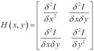

这个矩阵的行列式给出了这个曲率的强度。因此，定义角点为具有高局部曲率（即，在多个方向上变化很大）的图像点。由于它由二阶导数组成，这个矩阵可以使用不同尺度的高斯拉普拉斯核来计算，例如`σ`。因此，Hessian 成为一个关于三个变量的函数，即`H(x,y,σ)`。因此，当这个 Hessian 的行列式在空间和尺度空间中都达到局部最大值时（即，需要进行`3x3x3`非最大值抑制），就宣布存在一个尺度不变特征。请注意，为了被视为一个有效点，这个行列式必须具有由`cv::SURF`类的构造函数的第一个参数指定的最小值。

然而，在不同尺度上计算所有这些导数在计算上代价高昂。SURF 算法的目标是尽可能使这个过程高效。这是通过使用仅涉及少量整数加法的近似高斯核来实现的。这些核具有以下结构：

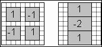

左侧的核心用于估计混合的二阶导数，而右侧的核心用于估计垂直方向上的二阶导数。这个二阶核心的旋转版本用于估计水平方向上的二阶导数。最小的核心大小为`9x9`像素，对应于`σ≈1.2`。为了获得尺度空间表示，依次应用不同大小的核心。可以由 SURF 类的附加参数指定应用的确切滤波器数量。默认情况下，使用 12 种不同大小的核心（最大到`99x99`）。请注意，使用积分图像保证了每个滤波器每个波峰内部的和可以通过仅使用三个与滤波器大小无关的加法来计算。

一旦确定了局部极大值，通过在尺度和图像空间中进行插值，就可以获得每个检测到的兴趣点的精确位置。结果是具有亚像素精度的特征点集，并且与一个尺度值相关联。

## 更多...

SURF 算法被开发为一个效率更高的变体，称为另一个著名的尺度不变特征检测器**SIFT**（**尺度不变特征变换**）。

### SIFT 特征检测算法

SIFT 同样在图像和尺度空间中检测特征作为局部极大值，但使用拉普拉斯滤波器响应而不是海森矩阵。这个拉普拉斯在不同的尺度（即`σ`的增大值）上使用高斯滤波器的差值来计算，如第六章中所述，*过滤图像*。为了提高效率，每次`σ`的值加倍时，图像的大小就减少两倍。每个金字塔层对应一个**八度**，每个尺度是一个**层**。通常每个八度有三个层。

下图展示了两个八度的金字塔，其中第一个八度的四个高斯滤波图像产生了三个 DoG 层：

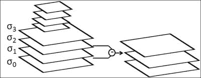

OpenCV 有一个类可以检测这些特征，其调用方式与 SURF 类似：

```py
  // Construct the SIFT feature detector object
  detector = new cv::SIFT();
  // Detect the SIFT features
  detector->detect(image,keypoints);
```

在这里，我们使用所有默认参数来构建检测器，但你也可以指定所需的 SIFT 点数（保留最强的点），每个八度的层数，以及`σ`的初始值。结果是类似于使用 SURF 获得的结果：

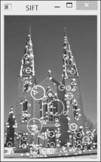

然而，由于特征点的计算基于浮点核心，SIFT 在空间和尺度上的特征定位方面通常被认为更准确。同样地，它也更耗费计算资源，尽管这种相对效率取决于每个特定的实现。

最后一点，你可能已经注意到，SURF 和 SIFT 类被放置在 OpenCV 分布的非自由软件包中。这是因为这些算法已经获得专利，因此，它们在商业应用中的使用可能受到许可协议的约束。

## 参见

+   第六章中的*计算图像拉普拉斯算子*配方，*过滤图像*，为你提供了更多关于高斯拉普拉斯算子和高斯差分使用的细节

+   第九章中的*描述局部强度模式*配方，*描述和匹配兴趣点*，解释了如何描述这些尺度不变特征以实现鲁棒的图像匹配

+   H. Bay, A. Ess, T. Tuytelaars 和 L. Van Gool 在*计算机视觉与图像理解，第 110 卷，第 3 期，第 346-359 页，2008 年*上发表的*SURF：加速鲁棒特征*文章描述了 SURF 特征算法

+   D. Lowe 在*国际计算机视觉杂志，第 60 卷，第 2 期，2004 年，第 91-110 页*上发表的*从尺度不变特征中提取独特图像特征*的开创性工作描述了 SIFT 算法

# 在多个尺度上检测 FAST 特征

FAST 被引入作为一种快速检测图像中关键点的方法。与 SURF 和 SIFT 相比，重点是设计尺度不变特征。最近，新引入了兴趣点检测器，旨在实现快速检测和尺度变化的不变性。本配方介绍了**二值鲁棒不变可缩放关键点**（**BRISK**）检测器。它基于我们在本章前面的配方中描述的 FAST 特征检测器。另一种称为**ORB**（**方向性 FAST 和旋转 BRIEF**）的检测器也将在本配方的末尾讨论。这两个特征点检测器构成了在需要快速且可靠的图像匹配时的优秀解决方案。当它们与相关的二进制描述符一起使用时，效率尤其高，这将在第九章，*描述和匹配兴趣点*中讨论。

## 如何做...

按照我们在前面的配方中所做的，使用 BRISK 检测关键点的过程使用了`cv::FeatureDetector`抽象类。我们首先创建检测器的实例，然后在图像上调用`detect`方法：

```py
  // Construct the BRISK feature detector object
  detector = new cv::BRISK();
  // Detect the BRISK features
  detector->detect(image,keypoints);
```

图像结果显示了在多个尺度上检测到的关键点：

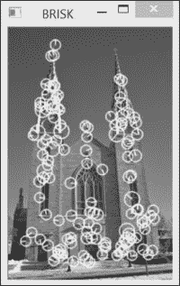

## 它是如何工作的...

BRISK 不仅是一个特征点检测器；该方法还包括描述每个检测到的关键点邻域的程序。这一第二个方面将是下一章的主题。在这里，我们描述了如何使用 BRISK 在多个尺度上快速检测关键点。

为了在不同尺度上检测兴趣点，该方法首先通过两个下采样过程构建一个图像金字塔。第一个过程从原始图像大小开始，并在每一层（或八分音符）上将它减半。其次，通过将原始图像以 1.5 的因子下采样，在中间层之间创建层，然后通过连续的半采样从这个减少的图像生成额外的层。

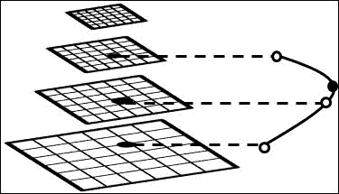

然后将 FAST 特征检测器应用于这个金字塔的所有图像。关键点提取基于与 SIFT 相似的标准。首先，一个可接受的兴趣点在将其强度与其八个空间邻居之一比较时必须是局部最大值。如果是这样，该点随后将与上层和下层相邻点的分数进行比较；如果其分数在尺度上更高，则它被接受为兴趣点。BRISK 的一个关键方面在于金字塔的不同层具有不同的分辨率。该方法需要在尺度和空间上进行插值，以精确地定位每个关键点。这种插值基于 FAST 关键点分数。在空间上，插值在 3 x 3 邻域内进行。在尺度上，它通过沿尺度轴通过当前点及其上层和下层两个相邻局部关键点拟合一个一维抛物线来计算；这种尺度上的关键点定位在先前的图中进行了说明。因此，即使 FAST 关键点检测是在离散图像尺度上进行的，与每个关键点相关联的检测尺度也是连续值。

`cv::BRISK` 类提出了两个可选参数来控制关键点的检测。第一个参数是一个阈值值，它接受 FAST 关键点，第二个参数是将在图像金字塔中生成的八分音符的数量：

```py
  // Construct another BRISK feature detector object
  detector = new cv::BRISK(
    20,  // threshold for FAST points to be accepted
    5);  // number of octaves
```

## 还有更多...

BRISK 并不是 OpenCV 中唯一被提出的多尺度快速检测器。ORB 特征检测器也能进行高效的关键点检测。

### ORB 特征检测算法

ORB 代表 **Oriented FAST and Rotated BRIEF**。这个缩写的第一部分指的是关键点检测部分，而第二部分指的是 ORB 提出的描述符。在这里，我们主要关注检测方法；描述符将在下一章中介绍。

与 BRISK 类似，ORB 首先创建一个图像金字塔。这个金字塔由多个层组成，每一层是前一层通过一定比例因子（通常是`8`个比例和`1.2`的比例因子减小；这些是`cv::ORB`函数中的参数）下采样得到的。然后接受得分最高的`N`个关键点，其中关键点得分由本章第一道菜中定义的 Harris *角点*度量来定义（该方法作者发现 Harris 得分是一个更可靠的度量）。

ORB 检测器的原始特点在于每个检测到的兴趣点都与一个方向相关联。正如我们将在下一章中看到的，这些信息将有助于对齐在不同图像中检测到的关键点的描述符。在第七章的《计算组件形状描述符》菜谱中，我们介绍了图像矩的概念，特别是我们展示了如何从组件的前三个矩计算其质心。ORB 建议我们使用围绕关键点的圆形邻域的质心的方向。由于，根据定义，FAST 关键点总是有一个偏心的质心，连接中心点和质心的线的角度总是定义良好的。

ORB 特征检测如下：

```py
  // Construct the ORB feature detector object
  detector = new cv::ORB(200, // total number of keypoints
                        1.2, // scale factor between layers
                   8);  // number of layers in pyramid
  // Detect the ORB features
  detector->detect(image,keypoints);
```

此调用产生以下结果：

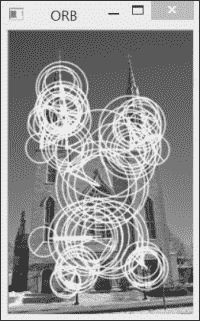

如所见，由于关键点在每个金字塔层上独立检测，检测器倾向于在不同尺度上重复检测相同的特征点。

## 参见

+   第九章的《使用二进制特征描述关键点》菜谱解释了如何使用简单的二进制描述符进行这些特征的效率鲁棒匹配

+   文章《BRISK：基于二值鲁棒不变可伸缩关键点的算法》由 S. Leutenegger、M. Chli 和 R. Y. Siegwart 在 2011 年的《IEEE 国际计算机视觉会议，第 2448-2555 页》中描述了 BRISK 特征算法

+   文章《ORB：SIFT 或 SURF 的有效替代方案》由 E. Rublee、V. Rabaud、K. Konolige 和 G. Bradski 在 2011 年的《IEEE 国际计算机视觉会议，第 2564-2571 页》中描述了 ORB 特征算法
