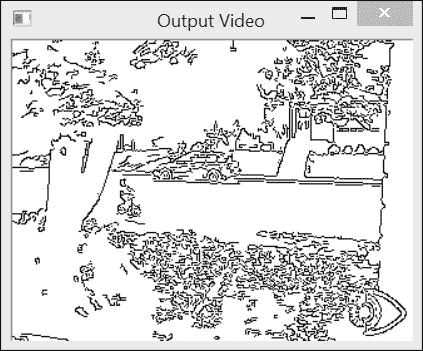
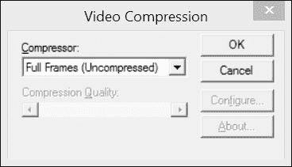
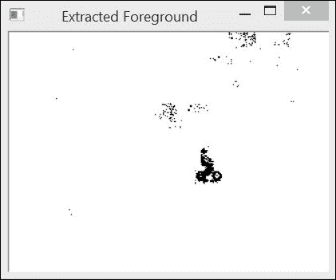

# 第十一章：处理视频序列

在本章中，我们将涵盖以下食谱：

+   读取视频序列

+   处理视频帧

+   写入视频序列

+   在视频中跟踪特征点

+   从视频中提取前景对象

# 简介

视频信号构成了丰富的视觉信息来源。它们由一系列图像组成，称为**帧**，这些图像以固定的时间间隔（指定为**帧率**，通常以每秒帧数表示）拍摄，并显示一个动态场景。随着强大计算机的出现，现在可以在视频序列上执行高级视觉分析——有时接近或甚至超过实际视频帧率。本章将向您展示如何读取、处理和存储视频序列。

我们将看到，一旦提取了视频序列的各个帧，本书中介绍的不同图像处理函数可以应用于每一帧。此外，我们还将探讨一些执行视频序列时间分析的算法，比较相邻帧以跟踪对象，或随时间累积图像统计信息以提取前景对象。

# 读取视频序列

为了处理视频序列，我们需要能够读取其每一帧。OpenCV 提供了一个易于使用的框架，可以帮助我们从视频文件或甚至从 USB 或 IP 摄像头中提取帧。本食谱将展示如何使用它。

## 如何操作...

基本上，为了读取视频序列的帧，你需要创建一个`cv::VideoCapture`类的实例。然后创建一个循环来提取和读取每个视频帧。以下是一个基本的`main`函数，用于显示视频序列的帧：

```py
int main()
{
  // Open the video file
  cv::VideoCapture capture("bike.avi");
  // check if video successfully opened
  if (!capture.isOpened())
    return 1;

  // Get the frame rate
  double rate= capture.get(CV_CAP_PROP_FPS);

  bool stop(false);
  cv::Mat frame; // current video frame
  cv::namedWindow("Extracted Frame");

  // Delay between each frame in ms
  // corresponds to video frame rate
  int delay= 1000/rate;

  // for all frames in video
  while (!stop) {

    // read next frame if any
    if (!capture.read(frame))
      break;

    cv::imshow("Extracted Frame",frame);

    // introduce a delay
    // or press key to stop
    if (cv::waitKey(delay)>=0)
      stop= true;
  }

  // Close the video file.
  // Not required since called by destructor
  capture.release();
  return 0;
}
```

将出现一个窗口，视频将在其中播放，如下面的截图所示：


## 它是如何工作的...

要打开视频，你只需指定视频文件名。这可以通过在`cv::VideoCapture`对象的构造函数中提供文件名来实现。如果已经创建了`cv::VideoCapture 对象`，也可以使用 open 方法。一旦视频成功打开（可以通过`isOpened`方法进行验证），就可以开始帧提取。还可以使用`cv::VideoCapture`对象的 get 方法及其适当的标志来查询与视频文件关联的信息。在先前的示例中，我们使用`CV_CAP_PROP_FPS`标志获取了帧率。由于它是一个通用函数，它总是返回一个双精度浮点数，即使在某些情况下预期返回其他类型。例如，视频文件中的总帧数（作为一个整数）可以通过以下方式获取：

```py
long t= static_cast<long>(
              capture.get(CV_CAP_PROP_FRAME_COUNT));
```

查看 OpenCV 文档中可用的不同标志，以了解可以从视频中获取哪些信息。

还有一个 `set` 方法，允许您向 `cv::VideoCapture` 实例输入参数。例如，您可以使用 `CV_CAP_PROP_POS_FRAMES` 标志请求移动到特定的帧：

```py
// goto frame 100
double position= 100.0; 
capture.set(CV_CAP_PROP_POS_FRAMES, position);
```

您还可以使用 `CV_CAP_PROP_POS_MSEC` 指定毫秒位置，或者使用 `CV_CAP_PROP_POS_AVI_RATIO` 指定视频内部的相对位置（0.0 对应视频的开始，1.0 对应视频的结束）。如果请求的参数设置成功，该方法返回 `true`。请注意，获取或设置特定视频参数的可能性很大程度上取决于用于压缩和存储视频序列的编解码器。如果您在某些参数上失败，那可能仅仅是由于您使用的特定编解码器。

一旦成功打开捕获的视频，可以通过重复调用 `read` 方法来按顺序获取帧，就像我们在上一节示例中所做的那样。也可以等价地调用重载的读取操作符：

```py
capture >> frame;
```

还可以调用两个基本方法：

```py
capture.grab();
capture.retrieve(frame);
```

还要注意，在我们的示例中，我们如何在显示每一帧时引入延迟。这是通过使用 `cv::waitKey` 函数实现的。在这里，我们设置延迟为一个与输入视频帧率相对应的值（如果 `fps` 是每秒的帧数，那么两个帧之间的延迟（以毫秒为单位）是 `1000/fps`）。显然，您可以更改此值以以较慢或较快的速度显示视频。然而，如果您打算显示视频帧，如果您想确保窗口有足够的时间刷新（因为这是一个低优先级的过程，如果 CPU 太忙，它将永远不会刷新），那么插入这样的延迟是很重要的。`cv::waitKey` 函数还允许我们通过按任意键来中断读取过程。在这种情况下，函数返回按下的键的 ASCII 码。请注意，如果指定给 `cv::waitKey` 函数的延迟是 `0`，那么它将无限期地等待用户按下一个键。这对于某人想要通过逐帧检查结果来跟踪过程非常有用。

最后一条语句调用 `release` 方法，这将关闭视频文件。然而，这个调用不是必需的，因为 `release` 也会在 `cv::VideoCapture` 析构函数中被调用。

重要的是要注意，为了打开指定的视频文件，您的计算机必须安装相应的编解码器；否则，`cv::VideoCapture` 将无法解码输入文件。通常情况下，如果您能够使用机器上的视频播放器（如 Windows Media Player）打开视频文件，那么 OpenCV 也应该能够读取此文件。

## 还有更多...

您还可以读取连接到计算机的摄像头（例如 USB 摄像头）的视频流捕获。在这种情况下，您只需将 ID 号（一个整数）指定给`open`函数，而不是文件名。将 ID 指定为`0`将打开默认安装的摄像头。在这种情况下，`cv::waitKey`函数停止处理的作用变得至关重要，因为来自摄像头的视频流将被无限读取。

最后，也可以从网络加载视频。在这种情况下，您只需提供正确的地址，例如：

```py
  cv::VideoCapture capture("http://www.laganiere.name/bike.avi");
```

## 参见

+   本章中关于*写入视频序列*的菜谱提供了更多关于视频编解码器的信息。

+   [`ffmpeg.org/`](http://ffmpeg.org/) 网站提供了一个完整的开源和跨平台解决方案，用于音频/视频的读取、录制、转换和流式传输。处理视频文件的 OpenCV 类是建立在上述库之上的。

# 处理视频帧

在这个菜谱中，我们的目标是将一些处理函数应用于视频序列的每一帧。我们将通过封装 OpenCV 视频捕获框架到我们自己的类中来实现这一点。除此之外，此类将允许我们指定一个函数，每次提取新帧时都会调用该函数。

## 如何操作...

我们想要的是能够指定一个处理函数（回调函数），该函数将为视频序列的每一帧调用。此函数可以定义为接收一个`cv::Mat`实例并输出一个处理后的帧。因此，在我们的框架中，处理函数必须具有以下签名才能成为有效的回调：

```py
void processFrame(cv::Mat& img, cv::Mat& out);
```

作为此类处理函数的示例，考虑以下简单的函数，该函数计算输入图像的 Canny 边缘：

```py
void canny(cv::Mat& img, cv::Mat& out) {
  // Convert to gray
  if (img.channels()==3)
    cv::cvtColor(img,out,CV_BGR2GRAY);
  // Compute Canny edges
  cv::Canny(out,out,100,200);
  // Invert the image
  cv::threshold(out,out,128,255,cv::THRESH_BINARY_INV);
}
```

我们的`VideoProcessor`类封装了视频处理任务的各个方面。使用此类，步骤将是创建一个类实例，指定一个输入视频文件，将其回调函数附加到它，然后开始处理。程序上，这些步骤是通过我们提出的类完成的，如下所示：

```py
  // Create instance
  VideoProcessor processor;
  // Open video file
  processor.setInput("bike.avi");
  // Declare a window to display the video
  processor.displayInput("Current Frame");
  processor.displayOutput("Output Frame");
  // Play the video at the original frame rate
  processor.setDelay(1000./processor.getFrameRate());
  // Set the frame processor callback function
  processor.setFrameProcessor(canny);
  // Start the process
  processor.run();
```

如果运行此代码，则两个窗口将以原始帧率播放输入视频和输出结果（这是由`setDelay`方法引入的延迟的结果）。例如，考虑前一个菜谱中显示的输入视频的帧，输出窗口将如下所示：



## 它是如何工作的...

如我们在其他菜谱中所做的那样，我们的目标是创建一个封装视频处理算法常见功能的类。正如预期的那样，该类包括几个成员变量，用于控制视频帧处理的各个方面：

```py
class VideoProcessor {

  private:

  // the OpenCV video capture object
  cv::VideoCapture capture;
  // the callback function to be called 
  // for the processing of each frame
  void (*process)(cv::Mat&, cv::Mat&);
  // a bool to determine if the 
  // process callback will be called
  bool callIt;
  // Input display window name
  std::string windowNameInput;
  // Output display window name
  std::string windowNameOutput;
  // delay between each frame processing
  int delay;
  // number of processed frames 
  long fnumber;
  // stop at this frame number
  long frameToStop;
  // to stop the processing
  bool stop;
```

第一个成员变量是`cv::VideoCapture`对象。第二个属性是`process`函数指针，它将指向回调函数。此函数可以使用相应的 setter 方法指定：

```py
    // set the callback function that 
    // will be called for each frame
    void setFrameProcessor(
      void (*frameProcessingCallback)
        cv::Mat&, cv::Mat&)) {

          process= frameProcessingCallback;
    }
```

以下方法打开视频文件：

```py
    // set the name of the video file
    bool setInput(std::string filename) {

      fnumber= 0;
      // In case a resource was already 
      // associated with the VideoCapture instance
      capture.release();
      // Open the video file
      return capture.open(filename);
   }
```

通常，在处理帧时显示帧是很有趣的。因此，使用了两个方法来创建显示窗口：

```py
    // to display the input frames
    void displayInput(std::string wn) {

      windowNameInput= wn;
      cv::namedWindow(windowNameInput);
    }

    // to display the processed frames
    void displayOutput(std::string wn) {
      windowNameOutput= wn;
      cv::namedWindow(windowNameOutput);
    }
```

主方法，名为 `run`，包含帧提取循环：

```py
    // to grab (and process) the frames of the sequence
    void run() {

      // current frame
      cv::Mat frame;
      // output frame
      cv::Mat output;

      // if no capture device has been set
      if (!isOpened())
        return;

      stop= false;

      while (!isStopped()) {

        // read next frame if any
        if (!readNextFrame(frame))
          break;

        // display input frame
        if (windowNameInput.length()!=0) 
          cv::imshow(windowNameInput,frame);

        // calling the process function
        if (callIt) {

          // process the frame
          process(frame, output);
          // increment frame number
          fnumber++;

          } else { // no processing
            output= frame;
          }

          // display output frame
          if (windowNameOutput.length()!=0) 
            cv::imshow(windowNameOutput,output);
          // introduce a delay
          if (delay>=0 && cv::waitKey(delay)>=0)
            stopIt();

          // check if we should stop
          if (frameToStop>=0 && 
            getFrameNumber()==frameToStop)
              stopIt();
        }
      }

      // Stop the processing
      void stopIt() {

        stop= true;
      }

      // Is the process stopped?
      bool isStopped() {

        return stop;
      }

      // Is a capture device opened?
      bool isOpened() {

        capture.isOpened();
      }

      // set a delay between each frame
      // 0 means wait at each frame
      // negative means no delay
      void setDelay(int d) {

        delay= d;
      }
```

此方法使用一个 `private` 方法来读取帧：

```py
    // to get the next frame 
    // could be: video file or camera
    bool readNextFrame(cv::Mat& frame) {

      return capture.read(frame);
    }
```

`run` 方法首先调用 `cv::VideoCapture` OpenCV 类的 `read` 方法。然后执行一系列操作，但在调用每个操作之前，都会进行检查以确定是否已请求执行。只有当指定了输入窗口名称（使用 `displayInput` 方法）时，才会显示输入窗口；只有当指定了回调函数（使用 `setFrameProcessor`）时，才会调用该函数。只有当定义了输出窗口名称（使用 `displayOutput`）时，才会显示输出窗口；只有当指定了延迟（使用 `setDelay` 方法）时，才会引入延迟。最后，如果定义了停止帧（使用 `stopAtFrameNo`），则会检查当前帧号。

可能还希望简单地打开并播放视频文件（不调用回调函数）。因此，我们有两个方法来指定是否调用回调函数：

```py
    // process callback to be called
    void callProcess() {

      callIt= true;
    }

    // do not call process callback
    void dontCallProcess() {

      callIt= false;
    }
```

最后，该类还提供了在特定帧号处停止的可能性：

```py
    void stopAtFrameNo(long frame) {

      frameToStop= frame;
    }

    // return the frame number of the next frame
    long getFrameNumber() {

      // get info of from the capture device
      long fnumber= static_cast<long>(
        capture.get(CV_CAP_PROP_POS_FRAMES));
      return fnumber; 
    }
```

该类还包含了一些 getter 和 setter 方法，它们基本上只是 `cv::VideoCapture` 框架的通用 `set` 和 `get` 方法的包装器。

## 还有更多...

我们的 `VideoProcessor` 类旨在简化视频处理模块的部署。对此类可以进行的额外改进很少。

### 处理一系列图像

有时，输入序列由一系列单独存储在各自文件中的图像组成。我们的类可以很容易地修改以适应此类输入。你只需要添加一个成员变量，它将保存一个包含图像文件名的向量及其对应的迭代器：

```py
    // vector of image filename to be used as input
    std::vector<std::string> images; 
    // image vector iterator
    std::vector<std::string>::const_iterator itImg;
```

使用新的 `setInput` 方法来指定要读取的文件名：

```py
    // set the vector of input images
    bool setInput(const std::vector<std::string>& imgs) {

      fnumber= 0;
      // In case a resource was already 
      // associated with the VideoCapture instance
      capture.release();

      // the input will be this vector of images
      images= imgs;
      itImg= images.begin();

      return true;
    }
```

`isOpened` 方法变为以下内容：

```py
    // Is a capture device opened?
    bool isOpened() {

      return capture.isOpened() || !images.empty();
    }
```

需要修改的最后一个方法是私有的 `readNextFrame` 方法，它将根据指定的输入从视频或文件名向量中读取。测试是如果图像文件名向量不为空，则说明输入是图像序列。使用视频文件名调用 `setInput` 清除此向量：

```py
    // to get the next frame 
    // could be: video file; camera; vector of images
    bool readNextFrame(cv::Mat& frame) {

      if (images.size()==0)
        return capture.read(frame);

      else {

          if (itImg != images.end()) {

            frame= cv::imread(*itImg);
            itImg++;
            return frame.data != 0;

          } else

            return false;
      }
    }
```

### 使用帧处理器类

在面向对象的环境中，使用帧处理类而不是帧处理函数可能更有意义。确实，一个类会给程序员在视频处理算法定义上提供更多的灵活性。因此，我们可以定义一个接口，任何希望被用于 `VideoProcessor` 内部的类都需要实现：

```py
// The frame processor interface
class FrameProcessor {

  public:
  // processing method
  virtual void process(cv:: Mat &input, cv:: Mat &output)= 0;
};
```

一个 setter 方法允许您将一个`FrameProcessor`实例输入到`VideoProcessor`框架中，并将其分配给定义为`FrameProcessor`对象指针的添加成员变量`frameProcessor`：

```py
    // set the instance of the class that 
    // implements the FrameProcessor interface
    void setFrameProcessor(FrameProcessor* frameProcessorPtr)
    {

      // invalidate callback function
      process= 0;
      // this is the frame processor instance 
      // that will be called
      frameProcessor= frameProcessorPtr;
      callProcess();
    }
```

当指定帧处理器类实例时，它将使之前可能设置的任何帧处理函数无效。如果指定了帧处理函数，则显然也是如此。`run`方法的`while`循环被修改以考虑这种修改：

```py
        while (!isStopped()) {

          // read next frame if any
          if (!readNextFrame(frame))
            break;

          // display input frame
          if (windowNameInput.length()!=0) 
            cv::imshow(windowNameInput,frame);

          // ** calling the process function or method **
          if (callIt) {

            // process the frame
            if (process) // if call back function
              process(frame, output);
            else if (frameProcessor) 
              // if class interface instance
              frameProcessor->process(frame,output);
            // increment frame number
            fnumber++;
          } else {

            output= frame;
          }
           // display output frame
           if (windowNameOutput.length()!=0)
             cv::imshow(windowNameOutput,output);
           // introduce a delay
           if (delay>=0 && cv::waitKey(delay)>=0)
             stopIt();
           // check if we should stop
           if (frameToStop>=0 && getFrameNumber()==frameToStop)
             stopIt();
        }
```

## 参见

+   本章中关于*视频中的跟踪特征点*的食谱为您提供了一个如何使用`FrameProcessor`类接口的示例。

# 写入视频序列

在前面的食谱中，我们学习了如何读取视频文件并提取其帧。本食谱将向您展示如何写入帧，从而创建视频文件。这将使我们能够完成典型的视频处理链：读取输入视频流，处理其帧，然后将结果存储在新视频文件中。

## 如何做...

在 OpenCV 中，使用`cv::VideoWriter`类来写入视频文件。通过指定文件名、生成视频应播放的帧率、每帧的大小以及视频是否以彩色创建来构造一个实例：

```py
writer.open(outputFile, // filename
    codec,          // codec to be used 
    framerate,      // frame rate of the video
    frameSize,      // frame size
    isColor);       // color video?
```

此外，您必须指定您想要保存视频数据的方式。这是`codec`参数；这将在本食谱的末尾讨论。

一旦打开视频文件，就可以通过重复调用`write`方法将其添加到文件中：

```py
writer.write(frame); // add the frame to the video file
```

使用`cv::VideoWriter`类，我们前面介绍的`VideoProcessor`类可以很容易地扩展，以便具有写入视频文件的能力。一个简单的程序将读取视频，处理它，并将结果写入视频文件，如下所示：

```py
    // Create instance
    VideoProcessor processor;

    // Open video file
    processor.setInput("bike.avi");
    processor.setFrameProcessor(canny);
    processor.setOutput("bikeOut.avi");
    // Start the process
    processor.run();
```

按照前面食谱中的做法，我们还想给用户提供将帧作为单独图像写入的可能性。在我们的框架中，我们采用一个命名约定，它由一个前缀名称后跟一个由给定数量的数字组成的数字组成。这个数字在保存帧时会自动增加。然后，要将输出结果保存为一系列图像，您可以将前面的语句更改为以下语句：

```py
    processor.setOutput("bikeOut",  //prefix
    ".jpg",     // extension
    3,          // number of digits
    0)// starting index
```

使用指定的数字位数，这个调用将创建`bikeOut000.jpg`、`bikeOut001.jpg`和`bikeOut002.jpg`等文件。

## 它是如何工作的...

现在让我们描述如何修改我们的`VideoProcessor`类，以便给它写入视频文件的能力。首先，必须向我们的类中添加一个`cv::VideoWriter`变量成员（以及一些其他属性）：

```py
class VideoProcessor {

  private:

  ...
  // the OpenCV video writer object
  cv::VideoWriter writer;
  // output filename
  std::string outputFile;
  // current index for output images
  int currentIndex;
  // number of digits in output image filename
  int digits;
  // extension of output images
  std::string extension;
```

一个额外的方法用于指定（并打开）输出视频文件：

```py
    // set the output video file
    // by default the same parameters than 
    // input video will be used
    bool setOutput(const std::string &filename, int codec=0, double framerate=0.0, bool isColor=true) {

      outputFile= filename;
      extension.clear();

      if (framerate==0.0) 
        framerate= getFrameRate(); // same as input

      char c[4];
      // use same codec as input
      if (codec==0) { 
        codec= getCodec(c);
      }

      // Open output video
      return writer.open(outputFile, // filename
      codec,          // codec to be used 
      framerate,      // frame rate of the video
      getFrameSize(), // frame size
      isColor);       // color video?
    }
```

一个名为`writeNextFrame`的私有方法处理帧写入过程（在视频文件中或作为一系列图像）：

```py
    // to write the output frame 
    // could be: video file or images
    void writeNextFrame(cv::Mat& frame) {
      if (extension.length()) { // then we write images

        std::stringstream ss;
        // compose the output filename
        ss << outputFile << std::setfill('0') << std::setw(digits) << currentIndex++ << extension;
        cv::imwrite(ss.str(),frame);

      } else { // then write to video file

        writer.write(frame);
      }
    }
```

对于输出由单个图像文件组成的情况，我们需要一个额外的 setter 方法：

```py
    // set the output as a series of image files
    // extension must be ".jpg", ".bmp" ...
    bool setOutput(const std::string &filename, // prefix
      const std::string &ext, // image file extension 
      int numberOfDigits=3,   // number of digits
      int startIndex=0) {     // start index

      // number of digits must be positive
      if (numberOfDigits<0)
        return false;

      // filenames and their common extension
      outputFile= filename;
      extension= ext;

      // number of digits in the file numbering scheme
      digits= numberOfDigits;
      // start numbering at this index
      currentIndex= startIndex;

      return true;
    }
```

最后，在`run`方法的视频捕获循环中添加了一个新步骤：

```py
        while (!isStopped()) {

          // read next frame if any
          if (!readNextFrame(frame))
            break;

          // display input frame
          if (windowNameInput.length()!=0) 
            cv::imshow(windowNameInput,frame);

          // calling the process function or method
          if (callIt) {

            // process the frame
            if (process)
              process(frame, output);
            else if (frameProcessor) 
              frameProcessor->process(frame,output);
            // increment frame number
            fnumber++;

          } else {

            output= frame;
          }

          // ** write output sequence **
          if (outputFile.length()!=0)
            writeNextFrame(output);

          // display output frame
          if (windowNameOutput.length()!=0) 
            cv::imshow(windowNameOutput,output);

          // introduce a delay
          if (delay>=0 && cv::waitKey(delay)>=0)
            stopIt();

          // check if we should stop
          if (frameToStop>=0 && getFrameNumber()==frameToStop)
            stopIt();
        }
      }
```

## 更多内容...

当视频写入文件时，它使用编解码器进行保存。**编解码器**是一个能够编码和解码视频流的软件模块。编解码器定义了文件的格式以及用于存储信息的压缩方案。显然，使用给定编解码器编码的视频必须使用相同的编解码器进行解码。因此，引入了四字符代码来唯一标识编解码器。这样，当软件工具需要写入视频文件时，它通过读取指定的四字符代码来确定要使用的编解码器。

### 编解码器四字符代码

如其名所示，四字符代码由四个 ASCII 字符组成，也可以通过将它们连接起来转换为整数。使用已打开的`cv::VideoCapture`实例的`get`方法的`CV_CAP_PROP_FOURCC`标志，你可以获取打开视频文件的此代码。我们可以在我们的`VideoProcessor`类中定义一个方法来返回输入视频的四字符代码：

```py
    // get the codec of input video
    int getCodec(char codec[4]) {

      // undefined for vector of images
      if (images.size()!=0) return -1;

      union { // data structure for the 4-char code
        nt value;
        char code[4]; } returned;

      // get the code
      returned.value= static_cast<int>(capture.get(CV_CAP_PROP_FOURCC));

      // get the 4 characters
      codec[0]= returned.code[0];
      codec[1]= returned.code[1];
      codec[2]= returned.code[2];
      codec[3]= returned.code[3];

      // return the int value corresponding to the code
      return returned.value;
    }
```

`get`方法始终返回一个`double`值，然后将其转换为整数。这个整数代表可以从`union`数据结构中提取四个字符的代码。如果我们打开我们的测试视频序列，那么我们将有以下语句：

```py
  char codec[4];
  processor.getCodec(codec);
  std::cout << "Codec: " << codec[0] << codec[1] << codec[2] << codec[3] << std::endl;
```

从前面的陈述中，我们得到以下结论：

```py
Codec : XVID
```

当写入视频文件时，必须使用其四字符代码指定编解码器。这是`cv::VideoWriter`类`open`方法的第二个参数。例如，你可以使用与输入视频相同的编解码器（这是我们在`setOutput`方法中的默认选项）。你也可以传递值`-1`，方法将弹出一个窗口，让你从可用编解码器列表中选择一个编解码器，如图所示：



你将在该窗口看到的列表对应于你机器上安装的编解码器列表。然后，所选编解码器的代码将自动发送到`open`方法。

## 参见

+   [`www.xvid.com/`](https://www.xvid.com/)网站提供了一个基于 MPEG-4 标准的开源视频编解码器库。Xvid 还有一个竞争对手叫做 DivX，它提供专有但免费的编解码器和软件工具。

# 视频中的特征点跟踪

本章介绍的是读取、写入和处理视频序列。目标是能够分析完整的视频序列。例如，在本食谱中，你将学习如何执行序列的时间分析，以跟踪特征点从一帧移动到另一帧。

## 如何操作...

要开始跟踪过程，首先要做的是在初始帧中检测特征点。然后，你尝试在下一帧中跟踪这些点。显然，因为我们处理的是视频序列，所以找到特征点的对象很可能已经移动了（这种运动也可能是由相机移动引起的）。因此，你必须在一个点的先前位置周围搜索，以找到它在下一帧中的新位置。这正是`cv::calcOpticalFlowPyrLK`函数所完成的。你输入两个连续帧和第一个图像中的特征点向量；该函数返回一个新点位置向量。为了在整个序列中跟踪点，你需要从一帧重复这个过程到下一帧。请注意，当你沿着序列跟踪点时，你不可避免地会失去一些点，因此跟踪的特征点数量将逐渐减少。因此，不时地检测新特征可能是个好主意。

现在，我们将利用之前菜谱中定义的框架，并定义一个实现本章“处理视频帧”菜谱中引入的`FrameProcessor`接口的类。这个类的数据属性包括执行特征点检测和跟踪所需的变量：

```py
class FeatureTracker : public FrameProcessor {

  cv::Mat gray;         // current gray-level image
  cv::Mat gray_prev;      // previous gray-level image
  // tracked features from 0->1
  std::vector<cv::Point2f> points[2]; 
  // initial position of tracked points
  std::vector<cv::Point2f> initial;   
  std::vector<cv::Point2f> features;  // detected features
  int max_count;     // maximum number of features to detect
  double qlevel;    // quality level for feature detection
  double minDist;   // min distance between two points
  std::vector<uchar> status; // status of tracked features
  std::vector<float> err;    // error in tracking

  public:

  FeatureTracker() : max_count(500), qlevel(0.01), minDist(10.) {}
```

接下来，我们定义`process`方法，它将为序列中的每一帧调用。基本上，我们需要按以下步骤进行。首先，如果需要，检测特征点。然后，跟踪这些点。你拒绝那些无法跟踪或不再想要跟踪的点。现在，你准备好处理成功跟踪到的点。最后，当前帧及其点成为下一次迭代的上一帧和点。以下是这样做的方法：

```py
  void process(cv:: Mat &frame, cv:: Mat &output) {

    // convert to gray-level image
    cv::cvtColor(frame, gray, CV_BGR2GRAY); 
    frame.copyTo(output);

    // 1\. if new feature points must be added
    if(addNewPoints())
    {
      // detect feature points
      detectFeaturePoints();
      // add the detected features to 
      // the currently tracked features
      points[0].insert(points[0].end(),features.begin(),features.end());
      initial.insert(initial.end(),features.begin(),features.end());
    }

    // for first image of the sequence
    if(gray_prev.empty())
      gray.copyTo(gray_prev);

    // 2\. track features
    cv::calcOpticalFlowPyrLK(gray_prev, gray, // 2 consecutive images
    points[0], // input point positions in first image
    points[1], // output point positions in the 2nd image
    status,    // tracking success
    err);      // tracking error

    // 3\. loop over the tracked points to reject some
    int k=0;
    for( int i= 0; i < points[1].size(); i++ ) {

      // do we keep this point?
      if (acceptTrackedPoint(i)) {
        // keep this point in vector
        initial[k]= initial[i];
        points[1][k++] = points[1][i];
      }
    }

    // eliminate unsuccesful points
    points[1].resize(k);
    initial.resize(k);

    // 4\. handle the accepted tracked points
    handleTrackedPoints(frame, output);

    // 5\. current points and image become previous ones
    std::swap(points[1], points[0]);
    cv::swap(gray_prev, gray);
  }
```

此方法使用了四个实用方法。你应该很容易更改这些方法中的任何一个，以定义你自己的跟踪器的新行为。这些方法中的第一个是检测特征点。请注意，我们已经在第八章的第一个菜谱中讨论了`cv::goodFeatureToTrack`函数，*检测兴趣点*：

```py
  // feature point detection
  void detectFeaturePoints() {

    // detect the features
    cv::goodFeaturesToTrack(gray, // the image 
      features,   // the output detected features
      max_count,  // the maximum number of features 
      qlevel,     // quality level
      minDist);   // min distance between two features
  }
```

第二个方法确定是否应该检测新的特征点：

```py
  // determine if new points should be added
  bool addNewPoints() {

    // if too few points
      return points[0].size()<=10;
  }
```

第三个方法根据应用程序定义的标准拒绝一些跟踪到的点。在这里，我们决定拒绝那些没有移动的点（除了那些无法通过`cv::calcOpticalFlowPyrLK`函数跟踪的点）：

```py
  // determine which tracked point should be accepted
  bool acceptTrackedPoint(int i) {

    return status[i] &&
    // if point has moved
    (abs(points[0][i].x-points[1][i].x)+(abs(points[0][i].y-points[1][i].y))>2);
  }
```

最后，第四个方法通过在当前帧上用线将跟踪到的点连接到它们的初始位置（即它们第一次被检测到的位置）来处理跟踪到的特征点：

```py
  // handle the currently tracked points
  void handleTrackedPoints(cv:: Mat &frame, cv:: Mat &output) {

    // for all tracked points
    for(int i= 0; i < points[1].size(); i++ ) {

      // draw line and circle
      cv::line(output, 
        initial[i],  // initial position 
        points[1][i],// new position 
        cv::Scalar(255,255,255));
        cv::circle(output, points[1][i], 3, cv::Scalar(255,255,255),-1);
    }
  }
```

一个简单的用于跟踪视频序列中特征点的 main 函数可以写成如下：

```py
int main()
{
  // Create video procesor instance
  VideoProcessor processor;

  // Create feature tracker instance
  FeatureTracker tracker;
   // Open video file
   processor.setInput("../bike.avi");

  // set frame processor
  processor.setFrameProcessor(&tracker);

  // Declare a window to display the video
  processor.displayOutput("Tracked Features");

  // Play the video at the original frame rate
  processor.etDelayetDelay(1000./processor.getFrameRate());

  // Start the process
  processor.run();
}
```

生成的程序将显示随时间推移移动跟踪特征点的演变。例如，以下是两个不同时刻的两个这样的帧。在这个视频中，摄像机是固定的。因此，年轻的自行车手是唯一的移动对象。这里是经过几帧处理后的结果：


几秒钟后，我们获得以下帧：


## 如何工作...

为了从一帧跟踪到另一帧的特征点，我们必须定位后续帧中特征点的新位置。如果我们假设特征点的强度从一个帧到下一个帧没有变化，我们正在寻找一个位移 *(u,v)* 如下：


在这里，*I* [*t*] 和 *I* [*t+1*] 分别是当前帧和下一个时刻的帧。这个恒定强度假设通常适用于在两个相邻时刻拍摄的图像中的小位移。然后我们可以使用泰勒展开来近似这个方程，通过涉及图像导数的方程来实现：


后者方程引出另一个方程（这是由于恒定强度假设抵消了两个强度项的结果）：


这个众所周知的约束是基本的**光流**约束方程。这个约束被所谓的卢卡斯-卡纳达特征跟踪算法所利用，该算法还做出了一个额外的假设，即特征点周围所有点的位移是相同的。因此，我们可以对所有这些点施加光流约束，使用一个独特的 *(u,v)* 未知位移。这给我们提供了比未知数（2）更多的方程，因此，我们可以以均方误差的方式求解这个方程组。在实践中，它是通过迭代求解的，OpenCV 实现还提供了在不同分辨率下执行此估计的可能性，以提高搜索效率和对较大位移的容忍度。默认情况下，图像级别数量为 `3`，窗口大小为 `15`。这些参数显然可以更改。您还可以指定终止条件，这些条件定义了停止迭代搜索的条件。`cv::calcOpticalFlowPyrLK` 的第六个参数包含用于评估跟踪质量的残差均方误差。第五个参数包含二进制标志，告诉我们是否认为跟踪相应的点是成功的。

上述描述代表了卢卡斯-卡纳达跟踪器背后的基本原理。当前的实现包含其他优化和改进，使得算法在计算大量特征点位移时更加高效。

## 参见

+   第八章, 《检测兴趣点》一节对特征点检测进行了讨论。

+   B. Lucas 和 T. Kanade 的经典文章《一种迭代图像配准技术及其在立体视觉中的应用》发表于 1981 年的《国际人工智能联合会议》，介绍了原始的特征点跟踪算法。

+   J. Shi 和 C. Tomasi 的文章《在 IEEE 计算机视觉和模式识别会议上的良好跟踪特征》发表于 1994 年，描述了原始特征点跟踪算法的改进版本。

# 从视频中提取前景物体

当一个固定相机观察一个场景时，背景保持基本不变。在这种情况下，有趣的因素是场景内部移动的物体。为了提取这些前景物体，我们需要建立一个背景模型，然后将其与当前帧进行比较，以检测任何前景物体。这正是本食谱要做的。前景提取是智能监控应用中的基本步骤。

如果我们手头有一幅场景背景的图像（即，一个不包含前景物体的框架），那么通过简单的图像差异就可以轻松地提取当前帧的前景：

```py
  // compute difference between current image and background
  cv::absdiff(backgroundImage,currentImage,foreground);
```

对于差异足够高的每个像素，将其宣布为前景像素。然而，大多数情况下，这种背景图像并不容易获得。实际上，很难保证给定图像中没有前景物体，在繁忙的场景中，这种情况可能很少发生。此外，背景场景通常会随着时间的推移而变化，例如，由于光照条件的变化（例如，从日出到日落）或因为新的物体可以添加到背景或从背景中移除。

因此，有必要动态地建立一个背景场景的模型。这可以通过观察场景一段时间来实现。如果我们假设大多数情况下，背景在每个像素位置都是可见的，那么简单地计算所有观察的平均值可能是一个好的策略。然而，由于多种原因，这并不可行。首先，这需要在计算背景之前存储大量的图像。其次，当我们积累图像来计算平均图像时，不会进行前景提取。这种解决方案还提出了何时以及需要积累多少图像来计算可接受的背景模型的问题。此外，观察到一个像素正在观察前景物体的图像将对平均背景的计算产生影响。

更好的策略是动态地通过定期更新来构建背景模型。这可以通过计算所谓的 **运行平均数**（也称为 **移动平均数**）来实现。这是一种计算时间信号平均值的方法，它考虑了最新接收到的值。如果 pt 是给定时间 *t* 的像素值，而 *μ* [*t-1*] 是当前的平均值，那么这个平均值将使用以下公式进行更新：


*α* 参数被称为 **学习率**，它定义了当前值对当前估计平均值的影响。这个值越大，运行平均数就越快适应观察值的变化。为了构建背景模型，只需要对输入帧的每个像素计算运行平均数。然后，声明前景像素的决定仅基于当前图像与背景模型之间的差异。

## 如何做...

让我们构建一个类，它将使用移动平均数来学习背景模型，并通过减法提取前景对象。所需的属性如下：

```py
class BGFGSegmentor : public FrameProcessor {

  cv::Mat gray;         // current gray-level image
  cv::Mat background;   // accumulated background
  cv::Mat backImage;    // current background image
  cv::Mat foreground;   // foreground image
  // learning rate in background accumulation
  double learningRate;
  int threshold;        // threshold for foreground extraction
```

主要过程包括将当前帧与背景模型进行比较，然后更新此模型：

```py
  // processing method
  void process(cv:: Mat &frame, cv:: Mat &output) {

    // convert to gray-level image
    cv::cvtColor(frame, gray, CV_BGR2GRAY); 

    // initialize background to 1st frame
    if (background.empty())
      gray.convertTo(background, CV_32F);

    // convert background to 8U
    background.convertTo(backImage,CV_8U);

    // compute difference between image and background
    cv::absdiff(backImage,gray,foreground);
    // apply threshold to foreground image        
    cv::threshold(foreground,output,threshold,255,cv::THRESH_BINARY_INV);

    // accumulate background
    cv::accumulateWeighted(gray, background,
      // alpha*gray + (1-alpha)*background
      learningRate,  // alpha 
      output);       // mask

    }
```

使用我们的视频处理框架，前景提取程序将按以下方式构建：

```py
int main()
{
  // Create video procesor instance
  VideoProcessor processor;

  // Create background/foreground segmentor 
  BGFGSegmentor segmentor;
  segmentor.setThreshold(25);

   // Open video file
   processor.setInput("bike.avi");

  // set frame processor
  processor.setFrameProcessor(&segmentor);

  // Declare a window to display the video
  processor.displayOutput("Extracted Foreground");

  // Play the video at the original frame rate
  processor.setDelay(1000./processor.getFrameRate());

  // Start the process
  processor.run();
}
```

将显示的一个结果二值前景图像如下：



## 它是如何工作的...

通过 `cv::accumulateWeighted` 函数计算图像的运行平均数是很容易实现的，该函数将运行平均数公式应用于图像的每个像素。请注意，结果图像必须是一个浮点图像。这就是为什么我们不得不在将背景模型与当前帧比较之前将其转换为背景图像。一个简单的阈值绝对差（通过 `cv::absdiff` 后跟 `cv::threshold` 计算）提取前景图像。请注意，我们随后使用前景图像作为掩码来应用 `cv::accumulateWeighted`，以避免更新被声明为前景的像素。这是因为我们的前景图像在前景像素上被定义为假（即，`0`），这也解释了为什么前景对象在结果图像中显示为黑色像素。

最后，应该注意的是，为了简化，我们程序构建的背景模型基于提取帧的灰度版本。保持彩色背景将需要计算某种颜色空间中的运行平均数。然而，在所提出的方法中，主要困难是确定适当的阈值，以便为给定的视频提供良好的结果。

## 还有更多...

之前提取场景中前景对象的方法对于显示相对稳定背景的简单场景效果很好。然而，在许多情况下，背景场景可能在某些区域之间波动，从而造成频繁的错误前景检测。这些可能是由例如移动的背景对象（例如树叶）或刺眼的效果（例如水面上）引起的。投射的阴影也造成问题，因为它们通常被检测为移动对象的一部分。为了应对这些问题，已经引入了更复杂的背景建模方法。

### 高斯混合方法

这些算法之一是**高斯混合**方法。它的过程与本文献中介绍的方法类似，但增加了一些改进。

首先，该方法为每个像素维护多个模型（即多个运行平均值）。这样，如果一个背景像素在两个值之间波动，例如，就会存储两个运行平均值。只有当新的像素值不属于观察到的最频繁的任何模型时，才会将其宣布为前景。所使用的模型数量是该方法的参数，一个典型值是`5`。

其次，不仅为每个模型维护运行平均值，还维护运行方差。计算方法如下：


这些计算出的平均值和方差被用来构建高斯模型，从这个模型中可以估计给定像素值属于背景的概率。这使得确定合适的阈值变得更加容易，因为它现在是以概率的形式表达，而不是绝对差值。因此，在背景值波动较大的区域，需要更大的差异才能宣布存在前景对象。

最后，当给定的高斯模型不足以被击中时，它被排除在背景模型之外。相反，当发现像素值位于当前维护的背景模型之外（即它是前景像素）时，会创建一个新的高斯模型。如果将来这个新模型被击中，那么它就与背景相关联。

这个更复杂的算法显然比我们简单的背景/前景分割器更难实现。幸运的是，存在一个名为`cv::BackgroundSubtractorMOG`的 OpenCV 实现，它被定义为更通用`cv::BackgroundSubtractor`类的子类。当使用其默认参数时，这个类非常容易使用：

```py
int main()
{
  // Open the video file
  cv::VideoCapture capture("bike.avi");
  // check if video successfully opened
  if (!capture.isOpened())
    return 0;
  // current video frame
  cv::Mat frame; 
  // foreground binary image
  cv::Mat foreground;
  cv::namedWindow("Extracted Foreground");
  // The Mixture of Gaussian object
  // used with all default parameters
  cv::BackgroundSubtractorMOG mog;
  bool stop(false);
  // for all frames in video
  while (!stop) {
    // read next frame if any
    if (!capture.read(frame))
      break;
    // update the background
    // and return the foreground
    mog(frame,foreground,0.01)
    // learning rate
    // Complement the image        
    cv::threshold(foreground,foreground,128,255,cv::THRESH_BINARY_INV);
    // show foreground
    cv::imshow("Extracted Foreground",foreground);

    // introduce a delay
    // or press key to stop
    if (cv::waitKey(10)>=0)
      stop= true;
  }
}
```

如您所见，这仅仅是创建类实例并调用同时更新背景并返回前景图像（额外参数为学习率）的方法的问题。此外，请注意，这里的背景模型是按颜色计算的。OpenCV 中实现的方法还包括一个机制，通过检查观察到的像素变化是否仅仅是由于亮度（如果是，那么可能是由于阴影）的局部变化来拒绝阴影。

另一个实现版本也可用，简单称为`cv::BackgroundSubtractorMOG2`。其中一个改进是现在动态确定每个像素点使用的适当高斯模型数量。您可以用它替换前面示例中的上一个版本。您应该在多个视频上运行这些不同的方法，以便欣赏它们各自的性能。一般来说，您会观察到`cv::BackgroundSubtractorMOG2`要快得多。

## 参见

+   C. Stauffer 和 W.E.L. Grimson 撰写的文章《Adaptive Background Mixture Models for Real-Time Tracking》，发表于 1999 年的*Conf. on Computer Vision and Pattern Recognition*，为您提供了对高斯混合算法的更完整描述。
