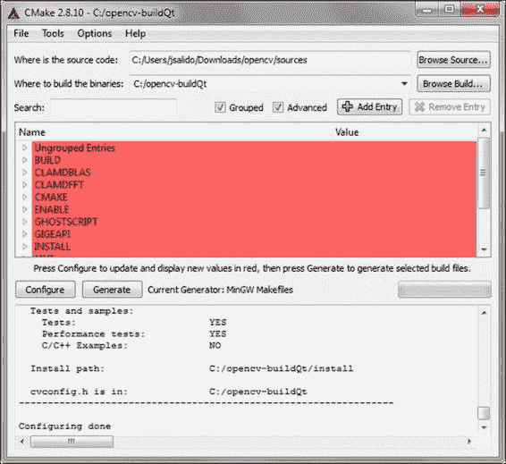
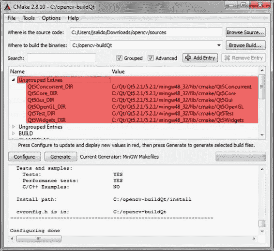
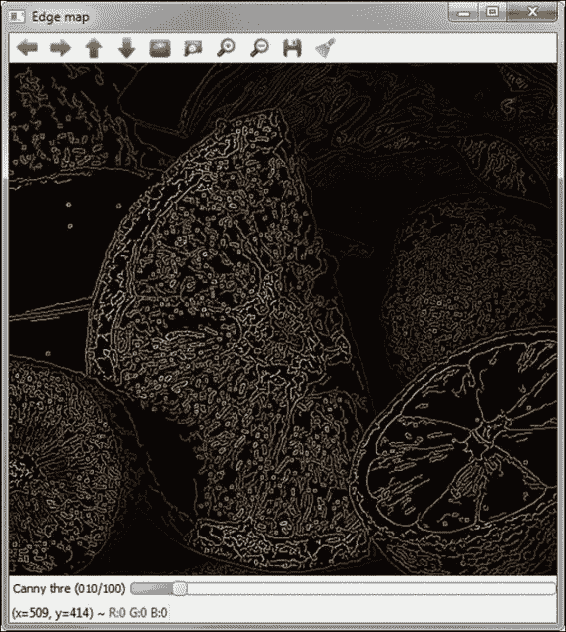
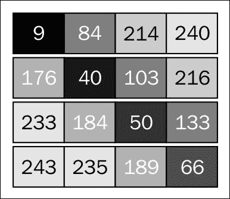
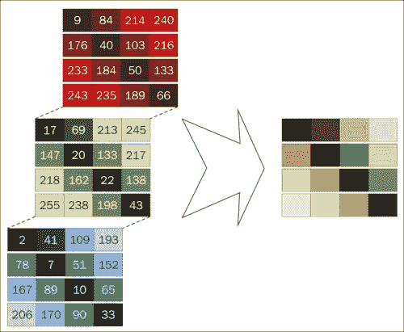
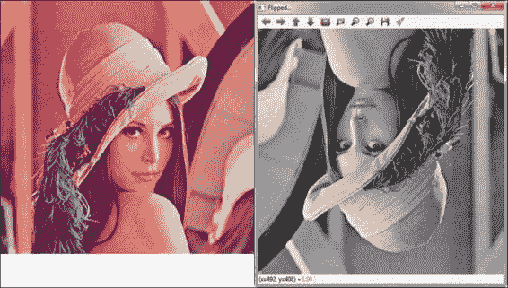

# 第一章. 入门

本章介绍了使用 OpenCV 库开发应用程序所需的基本安装步骤和设置。同时，它还介绍了使用库提供的**应用程序编程接口（API**）和基本数据类型所必需的基本概念。本章包括一个包含完整代码示例的部分，展示了如何读取/写入图像和视频文件，以及如何从实时摄像头访问图像。这些示例还展示了如何获取连接到计算机的摄像头的实时输入。

# 设置 OpenCV

OpenCV 可以从 [`opencv.org/`](http://opencv.org/) 下载，适用于最流行的操作系统，如 Unix（Linux/Mac）、Microsoft Windows（Windows）、Android 和 iOS。在本书中，使用了适用于 Windows 7（SP1）的 OpenCV 的最后一个稳定版本（2.4.9）。对于 Windows，这个版本以自解压存档（`opencv-2.4.9.exe`）的形式提供，应该解压到所需的位置（例如，`C:\opencv-src` 下的 `OPENCV_SCR`）。需要注意的是，在 Windows 中，强烈建议将源代码和二进制文件分配到没有空格的绝对路径，因为以后可能会出现错误。

解压存档后，获取的文件在 `OPENCV_SCR` 下的两个子目录中组织：`build` 和 `sources`。第一个（`build`）包括预编译（二进制）版本，使用 Microsoft Visual C++ 编译器（MSVC，版本 10、11 和 12）为 32 位和 64 位架构编译（分别位于 x86 和 x64 子目录中）。`sources` 子目录包含 OpenCV 库的源代码。此代码可能使用其他编译器（例如，GNU g++）编译。

### 小贴士

使用预编译版本的 OpenCV 是最简单的方法，只需在 **Path** 环境变量中设置 OpenCV 的动态库二进制文件（DLL 文件）的位置。例如，在我们的设置中，这个位置可能是 `OPENCV_SCR/build/x86/vc12/bin`，其中包含用 MS VC 版本 12 编译的 32 位架构的二进制文件。请记住，在 Windows 7（SP1）中更改环境变量可以在 **我的电脑** 的 **属性** 下的 **高级系统设置** 中完成。**快速环境编辑器** 工具（可在 [`www.rapidee.com`](http://www.rapidee.com) 获取）提供了在 Windows 7 中方便地更改 **Path** 和其他环境变量的方法。

本章详细介绍了在 Windows 7（SP1）上安装 OpenCV 的过程。对于 Linux 和其他操作系统，您可以查看 OpenCV 在线文档（*OpenCV 教程，OpenCV 简介* 部分），该文档可在 [`docs.opencv.org/doc/tutorials/tutorials.html`](http://docs.opencv.org/doc/tutorials/tutorials.html) 获取。

## 编译库与预编译库

OpenCV 的发行版包括库的源代码，当需要编译不同版本的二进制文件时可以编译。这种情况之一是我们需要使用 OpenCV 中可用的基于 Qt 的用户界面函数（这些函数不包括在预编译版本中）。此外，如果我们的编译器（例如，GNU g++）与库的预编译版本不匹配，则需要为 OpenCV 库进行构建过程（编译）。

为了使用 Qt 编译 OpenCV 必须满足以下要求：

+   **兼容的 C++ 编译器**：我们使用 MinGW（Minimal GNU GCC for Windows）中包含的 GNU g++ 编译器。这是一个在 Unix 上的标准编译器，它适合保证代码兼容性。在构建过程之前，将编译器二进制文件（g++ 和 gmake）的位置添加到 **Path** 环境变量中非常方便（例如，在我们的本地系统中，位置是 `C:\Qt\Qt5.2.1\Tools\mingw48_32\bin`）。

+   **Qt 库**：特别是，Qt 5.2.1 包（可在 [`qt-project.org/`](http://qt-project.org/) 获取）是为了简化设置而定制的，因为它包括了 Qt 库和完整的开发 IDE Qt Creator，以及 MinGW 4.8 和 OpenGL。Qt Creator 是一个功能齐全的 IDE，拥有免费软件许可，我们推荐使用。Qt 二进制文件的位置也必须添加到 **Path** 环境变量中（例如，`C:\Qt\Qt5.2.1\5.2.1\mingw48_32\bin`）。

+   **CMake 构建系统**：这个跨平台构建系统可在 [`www.cmake.org/`](http://www.cmake.org/) 获取。它由一组工具组成，帮助用户准备和生成用于构建（编译）、测试和打包大型代码项目（如 OpenCV）的适当配置文件。

### 使用 CMake 配置 OpenCV

在本节中，我们通过截图展示了使用 CMake 配置 OpenCV 的步骤：

1.  第一步涉及选择目录和编译器。一旦启动 CMake，就可以在 CMake 主窗口的适当文本字段中设置源目录（`OPENCV_SCR`）和构建目录（`OPENCV_BUILD`）。此外，在 CMake 主窗口中标记为 **Grouped** 和 **Advanced** 的复选框应该被选中。我们继续点击 **Configure** 按钮。此时，工具提示用户指定所需的编译器，我们使用本地编译器选择 **MinGW Makefiles**。如果我们选择 **指定本地编译器** 选项，可以指定编译器和构建工具的特定位置。点击 **Finish** 按钮后，配置步骤将继续检查系统的设置。以下截图显示了此预配置过程结束时的 CMake 窗口：

    预配置步骤结束时的 CMake

    ### 注意

    为了简化，我们在本文中使用`OPENCV_BUILD`和`OPENCV_SCR`分别表示 OpenCV 本地设置的目标和源目录。请记住，所有目录都应该与当前的本地配置相匹配。

1.  下一步是选择构建选项。在主 CMake 窗口的中心，如果需要，红色条目可能会更改。在我们的设置中，我们打开带有**WITH**标签的条目组，并在那里将**WITH_QT**条目设置为**ON**，然后我们再次单击**配置**以获取一组新的选项。

1.  现在，下一步是设置 Qt 目录。在主 CMake 窗口中，有一些条目被标记为红色。这些是构建带有 Qt 的 OpenCV 所需的目录。接下来要设置的条目是：`Qt5Concurrent_DIR`、`Qt5Core_DIR`、`Qt5Gui_DIR`、`Qt5OpenGL_DIR`、`Qt5Test_DIR`和`Qt5Widgets_DIR`（参见图示）。在我们的设置中，这些目录可以在`C:/Qt/Qt5.2.1/5.2.1/mingw48_32/lib/cmake`下找到。

    通过单击一次**配置**按钮，我们获得没有进一步的红色条目，配置过程最终完成，如图所示：

    

    为 CMake 设置 Qt 目录

1.  最后一步是生成项目。在这一步中，我们点击**生成**按钮以获取在目标平台上构建 OpenCV 所需的合适项目文件。然后，应该关闭 CMake GUI 以继续编译。

在上述过程中，可以在生成步骤之前多次更改配置选项。以下列出了要设置的一些其他方便的选项：

+   **BUILD_EXAMPLES**：此选项用于编译分发中包含的几个示例的源代码

+   **BUILD_SHARED_LIBS**：取消选中此选项以获取库的静态版本

+   **CMAKE_BUILD_TYPE**：将其设置为**调试**以获取用于调试目的的版本等

+   **WITH_TBB**：将此选项设置为激活使用 Intel® Threading Building Block，这使您能够轻松编写并行 C++代码

+   **WITH_CUDA**：将此选项设置为使用 CUDA 库通过 GPU 进行处理

### 构建和安装库

编译应该从配置过程中设置的 CMake 目标目录（`OPENCV_BUILD`）的终端启动（即前述列表中的第 1 步）。命令应如下所示：

```py
OPENCV_BUILD>mingw32-make

```

此命令使用 CMake 生成的文件启动构建过程。编译通常需要几分钟。如果编译没有错误结束，则安装将继续执行以下命令：

```py
OPENCV_BUILD>mingw32-make install

```

此命令将 OpenCV 的二进制文件复制到以下目录：

```py
C:\opencv-buildQt\install

```

如果在编译过程中出现问题，我们应该返回 CMake 来更改之前步骤中选择的选项。通过将库二进制文件（DLL 文件）的位置添加到 **Path** 环境变量来结束安装。在我们的设置中，此目录位于 `OPENCV_BUILD\install\x64\mingw\bin`。

要检查安装过程是否成功，可以运行与库一起编译的一些示例（如果设置了 CMake 中的 **BUILD_EXAMPLES** 选项）。代码示例可在 `OPENCV_BUILD\install\x64\mingw\samples\cpp` 中找到。



Canny 边缘检测示例

上一张截图显示了示例 `cpp-example-edge.exe` 文件的输出窗口，该文件演示了在包含在源 OpenCV 分发的 `fruits.jpg` 输入文件上的 Canny 边缘检测。

在下一节中，我们总结了在 Windows 7-x32 平台上使用 Qt 5.2.1（MinGW 4.8）设置 OpenCV 2.4.9 的配方。

## 设置 OpenCV 的快速配方

设置 OpenCV 的整个过程可以使用以下步骤完成：

1.  下载并安装 Qt5（可在[`qt-project.org/`](http://qt-project.org/)找到）。

1.  将 MinGW 二进制目录（用于 g++ 和 gmake）添加到 **Path** 环境变量中（例如，`C:\Qt\Qt5.2.1\Tools\mingw48_32\bin\`）。

1.  将 Qt 二进制目录（用于 DLL）添加到 **Path** 环境变量中（例如，`C:\Qt\Qt5.2.1\5.2.1\mingw48_32\bin\`）。

1.  下载并安装 CMake（可在[`www.cmake.org/`](http://www.cmake.org/)找到）。

1.  下载 OpenCV 存档（可在[`opencv.org/`](http://opencv.org/)找到）。

1.  将下载的存档解压到 `OPENCV_SRC` 目录。

1.  使用以下步骤使用 CMake 配置 OpenCV 构建项目：

    1.  选择源目录（`OPENCV_SCR`）和目标目录（`OPENCV_BUILD`）。

    1.  标记 **分组** 和 **高级** 复选框，然后点击 **配置**。

    1.  选择一个编译器。

    1.  设置 **BUILD_EXAMPLES** 和 **WITH_QT** 选项，并最终点击 **配置** 按钮。

    1.  设置以下 Qt 目录：`Qt5Concurrent_DIR`、`Qt5Core_DIR`、`Qt5Gui_DIR`、`Qt5OpenGL_DIR`、`Qt5Test_DIR`、`Qt5Widgets_DIR`。然后，再次点击**配置**。

    1.  如果没有报告错误（在 CMake 窗口中用红色标记），则可以点击 **生成** 按钮。如果有错误报告，应纠正错误的选项，并重复 **配置** 步骤。在 **生成** 步骤后关闭 CMake。

1.  在 `OPENCV_BUILD` 目录下打开控制台，并运行 `mingw32-make` 命令以开始编译。

1.  如果构建过程没有产生错误，请在命令行上运行 `mingw32-make install`。

1.  将 OpenCV 二进制目录（用于 DLL）添加到 **Path** 环境变量中（例如，`OPENCV_BUILD\install\x64\mingw\bin\`）。

要检查 OpenCV 库的正确安装，可以在 `OPENCV_BUILD\install\x64\mingw\samples\cpp` 中运行一些包含的示例。

# API 概念和基本数据类型

安装后，准备一个新的 OpenCV 代码项目是一个相当直接的过程，需要包含头文件并指示编译器查找项目中使用的文件和库。

OpenCV 由几个模块组成，将相关功能分组。每个模块都有一个与之关联的头文件（例如，`core.hpp`），位于与模块同名的目录中（即，`OPENCV_BUILD\install\include\opencv2\<module>`）。当前 OpenCV 版本提供的模块如下：

+   `core`：此模块定义了所有其他模块使用的（基本）函数和基本数据结构，包括密集的多维数组`Mat`。

+   `highgui`：此模块提供简单的**用户界面**（**UI**）功能和视频和图像捕获的简单接口。使用 Qt 选项构建库允许与这些框架的 UI 兼容性。

+   `imgproc`：此模块包括图像处理函数，包括滤波（线性和非线性）、几何变换、颜色空间转换等。

+   `features2d`：此模块包括用于特征检测（角点和平面对象）、特征描述、特征匹配等功能。

+   `objdetect`：此模块包括用于对象检测和预定义检测类实例（例如，面部、眼睛、微笑、人物、汽车等）的函数。

+   `video`：此模块提供视频分析功能（运动估计、背景提取和对象跟踪）。

+   `gpu`：此模块为其他 OpenCV 模块中的某些函数提供了一组 GPU 加速算法。

+   `ml`：此模块包括实现机器学习工具的函数，如统计分类、回归和数据聚类。

+   一些其他不太常见的模块，如相机标定、聚类、计算摄影、图像拼接、OpenCL 加速 CV、超分辨率等。

所有 OpenCV 类和函数都在`cv`命名空间中。因此，在我们的源代码中将有以下两种选择：

+   在包含头文件后添加`using namespace cv`声明（这是本书中所有代码示例使用的选项）。

+   将`cv::`指定符作为前缀添加到我们使用的所有 OpenCV 类、函数和数据结构之前。如果 OpenCV 提供的外部名称与**标准模板库**（**STL**）或其他库冲突，则建议使用此选项。

`DataType`类定义了 OpenCV 的原始数据类型。原始数据类型可以是`bool`、`unsigned char`、`signed char`、`unsigned short`、`signed short`、`int`、`float`、`double`，或者这些原始类型值的一个元组。任何原始类型都可以通过以下形式的标识符定义：

```py
CV_<bit depth>{U|S|F}C(<number of channels>)
```

在前面的代码中，`U`、`S` 和 `F` 分别代表无符号、有符号和浮点。对于单通道数组，以下枚举应用于描述数据类型：

```py
enum {CV_8U=0, CV_8S=1, CV_16U=2, CV_16S=3, CV_32S=4, CV_32F=5, CV_64F=6};
```

下图展示了单个通道（4 x 4）数组（8 位无符号整数 `CV_8U`）的图形表示。在这种情况下，每个元素应该有一个从零到 255 的值，这可以由一个灰度图像表示。



灰度图像的 8 位无符号整数单通道数组

我们可以为多通道数组（最多 512 个通道）定义所有上述数据类型。以下图示说明了三个通道 4 x 4 数组（8 位无符号整数 `CV_8UC3`）的图形表示。在这个例子中，数组由三个元素的元组组成，对应于 RGB 图像。



RGB 图像的 8 位无符号整数三通道数组

### 注意

这里需要注意的是，以下三个声明是等价的：`CV_8U`、`CV_8UC1` 和 `CV_8UC(1)`。

OpenCV 的 `Mat` 类用于存储和操作密集的 n 维单通道或多通道数组。它可以存储实值或复值向量矩阵、彩色或灰度图像、直方图、点云等。创建 `Mat` 对象的方法有很多种，最流行的是构造函数，其中指定了数组的大小和数据类型，如下所示：

```py
Mat(nrows, ncols, type[, fillValue])
```

数组的初始值可能由 `Scalar` 类设置为一个典型的四元素向量（用于存储在数组中的图像的 RGB 和透明度组件）。接下来，我们将展示 `Mat` 的一些使用示例：

```py
Mat img_A(640, 480, CV_8U, Scalar(255)); // white image
// 640 x 480 single-channel array with 8 bits of unsigned integers
// (up to 255 values, valid for a grayscale image, for example,
// 255=white)
…
Mat img_B(Size(800, 600), CV_8UC3, Scalar(0,255,0)); // Green image
// 800 x 600 three channel array with 8 bits of unsigned integers
// (up to 24 bits color depth, valid for a RGB color image)
```

### 注意

注意，OpenCV 按照 BGR 顺序将彩色 RGB 图像分配到三通道数组（以及第四个通道用于透明度，即 alpha 通道），其中较高的值对应于亮度更高的像素。

`Mat` 类是存储和操作图像的主要数据结构。OpenCV 实现了为这些数据结构自动分配和释放内存的机制。然而，程序员在数据结构共享相同的缓冲区内存时仍需特别小心。

OpenCV 中的许多函数处理密集的单通道或多通道数组时通常使用 `Mat` 类。然而，在某些情况下，不同的数据类型可能更方便，例如 `std::vector<>`、`Matx<>`、`Vec<>` 或 `Scalar`。为此，OpenCV 提供了代理类 `InputArray` 和 `OutputArray`，允许使用任何前面的类型作为函数的参数。

# 我们的第一个程序——读取和写入图像和视频

为了准备本书的示例，我们使用了包含在 Qt 5.2 捆绑包中的 Qt Creator IDE 和用 MinGW g++ 4.8 和 Qt 功能编译的 OpenCV 2.4.9。Qt Creator 是一个免费的多平台 IDE，具有针对 C++编程非常有用的功能。然而，用户可以选择构建可执行文件的最佳工具链，以满足其需求。

我们第一个使用 OpenCV 的 Qt Creator 项目将是一个非常简单的翻转图像工具，命名为`flipImage`。这个工具读取彩色图像文件，将其转换为灰度图像，翻转并保存到输出文件中。

对于这个应用程序，我们选择通过导航到**文件** | **新建文件**或**文件** | **项目…**来创建一个新的代码项目，然后导航到**非 Qt 项目** | **纯 C++项目**。然后，我们必须选择项目名称和位置。下一步是选择项目的工具链（即编译器）（在我们的情况下，**桌面 Qt 5.2.1 MinGW 32 位**）和生成的二进制文件的位置。通常，使用两种可能的构建配置（配置文件）：`debug`和`release`。这些配置文件设置了适当的标志来构建和运行二进制文件。

当创建 Qt Creator 项目时，会生成两个特殊文件（具有`.pro`和`.pro.user`扩展名），用于配置构建和运行过程。构建过程由创建项目时选择的工具链确定。使用**桌面 Qt 5.2.1 MinGW 32 位**工具链，此过程依赖于`qmake`和`mingw32-make`工具。使用`.pro`文件作为输入，`qmake`为 Make（即`mingw32-make`）生成**makefiles**，驱动每个配置文件（即`release`和`debug`）的构建过程。

## qmake 项目文件

对于我们的`flipImage`示例项目，`flipImage.pro`文件看起来像以下代码：

```py
TARGET: flipImage
TEMPLATE = app
CONFIG += console
CONFIG -= app_bundle
CONFIG -= qt

SOURCES += \
    flipImage.cpp
INCLUDEPATH += C:\\opencv-buildQt\\install\\include
LIBS += -LC:\\opencv-buildQt\\install\\x64\mingw\\lib \
    -lopencv_core249.dll \
    -lopencv_highgui249.dll
```

前面的文件说明了`qmake`需要哪些选项来生成适当的 makefiles，以便为我们的项目构建二进制文件。每一行都以一个标签开头，表示一个选项（`TARGET`、`CONFIG`、`SOURCES`、`INCLUDEPATH`和`LIBS`），后面跟着一个标记来添加（`+=`）或删除（`-=`）该选项的值。在这个示例项目中，我们处理的是非 Qt 控制台应用程序。可执行文件是`flipImage.exe`（`TARGET`），源文件是`flipImage.cpp`（`SOURCES`）。由于这个项目是 OpenCV 应用程序，最后两个标签指出了该特定项目使用的头文件位置（`INCLUDEPATH`）和 OpenCV 库（`LIBS`）（例如，`core`和`highgui`）。请注意，行尾的反斜杠表示下一行的延续。在 Windows 中，路径反斜杠应该重复，如前例所示。

以下代码显示了`flipImage`项目的源代码：

```py
#include "opencv2/core/core.hpp"
#include "opencv2/highgui/highgui.hpp"
#include <iostream>

using namespace std;
using namespace cv;

int main(int argc, char *argv[])
{
    int flip_code=0;
    Mat out_image; // Output image

    if (argc != 4) {//Check args. number
        cout << "Usage: <cmd> <flip_code> <file_in> <file_out>\n";
        return -1;
    }
 Mat in_image = imread(argv[2], CV_LOAD_IMAGE_GRAYSCALE);
    if (in_image.empty()) { // Check if read
        cout << "Error! Input image cannot be read...\n";
        return -1;
    }
    sscanf(argv[1], "%d", &flip_code); // Read flip code
 flip(in_image, out_image, flip_code);
    imwrite(argv[3], out_image); // Write image to file
    namedWindow("Flipped…"); // Creates a window
    imshow(win, out_image); // Shows output image on window
    cout << "Press any key to exit...\n";
    waitKey(); // Wait infinitely for key press
    return 0;
}
```

构建项目后，我们可以从以下命令行运行`flipImage`应用程序：

```py
CV_SAMPLES/flipImage_build/debug>flipImage.exe -1 lena.jpg lena_f.jpg

```

以下截图显示了翻转后两个轴（水平和垂直）的输出图像窗口：



输入图像（左侧）和翻转图像工具应用后的输出图像（右侧）

源代码以包含与应用程序使用的模块相关的头文件（`core.hpp`和`highgui.hpp`）开始。请注意，也可以只包含`opencv.hpp`头文件，因为它将依次包含 OpenCV 的所有头文件。

`flipImage`示例获取翻转代码和两个文件名（输入图像和输出图像）作为命令行参数。这些参数从`argv[]`变量中获取。以下示例说明了 OpenCV 应用程序中的几个基本任务：

1.  从文件中读取图像到`Mat`类（`imread`）并检查目标变量是否不为空（`Mat::empty`）。

1.  使用代理类（例如，`InputArray` (`in_image`) 和 `OutputArray` (`out_image`)）调用过程（例如，`flip`）。

1.  将图像写入文件（`imwrite`）。

1.  创建一个输出窗口（`namedWindow`）并在其上显示图像（`imshow`）。

1.  等待按键（`waitKey`）。

以下是对代码的解释：

+   `Mat imread(const string& filename, int flags=1)`: 此函数从指定的文件中加载图像并返回它。如果无法读取图像，它还返回一个空矩阵。它支持文件中最常见的图像格式，通过其内容而不是扩展名来检测。`flags`参数指示加载到内存中的图像颜色，这可能与文件中存储的原始图像颜色不同。在示例代码中，此函数的使用方式如下：

    ```py
    Mat in_image = imread(argv[2], CV_LOAD_IMAGE_GRAYSCALE);
    ```

    在这里，文件名是从命令行参数中获得的（命令名之后的第二个参数）。`CV_LOAD_IMAGE_GRAYSCALE`标志表示图像应作为 8 位灰度图像加载到内存中。有关可用标签的描述，建议阅读 OpenCV 在线文档（可在[`docs.opencv.org/`](http://docs.opencv.org/)找到）。

+   `bool imwrite(const string& filename, InputArray img, const vector<int>& params=vector<int>())`: 此函数将图像写入指定的文件，其中在第二个参数之后指定了一些可选的格式参数。输出文件的格式由文件扩展名确定。在我们的示例代码中，此函数使用时没有格式参数，如下所示：

    ```py
    imwrite(argv[3], out_image);
    ```

+   `void namedWindow(const string& winname, int flags=WINDOW_AUTOSIZE)`: 此函数创建一个不显示的窗口。第一个参数是一个用作窗口名称及其标识符的字符串。第二个参数是一个标志或标志组合，它控制一些窗口属性（例如，启用调整大小）。接下来，我们将展示如何使用常量字符串作为创建的窗口名称来使用此函数，如下所示：

    ```py
    namedWindow("Flipped …"); // Creates a window
    ```

    使用 Qt 编译 OpenCV 为 `highgui` 模块添加了一些新功能（关于这一点稍后讨论）。然后，使用 Qt 和 `namedWindow` 函数创建的窗口使用默认标志：`CV_WINDOW_AUTOSIZE`、`CV_WINDOW_KEEPRATIO` 或 `CV_GUI_EXPANDED`。

+   `void imshow(const string& winname, InputArray mat)`: 此函数在创建窗口时使用指定标志设置的属性中显示一个数组（图像）。在示例中，此函数的使用如下：

    ```py
    imshow(win, out_image); // Shows output image on window
    ```

+   `int waitKey(int delay=0)`: 此函数等待按键或由 `delay` 指定的毫秒数（如果 `delay` 大于零）。如果 `delay` 小于或等于零，则无限期等待。如果按下按键，则返回按键代码；如果在延迟后未按下按键，则返回 `-1`。此函数必须在创建和激活窗口后使用。在示例代码中，它的使用如下：

    ```py
    waitKey(); // Wait infinitely for key press
    ```

# 读取和播放视频文件

视频处理的是动态图像而不是静态图像，即以适当的速率显示帧序列（**FPS** 或 **每秒帧数**）。以下 `showVideo` 示例说明了如何使用 OpenCV 读取和播放视频文件：

```py
//… (omitted for simplicity)
int main(int argc, char *argv[])
{
    Mat frame; // Container for each frame

    VideoCapture vid(argv[1]); // Open original video file
    if (!vid.isOpened()) // Check whether the file was opened
        return -1;
    int fps = (int)vid.get(CV_CAP_PROP_FPS);
    namedWindow(argv[1]); // Creates a window
    while (1) {
        if (!vid.read(frame)) // Check end of the video file
            break;
        imshow(argv[1], frame); // Show current frame on window
        if (waitKey(1000/fps) >= 0)
            break;
    }
    return 0;
}
```

代码解释如下：

+   `VideoCapture::VideoCapture(const string& filename)` – 此类构造函数提供了一个 C++ API，用于从文件和摄像头中抓取视频。构造函数可以有一个参数，即文件名或摄像头的设备索引。在我们的代码示例中，它使用从命令行参数获得的文件名如下：

    ```py
    VideoCapture vid(argv[1]);
    ```

+   `double VideoCapture::get(int propId)` – 此方法返回指定的 `VideoCapture` 属性。如果 `VideoCapture` 类使用的后端不支持该属性，则返回的值是 `0`。在以下示例中，此方法用于获取视频文件的帧率：

    ```py
    int fps = (int)vid.get(CV_CAP_PROP_FPS);
    ```

    由于该方法返回一个 `double` 值，因此执行显式转换为 `int`。

+   `bool VideoCapture::read(Mat& image)` – 此方法从 `VideoCapture` 对象中抓取、解码并返回一个视频帧。该帧存储在 `Mat` 变量中。如果失败（例如，当文件末尾到达时），它返回 `false`。在代码示例中，此方法的使用如下，同时也检查文件末尾条件：

    ```py
    if (!vid.read(frame)) // Check end of the video file
    break;
    ```

在前面的示例中，`waitKey` 函数使用计算出的毫秒数（`1000/fps`）尝试以与原始录制相同的速率播放视频文件。以比原始速率更快/更慢的速率（更多/更少 fps）播放视频将产生更快/更慢的播放。

# 来自摄像头的实时输入

通常，我们面临的计算机视觉问题与处理来自一个或多个摄像头的实时视频输入有关。在本节中，我们将描述 `recLiveVid` 示例，该示例从连接到我们计算机的摄像头中抓取视频流，在窗口中显示该流，并将其记录在文件中（`recorded.avi`）。默认情况下，在下面的示例中，视频捕获是从具有 `cam_id=0` 的摄像头中获取的。然而，可以处理第二个摄像头（`cam_id=1`）并从它那里抓取视频，通过命令行设置一个参数：

```py
//… (omitted for brevity)
int main(int argc, char *argv[])
{
    Mat frame;
    const char win_name[]="Live Video...";
    const char file_out[]="recorded.avi";
    int cam_id=0; // Webcam connected to the USB port
    double fps=20;

    if (argc == 2)
        sscanf(argv[1], "%d", &cam_id);

    VideoCapture inVid(cam_id); // Open camera with cam_id
    if (!inVid.isOpened())
        return -1;

    int width = (int)inVid.get(CV_CAP_PROP_FRAME_WIDTH);
    int height = (int)inVid.get(CV_CAP_PROP_FRAME_HEIGHT);
    VideoWriter recVid(file_out, CV_FOURCC('F','F','D','S'), fps, Size(width, height));
    if (!recVid.isOpened()) 
        return -1;

    namedWindow(win_name);
    while (1) {
        inVid >> frame; // Read frame from camera
        recVid << frame; // Write frame to video file
        imshow(win_name, frame); // Show frame
        if (waitKey(1000/fps) >= 0)
            break;
    }
    inVid.release(); // Close camera
    return 0;
}
```

代码解释如下：

+   `VideoCapture::VideoCapture(int device)` – 此类构造函数初始化一个 `VideoCapture` 对象，使其从摄像头而不是文件接收视频。在下面的代码示例中，它使用摄像头标识符：

    ```py
    VideoCapture inVid(cam_id); // Open camera with cam_id
    ```

+   `VideoWriter::VideoWriter(const string& filename, int fourcc, double fps, Size frameSize, bool isColor=true)` – 此类构造函数创建一个对象，用于将视频流写入名为第一个参数传递的文件。第二个参数使用四个字符的代码标识视频编解码器（例如，在先前的示例代码中，FFDS 代表 `ffdshow`）。显然，只有实际安装在本地系统中的编解码器才能使用。第三个参数表示记录的每秒帧数。此属性可以通过 `VideoCapture::get` 方法从 `VideoCapture` 对象中获取，尽管如果后端不支持该属性，它可能返回 `0`。`frameSize` 参数表示将要写入的视频的每一帧的总大小。此大小应与抓取的输入视频相同。最后，最后一个参数允许以彩色（默认）或灰度写入帧。在示例代码中，构造函数使用 `ffdshow` 编解码器和以下视频捕获大小：

    ```py
    int width = (int)inVid.get(CV_CAP_PROP_FRAME_WIDTH);
    int height = (int)inVid.get(CV_CAP_PROP_FRAME_HEIGHT);
    VideoWriter recVid(file_out, CV_FOURCC('F','F','D','S'), fps,Size(width, height));

    ```

+   `void VideoCapture::release()` – 此方法关闭捕获设备（摄像头）或视频文件。此方法在程序结束时总是隐式调用。然而，在先前的示例中，它是显式调用的，以避免输出文件错误终止（仅在播放录制的视频时才会注意到）。

# 摘要

本章从如何使用 Qt（使用 CMake、GNU g++ 编译器和 GNU Make）构建和安装 OpenCV 库的解释开始。然后，简要介绍了库的模块组织以及其基本 API 概念的简单解释。本章接着更详细地修订了存储数组和操作图像的基本数据结构。此外，还解释了三个代码示例，例如 `flipImage`、`showVideo` 和 `recLiveVid`，以说明 OpenCV 库的基本用法。下一章将介绍为 OpenCV 程序提供图形用户界面功能的两种主流选项。
