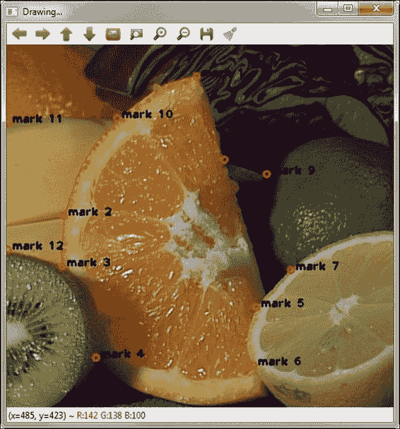
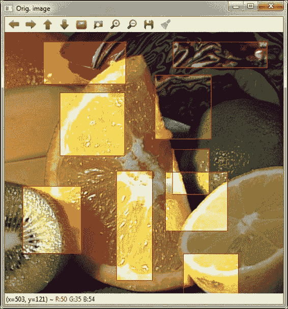
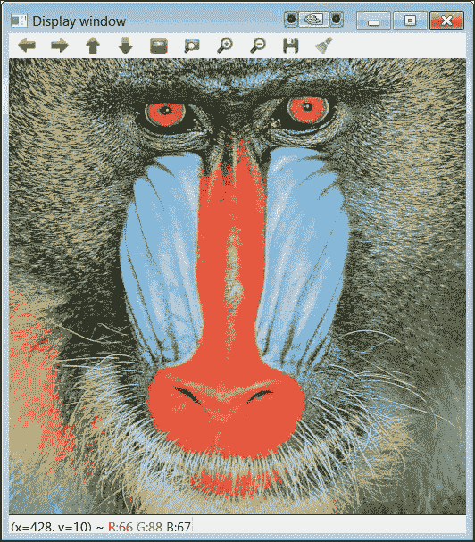
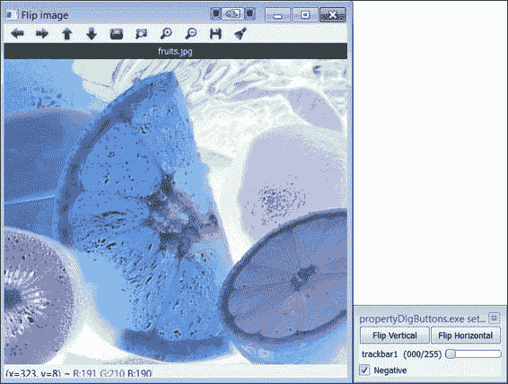

# 第二章. 我们关注的对象 – 图形用户界面

在本章中，我们将介绍 OpenCV 库中包含的主要用户界面功能。我们将从 `highgui` 模块中包含的用户界面函数开始。然后，我们将处理在显示的窗口上插入对象（如文本和几何形状）以指出图像上的某些特定特征。最后，本章将介绍 OpenCV 中包含的新 Qt 函数，以丰富用户体验。

# 使用 OpenCV 的 `highgui` 模块

`highgui` 模块已被设计用来提供一个简单的方式来可视化结果并尝试使用 OpenCV 开发的应用的功能。正如我们在上一章中看到的，该模块提供了执行以下操作的功能：

+   通过 `VideoCapture` 对象从文件和实时摄像头读取图像和视频（`imread`）。

+   通过 `VideoWriter` 对象将图像和视频从内存写入磁盘（`imwrite`）。

+   创建一个可以显示图像和视频帧的窗口（`namedWindow` 和 `imshow`）。

+   当按键时获取和处理事件（`waitKey`）。

当然，该模块包含更多功能以增强用户与软件应用的交互。其中一些将在本章中解释。在下面的 `tbContrast` 代码示例中，我们可以读取一个图像文件，并创建了两个窗口：第一个显示原始图像，另一个显示在原始图像上应用了简单的缩放操作后增加或减少对比度的结果图像。下面的示例展示了如何在窗口中创建一个滑动条以轻松地更改图像的对比度因子（缩放）。让我们看看代码：

```py
#include "opencv2/core/core.hpp"
#include "opencv2/highgui/highgui.hpp"
#include <iostream>

using namespace std;
using namespace cv;

int main(int argc, char* argv[]) {
    const char in_win[]="Orig. image";
    const char out_win[]="Image converted...(no saved)";
    int TBvalContrast=50; // Initial value of the TrackBar
    Mat out_img;

    if (argc != 2) {
        cout << "Usage: <cmd><input image_file>" << endl;
        return -1;
    }
    Mat in_img = imread(argv[1]); // Open and read the image
    if (in_img.empty()) {
        cout << "Error!!! Image cannot be loaded..." << endl;
        return -1;
    }
    namedWindow(in_win); // Creates window for orig. image
 moveWindow(in_win, 0, 0); // Move window to pos. (0, 0)
    imshow(in_win, in_img); // Shows original image
    namedWindow(out_win);
 createTrackbar("Contrast", out_win, &TBvalContrast, 100);
    cout << "Press Esc key to exit..." << endl;
    while (true) {
 in_img.convertTo(out_img, -1, TBvalContrast/50.0);
        imshow(out_win, out_img);
        if (waitKey(50) == 27) // If Esc key pressed breaks
            break;
    }
    return 0;
}
```

下面的截图显示了原始图像（`fruits.jpg`）和通过 `tbContrast` 应用程序获得的对比度增加后的相同图像。


原始图像和对比度增加后的图像

### 注意

为了避免在示例中重复，只解释了代码中显著的新部分。

代码解释如下：

+   `void moveWindow(const string& winname, int x, int y)`: 此函数将窗口移动到指定的屏幕（x, y）位置，其中（0, 0）是屏幕左上角的起始点。当创建并显示窗口时，其默认位置在屏幕中心。如果只显示一个窗口，这种行为相当方便。然而，如果需要显示多个窗口，它们将重叠，并且应该移动以查看其内容。在示例中，此函数的使用如下：

    ```py
    moveWindow(in_win,0,0);
    ```

    现在，显示原始图像的窗口在创建后移动到屏幕的左上角（原点），而转换后的图像位于其默认位置（屏幕中心）。 

+   `int createTrackbar(const string& trackbarname, const string& winname, int* value, int range, TrackbarCallbackonChange=0, void* userdata=0)`: 此函数创建一个与指定名称和范围关联的 **滑块**（滑块）。滑块的位置与 `value` 变量同步。此外，可以实现一个在滑块移动后调用的 **回调** 函数。在此调用中，将用户数据指针作为参数传递。在我们的代码中，此函数的使用方式如下：

    ```py
    createTrackbar("Contrast", out_win, &TBvalContrast, 100);
    ```

    ### 注意

    回调函数是将一个函数作为参数传递给另一个函数的函数。回调函数作为代码指针传递，当发生预期事件时执行。

    在此代码中，滑块被命名为 `"Contrast"`，但没有与它链接的回调函数。最初，滑块位于整个范围（100）的中间（50）。此范围允许最大缩放因子为 2.0（100/50）。

+   `void Mat::convertTo(OutputArray m, int rtype, double alpha=1, double beta=0 ) const`: 此函数将数组转换为另一种数据类型，并可选地进行缩放。如果 `rtype` 为负，输出矩阵将与输入具有相同的类型。应用的缩放公式如下：

    ```py
    m(x, y) = alfa(*this)(x, y) + beta,

    ```

    在此代码中，应用了最终的隐式转换 (`saturate_cast<>`) 以避免可能的溢出。在 `tbContrast` 示例中，此函数在无限循环中使用：

    ```py
    while (true) {
        in_img.convertTo(out_img, -1, TBvalContrast/50.0);
        imshow(out_win, out_img);
        if (waitKey(50) == 27) // If Esc key pressed breaks
            break;
    }
    ```

在上一章中，我们看到了使用 `waitKey` 函数（不带参数）创建隐式无限循环等待按键的代码示例。应用程序主窗口上的事件（例如，滑块、鼠标等）在该循环内部被捕获和处理。相反，在本例中，我们使用 `while` 语句创建一个无限循环，通过 `convertTo` 函数应用对比度变化，缩放因子从 `0.0`（滑块在 `0` 位置）到 `2.0`（滑块在 `100` 位置）。当按下 *Esc* 键（ASCII 码 27）时，无限循环终止。实现的对比度方法相当简单，因为像素的新值是通过将原始值乘以大于 `1.0` 的因子来增加对比度，以及乘以小于 `1.0` 的因子来降低对比度。在此方法中，当像素值超过 `255`（任何通道）时，必须进行舍入（饱和转换）。

### 注意

在下一章中，我们将解释一个更复杂的算法，用于通过图像直方图均衡化来提高图像对比度。

然后，在 `tbContrastCallB` 示例中，我们展示了相同的功能，但使用了一个每次滑块移动时都会调用的 `trackbarcallback` 函数。注意，当调用 `waitKey` 函数时处理事件。如果按下任何键，应用程序将结束。代码如下：

```py
//… (omitted for brevity)
#define IN_WIN "Orig. image"
#define OUT_WIN "Image converted...(no saved)"
Mat in_img, out_img;

// CallBack function for contrast TrackBar
void updateContrast(int TBvalContrast, void *userData=0) {

 in_img.convertTo(out_img, -1, TBvalContrast/50.0);
 imshow(OUT_WIN, out_img);
 return;
}

int main(int argc, char* argv[]) {

    int TBvalContrast=50; // Value of the TrackBar

    // (omitted for simplicity)
    in_img = imread(argv[1]); // Open and read the image
    // (omitted for simplicity)
    in_img.copyTo(out_img); // Copy orig. image to final img
    namedWindow(IN_WIN); // Creates window for orig. image
    moveWindow(IN_WIN, 0, 0); // Move window to pos. (0, 0)
    imshow(IN_WIN, in_img); // Shows original image
    namedWindow(OUT_WIN); // Creates window for converted image
 createTrackbar("Contrast", OUT_WIN, &TBvalContrast, 100,
                   updateContrast);
    imshow(OUT_WIN, out_img); // Shows converted image
    cout << "Press any key to exit..." << endl;
    waitKey();
    return 0;
}
```

在此示例中，将 `updatedContrast` 函数的 `void` 指针作为参数传递给 `createTrackbar` 函数：

```py
createTrackbar("Contrast", OUT_WIN, &TBvalContrast, 100,
updateContrast);
```

回调函数接收的第一个参数是轨迹条中滑块的值以及指向其他用户数据的`void`指针。图像的新像素值将在该函数中计算。

### 注意

在这个示例（以及随后的示例）中，为了简洁，省略了一些代码，因为省略的代码与之前的示例中的代码相同。

使用回调函数导致在这段新代码中产生了一些变化，因为此函数内部可访问的数据必须使用全局作用域来定义。然后，为了避免向回调函数传递的数据类型更加复杂，如下所示：

+   窗口名称是定义的符号（例如，`#define IN_WIN`）。在之前的示例（`tbContrast`）中，窗口名称存储在局部变量（字符串）中。

+   在这种情况下，原始图像（`in_img`）和转换图像（`out_img`）的`Mat`变量被声明为全局变量。

### 提示

有时在这本书的示例代码中，为了简化，使用了全局变量。由于它们可以在代码的任何地方被更改，因此请务必小心使用全局变量。

在之前的示例中展示的两个不同实现产生了相同的结果。然而，需要注意的是，在使用回调函数之后，生成的应用程序（`tbContrastCallB`）更加高效，因为图像转换的数学运算仅在轨迹条的滑动变化（当回调被执行时）发生。在第一个版本（`tbContrast`）中，即使`TBvalContrast`变量没有变化，`convertTo`函数也会在`while`循环内部被调用。

# 文本和绘图

在上一节中，我们使用一个简单的用户界面通过轨迹条获取输入值。然而，在许多应用中，用户必须指向图像上的位置和区域，并用文本标签进行标记。为此目的，`highgui`模块提供了一套绘图函数以及鼠标事件处理。

`drawThings`代码示例展示了如何轻松地在输入图像上标记位置。位置用红色圆圈和旁边的黑色文本标签标记。以下截图显示了包含输入图像及其上标记位置的窗口。为了标记图像上的每个位置，用户必须在其上点击鼠标左键。在其他应用中，标记的位置可能是从应用于输入图像的算法中获得的点或区域。

接下来，我们展示一个示例代码，其中为了简化，省略了一些代码，因为它们在其他之前的示例中是重复的：

```py
    // (omitted for simplicity)
#define IN_WIN "Drawing..."

Mat img;

// CallBack Function for mouse events
void cbMouse(int event, int x, int y, int flags, void* userdata) {

static int imark=0;
    char textm[] = "mark999";

    if (event == EVENT_LBUTTONDOWN) { // Left mouse button pressed
circle(img, Point(x, y), 4, Scalar(0,0,255), 2);
imark++;// Increment the number of marks
sprintf(textm, "mark %d", imark);// Set the mark text
putText(img, textm, Point(x+6, y), FONT_HERSHEY_PLAIN,
 1, Scalar(0,0,0),2);
imshow(IN_WIN, img); // Show final image
    }
    return;
}

int main(int argc, char* argv[]) {

    // (omitted for brevity)	
    img = imread(argv[1]); //open and read the image
    // (omitted for brevity)
    namedWindow(IN_WIN);
 setMouseCallback(IN_WIN, cbMouse, NULL);
    imshow(IN_WIN, img);
    cout << "Pres any key to exit..." << endl;
    waitKey();
    return 0;
}
```

代码解释如下：

+   `void setMouseCallback(const string& winname, MouseCallback onMouse, void* userdata=0)`: 此函数为指定的窗口设置事件鼠标处理程序。在此函数中，第二个参数是每当鼠标事件发生时执行的回调函数。最后一个参数是传递给该函数的`void`指针数据。在我们的代码中，此函数的使用方式如下：

    ```py
    setMouseCallback(IN_WIN, cbMouse, NULL);
    ```

    在这种情况下，而不是使用全局变量来表示窗口名称，更倾向于使用具有全局作用域的已定义符号（`IN_WIN`）。

    

    带有圆和文本的图像

    鼠标处理程序本身声明如下：

    ```py
    void cbMouse(int event, int x, int y, int flags, void* userdata)
    ```

    在这里，`event`表示鼠标事件类型，`x`和`y`是事件在窗口中的位置坐标，而`flags`是事件发生时的特定条件。在这个例子中，唯一捕获的鼠标事件是左键点击（`EVENT_LBUTTONDOWN`）。

    以下枚举定义了鼠标回调函数中处理的事件和标志：

    ```py
    enum{
      EVENT_MOUSEMOVE      =0,
        EVENT_LBUTTONDOWN    =1,
        EVENT_RBUTTONDOWN    =2,
        EVENT_MBUTTONDOWN    =3,
        EVENT_LBUTTONUP      =4,
        EVENT_RBUTTONUP      =5,
        EVENT_MBUTTONUP      =6,
        EVENT_LBUTTONDBLCLK  =7,
        EVENT_RBUTTONDBLCLK  =8,
        EVENT_MBUTTONDBLCLK  =9};

    enum {
        EVENT_FLAG_LBUTTON   =1,
        EVENT_FLAG_RBUTTON   =2,
        EVENT_FLAG_MBUTTON   =4,
        EVENT_FLAG_CTRLKEY   =8,
        EVENT_FLAG_SHIFTKEY  =16,
        EVENT_FLAG_ALTKEY    =32};
    ```

+   `void circle(Mat& img, Point center, int radius, const Scalar& color, int thickness=1, int lineType=8, int shift=0)`: 这个函数在图像上以指定的`radius`（以像素为单位）和`color`在由其`center`标记的位置绘制一个圆。此外，还可以设置线的`thickness`值和其他一些附加参数。该函数在示例中的使用方法如下：

    ```py
    circle(img, Point(x, y), 4, Scalar(0,0,255), 2);
    ```

    圆的中心是鼠标点击的点。半径为`4`像素，颜色为纯红色（`Scalar(0, 0, 255)`），线粗细为`2`像素。

    ### 注意

    记住，OpenCV 使用 BGR 颜色方案，`Scalar`类用于表示每个像素的三个（或四个，如果考虑不透明通道）通道，亮度更高的值（或不透明度更高）。

    包含在`highgui`模块中的其他绘图函数允许我们绘制椭圆、线条、矩形和多边形。

+   `void putText(Mat& image, const string& text, Point org, int fontFace, double fontScale, Scalar color, int thickness=1, int lineType=8, bool bottomLeftOrigin=false)`: 这个函数在`image`中指定位置（`org`）绘制一个`text`字符串，其属性由参数`fontFace`、`fontScale`、`color`、`thickness`和`lineType`设置。可以通过最后一个参数（`bottomLeftOrigin`）设置坐标原点在左下角。在示例中，此函数的使用方法如下：

    ```py
    imark++; // Increment the number of marks
    sprintf(textm, "mark %d", imark); // Set the mark text
    putText(img, textm, Point(x+6, y), FONT_HERSHEY_PLAIN,
    1.0, Scalar(0,0,0),2);
    ```

    在`drawThings`示例中，我们绘制了一个文本`"mark"`，后面跟着一个递增的数字，指出了标记的顺序。为了存储标记顺序，我们使用了一个`static`变量（`imark`），它在调用之间保持其值。`putText`函数在鼠标点击的位置绘制文本，在*x*轴上有 6 像素的偏移。字体样式由标志`FONT_HERSHEY_PLAIN`指定，并且没有缩放（`1.0`），黑色（`Scalar(0, 0, 0)`）和`2`像素的粗细。

    字体样式的可用标志由枚举定义：

    ```py
    enum{
        FONT_HERSHEY_SIMPLEX = 0,
        FONT_HERSHEY_PLAIN = 1,
        FONT_HERSHEY_DUPLEX = 2,
        FONT_HERSHEY_COMPLEX = 3,
        FONT_HERSHEY_TRIPLEX = 4,
        FONT_HERSHEY_COMPLEX_SMALL = 5,
        FONT_HERSHEY_SCRIPT_SIMPLEX = 6,
        FONT_HERSHEY_SCRIPT_COMPLEX = 7,
        FONT_ITALIC = 16};
    ```

# 选择区域

许多计算机视觉应用需要在图像的局部区域内聚焦兴趣。在这种情况下，选择所需**感兴趣区域**（**ROI**）是一个非常有用的用户工具。在`drawRs`示例中，我们展示了如何使用鼠标选择图像中的矩形区域，以在这些区域内局部增加对比度（如下面的截图所示）。为了更好地控制区域选择，我们实现了一个点击并拖拽的行为来调整每个区域的矩形边界。



在某些矩形区域内对比度增加的输出图像

为了简化，只显示了对应于鼠标事件函数回调的代码，因为其余部分与前面的示例非常相似。代码如下：

```py
void cbMouse(int event, int x, int y, int flags, void* userdata) {

  static Point p1, p2; // Static vars hold values between calls
  static bool p2set = false;

  if (event == EVENT_LBUTTONDOWN) { // Left mouse button pressed
      p1 = Point(x, y); // Set orig. point
      p2set = false;
  } else if (event == EVENT_MOUSEMOVE &&
flags == EVENT_FLAG_LBUTTON) {
      if (x >orig_img.size().width) // Check out of bounds
          x = orig_img.size().width;
      else if (x < 0)
          x = 0;
      if (y >orig_img.size().height) // Check out of bounds
          y = orig_img.size().height;
      else if (y < 0)
          y = 0;
      p2 = Point(x, y); // Set final point
      p2set = true;
orig_img.copyTo(tmp_img); // Copy orig. to temp. image
rectangle(tmp_img, p1, p2, Scalar(0, 0, 255));
      imshow(IN_WIN, tmp_img); // Draw temporal image with rect.
  } else if (event == EVENT_LBUTTONUP && p2set) {
Mat submat = orig_img(Rect(p1, p2)); // Set region
      submat.convertTo(submat, -1, 2.0); // Compute contrast
   rectangle(orig_img, p1, p2, Scalar(0, 0, 255));
      imshow(IN_WIN, orig_img); // Show image
  }
  return;
}
```

回调函数声明其局部变量为`static`，因此它们在调用之间保持其值。变量`p1`和`p2`存储定义感兴趣矩形区域的点，而`p2set`保存一个布尔（`bool`）值，表示点`p2`是否已设置。当`p2set`为`true`时，可以绘制一个新的选定区域并计算其新值。

鼠标回调函数处理以下事件：

+   `EVENT_LBUTTONDOWN`：此按钮也称为左键按下。初始位置（`p1`）被设置为事件发生的位置`Point(x, y)`。此外，将`p2set`变量设置为`false`。

+   `EVENT_MOUSEMOVE && EVENT_FLAG_LBUTTON`：按住左键移动鼠标。首先，应该检查边界，以便我们可以纠正坐标并避免错误，以防最终点超出窗口。然后，临时`p2`点被设置为鼠标的最终位置，并将`p2set`设置为`true`。最后，在窗口中显示一个带有矩形的时间图像。

+   `EVENT_LBUTTONUP`：此按钮也称为左键释放，并且仅在`p2set`为`true`时有效。最终区域被选定。然后可以在原始图像中指向子数组进行进一步计算。之后，在原始图像中绘制围绕最终区域的矩形，并将结果显示在应用程序窗口中。

接下来，我们更仔细地查看代码：

+   `Size Mat::size() const:` 返回矩阵大小 `(Size(cols, rows))`：此函数用于获取图像（`orig_img`）的边界，如下所示：

    ```py
    if (x > orig_img.size().width) // Check out bounds
                x = orig_img.size().width;
            else if (x < 0)
                x = 0;
            if (y > orig_img.size().height) // Check out bounds
                y = orig_img.size().height;
    ```

    由于`Mat::size()`返回一个`Size`对象，我们可以访问其成员`width`和`height`以获取图像（`orig_img`）中`x`和`y`的最大值，并将这些值与鼠标事件发生的坐标进行比较。

+   `void Mat::copyTo(OutputArray m) const`：此方法将矩阵复制到另一个矩阵中，如果需要则重新分配新的大小和类型。在复制之前，以下方法被调用：

    ```py
    m.create(this->size(), this->type());

    ```

    在示例中，采用以下方法来创建原始图像的时间副本：

    ```py
    orig_img.copyTo(tmp_img); // Copy orig. to temp. image
    ```

    定义选定区域的矩形被绘制在这个临时图像上。

+   `void rectangle(Mat& img, Point pt1, Point pt2, const Scalar& color, int thickness=1, int lineType=8, int shift=0)`: 此函数使用指定的 `color`、`thickness` 和 `lineType` 在图像 (`img`) 上绘制由点 `pt1` 和 `pt2` 定义的矩形。在代码示例中，此函数被调用了两次。首先，在临时图像 (`tmp_img`) 中绘制一个红色（`Scalar(0, 0, 255)`）的矩形，围绕选定的区域，然后绘制原始图像 (`orig_img`) 中最终选定区域的边界：

    ```py
    rectangle(tmp_img, p1, p2, Scalar(0, 0 ,255));
    //…
    rectangle(orig_img, p1, p2, Scalar(0, 0, 255));
    ```

+   `Mat::Mat(const Mat& m, const Rect& roi)`: 构造函数接受由矩形 (`roi`) 限定的 `m` 的子矩阵，该矩形代表存储在 `m` 中的图像中的感兴趣区域。在代码示例中，此构造函数用于获取需要转换对比度的矩形区域：

    ```py
    Mat submat = orig_img(Rect(p1, p2));// Set subarray on orig. image
    ```

# 使用基于 Qt 的函数

虽然 `highgui` 对于大多数用途来说已经足够，但 Qt UI 框架（可在 [`qt-project.org/`](http://qt-project.org/) 找到）可以用于 OpenCV 中开发更丰富的用户界面。OpenCV 的许多用户界面函数在幕后使用 Qt 库。为了使用这些函数，OpenCV 必须使用 `WITH_QT` 选项编译。

注意，Qt 是一个类和 **小部件** 库，它允许创建具有丰富、事件驱动用户界面的完整应用程序。然而，在本节中，我们将主要关注 OpenCV 中的特定 Qt 基于函数。使用 Qt 进行编程超出了本书的范围。

在启用 Qt 支持的情况下，使用 `namedWindow` 函数创建的窗口将自动看起来像以下截图所示。有一个带有平移、缩放和保存图像等有用功能的工具栏。窗口还显示底部状态栏，显示当前鼠标位置和该像素下的 RGB 值。在图像上右键单击将显示一个弹出菜单，其中包含与工具栏相同的选项。



启用 Qt 支持显示的窗口

## 文本叠加和状态栏

文本可以显示在图像顶部的行上。这非常有用，可以显示每秒帧数、检测数量、文件名等。主要函数是 `displayOverlay(const string& winname, const string& text, int delayms=0)`。该函数期望一个窗口标识符和要显示的文本。通过在文本字符串中使用 `\n` 字符允许多行。文本将在中心显示，并且具有固定大小。`delayms` 参数允许文本仅显示指定数量的毫秒（`0=永远`）。

我们还可以在状态栏中显示用户文本。此文本将替换当前像素下的默认 *x* 和 *y* 坐标以及 RGB 值。`displayStatusBar(const string& winname, const string& text, int delayms=0)` 函数与之前的 `displayOverlay` 函数具有相同的参数。当延迟时间过去后，将显示默认的状态栏文本。

## 属性对话框

OpenCV 基于 Qt 的功能中最有用的特性之一是属性对话框窗口。此窗口可以用来放置滑块条和按钮。同样，这在调整我们应用程序的参数时非常有用。可以通过按工具栏中的最后一个按钮（如图所示）或按*Ctrl* + *P*来访问属性对话框窗口。窗口只有在分配了滑块条或按钮后才会可用。要为属性对话框创建滑块条，只需使用`createTrackbar`函数，并将空字符串（不是`NULL`）作为窗口名称传递。

也可以将按钮添加到属性对话框中。由于原始窗口和对话框窗口可以同时可见，这可以用来激活/停用我们应用程序中的功能并立即看到结果。要向对话框添加按钮，请使用`createButton(const string& button_name, ButtonCallback on_change, void* userdata=NULL,inttype=CV_PUSH_BUTTON, bool initial_button_state=0)`函数。第一个参数是按钮标签（即按钮中要显示的文本）。每次按钮改变其状态时，`on_change`回调函数都会被调用。这应该采用`void on_change(int state, void *userdata)`的形式。传递给`createButton`的用户数据指针将在每次调用时传递给此回调函数。状态参数表示按钮变化，并且对于每种类型的按钮，它将具有由参数类型给出的不同值：

+   `CV_PUSH_BUTTON`: 推压按钮

+   `CV_CHECKBOX`: 复选框按钮；状态将为 1 或 0

+   `CV_RADIOBOX`: 单选框按钮；状态将为 1 或 0

对于前两种类型，每次按下都会调用一次回调。对于单选框按钮，它既会调用刚刚点击的按钮，也会调用未取消的按钮。

按钮被组织到按钮栏中。按钮栏占据对话框窗口中的一行。每个新的按钮都添加到上一个按钮的右侧。滑块条占据整整一行，因此当添加滑块条时，按钮栏会结束。以下`propertyDlgButtons`示例显示了按钮和滑块条在属性对话框中的布局：

```py
#include "opencv2/core/core.hpp"
#include "opencv2/highgui/highgui.hpp"
#include <iostream>

using namespace std;
using namespace cv;

Mat image;
const char win[]="Flip image";

void on_flipV(int state, void *p)
{
    flip(image, image, 0);  // flip vertical
    imshow(win, image);
}

void on_flipH(int state, void *p)
{
    flip(image, image, 1);  // flip horizontal
    imshow(win, image);
}

void on_negative(int state, void *p)
{
    bitwise_not(image, image);  // invert all channels
    imshow(win, image);
}

int main(int argc, char *argv[])
{
    if (argc != 2) {//Check args.
        cout << "Usage: <cmd><file_in>\n";
        return -1;
    }
    image = imread(argv[1]);
    if (image.empty()) {
        cout << "Error! Input image cannot be read...\n";
        return -1;
    }

    namedWindow(win);
    imshow(win, image);
    displayOverlay(win, argv[1], 0);
    createButton("Flip Vertical", on_flipV, NULL, CV_PUSH_BUTTON);
    createButton("Flip Horizontal", on_flipH, NULL, CV_PUSH_BUTTON);
    int v=0;
    createTrackbar("trackbar1", "", &v, 255);
    createButton("Negative", on_negative, NULL, CV_CHECKBOX);

    cout << "Press any key to exit...\n";
    waitKey();
    return 0;
}
```

此代码与上一章中的`flipImage`示例类似。在此示例中，将图像文件名作为参数传递。创建一个属性窗口，包含两个按钮用于垂直和水平翻转，一个模拟的滑块条，以及一个复选框按钮用于反转颜色强度。回调函数`on_flipV`和`on_flipH`简单地翻转当前图像并显示结果（我们使用一个全局图像变量来完成此操作），而回调函数`on_negative`逻辑上反转颜色强度并显示结果。请注意，滑块条实际上并没有真正被使用；它被用来显示**换行符**效果。以下截图显示了结果：



`propertyDlgButtons`示例

## 窗口属性

如前所述，默认情况下，所有新窗口将类似于*使用基于 Qt 的函数*部分中的截图所示。然而，我们可以通过将`CV_GUI_NORMAL`选项传递给`namedWindow`来以非 Qt 格式显示窗口。另一方面，可以使用`double getWindowProperty(const string& winname, int prop_id)`和`setWindowProperty(const string& winname, int prop_id, double prop_value)`函数检索和设置窗口大小参数。以下表格显示了可以更改的属性：

| 属性（`prop_id`） | 描述 | 可能的值 |
| --- | --- | --- |
| `CV_WND_PROP_FULLSCREEN` | 显示全屏或常规窗口 | `CV_WINDOW_NORMAL`或`CV_WINDOW_FULLSCREEN` |
| `CV_WND_PROP_AUTOSIZE` | 窗口自动调整大小以适应显示的图像 | `CV_WINDOW_NORMAL`或`CV_WINDOW_AUTOSIZE` |
| `CV_WND_PROP_ASPECTRATIO` | 允许调整大小的窗口具有任何比例或固定原始比例 | `CV_WINDOW_FREERATIO`或`CV_WINDOW_KEEPRATIO` |

更重要的是，可以保存窗口属性。这包括不仅大小和位置，还包括标志、滑块值、缩放和滚动位置。要保存和加载窗口属性，请使用`saveWindowParameters(const string& windowName)`和`loadWindowParameters(const string& windowName)`函数。

## Qt 图像

如果我们想在项目中广泛使用 Qt 库（即，超出 OpenCV 的基于 Qt 的函数），我们必须找到一种方法将 OpenCV 的图像转换为 Qt 使用的格式（`QImage`）。这可以通过以下函数完成：

```py
QImage* Mat2Qt(const Mat &image)
{
Mat temp=image.clone();
cvtColor(image, temp, CV_BGR2RGB);
QImage *imgQt= new QImage((const unsigned char*)(temp.data),temp.cols,temp.rows,QImage::Format_RGB888);
return imgQt;
}
```

此函数使用 OpenCV 的图像数据创建 Qt 图像。请注意，首先需要进行转换，因为 Qt 使用 RGB 图像，而 OpenCV 使用 BGR 顺序。

最后，为了使用 Qt 显示图像，我们至少有两种选择：

+   创建一个扩展`QWidget`类并实现绘制事件的类。

+   创建一个标签并设置它来绘制一个图像（使用`setPixMap`方法）。

# 摘要

在本章中，我们提供了对`highgui`模块功能的更深入的了解，以丰富用户体验。OpenCV 用于构建图形用户界面的主要元素在以下代码示例中展示。此外，我们还回顾了 OpenCV 内部的新 Qt 功能。

本章的示例涵盖了诸如`tbarContrast`、`tbarContrastCallB`、`drawThings`、`drawRs`和`propertyDlgButtons`等主题。

下一章将介绍用于图像处理的常用方法的实现，例如亮度控制、对比度和颜色转换、视网膜过滤和几何变换。
