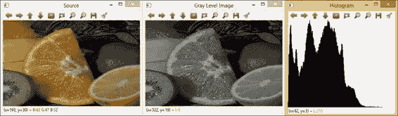
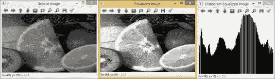
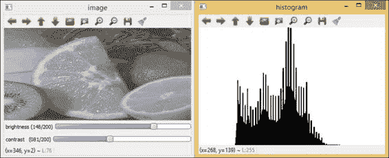
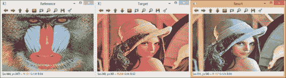
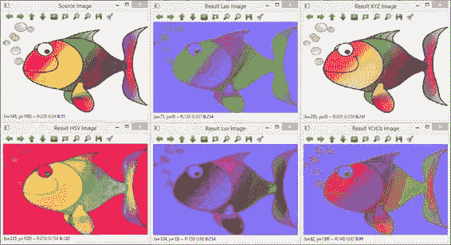
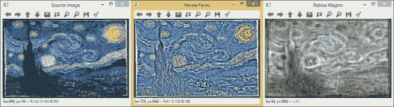
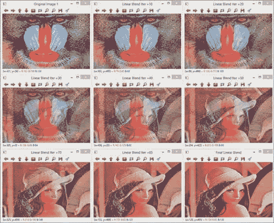
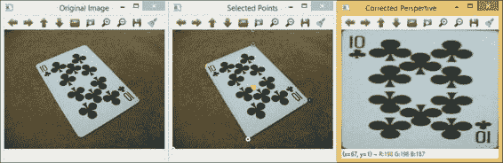

# 第三章。首要之事 – 图像处理

图像处理是指计算机通过应用信号处理方法对任何二维数据（图像）进行数字处理。图像处理有广泛的应用范围，如图像表示、图像增强或锐化、通过滤波进行图像恢复以及几何校正。这些应用通常是计算机视觉系统后续阶段的第一个阶段和输入。在 OpenCV 中，有一个专门的模块`imgproc`用于图像处理。在本章中，我们将介绍库中最重要和最常用的方法，即像素级访问、直方图操作、图像均衡化、亮度和对比度建模、颜色空间、滤波以及算术和几何变换。

# 像素级访问和常见操作

图像处理中最基本的操作之一是像素级访问。由于图像包含在`Mat`矩阵类型中，因此存在一个使用`at<>`模板函数的通用访问形式。为了使用它，我们必须指定矩阵单元格的类型，例如：

```py
Mat src1 = imread("stuff.jpg", CV_LOAD_IMAGE_GRAYSCALE);
uchar pixel1=src1.at<uchar>(0,0);
cout << "First pixel: " << (unsigned int)pixel1 << endl;
Mat src2 = imread("stuff.jpg", CV_LOAD_IMAGE_COLOR);
Vec3b pixel2 = src2.at<Vec3b>(0,0);
cout << "First pixel (B):" << (unsigned int)pixel2[0] << endl;
cout << "First pixel (G):" << (unsigned int)pixel2[1] << endl;
cout << "First pixel (R):" << (unsigned int)pixel2[2] << endl;
```

注意，彩色图像使用`Vec3b`类型，它是一个包含三个无符号字符的数组。具有第四个 alpha（透明度）通道的图像将使用`Vec4b`类型访问。`Scalar`类型表示一个 1 到 4 元素的向量，也可以用于所有这些情况。注意，`at<>`也可以用于更改像素值（即赋值语句的左侧）。

除了像素访问之外，还有一些常见的操作，我们应该知道相应的代码片段。以下表格显示了这些常见操作：

| 操作 | 代码示例 |
| --- | --- |
| 获取矩阵大小 |

```py
Size siz=src.size();
cout << "width: " << siz.width << endl;
cout << "height: " << siz.height << endl;
```

|

| 获取通道数 |
| --- |

```py
int nc=src.channels();
```

|

| 获取像素数据类型 |
| --- |

```py
int d=src.depth();
```

|

| 设置矩阵值 |
| --- |

```py
src.setTo(0); //for one-channel src
```

或者

```py
src.setTo(Scalar(b,g,r)); // for three-channel src
```

|

| 创建矩阵的副本 |
| --- |

```py
Mat dst=src.clone();
```

|

| 创建矩阵的副本（可选掩码） |
| --- |

```py
src.copy(dst, mask);
```

|

| 引用子矩阵 |
| --- |

```py
Mat dst=src(Range(r1,r2),Range(c1,c2));
```

|

| 从子矩阵创建新矩阵（即图像裁剪） |
| --- |

```py
Rect roi(r1,c2, width, height);
Mat dst=src(roi).clone();
```

|

注意最后两行的区别：在最后一行中，创建了一个新的矩阵。在倒数第二行的情况下，仅创建了对`src`中子矩阵的引用，但数据实际上并未复制。

### 提示

最常见的操作，包括基于迭代器的额外像素访问方法，总结在*OpenCV 2.4 快速参考卡*中，可以从[`docs.opencv.org/trunk/opencv_cheatsheet.pdf`](http://docs.opencv.org/trunk/opencv_cheatsheet.pdf)下载。

# 图像直方图

图像直方图表示图像中各种灰度级别或颜色的出现频率，对于二维和三维直方图分别如此。因此，直方图类似于图像中不同像素值（即灰度级别）的概率密度函数。在 OpenCV 中，可以使用函数 `void calcHist(const Mat* images, int nimages, const int* channels, InputArray mask, OutputArray hist, int dims, const int* histSize, const float** ranges, bool uniform=true, bool accumulate=false)` 计算图像直方图。第一个参数是指向输入图像的指针。可以计算多个输入图像的直方图。这允许你比较图像直方图并计算多个图像的联合直方图。第二个参数是源图像的数量。第三个输入参数是用于计算直方图的通道列表。可以计算同一颜色图像的多个通道的直方图。因此，在这种情况下，`nimages` 的值将是 1，而 `const int* channels` 参数将是一个包含通道号的数组。

通道数从零到二。参数 `InputArray mask` 是一个可选的掩码，用于指示直方图中计数的数组元素（图像像素）。第五个参数是输出直方图。参数 `int dims` 是直方图的维数，必须是正数且不超过 32 (`CV_MAX_DIMS`)。直方图可以是 *n*-维的，根据用于量化图像像素值的箱子数量。参数 `const int* histSize` 是每个维度的直方图大小的数组。它允许我们计算具有非均匀箱子（或量化）的直方图。参数 `const float** ranges` 是每个维度的直方图箱子边界的 `dims` 数组的数组。最后两个参数具有布尔值，默认分别为 `true` 和 `false`。它们表示直方图是均匀的且非累积的。

以下 `ImgHisto` 示例展示了如何计算和显示二维图像的一维直方图：

```py
#include "opencv2/imgproc/imgproc.hpp" // a dedicated include file
#include "opencv2/highgui/highgui.hpp"
#include <iostream>

using namespace cv;
using namespace std;

int main( int argc, char *argv[])
{
    int histSize = 255;

    long int dim;
    Mat hist, image;

    //Read original image
    Mat src = imread( "fruits.jpg");

    //Convert color image to gray level image
    cvtColor(src, image, CV_RGB2GRAY);

    //Create three windows
    namedWindow("Source", 0);
    namedWindow("Gray Level Image", 0);
    namedWindow("Histogram", WINDOW_AUTOSIZE);

    imshow("Source", src);
    imshow("Gray Level Image", image);

 calcHist(&image, 1, 0, Mat(), hist, 1, &histSize, 0);

    dim=image.rows *image.cols;
    Mat histImage = Mat::ones(255, 255, CV_8U)*255;

    normalize(hist, hist, 0, histImage.rows, CV_MINMAX, CV_32F);

    histImage = Scalar::all(255);
    int binW = cvRound((double)histImage.cols/histSize);

    for( int i = 0; i < histSize; i++ )
    rectangle( histImage, Point(i*binW, histImage.rows), Point((i+1)*binW, histImage.rows – cvRound(hist.at<float>(i))), Scalar::all(0), -1, 8, 0 );
    imshow("Histogram", histImage);

    cout << "Press any key to exit...\n";
    waitKey(); // Wait for key press
    return 0;
}
```

代码解释如下：示例创建了三个窗口，分别显示源图像、灰度图像和一维直方图的结果。一维直方图以条形图的形式显示了 255 个灰度值。因此，首先使用 `cvtColor` 函数将颜色像素转换为灰度值。然后使用 `normalize` 函数将灰度值归一化到 0 和最大灰度级别值之间。然后通过将图像中的颜色离散化到多个箱子中并计算每个箱子中的图像像素数量来计算一维直方图。以下截图显示了示例的输出。请注意，需要一个专门用于图像处理的新的包含文件 `imgproc.hpp`。



直方图示例输出

# 直方图均衡化

一旦计算了图像直方图，就可以对其进行建模，以便修改图像并使直方图具有不同的形状。这对于改变具有狭窄直方图的图像的低对比度级别很有用，因为这会将灰度级别分散开来，从而增强对比度。直方图建模，也称为直方图转换，是图像增强的一种强大技术。在直方图均衡化中，目标是获得输出图像的均匀直方图。也就是说，一个平坦的直方图，其中每个像素值具有相同的概率。在 OpenCV 中，直方图均衡化是通过函数 `void equalizeHist(InputArray src, OutputArray dst)` 来实现的。第一个参数是输入图像，第二个参数是具有均衡化直方的输出图像。

以下 `EqualizeHist_Demo` 示例展示了如何计算和显示直方图均衡化及其对二维图像的影响：

```py
#include "opencv2/highgui/highgui.hpp"
#include "opencv2/imgproc/imgproc.hpp"
#include <iostream>
#include <stdio.h>

using namespace cv;
using namespace std;

int main( int, char *argv[] )
{
  Mat src, image, hist;
  int histSize = 255;
  long int dim;

  //Read original image
  src = imread( "fruits.jpg");

  //Convert to grayscale
  cvtColor( src, src, COLOR_BGR2GRAY );

  //Apply Histogram Equalization
 equalizeHist( src, image );

  //Display results
  namedWindow("Source image", 0 );
  namedWindow("Equalized Image", 0 );

  imshow( "Source image", src );
  imshow( "Equalized Image", image );

  //Calculate Histogram of the Equalized Image and display
  calcHist(&image, 1, 0, Mat(), hist, 1, &histSize, 0);
  dim=image.rows *image.cols;
  Mat histImage = Mat::ones(255, 255, CV_8U)*255;
  normalize(hist, hist, 0, histImage.rows, CV_MINMAX, CV_32F);
  histImage = Scalar::all(255);
  int binW = cvRound((double)histImage.cols/histSize);

  for( int i = 0; i < histSize; i++ )
  rectangle( histImage, Point(i*binW, histImage.rows), Point((i+1)*binW, histImage.rows – cvRound(hist.at<float>(i))), Scalar::all(0), -1, 8, 0 );

  namedWindow("Histogram Equalized Image", WINDOW_AUTOSIZE);
  imshow("Histogram Equalized Image", histImage);

  waitKey();// Exits the program
  return 0;
}
```

以下是对代码的解释。示例首先读取原始图像并将其转换为灰度图。然后，使用 `equalizeHist` 函数执行直方图均衡化。最后，显示均衡化图像的直方图以及前两个图像。以下截图显示了示例的输出，其中创建了三个窗口，分别显示灰度图像、均衡化图像及其直方图：



直方图均衡化示例的输出

# 亮度和对比度建模

物体的亮度是感知的亮度或强度，并取决于环境的亮度。在不同环境中，两个物体可能具有相同的亮度但不同的亮度。原因是人类视觉感知对亮度对比度敏感，而不是绝对亮度。对比度是亮度以及/或颜色之间的差异，使得物体在相同视野内的其他物体中可区分。图像的最大对比度称为对比度比或动态范围。

通过点操作可以修改图像的亮度和对比度。点操作根据预先定义的转换将给定的灰度像素值映射到不同的灰度级别。在 OpenCV 中，可以使用函数 `void Mat::convertTo(OutputArray m, int rtype, double alpha=1, double beta=0)` 来执行点操作。`convertTo` 函数可以将图像数组转换为另一种数据类型，并可选择缩放。第一个参数是输出图像，第二个参数是输出矩阵类型，即深度，因为通道数与输入图像相同。因此，源像素值 `I(x,y)` 被转换为具有新值 `(I(x,y) * alpha + beta)` 的目标数据类型。

以下 `BrightnessContrast` 示例展示了如何执行图像像素（点）操作以修改亮度和对比度：

```py
#include "opencv2/imgproc/imgproc.hpp"
#include "opencv2/highgui/highgui.hpp"

#include <iostream>

using namespace cv;
using namespace std;

int init_brightness  = 100;
int init_contrast = 100;

Mat image;

/* brightness and contrast function to highlight the image*/
void updateBrightnessContrast(int, void* )
{
    int histSize = 255;
    int var_brightness = init_brightness  - 100;
    int var_contrast = init_contrast - 100;

    double a, b;
    if( var_contrast > 0 )
    {
        double delta = 127.*var_contrast/100;
        a = 255./(255\. - delta*2);
        b = a*(var_brightness - delta);
    }
    else
    {
        double delta = -128.*var_contrast/100;
        a = (256.-delta*2)/255.;
        b = a*var_brightness + delta;
    }

    Mat dst, hist;

    image.convertTo(dst, CV_8U, a, b);

    imshow("image", dst);

    calcHist(&dst, 1, 0, Mat(), hist, 1, &histSize, 0);
    Mat histImage = Mat::ones(200, 320, CV_8U)*255;

    normalize(hist, hist, 0, histImage.rows, CV_MINMAX, CV_32F);

    histImage = Scalar::all(255);
    int binW = cvRound((double)histImage.cols/histSize);

    for( int i = 0; i < histSize; i++ )
        rectangle( histImage, Point(i*binW, histImage.rows), Point((i+1)*binW, histImage.rows – cvRound(hist.at<float>(i))), Scalar::all(0), -1, 8, 0 );
       imshow("histogram", histImage);
   }

const char* keys = {
    "{1| |fruits.jpg|input image file}"
};

int main( int argc, const char** argv )
    {
        CommandLineParser parser(argc, argv, keys);
        string inputImage = parser.get<string>("1");

        //Read the input image.
        image = imread( inputImage, 0 );
        namedWindow("image", 0);
        namedWindow("histogram", 0);

        createTrackbar("brightness", "image", &init_brightness , 200, updateBrightnessContrast);
        createTrackbar("contrast", "image", &init_contrast, 200, updateBrightnessContrast);

        updateBrightnessContrast(0, 0);

    waitKey();
    return 0;
}
```

代码解释如下：示例创建两个窗口，一个用于灰度图像及其直方图。用户通过`createTrackbar`函数选择亮度和对比度的新值。此函数将两个滑块或范围控件附加到图像上，用于亮度和对比度。以下截图显示了`BrightnessContrast`示例的输出，亮度值为 148，对比度值为 81：



亮度对比度图像修改的输出

# 直方图匹配和查找表

直方图还可以用于修改图像的颜色。直方图匹配是两种颜色图像之间颜色调整的方法。给定一个参考图像和一个目标图像，结果（目标图像）将与目标图像相等，除了其（三个）直方图将看起来像参考图像的直方图。这种效果被称为**颜色映射**或**颜色传递**。

直方图匹配算法独立运行在每个三个颜色直方图上。对于每个通道，必须计算累积分布函数（CDF）。对于给定的通道，设`Fr`为参考图像的 CDF，`Ft`为目标图像的 CDF。然后，对于参考图像中的每个像素`v`，我们找到灰度级`w`，使得`Fr(v)=Ft(w)`。因此，具有值`v`的像素被更改为`w`。

接下来，我们提供另一个使用直方图的示例，其中我们使用一种称为直方图匹配的技术。该示例还使用了**查找表（LUT**）。查找表变换将新的像素值分配给输入图像中的每个像素（有关 LUT 的详细解释和示例，请参阅[`docs.opencv.org/doc/tutorials/core/how_to_scan_images/how_to_scan_images.html`](http://docs.opencv.org/doc/tutorials/core/how_to_scan_images/how_to_scan_images.html)）。新值由一个表给出。因此，该表的第一项给出像素值 0 的新值，第二项给出像素值 1 的新值，依此类推。假设我们使用源图像和目标图像，变换由`Dst(x,y)=LUT(Src(x,y))`给出。

OpenCV 执行查找表变换的函数是`LUT(InputArray src, InputArray lut, OutputArray dst, int interpolation=0)`。参数`src`是一个 8 位图像。表由参数`lut`给出，它包含 256 个元素。表包含一个通道或与源图像相同数量的通道。

以下是一个`histMatching`示例：

```py
#include "opencv2/opencv.hpp"
#include <iostream>

using namespace std;
using namespace cv;

void histMatch(const Mat &reference, const Mat &target, Mat &result){
    float const HISTMATCH = 0.000001;
    double min, max;

    vector<Mat> ref_channels;
    split(reference, ref_channels);
    vector<Mat> tgt_channels;
    split(target, tgt_channels);

    int histSize = 256;
    float range[] = {0, 256};
    const float* histRange = { range };
    bool uniform = true;

    //For every channel (B, G, R)
    for ( int i=0 ; i<3 ; i++ )
    {
         Mat ref_hist, tgt_hist;
         Mat ref_hist_accum, tgt_hist_accum;

        //Calculate histograms
 calcHist(&ref_channels[i], 1, 0, Mat(), ref_hist, 1, &histSize, &histRange, uniform, false);
 calcHist(&tgt_channels[i], 1, 0, Mat(), tgt_hist, 1, &histSize, &histRange, uniform, false);

        //Normalize histograms
        minMaxLoc(ref_hist, &min, &max);
        if (max==0) continue;
        ref_hist = ref_hist / max;
        minMaxLoc(tgt_hist, &min, &max);
        if (max==0) continue;
        tgt_hist = tgt_hist / max;

        //Calculate accumulated histograms
        ref_hist.copyTo(ref_hist_accum);
        tgt_hist.copyTo(tgt_hist_accum);

        float * src_cdf_data = ref_hist_accum.ptr<float>();
        float * dst_cdf_data = tgt_hist_accum.ptr<float>();

        for ( int j=1 ; j < 256 ; j++ )
        {
            src_cdf_data[j] = src_cdf_data[j] + src_cdf_data[j-1];
            dst_cdf_data[j] = dst_cdf_data[j] + dst_cdf_data[j-1];
        }
        //Normalize accumulated
        minMaxLoc(ref_hist_accum, &min, &max);
        ref_hist_accum = ref_hist_accum / max;
        minMaxLoc(tgt_hist_accum, &min, &max);
        tgt_hist_accum = tgt_hist_accum / max;

        //Result max
        Mat Mv(1, 256, CV_8UC1);
        uchar * M = Mv.ptr<uchar>();
        uchar last = 0;
        for ( int j=0 ; j < tgt_hist_accum.rows ; j++ )
        {
            float F1 = dst_cdf_data[j];

            for ( uchar k=last ; k < ref_hist_accum.rows ; k++ )
            {
                float F2 = src_cdf_data[k];
                if ( std::abs(F2 - F1) < HISTMATCH ||  F2 > F1 )
                {
                    M[j] = k;
                    last = k;
                    break;
                }
            }
        }
        Mat lut(1, 256, CV_8UC1, M);
        LUT(tgt_channels[i], lut, tgt_channels[i]);
    }

    //Merge the three channels into the result image
    merge(tgt_channels, result);
}

int main(int argc, char *argv[])
{
    //Read original image and clone it to contain results
    Mat ref = imread("baboon.jpg", CV_LOAD_IMAGE_COLOR );
    Mat tgt = imread("lena.jpg", CV_LOAD_IMAGE_COLOR );
    Mat dst = tgt.clone();

    //Create three windows
    namedWindow("Reference", WINDOW_AUTOSIZE);
    namedWindow("Target", WINDOW_AUTOSIZE);
    namedWindow("Result", WINDOW_AUTOSIZE);
    imshow("Reference", ref);
    imshow("Target", tgt);

    histMatch(ref, tgt, dst);
    imshow("Result", dst);

    // Position windows on screen
    moveWindow("Reference", 0,0);
    moveWindow("Target", ref.cols,0);
    moveWindow("Result", ref.cols+tgt.cols,0);

    waitKey(); // Wait for key press
    return 0;
}
```

代码解释如下：示例首先读取参考图像和目标图像。输出图像也被分配。主函数是`histMatch`。在其中，参考图像和目标图像首先被分割成三个颜色通道。然后，对于每个通道，我们获得参考图像和目标图像的归一化直方图，接着是相应的累积分布函数（CDF）。接下来，执行直方图匹配变换。

最后，我们使用查找表应用新的像素值。请注意，该转换也可以通过遍历结果图像中的每个像素来应用。然而，查找表选项要快得多。以下截图显示了样本的输出。参考图像（`baboon.jpg`图像）的颜色调色板被转移到目标图像中。



histMatching 示例的输出

# 从 RGB 转换为其他颜色空间

通过更改颜色空间，图像的颜色也可能被修改。在 OpenCV 中，有六个颜色模型可用，并且可以使用`cvtColor`函数从一种转换为另一种。

### 注意

OpenCV 中的默认颜色格式通常被称为 RGB，但实际上是 BGR（通道已反转）。

函数 `void cvtColor(InputArray src, OutputArray dst, int code, int dstCn=0)` 的输入和输出图像分别作为第一和第二个参数。第三个参数是颜色空间转换代码，最后一个参数是输出图像中的通道数；如果此参数为 0，则自动从输入图像中获取通道数。

以下`color_channels`示例显示了如何将 RGB 转换为 HSV、Luv、Lab、YCrCb 和 XYZ 颜色空间：

```py
#include "opencv2/highgui/highgui.hpp"
#include "opencv2/imgproc/imgproc.hpp"

using namespace cv;
using namespace std;

int main( ){
    Mat image, HSV, Luv, Lab, YCrCb, XYZ;

    //Read image
    image = imread("HappyFish.jpg", CV_LOAD_IMAGE_COLOR);

    //Convert RGB image to different color spaces
 cvtColor(image, HSV, CV_RGB2HSV);
 cvtColor(image, Luv, CV_RGB2Luv);
 cvtColor(image, Lab, CV_RGB2Lab);
 cvtColor(image, YCrCb, CV_RGB2YCrCb);
 cvtColor(image, XYZ, CV_RGB2XYZ);

    //Create windows and display results
    namedWindow( "Source Image", 0 );
    namedWindow( "Result HSV Image", 0 );
    namedWindow( "Result Luv Image", 0 );
    namedWindow( "Result Lab Image", 0 );
    namedWindow( "Result YCrCb Image", 0 );
    namedWindow( "Result XYZ Image", 0 );

    imshow( "Source Image", image );
    imshow( "Result HSV Image",  HSV );
    imshow( "Result Luv Image", Luv );
    imshow( "Result Lab Image", Lab);
    imshow( "Result YCrCb Image", YCrCb );
    imshow( "Result XYZ Image", XYZ );

    waitKey(); //Wait for key press
    return 0;  //End the program
}
```

代码解释如下：第一个示例读取原始图像并将其转换为五种不同的颜色模型。然后显示 RGB 原始图像和结果。以下截图显示了样本的输出：



不同颜色空间的输出

# 使用视网膜模型进行滤波

图像恢复涉及通过滤波数字图像以最小化退化效果。退化是在图像获取过程中由光学或电子设备中的传感环境产生的。图像滤波的有效性取决于对退化过程的了解程度和准确性以及滤波器设计。

在 OpenCV 中，有几种各向同性滤波器和各向异性滤波器可用于空间和频率域。其中最新的一种滤波器是视网膜滤波器，它基于人类视觉系统的模型。有一个名为`Retina`的类来执行时空滤波建模，模拟两个主要的视网膜信息通道，即由于黄斑视觉而称为**小细胞**（`parvo`）和由于周边视觉而称为**大细胞**（`magno`）。`parvo`通道与细节提取相关，而`magno`通道专门用于运动分析。

`Retina` 类可以应用于静态图像、图像序列和视频序列以执行运动分析。在此，我们展示了 OpenCV 中提供的简化版 `retinademo` 算法。这里展示的 `Filter_Retina.cpp` 算法演示了视网膜模型图像的使用，可用于执行具有增强信噪比和增强细节的纹理分析，这些细节对输入图像亮度范围具有鲁棒性。人类视网膜模型的主要特性如下：

+   频谱白化（中频细节增强）

+   高频时空噪声降低（时间噪声和高频空间噪声最小化）

+   低频亮度降低（亮度范围压缩）：高亮度区域不再隐藏较暗区域的细节

+   局部对数亮度压缩允许在低光照条件下增强细节

### 注意

更多信息，请参阅 *《利用人类视觉系统建模进行生物启发式低级图像处理》，作者：Benoit A.，Caplier A.，Durette B.，Herault J.，Elsevier，计算机视觉与图像理解 114 (2010)，第 758-773 页。DOI：[`dx.doi.org/10.1016/j.cviu.2010.01.011`](http://dx.doi.org/10.1016/j.cviu.2010.01.011)。

以下为示例代码：

```py
#include "opencv2/opencv.hpp"
using namespace cv;
using namespace std;
int main(int argc, char* argv[])
{
    //Declare input image and retina output buffers
    Mat src, retinaOutput_parvo, retinaOutput_magno;

    src =  imread("starry_night.jpg", 1); // load image in RGB

    //Create a retina instance with default parameters setup
    Ptr< Retina> myRetina;

    //Allocate "classical" retina :
 myRetina = new  Retina(src.size());

    //Save default retina parameters file
    myRetina->write("RetinaDefaultParameters.xml");

    //The retina parameters may be reload using method "setup"
    //Uncomment to load parameters if file exists
    //myRetina->setup("RetinaSpecificParameters.xml");
    myRetina->clearBuffers();

    //Several iteration of the filter may be done
    for( int iter = 1; iter < 6; iter++ ){
        // run retina filter
 myRetina->run(src);

        // Retrieve and display retina output
 myRetina->getParvo(retinaOutput_parvo);
 myRetina->getMagno(retinaOutput_magno);

        //Create windows and display results
        namedWindow("Source Image", 0 );
        namedWindow("Retina Parvo", 0 );
        namedWindow("Retina Magno", 0 );

        imshow("Source Image", src);
        imshow("Retina Parvo", retinaOutput_parvo);
        imshow("Retina Magno", retinaOutput_magno);
    }
    cout<<"Retina demo end"<< endl;   // Program end message
    waitKey();
    return 0;
}
```

代码解释如下：示例首先读取输入图像，并使用模型的经典参数获取图像的视网膜模型。视网膜可以用各种参数设置；默认情况下，视网膜取消平均亮度并强制所有视觉场景的细节。然后，过滤器运行五次，并显示 `parvo` 和 `magno` 图像及其细节。以下截图显示了五次迭代后视网膜模型滤波器的输出：



五次迭代后视网膜滤波器的输出

# 算术和几何变换

算术变换会改变图像像素的值，并且是点对点应用，而几何变换会改变图像像素的位置。因此，图像中的点在输出图像中获得新的位置，而不会改变它们的强度值。算术变换的例子可能包括图像之间的加法、减法和除法。几何变换的例子包括图像的缩放、平移和旋转。更复杂的变换是解决由光学镜头产生的图像的桶形和垫形变形。

在 OpenCV 中，有几个函数可以执行算术和几何变换。这里我们展示了两个示例，通过 `addWeighted` 和 `warpPerspective` 函数分别实现图像加法和透视变换。

## 算术变换

函数 `addWeighted` 执行两个图像的线性组合，即通过将两个加权图像相加来实现线性混合。函数 `void addWeighted(InputArray src1, double alpha, InputArray src2, double beta, double gamma, OutputArray dst, int dtype=-1)` 有两个输入图像作为第一和第三个参数，它们具有相应的权重（第二个和第四个参数）。然后，输出图像是第六个参数。第五个参数 `gamma` 是加到每个和上的标量。最后一个参数 `dtype` 是可选的，表示输出图像的深度；当两个输入图像具有相同的深度时，它可以设置为 `-1`。

下面的 `LinearBlend` 示例展示了如何执行两个图像之间的线性混合：

```py
#include "opencv2/highgui/highgui.hpp"

using namespace cv;
using namespace std;

int main()
{
    double alpha = 0.5, beta, input;
    Mat src1, src2, dst;

    //Read images (same size and type )
    src1 = imread("baboon.jpg");
    src2 = imread("lena.jpg");
     //Create windows
    namedWindow("Final Linear Blend", CV_WINDOW_AUTOSIZE );

    //Perform a loop with 101 iteration for linear blending
    for(int k = 0; k <= 100; ++k ){
        alpha = (double)k/100;
        beta  = 1 - alpha;

 addWeighted( src2, alpha, src1, beta, 0.0, dst );

        imshow( "Final Linear Blend", dst );
        cvWaitKey(50);
    }
    namedWindow("Original Image 1", CV_WINDOW_AUTOSIZE );
    namedWindow("Original Image 2", CV_WINDOW_AUTOSIZE );
    imshow( "Original Image 1", src1 );
    imshow( "Original Image 2", src2 );

    cvWaitKey(); // Wait for key press
    return 0;   // End
}
```

代码解释如下：示例首先读取两个图像，`src1= baboon.jpg` 和 `src2= lena.jpg`，然后使用不同的权重 `alpha` 和 `beta` 值进行总共 101 次线性组合。第一次线性组合或混合时 `alpha` 等于零，因此是 `src1` 图像。在循环中 `alpha` 的值增加，而 `beta` 的值减少。因此，`src2` 图像被组合并叠加到 `src1` 图像上。这产生了一种变形效果，`baboon.jpg` 图像逐渐变成另一幅图像，即 `lena.jpg`。以下截图显示了迭代 `1`、`10`、`20`、`30`、`40`、`50`、`70`、`85` 和 `100` 时几个线性混合步骤的输出：



两种图像之间不同线性混合的输出

## 几何变换

函数 `warpPerspective, void ocl::warpPerspective(const oclMat& src, oclMat& dst, const Mat& M, Size dsize, int flags=INTER_LINEAR)` 对图像执行透视变换。它将输入或源图像 `src` 作为第一个参数，将输出或目标图像 `dst` 作为第二个参数。然后，第三个参数是从 `getPerspectiveTransform` 函数获得的 2 x 3 变换矩阵，该函数从两个图像中四对对应点的位置计算透视变换。`warpPerspective` 的第四个参数是输出图像的大小，最后一个参数是插值方法。默认情况下，插值方法是线性插值，`INTER_LINEAR`；支持的其他方法包括最近邻插值 `INTER_NEAREST` 和三次插值 `INTER_CUBIC`。

下面的 `Geometrical_Transform` 示例对输入图像 `img.jpg` 执行透视变换。

### 注意

有关示例的完整细节，请参阅 *N. Amin* 的 *四边形对象的自动透视校正*，链接为 [`opencv-code.com/tutorials/automatic-perspective-correction-for-quadrilateral-objects/`](https://opencv-code.com/tutorials/automatic-perspective-correction-for-quadrilateral-objects/)。

```py
#include "opencv2/highgui/highgui.hpp"
#include "opencv2/imgproc/imgproc.hpp"
#include <iostream>
#include <stdio.h>

using namespace cv;
using namespace std;

Point2f centerpoint(0,0);

Point2f computeIntersect(Vec4i a,Vec4i b){
    int x1 = a[0], y1 = a[1], x2 = a[2], y2 = a[3], x3 = b[0], y3 = b[1], x4 = b[2], y4 = b[3];

    if (float d = ((float)(x1 - x2) * (y3 - y4)) - ((y1 - y2) * (x3 - x4)))
    {
        Point2f pnt;
        pnt.x = ((x1 * y2 - y1 * x2) * (x3 - x4) - (x1 - x2) * (x3 * y4 - y3 * x4)) / d;
        pnt.y = ((x1 * y2 - y1 * x2) * (y3 - y4) - (y1 - y2) * (x3 * y4 - y3 * x4)) / d;
        return pnt;
    }
    else
    return Point2f(-1, -1);
}

void sortCorners(vector<Point2f>& corner_points, Point2f centerpoint)
{
    vector<Point2f> top, bot;

    for (int i = 0; i < corner_points.size(); i++)
    {
        if (corner_points[i].y < centerpoint.y)
        top.push_back(corner_points[i]);
        else
        bot.push_back(corner_points[i]);
    }

    Point2f tl = top[0].x > top[1].x ? top[1] : top[0];
    Point2f tr = top[0].x > top[1].x ? top[0] : top[1];
    Point2f bl = bot[0].x > bot[1].x ? bot[1] : bot[0];
    Point2f br = bot[0].x > bot[1].x ? bot[0] : bot[1];

    corner_points.clear();
    corner_points.push_back(tl);
    corner_points.push_back(tr);
    corner_points.push_back(br);
    corner_points.push_back(bl);
}

int main(){
    Mat src = imread("img.jpg");
    if (src.empty())
    return -1;

    Mat dst = src.clone();

    Mat bw;
    cvtColor(src, bw, CV_BGR2GRAY);

    Canny(bw, bw, 100, 100, 3);
    vector<Vec4i> lines;
    HoughLinesP(bw, lines, 1, CV_PI/180, 70, 30, 10);

    vector<Point2f> corner_points;
    for (int i = 0; i < lines.size(); i++)
    {
        for (int j = i+1; j < lines.size(); j++)
        {
            Point2f pnt = computeIntersect(lines[i], lines[j]);
            if (pnt.x >= 0 && pnt.y >= 0)
            corner_points.push_back(pnt);
        }
    }

    vector<Point2f> approx;
    approxPolyDP(Mat(corner_points), approx, arcLength(Mat(corner_points), true) * 0.02, true);

    if (approx.size() != 4)
    {
        cout << "The object is not quadrilateral!" << endl;
        return -1;
    }

    //Get center point
    for (int i = 0; i < corner_points.size(); i++)
    centerpoint += corner_points[i];
    centerpoint *= (1\. / corner_points.size());

    sortCorners(corner_points, centerpoint);

    //Draw lines
    for (int i = 0; i < lines.size(); i++)
    {
        Vec4i v = lines[i];
        line(dst, Point(v[0], v[1]), Point(v[2], v[3]), CV_RGB(0,255,0));
    }

    //Draw corner points
    circle(dst, corner_points[0], 3, CV_RGB(255,0,0), 2);
    circle(dst, corner_points[1], 3, CV_RGB(0,255,0), 2);
    circle(dst, corner_points[2], 3, CV_RGB(0,0,255), 2);
    circle(dst, corner_points[3], 3, CV_RGB(255,255,255), 2);

    //Draw mass center points
    circle(dst, centerpoint, 3, CV_RGB(255,255,0), 2);

    //Calculate corresponding points for corner points
    Mat quad = Mat::zeros(src.rows, src.cols/2, CV_8UC3);

    vector<Point2f> quad_pnts;
    quad_pnts.push_back(Point2f(0, 0));
    quad_pnts.push_back(Point2f(quad.cols, 0));
    quad_pnts.push_back(Point2f(quad.cols, quad.rows));
    quad_pnts.push_back(Point2f(0, quad.rows));

    // Draw corresponding points
    circle(dst, quad_pnts[0], 3, CV_RGB(255,0,0), 2);
    circle(dst, quad_pnts[1], 3, CV_RGB(0,255,0), 2);
    circle(dst, quad_pnts[2], 3, CV_RGB(0,0,255), 2);
    circle(dst, quad_pnts[3], 3, CV_RGB(255,255,255), 2);

 Mat transmtx = getPerspectiveTransform(corner_points, quad_pnts);
 warpPerspective(src, quad, transmtx, quad.size());

    //Create windows and display results
    namedWindow("Original Image", CV_WINDOW_AUTOSIZE );
    namedWindow("Selected Points", CV_WINDOW_AUTOSIZE );
    namedWindow("Corrected Perspertive", CV_WINDOW_AUTOSIZE );

    imshow("Original Image", src);
    imshow("Selected Points", dst);
    imshow("Corrected Perspertive", quad);

    waitKey(); //Wait for key press
    return 0;  //End
}
```

代码解释如下：示例首先读取输入图像（`img.jpg`）并计算感兴趣区域或对象的特征点以执行透视变换。特征点是对象的角点。该算法仅适用于四边形对象。计算角点的方法（Canny 算子和霍夫变换）在第四章*图像中的内容，分割*中进行了说明。对应于对象角点的点是输出图像的角点。这些点在原始图像上用圆圈表示。输出图像的尺寸设置为与输入图像相同的高度和宽度的一半。最后，可视化校正后的对象图像。透视校正使用线性变换，`INTER_LINEAR`。以下截图显示了算法的输出：



对透视进行校正所执行的几何变换的输出

# 摘要

本章涵盖了计算机视觉中最常用的图像处理方法。图像处理通常是进行进一步计算机视觉应用之前的步骤。它有许多方法，通常用于图像校正和增强，例如图像直方图、图像均衡化、亮度与对比度建模、通过直方图匹配和颜色空间转换进行图像颜色转换、使用人眼视网膜模型进行滤波，以及算术和几何变换。

下一章将介绍计算机视觉系统中的下一个阶段，即分割过程。我们将看到如何从图像中提取感兴趣区域。

# 还有什么？

OpenCV 中与图像处理相关的其他重要函数与滤波有关。由于它们很简单，这些函数在章节中已被省略。OpenCV 包括一个示例，展示了如何使用主要滤波器（`([opencv_source_code]/samples/cpp/filter2D_demo.cpp`）。主要的滤波器函数包括：

+   `GaussianBlur` 用于高斯滤波

+   `medianBlur` 用于中值滤波

+   `bilateralFilter` 用于各向异性滤波

+   `blur` 用于均匀模糊
