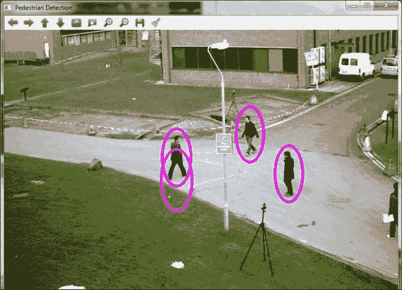
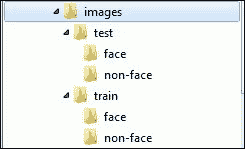
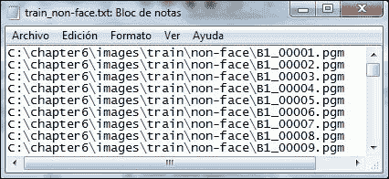
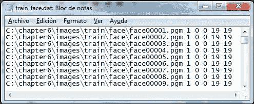
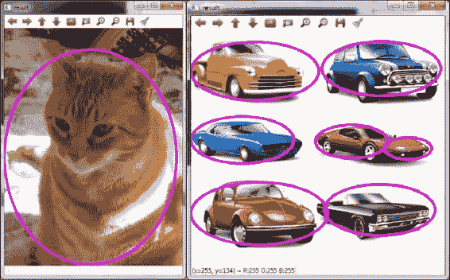
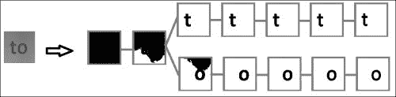
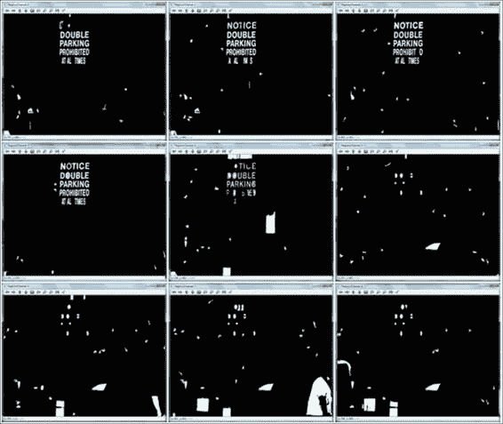

# 第六章。沃尔在哪里？目标检测

本章解释了如何使用 OpenCV 目标检测模块中包含的不同选项。通过包含的示例代码，可以使用级联和潜在 SVM 检测器，以及为特定目标检测应用创建自定义级联检测器。此外，本章还解释了 OpenCV 3 中包含的新场景文本检测器。

# 目标检测

目标检测处理的是在图像或视频中定位现实世界对象某一类实例的过程，例如人脸、汽车、行人和建筑物。检测算法通常首先从两组图像中提取特征。其中一组包含目标图像，另一组包含背景图像，其中搜索的对象不存在。然后，基于这些特征对这些检测器进行训练，以识别对象类未来的实例。

### 注意

指纹识别，现在被集成在一些笔记本电脑和智能手机中，或者大多数数码相机中常见的面部检测，都是目标检测应用的日常例子。

# 使用 OpenCV 进行对象检测

OpenCV 在其`objdetect`模块中实现了多种目标检测算法。在这个模块中，实现了级联和潜在 SVM 检测器，以及 OpenCV 3 中新增的场景文本检测器。所有这些算法都相对高效，并能获得准确的结果。

# 级联很美

大多数目标检测问题，如人脸/人体检测或医学中的病变检测，都需要在许多图像块中搜索目标。然而，检查所有图像区域并为每个区域计算特征集都是耗时的任务。级联检测器因其在此方面的效率高而得到广泛应用。

级联检测器由各种提升阶段组成。提升算法选择最佳特征集来创建和组合多个弱树分类器。因此，提升不仅是一个检测器，也是一种特征选择方法。每个阶段通常训练以正确检测近 100%的对象并丢弃至少 50%的背景图像。因此，背景图像，代表更多的图像，在级联的早期阶段被丢弃时需要更少的时间处理。此外，最终的级联阶段使用比早期阶段更多的特征，即使如此，只有目标和难以识别的背景图像需要更多的时间来评估。

离散 AdaBoost（自适应提升）、真实 AdaBoost、温和 AdaBoost 和 LogitBoost 都在 OpenCV 中作为提升阶段实现。另一方面，可以使用 Haar-like、**局部二值模式**（**LBP**）和**方向梯度直方图**（**HOG**）特征与不同的提升算法一起使用。

所有这些优点和可用技术使级联在构建实用检测应用方面非常有用。

## 使用级联进行目标检测

OpenCV 附带了一些预训练的级联检测器，用于最常见的检测问题。它们位于`OPENCV_SOURCE\data`目录下。以下是一些及其对应的子目录列表：

+   子目录 `haarcascades`:

    +   `haarcascade_frontalface_default.xml`

    +   `haarcascade_eye.xml`

    +   `haarcascade_mcs_nose.xml`

    +   `haarcascade_mcs_mouth.xml`

    +   `haarcascade_upperbody.xml`

    +   `haarcascade_lowerbody.xml`

    +   `haarcascade_fullbody.xml`

+   子目录 `lbpcascades`:

    +   `lbpcascade_frontalface.xml`

    +   `lbpcascade_profileface.xml`

    +   `lbpcascade_silverware.xml`

+   子目录 `hogcascades`:

    +   `hogcascade_pedestrians.xml`

以下`pedestrianDetection`示例用于说明如何使用级联检测器并在 OpenCV 的视频文件中定位行人：

```py
#include "opencv2/core/core.hpp"
#include "opencv2/objdetect/objdetect.hpp"
#include "opencv2/highgui/highgui.hpp"
#include "opencv2/imgproc/imgproc.hpp"
#include <iostream>

using namespace std;
using namespace cv;

int main(int argc, char *argv[]){
    CascadeClassifier cascade(argv[1]);
    if (cascade.empty())
        return -1;

    VideoCapture vid(argv[2]);
    if (!vid.isOpened()){
        cout<<"Error. The video cannot be opened."<<endl;
        return -1;
    }

    namedWindow("Pedestrian Detection");
    Mat frame;
    while(1) {
        if (!vid.read(frame))
            break;

        Mat frame_gray;
        if(frame.channels()>1){
            cvtColor( frame, frame_gray, CV_BGR2GRAY );
            equalizeHist( frame_gray, frame_gray );
        }else{
            frame_gray = frame;
        }

        vector<Rect> pedestrians;
        cascade.detectMultiScale( frame_gray, pedestrians, 1.1, 2, 0, Size(30, 30), Size(150, 150) );

        for( size_t i = 0; i < pedestrians.size(); i++ ) {
            Point center( pedestrians[i].x + 
                          pedestrians[i].width*0.5, 
                          pedestrians[i].y + 
                          pedestrians[i].height*0.5 );
            ellipse( frame, center, Size( pedestrians[i].width*0.5,
                     pedestrians[i].height*0.5), 0, 0, 360, 
                     Scalar( 255, 0, 255 ), 4, 8, 0 );
        }

        imshow("Pedestrian Detection", frame);
        if(waitKey(100) >= 0)
            break;
    }
    return 0;
}
```

代码说明如下：

+   `CascadeClassifier`: 此类提供在处理级联时所需的所有方法。此类的一个对象代表一个训练好的级联检测器。

+   `constructor CascadeClassifier:: CascadeClassifier(const string& filename)`: 此类初始化对象实例并加载存储在系统文件中由变量`filename`指示的级联检测器的信息。

    ### 注意

    注意，方法 `bool CascadeClassifier::load(const string& filename)` 实际上在构造函数之后隐式调用。

+   `bool CascadeClassifier:: empty()`: 此方法检查级联检测器是否已加载。

+   `cvtColor`和`equalizeHist`：这些方法用于图像灰度转换和直方图均衡。由于级联检测器是用灰度图像训练的，而输入图像可以有不同的格式，因此需要将它们转换为正确的颜色空间并均衡它们的直方图，以获得更好的结果。这是通过以下使用`cvtColor`和`equalizeHist`函数的代码完成的：

    ```py
    Mat frame_gray;
    if(frame.channels()>1){
        cvtColor( frame, frame_gray, CV_BGR2GRAY );
        equalizeHist( frame_gray, frame_gray );
    }else{
        frame_gray = frame;
    }
    ```

+   `void CascadeClassifier::detectMultiScale(const Mat& image, vector<Rect>& objects, double scaleFactor=1.1, int minNeighbors=3, int flags=0, Size minSize=Size(), Size maxSize=Size())`: 此方法检查`image`变量中的图像，应用加载的级联，并将所有检测到的对象插入到`objects`中。检测结果存储在类型为`Rect`的矩形向量中。参数`scaleFactor`和`minNeighbors`表示在考虑的每个图像缩放级别中图像大小减少的程度以及指示正检测的最小邻居数。检测受`minSize`和`maxSize`指示的最小和最大尺寸限制。最后，当使用用`opencv_traincascade`创建的级联时，参数`flags`不使用。

    ### 小贴士

    在获得存储检测对象的向量后，通过读取每个矩形（由`Rect`类的对象表示）的坐标，很容易在原始图像上显示它们，并在指定的区域绘制多边形。

下面的截图显示了将基于 HOG 的预训练行人检测器`hogcascade_pedestrians.xml`应用于`768x576.avi`视频帧的结果，该视频存储在`OPENCV_SCR/samples`文件夹中。



使用 OpenCV 训练的 HOG 级联检测器进行行人检测

有几个项目和贡献解决了 OpenCV 社区中的其他检测相关的问题，这些问题不仅涉及检测对象，还包括区分其状态。这类检测器的一个例子是自版本 2.4.4 以来包含在 OpenCV 中的微笑检测器。代码可以在文件`OPENCV_SCR/samples/c/smiledetect.cpp`中找到，存储级联检测器的 XML 文件`haarcascade_smile.xml`可以在`OPENCV_SCR/data/haarcascades`中找到。此代码首先使用存储在`haarcascade_frontalface_alt.xml`中的预训练级联检测正面人脸，然后检测图像底部部分的微笑嘴部模式。最后，根据检测到的邻居数量计算微笑的强度。

## 训练自己的级联

尽管 OpenCV 提供了预训练的级联，但在某些情况下，有必要训练一个级联检测器来寻找特定的对象。对于这些情况，OpenCV 附带了一些工具来帮助训练级联，生成训练过程中所需的所有数据以及包含检测器信息的最终文件。这些文件通常存储在`OPENCV_BUILD\install\x64\mingw\bin`目录中。以下是一些应用程序的列表：

+   `opencv_haartraining`：这个应用程序在历史上是创建级联的第一个版本。

+   `opencv_traincascade`：这个应用程序是创建级联应用程序的最新版本。

+   `opencv_createsamples`：这个应用程序用于创建包含对象实例的图像的`.vec`文件。生成的文件被前面的训练可执行文件接受。

+   `opencv_performance`：这个应用程序可以用来评估使用`opencv_haartraining`工具训练的级联。它使用一组标记的图像来获取评估信息，例如误报或检测率。

由于`opencv_haartraining`是较老版本的程序，并且它比`opencv_traincascade`具有更少的功能，因此这里只描述后者。

在这里，使用 MIT CBCL 人脸数据库解释级联训练过程。该数据库包含 19 x 19 像素的人脸和背景图像，排列方式如以下截图所示：



图片文件组织

### 注意

本节解释了在 Windows 上的训练过程。对于 Linux 和 Mac OS X，过程类似，但会考虑操作系统的特定方面。有关在 Linux 和 Mac OS X 上训练级联检测器的更多信息，请参阅 [`opencvuser.blogspot.co.uk/2011/08/creating-haar-cascade-classifier-aka.html`](http://opencvuser.blogspot.co.uk/2011/08/creating-haar-cascade-classifier-aka.html) 和 [`kaflurbaleen.blogspot.co.uk/2012/11/how-to-train-your-classifier-on-mac.html`](http://kaflurbaleen.blogspot.co.uk/2012/11/how-to-train-your-classifier-on-mac.html)。

训练过程包括以下步骤：

1.  **设置当前目录**：在 **命令提示符** 窗口中，将当前目录设置为存储训练图像的目录。例如，如果目录是 `C:\chapter6\images`，则使用以下命令：

    ```py
    >cd C:\chapter6\images

    ```

1.  **创建背景图像信息文本文件**：如果背景图像存储在 `C:\chapter6\images\train\non-face` 且其格式为 `.pgm`，则可以使用以下命令创建 OpenCV 所需的文本文件：

    ```py
    >for %i in (C:\chapter6\images\train\non-face\*.pgm) do @echo %i >> train_non-face.txt

    ```

    以下截图显示了背景图像信息文件的内容。此文件包含背景图像的路径：

    

    背景图像信息文件

1.  **创建目标图像文件**：这涉及以下两个步骤：

    1.  创建包含目标坐标的 `.dat` 文件。在此特定数据库中，目标图像仅包含一个目标实例，且位于图像中心，并缩放以占据整个图像。因此，每张图像中的目标数量为 1，目标坐标为 `0 0 19 19`，这是包含目标的矩形的初始点以及宽度和高度。

        如果目标图像存储在 `C:\chapter6\images\train\face`，则可以使用以下命令生成文件：

        ```py
        >for %i in (C:\chapter6\images\train\face\*.pgm) do @echo %i 1 0 0 19 19 >> train_face.dat

        ```

        `.dat` 文件的内容可以在以下截图中看到：

        

        目标图像文件

    1.  在创建包含目标坐标的 `.dat` 文件后，需要创建 OpenCV 所需的 `.vec` 文件。此步骤可以使用 `opencv_createsamples` 程序执行，并使用以下参数：`–info`（`.dat` 文件）；`-vec`（`.vec` 输出文件名）；`-num`（图像数量）；`-w` 和 `–h`（输出图像宽度和高度）；以及 `–maxxangle`、`-maxyangle` 和 `-maxzangle`（图像旋转角度）。要查看更多选项，请不带参数执行 `opencv_createsamples`。在这种情况下，使用的命令如下：

        ```py
        >opencv_createsamples -info train_face.dat -vec train_face.vec -num 2429 -w 19 -h 19 -maxxangle 0 -maxyangle 0 -maxzangle 0

        ```

        ### 小贴士

        OpenCV 包含一个大小为 24 x 24 像素的样本 `.vec` 文件，包含面部图像。

1.  **训练级联**：最后，使用 `opencv_traincascade` 可执行文件并训练级联检测器。在这种情况下使用的命令如下：

    ```py
    >opencv_traincascade -data C:\chapter6\trainedCascade -vec train_face.vec -bg train_non-face.txt -numPos 242 -numNeg 454 -numStages 10 -w 19 -h 19

    ```

    参数表示输出目录（`-data`）、`.vec` 文件（`-vec`）、背景信息文件（`-bg`）、每个阶段训练的正负图像数量（`-numPos` 和 `–numNeg`）、最大阶段数（`-numStages`）以及图像的宽度和高度（`-w` 和 `–h`）。

    训练过程的输出如下：

    ```py
    PARAMETERS:
    cascadeDirName: C:\chapter6\trainedCascade
    vecFileName: train_face.vec
    bgFileName: train_non-face.txt
    numPos: 242
    numNeg: 454
    numStages: 10
    precalcValBufSize[Mb] : 256
    precalcIdxBufSize[Mb] : 256
    stageType: BOOST
    featureType: HAAR
    sampleWidth: 19
    sampleHeight: 19
    boostType: GAB
    minHitRate: 0.995
    maxFalseAlarmRate: 0.5
    weightTrimRate: 0.95
    maxDepth: 1
    maxWeakCount: 100
    mode: BASIC
    ===== TRAINING 0-stage =====
    <BEGIN
    POS count : consumed   242 : 242
    NEG count : acceptanceRatio    454 : 1
    Precalculation time: 4.524
    +----+---------+---------+
    |  N |    HR   |    FA   |
    +----+---------+---------+
    |   1|        1|        1|
    +----+---------+---------+
    |   2|        1|        1|
    +----+---------+---------+
    |   3| 0.995868| 0.314978|
    +----+---------+---------+
    END>
    Training until now has taken 0 days 0 hours 0 minutes 9 seconds.
    . . . Stages 1, 2, 3, and 4 . . .
    ===== TRAINING 5-stage =====
    <BEGIN
    POS count : consumed   242 : 247
    NEG count : acceptanceRatio    454 : 0.000220059
    Required leaf false alarm rate achieved. Branch training terminated.

    ```

最后，级联的 XML 文件存储在输出目录中。这些文件是 `cascade.xml`、`params.xml` 和一系列 `stageX.xml` 文件，其中 `X` 是阶段号。

# Latent SVM

Latent SVM 是一种使用 HOG 特征和由根滤波器以及一系列部分滤波器组成的星形结构、基于部分模型的检测器，用于表示一个对象类别。HOGs 是通过计算图像局部区域中梯度方向出现的频率而获得的特征描述符。另一方面，在这个检测器中使用了 **支持向量机**（**SVM**）分类器的变体，用于使用部分标记的数据训练模型。SVM 的基本思想是在高维空间中构建一个或多个超平面。这些超平面被用来具有最大的距离到最近的训练数据点（功能间隔以实现低泛化误差）。像级联检测器一样，Latent SVM 使用一个滑动窗口，具有不同的初始位置和尺度，算法应用于检测窗口内是否存在对象。

OpenCV Latent SVM 实现的一个优点是它允许通过在同一多对象检测器实例中结合几个简单的预训练检测器来检测多个对象类别。

以下 `latentDetection` 示例说明了如何使用 Latent SVM 检测器从图像中定位某一类别的对象：

```py
#include "opencv2/core/core.hpp"
#include "opencv2/objdetect/objdetect.hpp"
#include "opencv2/highgui/highgui.hpp"
#include <iostream>

using namespace std;
using namespace cv;

int main(int argc, char* argv[]){
    String model = argv[1];
    vector<String> models;
    models.push_back( model );
    vector<String> names;
    names.push_back( "category" );
    LatentSvmDetector detector( models , names);
    if( detector.empty() ) {
        cout << "Model cannot be loaded" << endl;
        return -1;
    }

    String img = argv[2];
    Mat image = imread( img );
    if( image.empty() ){
        cout << "Image cannot be loaded" << endl;
        return -1;
    }

    vector<LatentSvmDetector::ObjectDetection> detections;
    detector.detect( image, detections, 0.1, 1);
    for( size_t i = 0; i < detections.size(); i++ ) {
        Point center( detections[i].rect.x + 
                      detections[i].rect.width*0.5, 
                      detections[i].rect.y + 
                      detections[i].rect.height*0.5 );
        ellipse( image, center, Size( detections[i].rect.width*0.5, 
                 detections[i].rect.height*0.5), 0, 0, 360, 
                 Scalar( 255, 0, 255 ), 4, 8, 0 );
    }
    imshow( "result", image );
    waitKey(0);
    return 0;
}
```

代码解释如下：

+   `LatentSvmDetector`: 此类有一个对象，代表由一个或多个预训练检测器组成的 Latent SVM 检测器。

+   `constructor LatentSvmDetector::LatentSvmDetector(const vector<String>& filenames, const vector<string>& classNames=vector<String>())`: 此类初始化对象实例并加载存储在系统路径中由向量 `filenames` 指示的检测器信息。第二个参数，向量 `classNames` 包含类别名称。构造函数之后隐式调用方法 `bool LatentSvmDetector::load(const vector<string>& filenames, const vector<string>& classNames=vector<string>())`。

+   `void LatentSvmDetector::detect(const Mat& image, vector<ObjectDetection>& objectDetections, float overlapThreshold = 0.5f, int numThreads = -1)`: 此方法通过在变量 `image` 上应用简单或组合检测器来检查图像，并将所有检测到的对象放入 `objectDetections`。所有检测都存储在 `ObjectDetection` 结构体的向量中。此结构体有以下三个变量：

    +   检测到的边界框（`rect`）

    +   置信度水平（`score`）

    +   类别 ID（`classID`）

    参数`overlapThreshold`是非最大值抑制算法用于消除重叠检测的阈值。最后，`numThreads`是算法并行版本中使用的线程数。

以下截图显示了使用之前的代码和文件`cat.xml`和`cat.png`检测到的猫，以及使用`car.xml`和`cars.png`检测到的汽车。这些文件包含在 OpenCV 额外数据中，可以在官方仓库中找到。因此，可以使用以下命令运行程序：

```py
>latentDetection.exe xmlfile imagefile

```

在之前的命令中，`xmlfile`是潜在 SVM 检测器，`imagefile`是要检查的图像。

### 注意

OpenCV 额外数据提供了更多样本和测试文件，用户可以使用这些文件创建和测试自己的项目，同时节省时间。可以在[`github.com/Itseez/opencv_extra`](https://github.com/Itseez/opencv_extra)找到。

除了汽车和猫检测器之外，OpenCV 还为*2007 年 PASCAL 视觉对象类别挑战赛*中定义的其他类别提供了预训练的检测器([`pascallin.ecs.soton.ac.uk/challenges/VOC/voc2007`](http://pascallin.ecs.soton.ac.uk/challenges/VOC/voc2007))。以下是一些检测器：

+   `aeroplane.xml`

+   `bicycle.xml`

+   `bird.xml`

+   `boat.xml`

+   `bottle.xml`

+   `bus.xml`

+   `car.xml`

+   `cat.xml`

+   `chair.xml`

+   `cow.xml`

+   `diningtable.xml`

+   `dog.xml`

+   `horse.xml`

+   `motorbike.xml`

+   `person.xml`

+   `pottedplant.xml`

+   `sheep.xml`

+   `sofa.xml`

+   `train.xml`

+   `tvmonitor.xml`



使用潜在 SVM 检测到的猫和一些汽车

### 小贴士

可以通过更改`overlapThreshold`参数的值来调整误报率。

# 场景文本检测

场景文本检测算法通过逐步从 0 到 255 对图像进行阈值处理来构建图像的组件树。为了增强结果，这个过程对每个颜色通道、强度和梯度幅度图像都进行了处理。之后，从连续级别获得的连通组件根据它们的包含关系进行分层组织，如下所示图所示。这种树状组织可能包含大量的区域：



树状组织示例

因此，算法在两个阶段之后选择了一些区域。首先，为每个区域计算面积、周长、边界框和欧拉数描述符，并按顺序使用它们来估计类条件概率。如果外部区域的局部最大概率值高于全局限制，并且它们的局部最大值和最小值之间的差异也高于指定的限制，则选择具有局部最大概率的外部区域。

第二阶段包括将第一阶段选定的外部区域根据整个区域比率、凸包比率和外边界拐点数量作为特征分类为字符和非字符类别。

最后，选定的外部区域被分组以获得单词、行或段落。算法的这一部分使用基于感知组织的聚类分析。

以下 `textDetection` 示例说明了如何使用场景文本检测算法并在图像中定位文本：

```py
#include "opencv2/opencv.hpp"
#include "opencv2/objdetect.hpp"
#include "opencv2/highgui.hpp"
#include "opencv2/imgproc.hpp"

#include <vector>
#include <iostream>
#include <iomanip>

using namespace std;
using namespace cv;

int main(int argc, const char * argv[]){

    Mat src = imread(argv[1]);

    vector<Mat> channels;
    computeNMChannels(src, channels);

    //Negative images from RGB channels
    channels.push_back(255-channels[0]);
    channels.push_back(255-channels[1]); 
    channels.push_back(255-channels[2]);
    channels.push_back(255-channels[3]);
    for (int c = 0; c < channels.size(); c++){
        stringstream ss;
        ss << "Channel: " << c;
        imshow(ss.str(),channels.at(c));
    }

    Ptr<ERFilter> er_filter1 = createERFilterNM1(
                                   loadClassifierNM1(argv[2]),
                                   16, 0.00015f, 0.13f, 0.2f,
true, 0.1f );
    Ptr<ERFilter> er_filter2 = createERFilterNM2(
                                   loadClassifierNM2(argv[3]),  0.5 );

    vector<vector<ERStat> > regions(channels.size());
    // Apply filters to each channel
    for (int c=0; c<(int)channels.size(); c++){
        er_filter1->run(channels[c], regions[c]);
        er_filter2->run(channels[c], regions[c]);
    }
    for (int c=0; c<(int)channels.size(); c++){
        Mat dst = Mat::zeros( channels[0].rows + 
                              2, channels[0].cols + 2, CV_8UC1 );
        // Show ERs
        for (int r=0; r<(int)regions[c].size(); r++)
        {
            ERStat er = regions[c][r];
            if (er.parent != NULL){
                int newMaskVal = 255;
                int flags = 4 + (newMaskVal << 8) + 
                                 FLOODFILL_FIXED_RANGE + 
                                 FLOODFILL_MASK_ONLY;
                floodFill( channels[c], dst, Point(er.pixel % 
                           channels[c].cols,er.pixel / 
                           channels[c].cols), Scalar(255), 0, 
                           Scalar(er.level), Scalar(0), flags);
            }
        }
        stringstream ss;
        ss << "Regions/Channel: " << c;
        imshow(ss.str(), dst);
    }

    vector<Rect> groups;
    erGrouping( channels, regions, argv[4], 0.5, groups );
    for (int i=(int)groups.size()-1; i>=0; i--)
    {
        if (src.type() == CV_8UC3)
            rectangle( src,groups.at(i).tl(), groups.at(i).br(), 
                       Scalar( 0, 255, 255 ), 3, 8 );
        else
            rectangle( src,groups.at(i).tl(), groups.at(i).br(), 
                       Scalar( 255 ), 3, 8 );
    }
    imshow("grouping",src);

    waitKey(-1);
    er_filter1.release();
    er_filter2.release();
    regions.clear();
    groups.clear();
}
```

代码说明如下：

+   `void computeNMChannels(InputArray _src, OutputArrayOfArrays _channels, int _mode=ERFILTER_NM_RGBLGrad)`: 这个函数从 `_src` 图像中计算不同的通道，以便独立处理以获得高定位召回率。默认情况下（`_mode=ERFILTER_NM_RGBLGrad`），这些通道是红色（`R`）、绿色（`G`）、蓝色（`B`）、亮度（`L`）和梯度幅度（∇），如果 `_mode=ERFILTER_NM_IHSGrad`，则是强度（I）、色调（H）、饱和度（S）和梯度幅度（∇）。最后，计算出的通道保存在 `_channels` 参数中。

+   `Ptr<ERFilter> createERFilterNM1(const Ptr<ERFilter::Callback>& cb, int thresholdDelta = 1, float minArea = 0.00025, float maxArea = 0.13, float minProbability = 0.4, bool nonMaxSuppression = true, float minProbabilityDiff = 0.1)`: 这个函数创建了一个用于算法定义的第一阶段分类器的极值区域过滤器。第一个参数通过函数 `loadClassifierNM1(const std::string& filename)` 加载分类器。`thresholdDelta` 变量指示在组件树获取过程中的阈值步长。参数 `minArea` 和 `maxArea` 建立了外部区域检索的图像大小百分比。当在分支概率上应用非最大值抑制时，布尔参数 `nonMaxSuppression` 的值为 `true`，否则为 `false`。最后，`minProbability` 和 `minProbabilityDiff` 参数控制检索外部区域允许的最小概率值和最大值与最小值之间的最小概率差异。

+   `Ptr<ERFilter> createERFilterNM2(const Ptr<ERFilter::Callback>& cb, float minProbability = 0.3)`: 这个函数创建了一个用于算法定义的第二阶段分类器的外部区域过滤器。第一个参数通过函数 `loadClassifierNM2(const std::string& filename)` 加载分类器。其他参数 `minProbability` 是允许检索外部区域的最小概率。

+   `void ERFilter::run( InputArray image, std::vector<ERStat>& regions)`: 这个方法将过滤器加载的级联分类器应用于获取第一级或第二级的外部区域。`image` 参数是需要检查的通道，`regions` 是第一阶段的输出以及第二阶段的输入/输出。

+   `void erGrouping(InputArrayOfArrays src, std::vector<std::vector<ERStat>>& regions, const std::string& filename, float minProbability, std::vector<Rect>& groups)`: 此函数将获取的外部区域分组。它使用提取的通道 (`src`)、每个通道获取的外部区域 (`regions`)、分组分类器的路径以及接受一个组的最低概率 (`minProbability`)。最终组，即来自 `Rect` 的矩形，存储在 `groups` 向量中。

以下一系列截图显示了获取的图像通道。这些是红色 (`R`)、绿色 (`G`)、蓝色 (`B`)、强度 (`I`)、梯度幅度 (∇)、反转红色 (`iR`)、反转绿色 (`iG`)、反转蓝色 (`iB`) 和反转强度 (`iI`)。在第一行中，显示了 `R`、`G` 和 `B` 通道。第二行显示了 I、∇ 和 iR 通道。最后，在第三行中，显示了 iG、iB 和 iI 通道：


提取的图像通道

以下一系列截图显示了可以查看从每个通道提取的外部区域。通道 `R`、`G`、`B`、`L` 和 ∇ 产生更准确的结果。在第一行中，显示了 `R`、`G` 和 `B` 通道的外部区域。第二行显示了从 I、∇ 和 iR 通道提取的外部区域。最后，在第三行中，显示了 `iG`、`iB` 和 `iI` 通道：



从每个通道获取的外部区域

最后，以下截图显示了将文本区域分组为行和段落的输入图像：


获取的组

### 注意

要重现这些结果或使用 OpenCV 场景文本检测器，可以使用库提供的示例文件运行此代码。输入图像和分类器可以在 `OPENCV_SCR/samples/cpp` 目录中找到。这里使用的图像是 `cenetext01.jpg`。第一级和第二级分类器是 `trained_classifierNM1.xml` 和 `trained_classifierNM2.xml`。最后，OpenCV 提供的分组分类器是 `trained_classifier_erGrouping.xml`。

# 摘要

本章介绍了 OpenCV 的 `objdetect` 模块。它解释了如何使用和训练级联检测器以及如何使用潜在 SVM 检测器。此外，本章还解释了 OpenCV 3 中包含的新场景文本检测器。

下一章将解释检测和跟踪运动对象的方法。

# 还有什么？

级联检测器已在多个应用中得到了广泛应用，例如人脸识别和行人检测，因为它们速度快且提供良好的结果。软级联是经典级联检测器的一种变体。这种新型级联在 OpenCV 3 的`softcascade`模块中实现。软级联使用 AdaBoost 进行训练，但生成的检测器仅由一个阶段组成。这个阶段有几个弱分类器，它们按顺序进行评估。在评估每个弱分类器后，结果将与相应的阈值进行比较。与多阶段级联中进行的评估过程类似，一旦评估出负的非目标实例，就会尽快将其丢弃。
