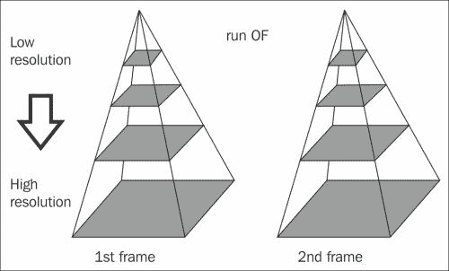
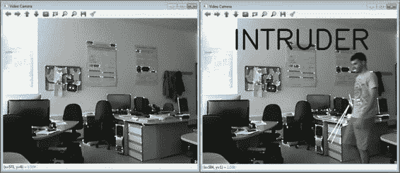
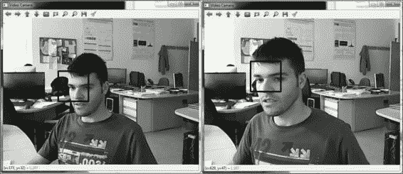
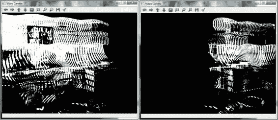
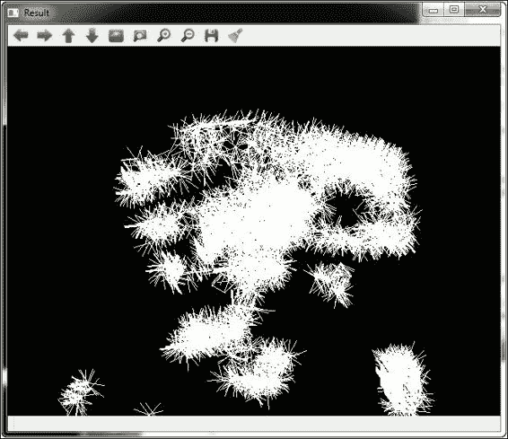
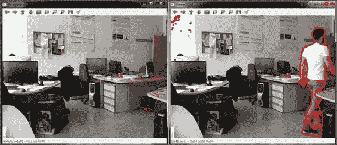
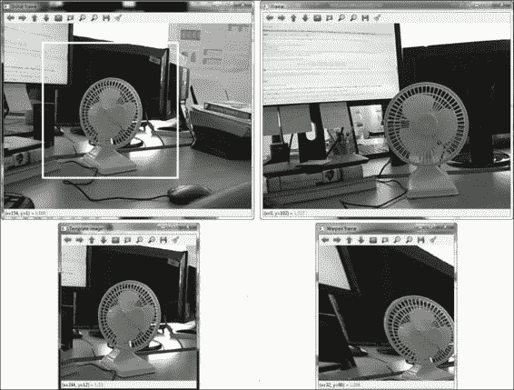

# 第七章. 他正在做什么？运动

在本章中，我们将向您展示从视频帧中估计出的不同运动技术。在简短介绍和定义之后，我们将向您展示如何读取从摄像头捕获的视频帧。然后，我们将探讨至关重要的光流技术。在第三部分，我们将向您展示可用于跟踪的不同函数。运动历史和背景减法技术在第四和第五部分中分别解释。最后，我们将解释使用 ECC 方法进行图像对齐。每个示例都已针对 GitHub 上 OpenCV 的最新版本开发和测试。大多数函数在先前版本中也可以同样工作，导致了一些将被讨论的变化。本章中介绍的大多数函数都在`video`模块中。

### 注意

要测试 GitHub 上可用的最新源代码，请访问[`github.com/itseez/opencv`](https://github.com/itseez/opencv)并下载库代码作为 ZIP 文件。然后将其解压到本地文件夹，并按照第一章中描述的相同步骤，*开始*，来编译和安装库。

# 运动历史

运动是计算机视觉中的一个非常重要的话题。一旦我们检测和隔离了感兴趣的对象或人，我们就可以提取有价值的数据，如位置、速度、加速度等。这些信息可用于动作识别、行为模式研究、视频稳定、增强现实等。

光流技术是一种对象的明显运动模式。视觉场景中的表面和边缘是由观察者与场景或摄像头与场景之间的相对运动引起的。光流技术的概念在计算机视觉中至关重要，并与运动检测、对象分割、时间控制信息、扩展焦点计算、亮度、运动补偿编码和立体视差测量等技术/任务相关联。

**视频跟踪**是指使用从摄像头或文件捕获的视频在一段时间内定位移动对象（或多个对象）。视频跟踪的目的是将连续视频帧中的目标对象关联起来。它有多种用途，其中一些包括视频编辑、医学成像、交通控制、增强现实、视频通信和压缩、安全和监控以及人机交互。

**运动**模板是在 1996 年由 Bobick 和 David 在麻省理工学院媒体实验室发明的。使用运动模板是一种简单而稳健的技术，可以跟踪一般运动。OpenCV 运动模板函数仅适用于单通道图像。需要一个物体的轮廓（或部分轮廓）。这些轮廓可以通过不同的方式获得。例如，可以使用分割技术来检测感兴趣的对象，然后使用运动模板进行跟踪。另一种选择是使用背景减法技术来检测前景对象，然后跟踪它们。还有其他技术，尽管在本章中，我们将看到两个使用背景减法技术的示例。

**背景减法**是一种技术，通过它可以从图像中提取前景或感兴趣区域以进行进一步处理，例如人、汽车、文本等。背景减法技术是检测从静态摄像头捕获的视频中移动对象的一种广泛使用的方法。背景减法技术的本质是从当前帧和没有目标对象存在的参考图像之间的差异中检测移动对象，这通常被称为背景图像。

**图像配准**可以看作是来自不同视角的两个或多个图像的坐标系之间的映射。因此，第一步是选择一个合适的几何变换，足以模拟这种映射。该算法可以应用于广泛的领域，例如图像配准、目标跟踪、超分辨率和移动摄像头的视觉监控。

# 读取视频序列

要处理视频序列，我们应该能够读取每一帧。OpenCV 开发了一个易于使用的框架，可以处理视频文件和摄像头输入。

以下代码是一个 `videoCamera` 示例，它使用从视频摄像头捕获的视频。这个示例是对 第一章 中的示例的修改，*入门指南*，我们将用它作为本章其他示例的基本结构：

```py
#include "opencv2/opencv.hpp"

using namespace std;
using namespace cv;

int videoCamera()
{
    //1-Open the video camera
    VideoCapture capture(0);

    //Check if video camera is opened
    if(!capture.isOpened()) return 1;

    bool finish = false;
    Mat frame;
    Mat prev_frame;
    namedWindow("Video Camera");

    if(!capture.read(prev_frame)) return 1;

    //Convert to gray image
 cvtColor(prev_frame,prev_frame,COLOR_BGR2GRAY);

    while(!finish)
    {
        //2-Read each frame, if possible
        if(!capture.read(frame)) return 1;

        //Convert to gray image
 cvtColor(frame ,frame, COLOR_BGR2GRAY);

        //Here, we will put other functions 

        imshow("Video Camera", prev_frame);

        //Press Esc to finish
        if(waitKey(1)==27) finish = true;

        prev_frame = frame;
    }
    //Release the video camera
    capture.release();
    return 0;
}

int main( )
{
 videoCamera();
}
```

之前的代码示例创建了一个窗口，显示灰度视频的摄像头捕获。为了启动捕获，已经创建了一个 `VideoCapture` 类的实例，其摄像头索引为零。然后，我们检查视频捕获是否可以成功启动。然后使用 `read` 方法从视频序列中读取每一帧。该视频序列使用 `cvtColor` 方法与 `COLOR_BGR2GRAY` 参数转换为灰度，并在用户按下 *Esc* 键之前显示在屏幕上。然后，最终释放视频序列。上一帧被存储，因为它将被用于后续的一些示例。

### 注意

`COLOR_BGR2GRAY` 参数可以在 OpenCV 3.0 中使用。在之前的版本中，我们也有 `CV_BGR2GRAY`。

在总结中，我们向您展示了一个使用视频相机处理视频序列的简单方法。最重要的是，我们已经学会了如何访问每个视频帧，现在可以处理任何类型的帧。

### 注意

关于 OpenCV 支持的音视频格式，更多详细信息可以在[ffmpeg.org](http://ffmpeg.org)网站上找到，该网站提供了一个完整的开源跨平台解决方案，用于音频和视频的读取、录制、转换和流式传输。与视频文件一起工作的 OpenCV 类都是基于这个库构建的。在[Xvid.org](http://Xvid.org)网站上，你可以找到一个基于 MPEG-4 标准的开源视频编解码库。这个编解码库有一个竞争对手叫做 DivX，它提供专有但免费的编解码器和软件工具。

# Lucas-Kanade 光流

**Lucas-Kanade**（**LK**）算法最初于 1981 年提出，并已成为计算机视觉中最成功的方法之一。目前，这种方法通常应用于输入图像的关键点子集。该方法假设光流是考虑像素局部邻域中的一个必要常数，并为该邻域中的每个像素（x, y）解决基本光流技术方程（见方程（1））。该方法还假设连续帧之间的位移很小，并且是获得考虑点过度约束系统的一种方法：

```py
*I(x, y, t) = I(x + ∆x, y + ∆y, t + ∆t)            (1)*

```

我们现在将关注**金字塔 Lucas-Kanade**方法，该方法使用`calcOpticalFlowPyrLK()`函数在金字塔中估计光流。这种方法首先在金字塔的顶部估计光流，从而避免了由违反我们对小而一致运动假设引起的问题。然后，从这个第一级的光流估计被用作下一个级别的运动估计的起点，如下图中金字塔所示：



金字塔 Lucas-Kanade

以下示例使用`maxMovementLK`函数实现运动检测器：

```py
void maxMovementLK(Mat& prev_frame, Mat& frame)
{
    // 1-Detect right features to apply the Optical Flow technique
    vector<Point2f> initial_features;
 goodFeaturesToTrack(prev_frame, initial_features,MAX_FEATURES, 0.1, 0.2 );

    // 2-Set the parameters
    vector<Point2f>new_features;
    vector<uchar>status;
    vector<float> err;
    TermCriteria criteria(TermCriteria::COUNT | TermCriteria::EPS, 20, 0.03);
    Size window(10,10);
    int max_level = 3;
    int flags = 0;
    double min_eigT = 0.004;

    // 3-Lucas-Kanade method for the Optical Flow technique
 calcOpticalFlowPyrLK(prev_frame, frame, initial_features, new_features, status, err, window, max_level, criteria, flags, min_eigT );

    // 4-Show the results
    double max_move = 0;
    double movement = 0;
    for(int i=0; i<initial_features.size(); i++)
    {
        Point pointA (initial_features[i].x, initial_features[i].y);
        Point pointB(new_features[i].x, new_features[i].y);
        line(prev_frame, pointA, pointB, Scalar(255,0,0), 2);

        movement = norm(pointA-pointB);
        if(movement > max_move)
            max_move = movement;
    }
    if(max_move >MAX_MOVEMENT)
    {
        putText(prev_frame,"INTRUDER",Point(100,100),FONT_ITALIC,3,Scalar(255,0,0),5);
        imshow("Video Camera", prev_frame);
        cout << "Press a key to continue..." << endl;
        waitKey();
    }
} 
```

上述示例展示了每次移动时窗口的显示情况。如果存在较大移动，屏幕上会显示一条消息。首先，我们需要在图像中获取一组适当的关键点，以便我们可以估计光流。`goodFeaturesToTrack()`函数使用 Shi 和 Tomasi 最初提出的方法以可靠的方式解决这个问题，尽管你也可以使用其他函数来检测重要且易于跟踪的特征（参见第五章，*专注于有趣的 2D 特征*）。`MAX_FEATURES`被设置为`500`以限制关键点的数量。然后设置 Lucas-Kanade 方法参数并调用`calcOpticalFlowPyrLK()`。当函数返回时，检查状态(`status`)数组以查看哪些点被成功跟踪，并且使用估计位置的新点集(`new_features`)。绘制线条以表示运动，如果位移大于`MAX_MOVEMENT`——例如——100，屏幕上会显示一条消息。我们可以看到以下两个屏幕截图：



`maxMovementLK`示例的输出

使用修改后的`videoCamera`示例，我们已将`maxMovementLK()`函数应用于检测大移动：

```py
...
while(!finish)
{
   capture.read(frame);

   cvtColor(frame,frame,COLOR_BGR2GRAY);

// Detect Maximum Movement with Lucas-Kanade Method
 maxMovementLK(prev_frame, frame);
...
```

这种方法计算效率高，因为跟踪仅在重要或有趣点上执行。

# Gunnar-Farneback 光流

**Gunnar-Farneback**算法被开发出来以产生密集的光流技术结果（即在密集的点网格上）。第一步是使用二次多项式近似两帧的每个邻域。之后，考虑到这些二次多项式，通过全局位移构建一个新的信号。最后，通过等于二次多项式产出的系数来计算这个全局位移。

现在让我们看看这个方法的实现，它使用了`calcOpticalFlowFarneback()`函数。以下是一个示例(`maxMovementFarneback`)，它使用此函数检测前一个示例中显示的最大移动：

```py
void maxMovementFarneback(Mat& prev_frame, Mat& frame)
{
    // 1-Set the Parameters
    Mat optical_flow = Mat(prev_frame.size(), COLOR_BGR2GRAY);
    double pyr_scale = 0.5;
    int levels = 3;
    int win_size = 5;
    int iterations = 5;
    int poly_n = 5;
    double poly_sigma = 1.1;
    int flags = 0;

    // 2-Farneback method for the Optical Flow technique
 calcOpticalFlowFarneback(prev_frame, frame, optical_flow, pyr_scale, levels, win_size, iterations, poly_n, poly_sigma, flags);

    // 3-Show the movements
    int max_move = 0;
    for (int i = 1; i <optical_flow.rows ; i++)
    {
        for (int j = 1; j <optical_flow.cols ; j++)
        {
            Point2f &p = optical_flow.at<Point2f>(i, j);
            Point pA = Point(round(i + p.x),round(j + p.y));
            Point pB = Point(i, j);
            int move = sqrt(p.x*p.x + p.y*p.y);
            if( move >MIN_MOVEMENT )
            {
                line(prev_frame, pA, pB, Scalar(255,0,0),2);
                if ( move > max_move )
                    max_move = move;
            }
        }
    }
    if(max_move >MAX_MOVEMENT)
    {
        putText(prev_frame,"INTRUDER",Point(100,100),FONT_ITALIC,3,Scalar(255,0,0),5);
        imshow("Video Camera", prev_frame);
        cout << "Press a key to continue..." << endl;
        waitKey();
    }
}
```

此函数接收两个连续帧，使用不同的参数估计光流，并返回一个与输入帧大小相同的数组，其中每个像素实际上是一个点(`Point2f`)，代表该像素的位移。首先，为此函数设置不同的参数。当然，你也可以使用自己的标准来配置性能。然后，使用这些参数，在每两个连续帧之间执行光流技术。因此，我们获得一个包含每个像素估计的数组，即`optical_flow`。最后，显示屏幕上大于`MIN_MOVEMENT`的移动。如果最大移动大于`MAX_MOVEMENT`，则显示`INTRUDER`消息。

可以理解，这种方法相当慢，因为光流技术在每一帧的每个像素上计算。此算法的输出与先前的方法类似，尽管它要慢得多。

# Mean-Shift 跟踪器

**Mean-Shift**方法允许你定位从该函数离散采样得到的密度函数的最大值。因此，它对于检测这种密度的模式非常有用。Mean-Shift 是一种迭代方法，需要初始估计。

该算法可用于视觉跟踪。在这种情况下，跟踪对象的颜色直方图用于计算置信图。此类算法中最简单的一种会在新图像中基于从上一图像中获取的对象直方图创建置信图，并使用 Mean-Shift 在对象之前位置附近找到置信图的峰值。置信图是新图像上的概率密度函数，为每个新图像的像素分配一个概率，即该像素颜色在上一图像中的对象中出现的概率。接下来，我们通过此函数（`trackingMeanShift`）展示一个示例：

```py
void trackingMeanShift(Mat& img, Rect search_window)
{
    // 1-Criteria to MeanShift function
    TermCriteria criteria(TermCriteria::COUNT | TermCriteria::EPS, 10, 1);

    // 2-Tracking using MeanShift
meanShift(img, search_window, criteria);

    // 3-Show the result
    rectangle(img, search_window, Scalar(0,255,0), 3);
} 
```

此示例显示了一个初始居中的矩形窗口，其中执行跟踪。首先，设置准则参数。实现此方法的函数需要三个参数：主图像、我们想要搜索的兴趣区域以及不同跟踪模式的术语准则。最后，从`meanShift()`获得一个矩形，并在主图像上绘制`search_window`。

使用修改后的`videoCamera`示例，我们将此方法应用于跟踪。使用屏幕的静态窗口进行搜索。当然，你可以手动调整另一个窗口或使用其他功能来检测感兴趣的对象，然后对它们进行跟踪：

```py
...
while(!finish)
{
   capture.read(frame);

   cvtColor(frame,frame,COLOR_BGR2GRAY);

// Tracking using MeanShift with an initial search window
 Rect search_window(200,150,100,100);
 trackingMeanShift(prev_frame, search_window);
...
```

这里，我们可以看到以下两个屏幕截图：



trackingMeanShift 示例的输出

# CamShift 跟踪器

`CamShift`（**连续自适应 Mean Shift**）算法是由 OpenCV 的 Gary Bradski 在 1998 年提出的一种图像分割方法。它与`MeanShift`的不同之处在于搜索窗口会调整其大小。如果我们有一个很好地分割的分布（例如，保持紧凑的面部特征），当人靠近或远离相机时，此方法会自动调整到人脸大小。

### 注意

我们可以在[`docs.opencv.org/trunk/doc/py_tutorials/py_video/py_meanshift/py_meanshift.html`](http://docs.opencv.org/trunk/doc/py_tutorials/py_video/py_meanshift/py_meanshift.html)找到`CamShift`的参考。

我们现在将使用此方法查看以下示例（`trackingCamShift`）：

```py
void trackingCamShift(Mat& img, Rect search_window)
{
    //1-Criteria to CamShift function
    TermCriteria criteria(TermCriteria::COUNT | TermCriteria::EPS, 10, 1);

    //2-Tracking using CamShift
    RotatedRect found_object = CamShift(img, search_window, criteria);

    //3-Bounding rectangle and show the result
    Rect found_rect = found_object.boundingRect();
    rectangle(img, found_rect, Scalar(0,255,0),3);
}
```

这个函数结构与前一个部分中的非常相似；唯一的区别是`CamShift()`返回一个边界矩形。

# 运动模板

动作模板是图像处理中用于找到与模板图像匹配的图像或轮廓的小部分的技术。此模板匹配器用于进行相似性比较和检查相似或差异。模板可能需要大量点的采样。然而，通过降低搜索分辨率可以减少这些点的数量；另一种改进这些模板的技术是使用金字塔图像。

在 OpenCV 的示例（`[opencv_source_code]/samples/c/motempl.c`）中可以找到一个相关的程序。

## 动作历史模板

现在我们假设我们有一个好的轮廓或模板。然后，使用当前时间戳作为权重捕获并叠加新的轮廓。这些依次淡出的轮廓记录了之前的运动历史，因此被称为动作历史模板。时间戳比当前时间戳早于指定`DURATION`的轮廓被设置为零。我们使用`updateMotionHistory()`OpenCV 函数在两个帧上创建了一个简单的示例（`motionHistory`）如下：

```py
void updateMotionHistoryTemplate(Mat& prev_frame, Mat& frame, Mat& history)
{
    //1-Calculate the silhouette of difference between the two 
    //frames
    absdiff(frame, prev_frame, prev_frame);

    //2-Applying a threshold on the difference image
    double threshold_val = 100; threshold(prev_frame,prev_frame,threshold_val,255,THRESH_BINARY);

    //3-Calculate the current time
    clock_t aux_time = clock();
    double current_time = (aux_time-INITIAL_TIME)/CLOCKS_PER_SEC;

    //4-Performing the Update Motion history template
 updateMotionHistory(prev_frame, history, current_time, DURATION);
}
```

### 注意

在 OpenCV 3.0 中可以使用`THRESH_BINARY`参数。在之前的版本中，我们也有`CV_THRESH_BINARY`。

此示例向您展示了一个绘制动作历史的窗口。第一步是获取轮廓；为此使用了背景减法技术。从两个输入帧中获取绝对值的差异。第二步，应用二值阈值以从轮廓中去除噪声。然后，获取当前时间。最后一步是使用 OpenCV 的函数更新动作历史模板。

我们还将`DURATION`设置为`5`。请注意，初始化`INITIAL_TIME`和`history`是必要的。此外，我们可以使用修改后的`videoCamera`示例中的此函数调用如下：

```py
...
// Calculate the initial time
INITIAL_TIME = clock()/CLOCKS_PER_SEC;

//Create a Mat to save the Motion history template
Mat history(prev_frame.rows, prev_frame.cols, CV_32FC1);
while(!finish)
{
  capture.read(frame);

  cvtColor(frame,frame,COLOR_BGR2GRAY);

// Using Update Motion history template
  updateMotionHistoryTemplate(prev_frame, frame, history);

   imshow("Video Camera", history);
...
```

要使用获取当前时间的`clock()`函数，我们需要包含`<ctime>`。以下是一些屏幕截图，显示有人在摄像机前行走。



动作历史示例的输出

## 动作梯度

一旦动作模板在时间上叠加了一系列物体轮廓，我们可以通过计算`历史`图像的梯度来获得运动方向。以下示例（`motionGradient`）计算了梯度：

```py
void motionGradientMethod(Mat& history, Mat& orientations)
{
    //1-Set the parameters
    double max_gradient = 3.0;
    double min_gradient = 1.0;
    //The default 3x3 Sobel filter
    int apertura_size = 3;
    //Distance to show the results
    int dist = 20;
    Mat mask = Mat::ones(history.rows, history.cols, CV_8UC1);

    //2-Calcule motion gradients
calcMotionGradient(history, mask, orientations, max_gradient, min_gradient, apertura_size);

    //3-Show the results
    Mat result = Mat::zeros(orientations.rows, orientations.cols, CV_32FC1);
    for (int i=0;i<orientations.rows; i++)
    {
        for (int j=0;j<orientations.cols; j++)
        {
            double angle = 360-orientations.at<float>(i,j);
            if (angle!=360)
            {
                Point point_a(j, i);
                Point point_b(round(j+ cos(angle)*dist), round(i+ sin(angle)*dist));
                line(result, point_a, point_b, Scalar(255,0,0), 1);
            }
        }
    }
    imshow("Result", result);
}
```

屏幕截图显示有人在摄像机前移动头部（见下述截图）。每一行代表每个像素的梯度。不同的帧在`t`时间上也有重叠：



动作梯度示例的输出（有人在摄像机前移动头部）。

上述示例展示了显示运动方向的窗口。作为第一步，设置参数（要检测的最大和最小梯度值）。第二步使用`calcMotionGradient()`函数获取梯度方向角度的矩阵。最后，为了显示结果，使用默认距离`dist`将这些角度绘制在屏幕上。同样，我们可以从以下修改后的`videoCamera`示例中使用此功能：

```py
...
//Create a Mat to save the Motion history template
Mat history(prev_frame.rows, prev_frame.cols, CV_32FC1);
while(!finish)
{
    capture.read(frame);

    cvtColor(frame,frame,COLOR_BGR2GRAY);

//Using Update Motion history template
 updateMotionHistoryTemplate(prev_frame, frame, history);

//Calculate motion gradients
Mat orientations = Mat::ones(history.rows, history.cols, CV_32FC1);
motionGradientMethod(history, orientations);
...
```

# 背景减除技术

背景减除技术包括在背景上获取重要对象。

现在，让我们看看 OpenCV 中可用于背景减除技术的可用方法。目前，以下四种重要技术对于这项任务来说是必需的：

+   **MOG**（**混合高斯**）

+   **MOG2**

+   **GMG**（**Geometric MultiGrip**）

+   **KNN**（**K-Nearest Neighbors**）

接下来，我们将看到一个使用 KNN 技术（`backgroundSubKNN`）的示例：

```py
#include<opencv2/opencv.hpp>

using namespace cv;
using namespace std;

int backGroundSubKNN()
{
    //1-Set the parameters and initializations
    Mat frame;
    Mat background;
    Mat foreground;
    bool finish = false;
    int history = 500;
    double dist2Threshold = 400.0;
    bool detectShadows = false;
    vector< vector<Point>> contours;
    namedWindow("Frame");
    namedWindow("Background");
    VideoCapture capture(0);

    //Check if the video camera is opened
    if(!capture.isOpened()) return 1;

    //2-Create the background subtractor KNN
    Ptr <BackgroundSubtractorKNN> bgKNN = createBackgroundSubtractorKNN (history, dist2Threshold, detectShadows);

    while(!finish)
    {
        //3-Read every frame if possible
        if(!capture.read(frame)) return 1;

        //4-Using apply and getBackgroundImage method to get
        //foreground and background from this frame
        bgKNN->apply(frame, foreground);
        bgKNN->getBackgroundImage(background);

        //5-Reduce the foreground noise
        erode(foreground, foreground, Mat());
        dilate(foreground, foreground, Mat());

        //6-Find the foreground contours
        findContours(foreground,contours,RETR_EXTERNAL,CHAIN_APPROX_NONE);
        drawContours(frame,contours,-1,Scalar(0,0,255),2);

        //7-Show the results
        imshow("Frame", frame);
        imshow("Background", background);
        moveWindow("Frame", 0, 100);
        moveWindow("Background",800, 100);

        //Press Esc to finish
        if(waitKey(1) == 27) finish = true;
    }
    capture.release();
    return 0;
}

int main()
{
    backGroundSubKNN();
}
```

### 注意

`createBackgroundSubtractorKNN`方法仅包含在 OpenCV 的 3.0 版本中。

在以下屏幕截图（其中有人在摄像机前行走）中显示了背景减除帧和屏幕截图：



backgroundSubKNN 示例的输出

上述示例展示了两个带有减去背景图像的窗口，并绘制了找到的人的轮廓。首先，设置参数作为背景与每一帧之间的距离阈值以检测对象（`dist2Threshol`）以及禁用阴影检测（`detectShadows`）。在第二步中，使用`createBackgroundSubtractorKNN()`函数创建一个背景减除器，并使用智能指针构造（`Ptr<>`）以确保我们不需要释放它。第三步是读取每一帧，如果可能的话。使用`apply()`和`getBackgroundImage()`方法，获取前景和背景图像。第五步是通过应用形态学闭合操作（在腐蚀—`erode()`—和膨胀—`dilate()`—顺序）来减少前景噪声。然后，在前景图像上检测轮廓，并绘制它们。最后，显示背景和当前帧图像。

# 图像配准

OpenCV 现在实现了 ECC 算法，该算法仅从版本 3.0 开始可用。此方法估计输入帧和模板帧之间的几何变换（扭曲），并返回扭曲后的输入帧，该帧必须接近第一个模板。估计的变换是最大化模板和扭曲后的输入帧之间相关系数的变换。在 OpenCV 示例（`[opencv_source_code]/samples/cpp/image_alignment.cpp`）中可以找到一个相关的程序。

### 注意

ECC 算法基于论文 *使用增强相关系数最大化的参数图像对齐* 的 ECC 标准。您可以在 [`xanthippi.ceid.upatras.gr/people/evangelidis/george_files/PAMI_2008.pdf`](http://xanthippi.ceid.upatras.gr/people/evangelidis/george_files/PAMI_2008.pdf) 找到它。

现在我们将看到一个示例 (`findCameraMovement`)，它使用 `findTransformECC()` 函数来应用这种 ECC 技术：

```py
#include <opencv2/opencv.hpp>

using namespace cv;
using namespace std;

int findCameraMovement()
{
    //1-Set the parameters and initializations
    bool finish = false;
    Mat frame;
    Mat initial_frame;
    Mat warp_matrix;
    Mat warped_frame;
    int warp_mode = MOTION_HOMOGRAPHY;
    TermCriteria criteria(TermCriteria::COUNT | TermCriteria::EPS, 50, 0.001);
    VideoCapture capture(0);
 Rect rec(100,50,350,350);   //Initial rectangle
    Mat aux_initial_frame;
    bool follow = false;

    //Check if video camera is opened
    if(!capture.isOpened()) return 1;

    //2-Initial capture
    cout << "\n Press 'c' key to continue..." << endl;
    while(!follow)
    {
        if(!capture.read(initial_frame)) return 1;
        cvtColor(initial_frame ,initial_frame, COLOR_BGR2GRAY);
        aux_initial_frame = initial_frame.clone();
        rectangle(aux_initial_frame, rec, Scalar(255,255,255),3);
        imshow("Initial frame", aux_initial_frame);
        if (waitKey(1) == 99) follow = true;
    }
    Mat template_frame(rec.width,rec.height,CV_32F);
    template_frame = initial_frame.colRange(rec.x, rec.x + rec.width).rowRange(rec.y, rec.y + rec.height);
    imshow("Template image", template_frame);

    while(!finish)
    {
        cout << "\n Press a key to continue..." << endl;
        waitKey();

warp_matrix = Mat::eye(3, 3, CV_32F);

        //3-Read each frame, if possible
        if(!capture.read(frame)) return 1;

        //Convert to gray image
        cvtColor(frame ,frame, COLOR_BGR2GRAY);

        try
        {
            //4-Use findTransformECC function
 findTransformECC(template_frame, frame, warp_matrix, warp_mode, criteria);

            //5-Obtain the new perspective
 warped_frame = Mat(template_frame.rows, template_frame.cols, CV_32F);
 warpPerspective (frame, warped_frame, warp_matrix, warped_frame.size(), WARP_INVERSE_MAP + WARP_FILL_OUTLIERS);
        }
        catch(Exception e) { cout << "Exception: " << e.err << endl;}

        imshow ("Frame", frame);
        imshow ("Warped frame", warped_frame);

        //Press Esc to finish
        if(waitKey(1) == 27) finish = true;
    }
    capture.release();
    return 0;
}

main()
{
    findCameraMovement();
}
```

下面的截图显示了部分屏幕截图。左侧的框架表示初始和模板框架。右上角是当前帧，右下角是变形帧。



`findCameraMovement` 示例的输出。

代码示例展示了四个窗口：初始模板、初始帧、当前帧和变形帧。第一步是将初始参数设置为 `warp_mode` (`MOTION_HOMOGRAPHY`)。第二步是检查视频摄像头是否已打开，并获取一个模板，该模板将使用中心矩形计算。当按下 *C* 键时，此区域将被捕获作为模板。第三步是读取下一帧并将其转换为灰度帧。使用 `findTransformECC()` 函数应用此矩阵计算 `warp_matrix`，然后使用 `warpPerspective()`，可以通过 `warped_frame` 来校正相机运动。

# 摘要

本章涵盖了计算机视觉中的一个重要主题。运动检测是一个基本任务，在本章中，我们为读者提供了所需的知识和示例，以便了解 OpenCV 中最实用的方法：处理视频序列（参见 `videoCamera` 示例）、光流技术（参见 `maxMovementLK` 和 `maxMovementFarneback` 示例）、跟踪（参见 `trackingMeanShift` 和 `trackingCamShift` 示例）、运动模板（参见 `motionHistory` 和 `motionGradient` 示例）、背景减法技术（参见 `backgroundSubKNN` 示例）和图像对齐（参见 `findCameraMovement` 示例）。

# 还有什么？

在 OpenCV 库中，还有其他处理运动的功能。实现了其他光流技术方法，例如 Horn 和 Schunk (`cvCalcOpticalFlowHS`)、块机器 (`cvCalcOpticalFlowBM`) 和简单流 (`calcOpticalFlowSF`) 方法。还有一个用于估计全局运动的方法 (`calcGlobalOrientation`)。最后，还有其他获取背景的方法，如 MOG (`createBackgroundSubtractorMOG`)、MOG2 (`createBackgroundSubtractorMOG2`) 和 GMG (`createBackgroundSubtractorGMG`) 方法。
