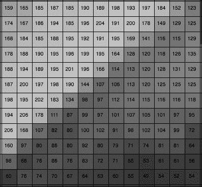
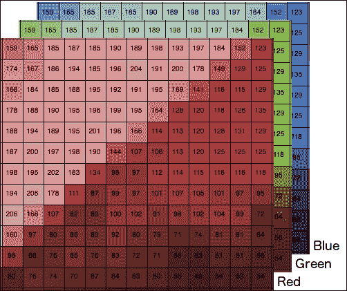
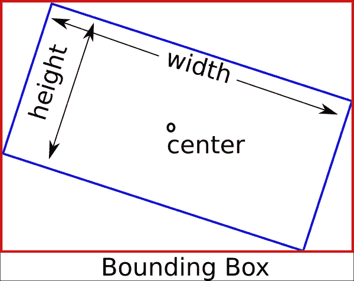
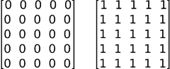
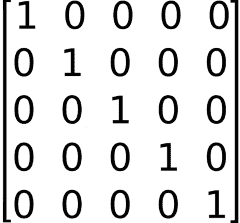
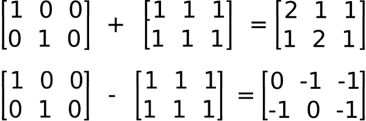
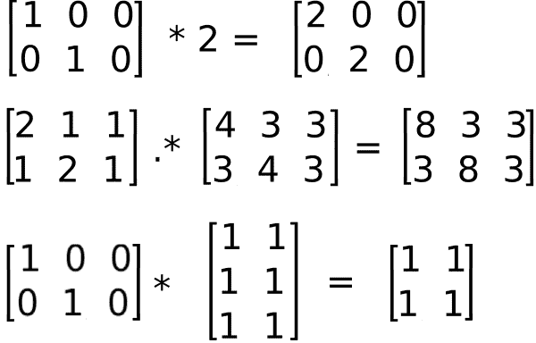

# 第二章。OpenCV 基础知识简介

在 第一章 中介绍了在不同操作系统上安装 OpenCV 后，我们将介绍本章的 OpenCV 开发基础知识。

在本章中，你将学习如何使用 CMake 创建你的项目。

我们还将介绍图像基本数据结构、矩阵和其他在我们项目中需要的结构。

我们将学习如何使用 OpenCV 的 XML/YAML 持久性函数将我们的变量和数据保存到文件中。

在本章中，我们将涵盖以下主题：

+   使用 CMake 配置项目

+   从/到磁盘读取/写入图像

+   阅读视频和访问相机设备

+   主要图像结构（矩阵）

+   其他重要和基本的结构（向量、标量等）

+   基本矩阵操作简介

+   使用 XML/YAML 持久性 OpenCV API 进行文件存储操作

# 基本 CMake 配置文件

为了配置和检查我们项目的所有必需依赖项，我们将使用 CMake；但这不是强制性的，因此我们可以使用任何其他工具或 IDE（如 Makefiles 或 Visual Studio）来配置我们的项目。然而，CMake 是配置多平台 C++ 项目的最便携方式。

CMake 使用名为 `CMakeLists.txt` 的配置文件，其中定义了编译和依赖过程。对于一个基于单个源代码文件的可执行文件的基本项目，所需的 `CMakeLists.txt` 文件只有两行。文件看起来像这样：

```py
cmake_minimum_required (VERSION 2.6)
project (CMakeTest)
add_executable(${PROJECT_NAME} main.cpp)
```

第一行定义了所需的 CMake 的最低版本。这一行在我们的 `CMakeLists.txt` 文件中是强制性的，并允许您使用第二行中定义的给定版本的 `cmake` 功能；它定义了项目名称。此名称保存在一个名为 `PROJECT_NAME` 的变量中。

最后一行在 `main.cpp` 文件中创建一个可执行命令（`add_executable()`），给它与我们的项目相同的名称（`${PROJECT_NAME}`），并将我们的源代码编译成一个名为 `CMakeTest` 的可执行文件，我们将它设置为项目名称。

`${}` 表达式允许访问我们环境中定义的任何变量。然后，我们可以使用 `${PROJECT_NAME}` 变量作为可执行文件的输出名称。

# 创建库

CMake 允许你创建库，这确实是 OpenCV 构建系统所使用的。在软件开发中，将共享代码分解为多个应用程序是一种常见且有用的做法。在大型应用程序或当共享代码在多个应用程序中共享时，这种做法非常有用。

在这种情况下，我们不创建二进制可执行文件；相反，我们创建一个包含所有开发的功能、类等的编译文件。然后，我们可以将这个库文件与其他应用程序共享，而无需共享我们的源代码。

CMake 包含 `add_library` 函数用于此目的：

```py
# Create our hello library
add_library(Hello hello.cpp hello.h)

# Create our application that uses our new library
add_executable(executable main.cpp)

# Link our executable with the new library
target_link_libraries( executable Hello )
```

以 `#` 开头的行添加注释，并被 CMake 忽略。

`add_library(Hello hello.cpp hello.h)`命令定义了我们新的库，名为`Hello`，其中`Hello`是库名，`hello.cpp`和`hello.h`是源文件。我们添加头文件是为了允许 IDE（如 Visual Studio）链接到头文件。

这行将根据我们的操作系统或是否是动态库或静态库生成共享文件（对于 OS X 和 Unix 是 So，对于 Windows 是.dll）或静态库（对于 OS X 和 Unix 是 A，对于 Windows 是.dll）。

`target_link_libraries(executable Hello)`是链接我们的可执行文件到所需库的函数；在我们的例子中，它是`Hello`库。

# 管理依赖项

CMake 具有搜索我们的依赖项和外部库的能力，这为我们提供了在项目中构建依赖于外部组件的复杂项目的便利性，并且通过添加一些要求。

在这本书中，最重要的依赖当然是 OpenCV，我们将将其添加到所有我们的项目中：

```py
cmake_minimum_required (VERSION 2.6)
cmake_policy(SET CMP0012 NEW)
PROJECT(Chapter2)
# Requires OpenCV
FIND_PACKAGE( OpenCV 3.0.0 REQUIRED )
# Show a message with the opencv version detected
MESSAGE("OpenCV version : ${OpenCV_VERSION}")
include_directories(${OpenCV_INCLUDE_DIRS})
link_directories(${OpenCV_LIB_DIR})
# Create a variable called SRC
SET(SRC main.cpp )
# Create our executable
ADD_EXECUTABLE( ${PROJECT_NAME} ${SRC} )
# Link our library
TARGET_LINK_LIBRARIES( ${PROJECT_NAME} ${OpenCV_LIBS} )
```

现在，让我们了解脚本的运行机制：

```py
cmake_minimum_required (VERSION 2.6)
cmake_policy(SET CMP0012 NEW)
PROJECT(Chapter2)
```

第一行定义了最低的 CMake 版本；第二行告诉 CMake 使用 CMake 的新行为，以便它可以正确识别不需要解引用变量的数字和布尔常量。这项策略是在 CMake 2.8.0 中引入的，CMake 在策略未设置为 3.0.2 时发出警告。最后，最后一行定义了项目标题：

```py
# Requires OpenCV
FIND_PACKAGE( OpenCV 3.0.0 REQUIRED )
# Show a message with the opencv version detected
MESSAGE("OpenCV version : ${OpenCV_VERSION}")
include_directories(${OpenCV_INCLUDE_DIRS})
link_directories(${OpenCV_LIB_DIR})
```

这是我们搜索 OpenCV 依赖项的地方。`FIND_PACKAGE`是允许我们找到依赖项以及如果该依赖项是必需的或可选的，所需的最低版本的函数。在这个示例脚本中，我们寻找版本 3.0.0 或更高版本的 OpenCV，并且它是一个必需的包。

### 注意

`FIND_PACKAGE`命令包含所有 OpenCV 子模块，但你可以通过指定你想要包含在项目中的子模块来使你的应用程序更小、更快。例如，如果我们只打算使用基本的 OpenCV 类型和核心功能，我们可以使用以下命令：

```py
FIND_PACKAGE(OpenCV 3.0.0 REQUIRED core)

```

如果 CMake 找不到它，它将返回一个错误，但不会阻止我们编译我们的应用程序。

MESSAGE 函数在终端或 CMake GUI 上显示消息。在我们的例子中，我们将显示 OpenCV 版本，如下所示：

```py
OpenCV version : 3.0.0
```

`${OpenCV_VERSION}`是一个变量，CMake 在其中存储 OpenCV 包的版本。

`include_directories()`和`link_directories()`将指定的库的头文件和目录添加到我们的环境中。OpenCV 的 CMake 模块将这些数据保存在`${OpenCV_INCLUDE_DIRS}`和`${OpenCV_LIB_DIR}`变量中。这些行在所有平台（如 Linux）中不是必需的，因为这些路径通常在环境中，但建议你拥有多个 OpenCV 版本，以便从正确的链接和包含目录中进行选择：

```py
# Create a variable called SRC
SET(SRC main.cpp )
# Create our executable
ADD_EXECUTABLE( ${PROJECT_NAME} ${SRC} )
# Link our library
TARGET_LINK_LIBRARIES( ${PROJECT_NAME} ${OpenCV_LIBS} )
```

这最后一行创建了可执行文件并将其链接到 OpenCV 库，正如我们在上一节“创建库”中看到的。

这段代码中有一个新函数叫做 `SET`。此函数创建一个新变量并将任何需要的值添加到其中。在我们的例子中，我们将 SRC 变量设置为 `main.cpp` 的值。然而，我们可以向同一个变量添加更多和更多的值，如本脚本所示：

```py
SET(SRC main.cpp
        utils.cpp
        color.cpp
)
```

# 使脚本更加复杂

在本节中，我们将向您展示一个更复杂的脚本，该脚本包含子文件夹、库和可执行文件，所有这些都在两个文件和几行中，如本脚本所示。

不必创建多个 `CMakeLists.txt` 文件，因为我们可以在主 `CMakeLists.txt` 文件中指定所有内容。更常见的是为每个项目子文件夹使用不同的 `CMakeLists.txt` 文件，这使得它更加灵活和可移植。

此示例有一个代码结构文件夹，包含一个用于 `utils` 库的文件夹，另一个用于包含主可执行文件的 `root` 文件夹：

```py
CMakeLists.txt
main.cpp
utils/
  CMakeLists.txt
  computeTime.cpp
  computeTime.h
  logger.cpp
  logger.h
  plotting.cpp
  plotting.h
```

然后，我们需要定义两个 `CMakeLists.txt` 文件：一个在 `root` 文件夹中，另一个在 `utils` 文件夹中。`CMakeLists.txt` 根文件夹文件的内容如下：

```py
cmake_minimum_required (VERSION 2.6)
project (Chapter2)

# Opencv Package required
FIND_PACKAGE( OpenCV  3.0.0 REQUIRED )

#Add opencv header files to project
include_directories( ${OpenCV_INCLUDE_DIR} )
link_directories(${OpenCV_LIB_DIR})

add_subdirectory(utils)

# Add optional log with a precompiler definition
option(WITH_LOG "Build with output logs and images in tmp" OFF)
if(WITH_LOG)
  add_definitions(-DLOG)
endif(WITH_LOG)

# generate our new executable
add_executable( ${PROJECT_NAME} main.cpp )
# link the project with his dependencies
target_link_libraries( ${PROJECT_NAME} ${OpenCV_LIBS} Utils)
```

几乎所有行都在前面的章节中描述过，除了我们将在后面的章节中解释的一些函数。

`add_subdirectory()` 告诉 CMake 分析所需子文件夹的 `CMakeLists.txt` 文件。

在我们继续解释主 `CMakeLists.txt` 文件之前，我们将解释 `utils CMakeLists.txt` 文件。

在 `utils` 文件夹中的 `CMakeLists.txt` 文件中，我们将编写一个新的库并将其包含在我们的主项目文件夹中：

```py
# Add new variable for src utils lib
SET(UTILS_LIB_SRC
  computeTime.cpp 
  logger.cpp 
  plotting.cpp
)
# create our new utils lib
add_library(Utils ${UTILS_LIB_SRC} )
# make sure the compiler can find include files for our library
target_include_directories(Utils PUBLIC ${CMAKE_CURRENT_SOURCE_DIR})
```

此 CMake 脚本文件定义了一个 `UTILS_LIB_SRC` 变量，我们将所有包含在我们的库中的源文件添加到其中，使用 `add_library` 函数生成库，并使用 `target_include_directories` 函数允许我们的主项目检测所有头文件。

跳过 `utils` 子文件夹，继续使用根 `cmake` 脚本，`Option` 函数创建了一个新变量——在我们的例子中是 `WITH_LOG`，并附有简短描述。此变量可以通过 `ccmake` 命令行或 CMake GUI 界面进行更改，其中描述和一个复选框出现，允许用户启用或禁用此选项。

此函数非常有用，允许用户决定编译时特性，如启用或禁用日志、编译带有 Java 或 Python 支持（如 OpenCV）等。

在我们的例子中，我们使用此选项在应用程序中启用日志记录器。要启用日志记录器，我们在代码中使用预编译定义：

```py
#ifdef LOG
logi("Number of iteration %d", i);
#endif
```

要告诉我们的编译器我们需要 `LOG` 编译时定义，我们在 `CMakeLists.txt` 中使用 `add_definitions(-DLOG)` 函数。为了允许用户决定是否启用它，我们只需通过一个简单条件验证 `WITH_LOG` CMake 变量是否被选中：

```py
if(WITH_LOG)
  add_definitions(-DLOG)
endif(WITH_LOG)
```

现在，我们已经准备好创建我们的 CMake 脚本文件，以便在任何操作系统上编译我们的计算机视觉项目。然后，在开始一个示例项目之前，我们将继续介绍 OpenCV 的基础知识。

# 图像和矩阵

在计算机视觉中，最重要的结构无疑是图像。计算机视觉中的图像是使用数字设备捕获的物理世界的表示。这幅图只是存储在矩阵格式中的数字序列，如下所示。每个数字是考虑的波长的光强度测量（例如，在彩色图像中的红色、绿色或蓝色）或波长范围（对于全色设备）。图像中的每个点称为像素（对于图像元素），每个像素可以存储一个或多个值，具体取决于它是一个灰度、黑色还是白色图像（也称为二值图像，只存储一个值，如 0 或 1），一个只能存储一个值的灰度级图像，或者一个可以存储三个值的彩色图像。这些值通常是介于 0 到 255 之间的整数，但您也可以使用其他范围。例如，**HDRI**（**高动态范围成像**）或热图像中使用的浮点数 0 到 1。


图像以矩阵格式存储，其中每个像素都有一个位置，可以通过列和行的编号来引用。OpenCV 使用`Mat`类来完成这个目的。对于灰度图像，使用单个矩阵，如下图所示：



在彩色图像的情况下，如下图中所示，我们使用一个大小为宽度 x 高度 x 颜色数量的矩阵：



`Mat`类不仅用于存储图像，还用于存储不同类型的不定大小矩阵。您可以用它作为代数矩阵并对其进行操作。在下一节中，我们将描述最重要的矩阵操作，如加法、矩阵乘法、创建对角矩阵等。

然而，在这样做之前，了解矩阵在计算机内存中的内部存储方式是很重要的，因为始终更有效地访问内存槽而不是使用 OpenCV 函数访问每个像素会更好。

在内存中，矩阵以列和行的顺序保存为一个数组或值序列。以下表格显示了 BGR 图像格式中像素的顺序：

| 行 0 | 行 1 | 行 2 |
| --- | --- | --- |
| 列 0 | 列 1 | 列 2 | 列 0 | 列 1 | 列 2 | 列 0 | 列 1 | 列 2 |
| 像素 1 | 像素 2 | 像素 3 | 像素 4 | 像素 5 | 像素 6 | 像素 7 | 像素 8 | 像素 9 |
| B | G | R | B | G | R | B | G | R | B | G | R | B | G | R | B | G | R | B | G | R | B | G | R | B | G | R |

按照这个顺序，我们可以访问任何像素，如下面的公式所示：

```py
Value= Row_i*num_cols*num_channels + Col_i + channel_i
```

### 注意

OpenCV 函数在随机访问方面进行了相当优化，但有时直接访问内存（使用指针算术）更有效率——例如，当我们在一个循环中访问所有像素时。

# 读取/写入图像

在介绍这个矩阵之后，我们将开始介绍 OpenCV 代码的基础。首先，我们需要学习如何读取和写入图像：

```py
#include <iostream>
#include <string>
#include <sstream>
using namespace std;

// OpenCV includes
#include "opencv2/core.hpp"
#include "opencv2/highgui.hpp"
using namespace cv;

int main( int argc, const char** argv )
{
  // Read images
  Mat color= imread("../lena.jpg");
  Mat gray= imread("../lena.jpg", 0);

  // Write images
  imwrite("lenaGray.jpg", gray);

  // Get same pixel with opencv function
  int myRow=color.cols-1;
  int myCol=color.rows-1;
  Vec3b pixel= color.at<Vec3b>(myRow, myCol);
  cout << "Pixel value (B,G,R): (" << (int)pixel[0] << "," << (int)pixel[1] << "," << (int)pixel[2] << ")" << endl;

  // show images
  imshow("Lena BGR", color);
  imshow("Lena Gray", gray);
  // wait for any key press
  waitKey(0);
  return 0;
}
```

让我们尝试理解这段代码：

```py
// OpenCV includes
#include "opencv2/core.hpp"
#include "opencv2/highgui.hpp"
using namespace cv;
```

首先，我们必须在我们的示例中包含所需函数的声明。这些函数来自核心（基本图像数据处理）和高 GUI（OpenCV 提供的跨平台 I/O 函数是`core`和`highui`。第一个包括基本类，如矩阵，第二个包括读取、写入和通过图形界面显示图像的函数）。

```py
// Read images
Mat color= imread("../lena.jpg");
Mat gray= imread("../lena.jpg", 0);
```

**imread**是用于读取图像的主要函数。此函数打开图像并将图像存储在矩阵格式中。`imread`函数接受两个参数：第一个参数是一个包含图像路径的字符串，第二个参数是可选的，默认情况下以彩色图像加载图像。第二个参数允许以下选项：

+   `CV_LOAD_IMAGE_ANYDEPTH`：如果设置为这个常量，当输入具有相应的深度时返回 16 位/32 位图像；否则，`imread`函数将其转换为 8 位图像

+   `CV_LOAD_IMAGE_COLOR`：如果设置为这个常量，总是将图像转换为彩色

+   `CV_LOAD_IMAGE_GRAYSCALE`：如果设置为这个常量，总是将图像转换为灰度

要保存图像，我们可以使用`imwrite`函数，该函数将矩阵图像存储在我们的计算机中：

```py
// Write images
imwrite("lenaGray.jpg", gray);
```

第一个参数是我们想要保存图像的路径，其中包含我们想要的扩展格式。第二个参数是我们想要保存的矩阵图像。在我们的代码示例中，我们创建并存储图像的灰度版本，然后将其保存为 jpg 文件，该灰度图像是我们加载并存储在`gray`变量中的图像：

```py
// Get same pixel with opencv function
int myRow=color.cols-1;
int myCol=color.rows-1;
```

使用矩阵的`.cols`和`.rows`属性，我们可以访问图像的列数和行数——换句话说，宽度和高度：

```py
Vec3b pixel= color.at<Vec3b>(myRow, myCol);
cout << "Pixel value (B,G,R): (" << (int)pixel[0] << "," << (int)pixel[1] << "," << (int)pixel[2] << ")" << endl;
```

要访问图像中的一个像素，我们使用`cv::Mat::at<typename t>(row,col)`模板函数，该函数来自`Mat` OpenCV 类。模板参数是期望的返回类型。在 8 位彩色图像中，`typename`是一个存储三个无符号字符数据的`Vec3b`类（Vec=vector，3=组件数量，b = 1 字节）。对于灰度图像，我们可以直接使用无符号字符或任何其他在图像中使用的数字格式，例如`uchar pixel= color.at<uchar>(myRow, myCol)`：

```py
// show images
imshow("Lena BGR", color);
imshow("Lena Gray", gray);
// wait for any key press
waitKey(0);
```

最后，为了显示图像，我们可以使用`imshow`函数，该函数创建一个窗口，第一个参数是标题，第二个参数是图像矩阵。

### 注意

如果我们想通过等待用户按键来停止我们的应用程序，我们可以使用 OpenCV 的`waitKey`函数，并将参数设置为我们要等待的毫秒数。如果我们设置参数为`0`，那么函数将永远等待。

以下图片显示了此代码的结果；左侧图像是彩色图像，右侧图像是灰度图像：


最后，作为以下示例的例子，我们将创建`CMakeLists.txt`以允许您编译我们的项目，并了解如何编译它。

以下代码描述了`CMakeLists.txt`文件：

```py
cmake_minimum_required (VERSION 2.6)
cmake_policy(SET CMP0012 NEW)
PROJECT(project)

# Requires OpenCV
FIND_PACKAGE( OpenCV 3.0.0 REQUIRED )
MESSAGE("OpenCV version : ${OpenCV_VERSION}")

include_directories(${OpenCV_INCLUDE_DIRS})
link_directories(${OpenCV_LIB_DIR})
ADD_EXECUTABLE( sample main.cpp )
TARGET_LINK_LIBRARIES( sample ${OpenCV_LIBS} )
```

要编译我们的代码，使用`CMakeLists.txt`文件，我们必须执行以下步骤：

1.  创建一个`build`文件夹。

1.  在`build`文件夹内，执行`cmake`或在 Windows 中打开`CMake gui`应用程序，选择源文件夹和构建文件夹，然后点击配置和生成按钮。

1.  在步骤 2 之后，如果我们处于 Linux 或 OS，生成一个`makefile`；然后我们必须使用 make 命令编译项目。如果我们处于 Windows，我们必须使用步骤 2 中选择的编辑器打开项目并编译它。

1.  在步骤 3 之后，我们有一个名为`app`的可执行文件。

# 读取视频和摄像头

本节通过这个简单的示例向您介绍如何读取视频和摄像头：

```py
#include <iostream>
#include <string>
#include <sstream>
using namespace std;

// OpenCV includes
#include "opencv2/core.hpp"
#include "opencv2/highgui.hpp"
using namespace cv;

// OpenCV command line parser functions
// Keys accecpted by command line parser
const char* keys =
{
    "{help h usage ? | | print this message}"
    "{@video | | Video file, if not defined try to use webcamera}"
};

int main( int argc, const char** argv )
{
    CommandLineParser parser(argc, argv, keys);
    parser.about("Chapter 2\. v1.0.0");
    //If requires help show
    if (parser.has("help"))
    {
      parser.printMessage();
      return 0;
    }
    String videoFile= parser.get<String>(0);

    // Check if params are correctly parsed in his variables
    if (!parser.check())
    {
        parser.printErrors();
        return 0;
    }

    VideoCapture cap; // open the default camera
    if(videoFile != "")
        cap.open(videoFile);
    else
        cap.open(0);
    if(!cap.isOpened())  // check if we succeeded
        return -1;

    namedWindow("Video",1);
    for(;;)
    {
        Mat frame;
        cap >> frame; // get a new frame from camera
        imshow("Video", frame);
        if(waitKey(30) >= 0) break;
    }
    // Release the camera or video cap
    cap.release();

    return 0;
}
```

在解释如何读取视频或摄像头输入之前，我们需要介绍一个有用的新类，它将帮助我们管理输入命令行参数；这个新类是在 OpenCV 3.0 版本中引入的，称为`CommandLineParser`类：

```py
// OpenCV command line parser functions
// Keys accepted by command line parser
const char* keys =
{
    "{help h usage ? | | print this message}"
    "{@video | | Video file, if not defined try to use webcamera}"
};
```

对于命令行解析器，我们必须首先在常量字符向量中定义我们需要的或允许的参数；每一行都有这种模式：

```py
{ name_param | default_value | description}
```

`name_param`可以前面加上`@`，这定义了这个参数为默认输入。我们可以使用多个`name_param`：

```py
CommandLineParser parser(argc, argv, keys);
```

构造函数将获取主函数的输入和之前定义的关键常量：

```py
//If requires help show
if (parser.has("help"))
{
        parser.printMessage();
        return 0;
}
```

`.has`类方法检查参数是否存在。在这个示例中，我们检查用户是否添加了`–help`或? `参数`，然后，使用`printMessage`类函数显示所有描述参数：

```py
    String videoFile= parser.get<String>(0);
```

使用`.get<typename>(parameterName)`函数，我们可以访问和读取任何输入参数：

```py
    // Check if params are correctly parsed in his variables
    if (!parser.check())
    {
        parser.printErrors();
        return 0;
    }
```

在获取所有必需的参数后，我们可以检查这些参数是否正确解析，如果其中一个参数没有解析，则显示错误消息。例如，添加一个字符串而不是一个数字：

```py
VideoCapture cap; // open the default camera
if(videoFile != "")
    cap.open(videoFile);
    else
    cap.open(0);
    if(!cap.isOpened())  // check if we succeeded
    return -1;
```

读取视频和摄像头的类是相同的。`VideoCapture` 类属于 `videoio` 子模型，而不是 `highgui` 子模块，如 OpenCV 的早期版本。创建对象后，我们检查输入命令行 `videoFile` 参数是否有路径文件名。如果为空，则尝试打开网络摄像头；如果有文件名，则打开视频文件。为此，我们使用 open 函数，将视频文件名或要打开的摄像头索引作为参数。如果我们只有一个摄像头，我们可以使用 `0` 作为参数。

要检查我们是否可以读取视频文件名或摄像头，我们使用 `isOpened` 函数：

```py
namedWindow("Video",1);
for(;;)
{
    Mat frame;
    cap >> frame; // get a new frame from camera
     if(frame)
       imshow("Video", frame);
    if(waitKey(30) >= 0) break;
}
// Release the camera or video cap
cap.release();
```

最后，我们使用 `namedWindow` 函数创建一个窗口来显示帧，并通过非结束循环，使用 `>>` 操作符抓取每一帧，如果正确检索到帧，则使用 `imshow` 函数显示图像。在这种情况下，我们不想停止应用程序，但想等待 30 毫秒，以检查用户是否想通过按任意键停止应用程序执行，使用 `waitKey(30)`。

### 注意

为了选择一个合适的值等待下一帧，使用摄像头访问速度计算。例如，如果摄像头以 20 FPS 的工作，一个很好的等待值是 *40 = 1000/20*。

当用户想要结束应用程序时，他只需要按下一个键，然后我们必须使用 `release` 函数释放所有视频资源。

### 注意

在计算机视觉应用程序中释放我们使用的所有资源非常重要；如果我们不这样做，我们可能会消耗所有 RAM 内存。我们可以使用 `release` 函数释放矩阵。

代码的结果是一个新窗口，显示 BGR 格式的视频或网络摄像头，如下截图所示：


# 其他基本对象类型

我们已经学习了 `Mat` 和 `Vec3b` 类，但我们需要学习其他类。

在本节中，我们将学习在大多数项目中都需要的最基本的对象类型：

+   `Vec`

+   `Scalar`

+   `Point`

+   `Size`

+   `Rect`

+   `RotatedRect`

## `vec` 对象类型

`vec` 是一个模板类，主要用于数值向量。我们可以定义任何类型的向量以及组件数量：

```py
Vec<double,19> myVector;
```

或者我们可以使用任何预定义的类型：

```py
typedef Vec<uchar, 2> Vec2b;
typedef Vec<uchar, 3> Vec3b;
typedef Vec<uchar, 4> Vec4b;

typedef Vec<short, 2> Vec2s;
typedef Vec<short, 3> Vec3s;
typedef Vec<short, 4> Vec4s;

typedef Vec<int, 2> Vec2i;
typedef Vec<int, 3> Vec3i;
typedef Vec<int, 4> Vec4i;

typedef Vec<float, 2> Vec2f;
typedef Vec<float, 3> Vec3f;
typedef Vec<float, 4> Vec4f;
typedef Vec<float, 6> Vec6f;

typedef Vec<double, 2> Vec2d;
typedef Vec<double, 3> Vec3d;
typedef Vec<double, 4> Vec4d;
typedef Vec<double, 6> Vec6d;
```

### 注意

所有预期的向量操作也都已实现，如下所示：

`v1 = v2 + v3`

`v1 = v2 - v3`

`v1 = v2 * scale`

`v1 = scale * v2`

`v1 = -v2`

`v1 += v2` 和其他增加操作

`v1 == v2, v1 != v2`

`norm(v1) (欧几里得范数)`

## 标量对象类型

`Scalar` 对象类型是从 `Vec` 派生出的模板类，具有四个元素。`Scalar` 类型在 OpenCV 中广泛用于传递和读取像素值。

要访问 `Vec` 和 `Scalar` 的值，我们使用 [] 操作符。

## 点对象类型

另一个非常常见的类模板是 `Point`。这个类定义了一个由其 `x` 和 `y` 坐标指定的 2D 点。

### 注意

与 Point 对象类型类似，还有一个 Point3 模板类用于支持 3D 点。

与 `Vec` 类类似，OpenCV 定义了以下 `Point` 别名以方便我们使用：

```py
typedef Point_<int> Point2i;
typedef Point2i Point;
typedef Point_<float> Point2f;
typedef Point_<double> Point2d;
```

### 注意

为点定义了以下运算符：

```py
pt1 = pt2 + pt3;
pt1 = pt2 - pt3;
pt1 = pt2 * a;
pt1 = a * pt2;
pt1 = pt2 / a;
pt1 += pt2;
pt1 -= pt2;
pt1 *= a;
pt1 /= a;
double value = norm(pt); // L2 norm
pt1 == pt2;
pt1 != pt2;
```

## Size 对象类型

另一个在 OpenCV 中非常重要且常用的 `template` 类是用于指定图像或矩形大小的 `Size` 类。该类添加了两个成员：宽度和高度以及有用的 `area()` 函数。

## Rect 对象类型

`Rect` 是另一个重要的模板类，用于通过以下参数定义 2D 矩形：

+   顶左角坐标

+   矩形的宽度和高度

`Rect` 模板类可用于定义图像的 **ROI**（**感兴趣区域**）。

## RotatedRect 对象类型

最后一个有用的类是特定矩形 `RotatedRect`。该类表示一个由中心点、矩形的宽度和高度以及旋转角度（以度为单位）指定的旋转矩形：

```py
RotatedRect(const Point2f& center, const Size2f& size, float angle);
```

该类的一个有趣功能是 `boundingBox`；此函数返回一个包含旋转矩形的 `Rect`：



# 基本矩阵运算

在本节中，我们将学习一些基本且重要的矩阵运算，这些运算可以应用于图像或任何矩阵数据。

我们学习了如何加载图像并将其存储在 `Mat` 变量中，但我们可以手动创建一个 `Mat` 变量。最常见的构造函数是提供矩阵大小和类型的如下：

```py
Mat a= Mat(Size(5,5), CV_32F);
```

### 注意

您可以使用以下构造函数从第三方库的存储缓冲区创建一个新的 `Matrix link`，而不复制数据：

```py
Mat(size, type, pointer_to_buffer)
```

支持的类型取决于您想要存储的数字类型和通道数。最常见的类型如下：

```py
CV_8UC1
CV_8UC3
CV_8UC4
CV_32FC1
CV_32FC3
CV_32FC4
```

### 注意

您可以使用 `CV_number_typeC(n)` 创建任何类型的矩阵，其中 `number_type` 是 8U（8 位无符号）到 64F（64 位浮点）之间，而 (n) 是通道数。允许的通道数从 `1` 到 `CV_CN_MAX`。

此初始化没有设置数据值，您可能会得到不希望的结果。为了避免不希望的结果，您可以使用 `zeros` 或 `ones` 函数用 `zeros` 或 `ones` 值初始化矩阵：

```py
Mat mz= Mat::zeros(5,5, CV_32F);
Mat mo= Mat::ones(5,5, CV_32F);
```

之前矩阵的输出如下：



特殊的矩阵初始化是 **eye** 函数，该函数创建一个指定类型（`CV_8UC1, CV_8UC3...`）和大小的 `identity` 矩阵：

```py
Mat m= Mat::eye(5,5, CV_32F);
```

输出如下：



OpenCV Mat 类允许所有矩阵运算。我们可以使用 `+` 和 `-` 运算符添加或减去两个矩阵：

```py
Mat a= Mat::eye(Size(3,2), CV_32F);
Mat b= Mat::ones(Size(3,2), CV_32F);
Mat c= a+b;
Mat d= a-b;
```

之前操作的结果如下：



我们可以使用 `*` 运算符将矩阵乘以一个标量，使用 `mul` 函数将矩阵乘以每个元素，或者使用 `*` 运算符进行矩阵与矩阵的乘法：

```py
Mat m1= Mat::eye(2,3, CV_32F);
Mat m2= Mat::ones(3,2, CV_32F);
// Scalar by matrix
cout << "\nm1.*2\n" << m1*2 << endl;
// matrix per element multiplication
cout << "\n(m1+2).*(m1+3)\n" << (m1+1).mul(m1+3) << endl;
// Matrix multiplication
cout << "\nm1*m2\n" << m1*m2 << endl;
```

之前操作的结果如下：



另外常见的数学矩阵运算包括转置和矩阵求逆，分别由`t()`和`inv()`函数定义。

OpenCV 为我们提供的其他有趣的功能是矩阵中的数组操作；例如，计算非零元素的数量。这有助于计算对象的像素或面积：

```py
int countNonZero( src );
```

OpenCV 提供了一些统计函数。可以使用`meanStdDev`函数计算每个通道的平均值和标准差：

```py
meanStdDev(src, mean, stddev);
```

另一个有用的统计函数是`minMaxLoc`。此函数查找矩阵或数组的最小值和最大值，并返回其位置和值：

```py
minMaxLoc(src, minVal, maxVal, minLoc, maxLoc);
```

在这里，`src`是输入矩阵，`minVal`和`maxVal`是检测到的双精度值，而`minLoc`和`maxLoc`是检测到的点值。

### 注意

其他核心和有用的函数在[`docs.opencv.org/modules/core/doc/core.html`](http://docs.opencv.org/modules/core/doc/core.html)中详细描述。

# 基本数据持久化和存储

在我们完成本章之前，我们将探索 OpenCV 的存储和读取数据的功能。在许多应用程序中，例如校准或机器学习，当我们完成计算后，我们需要保存结果以便在下次执行中检索。为此，OpenCV 提供了一个 XML/YAML 持久化层。

## 写入文件存储

要使用一些 OpenCV 数据或其他数值数据写入文件，我们可以使用`FileStorage`类，并使用如 STL 流之类的流操作符：

```py
#include "opencv2/opencv.hpp"
using namespace cv;

int main(int, char** argv)
{
    // create our writter
    FileStorage fs("test.yml", FileStorage::WRITE);
    // Save an int
    int fps= 5;
    fs << "fps" << fps;
    // Create some mat sample
    Mat m1= Mat::eye(2,3, CV_32F);
     Mat m2= Mat::ones(3,2, CV_32F);
     Mat result= (m1+1).mul(m1+3);
     // write the result
    fs << "Result" << result;
    // release the file
    fs.release();

    FileStorage fs2("test.yml", FileStorage::READ);

    Mat r;
    fs2["Result"] >> r;
    std::cout << r << std::endl;

    fs2.release();

    return 0;
}
```

要创建一个用于保存数据的文件存储，我们只需要通过提供一个带有所需扩展格式（XML 或 YAML）的路径文件名并设置第二个参数为`write`来调用构造函数：

```py
FileStorage fs("test.yml", FileStorage::WRITE);
```

如果我们想要保存数据，我们只需要使用流操作符，在第一阶段提供一个标识符，在后续阶段提供我们想要保存的矩阵或值。例如，要保存一个`int`，我们需要编写以下代码：

```py
int fps= 5;
fs << "fps" << fps;
```

一个`mat`如下：

```py
Mat m1= Mat::eye(2,3, CV_32F);
Mat m2= Mat::ones(3,2, CV_32F);
Mat result= (m1+1).mul(m1+3);
// write the result
fs << "Result" << result;
```

上述代码的结果是 YAML 格式，如下所示：

```py
%YAML:1.0
fps: 5
Result: !!opencv-matrix
   rows: 2
   cols: 3
   dt: f
   data: [ 8., 3., 3., 3., 8., 3\. ]
```

从之前保存的文件中读取与保存函数非常相似：

```py
#include "opencv2/opencv.hpp"
using namespace cv;

int main(int, char** argv)
{
    FileStorage fs2("test.yml", FileStorage::READ);

   Mat r;
   fs2["Result"] >> r;
   std::cout << r << std::endl;

   fs2.release();

   return 0;
}
```

首先，我们必须使用`FileStorage`构造函数和适当的路径以及`FileStorage::READ`参数来打开一个已保存的文件：

```py
FileStorage fs2("test.yml", FileStorage::READ);
```

要读取任何已存储的变量，我们只需要使用我们的`FileStorage`对象和带有`[]`操作符的标识符的常见`>>`流操作符：

```py
Mat r;
fs2["Result"] >> r;
```

# 摘要

在本章中，我们学习了如何访问图像和视频以及它们如何在矩阵中存储的基础知识。

我们学习了基本的矩阵运算和其他基本的 OpenCV 类，用于存储像素、向量等。

最后，我们学习了如何将数据保存到文件中，以便在其他应用程序或执行中读取。

在下一章中，我们将学习如何通过学习 OpenCV 提供的图形用户界面的基础知识来创建我们的第一个应用程序。我们将创建按钮和滑块，并介绍一些图像处理的基本知识。
