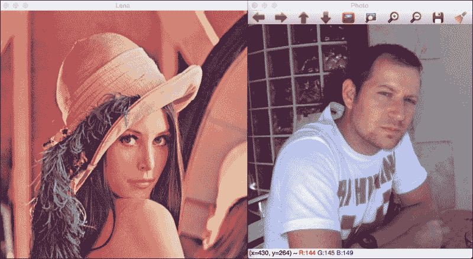
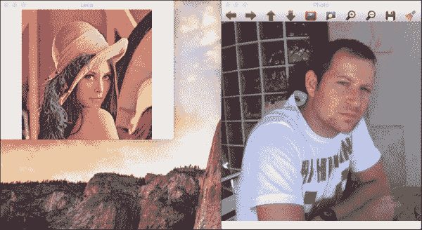
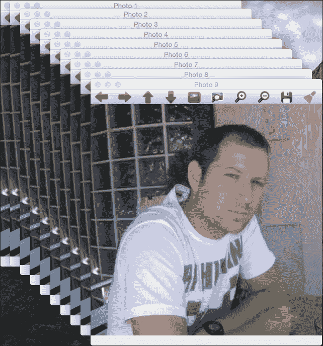
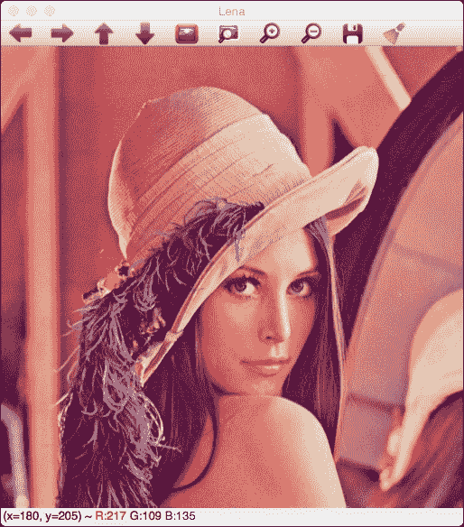
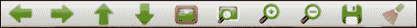
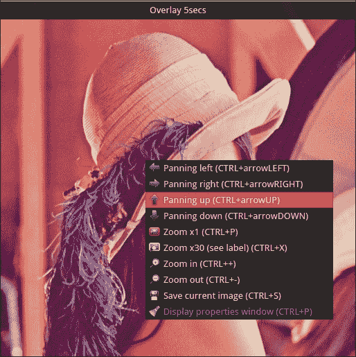
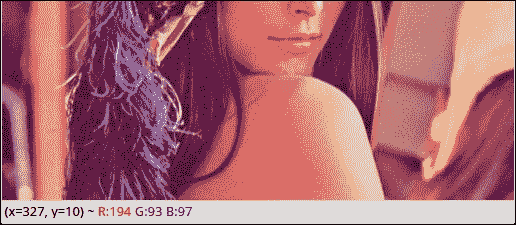
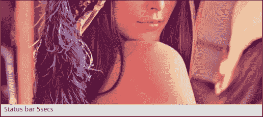
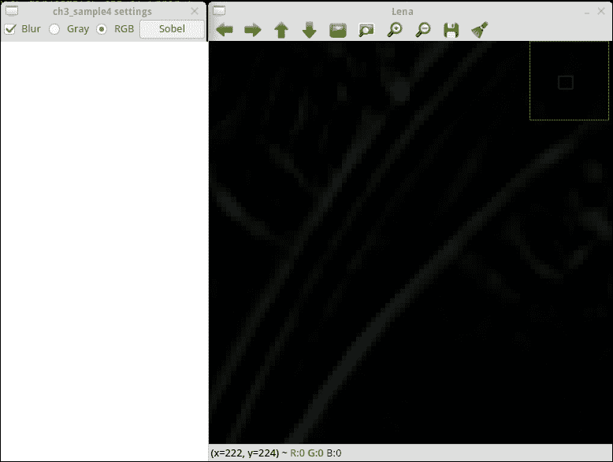
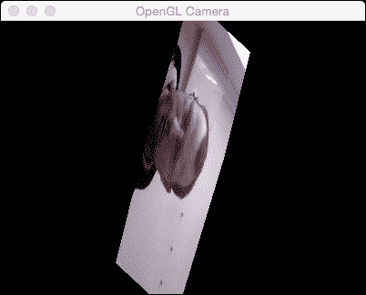

# 第三章：学习图形用户界面和基本滤波

在上一章中，我们学习了 OpenCV 的基本类和结构，以及最重要的类`Mat`。

我们学习了如何读取和保存图片、视频以及图片在内存中的内部结构。

我们现在可以开始工作了，但我们需要展示我们的结果，并与我们的图片进行一些基本的交互。OpenCV 为我们提供了一些基本的用户界面来工作，并帮助我们创建应用程序和原型。

为了更好地理解用户界面是如何工作的，我们将在本章末尾创建一个名为**PhotoTool**的小应用程序。在这个应用程序中，我们将学习如何使用滤波器和颜色转换。

在本章中，我们将涵盖以下主题：

+   OpenCV 的基本用户界面

+   OpenCV 的 QT 界面

+   滑块和按钮

+   一个高级用户界面——OpenGL

+   颜色转换

+   基本过滤器

# 介绍 OpenCV 用户界面

OpenCV 拥有自己的跨操作系统用户界面，允许开发者创建自己的应用程序，无需学习复杂的用户界面库。

OpenCV 的用户界面是基本的，但它为计算机视觉开发者提供了创建和管理软件开发的基本功能。所有这些功能都是本地的，并且针对实时使用进行了优化。

OpenCV 为用户界面提供了两种选项：

+   基于本地用户界面（如 OS X 的 Cocoa 或 Carbon，Linux 或 Windows 的 GTK）的基本界面，这些界面在编译 OpenCV 时默认选择。

+   一个基于 QT 库的稍微高级一点的界面，它是跨平台的。在编译 OpenCV 之前，您必须手动在 CMake 中启用 QT 选项。

# 使用 OpenCV 的基本图形用户界面

我们将使用 OpenCV 创建一个基本的用户界面。OpenCV 用户界面允许我们创建窗口，向其中添加图片，移动它，调整大小，以及销毁它。

用户界面位于 OpenCV 的`highui`模块中：

```py
#include <iostream>
#include <string>
#include <sstream>
using namespace std;

// OpenCV includes
#include "opencv2/core.hpp"
#include "opencv2/highgui.hpp"
using namespace cv;

const int CV_GUI_NORMAL= 0x10;

int main( int argc, const char** argv )
{
  // Read images
  Mat lena= imread("../lena.jpg");
  Mat photo= imread("../photo.jpg");

  // Create windows
  namedWindow("Lena", CV_GUI_NORMAL);
  namedWindow("Photo", WINDOW_AUTOSIZE);

  // Move window
  moveWindow("Lena", 10, 10);
  moveWindow("Photo", 520, 10);

  // show images
  imshow("Lena", lena);
  imshow("Photo", photo); 

  // Resize window, only non autosize
  resizeWindow("Lena", 512, 512); 

  // wait for any key press
  waitKey(0);

  // Destroy the windows
  destroyWindow("Lena");
  destroyWindow("Photo");

  // Create 10 windows
  for(int i =0; i< 10; i++)
  {
    ostringstream ss;
    ss << "Photo " << i;
    namedWindow(ss.str());
    moveWindow(ss.str(), 20*i, 20*i);
    imshow(ss.str(), photo);
  }

  waitKey(0);
  // Destroy all windows
  destroyAllWindows();
  return 0;
}
```

让我们理解代码。

为了启用图形用户界面，我们需要执行的第一项任务是导入 OpenCV 的`highui`模块：

```py
#include "opencv2/highgui.hpp"
```

现在，我们已经准备好创建我们的新窗口，然后我们需要加载一些要显示的图片：

```py
// Read images
Mat lena= imread("../lena.jpg");
Mat photo= imread("../photo.jpg");
```

为了创建窗口，我们使用`namedWindow`函数。此函数有两个参数：第一个参数是一个常量字符串，包含窗口的名称，第二个参数是我们需要的标志，这是可选的：

```py
namedWindow("Lena", CV_GUI_NORMAL);
namedWindow("Photo", WINDOW_AUTOSIZE);
```

在我们的例子中，我们创建了两个窗口：第一个窗口被称作`Lena`，第二个被称作`Photo`。

默认情况下，有三个用于 QT 和本地界面的标志：

+   `WINDOW_NORMAL`：此标志允许用户调整窗口大小

+   `WINDOW_AUTOSIZE`：如果设置了此标志，窗口大小将自动调整以适应显示的图片，并且无法调整窗口大小

+   `WINDOW_OPENGL`：此标志启用 OpenGL 支持

QT 有一些其他标志，如下所示：

+   `WINDOW_FREERATIO` 或 `WINDOW_KEEPRATIO`：如果设置为 `WINDOW_FREERATIO`，则图像调整时不考虑其比例。如果设置为 `WINDOW_FREERATIO`，则图像调整时考虑其比例。

+   `CV_GUI_NORMAL` 或 `CV_GUI_EXPANDED`：第一个标志启用不带状态栏和工具栏的基本界面。第二个标志启用带有状态栏和工具栏的最先进图形用户界面。

### 注意

如果我们使用 QT 编译 OpenCV，则我们创建的所有窗口默认情况下都在扩展界面中，但我们可以通过添加 `CV_GUI_NORMAL` 标志来使用原生和更基本的界面。

默认情况下，标志是 `WINDOW_AUTOSIZE`、`WINDOW_KEEPRATIO` 和 `CV_GUI_EXPANDED`。

当我们创建多个窗口时，它们一个叠一个，但我们可以使用 `moveWindow` 函数将窗口移动到桌面上的任何区域：

```py
// Move window
moveWindow("Lena", 10, 10);
moveWindow("Photo", 520, 10);
```

在我们的代码中，我们将 `Lena` 窗口向左移动 10 像素，向上移动 10 像素；将 `Photo` 窗口向左移动 520 像素，向上移动 10 像素：

```py
// show images
imshow("Lena", lena);
imshow("Photo", photo); 
// Resize window, only non autosize
resizeWindow("Lena", 512, 512); 
```

在使用 `imshow` 函数显示我们之前加载的图像后，我们调用 `resizeWindow` 函数将 `Lena` 窗口调整为 512 像素。此函数有三个参数：`窗口名称`、`宽度`和`高度`。

### 注意

具体的窗口大小是针对图像区域的。工具栏不计入。只有未启用 `WINDOW_AUTOSIZE` 标志的窗口可以调整大小。

使用 `waitKey` 函数等待按键后，我们将使用 `destroyWindow` 函数删除或删除我们的窗口，其中窗口名称是唯一必需的参数：

```py
waitKey(0);

// Destroy the windows
destroyWindow("Lena");
destroyWindow("Photo");
```

OpenCV 有一个函数，用于在一次调用中删除我们创建的所有窗口。该函数名为 `destroyAllWindows`。为了展示此函数的工作原理，在我们的示例中我们创建了 10 个窗口并等待按键。当用户按下任意键时，我们销毁所有窗口。无论如何，OpenCV 在应用程序终止时自动处理所有窗口的销毁，因此不需要在应用程序末尾调用此函数：

```py
// Create 10 windows
for(int i =0; i< 10; i++)
{
  ostringstream ss;
  ss << "Photo " << i;
  namedWindow(ss.str());
  moveWindow(ss.str(), 20*i, 20*i);
  imshow(ss.str(), photo);
}

waitKey(0);
// Destroy all windows
destroyAllWindows();
```

此代码的结果可以在以下图像中分两步看到。第一张图像显示两个窗口：



按下任意键后，应用程序继续并通过改变位置绘制几个窗口：



# 基于 QT 的图形用户界面

QT 用户界面为我们提供了更多控制和选项来处理我们的图像。

界面分为三个主要区域：

+   工具栏

+   图像区域

+   状态栏

工具栏从左到右有以下按钮：

+   四个用于平移的按钮

+   放大 x1

+   放大 x30 并显示标签

+   放大

+   缩小

+   保存当前图像

+   显示属性窗口

这些选项在下面的截图中可以更清楚地看到：



当我们在图像上按下右鼠标按钮时，图像区域显示一个图像和一个上下文菜单。此区域可以使用 `displayOverlay` 函数在区域的顶部显示叠加消息。此函数接受三个参数：窗口名称、我们想要显示的文本以及叠加文本显示的毫秒数。如果时间设置为 `0`，则文本永远不会消失：

```py
// Display Overlay
displayOverlay("Lena", "Overlay 5secs", 5000);
```



最后，状态栏显示窗口的底部部分、像素值和图像中的坐标位置：



我们可以使用状态栏来显示消息，例如叠加。可以更改状态栏消息的函数是 `displayStatusBar`。此函数具有与叠加函数相同的参数：窗口名称、要显示的文本以及显示它的持续时间：



# 将滑块和鼠标事件添加到我们的界面中

鼠标事件和滑块控制在计算机视觉和 OpenCV 中非常有用。使用这些控件，用户可以直接与界面交互，并更改其输入图像或变量的属性。

在本节中，我们将向您介绍添加滑块和鼠标事件以进行基本交互的概念。为了正确理解这一点，我们将创建一个小项目，在该项目中，我们使用鼠标事件在图像中绘制绿色圆圈，并使用滑块模糊图像：

```py
// Create a variable to save the position value in track
int blurAmount=15;

// Trackbar call back function
static void onChange(int pos, void* userInput);

//Mouse callback
static void onMouse( int event, int x, int y, int, void* userInput );

int main( int argc, const char** argv )
{
  // Read images
  Mat lena= imread("../lena.jpg");

  // Create windows
  namedWindow("Lena");

  // create a trackbark
  createTrackbar("Lena", "Lena", &blurAmount, 30, onChange, &lena);

  setMouseCallback("Lena", onMouse, &lena);

  // Call to onChange to init
  onChange(blurAmount, &lena);

  // wait app for a key to exit
  waitKey(0);

  // Destroy the windows
  destroyWindow("Lena");

  return 0;
}
```

让我们理解一下代码！

首先，我们创建一个变量来保存滑块位置，然后我们需要保存滑块位置以便其他函数访问：

```py
// Create a variable to save the position value in track
int blurAmount=15;
```

现在，我们定义我们的滑块和鼠标事件回调，这些事件对于 OpenCV 的 `setMouseCallback` 和 `createTrackbar` 函数是必需的：

```py
// Trackbar call back function
static void onChange(int pos, void* userInput);

//Mouse callback
static void onMouse( int event, int x, int y, int, void* userInput );
```

在主函数中，我们加载一个图像并创建一个名为 `Lena` 的新窗口：

```py
int main( int argc, const char** argv )
{
  // Read images
  Mat lena= imread("../lena.jpg");

  // Create windows
  namedWindow("Lena");
```

是时候创建滑块了。OpenCV 有一个 `createTrackbar` 函数，用于生成具有以下参数的滑块：

+   轨迹条名称。

+   窗口名称。

+   一个整数指针，用作值；此参数是可选的。如果设置指针值，则滑块在创建时获取此位置。

+   滑块上的最大位置。

+   滑块位置改变时的回调函数。

+   要发送到回调的用户数据。它可以用来向回调发送数据，而无需使用全局变量：

    ```py
      // create a trackbark
      createTrackbar("Lena", "Lena", &blurAmount, 30, onChange, &lena);
    ```

创建滑块后，我们添加允许用户在按下左鼠标按钮时绘制圆圈的鼠标事件。OpenCV 有一个 `setMouseCallback` 函数。此函数有三个参数，如下所示：

+   获取鼠标事件的窗口名称

+   当有鼠标交互时被调用的 `callback` 函数。

+   用户数据指的是当它被触发时将发送到回调函数的任何数据。在我们的例子中，我们将发送整个 `Lena` 图像：

    ```py
    setMouseCallback("Lena", onMouse, &lena);
    ```

为了最终化 `main` 函数，我们只需要使用与滑块相同的参数初始化图像。为了执行初始化，我们只需要手动调用 `callback` 函数并等待事件，在我们关闭窗口之前：

```py
  // Call to onChange to init
  onChange(blurAmount, &lena);

  // wait app for a key to exit
  waitKey(0);

  // Destroy the windows
  destroyWindow("Lena");
```

滑块回调函数使用滑块值作为模糊量对图像应用基本的模糊滤镜：

```py
// Trackbar call back function
static void onChange(int pos, void* userData)
{
  if(pos <= 0)
    return;
  // Aux variable for result
  Mat imgBlur;

  // Get the pointer input image
  Mat* img= (Mat*)userInput;

  // Apply a blur filter
  blur(*img, imgBlur, Size(pos, pos));  

  // Show the result
  imshow("Lena", imgBlur);
}
```

此函数使用 `pos` 变量检查滑块值是否为 0；在这种情况下，我们不应用滤镜，因为它会产生不良的执行效果。我们不能应用 0 像素的模糊。

在检查滑块值后，我们创建一个名为 `imgBlur` 的空矩阵来存储模糊结果。

要在 `callback` 函数中检索通过用户数据发送的图像，我们必须将 `void* userData` 强制转换为正确的 `pointer Mat*` 图像类型。

现在，我们有了应用模糊滤镜的正确变量。模糊函数将一个基本的中值滤波器应用于输入图像，在我们的例子中是 `*img`，到输出图像。最后一个参数是我们想要应用的模糊核的大小（核是一个用于计算核与图像之间卷积平均的小矩阵）。在我们的例子中，我们使用了一个 `pos` 大小的平方核。

最后，我们只需要使用 `imshow` 函数更新图像界面。

鼠标事件回调有五个输入参数：第一个参数定义事件类型，第二个和第三个参数定义鼠标位置，第四个参数定义鼠标滚轮的移动，第五个参数定义用户输入数据。

鼠标事件类型如下表所示：

| 事件类型 | 描述 |
| --- | --- |
| `EVENT_MOUSEMOVE` | 当用户移动鼠标时 |
| `EVENT_LBUTTONDOWN` | 当用户按下鼠标左键时 |
| `EVENT_RBUTTONDOWN` | 当用户按下鼠标右键时 |
| `EVENT_MBUTTONDOWN` | 当用户按下鼠标中键时 |
| `EVENT_LBUTTONUP` | 当用户释放鼠标左键时 |
| `EVENT_RBUTTONUP` | 当用户释放鼠标右键时 |
| `EVENT_MBUTTONUP` | 当用户释放鼠标中键时 |
| `EVENT_LBUTTONDBLCLK` | 当用户用左键双击时 |
| `EVENT_RBUTTONDBLCLK` | 当用户用鼠标右键双击时 |
| `EVENT_MBUTTONDBLCLK` | 当用户用鼠标中键双击时 |
| `EVENTMOUSEWHEEL` | 当用户用鼠标滚轮进行垂直滚动时 |
| `EVENT_MOUSEHWHEEL` | 当用户用鼠标滚轮进行水平滚动时 |

在我们的示例中，我们只处理来自左键按下的鼠标事件，然后丢弃任何不同于 `EVENT_LBUTTONDOWN` 的其他事件。在丢弃其他事件后，我们得到输入图像，例如滑块回调，并使用 OpenCV 的圆形函数在图像中绘制一个圆：

```py
//Mouse callback
static void onMouse( int event, int x, int y, int, void* userInput )
{
  if( event != EVENT_LBUTTONDOWN )
          return;

  // Get the pointer input image
  Mat* img= (Mat*)userInput;

  // Draw circle
  circle(*img, Point(x, y), 10, Scalar(0,255,0), 3);

  // Call on change to get blurred image
  onChange(blurAmount, img);

}
```

# 向用户界面添加按钮

在上一章中，我们学习了如何创建普通或 QT 界面，以及如何使用鼠标和滑块与之交互，但我们可以创建不同类型的按钮。

### 注意

按钮仅在 QT 窗口中受支持。

支持的按钮类型如下：

+   `push` 按钮

+   `checkbox`

+   `radiobox`

按钮仅在控制面板中显示。控制面板是每个程序的独立窗口，我们可以将其附加到按钮和滑块上。

要显示控制面板，我们可以点击最后一个工具栏按钮，在 QT 窗口的任何部分右键单击，并选择 **显示属性** 窗口或 *Ctrl* + *P* 快捷键。

让我们看看如何创建带有按钮的基本示例。代码量很大，我们首先解释主函数，然后分别解释每个回调以了解它们：

```py
Mat img;
bool applyGray=false;
bool applyBlur=false;
bool applySobel=false;
…
int main( int argc, const char** argv )
{
  // Read images
  img= imread("../lena.jpg");

  // Create windows
  namedWindow("Lena");

  // create Buttons
  createButton("Blur", blurCallback, NULL, QT_CHECKBOX, 0);

  createButton("Gray",grayCallback,NULL,QT_RADIOBOX, 0);
  createButton("RGB",bgrCallback,NULL,QT_RADIOBOX, 1);

  createButton("Sobel",sobelCallback,NULL,QT_PUSH_BUTTON, 0);

  // wait app for a key to exit
  waitKey(0);

  // Destroy the windows
  destroyWindow("Lena");

  return 0;
}
```

我们将应用三种类型的模糊过滤器，一个 sobel 过滤器和颜色转换到灰度。所有这些过滤器都是可选的，用户可以使用我们将要创建的按钮中的任何一个来选择。然后，为了获取每个过滤器的状态，我们创建三个全局布尔变量：

```py
bool applyGray=false;
bool applyBlur=false;
bool applySobel=false;
```

在主函数中，在我们加载图像并创建窗口之后，我们必须使用 `createButton` 函数来创建每个按钮。

OpenCV 中定义了三种按钮类型，如下所示：

+   `QT_CHECKBOX`

+   `QT_RADIOBOX`

+   `QT_PUSH_BUTTON`

每个按钮有五个参数，顺序如下：

+   按钮名称

+   回调函数

+   传递给回调的用户变量数据的指针

+   按钮类型

+   用于 `checkbox` 和 `radiobox` 按钮类型的默认初始化状态

+   然后，我们创建一个模糊复选框按钮，两个用于颜色转换的单选按钮，以及一个用于 Sobel 过滤器的按钮：

    ```py
      // create Buttons
      createButton("Blur", blurCallback, NULL, QT_CHECKBOX, 0);

      createButton("Gray",grayCallback,NULL,QT_RADIOBOX, 0);
      createButton("RGB",bgrCallback,NULL,QT_RADIOBOX, 1);

      createButton("Sobel",sobelCallback,NULL,QT_PUSH_BUTTON, 0);
    ```

+   这是主函数中最重要的部分。我们将探索回调函数。每个回调都会更改其状态变量以调用另一个名为 `applyFilters` 的函数，并添加由输入图像激活的过滤器：

    ```py
    void grayCallback(int state, void* userData)
    {
      applyGray= true;
      applyFilters();
    }
    void bgrCallback(int state, void* userData)
    {
      applyGray= false;
      applyFilters();
    }

    void blurCallback(int state, void* userData)
    {
      applyBlur= (bool)state;
      applyFilters();
    }

    void sobelCallback(int state, void* userData)
    {
      applySobel= !applySobel;
      applyFilters();
    }
    ```

+   `applyFilters` 函数检查每个过滤器的状态变量：

    ```py
    void applyFilters(){
      Mat result;
      img.copyTo(result);
      if(applyGray){
        cvtColor(result, result, COLOR_BGR2GRAY);
      }
      if(applyBlur){
        blur(result, result, Size(5,5));  
      }
      if(applySobel){
        Sobel(result, result, CV_8U, 1, 1);  
      }
      imshow("Lena", result);
    }
    ```

要将颜色转换为灰度，我们使用 `cvtColor` 函数，该函数接受三个参数：输入图像、输出图像和颜色转换类型。

最有用的颜色空间转换如下：

+   RGB 或 BGR 到灰度（`COLOR_RGB2GRAY, COLOR_BGR2GRAY`）

+   RGB 或 BGR 到 YcrCb（或 YCC）（`COLOR_RGB2YCrCb, COLOR_BGR2YCrCb`）

+   RGB 或 BGR 到 HSV（`COLOR_RGB2HSV, COLOR_BGR2HSV`）

+   RGB 或 BGR 到 Luv（`COLOR_RGB2Luv, COLOR_BGR2Luv`）

+   灰度到 RGB 或 BGR（`COLOR_GRAY2RGB, COLOR_GRAY2BGR`）

我们可以看到代码很容易记住。

### 注意

记住，OpenCV 默认使用 BGR 格式，当转换为灰度时，RGB 和 BGR 的颜色转换不同。一些开发者认为灰度等于 *R+G+B/3*，但最佳灰度值称为 **亮度**，其公式为 *0.21*R + 0.72*G + 0.07*B*。

在上一节中描述了模糊滤镜。最后，如果 `applySobel` 变量是 `true`，则应用 Sobel 滤镜。

Sobel 滤波器是一个使用 Sobel 运算符的图像导数，通常用于检测边缘。OpenCV 允许我们使用不同大小的核生成不同的导数，但最常见的是用于计算 `x` 导数或 `y` 导数的 3x3 核。

最重要的 Sobel 参数如下：

+   一个输入图像

+   一个输出图像

+   一个输出图像深度（`CV_8U`、`CV_16U`、`CV_32F`、`CV_64F`）

+   导数的顺序 x

+   导数的顺序 y

+   核大小（默认为 3 个值）

+   要生成一个 3x3 的核和第一个 `x` 阶导数，我们必须使用以下参数：

    ```py
    Sobel(input, output, CV_8U, 1, 0);
    ```

+   要生成 `y` 阶导数，我们使用以下参数：

    ```py
    Sobel(input, output, CV_8U, 0, 1);
    ```

在我们的例子中，我们同时使用 `x` 和 `y` 导数来覆盖输入：

```py
Sobel(result, result, CV_8U, 1, 1);
```

`x` 和 `y` 导数的输出如下：



# OpenGL 支持

OpenCV 包括 OpenGL 支持。OpenGL 是一个集成在图形卡中的图形库，作为标准。OpenGL 允许我们从 2D 绘制到复杂的 3D 场景。

由于在有些任务中表示 3D 空间的重要性，OpenCV 包括 OpenGL 支持。为了允许 OpenGL 窗口支持，我们必须在调用 `namedWindow` 时设置 `WINDOW_OPENGL` 标志。

以下代码创建了一个具有 OpenGL 支持的窗口，并绘制了一个旋转的平面，该平面显示了网络摄像头的帧：

```py
Mat frame;
GLfloat angle= 0.0;
GLuint texture; 
VideoCapture camera;

int loadTexture() {

    if (frame.data==NULL) return -1;
glGenTextures(1, &texture);
   glBindTexture( GL_TEXTURE_2D, texture ); 
   glTexParameteri(GL_TEXTURE_2D,GL_TEXTURE_MAG_FILTER,GL_LINEAR);
   glTexParameteri(GL_TEXTURE_2D,GL_TEXTURE_MIN_FILTER,GL_LINEAR);
   glPixelStorei(GL_UNPACK_ALIGNMENT, 1);

   glTexImage2D(GL_TEXTURE_2D, 0, GL_RGB, frame.cols, frame.rows,0, GL_BGR, GL_UNSIGNED_BYTE, frame.data);
   return 0;

}

void on_opengl(void* param)
{
    glLoadIdentity();  
    // Load frame Texture
    glBindTexture( GL_TEXTURE_2D, texture ); 
    // Rotate plane before draw
    glRotatef( angle, 1.0f, 1.0f, 1.0f );
    // Create the plane and set the texture coordinates
    glBegin (GL_QUADS);
        // first point and coordinate texture
     glTexCoord2d(0.0,0.0); 
     glVertex2d(-1.0,-1.0); 
        // seccond point and coordinate texture
     glTexCoord2d(1.0,0.0); 
     glVertex2d(+1.0,-1.0); 
        // third point and coordinate texture
     glTexCoord2d(1.0,1.0); 
     glVertex2d(+1.0,+1.0);
        // last point and coordinate texture
     glTexCoord2d(0.0,1.0); 
     glVertex2d(-1.0,+1.0);
    glEnd();

}

int main( int argc, const char** argv )
{
    // Open WebCam
    camera.open(0);
    if(!camera.isOpened())
        return -1;

    // Create new windows
    namedWindow("OpenGL Camera", WINDOW_OPENGL);

    // Enable texture
    glEnable( GL_TEXTURE_2D );  

    setOpenGlDrawCallback("OpenGL Camera", on_opengl);

    while(waitKey(30)!='q'){
        camera >> frame;
        // Create first texture
        loadTexture();
        updateWindow("OpenGL Camera");
        angle =angle+4;
    }

  // Destroy the windows
  destroyWindow("OpenGL Camera");

  return 0;
}
```

让我们理解一下代码。

第一个任务是创建所需的全局变量，其中我们存储视频捕获、保存帧、控制动画角度平面和 OpenGL 纹理：

```py
Mat frame;
GLfloat angle= 0.0;
GLuint texture; 
VideoCapture camera;
```

在我们的主函数中，我们必须创建视频摄像头捕获以检索摄像头帧：

```py
camera.open(0);
    if(!camera.isOpened())
        return -1;
```

如果摄像头正确打开，那么我们必须使用 `WINDOW_OPENGL` 标志创建我们的窗口，以支持 OpenGL：

```py
// Create new windows
namedWindow("OpenGL Camera", WINDOW_OPENGL);
```

在我们的例子中，我们想要绘制来自网络摄像头的图像，然后我们需要启用 OpenGL 纹理：

```py
// Enable texture
glEnable( GL_TEXTURE_2D );
```

现在，我们已经准备好在我们的窗口中使用 OpenGL 绘制，但我们需要设置一个绘制 OpenGL 回调，例如典型的 OpenGL 应用程序。OpenCV 给我们 `setOpenGLDrawCallback` 函数，该函数有两个参数：窗口名称和回调函数：

```py
setOpenGlDrawCallback("OpenGL Camera", on_opengl);
```

在定义了 OpenCV 窗口和回调函数后，我们需要创建一个循环来加载纹理，并通过调用 OpenGL 绘制回调来更新窗口内容；最后，我们需要更新角度位置。

要更新窗口内容，我们使用带有窗口名称作为参数的 OpenCV 函数 `updateWindow`：

```py
while(waitKey(30)!='q'){
        camera >> frame;
        // Create first texture
        loadTexture();
        updateWindow("OpenGL Camera");
        angle =angle+4;
    }
```

当用户按下 *q* 键时，我们处于循环中。

在我们编译应用程序示例之前，我们需要定义 `loadTexture` 函数和我们的 `on_opengl` 回调绘制函数。

`loadTexture`函数将我们的`Mat`框架转换为 OpenGL 纹理图像，该图像已准备好在每次回调绘制中使用。在我们将图像作为纹理加载之前，我们需要确保我们的框架矩阵中有数据，以检查数据变量对象是否不为空：

```py
if (frame.data==NULL) return -1;
```

如果我们在矩阵框架中有数据，那么我们可以创建 OpenGL 纹理绑定并设置 OpenGL 纹理参数为线性插值：

```py
glGenTextures(1, &texture);

glBindTexture( GL_TEXTURE_2D, texture );
    glTexParameteri(GL_TEXTURE_2D,GL_TEXTURE_MAG_FILTER,GL_LINEAR);
    glTexParameteri(GL_TEXTURE_2D,GL_TEXTURE_MIN_FILTER,GL_LINEAR);
```

现在，我们需要定义像素在矩阵中的存储方式以及如何使用 OpenGL 的`glTexImage2D`函数生成像素。非常重要的一点是，OpenGL 使用 RGB 格式，而 OpenCV 默认使用 BGR 格式，我们需要在这个函数中正确设置它：

```py
glPixelStorei(GL_UNPACK_ALIGNMENT, 1);
glTexImage2D(GL_TEXTURE_2D, 0, GL_RGB, frame.cols, frame.rows,0, GL_BGR, GL_UNSIGNED_BYTE, frame.data);
    return 0;
```

现在，我们只需要在主循环中调用`updateWindow`时完成绘制我们的平面。我们使用常见的 OpenGL 函数，然后加载单位 OpenGL 矩阵以重置我们之前的所有更改：

```py
glLoadIdentity();
```

将框架纹理加载到内存中：

```py
    // Load Texture
    glBindTexture( GL_TEXTURE_2D, texture ); 
```

在我们绘制我们的平面之前，我们将所有变换应用到我们的场景中；在我们的情况下，我们将在(1, 1, 1)轴上旋转我们的平面：

```py
    // Rotate plane
    glRotatef( angle, 1.0f, 1.0f, 1.0f );
```

现在，我们已经正确设置了场景来绘制我们的平面，所以我们将绘制四边形面并使用`glBegin(GL_QUADS)`来完成这个目的：

```py
// Create the plane and set the texture coordinates
    glBegin (GL_QUADS);
```

我们以(0, 0)位置为中心绘制一个大小为两单位的平面。然后，我们必须使用`glTextCoord2D`和`glVertex2D`函数定义要使用的纹理坐标和顶点位置：

```py
    // first point and coordinate texture
 glTexCoord2d(0.0,0.0); 
 glVertex2d(-1.0,-1.0); 
    // seccond point and coordinate texture
 glTexCoord2d(1.0,0.0); 
 glVertex2d(+1.0,-1.0); 
    // third point and coordinate texture
 glTexCoord2d(1.0,1.0); 
 glVertex2d(+1.0,+1.0);
    // last point and coordinate texture
 glTexCoord2d(0.0,1.0); 
 glVertex2d(-1.0,+1.0);
    glEnd();
```

### 注意

这段 OpenGL 代码正在变得过时，但了解 OpenCV 和 OpenGL 集成而不使用复杂的 OpenGL 代码非常重要。为了向您介绍现代 OpenGL，请阅读*现代 OpenGL 入门*，*Pack Publishing*。

我们可以在以下图像中看到结果：



# 摘要

在本章中，我们学习了如何创建不同类型的用户界面来使用 OpenGL 显示图像或 3D 界面。我们学习了如何创建滑块和按钮，并在 3D 中绘制。我们还学习了一些基本的图像处理过滤器。

在下一章中，我们将学习如何使用图形用户界面构建一个完整的照片工具应用程序，使用我们所学到的所有知识。我们还将学习如何将多个过滤器应用到输入图像上。
