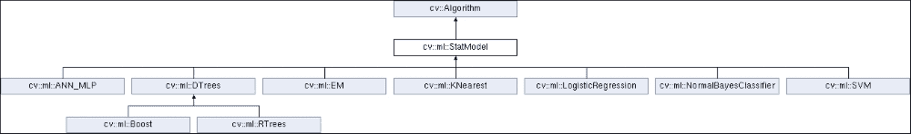
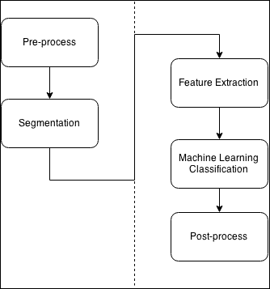
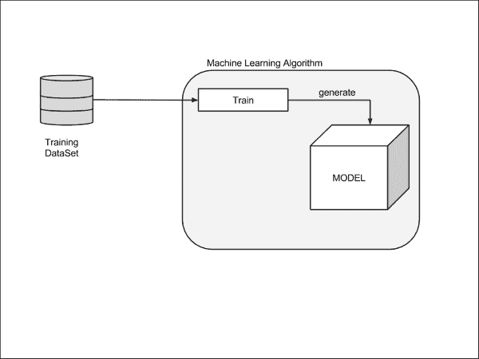
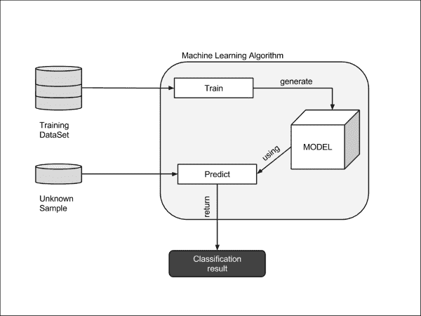
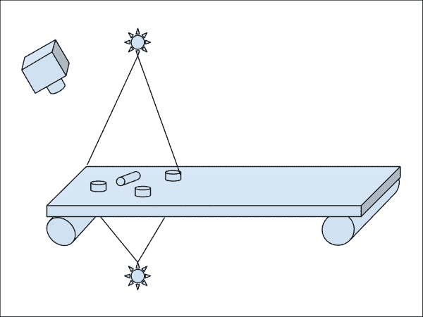
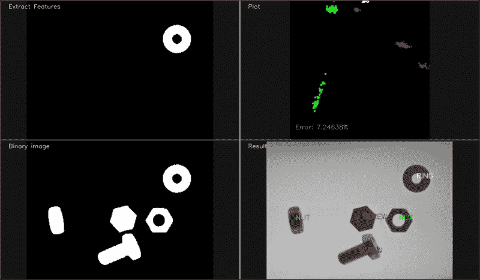
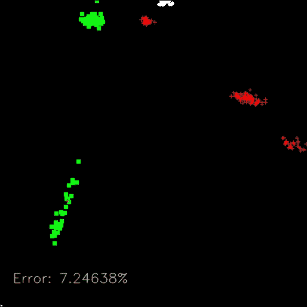
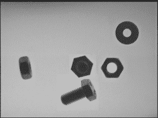

# 第六章. 学习对象分类

在上一章中，我们向您介绍了对象分割和检测的基本概念。这意味着将图像中出现的对象隔离出来，以便进行未来的处理和分析。

本章将介绍如何对每个这些孤立的对象进行分类。为了使我们能够对每个对象进行分类，我们需要训练我们的系统，使其能够学习所需的参数，以决定应该将哪个特定的标签分配给检测到的对象（取决于训练阶段考虑的不同类别）。

本章将向您介绍机器学习的基本概念，以对具有不同标签的图像进行分类。

我们将基于第五章中讨论的分割算法创建一个基本应用，第五章，《自动光学检测、对象分割和检测》。这个分割算法提取图像中的部分，其中包含对象。对于每个对象，我们将提取不同的特征并使用机器学习算法进行分析。通过使用机器学习算法，我们能够在用户界面中向最终用户展示输入图像中检测到的每个对象的标签。

在本章中，我们将介绍不同的主题和算法，具体如下：

+   机器学习概念的介绍

+   常见的机器学习算法和过程

+   特征提取

+   支持向量机

+   训练和预测

# 介绍机器学习概念

机器学习是一个古老的概念，由亚瑟·塞缪尔在 1959 年定义为“一个研究领域，它赋予计算机在没有明确编程的情况下学习的能力”。汤姆·M·米切尔提供了一个更正式的定义。在这个定义中，汤姆将样本或经验、标签和性能测量的概念联系起来。

### 注意

亚瑟·塞缪尔对机器学习的定义引用自《IBM 研究与发展杂志》中的《使用国际象棋游戏进行机器学习研究》一文（卷：3，期：3），第 210 页，以及同年《纽约客》和《办公室管理》中的一句话。

汤姆·M·米切尔给出的更正式的定义引用自《机器学习书》，McGraw Hill 1997 ([`www.cs.cmu.edu/afs/cs.cmu.edu/user/mitchell/ftp/mlbook.html`](http://www.cs.cmu.edu/afs/cs.cmu.edu/user/mitchell/ftp/mlbook.html))。

机器学习涉及人工智能中的模式识别和学习理论，与计算统计学相关。

机器学习被应用于数百个应用中，例如**OCR**（**光学字符识别**）、垃圾邮件过滤、搜索引擎，以及我们在本章中将要开发的数千个计算机视觉应用，其中机器学习算法试图对输入图像中出现的对象进行分类。

根据机器学习算法如何从数据或样本中学习，我们可以将它们分为以下三类：

+   **监督学习**：计算机从一组标记数据中学习。目标是学习模型的参数和规则，这些规则允许计算机映射数据与输出标签结果之间的关系。

+   **无监督学习**：没有给出标签，计算机试图发现输入数据的结构。

+   **强化学习**：计算机与动态环境交互，执行其目标并从其错误中学习。

根据我们从机器学习算法中获得的结果，我们可以将它们分类如下：

+   **分类**：在分类中，输入空间可以划分为*N*个类别，给定样本的预测结果是这些训练类别之一。这是最常用的类别之一。一个典型的例子是电子邮件垃圾邮件过滤，其中只有两个类别：垃圾邮件和非垃圾邮件或 OCR，其中只有*N*个字符可用，每个字符是一个类别。

+   **回归**：输出是一个连续值，而不是像分类结果这样的离散值。回归的一个例子可以是根据房屋大小、年份和位置预测房价。

+   **聚类**：使用无监督训练将输入划分为*N*组。

+   **密度估计**：这找到输入的（概率）分布。

在我们的例子中，我们将使用一个监督学习分类算法，其中使用带有标签的训练数据集来训练模型，我们模型的结果是对一个标签的预测。

机器学习是人工智能和统计学的一种现代方法，它涉及这两种技术。

在机器学习中，有几种方法和途径，其中一些使用的是**SVM**（**支持向量机**）、**ANNs**（**人工神经网络**）、聚类如**K-Nearest Neighbors**、**决策树**或深度学习，这是一种在某些情况下使用的大的**神经网络**方法，例如卷积等。

所有这些方法和途径都在 OpenCV 中得到支持、实现和良好记录。我们将在下一节中解释其中之一，即 SVM。

OpenCV 实现了这些机器学习算法中的八个。它们都继承自`StatModel`类：

+   人工神经网络

+   Boost

+   随机树

+   期望最大化

+   K-Nearest Neighbours

+   逻辑回归

+   正态贝叶斯分类器

+   支持向量机

### 注意

要了解每个算法的更多细节，请阅读 OpenCV 机器学习文档页面[`docs.opencv.org/trunk/dc/dd6/ml_intro.html`](http://docs.opencv.org/trunk/dc/dd6/ml_intro.html)。

在以下图像中，你可以看到机器学习类层次结构：



`StatModel`类提供了所有重要的`read`和`write`函数，这些函数对于保存我们的机器学习参数和训练数据非常重要。

在机器学习中，最耗时的部分是`训练`方法。对于大型数据集和复杂的机器学习结构，训练可能需要从几秒到几周或几个月；例如，在深度学习和包含超过 10 万张图片的大神经网络结构中。在深度学习算法中，通常使用并行硬件处理；例如，使用 CUDA 技术的 GPU 或显卡来减少训练过程中的计算时间。

这意味着我们每次运行应用程序时都不能重新训练我们的算法，并且建议我们在模型训练后保存我们的模型，因为所有机器学习的训练/预测参数都被保存。接下来，当我们想要在未来运行它时，如果我们需要用更多数据更新我们的模型，我们只需要从我们的保存模型中加载/读取，而无需再次进行训练。

`StatModel`是一个接口，由其实现的每个实现实现。两个关键函数是`train`和`predict`。

`train`方法负责从训练数据集中学习模型的参数。`train`函数有以下四个调用方式，可以以四种不同的方式调用：

```py
bool train(const Ptr<TrainData>& trainData, int flags=0 );
bool train(InputArray samples, int layout, InputArray responses);
Ptr<_Tp> train(const Ptr<TrainData>& data, const _Tp::Params& p, int flags=0 );
Ptr<_Tp> train(InputArray samples, int layout, InputArray responses, const _Tp::Params& p, int flags=0 );
```

它有以下参数：

+   `trainData`：这是可以从`TrainData`类加载或创建的训练数据。这个类是 OpenCV 3 中的新功能，帮助开发者创建训练数据，因为不同的算法需要不同的数组结构来训练和预测，例如 ANN 算法。

+   `samples`：这是训练数组样本的数组，例如机器学习算法所需的格式要求的训练数据。

+   `layout`：有两种类型的布局：`ROW_SAMPLE`（训练样本是矩阵行）和`COL_SAMPLE`（训练样本是矩阵列）。

+   `responses`：这是与样本数据相关联的响应向量。

+   `p`：这是`StatModel`参数。

+   `flags`：这些是由每个方法定义的可选标志。

`predict`方法更简单，只有一个调用：

```py
float StatModel::predict(InputArray samples, OutputArray results=noArray(), int flags=0 )
```

它有以下参数：

+   `samples`：这些是要预测的输入样本。可以只有一个或多个要预测的数据。

+   `results`：这是每个输入行样本的结果（由算法从前一个训练模型计算得出）。

+   `flags`：这些是模型相关的可选标志。一些模型，如 Boost 和 SVM，识别`StatModel::RAW_OUTPUT`标志，这使得方法返回原始结果（总和）而不是类标签。

`StatModel`类提供了其他非常实用的方法，具体如下：

+   `isTrained()`：如果模型已训练，则返回`true`。

+   `isClassifier()`：如果模型是分类器，则返回`true`；如果是回归，则返回`false`。

+   `getVarCount()`：返回训练样本中的变量数。

+   `save(const string& filename)`: 这将模型保存到文件名指定的位置

+   `Ptr<_Tp> load(const string& filename)`: 这将从文件名中加载模型，例如：`Ptr<SVM> svm = StatModel::load<SVM>("my_svm_model.xml");`

+   `calcError(const Ptr<TrainData>& data, bool test, OutputArray resp)`: 这从测试数据中计算误差，其中数据是训练数据。如果测试为`true`，该方法计算所有训练数据测试子集的误差，否则它计算数据训练子集的误差。最后`resp`是可选的输出结果。

现在，我们将学习如何构建一个基本的应用程序，该程序在计算机视觉应用中使用机器学习。

# 计算机视觉和机器学习工作流程

带有机器学习的计算机视觉应用具有一个共同的基本结构。这个结构被划分为不同的步骤，这些步骤几乎在所有计算机视觉应用中都会重复，而有些步骤则被省略。在下面的图中，我们展示了涉及的不同步骤：



几乎任何计算机视觉应用都以一个预处理阶段开始，该阶段应用于输入图像。预处理包括光照条件去除、噪声、阈值、模糊等。

在我们对输入图像应用所有必要的预处理步骤之后，第二步是分割。在分割步骤中，我们需要提取图像中的感兴趣区域，并将每个区域隔离为独特的感兴趣对象。例如，在人脸检测系统中，我们需要将人脸与场景中的其他部分分开。

在获取图像中的对象之后，我们继续下一步。我们需要提取每个检测到的对象的全部特征；特征是对象特性的向量。特性描述我们的对象，可以是对象的面积、轮廓、纹理图案等。

现在，我们有了我们对象的描述符；描述符是描述对象的特征，我们使用这些描述符来训练我们的模型或预测其中的一个。为此，我们需要创建一个包含数百、数千和数百万图像的特征大数据集，这些图像经过预处理，并提取的特征用于我们选择的训练模型函数中：



当我们训练一个数据集时，模型学习所有必要的参数，以便在给定一个具有未知标签的新特征向量时进行预测：



在我们得到预测结果后，有时需要对输出数据进行后处理；例如，合并多个分类以减少预测误差或合并多个标签。一个示例是**OCR**（**光学字符识别**），其中分类结果是每个字符，通过结合字符识别的结果，我们构建一个单词。这意味着我们可以创建一个后处理方法来纠正检测到的单词中的错误。

通过对计算机视觉中机器学习的简要介绍，我们将学习如何实现我们自己的应用，该应用使用机器学习对幻灯片带中的对象进行分类。我们将使用支持向量机作为我们的分类方法，并了解如何使用它们。其他机器学习算法有非常相似的应用。OpenCV 文档提供了所有机器学习算法的详细信息。

# 自动对象检测分类示例

继续上一章的例子，自动对象检测分割，其中载体带包含三种不同类型的对象（螺母、螺丝和环），利用计算机视觉，我们将能够识别每一个，并发送通知给机器人或类似设备将它们放入不同的盒子中。



在第五章*自动光学检测、对象分割和检测*中，我们预处理了输入图像，并使用不同的技术提取了图像的兴趣区域和隔离每个对象。现在，我们将应用前几节中解释的所有这些概念，在这个例子中提取特征并对每个对象进行分类，以便可能的机器人将它们放入不同的盒子中。在我们的应用中，我们只将展示图像中的每个图像的标签，但我们可以将图像中的位置和标签发送到其他设备，如机器人。

然后，我们的目标是根据以下图像，从包含少量对象的输入图像中显示每个对象的名称，但是为了学习整个过程的全部步骤，我们将训练我们的系统显示每个训练图像，创建一个图表显示每个对象我们将使用不同颜色的特征，预处理后的输入图像，最后，以下结果的输出分类结果：



我们将为我们的示例应用执行以下步骤：

1.  对于每个图像的训练：

    +   预处理图像

    +   分割图像

1.  对于图像中的每个对象：

    +   提取特征

    +   将对象及其标签添加到训练特征向量中

1.  创建 SVM 模型。

1.  使用训练特征向量训练我们的 SVM 模型。

1.  预处理待分类的输入图像。

1.  分割输入图像。

1.  对于检测到的每个对象：

    +   提取特征

    +   使用 SVM 模型进行预测

    +   在输出图像上绘制结果

对于预处理和分割阶段，我们将使用第五章中讨论的代码，*自动光学检测、对象分割和检测*，我们将解释如何提取特征并创建训练和预测我们模型所需的向量。

# 特征提取

现在，让我们提取每个对象的特征。为了理解特征向量的特征概念，我们将提取非常简单的特征，但这足以获得良好的结果。在其他解决方案中，我们可以获得更复杂的特征，例如纹理描述符、轮廓描述符等。

在我们的示例中，我们只有这三种类型的对象，*螺母*、*环*和*螺丝*，在不同的可能位置。所有这些可能的对象和位置都在以下图中展示：


我们将探索有助于计算机识别每个对象的良好特征。特征如下：

+   物体的面积

+   长宽比，即边界矩形的宽度除以高度

+   孔洞的数量

+   轮廓边的数量

这些特征可以很好地描述我们的对象，如果我们使用所有这些特征，分类错误可以非常小。然而，在我们的实现示例中，我们将只使用前两个特征，即面积和宽高比，用于学习目的，因为我们可以在二维图形中绘制这些特征，并且我们可以展示这些值正确地描述了我们的对象。我们可以在图形图中直观地区分一种对象与其他对象。

为了提取这些特征，我们将使用黑色/白色输入 ROI 图像作为输入，其中只有一个对象以白色出现，背景为黑色。这个输入是分割的结果，如第五章中所述，*自动光学检测、对象分割和检测*。我们将使用 `findCountours` 算法进行对象分割，并为此创建 `ExtractFeatures` 函数：

```py
vector< vector<float> > ExtractFeatures(Mat img, vector<int>* left=NULL, vector<int>* top=NULL)
{
  vector< vector<float> > output;
  vector<vector<Point> > contours;
  Mat input= img.clone();

  vector<Vec4i> hierarchy;
  findContours(input, contours, hierarchy, RETR_CCOMP, CHAIN_APPROX_SIMPLE);
  // Check the number of objects detected
  if(contours.size() == 0 ){
    return output;
  }
  RNG rng( 0xFFFFFFFF );
  for(int i=0; i<contours.size(); i++){

    Mat mask= Mat::zeros(img.rows, img.cols, CV_8UC1);
    drawContours(mask, contours, i, Scalar(1), FILLED, LINE_8, hierarchy, 1);
    Scalar area_s= sum(mask);
    float area= area_s[0];

    if(area>500){ //if the area is greather than min.

      RotatedRect r= minAreaRect(contours[i]);
      float width= r.size.width;
      float height= r.size.height;
      float ar=(width<height)?height/width:width/height;

      vector<float> row;
      row.push_back(area);
      row.push_back(ar);
      output.push_back(row);
      if(left!=NULL){
          left->push_back((int)r.center.x);
      }
      if(top!=NULL){
          top->push_back((int)r.center.y);
      }

      miw->addImage("Extract Features", mask*255);
      miw->render();
      waitKey(10);
    }
  }
  return output;
}
```

让我们详细理解一下代码。

我们将创建一个函数，该函数以一个图像作为输入，并返回每个在图像中检测到的对象的左和顶位置的两个向量作为参数；这将用于在每个对象上绘制其标签。该函数的输出是一个浮点向量向量的向量；换句话说，是一个矩阵，其中每一行包含检测到的每个对象的特征。

让我们创建一个函数，在每一个对象上绘制标签：

1.  首先，我们需要创建输出向量变量和轮廓变量，这些变量将在我们的 `FindContours` 算法分割中使用，并且我们需要创建输入图像的一个副本，因为 `findContours` OpenCV 函数会修改输入图像：

    ```py
      vector< vector<float> > output;
      vector<vector<Point> > contours;
      Mat input= img.clone();
      vector<Vec4i> hierarchy;
      findContours(input, contours, hierarchy, RETR_CCOMP, CHAIN_APPROX_SIMPLE);
    ```

1.  现在，我们可以使用 `findContours` 函数检索图像中的每个对象。如果我们没有检测到任何轮廓，我们返回一个空输出矩阵：

    ```py
    if(contours.size() == 0 ){
        return output;
      }
    ```

1.  对于我们将要在黑色图像中绘制的每个 `contour` 对象，我们使用 `1` 作为颜色值。这是我们用于计算所有特征的掩码图像：

    ```py
    for(int i=0; i<contours.size(); i++){
    Mat mask= Mat::zeros(img.rows, img.cols, CV_8UC1);
        drawContours(mask, contours, i, Scalar(1), FILLED, LINE_8, hierarchy, 1);
    ```

1.  使用值 `1` 在形状内部绘制非常重要，因为我们可以通过计算轮廓内的所有值来计算面积：

    ```py
        Scalar area_s= sum(mask);
        float area= area_s[0];
    ```

1.  这个面积是我们的第一个特征。现在，我们将使用这个面积值作为过滤器，以移除我们需要避免的小对象。所有面积小于最小面积的物体都被丢弃。在通过过滤器之后，我们创建第二个特征，即物体的长宽比。这意味着最大宽度或高度除以最小宽度或高度。这个特征可以很容易地将螺丝与其他物体区分开来：

    ```py
    if(area>MIN_AREA){ //if the area is greather than min.
          RotatedRect r= minAreaRect(contours[i]);
          float width= r.size.width;
          float height= r.size.height;
          float ar=(width<height)?height/width:width/height;
    ```

1.  现在，我们已经有了这些特征，我们只需要将这些特征添加到输出向量中。为此，我们创建一个浮点行向量并添加这些值，稍后，将这个行向量添加到输出向量中：

    ```py
    vector<float> row;
          row.push_back(area);
          row.push_back(ar);
          output.push_back(row);
    ```

1.  如果传递了左上角 `params`，则将左上角的值添加到 `params` 输出中：

    ```py
      if(left!=NULL){
              left->push_back((int)r.center.x);
          }
          if(top!=NULL){
              top->push_back((int)r.center.y);
          }
    ```

1.  最后，我们将向用户展示检测到的对象，以便获取用户反馈，当我们处理完图像中的所有对象后，我们将返回输出特征向量：

    ```py
          miw->addImage("Extract Features", mask*255);
          miw->render();
          waitKey(10);
        }
      }
      return output;
    ```

现在，我们可以提取每个输入图像的特征，并需要继续下一步，即训练我们的模型。

## 训练 SVM 模型

我们将使用一个监督学习模型，然后，我们需要每个对象的图像及其相应的标签。数据集中没有图像的最小数量限制。如果我们为训练过程提供更多图像，我们将得到一个更好的分类模型（在大多数情况下），但简单的分类器足以训练简单的模型。为此，我们创建了三个文件夹（`screw`、`nut` 和 `ring`），其中每个类型的所有图像都放在一起。

对于文件夹中的每个图像，我们需要提取特征并将它们添加到训练特征矩阵中，同时，我们还需要创建一个新向量，其中包含每行的标签，对应于每个训练矩阵。

为了评估我们的系统，我们将每个文件夹分成用于测试和训练目的的多个图像。我们保留大约 20 个图像用于测试，其余的用于训练。然后，我们需要创建两个标签向量和两个用于训练和测试的矩阵。

然后，让我们理解一下代码。首先，我们需要创建我们的模型。我们需要声明模型以便能够将其作为全局变量访问。OpenCV 使用 `Ptr` 模板类来处理指针：

```py
Ptr<SVM> svm;
```

在我们声明新的 SVM 模型指针之后，我们需要创建它并对其进行训练。为此，我们创建了一个 `trainAndTest` 函数：

```py
void trainAndTest()
{
  vector< float > trainingData;
  vector< int > responsesData;
  vector< float > testData;
  vector< float > testResponsesData;

  int num_for_test= 20;

  // Get the nut images
  readFolderAndExtractFeatures("../data/nut/tuerca_%04d.pgm", 0, num_for_test, trainingData, responsesData, testData, testResponsesData);
  // Get and process the ring images
  readFolderAndExtractFeatures("../data/ring/arandela_%04d.pgm", 1, num_for_test, trainingData, responsesData, testData, testResponsesData);
  // get and process the screw images
  readFolderAndExtractFeatures("../data/screw/tornillo_%04d.pgm", 2, num_for_test, trainingData, responsesData, testData, testResponsesData);

  cout << "Num of train samples: " << responsesData.size() << endl;

  cout << "Num of test samples: " << testResponsesData.size() << endl;

  // Merge all data 
  Mat trainingDataMat(trainingData.size()/2, 2, CV_32FC1, &trainingData[0]);
  Mat responses(responsesData.size(), 1, CV_32SC1, &responsesData[0]);

  Mat testDataMat(testData.size()/2, 2, CV_32FC1, &testData[0]);
  Mat testResponses(testResponsesData.size(), 1, CV_32FC1, &testResponsesData[0]);

    svm = SVM::create();
        svm->setType(SVM::C_SVC);
        svm->setKernel(SVM::CHI2);
        svm->setTermCriteria(TermCriteria(TermCriteria::MAX_ITER, 100, 1e-6));

  svm->train(trainingDataMat, ROW_SAMPLE, responses);

  if(testResponsesData.size()>0){
    cout << "Evaluation" << endl;
    cout << "==========" << endl;
    // Test the ML Model
    Mat testPredict;
    svm->predict(testDataMat, testPredict);
    cout << "Prediction Done" << endl;
    // Error calculation
    Mat errorMat= testPredict!=testResponses;
    float error= 100.0f * countNonZero(errorMat) /testResponsesData.size();
    cout << "Error: " << error << "\%" << endl;
    // Plot training data with error label
    plotTrainData(trainingDataMat, responses, &error);

  }else{
    plotTrainData(trainingDataMat, responses);
  }
}
```

让我们详细理解一下代码。

首先，我们需要创建存储训练和测试数据的所需变量：

```py
  vector< float > trainingData;
  vector< int > responsesData;
  vector< float > testData;
  vector< float > testResponsesData;
```

如前所述，我们需要从每个文件夹中读取所有图像，提取特征，并将它们保存到我们的训练和测试数据中。为此，我们将使用`readFolderAndExtractFeatures`函数：

```py
  int num_for_test= 20;
  // Get the nut images
  readFolderAndExtractFeatures("../data/nut/tuerca_%04d.pgm", 0, num_for_test, trainingData, responsesData, testData, testResponsesData);
  // Get and process the ring images
  readFolderAndExtractFeatures("../data/ring/arandela_%04d.pgm", 1, num_for_test, trainingData, responsesData, testData, testResponsesData);
  // get and process the screw images
  readFolderAndExtractFeatures("../data/screw/tornillo_%04d.pgm", 2, num_for_test, trainingData, responsesData, testData, testResponsesData);
```

`readFolderAndExtractFeatures`函数使用 OpenCV 的`VideoCapture`函数读取文件夹中的所有图像，就像视频或摄像头一样。对于每个读取的图像，我们提取特征，然后将它们添加到相应的输出向量中：

```py
bool readFolderAndExtractFeatures(string folder, int label, int num_for_test, 
  vector<float> &trainingData, vector<int> &responsesData, 
  vector<float> &testData, vector<float> &testResponsesData)
{
  VideoCapture images;
  if(images.open(folder)==false){
    cout << "Can not open the folder images" << endl;
    return false;
  }
  Mat frame;
  int img_index=0;
  while( images.read(frame) ){
    //// Preprocess image
    Mat pre= preprocessImage(frame);
    // Extract features
    vector< vector<float> > features= ExtractFeatures(pre);
    for(int i=0; i< features.size(); i++){
      if(img_index >= num_for_test){
        trainingData.push_back(features[i][0]);
        trainingData.push_back(features[i][1]);
        responsesData.push_back(label);
      }else{
        testData.push_back(features[i][0]);
        testData.push_back(features[i][1]);
        testResponsesData.push_back((float)label);
      }
    }
    img_index++;
  }
  return true;
}
```

在将所有向量填充好特征和标签后，我们需要将它们转换为 OpenCV `mat`格式，以便将它们发送到`training`函数：

```py
// Merge all data 
  Mat trainingDataMat(trainingData.size()/2, 2, CV_32FC1, &trainingData[0]);
  Mat responses(responsesData.size(), 1, CV_32SC1, &responsesData[0]);
  Mat testDataMat(testData.size()/2, 2, CV_32FC1, &testData[0]);
  Mat testResponses(testResponsesData.size(), 1, CV_32FC1, &testResponsesData[0]);
```

正如之前提到的，我们现在准备创建和训练我们的机器学习模型，我们将使用支持向量机。首先，我们需要设置基本模型参数：

```py
// Set up SVM's parameters
  svm = SVM::create();
svm->setType(SVM::C_SVC);
svm->setKernel(SVM::CHI2);
svm->setTermCriteria(TermCriteria(TermCriteria::MAX_ITER, 100, 1e-6));
```

我们需要定义要使用的 SVM 类型和核，以及停止学习过程的准则；在我们的情况下，我们将使用最大迭代次数，停止在 100 次迭代。有关每个参数及其功能的更多信息，请参阅 OpenCV 文档。在创建设置参数后，我们需要通过调用`train`方法并使用`trainingDataMat`和响应矩阵来创建模型：

```py
  // Train the SVM
  svm->train(trainingDataMat, ROW_SAMPLE, responses);
```

我们使用测试向量（通过将`num_for_test`变量设置为大于`0`）来获得我们模型的近似误差。为了获得误差估计，我们需要预测所有测试向量特征以获得 SVM 预测结果，然后比较这些结果与原始标签：

```py
if(testResponsesData.size()>0){
    cout << "Evaluation" << endl;
    cout << "==========" << endl;
    // Test the ML Model
    Mat testPredict;
    svm->predict(testDataMat, testPredict);
    cout << "Prediction Done" << endl;
    // Error calculation
    Mat errorMat= testPredict!=testResponses;
    float error= 100.0f * countNonZero(errorMat) / testResponsesData.size();
    cout << "Error: " << error << "\%" << endl;
    // Plot training data with error label
    plotTrainData(trainingDataMat, responses, &error);
  }else{
    plotTrainData(trainingDataMat, responses);
  }
```

我们使用`predict`函数，利用`testDataMat`特征和一个新的`mat`来预测结果。`predict`函数允许你同时进行多个预测，返回一个矩阵而不是只有一行。

预测完成后，我们只需要使用我们的`testResponses`（原始标签）获取`testPredict`的差异。如果有差异，我们只需要计算差异的数量，并将它们除以测试总数以获得错误。

### 注意

我们可以使用新的`TrainData`类生成特征向量和样本，并将训练数据分割成测试和训练向量。

最后，我们需要在 2D 图中显示训练数据，其中*y*轴是宽高比特征，*x*轴是物体的面积。每个点都有不同的颜色和形状（交叉、正方形和圆形），表示不同类型的物体，我们可以在以下图中清楚地看到物体的组：



现在，我们非常接近完成我们的应用程序样本。我们有一个训练好的 SVM 模型，我们可以将其用作分类模型来检测新到达的未知特征向量类型。然后，下一步是预测包含未知物体的输入图像。

## 输入图像预测

现在，我们准备解释主要功能，该功能加载输入图像并预测出现在内部的物体。我们将使用如下所示的内容作为输入图像，其中出现多个不同的物体，如图所示：



对于所有训练图像，我们需要加载和预处理输入图像：

1.  首先，我们将图像加载并转换为灰度颜色值。

1.  然后，我们应用前面讨论的预处理任务，使用`preprocessImage`函数，如第五章，*自动光学检测、目标分割和检测*：

    ```py
    Mat pre= preprocessImage(img);
    ```

1.  现在，我们使用前面提到的`ExtractFeatures`提取图像中所有出现的物体的特征以及每个物体的左上角位置：

    ```py
    // Extract features
      vector<int> pos_top, pos_left;
      vector< vector<float> > features= ExtractFeatures(pre, &pos_left, &pos_top);
    ```

1.  对于我们检测到的每个物体，我们将其存储为特征行，然后，我们将每一行转换为具有一行和两个特征的`Mat`：

    ```py
    for(int i=0; i< features.size(); i++){
        Mat trainingDataMat(1, 2, CV_32FC1, &features[i][0]);
    ```

1.  然后，我们使用我们的`StatModel` SVM 的`predict`函数预测单个物体：

    ```py
    float result= svm->predict(trainingDataMat);
    ```

    预测的浮点结果是检测到的物体的标签。然后，为了完成应用程序，我们只需要在输出图像的每个图像上绘制标签。

1.  我们将使用`stringstream`来存储文本，使用`Scalar`来存储每个不同标签的颜色：

    ```py
    stringstream ss;
        Scalar color;
        if(result==0){
          color= green; // NUT
          ss << "NUT";
        }
        else if(result==1){
          color= blue; // RING
          ss << "RING" ;
        }
        else if(result==2){
          color= red; // SCREW
          ss << "SCREW";
        }
    ```

1.  使用`ExtractFeatures`函数中检测到的位置在每个物体上绘制标签文本：

    ```py
    putText(img_output, 
          ss.str(), 
          Point2d(pos_left[i], pos_top[i]), 
          FONT_HERSHEY_SIMPLEX, 
          0.4, 
          color);
    ```

1.  最后，我们将结果绘制在输出窗口中：

    ```py
      miw->addImage("Binary image", pre);
      miw->addImage("Result", img_output);
      miw->render();
      waitKey(0);
    ```

我们应用程序的最终结果显示一个由四个屏幕拼贴的窗口，其中左上角的图像是输入训练图像，右上角的图像是绘图训练图像，左下角的图像是分析预处理后的输入图像，右下角的图像是预测的最终结果：


# 摘要

在本章中，我们学习了机器学习模型的基础知识以及如何应用一个小型样例应用来理解创建我们自己的 ML 应用所需的所有基本技巧。

机器学习是复杂的，涉及针对每个用例的不同技术（监督学习、无监督学习、聚类等），我们学习了如何创建最典型的 ML 应用以及使用 SVM 的监督学习。

监督机器学习中的最重要的概念是：首先，我们需要有适当数量的样本或数据集；其次，我们需要正确选择描述我们对象的特征。有关图像特征的更多信息，请参阅第八章，*视频监控、背景建模和形态学操作*。第三，选择给我们最佳预测的最佳模型。

如果我们没有达到正确的预测，我们必须检查这些概念中的每一个，以寻找问题所在。

在下一章中，我们将介绍背景减法方法，这对于视频监控应用非常有用，在这些应用中，背景不提供任何有趣的信息，必须被丢弃，以便对感兴趣的对象进行分割和分析。
