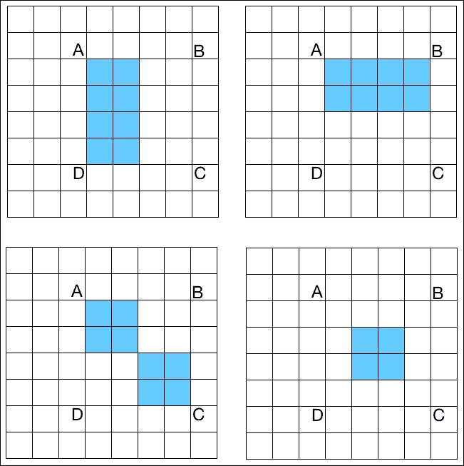
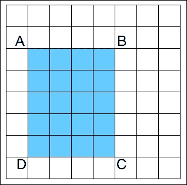
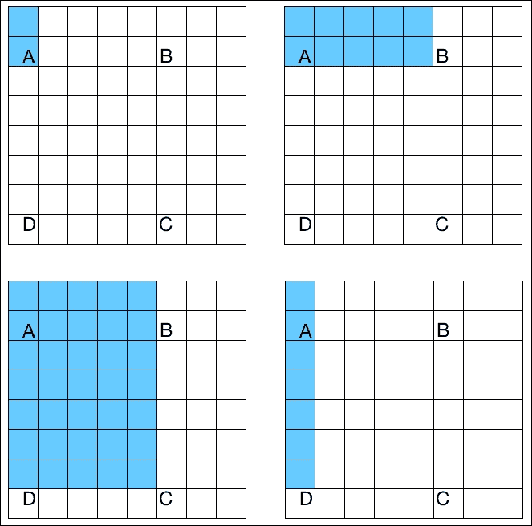
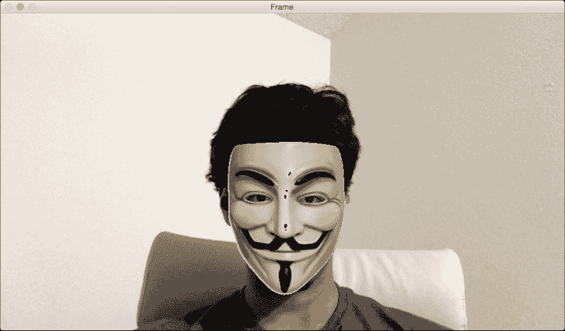
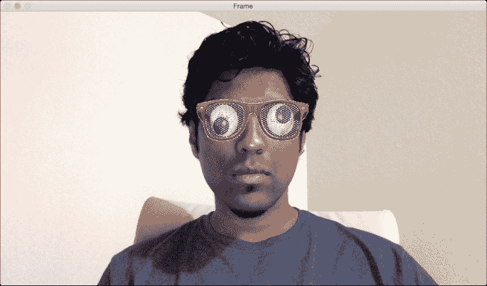
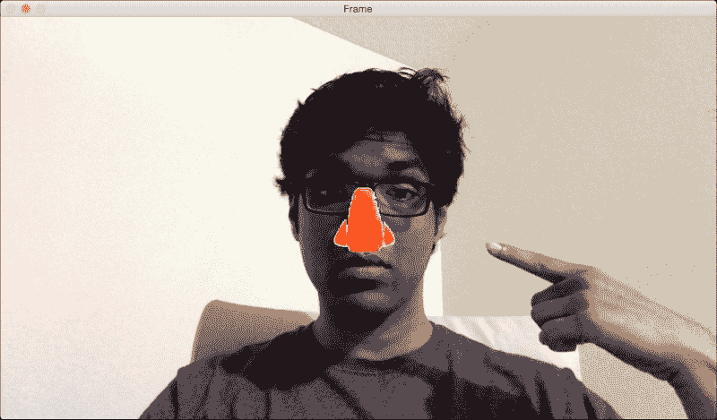

# 第七章：检测面部部位和叠加口罩

在上一章中，我们学习了对象分类以及如何使用机器学习来实现它。在本章中，我们将学习如何检测和跟踪不同的面部部位。我们将从理解面部检测流程及其从底层构建的方式开始讨论。然后，我们将使用这个框架来检测面部部位，如眼睛、耳朵、嘴巴和鼻子。接下来，我们将学习如何在实时视频中将这些面部部位叠加有趣的口罩。

在本章中，我们将涵盖以下主题：

+   使用 Haar 级联进行工作

+   整数图像及其必要性

+   构建通用的面部检测流程

+   在网络摄像头实时视频流中检测和跟踪面部部位，如眼睛、耳朵、鼻子和嘴巴

+   在视频中自动叠加面部口罩、太阳镜和有趣的鼻子

# 理解 Haar 级联

Haar 级联是基于 Haar 特征的级联分类器。什么是级联分类器？它简单地说是一系列弱分类器的串联，这些弱分类器可以用来创建一个强分类器。那么，我们所说的*弱*和*强*分类器是什么意思呢？弱分类器是性能有限的分类器。它们没有正确分类所有事物的能力。如果你把问题简化到极致，它们可能达到可接受的水平。另一方面，强分类器在正确分类我们的数据方面非常出色。我们将在接下来的几段中看到这一切是如何结合在一起的。Haar 级联的另一个重要部分是*Haar 特征*。这些特征是矩形及其在图像中不同区域差值的简单求和。让我们考虑以下图示：



如果我们要计算区域 ABCD 的 Haar 特征，我们只需要计算该区域中白色像素和彩色像素之间的差异。如图所示，我们使用不同的模式来构建 Haar 特征。还有许多其他模式也被用作此目的。我们在多个尺度上这样做，以使系统对给定对象的尺寸变化具有鲁棒性。当我们说*多个尺度*时，我们只是将图像缩小以再次计算相同的特征。这样，我们可以使其对给定对象的尺寸变化具有鲁棒性。

### 注意

事实证明，这种串联系统是检测图像中对象的一种非常好的方法。在 2001 年，*保罗·维奥拉*和*迈克尔·琼斯*发表了一篇开创性的论文，其中他们描述了一种快速有效的对象检测方法。如果你对此感兴趣，可以查看他们的论文：[`www.cs.ubc.ca/~lowe/425/slides/13-ViolaJones.pdf`](http://www.cs.ubc.ca/~lowe/425/slides/13-ViolaJones.pdf)。

让我们深入探讨，了解它们实际上做了什么。他们基本上描述了一个使用简单分类器增强级联的算法。这个系统用于构建一个能够真正表现良好的强大分类器。为什么他们使用这些简单分类器而不是更准确、更复杂的分类器呢？嗯，使用这种技术，他们能够避免构建一个能够以高精度执行的单个分类器的问题。这些单步分类器往往很复杂且计算密集。他们的技术之所以如此有效，是因为简单分类器可以是弱学习器，这意味着它们不需要很复杂。

考虑构建表格检测器的问题。我们希望构建一个能够自动学习表格外观的系统。基于这个知识，它应该能够识别任何给定图像中是否存在表格。为了构建这个系统，第一步是收集可以用来训练我们系统的图像。在机器学习领域有许多技术可以用来训练这样的系统。记住，如果我们想让我们的系统表现良好，我们需要收集大量的表格和非表格图像。在机器学习的术语中，表格图像被称为**正样本**，而非表格图像被称为**负样本**。我们的系统将摄取这些数据，然后学习区分这两类。

为了构建一个实时系统，我们需要保持我们的分类器既简洁又简单。唯一的问题是简单的分类器并不非常准确。如果我们试图使它们更准确，那么它们最终会变得计算密集，从而变慢。这种在准确性和速度之间的权衡在机器学习中非常常见。因此，我们将通过连接多个弱分类器来创建一个强大且统一的分类器来克服这个问题。我们不需要弱分类器非常准确。为了确保整体分类器的质量，*Viola* 和 *Jones* 在级联步骤中描述了一种巧妙的技术。你可以阅读这篇论文来了解完整的系统。

既然我们已经了解了整个流程，让我们看看如何构建一个能够在实时视频中检测人脸的系统。第一步是从所有图像中提取特征。在这种情况下，算法需要这些特征来学习和理解人脸的外观。他们在论文中使用了 Haar 特征来构建特征向量。一旦我们提取了这些特征，我们就将它们通过一系列分类器。我们只是检查所有不同的矩形子区域，并丢弃其中没有人脸的子区域。这样，我们就可以快速得出结论，看给定的矩形是否包含人脸。

# 什么是积分图？

为了提取这些 Haar 特征，我们需要计算图像中许多矩形区域内像素值的总和。为了使其尺度不变，我们需要在多个尺度（即不同矩形大小）上计算这些面积。如果天真地实现，这将是一个非常计算密集的过程。我们必须遍历每个矩形的所有像素，包括如果它们包含在不同的重叠矩形中，则多次读取相同的像素。如果你想要构建一个可以在实时运行的系统，你不能在计算上花费这么多时间。我们需要找到一种方法来避免在面积计算中的这种巨大冗余，因为我们多次遍历相同的像素。为了避免这种情况，我们可以使用一种称为**积分图像**的东西。这些图像可以在线性时间内初始化（通过只遍历图像两次）并且可以通过读取仅四个值来提供任何大小矩形内像素的总和。为了更好地理解它，让我们看一下下面的图：



如果我们想在我们的图像中计算任何矩形的面积，我们不必遍历该区域的所有像素。让我们考虑由图像中的左上角点和任何点 P 作为对角线顶点形成的矩形。让我们用 A[P]表示这个矩形的面积。例如，在前面图中，A[B]表示由左上角点和 B 作为对角线顶点形成的 5 X 2 矩形的面积。为了更清晰地说明，让我们看一下下面的图：



让我们看一下前面图中的左上角图。彩色像素表示从左上角像素到点 A 之间的区域。这表示为 A[A]。其余的图分别用它们各自的名字表示：A[B]、A[C]和 A[D]。现在，如果我们想计算前面图中所示矩形 ABCD 的面积，我们将使用以下公式：

矩形 ABCD 的面积 = A[C] – (A[B] + A[D] - A[A])

这个特定公式有什么特别之处呢？正如我们所知，从图像中提取 Haar 特征包括计算这些求和，而且我们不得不在图像中的多个尺度上对很多矩形进行计算。这些计算中的许多都是重复的，因为我们不得不反复遍历相同的像素。这非常慢，以至于构建实时系统将不可行。因此，我们需要这个公式。正如你所见，我们不必多次遍历相同的像素。如果我们想计算任何矩形的面积，上一个方程右侧的所有值都在我们的积分图像中 readily available。我们只需取出正确的值，将它们代入上一个方程，并提取特征。

# 在实时视频中叠加人脸面具

OpenCV 提供了一个优秀的面部检测框架。我们只需要加载级联文件，并使用它来检测图像中的面部。当我们从摄像头捕获视频流时，我们可以在我们的脸上叠加有趣的口罩。它看起来可能像这样：



让我们来看看代码的主要部分，看看如何将前面的口罩叠加到输入视频流中的脸部上方。完整的代码包含在本书提供的可下载代码包中：

```py
int main(int argc, char* argv[])
{
    string faceCascadeName = argv[1];

    // Variable declarations and initializations

    // Iterate until the user presses the Esc key
    while(true)
    {
        // Capture the current frame
        cap >> frame;

        // Resize the frame
        resize(frame, frame, Size(), scalingFactor, scalingFactor, INTER_AREA);

        // Convert to grayscale
        cvtColor(frame, frameGray, CV_BGR2GRAY);

        // Equalize the histogram
        equalizeHist(frameGray, frameGray);

        // Detect faces
        faceCascade.detectMultiScale(frameGray, faces, 1.1, 2, 0|CV_HAAR_SCALE_IMAGE, Size(30, 30) );
```

让我们看看这里发生了什么。我们从摄像头读取输入帧，并将其调整到我们选择的大小。捕获的帧是一个彩色图像，而人脸检测是在灰度图像上进行的。因此，我们将其转换为灰度并均衡直方图。为什么我们需要均衡直方图？我们需要这样做是为了补偿任何类型的问题，例如光照、饱和度等。如果图像太亮或太暗，检测效果会差。因此，我们需要均衡直方图，以确保我们的图像具有健康的像素值范围：

```py
        // Draw green rectangle around the face
        for(int i = 0; i < faces.size(); i++)
        {
            Rect faceRect(faces[i].x, faces[i].y, faces[i].width, faces[i].height);

            // Custom parameters to make the mask fit your face. You may have to play around with them to make sure it works.
            int x = faces[i].x - int(0.1*faces[i].width);
            int y = faces[i].y - int(0.0*faces[i].height);
            int w = int(1.1 * faces[i].width);
            int h = int(1.3 * faces[i].height);

            // Extract region of interest (ROI) covering your face
            frameROI = frame(Rect(x,y,w,h));
```

到目前为止，我们知道脸部的位置。因此，我们提取感兴趣的区域，以便在正确的位置叠加口罩：

```py
            // Resize the face mask image based on the dimensions of the above ROI
            resize(faceMask, faceMaskSmall, Size(w,h));

            // Convert the above image to grayscale
            cvtColor(faceMaskSmall, grayMaskSmall, CV_BGR2GRAY);

            // Threshold the above image to isolate the pixels associated only with the face mask
            threshold(grayMaskSmall, grayMaskSmallThresh, 230, 255, CV_THRESH_BINARY_INV);
```

我们已经隔离了与脸部口罩相关的像素。现在，我们想要以不像是矩形的方式叠加口罩。我们想要叠加对象的精确边界，使其看起来自然。现在我们就来叠加口罩：

```py
            // Create mask by inverting the above image (because we don't want the background to affect the overlay)
            bitwise_not(grayMaskSmallThresh, grayMaskSmallThreshInv);

            // Use bitwise "AND" operator to extract precise boundary of face mask
            bitwise_and(faceMaskSmall, faceMaskSmall, maskedFace, grayMaskSmallThresh);

            // Use bitwise "AND" operator to overlay face mask
            bitwise_and(frameROI, frameROI, maskedFrame, grayMaskSmallThreshInv);

            // Add the above masked images and place it in the original frame ROI to create the final image
            add(maskedFace, maskedFrame, frame(Rect(x,y,w,h)));
        }

    // code dealing with memory release and GUi

    return 1;
}
```

## 代码中发生了什么？

首先要注意的是，此代码接受两个输入参数：面部级联`xml`文件和口罩图像。你可以使用提供的`haarcascade_frontalface_alt.xml`和`facemask.jpg`文件。我们需要一个分类器模型，它可以用来检测图像中的面部，OpenCV 提供了一个预构建的 xml 文件，可用于此目的。我们使用`faceCascade.load()`函数加载`xml`文件，并检查文件是否已正确加载。

我们初始化视频捕获对象以捕获摄像头输入的帧。然后我们将其转换为灰度以运行检测器。`detectMultiScale`函数用于提取输入图像中所有面部的边界。我们可能需要根据需要缩小图像，因此该函数的第二个参数负责这一点。这个缩放因子是我们每次缩放时采取的跳跃。由于我们需要在多个尺度上查找面部，下一个大小将是当前大小的 1.1 倍。最后一个参数是一个阈值，它指定了需要保留当前矩形的相邻矩形数量。它可以用来增加面部检测器的鲁棒性。

我们启动`while`循环，并在用户按下*Esc*键之前，在每一帧中持续检测人脸。一旦我们检测到人脸，我们就需要在其上叠加一个掩码。我们可能需要稍微调整尺寸以确保掩码贴合得很好。这种定制略为主观，并且取决于所使用的掩码。现在我们已经提取了感兴趣区域，我们需要在这个区域上方放置我们的掩码。如果我们用带有白色背景的掩码叠加，看起来会很奇怪。我们需要提取掩码的确切曲线边界并叠加它。我们希望颅骨掩码像素可见，而剩余区域透明。

如我们所见，输入掩码有一个白色背景。因此，我们通过对掩码图像应用阈值来创建掩码。通过试错法，我们可以看到 240 的阈值效果很好。在图像中，所有强度值大于 240 的像素将变为 0，而其他所有像素将变为 255。至于图像中的感兴趣区域，我们需要将这个区域内的所有像素变黑。为此，我们只需使用刚刚创建的掩码的逆掩码即可。在最后一步，我们将掩码版本相加以生成最终的输出图像。

# 戴上你的太阳镜

现在我们已经了解了如何检测人脸，我们可以将这个概念推广到检测人脸的不同部分。我们将使用眼睛检测器在实时视频中叠加太阳镜。重要的是要理解 Viola-Jones 框架可以应用于任何对象。准确性和鲁棒性将取决于对象的独特性。例如，人脸具有非常独特的特征，因此很容易训练我们的系统以使其鲁棒。另一方面，像毛巾这样的对象过于通用，没有这样的区分特征。因此，构建鲁棒的毛巾检测器会更困难。

一旦你构建了眼睛检测器并在其上方叠加眼镜，它看起来会是这样：



让我们来看看代码的主要部分：

```py
int main(int argc, char* argv[])
{
    string faceCascadeName = argv[1];
    string eyeCascadeName = argv[2];

    // Variable declarations and initializations

    // Face detection code

        vector<Point> centers;

        // Draw green circles around the eyes
        for(int i = 0; i < faces.size(); i++)
        {
            Mat faceROI = frameGray(faces[i]);
            vector<Rect> eyes;

            // In each face, detect eyes
            eyeCascade.detectMultiScale(faceROI, eyes, 1.1, 2, 0 |CV_HAAR_SCALE_IMAGE, Size(30, 30));
```

如我们所见，我们只在面部区域运行眼睛检测器。我们不需要在整个图像中搜索眼睛，因为我们知道眼睛总是在你的脸上：

```py
            // For each eye detected, compute the center
            for(int j = 0; j < eyes.size(); j++)
            {
                Point center( faces[i].x + eyes[j].x + int(eyes[j].width*0.5), faces[i].y + eyes[j].y + int(eyes[j].height*0.5) );
                centers.push_back(center);
            }
        }

        // Overlay sunglasses only if both eyes are detected
        if(centers.size() == 2)
        {
            Point leftPoint, rightPoint;

            // Identify the left and right eyes
            if(centers[0].x < centers[1].x)
            {
                leftPoint = centers[0];
                rightPoint = centers[1];
            }
            else
            {
                leftPoint = centers[1];
                rightPoint = centers[0];
            }
```

我们检测眼睛，并且只有在找到两只眼睛时才将它们存储起来。然后我们使用它们的坐标来确定哪只是左眼哪只是右眼：

```py
            // Custom parameters to make the sunglasses fit your face. You may have to play around with them to make sure it works.
            int w = 2.3 * (rightPoint.x - leftPoint.x);
            int h = int(0.4 * w);
            int x = leftPoint.x - 0.25*w;
            int y = leftPoint.y - 0.5*h;

            // Extract region of interest (ROI) covering both the eyes
            frameROI = frame(Rect(x,y,w,h));

            // Resize the sunglasses image based on the dimensions of the above ROI
            resize(eyeMask, eyeMaskSmall, Size(w,h));
```

在前面的代码中，我们调整了太阳镜的大小以适应我们在网络摄像头中的人脸比例：

```py
            // Convert the above image to grayscale
            cvtColor(eyeMaskSmall, grayMaskSmall, CV_BGR2GRAY);

            // Threshold the above image to isolate the foreground object
            threshold(grayMaskSmall, grayMaskSmallThresh, 245, 255, CV_THRESH_BINARY_INV);

            // Create mask by inverting the above image (because we don't want the background to affect the overlay)
            bitwise_not(grayMaskSmallThresh, grayMaskSmallThreshInv);

            // Use bitwise "AND" operator to extract precise boundary of sunglasses
            bitwise_and(eyeMaskSmall, eyeMaskSmall, maskedEye, grayMaskSmallThresh);

            // Use bitwise "AND" operator to overlay sunglasses
            bitwise_and(frameROI, frameROI, maskedFrame, grayMaskSmallThreshInv);

            // Add the above masked images and place it in the original frame ROI to create the final image
            add(maskedEye, maskedFrame, frame(Rect(x,y,w,h)));
        }

        // code for memory release and GUI

    return 1;
}
```

## 查看代码内部

如果你注意到，代码的流程看起来与我们之前讨论的人脸检测代码相似。我们加载了人脸检测级联分类器以及眼睛检测级联分类器。那么，为什么在检测眼睛时我们需要加载人脸级联分类器呢？好吧，我们实际上并不需要使用人脸检测器，但它帮助我们限制了对眼睛位置的搜索。我们知道眼睛总是位于某人的脸上，因此我们可以将眼睛检测限制在面部区域。第一步是检测人脸，然后在这个区域上运行我们的眼睛检测代码。由于我们将在较小的区域上操作，这将更快、更高效。

对于每一帧，我们首先检测人脸。然后我们继续在这个区域上检测眼睛的位置。在这个步骤之后，我们需要叠加太阳镜。为了做到这一点，我们需要调整太阳镜图像的大小，确保它适合我们的脸。为了得到正确的比例，我们可以考虑被检测到的两只眼睛之间的距离。我们只在检测到两只眼睛时叠加太阳镜。这就是为什么我们首先运行眼睛检测器，收集所有中心点，然后叠加太阳镜。一旦我们有了这个，我们只需要叠加太阳镜的面具。用于面具的原则与我们用来叠加面部面具的原则非常相似。你可能需要根据你的需求自定义太阳镜的大小和位置。你可以尝试不同的太阳镜类型，看看它们看起来如何。

# 跟踪你的鼻子、嘴巴和耳朵

现在你已经知道了如何使用框架跟踪不同的事物，你可以尝试跟踪你的鼻子、嘴巴和耳朵。让我们使用一个鼻子检测器在上方叠加一个有趣的鼻子：



你可以参考代码文件以获取此检测器的完整实现。有一些级联文件名为`haarcascade_mcs_nose.xml`、`haarcascade_mcs_mouth.xml`、`haarcascade_mcs_leftear.xml`和`haarcascade_mcs_rightear.xml`，可以用来跟踪不同的面部部位。因此，你可以玩弄它们，尝试给自己叠加一个胡须或德古拉耳朵！

# 摘要

在本章中，我们讨论了 Haar 级联和积分图像。我们学习了如何构建人脸检测流程。我们学习了如何在实时视频流中检测和跟踪人脸。我们讨论了如何使用人脸检测框架来检测各种面部部位，例如眼睛、耳朵、鼻子和嘴巴。我们还学习了如何使用面部部位检测的结果在输入图像上叠加面具。

在下一章中，我们将学习关于视频监控、背景去除和形态学图像处理的内容。
