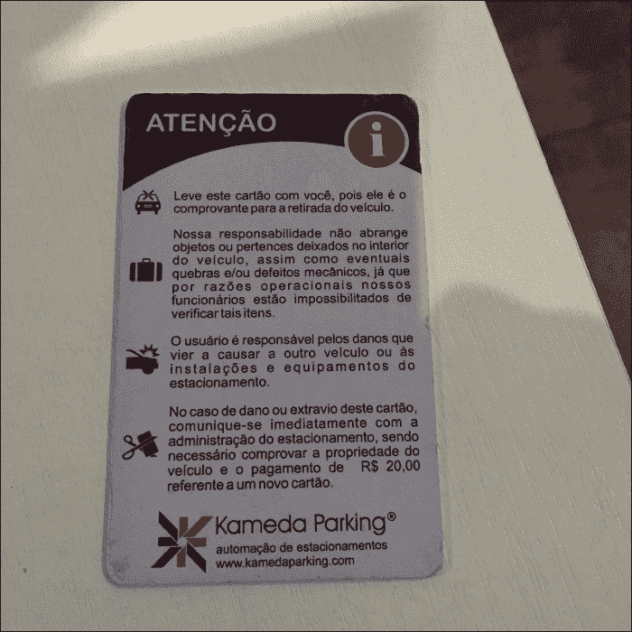
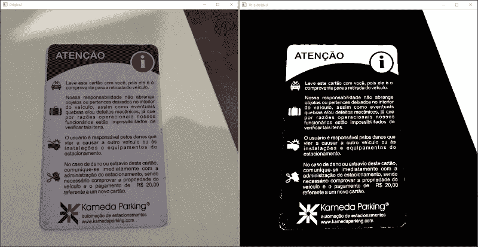
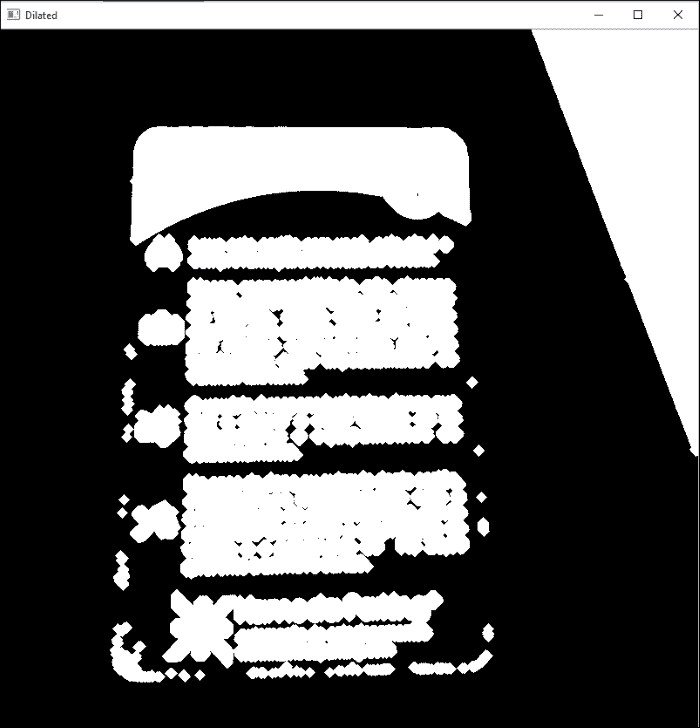
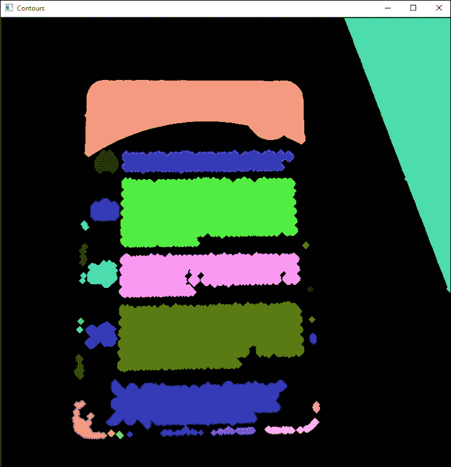
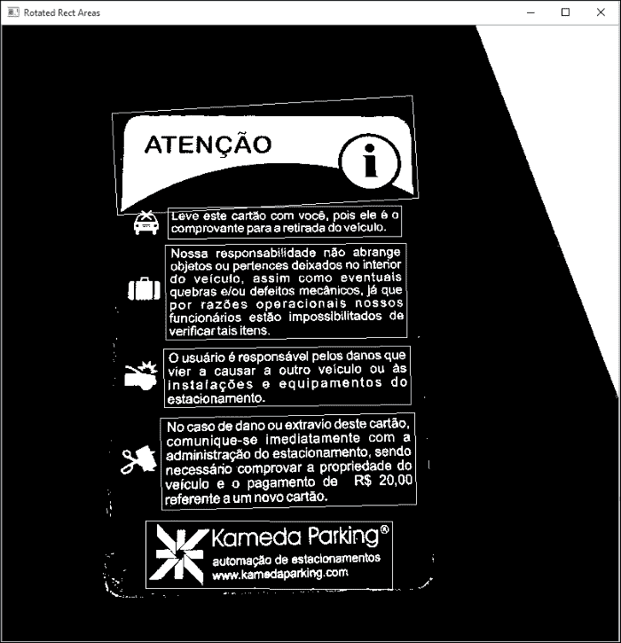
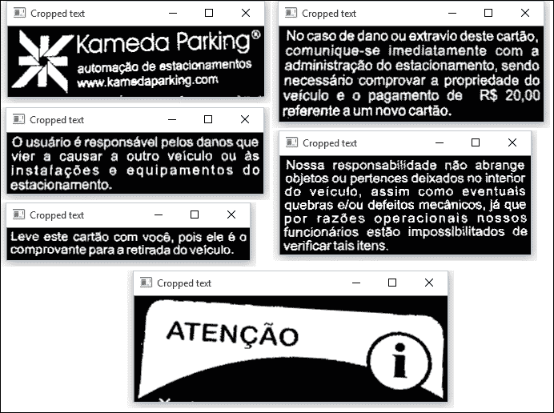
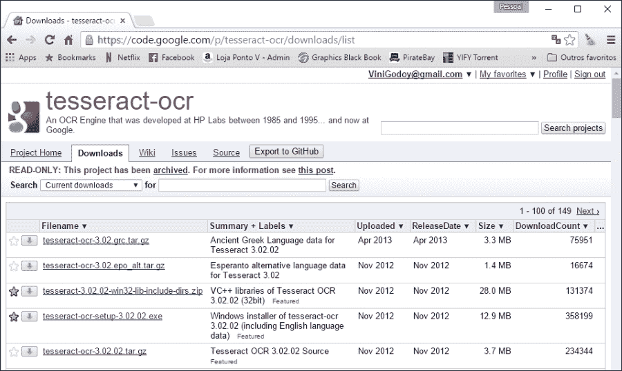
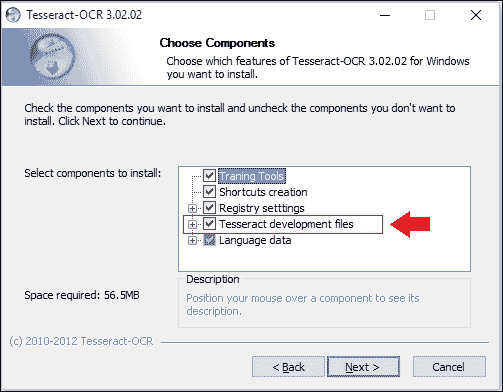
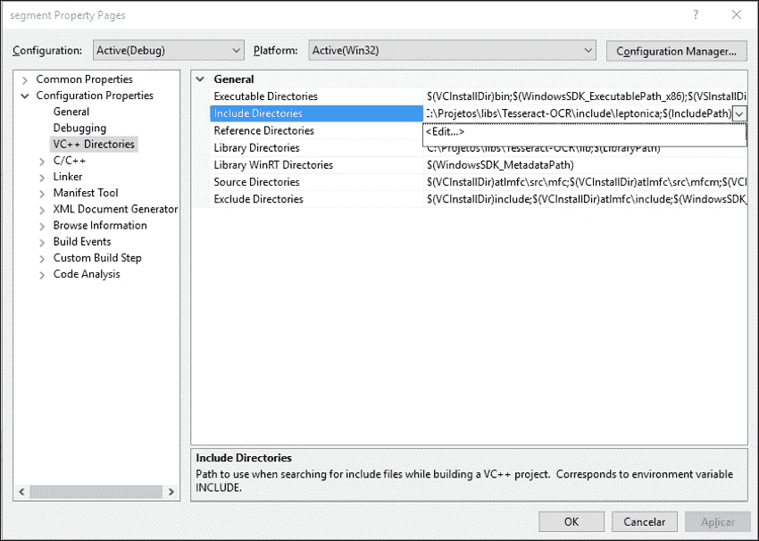

# 第十章。开发用于文本识别的分割算法

在前面的章节中，我们学习了许多图像处理技术，如阈值、轮廓描述符和数学形态学。在本章中，我们将讨论处理扫描文档时常见的常见问题，例如识别文本的位置或调整其旋转。我们还将学习如何结合前面章节中介绍的技术来解决这些问题。最后，我们将得到可以发送到**OCR**（**光学字符识别**）库的文本分割区域。

到本章结束时，你应该能够回答以下问题：

+   哪些 OCR 应用存在？

+   在编写 OCR 应用时常见的有哪些问题？

+   我们如何识别文档的区域？

+   我们如何处理文本中的倾斜和其他中间元素等问题？

+   我们如何使用 Tesseract OCR 来识别文本？

# 介绍光学字符识别

在图像中识别文本是计算机视觉中一个非常流行的应用。这个过程通常被称为 OCR，并分为以下步骤：

+   **文本预处理和分割**：在这个步骤中，计算机必须学会处理图像噪声和旋转（倾斜）并识别哪些区域是候选文本区域。

+   **文本识别**：这是一个用于识别文本中每个字母的过程。尽管这也是一个计算机视觉主题，但在这本书中，我们不会使用 OpenCV 向您展示如何做这件事。相反，我们将向您展示如何使用 Tesseract 库来完成这一步，因为它与 OpenCV 3.0 集成。如果您对学习如何完全自己完成 Tesseract 所做的一切感兴趣，请查看*Mastering OpenCV*，*Packt Publishing*，其中有一章关于车牌识别。

预处理和分割阶段可能因文本来源而异。让我们看看进行预处理的一些常见情况：

+   使用扫描仪的生产 OCR 应用，这是一个非常可靠的文字来源：在这种情况下，图像的背景通常是白色的，文档几乎与扫描仪的边缘对齐。正在扫描的内容基本上包含几乎没有任何噪声的文本。这类应用依赖于简单的预处理技术，可以快速调整文本并保持快速扫描的速度。在编写生产 OCR 软件时，通常会将重要文本区域的识别委托给用户，并创建一个用于文本验证和索引的质量管道。

+   在随意拍摄的图片或视频中扫描文本：这是一个更为复杂的场景，因为没有任何指示说明文本可能的位置。这种场景被称为*场景文本识别*，OpenCV 3.0 引入了一个全新的库来处理这种情况，我们将在第十一章，*使用 Tesseract 进行文本识别*中介绍。通常，预处理器会使用纹理分析技术来识别文本模式。

+   为历史文本创建生产质量的 OCR：历史文本也会被扫描。

    然而，它们有几个额外的问题，例如旧纸张颜色和墨水使用产生的噪声。其他常见问题包括装饰字母、特定的文本字体以及随着时间的推移而退化的墨水产生的低对比度内容。为手头文档编写特定的 OCR 软件并不罕见。

+   扫描地图、图表和图表：地图、图表和图表构成了一个困难的场景，因为文本通常以任何方向出现在图像内容中。例如，城市名称通常成群，海洋名称通常遵循国家海岸轮廓线。一些图表颜色很深，文本以清晰和暗色调出现。

OCR 应用策略也根据识别的目标而变化。它们将被用于全文搜索吗？或者应该将文本分离到逻辑字段中，以索引包含结构化搜索信息的数据库？

在本章中，我们将专注于预处理扫描的文本或由相机拍摄的文本。我们假设文本是图像的主要目的，例如在照片、纸张或卡片上；例如，看看下面的停车票：



我们将尝试去除常见的噪声，处理文本旋转（如果有），并裁剪可能的文本区域。虽然大多数 OCR API 已经自动执行这些操作，并且可能使用最先进的算法，但这仍然值得了解这些操作背后的原理。这将使您更好地理解大多数 OCR API 的参数，并为您提供更好的知识，了解您可能面临的潜在 OCR 问题。

# 预处理步骤

识别字母的软件通过将文本与先前记录的数据进行比较来进行。如果输入文本清晰，如果字母处于垂直位置，如果没有其他元素，例如发送到分类软件的图像，分类结果可以大大提高。在本节中，我们将学习如何调整文本。这个阶段被称为**预处理**。

## 阈值化图像

我们通常通过阈值化图像开始预处理阶段。这消除了所有颜色信息。大多数 OpenCV 函数都需要信息以白色书写，背景为黑色。因此，让我们从创建一个匹配此标准的阈值函数开始：

```py
#include <opencv2/opencv.hpp>
#include <vector>

using namespace std;
using namespace cv;

Mat binarize(Mat input)
{
  //Uses otsu to threshold the input image
  Mat binaryImage;
  cvtColor(input, input, CV_BGR2GRAY);
  threshold(input, binaryImage, 0, 255, THRESH_OTSU);
  //Count the number of black and white pixels
  int white = countNonZero(binaryImage);
  int black = binaryImage.size().area() - white;
  //If the image is mostly white (white background), invert it
  return white < black ? binaryImage : ~binaryImage;
}
```

`binarize`函数应用一个阈值，类似于我们在第四章，*深入直方图和滤波器*中所做的那样。然而，我们通过将`THRESH_OTSU`传递给函数的第四个参数来使用`Otsu`方法。

`Otsu`方法最大化类间方差。由于阈值只创建两个类别（黑色和白色像素），这等同于最小化类内方差。该方法使用图像直方图进行工作。然后，它遍历所有可能的阈值值，并计算阈值两侧像素值的扩散度，即图像的背景或前景中的像素。目的是找到使两者扩散度之和最小的阈值值。

阈值处理完成后，函数会计算图像中的白色像素数量。黑色像素是图像中像素的总数，由图像面积减去白色像素计数得出。

由于文本通常写在纯背景上，我们将检查是否有比黑色像素更多的白色像素。在这种情况下，我们处理的是黑色文本在白色背景上，因此我们需要对图像进行反转以进行进一步处理。

使用停车票图像进行阈值处理的结果如下所示：



## 文本分割

下一步是找到文本的位置并提取它。有两种常见的策略可以实现这一点，如下所示：

+   使用连通分量分析，我们在图像中搜索连通像素组。这是我们将在本章中使用的技巧。

+   使用分类器来搜索之前训练过的字母纹理模式。纹理特征，如 Haralick 特征和小波变换，通常被使用。另一个选择是在这个任务中识别**最大稳定极值区域**（**MSERs**）。这种方法对于复杂背景中的文本更加鲁棒，将在下一章中进行研究。你可以在他的个人网站上阅读有关 Haralick 特征的更多信息：[`haralick.org/journals/TexturalFeatures.pdf`](http://haralick.org/journals/TexturalFeatures.pdf)。

### 创建连通区域

如果你仔细观察图像，你会注意到字母总是成块地聚集在一起，这些块是由每个文本段落形成的。那么，我们如何检测和移除这些块呢？

第一步是使这些块更加明显。我们可以使用膨胀形态学算子来完成这项工作。在第八章，*视频监控、背景建模和形态学操作*中，我们学习了如何通过膨胀使图像元素变厚。让我们看看以下代码片段，它完成了这项工作：

```py
Mat kernel = getStructuringElement(MORPH_CROSS, Size(3,3));
Mat dilated;
dilate(input, dilated, kernel, cv::Point(-1, -1), 5);
imshow("Dilated", dilated);
```

在此代码中，我们首先创建一个 3 x 3 的交叉核，该核将在形态学操作中使用。然后，我们以该核为中心进行五次膨胀。确切的核大小和次数根据情况而变化。只需确保这些值将同一行上的所有字母粘合在一起即可。

此操作的输出结果如下：



注意，现在我们有了巨大的白色块。它们正好与每个段落文本相匹配，也匹配其他非文本元素，如图像或边缘噪声。

### 小贴士

代码附带的票据图像是低分辨率图像。OCR 引擎通常使用高分辨率图像（200 或 300 DPI），因此可能需要应用超过五次的膨胀。

### 识别段落块

下一步是执行连通分量分析以找到对应于段落的块。OpenCV 有一个函数可以做到这一点，我们之前在第五章中使用过，称为*自动光学检测、对象分割和检测*。它是`findContours`函数：

```py
vector<vector<Point> > contours;
findContours(dilated, contours, RETR_EXTERNAL, CHAIN_APPROX_SIMPLE);
```

在第一个参数中，我们传递我们的膨胀图像。第二个参数是检测到的轮廓向量。然后我们使用选项仅检索外部轮廓并使用简单近似。图像轮廓在以下图中展示。每种灰度色调代表不同的轮廓：



最后一步是识别每个轮廓的最小旋转边界矩形。OpenCV 提供了一个方便的函数来完成此操作，称为`minAreaRect`。此函数接收一个任意点的向量，并返回一个包含边界框的`RoundedRect`。

这也是一个丢弃不需要的矩形的好机会，即显然**不是**文本的矩形。由于我们正在制作 OCR 软件，我们将假设文本包含一组字母。基于这个假设，我们将丢弃以下情况下的文本：

+   矩形的宽度或大小太小，即小于 20 像素。这将帮助您丢弃边缘噪声和其他小瑕疵。

+   图像的矩形，其宽/高比例小于 2。也就是说，类似于正方形的矩形，如图像图标，或者那些非常高大的矩形也将被丢弃。

在第二个条件中有一个小问题。由于我们正在处理旋转边界框，我们必须检查边界框的角度是否不小于 45 度。如果是这样，文本将是垂直旋转的，因此必须考虑的比例是高度/宽度。让我们看看这段代码：

```py
//For each contour
vector<RotatedRect> areas;
for (auto contour : contours)
{
  //Find it's rotated rect
  auto box = minAreaRect(contour);

  //Discard very small boxes
  if (box.size.width < 20 || box.size.height < 20)
    continue;

  //Discard squares shaped boxes and boxes
  //higher than larger
  double proportion = box.angle < -45.0 ?
    box.size.height / box.size.width :
    box.size.width / box.size.height;
  if (proportion < 2)
    continue;
  //Add the box
  areas.push_back(box);
}
```

让我们看看这个算法选择的盒子：



这当然是一个好结果！

注意，条件 2 中描述的算法也会丢弃单个字母。这不是一个大问题，因为我们正在创建一个 OCR 预处理程序，而单个符号通常与上下文信息无关。一个这样的例子是页码。由于它们通常单独出现在页面底部，并且肯定会因为大小或比例文本而失败，因此它们将在这个过程中被丢弃。然而，这不会成为问题，因为文本通过 OCR 后，将会有一个没有页面分隔的巨大文本文件。

我们将这段代码放在一个具有此签名的函数中：

```py
vector<RotatedRect> findTextAreas(Mat input)
```

### 文本提取和倾斜调整

现在，我们只需要提取文本并调整文本倾斜。这是通过 `deskewAndCrop` 函数完成的，如下所示：

```py
Mat deskewAndCrop(Mat input, const RotatedRect& box)
{
  double angle = box.angle;
  Size2f size = box.size;

  //Adjust the box angle
   if (angle < -45.0)
  {
        angle += 90.0;
		std::swap(size.width, size.height);
  }

  //Rotate the text according to the angle
  Mat transform = getRotationMatrix2D(box.center, angle, 1.0);
  Mat rotated;
  warpAffine(input, rotated, transform, input.size(), INTER_CUBIC);

  //Crop the result
  Mat cropped;
  getRectSubPix(rotated, size, box.center, cropped);
  copyMakeBorder(cropped,cropped,10,10,10,10,BORDER_CONSTANT,Scalar(0));
  return cropped;
}
```

首先，我们开始读取所需的区域、角度和大小。如前所述，角度可以小于 45 度。这意味着文本是垂直对齐的，因此我们需要将旋转角度增加 90 度，并切换宽度和高度属性。

接下来，我们需要旋转文本。首先，我们开始创建一个 2D 仿射变换矩阵，该矩阵描述了旋转。我们使用 OpenCV 的 `getRotationMatrix2D` 函数来完成此操作。此函数接受以下三个参数：

+   `CENTER`：这是旋转的中心位置。旋转将围绕这个中心旋转。在我们的情况下，我们使用框的中心。

+   `ANGLE`：这是旋转角度。如果角度为负，则旋转将按顺时针方向进行。

+   `SCALE`：这是一个各向同性的缩放因子。我们使用 1.0，因为我们想保持框的原始比例不变。

旋转本身是通过 `warpAffine` 函数实现的。此函数接受四个必选参数，如下所示：

+   `SRC`：这是要转换的输入 `mat` 数组。

+   `DST`：这是目标 `mat` 数组。

+   `M`：这是一个转换矩阵。这个矩阵是一个 2 x 3 的仿射变换矩阵。这可能是一个平移、缩放或旋转矩阵。在我们的情况下，我们只使用我们最近创建的矩阵。

+   `SIZE`：这是输出图像的大小。我们将生成与输入图像大小相同的图像。

其他三个可选参数如下：

+   `FLAGS`：这表示图像应该如何插值。我们使用 `BICUBIC_INTERPOLATION` 以获得更好的质量。默认值是 `LINEAR_INTERPOLATION`。

+   `BORDER`：这是边界模式。我们使用默认的 `BORDER_CONSTANT`。

+   `BORDER VALUE`：这是边界的颜色。我们使用默认值，即黑色。

然后，我们使用 `getRectSubPix` 函数。在我们旋转图像后，我们需要裁剪边界框的矩形区域。此函数接受四个必选参数和一个可选参数，并返回裁剪后的图像：

+   `IMAGE`：这是要裁剪的图像。

+   `SIZE`：这是一个 `cv::Size` 对象，描述了要裁剪的框的宽度和高度。

+   `CENTER`: 这是裁剪区域的中心像素点。注意，当我们围绕中心旋转时，这个点保持不变。

+   `PATCH`: 这是目标图像。

+   `PATCH_TYPE`: 这是目标图像的深度。我们使用默认值，表示与源图像相同的深度。

最后一步由`copyMakeBorder`函数完成。此函数在图像周围添加边框。这很重要，因为分类阶段通常期望文本周围有边距。函数参数非常简单：输入和输出图像，图像顶部、底部、左侧和右侧的边框厚度，以及新边框的颜色。

对于卡片图像，将生成以下图像：



现在，是时候将每个功能组合在一起了。让我们展示以下主要方法：

+   加载票据图像

+   调用我们的`binarization`函数

+   查找所有文本区域

+   在窗口中显示每个区域：

    ```py
    int main(int argc, char* argv[])
    {
      //Loads the ticket image and binarize it
      Mat ticket = binarize(imread("ticket.png"));
      auto regions = findTextAreas(ticket);

      //For each region
      for (auto& region : regions) {
        //Crop 
        auto cropped = deskewAndCrop(ticket, region);
        //Show
        imshow("Cropped text", cropped);
        waitKey(0);
        destroyWindow("Border Skew");
      }
    }
    ```

### 注意

对于完整的源代码，请查看随本书附带的`segment.cpp`文件。

# 在您的操作系统上安装 Tesseract OCR

Tesseract 是一个开源 OCR 引擎，最初由*惠普实验室，布里斯托尔*和*惠普公司*开发。它所有的代码许可证都在 Apache 许可证下，并在 GitHub 上托管，网址为[`github.com/tesseract-ocr`](https://github.com/tesseract-ocr)。

它被认为是可用的最准确的 OCR 引擎之一。它可以读取多种图像格式，并且可以将 60 多种语言中写成的文本转换为文本。

在本次会话中，我们将教您如何在 Windows 或 Mac 上安装 Tesseract。由于有大量的 Linux 发行版，我们不会教您如何在操作系统上安装。

通常，Tesseract 在其软件仓库中提供安装包，因此在编译 Tesseract 之前，只需在那里搜索即可。

## 在 Windows 上安装 Tesseract

虽然 Tesseract 托管在 GitHub 上，但其最新的 Windows 安装程序仍然可在 Google Code 的旧仓库中找到。最新的安装程序版本是 3.02.02，建议您使用安装程序。从[`code.google.com/p/tesseract-ocr/downloads/list`](https://code.google.com/p/tesseract-ocr/downloads/list)下载安装程序。

下载安装程序后，执行以下步骤：

1.  查找`tesseract-ocr-setup-3.02.02.exe`和`tesseract-3.02.02-win32-lib-include-dirs.zip`文件，下载并运行可执行安装程序

1.  要跳过**欢迎屏幕**，请阅读并接受许可协议。

1.  在计算机上为所有用户安装或仅为您的用户安装之间进行选择。

1.  然后，选择合适的安装位置。

1.  选择安装文件夹。Tesseract 默认指向`程序文件`文件夹，因为它有一个命令行界面。如果你想，可以将其更改为更合适的文件夹。然后，转到下一屏幕：

1.  确保您选择了**Tesseract 开发文件**。这将安装`Leptonica`库文件和源代码。您还可以选择您母语的语料库。Tesseract 默认选择英语。

1.  安装程序将下载并设置 Tesseract 依赖项。

    ### 提示

    要测试 Tesseract 安装，您可以通过命令行运行它。例如，要在`parkingTicket.png`文件上运行 Tesseract，您可以运行以下命令：

    ```py
    tesseract parkingTicket.png ticket.txt
    ```

1.  现在，回到下载的`tesseract-3.02.02-win32-lib-include-dirs.zip`文件。解压此文件，并将`lib`和`add`文件夹复制到您的`tesseract`安装文件夹中。在这个文件夹中会有相同名称的文件夹，但这是正常的。此文件将包括 Tesseract 文件和库在 Tesseract 安装中。具有讽刺意味的是，Tesseract `libs`和`dlls`不包括在安装程序中。

### 在 Visual Studio 中设置 Tesseract

由于 Visual Studio 2010 是推荐用于 Windows 开发者与 Tesseract 的 IDE，因此正确设置这一点很重要。

设置过程相当简单，分为以下三个步骤：

1.  调整导入和库路径。

1.  将库添加到链接器输入。

1.  将 Tesseract `dlls` 添加到 windows 路径。

让我们以下面的部分逐一查看这些步骤。

#### 设置导入和库路径

导入路径告诉 Visual Studio 在执行代码中的`#include`指令时在哪里搜索可用的`.h`文件。

在解决方案资源管理器中，右键单击您的**项目**，然后单击**属性**。然后，选择**配置属性**和**VC++ 目录**。

### 注意

如果您是从头创建的新项目，请确保您至少向项目中添加了一个`c++`文件，以便 Visual Studio 知道这是一个`C++`项目。

接下来，点击**包含目录**。出现一个箭头。点击此箭头，然后点击**编辑**：



您必须将两个目录添加到该列表中：

```py
TesseractInstallPath\include
TesseractInstallPath\include\leptonica
```

将`TesseractInstallPath`替换为您的 Tesseract 安装路径；例如，`c:\Program Files\Tesseract-OCR`。

然后，点击**库目录**，点击箭头，然后点击`编辑`，就像你为**包含目录**所做的那样。你必须将一个目录添加到列表中：

```py
TesseractInstallPath\lib
```

#### 配置链接器

在仍然在属性页上时，转到**链接器** | **输入**。编辑**附加依赖项**行，并包含两个库：

```py
liblept168.lib
libtesseract302.lib
```

### 注意

由于`lib`名称中的数字指的是文件版本，因此如果安装了不同版本的 Tesseract，库名称可能会更改。为此，只需在 Windows 资源管理器中打开`lib`路径即可。

不幸的是，调试库（以 *d* 字母结尾的库）与 Tesseract 不兼容。如果你真的需要使用它们，你需要自己编译 Tesseract 和 Leptonica。

#### 将库添加到 Windows 路径中

你必须将两个库文件添加到 Windows 路径中。第一个位于 `TesseractInstallPath` 中，称为 `liblept168.dll`。第二个位于 `TesseractInstallPath\lib` 中，称为 `libtesseract302.dll`。有两种方法可以实现这一点：

+   将这些文件复制到 Visual Studio 生成可执行文件的位置。这不会将这些文件添加到 Windows 路径中，但允许应用程序运行。

+   将这些文件复制到配置在 Windows 路径中的文件夹。你可以通过更改 **系统属性** 中的环境变量来在 Windows 路径中配置新文件夹。

    ### 小贴士

    一些互联网教程教你将这些文件包含在文件夹中，例如 `Windows\System32`。不要这样做。如果你这样做，将来更改库版本可能会很困难，因为这个文件夹包含很多其他的 `dlls` 系统，你可能会失去跟踪你已经在那里放置了什么。此外，你总是可以禁用自定义路径来测试安装程序并检查你是否忘记在你的安装包中打包 `dll`。

## 在 Mac 上安装 Tesseract

在 Mac 上安装 Tesseract OCR 的最简单方法是使用 Homebrew。如果你还没有安装 Homebrew，只需访问 Homebrew 网站 ([`brew.sh/`](http://brew.sh/))，打开你的控制台，并运行首页上的 Ruby 脚本。你可能需要输入管理员密码。

安装 `homebrew` 后，只需输入以下命令：

```py
brew install tesseract
```

英语语言已经包含在这个安装中。如果你想安装其他语言包，只需运行以下命令：

```py
brew install tesseract --all-languages
```

这将安装所有语言包。然后，只需转到 Tesseract 安装目录并删除所有不需要的语言。Homebrew 通常将软件安装到 `/usr/local/`。

# 使用 Tesseract OCR 库

由于 Tesseract OCR 已经与 OpenCV 3.0 集成，因此研究其 API 仍然值得，因为它允许更精细地控制 Tesseract 参数。集成将在下一章中研究。

## 创建一个 OCR 函数

我们将修改之前的示例以使用 Tesseract。我们将从向列表中添加 `baseapi` 和 `fstream tesseracts` 开始：

```py
#include <opencv2/opencv.hpp>
#include <tesseract/baseapi.h>

#include <vector>
#include <fstream>

```

然后，我们将创建一个全局的 `TessBaseAPI` 对象，它代表我们的 Tesseract OCR 引擎：

```py
tesseract::TessBaseAPI ocr;
```

### 小贴士

`ocr` 引擎是完全自包含的。如果你想创建多线程 OCR 软件，只需为每个线程添加不同的 `TessBaseAPI` 对象，执行将相当线程安全。你只需要保证文件写入不是在同一个文件上；否则，你需要保证此操作的安全性。

接下来，我们将创建一个名为 `identify` 的函数来运行 OCR：

```py
char* identifyText(Mat input, char* language = "eng") 
{
  ocr.Init(NULL, language, tesseract::OEM_TESSERACT_ONLY);
  ocr.SetPageSegMode(tesseract::PSM_SINGLE_BLOCK);
  ocr.SetImage(input.data, input.cols, input.rows, 1, input.step);
  char* text = ocr.GetUTF8Text();
  cout << "Text:" << endl;
  cout << text << endl;
  cout << "Confidence: " << ocr.MeanTextConf() << endl << endl;

    // Get the text    
  return text;
}
```

让我们逐行解释这个函数。在第一行，我们开始初始化 Tesseract。这是通过调用 `init` 函数来完成的。此函数具有以下签名：

```py
int Init(const char* datapath, const char* language, OcrEngineMode oem)
```

让我们逐个解释每个参数：

+   **Datapath**: 这是根目录中 `tessdata` 文件的路径。路径必须以反斜杠 / 字符结尾。`tessdata` 目录包含您安装的语言文件。将 `NULL` 传递给此参数将使 Tesseract 在其安装目录中搜索，这通常是此文件夹通常所在的位置。在部署应用程序时，通常将此值更改为 `args[0]`，并将 `tessdata` 文件夹包含在应用程序路径中。

+   **Language**: 这是一个由语言代码组成的三个字母的单词（例如，eng 代表英语，por 代表葡萄牙语，或 hin 代表印地语）。Tesseract 支持使用 `+` 符号加载多个语言代码。因此，传递 *eng* + *por* 将加载英语和葡萄牙语。当然，您只能使用您之前安装的语言；否则，加载将失败。语言 `config` 文件可以指定必须一起加载两个或多个语言。为了防止这种情况，您可以使用波浪号 `~`。例如，您可以使用 `hin+~eng` 来确保即使配置了这样做，也不会将英语与印地语一起加载。

+   **OcrEngineMode**: 这些是将要使用的 OCR 算法。它们可以具有以下值之一：

    +   `OEM_TESSERACT_ONLY`: 这仅使用 Tesseract。这是最快的方法，但精度较低。

    +   `OEM_CUBE_ONLY`: 这使用 cube 引擎。它较慢，但更精确。这将仅适用于您的语言经过训练以支持此引擎模式的情况。要检查是否如此，请查看 `tessdata` 文件夹中您语言对应的 `.cube` 文件。对英语的支持是保证的。

    +   `OEM_TESSERACT_CUBE_COMBINED`: 这将 Tesseract 和 Cube 结合起来，以实现最佳的 OCR 分类。此引擎具有最佳的准确性和最慢的执行时间。

    +   `OEM_DEFAULT`: 这尝试根据语言 `config` 文件和命令行 `config` 文件推断策略，或者在两者都缺失的情况下使用 `OEM_TESSERACT_ONLY`。

需要强调的是，`init` 函数**可以**执行多次。如果提供了不同的语言或引擎模式，Tesseract 将清除之前的配置并重新开始。如果提供了相同的参数，Tesseract 足够智能，可以简单地忽略该命令。`init` 函数在成功时返回 `0`，在失败时返回 `-1`。

然后我们的程序继续设置页面分割模式：

```py
ocr.SetPageSegMode(tesseract::PSM_SINGLE_BLOCK);
```

有几种分割模式可用，如下所示：

+   `PSM_OSD_ONLY`: 使用此模式，Tesseract 只运行其预处理算法以检测方向和脚本检测。

+   `PSM_AUTO_OSD`: 这告诉 Tesseract 执行带有方向和脚本检测的自动页面分割。

+   `PSM_AUTO_ONLY`: 这执行页面分割，但避免执行方向、脚本检测或 OCR。

+   `PSM_AUTO`: 这执行页面分割和 OCR，但避免执行方向或脚本检测。

+   `PSM_SINGLE_COLUMN`: 这假设可变大小的文本显示在单个列中。

+   `PSM_SINGLE_BLOCK_VERT_TEXT`: 这将图像视为一个垂直对齐的单一均匀文本块。

+   `PSM_SINGLE_BLOCK`: 这是一个单独的文本块。这是默认配置。我们将使用此标志，因为我们的预处理阶段保证了这种条件。

+   `PSM_SINGLE_LINE`: 这表示图像只包含一行文本。

+   `PSM_SINGLE_WORD`: 这表示图像只包含一个单词。

+   `PSM_SINGLE_WORD_CIRCLE`: 这表示图像是一个圆形排列的单词。

+   `PSM_SINGLE_CHAR`: 这表示图像只包含一个字符。

注意，Tesseract 已经实现了`deskewing`和文本分割算法，就像大多数 OCR 库一样。但了解这些算法是有趣的，因为您可以为特定需求提供自己的预处理阶段。这允许您在许多情况下改进文本检测。例如，如果您正在为旧文档创建 OCR 应用程序，Tesseract 默认使用的阈值可能会创建一个深色背景。Tesseract 还可能被边缘或严重的文本倾斜所困惑。

接下来，我们使用以下签名调用`SetImage`方法：

```py
void SetImage(const unsigned char* imagedata, int width, int height, int bytes_per_pixel, int bytes_per_line);
```

参数几乎是自我解释的，其中大部分可以直接从我们的`mat`对象中读取：

+   `data`: 这是一个包含图像数据的原始字节数组。OpenCV 在`Mat`类中包含一个名为`data()`的函数，它提供对数据的直接指针。

+   `width`: 这是图像宽度。

+   `height`: 这是图像高度。

+   `bytes_per_pixel`: 这是每像素的字节数。我们使用`1`，因为我们处理的是二进制图像。如果您想允许代码更通用，您还可以使用`Mat::elemSize()`函数，它提供相同的信息。

+   `bytes_per_line`: 这是指单行中的字节数。我们使用`Mat::step`属性，因为有些图像会添加尾随字节。

然后，我们调用`GetUTF8Text`来运行识别本身。识别的文本返回，以 UTF8 编码，不带 BOM（字节顺序标记）。在我们返回之前，我们还打印了一些调试信息。

`MeanTextConf`返回一个置信度指数，可以是`0`到`100`之间的数字：

```py
  char* text = ocr.GetUTF8Text();
  cout << "Text:" << endl;
  cout << text << endl;
  cout << "Confidence: " << ocr.MeanTextConf() << endl << endl;
```

### 将输出发送到文件

让我们将我们的`main`方法更改为将识别的输出发送到文件。我们使用标准的`ofstream`来完成此操作：

```py
int main(int argc, char* argv[])
{
  //Loads the ticket image and binarize it
  Mat ticket = binarize(imread("ticket.png"));
  auto regions = findTextAreas(ticket);

  std::ofstream file;
  file.open("ticket.txt", std::ios::out | std::ios::binary);

  //For each region
  for (auto region : regions) {
    //Crop
    auto cropped = deskewAndCrop(ticket, region);
    char* text = identifyText(cropped, "por");

    file.write(text, strlen(text));
    file << endl;
  }

  file.close();
}
```

注意以下行：

```py
file.open("ticket.txt", std::ios::out | std::ios::binary);
```

这将以二进制模式打开文件。这很重要，因为 Tesseract 返回的文本是以 UTF-8 编码的，考虑到 Unicode 中可用的特殊字符。我们还将输出直接使用以下命令写入：

```py
file.write(text, strlen(text));
```

在这个示例中，我们使用葡萄牙语作为输入语言调用了 `identify`（这是票据所写的语言）。如果你喜欢，可以使用另一张照片。

### 注意

完整的源代码文件包含在 `segmentOcr.cpp` 文件中，该文件与本书一同提供。

### 小贴士

`ticket.png` 是一个低分辨率的图片，因为我们想象你可能希望在研究这段代码的同时显示包含该图片的窗口。对于这张图片，Tesseract 的识别结果相当差。如果你想用更高分辨率的图片进行测试，代码中提供了一个 `ticketHigh.png` 图片。要测试这张图片，将膨胀重复次数改为 12，并将最小框大小从 20 改为 60。你将获得更高的置信率（大约 87%），并且生成的文本将完全可读。`segmentOcrHigh.cpp` 文件包含了这些修改。

# 摘要

在本章中，我们简要介绍了 OCR 应用。我们了解到，这类系统的预处理阶段必须根据我们计划识别的文档类型进行调整。我们学习了预处理文本文件时的常见操作，例如阈值化、裁剪、倾斜和文本区域分割。最后，我们学习了如何安装和使用 Tesseract OCR 将我们的图片转换为文本。

在下一章中，我们将使用更复杂的 OCR 技术来识别随意拍摄的图片或视频中的文本——这种情况被称为场景文本识别。这是一个更加复杂的场景，因为文本可能出现在任何地方，使用任何字体，并且具有不同的照明和方向。甚至可能完全没有文本！我们还将学习如何使用与 Tesseract 完全集成的 OpenCV 3.0 文本贡献模块。
