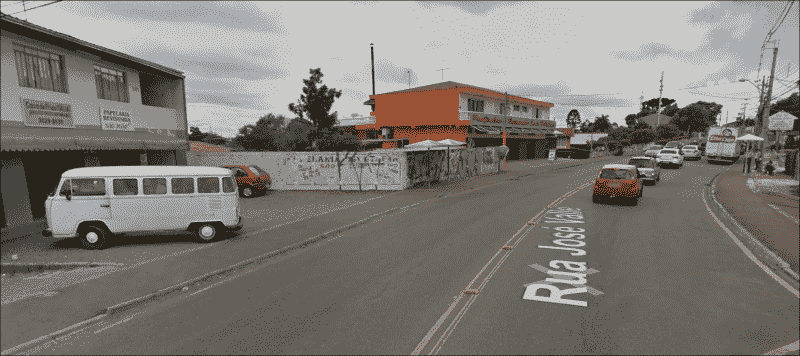
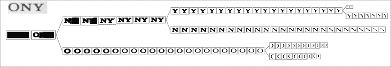
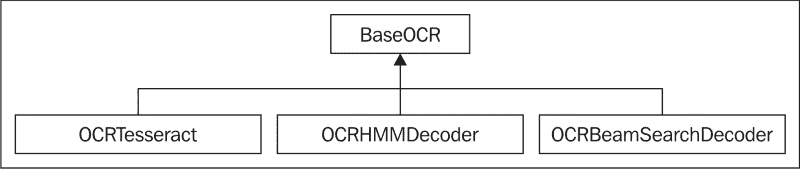
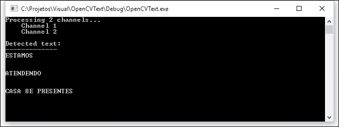

# 第十一章。使用 Tesseract 进行文本识别

在上一章中，我们介绍了非常基本的 OCR 处理功能。虽然它们对于扫描或拍摄的文档非常有用，但当处理随意出现在图片中的文本时，它们几乎毫无用处。

在本章中，我们将探讨 OpenCV 3.0 文本模块，该模块专门处理场景文本检测。使用此 API，可以检测出现在网络摄像头视频中的文本，或者分析照片图像（如街景或监控摄像头拍摄的图像）以实时提取文本信息。这允许创建从无障碍到营销甚至机器人领域的广泛应用。

到本章结束时，你将能够：

+   理解场景文本识别是什么

+   理解文本 API 的工作原理

+   使用 OpenCV 3.0 文本 API 检测文本

+   将检测到的文本提取到图像中

+   使用文本 API 和 Tesseract 集成来识别字母

# 文本 API 的工作原理

文本 API 实现了 Lukás Neumann 和 Jiri Matas 在 2012 年 CVPR（**计算机视觉和模式识别**）会议期间发表的名为 *Real-Time Scene Text Localization and Recognition* 的文章中提出的算法。该算法在 CVPR 数据库以及 Google Street View 数据库中都实现了场景文本检测的重大突破。

在我们使用 API 之前，让我们看看这个算法在底层是如何工作的，以及它是如何解决场景文本检测问题的。

### 注意

**记住**，OpenCV 3.0 文本 API 不包含在标准 OpenCV 模块中。它是一个存在于 OpenCV 贡献包中的附加模块。如果你需要使用 Windows 安装程序安装 OpenCV，请参阅第一章，*OpenCV 入门*，这将帮助你安装这些模块。

## 场景检测问题

在场景中检测随机出现的文本是一个比看起来更难的问题。当我们将其与识别扫描文本进行比较时，有几个新的变量，如下所示：

+   **三维性**：文本可以以任何比例、方向或视角出现。此外，文本可能部分被遮挡或中断。实际上有成千上万的可能性，文本可以出现在图像中的任何区域。

+   **多样性**：文本可以以几种不同的字体和颜色出现。字体可以有轮廓边框或没有。背景可以是深色、浅色或复杂的图像。

+   **光照与阴影**：阳光的位置和外观颜色会随时间变化。不同的天气条件，如雾或雨，可以产生噪声。即使在封闭空间中，光照也可能成为问题，因为光线会在彩色物体上反射并击中文本。

+   **模糊**：文本可能出现在自动对焦镜头不优先考虑的区域。在移动相机、透视文本或雾的存在下，模糊也很常见。

以下图像来自谷歌街景，说明了这些问题。注意这些情况如何在单张图像中同时发生：



执行文本检测以处理这种情况可能会证明计算成本很高，因为文本可以位于图像中像素的 *2n* 个子集中，其中 *n* 是图像中的像素数。

为了降低复杂性，通常采用两种策略，具体如下：

+   使用滑动窗口搜索图像矩形的子集。这种策略只是将子集的数量减少到更小的数量。区域的数量根据考虑的文本复杂性而变化。仅处理文本旋转的算法可以使用较小的值，而同时处理旋转、倾斜、透视等的算法则需要较大的值。这种方法的优点在于其简单性，但它通常局限于较窄的字体范围，并且通常局限于特定单词的词汇表。

+   使用连通分量分析。这种方法假设像素可以被分组到具有相似属性的区域内。这些区域更有可能被识别为字符。这种方法的优点是它不依赖于多个文本属性（方向、缩放和字体），并且它们还提供了一个可以用于裁剪文本到 OCR 的分割区域。这是前一章中使用的方法。

+   OpenCV 3.0 算法通过执行连通分量分析和搜索极值区域来使用第二种策略。

## 极值区域

极值区域是由均匀强度特征和周围对比度背景所包围的连通区域。可以通过计算区域对阈值变化的抵抗程度来衡量区域稳定性。这种变化可以通过一个简单的算法来测量：

1.  应用阈值生成图像 A。检测其连通像素区域（极值区域）。

1.  通过增加一个阈值增量生成图像 B。检测其连通像素区域（极值区域）。

1.  将图像 B 与 A 进行比较。如果图像 A 中的某个区域与图像 B 中相同的区域相似，则将其添加到树中的同一分支。相似性的标准可能因实现而异，但通常与图像面积或一般形状有关。如果图像 A 中的某个区域在图像 B 中看起来被分割，则在树中为新的区域创建两个新的分支，并将它们与之前的分支关联。

1.  将 *A = B* 并回到步骤 2，直到应用最大阈值。

    这将组装一个区域树，如图所示：

    

    图像来源：[`docs.opencv.org/master/da/d56/group__text__detect.html#gsc.tab=0`](http://docs.opencv.org/master/da/d56/group__text__detect.html#gsc.tab=0)

防变异性是通过计算处于同一级别的节点数量来确定的。

通过分析这棵树，还可以确定**MSERs（最大稳定极值区域**），即在广泛的各种阈值下区域面积保持稳定的区域。在上一张图像中，很明显这些区域将包含字母*O*、*N*和*Y*。MSERs 的主要缺点是它们在模糊存在的情况下较弱。OpenCV 在`feature2d`模块中提供了一个 MSER 特征检测器。

极值区域很有趣，因为它们对光照、尺度和方向具有很强的不变性。它们也是文本的良好候选者，因为它们对字体类型也不敏感，即使字体有样式。每个区域也可以进行分析，以确定其边界椭圆和具有可数值确定的属性，如仿射变换和面积。最后，值得一提的是，整个过程非常快，这使得它非常适合实时应用。

## 极值区域过滤

虽然 MSERs 是定义哪些极值区域值得工作的常见方法，但 Neumann 和 Matas 算法通过将所有极值区域提交给一个用于字符检测的已训练的顺序分类器来采用不同的方法。这个分类器在以下两个不同的阶段工作：

+   第一阶段逐步计算每个区域的描述符（边界框、周长、面积和欧拉数）。这些描述符提交给一个分类器，该分类器估计该区域是字母的概率。然后，只选择高概率的区域进入第二阶段。

+   在这个阶段，计算整个区域比率、凸包比率和外部边界拐点数量。这提供了更详细的信息，使分类器能够丢弃非文本字符，但它们的计算速度也较慢。

在 OpenCV 中，这个过程在`ERFilter`类中实现。也可以使用不同的图像单通道投影，如 R、G、B、亮度或灰度转换，以提高字符识别率。

最后，所有字符必须分组到文本块中（如单词或段落）。OpenCV 3.0 为此提供了两种算法：

+   **剪枝穷举搜索**：这也是 Mattas 在 2011 年提出的。这个算法不需要任何先前的训练或分类，但仅限于水平对齐的文本。

+   **面向文本的分层方法**：这处理任何方向的文本，但需要一个训练好的分类器。

### 注意

由于这些操作需要分类器，因此还需要提供一个训练集作为输入。OpenCV3.0 在`sample`包中提供了一些这些训练集。这也意味着这个算法对分类器训练中使用的字体敏感。

可以在 Neumann 提供的视频中看到这个算法的演示：[`youtu.be/ejd5gGea2Fo`](https://youtu.be/ejd5gGea2Fo)。

一旦文本被分割，只需将其发送到 OCR，例如 Tesseract，就像我们在上一章中所做的那样。唯一的区别是现在我们将使用 OpenCV 文本模块类与 Tesseract 交互，因为它们提供了一种封装我们使用特定 OCR 引擎的方法。

# 使用文本 API

理论已经足够。现在是时候看看文本模块在实际中的应用了。让我们研究如何使用它来进行文本检测、提取和识别。

## 文本检测

让我们从创建一个简单的程序开始，使用`ERFilters`进行文本分割。在这个程序中，我们将使用文本 API 示例中的训练分类器。您可以从 OpenCV 仓库中下载它们，但它们也包含在本书的配套代码中。

首先，我们从包含所有必要的`libs`和使用：

```py
#include  "opencv2/highgui.hpp"
#include  "opencv2/imgproc.hpp"
#include  "opencv2/text.hpp"

#include  <vector>
#include  <iostream>

using namespace std;
using namespace cv;
using namespace cv::text;
```

回想我们之前的部分，`ERFilter`在图像的每个通道中单独工作。因此，我们必须提供一种方法，在不同的单个`cv::Mat`通道中分离每个所需的通道。这是通过`separateChannels`函数完成的：

```py
vector<Mat> separateChannels(Mat& src)
{
  vector<Mat> channels;
  //Grayscale images
  if (src.type() == CV_8U || src.type() == CV_8UC1) {
    channels.push_back(src);
    channels.push_back(255-src);
    return channels;
  }

  //Colored images
  if (src.type() == CV_8UC3) {
    computeNMChannels(src, channels);
    int size = static_cast<int>(channels.size())-1;
    for (int c = 0; c < size; c++)
      channels.push_back(255-channels[c]);
    return channels;
  }

  //Other types
  cout << "Invalid image format!" << endl;
  exit(-1);
}
```

首先，我们验证图像是否是单通道图像（例如，灰度图像）。如果是这样，我们只需添加这个图像及其负图像进行处理。

否则，我们检查它是否是 RGB 图像。对于彩色图像，我们调用`computeNMChannels`来将图像分割成其多个通道。该函数定义如下：

```py
void computeNMChannels(InputArray src, OutputArrayOfArrays channels, int mode = ERFILTER_NM_RGBLGrad);
```

其参数描述如下：

+   `src`：这是源输入数组。它应该是一个 8UC3 类型的彩色图像。

+   `channels`：这是一个向量，其中将填充结果通道。

+   `mode`：这定义了将要计算的通道。可以使用两个可能的值，如下所示：

+   `ERFILTER_NM_RGBLGrad`：这表示算法使用 RGB 颜色、亮度和梯度幅度作为通道（默认）。

+   `ERFILTER_NM_IHSGrad`：这表示图像将通过其强度、色调、饱和度和梯度幅度进行分割。

我们还在向量中附加了所有颜色成分的负图像。最后，如果提供了另一种类型的图像，函数将使用错误消息终止程序。

### 注意

负图像被附加，以便算法可以覆盖亮背景上的暗文本和亮背景上的暗文本。没有必要将负图像添加到梯度幅度中。

让我们继续到`main`方法。我们将使用程序来分割提供的`easel.png`图像：


这张照片是由手机摄像头拍摄的，当时我正在街上行走。让我们编写代码，以便你可以通过在第一个程序参数中提供其名称来轻松地使用不同的图像：

```py
int main(int argc, const char * argv[])
{
  char* image = argc < 2 ? "easel.png" : argv[1];
   auto input = imread(image);
```

接下来，我们将通过调用`separateChannels`函数将图像转换为灰度并分离其通道：

```py
  Mat processed;
  cvtColor(input, processed, CV_RGB2GRAY);
 auto channels = separateChannels(processed);
```

如果你想在彩色图像中处理所有通道，只需将前面代码的前两行替换为以下代码：

```py
Mat processed = input;
```

我们需要分析六个通道（RGB + 反转）而不是两个（灰度 + 反转）。实际上，处理时间将增加得比我们可以通过`get.With`这些通道获得的改进要多得多。有了这些通道在手，我们需要为算法的两个阶段创建`ERFilters`。幸运的是，`opencv text`贡献模块提供了相应的函数：

```py
// Create ERFilter objects with the 1st and 2nd stage classifiers
auto filter1 = createERFilterNM1(loadClassifierNM1("trained_classifierNM1.xml"),  15, 0.00015f, 0.13f, 0.2f,true,0.1f);

auto filter2 = createERFilterNM2( loadClassifierNM2("trained_classifierNM2.xml"),0.5);
```

对于第一阶段，我们调用`loadClassifierNM1`函数来加载一个之前训练好的分类模型。包含训练数据的 XML 文件是其唯一参数。然后，我们调用`createERFilterNM1`来创建一个`ERFilter`类的实例，该实例将执行分类。该函数具有以下签名：

```py
Ptr<ERFilter> createERFilterNM1(const Ptr<ERFilter::Callback>& cb,
    int thresholdDelta = 1, 
    float minArea = 0.00025, float maxArea = 0.13, 
    float minProbability = 0.4, bool nonMaxSuppression = true, float minProbabilityDiff = 0.1);
```

参数描述如下：

+   `cb`：这是分类模型。这是与我们使用`loadCassifierNM1`函数加载的相同模型。

+   `thresholdDelta`：这是在每次算法迭代中要添加到阈值中的量。默认值是*1*，但我们在示例中会使用*15*。

+   `minArea`：这是可以找到文本的 ER 的最小面积。这也在图像大小的*%*中测量。面积小于此的 ER 将被立即丢弃。

+   `maxArea`：这是可以找到文本的 ER 的最大面积。这也在图像大小的*%*中测量。面积大于此的 ER 将被立即丢弃。

+   `minProbability`：这是一个区域必须具有的最小概率，才能被视为字符并保留到下一阶段。

+   `nonMaxSupression`：这表示将在每个分支概率中执行非最大抑制。

+   `minProbabilityDiff`：这是最小和最大极值区域之间的最小概率差异。

第二阶段的处理过程类似。我们调用`loadClassifierNM2`来加载第二阶段的分类器模型，并调用`createERFilterNM2`来创建第二阶段的分类器。此函数仅接受加载的分类模型和一个区域必须达到的最小概率作为输入参数。

因此，让我们在每个通道中调用这些算法以识别所有可能的文本区域：

```py
//Extract text regions using Newmann & Matas algorithm
cout << "Processing " << channels.size() << " channels...";
cout << endl;
vector<vector<ERStat> > regions(channels.size());
for (int c=0; c < channels.size(); c++)
{
    cout << "    Channel " << (c+1) << endl;
    filter1->run(channels[c], regions[c]);
    filter2->run(channels[c], regions[c]);
}    
filter1.release();
filter2.release();
```

在前面的代码中，我们使用了`ERFilter`类的`run`函数。此函数接受以下两个参数：

+   **输入通道**：这是要处理的图像。

+   **区域**：在第一阶段算法中，此参数将被填充为检测到的区域。在第二阶段（由`filter2`执行），此参数必须包含第一阶段中选择的区域，这些区域将在第二阶段进行处理和过滤。

最后，我们释放了这两个过滤器，因为程序中不再需要它们。

最终的分割步骤是将所有`ERRegions`分组到可能的单词中，并定义它们的边界框。这是通过调用`erGrouping`函数来完成的：

```py
//Separate character groups from regions
vector< vector<Vec2i> > groups;
vector<Rect> groupRects;
erGrouping(input, channels, regions, groups, groupRects, ERGROUPING_ORIENTATION_HORIZ);
```

这个函数具有以下签名：

```py
void erGrouping(InputArray img, InputArrayOfArrays channels,
    std::vector<std::vector<ERStat> > &regions,
    std::vector<std::vector<Vec2i> > &groups,
    std::vector<Rect> &groups_rects,
    int method = ERGROUPING_ORIENTATION_HORIZ,
    const std::string& filename = std::string(),
    float minProbablity = 0.5);
```

让我们来看看每个参数的定义：

+   `img`：这是原始输入图像。你可以参考以下观察。

+   `regions`：这是一个包含提取区域的单通道图像的向量。

+   `groups`：这是一个包含分组区域索引的输出向量。每个分组区域包含一个单词的所有极值区域。

+   `groupRects`：这是一个包含检测到的文本区域的矩形列表。

+   `method`：这是分组的方法。它可以如下所示：

    +   `ERGROUPING_ORIENTATION_HORIZ`：这是默认值。它通过执行穷举搜索来仅生成水平方向的文本组，正如 Neumann 和 Matas 最初提出的那样。

    +   `ERGROUPING_ORIENTATION_ANY`：这会生成任何方向的文本组，使用**单链接聚类**和**分类器**。如果你使用这种方法，必须在下一个参数中提供分类器模型的文件名。

    +   `Filename`：这是分类器模型的名称。只有在选择`ERGROUPING_ORIENTATION_ANY`时才需要。

    +   `minProbability`：这是接受一个组的最低检测概率。它也只有在使用`ERGROUPING_ORIENTATION_ANY`时才需要。

代码还提供了一个对第二个方法的调用，但它是注释掉的。你可以在这两个之间切换以测试它。只需注释掉上一个调用并取消注释这个调用：

```py
erGrouping(input, channels, regions, 
    groups, groupRects, ERGROUPING_ORIENTATION_ANY, 
    "trained_classifier_erGrouping.xml", 0.5);
```

对于这个调用，我们还使用了文本模块示例包中提供的默认训练好的分类器。

最后，我们绘制区域框并显示结果：

```py
// draw groups boxes
for (auto rect : groupRects)
    rectangle(input, rect, Scalar(0, 255, 0), 3);
imshow("grouping",input);
waitKey(0);
```

程序的输出如下所示：


你可以在`detection.cpp`文件中查看完整的源代码。

### 注意

尽管大多数 OpenCV 文本模块函数都编写为支持灰度和彩色图像作为它们的输入参数，但在本书编写时，存在一些错误阻止了在诸如 erGrouping 之类的函数中使用灰度图像；例如。请参阅[`github.com/Itseez/opencv_contrib/issues/309`](https://github.com/Itseez/opencv_contrib/issues/309)。

总是记住，OpenCV 贡献模块包不如默认的`opencv`包稳定。

## 文本提取

现在我们已经检测到了区域，在提交给 OCR 之前，我们必须裁剪文本。我们可以简单地使用一个函数，例如`getRectSubpix`或`Mat::copy`，使用每个区域矩形作为**ROI**（**感兴趣区域**），但由于字母是倾斜的，一些不需要的文本也可能被裁剪掉；例如，如果我们仅仅基于给定的矩形提取 ROI，这个区域将看起来像这样：


幸运的是，`ERFilter`为我们提供了一个名为`ERStat`的对象，它包含每个极值区域内的像素。使用这些像素，我们可以使用 OpenCV 的`floodFill`函数来重建每个字母。这个函数能够根据种子点绘制类似颜色的像素，就像大多数绘图应用程序的“桶”工具一样。这个函数的签名如下：

```py
int floodFill(InputOutputArray image, InputOutputArray mask,
    Point seedPoint, Scalar newVal, CV_OUT Rect* rect=0,
    Scalar loDiff = Scalar(), Scalar upDiff = Scalar(),
    int flags = 4
);
```

让我们了解这些参数以及它们如何使用：

+   `image`：这是输入图像。我们将使用包含极值区域的通道图像。这是函数通常执行 flood fill 的地方，除非提供了`FLOODFILL_MASK_ONLY`。在这种情况下，图像保持不变，绘制发生在掩码上。这正是我们将要做的。

+   `mask`：掩码必须比输入图像多两行和两列。当 flood fill 绘制像素时，它会验证掩码中相应的像素是否为零。如果是这样，它将绘制并标记此像素为 1（或通过标志传入的其他值）。如果像素不是零，flood fill 不会绘制像素。在我们的情况下，我们将提供一个空白掩码，因此每个字母都会在掩码中上色。

+   `seedPoint`：这是起始点。它类似于当你想要使用图形应用程序的“桶”工具时点击的位置。

+   `newVal`：这是重新绘制像素的新值。

+   `loDiff`和`upDiff`：这些参数表示正在处理的像素与其邻居之间的下限和上限差异。如果邻居落在这个范围内，它将被绘制。如果使用了`FLOODFILL_FIXED_RANGE`标志，则将使用种子点和正在处理的像素之间的差异。

+   `rect`：这是一个可选参数，它限制了 flood fill 将要应用的区域。

+   `flags`：这个值由一个位掩码表示。

    +   标志的最低八位包含一个连通性值。值为 4 表示将使用所有四个边缘像素，而值为 8 则表示必须考虑对角像素。我们将为此参数使用 4。

    +   接下来的 8 到 16 位包含一个 1 到 255 之间的值，并用于填充掩码。由于我们希望用白色填充掩码，我们将使用`255 << 8`为此值。

    +   有两个额外的位可以通过添加`FLOODFILL_FIXED_RANGE`和`FLOODFILL_MASK_ONLY`标志来设置，如前所述。

我们将创建一个名为`drawER`的函数。这个函数将接收四个参数：

+   包含所有处理通道的向量

+   `ERStat`区域

+   必须绘制的组

+   组矩形

这个函数将返回一个由这个组表示的单词的图像。让我们从这个函数开始，创建掩码图像并定义标志：

```py
Mat out = Mat::zeros(channels[0].rows+2, channels[0].cols+2, CV_8UC1);
int flags = 4                      //4 neighbors
  + (255 << 8)                    //paint mask in white (255)
  + FLOODFILL_FIXED_RANGE         //fixed range
  + FLOODFILL_MASK_ONLY;          //Paint just the mask
```

然后，我们将遍历每个组。找到区域索引及其统计信息是必要的。有可能这个极端区域将是根，它不包含任何点。在这种情况下，我们将忽略它：

```py
for (int g=0; g < group.size(); g++)
{
int idx = group[g][0];
   ERStat er = regions[idx][group[g][1]];
//Ignore root region
   if (er.parent == NULL) 
    continue;
```

现在，我们可以从`ERStat`对象中读取像素坐标。它由像素编号表示，从上到下，从左到右计数。这个线性索引必须转换为一个类似我们在第二章中讨论的公式，即*OpenCV 基础知识介绍*的行（y）和列（z）表示法：

```py
int px = er.pixel % channels[idx].cols;
int py = er.pixel / channels[idx].cols;
Point p(px, py);
```

然后，我们可以调用`floodFill`函数。`ERStat`对象为我们提供了在`loDiff`参数中需要使用的值：

```py
floodFill(
    channels[idx], out,          //Image and mask
    p, Scalar(255),              //Seed and color
    nullptr,                       /No rect
    Scalar(er.level),Scalar(0),    //LoDiff and upDiff
    flags                          //Flags
```

在对组中的所有区域都这样做之后，我们将以一个比原始图像略大的图像结束，背景为黑色，文字为白色。现在，让我们只裁剪字母区域。由于给出了区域矩形，我们首先将其定义为我们的感兴趣区域：

```py
out = out(rect);
```

然后，我们将找到所有非零像素。这是我们将在`minAreaRect`函数中使用以获取围绕字母的旋转矩形的值。最后，我们借用前一章的`deskewAndCrop`函数来为我们裁剪和旋转图像：

```py
  vector<Point> points;
  findNonZero(out, points);
  //Use deskew and crop to crop it perfectly
  return deskewAndCrop(out, minAreaRect(points));
}
```

这是画布图像处理的结果：


## 文本识别

在第十章，*开发文本识别的分割算法*中，我们直接使用 Tesseract API 来识别文本区域。这次，我们将使用 OpenCV 类来完成同样的目标。

在 OpenCV 中，所有 OCR 特定的类都从`BaseOCR`虚拟类派生。这个类为 OCR 执行方法本身提供了一个通用接口。

特定的实现必须从这个类继承。默认情况下，文本模块提供了三种不同的实现：`OCRTesseract`、`OCRHMMDecoder`和`OCRBeamSearchDecoder`。

以下类图展示了这个层次结构：



使用这种方法，我们可以将创建 OCR 机制的部分与执行本身分离。这使得将来更改 OCR 实现变得更加容易。

因此，让我们从创建一个基于字符串决定我们将使用哪种实现的方法开始。我们目前将支持 Tesseract。然而，你可以查看包含使用 `HMMDecoder` 的演示的章节代码。我们还在字符串参数中接受 OCR 引擎名称，但我们可以通过从外部 `JSON` 或 `XML` 配置文件中读取它来提高我们应用程序的灵活性：

```py
cv::Ptr<BaseOCR> initOCR2(const string& ocr) 
{
 if (ocr == "tesseract") {
 return OCRTesseract::create(nullptr, "eng+por");
  }
  throw string("Invalid OCR engine: ") + ocr;
}
```

你可能会注意到函数返回一个 `Ptr<BaseOCR>`。现在，看看高亮显示的代码。它调用创建方法来初始化一个 Tesseract OCR 实例。让我们看看它的官方签名，因为它允许几个特定的参数：

```py
Ptr<OCRTesseract> create(const char* datapath=NULL, const char* language=NULL, const char* char_whitelist=NULL, int oem=3, int psmode=3);
```

让我们逐一分析这些参数：

+   `datapath`: 这是根目录中 `tessdata` 文件的路径。路径必须以反斜杠 `/` 字符结尾。`tessdata` 目录包含你安装的语言文件。将 `nullptr` 传递给此参数将使 Tesseract 在其安装目录中搜索，这是该文件夹通常所在的位置。在部署应用程序时，通常将此值更改为 `args[0]` 并将 `tessdata` 文件夹包含在应用程序路径中。

+   `language`: 这是一个由三个字母组成的单词，包含语言代码（例如，eng 代表英语，por 代表葡萄牙语，或 hin 代表印地语）。Tesseract 支持使用加号加载多个语言代码。因此，传递 *eng+por* 将加载英语和葡萄牙语。当然，你只能使用你之前安装的语言；否则，加载将失败。语言配置文件可以指定必须一起加载两个或多个语言。为了防止这种情况，你可以使用波浪号 ~。例如，你可以使用 *hin+~eng* 来确保英语不会与印地语一起加载，即使配置了这样做。

+   `whitelist`: 这是用于识别的字符集。如果传递 `nullptr`，则字符将是 `0123456789abcdefghijklmnopqrstuvwxyzABCDEFGHIJKLMNOPQRSTUVWXYZ`。

+   `oem`: 这些是将要使用的 OCR 算法。它们可以有以下值之一：

    +   `OEM_TESSERACT_ONLY`: 这仅使用 Tesseract。这是最快的方法，但精度较低。

    +   `OEM_CUBE_ONLY`: 这使用 cube 引擎。它较慢，但更精确。这只有在你的语言被训练以支持这种引擎模式时才会工作。要检查这一点，请查看 `tessdata` 文件夹中你语言的 `.cube` 文件。对英语语言的支持是保证的。

    +   `OEM_TESSERACT_CUBE_COMBINED`: 这结合了 Tesseract 和 cube 以实现最佳的 OCR 分类。这个引擎具有最高的准确性和最慢的执行时间。

    +   `OEM_DEFAULT`: 这会尝试根据语言 `config` 文件、命令行 `config` 文件推断策略，或者在两者都缺失的情况下使用 `OEM_TESSERACT_ONLY`。

+   `psmode`: 这是分割模式。模式如下：

    +   `PSM_OSD_ONLY`：使用此模式，Tesseract 将仅运行其预处理算法以检测方向和脚本检测。

    +   `PSM_AUTO_OSD`：这告诉 Tesseract 进行自动页面分割，包括方向检测和脚本检测。

    +   `PSM_AUTO_ONLY`：此选项仅进行页面分割，但避免进行方向检测、脚本检测或 OCR。这是默认值。

    +   `PSM_AUTO`：此选项进行页面分割和 OCR，但避免进行方向或脚本检测。

    +   `PSM_SINGLE_COLUMN`：这假设文本以单列的形式显示。

    +   `PSM_SINGLE_BLOCK_VERT_TEXT`：将图像视为一个垂直对齐的文本的单个统一块。

    +   `PSM_SINGLE_BLOCK`：这是一个单独的文本块。这是默认配置。我们将使用此标志，因为我们的预处理阶段保证了这一条件。

    +   `PSM_SINGLE_LINE`：这表示图像中只包含一行文本。

    +   `PSM_SINGLE_WORD`：这表示图像中只包含一个单词。

    +   `PSM_SINGLE_WORD_CIRCLE`：这表示图像是一个单词，且该单词被放置在一个圆圈中。

    +   `PSM_SINGLE_CHAR`：这表示图像中包含单个字符。

对于最后两个参数，`#include tesseract` 目录建议您使用常量名称而不是直接插入它们的值。

最后一步是将文本检测添加到我们的 `main` 函数中。为此，只需将以下代码添加到 `main` 方法的末尾：

```py
auto ocr = initOCR("tesseract");
for (int i = 0; i < groups.size(); i++)
{
  Mat wordImage = drawER(channels, regions, groups[i], groupRects[i]);
  string word;
  ocr->run(wordImage, word);
  cout << word << endl;
}
```

在此代码中，我们首先调用我们的 `initOCR` 方法来创建一个 Tesseract 实例。请注意，如果选择不同的 OCR 引擎，剩余的代码将不会改变，因为运行方法签名由 `BaseOCR` 类保证。

接下来，我们遍历每个检测到的 `ERFilter` 组。由于每个组代表不同的单词，我们：

+   调用之前创建的 `drawER` 函数来创建包含单词的图像。

+   创建一个名为 `word` 的文本字符串，并调用 `run` 函数来识别单词图像。识别出的单词将被存储在字符串中。

+   在屏幕上打印文本字符串。

让我们看看 `run` 方法的签名。此方法在 `BaseOCR` 类中定义，对于所有特定的 OCR 实现都将相同，即使是在未来可能实现的一些实现：

```py
virtual void run(Mat& image, std::string& output_text, std::vector<Rect>* component_rects=NULL, std::vector<std::string>* component_texts=NULL, std::vector<float>* component_confidences=NULL,
     int component_level=0) = 0;
```

当然，这是一个纯虚拟函数，必须由每个特定类（如我们刚刚使用的 `OCRTesseract` 类）实现：

+   `image`：这是输入图像。它必须是 RGB 或灰度图像

+   `component_rects`：我们可以提供一个向量，该向量将被填充，包含 OCR 引擎检测到的每个组件（单词或文本行）的边界框

+   `component_texts`：如果提供，此向量将被填充，包含 OCR 检测到的每个组件的文本字符串

+   `component_confidences`：如果提供，该向量将被填充，包含每个组件（单词或文本行）的置信度值

+   `component_level`：这定义了组件是什么。它可能有 `OCR_LEVEL_WORD`（默认值）或 `OCR_LEVEL_TEXT_LINE` 的值

### 提示

如果需要，我们更倾向于在`run()`方法中将组件级别更改为单词或行，而不是在`create()`函数的`psmode`参数中做同样的事情。这是更可取的，因为`run`方法将得到任何决定实现`BaseOCR`类的 OCR 引擎的支持。始终记住，`create()`方法是在设置供应商特定配置的地方。

这是程序的最终输出：



尽管对`&`符号有些小困惑，但每个单词都被完美识别了！您可以在章节代码中的`ocr.cpp`文件中查看完整的源代码。

# 摘要

在本章中，我们了解到场景文本识别比处理扫描文本的 OCR 情况要困难得多。我们研究了文本模块如何使用**Newmann 和 Matas**算法通过极值区域识别来解决这个问题。我们还看到了如何使用这个 API 和`floodfill`函数将文本提取到图像中，并将其提交给 Tesseract OCR。最后，我们研究了 OpenCV 文本模块如何与 Tesseract 和其他 OCR 引擎集成，以及我们如何使用其类来识别图像中的文字。

这标志着我们使用 OpenCV 的旅程的结束。从这本书的开始到结束，我们希望您对计算机视觉领域有一个大致的了解，并对几个应用的工作原理有更好的理解。我们还试图向您展示，尽管 OpenCV 是一个非常令人印象深刻的库，但这个领域已经充满了改进和研究的机遇。

感谢您的阅读！无论您是使用 OpenCV 来创建基于计算机视觉的令人印象深刻的商业程序，还是将其用于可能改变世界的科研，我们都希望您觉得这个内容有用。只需继续运用您的技能——这仅仅是开始！
