# 第二章.检测边缘和应用图像滤波器

在本章中，我们将了解如何将酷炫的视觉效果应用于图像。我们将学习如何使用基本的图像处理算子。我们将讨论边缘检测以及我们如何可以使用图像滤波器在照片上应用各种效果。

到本章结束时，您将了解：

+   什么是 2D 卷积以及如何使用它

+   如何模糊图像

+   如何在图像中检测边缘

+   如何给图像应用运动模糊

+   如何锐化和浮雕图像

+   如何腐蚀和膨胀图像

+   如何创建晕影滤镜

+   如何增强图像对比度

    ### 小贴士

    **下载示例代码**

    您可以从您在[`www.packtpub.com`](http://www.packtpub.com)的账户下载示例代码文件，以获取您购买的所有 Packt Publishing 书籍。如果您在其他地方购买了这本书，您可以访问[`www.packtpub.com/support`](http://www.packtpub.com/support)并注册，以便将文件直接通过电子邮件发送给您。

# 2D 卷积

卷积是图像处理中的一个基本操作。我们基本上将一个数学算子应用于每个像素，并以某种方式改变其值。要应用这个数学算子，我们使用另一个称为**内核**的矩阵。内核通常比输入图像小得多。对于图像中的每个像素，我们取内核并将其放置在上面，使得内核的中心与正在考虑的像素重合。然后我们将内核矩阵中的每个值与图像中相应的值相乘，然后求和。这就是将在输出图像的这个位置替换的新值。

在这里，内核被称为“图像滤波器”，将此内核应用于给定图像的过程称为“图像滤波”。将内核应用于图像后获得的结果称为滤波图像。根据内核中的值，它执行不同的功能，如模糊、检测边缘等。以下图应有助于您可视化图像滤波操作：

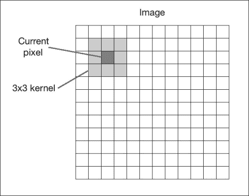

让我们从最简单的情况开始，即单位内核。这个内核实际上并不会改变输入图像。如果我们考虑一个 3x3 的单位内核，它看起来就像以下这样：

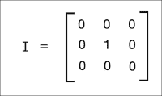

# 模糊

模糊是指在一个邻域内平均像素值。这也称为**低通滤波器**。低通滤波器是一种允许低频并阻止高频的滤波器。现在，接下来我们可能会想到的问题是——在图像中“频率”是什么意思？嗯，在这个上下文中，频率指的是像素值变化的速率。因此，我们可以说，锐利的边缘会是高频内容，因为在这个区域的像素值变化很快。按照这个逻辑，平面区域会是低频内容。按照这个定义，低通滤波器会尝试平滑边缘。

构建低通滤波器的一个简单方法是均匀平均像素邻域内的值。我们可以根据我们想要平滑图像的程度来选择核的大小，它将相应地产生不同的效果。如果你选择更大的尺寸，那么你将在更大的区域内进行平均。这通常会增强平滑效果。让我们看看 3x3 低通滤波器核的样子：

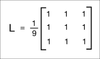

我们将矩阵除以 9，因为我们希望值加起来等于`1`。这被称为**归一化**，它很重要，因为我们不希望人为地增加该像素位置的强度值。所以你应该在将核应用到图像之前进行归一化。归一化是一个非常重要的概念，它在各种场景中使用，所以你应该在网上阅读一些教程，以获得对它的良好理解。

这里是应用低通滤波器到图像的代码：

```py
import cv2
import numpy as np

img = cv2.imread('input.jpg')
rows, cols = img.shape[:2]

kernel_identity = np.array([[0,0,0], [0,1,0], [0,0,0]])
kernel_3x3 = np.ones((3,3), np.float32) / 9.0
kernel_5x5 = np.ones((5,5), np.float32) / 25.0

cv2.imshow('Original', img)

output = cv2.filter2D(img, -1, kernel_identity)
cv2.imshow('Identity filter', output)

output = cv2.filter2D(img, -1, kernel_3x3)
cv2.imshow('3x3 filter', output)

output = cv2.filter2D(img, -1, kernel_5x5)
cv2.imshow('5x5 filter', output)

cv2.waitKey(0)
```

如果你运行前面的代码，你会看到类似这样的结果：

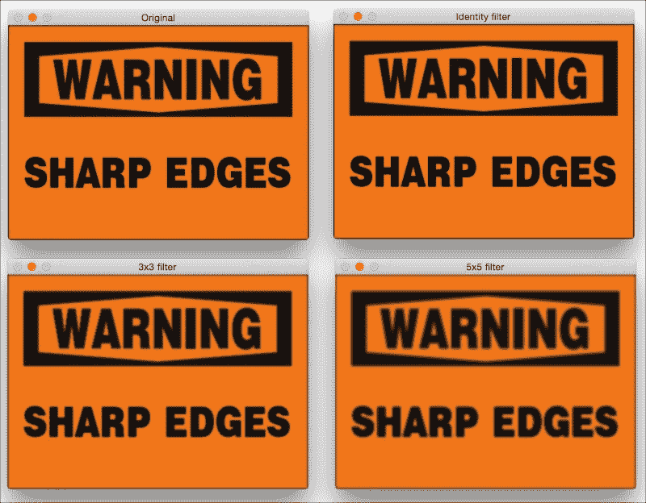

## 核大小与模糊程度的关系

在前面的代码中，我们生成了不同的核，分别是`kernel_identity`、`kernel_3x3`和`kernel_5x5`。我们使用`filter2D`函数将这些核应用到输入图像上。如果你仔细观察图像，你会发现随着核大小的增加，图像变得越来越模糊。这是因为当我们增加核大小时，我们是在更大的区域内进行平均。这通常会带来更大的模糊效果。

另一种实现方式是使用 OpenCV 的`blur`函数。如果你不想自己生成核，可以直接使用这个函数。我们可以用以下代码行来调用它：

```py
output = cv2.blur(img, (3,3))
```

这将直接应用 3x3 核并给出输出。

# 边缘检测

边缘检测的过程涉及检测图像中的尖锐边缘，并生成一个二值图像作为输出。通常，我们在黑色背景上画白色线条来指示这些边缘。我们可以将边缘检测视为高通滤波操作。高通滤波器允许高频内容通过并阻止低频内容。正如我们之前讨论的，边缘是高频内容。在边缘检测中，我们希望保留这些边缘并丢弃其他所有内容。因此，我们应该构建一个相当于高通滤波器的核。

让我们从一种简单的边缘检测滤波器开始，称为`Sobel`滤波器。由于边缘可以出现在水平和垂直方向，`Sobel`滤波器由以下两个核组成：

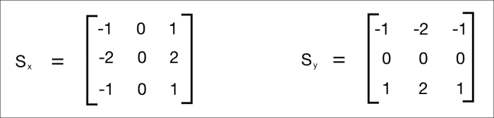

左侧的核检测水平边缘，右侧的核检测垂直边缘。OpenCV 提供了一个函数可以直接将`Sobel`滤波器应用到给定的图像上。以下是使用 Sobel 滤波器检测边缘的代码：

```py
import cv2
import numpy as np

img = cv2.imread('input_shapes.png', cv2.IMREAD_GRAYSCALE)
rows, cols = img.shape

sobel_horizontal = cv2.Sobel(img, cv2.CV_64F, 1, 0, ksize=5)
sobel_vertical = cv2.Sobel(img, cv2.CV_64F, 0, 1, ksize=5)

cv2.imshow('Original', img)
cv2.imshow('Sobel horizontal', sobel_horizontal)
cv2.imshow('Sobel vertical', sobel_vertical)

cv2.waitKey(0)
```

输出将看起来像以下这样：

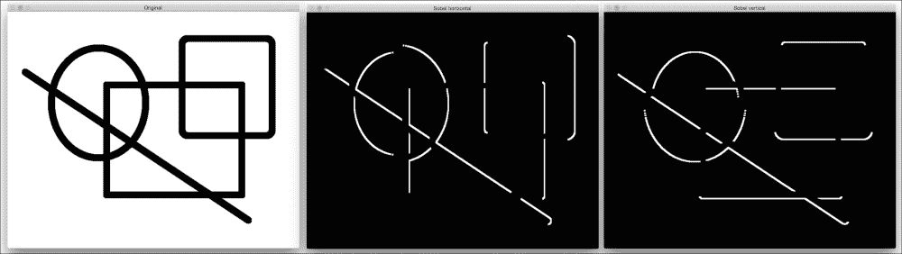

在前面的图中，中间的图像是水平边缘检测器的输出，右边的图像是垂直边缘检测器的输出。如上图所示，`Sobel`滤波器可以在水平和垂直方向检测边缘，但它不会给我们一个所有边缘的整体视图。为了克服这个问题，我们可以使用`Laplacian`滤波器。使用这个滤波器的优点是它在两个方向上都使用双重导数。你可以使用以下行来调用该函数：

```py
laplacian = cv2.Laplacian(img, cv2.CV_64F)
```

输出将看起来像以下截图：

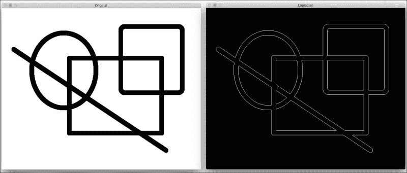

尽管在这个情况下`Laplacian`核工作得很好，但它并不总是有效。它会在输出中产生很多噪声，如下面的截图所示。这就是`Canny 边缘检测器`派上用场的地方：

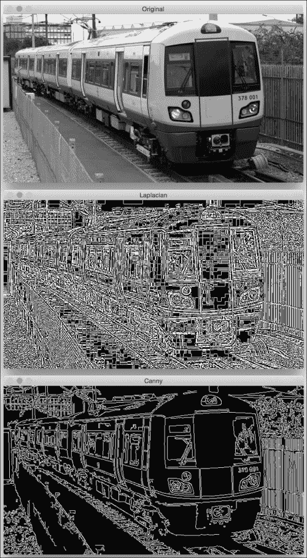

如上图所示，`Laplacian`核会产生噪声输出，这并不完全有用。为了克服这个问题，我们使用`Canny 边缘检测器`。要使用`Canny 边缘检测器`，我们可以使用以下函数：

```py
canny = cv2.Canny(img, 50, 240)
```

如上图所示，Canny 边缘检测器的质量要好得多。它接受两个数字作为参数来指示阈值。第二个参数被称为低阈值，第三个参数被称为高阈值。如果梯度值高于高阈值，它会被标记为强边缘。Canny 边缘检测器从这个点开始跟踪边缘，并继续这个过程，直到梯度值低于低阈值。当你增加这些阈值时，较弱的边缘将被忽略。输出图像将更干净、更稀疏。你可以调整阈值并观察当增加或减少它们的值时会发生什么。整体公式相当复杂。你可以在[`www.intelligence.tuc.gr/~petrakis/courses/computervision/canny.pdf`](http://www.intelligence.tuc.gr/~petrakis/courses/computervision/canny.pdf)了解更多信息。

# 运动模糊

当我们应用运动模糊效果时，它看起来就像你在特定方向上移动时捕捉到了图片。例如，你可以让图片看起来像是从一个移动的汽车上捕捉到的。

输入和输出图像将看起来像以下这些：

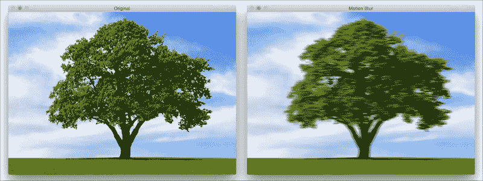

以下是实现这种运动模糊效果的代码：

```py
import cv2
import numpy as np

img = cv2.imread('input.jpg')
cv2.imshow('Original', img)

size = 15

# generating the kernel
kernel_motion_blur = np.zeros((size, size))
kernel_motion_blur[int((size-1)/2), :] = np.ones(size)
kernel_motion_blur = kernel_motion_blur / size

# applying the kernel to the input image
output = cv2.filter2D(img, -1, kernel_motion_blur)

cv2.imshow('Motion Blur', output)
cv2.waitKey(0)
```

## 内部结构

我们像往常一样读取图像。然后我们构建一个运动`模糊`核。一个运动模糊核会在特定方向上平均像素值。它就像一个方向性低通滤波器。一个 3x3 水平运动模糊核看起来是这样的：

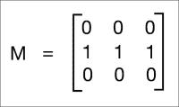

这将在水平方向上模糊图像。您可以选择任何方向，它都会相应地工作。模糊的程度将取决于核的大小。因此，如果您想使图像更模糊，只需为核选择更大的尺寸。为了看到完整的效果，我们在前面的代码中使用了 15x15 的核。然后我们使用`filter2D`将这个核应用到输入图像上，以获得运动模糊的输出。

# 锐化

应用`锐化`滤镜将增强图像中的边缘。当我们需要增强不清晰的图像边缘时，这个滤镜非常有用。以下是一些图像，以供您了解图像`锐化`过程的外观：

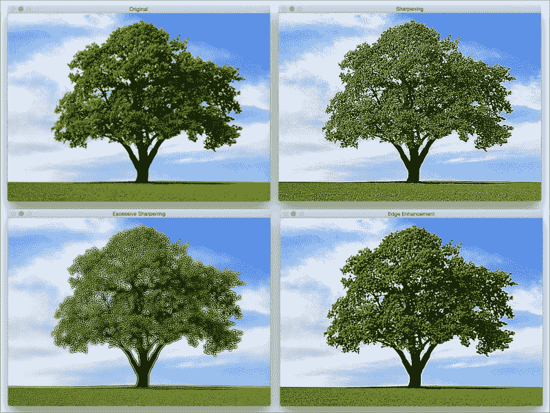

如您在前面的图中所见，锐化的程度取决于我们使用的核的类型。在这里，我们有很大的自由度来自定义核，每个核都会给您带来不同类型的锐化。如果我们只想锐化图像，就像我们在前一张图片的右上角所做的那样，我们会使用这样的核：

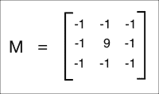

如果我们要进行过度的锐化，就像左下角的图像那样，我们会使用以下核：

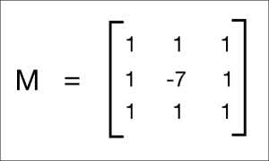

但这两个核的问题在于输出图像看起来经过了人工增强。如果我们想让我们的图像看起来更自然，我们会使用`边缘增强`滤镜。基本概念保持不变，但我们使用一个近似高斯核来构建这个滤镜。当我们增强边缘时，这将帮助我们平滑图像，从而使图像看起来更自然。

这是实现前面截图中应用效果的代码：

```py
import cv2
import numpy as np

img = cv2.imread('input.jpg')
cv2.imshow('Original', img)

# generating the kernels
kernel_sharpen_1 = np.array([[-1,-1,-1], [-1,9,-1], [-1,-1,-1]])
kernel_sharpen_2 = np.array([[1,1,1], [1,-7,1], [1,1,1]])
kernel_sharpen_3 = np.array([[-1,-1,-1,-1,-1],
                             [-1,2,2,2,-1],
                             [-1,2,8,2,-1],
                             [-1,2,2,2,-1],
                             [-1,-1,-1,-1,-1]]) / 8.0

# applying different kernels to the input image
output_1 = cv2.filter2D(img, -1, kernel_sharpen_1)
output_2 = cv2.filter2D(img, -1, kernel_sharpen_2)
output_3 = cv2.filter2D(img, -1, kernel_sharpen_3)

cv2.imshow('Sharpening', output_1)
cv2.imshow('Excessive Sharpening', output_2)
cv2.imshow('Edge Enhancement', output_3)
cv2.waitKey(0)
```

如果您注意到了，在前面的代码中，我们没有将前两个核除以归一化因子。原因是核内的值已经总和为 1，所以我们隐式地将矩阵除以 1。

## 理解模式

您一定注意到了图像滤波代码示例中的常见模式。我们构建一个核，然后使用`filter2D`来获取所需的输出。这正是这个代码示例中发生的事情！您可以尝试调整核内的值，看看是否能得到不同的视觉效果。确保在应用核之前对其进行归一化，否则图像会看起来太亮，因为您正在人为地增加图像中的像素值。

# 浮雕

浮雕滤镜会将图像转换为浮雕图像。我们基本上是将每个像素替换为阴影或高光。比如说我们处理图像中的一个相对平坦的区域。在这里，我们需要用纯灰色替换它，因为那里没有太多信息。如果某个区域有很高的对比度，我们将用白色像素（高光）或黑色像素（阴影）替换它，具体取决于我们浮雕的方向。

这就是它的样子：

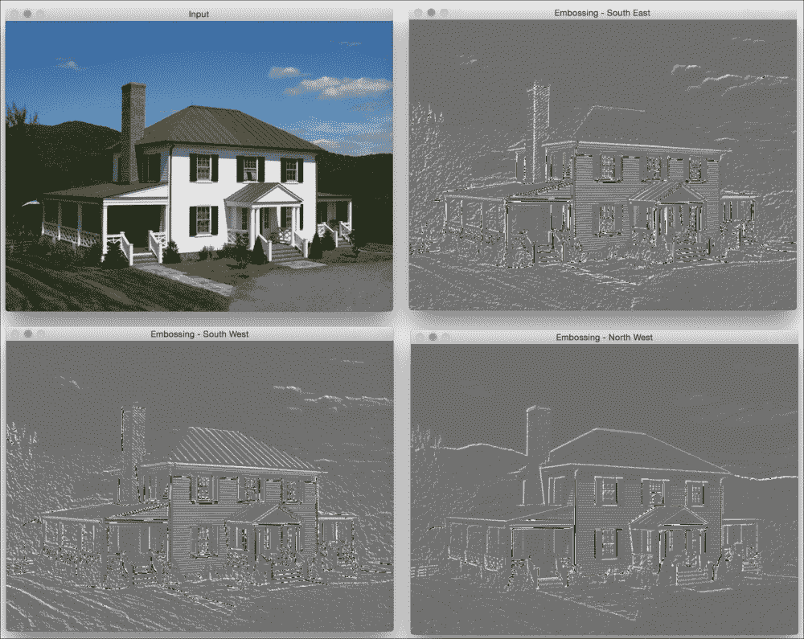

让我们看看代码，看看如何做到这一点：

```py
import cv2
import numpy as np

img_emboss_input = cv2.imread('input.jpg')

# generating the kernels
kernel_emboss_1 = np.array([[0,-1,-1],
                            [1,0,-1],
                            [1,1,0]])
kernel_emboss_2 = np.array([[-1,-1,0],
                            [-1,0,1],
                            [0,1,1]])
kernel_emboss_3 = np.array([[1,0,0],
                            [0,0,0],
                            [0,0,-1]])

# converting the image to grayscale
gray_img = cv2.cvtColor(img_emboss_input,cv2.COLOR_BGR2GRAY)

# applying the kernels to the grayscale image and adding the offset
output_1 = cv2.filter2D(gray_img, -1, kernel_emboss_1) + 128
output_2 = cv2.filter2D(gray_img, -1, kernel_emboss_2) + 128
output_3 = cv2.filter2D(gray_img, -1, kernel_emboss_3) + 128

cv2.imshow('Input', img_emboss_input)
cv2.imshow('Embossing - South West', output_1)
cv2.imshow('Embossing - South East', output_2)
cv2.imshow('Embossing - North West', output_3)
cv2.waitKey(0)
```

如果你运行前面的代码，你会看到输出图像是浮雕的。正如我们可以从上面的核中看到的那样，我们只是在特定方向上用相邻像素值的差值替换当前像素值。浮雕效果是通过将图像中所有像素值偏移 `128` 来实现的。这个操作为图片添加了高光/阴影效果。

# 腐蚀和膨胀

**腐蚀** 和 **膨胀** 是形态学图像处理操作。形态学图像处理基本上处理图像中的几何结构修改。这些操作主要定义用于二值图像，但我们也可以在灰度图像上使用它们。腐蚀基本上移除了结构的最外层像素，而膨胀则在结构上添加了一层额外的像素。

让我们看看这些操作看起来像什么：

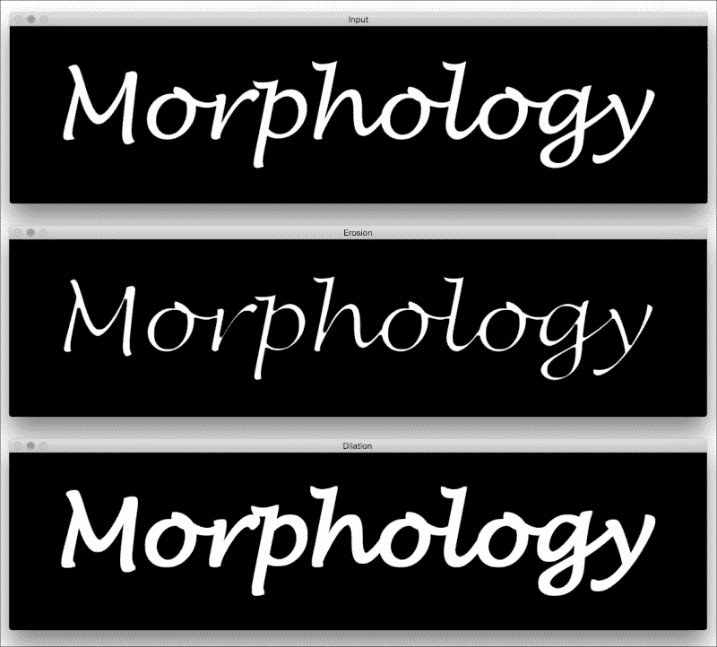

下面是实现这个效果的代码：

```py
import cv2
import numpy as np

img = cv2.imread('input.png', 0)

kernel = np.ones((5,5), np.uint8)

img_erosion = cv2.erode(img, kernel, iterations=1)
img_dilation = cv2.dilate(img, kernel, iterations=1)

cv2.imshow('Input', img)
cv2.imshow('Erosion', img_erosion)
cv2.imshow('Dilation', img_dilation)

cv2.waitKey(0)
```

## 反思

OpenCV 提供了直接腐蚀和膨胀图像的函数。它们分别称为 `erode` 和 `dilate`。值得注意的是这两个函数的第三个参数。迭代次数将决定你想要腐蚀/膨胀给定图像的程度。它基本上将操作连续应用于结果图像。你可以取一个样本图像并调整这个参数，看看结果如何。

# 创建 vignette 滤镜

使用我们所拥有的所有信息，让我们看看是否可以创建一个漂亮的 `vignette` 滤镜。输出将看起来像以下这样：

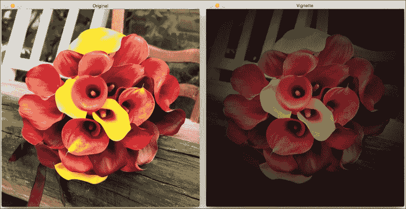

下面是实现这个效果的代码：

```py
import cv2
import numpy as np

img = cv2.imread('input.jpg')
rows, cols = img.shape[:2]

# generating vignette mask using Gaussian kernels
kernel_x = cv2.getGaussianKernel(cols,200)
kernel_y = cv2.getGaussianKernel(rows,200)
kernel = kernel_y * kernel_x.T
mask = 255 * kernel / np.linalg.norm(kernel)
output = np.copy(img)

# applying the mask to each channel in the input image
for i in range(3):
    output[:,:,i] = output[:,:,i] * mask

cv2.imshow('Original', img)
cv2.imshow('Vignette', output)
cv2.waitKey(0)
```

## 下面到底发生了什么？

`Vignette` 滤镜基本上将亮度集中在图像的特定部分，而其他部分看起来则变得模糊。为了实现这一点，我们需要使用高斯核对图像中的每个通道进行过滤。OpenCV 提供了一个执行此操作的函数，称为 `getGaussianKernel`。我们需要构建一个与图像大小匹配的 2D 核。函数 `getGaussianKernel` 的第二个参数很有趣。它是高斯的标准差，它控制着明亮中心区域的半径。你可以调整这个参数，看看它如何影响输出。

一旦我们构建了 2D 核，我们需要通过归一化这个核并放大它来构建一个掩码，如下面的行所示：

```py
 mask = 255 * kernel / np.linalg.norm(kernel)
```

这是一个重要的步骤，因为如果你不放大它，图像将看起来是黑色的。这是因为在你将掩码叠加到输入图像上之后，所有像素值都会接近 `0`。之后，我们遍历所有颜色通道，并将掩码应用于每个通道。

## 我们如何移动焦点？

我们现在知道如何创建一个聚焦于图像中心的`vignette`滤镜。假设我们想要达到相同的`vignette`效果，但我们想聚焦于图像中的不同区域，如图所示：

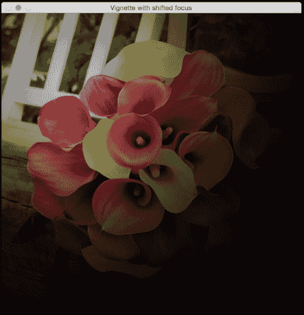

我们需要做的只是构建一个更大的高斯核，并确保峰值与感兴趣的区域相吻合。以下是实现这一目标的代码：

```py
import cv2
import numpy as np

img = cv2.imread('input.jpg')
rows, cols = img.shape[:2]

# generating vignette mask using Gaussian kernels
kernel_x = cv2.getGaussianKernel(int(1.5*cols),200)
kernel_y = cv2.getGaussianKernel(int(1.5*rows),200)
kernel = kernel_y * kernel_x.T
mask = 255 * kernel / np.linalg.norm(kernel)
mask = mask[int(0.5*rows):, int(0.5*cols):]
output = np.copy(img)

# applying the mask to each channel in the input image
for i in range(3):
    output[:,:,i] = output[:,:,i] * mask

cv2.imshow('Input', img)
cv2.imshow('Vignette with shifted focus', output)

cv2.waitKey(0)
```

# 增强图像的对比度

无论何时我们在低光条件下捕捉图像，图像都会变得很暗。这通常发生在你在傍晚或昏暗的房间里捕捉图像时。你肯定见过这种情况发生很多次！这种情况发生的原因是因为在这种情况下捕捉图像时，像素值往往会集中在 0 附近。当这种情况发生时，图像中的许多细节对肉眼来说并不清晰可见。人眼喜欢对比度，因此我们需要调整对比度，使图像看起来更美观、更愉快。许多相机和照片应用程序已经隐式地做了这件事。我们使用一个称为**直方图均衡化**的过程来实现这一点。

为了举例说明，这是对比度增强前后的图像外观：

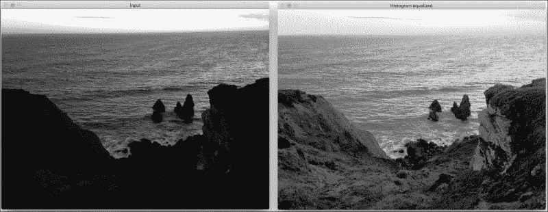

如此可见，左侧的输入图像非常暗。为了纠正这一点，我们需要调整像素值，使它们分布在整个值谱上，即 0 到`255`之间。

以下是为调整像素值而编写的代码：

```py
import cv2
import numpy as np

img = cv2.imread('input.jpg', 0)

# equalize the histogram of the input image
histeq = cv2.equalizeHist(img)

cv2.imshow('Input', img)
cv2.imshow('Histogram equalized', histeq)
cv2.waitKey(0)
```

直方图均衡化适用于灰度图像。OpenCV 提供了一个名为`equalizeHist`的函数来实现这一效果。正如我们所见，代码相当简单，其中我们读取图像并均衡其直方图以调整图像的对比度。

## 我们如何处理彩色图像？

现在我们知道了如何均衡灰度图像的直方图，你可能想知道如何处理彩色图像。关于直方图均衡化，它是一个非线性过程。因此，我们不能只是将 RGB 图像中的三个通道分开，分别均衡直方图，然后再将它们组合起来形成输出图像。直方图均衡化的概念仅适用于图像中的强度值。因此，我们必须确保在执行此操作时不要修改颜色信息。

为了处理彩色图像的直方图均衡化，我们需要将其转换为一种强度与颜色信息分离的颜色空间。YUV 就是这样一种颜色空间。一旦我们将其转换为 YUV，我们只需要均衡 Y 通道，并将其与其他两个通道组合起来以获得输出图像。

以下是一个示例，展示其外观：

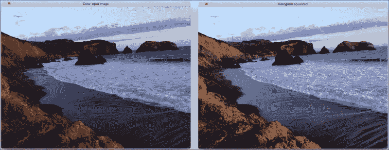

以下是实现彩色图像直方图均衡化的代码：

```py
import cv2
import numpy as np

img = cv2.imread('input.jpg')

img_yuv = cv2.cvtColor(img, cv2.COLOR_BGR2YUV)

# equalize the histogram of the Y channel
img_yuv[:,:,0] = cv2.equalizeHist(img_yuv[:,:,0])

# convert the YUV image back to RGB format
img_output = cv2.cvtColor(img_yuv, cv2.COLOR_YUV2BGR)

cv2.imshow('Color input image', img)
cv2.imshow('Histogram equalized', img_output)

cv2.waitKey(0)
```

# 摘要

在本章中，我们学习了如何使用图像过滤器将酷炫的视觉效果应用到图像上。我们讨论了基本的图像处理算子以及如何使用它们构建各种事物。我们学习了如何使用各种方法检测边缘。我们理解了二维卷积的重要性以及在不同场景中如何使用它。我们讨论了如何平滑、运动模糊、锐化、浮雕、腐蚀和膨胀图像。我们学习了如何创建晕影过滤器，以及如何改变焦点区域。我们讨论了对比度增强以及如何使用直方图均衡化来实现它。在下一章中，我们将讨论如何卡通化给定的图像。
