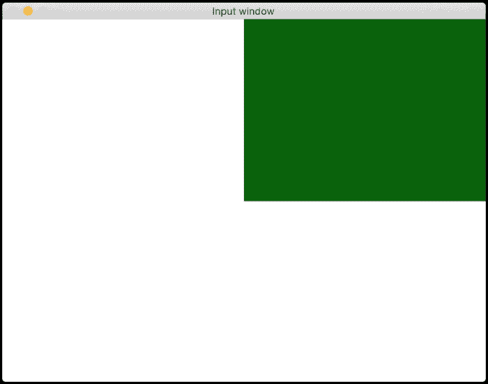
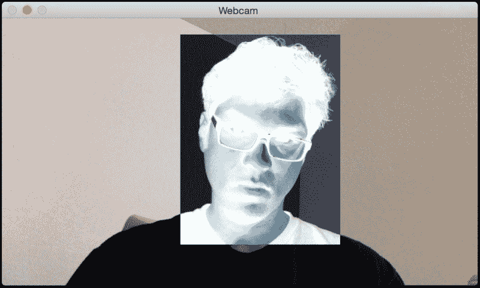
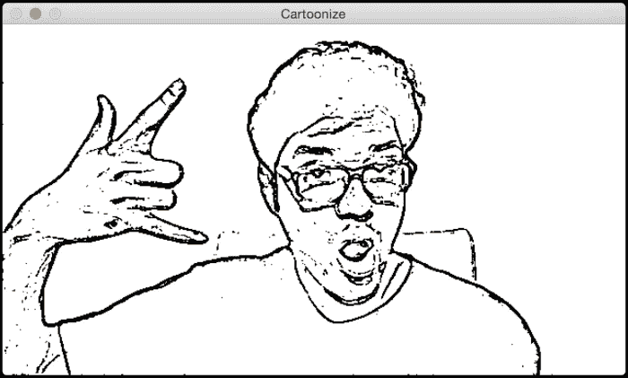
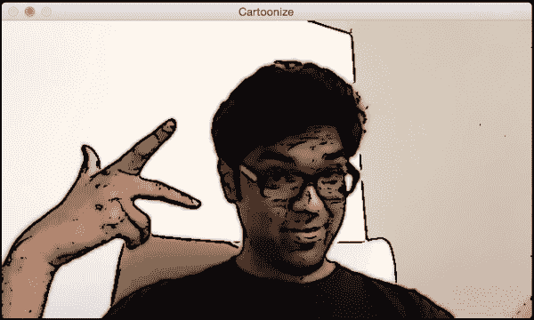
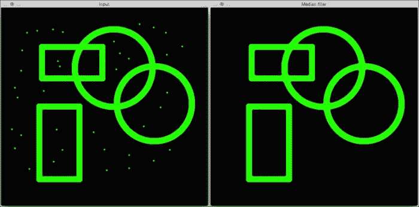
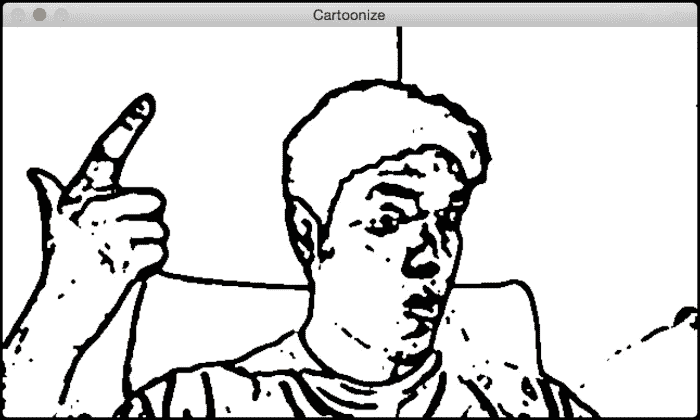
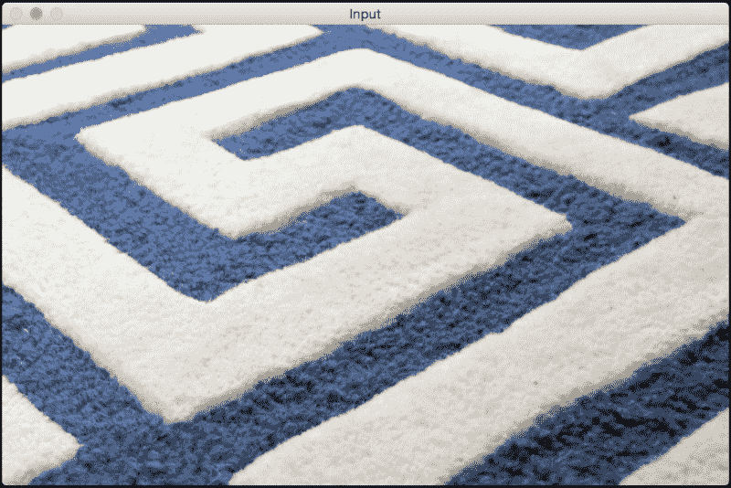
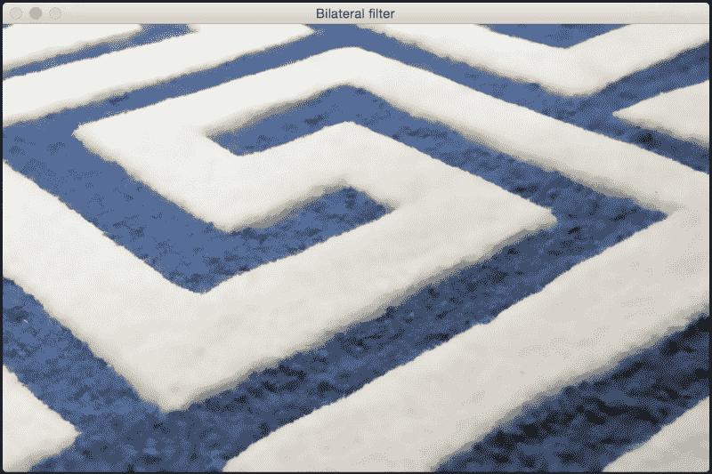

# 第三章：图像卡通化

在本章中，我们将学习如何将图像转换为卡通风格的图像。我们将学习如何在实时视频流中访问网络摄像头和获取键盘/鼠标输入。我们还将了解一些高级图像过滤器，并了解我们如何使用它们来卡通化图像。

到本章结束时，您将知道：

+   如何访问网络摄像头

+   如何在实时视频流中获取键盘和鼠标输入

+   如何创建交互式应用程序

+   如何使用高级图像过滤器

+   如何卡通化图像

# 访问网络摄像头

我们可以使用网络摄像头的实时视频流构建非常有趣的应用程序。OpenCV 提供了一个视频捕获对象，它处理与打开和关闭网络摄像头相关的所有事情。我们所需做的只是创建该对象，并从中读取帧。

以下代码将打开网络摄像头，捕获帧，将它们按 2 倍因子缩小，然后在窗口中显示。您可以按 *Esc* 键退出。

```py
import cv2

cap = cv2.VideoCapture(0)

# Check if the webcam is opened correctly
if not cap.isOpened():
    raise IOError("Cannot open webcam")

while True:
    ret, frame = cap.read()
    frame = cv2.resize(frame, None, fx=0.5, fy=0.5, interpolation=cv2.INTER_AREA)
    cv2.imshow('Input', frame)

    c = cv2.waitKey(1)
    if c == 27:
        break

cap.release()
cv2.destroyAllWindows()
```

## 内部机制

如前述代码所示，我们使用 OpenCV 的 `VideoCapture` 函数创建视频捕获对象 cap。一旦创建，我们就启动一个无限循环，并从网络摄像头读取帧，直到遇到键盘中断。在 while 循环内的第一行，我们有以下行：

```py
ret, frame = cap.read()
```

在这里，`ret` 是由 `read` 函数返回的布尔值，它表示帧是否成功捕获。如果帧被正确捕获，它将存储在变量 `frame` 中。这个循环将一直运行，直到我们按下 *Esc* 键。因此，我们在以下行中持续检查键盘中断：

```py
if c == 27:
```

如我们所知，*Esc* 的 ASCII 值为 27。一旦遇到它，我们就中断循环并释放视频捕获对象。`cap.release()` 这一行很重要，因为它优雅地关闭了网络摄像头。

# 键盘输入

现在我们知道了如何从网络摄像头捕获实时视频流，让我们看看如何使用键盘与显示视频流的窗口进行交互。

```py
import argparse

import cv2

def argument_parser():
    parser = argparse.ArgumentParser(description="Change color space of the \
            input video stream using keyboard controls. The control keys are: \
            Grayscale - 'g', YUV - 'y', HSV - 'h'")
    return parser

if __name__=='__main__':
    args = argument_parser().parse_args()

    cap = cv2.VideoCapture(0)

    # Check if the webcam is opened correctly
    if not cap.isOpened():
        raise IOError("Cannot open webcam")

    cur_char = -1
    prev_char = -1

    while True:
        # Read the current frame from webcam
        ret, frame = cap.read()

        # Resize the captured image
        frame = cv2.resize(frame, None, fx=0.5, fy=0.5, interpolation=cv2.INTER_AREA)

        c = cv2.waitKey(1)

        if c == 27:
            break

        if c > -1 and c != prev_char:
            cur_char = c
        prev_char = c

        if cur_char == ord('g'):
            output = cv2.cvtColor(frame, cv2.COLOR_BGR2GRAY)
        elif cur_char == ord('y'):
            output = cv2.cvtColor(frame, cv2.COLOR_BGR2YUV)

        elif cur_char == ord('h'):
            output = cv2.cvtColor(frame, cv2.COLOR_BGR2HSV)

        else:
            output = frame

        cv2.imshow('Webcam', output)

    cap.release()
    cv2.destroyAllWindows()
```

## 与应用程序交互

此程序将显示输入的视频流并等待键盘输入以更改颜色空间。如果您运行上一个程序，您将看到显示来自网络摄像头的输入视频流的窗口。如果您按下 *G*，您将看到输入流的颜色空间被转换为灰度。如果您按下 *Y*，输入流将被转换为 YUV 颜色空间。同样，如果您按下 *H*，您将看到图像被转换为 HSV 颜色空间。

如我们所知，我们使用 `waitKey()` 函数来监听键盘事件。每当遇到不同的按键时，我们采取适当的行动。我们使用 `ord()` 函数的原因是 `waitKey()` 返回键盘输入的 ASCII 值；因此，在检查它们的值之前，我们需要将字符转换为它们的 ASCII 形式。

# 鼠标输入

在本节中，我们将了解如何使用鼠标与显示窗口进行交互。让我们从简单的事情开始。我们将编写一个程序，该程序将检测鼠标点击发生的位置象限。一旦检测到，我们将突出显示该象限。

```py
import cv2
import numpy as np

def detect_quadrant(event, x, y, flags, param):
    if event == cv2.EVENT_LBUTTONDOWN:
        if x > width/2:
            if y > height/2:
                point_top_left = (int(width/2), int(height/2))
                point_bottom_right = (width-1, height-1)
            else:
                point_top_left = (int(width/2), 0)
                point_bottom_right = (width-1, int(height/2))

        else:
            if y > height/2:
                point_top_left = (0, int(height/2))
                point_bottom_right = (int(width/2), height-1)
            else:
                point_top_left = (0, 0)
                point_bottom_right = (int(width/2), int(height/2))

        cv2.rectangle(img, (0,0), (width-1,height-1), (255,255,255), -1)
        cv2.rectangle(img, point_top_left, point_bottom_right, (0,100,0), -1)

if __name__=='__main__':
    width, height = 640, 480
    img = 255 * np.ones((height, width, 3), dtype=np.uint8)
    cv2.namedWindow('Input window')
    cv2.setMouseCallback('Input window', detect_quadrant)

    while True:
        cv2.imshow('Input window', img)
        c = cv2.waitKey(10)
        if c == 27:
            break

    cv2.destroyAllWindows()
```

输出将类似于以下图像：



## 发生了什么？

让我们从程序中的主函数开始。我们创建一个白色图像，我们将使用鼠标点击该图像。然后我们创建一个命名窗口，并将鼠标回调函数绑定到该窗口。鼠标回调函数基本上是在检测到鼠标事件时将被调用的函数。有许多种鼠标事件，如点击、双击、拖动等。在我们的情况下，我们只想检测鼠标点击。在函数`detect_quadrant`中，我们检查第一个输入参数`event`以查看执行了什么操作。OpenCV 提供了一套预定义的事件，我们可以使用特定的关键字来调用它们。如果您想查看所有鼠标事件的列表，您可以在 Python shell 中输入以下内容：

```py
>>> import cv2
>>> print [x for x in dir(cv2) if x.startswith('EVENT')]
```

函数`detect_quadrant`中的第二个和第三个参数提供了鼠标点击事件的 X 和 Y 坐标。一旦我们知道这些坐标，确定它所在的象限就非常直接了。有了这些信息，我们只需使用`cv2.rectangle()`函数绘制一个指定颜色的矩形。这是一个非常方便的函数，它接受左上角点和右下角点，在图像上绘制一个指定颜色的矩形。

# 与实时视频流交互

让我们看看如何使用鼠标与来自摄像头的实时视频流进行交互。我们可以使用鼠标选择一个区域，然后在该区域应用“负片”效果，如下所示：



在以下程序中，我们将从摄像头捕获视频流，使用鼠标选择感兴趣的区域，然后应用效果：

```py
import cv2
import numpy as np

def draw_rectangle(event, x, y, flags, params):
    global x_init, y_init, drawing, top_left_pt, bottom_right_pt

    if event == cv2.EVENT_LBUTTONDOWN:
        drawing = True
        x_init, y_init = x, y

    elif event == cv2.EVENT_MOUSEMOVE:
        if drawing:
            top_left_pt = (min(x_init, x), min(y_init, y))
            bottom_right_pt = (max(x_init, x), max(y_init, y))
            img[y_init:y, x_init:x] = 255 - img[y_init:y, x_init:x]

    elif event == cv2.EVENT_LBUTTONUP:
        drawing = False
        top_left_pt = (min(x_init, x), min(y_init, y))
        bottom_right_pt = (max(x_init, x), max(y_init, y))
        img[y_init:y, x_init:x] = 255 - img[y_init:y, x_init:x]

if __name__=='__main__':
    drawing = False
    top_left_pt, bottom_right_pt = (-1,-1), (-1,-1)

    cap = cv2.VideoCapture(0)

    # Check if the webcam is opened correctly
    if not cap.isOpened():
        raise IOError("Cannot open webcam")

    cv2.namedWindow('Webcam')
    cv2.setMouseCallback('Webcam', draw_rectangle)

    while True:
        ret, frame = cap.read()
        img = cv2.resize(frame, None, fx=0.5, fy=0.5, interpolation=cv2.INTER_AREA)
        (x0,y0), (x1,y1) = top_left_pt, bottom_right_pt
        img[y0:y1, x0:x1] = 255 - img[y0:y1, x0:x1]
        cv2.imshow('Webcam', img)

        c = cv2.waitKey(1)
        if c == 27:
            break

    cap.release()
    cv2.destroyAllWindows()
```

如果您运行前面的程序，您将看到一个显示视频流的窗口。您只需使用鼠标在窗口上画一个矩形，您将看到该区域被转换为它的“负值”。

## 我们是如何做到的？

正如我们在程序的主函数中看到的，我们初始化了一个视频捕获对象。然后我们在以下行中将函数`draw_rectangle`与鼠标回调绑定：

```py
cv2.setMouseCallback('Webcam', draw_rectangle)
```

我们然后启动一个无限循环并开始捕获视频流。让我们看看函数`draw_rectangle`中发生了什么。每次我们使用鼠标绘制矩形时，我们基本上必须检测三种类型的鼠标事件：鼠标点击、鼠标移动和鼠标按钮释放。这正是我们在该函数中做的。每次我们检测到鼠标点击事件时，我们就初始化矩形的左上角点。当我们移动鼠标时，我们通过保持当前位置作为矩形的右下角点来选择感兴趣的区域。

一旦我们确定了感兴趣的区域，我们只需反转像素以应用“负片”效果。我们从 255 中减去当前像素值，这样就得到了期望的效果。当鼠标移动停止并且检测到按钮抬起事件时，我们停止更新矩形的右下角位置。我们只需继续显示此图像，直到检测到另一个鼠标点击事件。

# 卡通化图像

现在我们知道了如何处理网络摄像头和键盘/鼠标输入，让我们继续看看如何将图片转换为类似卡通的图像。我们可以将图像转换为草图或彩色卡通图像。

下面是一个草图将看起来怎样的例子：



如果你将卡通化效果应用于彩色图像，它看起来可能就像下面这张图像：



让我们看看如何实现这一点：

```py
import cv2
import numpy as np

def cartoonize_image(img, ds_factor=4, sketch_mode=False):
    # Convert image to grayscale
    img_gray = cv2.cvtColor(img, cv2.COLOR_BGR2GRAY)

    # Apply median filter to the grayscale image
    img_gray = cv2.medianBlur(img_gray, 7)

    # Detect edges in the image and threshold it
    edges = cv2.Laplacian(img_gray, cv2.CV_8U, ksize=5)
    ret, mask = cv2.threshold(edges, 100, 255, cv2.THRESH_BINARY_INV)

    # 'mask' is the sketch of the image
    if sketch_mode:
        return cv2.cvtColor(mask, cv2.COLOR_GRAY2BGR)

    # Resize the image to a smaller size for faster computation
    img_small = cv2.resize(img, None, fx=1.0/ds_factor, fy=1.0/ds_factor, interpolation=cv2.INTER_AREA)
    num_repetitions = 10
    sigma_color = 5
    sigma_space = 7
    size = 5

    # Apply bilateral filter the image multiple times
    for i in range(num_repetitions):
        img_small = cv2.bilateralFilter(img_small, size, sigma_color, sigma_space)

    img_output = cv2.resize(img_small, None, fx=ds_factor, fy=ds_factor, interpolation=cv2.INTER_LINEAR)

    dst = np.zeros(img_gray.shape)

    # Add the thick boundary lines to the image using 'AND' operator
    dst = cv2.bitwise_and(img_output, img_output, mask=mask)
    return dst

if __name__=='__main__':
    cap = cv2.VideoCapture(0)

    cur_char = -1
    prev_char = -1

    while True:
        ret, frame = cap.read()
        frame = cv2.resize(frame, None, fx=0.5, fy=0.5, interpolation=cv2.INTER_AREA)

        c = cv2.waitKey(1)
        if c == 27:
            break

        if c > -1 and c != prev_char:
            cur_char = c
        prev_char = c

        if cur_char == ord('s'):
            cv2.imshow('Cartoonize', cartoonize_image(frame, sketch_mode=True))
        elif cur_char == ord('c'):
            cv2.imshow('Cartoonize', cartoonize_image(frame, sketch_mode=False))
        else:
            cv2.imshow('Cartoonize', frame)

    cap.release()
    cv2.destroyAllWindows()
```

## 代码解构

当你运行前面的程序时，你会看到一个包含来自网络摄像头的视频流的窗口。如果你按*S*，视频流将切换到草图模式，你会看到它的铅笔轮廓。如果你按*C*，你会看到输入流的彩色卡通版本。如果你按任何其他键，它将返回到正常模式。

让我们看看函数`cartoonize_image`，看看我们是如何做到的。我们首先将图像转换为灰度图像，并通过中值滤波器进行处理。中值滤波器非常擅长去除椒盐噪声。这种噪声在图像中表现为孤立的黑色或白色像素。这在网络摄像头和手机摄像头中很常见，因此在我们进一步处理之前需要过滤掉它。为了举例说明，请看以下图像：



正如我们在输入图像中看到的，有很多孤立的绿色像素。它们降低了图像质量，我们需要去除它们。这就是中值滤波器发挥作用的地方。我们只需查看每个像素周围的 NxN 邻域，并选择这些数字的中值。由于在这种情况下孤立的像素具有高值，取中值将去除这些值，并使图像平滑。正如您在输出图像中看到的，中值滤波器去除了所有这些孤立的像素，图像看起来很干净。以下是实现此功能的代码：

```py
import cv2
import numpy as np

img = cv2.imread('input.png')
output = cv2.medianBlur(img, 7)
cv2.imshow('Input', img)
cv2.imshow('Median filter', output)
cv2.waitKey()
```

代码相当直接。我们只是使用`medianBlur`函数将中值滤波器应用于输入图像。这个函数的第二个参数指定了我们使用的核的大小。核的大小与我们需要考虑的邻域大小有关。您可以尝试调整这个参数，看看它如何影响输出。

回到`cartoonize_image`，我们继续在灰度图像上检测边缘。我们需要知道边缘在哪里，这样我们才能创建铅笔线效果。一旦我们检测到边缘，我们就对它们进行阈值处理，使事物变成黑白，字面和比喻意义上的！

在下一步中，我们检查草图模式是否启用。如果是，我们就将其转换为彩色图像并返回。如果我们想使线条更粗呢？比如说，我们想看到以下这样的图像：



如您所见，线条比之前更粗。为了实现这一点，将`if`代码块替换为以下代码片段：

```py
if sketch_mode:
    img_sketch = cv2.cvtColor(mask, cv2.COLOR_GRAY2BGR)
    kernel = np.ones((3,3), np.uint8)
    img_eroded = cv2.erode(img_sketch, kernel, iterations=1)
    return cv2.medianBlur(img_eroded, 5)
```

我们在这里使用的是 3x3 核的 erode 函数。我们之所以这样做，是因为它给了我们调整线条绘制厚度的机会。现在您可能会问，如果我们想增加某物的厚度，难道不应该使用膨胀吗？嗯，推理是正确的，但这里有一个小转折。请注意，前景是黑色，背景是白色。腐蚀和膨胀将白色像素视为前景，将黑色像素视为背景。因此，如果我们想增加黑色前景的厚度，我们需要使用腐蚀。在我们应用腐蚀之后，我们只需使用中值滤波器来清除噪声并得到最终输出。

在下一步中，我们使用双边滤波来平滑图像。双边滤波是一个有趣的概念，其性能远优于高斯滤波。双边滤波的优点在于它保留了边缘，而高斯滤波则将一切均匀地平滑。为了比较和对比，让我们看看以下输入图像：



让我们将高斯滤波应用于之前的图像：


现在，让我们将双边滤波应用于输入图像：



如您所见，如果我们使用双边滤波，质量会更好。图像看起来很平滑，边缘看起来也很清晰！实现这一点的代码如下：

```py
import cv2
import numpy as np

img = cv2.imread('input.jpg')

img_gaussian = cv2.GaussianBlur(img, (13,13), 0)
img_bilateral = cv2.bilateralFilter(img, 13, 70, 50)

cv2.imshow('Input', img)
cv2.imshow('Gaussian filter', img_gaussian)
cv2.imshow('Bilateral filter', img_bilateral)
cv2.waitKey()
```

如果你仔细观察两个输出，你可以看到高斯滤波图像中的边缘看起来是模糊的。通常，我们只想平滑图像中的粗糙区域，并保持边缘完整。这就是双边滤波器派上用场的地方。高斯滤波器只查看直接邻域，并使用高斯核平均像素值。双边滤波器通过只平均那些在强度上相似的像素将这个概念提升到下一个层次。它还使用颜色邻域度量来查看是否可以替换当前像素，该像素在强度上与当前像素相似。如果你查看函数调用：

```py
img_small = cv2.bilateralFilter(img_small, size, sigma_color, sigma_space)
```

在这里最后两个参数指定了颜色和空间邻域。这就是双边滤波器输出边缘看起来清晰的原因。我们在图像上多次运行这个滤波器以平滑它，使其看起来像卡通。然后我们在这个彩色图像上叠加铅笔状的遮罩以创建类似卡通的效果。

# 摘要

在本章中，我们学习了如何访问摄像头。我们讨论了如何在实时视频流中获取键盘和鼠标输入。我们利用这些知识创建了一个交互式应用程序。我们讨论了中值滤波器和双边滤波器，并谈到了双边滤波器相对于高斯滤波器的优势。我们使用所有这些原理将输入图像转换为类似草图的效果，然后将其卡通化。

在下一章中，我们将学习如何在静态图像和实时视频中检测不同的身体部位。
