# 第四章. 检测和跟踪不同身体部位

在本章中，我们将学习如何在实时视频流中检测和跟踪不同的身体部位。我们将从讨论人脸检测流程及其从头开始构建的方式开始。我们将学习如何使用这个框架来检测和跟踪其他身体部位，例如眼睛、耳朵、嘴巴和鼻子。

到本章结束时，你将知道：

+   如何使用 Haar 级联

+   什么是积分图像

+   什么是自适应提升

+   如何在实时视频流中检测和跟踪人脸

+   如何在实时视频流中检测和跟踪眼睛

+   如何自动在人脸上叠加太阳镜

+   如何检测耳朵、鼻子和嘴巴

+   如何通过形状分析检测瞳孔

# 使用 Haar 级联检测物体

当我们提到 Haar 级联时，我们实际上是在谈论基于 Haar 特征的级联分类器。为了理解这意味着什么，我们需要退一步，了解为什么我们最初需要这个。回到 2001 年，保罗·维奥拉和迈克尔·琼斯在他们开创性的论文中提出了一种非常有效的目标检测方法。这已经成为机器学习领域的一个主要里程碑。

在他们的论文中，他们描述了一种机器学习技术，其中使用简单分类器的提升级联来获得一个表现非常出色的整体分类器。这样，我们可以绕过构建单个复杂分类器以实现高精度的过程。之所以这如此令人惊叹，是因为构建一个健壮的单步分类器是一个计算密集型的过程。此外，我们需要大量的训练数据来构建这样的分类器。模型最终变得复杂，性能可能无法达到预期标准。

假设我们想要检测一个物体，比如，菠萝。为了解决这个问题，我们需要构建一个机器学习系统，该系统能够学习菠萝的外观。它应该能够告诉我们未知图像中是否包含菠萝。为了实现类似的功能，我们需要训练我们的系统。在机器学习的领域，我们有大量的方法可以用来训练一个系统。这很像训练一只狗，只不过它不会帮你捡球！为了训练我们的系统，我们使用大量的菠萝和非菠萝图像，并将它们输入到系统中。在这里，菠萝图像被称为正图像，而非菠萝图像被称为负图像。

就训练而言，有众多路线可供选择。但所有传统技术都是计算密集型的，并导致复杂的模型。我们不能使用这些模型来构建实时系统。因此，我们需要保持分类器简单。但是，如果我们保持分类器简单，它将不会很准确。速度和准确度之间的权衡在机器学习中很常见。我们通过构建一系列简单的分类器并将它们级联起来形成一个鲁棒的统一分类器来克服这个问题。为了确保整体分类器工作良好，我们需要在级联步骤中发挥创意。这就是为什么**Viola-Jones**方法如此有效的主要原因之一。

说到面部检测的话题，让我们看看如何训练一个系统来检测面部。如果我们想构建一个机器学习系统，我们首先需要从所有图像中提取特征。在我们的情况下，机器学习算法将使用这些特征来学习面部的外观。我们使用 Haar 特征来构建我们的特征向量。Haar 特征是图像中块片的简单求和和差分。我们在多个图像大小上进行此操作，以确保我们的系统是尺度不变的。

### 注意

如果你对此好奇，你可以在[`www.cs.ubc.ca/~lowe/425/slides/13-ViolaJones.pdf`](http://www.cs.ubc.ca/~lowe/425/slides/13-ViolaJones.pdf)上了解更多关于公式的信息。

一旦我们提取了这些特征，我们就将其通过一系列分类器。我们只是检查所有不同的矩形子区域，并丢弃其中没有面部的那些。这样，我们就能快速得出结论，看给定的矩形是否包含面部。

# 积分图像是什么？

如果我们要计算 Haar 特征，我们将在图像内计算许多不同矩形区域的求和。如果我们想有效地构建特征集，我们需要在多个尺度上计算这些求和。这是一个非常昂贵的进程！如果我们想构建一个实时系统，我们不能在计算这些和上花费这么多周期。所以，我们使用一种叫做积分图像的东西。

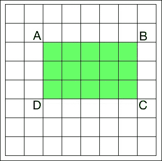

要计算图像中任何矩形的和，我们不需要遍历该矩形区域的所有元素。假设 AP 表示由图像中左上角点和点 P（作为两个对角线相对的顶点）形成的矩形的所有元素的和。所以现在，如果我们想计算矩形 ABCD 的面积，我们可以使用以下公式：

*矩形 ABCD 的面积 = AC – (AB + AD - AA)*

为什么我们关心这个特定的公式？正如我们之前讨论的，提取 Haar 特征包括在多个尺度上计算图像中大量矩形的面积。其中许多计算是重复的，整个过程非常慢。事实上，它如此之慢，以至于我们无法承担实时运行任何东西的费用。这就是我们使用这个公式的理由！这个方法的好处是，我们不必重新计算任何东西。这个方程式右侧的所有面积值都已经可用。所以我们只需使用它们来计算任何给定矩形的面积并提取特征。

# 面部检测与跟踪

OpenCV 提供了一个不错的面部检测框架。我们只需要加载级联文件并使用它来检测图像中的面部。让我们看看如何做到这一点：

```py
import cv2
import numpy as np

face_cascade = cv2.CascadeClassifier('./cascade_files/haarcascade_frontalface_alt.xml')

cap = cv2.VideoCapture(0)
scaling_factor = 0.5

while True:
    ret, frame = cap.read()
    frame = cv2.resize(frame, None, fx=scaling_factor, fy=scaling_factor, interpolation=cv2.INTER_AREA)
    gray = cv2.cvtColor(frame, cv2.COLOR_BGR2GRAY)

    face_rects = face_cascade.detectMultiScale(gray, 1.3, 5)
    for (x,y,w,h) in face_rects:
        cv2.rectangle(frame, (x,y), (x+w,y+h), (0,255,0), 3)

    cv2.imshow('Face Detector', frame)

    c = cv2.waitKey(1)
    if c == 27:
        break

cap.release()
cv2.destroyAllWindows()
```

如果你运行上述代码，它看起来可能像以下图像：

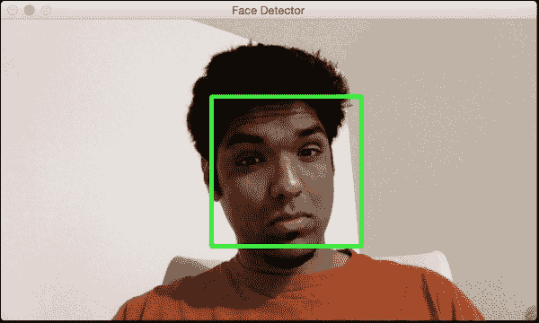

## 更好地理解它

我们需要一个分类器模型，可以用来检测图像中的面部。OpenCV 提供了一个用于此目的的 xml 文件。我们使用`CascadeClassifier`函数来加载 xml 文件。一旦我们开始从摄像头捕获输入帧，我们就将其转换为灰度图，并使用`detectMultiScale`函数获取当前图像中所有面部的边界框。这个函数的第二个参数指定了缩放因子的跳跃。也就是说，如果我们当前尺度下找不到图像，下一个要检查的尺寸将是当前尺寸的 1.3 倍。最后一个参数是一个阈值，指定了需要保留当前矩形的相邻矩形数量。它可以用来增加面部检测器的鲁棒性。

# 面部游戏

现在我们已经知道了如何检测和跟踪面部，让我们来点乐趣。当我们从摄像头捕获视频流时，我们可以在我们的面部上叠加有趣的口罩。它看起来可能像下面这张图像：

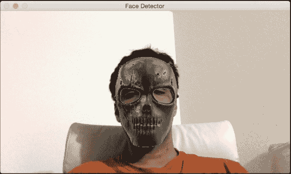

如果你喜欢汉尼拔，你可以尝试下一个：

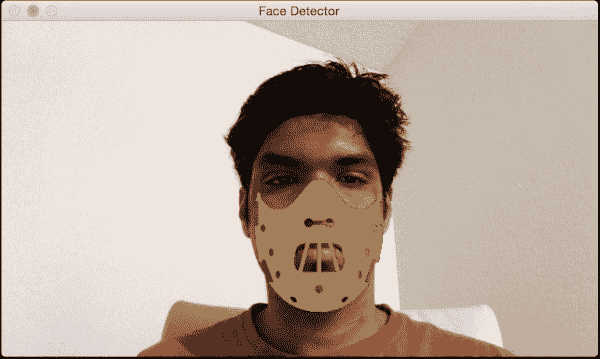

让我们看看代码，看看如何将颅骨面具叠加到输入视频流中的面部上：

```py
import cv2
import numpy as np

face_cascade = cv2.CascadeClassifier('./cascade_files/haarcascade_frontalface_alt.xml')

face_mask = cv2.imread('mask_hannibal.png')
h_mask, w_mask = face_mask.shape[:2]

if face_cascade.empty():
    raise IOError('Unable to load the face cascade classifier xml file')

cap = cv2.VideoCapture(0)
scaling_factor = 0.5

while True:
    ret, frame = cap.read()
    frame = cv2.resize(frame, None, fx=scaling_factor, fy=scaling_factor, interpolation=cv2.INTER_AREA)
    gray = cv2.cvtColor(frame, cv2.COLOR_BGR2GRAY)

    face_rects = face_cascade.detectMultiScale(gray, 1.3, 5)
    for (x,y,w,h) in face_rects:
        if h > 0 and w > 0:
            # Adjust the height and weight parameters depending on the sizes and the locations. You need to play around with these to make sure you get it right.
            h, w = int(1.4*h), int(1.0*w)
            y -= 0.1*h

            # Extract the region of interest from the image
            frame_roi = frame[y:y+h, x:x+w]
            face_mask_small = cv2.resize(face_mask, (w, h), interpolation=cv2.INTER_AREA)

            # Convert color image to grayscale and threshold it
            gray_mask = cv2.cvtColor(face_mask_small, cv2.COLOR_BGR2GRAY)
            ret, mask = cv2.threshold(gray_mask, 180, 255, cv2.THRESH_BINARY_INV)

            # Create an inverse mask
            mask_inv = cv2.bitwise_not(mask)

            # Use the mask to extract the face mask region of interest
            masked_face = cv2.bitwise_and(face_mask_small, face_mask_small, mask=mask)

            # Use the inverse mask to get the remaining part of the image
            masked_frame = cv2.bitwise_and(frame_roi, frame_roi, mask=mask_inv)

            # add the two images to get the final output
            frame[y:y+h, x:x+w] = cv2.add(masked_face, masked_frame)

    cv2.imshow('Face Detector', frame)

    c = cv2.waitKey(1)
    if c == 27:
        break

cap.release()
cv2.destroyAllWindows()
```

## 内部机制

就像以前一样，我们首先加载面部级联分类器 xml 文件。面部检测步骤按常规进行。我们启动无限循环并持续检测每一帧中的面部。一旦我们知道面部在哪里，我们需要稍微修改坐标以确保面具合适地贴合。这个操作过程是主观的，取决于所讨论的面具。不同的面具需要不同级别的调整以使其看起来更自然。我们在以下行中从输入帧中提取感兴趣区域：

```py
frame_roi = frame[y:y+h, x:x+w]
```

现在我们有了所需的感兴趣区域，我们需要在这个区域上方叠加掩码。所以我们将输入掩码调整大小，确保它适合这个感兴趣区域。输入掩码有一个白色背景。所以如果我们直接将其叠加在感兴趣区域上，由于白色背景，它看起来会不自然。我们需要叠加的只有颅骨掩码像素，其余区域应该是透明的。

所以在下一步，我们通过阈值化颅骨图像来创建一个掩码。由于背景是白色的，我们将图像阈值化，使得任何强度值大于 180 的像素变为 0，其余所有像素变为 255。至于感兴趣区域，我们需要在这个掩码区域内将所有内容变黑。我们可以通过简单地使用我们刚刚创建的掩码的逆来做到这一点。一旦我们有了颅骨图像的掩码版本和输入感兴趣区域，我们只需将它们相加即可得到最终图像。

# 检测眼睛

现在我们已经了解了如何检测人脸，我们可以将这个概念推广到检测其他身体部位。重要的是要理解 Viola-Jones 框架可以应用于任何对象。准确性和鲁棒性将取决于对象的独特性。例如，人脸具有非常独特的特征，因此训练我们的系统变得鲁棒是很容易的。另一方面，像毛巾这样的物体太通用了，没有这样的区分特征；因此，构建一个鲁棒的毛巾检测器会更困难。

让我们看看如何构建一个眼睛检测器：

```py
import cv2
import numpy as np

face_cascade = cv2.CascadeClassifier('./cascade_files/haarcascade_frontalface_alt.xml')
eye_cascade = cv2.CascadeClassifier('./cascade_files/haarcascade_eye.xml')
if face_cascade.empty():
  raise IOError('Unable to load the face cascade classifier xml file')

if eye_cascade.empty():
  raise IOError('Unable to load the eye cascade classifier xml file')

cap = cv2.VideoCapture(0)
ds_factor = 0.5

while True:
    ret, frame = cap.read()
    frame = cv2.resize(frame, None, fx=ds_factor, fy=ds_factor, interpolation=cv2.INTER_AREA)
    gray = cv2.cvtColor(frame, cv2.COLOR_BGR2GRAY)

    faces = face_cascade.detectMultiScale(gray, 1.3, 5)
    for (x,y,w,h) in faces:
        roi_gray = gray[y:y+h, x:x+w]
        roi_color = frame[y:y+h, x:x+w]
        eyes = eye_cascade.detectMultiScale(roi_gray)
        for (x_eye,y_eye,w_eye,h_eye) in eyes:
            center = (int(x_eye + 0.5*w_eye), int(y_eye + 0.5*h_eye))
            radius = int(0.3 * (w_eye + h_eye))
            color = (0, 255, 0)
            thickness = 3
            cv2.circle(roi_color, center, radius, color, thickness)

    cv2.imshow('Eye Detector', frame)

    c = cv2.waitKey(1)
    if c == 27:
        break

cap.release()
cv2.destroyAllWindows()
```

如果你运行这个程序，输出将类似于以下图像：

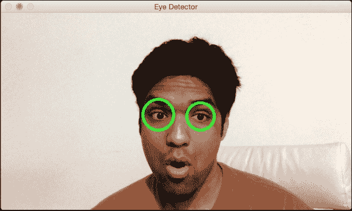

## 反思

如果你注意的话，程序看起来非常类似于人脸检测程序。除了加载人脸检测级联分类器外，我们还加载了眼睛检测级联分类器。技术上，我们不需要使用人脸检测器。但我们知道眼睛总是在某人的脸上。我们使用这个信息，只在相关感兴趣区域内搜索眼睛，即脸部。我们首先检测脸部，然后在子图像上运行眼睛检测器。这样，它更快更高效。

# 眼睛的乐趣

现在我们知道了如何在图像中检测眼睛，让我们看看我们能否用它来做些有趣的事情。我们可以做类似以下截图所示的事情：

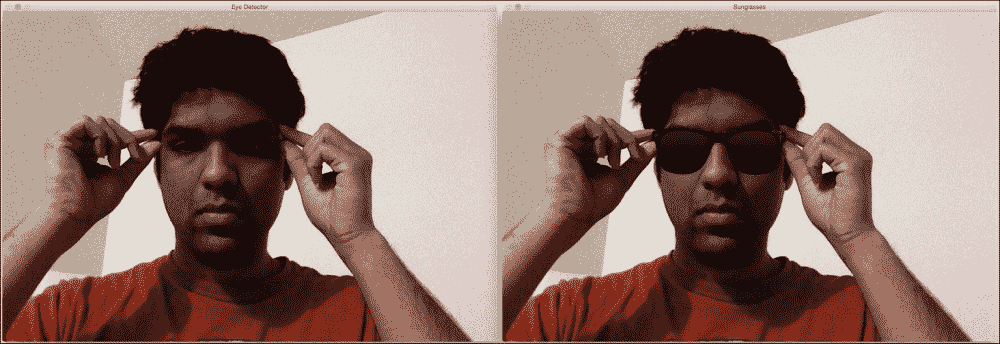

让我们看看代码，看看如何做到这一点：

```py
import cv2
import numpy as np

face_cascade = cv2.CascadeClassifier('./cascade_files/haarcascade_frontalface_alt.xml')
eye_cascade = cv2.CascadeClassifier('./cascade_files/haarcascade_eye.xml')

if face_cascade.empty():
  raise IOError('Unable to load the face cascade classifier xml file')

if eye_cascade.empty():
  raise IOError('Unable to load the eye cascade classifier xml file')

img = cv2.imread('input.jpg')
sunglasses_img = cv2.imread('sunglasses.jpg')

gray = cv2.cvtColor(img, cv2.COLOR_BGR2GRAY)

centers = []
faces = face_cascade.detectMultiScale(gray, 1.3, 5)

for (x,y,w,h) in faces:
    roi_gray = gray[y:y+h, x:x+w]
    roi_color = img[y:y+h, x:x+w]
    eyes = eye_cascade.detectMultiScale(roi_gray)
    for (x_eye,y_eye,w_eye,h_eye) in eyes:
        centers.append((x + int(x_eye + 0.5*w_eye), y + int(y_eye + 0.5*h_eye)))

if len(centers) > 0:
    # Overlay sunglasses; the factor 2.12 is customizable depending on the size of the face
    sunglasses_width = 2.12 * abs(centers[1][0] - centers[0][0])
    overlay_img = np.ones(img.shape, np.uint8) * 255
    h, w = sunglasses_img.shape[:2]
    scaling_factor = sunglasses_width / w
    overlay_sunglasses = cv2.resize(sunglasses_img, None, fx=scaling_factor,
            fy=scaling_factor, interpolation=cv2.INTER_AREA)

    x = centers[0][0] if centers[0][0] < centers[1][0] else centers[1][0]

    # customizable X and Y locations; depends on the size of the face
    x -= 0.26*overlay_sunglasses.shape[1]
    y += 0.85*overlay_sunglasses.shape[0]

    h, w = overlay_sunglasses.shape[:2]
    overlay_img[y:y+h, x:x+w] = overlay_sunglasses

    # Create mask
    gray_sunglasses = cv2.cvtColor(overlay_img, cv2.COLOR_BGR2GRAY)
    ret, mask = cv2.threshold(gray_sunglasses, 110, 255, cv2.THRESH_BINARY)
    mask_inv = cv2.bitwise_not(mask)
    temp = cv2.bitwise_and(img, img, mask=mask)
    temp2 = cv2.bitwise_and(overlay_img, overlay_img, mask=mask_inv)
    final_img = cv2.add(temp, temp2)

    cv2.imshow('Eye Detector', img)
    cv2.imshow('Sunglasses', final_img)
    cv2.waitKey()
    cv2.destroyAllWindows()
```

## 放置太阳镜

就像我们之前做的那样，我们加载图像并检测眼睛。一旦我们检测到眼睛，我们就调整太阳镜图像的大小以适应当前感兴趣的区域。为了创建感兴趣的区域，我们考虑眼睛之间的距离。我们相应地调整图像大小，然后继续创建一个掩模。这与我们之前创建头骨掩模的方法类似。太阳镜在脸上的位置是主观的。所以如果你想使用不同的太阳镜，你可能需要调整权重。

# 检测耳朵

由于我们知道了工作流程的工作原理，让我们直接进入代码：

```py
import cv2
import numpy as np

left_ear_cascade = cv2.CascadeClassifier('./cascade_files/haarcascade_mcs_leftear.xml')
right_ear_cascade = cv2.CascadeClassifier('./cascade_files/haarcascade_mcs_rightear.xml')

if left_ear_cascade.empty():
  raise IOError('Unable to load the left ear cascade classifier xml file')

if right_ear_cascade.empty():
  raise IOError('Unable to load the right ear cascade classifier xml file')

img = cv2.imread('input.jpg')

gray = cv2.cvtColor(img, cv2.COLOR_BGR2GRAY)

left_ear = left_ear_cascade.detectMultiScale(gray, 1.3, 5)
right_ear = right_ear_cascade.detectMultiScale(gray, 1.3, 5)

for (x,y,w,h) in left_ear:
    cv2.rectangle(img, (x,y), (x+w,y+h), (0,255,0), 3)

for (x,y,w,h) in right_ear:
    cv2.rectangle(img, (x,y), (x+w,y+h), (255,0,0), 3)

cv2.imshow('Ear Detector', img)
cv2.waitKey()
cv2.destroyAllWindows()
```

如果你在这个图像上运行上面的代码，你应该会看到如下所示的截图：

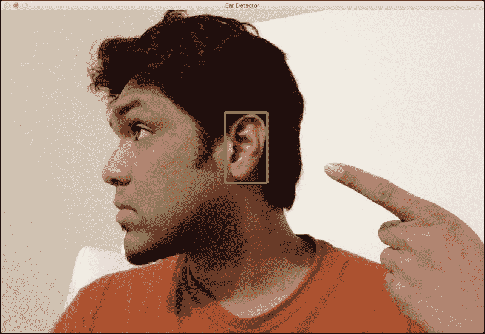

# 检测嘴巴

以下是需要用到的代码：

```py
import cv2
import numpy as np

mouth_cascade = cv2.CascadeClassifier('./cascade_files/haarcascade_mcs_mouth.xml')

if mouth_cascade.empty():
  raise IOError('Unable to load the mouth cascade classifier xml file')

cap = cv2.VideoCapture(0)
ds_factor = 0.5

while True:
    ret, frame = cap.read()
    frame = cv2.resize(frame, None, fx=ds_factor, fy=ds_factor, interpolation=cv2.INTER_AREA)
    gray = cv2.cvtColor(frame, cv2.COLOR_BGR2GRAY)

    mouth_rects = mouth_cascade.detectMultiScale(gray, 1.7, 11)
    for (x,y,w,h) in mouth_rects:
        y = int(y - 0.15*h)
        cv2.rectangle(frame, (x,y), (x+w,y+h), (0,255,0), 3)
        break

    cv2.imshow('Mouth Detector', frame)

    c = cv2.waitKey(1)
    if c == 27:
        break

cap.release()
cv2.destroyAllWindows()
```

以下是将呈现的输出：

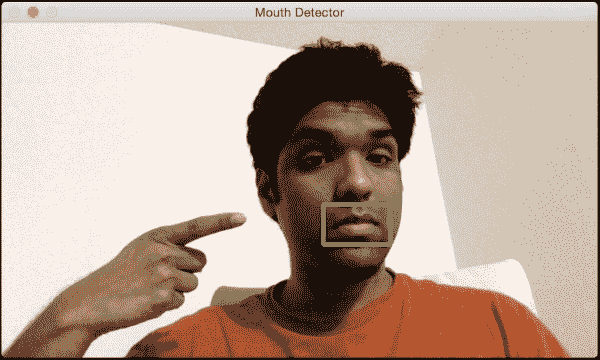

# 是时候画胡子了

让我们在上面叠加一个胡子：

```py
import cv2
import numpy as np

mouth_cascade = cv2.CascadeClassifier('./cascade_files/haarcascade_mcs_mouth.xml')

moustache_mask = cv2.imread('../images/moustache.png')
h_mask, w_mask = moustache_mask.shape[:2]

if mouth_cascade.empty():
  raise IOError('Unable to load the mouth cascade classifier xml file')

cap = cv2.VideoCapture(0)
scaling_factor = 0.5

while True:
    ret, frame = cap.read()
    frame = cv2.resize(frame, None, fx=scaling_factor, fy=scaling_factor, interpolation=cv2.INTER_AREA)
    gray = cv2.cvtColor(frame, cv2.COLOR_BGR2GRAY)

    mouth_rects = mouth_cascade.detectMultiScale(gray, 1.3, 5)
    if len(mouth_rects) > 0:
        (x,y,w,h) = mouth_rects[0]
        h, w = int(0.6*h), int(1.2*w)
        x -= 0.05*w
        y -= 0.55*h
        frame_roi = frame[y:y+h, x:x+w]
        moustache_mask_small = cv2.resize(moustache_mask, (w, h), interpolation=cv2.INTER_AREA)

        gray_mask = cv2.cvtColor(moustache_mask_small, cv2.COLOR_BGR2GRAY)
        ret, mask = cv2.threshold(gray_mask, 50, 255, cv2.THRESH_BINARY_INV)
        mask_inv = cv2.bitwise_not(mask)
        masked_mouth = cv2.bitwise_and(moustache_mask_small, moustache_mask_small, mask=mask)
        masked_frame = cv2.bitwise_and(frame_roi, frame_roi, mask=mask_inv)
        frame[y:y+h, x:x+w] = cv2.add(masked_mouth, masked_frame)

    cv2.imshow('Moustache', frame)

    c = cv2.waitKey(1)
    if c == 27:
        break

cap.release()
cv2.destroyAllWindows()
```

看起来是这样的：

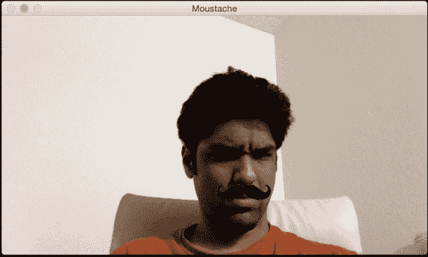

# 检测鼻子

以下程序展示了如何检测鼻子：

```py
import cv2
import numpy as np

nose_cascade = cv2.CascadeClassifier('./cascade_files/haarcascade_mcs_nose.xml')

if nose_cascade.empty():
  raise IOError('Unable to load the nose cascade classifier xml file')

cap = cv2.VideoCapture(0)
ds_factor = 0.5

while True:
    ret, frame = cap.read()
    frame = cv2.resize(frame, None, fx=ds_factor, fy=ds_factor, interpolation=cv2.INTER_AREA)
    gray = cv2.cvtColor(frame, cv2.COLOR_BGR2GRAY)

    nose_rects = nose_cascade.detectMultiScale(gray, 1.3, 5)
    for (x,y,w,h) in nose_rects:
        cv2.rectangle(frame, (x,y), (x+w,y+h), (0,255,0), 3)
        break

    cv2.imshow('Nose Detector', frame)

    c = cv2.waitKey(1)
    if c == 27:
        break

cap.release()
cv2.destroyAllWindows()
```

输出看起来像以下图像：

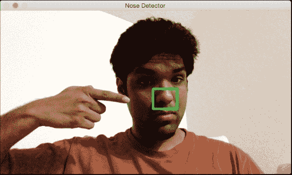

# 检测瞳孔

我们将采取不同的方法。瞳孔太通用，不适合使用 Haar 级联方法。我们还将了解如何根据形状检测事物。以下是将呈现的输出：

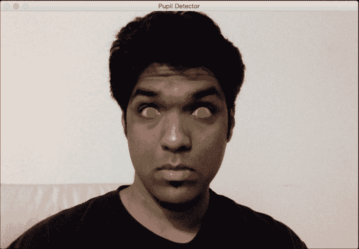

让我们看看如何构建瞳孔检测器：

```py
import math

import cv2
import numpy as np

img = cv2.imread('input.jpg')
scaling_factor = 0.7

img = cv2.resize(img, None, fx=scaling_factor, fy=scaling_factor, interpolation=cv2.INTER_AREA)
cv2.imshow('Input', img)
gray = cv2.cvtColor(~img, cv2.COLOR_BGR2GRAY)

ret, thresh_gray = cv2.threshold(gray, 220, 255, cv2.THRESH_BINARY)
contours, hierarchy = cv2.findContours(thresh_gray, cv2.RETR_EXTERNAL, cv2.CHAIN_APPROX_NONE)

for contour in contours:
    area = cv2.contourArea(contour)
    rect = cv2.boundingRect(contour)
    x, y, width, height = rect
    radius = 0.25 * (width + height)

    area_condition = (100 <= area <= 200)
    symmetry_condition = (abs(1 - float(width)/float(height)) <= 0.2)
    fill_condition = (abs(1 - (area / (math.pi * math.pow(radius, 2.0)))) <= 0.3)

    if area_condition and symmetry_condition and fill_condition:
        cv2.circle(img, (int(x + radius), int(y + radius)), int(1.3*radius), (0,180,0), -1)

cv2.imshow('Pupil Detector', img)

c = cv2.waitKey()
cv2.destroyAllWindows()
```

如果你运行这个程序，你将看到之前展示的输出。

## 代码分解

如我们之前讨论的，我们不会使用 Haar 级联来检测瞳孔。如果我们不能使用预训练的分类器，那么我们该如何检测瞳孔呢？嗯，我们可以使用形状分析来检测瞳孔。我们知道瞳孔是圆形的，因此我们可以利用这一信息在图像中检测它们。我们反转输入图像，然后将其转换为灰度图像，如下所示：

```py
gray = cv2.cvtColor(~img, cv2.COLOR_BGR2GRAY)
```

如我们所见，我们可以使用波浪号运算符来反转图像。在我们的情况下，反转图像是有帮助的，因为瞳孔是黑色的，而黑色对应于低像素值。然后我们对图像进行阈值处理，以确保只有黑白像素。现在，我们必须找出所有形状的边界。OpenCV 提供了一个很好的函数来实现这一点，那就是`findContours`。我们将在接下来的章节中对此进行更多讨论。但就目前而言，我们只需要知道这个函数返回图像中找到的所有形状的边界集合。

下一步是识别瞳孔的形状并丢弃其余部分。我们将利用圆的一些特性来精确地定位这个形状。让我们考虑边界矩形的宽高比。如果形状是圆形，这个比例将是 1。我们可以使用 `boundingRect` 函数来获取边界矩形的坐标。让我们考虑这个形状的面积。如果我们大致计算这个形状的半径并使用圆面积公式，那么它应该接近这个轮廓的面积。我们可以使用 `contourArea` 函数来计算图像中任何轮廓的面积。因此，我们可以使用这些条件来过滤形状。在这样做之后，图像中剩下两个瞳孔。我们可以通过限制搜索区域为面部或眼睛来进一步细化。由于你知道如何检测面部和眼睛，你可以尝试一下，看看你是否能使其在实时视频流中工作。

# 摘要

在本章中，我们讨论了 Haar 级联和积分图像。我们了解了面部检测流程是如何构建的。我们学习了如何在实时视频流中检测和跟踪面部。我们讨论了如何使用面部检测流程来检测各种身体部位，如眼睛、耳朵、鼻子和嘴巴。我们学习了如何使用身体部位检测的结果在输入图像上叠加掩码。我们使用了形状分析原理来检测瞳孔。

在下一章中，我们将讨论特征检测及其如何被用来理解图像内容。
