# 第五章：从图像中提取特征

在本章中，我们将学习如何在图像中检测显著点，也称为关键点。我们将讨论这些关键点为什么很重要，以及我们如何利用它们来理解图像内容。我们将讨论可以用来检测这些关键点的不同技术，以及我们如何从给定的图像中提取特征。

到本章结束时，你将知道：

+   什么是关键点，为什么我们关心它们

+   如何检测关键点

+   如何使用关键点进行图像内容分析

+   检测关键点的不同技术

+   如何构建特征提取器

# 为什么我们关心关键点？

图像内容分析是指理解图像内容的过程，以便我们可以根据该内容采取某些行动。让我们回顾一下人类是如何做到这一点的。我们的大脑是一个极其强大的机器，可以非常快速地完成复杂的事情。当我们看某样东西时，大脑会自动根据该图像的“有趣”方面创建一个足迹。随着本章的进行，我们将讨论“有趣”的含义。

目前，一个有趣的特点是那个区域中独特的东西。如果我们称一个点是有趣的，那么在其邻域内不应该有另一个满足约束条件的点。让我们考虑以下图像：


现在闭上眼睛，尝试想象这幅图像。你看到了什么具体的东西吗？你能回忆起图像的左半部分吗？实际上不行！这是因为图像没有任何有趣的信息。当我们的大脑看到这样的东西时，没有什么值得注意的。所以它往往会四处游荡！让我们看看以下图像：

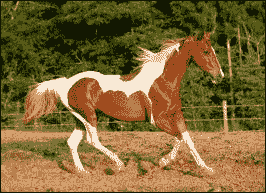

现在闭上眼睛，尝试想象这幅图像。你会发现回忆是生动的，你记得关于这幅图像的很多细节。这是因为图像中有许多有趣区域。与低频内容相比，人眼对高频内容更为敏感。这就是我们倾向于比第一幅图像更好地回忆第二幅图像的原因。为了进一步演示这一点，让我们看看以下图像：

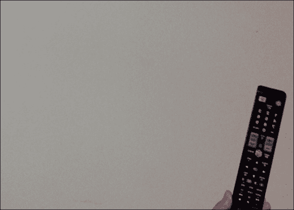

如果你注意到，你的眼睛立即就转向了电视遥控器，即使它不在图像的中心。我们自动倾向于趋向图像中的有趣区域，因为那里有所有信息。这就是我们的大脑需要存储以便以后回忆起来的内容。

当我们构建物体识别系统时，我们需要检测这些“有趣”的区域来为图像创建一个签名。这些有趣区域的特点是关键点。这就是为什么关键点检测在许多现代计算机视觉系统中至关重要。

# 什么是关键点？

既然我们已经知道关键点指的是图像中的有趣区域，那么让我们深入探讨一下。关键点由什么组成？这些点在哪里？当我们说“有趣”时，意味着该区域正在发生某些事情。如果该区域只是均匀的，那么它并不很有趣。例如，角落是有趣的，因为两个不同方向上的强度发生了急剧变化。每个角落都是两条边相交的独特点。如果你看前面的图像，你会看到有趣区域并不完全由“有趣”的内容组成。如果你仔细观察，我们仍然可以在繁忙的区域中看到普通区域。例如，考虑以下图像：

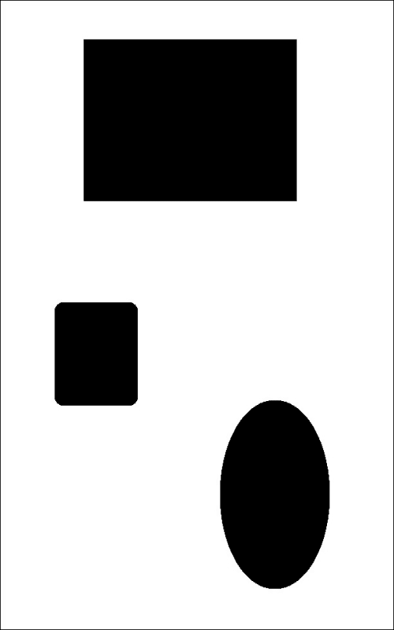

如果你看看前面的物体，有趣区域的内部部分是“无趣”的。

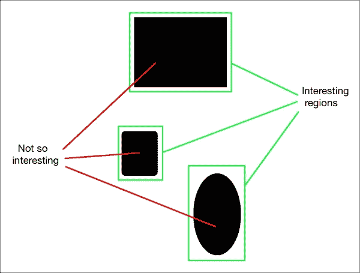

因此，如果我们想要描述这个物体，我们需要确保我们选择了有趣点。现在，我们如何定义“有趣点”？我们能否说任何不是无趣的东西都可以是有趣点？让我们考虑以下例子：

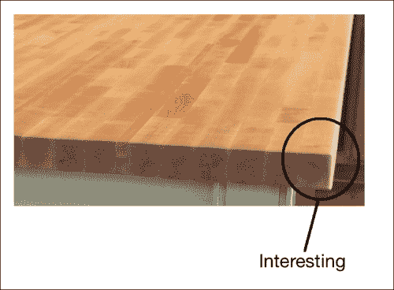

现在，我们可以看到在这张图像的边缘有很多高频内容。但我们不能把整个边缘称为“有趣”。重要的是要理解，“有趣”不一定是指颜色或强度值。它可以是指任何东西，只要它是独特的。我们需要隔离其邻域中独特的点。沿着边缘的点相对于其邻居来说并不独特。所以，现在我们知道我们要找什么了，我们如何选择一个有趣点？

那么桌角的角落呢？那很吸引人，对吧？它相对于其邻居是独特的，并且在其附近我们没有类似的东西。现在这个点可以被选为我们中的一个关键点。我们选取这些关键点来描述特定的图像。

当我们进行图像分析时，在推导出任何东西之前，我们需要将其转换为数值形式。这些关键点使用数值形式和这些关键点的组合来创建图像签名。我们希望这个图像签名以最佳方式代表给定的图像。

# 检测角落

由于我们知道角点是“有趣的”，让我们看看我们如何检测它们。在计算机视觉中，有一个流行的角点检测技术叫做**Harris 角点检测器**。我们基本上基于灰度图像的偏导数构建一个 2x2 矩阵，然后分析特征值。这实际上是对实际算法的过度简化，但它涵盖了要点。所以，如果你想了解背后的数学细节，你可以查阅 Harris 和 Stephens 在[`www.bmva.org/bmvc/1988/avc-88-023.pdf`](http://www.bmva.org/bmvc/1988/avc-88-023.pdf)上发表的原始论文。一个角点是两个特征值都应有较大值的点。

让我们考虑以下图像：

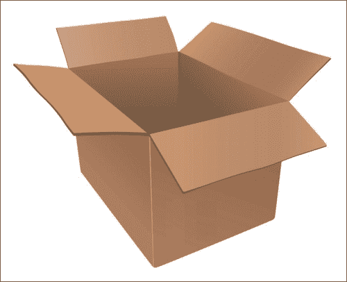

如果你在这个图像上运行 Harris 角点检测器，你会看到如下情况：

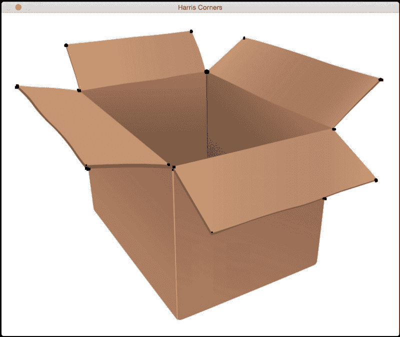

如你所见，所有的黑色点都对应于图像中的角点。如果你注意到，盒底部的角点没有被检测到。原因是这些角点不够尖锐。你可以在角点检测器中调整阈值来识别这些角点。执行此操作的代码如下：

```py
import cv2
import numpy as np

img = cv2.imread('box.jpg')
gray = cv2.cvtColor(img,cv2.COLOR_BGR2GRAY)

gray = np.float32(gray)

dst = cv2.cornerHarris(gray, 4,5, 0.04)      # to detect only sharp corners
#dst = cv2.cornerHarris(gray, 14, 5, 0.04)    # to detect soft corners

# Result is dilated for marking the corners
dst = cv2.dilate(dst,None)

# Threshold for an optimal value, it may vary depending on the image.
img[dst > 0.01*dst.max()] = [0,0,0]

cv2.imshow('Harris Corners',img)
cv2.waitKey()
```

# 好的特征追踪

Harris 角点检测器在许多情况下表现良好，但它遗漏了一些东西。在 Harris 和 Stephens 的原始论文发表后的六年左右，Shi-Tomasi 提出了一种更好的角点检测器。你可以在[`www.ai.mit.edu/courses/6.891/handouts/shi94good.pdf`](http://www.ai.mit.edu/courses/6.891/handouts/shi94good.pdf)上阅读原始论文。他们使用不同的评分函数来提高整体质量。使用这种方法，我们可以在给定的图像中找到“N”个最强的角点。当我们不想使用图像中的每一个角点来提取信息时，这非常有用。

如果你将 Shi-Tomasi 角点检测器应用于前面显示的图像，你会看到如下情况：

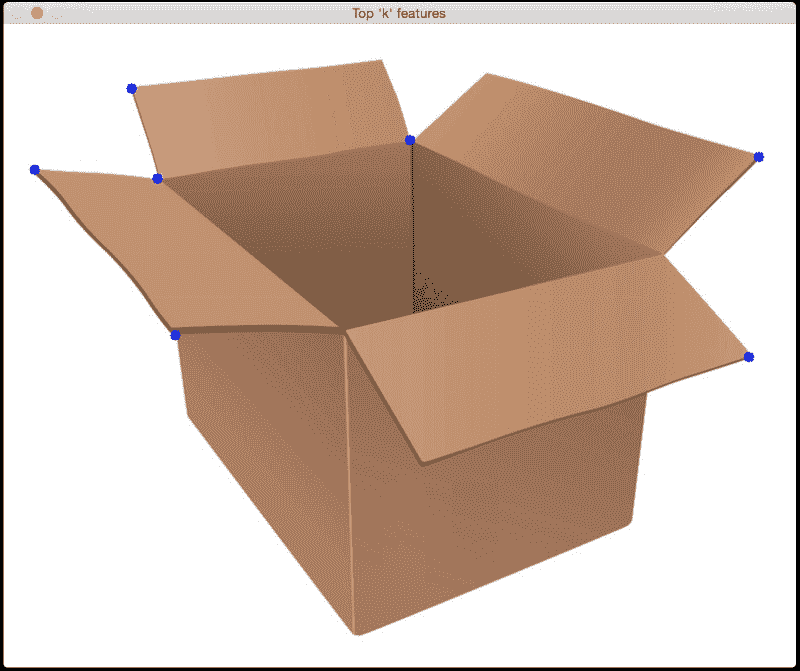

以下代码：

```py
import cv2
import numpy as np

img = cv2.imread('box.jpg')
gray = cv2.cvtColor(img,cv2.COLOR_BGR2GRAY)

corners = cv2.goodFeaturesToTrack(gray, 7, 0.05, 25)
corners = np.float32(corners)

for item in corners:
    x, y = item[0]
    cv2.circle(img, (x,y), 5, 255, -1)

cv2.imshow("Top 'k' features", img)
cv2.waitKey()
```

# 尺度不变特征变换（SIFT）

尽管角点特征是“有趣的”，但它们不足以表征真正有趣的部分。当我们谈论图像内容分析时，我们希望图像签名对诸如尺度、旋转、光照等因素保持不变。人类在这些方面非常擅长。即使我给你看一个颠倒且昏暗的苹果图像，你仍然能认出它。如果我给你看这个图像的放大版本，你仍然能认出它。我们希望我们的图像识别系统能够做到同样的事情。

让我们考虑角点特征。如果你放大一个图像，一个角点可能就不再是角点了，如下所示。

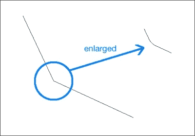

在第二种情况下，检测器将不会检测到这个角落。由于它在原始图像中被检测到，因此第二个图像将不会与第一个图像匹配。这基本上是同一张图像，但基于角落特征的算法将完全错过它。这意味着角落检测器并不完全具有尺度不变性。这就是为什么我们需要一个更好的方法来表征图像。

SIFT 是计算机视觉中最受欢迎的算法之一。您可以在[`www.cs.ubc.ca/~lowe/papers/ijcv04.pdf`](http://www.cs.ubc.ca/~lowe/papers/ijcv04.pdf)阅读 David Lowe 的原始论文。我们可以使用这个算法来提取关键点和构建相应的特征描述符。网上有大量的良好文档，因此我们将简要讨论。为了识别一个潜在的关键点，SIFT 通过下采样图像并计算高斯差分来构建一个金字塔。这意味着我们在金字塔的每个级别上运行高斯滤波器，并取差分来构建金字塔的连续级别。为了确定当前点是否为关键点，它不仅查看邻居，还查看金字塔相邻级别中相同位置的像素。如果是最大值，则当前点被选中作为关键点。这确保了我们的关键点具有尺度不变性。

现在我们知道了它是如何实现尺度不变性的，让我们看看它是如何实现旋转不变性的。一旦我们确定了关键点，每个关键点都会被分配一个方向。我们取每个关键点周围的邻域，并计算梯度幅度和方向。这给我们一个关于该关键点方向的感觉。如果我们有这些信息，我们甚至可以在旋转的情况下将这个关键点与另一张图像中的相同点匹配。由于我们知道方向，我们将在比较之前对这些关键点进行归一化。

一旦我们有了所有这些信息，我们如何量化它？我们需要将其转换为一系列数字，以便我们可以对其进行某种匹配。为了实现这一点，我们只需取每个关键点周围的 16x16 邻域，并将其分成 16 个 4x4 大小的块。对于每个块，我们使用 8 个桶计算方向直方图。因此，我们与每个块相关联的向量长度为 8，这意味着邻域由一个大小为 128（8x16）的向量表示。这是最终将使用的关键点描述符。如果我们从一个图像中提取`N`个关键点，那么我们将有`N`个长度为 128 的描述符。这个`N`个描述符的数组表征了给定的图像。

考虑以下图像：

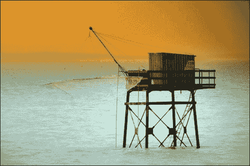

如果您使用 SIFT 提取关键点位置，您将看到如下所示的内容，其中圆圈的大小表示关键点的强度，圆圈内的线条表示方向：

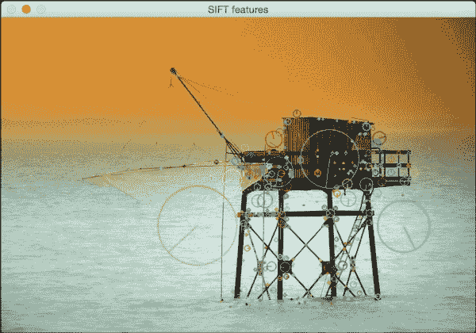

在我们查看代码之前，重要的是要知道 SIFT 是受专利保护的，并且它不能免费用于商业用途。以下是如何实现的代码：

```py
import cv2
import numpy as np

input_image = cv2.imread('input.jpg')
gray_image = cv2.cvtColor(input_image, cv2.COLOR_BGR2GRAY)

sift = cv2.SIFT()
keypoints = sift.detect(gray_image, None)

input_image = cv2.drawKeypoints(input_image, keypoints, flags=cv2.DRAW_MATCHES_FLAGS_DRAW_RICH_KEYPOINTS)

cv2.imshow('SIFT features', input_image)
cv2.waitKey()
```

我们也可以计算描述符。OpenCV 让我们可以单独计算，或者我们可以通过使用以下方法将检测和计算部分合并到同一步骤中：

```py
keypoints, descriptors = sift.detectAndCompute(gray_image, None)
```

# 加速鲁棒特征（SURF）

尽管 SIFT 很好用且很有用，但它计算量很大。这意味着它很慢，如果我们使用 SIFT 来实现实时系统，我们将遇到困难。我们需要一个既快又具有 SIFT 所有优点的系统。如果你还记得，SIFT 使用高斯差分来构建金字塔，这个过程很慢。因此，为了克服这一点，SURF 使用简单的盒式滤波器来近似高斯。好事是这很容易计算，而且速度相当快。关于 SURF，网上有很多文档，可以在[`opencv-python-tutroals.readthedocs.org/en/latest/py_tutorials/py_feature2d/py_surf_intro/py_surf_intro.html?highlight=surf`](http://opencv-python-tutroals.readthedocs.org/en/latest/py_tutorials/py_feature2d/py_surf_intro/py_surf_intro.html?highlight=surf)找到。因此，你可以阅读它，看看他们是如何构建描述符的。你可以参考原始论文[`www.vision.ee.ethz.ch/~surf/eccv06.pdf`](http://www.vision.ee.ethz.ch/~surf/eccv06.pdf)。重要的是要知道 SURF 也是受专利保护的，并且它不能免费用于商业用途。

如果你运行 SURF 关键点检测器在之前的图像上，你会看到如下所示的一个：

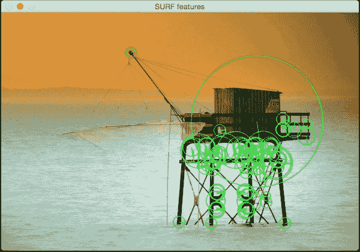

下面是代码：

```py
import cv2
import numpy as np

img = cv2.imread('input.jpg')
gray= cv2.cvtColor(img, cv2.COLOR_BGR2GRAY)

surf = cv2.SURF()

# This threshold controls the number of keypoints
surf.hessianThreshold = 15000

kp, des = surf.detectAndCompute(gray, None)

img = cv2.drawKeypoints(img, kp, None, (0,255,0), 4)

cv2.imshow('SURF features', img)
cv2.waitKey()
```

# 加速分割测试（FAST）特征

尽管 SURF 比 SIFT 快，但它对于实时系统来说还不够快，尤其是在资源受限的情况下。当你在一个移动设备上构建实时应用程序时，你不会有使用 SURF 进行实时计算的自由。我们需要的是真正快且计算成本低的系统。因此，Rosten 和 Drummond 提出了 FAST。正如其名所示，它真的很快！

他们没有通过所有昂贵的计算，而是提出了一种高速测试方法，以快速确定当前点是否是一个潜在的关键点。我们需要注意的是，FAST 仅用于关键点检测。一旦检测到关键点，我们需要使用 SIFT 或 SURF 来计算描述符。考虑以下图像：

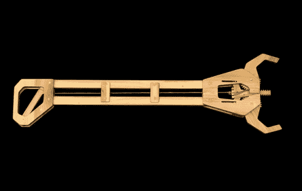

如果我们在该图像上运行 FAST 关键点检测器，你会看到如下内容：

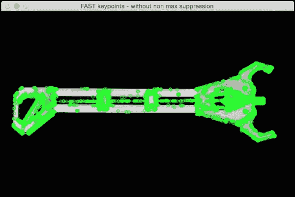

如果我们清理并抑制不重要的关键点，它看起来会是这样：

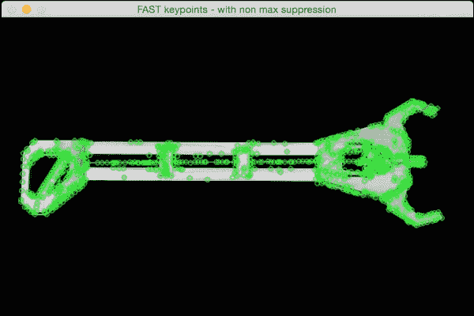

下面是这个的代码：

```py
import cv2
import numpy as np

gray_image = cv2.imread('input.jpg', 0)

fast = cv2.FastFeatureDetector()

# Detect keypoints
keypoints = fast.detect(gray_image, None)
print "Number of keypoints with non max suppression:", len(keypoints)

# Draw keypoints on top of the input image
img_keypoints_with_nonmax = cv2.drawKeypoints(gray_image, keypoints, color=(0,255,0))
cv2.imshow('FAST keypoints - with non max suppression', img_keypoints_with_nonmax)

# Disable nonmaxSuppression
fast.setBool('nonmaxSuppression', False)

# Detect keypoints again
keypoints = fast.detect(gray_image, None)

print "Total Keypoints without nonmaxSuppression:", len(keypoints)

# Draw keypoints on top of the input image
img_keypoints_without_nonmax = cv2.drawKeypoints(gray_image, keypoints, color=(0,255,0))
cv2.imshow('FAST keypoints - without non max suppression', img_keypoints_without_nonmax)
cv2.waitKey()
```

# 二进制鲁棒独立基本特征（BRIEF）

尽管我们有 FAST 来快速检测关键点，但我们仍然需要使用 SIFT 或 SURF 来计算描述符。我们需要一种快速计算描述符的方法。这就是 BRIEF 发挥作用的地方。BRIEF 是一种提取特征描述符的方法。它本身不能检测关键点，因此我们需要与关键点检测器一起使用它。BRIEF 的好处是它紧凑且快速。

考虑以下图像：

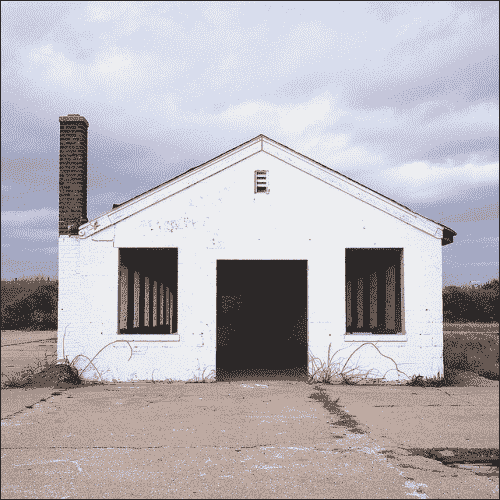

BRIEF 算法接收输入的关键点列表并输出一个更新后的列表。因此，如果你在这个图像上运行 BRIEF 算法，你会看到类似以下的内容：

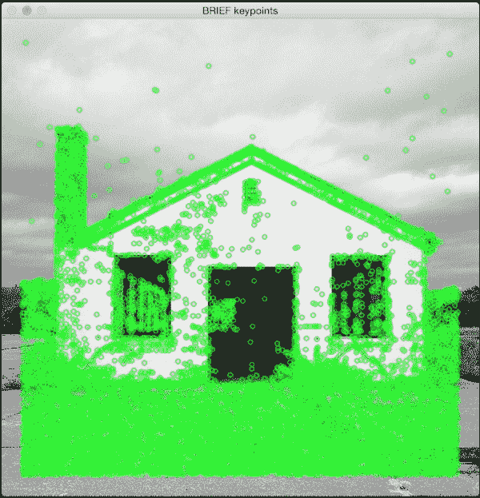

下面是代码：

```py
import cv2

import numpy as np

gray_image = cv2.imread('input.jpg', 0)

# Initiate FAST detector
fast = cv2.FastFeatureDetector()

# Initiate BRIEF extractor
brief = cv2.DescriptorExtractor_create("BRIEF")

# find the keypoints with STAR
keypoints = fast.detect(gray_image, None)

# compute the descriptors with BRIEF
keypoints, descriptors = brief.compute(gray_image, keypoints)

gray_keypoints = cv2.drawKeypoints(gray_image, keypoints, color=(0,255,0))
cv2.imshow('BRIEF keypoints', gray_keypoints)
cv2.waitKey()
```

# 定向快速旋转 BRIEF (ORB)

因此，现在我们已经到达了迄今为止讨论的所有组合中最好的组合。这个算法来自 OpenCV 实验室。它快速、鲁棒且开源！SIFT 和 SURF 算法都是受专利保护的，你不能用于商业目的。这就是为什么 ORB 在很多方面都是好的。

如果你运行前面显示的图像之一的 ORB 关键点提取器，你会看到类似以下的内容：

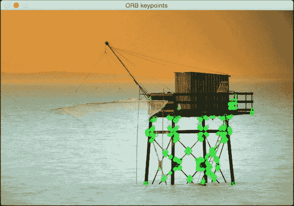

下面是代码：

```py
import cv2
import numpy as np

input_image = cv2.imread('input.jpg')
gray_image = cv2.cvtColor(input_image, cv2.COLOR_BGR2GRAY)

# Initiate ORB object
orb = cv2.ORB()

# find the keypoints with ORB
keypoints = orb.detect(gray_image, None)

# compute the descriptors with ORB
keypoints, descriptors = orb.compute(gray_image, keypoints)

# draw only the location of the keypoints without size or orientation
final_keypoints = cv2.drawKeypoints(input_image, keypoints, color=(0,255,0), flags=0)

cv2.imshow('ORB keypoints', final_keypoints)
cv2.waitKey()
```

# 摘要

在本章中，我们学习了关键点的重要性以及为什么我们需要它们。我们讨论了各种检测关键点和计算特征描述符的算法。我们将在后续的所有章节中，以不同的背景使用这些算法。关键点的概念在计算机视觉中处于核心地位，并在许多现代系统中发挥着重要作用。

在下一章中，我们将讨论如何将同一场景的多个图像拼接在一起以创建全景图像。
