# 第六章：创建全景图像

在本章中，我们将学习如何将同一场景的多个图像拼接在一起以创建全景图像。

到本章结束时，你将知道：

+   如何在多张图像之间匹配关键点描述符

+   如何在图像之间找到重叠区域

+   如何基于匹配的关键点进行图像变换

+   如何将多个图像拼接在一起创建全景图像

# 匹配关键点描述符

在上一章中，我们学习了如何使用各种方法提取关键点。我们提取关键点的原因在于我们可以使用它们进行图像匹配。让我们考虑以下图像：

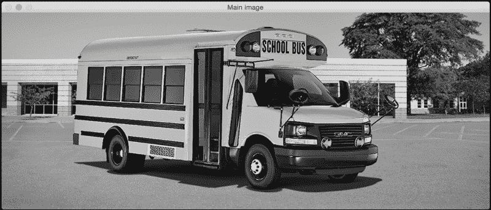

如你所见，这是校车的图片。现在，让我们看一下以下图像：

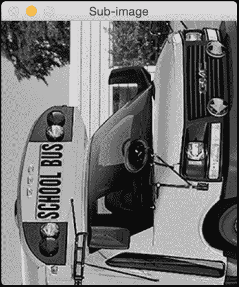

上一张图像是校车图像的一部分，并且已经逆时针旋转了 90 度。我们很容易就能识别出来，因为我们的大脑对缩放和旋转是不变的。我们的目标是找到这两张图像之间的匹配点。如果你这样做，它看起来可能就像这样：

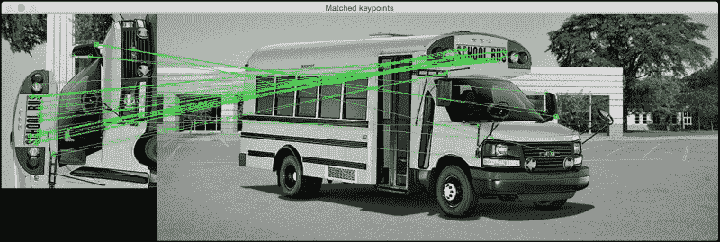

以下代码用于执行此操作：

```py
import sys

import cv2
import numpy as np

def draw_matches(img1, keypoints1, img2, keypoints2, matches):
    rows1, cols1 = img1.shape[:2]
    rows2, cols2 = img2.shape[:2]

    # Create a new output image that concatenates the two images together
    output_img = np.zeros((max([rows1,rows2]), cols1+cols2, 3), dtype='uint8')
    output_img[:rows1, :cols1, :] = np.dstack([img1, img1, img1])
    output_img[:rows2, cols1:cols1+cols2, :] = np.dstack([img2, img2, img2])

    # Draw connecting lines between matching keypoints
    for match in matches:
        # Get the matching keypoints for each of the images
        img1_idx = match.queryIdx
        img2_idx = match.trainIdx

        (x1, y1) = keypoints1[img1_idx].pt
        (x2, y2) = keypoints2[img2_idx].pt

        # Draw a small circle at both co-ordinates and then draw a line
        radius = 4
        colour = (0,255,0)   # green
        thickness = 1
        cv2.circle(output_img, (int(x1),int(y1)), radius, colour, thickness)
        cv2.circle(output_img, (int(x2)+cols1,int(y2)), radius, colour, thickness)
        cv2.line(output_img, (int(x1),int(y1)), (int(x2)+cols1,int(y2)), colour, thickness)

    return output_img

if __name__=='__main__':
    img1 = cv2.imread(sys.argv[1], 0)   # query image (rotated subregion)
    img2 = cv2.imread(sys.argv[2], 0)   # train image (full image)

    # Initialize ORB detector
    orb = cv2.ORB()

    # Extract keypoints and descriptors
    keypoints1, descriptors1 = orb.detectAndCompute(img1, None)
    keypoints2, descriptors2 = orb.detectAndCompute(img2, None)

    # Create Brute Force matcher object
    bf = cv2.BFMatcher(cv2.NORM_HAMMING, crossCheck=True)

    # Match descriptors
    matches = bf.match(descriptors1, descriptors2)

    # Sort them in the order of their distance
    matches = sorted(matches, key = lambda x:x.distance)

    # Draw first 'n' matches
    img3 = draw_matches(img1, keypoints1, img2, keypoints2, matches[:30])

    cv2.imshow('Matched keypoints', img3)
    cv2.waitKey()
```

## 我们是如何匹配关键点的？

在前面的代码中，我们使用了 ORB 检测器来提取关键点。一旦提取了关键点，我们就使用暴力匹配器来匹配描述符。暴力匹配非常直接！对于第一张图像中的每个描述符，我们将其与第二张图像中的每个描述符进行匹配，并取最近的那个。为了计算最近的描述符，我们使用汉明距离作为度量标准，如下所示：

```py
bf = cv2.BFMatcher(cv2.NORM_HAMMING, crossCheck=True)
```

你可以在[`en.wikipedia.org/wiki/Hamming_distance`](https://en.wikipedia.org/wiki/Hamming_distance)上了解更多关于汉明距离的信息。上一行中的第二个参数是一个布尔变量。如果这是真的，那么匹配器将只返回在两个方向上彼此最接近的关键点。这意味着如果我们得到(i, j)作为匹配，那么我们可以确信第一张图像中的第 i 个描述符是第二张图像中第 j 个描述符的最近匹配，反之亦然。这增加了描述符匹配的一致性和鲁棒性。

## 理解匹配器对象

让我们再次考虑以下行：

```py
matches = bf.match(descriptors1, descriptors2)
```

这里，变量 matches 是一个 DMatch 对象的列表。你可以在 OpenCV 文档中了解更多关于它的信息。我们只需要快速理解它的含义，因为它将在接下来的章节中变得越来越重要。如果我们正在遍历这个 DMatch 对象的列表，那么每个项目将具有以下属性：

+   **item.distance**：此属性给出了描述符之间的距离。距离越低，匹配越好。

+   **item.trainIdx**：这个属性给出了训练描述符列表中的索引（在我们的情况下，它是完整图像中的描述符列表）。

+   **item.queryIdx**：这个属性给出了查询描述符列表中的索引（在我们的情况下，它是旋转子图像中的描述符列表）。

+   **item.imgIdx**：这个属性给出了训练图像的索引。

## 绘制匹配的关键点

现在我们已经知道了如何访问匹配器对象的不同属性，让我们看看如何使用它们来绘制匹配的关键点。OpenCV 3.0 提供了一个直接绘制匹配关键点的函数，但我们将不会使用它。最好看看内部发生了什么。

我们需要创建一个大的输出图像，可以容纳两张并排的图像。因此，我们在以下行中这样做：

```py
output_img = np.zeros((max([rows1,rows2]), cols1+cols2, 3), dtype='uint8')
```

如我们所见，行数设置为两个值中较大的一个，列数是这两个值的总和。对于匹配列表中的每个项目，我们提取匹配关键点的位置，如下所示：

```py
(x1, y1) = keypoints1[img1_idx].pt
(x2, y2) = keypoints2[img2_idx].pt
```

一旦我们这样做，我们只需在这些点上画圆圈来指示它们的位置，然后画一条连接两个点的线。

# 创建全景图像

现在我们已经知道了如何匹配关键点，让我们继续看看如何将多张图像拼接在一起。考虑以下图像：

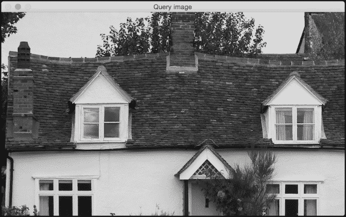

假设我们想要将以下图像与前面的图像拼接起来：

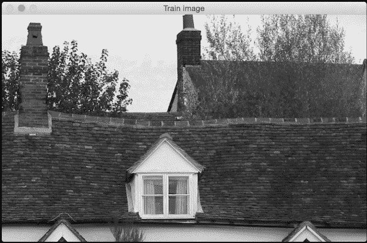

如果我们将这些图像拼接起来，它看起来会像以下这样：

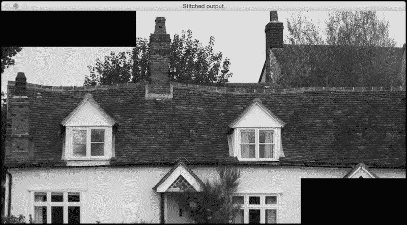

现在假设我们捕捉到了这个房子的另一部分，如下面的图像所示：

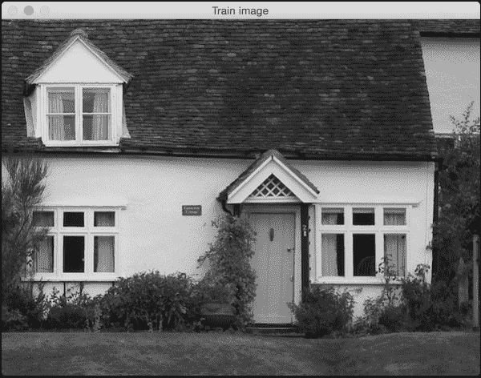

如果我们将前面的图像与之前看到的拼接图像拼接起来，它看起来会像这样：

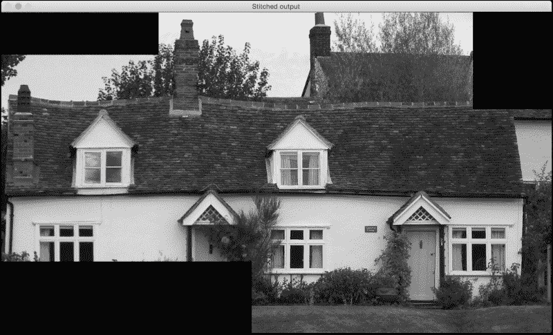

我们可以将图像拼接在一起以创建一个漂亮的全景图像。让我们看看代码：

```py
import sys
import argparse

import cv2
import numpy as np

def argument_parser():
    parser = argparse.ArgumentParser(description='Stitch two images together')
    parser.add_argument("--query-image", dest="query_image", required=True,
            help="First image that needs to be stitched")
    parser.add_argument("--train-image", dest="train_image", required=True,
            help="Second image that needs to be stitched")
    parser.add_argument("--min-match-count", dest="min_match_count", type=int,
            required=False, default=10, help="Minimum number of matches required")
    return parser

# Warp img2 to img1 using the homography matrix H
def warpImages(img1, img2, H):
    rows1, cols1 = img1.shape[:2]
    rows2, cols2 = img2.shape[:2]

    list_of_points_1 = np.float32([[0,0], [0,rows1], [cols1,rows1], [cols1,0]]).reshape(-1,1,2)
    temp_points = np.float32([[0,0], [0,rows2], [cols2,rows2], [cols2,0]]).reshape(-1,1,2)
    list_of_points_2 = cv2.perspectiveTransform(temp_points, H)
    list_of_points = np.concatenate((list_of_points_1, list_of_points_2), axis=0)

    [x_min, y_min] = np.int32(list_of_points.min(axis=0).ravel() - 0.5)
    [x_max, y_max] = np.int32(list_of_points.max(axis=0).ravel() + 0.5)
    translation_dist = [-x_min,-y_min]
    H_translation = np.array([[1, 0, translation_dist[0]], [0, 1, translation_dist[1]], [0,0,1]])

    output_img = cv2.warpPerspective(img2, H_translation.dot(H), (x_max-x_min, y_max-y_min))
    output_img[translation_dist[1]:rows1+translation_dist[1], translation_dist[0]:cols1+translation_dist[0]] = img1

    return output_img

if __name__=='__main__':
    args = argument_parser().parse_args()
    img1 = cv2.imread(args.query_image, 0)
    img2 = cv2.imread(args.train_image, 0)
    min_match_count = args.min_match_count

    cv2.imshow('Query image', img1)
    cv2.imshow('Train image', img2)

    # Initialize the SIFT detector
    sift = cv2.SIFT()

    # Extract the keypoints and descriptors
    keypoints1, descriptors1 = sift.detectAndCompute(img1, None)
    keypoints2, descriptors2 = sift.detectAndCompute(img2, None)

    # Initialize parameters for Flann based matcher
    FLANN_INDEX_KDTREE = 0
    index_params = dict(algorithm = FLANN_INDEX_KDTREE, trees = 5)
    search_params = dict(checks = 50)

    # Initialize the Flann based matcher object
    flann = cv2.FlannBasedMatcher(index_params, search_params)

    # Compute the matches
    matches = flann.knnMatch(descriptors1, descriptors2, k=2)

    # Store all the good matches as per Lowe's ratio test
    good_matches = []
    for m1,m2 in matches:
        if m1.distance < 0.7*m2.distance:
            good_matches.append(m1)

    if len(good_matches) > min_match_count:
        src_pts = np.float32([ keypoints1[good_match.queryIdx].pt for good_match in good_matches ]).reshape(-1,1,2)
        dst_pts = np.float32([ keypoints2[good_match.trainIdx].pt for good_match in good_matches ]).reshape(-1,1,2)

        M, mask = cv2.findHomography(src_pts, dst_pts, cv2.RANSAC, 5.0)
        result = warpImages(img2, img1, M)
        cv2.imshow('Stitched output', result)

        cv2.waitKey()

    else:
        print "We don't have enough number of matches between the two images."
        print "Found only %d matches. We need at least %d matches." % (len(good_matches), min_match_count)
```

## 寻找重叠区域

这里的目标是找到匹配的关键点，以便我们可以将图像拼接在一起。因此，第一步是获取这些匹配的关键点。如前所述，我们使用关键点检测器提取关键点，然后使用基于 Flann 的匹配器匹配关键点。

### 注意

你可以在[`citeseerx.ist.psu.edu/viewdoc/download?doi=10.1.1.192.5378&rep=rep1&type=pdf`](http://citeseerx.ist.psu.edu/viewdoc/download?doi=10.1.1.192.5378&rep=rep1&type=pdf)了解更多关于 Flann 的信息。

基于 Flann 的匹配器比 Brute Force 匹配更快，因为它不需要将每个点与其他列表上的每个点进行比较。它只考虑当前点的邻域来获取匹配的关键点，从而使其更高效。

一旦我们得到了匹配关键点的列表，我们使用 Lowe 的比率测试来只保留强匹配。David Lowe 提出了这个比率测试，目的是为了提高 SIFT 的鲁棒性。

### 注意

你可以在[`www.cs.ubc.ca/~lowe/papers/ijcv04.pdf`](http://www.cs.ubc.ca/~lowe/papers/ijcv04.pdf)了解更多相关信息。

基本上，当我们匹配关键点时，我们会拒绝那些到最近邻和第二近邻的距离比大于某个特定阈值的匹配。这有助于我们丢弃不够独特的点。因此，我们在这里使用这个概念来只保留好的匹配并丢弃其余的。如果我们没有足够的匹配，我们不会进一步操作。在我们的情况下，默认值是 10。你可以尝试调整这个输入参数，看看它如何影响输出。

如果我们有足够的匹配数，那么我们将在两张图像中提取关键点的列表并提取单应性矩阵。如果你还记得，我们在第一章中已经讨论了单应性。所以如果你已经忘记了，你可能想快速浏览一下。我们基本上从两张图像中取出一组点并提取变换矩阵。

## 图像拼接

现在我们有了变换，我们可以继续拼接图像。我们将使用变换矩阵来变换第二组点。我们将第一张图像作为参考框架，创建一个足够大的输出图像来容纳这两张图像。我们需要提取关于第二图像变换的信息。我们需要将其移动到这个参考框架中，以确保它与第一张图像对齐。因此，我们必须提取平移信息并进行变换。然后我们将第一张图像添加进去，构建最终的输出。值得一提的是，这同样适用于不同宽高比的图像。所以，如果你有机会，尝试一下，看看输出是什么样子。

# 如果图像彼此成角度怎么办？

到目前为止，我们一直在看同一平面上的图像。拼接这些图像是直接的，我们不需要处理任何伪影。在现实生活中，你不可能在完全相同的平面上捕捉到多张图像。当你捕捉同一场景的多张图像时，你不可避免地会倾斜相机并改变平面。所以问题是，我们的算法在那个场景下是否也能工作？实际上，它也能处理这些情况。

让我们考虑以下图像：

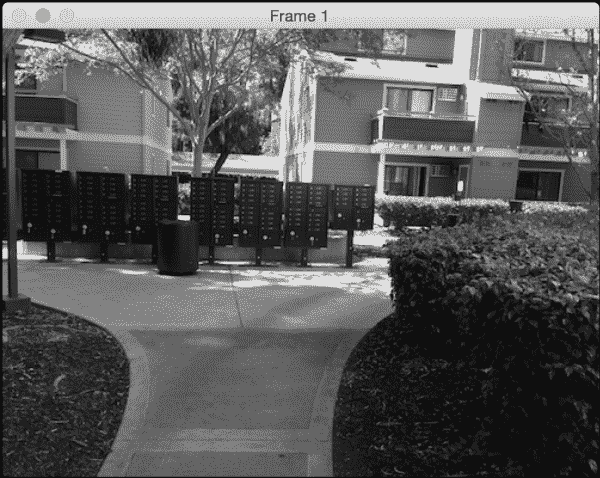

现在，让我们考虑同一场景的另一张图像。它与第一张图像成一定角度，并且部分重叠：

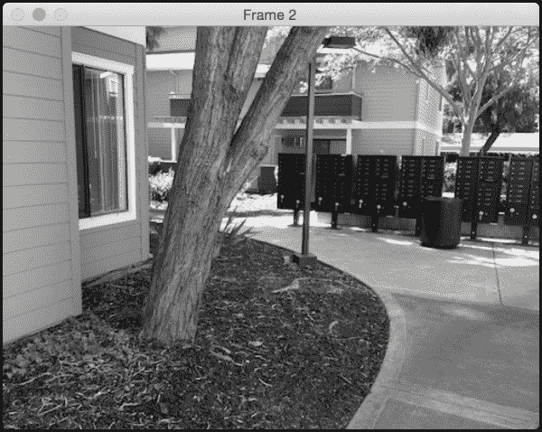

让我们将第一张图像作为我们的参考。如果我们使用我们的算法拼接这些图像，它看起来可能就像这样：

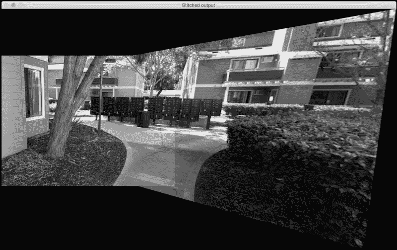

如果我们将第二幅图像作为参考，它看起来可能就像这样：

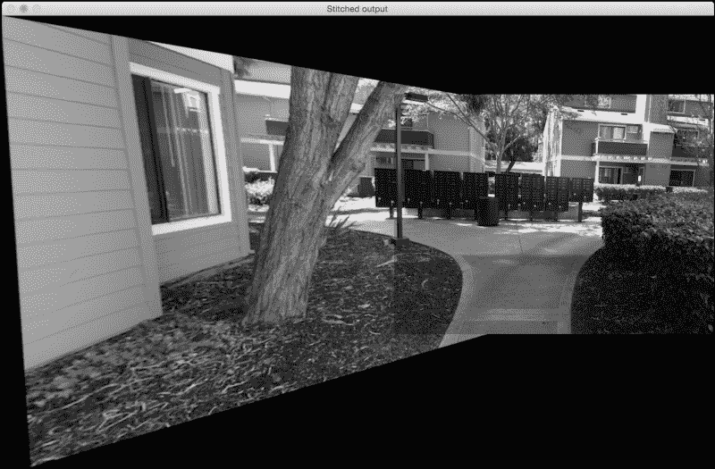

## 为什么看起来被拉伸了？

如果你观察，输出图像中对应查询图像的部分看起来被拉伸了。这是因为查询图像被转换并调整以适应我们的参考框架。它看起来被拉伸的原因是因为我们代码中的以下几行：

```py
M, mask = cv2.findHomography(src_pts, dst_pts, cv2.RANSAC, 5.0)
result = warpImages(img2, img1, M)
```

由于图像彼此之间成角度，查询图像将不得不进行透视变换以适应参考框架。因此，我们首先对查询图像进行变换，然后将其拼接进主图像中，以形成全景图像。

# 摘要

在本章中，我们学习了如何在多张图像之间匹配关键点。我们讨论了如何将多张图像拼接在一起以创建全景图像。我们学习了如何处理不在同一平面上的图像。

在下一章中，我们将讨论如何通过检测图像中的“有趣”区域来实现内容感知图像缩放。
