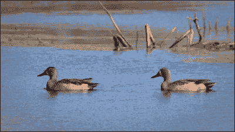
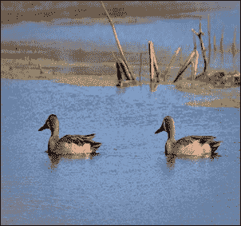
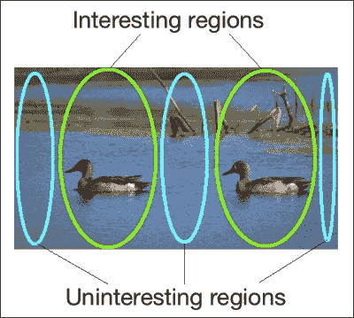
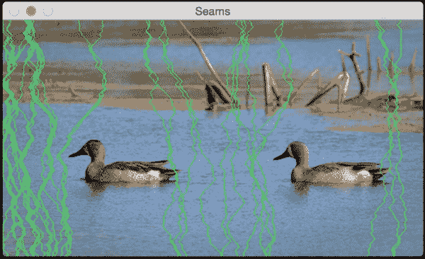
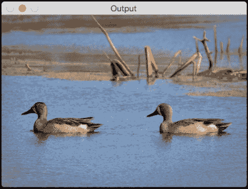
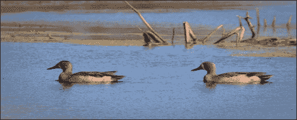
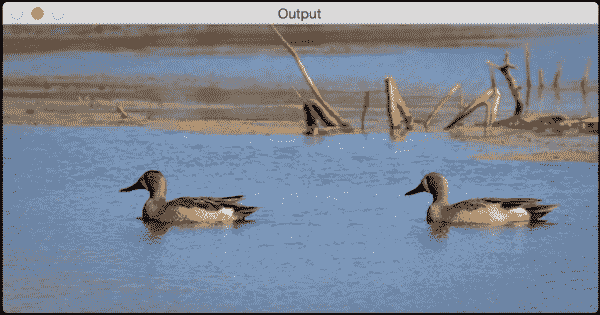
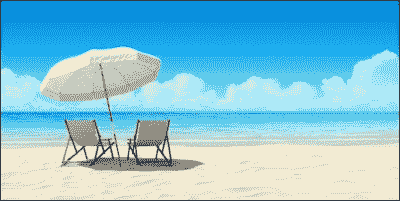
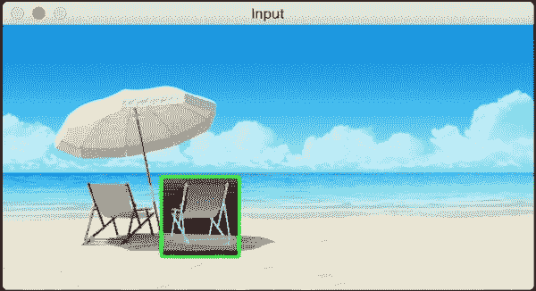
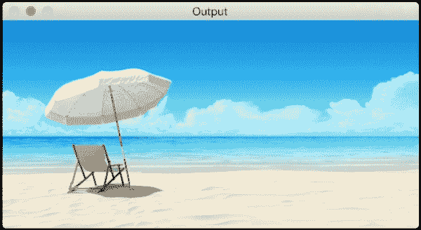

# 第七章. 接缝裁剪

在本章中，我们将学习关于内容感知图像缩放，这通常也被称为接缝裁剪。我们将讨论如何检测图像中的“有趣”部分，以及如何利用这些信息在不损害这些有趣部分的情况下调整给定图像的大小。

到本章结束时，您将了解：

+   什么是内容感知

+   如何量化图像中的“有趣”部分

+   如何使用动态规划进行图像内容分析

+   如何在不改变高度的情况下增加和减少图像宽度，同时保持有趣区域不退化

+   如何从图像中移除对象

# 我们为什么关心接缝裁剪？

在我们开始讨论接缝裁剪之前，我们需要了解为什么它最初是必要的。为什么我们应该关心图像内容？为什么我们不能只是调整给定图像的大小，然后继续我们的生活呢？为了回答这个问题，让我们考虑以下图像：



现在，假设我们想要在保持高度不变的情况下减少图像的宽度。如果你这样做，它看起来可能就像这样：



如您所见，图像中的鸭子看起来是倾斜的，整体图像质量有所下降。直观地说，我们可以认为鸭子是图像中的“有趣”部分。因此，当我们调整图像大小时，我们希望鸭子保持完整。这就是接缝裁剪发挥作用的地方。使用接缝裁剪，我们可以检测这些有趣区域，并确保它们不会退化。

# 它是如何工作的？

我们一直在讨论图像缩放以及我们在缩放图像时应考虑图像的内容。那么，为什么它被称为接缝裁剪呢？它应该只是被称为内容感知图像缩放，对吧？嗯，有许多不同的术语用来描述这个过程，例如图像重定位、液体缩放、接缝裁剪等等。它被称为接缝裁剪的原因是因为我们调整图像的方式。该算法由 Shai Avidan 和 Ariel Shamir 提出。您可以在[`dl.acm.org/citation.cfm?id=1276390`](http://dl.acm.org/citation.cfm?id=1276390)查阅原始论文。

我们知道目标是调整给定图像的大小，同时保持有趣内容完整。因此，我们通过找到图像中最重要的路径来实现这一点。这些路径被称为接缝。一旦我们找到这些接缝，我们就从图像中移除它们，以获得缩放后的图像。这个过程，即移除或“裁剪”，最终会导致图像大小的调整。这就是我们称之为“接缝裁剪”的原因。考虑以下图像：



在前面的图像中，我们可以看到如何大致地将图像分为有趣和无趣的部分。我们需要确保我们的算法能够检测这些无趣的部分并将它们移除。让我们考虑鸭子图像和我们必须处理的约束条件。我们需要保持高度不变。这意味着我们需要在图像中找到垂直缝合线并将它们移除。这些缝合线从顶部开始，到顶部结束（或反之亦然）。如果我们处理的是垂直缩放，那么缝合线将从左侧开始，到右侧结束。垂直缝合线只是一系列从顶部行开始，到图像最后一行结束的连接像素。

# 我们如何定义“有趣”？

在我们开始计算缝合线之前，我们需要确定我们将使用什么度量标准来计算这些缝合线。我们需要一种方法来为每个像素分配“重要性”，以便我们可以找到最不重要的路径。在计算机视觉术语中，我们说我们需要为每个像素分配一个能量值，以便我们可以找到能量最低的路径。想出一个好的方法来分配能量值非常重要，因为它将影响输出的质量。

我们可以使用的一个度量标准是每个点的导数值。这是该邻域活动水平的好指标。如果有活动，那么像素值会迅速变化。因此，该点的导数值会很高。另一方面，如果该区域平淡无趣，那么像素值不会迅速变化。因此，在灰度图像中该点的导数值会很低。

对于每个像素位置，我们通过计算该点的 X 和 Y 导数来计算能量。我们通过取当前像素与其邻居之间的差来计算导数。如果你还记得，当我们使用**索贝尔滤波器**在第二章中进行边缘检测时，我们做了类似的事情，*检测边缘和应用图像滤波器*。一旦我们计算了这些值，我们就将它们存储在一个称为能量矩阵的矩阵中。

# 我们如何计算缝合线？

现在我们已经得到了能量矩阵，我们准备计算缝合线。我们需要找到通过图像中能量最低的路径。计算所有可能的路径代价过高，因此我们需要找到一种更智能的方法来完成这项工作。这正是动态规划发挥作用的地方。实际上，缝合线裁剪是动态编程的直接应用。我们需要从第一行的每个像素开始，找到到达最后一行的路径。为了找到能量最低的路径，我们在一个表中计算并存储到达每个像素的最佳路径。一旦我们构建了这个表，就可以通过在该表中回溯行来找到特定像素的路径。

对于当前行的每个像素，我们计算下一个行中可以移动到的三个可能像素位置的能量，即左下角、底部和右下角。我们重复这个过程，直到到达底部。一旦到达底部，我们选择累积值最小的一个，然后回溯到顶部。这将给我们提供最低能量的路径。每次我们移除一个接缝，图像的宽度就会减少`1`。因此，我们需要继续移除这些接缝，直到达到所需的图像大小。

让我们再次考虑我们的鸭子图像。如果你计算前 30 个接缝，它看起来会像这样：



这些绿色线条表示的是最不重要的路径。正如我们在这里看到的，它们小心翼翼地绕过鸭子，以确保不会触及有趣区域。在图像的上半部分，接缝绕着树枝走，以保持质量。从技术上讲，树枝也是“有趣的”。如果你继续并移除前 100 个接缝，它看起来会像这样：



现在，将这个与简单地调整大小的图像进行比较。它看起来不是好多了吗？这幅图像中的鸭子看起来很漂亮。

让我们看看代码，看看如何实现：

```py
import sys

import cv2
import numpy as np

# Draw vertical seam on top of the image
def overlay_vertical_seam(img, seam):
    img_seam_overlay = np.copy(img) x

    # Extract the list of points from the seam
    x_coords, y_coords = np.transpose([(i,int(j)) for i,j in enumerate(seam)])

    # Draw a green line on the image using the list of points
    img_seam_overlay[x_coords, y_coords] = (0,255,0)
    return img_seam_overlay

# Compute the energy matrix from the input image
def compute_energy_matrix(img):
    gray = cv2.cvtColor(img, cv2.COLOR_BGR2GRAY)

    # Compute X derivative of the image
    sobel_x = cv2.Sobel(gray,cv2.CV_64F,1,0,ksize=3)

    # Compute Y derivative of the image
    sobel_y = cv2.Sobel(gray,cv2.CV_64F,0,1,ksize=3)

    abs_sobel_x = cv2.convertScaleAbs(sobel_x)
    abs_sobel_y = cv2.convertScaleAbs(sobel_y)

    # Return weighted summation of the two images i.e. 0.5*X + 0.5*Y
    return cv2.addWeighted(abs_sobel_x, 0.5, abs_sobel_y, 0.5, 0)

# Find vertical seam in the input image
def find_vertical_seam(img, energy):
    rows, cols = img.shape[:2]

    # Initialize the seam vector with 0 for each element
    seam = np.zeros(img.shape[0])

    # Initialize distance and edge matrices
    dist_to = np.zeros(img.shape[:2]) + sys.maxint
    dist_to[0,:] = np.zeros(img.shape[1])
    edge_to = np.zeros(img.shape[:2])

    # Dynamic programming; iterate using double loop and compute the paths efficiently
    for row in xrange(rows-1):
        for col in xrange(cols):
            if col != 0:
                if dist_to[row+1, col-1] > dist_to[row, col] + energy[row+1, col-1]:
                    dist_to[row+1, col-1] = dist_to[row, col] + energy[row+1, col-1]
                    edge_to[row+1, col-1] = 1

            if dist_to[row+1, col] > dist_to[row, col] + energy[row+1, col]:
                dist_to[row+1, col] = dist_to[row, col] + energy[row+1, col]
                edge_to[row+1, col] = 0

            if col != cols-1:
                if dist_to[row+1, col+1] > dist_to[row, col] + energy[row+1, col+1]:
                    dist_to[row+1, col+1] = dist_to[row, col] + energy[row+1, col+1]
                    edge_to[row+1, col+1] = -1

    # Retracing the path
    seam[rows-1] = np.argmin(dist_to[rows-1, :])
    for i in (x for x in reversed(xrange(rows)) if x > 0):
        seam[i-1] = seam[i] + edge_to[i, int(seam[i])]

    return seam

# Remove the input vertical seam from the image
def remove_vertical_seam(img, seam):
    rows, cols = img.shape[:2]

    # To delete a point, move every point after it one step towards the left
    for row in xrange(rows):
        for col in xrange(int(seam[row]), cols-1):
            img[row, col] = img[row, col+1]

    # Discard the last column to create the final output image
    img = img[:, 0:cols-1]
    return img

if __name__=='__main__':
    # Make sure the size of the input image is reasonable.
    # Large images take a lot of time to be processed.
    # Recommended size is 640x480.
    img_input = cv2.imread(sys.argv[1])

    # Use a small number to get started. Once you get an
    # idea of the processing time, you can use a bigger number.
    # To get started, you can set it to 20.
    num_seams = int(sys.argv[2])

    img = np.copy(img_input)
    img_overlay_seam = np.copy(img_input)
    energy = compute_energy_matrix(img)

    for i in xrange(num_seams):
        seam = find_vertical_seam(img, energy)
        img_overlay_seam = overlay_vertical_seam(img_overlay_seam, seam)
        img = remove_vertical_seam(img, seam)
        energy = compute_energy_matrix(img)
        print 'Number of seams removed =', i+1

    cv2.imshow('Input', img_input)
    cv2.imshow('Seams', img_overlay_seam)
    cv2.imshow('Output', img)
    cv2.waitKey()
```

# 我们能否扩展一个图像？

我们知道我们可以使用接缝裁剪来减小图像的宽度，而不会损害有趣区域。因此，我们自然会问自己，我们能否在不损害有趣区域的情况下扩展图像？事实证明，我们可以使用相同的逻辑来实现。当我们计算接缝时，我们只需要添加一个额外的列而不是删除它。

如果你天真地扩展鸭子图像，它看起来会像这样：



如果你以更智能的方式来做，即使用接缝裁剪，它看起来会像这样：



如您所见，图像的宽度增加了，鸭子看起来没有被拉伸。以下是实现这一功能的代码：

```py
import sys

import cv2
import numpy as np

# Compute the energy matrix from the input image
def compute_energy_matrix(img):
    gray = cv2.cvtColor(img, cv2.COLOR_BGR2GRAY)
    sobel_x = cv2.Sobel(gray, cv2.CV_64F, 1, 0, ksize=3)
    sobel_y = cv2.Sobel(gray, cv2.CV_64F, 0, 1, ksize=3)
    abs_sobel_x = cv2.convertScaleAbs(sobel_x)
    abs_sobel_y = cv2.convertScaleAbs(sobel_y)
    return cv2.addWeighted(abs_sobel_x, 0.5, abs_sobel_y, 0.5, 0)

# Find the vertical seam
def find_vertical_seam(img, energy):
    rows, cols = img.shape[:2]

    # Initialize the seam vector with 0 for each element
    seam = np.zeros(img.shape[0])

    # Initialize distance and edge matrices
    dist_to = np.zeros(img.shape[:2]) + sys.maxint
    dist_to[0,:] = np.zeros(img.shape[1])
    edge_to = np.zeros(img.shape[:2])

    # Dynamic programming; iterate using double loop and compute
    #the paths efficiently
    for row in xrange(rows-1):
        for col in xrange(cols):
            if col != 0:
                if dist_to[row+1, col-1] > dist_to[row, col] + energy[row+1, col-1]:
                    dist_to[row+1, col-1] = dist_to[row, col] + energy[row+1, col-1]
                    edge_to[row+1, col-1] = 1

            if dist_to[row+1, col] > dist_to[row, col] + energy[row+1, col]:
                dist_to[row+1, col] = dist_to[row, col] + energy[row+1, col]
                edge_to[row+1, col] = 0

            if col != cols-1:
                if dist_to[row+1, col+1] > dist_to[row, col] + energy[row+1, col+1]:
                    dist_to[row+1, col+1] = dist_to[row, col] + energy[row+1, col+1]
                    edge_to[row+1, col+1] = -1

    # Retracing the path
    seam[rows-1] = np.argmin(dist_to[rows-1, :])
    for i in (x for x in reversed(xrange(rows)) if x > 0):
        seam[i-1] = seam[i] + edge_to[i, int(seam[i])]

    return seam

# Add a vertical seam to the image
def add_vertical_seam(img, seam, num_iter):
    seam = seam + num_iter
    rows, cols = img.shape[:2]
    zero_col_mat = np.zeros((rows,1,3), dtype=np.uint8)
    img_extended = np.hstack((img, zero_col_mat))

    for row in xrange(rows):
        for col in xrange(cols, int(seam[row]), -1):
            img_extended[row, col] = img[row, col-1]

        # To insert a value between two columns, take the average # value of the neighbors. It looks smooth this way and we # can avoid unwanted artifacts.
        for i in range(3):
            v1 = img_extended[row, int(seam[row])-1, i]
            v2 = img_extended[row, int(seam[row])+1, i]
            img_extended[row, int(seam[row]), i] = (int(v1)+int(v2))/2

    return img_extended

# Remove vertical seam from the image
def remove_vertical_seam(img, seam):
    rows, cols = img.shape[:2]
    for row in xrange(rows):
        for col in xrange(int(seam[row]), cols-1):
            img[row, col] = img[row, col+1]

    img = img[:, 0:cols-1]
    return img

if __name__=='__main__':
    img_input = cv2.imread(sys.argv[1])
    num_seams = int(sys.argv[2])
    img = np.copy(img_input)
    img_output = np.copy(img_input)
    energy = compute_energy_matrix(img)

    for i in xrange(num_seams):
        seam = find_vertical_seam(img, energy)
        img = remove_vertical_seam(img, seam)
        img_output = add_vertical_seam(img_output, seam, i)
        energy = compute_energy_matrix(img)
        print 'Number of seams added =', i+1

    cv2.imshow('Input', img_input)
    cv2.imshow('Output', img_output)
    cv2.waitKey()
```

在这个代码中，我们添加了一个额外的函数，`add_vertical_seam`。我们使用它来添加垂直接缝，使图像看起来更自然。

# 我们能否完全移除一个对象？

这可能是接缝裁剪最有趣的应用之一。我们可以使一个对象从图像中完全消失。让我们考虑以下图像：



让我们选择感兴趣的区域：



在你移除右侧的椅子后，它看起来会像这样：



就好像椅子从未存在过一样！在我们查看代码之前，重要的是要知道这需要一段时间才能运行。所以，请耐心等待几分钟，以便了解处理时间。你可以相应地调整输入图像的大小！让我们来看看代码：

```py
import sys

import cv2
import numpy as np

# Draw rectangle on top of the input image
def draw_rectangle(event, x, y, flags, params):
    global x_init, y_init, drawing, top_left_pt, bottom_right_pt, img_orig

    # Detecting a mouse click
    if event == cv2.EVENT_LBUTTONDOWN:
        drawing = True
        x_init, y_init = x, y

    # Detecting mouse movement
    elif event == cv2.EVENT_MOUSEMOVE:
        if drawing:
            top_left_pt, bottom_right_pt = (x_init,y_init), (x,y)
            img[y_init:y, x_init:x] = 255 - img_orig[y_init:y, x_init:x]
            cv2.rectangle(img, top_left_pt, bottom_right_pt, (0,255,0), 2)

    # Detecting the mouse button up event
    elif event == cv2.EVENT_LBUTTONUP:
        drawing = False
        top_left_pt, bottom_right_pt = (x_init,y_init), (x,y)

        # Create the "negative" film effect for the selected # region
        img[y_init:y, x_init:x] = 255 - img[y_init:y, x_init:x]

        # Draw rectangle around the selected region
        cv2.rectangle(img, top_left_pt, bottom_right_pt, (0,255,0), 2)
        rect_final = (x_init, y_init, x-x_init, y-y_init)

        # Remove the object in the selected region
        remove_object(img_orig, rect_final)

# Computing the energy matrix using modified algorithm
def compute_energy_matrix_modified(img, rect_roi):
    gray = cv2.cvtColor(img, cv2.COLOR_BGR2GRAY)

    # Compute the X derivative
    sobel_x = cv2.Sobel(gray,cv2.CV_64F,1,0,ksize=3)

    # Compute the Y derivative
    sobel_y = cv2.Sobel(gray,cv2.CV_64F,0,1,ksize=3)
    abs_sobel_x = cv2.convertScaleAbs(sobel_x)
    abs_sobel_y = cv2.convertScaleAbs(sobel_y)

    # Compute weighted summation i.e. 0.5*X + 0.5*Y
    energy_matrix = cv2.addWeighted(abs_sobel_x, 0.5, abs_sobel_y, 0.5, 0)
    x,y,w,h = rect_roi

    # We want the seams to pass through this region, so make sure the energy values in this region are set to 0
    energy_matrix[y:y+h, x:x+w] = 0

    return energy_matrix

# Compute energy matrix
def compute_energy_matrix(img):
    gray = cv2.cvtColor(img, cv2.COLOR_BGR2GRAY)

    # Compute X derivative
    sobel_x = cv2.Sobel(gray, cv2.CV_64F, 1, 0, ksize=3)

    # Compute Y derivative
    sobel_y = cv2.Sobel(gray, cv2.CV_64F, 0, 1, ksize=3)
    abs_sobel_x = cv2.convertScaleAbs(sobel_x)
    abs_sobel_y = cv2.convertScaleAbs(sobel_y)

    # Return weighted summation i.e. 0.5*X + 0.5*Y
    return cv2.addWeighted(abs_sobel_x, 0.5, abs_sobel_y, 0.5, 0)

# Find the vertical seam
def find_vertical_seam(img, energy):
    rows, cols = img.shape[:2]

    # Initialize the seam vector
    seam = np.zeros(img.shape[0])

    # Initialize the distance and edge matrices
    dist_to = np.zeros(img.shape[:2]) + sys.maxint
    dist_to[0,:] = np.zeros(img.shape[1])
    edge_to = np.zeros(img.shape[:2])

    # Dynamic programming; using double loop to compute the paths
    for row in xrange(rows-1):
        for col in xrange(cols):
            if col != 0:
                if dist_to[row+1, col-1] > dist_to[row, col] + energy[row+1, col-1]:
                    dist_to[row+1, col-1] = dist_to[row, col] + energy[row+1, col-1]
                    edge_to[row+1, col-1] = 1

            if dist_to[row+1, col] > dist_to[row, col] + energy[row+1, col]:
                dist_to[row+1, col] = dist_to[row, col] + energy[row+1, col]
                edge_to[row+1, col] = 0

            if col != cols-1:
                if dist_to[row+1, col+1] > dist_to[row, col] + energy[row+1, col+1]:
                    dist_to[row+1, col+1] = dist_to[row, col] + energy[row+1, col+1]
                    edge_to[row+1, col+1] = -1

    # Retracing the path
    seam[rows-1] = np.argmin(dist_to[rows-1, :])
    for i in (x for x in reversed(xrange(rows)) if x > 0):
        seam[i-1] = seam[i] + edge_to[i, int(seam[i])]

    return seam

# Add vertical seam to the input image
def add_vertical_seam(img, seam, num_iter):
    seam = seam + num_iter
    rows, cols = img.shape[:2]
    zero_col_mat = np.zeros((rows,1,3), dtype=np.uint8)
    img_extended = np.hstack((img, zero_col_mat))

    for row in xrange(rows):
        for col in xrange(cols, int(seam[row]), -1):
            img_extended[row, col] = img[row, col-1]

        # To insert a value between two columns, take the average # value of the neighbors. It looks smooth this way and we # can avoid unwanted artifacts.
        for i in range(3):
            v1 = img_extended[row, int(seam[row])-1, i]
            v2 = img_extended[row, int(seam[row])+1, i]
            img_extended[row, int(seam[row]), i] = (int(v1)+int(v2))/2

    return img_extended

# Remove vertical seam
def remove_vertical_seam(img, seam):
    rows, cols = img.shape[:2]
    for row in xrange(rows):
        for col in xrange(int(seam[row]), cols-1):
            img[row, col] = img[row, col+1]

    img = img[:, 0:cols-1]
    return img

# Remove the object from the input region of interest
def remove_object(img, rect_roi):
    num_seams = rect_roi[2] + 10
    energy = compute_energy_matrix_modified(img, rect_roi)

    # Start a loop and remove one seam at a time
    for i in xrange(num_seams):
        # Find the vertical seam that can be removed
        seam = find_vertical_seam(img, energy)

        # Remove that vertical seam
        img = remove_vertical_seam(img, seam)
        x,y,w,h = rect_roi

        # Compute energy matrix after removing the seam
        energy = compute_energy_matrix_modified(img, (x,y,w-i,h))
        print 'Number of seams removed =', i+1

    img_output = np.copy(img)

    # Fill up the region with surrounding values so that the size # of the image remains unchanged
    for i in xrange(num_seams):
        seam = find_vertical_seam(img, energy)
        img = remove_vertical_seam(img, seam)
        img_output = add_vertical_seam(img_output, seam, i)
        energy = compute_energy_matrix(img)
        print 'Number of seams added =', i+1

    cv2.imshow('Input', img_input)
    cv2.imshow('Output', img_output)
    cv2.waitKey()

if __name__=='__main__':
    img_input = cv2.imread(sys.argv[1])

    drawing = False
    img = np.copy(img_input)
    img_orig = np.copy(img_input)

    cv2.namedWindow('Input')
    cv2.setMouseCallback('Input', draw_rectangle)

    while True:
        cv2.imshow('Input', img)
        c = cv2.waitKey(10)
        if c == 27:
            break

    cv2.destroyAllWindows()
```

## 我们是如何做到的？

基本逻辑在这里保持不变。我们正在使用 seam carving 来移除对象。一旦我们选择了感兴趣的区域，我们就让所有的 seams 都通过这个区域。我们通过在每次迭代后操作能量矩阵来实现这一点。我们添加了一个名为 `compute_energy_matrix_modified` 的新函数来完成这个任务。一旦我们计算了能量矩阵，我们就将一个值为 0 的值分配给这个感兴趣的区域。这样，我们就迫使所有的 seams 都通过这个区域。在我们移除与这个区域相关的所有 seams 之后，我们继续添加 seams，直到将图像扩展到其原始宽度。

# 摘要

在本章中，我们学习了内容感知图像缩放。我们讨论了如何在图像中量化有趣和无趣的区域。我们学习了如何计算图像中的 seams 以及如何使用动态规划来高效地完成这项工作。我们还讨论了如何使用 seam carving 来减小图像的宽度，以及如何使用相同的逻辑来扩展图像。此外，我们还学习了如何完全从图像中移除一个对象。

在下一章中，我们将讨论如何进行形状分析和图像分割。我们将看到如何使用这些原则来找到图像中感兴趣对象的精确边界。
