# 第九章. 对象跟踪

在本章中，我们将学习如何在实时视频中跟踪对象。我们将讨论可用于跟踪对象的不同特征。我们还将了解对象跟踪的不同方法和技巧。

到本章结束时，您将了解：

+   如何使用帧差分

+   如何使用色彩空间跟踪彩色对象

+   如何构建一个交互式对象跟踪器

+   如何构建特征跟踪器

+   如何构建视频监控系统

# 帧差分

这可能是我们用来查看视频哪些部分在移动的最简单技术。当我们考虑实时视频流时，连续帧之间的差异为我们提供了大量信息。这个概念相当直接！我们只需计算连续帧之间的差异并显示这些差异。

如果我快速地从左到右移动我的笔记本电脑，我们将看到类似这样的效果：

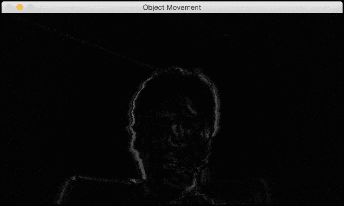

如果我快速地在手中移动电视遥控器，它看起来可能就像这样：

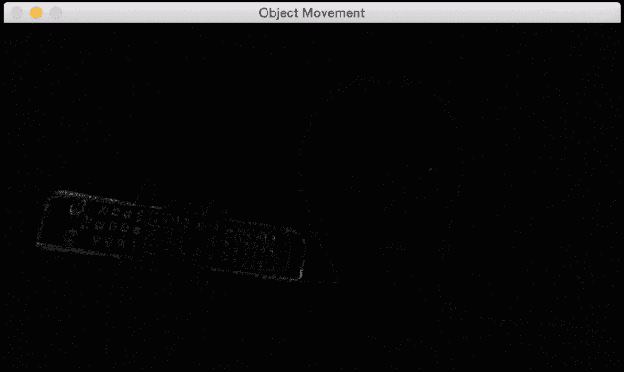

如您从前面的图像中可以看到，视频中只有运动部件被突出显示。这为我们提供了一个很好的起点，可以看到视频中哪些区域在移动。以下是实现这一功能的代码：

```py
import cv2

# Compute the frame difference
def frame_diff(prev_frame, cur_frame, next_frame):
    # Absolute difference between current frame and next frame
    diff_frames1 = cv2.absdiff(next_frame, cur_frame)

    # Absolute difference between current frame and # previous frame
    diff_frames2 = cv2.absdiff(cur_frame, prev_frame)

    # Return the result of bitwise 'AND' between the # above two resultant images
    return cv2.bitwise_and(diff_frames1, diff_frames2)

# Capture the frame from webcam
def get_frame(cap):
    # Capture the frame
    ret, frame = cap.read()

    # Resize the image
    frame = cv2.resize(frame, None, fx=scaling_factor,
            fy=scaling_factor, interpolation=cv2.INTER_AREA)

    # Return the grayscale image
    return cv2.cvtColor(frame, cv2.COLOR_RGB2GRAY)

if __name__=='__main__':
    cap = cv2.VideoCapture(0)
    scaling_factor = 0.5

    prev_frame = get_frame(cap)
    cur_frame = get_frame(cap)
    next_frame = get_frame(cap)

    # Iterate until the user presses the ESC key
    while True:
        # Display the result of frame differencing
        cv2.imshow("Object Movement", frame_diff(prev_frame, cur_frame, next_frame))

        # Update the variables
        prev_frame = cur_frame
        cur_frame = next_frame
        next_frame = get_frame(cap)

        # Check if the user pressed ESC
        key = cv2.waitKey(10)
        if key == 27:
            break

    cv2.destroyAllWindows()
```

# 基于色彩空间的跟踪

帧差分为我们提供了一些有用的信息，但我们不能用它来构建任何有意义的东西。为了构建一个好的对象跟踪器，我们需要了解哪些特征可以用来使我们的跟踪既稳健又准确。因此，让我们迈出这一步，看看我们如何使用**色彩空间**来构建一个好的跟踪器。正如我们在前面的章节中讨论的，HSV 色彩空间在人类感知方面非常有信息量。我们可以将图像转换为 HSV 空间，然后使用`colorspacethresholding`来跟踪给定的对象。

考虑视频中的以下帧：

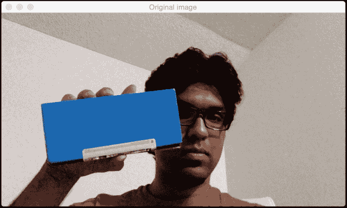

如果您将其通过色彩空间过滤器并跟踪对象，您将看到类似这样的效果：

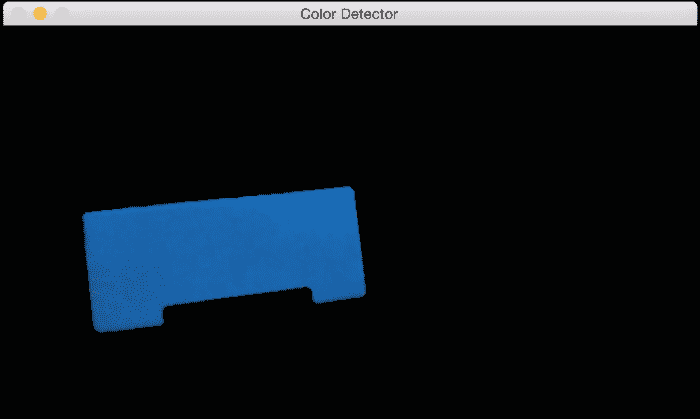

正如我们在这里可以看到的，我们的跟踪器根据颜色特征识别视频中的特定对象。为了使用这个跟踪器，我们需要知道目标对象的颜色分布。以下是如何实现这一功能的代码：

```py
import cv2
import numpy as np

# Capture the input frame from webcam
def get_frame(cap, scaling_factor):
    # Capture the frame from video capture object
    ret, frame = cap.read()

    # Resize the input frame
    frame = cv2.resize(frame, None, fx=scaling_factor,
            fy=scaling_factor, interpolation=cv2.INTER_AREA)

    return frame

if __name__=='__main__':
    cap = cv2.VideoCapture(0)
    scaling_factor = 0.5

    # Iterate until the user presses ESC key
    while True:
        frame = get_frame(cap, scaling_factor)

        # Convert the HSV colorspace
        hsv = cv2.cvtColor(frame, cv2.COLOR_BGR2HSV)

        # Define 'blue' range in HSV colorspace
        lower = np.array([60,100,100])
        upper = np.array([180,255,255])

        # Threshold the HSV image to get only blue color
        mask = cv2.inRange(hsv, lower, upper)

        # Bitwise-AND mask and original image
        res = cv2.bitwise_and(frame, frame, mask=mask)
        res = cv2.medianBlur(res, 5)

        cv2.imshow('Original image', frame)
        cv2.imshow('Color Detector', res)

        # Check if the user pressed ESC key
        c = cv2.waitKey(5)
        if c == 27:
            break

    cv2.destroyAllWindows()
```

# 构建一个交互式对象跟踪器

基于色彩空间的跟踪器为我们提供了跟踪彩色对象的自由，但我们也被限制在预定义的颜色中。如果我们只想随机选择一个对象怎么办？我们如何构建一个可以学习所选对象特征并自动跟踪它的对象跟踪器？这就是**CAMShift**算法的用武之地，它代表连续自适应均值漂移。它基本上是**均值漂移**算法的改进版本。

均值漂移的概念实际上很棒且简单。假设我们选择了一个感兴趣的区域，并希望我们的目标跟踪器跟踪该对象。在这个区域内，我们根据颜色直方图选择一些点并计算质心。如果质心位于这个区域的中心，我们知道对象没有移动。但如果质心不在这个区域的中心，那么我们知道对象正在某个方向上移动。质心的移动控制着对象移动的方向。因此，我们将边界框移动到新的位置，使新的质心成为这个边界框的中心。因此，这个算法被称为均值漂移，因为均值（即质心）在移动。这样，我们就能保持对对象当前位置的更新。

但均值漂移的问题在于边界框的大小不允许改变。当你将对象从摄像机移开时，对象在人类眼中会显得更小，但均值漂移不会考虑这一点。边界框的大小在整个跟踪过程中保持不变。因此，我们需要使用 CAMShift。CAMShift 的优势在于它可以调整边界框的大小以适应对象的大小。此外，它还可以跟踪对象的方向。

让我们考虑以下帧，其中对象以橙色突出显示（我手中的框）：

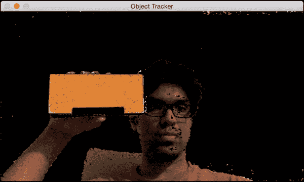

现在我们已经选择了对象，算法计算直方图的反投影并提取所有信息。让我们移动对象，看看它是如何被跟踪的：

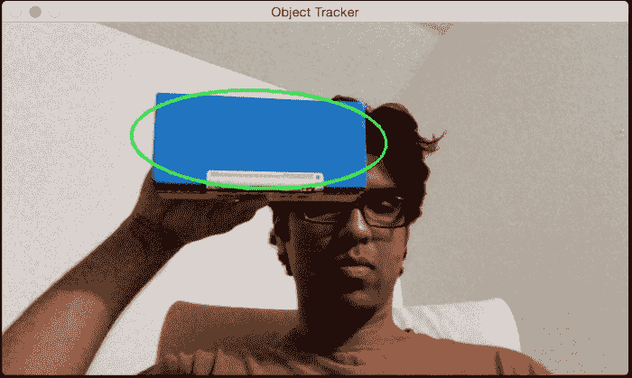

看起来对象被跟踪得相当好。让我们改变方向，看看跟踪是否保持：

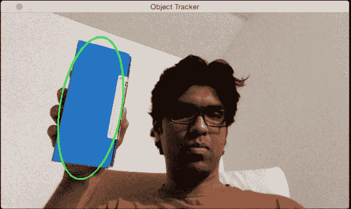

如我们所见，边界椭圆已经改变了其位置和方向。让我们改变对象的角度，看看它是否仍然能够跟踪：

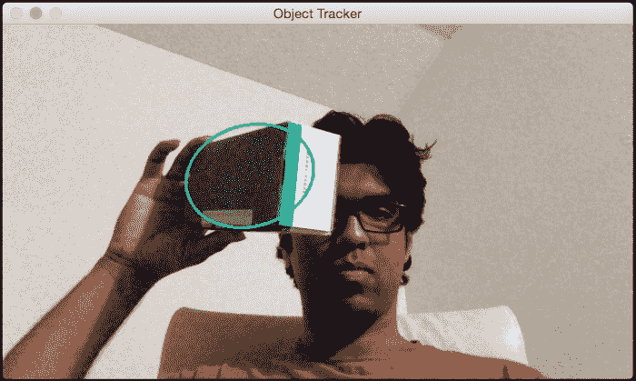

我们仍然做得很好！边界椭圆已经改变了长宽比，以反映对象现在看起来是倾斜的（由于透视变换）。

以下是对应的代码：

```py
import sys

import cv2
import numpy as np

class ObjectTracker(object):
    def __init__(self):
        # Initialize the video capture object
        # 0 -> indicates that frame should be captured
        # from webcam
        self.cap = cv2.VideoCapture(0)

        # Capture the frame from the webcam
        ret, self.frame = self.cap.read()

        # Downsampling factor for the input frame
        self.scaling_factor = 0.5
        self.frame = cv2.resize(self.frame, None, fx=self.scaling_factor,
                    fy=self.scaling_factor, interpolation=cv2.INTER_AREA)

        cv2.namedWindow('Object Tracker')
        cv2.setMouseCallback('Object Tracker', self.mouse_event)

        self.selection = None
        self.drag_start = None
        self.tracking_state = 0

    # Method to track mouse events
    def mouse_event(self, event, x, y, flags, param):
        x, y = np.int16([x, y])

        # Detecting the mouse button down event
        if event == cv2.EVENT_LBUTTONDOWN:
            self.drag_start = (x, y)
            self.tracking_state = 0

        if self.drag_start:
            if flags & cv2.EVENT_FLAG_LBUTTON:
                h, w = self.frame.shape[:2]
                xo, yo = self.drag_start
                x0, y0 = np.maximum(0, np.minimum([xo, yo], [x, y]))
                x1, y1 = np.minimum([w, h], np.maximum([xo, yo], [x, y]))
                self.selection = None

                if x1-x0 > 0 and y1-y0 > 0:
                    self.selection = (x0, y0, x1, y1)

            else:
                self.drag_start = None
                if self.selection is not None:
                    self.tracking_state = 1

    # Method to start tracking the object
    def start_tracking(self):
        # Iterate until the user presses the Esc key
        while True:
            # Capture the frame from webcam
            ret, self.frame = self.cap.read()
            # Resize the input frame
            self.frame = cv2.resize(self.frame, None, fx=self.scaling_factor,
                        fy=self.scaling_factor, interpolation=cv2.INTER_AREA)

            vis = self.frame.copy()

            # Convert to HSV colorspace
            hsv = cv2.cvtColor(self.frame, cv2.COLOR_BGR2HSV)

            # Create the mask based on predefined thresholds.
            mask = cv2.inRange(hsv, np.array((0., 60., 32.)),
                        np.array((180., 255., 255.)))

            if self.selection:
                x0, y0, x1, y1 = self.selection
                self.track_window = (x0, y0, x1-x0, y1-y0)
                hsv_roi = hsv[y0:y1, x0:x1]
                mask_roi = mask[y0:y1, x0:x1]

                # Compute the histogram
                hist = cv2.calcHist( [hsv_roi], [0], mask_roi, [16], [0, 180] )

                # Normalize and reshape the histogram
                cv2.normalize(hist, hist, 0, 255, cv2.NORM_MINMAX);
                self.hist = hist.reshape(-1)

                vis_roi = vis[y0:y1, x0:x1]
                cv2.bitwise_not(vis_roi, vis_roi)
                vis[mask == 0] = 0

            if self.tracking_state == 1:
                self.selection = None

                # Compute the histogram back projection
                prob = cv2.calcBackProject([hsv], [0], self.hist, [0, 180], 1)

                prob &= mask
                term_crit = ( cv2.TERM_CRITERIA_EPS | cv2.TERM_CRITERIA_COUNT, 10, 1 )

                # Apply CAMShift on 'prob'
                track_box, self.track_window = cv2.CamShift(prob, self.track_window, term_crit)

                # Draw an ellipse around the object
                cv2.ellipse(vis, track_box, (0, 255, 0), 2)

            cv2.imshow('Object Tracker', vis)

            c = cv2.waitKey(5)
            if c == 27:
                break

        cv2.destroyAllWindows()

if __name__ == '__main__':
    ObjectTracker().start_tracking()
```

# 基于特征的跟踪

基于特征的跟踪指的是在视频的连续帧中跟踪单个特征点。我们使用一种称为**光流**的技术来跟踪这些特征。光流是计算机视觉中最受欢迎的技术之一。我们选择一些特征点并通过视频流跟踪它们。

当我们检测到特征点时，我们计算位移向量并显示这些关键点在连续帧之间的运动。这些向量被称为运动向量。有许多方法可以做到这一点，但 Lucas-Kanade 方法可能是所有这些技术中最受欢迎的。您可以参考他们的原始论文[`cseweb.ucsd.edu/classes/sp02/cse252/lucaskanade81.pdf`](http://cseweb.ucsd.edu/classes/sp02/cse252/lucaskanade81.pdf)。我们通过提取特征点开始这个过程。对于每个特征点，我们以特征点为中心创建 3x3 的补丁。这里的假设是每个补丁内的所有点将具有相似的运动。我们可以根据问题的需要调整这个窗口的大小。

对于当前帧中的每个特征点，我们取周围的 3x3 补丁作为我们的参考点。对于这个补丁，我们在前一帧的邻域中寻找最佳匹配。这个邻域通常比 3x3 大，因为我们想要找到与考虑中的补丁最接近的补丁。现在，从前一帧中匹配补丁的中心像素到当前帧中考虑的补丁中心像素的路径将成为运动向量。我们对所有特征点都这样做，并提取所有运动向量。

让我们考虑以下帧：

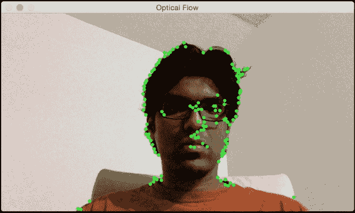

如果我在水平方向上移动，您将看到水平方向上的运动向量：

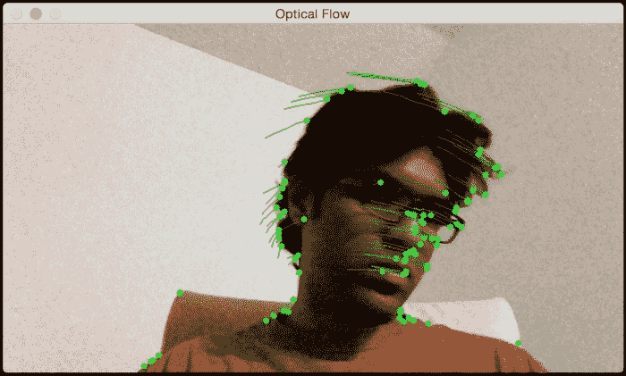

如果我远离网络摄像头，您将看到如下所示：

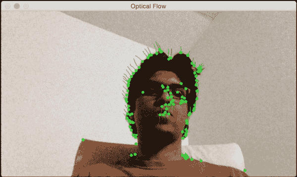

因此，如果您想尝试一下，您可以让用户在输入视频中选择感兴趣的区域（就像我们之前做的那样）。然后，您可以从这个感兴趣的区域提取特征点并通过绘制边界框来跟踪对象。这将是一个有趣的练习！

这里是执行基于光流跟踪的代码：

```py
import cv2
import numpy as np

def start_tracking():
    # Capture the input frame
    cap = cv2.VideoCapture(0)

    # Downsampling factor for the image
    scaling_factor = 0.5

    # Number of frames to keep in the buffer when you
    # are tracking. If you increase this number,
    # feature points will have more "inertia"
    num_frames_to_track = 5

    # Skip every 'n' frames. This is just to increase the speed.
    num_frames_jump = 2

    tracking_paths = []
    frame_index = 0

    # 'winSize' refers to the size of each patch. These patches
    # are the smallest blocks on which we operate and track
    # the feature points. You can read more about the parameters
    # here: http://goo.gl/ulwqLk
    tracking_params = dict(winSize  = (11, 11), maxLevel = 2,
            criteria = (cv2.TERM_CRITERIA_EPS | cv2.TERM_CRITERIA_COUNT, 10, 0.03))

    # Iterate until the user presses the ESC key
    while True:
        # read the input frame
        ret, frame = cap.read()

        # downsample the input frame
        frame = cv2.resize(frame, None, fx=scaling_factor,
                fy=scaling_factor, interpolation=cv2.INTER_AREA)

        frame_gray = cv2.cvtColor(frame, cv2.COLOR_BGR2GRAY)
        output_img = frame.copy()

        if len(tracking_paths) > 0:
            prev_img, current_img = prev_gray, frame_gray
            feature_points_0 = np.float32([tp[-1] for tp in tracking_paths]).reshape(-1, 1, 2)

            # Compute feature points using optical flow. You can
            # refer to the documentation to learn more about the
            # parameters here: http://goo.gl/t6P4SE
            feature_points_1, _, _ = cv2.calcOpticalFlowPyrLK(prev_img, current_img, feature_points_0,
                    None, **tracking_params)
            feature_points_0_rev, _, _ = cv2.calcOpticalFlowPyrLK(current_img, prev_img, feature_points_1,
                    None, **tracking_params)

            # Compute the difference of the feature points
            diff_feature_points = abs(feature_points_0- feature_points_0_rev).reshape(-1, 2).max(-1)

            # threshold and keep the good points
            good_points = diff_feature_points < 1

            new_tracking_paths = []

            for tp, (x, y), good_points_flag in zip(tracking_paths,
                        feature_points_1.reshape(-1, 2), good_points):
                if not good_points_flag:
                    continue

                tp.append((x, y))

                # Using the queue structure i.e. first in,
                # first out
                if len(tp) > num_frames_to_track:
                    del tp[0]

                new_tracking_paths.append(tp)

                # draw green circles on top of the output image
                cv2.circle(output_img, (x, y), 3, (0, 255, 0), -1)

            tracking_paths = new_tracking_paths

            # draw green lines on top of the output image
            cv2.polylines(output_img, [np.int32(tp) for tp in tracking_paths], False, (0, 150, 0))

        # 'if' condition to skip every 'n'th frame
        if not frame_index % num_frames_jump:
            mask = np.zeros_like(frame_gray)
            mask[:] = 255
            for x, y in [np.int32(tp[-1]) for tp in tracking_paths]:
                cv2.circle(mask, (x, y), 6, 0, -1)

            # Extract good features to track. You can learn more
            # about the parameters here: http://goo.gl/BI2Kml
            feature_points = cv2.goodFeaturesToTrack(frame_gray,
                    mask = mask, maxCorners = 500, qualityLevel = 0.3,
                    minDistance = 7, blockSize = 7)

            if feature_points is not None:
                for x, y in np.float32(feature_points).reshape (-1, 2):
                    tracking_paths.append([(x, y)])

        frame_index += 1
        prev_gray = frame_gray

        cv2.imshow('Optical Flow', output_img)

        # Check if the user pressed the ESC key
        c = cv2.waitKey(1)
        if c == 27:
            break

if __name__ == '__main__':
    start_tracking()
    cv2.destroyAllWindows()
```

# 背景减法

背景减法在视频监控中非常有用。基本上，背景减法技术在需要检测静态场景中移动对象的情况下表现非常出色。正如其名所示，该算法通过检测背景并将其从当前帧中减去以获得前景，即移动对象来工作。为了检测移动对象，我们首先需要建立一个背景模型。这不同于帧差分，因为我们实际上是在建模背景并使用这个模型来检测移动对象。因此，这种方法比简单的帧差分技术表现更好。这种技术试图检测场景中的静态部分，并将其包含在背景模型中。因此，它是一种自适应技术，可以根据场景进行调整。

让我们考虑以下图像：

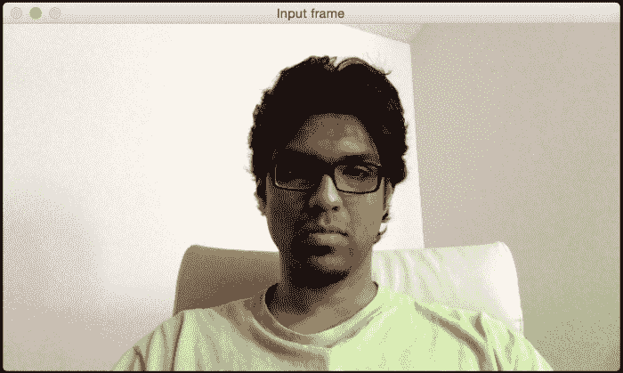

现在，随着我们在这一场景中收集更多的帧，图像的每一部分都将逐渐成为背景模型的一部分。这正是我们之前讨论过的。如果一个场景是静态的，模型会自动调整以确保背景模型得到更新。这就是它开始时的样子：

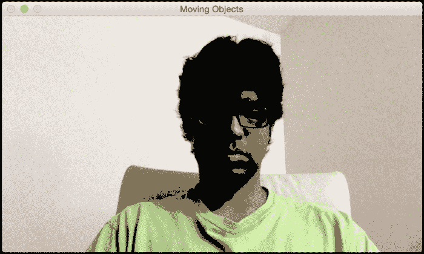

注意，我的脸部的一部分已经成为了背景模型的一部分（被变黑的区域）。以下截图显示了几秒钟后我们将看到的情况：

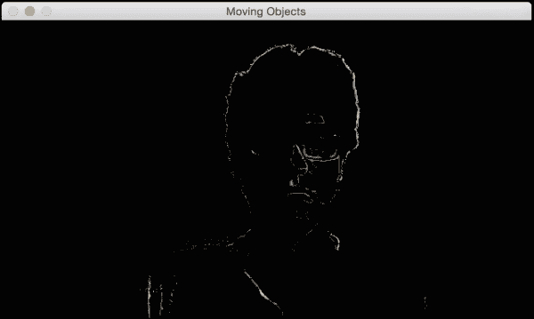

如果我们继续这样做，最终一切都将成为背景模型的一部分：

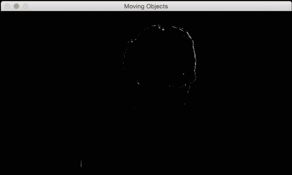

现在，如果我们引入一个新的移动物体，它将被清晰地检测到，如下所示：

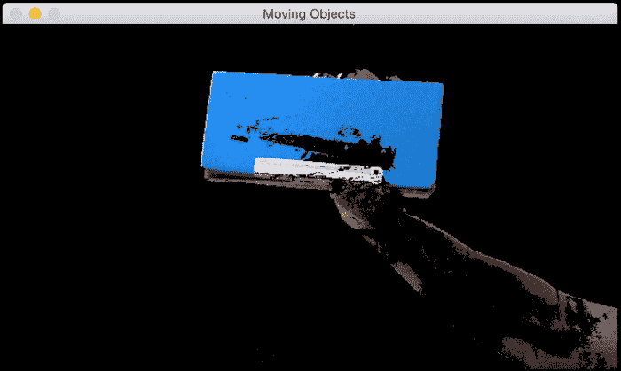

下面是实现这一功能的代码：

```py
import cv2
import numpy as np

# Capture the input frame
def get_frame(cap, scaling_factor=0.5):
    ret, frame = cap.read()

    # Resize the frame
    frame = cv2.resize(frame, None, fx=scaling_factor,
            fy=scaling_factor, interpolation=cv2.INTER_AREA)

    return frame

if __name__=='__main__':
    # Initialize the video capture object
    cap = cv2.VideoCapture(0)

    # Create the background subtractor object
    bgSubtractor = cv2.BackgroundSubtractorMOG()

    # This factor controls the learning rate of the algorithm.
    # The learning rate refers to the rate at which your model
    # will learn about the background. Higher value for
    # 'history' indicates a slower learning rate. You
    # can play with this parameter to see how it affects
    # the output.
    history = 100

    # Iterate until the user presses the ESC key
    while True:
        frame = get_frame(cap, 0.5)

        # Apply the background subtraction model to the # input frame
        mask = bgSubtractor.apply(frame, learningRate=1.0/history)

        # Convert from grayscale to 3-channel RGB
        mask = cv2.cvtColor(mask, cv2.COLOR_GRAY2BGR)

        cv2.imshow('Input frame', frame)
        cv2.imshow('Moving Objects', mask & frame)

        # Check if the user pressed the ESC key
        c = cv2.waitKey(10)
        if c == 27:
            break

    cap.release()
    cv2.destroyAllWindows()
```

# 摘要

在本章中，我们学习了物体跟踪。我们学习了如何使用帧差分来获取运动信息，以及当我们想要跟踪不同类型的物体时，它可能受到的限制。我们学习了颜色空间阈值化以及它是如何用于跟踪彩色物体的。我们讨论了物体跟踪的聚类技术以及我们如何使用 CAMShift 算法构建一个交互式物体跟踪器。我们讨论了如何在视频中跟踪特征以及我们如何使用光流来实现相同的效果。我们学习了背景减法以及它是如何用于视频监控的。

在下一章中，我们将讨论物体识别，以及我们如何构建一个视觉搜索引擎。
