# 第十章. 对象识别

在本章中，我们将学习对象识别以及如何使用它来构建视觉搜索引擎。我们将讨论特征检测、构建特征向量以及使用机器学习来构建分类器。我们将学习如何使用这些不同的模块来构建一个对象识别系统。

到本章结束时，你将知道：

+   对象检测与对象识别的区别是什么

+   什么是密集特征检测器

+   什么是视觉词典

+   如何构建特征向量

+   什么是监督学习和无监督学习

+   什么是支持向量机以及如何使用它们来构建分类器

+   如何在未知图像中识别一个对象

# 对象检测与对象识别的比较

在我们继续之前，我们需要了解本章将要讨论的内容。你一定经常听到“对象检测”和“对象识别”这两个术语，并且它们经常被误认为是同一件事。两者之间有一个非常明显的区别。

对象检测是指检测给定场景中特定对象的存在。我们不知道这个对象可能是什么。例如，我们在第四章中讨论了人脸检测，*检测和跟踪不同的身体部位*。在讨论中，我们只检测了给定图像中是否存在人脸。我们没有识别出这个人！我们没有识别出这个人的原因是我们在讨论中并不关心这一点。我们的目标是找到给定图像中人脸的位置。商业人脸识别系统同时使用人脸检测和人脸识别来识别一个人。首先，我们需要定位人脸，然后，在裁剪的人脸上进行人脸识别。

对象识别是在给定图像中识别对象的过程。例如，一个对象识别系统可以告诉你一个给定的图像是否包含连衣裙或一双鞋。实际上，我们可以训练一个对象识别系统来识别许多不同的对象。问题是对象识别是一个真正难以解决的问题。它已经让计算机视觉研究人员困惑了几十年，并已成为计算机视觉的圣杯。人类可以很容易地识别各种各样的对象。我们每天都在做，而且毫不费力，但计算机无法以那种精度做到这一点。

让我们考虑以下咖啡杯的图像：

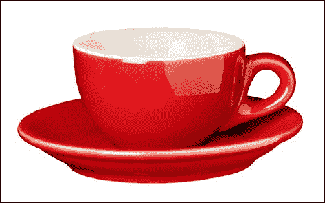

对象检测器会给你以下信息：

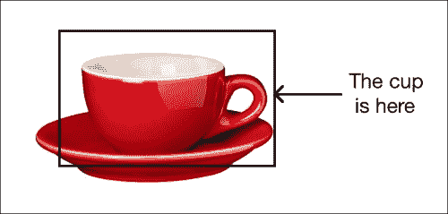

现在，考虑以下茶杯的图像：

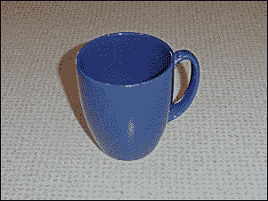

如果你运行它通过对象检测器，你会看到以下结果：

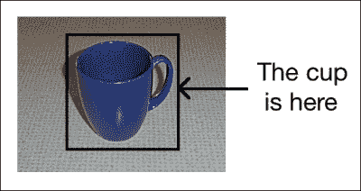

如您所见，对象检测器检测到了茶杯的存在，但仅此而已。如果您训练一个对象识别器，它将提供以下信息，如下面的图像所示：

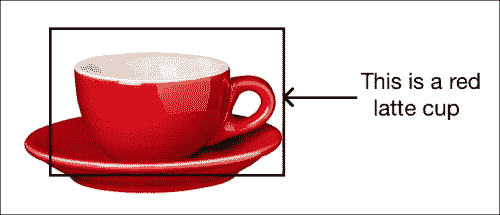

如果您考虑第二张图像，它将为您提供以下信息：

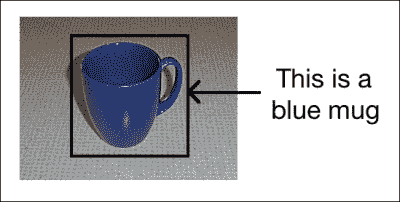

如您所见，一个完美的对象识别器会为您提供与该对象相关的所有信息。如果对象识别器知道对象的位置，它将运行得更准确。如果您有一个大图像，而杯子只是其中的一小部分，那么对象识别器可能无法识别它。因此，第一步是检测对象并获取边界框。一旦我们有了这个，我们就可以运行对象识别器来提取更多信息。

# 什么是密集特征检测器？

为了从图像中提取有意义的信息，我们需要确保我们的特征提取器能够从给定图像的所有部分提取特征。考虑以下图像：

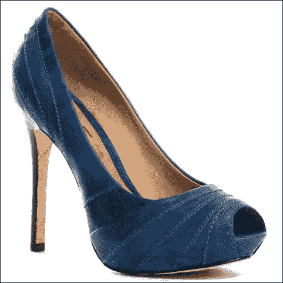

如果你使用特征提取器提取特征，它将看起来像这样：

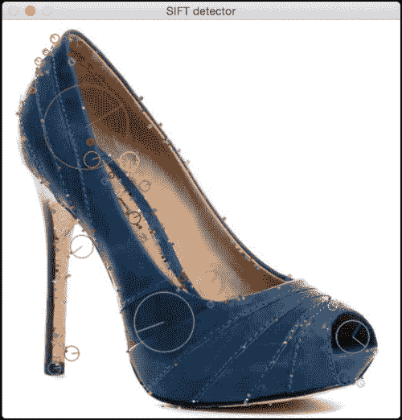

如果你使用`Dense`检测器，它将看起来像这样：

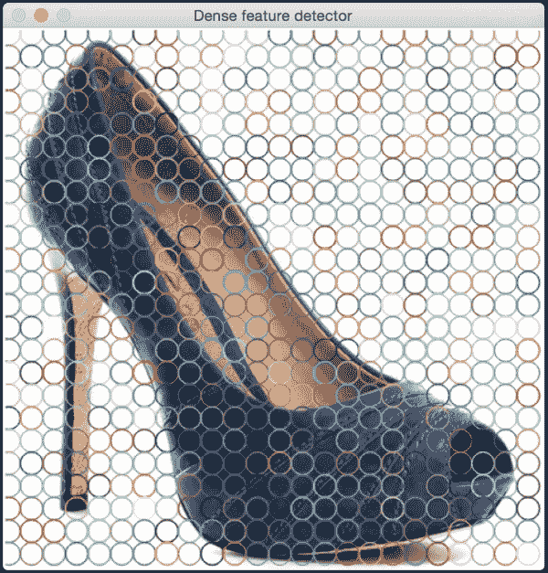

我们还可以控制密度。让我们将其变为稀疏的：


通过这样做，我们可以确保图像的每个部分都被处理。以下是实现此功能的代码：

```py
import cv2
import numpy as np

class DenseDetector(object):
    def __init__(self, step_size=20, feature_scale=40, img_bound=20):
        # Create a dense feature detector
        self.detector = cv2.FeatureDetector_create("Dense")

        # Initialize it with all the required parameters
        self.detector.setInt("initXyStep", step_size)
        self.detector.setInt("initFeatureScale", feature_scale)
        self.detector.setInt("initImgBound", img_bound)

    def detect(self, img):
        # Run feature detector on the input image
        return self.detector.detect(img)

if __name__=='__main__':
    input_image = cv2.imread(sys.argv[1])
    input_image_sift = np.copy(input_image)

    # Convert to grayscale
    gray_image = cv2.cvtColor(input_image, cv2.COLOR_BGR2GRAY)

    keypoints = DenseDetector(20,20,5).detect(input_image)

    # Draw keypoints on top of the input image
    input_image = cv2.drawKeypoints(input_image, keypoints,
            flags=cv2.DRAW_MATCHES_FLAGS_DRAW_RICH_KEYPOINTS)

    # Display the output image
    cv2.imshow('Dense feature detector', input_image)

    # Initialize SIFT object
    sift = cv2.SIFT()

    # Detect keypoints using SIFT
    keypoints = sift.detect(gray_image, None)

    # Draw SIFT keypoints on the input image
    input_image_sift = cv2.drawKeypoints(input_image_sift,
            keypoints, flags=cv2.DRAW_MATCHES_FLAGS_DRAW_RICH_KEYPOINTS)

    # Display the output image
    cv2.imshow('SIFT detector', input_image_sift)

    # Wait until user presses a key
    cv2.waitKey()
```

这使我们能够对提取的信息量进行更精确的控制。当我们使用 SIFT 检测器时，图像的一些部分会被忽略。当我们处理显著特征的检测时，这效果很好，但当我们构建对象识别器时，我们需要评估图像的所有部分。因此，我们使用密集检测器，然后从这些关键点中提取特征。

# 什么是视觉词典？

我们将使用**词袋模型**来构建我们的对象识别器。每个图像都表示为视觉词的直方图。这些视觉词基本上是使用从训练图像中提取的所有关键点构建的**N**个质心。流程如图所示：

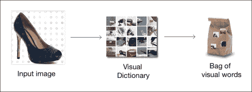

从每个训练图像中，我们检测一组关键点并为每个关键点提取特征。每个图像都会产生不同数量的关键点。为了训练一个分类器，每个图像必须使用固定长度的特征向量来表示。这个特征向量实际上就是一个直方图，其中每个 bin 对应一个视觉词。

当我们从训练图像中的所有关键点中提取所有特征后，我们执行 K-Means 聚类并提取 N 个质心。这个 N 是给定图像特征向量的长度。现在，每张图像都将表示为一个直方图，其中每个 bin 对应于这“N”个质心中的一个。为了简单起见，让我们假设 N 设置为 4。现在，在给定的图像中，我们提取**K**个关键点。在这些 K 个关键点中，一些将最接近第一个质心，一些将最接近第二个质心，依此类推。因此，我们根据每个关键点最近质心构建直方图。这个直方图成为我们的特征向量。这个过程被称为**向量量化**。

为了理解向量量化，让我们考虑一个例子。假设我们有一个图像，并且我们已经从中提取了一定数量的特征点。现在我们的目标是将以特征向量的形式表示这张图像。考虑以下图像：

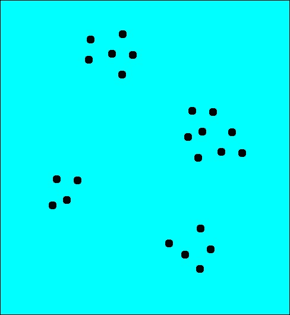

如您所见，我们有 4 个质心。请记住，图中的点代表特征空间，而不是这些特征点在图像中的实际几何位置。前一个图中的展示方式是为了便于可视化。来自图像中许多不同几何位置的点可以在特征空间中彼此靠近。我们的目标是表示这张图像为直方图，其中每个 bin 对应于这些质心中的一个。这样，无论我们从图像中提取多少特征点，它都将始终转换为固定长度的特征向量。因此，我们将每个特征点“四舍五入”到其最近的质心，如图中所示：

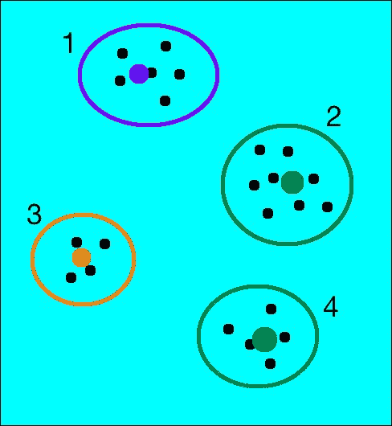

如果你为这张图像构建直方图，它将看起来像这样：

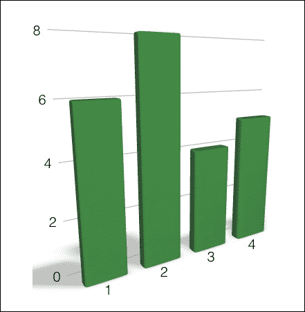

现在，如果你考虑一个具有不同特征点分布的不同图像，它将看起来像这样：

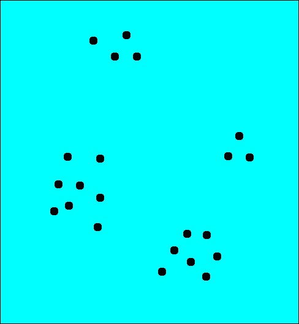

这些簇看起来如下：

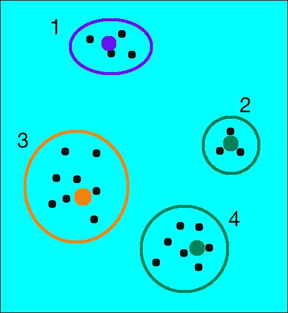

直方图将看起来像这样：

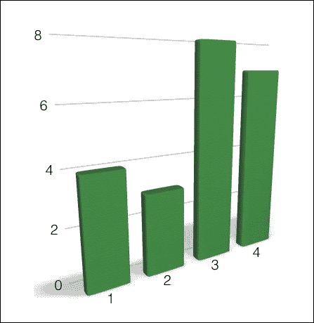

如您所见，尽管点似乎随机分布，但这两个图像的直方图非常不同。这是一个非常强大的技术，并且在计算机视觉和信号处理中得到广泛应用。有许多不同的方法来做这件事，准确性取决于你希望它有多精细。如果你增加质心的数量，你将能够更好地表示图像，从而增加特征向量的唯一性。话虽如此，重要的是要提到，你不能无限制地增加质心的数量。如果你这样做，它将变得过于嘈杂并失去其力量。

# 什么是监督学习和无监督学习？

如果您熟悉机器学习的基础知识，您当然会知道监督学习和无监督学习是什么。为了快速回顾，监督学习是指基于标记样本构建一个函数。例如，如果我们正在构建一个系统来区分服装图像和鞋类图像，我们首先需要建立一个数据库并对它进行标记。我们需要告诉我们的算法哪些图像对应于服装，哪些图像对应于鞋类。基于这些数据，算法将学习如何识别服装和鞋类，以便当未知图像进入时，它可以识别图像中的内容。

无监督学习是我们刚才讨论内容的反面。这里没有可用的标记数据。假设我们有一堆图像，我们只想将它们分成三个组。我们不知道标准是什么。因此，无监督学习算法将尝试以最佳方式将给定数据集分成 3 组。我们讨论这个问题的原因是因为我们将使用监督学习和无监督学习的组合来构建我们的目标识别系统。

# 什么是支持向量机？

**支持向量机**（**SVM**）是机器学习领域中非常流行的监督学习模型。SVM 在分析标记数据和检测模式方面非常出色。给定一些数据点和相关的标签，SVM 将以最佳方式构建分隔超平面。

等一下，什么是“超平面”？为了理解这一点，让我们考虑以下图示：

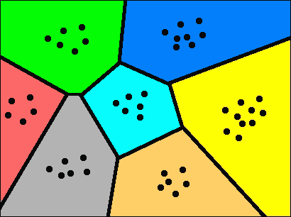

如您所见，点被等距离于点的线边界分开。在二维空间中这很容易可视化。如果是在三维空间中，分隔器将是平面。当我们为图像构建特征时，特征向量的长度通常在六位数范围内。因此，当我们进入这样一个高维空间时，“线”的等价物将是超平面。一旦超平面被确定，我们就使用这个数学模型来根据数据在这个地图上的位置对未知数据进行分类。

## 如果我们无法用简单的直线分离数据怎么办？

在支持向量机（SVM）中，有一种称为**核技巧**的东西。考虑以下图像：

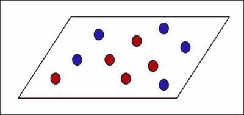

如我们所见，我们不能简单地画一条直线来将红色点与蓝色点分开。提出一个能满足所有点的优美曲线边界是过于昂贵的。SVMs（支持向量机）在画“直线”方面真的很擅长。那么，我们的答案是什么？SVMs（支持向量机）的好处是它们可以在任意数量的维度上画这些“直线”。所以从技术上讲，如果你将这些点投影到一个高维空间中，在那里它们可以通过一个简单的超平面分开，SVMs（支持向量机）将提出一个精确的边界。一旦我们有了这个边界，我们就可以将其投影回原始空间。这个超平面在我们原始的低维空间上的投影看起来是弯曲的，正如我们在下一张图中可以看到的：

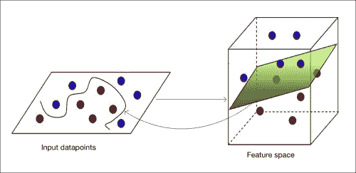

SVMs（支持向量机）的主题真的很深奥，我们在这里无法详细讨论。如果你真的感兴趣，网上有大量的资料可供参考。你可以通过一个简单的教程来更好地理解它。

# 我们实际上是如何实现这个的？

我们现在已经到达了核心。到目前为止的讨论是必要的，因为它为你提供了构建物体识别系统所需的背景知识。现在，让我们构建一个可以识别给定图像是否包含连衣裙、一双鞋或一个包的物体识别器。我们可以轻松地将这个系统扩展到检测任意数量的物品。我们从一个不同的三个物品开始，这样你以后可以开始实验。

在我们开始之前，我们需要确保我们有一组训练图像。网上有许多数据库可供下载，其中图像已经被分组成组。Caltech256 可能是物体识别中最受欢迎的数据库之一。你可以从[`www.vision.caltech.edu/Image_Datasets/Caltech256`](http://www.vision.caltech.edu/Image_Datasets/Caltech256)下载它。创建一个名为`images`的文件夹，并在其中创建三个子文件夹，即`dress`、`footwear`和`bag`。在每个这些子文件夹中，添加对应物品的 20 张图像。你可以直接从互联网上下载这些图像，但请确保这些图像有干净的背景。

例如，一件连衣裙的图片可能如下所示：

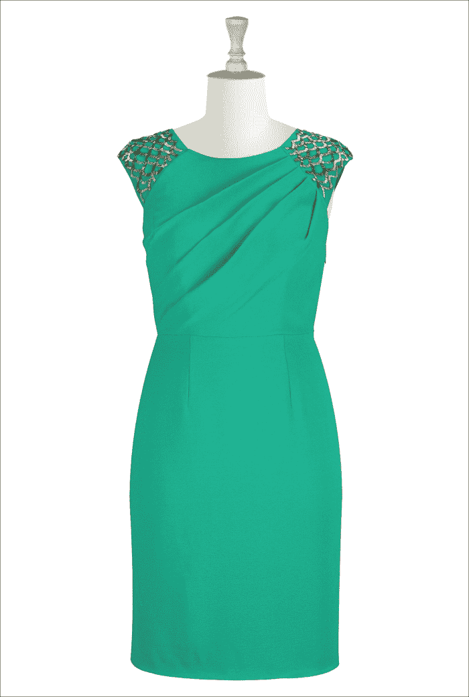

一双鞋的图片可能如下所示：

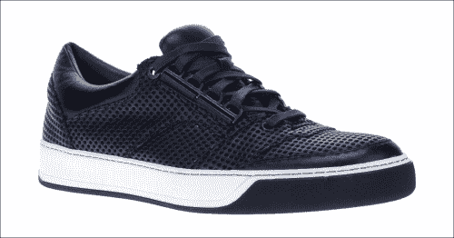

一个包的图片可能如下所示：

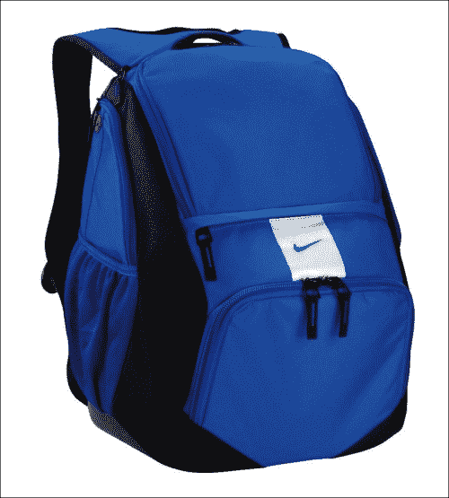

现在我们有了 60 张训练图像，我们准备开始。作为旁注，物体识别系统实际上需要成千上万张训练图像才能在现实世界中表现良好。由于我们正在构建一个用于检测 3 种物体的物体识别器，我们将为每种物体只取 20 张训练图像。增加更多的训练图像将提高我们系统的准确性和鲁棒性。

这里的第一步是从所有训练图像中提取特征向量并构建视觉字典（也称为代码簿）。以下是代码：

```py
import os
import sys
import argparse
import cPickle as pickle
import json

import cv2
import numpy as np
from sklearn.cluster import KMeans

def build_arg_parser():
    parser = argparse.ArgumentParser(description='Creates features for given images')
    parser.add_argument("--samples", dest="cls", nargs="+", action="append",
            required=True, help="Folders containing the training images. \
            The first element needs to be the class label.")
    parser.add_argument("--codebook-file", dest='codebook_file', required=True,
            help="Base file name to store the codebook")
    parser.add_argument("--feature-map-file", dest='feature_map_file', required=True,
            help="Base file name to store the feature map")

    return parser

# Loading the images from the input folder
def load_input_map(label, input_folder):
    combined_data = []

    if not os.path.isdir(input_folder):
        raise IOError("The folder " + input_folder + " doesn't exist")

    # Parse the input folder and assign the  labels
    for root, dirs, files in os.walk(input_folder):
        for filename in (x for x in files if x.endswith('.jpg')):
            combined_data.append({'label': label, 'image': os.path.join(root, filename)})

    return combined_data

class FeatureExtractor(object):
    def extract_image_features(self, img):
        # Dense feature detector
        kps = DenseDetector().detect(img)

        # SIFT feature extractor
        kps, fvs = SIFTExtractor().compute(img, kps)

        return fvs

    # Extract the centroids from the feature points
    def get_centroids(self, input_map, num_samples_to_fit=10):
        kps_all = []

        count = 0
        cur_label = ''
        for item in input_map:
            if count >= num_samples_to_fit:
                if cur_label != item['label']:
                    count = 0
                else:
                    continue

            count += 1

            if count == num_samples_to_fit:
                print "Built centroids for", item['label']

            cur_label = item['label']
            img = cv2.imread(item['image'])
            img = resize_to_size(img, 150)

            num_dims = 128
            fvs = self.extract_image_features(img)
            kps_all.extend(fvs)

        kmeans, centroids = Quantizer().quantize(kps_all)
        return kmeans, centroids

    def get_feature_vector(self, img, kmeans, centroids):
        return Quantizer().get_feature_vector(img, kmeans, centroids)

def extract_feature_map(input_map, kmeans, centroids):
    feature_map = []

    for item in input_map:
        temp_dict = {}
        temp_dict['label'] = item['label']

        print "Extracting features for", item['image']
        img = cv2.imread(item['image'])
        img = resize_to_size(img, 150)

        temp_dict['feature_vector'] = FeatureExtractor().get_feature_vector(
                    img, kmeans, centroids)

        if temp_dict['feature_vector'] is not None:
            feature_map.append(temp_dict)

    return feature_map

# Vector quantization
class Quantizer(object):
    def __init__(self, num_clusters=32):
        self.num_dims = 128
        self.extractor = SIFTExtractor()
        self.num_clusters = num_clusters
        self.num_retries = 10

    def quantize(self, datapoints):
        # Create KMeans object
        kmeans = KMeans(self.num_clusters,
                        n_init=max(self.num_retries, 1),
                        max_iter=10, tol=1.0)

        # Run KMeans on the datapoints
        res = kmeans.fit(datapoints)

        # Extract the centroids of those clusters
        centroids = res.cluster_centers_

        return kmeans, centroids

    def normalize(self, input_data):
        sum_input = np.sum(input_data)
        if sum_input > 0:
            return input_data / sum_input
        else:
            return input_data

    # Extract feature vector from the image
    def get_feature_vector(self, img, kmeans, centroids):
        kps = DenseDetector().detect(img)
        kps, fvs = self.extractor.compute(img, kps)
        labels = kmeans.predict(fvs)
        fv = np.zeros(self.num_clusters)

        for i, item in enumerate(fvs):
            fv[labels[i]] += 1

        fv_image = np.reshape(fv, ((1, fv.shape[0])))
        return self.normalize(fv_image)

class DenseDetector(object):
    def __init__(self, step_size=20, feature_scale=40, img_bound=20):
        self.detector = cv2.FeatureDetector_create("Dense")
        self.detector.setInt("initXyStep", step_size)
        self.detector.setInt("initFeatureScale", feature_scale)
        self.detector.setInt("initImgBound", img_bound)

    def detect(self, img):
        return self.detector.detect(img)

class SIFTExtractor(object):
    def compute(self, image, kps):
        if image is None:
            print "Not a valid image"
            raise TypeError

        gray_image = cv2.cvtColor(image, cv2.COLOR_BGR2GRAY)
        kps, des = cv2.SIFT().compute(gray_image, kps)
        return kps, des

# Resize the shorter dimension to 'new_size'
# while maintaining the aspect ratio
def resize_to_size(input_image, new_size=150):
    h, w = input_image.shape[0], input_image.shape[1]
    ds_factor = new_size / float(h)

    if w < h:
        ds_factor = new_size / float(w)

    new_size = (int(w * ds_factor), int(h * ds_factor))
    return cv2.resize(input_image, new_size)

if __name__=='__main__':
    args = build_arg_parser().parse_args()

    input_map = []
    for cls in args.cls:

        assert len(cls) >= 2, "Format for classes is `<label> file`"
        label = cls[0]
        input_map += load_input_map(label, cls[1])

    # Building the codebook
    print "===== Building codebook ====="
    kmeans, centroids = FeatureExtractor().get_centroids(input_map)
    if args.codebook_file:
        with open(args.codebook_file, 'w') as f:
            pickle.dump((kmeans, centroids), f)

    # Input data and labels
    print "===== Building feature map ====="
    feature_map = extract_feature_map(input_map, kmeans, centroids)
    if args.feature_map_file:
        with open(args.feature_map_file, 'w') as f:
            pickle.dump(feature_map, f)
```

## 代码内部发生了什么？

我们首先需要做的是提取质心。这是我们构建视觉字典的方法。`FeatureExtractor`类中的`get_centroids`方法被设计用来做这件事。我们持续收集从关键点提取的图像特征，直到我们拥有足够多的特征。由于我们使用的是密集检测器，10 张图像应该足够了。我们只取 10 张图像的原因是，它们会产生大量的特征。即使你添加更多的特征点，质心也不会有太大的变化。

一旦我们提取了质心，我们就准备好进行下一步的特征提取。质心集合是我们的视觉字典。`extract_feature_map`函数将从每个图像中提取特征向量，并将其与相应的标签关联起来。我们这样做的原因是我们需要这种映射来训练我们的分类器。我们需要一组数据点，并且每个数据点都应该与一个标签相关联。因此，我们从图像开始，提取特征向量，然后将其与相应的标签（如包、连衣裙或鞋类）关联起来。

`Quantizer`类被设计用来实现向量量化并构建特征向量。对于从图像中提取的每个关键点，`get_feature_vector`方法会找到我们字典中最接近的视觉词。通过这样做，我们最终基于我们的视觉字典构建了一个直方图。现在每个图像都表示为视觉词集合的组合。因此得名，**词袋模型**。

下一步是使用这些特征来训练分类器。以下是代码：

```py
import os
import sys
import argparse

import cPickle as pickle
import numpy as np
from sklearn.multiclass import OneVsOneClassifier
from sklearn.svm import LinearSVC
from sklearn import preprocessing

def build_arg_parser():
    parser = argparse.ArgumentParser(description='Trains the classifier models')
    parser.add_argument("--feature-map-file", dest="feature_map_file", required=True,
            help="Input pickle file containing the feature map")
    parser.add_argument("--svm-file", dest="svm_file", required=False,
            help="Output file where the pickled SVM model will be stored")
    return parser

# To train the classifier
class ClassifierTrainer(object):
    def __init__(self, X, label_words):
        # Encoding the labels (words to numbers)
        self.le = preprocessing.LabelEncoder()

        # Initialize One vs One Classifier using a linear kernel
        self.clf = OneVsOneClassifier(LinearSVC(random_state=0))

        y = self._encodeLabels(label_words)
        X = np.asarray(X)
        self.clf.fit(X, y)

    # Predict the output class for the input datapoint
    def _fit(self, X):
        X = np.asarray(X)
        return self.clf.predict(X)

    # Encode the labels (convert words to numbers)
    def _encodeLabels(self, labels_words):
        self.le.fit(labels_words)
        return np.array(self.le.transform(labels_words), dtype=np.float32)

    # Classify the input datapoint
    def classify(self, X):
        labels_nums = self._fit(X)
        labels_words = self.le.inverse_transform([int(x) for x in labels_nums])
        return labels_words

if __name__=='__main__':
    args = build_arg_parser().parse_args()
    feature_map_file = args.feature_map_file
    svm_file = args.svm_file

    # Load the feature map
    with open(feature_map_file, 'r') as f:
        feature_map = pickle.load(f)

    # Extract feature vectors and the labels
    labels_words = [x['label'] for x in feature_map]

    # Here, 0 refers to the first element in the
    # feature_map, and 1 refers to the second
    # element in the shape vector of that element
    # (which gives us the size)
    dim_size = feature_map[0]['feature_vector'].shape[1]

    X = [np.reshape(x['feature_vector'], (dim_size,)) for x in feature_map]

    # Train the SVM
    svm = ClassifierTrainer(X, labels_words)
    if args.svm_file:
        with open(args.svm_file, 'w') as f:
            pickle.dump(svm, f)
```

## 我们是如何构建训练器的？

我们使用`scikit-learn`包来构建 SVM 模型。你可以按照下面的步骤进行安装：

```py
$ pip install scikit-learn

```

我们从标记数据开始，并将其馈送到`OneVsOneClassifier`方法。我们有一个`classify`方法，它可以对输入图像进行分类并将其与标签关联起来。

让我们试运行一下，怎么样？确保你有一个名为`images`的文件夹，其中包含三个类别的训练图像。创建一个名为`models`的文件夹，用于存储学习模型。在你的终端上运行以下命令以创建特征并训练分类器：

```py
$ python create_features.py --samples bag images/bag/ --samples dress images/dress/ --samples footwear images/footwear/ --codebook-file models/codebook.pkl --feature-map-file models/feature_map.pkl
$ python training.py --feature-map-file models/feature_map.pkl --svm-file models/svm.pkl

```

现在分类器已经训练好了，我们只需要一个模块来对输入图像进行分类并检测其中的物体。以下是实现这一功能的代码：

```py
import os
import sys
import argparse
import cPickle as pickle

import cv2
import numpy as np

import create_features as cf
from training import ClassifierTrainer

def build_arg_parser():
    parser = argparse.ArgumentParser(description='Extracts features \
            from each line and classifies the data')
    parser.add_argument("--input-image", dest="input_image", required=True,
            help="Input image to be classified")
    parser.add_argument("--svm-file", dest="svm_file", required=True,
            help="File containing the trained SVM model")
    parser.add_argument("--codebook-file", dest="codebook_file",
            required=True, help="File containing the codebook")
    return parser

# Classifying an image
class ImageClassifier(object):
    def __init__(self, svm_file, codebook_file):
        # Load the SVM classifier
        with open(svm_file, 'r') as f:
            self.svm = pickle.load(f)

        # Load the codebook
        with open(codebook_file, 'r') as f:
            self.kmeans, self.centroids = pickle.load(f)

    # Method to get the output image tag
    def getImageTag(self, img):
        # Resize the input image
        img = cf.resize_to_size(img)

        # Extract the feature vector
        feature_vector = cf.FeatureExtractor().get_feature_vector(img, self.kmeans, self.centroids)

        # Classify the feature vector and get the output tag
        image_tag = self.svm.classify(feature_vector)

        return image_tag

if __name__=='__main__':
    args = build_arg_parser().parse_args()
    svm_file = args.svm_file
    codebook_file = args.codebook_file
    input_image = cv2.imread(args.input_image)

    print "Output class:", ImageClassifier(svm_file, codebook_file).getImageTag(input_image)
```

我们已经准备就绪！我们只需从输入图像中提取`特征`向量，并将其作为分类器的输入参数。让我们继续看看这行不行。从互联网上下载一张随机的鞋类图像，并确保它有一个干净的背景。用以下命令替换`new_image.jpg`为正确的文件名：

```py
$ python classify_data.py --input-image new_image.jpg --svm-file models/svm.pkl --codebook-file models/codebook.pkl

```

我们可以使用相同的技巧来构建一个视觉搜索引擎。视觉搜索引擎会查看输入图像，并显示一系列与它相似的图像。我们可以重用物体识别框架来构建这个系统。从输入图像中提取特征向量，并将其与训练数据集中的所有特征向量进行比较。挑选出最匹配的，并显示结果。这是一种简单的方法！

在现实世界中，我们必须处理数十亿张图片。因此，在你展示输出之前，不可能逐张搜索每一张图片。有许多算法被用来确保在现实世界中这个过程既高效又快速。深度学习在这个领域被广泛使用，并且在近年来展现出了巨大的潜力。它是机器学习的一个分支，专注于学习数据的最佳表示，使得机器更容易*学习*新的任务。你可以在[`deeplearning.net`](http://deeplearning.net)了解更多相关信息。

# 摘要

在本章中，我们学习了如何构建一个物体识别系统。物体检测和物体识别之间的区别被详细讨论。我们学习了密集特征检测器、视觉词典、矢量量化，以及如何使用这些概念来构建特征向量。我们还讨论了监督学习和无监督学习。我们讨论了支持向量机，以及我们如何使用它们来构建分类器。我们学习了如何在未知图像中识别物体，以及如何将这一概念扩展以构建视觉搜索引擎。

在下一章中，我们将讨论立体成像和 3D 重建。我们将讨论如何构建深度图并从给定的场景中提取 3D 信息。
