# 第四章：使用 Android Studio 和 NDK 实现全景图像拼接应用程序

全景是应用开发中的一个有趣的主题。在 OpenCV 中，拼接模块可以轻松地从一系列图像中创建全景图像。拼接模块的一个好处是图像序列不必按顺序排列，可以是任何方向。然而，在 OpenCV Android SDK 中，拼接模块不存在。因此，我们必须在 C++接口中使用拼接模块。幸运的是，Android 提供了**原生开发工具包**（**NDK**）来支持 C/C++的本地开发。在本章中，我们将指导您通过从 Java 捕获相机帧并在 OpenCV C++中使用 NDK 处理数据的步骤。

在本章中，您将学习：

+   如何制作一个完整的全景拼接应用程序

+   如何使用 Java 本地接口（JNI）在 Android Studio 中使用 OpenCV C++

+   如何使用拼接模块创建全景图像

# 介绍全景的概念

全景图像比普通图像提供了更广阔的视野，并允许他们完全体验场景。通过将全景范围扩展到 360 度，观众可以模拟转动他们的头部。全景图像可以通过拼接一系列重叠的图像来创建。

以下图展示了使用我们的应用程序捕捉的全景图像的演示。

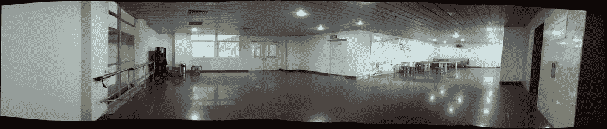

在水平方向上捕捉的全景图像

为了捕捉全景图像，您必须在场景的不同角度捕捉许多图像，如下面的图所示。例如，您在房间的左侧拍摄第一张照片。然后，您将手机直接移动到新的角度开始捕捉。所有图像将被拼接在一起以创建全景图像。

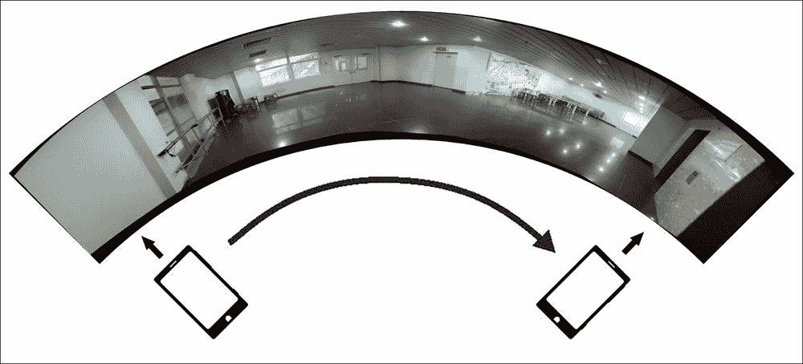

展示如何平移手机以创建全景图像的插图

通常，全景应用程序仅支持水平方向上的图像捕捉。使用 OpenCV 的拼接模块，我们可以通过在两个方向上捕捉更多图像来扩展图像的高度。以下图显示了可以通过在水平和垂直方向上改变相机视图来捕捉的图像。

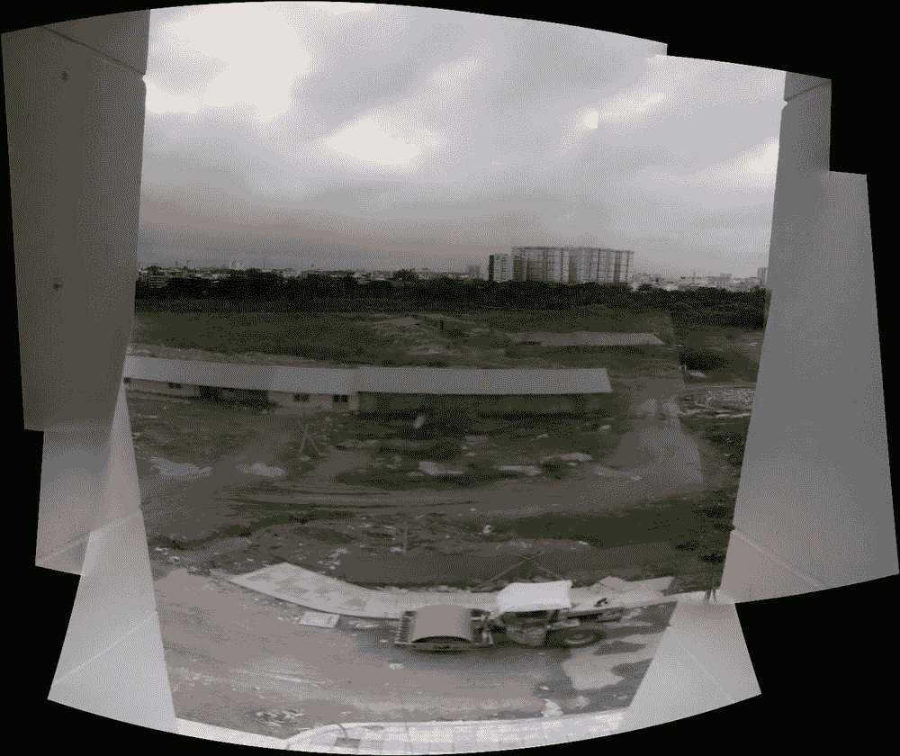

在两个方向上捕捉的全景图像

在本章中，我们将使用 OpenCV 3.0.0 在 Android 中实现全景应用程序。本章包含两个主要部分：

+   **Android 部分**：我们将使用 Android Studio 实现用户界面。在本章中，我们只实现了带有两个按钮（**捕获**和**保存**）的全景捕获活动。当捕捉到全景时，我们将将其保存到手机的内部存储中。

+   **OpenCV 部分**：我们将展示如何将 OpenCV 集成到 Android Studio 中，使用 NDK/JNI，并实现从 Android 部分捕获的一系列图像创建全景图像的代码。

在接下来的章节中，我们将展示在 Android Studio 中创建用户界面的过程。如果您想回顾 OpenCV 代码，您可以前往*将 OpenCV 集成到 Android Studio*部分，稍后再回来。

# 安卓部分 - 应用程序用户界面

在本节中，我们将向您展示一个基本用户界面，用于捕获并将全景保存到内部存储。基本上，用户将看到相机预览图像的全屏。当用户按下**捕获**按钮时，应用程序将捕获当前场景并将捕获的图像放置在当前视图之上的叠加层上。因此，用户知道他们刚刚捕获了什么，并且可以改变手机位置以捕获下一张图像。

以下是在用户打开应用程序后以及用户捕获图像时的应用程序截图：

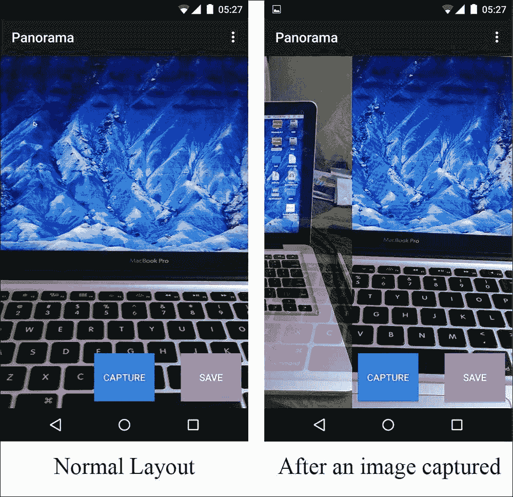

用户捕获图像前后的用户界面示例

## 设置活动布局

首先，我们将使用 Android Studio 创建一个新的 Android 项目，其中包含一个空白活动。然后，我们将编辑`app/src/main/res/layout/activity_main.xml`中的 MainActivity 布局 xml，如下所示：

```py
<RelativeLayout   

    android:layout_width="match_parent"
    android:layout_height="match_parent"
    tools:context=".MainActivity">
    <SurfaceView
        android:id="@+id/surfaceView"
        android:layout_width="match_parent"
        android:layout_height="match_parent"
        />
    <SurfaceView
        android:id="@+id/surfaceViewOnTop"
        android:layout_width="match_parent"
        android:layout_height="match_parent"
        />
    <Button
        android:id="@+id/capture"
        android:text="Capture"
        android:layout_width="wrap_content"
        android:layout_height="70dp"
        android:layout_alignParentBottom="true"
        android:layout_centerHorizontal="true"
        android:layout_marginBottom="10dp"
        android:padding="10dp"
        android:textColor="#FFF"
        android:background="@android:color/holo_blue_dark"
        />
    <Button
        android:id="@+id/save"
        android:text="Save"
        android:layout_width="wrap_content"
        android:layout_height="70dp"
        android:padding="10dp"
        android:textColor="#FFF"
        android:background="@android:color/holo_purple"
        android:layout_marginRight="10dp"
        android:layout_alignTop="@+id/capture"
        android:layout_alignParentRight="true"
        android:layout_alignParentEnd="true" />
</RelativeLayout>
```

在此布局 xml 文件中，我们有两个 SurfaceView——一个用于相机预览，一个用于叠加层。我们还有一个按钮用于捕获图像，另一个按钮用于将全景图像保存到内部存储。

## 捕获相机帧

在本节中，我们将实现捕获相机帧并在 ID 为`surfaceView`的 SurfaceView 上查看的过程。

在`MainActivity`类的开头，我们将创建一些对象以与布局一起使用：

```py
public class MainActivity extends ActionBarActivity {
    private Button captureBtn, saveBtn; // used to interact with capture and save Button in UI
    private SurfaceView mSurfaceView, mSurfaceViewOnTop; // used to display the camera frame in UI
    private Camera mCam;
    private boolean isPreview; // Is the camera frame displaying?
    private boolean safeToTakePicture = true; // Is it safe to capture a picture?
```

在前面的代码中，我们创建了两个按钮和两个`SurfaceViews`以与用户界面交互。我们还创建了一个 Camera 对象`mCam`以打开相机。在我们的实现中，我们将使用 Android 方法打开相机并获取视频帧。OpenCV 还提供了一些其他打开相机的方法。然而，我们发现它们可能不会在所有 Android 设备上很好地工作，所以我们更喜欢使用 Android 方法中的相机。在本章中，我们只需要 Android API 中的 Camera 对象。这种方法的优势是您可以预期它在几乎任何 Android 设备上都能工作。缺点是您必须进行一些从相机字节数组到 Android Bitmap 的转换，以在 UI 上显示，并将 OpenCV Mat 用于图像处理。

### 注意

如果您想体验 OpenCV 类与相机交互，您可能想查看本书的第七章 7.陀螺仪视频稳定，*陀螺仪视频稳定*。

在`onCreate`函数中，我们按以下方式设置这些对象：

```py
@Override
protected void onCreate(Bundle savedInstanceState){
    super.onCreate(savedInstanceState);
    setContentView(R.layout.activity_main);

    isPreview = false;
    mSurfaceView = (SurfaceView)findViewById(R.id.surfaceView);
    mSurfaceView.getHolder().addCallback(mSurfaceCallback);

    mSurfaceViewOnTop = (SurfaceView)findViewById(R.id.surfaceViewOnTop);
    mSurfaceViewOnTop.setZOrderOnTop(true);    // necessary
    mSurfaceViewOnTop.getHolder().setFormat(PixelFormat.TRANSPARENT);

    captureBtn = (Button) findViewById(R.id.capture);
    captureBtn.setOnClickListener(captureOnClickListener);

    saveBtn = (Button) findViewById(R.id.save);
    saveBtn.setOnClickListener(saveOnClickListener);
}
```

首先，我们将`isPreview`初始化为 false，并将布局中的`mSurfaceView`分配给`SurfaceView`。然后，我们获取`mSurfaceView`的持有者并向其添加一个回调。变量`mSurfaceCallback`是我们稍后将要创建的`SurfaceHolder.Callback`实例。我们还把`mSurfaceViewOnTop`分配给布局中的另一个`SurfaceView`，因为我们希望这个`SurfaceView`成为相机视图的叠加层。我们需要设置 Z 顺序为 true，并将持有者格式设置为`TRANSPARENT`。最后，我们设置捕获和保存按钮，并设置相应的`OnClickListener`。在下一部分，我们将专注于在`SurfaceView`上显示相机帧。因此，我们将创建一个基本的`OnClickListener`，如下所示：

```py
View.OnClickListener captureOnClickListener = new View.OnClickListener() {
    @Override
    public void onClick(View v) {
    }
};
View.OnClickListener saveOnClickListener = new View.OnClickListener() {
    @Override
    public void onClick(View v) {
    }
};
```

### 使用 Camera API 获取相机帧

正如我们之前所说的，我们将使用 Android API 在 Android 中获取相机帧。目前，有两个版本的 Camera API，即`android.hardware.Camera`和`android.hardware.camera2`。我们将使用`android.hardware.Camera`，因为它支持大多数 Android 4.4 及以下版本的设备。在 Android 5.0 及以后的版本中，此 API 已被弃用，并由 camera2 替代。我们仍然可以在 Android 5.0 中使用`android.hardware.Camera`。如果您想针对 Android 5.0，我们建议您在您的应用程序中尝试使用 camera2。

为了使用相机，我们需要在`AndroidManifest.xml`中添加以下行以获取对相机的权限。此外，我们还请求写入存储的权限，因为我们将会将全景图像保存到内部存储。

```py
<uses-feature android:name="android.hardware.camera" />
<uses-permission android:name="android.permission.CAMERA" />
<uses-permission android:name="android.permission.WRITE_EXTERNAL_STORAGE" />
```

我们希望将`mSurfaceView`设置为显示相机帧，因此我们将在`mSurfaceView`的回调中设置相机参数。我们需要创建变量`mSurfaceCallback`，如下所示：

```py
SurfaceHolder.Callback mSurfaceCallback = new SurfaceHolder.Callback(){
    @Override
    public void surfaceCreated(SurfaceHolder holder) {
        try {
            // Tell the camera to display the frame on this surfaceview
            mCam.setPreviewDisplay(holder);
        } catch (IOException e) {
            e.printStackTrace();
        }
    }
    @Override
    public void surfaceChanged(SurfaceHolder holder, int format, int width, int height) {
        // Get the default parameters for camera
        Camera.Parameters myParameters = mCam.getParameters();
        // Select the best preview size
        Camera.Size myBestSize = getBestPreviewSize( myParameters );
        if(myBestSize != null){
            // Set the preview Size
            myParameters.setPreviewSize(myBestSize.width, myBestSize.height);
            // Set the parameters to the camera
            mCam.setParameters(myParameters);
            // Rotate the display frame 90 degree to view in portrait mode
            mCam.setDisplayOrientation(90);
            // Start the preview
            mCam.startPreview();
            isPreview = true;
        }
    }
    @Override
    public void surfaceDestroyed(SurfaceHolder holder) {
    }
};
```

在此代码中，我们在`surfaceCreated`函数中调用`setPreviewDisplay`方法，告诉相机在`mSurfaceView`上显示相机帧。之后，在`surfaceChanged`函数中，我们设置相机参数，将显示方向更改为 90 度并开始预览过程。`getBestPreviewSize`函数是一个获取具有最大像素数的预览尺寸的函数。`getBestPreviewSize`很简单，如下所示：

```py
private Camera.Size getBestPreviewSize(Camera.Parameters parameters){
    Camera.Size bestSize = null;
    List<Camera.Size> sizeList = parameters.getSupportedPreviewSizes();
    bestSize = sizeList.get(0);
    for(int i = 1; i < sizeList.size(); i++){
        if((sizeList.get(i).width * sizeList.get(i).height) >
                (bestSize.width * bestSize.height)){
            bestSize = sizeList.get(i);
        }
    }
    return bestSize;
}
```

最后，我们需要在`onResume`中添加一些代码来打开相机，并在`onPause`中释放相机：

```py
@Override
protected void onResume() {
    super.onResume();
    mCam = Camera.open(0); // 0 for back camera
}
@Override
protected void onPause() {
    super.onPause();
    if(isPreview){
        mCam.stopPreview();
    }
    mCam.release();
    mCam = null;
    isPreview = false;
}
```

在这个时候，我们可以在真实设备上安装并运行应用程序。以下图显示了在运行 Android 5.1.1 的 Nexus 5 上我们的应用程序的截图：


Nexus 5 在 Android 5.1.1 上运行 Camera 预览模式的截图

在我们的应用程序中，我们不希望布局旋转，因此我们将活动方向设置为纵向模式。这是可选的。如果您想这样做，您只需在`AndroidManifest.xml`中更改您的活动，如下所示：

```py
<activity   
    android:screenOrientation="portrait"
    android:name=".MainActivity"
    android:label="@string/app_name" >
```

## 实现捕获按钮

在本节中，我们将向您展示如何实现**捕获**按钮的 `OnClickListener`。当用户点击**捕获**按钮时，我们希望应用程序能够拍摄当前场景的图片。使用 Camera API，我们可以使用 `takePicture` 函数来捕获图片。这个函数的好处是输出图像的分辨率非常高。例如，当我们的应用程序在 Nexus 5 上运行时，尽管预览大小是 1920x1080，但捕获图像的分辨率是 3264x2448。我们将 `captureOnClickListener` 改动如下：

```py
View.OnClickListener captureOnClickListener = new View.OnClickListener() {
    @Override
    public void onClick(View v) {
        if(mCam != null && safeToTakePicture){
            // set the flag to false so we don't take two picture at a same time
            safeToTakePicture = false;
            mCam.takePicture(null, null, jpegCallback);
        }
    }
};
```

在 `onClick` 函数中，我们检查相机是否已初始化，并且标志 `safeToTakePicture` 是 `true`。然后，我们将标志设置为 `false`，这样我们就不可能在同一时间拍摄两张图片。Camera 实例的 `takePicture` 函数需要三个参数。第一个和第二个参数分别是快门回调和原始数据回调。这些函数在不同的设备上可能被调用得不同，所以我们不想使用它们，并将它们设置为 null。最后一个参数是当相机以 JPEG 格式保存图片时被调用的回调。

```py
Camera.PictureCallback jpegCallback = new Camera.PictureCallback() {
    public void onPictureTaken(byte[] data, Camera camera) {
        // decode the byte array to a bitmap
        Bitmap bitmap = BitmapFactory.decodeByteArray(data, 0, data.length);
        // Rotate the picture to fit portrait mode
        Matrix matrix = new Matrix();
        matrix.postRotate(90);
        bitmap = Bitmap.createBitmap(bitmap, 0, 0, bitmap.getWidth(), bitmap.getHeight(), matrix, false);

        // TODO: Save the image to a List to pass them to OpenCV method

        Canvas canvas = null;
        try {
            canvas = mSurfaceViewOnTop.getHolder().lockCanvas(null);
            synchronized (mSurfaceViewOnTop.getHolder()) {
                // Clear canvas
                canvas.drawColor(Color.TRANSPARENT, PorterDuff.Mode.CLEAR);

                // Scale the image to fit the SurfaceView
                float scale = 1.0f * mSurfaceView.getHeight() / bitmap.getHeight();
                Bitmap scaleImage = Bitmap.createScaledBitmap(bitmap, (int)(scale * bitmap.getWidth()), mSurfaceView.getHeight() , false);
                Paint paint = new Paint();
                // Set the opacity of the image
                paint.setAlpha(200);
                // Draw the image with an offset so we only see one third of image.
                canvas.drawBitmap(scaleImage, -scaleImage.getWidth() * 2 / 3, 0, paint);
            }
        } catch (Exception e) {
            e.printStackTrace();
        } finally {
            if (canvas != null) {
                mSurfaceViewOnTop.getHolder().unlockCanvasAndPost(canvas);
            }
        }
        // Start preview the camera again and set the take picture flag to true
        mCam.startPreview();
        safeToTakePicture = true;
    }
};
```

首先，`onPictureTaken` 提供了捕获图像的字节数组，因此我们希望将其解码为 Bitmap 实例。因为相机传感器以横幅模式捕获图像，所以我们希望应用一个旋转矩阵来获得竖幅模式的图像。然后，我们希望将此图像保存以传递一系列图像到 OpenCV 粘合模块。由于此代码需要 OpenCV 库，我们将稍后实现这部分。之后，我们将获得叠加 `SurfaceView` 的画布，并尝试在屏幕上绘制图像。以下是在预览层之上的叠加层的演示。最后，我们将再次启动预览过程，并将 `safeToTakePicture` 标志设置为 `true`。

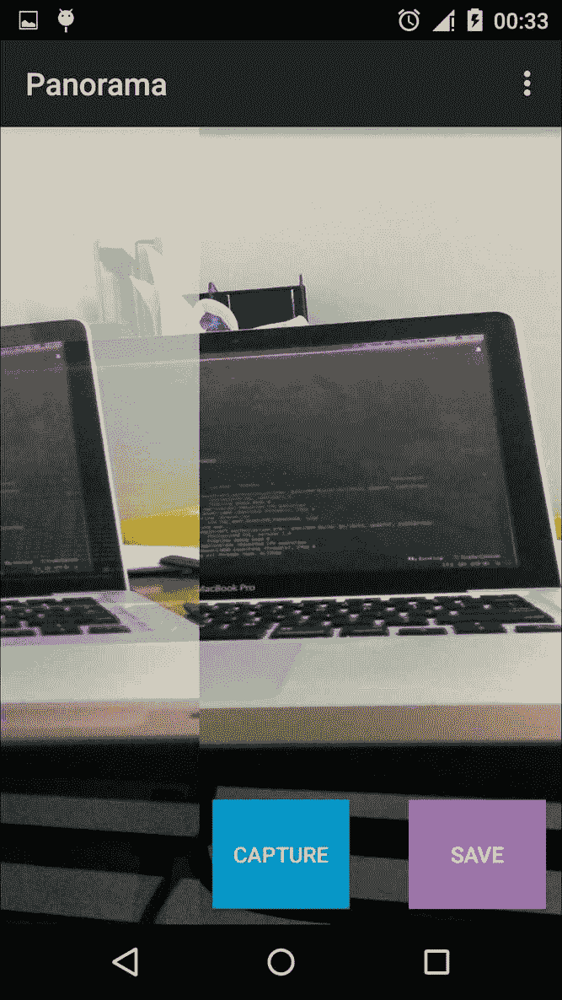

用户在 Nexus 5（运行 Android 5.1.1）上捕获图像后的应用程序截图

## 实现保存按钮

目前，**保存**按钮相当简单。我们将假设当用户点击**保存**按钮时，我们将启动一个新线程来执行图像处理任务：

```py
View.OnClickListener saveOnClickListener = new View.OnClickListener() {
    @Override
    public void onClick(View v) {
        Thread thread = new Thread(imageProcessingRunnable);
        thread.start();
    }
};
```

在 `imageProcessingRunnable` 中，我们希望在处理开始时显示一个处理对话框，并在一切完成后关闭对话框。为了实现这一点，我们首先创建一个 `ProgressDialog` 实例：

```py
ProgressDialog ringProgressDialog;
```

然后，`imageProcessingRunnable` 的实现如下：

```py
private Runnable imageProcessingRunnable = new Runnable() {
    @Override
    public void run() {
        showProcessingDialog();
        // TODO: implement OpenCV parts
        closeProcessingDialog();
    }
};
```

我们将简单地调用 `showProcessingDialog` 来显示进度对话框，并调用 `closeProcessingDialog` 来关闭对话框。中间的步骤相当复杂，需要大量的 OpenCV 函数，所以我们将其留到后面的部分。显示和关闭进度对话框的函数如下：

```py
private void showProcessingDialog(){
    runOnUiThread(new Runnable() {
        @Override
        public void run() {
            mCam.stopPreview();
            ringProgressDialog = ProgressDialog.show(MainActivity.this, "", "Panorama", true);
            ringProgressDialog.setCancelable(false);
        }
    });
}
```

```py
private void closeProcessingDialog(){
    runOnUiThread(new Runnable() {
        @Override
        public void run() {
            mCam.startPreview();
            ringProgressDialog.dismiss();
        }
    });
}
```

在 `showProcessingDialog` 中，我们将停止相机预览以减少设备上的不必要的计算成本，而在 `closeProcessingDialog` 中，我们将再次启动相机预览，以便用户可以捕获更多的全景图像。我们必须将这些代码放在 `runOnUiThread` 中，因为这些代码与 UI 元素交互。

在下一节中，我们将向您展示如何使用 OpenCV 实现应用程序的剩余部分。

# 将 OpenCV 集成到 Android Studio 中

在本节中，我们将向您展示如何使用原生开发套件将 OpenCV 集成到 Android Studio 中，并使用 C++ 中的 OpenCV 粘合模块创建最终的全景图像。我们还将使用 OpenCV Android SDK Java 进行一些计算，以展示 Java 和 C++ 接口之间的交互过程。

## 将 OpenCV Android SDK 编译到 Android Studio 项目

正式来说，OpenCV Android SDK 是一个 Eclipse 项目，这意味着我们无法简单地将其用于我们的 Android Studio 项目。我们需要将 OpenCV Android SDK 转换为 Android Studio 项目，并将其作为模块导入到我们的应用程序中。

### 注意

我们假设您已从 [`opencv.org/downloads.html`](http://opencv.org/downloads.html) 下载了最新的 OpenCV for Android。在撰写本文时，我们现在有 OpenCV for Android 3.0.0。

让我们将下载的文件解压到您喜欢的路径，例如，`/Volumes/Data/OpenCV/OpenCV-android-sdk`。

然后，我们需要打开一个新的 Android Studio 窗口并选择**导入项目**（Eclipse ADT、Gradle 等等）。在弹出的窗口中，你应该选择 `java` 文件夹在 `OpenCV-android-sdk/sdk/java`，然后点击**确定**。

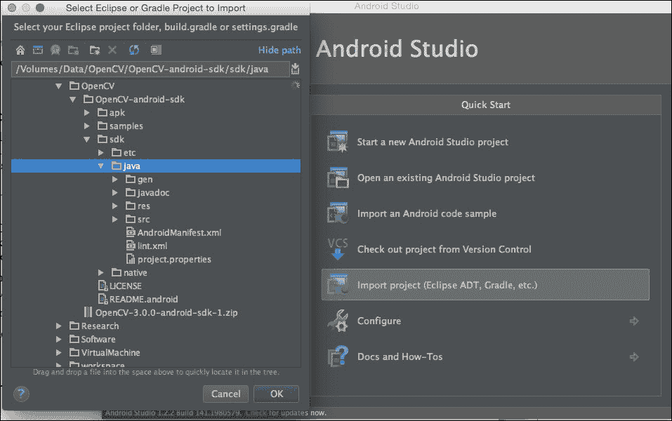

导入项目可视化

在下一个窗口中，我们将选择一个路径来存储新的 OpenCV SDK 项目。在我们的例子中，我们选择 `/Volumes/Data/OpenCV/opencv-java` 并点击**下一步**。

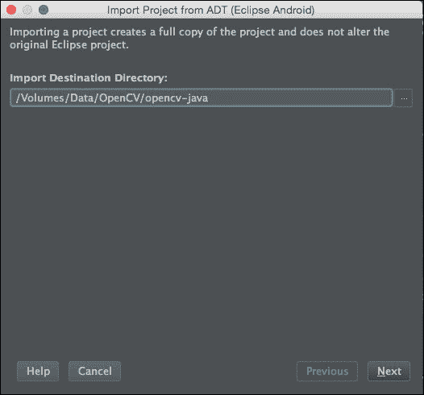

选择导入目标可视化

在最后一个窗口中，我们只需点击**完成**并等待 Android Studio 完成 Gradle 构建过程。基本上，Gradle 是 Android Studio 的默认构建系统。在这一步，我们想确保 OpenCV SDK 可以成功编译。一个常见错误是您尚未下载所需的 Android SDK。错误信息非常直接。您可以按照消息解决问题。在我们的例子中，正如以下截图所示，没有问题。


构建竞争可视化

此时，我们可以关闭此项目并打开我们的全景项目。

## 设置 Android Studio 以与 OpenCV 一起工作

为了在我们的项目中使用 OpenCV，我们需要将 OpenCV Android SDK 导入到我们的项目中。有了这个 SDK，我们可以使用 OpenCV Java API 并轻松执行图像处理任务。此外，我们必须进一步操作，告诉 Android Studio 编译 OpenCV C++ 代码以在 Native Development Kit (NDK) 中使用 OpenCV。我们将把这个部分分成三个小节：导入 Android SDK、创建 Java-C++ 交互和编译 OpenCV C++。

### 导入 OpenCV Android SDK

我们假设你已经打开了全景项目。我们需要按照以下方式导入上一节中转换的 OpenCV Android SDK：

**文件** | **新建** | **导入模块**

在 **新建模块** 窗口中，我们将选择源目录到转换后的项目。在我们的例子中，我们将选择 `/Volumes/Data/OpenCV/opencv-java`。然后，我们将勾选导入复选框，将模块名称更改为 `:opencv-java`，如以下截图所示，然后点击 **完成**：

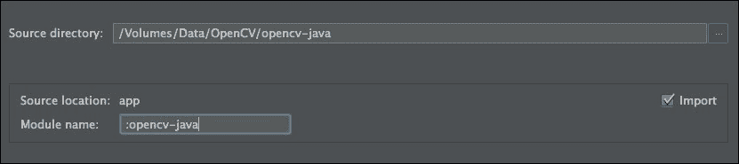

新建模块窗口

接下来，我们需要修改 `app` 文件夹中的 `build.gradle` 文件，在 `dependencies` 部分添加一行：

```py
dependencies {
    compile fileTree(dir: 'libs', include: ['*.jar'])
    compile 'com.android.support:appcompat-v7:22.1.1'

    compile project(":opencv-java")
}
```

最后，我们必须通过按钮 **Sync Project with Gradle Files** 同步项目。

### 注意

如果你只需要 OpenCV Java 接口而不想使用 OpenCV C++，你必须将 `OpenCV-android-sdk/sdk/native/libs` 中的 `libs` 文件夹复制到你的 `app/src/main` 文件夹。然后，你必须将以下 `loadLibrary` 代码添加到你的类文件中：

```py
static {
    //If you use OpenCV 2.*, use "opencv_java"
    System.loadLibrary("opencv_java3");
}
```

### 使用 Java Native Interface (JNI) 创建 Java 和 C++ 交互

在我们开始编译过程之前，我们将创建一个名为 `NativePanorama.java` 的类文件，并向 `NativePanorama` 类添加一个方法：

```py
public class NativePanorama {
    public native static void processPanorama(long[] imageAddressArray, long outputAddress);
}
```

`processPanorama` 方法将接收每个图像的长地址数组以及一个输出图像的长地址。

你必须重新构建项目才能遵循接下来的步骤。详细说明将在下一段落中：

+   使用 `javah` 命令行创建 C++ 头文件

+   在 `jni` 文件夹中为新建的头文件创建一个 `.cpp` 文件以实现 C++ 中的函数

你可能会注意到 `processPanorama` 方法之前的 `native` 关键字。这意味着我们将使用此方法在我们的应用程序中实现 Java 和 C++ 之间的交互。因此，我们需要创建一些头文件和源文件来实现我们的 C++ 代码。我们必须遵循 **Java Native Interface** (**JNI**) 来使用 C++ 代码，所以这个过程可能有点复杂，并且超出了本书的范围。

在以下部分，我们将向您展示使用 OpenCV C++ 的步骤。

### 注意

如果你想了解 JNI，你可能想查看以下 JNI 文档：

[`docs.oracle.com/javase/7/docs/technotes/guides/jni/`](http://docs.oracle.com/javase/7/docs/technotes/guides/jni/)

还可以查看 API 指南中提供的 JNI 小贴士，地址如下：

[`developer.android.com/training/articles/perf-jni.html`](http://developer.android.com/training/articles/perf-jni.html)

首先，我们将使用终端中的 `javah` 命令为 `processPanorama` 方法创建相应的 C++ 头文件。为了做到这一点，您需要打开您的机器上的终端，然后切换到 Android 应用程序中的 `app/src/main` 文件夹，并运行以下命令：

```py
javah -d jni -classpath ../../build/intermediates/classes/debug/ com.example.panorama.NativePanorama
```

您只需要验证包名和类文件名 `NativePanorama`。命令在终端上不会显示任何内容，如图所示。如果您遇到以下错误：**错误：找不到类文件 'com.example.panorama.NativePanorama'**，您可能需要重新构建项目。


使用 javah 命令后的终端

`javah` 命令的结果是，我们现在在 `app/src/main` 文件夹中有一个名为 `jni` 的文件夹，其中包含一个名为 `com_example_panorama_NativePanorama.h` 的文件。这个头文件包含一个用于与 Java 接口工作的函数。当调用 `processPanorama` 时，这个函数将在 C++ 中运行。

接下来，我们将在 `jni` 文件夹中创建一个名为 `com_example_panorama_NativePanorama.cpp` 的源文件。我们建议您将头文件中的函数声明复制到源文件中，并添加以下参数名称：

```py
#include "com_example_panorama_NativePanorama.h"
JNIEXPORT void JNICALL Java_com_example_panorama_NativePanorama_processPanorama
  (JNIEnv * env, jclass clazz, jlongArray imageAddressArray, jlong outputAddress){
}
```

剩下的唯一事情是我们需要编译 OpenCV C++ SDK，以便在先前的源文件中使用它。

### 使用 NDK/JNI 编译 OpenCV C++

为了在 C++ 代码中使用 OpenCV，我们需要编译 OpenCV C++，并使用 `Android.mk` 文件作为构建文件来构建和链接我们的 C++ 文件与 OpenCV 库。然而，Android Studio 默认不支持 `Android.mk`。我们需要做很多事情才能实现这一点。

首先，我们将打开 `local.properties` 文件，并将 `ndk.dir` 设置为 Android NDK 文件夹的路径。在我们的例子中，`local.properties` 将如下所示：

```py
sdk.dir=/Users/quanhua92/Library/Android/sdk
ndk.dir=/Users/quanhua92/Software/android-ndk-r10e
```

### 注意

您可以在以下位置获取 Android NDK：[`developer.android.com/ndk/index.html`](https://developer.android.com/ndk/index.html)

其次，我们打开应用程序文件夹中的 `build.gradle` 文件，并在顶部添加以下行：

```py
import org.apache.tools.ant.taskdefs.condition.Os
```

然后，我们需要在 `defaultConfig` 标签和 `buildType` 标签之间添加以下代码，以创建一个新的 Gradle 任务来构建 C++ 代码。

```py
// begin NDK OPENCV
sourceSets.main {
    jni.srcDirs = [] //disable automatic ndk-build call
}
task ndkBuild(type: Exec, description: 'Compile JNI source via NDK') {
    def rootDir = project.rootDir
    def localProperties = new File(rootDir, "local.properties")
    Properties properties = new Properties()
    localProperties.withInputStream { instr ->
        properties.load(instr)
    }
    def ndkDir = properties.getProperty('ndk.dir')
    if (Os.isFamily(Os.FAMILY_WINDOWS)) {
        commandLine "$ndkDir\\ndk-build.cmd",
                'NDK_PROJECT_PATH=build/intermediates/ndk',
                'NDK_LIBS_OUT=src/main/jniLibs',
                'APP_BUILD_SCRIPT=src/main/jni/Android.mk',
                'NDK_APPLICATION_MK=src/main/jni/Application.mk'
    } else {
        commandLine "$ndkDir/ndk-build",
                'NDK_PROJECT_PATH=build/intermediates/ndk',
                'NDK_LIBS_OUT=src/main/jniLibs',
                'APP_BUILD_SCRIPT=src/main/jni/Android.mk',
                'NDK_APPLICATION_MK=src/main/jni/Application.mk'
    }
}
tasks.withType(JavaCompile) {
    compileTask -> compileTask.dependsOn ndkBuild
}
//end
```

您可能想查看以下图中的我们的 `build.gradle` 的截图。

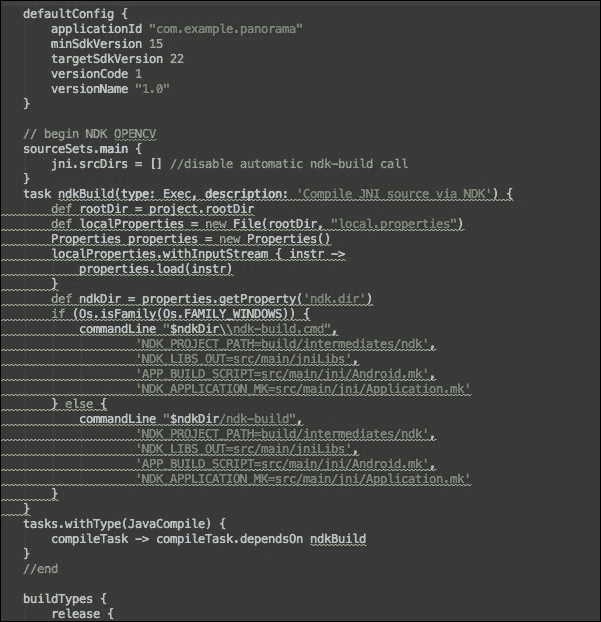

我们的 build.gradle 截图

接下来，我们在 `jni` 文件夹中创建一个名为 `Application.mk` 的文件，并将以下行放入其中：

```py
APP_STL := gnustl_static
APP_CPPFLAGS := -frtti -fexceptions
APP_ABI := all
APP_PLATFORM := android-16
```

最后，我们在 `jni` 文件夹中创建一个名为 `Android.mk` 的文件，并按照以下设置来使用 OpenCV 在我们的 C++ 代码中。您可能需要将 `OPENCVROOT` 变量更改为您机器上 OpenCV-android-sdk 的位置：

```py
LOCAL_PATH := $(call my-dir)

include $(CLEAR_VARS)
#opencv
OPENCVROOT:= /Volumes/Data/OpenCV/OpenCV-android-sdk
OPENCV_CAMERA_MODULES:=on
OPENCV_INSTALL_MODULES:=on
OPENCV_LIB_TYPE:=SHARED
include ${OPENCVROOT}/sdk/native/jni/OpenCV.mk

LOCAL_SRC_FILES := com_example_panorama_NativePanorama.cpp
LOCAL_LDLIBS += -llog
LOCAL_MODULE := MyLib

include $(BUILD_SHARED_LIBRARY)
```

使用前面的`Android.mk`，Android Studio 会将 OpenCV 构建到`libopencv_java3.so`中，并将我们的 C++代码构建到`app/src/main/jniLibs`文件夹中的`libMyLib.so`中。我们必须打开我们的`MainActivity.java`并加载这个库，以便在我们的应用程序中使用，如下所示：

```py
public class MainActivity extends ActionBarActivity {
    static{
        System.loadLibrary("opencv_java3");
        System.loadLibrary("MyLib");
    }
```

### 注意

如果您使用 OpenCV Android SDK 版本 2.*，您应该加载`opencv_java`而不是`opencv_java3`。

## 实现 OpenCV Java 代码

在本节中，我们将向您展示 OpenCV 在 Java 端，为 OpenCV C++端的拼接模块准备数据。

首先，当用户按下**捕获**按钮时，我们将创建一个列表来存储所有捕获的图像：

```py
private List<Mat> listImage = new ArrayList<>();
```

然后，在`jpegCallback`变量的`onPictureTaken`方法中，我们想要将捕获的 Bitmap 转换为 OpenCV Mat 并存储在这个`listImage`列表中。您需要在 Canvas 绘制部分之前添加这些行：

```py
Mat mat = new Mat();
Utils.bitmapToMat(bitmap, mat);
listImage.add(mat);
```

最后，当用户点击**保存**按钮时，我们希望将`listImage`中图像的地址发送到 OpenCV C++代码以执行拼接过程。

在`imageProcessingRunnable`中，我们将在调用`showProcessingDialog`函数之后添加以下代码：

```py
try {
    // Create a long array to store all image address
    int elems=  listImage.size();
    long[] tempobjadr = new long[elems];
    for (int i=0;i<elems;i++){
        tempobjadr[i]=  listImage.get(i).getNativeObjAddr();
    }
    // Create a Mat to store the final panorama image
    Mat result = new Mat();
    // Call the OpenCV C++ Code to perform stitching process
    NativePanorama.processPanorama(tempobjadr, result.getNativeObjAddr());

    // Save the image to external storage
    File sdcard = Environment.getExternalStorageDirectory();
    final String fileName = sdcard.getAbsolutePath() + "/opencv_" + System.currentTimeMillis() + ".png";
    Imgcodecs.imwrite(fileName, result);

    runOnUiThread(new Runnable() {
        @Override
        public void run() {
            Toast.makeText(getApplicationContext(), "File saved at: " + fileName, Toast.LENGTH_LONG).show();
        }
    });

    listImage.clear();
} catch (Exception e) {
    e.printStackTrace();
}
```

在前面的代码中，我们将创建一个长数组来存储每个 Mat 图像的本地地址。然后，我们将传递这个长数组和一个`Mat result`的本地地址，以存储全景图像。OpenCV C++代码将运行以执行拼接模块的拼接。之后，我们将结果保存到外部存储，并做一个简单的 toast 提示用户全景已保存。最后，我们清除`listImage`列表以开始新的部分。

## 实现 OpenCV C++代码

在此刻，我们想要在 OpenCV C++中实现`processPanorama`。实现非常简单；我们只需编辑`com_example_panorama_NativePanorama.cpp`文件，如下所示：

```py
#include "com_example_panorama_NativePanorama.h"
#include "opencv2/opencv.hpp"
#include "opencv2/stitching.hpp"

using namespace std;
using namespace cv;

JNIEXPORT void JNICALL Java_com_example_panorama_NativePanorama_processPanorama
  (JNIEnv * env, jclass clazz, jlongArray imageAddressArray, jlong outputAddress){
  // Get the length of the long array
  jsize a_len = env->GetArrayLength(imageAddressArray);
  // Convert the jlongArray to an array of jlong
  jlong *imgAddressArr = env->GetLongArrayElements(imageAddressArray,0);
  // Create a vector to store all the image
  vector< Mat > imgVec;
  for(int k=0;k<a_len;k++)
  {
    // Get the image
    Mat & curimage=*(Mat*)imgAddressArr[k];
    Mat newimage;
    // Convert to a 3 channel Mat to use with Stitcher module
    cvtColor(curimage, newimage, CV_BGRA2RGB);
    // Reduce the resolution for fast computation
    float scale = 1000.0f / curimage.rows;
    resize(newimage, newimage, Size(scale * curimage.rows, scale * curimage.cols));
    imgVec.push_back(newimage);
  }
  Mat & result  = *(Mat*) outputAddress;
  Stitcher stitcher = Stitcher::createDefault();
  stitcher.stitch(imgVec, result);
  // Release the jlong array 
  env->ReleaseLongArrayElements(imageAddressArray, imgAddressArr ,0);
}
```

在前面的代码中，我们将图像地址的长数组转换为图像并推入一个名为`imgVec`的向量中。我们还调整了图像大小以加快计算速度。拼接模块非常容易使用。

首先，我们将创建一个`Stitcher`实例。

```py
  Stitcher stitcher = Stitcher::createDefault();
```

然后，我们使用这个拼接器来拼接我们的 Mat 向量图像。全景图像将被保存到一个结果 Mat 中。

下面的截图显示了使用默认配置处理的全景图像示例：

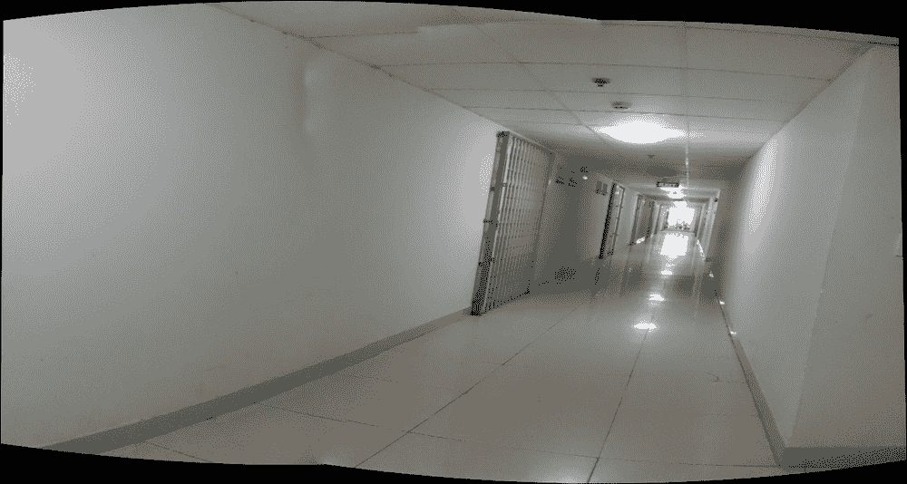

在走廊中捕获的示例图像

# 应用程序展示

在本节中，我们展示了使用我们的应用程序捕获的一些全景图像。您可以看到，该应用程序能够处理水平和垂直方向的全景图像。

首先，这是从建筑物的五楼捕获的图像。我们通过窗户玻璃拍照，所以光线很暗。然而，全景效果很好，因为有很多细节，所以特征匹配器可以做得很好。

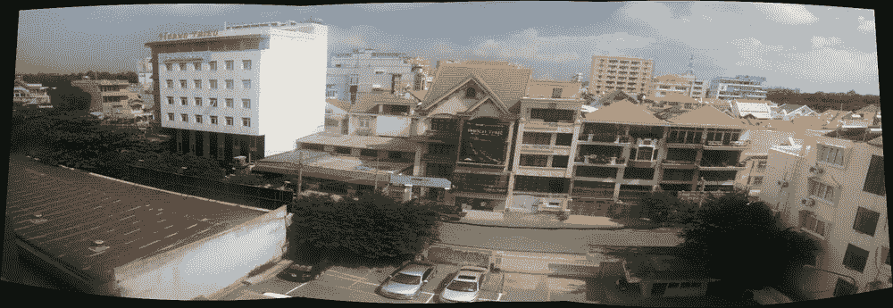

应用程序捕获的示例图像

下面的截图是在傍晚时分从阳台拍摄的。全景图的左上角区域不好，因为这个区域只包含一面空墙和天空。因此，图像之间可比较的特征太少。因此，最终全景图在这个区域并不完美。

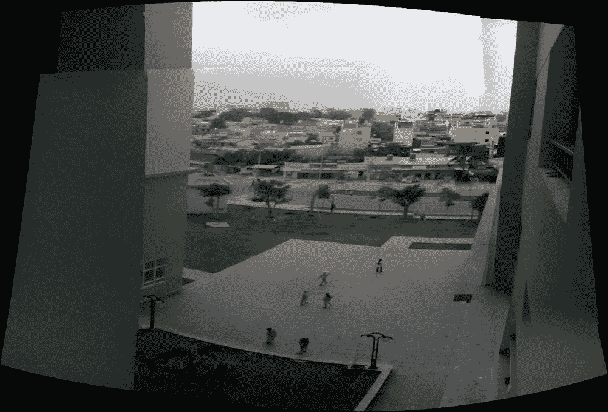

应用在傍晚捕获的样本图像

下面的截图是通过窗户拍摄的。图像的下半部分很好。然而，由于缺乏特征，天空仍然存在一些问题，就像之前的图像一样。


应用在傍晚时分捕获的另一张样本图像

以下图像是在下午拍摄的建筑前庭院中的。光线很好，有很多细节，所以最终全景图完美无瑕。

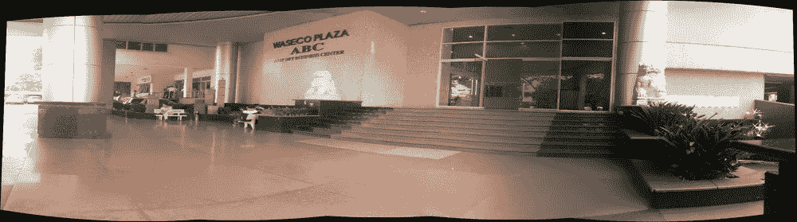

应用在下午捕获的样本图像

这张图片与上一张图片拍摄于同一时期。然而，这张图片以广泛的视角捕捉，每个拍摄角度的光线都不同。因此，最终全景图的照明并不一致。

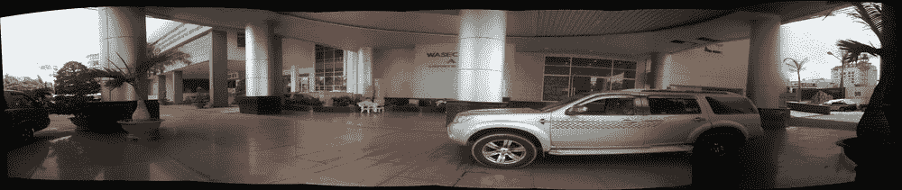

应用在下午捕获的另一张样本图像

# 进一步改进

在本节中，我们将展示一些在创建功能齐全的全景应用时可以考虑的改进。

首先，你可以为用户创建一个更好的用户界面来捕捉全景图像。当前的用户界面没有显示应用程序可以双向捕捉图像。建议使用 Android API 中的运动传感器（加速度计和陀螺仪）来获取设备的旋转并调整叠加图像的位置。

### 注意

运动传感器 API 文档可在[`developer.android.com/guide/topics/sensors/sensors_motion.html`](http://developer.android.com/guide/topics/sensors/sensors_motion.html)找到。

其次，当前应用程序调整捕获的图像大小以减少计算时间。你可能想更改 Stitcher 的一些参数以获得更好的性能。我们建议你查看拼接模块的文档以获取更多详细信息。在我们的实现中，我们将使用 Stitcher 类进行简化。然而，OpenCV 仓库中有一个详细的示例在`samples/cpp/stitching_detailed.cpp`，其中展示了许多选项来提高最终全景图的稳定性和质量。

### 注意

使用拼接模块的详细示例可在[`github.com/Itseez/opencv/blob/master/samples/cpp/stitching_detailed.cpp`](https://github.com/Itseez/opencv/blob/master/samples/cpp/stitching_detailed.cpp)找到。

第三，您可以更改我们应用程序的逻辑以执行实时拼接。这意味着每当捕获到两张图像时，我们就制作一张拼接图像。然后，我们借助 360 度用户界面展示结果，以便用户知道如果有的话，哪个是缺失的区域。

# 摘要

本章展示了在 Android Studio 中使用的完整全景应用程序，其中 OpenCV 3 在 Java 接口和 C++接口中均得到使用，并得到了原生开发工具包（NDK）的支持。本章还介绍了如何使用 OpenCV 库与 Android Camera API 结合。此外，本章还展示了使用 OpenCV 3 拼接模块的一些基本实现，以执行图像拼接。
