# 第五章：工业应用中的通用目标检测

本章将向您介绍通用目标检测的世界，并更详细地探讨工业应用与标准学术研究案例相比的优势。正如许多人所知，OpenCV 3 包含著名的**Viola 和 Jones 算法**（作为 CascadeClassifier 类嵌入），该算法专门设计用于鲁棒的人脸检测。然而，相同的接口可以有效地用于检测任何满足您需求的物体类别。

### 注意

关于 Viola 和 Jones 算法的更多信息可以在以下出版物中找到：

使用简单特征的提升级联进行快速目标检测，Viola P. 和 Jones M.，(2001)。在计算机视觉和模式识别，2001 (CVPR 2001)。IEEE 计算机学会会议论文集，第 1 卷，第 I-511 页。IEEE。

本章假设您对 OpenCV 3 的级联分类接口有基本了解。如果没有，以下是一些理解此接口和提供的参数及软件的基本用法的好起点：

+   [`docs.opencv.org/master/modules/objdetect/doc/cascade_classification.html`](http://docs.opencv.org/master/modules/objdetect/doc/cascade_classification.html)

+   [`docs.opencv.org/master/doc/tutorials/objdetect/cascade_classifier/cascade_classifier.html`](http://docs.opencv.org/master/doc/tutorials/objdetect/cascade_classifier/cascade_classifier.html)

+   [`docs.opencv.org/master/doc/user_guide/ug_traincascade.html`](http://docs.opencv.org/master/doc/user_guide/ug_traincascade.html)

### 注意

或者，您可以简单地阅读 PacktPub 出版的关于此主题更详细讨论的书籍之一，例如第三章，*训练一个智能警报器来识别恶棍和他的猫*，来自 Joseph Howse 的*OpenCV for Secret Agents*一书。

在本章中，我将带您了解使用 Viola 和 Jones 人脸检测框架进行通用目标检测时的重要元素。您将学习如何调整您的训练数据以适应您的特定设置，如何使您的目标检测模型具有旋转不变性，并且您将找到关于如何通过智能地使用环境参数和情境知识来提高检测器精度的指南。我们将更深入地探讨实际的物体类别模型，并解释发生了什么，结合一些用于可视化目标检测实际过程的智能工具。最后，我们将探讨 GPU 的可能性，这将导致更快的处理时间。所有这些都将结合代码示例和通用目标检测的示例用例。

# 识别、检测和分类之间的区别

为了完全理解这一章，重要的是你要理解基于级联分类的 Viola 和 Jones 检测框架实际上是一种物体分类技术，并且它与物体识别的概念有很大不同。这导致计算机视觉项目中常见的错误，即人们在事先没有充分分析问题的情况下，错误地决定使用这项技术来解决问题。考虑以下图所示的设置，它由一个连接相机的计算机组成。计算机内部有四个物体的描述（飞机、杯子、汽车和蛇）。现在，我们考虑向系统的相机提供三个新图像的情况。

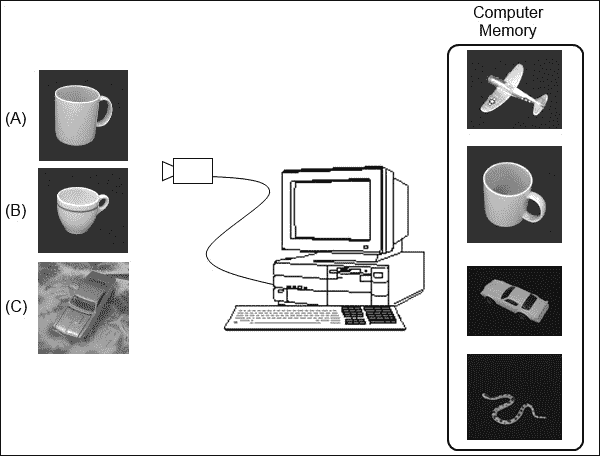

简单的计算机视觉设置

如果图像 A 呈现给系统，系统会创建给定输入图像的描述，并尝试将其与计算机内存数据库中图像的描述相匹配。由于特定的杯子略微旋转，杯子内存图像的描述符将与内存中其他物体图像的匹配更接近，因此这个系统能够成功识别出已知的杯子。这个过程被称为**物体识别**，并应用于我们知道我们想要在输入图像中找到的确切物体的情况。

|   | *"物体识别的目标是匹配（识别）特定的物体或场景。例如，识别特定的建筑，如比萨斜塔，或特定的画作，如蒙娜丽莎。即使物体在比例、相机视角、光照条件和部分遮挡等方面发生变化，也能识别出该物体。"* |   |
| --- | --- | --- |
|   | --*安德烈亚·韦达利和安德鲁·齐斯泽曼* |

然而，这项技术有一些缺点。如果一个物体呈现给系统，而图像数据库中没有该物体的描述，系统仍然会返回最接近的匹配，因此结果可能会非常误导。为了避免这种情况，我们倾向于在匹配质量上设置一个阈值。如果没有达到阈值，我们就简单地不提供匹配。

当图像 B 呈现给相同的系统时，我们会遇到一个新的问题。给定输入图像与内存中杯子图像的差异如此之大（不同大小、不同形状、不同图案等），以至于图像 B 的描述符将不会与内存中杯子的描述相匹配，这是物体识别的一个大缺点。当图像 C 呈现给系统时，问题甚至进一步加剧。在那里，计算机内存中的已知汽车被呈现给相机系统，但它呈现的设置和背景与内存中的完全不同。这可能导致背景对物体描述符的影响如此之大，以至于物体不再被识别。

**物体检测**更进一步；它试图通过学习更具体的物体描述而不是仅仅学习图像本身的描述来在变化的设置中找到给定的物体。在可检测的物体类别变得更加复杂，并且物体在多个输入图像中的变化很大——我们不再谈论单个物体检测，而是关于检测一个物体类别——这就是**物体分类**发挥作用的地方。

在物体分类中，我们试图学习一个通用的模型来处理物体类别中的大量变化，如下面的图所示：

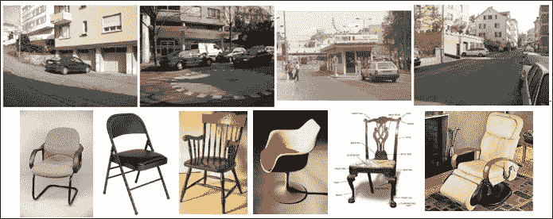

一个具有大量变化的物体类别示例：汽车和椅子/沙发

在这样一个单一物体类别中，我们试图应对不同的变化形式，如下面的图所示：

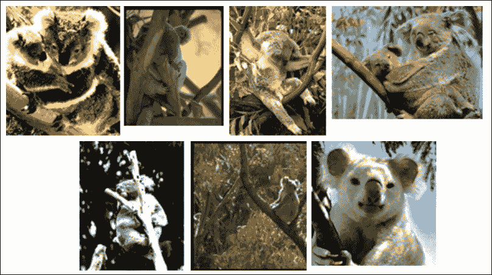

单个物体类别内的变化：光照变化、物体姿态、杂乱、遮挡、类内外观和视角

如果您计划使用 Viola 和 Jones 物体检测框架，确保您的应用程序实际上属于第三种和后续情况非常重要。在这种情况下，您想要检测的物体实例事先是未知的，并且它们具有很大的类内方差。每个物体实例可能在形状、颜色、大小、方向等方面有所不同。Viola 和 Jones 算法将所有这些方差建模成一个单一的对象模型，该模型能够检测到该类别的任何给定实例，即使该物体实例之前从未见过。这正是物体分类技术强大的地方，它们在给定的一组物体样本上很好地泛化，以学习整个物体类别的具体特征。

这些技术使我们能够为更复杂的类别训练物体检测器，因此物体分类技术在工业应用中非常理想，例如物体检查、物体拣选等，在这些应用中，通常使用的基于阈值的分割技术似乎由于设置中的这种大范围变化而失败。

如果您的应用程序不处理这些困难情况中的物体，那么考虑使用其他技术，如物体识别，如果它符合您的需求的话！

在我们开始实际工作之前，让我花点时间向您介绍在物体检测应用中常见的几个基本步骤。注意所有步骤并确保不要试图跳过其中的一些步骤以节省时间是非常重要的。这些都会影响物体检测接口的最终结果：

1.  **数据收集**：这一步包括收集构建和测试您的对象检测器所需的数据。数据可以从视频序列到由网络摄像头捕获的图像等多种来源获取。这一步还将确保数据格式正确，以便准备好传递到训练阶段。

1.  **实际模型训练**：在这一步，您将使用第一步收集到的数据来训练一个能够检测该模型类的对象模型。在这里，我们将研究不同的训练参数，并专注于定义适合您应用的正确设置。

1.  **对象检测**：一旦您有一个训练好的对象模型，您就可以使用它来尝试在给定的测试图像中检测对象实例。

1.  **验证**：最后，通过将每个检测与测试数据的手动定义的地面真实值进行比较，验证第三步的检测结果非常重要。我们将讨论各种用于效率和精度验证的选项。

让我们继续详细解释第一步，即数据收集，这也是本章的第一个子主题。

# 智能选择和准备特定于应用的训练数据

在本节中，我们将讨论根据情境背景需要多少训练样本，并强调在准备正训练样本的注释时的一些重要方面。

让我们先定义对象分类的原则及其与训练数据的关系，如图所示：

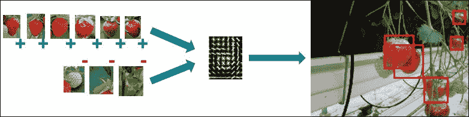

一个对象模型的正负训练数据的示例

算法的想法是，它接受一组正对象实例，这些实例包含您想要检测的对象的不同表现形式（这意味着在不同光照条件下、不同尺度、不同方向、小的形状变化等对象实例），以及一组负对象实例，这些实例包含您不希望模型检测到的所有内容。然后，这些实例被巧妙地组合成一个对象模型，并用于检测如图所示输入图像中的新对象实例。

## 训练数据量

许多对象检测算法高度依赖于大量的训练数据，或者至少这是预期的。这种范式是由于学术研究案例的出现，主要关注非常具有挑战性的案例，如行人和汽车检测。这些都是存在大量类内差异的对象类别，导致：

+   一个非常大的正负训练样本集，每个集合可能包含数千甚至数百万个样本。

+   移除所有污染训练集而不是帮助它的信息，例如颜色信息，而仅仅使用对这类类内变异性更鲁棒的特征信息，如边缘信息和像素强度差异。

因此，训练出的模型能够在几乎所有可能的情况下成功检测行人和汽车，但缺点是训练它们需要几周的处理时间。然而，当你观察更具有工业特定性的案例，例如从箱子中挑选水果或从传送带上抓取物体时，你会发现与这些极具挑战性的学术研究案例相比，物体和背景的变异性相当有限。这是一个我们可以利用的事实。

我们知道，最终对象模型的准确性高度依赖于所使用的训练数据。在需要检测器在所有可能情况下工作的案例中，提供大量数据似乎是合理的。复杂的学习算法将决定哪些信息是有用的，哪些不是。然而，在更受限的案例中，我们可以通过考虑我们的对象模型实际上需要做什么来构建对象模型。

例如，Facebook DeepFace 应用程序，使用神经网络方法在所有可能的情况下检测人脸，使用了 440 万张标记人脸。

### 注意

关于 DeepFace 算法的更多信息可以在以下找到：

Deepface: Closing the gap to human-level performance in face verification, Taigman Y., Yang M., Ranzato M. A., and Wolf L. (2014, June). In Computer Vision and Pattern Recognition (CVPR), 2014, IEEE Conference on (pp. 1701-1708).

因此，我们建议通过遵循一系列简单规则，只为你的对象模型使用有意义的正负样本训练样本：

+   对于正样本，仅使用**自然发生样本**。市面上有许多工具可以创建人工旋转、平移和倾斜的图像，将小型的训练集变成大型的训练集。然而，研究表明，这样得到的检测器性能不如简单地收集覆盖你应用实际情况的正样本。更好的做法是使用一组质量上乘的**高质量对象样本**，而不是使用大量低质量且不具有代表性的样本。

+   对于负样本，有两种可能的方法，但两者都始于这样一个原则：你收集负样本的情况是你检测器将要使用的情况，这与通常训练对象检测的方法非常不同，后者只是使用一大组不包含对象的随机样本作为负样本。

    +   要么将摄像头对准你的场景，开始随机抓取帧以从负窗口中采样。

    +   或者利用您的正图像的优势。裁剪实际的物体区域并将像素变为黑色。使用这些掩码图像作为负训练数据。请记住，在这种情况下，背景信息和窗口中实际发生的物体的比例需要足够大。如果您的图像充满了物体实例，裁剪它们将导致相关背景信息的完全丢失，从而降低负训练集的区分力。

+   尽量使用一个非常小的负样本集合。如果你的情况下只有 4 或 5 种背景情况可能发生，那么就没有必要使用 100 个负图像。只需从这五个具体案例中采样负窗口。

以这种方式高效地收集数据确保您最终会得到一个针对您特定应用的非常健壮的模型！然而，请记住，这也带来了一些后果。生成的模型将不会对训练时的情况之外的情景具有鲁棒性。然而，在训练时间和减少训练样本需求方面的好处完全超过了这一缺点。

### 备注

基于 OpenCV 3 的负样本生成软件可以在[`github.com/OpenCVBlueprints/OpenCVBlueprints/tree/master/chapter_5/source_code/generate_negatives/`](https://github.com/OpenCVBlueprints/OpenCVBlueprints/tree/master/chapter_5/source_code/generate_negatives/)找到。

您可以使用负样本生成软件生成如图所示的样本，其中草莓的物体注释被移除并用黑色像素替换。

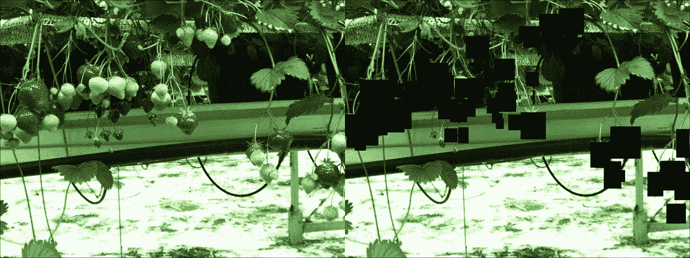

负图像生成工具输出示例，其中注释被裁剪并用黑色像素替换

如您所见，物体像素与背景像素之间的比例仍然足够大，以确保模型不会仅基于这些黑色像素区域训练其背景。请记住，通过简单地收集负图像来避免使用这些黑色像素化图像的方法，始终是更好的。然而，许多公司忘记了数据收集的这个重要部分，最终导致没有对应用有意义的负数据集。我进行的几个测试证明，使用来自应用随机帧的负数据集比基于黑色像素裁剪的图像具有更强的负区分力。

## 为正样本创建物体注释文件

在准备您的正数据样本时，花些时间在注释上是很重要的，这些注释是您物体实例在较大图像中的实际位置。没有适当的注释，您将永远无法创建出优秀的物体检测器。市面上有许多注释工具，但我基于 OpenCV 3 为您制作了一个，它允许您快速遍历图像并在其上添加注释。

### 备注

基于 OpenCV 3 的对象标注软件可以在[`github.com/OpenCVBlueprints/OpenCVBlueprints/tree/master/chapter_5/source_code/object_annotation/`](https://github.com/OpenCVBlueprints/OpenCVBlueprints/tree/master/chapter_5/source_code/object_annotation/)找到。

OpenCV 团队非常友好，将此工具集成到主仓库的“apps”部分。这意味着，如果您在安装过程中构建并安装了 OpenCV 应用，则可以使用以下命令访问该工具：

```py
/opencv_annotation -images <folder location> -annotations <output file>

```

使用该软件相当简单：

1.  首先，在 GitHub 文件夹中的特定项目内运行 CMAKE 脚本。运行 CMAKE 后，软件将通过可执行文件提供访问。这种方法适用于本章中的每个软件组件。运行 CMAKE 界面相当简单：

    ```py
    cmakemake
    ./object_annotation -images <folder location> -annotations <output file>

    ```

1.  这将生成一个需要一些输入参数的可执行文件，包括正图像文件的位置和输出检测文件。

    ### 注意

    请记住，始终分配所有文件的绝对路径！

1.  首先，将您的正图像文件夹的内容解析到文件中（通过在对象标注文件夹内使用的提供的`folder_listing`软件），然后执行标注命令：

    ```py
    ./folder_listing –folder <folder> -images <images.txt>

    ```

1.  文件夹列表工具应该生成一个文件，其外观与以下所示完全相同：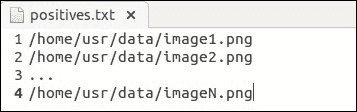

    文件夹列表工具生成的正样本文件示例

1.  现在，使用以下命令启动标注工具：

    ```py
    ./object_annotation –images <images.txt> -annotations <annotations.txt>

    ```

1.  这将启动软件，并在窗口中显示第一张图像，准备应用标注，如图所示：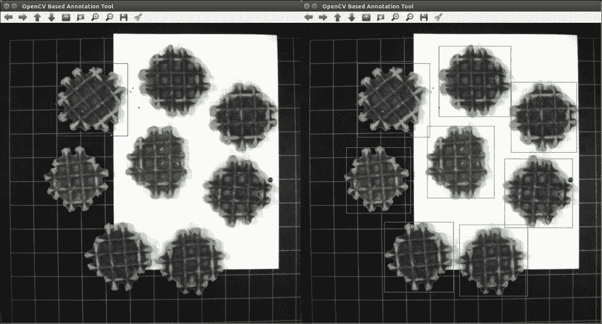

    对象标注工具的示例

1.  您可以从选择对象的左上角开始，然后移动鼠标直到达到对象的右下角，这可以在前图的左侧部分看到。然而，该软件允许您从每个可能的角落开始标注。如果您对选择不满意，则重新应用此步骤，直到标注符合您的需求。

1.  一旦您同意所选的边界框，请按确认选择的按钮，默认为键 *C*。这将确认标注，将其颜色从红色变为绿色，并将其添加到标注文件中。请确保只有当您 100%确信选择时才接受标注。

1.  对同一图像重复前面的两个步骤，直到您已标注图像中的每个对象实例，如前例图像的右侧部分所示。然后按保存结果的按钮，默认为 *N* 键。

1.  最后，您将得到一个名为`annotations.txt`的文件，它结合了图像文件的存储位置以及训练图像中出现的所有对象实例的地面真实位置。

### 注意

如果您想调整所有单独操作所需的按钮，那么请打开`object_annotation.cpp`文件，浏览到第 100 行和第 103 行。在那里，您可以调整分配给要用于操作的按钮的 ASCII 值。

您可以在[`www.asciitable.com/`](http://www.asciitable.com/)找到分配给键盘键的所有 ASCII 码的概述。

软件输出的结果是在每个正样本文件夹中，一个`*.txt`文件的对象检测列表，其结构如下所示（以下图所示）：

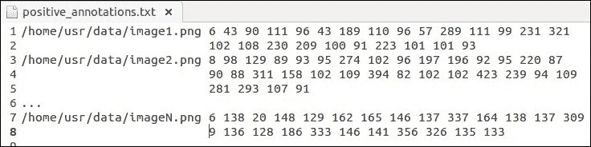

物体标注工具的示例

它从文件夹中每个图像的绝对文件位置开始。有选择不使用相对路径，因为这样文件将完全依赖于其存储的位置。然而，如果您知道自己在做什么，那么相对于可执行文件使用相对文件位置应该可以正常工作。使用绝对路径使其更通用且更安全。文件位置后面跟着该特定图像的检测数量，这使我们事先知道可以期待多少个地面真实对象。对于每个对象，存储到顶左角的(x, y)坐标与边界框的宽度和高度相结合。这为每个图像继续进行，每次检测输出文件中出现新行。

### 小贴士

对于进一步模型训练来说，将来自其他标注系统的每一组地面真实值首先转换为这种格式非常重要，以确保 OpenCV 3 中嵌入的级联分类软件能够良好工作。

当处理包含对象实例的正训练图像时，第二个需要注意的点是在实际放置对象实例边界框的方式上。一个良好且准确标注的地面真实集将始终为您提供更可靠的对象模型，并将产生更好的测试和准确度结果。因此，我建议在为您的应用程序进行物体标注时注意以下要点：

+   确保边界框包含整个对象，同时尽可能避免尽可能多的背景信息。对象信息与背景信息的比率应始终大于 80%。否则，背景可能会提供足够多的特征来训练您的模型，最终结果将是您的检测器模型专注于错误图像信息。

+   Viola 和 Jones 建议使用基于 24x24 像素模型的平方标注，因为它适合人脸的形状。然而，这并不是强制性的！如果你的目标类别更像是矩形，那么你应该标注矩形边界框而不是正方形。观察到人们倾向于将矩形形状的对象推入平方模型尺寸，然后 wonder 为什么它没有正确工作。以铅笔检测器为例，模型尺寸将更像是 10x70 像素，这与实际的铅笔尺寸相关。

+   尝试做简洁的图像批次。最好是重启应用程序 10 次，而不是在即将完成一组 1000 张带有相应标注的图像时系统崩溃。如果软件或你的计算机失败了，它确保你只需要重新做一小部分。

## 将你的正样本数据集解析到 OpenCV 数据向量

在 OpenCV 3 软件允许你训练级联分类器目标模型之前，你需要将你的数据推送到一个 OpenCV 特定的数据向量格式。这可以通过使用提供的 OpenCV 样本创建工具来完成。

### 注意

样本创建工具可以在[`github.com/Itseez/opencv/tree/master/apps/createsamples/`](https://github.com/Itseez/opencv/tree/master/apps/createsamples/)找到，并且如果 OpenCV 安装正确，它应该会自动构建，这使得可以通过`opencv_createsamples`命令使用。

通过应用以下命令行界面指令创建样本向量非常简单直接：

```py
./opencv_createsamples –info annotations.txt –vec images.vec –bg negatives.txt –num amountSamples –w model_width –h model_height

```

```py
https://github.com/OpenCVBlueprints/OpenCVBlueprints/tree/master/chapter_5/source_code/average_dimensions/.
```

```py
average haverage] are [60 60].If we would use those [60 60] dimensions, then we would have a model that can only detect apples equal and larger to that size. However, moving away from the tree will result in not a single apple being detected anymore, since the apples will become smaller in size.Therefore, I suggest reducing the dimensions of the model to, for example, [30 30]. This will result in a model that still has enough pixel information to be robust enough and it will be able to detect up to half the apples of the training apples size.Generally speaking, the rule of thumb can be to take half the size of the average dimensions of the annotated data and ensure that your largest dimension is not bigger than 100 pixels. This last guideline is to ensure that training your model will not increase exponentially in time due to the large model size. If your largest dimension is still over 100 pixels, then just keep halving the dimensions until you go below this threshold.
```

你现在已经准备好了你的正样本训练集。你最后应该做的事情是创建一个包含负图像的文件夹，从这些图像中你将随机采样负窗口，并对其应用文件夹列出功能。这将生成一个负数据引用文件，该文件将由训练界面使用。

# 训练目标模型时的参数选择

一旦你构建了一个不错的训练样本数据集，它已经准备好处理，那么是时候启动 OpenCV 3 的级联分类器训练软件了，它使用 Viola 和 Jones 级联分类器框架来训练你的目标检测模型。训练本身是基于应用提升算法在 Haar 小波特征或局部二值模式特征上。OpenCV 界面支持多种提升类型，但为了方便，我们使用常用的 AdaBoost 界面。

### 注意

如果你想了解特征计算的详细技术细节，请查看以下详细描述它们的论文：

+   **HAAR**: Papageorgiou, Oren 和 Poggio, "一个用于目标检测的通用框架", 国际计算机视觉会议, 1998 年。

+   **LBP**: T. Ojala, M. Pietikäinen, and D. Harwood (1994), "基于 Kullback 分布判别的纹理度量性能评估"，第 12 届 IAPR 国际模式识别会议（ICPR 1994）论文集，第 1 卷，第 582 - 585 页。

本节将更详细地讨论训练过程的几个部分。它将首先阐述 OpenCV 如何运行其级联分类过程。然后，我们将深入探讨所有提供的训练参数以及它们如何影响训练过程和结果的准确性。最后，我们将打开模型文件，更详细地查看其中可以找到的内容。

## 训练对象模型时涉及的训练参数

```py
-numNeg: This is the amount of negative samples used at each stage. However, this is not the same as the amount of negative images that were supplied by the negative data. The training samples negative windows from these images in a sequential order at the model size dimensions. Choosing the right amount of negatives is highly dependent on your application.

*   If your application has close to no variation, then supplying a small number of windows could simply do the trick because they will contain most of the background variance.
*   On the other hand, if the background variation is large, a huge number of samples would be needed to ensure that you train as much random background noise as possible into your model.
*   A good start is taking a ratio between the number of positive and the number of negative samples equaling 0.5, so double the amount of negative versus positive windows.
*   Keep in mind that each negative window that is classified correctly at an early stage will be discarded for training in the next stage since it cannot add any extra value to the training process. Therefore, you must be sure that enough unique windows can be grabbed from the negative images. For example, if a model uses 500 negatives at each stage and 100% of those negatives get correctly classified at each stage, then training a model of 20 stages will need 10,000 unique negative samples! Considering that the sequential grabbing of samples does not ensure uniqueness, due to the limited pixel wise movement, this amount can grow drastically.

`-numStages`: This is the amount of weak classifier stages, which is highly dependent on the complexity of the application.

*   The more stages, the longer the training process will take since it becomes harder at each stage to find enough training windows and to find features that correctly separate the data. Moreover, the training time increases in an exponential manner when adding stages.
*   Therefore, I suggest looking at the reported acceptance ratio that is outputted at each training stage. Once this reaches values of 10^(-5), you can conclude that your model will have reached the best descriptive and generalizing power it could get, according to the training data provided.
*   Avoid training it to levels of 10^(-5) or lower to avoid overtraining your cascade on your training data. Of course, depending on the amount of training data supplied, the amount of stages to reach this level can differ a lot.

`-bg`: This refers to the location of the text file that contains the locations of the negative training images, also called the negative samples description file.`-vec`: This refers to the location of the training data vector that was generated in the previous step using the create_samples application, which is built-in to the OpenCV 3 software.`-precalcValBufSize` and `-precalcIdxBufSize`: These parameters assign the amount of memory used to calculate all features and the corresponding weak classifiers from the training data. If you have enough RAM memory available, increase these values to 2048 MB or 4096 MB, which will speed up the precalculation time for the features drastically.`-featureType`: Here, you can choose which kind of features are used for creating the weak classifiers.

*   HAAR wavelets are reported to give higher accuracy models.
*   However, consider training test classifiers with the LBP parameter. It decreases training time of an equal sized model drastically due to the integer calculations instead of the floating point calculations.

`-minHitRate`: This is the threshold that defines how much of your positive samples can be misclassified as negatives at each stage. The default value is 0.995, which is already quite high. The training algorithm will select its stage threshold so that this value can be reached.

*   Making it 0.999, as many people do, is simply impossible and will make your training stop probably after the first stage. It means that only 1 out of 1,000 samples can be wrongly classified over a complete stage.
*   If you have very challenging data, then lowering this, for example, to 0.990 could be a good start to ensure that the training actually ends up with a useful model.

`-maxFalseAlarmRate`: This is the threshold that defines how much of your negative samples need to be classified as negatives before the boosting process should stop adding weak classifiers to the current stage. The default value is 0.5 and ensures that a stage of weak classifier will only do slightly better than random guessing on the negative samples. Increasing this value too much could lead to a single stage that already filters out most of your given windows, resulting in a very slow model at detection time due to the vast amount of features that need to be validated for each window. This will simply remove the large advantage of the concept of early window rejection.
```

在尝试训练一个成功的分类器时，前面讨论的参数是最重要的几个需要深入挖掘的。一旦这个方法有效，你可以通过查看提升方法形成其弱分类器的方式，进一步提高你分类器的性能。这可以通过`-maxDepth`和`-maxWeakCount`参数来实现。然而，对于大多数情况，使用**树桩弱分类器**（单层决策树）对单个特征进行操作是开始的最佳方式，确保单阶段评估不会过于复杂，因此在检测时间上更快。

## 级联分类过程的详细说明

一旦你选择了正确的训练参数，你就可以开始级联分类器的训练过程，这将构建你的级联分类器对象检测模型。为了完全理解构建你的对象模型所涉及的级联分类过程，了解 OpenCV 如何基于提升过程进行对象模型的训练是非常重要的。

在我们这样做之前，我们将快速浏览一下提升原理的一般概述。

### 注意

关于提升原理的更多信息可以在 Freund Y., Schapire R., and Abe N (1999)的《提升简明介绍》中找到。Journal-Japanese Society For Artificial Intelligence, 14(771-780), 1612

提升背后的思想是，你有一个非常大的特征池，可以将其塑造成分类器。使用所有这些特征来构建单个分类器意味着你的测试图像中的每一个窗口都需要处理所有这些特征，这将花费非常长的时间，并使检测变慢，尤其是当你考虑到测试图像中可用的负窗口数量时。为了避免这种情况，并尽可能快地拒绝尽可能多的负窗口，提升选择那些最能区分正负数据的特征，并将它们组合成分类器，直到分类器在负样本上的表现略好于随机猜测。这一步被称为弱分类器。提升重复此过程，直到所有这些弱分类器的组合达到算法所需的确切精度。这种组合被称为强分类器。这个过程的主要优势是，大量的负样本将在少数早期阶段被丢弃，只需评估一小组特征，从而大大减少检测时间。

现在，我们将尝试使用 OpenCV 3 中嵌入的级联训练软件生成的输出，来解释整个过程。以下图示说明了如何从一组弱分类器阶段构建一个强大的级联分类器。

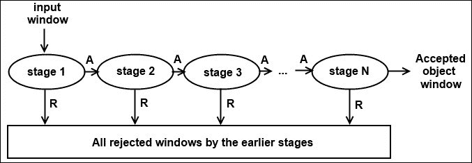

结合弱分类器阶段和早期拒绝错误分类窗口，形成了著名的级联结构

级联分类器训练过程遵循迭代过程来训练后续阶段的弱分类器（1…N）。每个阶段由一组弱分类器组成，直到达到该特定阶段的特定标准。以下步骤概述了在 OpenCV 3 中根据输入参数和提供的数据在训练每个阶段时发生的情况。如果你对每个后续步骤的更具体细节感兴趣，那么请阅读 Viola 和 Jones 的研究论文（你可以在本章的第一页查看引用）。这里描述的所有步骤都会在达到强分类器所需的确切精度之前，对每个阶段重复进行。以下图示显示了这样一个阶段输出的样子：

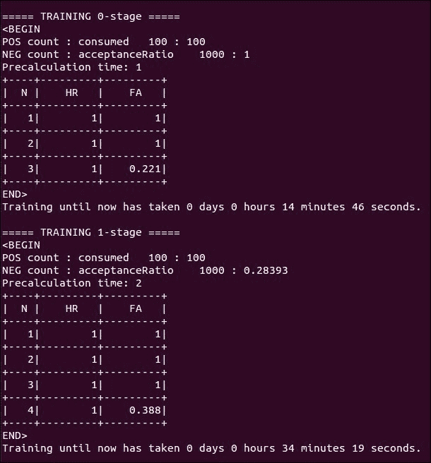

分类器阶段训练的一个示例输出

### 步骤 1 – 抓取正面和负样本

你会注意到训练的第一步是抓取当前阶段的训练样本——首先是从你提供的数据向量中获取的正面样本，然后是从你提供的负图像中随机获取的负样本窗口。这两个步骤的输出如下：

```py
POS:number_pos_samples_grabbed:total_number_pos_samples_needed NEG:number_neg_samples_grabbed:acceptanceRatioAchieved

```

如果找不到更多的正样本，将生成错误并停止训练。当你开始丢弃不再有用的正样本时，所需的样本总数会增加。当前阶段的负样本抓取可能比正样本抓取花费更长的时间，因为所有被前阶段正确分类的窗口都被丢弃，并搜索新的窗口。随着阶段数量的增加，这会变得更加困难。只要抓取的样本数量持续增加（是的，这可能会非常慢，所以请耐心等待），你的应用程序仍在运行。如果找不到更多的负样本，应用程序将结束训练，你需要降低每个阶段的负样本数量或添加额外的负图像。

在抓取负窗口后，报告了前一个阶段实现的接受率。这个值表明，到目前为止训练的模型是否足够强大，可以用于你的检测目的！

### 第 2 步 - 训练数据的积分图像和所有可能特征的预计算

一旦我们有了正负样本窗口大小的样本，预计算将计算窗口大小内所有可能的单个特征，并将其应用于每个训练样本。这可能会花费一些时间，具体取决于你的模型大小和训练样本的数量，特别是当你知道一个 24x24 像素的模型可以产生超过 16,000 个特征时。如前所述，分配更多的内存可以有所帮助，或者你可以选择选择 LBP 特征，其计算速度相对于 HAAR 特征要快得多。

所有特征都是在原始输入窗口的积分图像表示上计算的。这样做是为了加快特征的计算速度。Viola 和 Jones 的论文详细解释了为什么使用这种积分图像表示。

计算出的特征被倒入一个大的特征池中，提升过程可以从这个池中选择训练弱分类器所需的特征。这些弱分类器将在每个阶段中使用。

### 第 3 步 - 启动提升过程

现在，级联分类器训练已准备好进行实际的提升过程。这发生在几个小步骤中：

+   特征池中所有的可能弱分类器都在被计算。由于我们使用的是基于单个特征的 stumps（基本弱分类器）来构建决策树，因此弱分类器的数量与特征的数量相同。如果你愿意，你可以选择使用预定义的最大深度来训练实际的决策树，但这超出了本章的范围。

+   每个弱分类器都会被训练，以最小化训练样本上的误分类率。例如，当使用 Real AdaBoost 作为提升技术时，Gini 指数会被最小化。

    ### 注意

    关于用于训练样本误分类率的 Gini 指数的更多信息，可以在以下内容中找到：

    Gastwirth, J. L. (1972). The estimation of the Lorenz curve and Gini index. The Review of Economics and Statistics, 306-316.

+   具有最低误分类率的弱分类器被添加到当前阶段的下一个弱分类器。

+   基于已经添加到阶段的弱分类器，算法计算整体阶段阈值，该阈值被设置为保证所需的命中率。

+   现在，样本的权重根据它们在上一次迭代中的分类进行调整，这将产生下一轮迭代中的一组新的弱分类器，因此整个过程可以再次开始。

+   在单个阶段内组合弱分类器（这在训练输出中可视化）时，提升过程确保：

    +   整体阶段阈值不会低于由训练参数选择的最低命中率。

    +   与前一个阶段相比，负样本上的误报率降低。

+   此过程持续进行，直到：

    +   在负样本上的误接受率低于设定的最大误报率。然后，过程简单地开始为检测模型训练新的阶段弱分类器。

    +   达到了所需的阶段误报率，即`maxFalseAlarmRate^#stages`。这将导致模型训练结束，因为模型满足我们的要求，并且无法再获得更好的结果。这种情况不会经常发生，因为这个值下降得相当快，经过几个阶段后，这意味着你正确分类了超过 99%的正负样本。

    +   命中率下降到阶段特定的最小命中率，即`minHitRate^#stages`。在这个阶段，太多的正样本被错误分类，并且你的模型的最大性能已经达到。

### 第 4 步 – 将临时结果保存到阶段文件

在训练每个阶段后，关于弱分类器和阈值的特定阶段细节被存储在数据文件夹中，在一个单独的 XML 文件中。如果达到了所需的阶段数，则将这些子文件合并成一个单一的级联 XML 文件。

然而，每个阶段都单独存储的事实意味着你可以在任何时候停止训练，并通过简单地重新启动训练命令来创建一个中间的对象检测模型，只需将`-numStages`参数更改为你想要检查模型性能的阶段值。当你想要在一个验证集上执行评估以确保你的模型不会开始过度拟合训练数据时，这是理想的！

## 结果对象模型被详细解释

观察到许多使用 OpenCV 3 中嵌入的级联分类器算法的用户不知道存储在 XML 文件中的对象模型内部结构的含义，这有时会导致对算法的错误理解。本节将解释训练对象模型的每个内部部分。我们将讨论基于树桩型弱分类器的模型，但这个想法对于任何其他类型的弱分类器在阶段内部都是相同的，例如决策树。最大的不同是，与使用树桩特征相比，模型内部的权重计算变得更加复杂。至于每个阶段内部的弱分类器结构，我们将讨论基于 HAAR 和 LBP 特征的情况，因为这两个是 OpenCV 中用于训练级联分类器的最常用的特征。

### 注意

将用于解释所有内容的两个模型可以在以下位置找到

+   [OpenCV 源代码/data/haarcascades/haarcascade_frontalface_default.xml](http://OpenCVsource/data/haarcascades/haarcascade_frontalface_default.xml)

+   [OpenCV 源代码/data/lbpcascades/lbpcascade_frontalface.xml](http://OpenCVsource/data/lbpcascades/lbpcascade_frontalface.xml)

存储的每个 XML 模型的第一个部分描述了指定模型自身特征和一些重要训练参数的参数。随后，我们可以找到所使用的训练类型，目前仅限于提升，以及用于构建弱分类器的特征类型。我们还有将要训练的对象模型的宽度和高度，提升过程的参数，包括使用的提升类型、选定的最小命中比率和选定的最大误接受率。它还包含有关如何构建弱分类器阶段的信息，在我们的案例中，作为称为树桩的单个特征深度树的组合，每个阶段最多有 100 个弱分类器。对于基于 HAAR 小波模型，我们可以看到使用了哪些特征，仅限于基本的垂直特征或组合旋转 45 度的集合。

在训练特定参数之后，事情开始变得有趣。在这里，我们可以找到更多关于级联分类器对象模型实际结构的信息。描述了阶段的数量，然后通过迭代，模型总结了由提升过程生成的每个单独阶段的训练结果和阈值。对象模型的基本结构如下所示：

```py
<stages>
    <_>
        <maxWeakCount></maxWeakCount>
        <stageThreshold</stageThreshold>
        <weakClassifiers>
            <!-- tree 0 -->
            <_>
                <internalNodes></internalNodes>
                <leafValues></leafValues></_>
            <!-- tree 1 -->
            <_>
                <internalNodes></internalNodes>
                <leafValues></leafValues></_>
            <!-- tree 2 -->
            … … …
    <!-- stage 1 -->
    … … …
</stages>
<features>
    … … …
</features>
```

我们为每个阶段开始时使用一个空的迭代标签。在每一个阶段，定义了所使用的弱分类器的数量，在我们的情况下，这显示了在阶段内部使用了多少个单层决策树（树桩）。阶段阈值定义了窗口最终阶段得分的阈值。这是通过使用每个弱分类器对窗口进行评分，然后对整个阶段的评分结果进行求和和加权生成的。对于每个单个弱分类器，我们收集基于决策节点和所使用的层的内部结构。现有的值是用于创建决策树和叶值的提升值，这些叶值用于对由弱分类器评估的窗口进行评分。

内部节点结构的具体细节对于 HAAR 小波和基于特征的模型是不同的。叶评分的存储是相同的。然而，内部节点的值指定了与代码底部部分的关系，该部分包含实际的特征区域，并且对于 HAAR 和 LBP 方法都是不同的。这两种技术之间的差异可以在以下部分看到，为两种模型抓取第一阶段的第一个树和特征集的一部分。

### HAAR-like wavelet feature models

以下是从基于 HAAR 小波特征的模型中提取的两个代码片段，包含内部节点结构和特征结构：

```py
<internalNodes>
0 -1 445 -1.4772760681807995e-02
</internalNodes>
… … …
<_>
    <rects>
        <_>23 10 1 3 -1.</_>
        <_>23 11 1 1 3.</_>
    </rects>
    <tilted>0</tilted>
</_>
```

对于内部节点，每个节点有四个值：

+   **节点左和节点右**：这些值表示我们有一个有两个叶子的树桩。

+   **节点特征索引**：这指向该节点在模型特征列表中的位置所使用的特征索引。

+   **节点阈值**：这是设置在该弱分类器特征值上的阈值，该阈值是从训练阶段的全部正负样本中学习的。由于我们正在查看基于树桩的弱分类器的模型，这也是阶段阈值，它在提升过程中设置。

基于 HAAR 的模型中的特征由一组矩形描述，这些矩形最多可以是三个，以便从窗口中计算每个可能的特征。然后，有一个值表示特征本身是否倾斜超过 45 度。对于每个矩形，即部分特征值，我们有：

+   矩形的定位，由矩形的左上角 x 和 y 坐标以及矩形的宽度和高度定义。

+   该特定部分特征的权重。这些权重用于将两个部分特征矩形组合成一个预定义的特征。这些权重使我们能够用比实际必要的更少的矩形来表示每个特征。以下图示展示了这一例子：

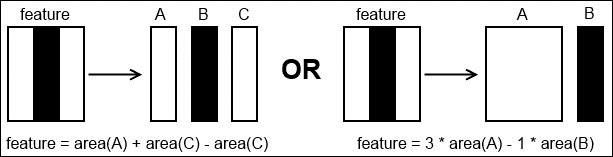

一个三矩形特征可以通过两个矩形加权组合来表示，从而减少了额外面积计算的需求。

特征和最终是通过首先将矩形内所有像素的值相加，然后乘以权重因子来计算的。最后，将这些加权和组合在一起，得到最终的特征值。请记住，为单个特征检索到的所有坐标都与窗口/模型大小相关，而不是整个处理过的图像。

### 局部二进制模式模型

以下是从基于 LBP 特征模型的两个代码片段，包含内部节点结构和特征结构：

```py
<internalNodes>
0 -1 46 -67130709 -21569 -1426120013 -1275125205 -21585
-16385 587145899 -24005
</internalNodes>
… … …
<_>
    <rect>0 0 3 5</rect>
</_>
```

```py
NoteThe software for visualizing Haar wavelet or LBP models can be found at [`github.com/OpenCVBlueprints/OpenCVBlueprints/tree/master/chapter_5/source_code/visualize_models/`](https://github.com/OpenCVBlueprints/OpenCVBlueprints/tree/master/chapter_5/source_code/visualize_models/).
```

该软件接受多个输入参数，例如模型位置、需要可视化的图像以及需要存储结果的输出文件夹。然而，为了正确使用该软件，有一些需要注意的点：

+   模型需要基于 HAAR 小波或 LBP 特征。已删除，因为此功能不再支持 OpenCV 3。

+   您需要提供一个用于可视化的实际模型检测图像，并将其调整到模型尺度或训练数据中的正训练样本。这是为了确保您的模型特征放置在正确的位置。

+   在代码中，您可以调整可视化尺度，一个用于您模型的视频输出，另一个用于表示阶段的图像。

以下两个图分别展示了 Haar 小波和 LBP 特征基于的前脸模型的可视化结果，两者都包含在 OpenCV 3 仓库下的数据文件夹中。可视化图像分辨率低的原因非常明显。训练过程是在模型尺度上进行的；因此，我想从一个相同大小的图像开始，以说明物体的具体细节被移除，而物体类别的普遍特性仍然存在，以便能够区分类别。

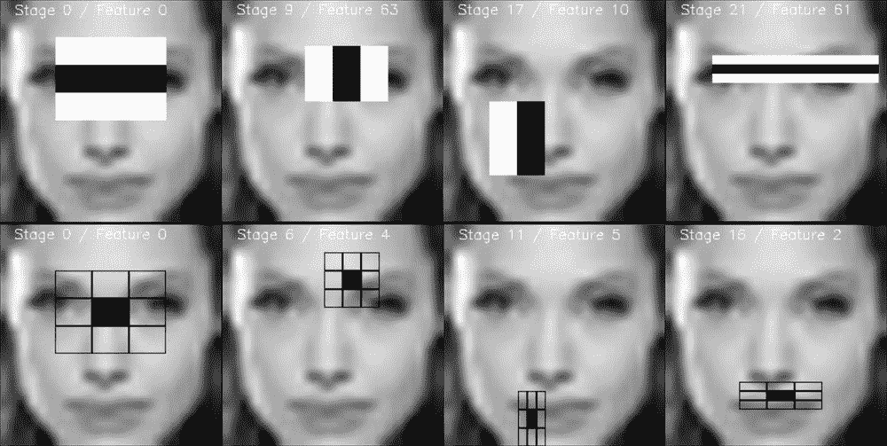

Haar 小波和局部二进制模式特征的前脸模型视频可视化的一组帧

例如，可视化也清楚地表明，LBP 模型需要更少的特征和因此更少的弱分类器来成功分离训练数据，这使得检测时间更快。

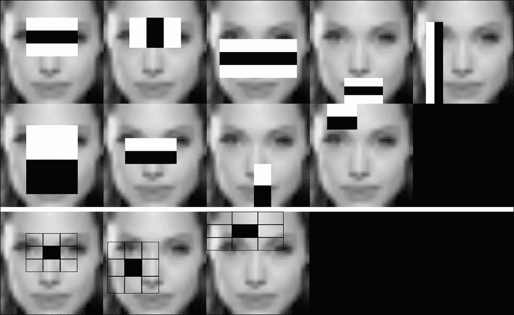

Haar 小波和局部二进制模式特征的前脸模型第一阶段的可视化

## 使用交叉验证以实现最佳模型

确保在您的训练数据中获取最佳模型，可以通过应用交叉验证方法，如留一法来完成测试数据。其背后的思想是将训练集和测试集结合起来，并从更大的集中改变所使用的测试集。对于每个随机测试集和训练集，您将构建一个单独的模型，并使用本章进一步讨论的精确度-召回率进行评估。最后，提供最佳结果的模型可以采用作为最终解决方案。因此，它可以减轻由于训练集中未表示的新实例而导致的错误的影响。

### 注意

关于交叉验证主题的更多信息，可以在 Kohavi R. (1995, 八月) 的研究中找到，该研究探讨了在 Ijcai (第 14 卷，第 2 期，第 1137-1145 页) 中使用交叉验证和自助法进行准确度估计和模型选择。

# 使用场景特定知识和约束来优化检测结果

一旦您的级联分类器对象模型训练完成，您就可以使用它来检测新输入图像中相同对象类的实例，这些图像被提供给系统。然而，一旦应用了您的对象模型，您会发现仍然存在误报检测和未检测到的对象。本节将介绍一些技术，通过例如使用场景特定知识来移除大多数误报检测，以改善您的检测结果。

## 使用检测命令的参数来影响您的检测结果

如果将对象模型应用于给定的输入图像，必须考虑几个因素。让我们首先看看检测函数以及可以用来过滤检测输出的某些参数。OpenCV 3 提供了三个可能的接口。我们将讨论使用每个接口的优点。

**接口 1：**

```py
void CascadeClassifier::detectMultiScale(InputArray image, vector<Rect>& objects, double scaleFactor=1.1, int minNeighbors=3, int flags=0, Size minSize=Size(), Size maxSize=Size())
```

第一个接口是最基本的。它允许您快速评估在给定测试图像上的训练模型。在这个基本界面上有几个元素，可以让您操作检测输出。我们将更详细地讨论这些参数，并强调在选择正确值时需要注意的一些要点。

scaleFactor 是用于将原始图像降级以创建图像金字塔的尺度步长，这使我们能够仅使用单个尺度模型执行多尺度检测。一个缺点是这不允许检测比对象尺寸更小的对象。使用 1.1 的值意味着在每一步中，尺寸相对于前一步减少了 10%。

+   增加此值将使您的检测器运行更快，因为它需要评估的尺度级别更少，但会带来丢失位于尺度步骤之间的检测的风险。

+   减少值会使您的探测器运行得更慢，因为需要评估更多的尺度级别，但会增加检测之前遗漏的对象的机会。此外，它会在实际对象上产生更多的检测，从而提高确定性。

+   请记住，添加尺度级别也会导致更多的假阳性检测，因为这些与图像金字塔的每一层都有关。

另一个有趣的参数是`minNeighbors`参数。它描述了由于滑动窗口方法而发生的重叠检测的数量。任何与其他检测重叠超过 50%的检测将被合并为一个非极大值抑制。

+   将此值设为 0 意味着您将获得通过完整级联的所有检测生成的检测。然而，由于滑动窗口方法（以 8 像素的步长）以及级联分类器的性质（它们在对象参数上训练以更好地泛化对象类别），对于单个窗口，许多检测将发生。

+   添加一个值意味着您想要计算应该有多少个窗口，至少那些通过非极大值抑制组合在一起的窗口，以保持检测。这很有趣，因为实际对象应该产生比假阳性更多的检测。因此，增加这个值将减少假阳性检测的数量（它们重叠检测的数量很少）并保持真实检测（它们有大量的重叠检测）。

+   一个缺点是，在某个点上，实际对象由于检测确定性较低和重叠窗口较少而消失，而一些假阳性检测可能仍然存在。

使用`minSize`和`maxSize`参数有效地减少尺度空间金字塔。在一个工业设置中，例如，固定相机位置，如传送带设置，在大多数情况下可以保证对象将具有特定的尺寸。在这种情况下添加尺度值并定义尺度范围将大大减少单个图像的处理时间，通过去除不需要的尺度级别。作为额外的好处，所有那些不需要的尺度上的假阳性检测也将消失。如果您留这些值为空，算法将从头开始构建图像金字塔，以输入图像尺寸为基础，以等于尺度百分比的步长进行下采样，直到其中一个维度小于最大对象维度。这将成为图像金字塔的顶部，也是检测算法在检测时间开始运行对象检测器的位置。

**界面 2：**

```py
void CascadeClassifier::detectMultiScale(InputArray image, vector<Rect>& objects, vector<int>& numDetections, double scaleFactor=1.1, int minNeighbors=3, int flags=0, Size minSize=Size(), Size maxSize=Size())
```

第二个接口通过添加`numDetections`参数进行了一些小的改进。这允许你将`minNeighbors`的值设置为 1，将重叠窗口的合并视为非极大值抑制，同时返回合并的重叠窗口的值。这个值可以看作是你检测的置信度分数。值越高，检测越好或越确定。

**接口 3：**

```py
void CascadeClassifier::detectMultiScale(InputArray image, std::vector<Rect>& objects, std::vector<int>& rejectLevels, std::vector<double>& levelWeights, double scaleFactor=1.1, int minNeighbors=3, int flags=0, Size minSize=Size(), Size maxSize=Size(), bool outputRejectLevels=false )
```

这个接口的一个缺点是，100 个单个检测置信度非常低的窗口可以简单地否定一个单个检测置信度非常高的检测。这就是第三个接口可以为我们提供解决方案的地方。它允许我们查看每个检测窗口的个体分数（由分类器最后阶段的阈值值描述）。然后你可以抓取所有这些值，并设置这些个体窗口的置信度分数阈值。在这种情况下应用非极大值抑制时，所有重叠窗口的阈值值会合并。

### 小贴士

请记住，如果你想在 OpenCV 3.0 中尝试第三个接口，你必须将参数`outputRejectLevels`设置为`true`。如果不这样做，那么包含阈值分数的水平权重矩阵将不会被填充。

### 注意

可以在以下链接找到展示对象检测两种最常用接口的软件：[`github.com/OpenCVBlueprints/OpenCVBlueprints/tree/master/chapter_5/source_code/detect_simple`](https://github.com/OpenCVBlueprints/OpenCVBlueprints/tree/master/chapter_5/source_code/detect_simple) 和 [`github.com/OpenCVBlueprints/OpenCVBlueprints/tree/master/chapter_5/source_code/detect_score`](https://github.com/OpenCVBlueprints/OpenCVBlueprints/tree/master/chapter_5/source_code/detect_score)。OpenCV 的检测接口经常变化，因此可能已经存在这里未讨论的新接口。

## 提高对象实例检测并减少误报检测

一旦你为你的应用选择了最合适的方法来检索对象检测，你就可以评估你算法的正确输出。在训练对象检测器后，最常见的两个问题是：

+   未检测到的对象实例。

+   过多的误报检测。

第一个问题的原因可以通过查看我们基于该对象类的正样本训练数据训练的通用对象模型来解释。这让我们得出结论，训练要么：

+   没有足够的正样本训练数据，这使得无法很好地泛化到新的对象样本。在这种情况下，重要的是要将那些误检作为正样本添加到训练集中，并使用额外数据重新训练你的模型。这个原则被称为“强化学习”。

+   我们过度训练了模型以适应训练集，这再次减少了模型的泛化能力。为了避免这种情况，逐步减少模型的大小和复杂性。

第二个问题相当普遍，并且经常发生。不可能提供足够的负样本，同时确保在第一次运行时不会有任何负窗口仍然可能产生正检测。这主要是因为我们人类很难理解计算机如何根据特征来识别对象。另一方面，在训练对象检测器时，不可能一开始就掌握所有可能的场景（光照条件、生产过程中的交互、相机上的污垢等）。您应该将创建一个良好且稳定的模型视为一个迭代过程。

### 注意

避免光照条件影响的处理方法可以是，通过为每个样本生成人工暗淡和人工明亮图像来使训练集翻倍。然而，请记住本章开头讨论的人工数据的缺点。

为了减少误报检测的数量，我们通常需要添加更多的负样本。然而，重要的是不要添加随机生成的负窗口，因为这些窗口为模型带来的额外知识在大多数情况下只是微小的。添加有意义的负窗口，以提高检测器的质量会更好。这被称为使用**自举**过程的**硬负样本挖掘**。原理相当简单：

1.  首先，根据您的初始正负窗口样本训练集训练第一个对象模型。

1.  现在，收集一组负图像，这些图像要么针对您的应用特定（如果您想训练针对您设置的特定对象检测器）或者更通用（如果您希望您的对象检测器能在多种条件下工作）。

1.  在这组负图像上运行您的检测器，使用低置信度阈值并保存所有找到的检测。从提供的负图像中裁剪它们，并重新调整大小以适应对象模型尺寸。

1.  现在，重新训练您的对象模型，但将所有找到的窗口添加到您的负训练集中，以确保您的模型现在将使用这些额外知识进行训练。

这将确保您的模型精度根据负图像的质量以公平和合理的方式提高。

### 小贴士

当添加找到的额外且有用的负样本时，请将它们添加到`background.txt`文件的顶部！这迫使 OpenCV 训练界面首先获取这些更重要的负样本，然后再采样所有标准负训练图像！确保它们具有精确的模型大小，这样它们就只能作为一次负训练样本使用。

# 获得旋转不变性对象检测

```py
TipSoftware for performing rotation invariant object detection based on the described third approach can be found at [`github.com/OpenCVBlueprints/OpenCVBlueprints/tree/master/chapter_5/source_code/rotation_invariant_detection/`](https://github.com/OpenCVBlueprints/OpenCVBlueprints/tree/master/chapter_5/source_code/rotation_invariant_detection/).
```

这种方法的最大优点是，你只需要训练一个单方向模型，可以将你的时间投入到更新和调整这个单一模型，使其尽可能高效。另一个优点是，你可以通过提供一些重叠来结合不同旋转的所有检测，然后通过智能地移除在多个方向上没有检测到的假阳性，来增加检测的确定性。所以基本上，这是一种在方法的好处和缺点之间进行权衡。

然而，这种方法仍然存在一些缺点：

+   你需要将多尺度检测器应用于你的 3D 表示矩阵的每一层。这肯定会增加与单方向对象检测相比的对象实例搜索时间。

+   你将在每个方向上创建假阳性检测，这些检测也将被扭曲回，从而增加假阳性检测的总数。

让我们更深入地看看用于执行此旋转不变性的源代码部分，并解释实际上发生了什么。第一个有趣的部分可以在创建旋转图像的 3D 矩阵时找到：

```py
// Create the 3D model matrix of the input image
Mat image = imread(input_image);
int steps = max_angle / step_angle;
vector<Mat> rotated_images;
cvtColor(rotated, rotated, COLOR_BGR2GRAY);
equalizeHist( rotated, rotated );
for (int i = 0; i < steps; i ++){
   // Rotate the image
   Mat rotated = image.clone();
   rotate(image, (i+1)*step_angle, rotated);
   // Preprocess the images

   // Add to the collection of rotated and processed images
   rotated_images.push_back(rotated);
}
```

基本上，我们做的是读取原始图像，创建一个包含每个旋转输入图像的 Mat 对象向量的数组，并在其上应用旋转函数。正如你将注意到的，我们立即应用所有需要的预处理步骤，以便使用级联分类器接口进行高效的对象检测，例如将图像渲染为灰度值并应用直方图均衡化，以应对光照变化。

旋转函数在这里可以看到：

```py
void rotate(Mat& src, double angle, Mat& dst)
{
    Point2f pt(src.cols/2., src.rows/2.);
    Mat r = getRotationMatrix2D(pt, angle, 1.0);
    warpAffine(src, dst, r, cv::Size(src.cols, src.rows));
}
```

此代码首先根据我们想要旋转的角度（以度为单位）计算一个旋转矩阵，然后根据这个旋转矩阵应用仿射变换。记住，以这种方式旋转图像可能会导致边缘对象的信息丢失。此代码示例假设你的对象将出现在图像的中心，因此这不会影响结果。你可以通过在原始图像周围添加黑色边框来避免这种情况。图像的宽度和高度相等，这样图像信息损失最小。这可以通过在读取原始输入图像后立即添加以下代码来完成：

```py
Size dimensions = image.size();
if(dimensions.rows > dimensions.cols){
   Mat temp = Mat::ones(dimensions.rows, dimensions.rows, image.type()) * 255;
   int extra_rows = dimensions.rows - dimensions.cols;
   image.copyTo(temp(0, extra_rows/2, image.rows, image.cols));
   image = temp.clone();
}
if(dimensions.cols > dimensions.rows){
   Mat temp = Mat::ones(dimensions.cols, dimensions.cols, image.type()) * 255;
   int extra_cols = dimensions.cols - dimensions.rows;
   image.copyTo(temp(extra_cols/2, 0, image.rows, image.cols));
   image = temp.clone();
}
```

此代码将简单地根据最大尺寸将原始图像扩展到匹配一个正方形区域。

最后，在 3D 图像表示的每一层上，都会执行检测，并使用与扭曲原始图像类似的方法将找到的检测扭曲回原始图像：

1.  将旋转图像中找到的四个检测到的角落点添加到一个用于旋转扭曲的矩阵中（代码行 95-103）。

1.  根据当前旋转图像的角度应用逆变换矩阵（代码行 106-108）。

1.  最后，在旋转的四矩阵点信息上绘制一个旋转矩形（代码行 111-128）。

下图显示了将旋转不变性人脸检测应用于具有多个方向的人脸图像的确切结果。

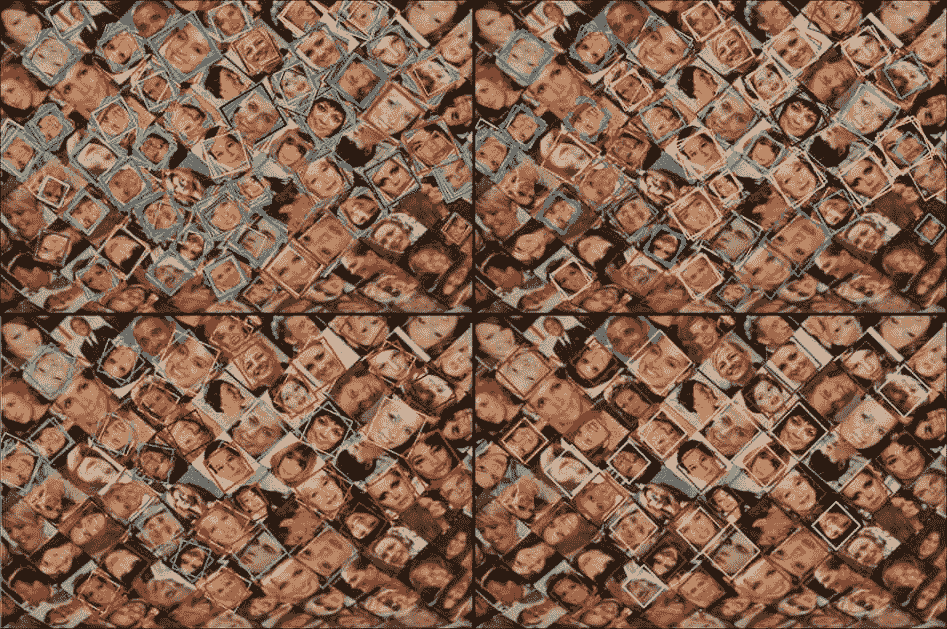

以以下角度步长开始进行旋转不变性人脸检测：[1 度，10 度，25 度，45 度]

我们看到四次建议的技术被应用于相同的输入图像。我们调整了参数以观察对检测时间和返回的检测的影响。在所有情况下，我们都从 0 到 360 度进行了搜索，但在 3D 旋转矩阵的每个阶段之间改变了角度步长，从 0 到 45 度。

| 应用角度步长 | 执行所有检测的总时间 |
| --- | --- |
| 1 度 | 220 秒 |
| 10 度 | 22.5 秒 |
| 25 度 | 8.6 秒 |
| 45 度 | 5.1 秒 |

如我们所见，当增加角度步长时，检测时间会大幅减少。知道一个物体模型本身至少可以覆盖总共 20 度，我们可以轻松地减小步长以显著减少处理时间。
