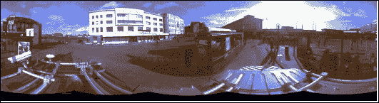
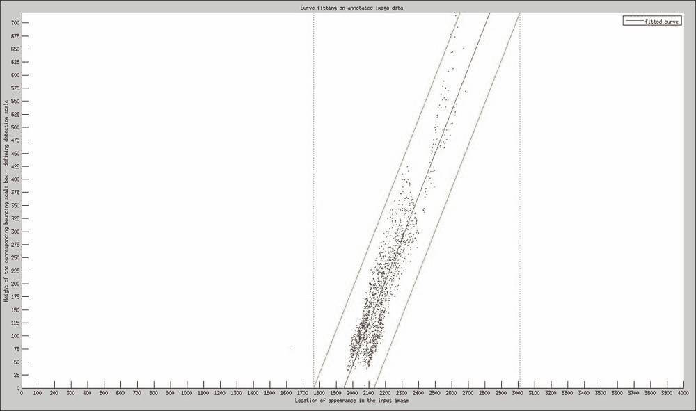
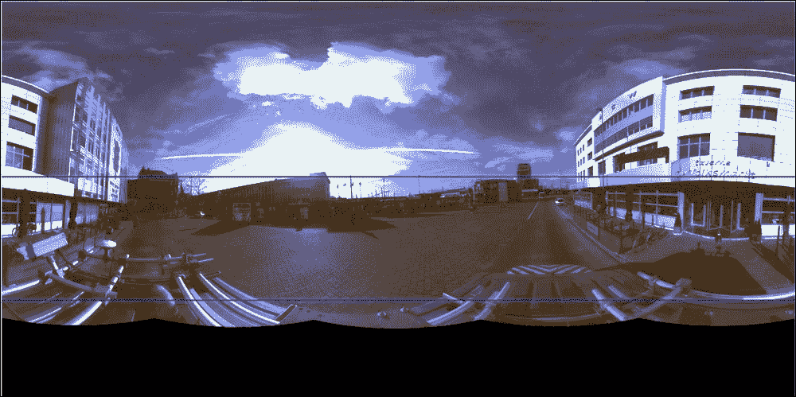
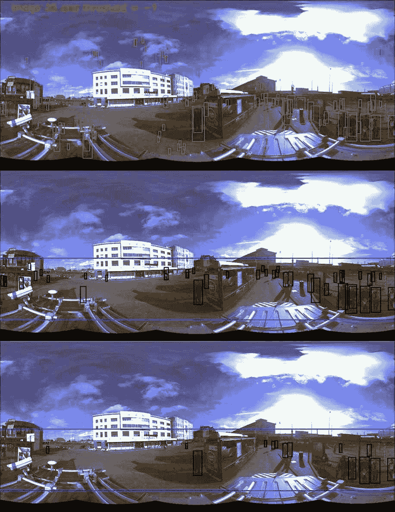
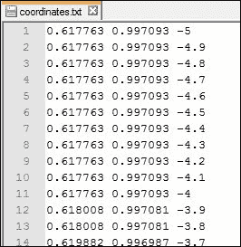
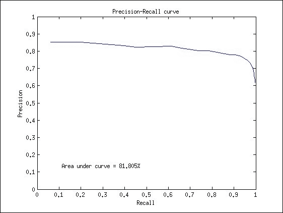
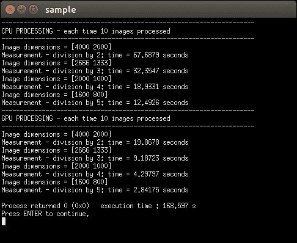
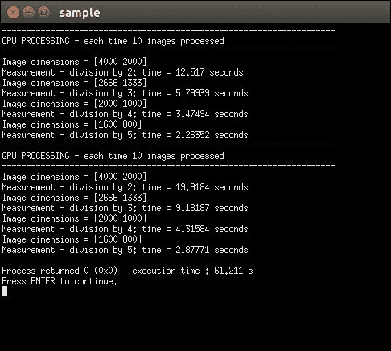
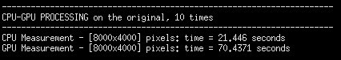
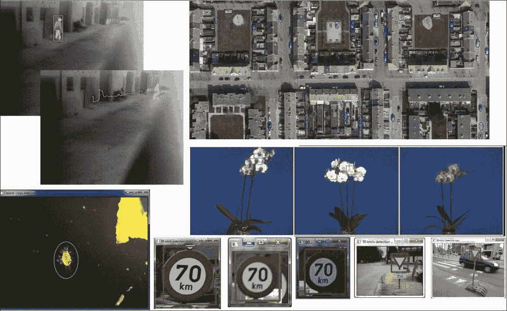

# 第六章：2D 尺度空间关系

另一个在工业案例中可以充分利用的巨大优势是，许多这些设置都有一个固定的相机位置。当需要检测的对象遵循一个固定的地面平面时，这很有趣，例如在行人或通过传送带的物体的情况下。如果这些条件存在，那么实际上就有可能在每个图像位置建模对象的尺度。这产生了两个可能的优势：

+   首先，你可以利用这些知识有效地减少误报检测的数量，同时保持你的置信度阈值足够低，以便低置信度和良好的检测仍然存在。这可以在对象检测阶段之后的某些后处理步骤中完成。

+   其次，这些知识可以用来有效地减少图像金字塔中对象候选者的检测时间和搜索空间。

让我们从关注以下案例开始，该案例在下面的图中进行了说明。考虑这样一个事实：我们想要创建一个行人检测系统，并且我们已经有一个用于此目的的现有模型。我们有一个安装在汽车顶部的 360 度相机，并且以连续的时间间隔抓取这些全景图像。由于这种 360 度全景图像的分辨率非常大，图像金字塔将会非常庞大，导致大量的误报检测和非常长的处理时间。

基于 HAAR 特征的 OpenCV 3 中 Viola 和 Jones 级联分类器行人检测模型的示例

例子清楚地表明，在应用检测器时，很难找到一个合适的分数阈值，以仅检测行人而不再有一系列误报检测。因此，我们选取了一组 40 张全景图像，并使用我们的对象标注工具手动标注了其中的每个行人。如果我们然后可视化边界框的标注高度与图像中出现的 x 位置位置的关系，我们就可以得出以下关系，如图所示：

图像中标注位置与找到的检测尺度之间的尺度空间关系

这张图中的红色点都是我们从 40 个圆柱形场景的测试平台上检索到的所有可能的地面真实标注。红色线条是我们拟合到数据上的线性关系，它描述了在图像的哪个位置应该检测到哪个尺度。然而，我们知道，根据绿色边界定义的特定尺度可能会有轻微的变化，以便尽可能包含更多的标注。我们使用了分配高斯分布的规则，因此同意在[-3sigma,+3sigma]范围内，98%的所有检测都应该落在该范围内。然后，我们根据我们的范围应用最小值和最大值，并定义了一个物体可以自然出现的区域，用蓝色边界标记，并在以下图片中可视化：

行人在同一地面平面上且完全被摄像头系统看到的可能位置

这意味着，如果我们在这个输入图像上运行检测器，我们就可以消除超过 50%的图像，因为训练数据清楚地显示，行人不可能出现在那个位置。这大大减少了搜索空间！这种使用图像掩码限制搜索空间的方法的唯一缺点是，例如，阳台上的行人将被简单地忽略。但再次强调，在这个应用中，没有必要找到这些人，因为他们不在同一个地面平面上。

然后，我们最终将本章中我们知道的所有内容结合起来。我们对所有可能出现的尺度应用了尺度空间关系，这仅限于掩码区域内部，因为在我们应用中，物体不能存在于该区域之外。然后，我们将分数阈值降低，以便有更多的检测，并确保在应用基于尺度空间关系的过滤之前，我们已经检测到尽可能多的行人。结果可以在这里展示。它清楚地表明，在某些应用中，上下文信息可以大大提高检测率！

完整的流程：1）使用低阈值进行检测，2）应用掩码并移除大量误报，3）强制执行尺度空间位置以移除额外的误报检测

# 性能评估和 GPU 优化

我们正在接近本章的结尾，但在结束之前，我想讨论两个虽然小但仍然重要的话题。让我们首先讨论通过不仅进行视觉检查，而且实际查看我们的模型在更大的数据集上表现如何来评估级联分类器物体检测模型的性能。

## 物体检测性能测试

我们将通过使用精确度-召回率曲线的概念来完成这项工作。它们与统计学领域更常见的 ROC 曲线略有不同，其缺点是它们依赖于真实负值，而在滑动窗口应用中，这个值变得如此之高，以至于真实正例、假正例和假负例的值相对于真实负例将消失。精确度-召回率曲线避免了这种测量，因此更适合创建对我们级联分类器模型的评估。

*精确度 = TP / (TP + FP)* 和 *召回率 = TP / (TP + FN)*，其中真实正例（TP）是指既被标注又被检测到的注释，假正例（FP）是指没有标注但被检测到的检测，假负例（FN）是指没有检测到的标注。

这些值描述了你的模型在某个阈值值下的表现。我们使用置信度分数作为阈值值。**精确度**定义了所找到的检测中有多少是实际对象，而**召回率**定义了图像中实际找到的对象数量。

### 注意

在[`github.com/OpenCVBlueprints/OpenCVBlueprints/tree/master/chapter_5/source_code/precision_recall/`](https://github.com/OpenCVBlueprints/OpenCVBlueprints/tree/master/chapter_5/source_code/precision_recall/)可以找到用于在变化阈值上创建 PR 曲线的软件。

该软件需要几个输入元素：

+   首先，你需要收集一个与训练集独立的验证/测试集，因为否则你永远无法决定你的模型是否对一组训练数据过拟合，从而在泛化到一组类别实例时表现更差。

+   其次，你需要验证集的标注文件，这可以被视为验证集的基准。这可以使用本章提供的对象标注软件来完成。

+   第三，你需要一个由检测软件创建的检测文件，该文件还输出分数，以便能够改变这些检索到的分数。同时，确保非极大值抑制仅设置为 1，以便在同一位置的检测被合并，但没有任何检测被拒绝。

当在这样一个验证集上运行软件时，你将收到一个精确度-召回率结果文件，如这里所示。结合每个阈值步骤的精确度-召回率坐标，你还将收到阈值本身，这样你就可以在精确度-召回率曲线上选择最适合你应用的最佳工作点，然后找到所需的阈值！

自训练级联分类器对象模型的精确度-召回率结果

这些输出可以通过 MATLAB ([`nl.mathworks.com/products/matlab/`](http://nl.mathworks.com/products/matlab/)) 或 Octave ([`www.gnu.org/software/octave/`](http://www.gnu.org/software/octave/)) 等软件包进行可视化，这些软件包比 OpenCV 有更好的图形生成支持。前一个文件的结果可以在以下图表中看到。附带的 MATLAB 示例脚本用于生成这些可视化，以及精确度召回率软件。

精确度召回率结果图表

观察图表，我们可以看到精确度和召回率都有一个[0 1]的尺度。图表中最理想的位置是右上角（精确度=1/召回率=1），这意味着图像中的所有对象都被找到，且没有发现任何误报。所以，基本上，你的图表斜率越接近右上角，你的检测器就越好。

为了将准确度值添加到精确度召回率图的某条曲线上（当比较具有不同参数的模型时），计算机视觉研究社区使用曲线下面积（AUC）的原则，用百分比表示，这也可以在生成的图表中看到。再次强调，获得 100%的 AUC 意味着你已经开发出了理想的物体检测器。

## 使用 GPU 代码进行优化

为了能够重建关于 GPU 使用的讨论中进行的实验，你需要拥有一块与 OpenCV CUDA 模块兼容的 NVIDIA GPU。此外，你需要使用不同的配置（我将在后面强调）重新构建 OpenCV，以获得完全相同的输出。

我端进行的测试是在一台戴尔 Precision T7610 电脑上进行的，该电脑配备了一颗英特尔 Xeon(R) CPU，具有两个处理器，每个处理器支持 12 个核心和 32 GB 的 RAM 内存。作为 GPU 接口，我使用了一块配备 1 GB 独立板载内存的 NVIDIA Quadro K2000。

通过 OpenCL 和 OpenCV 3 中引入的新 T-API，可以使用非 NVIDIA GPU 获得类似的结果。然而，由于这项技术相对较新且尚未完全无错误，我们将坚持使用 CUDA 接口。

OpenCV 3 包含了级联分类器检测系统的 GPU 实现，可以在 CUDA 模块下找到。这个接口可以帮助处理大图像时提高性能。以下图示就是一个例子：

不使用任何 CPU 优化的 CPU-GPU 比较

### 注意

这些结果是通过使用可以从[`github.com/OpenCVBlueprints/OpenCVBlueprints/tree/master/chapter_5/source_code/CPU_GPU_comparison/`](https://github.com/OpenCVBlueprints/OpenCVBlueprints/tree/master/chapter_5/source_code/CPU_GPU_comparison/)获取的软件获得的。

为了实现这个结果，我没有对 OpenCV 进行任何 CPU 优化和 CUDA 支持。为此，你需要禁用几个 CMAKE 标志，从而禁用以下包：IPP、TBB、SSE、SSE2、SSE3、SSE4、OPENCL 和 PTHREAD。为了避免在 CPU 在后台执行某些操作时加载单个图像造成的任何偏差，我连续处理了图像 10 次。

原始输入图像的大小为 8000x4000 像素，但在一些测试之后，似乎 GPU 上的`detectMultiScale`函数需要的内存将超过专门的 1 GB。因此，我们只从图像大小为 4000*2000 像素开始进行测试。很明显，当在单个核心 CPU 上处理图像时，GPU 接口的效率要高得多，即使考虑到每次运行都需要将数据从内存推送到 GPU 并取回。我们仍然可以获得大约 4-6 倍的速度提升。

然而，GPU 实现并不总是最佳选择，我们将通过第二次测试来证明这一点。让我们先总结一下为什么 GPU 可能不是一个好主意的原因：

+   如果你的图像分辨率较小，那么初始化 GPU、解析数据到 GPU、处理数据以及将其抓回到内存所需的时间可能会成为你应用程序的瓶颈，实际上可能比在 CPU 上直接处理所需的时间更长。在这种情况下，最好使用基于 CPU 的检测软件实现。

+   GPU 实现不提供返回阶段权重的功能，因此基于 GPU 优化的函数创建精确度召回率曲线将很困难。

+   前面的案例是在没有任何优化且仅使用单个核心 CPU 的情况下进行的测试，这在当今实际上是一个糟糕的参考。OpenCV 已经投入了大量精力，通过大量优化使他们的算法在 CPU 上高效运行。在这种情况下，并不能保证具有数据传输瓶颈的 GPU 仍然会更快地运行。

为了证明 GPU 实现可能比 CPU 实现更差，我们使用以下免费可用的优化参数构建了 OpenCV：IPP（OpenCV 提供的免费紧凑型集）、TBB、SSE2、SSE3、SSE4（由 CMAKE 脚本能动选择为我系统选择的 SSE 指令）、pthread（用于使用并行 for 循环结构），当然，还有 CUDA 接口。

然后，我们将再次运行相同的软件测试，如下所示。

OpenCV 3.0 提供的基本 CPU 优化与 CPU-GPU 比较

现在，我们可以清楚地看到，在我系统上的优化使用在 CPU 上比在 GPU 上产生更好的结果。在这种情况下，如果只看到他/她有 GPU 可用的事实，那么将做出一个糟糕的决定。基本上，这证明了你应该始终注意你将如何优化你的算法。当然，这个结果有点偏颇，因为普通计算机没有 24 个核心和 32GB 的 RAM 内存，但鉴于个人计算机的性能每天都在提高，不久的将来，每个人都能访问这些类型的设置。

我甚至更进一步，通过将原始的 8000*4000 像素图像，由于系统中的 32GB RAM，没有对 CPU 的内存限制，再次在该单一尺寸上执行软件。对于 GPU 来说，这意味着我必须将图像分成两部分并处理它们。再次，我们连续处理了 10 张图像。结果可以在以下图像中看到：

在 GPU 上处理 8000x4000 像素图像与多核 CPU 处理的比较

正如你所看到的，GPU 接口与 CPU 接口相比，仍然存在差异，GPU 接口大约是 CPU 接口的四倍，因此在这种情况下，选择 GPU 解决方案而不是多核 CPU 解决方案将是一个非常糟糕的决定。

# 实际应用

如果你还在想这种目标检测软件的实际工业应用可能是什么，那么请看以下内容：

工业目标检测的示例

这是我使用此软件获取检测对象准确位置的应用快速概述：

+   包含在一系列不同背景上旋转不变检测饼干和糖果的模拟测试用例。

+   在显微镜下自动检测和计数微生物，而不是自己计数。

+   鲜草莓的成熟度分类定位。

+   在航空影像中对道路标记进行定位，以基于检索数据的自动创建 GIS（地理信息系统）。

+   在传送带上对（绿色、黄色和红色混合）辣椒的旋转不变检测，结合对有效机器人抓取的斯托克检测。

+   用于 ADAS（自动驾驶员辅助系统）系统的交通标志检测。

+   兰花检测，用于自动分类兰花物种。

+   在近红外图像中进行行人检测和跟踪，用于安全应用。

所以，正如你所看到的，可能性是无限的！现在，尝试想出你自己的应用，并用它征服世界。

让我们以对 Viola 和 Jones 目标分类框架进行目标检测的批判性评论来结束本章。只要你的应用专注于检测一个或两个目标类别，那么这种方法相当有效。然而，一旦你想要处理多类别检测问题，可能需要寻找所有其他的目标分类技术，并找到一个更适合你应用的更合适的方法，因为在一个单独的图像上运行大量的级联分类器将花费很长时间。

### 注意

目前研究焦点中的一些非常有前景的目标分类框架，或者作为新技术的坚实基础，可以在下面找到。它们可能对于想要超越 OpenCV 可能性的人来说是一个有趣的起点。

+   Dollár P., Tu Z., Perona P., 和 Belongie S (2009 年 9 月), 整合通道特征。在 BMVC（第 2 卷第 3 期，第 5 页）。

+   Dollár P., Appel R., Belongie S., 和 Perona P (2014), 快速特征金字塔用于目标检测。模式分析与机器智能，IEEE 交易，36(8), 1532-1545。

+   Krizhevsky A., Sutskever I., 和 Hinton G. E (2012), 使用深度卷积神经网络进行 ImageNet 分类。在神经信息处理系统进展（第 1097-1105 页）。

+   Felzenszwalb P. F., Girshick R. B., McAllester D., 和 Ramanan D (2010), 使用判别性训练的基于部分模型进行目标检测。模式分析与机器智能，IEEE 交易，32(9), 1627-1645。

# 摘要

本章汇集了关于基于 Viola 和 Jones 框架的 OpenCV 3 中级联分类器对象检测接口的广泛技巧和窍门。我们走过了对象检测管道的每一步，并关注了可能出错的地方。本章为你提供了优化任何所需目标模型级联分类器结果的工具，同时建议从中选择最佳参数。

最后，一些特定场景的示例被用来说明，即使使用较弱训练的目标模型，如果你利用场景知识来去除误报检测，也能表现良好。
