# 第五章. 使用形态学操作转换图像

在本章中，我们将涵盖以下食谱：

+   使用形态学滤波器进行图像腐蚀和膨胀

+   使用形态学滤波器进行图像开闭操作

+   在灰度图像上应用形态学算子

+   使用分水岭进行图像分割

+   使用 MSER 提取特征区域

# 简介

**数学形态学**是 20 世纪 60 年代为分析和处理离散图像而开发的一种理论。它定义了一系列通过探针预定义的形状元素来转换图像的算子。这个形状元素与像素邻域的交集方式决定了操作的结果。本章介绍了最重要的形态学算子。它还探讨了使用基于形态学算子的算法进行图像分割和特征检测的问题。

# 使用形态学滤波器进行图像腐蚀和膨胀

腐蚀和膨胀是最基本的形态学算子。因此，我们将在这第一个食谱中介绍它们。数学形态学的基本组成部分是**结构元素**。结构元素可以简单地定义为定义了原点（也称为**锚点**）的像素配置（以下图中的正方形形状）。应用形态学滤波器包括使用这个结构元素探测图像中的每个像素。当结构元素的原点与给定的像素对齐时，它与图像的交集定义了一个特定形态学操作应用的像素集（以下图中的九个阴影像素）。原则上，结构元素可以是任何形状，但最常用的是具有原点在中心的简单形状，如正方形、圆形或菱形。自定义结构元素可以用来强调或消除特定形状的区域。

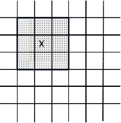

## 准备中

由于形态学滤波器通常在二值图像上工作，我们将使用上一章第一个食谱中通过阈值创建的二值图像。然而，由于在形态学中通常用高（白色）像素值表示前景对象，用低（黑色）像素值表示背景对象，因此我们对图像进行了取反。

在形态学术语中，以下图像被认为是上一章创建的图像的**补码**：

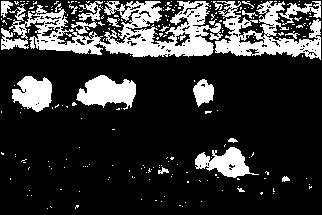

## 如何操作...

腐蚀和膨胀在 OpenCV 中作为简单的函数实现，分别是`cv::erode`和`cv::dilate`。它们的用法简单直接：

```py
    // Read input image 
    cv::Mat image= cv::imread("binary.bmp"); 

    // Erode the image 
    // with the default 3x3 structuring element (SE) 
    cv::Mat eroded;  // the destination image 
    cv::erode(image,eroded,cv::Mat()); 

    // Dilate the image 
    cv::Mat dilated;  // the destination image 
    cv::dilate(image,dilated,cv::Mat()); 

```

这些函数调用产生的两个图像如下所示。第一个显示了腐蚀：

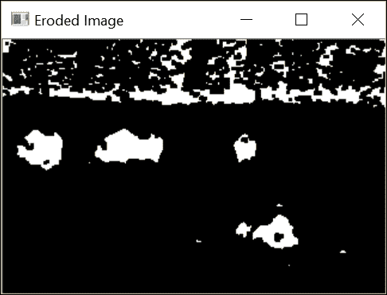

第二张图像显示了膨胀的结果：

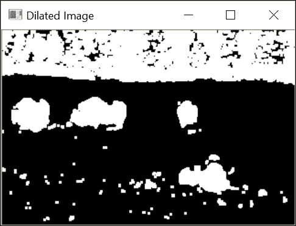

## 它是如何工作的...

对于所有形态学滤波器，本配方中的两个滤波器作用于由结构元素定义的像素集。回想一下，当应用于一个特定的像素时，结构元素的锚点与该像素位置对齐，并且所有与结构元素相交的像素都包含在当前集中。**腐蚀**用在定义的像素集中找到的最小像素值替换当前像素。**膨胀**是互补操作符，它用在定义的像素集中找到的最大像素值替换当前像素。由于输入的二值图像只包含黑色（值为`0`）和白色（值为`255`）像素，每个像素将被替换为白色或黑色像素。

一种形象化这两个操作效果的好方法是考虑背景（黑色）和前景（白色）对象。在腐蚀过程中，如果结构元素放置在特定的像素位置时接触到背景（即，相交集中的某个像素是黑色的），那么这个像素将被发送到背景。在膨胀的情况下，如果结构元素在背景像素上接触到前景对象，那么这个像素将被赋予白色值。这解释了为什么在腐蚀图像中对象的大小已经减小（形状已经被腐蚀），而在膨胀图像中对象已经扩展。注意，一些小对象（可以被认为是“噪声”背景像素）在腐蚀图像中也被完全消除。同样，膨胀的对象现在更大，它们内部的一些“空洞”也被填充了。默认情况下，OpenCV 使用一个`3x3`的正方形结构元素。当在函数调用中将空矩阵（即`cv::Mat()`）指定为第三个参数时，就得到了这个默认的结构元素，就像在先前的例子中那样。您也可以通过提供一个矩阵来指定您想要的（大小和形状）结构元素，其中非零元素定义了结构元素。例如，要应用一个`7x7`的结构元素，您将按以下步骤进行：

```py
    // Erode the image with a larger SE 
    // create a 7x7 mat with containing all 1s 
    cv::Mat element(7,7,CV_8U,cv::Scalar(1)); 
    // erode the image with that SE 
    cv::erode(image,eroded,element); 

```

在这种情况下，效果要破坏性得多，如下面的截图所示：

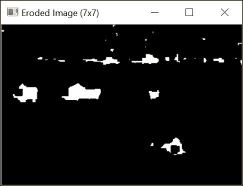

获得类似结果的另一种方法是重复应用相同的结构元素到图像上。这两个函数有一个可选参数可以指定重复的次数：

```py
    // Erode the image 3 times 
    cv::erode(image,eroded,cv::Mat(),cv::Point(-1,-1), 3); 

```

`cv::Point(-1,-1)`参数表示原点位于矩阵的中心（默认）；它可以在结构元素的任何位置定义。获得图像将与使用`7x7`结构元素获得的图像相同。实际上，腐蚀图像两次类似于用自身膨胀的结构元素腐蚀图像。这也适用于膨胀。

最后，由于背景/前景的概念是任意的，我们可以做出以下观察（这是腐蚀/膨胀算子的基本属性）。使用结构元素腐蚀前景对象可以看作是图像背景部分的膨胀。换句话说，我们可以得出以下结论：

+   图像的腐蚀相当于补集图像膨胀的补集

+   图像的膨胀相当于补集图像腐蚀的补集

## 更多...

注意，尽管我们在这里对二值图像应用了形态学滤波器，但这些滤波器可以使用相同的定义应用于灰度图像甚至彩色图像。本章的第三个配方将介绍一些形态学算子及其对灰度图像的影响。

此外，请注意，OpenCV 的形态学函数支持就地处理。这意味着您可以使用输入图像作为目标图像，如下所示：

```py
    cv::erode(image,image,cv::Mat()); 

```

OpenCV 将为您创建所需的临时图像，以确保此操作正常工作。

## 参见

+   使用形态学滤波器进行图像的**打开和关闭**的配方将腐蚀和膨胀滤波器级联应用以产生新的算子

+   **在灰度图像上应用形态学算子**的配方介绍了其他可以有效地应用于灰度图像的形态学算子

# 使用形态学滤波器打开和关闭图像

前一个配方向您介绍了两个基本的形态学算子：膨胀和腐蚀。从这些算子中，可以定义其他算子。接下来的两个配方将介绍其中的一些。打开和关闭算子在本配方中介绍。

## 如何操作...

为了应用高级形态学滤波器，您需要使用带有适当功能代码的`cv::morphologyEx`函数。例如，以下调用将应用关闭算子：

```py
    // Close the image 
    cv::Mat element5(5,5,CV_8U,cv::Scalar(1)); 
    cv::Mat closed; 
    cv::morphologyEx(image,closed,    // input and output images 
                     cv::MORPH_CLOSE, // operator code 
                     element5);       // structuring element 

```

注意，我们使用了`5x5`的结构元素来使滤波器效果更加明显。如果我们使用前一个配方的二值图像作为输入，我们将获得以下图像：

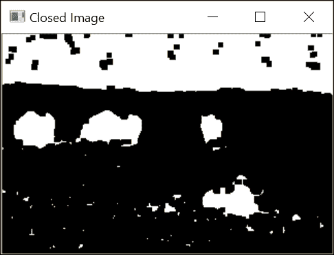

类似地，应用形态学打开算子将得到以下图像：

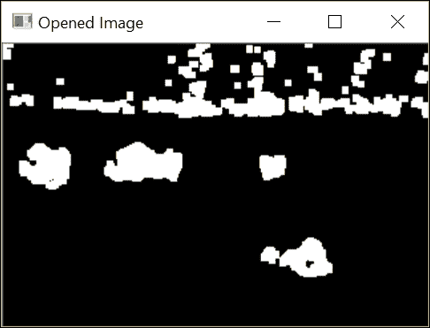

上述图像是从以下代码获得的：

```py
    cv::Mat opened; 
    cv::morphologyEx(image, opened, cv::MORPH_OPEN, element5); 

```

## 它是如何工作的...

打开和关闭滤波器简单地定义为基本腐蚀和膨胀操作。**关闭**定义为图像膨胀后的腐蚀。**打开**定义为图像腐蚀后的膨胀。

因此，可以使用以下调用计算图像的关闭：

```py
    // dilate original image 
    cv::dilate(image, result, cv::Mat()); 
    // in-place erosion of the dilated image 
    cv::erode(result, result, cv::Mat()); 

```

打开滤波器可以通过交换这两个函数调用来获得。

在检查闭合过滤器的结果时，可以看到白色前景对象的微小孔洞已被填充。过滤器还连接了几个相邻的对象。基本上，任何太小而无法完全包含结构元素的孔洞或缝隙都将被过滤器消除。

相反，开放过滤器从场景中消除了几个小对象。所有太小而无法包含结构元素的对象都已移除。

这些过滤器通常用于目标检测。闭合过滤器将错误地分割成更小片段的对象连接在一起，而开放过滤器则移除了由图像噪声引入的小块。因此，按顺序使用它们是有利的。如果您希望优先考虑噪声过滤，则可以在闭合过滤器之前应用开放过滤器，但这可能会以消除部分破碎对象为代价。

以下图像是在应用闭合过滤器之前应用开放过滤器的结果：

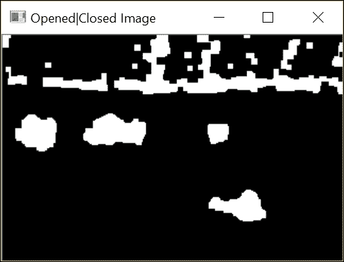

注意，对图像应用相同的开放（以及类似地闭合）算子多次没有效果。实际上，由于孔洞已经被第一次开放过滤器填充，再次应用相同的过滤器不会对图像产生任何其他变化。从数学的角度来看，这些算子被称为**幂等的**。

## 参见

+   开放和闭合算子通常用于在提取图像的连通组件之前清理图像，如第七章中“提取连通组件”配方中所述，第七章，*提取线条、轮廓和组件*

# 在灰度图像上应用形态学算子

更高级的形态学算子可以通过组合本章中介绍的不同基本形态学过滤器来组合。本配方将介绍两个形态学算子，当应用于灰度图像时，可以导致检测到有趣的图像特征。

## 如何做...

一个有趣的形态学算子是形态学梯度，它允许提取图像的边缘。这个算子可以通过以下`cv::morphologyEx`函数访问：

```py
    // Get the gradient image using a 3x3 structuring element 
    cv::Mat result; 
    cv::morphologyEx(image, result,
                     cv::MORPH_GRADIENT, cv::Mat()); 

```

以下结果显示了图像元素的提取轮廓（为了更好的查看，结果图像已被反转）：

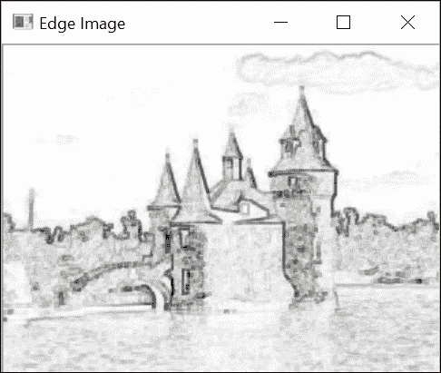

另一个有用的形态学算子是顶帽变换。这个算子可以用来从图像中提取局部的小前景对象。通过将此算子应用于上一章最后菜谱的书籍图像，可以演示该算子的效果。这张图像显示了一本书页面的不均匀照明。一个黑色的顶帽变换将提取该页面的字符（在此处被视为前景对象）。此算子也可以通过使用带有适当标志的`cv::morphologyEx`函数来调用：

```py
    // Apply the black top-hat transform using a 7x7 structuring element 
    cv::Mat element7(7, 7, CV_8U, cv::Scalar(1)); 
    cv::morphologyEx(image, result, cv::MORPH_BLACKHAT, element7); 

```

如下图中所示，此算子成功提取了原始图像中的大多数字符：

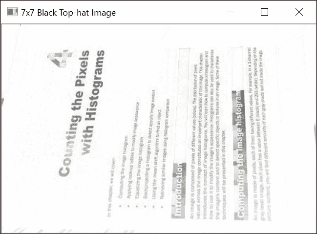

## 它是如何工作的...

要理解形态学算子对灰度图像的影响，可以将图像视为一个拓扑地形，其中灰度级别对应于海拔（或高度）。从这种角度来看，明亮区域对应于山脉，而暗区对应于地形的山谷。此外，由于边缘对应于暗亮像素之间的快速过渡，这些可以想象为陡峭的悬崖。如果在此类地形上应用侵蚀算子，最终结果将是用一定邻域中的最低值替换每个像素，从而降低其高度。因此，随着山谷的扩张，悬崖将被侵蚀。膨胀具有完全相反的效果；也就是说，悬崖将在山谷上方获得地形。然而，在这两种情况下，高原（即强度恒定的区域）将相对保持不变。

这些观察结果导致了一种简单的方法来检测图像的边缘（或悬崖）。这可以通过计算膨胀图像和侵蚀图像之间的差异来实现。由于这两个转换图像主要在边缘位置不同，因此减法将强调图像边缘。这正是当输入`cv::MORPH_GRADIENT`参数时`cv::morphologyEx`函数所做的事情。显然，结构元素越大，检测到的边缘就越粗。这个边缘检测算子被称为**Beucher 梯度**（下一章将更详细地讨论图像梯度的概念）。请注意，通过简单地从原始图像减去膨胀图像或从原始图像减去侵蚀图像也可以获得类似的结果。得到的边缘将只是更细。

顶帽算子也是基于图像差异的。这次，算子使用开运算和闭运算。当一个灰度图像被形态学开运算时，其局部峰值被消除；这是由于首先应用的腐蚀算子。其余的图像被保留。因此，原始图像与开运算后的图像之间的差异是局部峰值的集合。这些局部峰值是我们想要提取的前景对象。在这个配方示例书中，目标是提取页面上的字符。由于在这种情况下，前景对象是黑色背景上的黑色，我们使用了互补算子，称为黑色顶帽，它由从原始图像中减去其闭运算组成。我们使用了一个`7x7`的结构元素，以便闭运算足够大，可以去除字符。

## 参见

+   在第六章的“应用方向滤波检测边缘”配方中，*滤波图像*描述了其他执行边缘检测的滤波器

+   文章，“形态学梯度，J.-F. Rivest，P. Soille，和 S. Beucher，ISET 的电子成像科学和技术研讨会，SPIE*”，1992 年 2 月，更详细地讨论了形态学梯度的概念

+   文章“用于角点检测的形态学算子”，R. Laganière，*模式识别*，第 31 卷，第 11 期，1998 年，提出了一种使用形态学滤波器检测角点的算子

# 使用水平集分割图像

水平集变换是一种流行的图像处理算法，用于快速将图像分割成同质区域。它依赖于这样的想法：当图像被视为拓扑起伏时，同质区域对应于相对平坦的盆地，这些盆地由陡峭的边缘所限定。使用水平集算法，通过逐渐增加该盆地中的水位来淹没这个起伏，从而实现分割。由于其简单性，该算法的原版往往会导致图像过度分割，从而产生多个小区域。这就是为什么 OpenCV 提出了这个算法的一个变体，该变体使用一组预定义的标记来引导图像区域的定义。

## 如何操作...

水平集分割是通过使用`cv::watershed`函数获得的。该函数的输入是一个 32 位有符号整数标记图像，其中每个非零像素代表一个标签。其想法是标记图像中已知属于某个区域的某些像素。从这个初始标记开始，水平集算法将确定其他像素所属的区域。在这个配方中，我们首先创建标记图像作为一个灰度图像，然后将其转换为整数图像。我们方便地将这一步骤封装到一个包含指定标记图像的方法和一个计算水平集的方法的`WatershedSegmenter`类中：

```py
    class WatershedSegmenter { 

      private: 
      cv::Mat markers; 

      public: 
      void setMarkers(const cv::Mat& markerImage) { 

      // Convert to image of ints 
      markerImage.convertTo(markers,CV_32S); 
    } 

    cv::Mat process(const cv::Mat &image) { 

      // Apply watershed 
      cv::watershed(image,markers); 
      return markers; 
    } 

```

这些标记的获取方式取决于应用。例如，一些预处理步骤可能导致了识别出一些属于感兴趣对象的像素。然后，水线算法将被用来从初始检测中界定整个对象。在本食谱中，我们将简单地使用本章中使用的二值图像来识别对应原始图像中的动物（这是第四章中展示的图像，*使用直方图计数像素*）。因此，从我们的二值图像中，我们需要识别属于前景（动物）的像素和属于背景（主要是草地）的像素。在这里，我们将前景像素标记为标签`255`，背景像素标记为标签`128`（这种选择完全是任意的；除了`255`之外的任何标签数字都可以工作）。其他像素，即标签未知的那部分像素，被分配值为`0`。

到目前为止，二值图像包括属于图像各个部分的白色像素。然后我们将严重腐蚀此图像，以保留仅属于前景对象的像素：

```py
    // Eliminate noise and smaller objects 
    cv::Mat fg; 
    cv::erode(binary,fg,cv::Mat(),cv::Point(-1,-1),4); 

```

结果是以下图像：


注意，一些属于背景森林的像素仍然存在。让我们保留它们。因此，它们将被认为是属于感兴趣对象的。同样，我们可以通过原始二值图像的大膨胀来选择一些背景像素：

```py
    // Identify image pixels without objects 
    cv::Mat bg; 
    cv::dilate(binary,bg,cv::Mat(),cv::Point(-1,-1),4); 
    cv::threshold(bg,bg,1,128,cv::THRESH_BINARY_INV); 

```

结果中的黑色像素对应于背景像素。这就是为什么阈值操作在膨胀之后立即将这些像素的值分配为`128`。得到的图像如下：


这些图像如下组合成标记图像：

```py
    // Create markers image 
    cv::Mat markers(binary.size(),CV_8U,cv::Scalar(0)); 
    markers= fg+bg; 

```

注意我们在这里如何使用重载的`operator+`来组合图像。以下图像将被用作水线算法的输入：

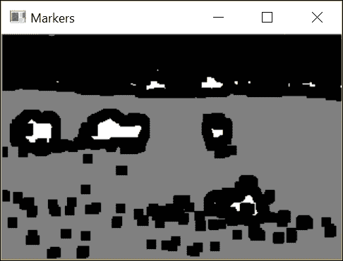

在这个输入图像中，白色区域肯定属于前景对象，灰色区域是背景的一部分，黑色区域具有未知标签。因此，水线分割的作用是通过建立精确的前景对象与背景之间的边界来为黑色标记像素分配标签（背景/前景）。这种分割如下获得：

```py
    // Create watershed segmentation object 
    WatershedSegmenter segmenter; 

    // Set markers and process 
    segmenter.setMarkers(markers); 
    segmenter.process(image); 

```

标记图像随后更新，使得每个零像素被分配一个输入标签，而属于找到的边界的像素具有值`-1`。标签的最终图像如下：

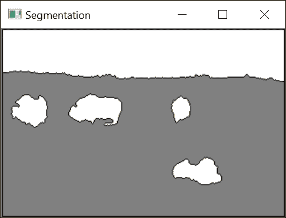

边界图像如下：

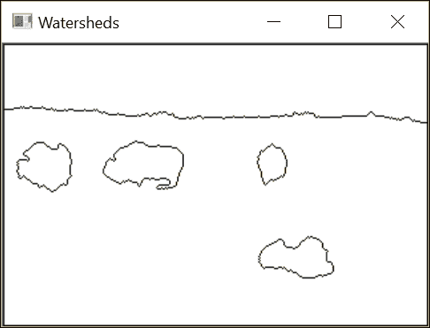

## 它是如何工作的...

正如我们在前面的菜谱中所做的那样，我们将在流域算法的描述中使用拓扑图类比。为了创建流域分割，想法是从级别 0 开始逐步洪水淹没图像。随着水位的逐步增加（到级别 1、2、3 等等），会形成集水盆地。这些盆地的尺寸也逐步增加，因此，两个不同盆地的水最终会合并。当这种情况发生时，会创建一个流域以保持两个盆地的分离。一旦水位达到最大级别，这些创建的盆地和流域的集合形成流域分割。

如预期的那样，洪水过程最初会创建许多小的独立盆地。当所有这些盆地合并时，会创建许多流域线，这导致图像过度分割。为了克服这个问题，已经提出了一种修改后的算法，其中洪水过程从一组预定义的标记像素开始。从这些标记创建的盆地根据分配给初始标记的值进行标记。当两个具有相同标签的盆地合并时，不会创建流域，从而防止过度分割。这就是调用`cv::watershed`函数时发生的情况。输入标记图像被更新以产生最终的流域分割。用户可以输入带有任何数量标签和未知标记像素保留为值`0`的标记图像。标记图像被选择为 32 位有符号整数的图像，以便能够定义超过`255`个标签。它还允许将特殊值`-1`分配给与流域相关的像素。

为了便于显示结果，我们引入了两种特殊方法。第一种方法返回标签图像（流域值为`0`）。这可以通过以下阈值操作轻松完成：

```py
    // Return result in the form of an image 
    cv::Mat getSegmentation() { 

      cv::Mat tmp; 
      // all segment with label higher than 255 
      // will be assigned value 255 
      markers.convertTo(tmp,CV_8U); 

      return tmp; 
    } 

```

同样，第二种方法返回一个图像，其中流域线被分配值为`0`，其余图像为`255`。这次，使用`cv::convertTo`方法来实现这个结果，如下所示：

```py
    // Return watershed in the form of an image 
    cv::Mat getWatersheds() { 

      cv::Mat tmp; 
      // Each pixel p is transformed into 
      // 255p+255 before conversion 
      markers.convertTo(tmp,CV_8U,255,255); 

      return tmp; 
    } 

```

在转换之前应用的线性变换允许`-1`像素转换为`0`（因为`-1*255+255=0`）。

值大于`255`的像素被分配值为`255`。这是由于在将有符号整数转换为无符号字符时应用的饱和操作。

## 还有更多...

显然，标记图像可以通过多种方式获得。例如，可以交互式地要求用户通过在对象和场景背景上绘制一些区域来标记图像中的对象。或者，为了识别位于图像中心的对象，也可以简单地输入一个带有中心区域标记的图像，该区域带有某种标签，图像的边缘（假设存在背景）带有另一个标签。可以通过以下方式在标记图像上绘制粗矩形来创建这个标记图像：

```py
    // Identify background pixels 
    cv::Mat imageMask(image.size(),CV_8U,cv::Scalar(0)); 
    cv::rectangle(imageMask, cv::Point(5,5),  
                  cv::Point(image.cols-5, image.rows-5),   
                  cv::Scalar(255), 3); 
    // Identify foreground pixels 
    // (in the middle of the image) 
    cv::rectangle(imageMask,
                  cv::Point(image.cols/2-10,image.rows/2-10),
                  cv::Point(image.cols/2+10,image.rows/2+10),
                  cv::Scalar(1), 10); 

```

如果我们将这个标记图像叠加到测试图像上，我们将获得以下图像：

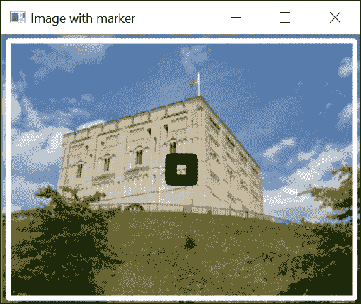

下面的结果是流域图像：

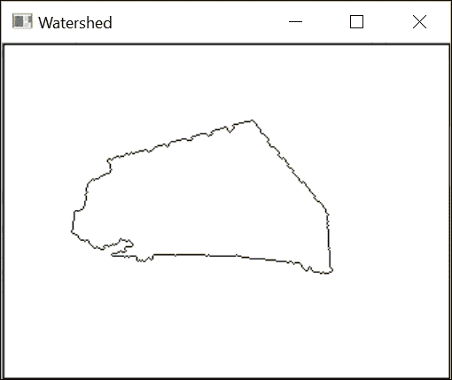

## 参见

+   文章《粘性流域变换》，作者 C. Vachier 和 F. Meyer，《数学图像与视觉杂志》，第 22 卷，第 2-3 期，2005 年 5 月，提供了关于流域变换的更多信息

# 使用 MSER 提取独特区域

在前面的菜谱中，你学习了如何通过逐渐淹没图像并创建流域来将图像分割成区域。**最大稳定外部区域**（**MSER**）算法使用相同的沉浸类比来从图像中提取有意义的区域。这些区域将通过逐级淹没图像来创建，但这次，我们将对在沉浸过程中相对稳定的盆地感兴趣。将观察到这些区域对应于图像中场景对象的某些独特部分。

## 如何做...

计算图像 MSER 的基本类是`cv::MSER`。这个类是从`cv::Feature2D`类继承的抽象接口；实际上，OpenCV 中的所有特征检测器都继承自这个超类。可以通过使用`create`方法创建`cv::MSER`类的实例。在这里，我们通过指定检测区域的最小和最大尺寸来初始化它，以限制检测到的特征数量，如下所示：

```py
    // basic MSER detector 
    cv::Ptr<cv::MSER> ptrMSER=  
     cv::MSER::create(5,     // delta value for local detection 
                      200,   // min acceptable area 
                      2000); // max acceptable area 

```

现在，可以通过调用`detectRegions`方法来获得 MSER，指定输入图像和适当的数据结构，如下所示：

```py
    // vector of point sets 
    std::vector<std::vector<cv::Point> > points; 
    // vector of rectangles 
    std::vector<cv::Rect> rects; 
    // detect MSER features 
    ptrMSER->detectRegions(image, points, rects); 

```

检测结果以由像素点组成的区域向量形式提供，这些像素点构成了每个区域，以及包围区域的边界框向量。为了可视化结果，我们在一个空白图像上创建一个图像，将在不同颜色（随机选择）上显示检测到的区域。这是按照以下步骤进行的：

```py
    // create white image 
    cv::Mat output(image.size(),CV_8UC3); 
    output= cv::Scalar(255,255,255); 

    // OpenCV random number generator 
    cv::RNG rng; 

    // Display the MSERs in color areas 
    // for each detected feature 
    // reverse order to display the larger MSER first 
    for (std::vector<std::vector<cv::Point> >::reverse_iterator  
             it= points.rbegin(); 
             it!= points.rend(); ++it) { 

        // generate a random color 
        cv::Vec3b c(rng.uniform(0,254),  
                    rng.uniform(0,254), rng.uniform(0,254)); 

        // for each point in MSER set 
        for (std::vector<cv::Point>::iterator itPts= it->begin(); 
                    itPts!= it->end(); ++itPts) { 

          // do not overwrite MSER pixels 
          if (output.at<cv::Vec3b>(*itPts)[0]==255) { 
            output.at<cv::Vec3b>(*itPts)= c; 
          } 
        } 
      } 

```

注意，MSER 形成了一个区域层次结构。因此，为了使所有这些区域都可见，我们选择在较大区域包含较小区域时，不覆盖较大区域。我们可以在以下图像上检测到 MSER：

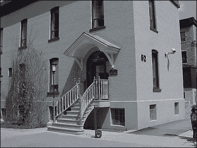

结果图像将如下所示：

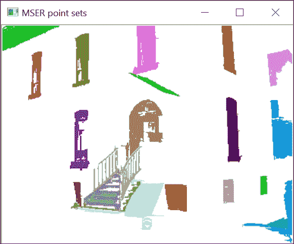

并非所有区域都可见于这张图像中。然而，我们可以观察到这个算子是如何从这张图像中提取出一些有意义的区域（例如，建筑的窗户）的。

## 它是如何工作的...

MSER 使用与分水岭算法相同的机制；也就是说，它是通过逐渐从级别 `0` 到级别 `255` 浇灌图像来进行的。请注意，在图像处理中，高于某个阈值的像素集通常被称为 **水平集**。随着水位的升高，你可以观察到那些尖锐界定的较暗区域形成了具有相对稳定形状的盆地（回想一下，在沉浸类比中，水位对应于强度水平）。这些稳定的盆地就是 MSER。这些是通过考虑每个级别的连通区域（盆地）并测量它们的稳定性来检测的。这是通过比较一个区域的当前面积与当级别下降 delta 值时的先前面积来完成的。当这种相对变化达到局部最小值时，该区域被识别为 MSER。用于测量相对稳定性的 delta 值是 `cv::MSER` 类构造函数的第一个参数；其默认值是 `5`。此外，要考虑的区域大小必须在某个预定义的范围内。可接受的区域最小和最大大小是构造函数的下一个两个参数。我们还必须确保 MSER 是稳定的（第四个参数），也就是说，其形状的相对变化足够小。稳定的区域可以包含在更大的区域中（称为父区域）。

要有效，父 MSER 必须与其子区域有足够的差异；这是多样性标准，它由 `cv::MSER` 构造函数的第五个参数指定。在上一节中使用的示例中，使用了这两个最后参数的默认值。（这些最后两个参数的默认值是 MSER 允许的最大变化为 `0.25`，父 MSER 的最小多样性为 `0.2`）。正如你所见，MSER 的检测需要指定多个参数，这可能会使其在不同环境中难以有效工作。

MSER 检测器的第一个输出是一个点集向量；这些点集中的每一个都构成一个区域。由于我们通常对整个区域更感兴趣，而不是其单个像素位置，因此通常用包围检测到的区域的一个简单几何形状来表示 MSER。因此，检测的第二个输出是一个边界框列表。因此，我们可以通过绘制所有这些矩形边界框来显示检测的结果。然而，这可能会表示出大量的矩形，使得结果难以可视化（记住我们还有区域内的区域，这使得表示更加杂乱）。在我们的例子中，让我们假设我们主要对检测建筑物的窗户感兴趣。因此，我们将提取所有具有直立矩形形状的区域。这可以通过比较每个边界框的面积与相应检测区域的面积来完成。如果两者具有相同的值（在这里，我们检查这两个面积的比率是否大于`0.6`），那么我们接受这个 MSER。以下代码实现了这个测试：

```py
    // Extract and display the rectangular MSERs 
    std::vector<cv::Rect>::iterator itr = rects.begin(); 
    std::vector<std::vector<cv::Point> >::iterator itp = points.begin(); 
    for (; itr != rects.end(); ++itr, ++itp) { 
      // ratio test 
      if (static_cast<double>(itp->size())/itr->area() > 0.6) 
        cv::rectangle(image, *itr, cv::Scalar(255), 2); 
    } 

```

提取的 MSER 如下所示：

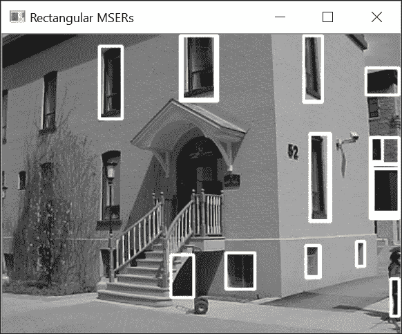

根据应用的不同，也可以采用其他标准和表示方法。以下代码测试检测到的区域是否不太细长（基于其旋转边界矩形的纵横比），然后使用适当方向的边界椭圆显示它们。

```py
    // Extract and display the elliptic MSERs 
    for (std::vector<std::vector<cv::Point> >::iterator  
              it = points.begin(); 
              it != points.end(); ++it) { 
       // for each point in MSER set 
       for (std::vector<cv::Point>::iterator itPts = it->begin(); 
              itPts != it->end(); ++itPts) { 

           // Extract bouding rectangles 
          cv::RotatedRect rr = cv::minAreaRect(*it); 
          // check ellipse elongation 
          if (rr.size.height / rr.size.height > 0.6 ||  
              rr.size.height / rr.size.height < 1.6) 
              cv::ellipse(image, rr, cv::Scalar(255), 2); 
      } 
    }   

```

结果如下所示：

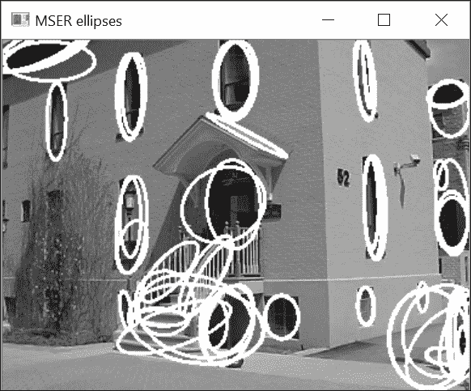

注意子 MSER 和父 MSER 通常由非常相似的椭圆表示。在某些情况下，然后对这些椭圆应用最小变化标准以消除这些重复表示可能是有趣的。

## 参见

+   第七章的计算组件形状描述符中的“提取线条、轮廓和组件”配方将向您展示如何计算连接点集的其他属性

+   第八章检测兴趣点将解释如何将 MSER 用作兴趣点检测器
