# 第十章. 图像中的投影关系估计

在本章中，我们将介绍以下食谱：

+   计算图像对的基本矩阵

+   使用随机样本一致性匹配图像

+   计算两张图像之间的单应性

+   在图像中检测平面目标

# 简介

图像通常是通过使用数字相机生成的，该相机通过将穿过其镜头的光线投射到图像传感器上来捕捉场景。一个图像是通过将 3D 场景投影到 2D 平面上形成的这一事实，意味着场景与其图像之间以及同一场景的不同图像之间存在重要的关系。投影几何是用于用数学术语描述和表征图像形成过程的工具。在本章中，我们将向您介绍多视图图像中存在的一些基本投影关系，并解释这些关系如何在计算机视觉编程中使用。但是，在我们开始介绍食谱之前，让我们探索与场景投影和图像形成相关的基本概念。

## 图像形成

基本上，自摄影术开始以来，用于生成图像的过程并没有改变。从观察场景发出的光线通过相机的前置孔径被捕捉，捕捉到的光线射向位于相机后部的图像平面（或图像传感器）。此外，还使用一个镜头来集中来自不同场景元素的光线。这个过程如下图所示：

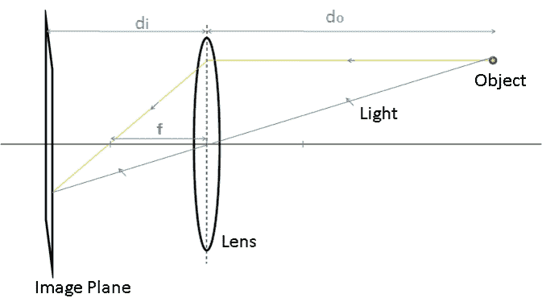

在这里，`do` 是镜头到观察对象的距离，`di` 是镜头到图像平面的距离，`f` 是镜头的焦距。这些量通过所谓的**薄透镜方程**相关联：

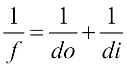

在计算机视觉中，这个相机模型可以通过多种方式简化。首先，我们可以通过考虑我们有一个具有无穷小孔径的相机来忽略镜头的影响，因为从理论上讲，这不会改变图像的外观。（然而，这样做会通过创建具有无限景深图像的方式忽略聚焦效果。）在这种情况下，因此，只考虑中心光线。其次，由于大多数时候我们有 `do>>di`，我们可以假设图像平面位于焦距处。最后，我们可以从系统的几何关系中注意到，平面上的图像是倒置的。我们可以通过简单地将图像平面放置在镜头前方来获得一个相同但正立的图像。显然，这在物理上是不切实际的，但从数学角度来看，这是完全等价的。这个简化的模型通常被称为**针孔相机模型**，如下所示：


从这个模型出发，并使用相似三角形定律，我们可以很容易地推导出将摄影物体与其图像相关联的基本投影方程：

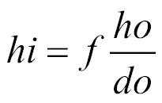

因此，一个物体（物理高度为`ho`）的图像大小（`hi`）与其与相机距离（`do`）成反比，这是自然而然的事情。一般来说，这种关系描述了在给定相机几何形状的情况下，一个 3D 场景点将在图像平面上投影的位置。更具体地说，如果我们假设参考框架位于焦点处，那么位于位置`(X,Y,Z)`的 3D 场景点将被投影到图像平面上，即`(x,y)=(fX/Z,fY/Z)`。在这里，`Z`坐标对应于点的深度（或到相机的距离，在前面方程中用`do`表示）。通过引入齐次坐标，可以将这种关系重写为简单的矩阵形式，其中二维点由 3 向量表示，三维点由 4 向量表示（额外的坐标只是一个需要从齐次 3 向量中提取二维坐标时去除的任意比例因子`s`）：

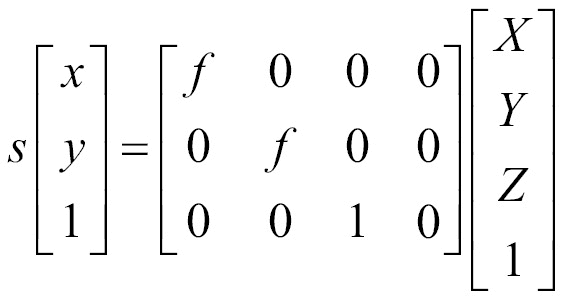

这个`3x4`矩阵被称为投影矩阵。在参考框架未与焦点对齐的情况下，必须引入旋转`r`和平移`t`矩阵。这些矩阵的作用仅仅是将投影的 3D 点表达为以相机为中心的参考框架，如下所示：

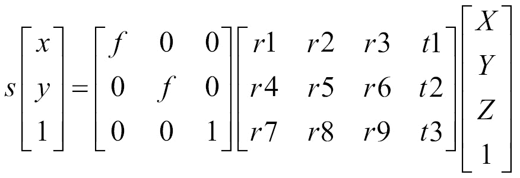

该方程的第一个矩阵据说包含相机的内在参数（在这里，只有焦距，但下一章将介绍一些更多的内在参数）。第二个矩阵包含外参数，这些参数与相机与外部世界相关。应注意的是，在实践中，图像坐标用像素表示，而 3D 坐标用世界测量表示（例如，米）。这一点将在第十一章 *重建 3D 场景*中探讨。

# 计算图像对的基本矩阵

本章的引言部分介绍了投影方程，描述了场景点如何投影到单台相机的图像平面上。在本食谱中，我们将探讨显示相同场景的两个图像之间存在的投影关系。这两个图像可能是通过将相机移动到两个不同的位置从两个视点拍照获得的，或者是通过使用两个相机，每个相机拍摄场景的不同图像。当这两个相机通过一个刚体基线分开时，我们使用术语**立体视觉**。

## 准备中

现在让我们考虑两个小孔相机观察一个给定的场景点，如图所示：

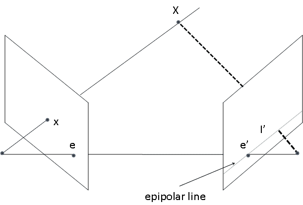

我们了解到，我们可以通过追踪连接 3D 点 `X` 和相机中心的直线来找到 3D 点 `X` 的图像 `x`。相反，在图像平面上具有图像位置 **x** 的场景点可以在 3D 空间中的这条直线上任何位置。这意味着，如果我们想在另一幅图像中找到给定图像点的对应点，我们需要沿着这条直线在第二幅图像平面上的投影进行搜索。这条想象中的直线称为点 `x` 的**极线**。它定义了一个必须满足两个对应点的基本约束；也就是说，给定点的匹配必须位于另一视图中的该点的极线上，并且这条极线的确切方向取决于两个相机的相对位置。实际上，可能极线集的配置表征了双视图系统的几何形状。

从这个双视图系统的几何形状中可以得出的另一个观察结果是，所有的极线都通过同一点。这一点对应于一个相机中心在另一个相机上的投影（上图中的点 `e` 和 `e'`）。这个特殊点称为**极点**。

从数学上讲，图像点与其对应极线之间的关系可以使用一个 `3x3` 矩阵来表示，如下所示：

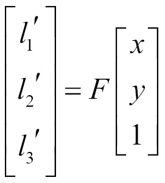

在射影几何中，二维直线也由一个 3 向量表示。它对应于满足方程 `l1'x'+ l2'y'+ l3'= 0`（上标撇表示这条直线属于第二幅图像）的二维点集 `(x',y')`。因此，称为基本矩阵的矩阵 `F` 将一个视图中的二维图像点映射到另一个视图中的极线。

## 如何操作...

图像对的基本矩阵可以通过解一组方程来估计，这组方程涉及两个图像之间的一定数量的已知匹配点。这种匹配的最小数量是七个。为了说明基本矩阵估计过程，我们从上一章中展示的 SIFT 特征匹配结果中选择了七个良好的匹配点。

这些匹配将用于使用 `cv::findFundamentalMat` OpenCV 函数计算基本矩阵。显示的是具有其选定匹配的图像对：

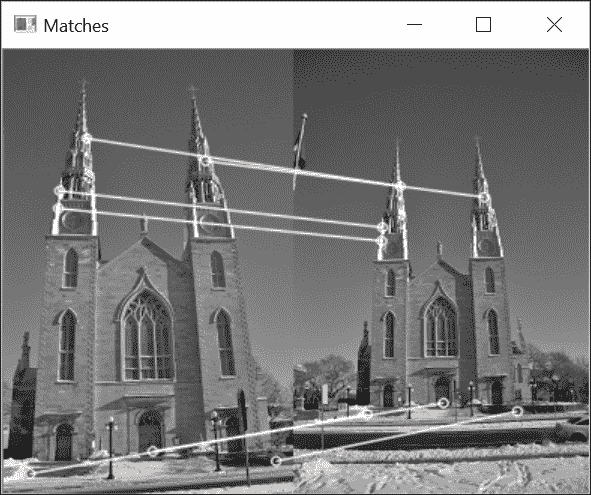

这些匹配存储在一个指向 `cv::keypoint` 实例索引的 `cv::DMatch` 向量中。这些关键点首先需要转换为 `cv::Point2f`，以便与 `cv::findFundamentalMat` 一起使用。可以使用 OpenCV 函数来完成此操作：

```py
    // Convert keypoints into Point2f 
    std::vector<cv::Point2f> selPoints1, selPoints2; 
    std::vector<int> pointIndexes1, pointIndexes2; 
    cv::KeyPoint::convert(keypoints1,selPoints1,pointIndexes1); 
    cv::KeyPoint::convert(keypoints2,selPoints2,pointIndexes2); 

```

生成的两个向量 `selPoints1` 和 `selPoints2` 包含两个图像中对应点的坐标。`pointIndexes1` 和 `pointIndexes2` 向量包含要转换的关键点的索引。然后对 `cv::findFundamentalMat` 函数的调用如下：

```py
    // Compute F matrix from 7 matches 
    cv::Mat fundamental= cv::findFundamentalMat(  
                             selPoints1,      // 7 points in first image 
                             selPoints2,      // 7 points in second image 
                             cv::FM_7POINT);  // 7-point method 

```

验证基本矩阵有效性的一个方法是绘制一些选定点的极线。另一个 OpenCV 函数允许计算给定点的极线。一旦这些极线被计算出来，就可以使用`cv::line`函数来绘制。以下代码行完成了这两个步骤（即从左图中的点计算并绘制右图上的极线）：

```py
    // draw the left points corresponding epipolar 
    // lines in right image  
    std::vector<cv::Vec3f> lines1; 
    cv::computeCorrespondEpilines(  
                     selPoints1,  // image points  
                     1,           // in image 1 (can also be 2) 
                     fundamental, // F matrix 
                     lines1);     // vector of epipolar lines 
    // for all epipolar lines 
    for (vector<cv::Vec3f>::const_iterator it= lines1.begin(); 
                it!=lines1.end(); ++it) { 
      // draw the line between first and last column 
      cv::line(image2, cv::Point(0,-(*it)[2]/(*it)[1]),
               cv::Point(image2.cols,
                         -((*it)[2]+(*it)[0]*image2.cols)/(*it)[1]), 
                         cv::Scalar(255,255,255)); 
    } 

```

左图的极线以类似的方式获得。以下图像显示了这些线：

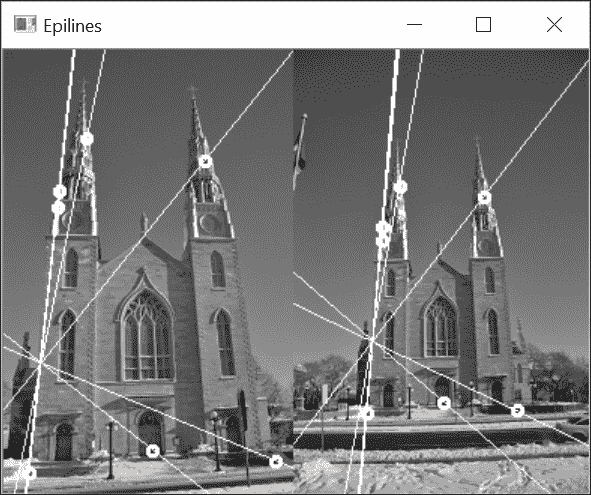

记住，一个图像的极点位于所有极线的交点处。这个点是另一个相机的中心的投影。请注意，极线可以在图像边界之外相交（并且通常确实如此）。在我们的例子中，第二图像的极点位于如果两个图像在同一瞬间拍摄，第一个相机应该可见的位置。还请注意，当仅从七个匹配中计算基本矩阵时，结果可能非常不稳定。确实，用一个匹配替换另一个匹配可能会导致极线集合显著不同。

## 它是如何工作的...

我们之前解释过，对于一幅图中的一个点，基本矩阵给出了另一个视图中其对应点所在线的方程。如果点`(x,y)`的对应点是`(x',y')`，假设我们有两个视图之间的基本矩阵`F`。由于`(x',y')`位于通过将`F`乘以表示为齐次坐标的`(x,y)`得到的极线上，因此我们必须有以下的方程：

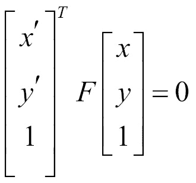

这个方程表达了两个对应点之间的关系，被称为**极线约束**。使用这个方程，就可以使用已知的匹配来估计矩阵的项。由于`F`矩阵的项只给出一个比例因子，因此只有八个项需要估计（第九项可以任意设置为`1`）。每个匹配都对一个方程有贡献。因此，使用八个已知的匹配，可以通过求解得到的线性方程组来完全估计矩阵。这就是当你使用`cv::findFundamentalMat`函数的`cv::FM_8POINT`标志时所做的事情。请注意，在这种情况下，输入超过八个匹配是可能的（并且是首选的）。然后，可以在均方意义上求解得到的超定线性方程组。

为了估计基础矩阵，还可以利用一个额外的约束条件。从数学上讲，`F` 矩阵将一个二维点映射到一条一维直线束（即相交于一个公共点的直线）。所有这些极线都通过这个唯一点（即极点）的事实对矩阵施加了一个约束。这个约束将估计基础矩阵所需的匹配数量减少到七个。用数学术语来说，我们说基础矩阵有 7 个自由度，因此是秩为 2 的。不幸的是，在这种情况下，方程组变得非线性，最多有三个可能的解（在这种情况下，`cv::findFundamentalMat` 将返回一个大小为 `9x3` 的基础矩阵，即三个 `3x3` 矩阵堆叠）。可以通过在 OpenCV 中使用 `cv::FM_7POINT` 标志来调用 `F` 矩阵估计的七个匹配解。这正是我们在上一节示例中所做的。

最后，应该提到的是，在图像中选择一个合适的匹配集对于获得基础矩阵的准确估计很重要。一般来说，匹配应该在图像中均匀分布，并包括场景中不同深度的点。否则，解将变得不稳定。特别是，所选的场景点不应共面，因为在这种情况下，基础矩阵（在这种情况下）将变得退化。

## 参见

+   《计算机视觉中的多视图几何》，剑桥大学出版社，2004 年，*R. Hartley* 和 *A. Zisserman*，是计算机视觉中投影几何最完整的参考书

+   《使用随机样本一致性匹配图像》菜谱解释了如何从更大的匹配集中稳健地估计基础矩阵

+   《在两幅图像之间计算单应性》菜谱解释了为什么当匹配点共面或是由纯旋转产生的结果时，无法计算基础矩阵

# 使用随机样本一致性匹配图像

当两个相机观察同一个场景时，它们看到相同的元素，但处于不同的视点。我们已经在上一章研究了特征点匹配问题。在这个菜谱中，我们回到这个问题，我们将学习如何利用上一菜谱中引入的极线约束来更可靠地匹配图像特征。

我们将遵循的原则很简单：当我们在两幅图像之间匹配特征点时，我们只接受落在对应极线上的匹配。然而，为了能够检查这个条件，必须知道基础矩阵，但我们需要好的匹配来估计这个矩阵。这似乎是一个鸡生蛋的问题。然而，在这个菜谱中，我们提出了一种解决方案，其中基础矩阵和一组好的匹配将共同计算。

## 如何做到...

目标是能够计算两个视图之间的基本矩阵和一组好的匹配项。为此，我们将使用在前面食谱中引入的极线约束来验证找到的所有特征点对应关系。为此，我们创建了一个封装所提议的鲁棒匹配过程不同步骤的类：

```py
    class RobustMatcher { 
     private: 
      // pointer to the feature point detector object 
      cv::Ptr<cv::FeatureDetector> detector; 
      // pointer to the feature descriptor extractor object 
      cv::Ptr<cv::DescriptorExtractor> descriptor; 
      int normType; 
      float ratio;         // max ratio between 1st and 2nd NN 
      bool refineF;        // if true will refine the F matrix 
      bool refineM;        // if true will refine the matches  
      double distance;     // min distance to epipolar 
      double confidence;   // confidence level (probability) 

     public: 

      RobustMatcher(const cv::Ptr<cv::FeatureDetector> &detector,         
                    const cv::Ptr<cv::DescriptorExtractor> &descriptor=  
                              cv::Ptr<cv::DescriptorExtractor>()):
                    detector(detector), descriptor(descriptor),                
                    normType(cv::NORM_L2), ratio(0.8f),  
                    refineF(true), refineM(true),  
                    confidence(0.98), distance(1.0) { 

          // in this case use the associated descriptor 
          if (!this->descriptor) {  
            this->descriptor = this->detector; 
        }  
      } 

```

该类的用户只需提供他们选择的特征检测器和描述符实例。这些也可以使用定义的`setFeatureDetector`和`setDescriptorExtractor`设置方法来指定。

主要方法是匹配方法，它返回匹配项、检测到的关键点和估计的基本矩阵。该方法分为四个不同的步骤（在以下代码的注释中明确标识），我们现在将探讨这些步骤：

```py
    // Match feature points using RANSAC 
    // returns fundamental matrix and output match set 
    cv::Mat match(cv::Mat& image1, cv::Mat& image2,     // input images 
                  std::vector<cv::DMatch>& matches,     // output matches 
                  std::vector<cv::KeyPoint>& keypoints1,//output keypoints 
                  std::vector<cv::KeyPoint>& keypoints2) {  

       // 1\. Detection of the feature points 
      detector->detect(image1,keypoints1); 
      detector->detect(image2,keypoints2); 

      // 2\. Extraction of the feature descriptors 
      cv::Mat descriptors1, descriptors2; 
      descriptor->compute(image1,keypoints1,descriptors1); 
      descriptor->compute(image2,keypoints2,descriptors2); 

      // 3\. Match the two image descriptors 
      // (optionally apply some checking method) 

      // Construction of the matcher with crosscheck 
      cv::BFMatcher matcher(normType,   //distance measure 
                            true);      //crosscheck flag 
      // match descriptors 
      std::vector<cv::DMatch> outputMatches; 
      matcher.match(descriptors1,descriptors2,outputMatches); 

      // 4\. Validate matches using RANSAC 
      cv::Mat fundamental= ransacTest(outputMatches,        
                                      keypoints1, keypoints2,   
                                      matches); 
      // return the found fundamental matrix 
      return fundamental; 
    } 

```

前两个步骤仅仅是检测特征点并计算它们的描述符。接下来，我们使用`cv::BFMatcher`类进行特征匹配，就像我们在上一章中所做的那样。我们使用交叉检查标志来获得更好的匹配项。

第四步是本食谱中引入的新概念。它包括一个额外的过滤测试，这次将使用基本矩阵来拒绝不遵守极线约束的匹配项。这个测试基于`RANSAC`方法，即使匹配集中存在异常值也能计算基本矩阵（这种方法将在下一节中解释）。

使用我们的`RobustMatcher`类，通过以下调用就可以轻松完成图像对的鲁棒匹配：

```py
    // Prepare the matcher (with default parameters) 
    // SIFT detector and descriptor 
    RobustMatcher rmatcher(cv::xfeatures2d::SIFT::create(250)); 

    // Match the two images 
    std::vector<cv::DMatch> matches; 

    std::vector<cv::KeyPoint> keypoints1, keypoints2; 
    cv::Mat fundamental = rmatcher.match(image1, image2,    
                                         matches,         
                                         keypoints1, keypoints2); 

```

这导致了`54`个匹配项，如下面的截图所示：

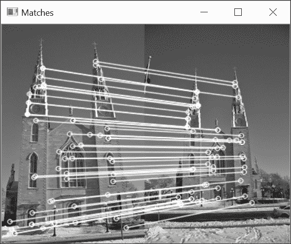

大多数情况下，得到的匹配项将是好的匹配项。然而，可能还有一些错误的匹配项残留；这些是那些意外落在计算出的基本矩阵的对应极线上的。

## 它是如何工作的...

在前面的食谱中，我们了解到可以从多个特征点匹配中估计与图像对相关联的基本矩阵。显然，为了精确，这个匹配集必须只由好的匹配项组成。然而，在实际情况下，无法保证通过比较检测到的特征点的描述符获得的匹配集是完全精确的。这就是为什么引入了一种基于**RANSAC**（**RANdom SAmpling Consensus**）策略的基本矩阵估计方法。

RANSAC 算法旨在从一个可能包含多个异常值的数据集中估计一个给定的数学实体。其思路是从集合中随机选择一些数据点，并仅使用这些点进行估计。所选点的数量应该是估计数学实体所需的最小点数。在基本矩阵的情况下，八个匹配对是最小数量（实际上，真正的最小值是七个匹配，但 8 点线性算法计算更快）。一旦从这八个随机匹配中估计出基本矩阵，所有其他匹配集的匹配都将与由此矩阵导出的共线约束进行测试。所有满足此约束的匹配（即对应特征与其共线线距离较短的匹配）都将被识别。这些匹配构成了计算出的基本矩阵的支持集。

RANSAC 算法背后的核心思想是，支持集越大，计算出的矩阵是正确的概率就越高。相反，如果随机选择的匹配中有一个（或多个）是错误的匹配，那么计算出的基本矩阵也将是错误的，其支持集预计会很小。这个过程会重复多次，最后，支持集最大的矩阵将被保留为最可能的矩阵。

因此，我们的目标是多次随机选择八个匹配，以便最终选择出八个好的匹配，这将给我们一个大的支持集。根据整个数据集中错误匹配的比例，选择八个正确匹配集的概率将不同。然而，我们知道，我们选择的次数越多，我们对在这些选择中至少有一个好的匹配集的信心就越高。更精确地说，如果我们假设匹配集由`w%`的内部点（好的匹配）组成，那么我们选择八个好匹配的概率是`w⁸`。因此，选择包含至少一个错误匹配的概率是`(1-w⁸)`。如果我们进行`k`次选择，只有一个随机集只包含好匹配的概率是`1-(1-w⁸)^k`。

这就是置信概率`c`，我们希望这个概率尽可能高，因为我们至少需要一个好的匹配集才能获得正确的基本矩阵。因此，在运行 RANSAC 算法时，需要确定需要进行多少次`k`次选择才能获得给定的置信水平。

使用 RANSAC 方法估计基本矩阵是在我们的`RobustMatcher`类的`ransacTest`方法中完成的：

```py
    // Identify good matches using RANSAC 
    // Return fundamental matrix and output matches 
    cv::Mat ransacTest(const std::vector<cv::DMatch>& matches,
                       std::vector<cv::KeyPoint>& keypoints1,  
                       std::vector<cv::KeyPoint>& keypoints2,  
                       std::vector<cv::DMatch>& outMatches) { 

      // Convert keypoints into Point2f 
      std::vector<cv::Point2f> points1, points2; 
      for (std::vector<cv::DMatch>::const_iterator it= matches.begin(); 
           it!= matches.end(); ++it) { 

        // Get the position of left keypoints 
        points1.push_back(keypoints1[it->queryIdx].pt); 
        // Get the position of right keypoints 
        points2.push_back(keypoints2[it->trainIdx].pt); 
      } 

      // Compute F matrix using RANSAC 
      std::vector<uchar> inliers(points1.size(),0); 
      cv::Mat fundamental=  
         cv::findFundamentalMat( points1,
                         points2,       // matching points 
                         inliers,       // match status (inlier or outlier)   
                         cv::FM_RANSAC, // RANSAC method 
                         distance,      // distance to epipolar line 
                         confidence);   // confidence probability 

      // extract the surviving (inliers) matches 
      std::vector<uchar>::const_iterator itIn= inliers.begin(); 
      std::vector<cv::DMatch>::const_iterator itM= matches.begin(); 
      // for all matches 
      for ( ;itIn!= inliers.end(); ++itIn, ++itM) { 
        if (*itIn) { // it is a valid match 
        outMatches.push_back(*itM); 
      } 
    } 
    return fundamental; 
   } 

```

这段代码有点长，因为在使用 F 矩阵计算之前，需要将关键点转换为`cv::Point2f`。当使用`cv::findFundamentalMat`函数并选择`cv::FM_RANSAC`方法时，提供了两个额外的参数。其中一个额外参数是置信水平，它决定了要进行的迭代次数（默认为`0.99`）。另一个参数是点被认为是内点（inlier）的最大距离到极线的距离。所有点与其极线距离大于指定距离的匹配对将被报告为异常点。该函数还返回一个`std::vector`字符值，表示输入集中的相应匹配已被识别为异常点（`0`）或内点（`1`）。这解释了我们方法中提取良好匹配的最后循环。

在你的初始匹配集中，良好的匹配点越多，RANSAC 给出正确基本矩阵的概率就越高。这就是为什么我们在匹配特征点时应用了交叉检查过滤器。你也可以使用之前菜谱中提到的比率测试来进一步提高最终匹配集的质量。这只是平衡计算复杂度、最终匹配点的数量以及所需置信水平的问题，即获得的匹配集将只包含精确匹配。

## 还有更多...

本菜谱中提出的鲁棒匹配过程的结果是：1）使用具有最大支持的八个选定匹配点计算的基本矩阵的估计值；2）包含在这个支持集中的匹配集。使用这些信息，可以通过两种方式来优化这些结果。

### 优化基本矩阵

由于我们现在有一组高质量的匹配点，作为最后一步，使用所有这些点来重新估计基本矩阵可能是个好主意。我们之前提到，存在一个线性 8 点算法来估计这个矩阵。因此，我们可以获得一个超定方程组，以最小二乘法求解基本矩阵。这一步可以添加到我们的`ransacTest`函数的末尾：

```py
    // Convert the keypoints in support set into Point2f  
    points1.clear(); 
    points2.clear(); 
    for (std::vector<cv::DMatch>::const_iterator it=  
                                      outMatches.begin(); 
         it!= outMatches.end(); ++it) { 
      // Get the position of left keypoints 
      points1.push_back(keypoints1[it->queryIdx].pt); 
      // Get the position of right keypoints 
      points2.push_back(keypoints2[it->trainIdx].pt); 
    } 

    // Compute 8-point F from all accepted matches 
    fundamental= cv::findFundamentalMat(  
                      points1,points2, // matching points 
                      cv::FM_8POINT);  // 8-point method solved using SVD 

```

`cv::findFundamentalMat`函数确实可以通过使用奇异值分解求解线性方程组来接受超过`8`个匹配点。

### 优化匹配

我们了解到，在双视场系统中，每个点都必须位于其对应点的极线（epipolar line）上。这是由基本矩阵表达的基本约束。因此，如果你有一个基本矩阵的良好估计，你可以使用这个极线约束来通过强制它们位于其极线上来纠正获得的匹配点。这可以通过使用`cv::correctMatches` OpenCV 函数轻松完成：

```py
    std::vector<cv::Point2f> newPoints1, newPoints2; 
    // refine the matches 
    correctMatches(fundamental,             // F matrix 
                   points1, points2,        // original position 
                   newPoints1, newPoints2); // new position 

```

此函数通过修改每个对应点的位置，使其满足极线约束，同时最小化累积（平方）位移来执行。

# 计算两张图像之间的单应性

本章的第一个食谱向您展示了如何从一组匹配中计算图像对的基本矩阵。在射影几何中，还存在另一个非常有用的数学实体。这个实体可以从多视图图像中计算出来，正如我们将要看到的，它是一个具有特殊性质的矩阵。

## 准备中

再次，让我们考虑一个 3D 点与其在相机上的图像之间的射影关系，这是我们在本章引言部分介绍的。基本上，我们了解到这个方程通过相机的内在属性和该相机的位置（用旋转和平移分量指定）将 3D 点与其图像联系起来。如果我们现在仔细检查这个方程，我们会意识到有两个特别有趣的特殊情况。第一种情况是当场景的两个视图之间仅由纯旋转分离时。我们可以观察到外矩阵的第四列将全部由`0`s 组成（即平移为零）：

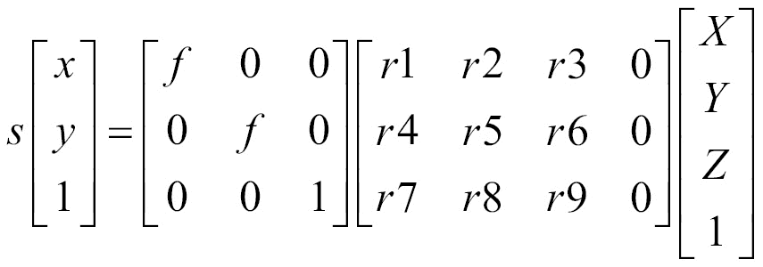

因此，在这种特殊情况下，射影关系变成了一个`3x3`矩阵。当我们观察到的物体是一个平面时，也会出现一个同样有趣的情况。在这种情况下，我们可以假设（不失一般性）该平面上的点将位于`Z=0`。因此，我们得到以下方程：


场景点的这个零坐标将取消掉射影矩阵的第三列，从而使它再次成为一个`3x3`矩阵。这个特殊的矩阵被称为**单应性矩阵**，它意味着在特殊情况下（在这里，是纯旋转或平面物体），一个世界点可以通过线性关系与其图像相关联。此外，因为这个矩阵是可逆的，所以如果你知道这两个视图之间是纯旋转，或者它们正在成像一个平面物体，你也可以直接将一个视图上的图像点与其在另一个视图上的对应点联系起来。单应性关系的形式如下：

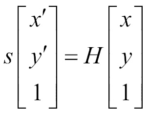

这里，`H`是一个`3x3`矩阵。这个关系在由`s`标量值表示的尺度因子下成立。一旦估计出这个矩阵，就可以使用这个关系将一个视图中的所有点转移到第二个视图。这就是本食谱和下一个食谱将要利用的性质。请注意，作为单应性关系的副作用，在这些情况下基本矩阵变得未定义。

## 如何操作...

假设我们有两个由纯旋转分隔的图像。例如，当你通过旋转自己来拍摄建筑物或风景时，这种情况就会发生；由于你离你的主题足够远，在这种情况下，平移分量是可忽略的。可以使用你选择的特征和`cv::BFMatcher`函数将这两个图像匹配起来。

结果如下：

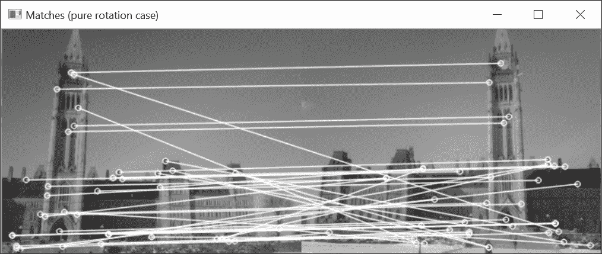

然后，就像我们在之前的菜谱中做的那样，我们将应用一个 RANSAC 步骤，这次将涉及基于匹配集（显然包含大量异常值）的透视变换估计。这是通过使用`cv::findHomography`函数来完成的，该函数与`cv::findFundamentalMat`函数非常相似：

```py
    // Find the homography between image 1 and image 2 
    std::vector<char> inliers; 
    cv::Mat homography= cv::findHomography(       
                            points1,
                            points2,    // corresponding points 
                            inliers,    // outputed inliers matches  
                            cv::RANSAC, // RANSAC method 
                            1.);     //max distance to reprojection point 

```

回想一下，存在透视变换（而不是基本矩阵），因为我们的两个图像是通过纯旋转分隔的。我们在这里显示由函数的`inliers`参数识别的内点关键点：

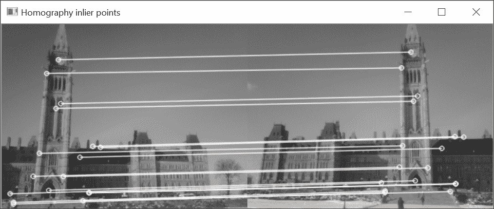

透视变换是一个`3x3`可逆矩阵。因此，一旦计算出来，就可以将一个图像中的图像点转移到另一个图像中。实际上，你可以对图像的每个像素都这样做。因此，你可以将整个图像转移到第二个图像的视角中。这个过程被称为图像**拼接**或图像**缝合**，通常用于从多张图像构建大型全景图。执行此操作的确切 OpenCV 函数如下：

```py
    // Warp image 1 to image 2 
    cv::Mat result; 
    cv::warpPerspective(image1,       // input image 
                        result,       // output image 
                        homography,   // homography 
                        cv::Size(2*image1.cols,image1.rows));  
                        // size of output image 

```

一旦获得这张新图像，就可以将其附加到其他图像上以扩展视图（因为这两张图像现在是从相同视角拍摄的）：

```py
    // Copy image 1 on the first half of full image 
    cv::Mat half(result,cv::Rect(0,0,image2.cols,image2.rows)); 
    image2.copyTo(half);    // copy image2 to image1 roi 

```

下面的图像是结果：

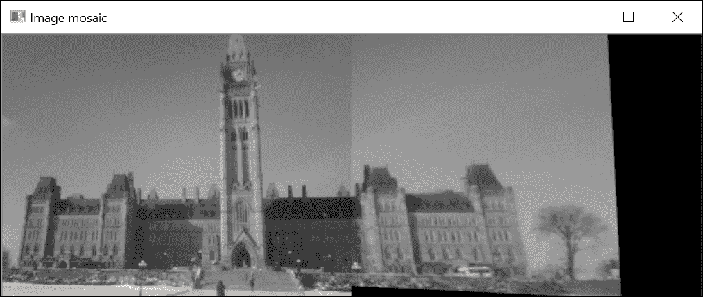

## 它是如何工作的...

当两个视角通过透视变换相关联时，就可以确定一个图像上的给定场景点在另一图像上的位置。这个特性对于落在另一图像边界外的图像中的点尤其有趣。确实，由于第二个视角显示了第一个图像中不可见的场景的一部分，你可以使用透视变换来通过读取另一图像中额外像素的颜色值来扩展图像。这就是我们能够创建一个新图像的原因，它是第二个图像的扩展，在右侧添加了额外的列。

由`cv::findHomography`计算的透视变换是将第一图像中的点映射到第二图像中的点。这个透视变换可以从至少四个匹配中计算出来，并且在这里再次使用 RANSAC 算法。一旦找到具有最佳支持的透视变换，`cv::findHomography`方法就会使用所有识别出的内点来细化它。

现在，为了将图像`1`的点转移到图像`2`上，我们实际上需要的是逆单应性。这正是`cv::warpPerspective`函数默认执行的操作；也就是说，它使用作为输入提供的单应性的逆来获取输出图像中每个点的颜色值（这就是我们在第二章，*操作像素*中提到的反向映射）。当一个输出像素被转移到输入图像之外的一个点时，这个像素将被简单地分配一个黑色值（`0`）。请注意，如果想在像素传输过程中使用直接单应性而不是逆单应性，可以在`cv::warpPerspective`中将`cv::WARP_INVERSE_MAP`标志指定为可选的第五个参数。

## 还有更多...

OpenCV 的`contrib`包提供了一个完整的拼接解决方案，可以从多张图像生成高质量的全景图。

### 使用 cv::Stitcher 模块生成图像全景

在这个配方中我们获得的风暴图虽然不错，但仍然存在一些缺陷。图像的对齐并不完美，我们可以清楚地看到两张图像之间的切割，因为两张图像的亮度和对比度并不相同。幸运的是，现在 OpenCV 中有一个拼接解决方案，它考虑了所有这些方面，并试图生成一个质量最优的全景图。这个解决方案相当复杂且详尽，但其核心依赖于在这个配方中学到的原则。也就是说，匹配图像中的特征点并稳健地估计单应性。此外，该解决方案通过补偿曝光条件差异来很好地将图像融合在一起。此函数的高级调用如下：

```py
    // Read input images 
    std::vector<cv::Mat> images; 
    images.push_back(cv::imread("parliament1.jpg")); 
    images.push_back(cv::imread("parliament2.jpg")); 

    cv::Mat panorama;   // output panorama 
    // create the stitcher 
    cv::Stitcher stitcher = cv::Stitcher::createDefault(); 
    // stitch the images 
    cv::Stitcher::Status status = stitcher.stitch(images, panorama); 

```

实例中的许多参数都可以调整以获得高质量的结果。感兴趣的读者应更深入地探索这个包，以了解更多信息。在我们的案例中，得到的结果如下：

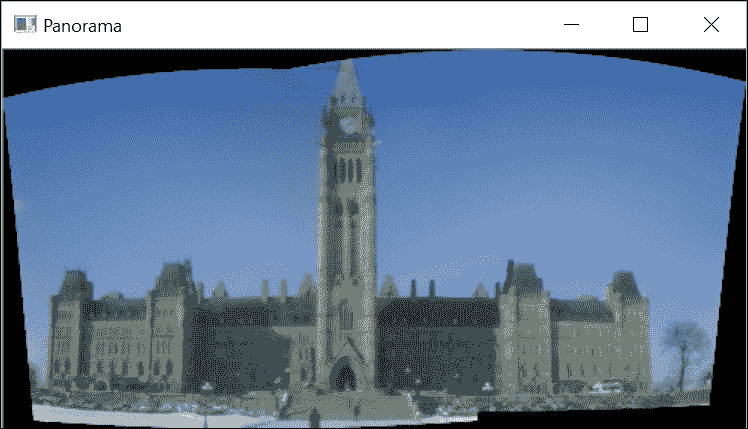

显然，在一般情况下，可以使用任意数量的输入图像来组成一个大全景。

## 参见

+   第二章，*操作像素*中的*重映射图像*配方讨论了反向映射的概念

+   由*M. Brown*和*D. Lowe*在*《国际计算机视觉杂志》*，第 74 卷，第 1 期，2007 年发表的《使用不变特征的自动全景图像拼接》文章，描述了一种从多张图像构建全景的完整方法

# 在图像中检测平面目标

在前面的菜谱中，我们解释了如何使用单应性将纯旋转分离的图像拼接在一起以创建全景图。在本菜谱中，我们还了解到不同视角的平面图像也会生成视图之间的单应性。现在我们将看到如何利用这一事实来识别图像中的平面物体。

## 如何做...

假设你想要检测图像中平面物体的出现。这个物体可能是一张海报、画作、标志、标牌等等。根据我们在本章中学到的知识，策略将包括检测这个平面物体上的特征点，并尝试将它们与图像中的特征点进行匹配。然后，使用与之前类似但这次基于单应性的鲁棒匹配方案对这些匹配进行验证。如果有效匹配的数量很高，那么这必须意味着我们的平面物体在当前图像中是可见的。

在这个菜谱中，我们的任务是检测我们书籍第一版在图像中的出现，更具体地说，是以下图像：

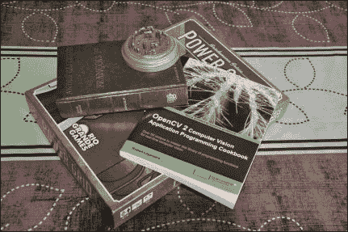

让我们定义一个与我们的`RobustMatcher`类非常相似的`TargetMatcher`类：

```py
    class TargetMatcher { 
      private: 
      // pointer to the feature point detector object 
      cv::Ptr<cv::FeatureDetector> detector; 
      // pointer to the feature descriptor extractor object 
      cv::Ptr<cv::DescriptorExtractor> descriptor; 
      cv::Mat target;           // target image 
      int normType;             // to compare descriptor vectors 
      double distance;          // min reprojection error 
      int numberOfLevels;       // pyramid size 
      double scaleFactor;       // scale between levels 
      // the pyramid of target images and its keypoints 
      std::vector<cv::Mat> pyramid; 
      std::vector<std::vector<cv::KeyPoint>> pyrKeypoints; 
      std::vector<cv::Mat> pyrDescriptors; 

```

要匹配的平面物体的参考图像由`target`属性持有。正如将在下一节中解释的那样，特征点将在目标图像的金字塔中逐级下采样检测。匹配方法与`RobustMatcher`类的方法类似，只是在`ransacTest`方法中使用`cv::findHomography`而不是`cv::findFundamentalMat`。

要使用`TargetMatcher`类，必须实例化一个特定的特征点检测器和描述符，并将其传递给构造函数：

```py
    // Prepare the matcher 
    TargetMatcher tmatcher(cv::FastFeatureDetector::create(10), 
                           cv::BRISK::create()); 
    tmatcher.setNormType(cv::NORM_HAMMING); 

```

在这里，我们选择了 FAST 检测器与 BRISK 描述符一起使用，因为它们计算速度快。然后，你必须指定要检测的目标：

```py
    // set the target image 
    tmatcher.setTarget(target); 

```

在我们的情况下，这是以下图像：

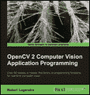

你可以通过调用`detectTarget`方法来检测图像中的这个目标：

```py
    // match image with target 
    tmatcher.detectTarget(image, corners); 

```

此方法返回目标在图像中的四个角的位置（如果找到的话）。然后可以绘制线条来直观地验证检测：

```py
   // draw the target corners on the image 
    if (corners.size() == 4) { // we have a detection 

      cv::line(image, cv::Point(corners[0]),  
               cv::Point(corners[1]),
               cv::Scalar(255, 255, 255), 3); 
      cv::line(image, cv::Point(corners[1]),  
               cv::Point(corners[2]), 
               cv::Scalar(255, 255, 255), 3); 
      cv::line(image, cv::Point(corners[2]),  
               cv::Point(corners[3]),
               cv::Scalar(255, 255, 255), 3); 
      cv::line(image, cv::Point(corners[3]),  
               cv::Point(corners[0]),
               cv::Scalar(255, 255, 255), 3); 
    } 

```

结果如下：

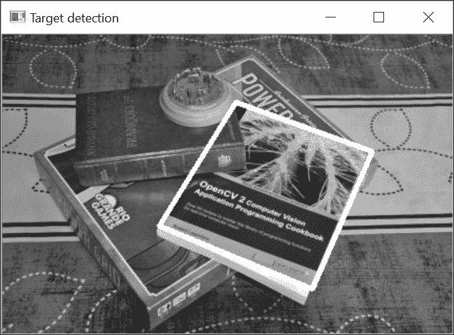

## 工作原理...

由于我们不知道图像中目标的大小，我们决定构建一个由不同尺寸的目标图像组成的金字塔。另一种选择是使用尺度不变特征。在金字塔的每个级别上，目标图像的大小会按一定比例（属性`scaleFactor`，默认为`0.9`）减小，金字塔由一定数量的级别（属性`numberOfLevels`，默认为`8`）组成。为金字塔的每个级别检测特征点：

```py
    // Set the target image 
    void setTarget(const cv::Mat t) { 

      target= t; 
      createPyramid(); 
    } 
    // create a pyramid of target images 
    void createPyramid() { 

      // create the pyramid of target images 
      pyramid.clear(); 
      cv::Mat layer(target); 
      for (int i = 0;  
           i < numberOfLevels; i++) { // reduce size at each layer 
        pyramid.push_back(target.clone()); 
        resize(target, target, cv::Size(), scaleFactor, scaleFactor); 
      } 

      pyrKeypoints.clear(); 
      pyrDescriptors.clear(); 
      // keypoint detection and description in pyramid 
      for (int i = 0; i < numberOfLevels; i++) { 
        // detect target keypoints at level i 
        pyrKeypoints.push_back(std::vector<cv::KeyPoint>()); 
        detector->detect(pyramid[i], pyrKeypoints[i]); 
        // compute descriptor at level i 
        pyrDescriptors.push_back(cv::Mat()); 
        descriptor->compute(pyramid[i],  
                            pyrKeypoints[i],
                            pyrDescriptors[i]); 
      } 
    } 

```

`detectTarget` 方法随后进入三个步骤。首先，在输入图像中检测兴趣点。其次，将此图像与目标金字塔中的每一幅图像进行鲁棒匹配。保留具有最高内点数的级别。如果这个级别有足够多的存活匹配，那么我们就找到了目标。第三步包括使用找到的透视变换和 `cv::getPerspectiveTransform` 函数，将目标的四个角重新投影到输入图像的正确比例上：

```py
    // detect the defined planar target in an image 
    // returns the homography and 
    // the 4 corners of the detected target 
    cv::Mat detectTarget( 
                  const cv::Mat& image, // position of the 
                                        // target corners (clock-wise) 
                  std::vector<cv::Point2f>& detectedCorners) { 

      // 1\. detect image keypoints 
      std::vector<cv::KeyPoint> keypoints; 
      detector->detect(image, keypoints); 
      // compute descriptors 
      cv::Mat descriptors; 
      descriptor->compute(image, keypoints, descriptors); 

      std::vector<cv::DMatch> matches; 
      cv::Mat bestHomography; 
      cv::Size bestSize; 
      int maxInliers = 0; 
      cv::Mat homography; 

      // Construction of the matcher   
      cv::BFMatcher matcher(normType); 

      // 2\. robustly find homography for each pyramid level 
      for (int i = 0; i < numberOfLevels; i++) { 
        // find a RANSAC homography between target and image 
        matches.clear(); 
        // match descriptors 
        matcher.match(pyrDescriptors[i], descriptors, matches); 
        // validate matches using RANSAC 
        std::vector<cv::DMatch> inliers; 
        homography = ransacTest(matches, pyrKeypoints[i],  
                                keypoints, inliers); 

        if (inliers.size() > maxInliers) { // we have a better H 
          maxInliers = inliers.size(); 
          bestHomography = homography; 
          bestSize = pyramid[i].size(); 
        } 

      } 

      // 3\. find the corner position on the image using best homography 
      if (maxInliers > 8) { // the estimate is valid 

        //target corners at best size 
        std::vector<cv::Point2f> corners; 
        corners.push_back(cv::Point2f(0, 0)); 
        corners.push_back(cv::Point2f(bestSize.width - 1, 0)); 
        corners.push_back(cv::Point2f(bestSize.width - 1,  
                                      bestSize.height - 1)); 
        corners.push_back(cv::Point2f(0, bestSize.height - 1)); 

        // reproject the target corners 
        cv::perspectiveTransform(corners, detectedCorners, bestHomography); 
      } 

      return bestHomography; 
    } 

```

以下图像显示了在我们示例中获得的匹配结果：

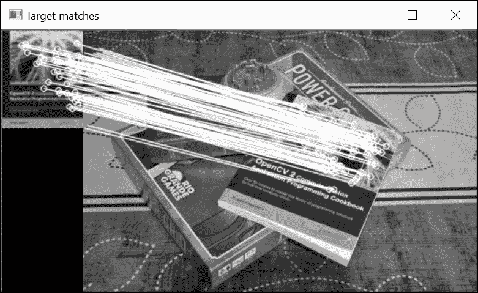

## 参见

+   《*实时平面目标检测的快速鲁棒透视变换方案*》这篇文章由 *H. Bazargani*、*O. Bilaniuk* 和 *R. Laganière* 撰写，发表在 *Journal of Real-Time Image Processing* 2015 年 5 月，描述了一种实时检测平面目标的方法。它还描述了 `cv::findHomography` 函数的 `cv::RHO` 方法。
