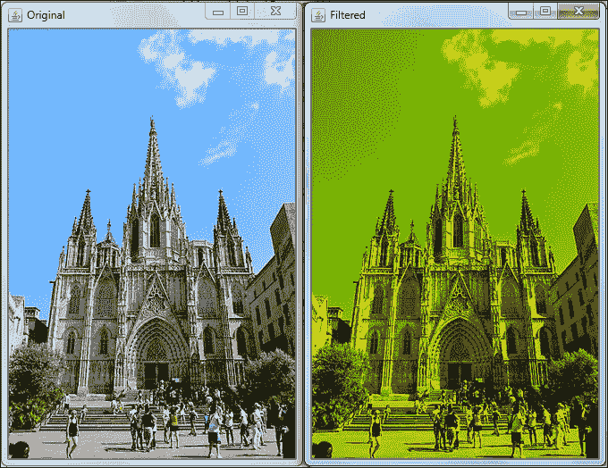
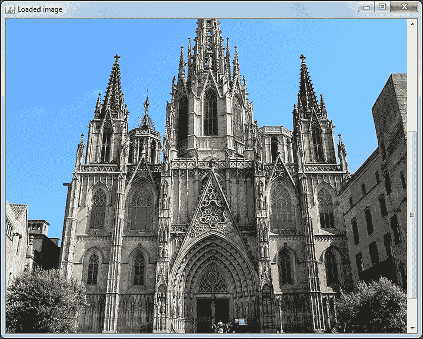
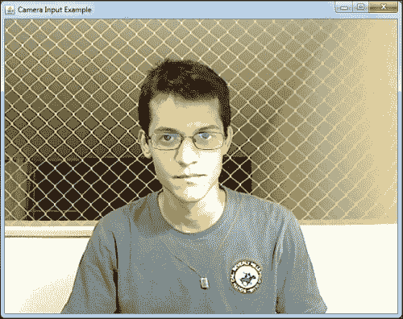
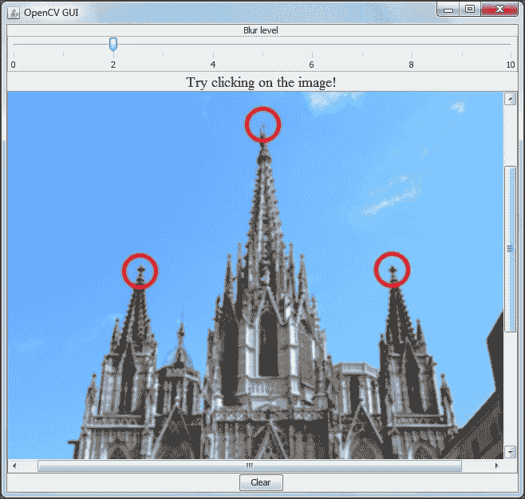

# 第二章：处理矩阵、文件、摄像头和 GUI

本章将使你能够执行计算机视觉中所需的基本操作，例如处理矩阵、打开文件、从摄像头捕获视频、播放视频以及为原型应用程序创建 GUI。

本章将涵盖以下主题：

+   基本矩阵操作

+   像素操作

+   如何从文件中加载和显示图像

+   如何从摄像头捕获视频

+   视频播放

+   Swing GUI 与 OpenCV 的集成

到本章结束时，你应该能够通过加载图像并创建用于操作它们的良好 GUI 来启动这个计算机视觉应用程序。

# 基本矩阵操作

从计算机视觉的背景来看，我们可以将图像视为数值矩阵，它代表其像素。对于灰度图像，我们通常将值分配为从 0（黑色）到 255（白色），中间的数字表示两者的混合。这些通常是 8 位图像。因此，矩阵中的每个元素都对应于灰度图像上的每个像素，列数代表图像宽度，行数代表图像高度。为了表示彩色图像，我们通常将每个像素视为红色、绿色和蓝色三种基本颜色的组合。因此，矩阵中的每个像素由一个颜色三元组表示。

### 注意

重要的是要注意，使用 8 位，我们得到 2 的 8 次方 (*2**⁸*)，即 256。因此，我们可以表示从 0 到 255 的范围，包括用于 8 位灰度图像的黑白级别值。除此之外，我们还可以将这些级别表示为浮点数，并使用 0.0 表示黑色和 1.0 表示白色。

OpenCV 有多种表示图像的方法，因此你可以通过位数来定制强度级别，考虑是否需要有符号、无符号或浮点数据类型，以及通道数。OpenCV 的约定可以通过以下表达式看到：

```py
CV_<bit_depth>{U|S|F}C(<number_of_channels>)
```

在这里，`U` 代表无符号，`S` 代表有符号，`F` 代表浮点。例如，如果需要一个 8 位无符号单通道图像，数据类型表示将是 `CV_8UC1`，而由 32 位浮点数表示的彩色图像的数据类型定义将为 `CV_32FC3`。如果省略通道数，则默认为 1。我们可以在以下列表中看到根据每个位深度和数据类型的范围： 

+   `CV_8U`: 这些是范围从 0 到 255 的 8 位无符号整数

+   `CV_8S`: 这些是范围从 -128 到 127 的 8 位有符号整数

+   `CV_16U`: 这些是范围从 0 到 65,535 的 16 位无符号整数

+   `CV_16S`: 这些是范围从 -32,768 到 32,767 的 16 位有符号整数

+   `CV_32S`: 这些是范围从 -2,147,483,648 到 2,147,483,647 的 32 位有符号整数

+   `CV_32F`: 这些是范围从 `-FLT_MAX` 到 `FLT_MAX` 的 32 位浮点数，包括 `INF` 和 `NAN` 值

+   `CV_64F`: 这些是范围从 `-DBL_MAX` 到 `DBL_MAX` 的 64 位浮点数，包括 `INF` 和 `NAN` 值

你通常从加载图像开始项目，但了解如何处理这些值是很重要的。确保你导入了 `org.opencv.core.CvType` 和 `org.opencv.core.Mat`。矩阵也有几个构造函数可用，例如：

```py
Mat image2 = new Mat(480,640,CvType.CV_8UC3);
Mat image3 = new Mat(new Size(640,480), CvType.CV_8UC3);
```

前两个构造函数都将构建一个适合 640 像素宽和 480 像素高的图像的矩阵。请注意，宽度对应于列，高度对应于行。还要注意带有 `Size` 参数的构造函数，它期望宽度和高度的顺序。如果你想要检查一些矩阵属性，可以使用 `rows()`、`cols()` 和 `elemSize()` 方法：

```py
System.out.println(image2 + "rows " + image2.rows() + " cols " + image2.cols() + " elementsize " + image2.elemSize());
```

前一行输出的结果是：

```py
Mat [ 480*640*CV_8UC3, isCont=true, isSubmat=false, nativeObj=0xceeec70, dataAddr=0xeb50090 ]rows 480 cols 640 elementsize 3

```

`isCont` 属性告诉我们这个矩阵在表示图像时是否使用额外的填充，以便在某些平台上进行硬件加速；然而，我们目前不会详细讨论它。`isSubmat` 属性指的是这个矩阵是否由另一个矩阵创建，以及它是否引用另一个矩阵的数据。`nativeObj` 对象指的是原生对象地址，这是一个 **Java Native Interface** (**JNI**) 的细节，而 `dataAddr` 指向内部数据地址。元素大小以字节数衡量。

另一个矩阵构造函数是传递一个标量作为其元素之一。这个语法的样子如下：

```py
Mat image = new Mat(new Size(3,3), CvType.CV_8UC3, new Scalar(new double[]{128,3,4}));
```

这个构造函数将使用三元组 `{128, 3, 4}` 初始化矩阵的每个元素。打印矩阵内容的一个非常有用方法是使用 `Mat` 的辅助方法 `dump()`。其输出将类似于以下内容：

```py
[128, 3, 4, 128, 3, 4, 128, 3, 4;
 128, 3, 4, 128, 3, 4, 128, 3, 4;
 128, 3, 4, 128, 3, 4, 128, 3, 4]

```

重要的是要注意，在创建具有指定大小和类型的矩阵时，它也会立即为其内容分配内存。

# 像素操作

像素操作通常需要一个人访问图像中的像素。有几种方法可以做到这一点，每种方法都有其优点和缺点。一个直接的方法是使用 `put(row, col, value)` 方法。例如，为了用 `values {1, 2, 3}` 填充我们前面的矩阵，我们将使用以下代码：

```py
for(int i=0;i<image.rows();i++){
  for(int j=0;j<image.cols();j++){ 
    image.put(i, j, new byte[]{1,2,3});
  }
}
```

### 小贴士

注意，在字节数组 `{1, 2, 3}` 中，对于我们的矩阵，`1` 代表蓝色通道，`2` 代表绿色，`3` 代表红色通道，因为 OpenCV 在内部以 **BGR** （**蓝色、绿色和红色**）格式存储其矩阵。

对于小矩阵，以这种方式访问像素是可以的。唯一的问题是大型图像 JNI 调用的开销。记住，即使是 640 x 480 像素的小图像也有 307,200 个像素，如果我们考虑彩色图像，它在一个矩阵中有 921,600 个值。想象一下，为每个 307,200 个像素进行过载调用可能需要大约 50 毫秒。另一方面，如果我们在一个 Java 侧上操作整个矩阵，然后在一个调用中将其复制到本地侧，它将需要大约 13 毫秒。

如果你想在 Java 侧操作像素，请执行以下步骤：

1.  在字节数组中分配与矩阵相同大小的内存。

1.  将图像内容放入该数组中（可选）。

1.  操作字节数组内容。

1.  进行单个`put`调用，将整个字节数组复制到矩阵中。

一个简单的例子将迭代所有图像像素并将蓝色通道设置为 0，这意味着我们将设置模 3 等于 0 的每个元素的值为 0，即{0, 3, 6, 9, …}，如下面的代码片段所示：

```py
public void filter(Mat image){
  int totalBytes = (int)(image.total() * image.elemSize());
  byte buffer[] = new byte[totalBytes];
  image.get(0, 0,buffer);
  for(int i=0;i<totalBytes;i++){
    if(i%3==0) buffer[i]=0;
  }
  image.put(0, 0, buffer);
}
```

首先，我们通过将图像的总像素数（`image.total`）乘以字节数（`image.elemenSize`）来找出图像中的字节数。然后，我们使用该大小构建一个字节数组。我们使用`get(row, col, byte[])`方法将矩阵内容复制到我们最近创建的字节数组中。然后，我们迭代所有字节并检查与蓝色通道相关的条件（`i%3==0`）。记住，OpenCV 将颜色内部存储为{Blue, Green, Red}。我们最终再次调用 JNI 的`image.put`，将整个字节数组复制到 OpenCV 的本地存储。以下图像是 Mromanchenko 上传的，许可协议为 CC BY-SA 3.0，展示了此过滤器的示例：



注意，Java 没有无符号字节数据类型，所以在处理它时要小心。安全的方法是将它转换为整数，并使用与`0xff`的按位与操作符（`&`）。一个简单的例子是`int unsignedValue = myUnsignedByte & 0xff;`。现在，`unsignedValue`可以在 0 到 255 的范围内进行检查。

# 从文件加载和显示图像

大多数计算机视觉应用都需要从某处检索图像。如果你需要从文件中获取它们，OpenCV 提供了几个图像文件加载器。不幸的是，一些加载器依赖于有时不随操作系统一起提供的编解码器，这可能导致它们无法加载。从文档中我们可以看到，以下文件得到了一些限制的支持：

+   **Windows 位图**: `*.bmp`, `*.dib`

+   **JPEG 文件**: `*.jpeg`, `*.jpg`, `*.jpe`

+   **JPEG 2000 文件**: `*.jp2`

+   **可移植网络图形**: `*.png`

+   **可移植图像格式**: `*.pbm`, `*.pgm`, `*.ppm`

+   **Sun 光栅**: `*.sr`, `*.ras`

+   **TIFF 文件**: `*.tiff`, `*.tif`

注意，Windows 位图、可移植图像格式和 Sun 光栅格式在所有平台上都受支持，但其他格式则取决于一些细节。在 Microsoft Windows 和 Mac OS X 上，OpenCV 总是能够读取 *jpeg*、*png* 和 *tiff* 格式。在 Linux 上，OpenCV 将寻找操作系统提供的编解码器，如文档所述，因此请记住安装相关的包（例如，在 Debian 和 Ubuntu 中不要忘记开发文件，例如 "libjpeg-dev"），以获得编解码器支持，或者在 CMake 中打开 OPENCV_BUILD_3RDPARTY_LIBS 标志，正如 imread 的官方文档中指出的。

`imread` 方法提供了一种通过文件访问图像的方式。使用 `Imgcodecs.imread`（文件名）并检查读取的图像的 `dataAddr()` 是否与零不同，以确保图像已正确加载，也就是说，文件名已正确输入且其格式被支持。

打开文件的一个简单方法可能看起来像以下代码所示。确保你已导入 `org.opencv.imgcodecs.Imgcodecs` 和 `org.opencv.core.Mat`：

```py
public Mat openFile(String fileName) throws Exception{
  Mat newImage = Imgcodecs.imread(fileName);
    if(newImage.dataAddr()==0){
      throw new Exception ("Couldn't open file "+fileName);
    }
  return newImage;
}
```

# 使用 Swing 显示图像

OpenCV 开发者习惯于使用 OpenCV 提供的简单跨平台 GUI，称为 HighGUI，以及一个方便的方法 `imshow`。它可以轻松构建一个窗口并在其中显示图像，这对于创建快速原型来说很方便。由于 Java 拥有一个流行的 GUI API，称为 **Swing**，我们最好使用它。此外，Java 2.4.7.0 版本之前没有提供 `imshow` 方法。另一方面，创建这样的功能相当简单。请参考 `chapter2/swing-imageshow` 中的参考代码。

让我们把工作分解为两个类：`App` 和 `ImageViewer`。`App` 类将负责加载文件，而 `ImageViewer` 将负责显示它。应用程序的工作很简单，只需使用 Imgcodecs 的 `imread` 方法，如下所示：

```py
package org.javaopencvbook;

import java.io.File;
…
import org.opencv.imgcodecs.Imgcodecs;

public class App
{
  static{ System.loadLibrary(Core.NATIVE_LIBRARY_NAME); }

public static void main(String[] args) throws Exception {
  String filePath = "src/main/resources/images/cathedral.jpg";
  Mat newImage = Imgcodecs.imread(filePath);
  if(newImage.dataAddr()==0){
    System.out.println("Couldn't open file " + filePath);
  } else{
    ImageViewer imageViewer = new ImageViewer();
    imageViewer.show(newImage, "Loaded image");
  }
  }
}
```

注意，`App` 类只会读取 `Mat` 对象中的示例图像文件，并且它会调用 `ImageViewer` 方法来显示它。现在，让我们看看 `ImageViewer` 的 `show` 方法是如何工作的：

```py
package org.javaopencvbook.util;

import java.awt.BorderLayout;
import java.awt.Dimension;
import java.awt.Image;
import java.awt.image.BufferedImage;

import javax.swing.ImageIcon;
import javax.swing.JFrame;
import javax.swing.JLabel;
import javax.swing.JScrollPane;
import javax.swing.UIManager;
import javax.swing.UnsupportedLookAndFeelException;
import javax.swing.WindowConstants;

import org.opencv.core.Mat;
import org.opencv.imgproc.Imgproc;

public class ImageViewer {
  private JLabel imageView;

  public void show(Mat image){
    show(image, "");
  }

  public void show(Mat image,String windowName){
    setSystemLookAndFeel();

    JFrame frame = createJFrame(windowName);

        Image loadedImage = toBufferedImage(image);
        imageView.setIcon(new ImageIcon(loadedImage));

        frame.pack();
        frame.setLocationRelativeTo(null);
        frame.setVisible(true);

  }

  private JFrame createJFrame(String windowName) {
    JFrame frame = new JFrame(windowName);
    imageView = new JLabel();
    final JScrollPane imageScrollPane = new JScrollPane(imageView);
        imageScrollPane.setPreferredSize(new Dimension(640, 480));
        frame.add(imageScrollPane, BorderLayout.CENTER);
        frame.setDefaultCloseOperation(WindowConstants.EXIT_ON_CLOSE);
    return frame;
  }

  private void setSystemLookAndFeel() {
    try {
      UIManager.setLookAndFeel (UIManager.getSystemLookAndFeelClassName());
    } catch (ClassNotFoundException e) {
      e.printStackTrace();
    } catch (InstantiationException e) {
      e.printStackTrace();
    } catch (IllegalAccessException e) {
      e.printStackTrace();
    } catch (UnsupportedLookAndFeelException e) {
      e.printStackTrace();
    }
  }

  public Image toBufferedImage(Mat matrix){
    int type = BufferedImage.TYPE_BYTE_GRAY;
    if ( matrix.channels() > 1 ) {
      type = BufferedImage.TYPE_3BYTE_BGR;
    }
    int bufferSize = matrix.channels()*matrix.cols()*matrix.rows();
    byte [] buffer = new byte[bufferSize];
    matrix.get(0,0,buffer); // get all the pixels
    BufferedImage image = new BufferedImage(matrix.cols(),matrix.rows(), type);
    final byte[] targetPixels = ((DataBufferByte) image.getRaster().getDataBuffer()).getData();
    System.arraycopy(buffer, 0, targetPixels, 0, buffer.length);
    return image;
  }

}
```

注意 `show` 和 `toBufferedImage` 方法。`Show` 将尝试将 Swing 的外观和感觉设置为默认的本地外观，这是装饰性的。然后，它将创建一个包含 `JScrollPane` 和 `JLabel` 的 `JFrame`。然后它将调用 `toBufferedImage`，该函数将 OpenCV Mat 对象转换为 AWT 的 `BufferedImage`。这种转换是通过创建一个存储矩阵内容的字节数组来完成的。通过将通道数乘以列数和行数来分配适当的大小。`matrix.get` 方法将所有元素放入字节数组中。最后，通过 `getDataBuffer()` 和 `getData()` 方法访问图像的栅格数据缓冲区。然后通过对 `System.arraycopy` 方法的快速系统调用进行填充。生成的图像随后被分配给 `JLabel`，然后它很容易地显示出来。请注意，此方法期望一个存储为单通道无符号 8 位或三通道无符号 8 位的矩阵。如果你的图像存储为浮点数，你应该在调用此方法之前使用以下代码将其转换，假设你需要转换的图像是一个名为 `originalImage` 的 `Mat` 对象：

```py
Mat byteImage = new Mat();
originalImage.convertTo(byteImage, CvType.CV_8UC3);
```

这样，你可以从你的转换后的 `byteImage` 属性中调用 `toBufferedImage` 方法。

图像查看器可以轻松地安装在任何 Java OpenCV 项目中，并且它将帮助你显示图像以进行调试。这个程序的输出可以在下一张屏幕截图中看到：



# 从摄像头捕获视频

从网络摄像头捕获帧的过程非常复杂，它涉及到硬件细节以及大量的解码或解压缩算法。幸运的是，OpenCV 将所有这些封装在一个简单而强大的类中，称为 `VideoCapture`。这个类不仅可以从网络摄像头抓取图像，还可以读取视频文件。如果需要更高级的相机访问，你可能想使用它的专用驱动程序。

你可以将视频流视为一系列图片，并且你可以检索每个 `Mat` 中的图像并按你喜欢的方式处理它。为了使用 `VideoCapture` 类捕获网络摄像头流，你需要使用 `VideoCapture(int device)` 构造函数实例化它。请注意，构造函数参数指的是 `camera` 索引，如果你有多个摄像头。所以，如果你有一个内置摄像头和一个 USB 摄像头，并且创建一个 `videocapture` 对象，例如 `new VideoCapture(1)`，那么这个对象将指向你的内置摄像头，而 `new VideoCapture(0)` 将指向你刚刚插入的 USB 摄像头或相反。在尝试在 OpenCV 中捕获图像之前，确保摄像头在制造商测试应用程序中工作，并检查摄像头驱动程序是否也已安装。

在实例化你的`VideoCapture`类之后，使用`isOpened()`方法检查它是否已成功实例化。如果访问相机时出现问题，这将返回`false`。不幸的是，不会有更多的信息，所以请仔细检查你的驱动程序。现在一切正常，调用`read()`方法以循环检索每个捕获的帧。请注意，此方法结合了`VideoCapture grab()`和`retrieve()`方法。`grab()`方法仅捕获下一个帧，这很快，而`retrieve()`方法解码并返回捕获的帧。当同步很重要或使用多个相机时，这些方法更有意义，因为这将更容易捕获尽可能接近的帧，首先通过为所有相机调用`grab()`，然后调用`retrieve()`。如果在使用`read()`方法时出现问题，即相机断开连接，则该方法返回`false`。

在使用`VideoCapture`类时，你需要记住的一个重要点是设置所需的相机分辨率。这可以通过`set()`属性设置方法实现，它需要`Videoio.CAP_PROP_FRAME_WIDTH`和`Videoio.CAP_PROP_FRAME_HEIGHT`参数。如果你想设置 640 x 480 的分辨率，你需要进行两次调用，如下所示：

```py
VideoCapture capture = new VideoCapture(0);
capture.set(Videoio.CAP_PROP_FRAME_WIDTH,640);
capture.set(Videoio.CAP_PROP_FRAME_HEIGHT,480);
```

在尝试设置新分辨率之前，检查你的设备功能。如果你设置了一个相机无法处理的分辨率，这可能会导致相机挂起或回退到一个可以捕获图像的分辨率。

本章示例代码中可用的`videocapture`项目展示了如何检索网络摄像头流并将其显示在屏幕上，这与前面的`swing-imageshow`示例中的情况类似。在这个项目中，`toBufferedImage`方法已经被重构为一个`ImageProcessor`类，该类仅处理从`VideoCapture`类检索的`Mat`到`BufferedImage`的转换，这是在 Swing 中显示图像所必需的。`main`类也非常简单；它只构建一个窗口，实例化一个`VideoCapture`类，设置其属性，并进入主循环。这将从相机捕获一个帧，将其转换为`BufferedImage`并在`JLabel`中显示，如下面的代码所示：

```py
package org.javaopencvbook;

import java.awt.Image;
import java.io.File;

import javax.swing.ImageIcon;
import javax.swing.JFrame;
import javax.swing.JLabel;

import org.javaopencvbook.utils.ImageProcessor;
import org.opencv.core.Core;
import org.opencv.core.Mat;
import org.opencv.videoio.Videoio;
import org.opencv.videoio.VideoCapture;

public class App
{
  static{ System.loadLibrary(Core.NATIVE_LIBRARY_NAME);
  }

  private JFrame frame;
  private JLabel imageLabel;

  public static void main(String[] args) {
    App app = new App();
 app.initGUI();
 app.runMainLoop(args);
  }

  private void initGUI() {
    frame = new JFrame("Camera Input Example");  
    frame.setDefaultCloseOperation(JFrame.EXIT_ON_CLOSE);  
    frame.setSize(400,400);  
    imageLabel = new JLabel();
    frame.add(imageLabel);
    frame.setVisible(true);       
  }

  private void runMainLoop(String[] args) {
    ImageProcessor imageProcessor = new ImageProcessor();
    Mat webcamMatImage = new Mat(); 
 Image tempImage; 
    VideoCapture capture = new VideoCapture(0);
 capture.set(Videoio.CAP_PROP_FRAME_WIDTH,320);
 capture.set(Videoio.CAP_PROP_FRAME_HEIGHT,240);

    if( capture.isOpened()){  
    while (true){  
    capture.read(webcamMatImage);
    if( !webcamMatImage.empty() ){
  tempImage= imageProcessor.toBufferedImage(webcamMatImage);
  ImageIcon imageIcon = new ImageIcon(tempImage, "Captured video");
  imageLabel.setIcon(imageIcon);
  frame.pack();  //this will resize the window to fit the image
      }  
    else{
      System.out.println(" -- Frame not captured -- Break!");
      break;  
    }
  }
  }
  else{
    System.out.println("Couldn't open capture.");
  }
  }
}
```

注意，调用`frame.pack()`将实现捕获的帧大小，并根据它调整窗口大小。以下截图显示了前面代码的成功执行：



注意，当你打开`VideoCapture`设备时，它可能不会优雅地释放进程，所以当你关闭它时，你的 Java 应用程序可能仍在运行。作为最后的手段，你可能需要根据你的平台杀死你的进程。在 Windows 上，这就像打开任务管理器一样简单，你可以通过按*CTRL* + *ALT* + *DEL*打开它，并定位你的 Java 进程。为了做到这一点，OS X 用户需要按*CMD* + *ALT* + *ESC*，而 Linux 用户只需发出一个`kill`命令。对于故障排除，如果你在使用了一段时间后遇到启动捕获设备的问题，重新连接你的 USB 插头可以使它工作。

# 视频播放

计算机视觉中另一个重要的 I/O 任务是能够打开和处理视频文件。幸运的是，OpenCV 可以通过`VideoCapture`类轻松处理视频。与之前使用设备号构建不同，我们需要使用文件路径来创建它。我们还可以使用空构造函数，并让`open(String filename)`方法负责指向文件。

本章源代码中提供的`videoplayback`项目结构与之前解释的`swing-imageshow`项目相同。它只是在初始化`VideoCapture`实例时有所不同：

```py
VideoCapture capture = new VideoCapture("src/main/resources/videos/tree.avi");
```

我们还在每帧之间加入了 50ms 的延迟，这样整个视频就不会播放得太快。还有可以用来操作`InterruptedException`的代码。请注意，视频文件不会以与视频播放器设备中相同的速度播放。这是因为`capture.read(webcamMatImage);`方法尽可能地快速调用。你还可以在代码中添加延迟，使其播放速度比正常速度慢。尽管这在本节中没有涉及，但当你使用`CV_CAP_PROP_FPS`参数调用`VideoCapture`类的`get`方法时，应该返回视频每秒的帧数，这样你就可以以原始帧率播放它。

如果你的视频没有加载，可能是因为未安装的编解码器问题。尝试安装它或寻找其他编解码器，以便结束这个错误。另一种方法是使用工具将你的视频转换为支持的编解码器。也可能的情况是，`opencv_ffmpeg300`动态链接库从你的路径环境变量中丢失。尝试将其复制到你的项目主文件夹或添加到你的路径变量中。这应该会起作用。确保你的 java.library.path 指向包含此库的文件夹，就像你配置项目以查找原生 OpenCV 库一样，如第一章中所述，*为 Java 设置 OpenCV*。

# Swing GUI 与 OpenCV 的集成

在调试或实验计算机视觉项目时，拥有丰富的图形用户界面非常重要，因为一些任务可能需要大量的调整。这样，处理滑块、按钮、标签和鼠标事件应该是任何计算机视觉研究者的基本技能。幸运的是，你可以在 Swing 中以相对简单的方式使用所有这些组件。在本节中，我们将介绍创建一个应用程序的重要部分，该应用程序通过滑块在多个级别上加载并模糊图像。此应用程序还利用鼠标事件来突出图像中的细节，以及一个漂亮的按钮来点击并清除所有内容。下一张截图为我们提供了一个关于应用程序工作原理的好主意。代码可以在本书代码包中的`opencv-gui`项目中找到。



加载图像的代码对我们来说并不陌生，可以在*使用 Swing 显示图像*部分找到。我们将更仔细地关注`setupSlider()`、`setupImage()`和`setupButton()`方法。阅读`setupSlider`方法，我们将在稍后详细讨论它：

```py
private void setupSlider(JFrame frame) {
JLabel sliderLabel = new JLabel("Blur level", JLabel.CENTER);
sliderLabel.setAlignmentX(Component.CENTER_ALIGNMENT);

int minimum = 0;
int maximum = 10;
int initial =0;
JSlider levelSlider = new JSlider(JSlider.HORIZONTAL, minimum, maximum, initial);

levelSlider.setMajorTickSpacing(2);
levelSlider.setMinorTickSpacing(1);
levelSlider.setPaintTicks(true);
levelSlider.setPaintLabels(true);
levelSlider.addChangeListener(new ChangeListener() {

  public void stateChanged(ChangeEvent e) {
    JSlider source = (JSlider)e.getSource();
    int level = (int)source.getValue();
    Mat output = imageProcessor.blur(image, level);
    updateView(output);
    }
  });
frame.add(sliderLabel);
frame.add(levelSlider);
}
```

注意，滑块只是一个`JSlider`类，我们需要通过构造函数设置其最小值、最大值和初始值。我们还需要设置它是垂直还是水平滑块。一些外观细节，如主刻度和副刻度间距以及是否绘制标签和刻度，也进行了设置。滑块中的一个关键方法是它提供的匿名类中的`stateChanged`监听器，这基本上是用户更改滑块时发生的事情。在我们的情况下，我们将根据滑块设置的次数模糊图像。这是通过我们实现的`ImageProcessor`类完成的，该类基本上调用`Imgproc.blur`方法，这是一个非常简单的过滤器，它只计算一定数量相邻像素的平均值。滑块的值通过调用`source.getValue()`获得。

另一个重要的任务是响应用户的鼠标点击事件。这是通过向我们的`JLabel`图像视图添加`MouseListener`来实现的。以下是`setupImage`方法：

```py
private void setupImage(JFrame frame) {
  JLabel mouseWarning = new JLabel("Try clicking on the image!", JLabel.CENTER);
  mouseWarning .setAlignmentX(Component.CENTER_ALIGNMENT);
  mouseWarning.setFont(new Font("Serif", Font.PLAIN, 18));
  frame.add(mouseWarning);

  imageView = new JLabel();

  final JScrollPane imageScrollPane = new JScrollPane(imageView);
  imageScrollPane.setPreferredSize(new Dimension(640, 480));

  imageView.addMouseListener(new MouseAdapter()
  {
    public void mousePressed(MouseEvent e)
    {
      Imgproc.circle(image,new Point(e.getX(),e.getY()),20, new Scalar(0,0,255), 4);
      updateView(image);
    }
  });

frame.add(imageScrollPane);
}
```

在前面的代码中实现的`mousePressed()`方法负责响应用户的所有鼠标按下事件。我们可以通过`getX()`和`getY()`事件方法获取局部坐标。请注意，我们调用`Imgproc.circle`，这是一个 OpenCV 函数，它将在所需的矩阵中绘制一个圆，在所需的位置，并且我们可以定义其半径、颜色和粗细。

在本例中最后探索的 GUI 组件是通过`JButton`组件创建的按钮，该组件实现了`actionPerformed`接口。因为我们之前已经存储了原始图像，所以只需将原始图像复制回来就可以轻松清除图像：

```py
private void setupButton(JFrame frame) {
  JButton clearButton = new JButton("Clear");
  clearButton.addActionListener(new ActionListener() {

  public void actionPerformed(ActionEvent event) {
    image = originalImage.clone();
    updateView(originalImage);
  }
});
clearButton.setAlignmentX(Component.CENTER_ALIGNMENT);
frame.add(clearButton);
}
```

# 摘要

哇！本章涵盖了大量的细节，但我们终于掌握了计算机视觉完整应用程序的开发。我们触及了 OpenCV 的核心结构主题，即用于基本像素操作的 `Mat` 类，以及它与 Swing 的 `BufferedImage` 类的紧密关系。除此之外，我们还涵盖了打开图像文件并在 Swing 应用程序中显示它们等重要任务。使用 `VideoCapture` 类涵盖了实时视频流的重要领域，它展示了如何从摄像头以及视频文件中获取帧。最后，我们通过在 Java 中处理鼠标事件，创建了一个具有滑块、标签、按钮的丰富图形用户界面应用程序。

使用 Java OpenCV API 的工作基础已经奠定，我们现在可以继续进入下一章，本章将涉及图像处理的核心操作，例如使用平滑滤波器去除噪声，使用形态学运算符隔离元素，使用桶填充进行分割，图像金字塔，以及阈值化的基本任务。务必查看这些内容。
