# 第三章. 图像滤波器和形态学算子

在学习设置 OpenCV 的 Java 基础和图形用户界面处理之后，现在是时候探索图像处理中的核心算子了。其中一些来自信号处理，我们称它们为滤波器，因为它们通常帮助您从图像中去除噪声。重要的是要知道，几种数字滤波器有它们的光学对应物。其他算子在处理二值图像时扮演着有用的角色，例如形态学算子，它可以帮助您隔离区域或将它们中的某些部分粘合在一起。我们还将详细介绍著名的**桶填充工具**，它在分割中非常有用。在处理大图像时，了解图像金字塔如何帮助您在不丢失重要信息的情况下减小图像大小并提高性能是很重要的。我们将以分割中最简单且最有用的技术之一结束本章，即应用阈值来分离区域，以及研究一个不会受到光照问题影响太多的动态阈值。

在本章中，我们将介绍：

+   平滑

+   形态学算子

+   洪水填充

+   图像金字塔

+   阈值化

到本章结束时，您将能够对图像执行多个过滤过程，例如去除噪声、生长、收缩和填充某些区域，以及根据给定的标准判断某些像素是否适合。

# 平滑

就像在一维信号中一样，我们在图像中总是容易受到一些噪声的影响，在我们对图像进行主要工作之前，我们通常会对它们应用一些预处理滤波器。我们可以将噪声视为图像对象中不存在的颜色或亮度信息的随机变化，这可能是由于数码相机或扫描仪的传感器和电路的不理想造成的。本节使用低通滤波器核的思想来平滑我们的图像。这些滤波器移除了高频内容，如边缘和噪声，尽管一些技术允许边缘不被模糊。我们将介绍 OpenCV 中可用的四种主要图像滤波器：平均滤波、高斯滤波、中值滤波和双边滤波。

### 注意

**二维核** **卷积**是一种数学卷积形式。输出图像是通过扫描给定图像的每个像素并对其应用核算子来计算的，为每个操作结果生成一个输出像素。例如，核算子可以是一个由 1 组成的 3x3 矩阵，除以 9。这样，每个输出像素将是输入图像中每个像素的 9 个相邻像素的平均值，从而得到一个平均输出图像。

## 平均

大多数模糊技术将使用 2D 核卷积来过滤图像。最简单的方法是使用一个 3 x 3 的核，它总共有 9 个像素。假设我们想要 9 个像素的平均值，我们只需要将它们相加然后除以 9。这是通过以下核的卷积来实现的：


为了应用此转换，我们将使用 Imgproc 的`blur`函数。其语法如下：

```py
public static void blur(Mat src, Mat dst, Size ksize)
```

参数很简单，就是源图像、目标图像和核大小，对于我们的 3 x 3 核来说，就像`new Size(3.0, 3.0)`一样简单。你可以选择性地添加`Point`锚点参数，如下所示：

```py
public static void blur(Mat src, Mat dst, Size ksize, Point anchor, int borderType)
```

前一行将允许你将锚点以及一个`int borderType`整数变量放置在中心点之外。这个`borderType`参数让你定义当核的一部分在图像内部和外部时，你希望的行为。请注意，在第一行，前一个核将寻找将位于行顶部的值，因此 OpenCV 需要对这些值进行外推。有一些选项可用于外推边界。根据文档，我们有以下类型的边界，所有这些都可以从`Core`常量中获取，例如：`Core.BORDER_REPLICATE`。例如，考虑`|`作为图像的一个边界，并将`abcdefgh`作为像素值：

```py
BORDER_REPLICATE:     aaaaaa|abcdefgh|hhhhhhh
BORDER_REFLECT:       fedcba|abcdefgh|hgfedcb
BORDER_REFLECT_101:   gfedcb|abcdefgh|gfedcba
BORDER_WRAP:          cdefgh|abcdefgh|abcdefg
BORDER_CONSTANT:      000000|abcdefgh|0000000
```

默认值是`Core.BORDER_DEFAULT`，它映射到`Core.BORDER_REFLECT_101`。有关如何使用此函数的更多信息，请查找本章`imageFilter`项目的源代码。以下是该主应用的截图，它允许你尝试这些过滤器中的每一个：

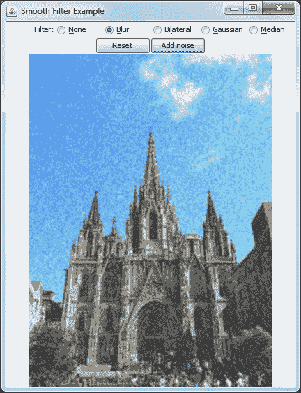

注意，此应用程序还提供了一些简单的高斯噪声，其概率密度函数等于正态分布，以查看每个滤波器的优点。

## 高斯

高斯背后的思想与平均滤波相同，只是对于每个像素不使用相同的权重，而是使用一个二维高斯函数作为核，该核给予中心像素最高的权重。以下图表显示了二维高斯曲线的行为：

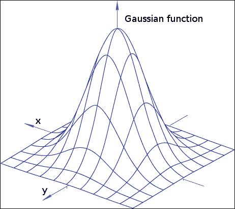

为了使用此函数，请使用以下基本签名：

```py
public static void GaussianBlur(Mat src,
                                Mat dst,
                                Size ksize,
                                double sigmaX [, double sigmaY])
```

`Mat src`和`Mat dst`参数很简单，因为它们描述了输入和输出图像。`Size ksize`参数描述了核的宽度和高度。因此，如果你想设置其大小，此参数必须是正数且为奇数，以便核可以是对称的并且有中心。如果你将此参数设置为零，大小将根据`double sigmaX`计算。Sigma 是其标准差，大约是高斯值的*半最大值宽度*，这意味着当其高度是最高高斯值的一半时，它是高斯值宽度的一半。可选地，你也可以提供第五个参数作为`sigmaY`，它是*y*轴的标准差。如果你不使用此参数，`sigmaY`将与`sigmaX`相等。此外，如果`sigmaX`和`sigmaY`都为零，它们将根据核的宽度和高度计算。`getGaussianKernel`函数在需要时返回所有高斯系数。`GaussianBlur`函数还可以提供一个第六个参数，这决定了边界的行为。此参数与*平均*部分中的`int borderType`参数的工作方式相同。

如何使用`GaussianBlur`的示例可以取自本章的示例`imageFilter`项目：

```py
Imgproc.GaussianBlur(image, output,  new Size(3.0, 3.0), 0);
```

前一行将 sigma 设置为`0`，并使函数通过以下公式根据核的大小来计算它：

```py
sigma = 0.3*((ksize-1)*0.5 - 1) + 0.8
```

在这里，`ksize`是核的孔径大小，在我们的例子中将是`3`。

## 中值滤波

制作滤波器的另一个想法是选择核中的中值像素而不是平均值，这意味着选择位于强度排序像素行中间的像素。这是通过以下函数实现的：

```py
public static void medianBlur(Mat src,
                              Mat dst,
                              int ksize)
```

`Mat src`和`dst`参数分别是输入和输出图像，而`int ksize`是核的孔径大小，它必须是奇数且大于 1。

有时，图像噪声非常高，它可能表现为大型的孤立异常点，这会导致平均值的明显偏移。为了克服这些问题，可以使用中值滤波器来忽略这些异常点。

## 双边滤波

虽然 median、Gaussian 和平均滤波器倾向于平滑噪声和边缘，但使用双边滤波的主要优点是它将保留它们，因为它们提供了重要的信息，例如，在医学成像中某些细胞边界的信息，这些信息不应该被过滤掉。这个滤波器的难点在于它在计算平均值时考虑了空间距离和像素强度差异，这意味着在计算输出图像时，它不会包括强度差异超过给定阈值的像素。注意本章的`imageFilter`示例项目在大理石棋盘上双边滤波的效果：

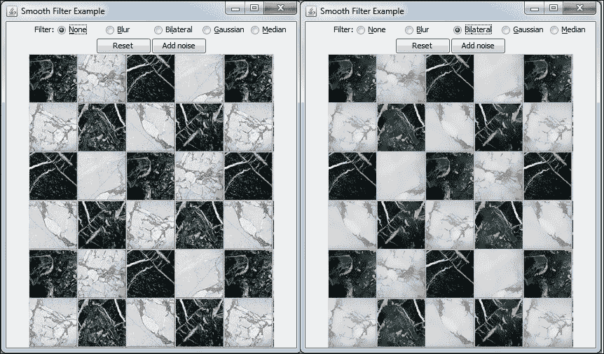

右侧图像展示了在保留边缘的同时过滤后的弹珠，这是使用其他过滤器时不会发生的情况。这种方法的一个缺点是，软纹理细节往往会丢失，就像在上一张图片第三行第二列的白色方块中那样。函数签名如下：

```py
public static void bilateralFilter(Mat src, Mat dst, int d,
                                   double sigmaColor,
                                   double sigmaSpace,
                                   [int borderType])
```

虽然`Mat src`和`Mat dst`分别是输入和输出图像，`int d`参数是考虑的邻域直径。如果它是非正的，直径将根据`sigmaSpace`参数计算。颜色空间中的滤波器 sigma 由`double sigmaColor`参数定义，这意味着对于更高的值，在计算像素的输出颜色时，会考虑邻域中更远的颜色，从而产生水彩效果。`Double sigmaSpace`是坐标空间中的 sigma 值，这意味着只要由于`sigmaColor`而没有跳过颜色，它们将具有与高斯相当的平均成分。记住，水彩效果在图像分割的第一步时可能非常有用。如果您需要控制边界类型，可以将`int borderType`参数作为最后一个参数添加，就像在之前的过滤器中那样。

当考虑强度差异以计算像素的新平均值时，会使用另一个高斯函数。请注意，由于这个额外步骤，在处理实时图像时，应该使用较小的核大小（例如，5）进行双边滤波，而对于离线应用，大小为 9 的核可能已经足够。请注意，当使用 3 x 3 邻域对大小为 3 的核进行卷积时，每个像素的卷积中只验证了 9 个像素。另一方面，当使用大小为 9 的核时，会验证 9 x 9 像素，这使得算法在搜索时大约需要 9 倍的时间。

# 形态学算子

一些图像操作被称为形态学操作，因为它们会改变底层对象的形状。我们将讨论腐蚀和膨胀，这些是在本节中也非常有用的形态学变换，以及一些派生变换。它们通常出现在隔离元素、去除噪声和连接图像中距离较远的元素的情况下。

这些算子通过将给定的核与图像进行卷积来工作。这个核通过一个锚点来描述，该锚点用于探测像素区域，这取决于其形状：

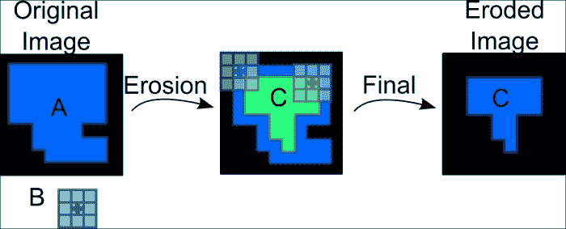

前面的图像显示了图像上的一个亮区，我们将称之为**A**。请注意，补区域是完全黑暗的。我们的内核由一个中心锚点的 3 x 3 块组成，描述为**B**。**C**区域是应用侵蚀形态学变换后的图像结果。请注意，这个操作发生在扫描图像的每个像素时，将内核锚点中心对准这些像素，然后在该内核区域内检索局部最小值。请注意，侵蚀会减少亮区。

相反的操作称为膨胀，这两种操作的区别在于，在膨胀中，它不是在内核区域内计算局部最小值，而是在该区域内计算局部最大值。这个操作将扩展一个 3 x 3 方形阻塞内核的亮区。

为了更好地了解这些算子的工作原理，一个不错的主意是尝试本章源代码中的`morphology`项目。它基本上是将 OpenCV 的官方 C++ `morphology2`示例翻译成 Java，并添加了一些小的 GUI 增强。请注意，在多通道图像的情况下，每个通道都是独立处理的。以下截图显示了正在运行的应用程序：

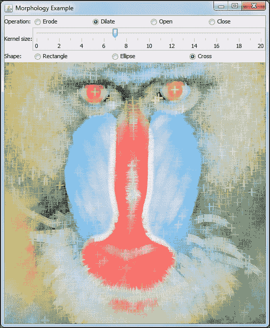

注意，我们的内核边界框是内核大小滑块参数的两倍加 1，因此，如果内核大小参数选择为 1，我们将有一个 3 x 3 的内核边界框。我们还用平方内核的术语描述了我们的示例，但它可以是任何形状，因此形状参数也是我们可以选择的。为了轻松创建这些内核，我们使用了 Imgproc 的`getStructuringElement`函数。这个函数将接受内核的形状、大小和零索引锚点位置作为其参数。内核形状可以是`Imgproc.CV_SHAPE_RECT`（用于矩形）、`Imgproc.CV_SHAPE_ELLIPSE`（用于椭圆）或`Imgproc.CV_SHAPE_CROSS`（用于十字形内核）。

我们将所有图像操作放入`ImageProcessor`类中，我们将在以下代码中突出显示：

```py
public Mat erode(Mat input, int elementSize, int elementShape){
  Mat outputImage = new Mat();
  Mat element = getKernelFromShape(elementSize, elementShape);
  Imgproc.erode(input,outputImage, element);
  return outputImage;
}

public Mat dilate(Mat input, int elementSize, int elementShape) {
  Mat outputImage = new Mat();
  Mat element = getKernelFromShape(elementSize, elementShape);
  Imgproc.dilate(input,outputImage, element);
  return outputImage;
}

public Mat open(Mat input, int elementSize, int elementShape) {
  Mat outputImage = new Mat();
  Mat element = getKernelFromShape(elementSize, elementShape);
  Imgproc.morphologyEx(input,outputImage, Imgproc.MORPH_OPEN, element);
  return outputImage;
}

public Mat close(Mat input, int elementSize, int elementShape) {
  Mat outputImage = new Mat();
  Mat element = getKernelFromShape(elementSize, elementShape);
  Imgproc.morphologyEx(input,outputImage, Imgproc.MORPH_CLOSE, element);
  return outputImage;
}

private Mat getKernelFromShape(int elementSize, int elementShape) {
  return Imgproc.getStructuringElement(elementShape, new Size(elementSize*2+1, elementSize*2+1), new Point(elementSize, elementSize) );
}
```

由于我们所有的方法都以相同的方式创建内核，我们已经提取了`getKernelFromShape`方法，它将简单地使用前面代码中描述的大小调用`getStructuringElement`函数。由于我们有一个自定义内核，我们将使用重载的`Imgproc.erode`函数，将输入图像、输出图像和内核作为第三个参数。以下截图是侵蚀函数在给定输入图像上的结果：


注意，这个算子经常被用来从图像中去除斑纹噪声，因为它会被腐蚀至无，而包含重要信息的较大区域实际上不会受到影响。请注意，平滑滤波器不会完全去除斑纹噪声，因为它们倾向于降低其幅度。此外，请注意，这些操作对核大小敏感，因此需要进行大小调整和一些实验。我们还可以查看以下截图中应用膨胀的结果：

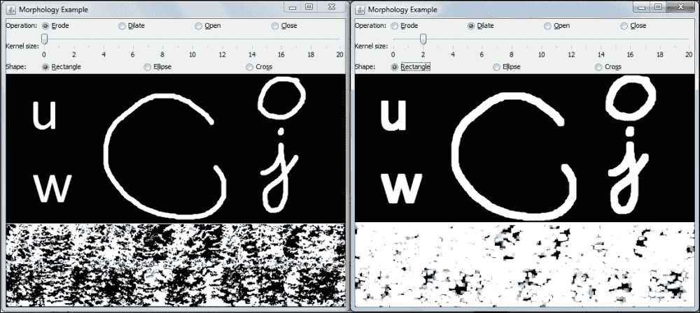

注意，除了使区域变厚外，膨胀形态学变换在搜索连接组件（像素强度相似的大区域）方面也非常有用。当由于阴影、噪声或其他效果将大区域分割成更小的区域时，可能需要这样做。如前一个截图中的图像底部所示。应用膨胀将使它们连接成一个更大的元素。

我们还推导出了形态学变换，即**开**和**闭**。开是通过腐蚀后跟膨胀来定义的，而在闭合操作中，膨胀先发生。以下是一个开变换的截图：

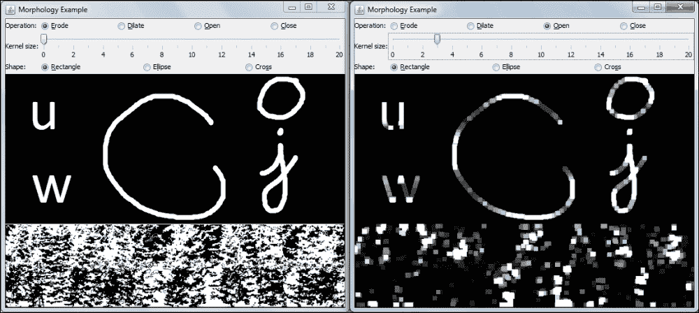

这个操作通常在从二值图像中计数区域时使用。例如，我们可能用它来在计数之前分离彼此过于接近的区域。请注意，在我们的示例底部，只有较大的区域在操作中幸存下来，同时保持了原本分离的大区域之间的非连通性。另一方面，我们可以看到将闭合操作应用于同一图像的效果，如下面的截图所示：

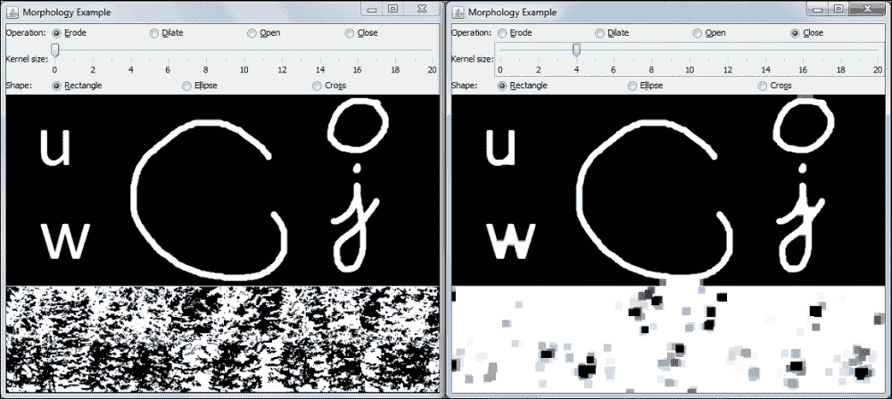

检查这是否会连接邻近的区域。根据核大小，它可能在连接组件算法中用来减少由噪声生成的片段。与腐蚀和膨胀不同，开闭形态学变换倾向于保留其感兴趣区域的面积。

# 浮点填充

另一个非常重要的分割算法是浮点填充，也称为区域增长。你们中已经使用过流行计算机图形程序的人，比如 Microsoft Paint 或 GIMP，可能已经使用过桶填充或画桶工具，它用颜色填充一个区域。尽管乍一看这可能看起来是一个非常简单的算法，但它有一个非常有趣的实现，并且有几个参数可以使它很好地分割图像。

算法背后的思想是从一个给定的点——所谓的种子点——开始，检查连接组件，即具有相似颜色或亮度的区域，然后检查这个特定点的邻居。这些邻居可以是 4 个（北、南、东和西）或 8 个（北、东北、东、东南、南、西南、西和西北），它们会检查一个条件，然后递归地，对每个满足条件的邻居执行相同的程序。如果条件为真，它自然会将该点添加到给定的连接组件中。我们通常寻找与种子点或其邻居点相似的像素，这取决于哪种洪水填充模式将运行。我们称像素与种子点比较时为固定范围，而像素与邻居像素比较时为浮动范围。此条件还接受较低差异*loDiff*和较高差异*upDiff*参数，这些参数根据*src(x',y') – loDiff < src (x,y) < src(x',y') + upDiff*方程进入条件。在这个方程中，*src(x,y)*是测试的*x*，*y*坐标处的像素值，以检查它是否属于与种子点相同的域，而*src(x',y')*是在浮动范围中操作的灰度图像中已知属于该组件的像素之一。如果我们有一个固定范围的洪水填充，方程变为*src(seed.x,seed.y) – loDiff < src (x,y) < src(seed.x,seed.y) + upDiff*，其中*seed.x*和*seed.y*是种子点的坐标。此外，请注意，在彩色图像的情况下，每个像素的分量都会与条件进行比较，而*loDiff*和*highDiff*是三维标量。总的来说，如果新像素的亮度或颜色足够接近其邻居之一，该邻居已属于连接组件，或者在浮动范围洪水填充的情况下足够接近种子点的属性，则该像素将被添加到域中。

洪水填充的签名如下：

```py
public static int floodFill(Mat image,
                            Mat mask,
                            Point seedPoint,
                            Scalar newVal,
                            Rect rect,
                            Scalar loDiff,
                            Scalar upDiff,
                            int flags)
```

`Mat image`参数是要执行洪水填充的图像的输入/输出`Mat`，而`Mat mask`是一个比`Mat image`高 2 行、宽 2 列的单通道 8 位矩阵，出于性能考虑。`Point seedpoint`参数包含种子点的坐标，而`Rect rect`是一个输出矩形，包含分割区域的最小边界框。`Scalar loDiff`和`upDiff`参数在先前的条件中已讨论。`int flags`参数包含算法操作模式的选项。包含`floodFill`方法*门面*类的源代码可在本章的`floodfill`项目中找到。以下是该应用的截图：

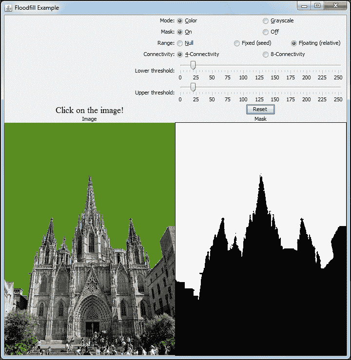

在前面的截图左侧，有一个类似于第二章中解释的`JLabel`，用于加载图像，但这个有一个`MouseListener`，它会将捕获的点击发送到`FloodFillFacade`类。在前面截图的右侧，当**Mask**单选按钮被选中时，会显示掩码。算法操作模式是通过`Range radio`按钮选择的，可以是相对的（检查邻居的条件）、固定的（条件与种子点比较）或空的（当`loDiff`和`hiDiff`都为零时）。还有一个用于 4 或 8 个邻居的连通性单选按钮，而下限和上限阈值分别对应于`loDiff`和`hiDiff`参数。

虽然`FloodFillFacade`的大多数字段只是`getters`和`setters`，但标志配置是你需要注意的事情。请注意，*门面*只是一个创建对更大部分代码的简化接口的对象，使其更容易使用。以下是`FloodFillFacade`的一些重要部分：

```py
public class FloodFillFacade {

  public static final int NULL_RANGE = 0;
  public static final int FIXED_RANGE = 1;
  public static final int FLOATING_RANGE = 2;
  private boolean colored = true;
  private boolean masked = true;
  private int range = FIXED_RANGE;
  private Random random = new Random();
  private int connectivity = 4;
  private int newMaskVal = 255;
  private int lowerDiff = 20;
  private int upperDiff = 20;

  public int fill(Mat image, Mat mask, int x, int y) {
    Point seedPoint = new Point(x,y);

    int b = random.nextInt(256);
    int g = random.nextInt(256);
    int r = random.nextInt(256);
    Rect rect = new Rect();

    Scalar newVal = isColored() ? new Scalar(b, g, r) : new Scalar(r*0.299 + g*0.587 + b*0.114);

    Scalar lowerDifference = new Scalar(lowerDiff,lowerDiff,lowerDiff);
    Scalar upperDifference = new Scalar(upperDiff,upperDiff,upperDiff);
    if(range == NULL_RANGE){
      lowerDifference = new Scalar (0,0,0);
      upperDifference = new Scalar (0,0,0);
    }
    int flags = connectivity + (newMaskVal << 8) + 
      (range == FIXED_RANGE ? Imgproc.FLOODFILL_FIXED_RANGE : 0);
    int area = 0;
    if(masked){
      area = Imgproc.floodFill(image, mask, seedPoint, newVal, rect, lowerDifference, upperDifference, flags);
    }
    else{
      area = Imgproc.floodFill(image, new Mat(), seedPoint, newVal, rect, lowerDifference, upperDifference, flags);
    }
    return area;
  }
...
}
```

在这里，首先，创建`newVal`作为要填充到连通组件中的新颜色。使用 Java 随机类生成颜色，如果是灰度图像，则将其转换为灰度。然后，我们设置`lowerDifference`和`higherDifference`标量，它们将根据之前描述的方程使用。然后，定义`flags`变量。请注意，连通性设置在低位，而`newMaskVal`向左移动 8 位。此参数是在使用掩码时用于填充掩码的颜色。然后，如果需要固定范围的洪水填充，则设置其标志。然后，我们可以从掩码或未掩码的洪水填充版本中进行选择。注意`new Mat()`，当不使用掩码时传递。观察`seedPoint`参数是由我们的`MouseListener`提供的坐标构建的。

# 图像金字塔

图像金字塔简单来说是由对原始图像进行下采样得到的一系列图像集合，使得每个图像的面积是其前一个图像的四分之一。它主要应用于图像分割，因为它可以在低分辨率下生成非常具有意义的图像表示，从而使得耗时算法可以在其上运行。这使得我们能够将此结果映射回金字塔中的更高分辨率图像，并使得在那里细化结果成为可能。此外，通过高斯差分可以生成拉普拉斯近似。请注意，拉普拉斯图像是会显示其边缘的图像。

为了生成下采样图像，我们将其称为高斯金字塔中的 `i+1` 层（`Gi+1`），我们首先使用高斯核对 `Gi` 进行卷积，就像在高斯滤波中一样，然后移除所有偶数行和列。然后，我们得到一个面积是上一层四分之一的图像。在下采样之前进行平均很重要，因为这样可以从奇数行和列中捕获信息。获取下采样图像的函数具有以下签名：

```py
public static void pyrDown(Mat src, Mat dst ,[Size dstsize, int borderType])
```

`Mat src` 和 `Mat dst` 参数是输入和输出图像。请注意，输出图像的宽度将是 `(src.width+1)/2`，高度是 `(src.height+1)/2`，其中 `/` 表示整数除法。当处理奇数维度时，你应该小心，因为从下采样图像生成的上采样图像将不具有相同的维度。以一个 11 x 11 的图像为例。当你使用 `pyrDown` 时，它将变成一个 6 x 6 的图像。如果你对其进行上采样，它将变成一个 12 x 12 的图像，因此你不能将其添加或从原始图像中减去。请注意，当使用 `pyrDown` 时，使用了一个 5 x 5 的高斯核。如果你想，`pyrDown` 函数通过 `Size dstsize` 和 `int borderType` 属性进行了重载。`dstsize` 属性将允许你定义输出图像大小，但你必须满足以下条件：

```py
|dstsize.width  * 2 – src.cols| < 2
|dstsize.height * 2 – src.rows| < 2
```

这意味着在决定输出图像大小时，你不会有太多的自由度。此外，`borderType` 与 *平滑* 部分中给出的考虑相同。

另一方面，`pyrUp` 函数将上采样一个图像然后对其进行模糊处理。首先，它将在偶数位置注入零行和列，然后与从金字塔下操作中相同的核进行卷积。请注意，`pyrDown` 是一种会丢失信息的转换，因此 `pyrUp` 无法恢复原始图像。其用法如下：

```py
public static void pyrUp(Mat src, Mat dst)
```

它的参数与 `pyrDown` 参数类似。

如果你想构建拉普拉斯算子，请注意这可以通过以下方程实现：

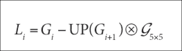

`UP` 是上采样操作，`⊗G5` 是与 5 x 5 高斯核的卷积。由于 `pyrUp` 已经实现为上采样后跟高斯模糊，我们所需做的只是对原始图像进行下采样，然后上采样，最后从原始图像中减去它。这可以通过以下代码实现，如本章的 `imagePyramid` 示例所示：

```py
Mat gp1 = new Mat();
Imgproc.pyrDown(image, gp1);
Imgproc.pyrUp(gp1, gp1);
Core.subtract(image, gp1, gp1);
```

在前面的代码中，我们假设 `image` 是我们正在处理的图像。在上采样并从图像中减去时，请小心，因为如果原始图像的维度是奇数，它们的维度将不同。`Core.subtract` 函数简单地从一个图像中减去另一个图像，如下面的截图所示：

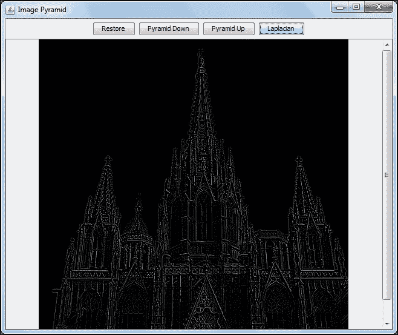

为了看到一些使用金字塔的代码示例，请考虑查看本章的 `imagePyramid` 项目。前面的截图显示了正在运行拉普拉斯滤波器的应用程序。还可以通过按钮来感受金字塔的工作方式。

# 阈值处理

将灰度图像分割的最简单方法之一是使用阈值技术。它基本上会将低于给定值的像素视为感兴趣的对象的一部分，而将其他像素视为不属于它的一部分。尽管它可能受到光照问题以及物体内部变化引起的问题的影响，但在对页面扫描中的文本进行 OCR 或校准相机时寻找棋盘图案时，这可能是足够的。此外，一些更有趣的方法，如自适应阈值，也可以在受非均匀光照影响的图像中产生良好的结果。

基本阈值化是通过 Imgproc 的 `threshold` 函数实现的，其签名如下：

```py
public static double threshold(Mat src,
                               Mat dst,
                               double thresh,
                               double maxval,
                               int type)
```

`Mats src` 和 `dst` 参数是输入和输出矩阵，而 `thresh` 是用于阈值化图像的级别。`maxval` 只在 `Binary` 和 `Binary_Inv` 模式下使用，这将在以下表格中解释。`type` 是用于描述阈值化类型的 Imgproc 常量，如下表所示，当在下一个条件下测试时，源像素值大于给定的阈值：

| 阈值类型 | 当为真时的输出 | 当为假时的输出 |
| --- | --- | --- |
| `CV_THRESH_BINARY` | `maxval` | `0` |
| `CV_THRESH_BINARY_INV` | `0` | `maxval` |
| `CV_THRESH_BINARY` | `threshold` | `source value` |
| `CV_TOZERO` | `source value` | `0` |
| `CV_TOZERO_INV` | `0` | `source value` |

以下图表将帮助您轻松理解前面的表格：

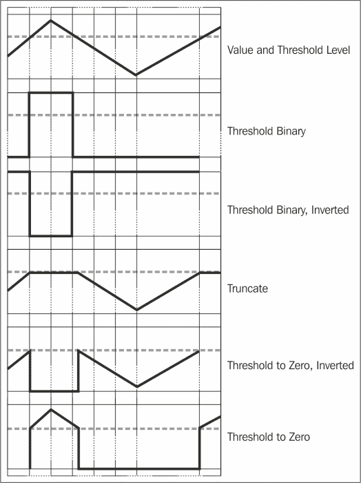

在进行阈值处理时，通过例如滑动条等工具尝试几个不同的值是很重要的。本章中的示例项目 `threshold` 使得改变函数的参数和测试结果变得非常简单。以下展示了项目的截图：


注意，尽管苹果在分割时可能是一个简单的问题，但在应用二值阈值方法时，苹果几乎完全被识别，除了中间线上方的光照点，这些点的像素明显高于 205 级，因为它们几乎是纯白色，这将是 255 级。此外，苹果下方的阴影区域也被识别为属于它的一部分。除了这些小问题外，它使用简单，通常将是任何计算机视觉应用步骤中的一部分。

这种类型分割的另一种有趣的方法与使用动态阈值值有关。而不是使用给定的值，阈值被计算为围绕每个像素的平方块的均值减去一个给定的常数。这种方法通过 OpenCV 中的`adaptiveThreshold`函数实现，该函数具有以下签名：

```py
public static void adaptiveThreshold(Mat src,
                                     Mat dst,
                                     double maxValue,
                                     int adaptiveMethod,
                                     int thresholdType,
                                     int blockSize,
                                     double C)
```

`Mat src`和`dst`参数分别是输入和输出矩阵。`Maxvalue`的使用方式与普通阈值函数相同，这在前面章节中有描述。自适应方法可以是`ADAPTIVE_THRESH_MEAN_C`或`ADAPTIVE_THRESH_GAUSSIAN_C`。前者将计算平均值作为块中像素值总和除以像素数，而后者将使用高斯加权平均。`BlockSize`是用于平均值的`blockSize`乘以`blockSize`的正方形区域，其值必须是奇数且大于 1。`C`常数是从平均值中减去的值，用于组成动态阈值。注意使用`blocksize`为`13`和常数`C`为`6`时，对同一图像使用自适应阈值得到的结果：

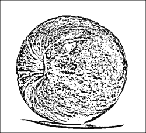

注意，阴影区域现在要好得多，尽管苹果的不规则纹理可能会引起其他问题。示例代码使用了二值和`ADAPTIVE_THRESH_MEAN_C`自适应阈值，但将其更改为高斯阈值只需更改类型参数。

# 摘要

本章解释了在任何计算机视觉项目中都需要的基本图像处理操作的原理和实践。我们首先讨论了使用简单平均或高斯加权的滤波器，以及中值滤波器，并讨论了有趣的双边滤波器，它保持了边缘。然后，我们探讨了重要的形态学算子，如腐蚀、膨胀、开运算和闭运算，这些算子在隔离元素、去除噪声和连接图像中距离较远的元素时出现。随后，我们通过洪水填充讨论了众所周知的油漆桶操作。然后，我们探讨了时间和处理节省的图像金字塔，通过在每个层中将图像面积减少到四分之一来加快分割速度。最后，我们解释了重要的图像分割技术——阈值，并测试了自适应阈值。

在下一章中，我们将重点关注重要的图像变换，这将使我们能够在图像中找到边缘、线条和圆。然后，你将学习拉伸、收缩、扭曲和旋转操作，这将由傅里叶变换跟随，傅里叶变换是一种将图像从空间域转换为频率域的好工具。最后，我们将检查积分图像，它可以提高某些人脸跟踪算法。
