# 第六章. 使用 Kinect 设备检测前景和背景区域及深度

在视频安全应用领域，人们常常需要注意到帧之间的差异，因为那里是动作发生的地方。在其他领域，将对象从背景中分离出来也非常重要。本章展示了实现这一目标的一些技术，并比较了它们的优缺点。检测前景或背景区域的一种完全不同的方法是使用深度设备，如**Kinect**。本章还讨论了如何使用该设备实现这一目标。

在本章中，我们将涵盖：

+   背景减法

+   帧差分

+   平均背景法

+   高斯混合法

+   等高线查找

+   Kinect 深度图

到本章结束时，你将拥有几种解决查找前景/背景区域问题的方法，无论是通过直接图像处理还是使用与深度兼容的设备，如 Kinect。

# 背景减法

当与监控摄像头一起工作时，很容易看出大多数帧保持静止，而移动的对象，即我们感兴趣的对象，是随时间变化最大的区域。背景减法被定义为从静态摄像头检测移动对象的方法，也称为**前景检测**，因为我们主要对前景对象感兴趣。

为了执行一些有价值的背景减法，重要的是要考虑到变化的亮度条件，并始终注意更新我们的背景模型。尽管一些技术将背景减法的概念扩展到其字面意义之外，例如高斯混合方法，但它们仍然被这样命名。

为了比较以下章节中的所有解决方案，我们将提出一个有用的接口，称为**VideoProcessor**。此接口由一个简单的名为**process**的方法组成。整个接口在以下代码片段中给出：

```py
public interface VideoProcessor {
  public Mat process(Mat inputImage);
}
```

注意，我们将在以下背景处理器中实现此接口，这样我们可以轻松地更改它们并比较它们的结果。在此上下文中，`Mat inputImage`指的是正在处理的视频序列中的当前帧。

所有与背景减法相关的代码都可以在`background`项目中找到，该项目位于`chapter6`参考代码中。

我们的主要应用由两个窗口组成。其中一个简单地回放输入视频或网络摄像头流，而另一个显示应用了实现`VideoProcessor`接口的背景减法器的输出。这样，我们的主循环看起来大致如下代码：

```py
while (true){  
  capture.read(currentImage);  
  if( !currentImage.empty() ){
    foregroundImage = videoProcessor.process(currentImage);
    ... update Graphical User Interfaces ...
    Thread.sleep(10);
  }
}
```

注意，在成功检索图像后，我们将其传递给我们的 `VideoProcessor` 并更新我们的窗口。我们还暂停了 10 毫秒，以便视频播放不会看起来像快进。这个 10 毫秒的延迟不是记录的帧延迟，它被使用是因为这里的重点不是以原始文件相同的速度播放。为了尝试不同的减法方法，我们只需更改我们的 `VideoProcessor` 类的实例化。

# 帧差分

为了检索前景对象，简单地考虑一个简单的背景减法应该是直截了当的。一个简单的解决方案可能看起来像以下代码行：

```py
Core.absdiff(backgroundImage,inputImage , foregroundImage);
```

这个函数简单地从 `backgroundImage` 中减去 `inputImage` 的每个像素，并将绝对值写入 `foregroundImage`。只要我们初始化了背景为 `backgroundImage`，并且我们清楚地从对象中分离出来，这就可以作为一个简单的解决方案。

下面是背景减法视频处理器代码：

```py
public class AbsDifferenceBackground implements VideoProcessor {
  private Mat backgroundImage;

  public AbsDifferenceBackground(Mat backgroundImage) {
    this.backgroundImage = backgroundImage;
  }

  public Mat process(Mat inputImage) {
    Mat foregroundImage = new Mat();
    Core.absdiff(backgroundImage,inputImage , foregroundImage);
    return foregroundImage;
  }

}
```

主要方法，`process`，实际上非常简单。它仅应用绝对差分方法。唯一需要记住的细节是在构造函数中初始化背景图像，它应该对应整个背景没有前景对象。

我们可以在以下图像中看到应用普通背景减法的结果；重要的是要检查背景中的移动树叶是否被正确移除，因为这是一个弱背景建模。此外，记得移动**视频播放示例**窗口，因为它可能会覆盖**背景移除示例**窗口：

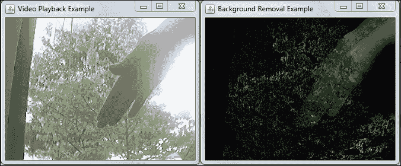

# 背景平均方法

上一节中背景减法器的问题在于背景通常会因为光照和其他效果而改变。另一个事实是背景可能不容易获得，或者背景的概念可能改变，例如，当有人在视频监控应用中留下行李时。行李可能是第一帧的前景对象，但之后，它应该被遗忘。

一个有趣的算法用于处理这些问题，它使用了运行平均的概念。它不是总是使用第一帧作为清晰的背景，而是通过计算其移动平均来不断更新它。考虑以下方程，它将被执行，更新每个像素从旧的平均值，并考虑从最近获取的图像中的每个像素：

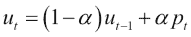

注意，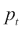 是新的像素值；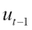 是时间 `t-1` 的平均背景值，这将是最后一帧；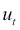 是背景的新值；而 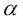 是学习率。

幸运的是，OpenCV 已经有了 `accumulateWeighted` 函数，它为我们执行最后一个方程。现在让我们看看在检查 `RunningAverageBackground` 类的 `process` 方法时，平均背景过程是如何在 `RunningAverageBackground` 类中实现的：

```py
public Mat process(Mat inputImage) {
  Mat foregroundThresh = new Mat();
  // Firstly, convert to gray-level image, yields good results with performance
  Imgproc.cvtColor(inputImage, inputGray, Imgproc.COLOR_BGR2GRAY);
  // initialize background to 1st frame, convert to floating type
  if (accumulatedBackground.empty())
    inputGray.convertTo(accumulatedBackground, CvType.CV_32F);

  // convert background to 8U, for differencing with input image
  accumulatedBackground.convertTo(backImage,CvType.CV_8U);
  // compute difference between image and background
  Core.absdiff(backImage,inputGray,foreground);

  // apply threshold to foreground image
  Imgproc.threshold(foreground,foregroundThresh, threshold,255, Imgproc.THRESH_BINARY_INV);

  // accumulate background
  Mat inputFloating = new Mat();
  inputGray.convertTo(inputFloating, CvType.CV_32F);
  Imgproc.accumulateWeighted(inputFloating, accumulatedBackground,learningRate, foregroundThresh);

  return negative(foregroundThresh);
}

private Mat negative(Mat foregroundThresh) {
  Mat result = new Mat();
  Mat white = foregroundThresh.clone();
  white.setTo(new Scalar(255.0));
  Core.subtract(white, foregroundThresh,  result);
  return result;
}
```

首先，我们将输入图像转换为灰度级别，因为我们将以这种方式存储平均背景，尽管我们也可以使用三个通道来实现。然后，如果累积背景尚未开始，我们必须将其设置为第一个输入图像的浮点格式。然后我们从累积背景中减去最近获取的帧，从而得到我们的前景图像，我们稍后会对其进行阈值处理以去除小的光照变化或噪声。

注意这次我们使用的是 `Imgproc.THRESH_BINARY_INV`，它将所有高于给定阈值的像素转换为黑色，从而为前景对象生成黑色像素，为背景生成白色像素。

这样，我们就可以使用这张图像作为掩模，在以后使用 `accumulateWeighted` 方法时只更新背景像素。在下一行，我们只转换 `inputImage` 为 `inputFloating`，这样我们就可以以浮点格式拥有它。然后我们使用 `accumulateWeighted` 应用我们的注释方程进行运行平均值。最后，我们反转图像并返回作为白色像素的前景对象。

在以下图像中，我们可以看到对背景中移动的叶子的更好建模。尽管阈值处理使得将这些结果与简单的背景减法进行比较变得困难，但很明显，许多移动的叶子已经被移除。此外，大部分手也被清除。可以通过调整阈值参数来获得更好的结果，如下面的截图所示：

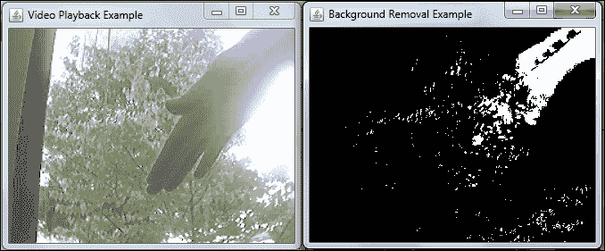

# 高斯混合方法

尽管我们可以通过前面的想法获得非常好的结果，但文献中已经提出了更多先进的方法。1999 年，Grimson 提出的一种伟大方法是使用不止一个运行平均值，而是更多平均值，这样如果像素在两个轨道点之间波动，这两个运行平均值都会被计算。如果它不符合任何一个，则被认为是前景。

此外，Grimson 的方法还保留了像素的方差，这是衡量一组数字分布程度的统计量。有了平均值和方差，我们可以计算出高斯模型，并测量一个概率以供考虑，从而得到一个**高斯混合模型**（**MOG**）。当背景中的树枝和叶子移动时，这可以非常有用。

不幸的是，Grimson 的方法在开始时学习速度较慢，并且无法区分移动的阴影和移动的对象。因此，KaewTraKulPong 和 Bowden 发布了一种改进技术来解决这些问题。这个技术已经在 OpenCV 中实现，并且通过`BackgroundSubtractorMOG2`类使用它非常简单。

为了展示高斯混合方法的有效性，我们实现了一个基于`BackgroundSubtractorMOG2`的`VideoProcessor`。其完整代码如下：

```py
public class MixtureOfGaussianBackground implements VideoProcessor {
  privateBackgroundSubtractorMOG2 mog=  org.opencv.video.Video. createBackgroundSubtractorMOG2();
  private Mat foreground = new Mat();
  private double learningRate = 0.01;

  public Mat process(Mat inputImage) {
    mog.apply(inputImage, foreground, learningRate);
    return foreground;
  }
}
```

注意，我们只需要实例化`BackgroundSubtractorMOG2`类并使用`apply`方法，传递输入帧、输出图像以及一个学习率，这个学习率将告诉算法以多快的速度学习新的背景。除了无参数的工厂方法外，还有一个具有以下签名的工厂方法：

```py
Video.createBackgroundSubtractorMOG2 (int history, double varThreshold, boolean detectShadows)
```

在这里，`history`是历史长度，`varThreshold`是像素与模型之间的平方马氏距离的阈值，用于决定像素是否被背景模型很好地描述，如果`detectShadows`为`true`，则算法将检测并标记阴影。如果我们不使用空构造函数设置参数，则默认使用以下值：

+   `defaultHistory = 500;`

+   `varThreshold = 16;`

+   `detectShadows = true;`

尝试调整这些值以在执行背景减法时寻找更好的结果。

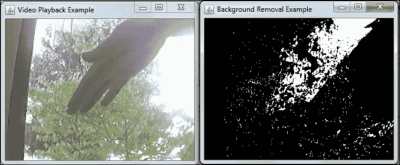

在前面的截图中，我们可以清楚地看到一个非常出色的背景去除结果，且几乎无需任何定制。尽管一些叶子仍然在去除的背景结果中造成噪声，但我们仍可以看到大量手部被正确地识别为前景。可以应用一个简单的开形态算子来去除一些噪声，如下面的截图所示：

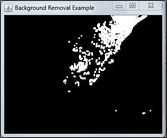

# 轮廓查找

当处理从背景中去除的二值图像时，将像素转换为有用的信息非常重要，例如通过将它们组合成一个对象或让用户非常清楚地看到。在这种情况下，了解连通组件的概念非常重要，连通组件是在二值图像中连接的像素集，以及 OpenCV 用于找到其轮廓的函数。

在本节中，我们将检查`findContours`函数，该函数提取图像中连通组件的轮廓以及一个辅助函数，该函数将在图像中绘制轮廓，即`drawContours`。`findContours`函数通常应用于经过阈值处理以及一些 Canny 图像变换的图像。在我们的例子中，使用了阈值。

`findContours`函数具有以下签名：

```py
public static void findContours(Mat image,
                java.util.List<MatOfPoint> contours,
                Mat hierarchy,
                int mode,
                int method)
```

它使用 Suzuki 在其论文《通过边界跟踪对数字化二值图像进行拓扑结构分析》中描述的算法实现。第一个参数是输入图像。确保您在目标图像的副本上工作，因为此函数会更改图像。此外，请注意，图像的 1 像素边界不被考虑。找到的轮廓存储在`MatOfPoints`列表中。这是一个简单地以矩阵形式存储点的结构。

`Mat hierarchy`是一个可选的输出向量，为每个找到的轮廓设置。它们代表同一层次级别中下一个和前一个轮廓的 0 基于索引，第一个子轮廓和父轮廓，分别用`hierarcy[i][0]`、`hierarcy[i][1]`、`hierarcy[i][2]`和`hierarcy[i][3]`元素表示，对于给定的`i`轮廓。如果没有与这些值对应的轮廓，它们将是负数。

`mode`参数处理层次关系是如何建立的。如果您对此不感兴趣，可以将其设置为`Imgproc.RETR_LIST`。在检索轮廓时，`method`参数控制它们是如何近似的。如果将`Imgproc.CHAIN_APPROX_NONE`设置为，则存储所有轮廓点。另一方面，当使用`Imgproc.CHAIN_APPROX_SIMPLE`为此值时，通过仅使用它们的端点压缩水平、垂直和对角线线。还有其他近似方法可用。

为了绘制获取到的轮廓轮廓或填充它们，使用 Imgproc 的`drawContours`函数。此函数具有以下签名：

```py
public static void drawContours(Mat image,
                java.util.List<MatOfPoint> contours,
                int contourIdx,
                Scalar color)
```

`Mat image`是目标图像，而`MatOfPoint`轮廓列表是在调用`findContours`时获得的。`contourIdx`属性是要绘制的属性，而`color`是绘制所需的颜色。还有重载函数，用户可以选择厚度、线型、层次结构最大级别和偏移量。

在决定哪些轮廓有趣时，一个有用的函数可以帮助做出这个决定，那就是找到轮廓面积。OpenCV 通过`Imgproc.contourArea`实现此功能。此函数可以在`chapter6`源代码的示例`connected`项目中找到。此应用程序接受一个图像作为输入，对其运行阈值，然后使用它来查找轮廓。本节讨论的函数有几个测试选项，例如是否填充轮廓或根据找到的面积绘制轮廓。以下是此应用程序的屏幕截图：

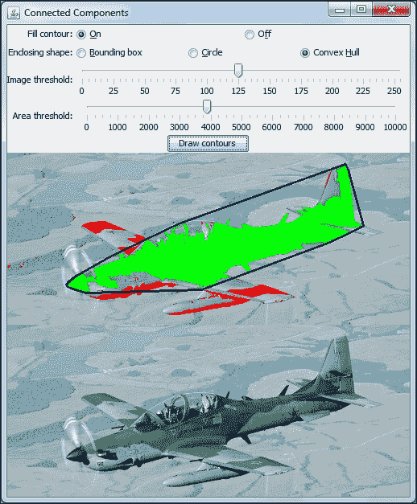

在处理轮廓时，围绕它们绘制形状也很重要，以便进行测量或突出显示找到的内容。示例应用程序还提供了一些代码，说明如何围绕轮廓绘制边界框、圆形或凸包。让我们看看主要的`drawContours()`函数，该函数在按下按钮时被调用：

```py
protected void drawContours() {
  Mat contourMat = binary.clone();
  List<MatOfPoint> contours = new ArrayList<MatOfPoint>();
  int thickness = (fillFlag.equals(onFillString))?-1:2;

  Imgproc.findContours(contourMat, contours, new Mat(),
  Imgproc.CHAIN_APPROX_NONE,Imgproc.CHAIN_APPROX_SIMPLE);
  for(int i=0;i<contours.size();i++){
    MatOfPoint currentContour = contours.get(i);
    double currentArea = Imgproc.contourArea(currentContour);

    if(currentArea > areaThreshold){
      Imgproc.drawContours(image, contours, i, new Scalar(0,255,0), thickness);
      if(boundingBoxString.equals(enclosingType)){
        drawBoundingBox(currentContour);
      }
      else if (circleString.equals(enclosingType)){
      drawEnclosingCircle(currentContour);
      }
      else if (convexHullString.equals(enclosingType)){
        drawConvexHull(currentContour);
      }
    }
    else{
      Imgproc.drawContours(image, contours, i, new Scalar(0,0,255), thickness);
    }
  }
  updateView();
}
```

我们首先克隆我们的目标二进制镜像，这样我们就不会改变它。然后，我们初始化`MatOfPoint`结构并定义厚度标志。接下来，我们运行`findContours`，忽略输出层次矩阵。现在是时候在`for`循环中迭代轮廓了。我们使用`Imgproc.contourArea`辅助函数进行面积估计。基于此，如果它是之前通过滑块定义的`areaThreshold`，则使用`drawContours`函数将其绘制为绿色；否则，将其绘制为红色。代码中一个有趣的部分是形状绘制函数，具体描述如下：

```py
private void drawBoundingBox(MatOfPoint currentContour) {
  Rect rectangle = Imgproc.boundingRect(currentContour);
  Imgproc.rectangle(image, rectangle.tl(), rectangle.br(), new Scalar(255,0,0),1);
}

private void drawEnclosingCircle(MatOfPoint currentContour) {
  float[] radius = new float[1];
  Point center = new Point();

  MatOfPoint2f currentContour2f = new MatOfPoint2f();
  currentContour.convertTo(currentContour2f, CvType.CV_32FC2);
  Imgproc.minEnclosingCircle(currentContour2f, center, radius);
  Imgproc.circle(image, center, (int) radius[0], new Scalar(255,0,0));
}

private void drawConvexHull(MatOfPoint currentContour) {
  MatOfInt hull = new MatOfInt();
  Imgproc.convexHull(currentContour, hull);

  List<MatOfPoint> hullContours = new ArrayList<MatOfPoint>();
  MatOfPoint hullMat = new MatOfPoint();
  hullMat.create((int)hull.size().height,1,CvType.CV_32SC2);

  for(int j = 0; j < hull.size().height ; j++){
    int index = (int)hull.get(j, 0)[0];
    double[] point = new double[] {
      currentContour.get(index, 0)[0], currentContour.get(index, 0)[1]
    };
    hullMat.put(j, 0, point);
  }
  hullContours.add(hullMat);
  Imgproc.drawContours(image, hullContours, 0, new Scalar(128,0,0), 2);
}
```

绘制边界框很简单；只需调用`Imgproc.boundingRect()`以识别形状周围的矩形。然后，调用 Imgproc 的`rectangle`函数方法来绘制矩形本身。

由于存在`minEnclosingCircle`函数，绘制包围圆也很容易。唯一的注意事项是将`MatOfPoint`转换为`MatOfPoint2f`，这可以通过调用 Contour 的`convertTo`方法实现。Imgproc 的`circle`函数负责绘制它。

从计算几何的角度来看，找到凸包是一个相当重要的问题。它可以看作是在一组点周围放置一个橡皮筋并检查它最终形成的形状。幸运的是，OpenCV 也通过 Imgproc 的`convexHull`函数处理这个问题。注意，在前面的代码中`drawConvexHull`的第一行和第二行，创建了`MatOfInt`，并调用`convexHull`，将当前轮廓和这个矩阵作为参数传递。这个函数将返回凸包索引在`MatOfInt`中。我们可以根据这些索引的坐标从原始轮廓绘制线条。另一个想法是使用 OpenCV 的`drawContour`函数。为了做到这一点，你需要构建一个新的轮廓。这是在代码中的以下行中完成的，直到调用`drawContour`。

# Kinect 深度图

从本章的开头到现在，我们一直专注于尝试使用普通摄像头对场景背景进行建模的背景减法方法，然后是应用帧差分。

### 注意

虽然据报道 Kinect 与 Linux 和 OSX 兼容，但本节仅涉及在 OpenCV 2.4.7 版本上对 Windows 的设置。

在本节中，我们将采用不同的方法。我们将设置我们希望我们的物体被认为是前景和背景的距离，这意味着通过选择一个深度参数来移除背景。不幸的是，这不能通过一次拍摄使用单个普通相机来完成，因此我们需要一个能够告诉我们物体深度的传感器，或者尝试从立体视觉中确定深度，但这超出了本章的范围。多亏了游戏玩家和来自世界各地的许多努力，这种设备已经变成了商品，它被称为**Kinect**。可以尝试使用两个相机并尝试从立体视觉中获得深度，但结果可能不如使用 Kinect 传感器的结果那么好。以下是它的样子：

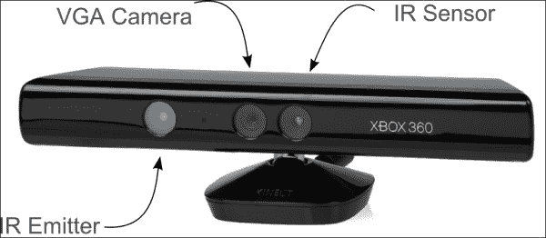

使 Kinect 真正区别于普通相机的是，它包括一个红外发射器和红外传感器，能够投影和感应结构光模式。它还包含一个普通的 VGA 相机，以便将深度数据合并到其中。结构光背后的想法是，当将已知的像素模式投影到物体上时，该模式的变形允许计算机视觉系统从这些模式中计算深度和表面信息。如果使用能够注册红外线的相机来记录发射的 Kinect 模式，可以看到类似以下图像：

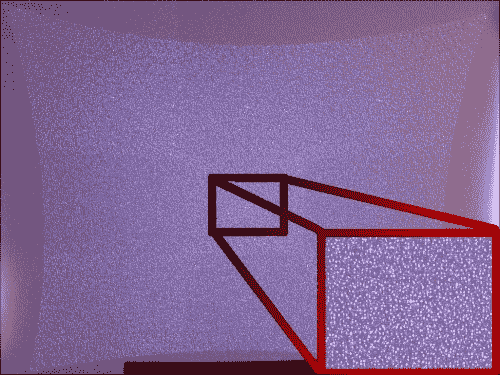

虽然它可能看起来像一组随机的点，但实际上它们是先前生成的伪随机模式。这些模式可以被识别，并且可以计算出深度与视差的关系，从而推断深度。如果需要，可以通过研究结构光概念来获取更多信息。

应该意识到这种方法的影响。因为它依赖于主动红外投影，一些户外效果，如直射日光，会混淆传感器，因此不建议户外使用。用户还应该意识到深度范围是从 0.8 米到 4.0 米（大约从 2.6 英尺到 13.1 英尺）。与红外投影相关的某些阴影也可能使结果看起来不如应有的好，并在图像中产生一些噪声。尽管存在所有这些问题，但它是在近场背景移除方面最好的结果之一。

## Kinect 设置

使用 Kinect 应该是直接的，但我们需要考虑两个重要方面。首先，我们需要确保所有设备驱动软件都已正确安装以便使用。然后，我们需要检查 OpenCV 是否已编译为支持 Kinect。不幸的是，如果你已经从[`sourceforge.net/projects/opencvlibrary/files/`](http://sourceforge.net/projects/opencvlibrary/files/)下载了 2.4.7 版本的预编译二进制文件，如第一章开头所述，*为 Java 设置 OpenCV*，开箱即用的支持不包括在内。我们将在接下来的章节中简要描述设置说明。

重要的是要注意，不仅 Xbox 360 Kinect 设备是商业化的，而且 Windows Kinect 也是。目前，如果你正在创建使用 Kinect 的商业应用程序，你应该选择 Windows Kinect，尽管 Xbox 360 Kinect 可以与提供的驱动程序一起使用。

### 驱动程序设置

OpenCV 对 Kinect 的支持依赖于 OpenNI 和 PrimeSensor Module for OpenNI。OpenNI 框架是一个开源 SDK，用于开发 3D 感知中间件库和应用。不幸的是，[OpenNI.org](http://OpenNI.org)网站仅在 2014 年 4 月 23 日之前可用，但 OpenNI 源代码可在 Github 上找到，地址为[`github.com/OpenNI/OpenNI`](https://github.com/OpenNI/OpenNI)和[`github.com/OpenNI/OpenNI2`](https://github.com/OpenNI/OpenNI2)。在本节中，我们将重点关注使用版本 1.5.7.10。

虽然构建二进制的说明 readily available，但我们可以使用本书代码库中提供的安装程序。

在安装 OpenNI 库之后，我们还需要安装 Kinect 驱动程序。这些驱动程序可在[`github.com/avin2/SensorKinect/`](https://github.com/avin2/SensorKinect/)找到，安装程序位于[`github.com/avin2/SensorKinect/tree/unstable/Bin`](https://github.com/avin2/SensorKinect/tree/unstable/Bin)。

当将你的 Xbox 360 Kinect 设备插入 Windows 时，你应该在你的设备管理器中看到以下截图：

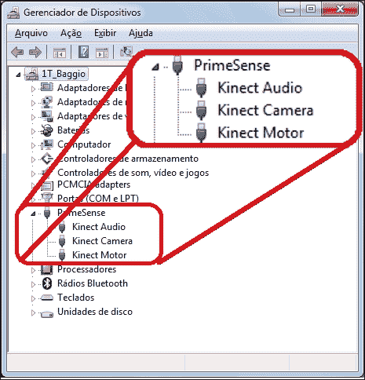

确保所有三个 Kinect 设备——**音频**、**摄像头**和**电机**——都显示正确。

### 注意

可能发生的一个注意事项是，如果用户忘记为 XBox 360 Kinect 设备连接电源，则可能只有**Kinect 电机**会显示，因为它们没有足够的能量。此外，你将无法在 OpenCV 应用程序中检索帧。请记住连接电源，你应该会没事的。

### OpenCV Kinect 支持

在确保 OpenNI 和 Kinect 驱动程序已经正确安装后，你需要检查 OpenCV 的 Kinect 支持。幸运的是，OpenCV 提供了一个非常有用的函数来检查这一点。它被称为`Core.getBuildInformation()`。这个函数显示了在 OpenCV 编译期间启用的哪些选项的重要信息。为了检查 Kinect 支持，只需使用`System.out.println(Core.getBuildInformation());`将此函数的输出打印到控制台，并查找类似于以下内容的视频 I/O 部分：

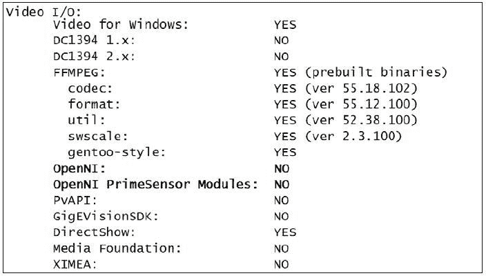

这意味着 OpenNI 和 Kinect 支持尚未启用。

1.  现在，根据第一章 *为 Java 设置 OpenCV*，而不是输入：

    ```py
    cmake -DBUILD_SHARED_LIBS=OFF ..

    ```

    记得添加`WITH_OPENNI`标志，如下代码行所示：

    ```py
    cmake -DBUILD_SHARED_LIBS=OFF .. -D WITH_OPENNI
    ```

    使用 CMake 的 GUI 时，不要使用前面的代码，确保勾选这个选项。检查输出是否类似于以下截图：

    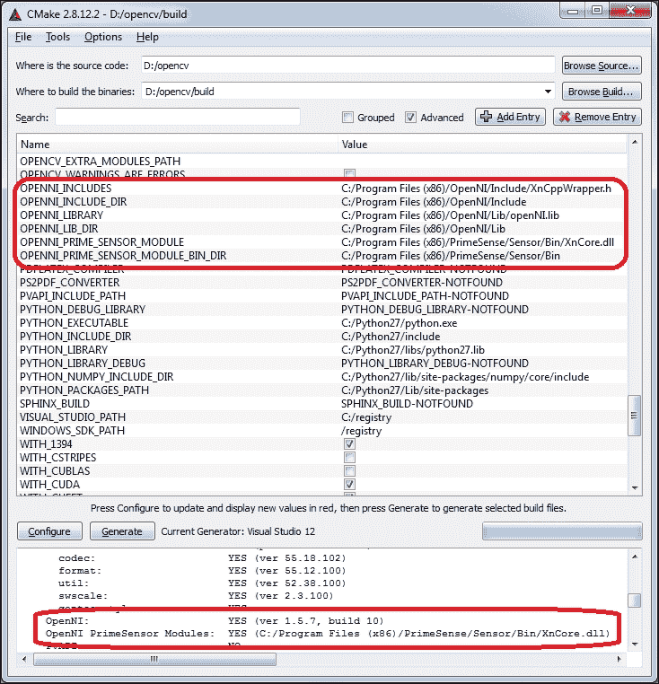

    确保将 OPENNI 路径指向你的 OpenNI 正确安装文件夹。重新构建库，现在你的`opencv_java247.dll`将带有 Kinect 支持构建。

1.  现在再次尝试检查你的`Core.getBuildInformation()`。OpenNI 的可用性将在你的 Java 控制台中显示，如下所示：

    ```py
      Video I/O:
        Video for Windows:           YES
        DC1394 1.x:                  NO
        DC1394 2.x:                  NO
        FFMPEG:                      YES (prebuilt binaries)
          codec:                     YES (ver 55.18.102)
          format:                    YES (ver 55.12.100)
          util:                      YES (ver 52.38.100)
          swscale:                   YES (ver 2.3.100)
          gentoo-style:              YES
     OpenNI:                      YES (ver 1.5.7, build 10)
     OpenNI PrimeSensor Modules:  YES (C:/Program Files (x86)/PrimeSense/Sensor/Bin/XnCore.dll)
        PvAPI:                       NO
        GigEVisionSDK:               NO
        DirectShow:                  YES
        Media Foundation:            NO
        XIMEA:                       NO
    ```

另一种方法是使用我们配置的 Maven 仓库。我们已经将运行时依赖项添加到本书的 Maven 仓库中，仅适用于 Windows x86，配置非常简单。只需遵循第一章 *为 Java 设置 OpenCV* 中的 Java OpenCV Maven 配置部分，然后，在添加普通 OpenCV 依赖项`opencvjar-runtime`而不是添加依赖项时，使用以下依赖项：

```py
<dependency>
  <groupId>org.javaopencvbook</groupId>
  <artifactId>opencvjar-kinect-runtime</artifactId>
  <version>2.4.7</version>
  <classifier>natives-windows-x86</classifier>
</dependency>
```

完整的 POM 文件可以在本章的 Kinect 项目源代码中找到。

确保你检查了一些注意事项，例如不要混合 32 位和 64 位的驱动程序和库，以及 Java 运行时。如果是这种情况，你可能收到“**在 AMD 64 位平台上无法加载 IA 32 位.dll**”的错误信息，例如。另一个问题来源是忘记为 Kinect XBox 360 连接电源，这将导致它只能加载 Kinect 电机。

现在我们确认 OpenNI 和 Kinect 驱动程序已经正确安装，以及 OpenCV 的 OpenNI 支持，我们就可以继续到下一节了。

## Kinect 深度应用

该应用程序专注于 Kinect 的深度感应信息以及 OpenCV API 的 OpenNI 深度传感器，这意味着它不会涵盖一些知名的 Kinect 功能，如骨骼追踪（在头部、脊椎中心、肩膀、手腕、手、膝盖、脚等重要身体部位放置节点）、手势追踪、麦克风录音或倾斜设备。尽管我们只涉及深度感应，但这却是 Kinect 最神奇的功能之一。

该应用程序背后的基本思想是从深度信息中分割图像，并将其与背景图像结合。我们将从 Kinect 设备捕获 RGB 帧并检索其深度图。通过滑块，你可以选择你想要的分割深度。基于此，通过简单的阈值生成掩码。现在，结合 RGB 帧和深度用于叠加背景图像，产生类似于色键合成的效果，当然，不需要绿色屏幕背景。这个过程可以在以下屏幕截图中看到：

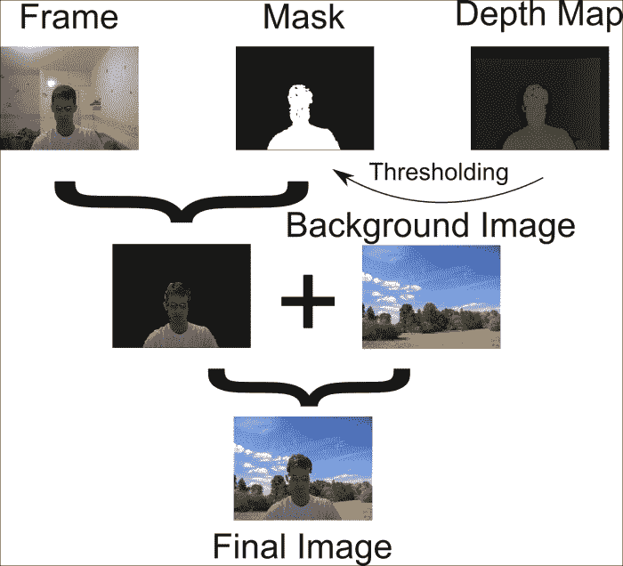

我们应该注意到，在 OpenCV 2.4.7 版本中，Java API 不支持 Kinect 深度感应，但这建立在`VideoCapture`之上，因此只需要对常量进行一些小的修改。为了简单起见，这些常量位于主`App`类中，但它们应该重构为一个只处理 OpenNI 常量的类。请查找本章中的项目`kinect`以检查源代码。

为了处理深度感应图像，我们需要遵循以下简单指南：

```py
VideoCapture capture = new VideoCapture(CV_CAP_OPENNI);
capture.grab();
capture.retrieve( depthMap,  CV_CAP_OPENNI_DEPTH_MAP);
capture.retrieve(colorImage, CV_CAP_OPENNI_BGR_IMAGE);
```

我们将使用与第二章中相同，即*处理矩阵、文件、摄像头和 GUI*所使用的`VideoCapture`类，用于摄像头输入，具有相同的接口，传递常量`CV_CAP_OPENNI`来告诉它从 Kinect 检索帧。这里的区别在于，我们不会使用`read`方法，而是将获取帧的步骤拆分，然后分别检索深度图像或捕获的帧。请注意，这是通过首先调用`grab`方法，然后调用`retrieve`方法来完成的，参数为`CV_CAP_OPENNI_DEPTH_MAP`和`CV_CAP_OPENNI_BGR_IMAGE`。确保将它们发送到不同的矩阵中。请注意，所有这些常量都是从 OpenCV 源代码树中的`opencv\modules\highgui\include\opencv2\highgui`路径下的`highgui_c.h`文件中提取的。我们只将与 Kinect 的视差图和 RGB 图像一起工作，但也可以使用`CV_CAP_OPENNI_DEPTH_MAP`常量以毫米为单位接收深度值作为`CV_16UC1`矩阵，或者使用`CV_CAP_OPENNI_POINT_CLOUD_MAP`以`CV_32FC3`矩阵的形式接收点云图，其中值是米为单位的 XYZ 坐标。

我们的主要循环由以下代码组成：

```py
while(true){
  capture.grab();
  capture.retrieve( depthMap, CV_CAP_OPENNI_DISPARITY_MAP);
  disparityImage = depthMap.clone();
  capture.retrieve(colorImage, CV_CAP_OPENNI_BGR_IMAGE);
  workingBackground = resizedBackground.clone();
  Imgproc.threshold(disparityImage, disparityThreshold, gui.getLevel(), 255.0f, Imgproc.THRESH_BINARY);
  maskedImage.setTo(new Scalar(0,0,0));
  colorImage.copyTo(maskedImage,disparityThreshold);
  maskedImage.copyTo(workingBackground,maskedImage);
  renderOutputAccordingToMode(disparityImage, disparityThreshold,
  colorImage, resizedBackground, workingBackground, gui);
}
```

首先，我们调用`grab`方法从 Kinect 获取下一帧。然后，我们检索深度图和彩色图像。因为我们之前已经在`resizedBackground`中加载了我们的背景，所以我们只需将其克隆到`workingBackground`。随后，我们根据滑块级别对差异图像进行阈值处理。这将使远离我们期望深度的像素变黑，而我们仍然想要的像素变白。现在是时候清除我们的掩码并将其与彩色图像组合了。

# 摘要

本章真正涵盖了处理背景去除的几个领域以及由此问题产生的某些细节，例如需要使用连通组件来找到它们的轮廓。首先，确立了背景去除本身的问题。然后，分析了如帧差分这样的简单算法。之后，介绍了更有趣的算法，例如平均背景和**高斯混合**（**MOG**）。

在使用算法处理背景去除问题后，探索了关于连通组件的见解。解释了核心 OpenCV 算法，如`findContours`和`drawContours`。还分析了轮廓的一些属性，例如它们的面积以及凸包。

本章以如何使用 Kinect 的深度传感器设备作为背景去除工具的完整解释结束，针对 OpenCV 2.4.7。在设备设置上的深度指令之后，开发了一个完整的应用程序，使处理深度感应传感器 API 变得清晰。

好吧，现在到了下一章从桌面应用程序跳转到 Web 应用程序的时候了。在那里，我们将介绍如何设置基于 OpenCV 的 Web 应用程序的细节，处理图像上传，并基于 Tomcat Web 服务器创建一个不错的增强现实应用程序。这将很有趣，只是要注意看 Einstein 的截图。
