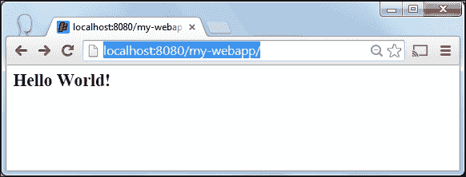
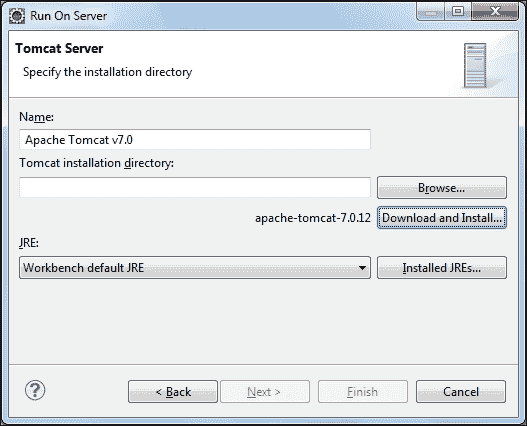
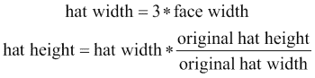
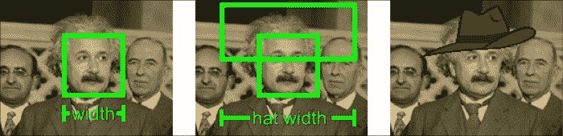
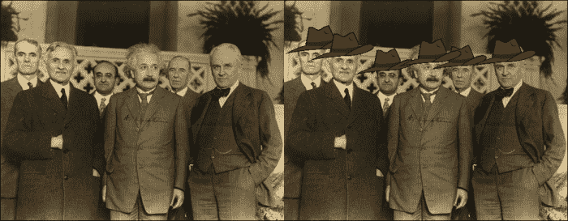

# 第七章：服务器端的 OpenCV

随着互联网越来越互动，一个令人感兴趣的主题是如何处理服务器端的图像处理，以便你可以创建处理 OpenCV 的 Web 应用程序。由于 Java 是开发 Web 应用程序时选择的语言之一，本章展示了整个应用程序的架构，允许用户上传图像，并在检测到的面部上方添加一顶 fedora 帽子，使用的是本书中学到的技术。

在本章中，我们将涵盖以下主题：

+   设置 OpenCV Web 应用程序

+   混合现实

+   图像上传

+   处理 HTTP 请求

到本章结束时，你将了解如何创建一个完整的带有图像处理的 Web 应用程序，从用户那里获取输入，在服务器端处理图像，并将处理后的图像返回给用户。

# 设置 OpenCV Web 应用程序

由于本章涵盖了使用 Java OpenCV 开发 Web 应用程序的开发，因此在转向服务器端时，解决一些差异是很重要的。首先，需要告诉 Web 容器（通常是 Tomcat、Jetty、JBoss 或 Websphere）关于本地库的位置。其他细节涉及加载本地代码。这应该在 Web 服务器启动时立即发生，并且不应再次发生。

使用 Web 架构的优势是显著的。由于某些图像处理任务计算密集，它们可能会在短时间内迅速耗尽设备的电池，因此，将它们转移到云上的更强大的硬件上可以减轻本地处理。此外，用户无需安装除网络浏览器之外的其他任何东西，服务器端发生的更新也非常方便。

另一方面，也有一些缺点。如果，不是在管理员基础设施上托管 Web 应用程序，而是打算在在线 Java 服务器上托管它，那么应该清楚它是否允许运行本地代码。在撰写本文时，Google 的 App Engine 不允许这样做，但很容易在 Amazon EC2 或 Google 的 Compute Engine 上设置一个 Linux 服务器，使其顺利运行，尽管这不会在本书中涵盖。另一件需要考虑的事情是，一些计算机视觉应用程序需要实时运行，例如，以每秒 20 帧的速度，这在 Web 架构中是不切实际的，因为上传时间过长，这类应用程序应该本地运行。

为了创建我们的 Web 应用程序，我们将按照以下步骤进行：

1.  创建一个基于 Maven 的 Web 应用程序。

1.  添加 OpenCV 依赖项。

1.  运行 Web 应用程序。

1.  将项目导入 Eclipse。

在以下章节中，我们将详细说明这些步骤。

## 创建一个基于 Maven 的 Web 应用程序

在 Java 中创建 Web 应用程序有几种方法。Spring MVC、Apache Wicket 和 Play Framework 等都是不错的选择。此外，在这些框架之上，我们可以使用 JavaServer Faces、PrimeFaces 或 RichFaces 作为基于组件的用户界面为这些 Web 应用程序。然而，对于本章，我们不会涉及所有这些技术，而是只使用 servlets 来供你选择框架。你应该注意到，servlet 简单来说是一个用于扩展服务器功能的 Java 类，这通常用于处理或存储通过 HTML 表单提交的数据。servlet API 自 1997 年以来一直存在，因此已被广泛使用，关于它的书籍和示例有很多。尽管本章专注于 Servlet 2.x 以保持简单，但我们仍需意识到 API 是同步的，并且对于将接收多个客户端的应用程序，可能更好的选择是使用异步的 Servlet 3.x。

尽管任何 IDE 都可以通过向导轻松生成 Web 应用程序——例如，在 Eclipse 中导航到 **文件** | **新建** | **项目…** | **Web** | **动态 Web 项目**——但我们将专注于使用 Maven 来启动它，因为我们可以轻松获取原生依赖项。只要它根据 第一章 中的说明正确安装，Maven 就可以通过使用原型来设置 Web 应用程序。这是通过以下命令实现的：

```py
mvn archetype:generate -DgroupId=com.mycompany.app -DartifactId=my-webapp -DarchetypeArtifactId=maven-archetype-webapp -DinteractiveMode=false

```

此命令将从 `archetype` 插件调用 `generate` 目标。将 `archetype` 视为一个项目模板。这个 Maven 插件将根据我们通过 `-DarchetypeArtifactId=maven-archetype-webapp` 选项设置的 `archetypeArtifactId` 为 `maven-archetype-webapp` 从模板生成一个 Web 应用程序。另一个选项 `DartifactId=my-webapp` 将简单地设置 Web 应用程序的文件夹名称，如该选项中定义的那样，而 `groupId` 是 Maven 为项目提供的通用唯一标识符。

注意以下结构将被创建：


前面是一个 Web 应用的简单结构。你应该注意 `web.xml` 文件，它用于映射 servlets，以及 `index.jsp`，这是一个简单的 Java 服务器页面文件。到目前为止，你应该能够轻松地在 Tomcat 等服务器上运行这个 Web 应用程序。只需输入以下命令：

```py
cd my-webapp
mvn tomcat:run

```

现在，如果你访问地址 `http://localhost:8080/my-webapp/`，浏览器中应该看到以下响应：



注意，这意味着我们已经成功创建了一个 Web 项目，我们正在通过 Tomcat Web 容器运行它，并且它可以通过 `localhost` 服务器，在端口 `8080`，通过名称 `my-webapp` 访问。您可以在 `index.jsp` 中看到 `Hello World!` 消息。在下一节中，您将自定义 `pom` 文件以添加 OpenCV 依赖项。

## 添加 OpenCV 依赖项

由于 Web 应用程序存档已经为我们创建了一个项目结构，我们将为生成的 `pom.xml` 添加 OpenCV 依赖项。如果您打开它，您将看到以下代码：

```py
<project  
  xsi:schemaLocation="http://maven.apache.org/POM/4.0.0 http://maven.apache.org/maven-v4_0_0.xsd">
  <modelVersion>4.0.0</modelVersion>
  <groupId>com.mycompany.app</groupId>
  <artifactId>my-webapp</artifactId>
  <packaging>war</packaging>
  <version>1.0-SNAPSHOT</version>
  <name>my-webapp Maven Webapp</name>
  <url>http://maven.apache.org</url>
  <dependencies>
 <dependency>
 <groupId>junit</groupId>
 <artifactId>junit</artifactId>
 <version>3.8.1</version>
 <scope>test</scope>
 </dependency>
 </dependencies>
  <build>
    <finalName>my-webapp</finalName>
  </build>
</project>
```

注意，唯一的依赖项是 `junit`。现在将以下内容添加到依赖项标签中：

```py
<dependency>
  <groupId>org.javaopencvbook</groupId>
  <artifactId>opencvjar</artifactId>
  <version>3.0.0</version>
</dependency>

<dependency>
  <groupId>org.javaopencvbook</groupId>
  <artifactId>opencvjar-runtime</artifactId>
  <version>3.0.0</version>
  <classifier>natives-windows-x86</classifier>
</dependency>

<dependency>
  <groupId>javax.servlet</groupId>
  <artifactId>javax.servlet-api</artifactId>
  <version>3.0.1</version>
  <scope>provided</scope>
</dependency>
```

前两个依赖项，`opencvjar` 和 `opencvjar-runtime`，与在第一章中讨论的相同，即*为 Java 设置 OpenCV*。现在，对 `javax.servlet-api` 的依赖指的是 3.0.1 版本的 servlet API，它用于使文件上传更加容易。除了使用这些依赖项之外，所有其他配置都在第一章中提到，*为 Java 设置 OpenCV*，例如添加 `JavaOpenCVBook` 仓库、`maven-jar-plugin`、`maven-dependency-plugin` 和 `maven-nativedependencies-plugin`。

唯一的新插件是 `tomcat7`，因为我们需要使用来自 `servlet 3.0` 的文件上传 API。为了添加 `tomcat7` 插件，在 `pom.xml` 中查找 `<plugins>` 部分，并添加以下代码：

```py
<plugin>
  <groupId>org.apache.tomcat.maven</groupId>
  <artifactId>tomcat7-maven-plugin</artifactId>
  <version>2.2</version>
  <configuration>
    <port>9090</port>
    <path>/</path>
  </configuration>
</plugin>
```

除了能够从 Maven 运行 `tomcat7` 之外，它还将配置端口 `9090` 作为我们服务器的默认端口，但您可以使用另一个端口。最终的 `pom.xml` 文件可以在本章的源代码项目中找到。运行 `mvn package` 命令将显示项目设置一切正常。在下一节中，我们将通过从 `.jsp` 文件中的简单 OpenCV 调用检查所有过程。

## 运行 Web 应用程序

现在所有依赖项都已设置，运行我们的 Web 应用程序应该很简单。但有一个细节需要注意。由于我们的应用程序依赖于本地代码，即 `opencv_java300.dll` 文件或共享对象，我们应该在运行 Tomcat 服务器之前将其放在 Java 库路径中。根据您的部署策略，有几种方法可以做到这一点，但一种简单的方法是通过 `MAVEN_OPTS` 环境变量设置路径。您应该在终端中输入以下命令：

```py
set MAVEN_OPTS=-Djava.library.path=D:/your_path/my-webapp/target/natives

```

请记住将 `your_path` 更改为您设置项目的地方，即 `my-webapp` 的父文件夹。为了检查应用程序服务器是否可以正确加载 OpenCV 本地库，我们将设置一个简单的 servlet，该 servlet 能够输出正确的已安装版本。将您在 `my-webapp\src\main\webapp` 文件夹中生成的 `index.jsp` 文件更改为以下代码：

```py
<html>
  <body>
    <h2>OpenCV Webapp Working!</h2>
    <%@ page import = "org.opencv.core.Core" %>
    Core.VERSION: <%= Core.VERSION %>
  </body>
</html>
```

现在，通过输入 `mvn tomcat7:run` 运行您的服务器。尝试在您的网页浏览器中加载您的应用程序，地址为 `http://localhost:9090`，您应该会看到输出您加载的 OpenCV 版本的页面。尽管这段代码实际上并没有加载本地库，因为 `Core.VERSION` 可以从纯 Java JAR 中检索，但将业务代码（真正进行图像处理的代码）与表示代码（我们刚刚编辑的 Java 服务器页面）混合在一起并不是一个好的做法。为了处理图像处理，我们将集中代码在一个只处理它的 servlet 中。

## 将项目导入到 Eclipse

现在项目已经使用 Maven 设置好了，将其导入到 Eclipse 应该很容易。只需发出以下 Maven 命令：

```py
mvn eclipse:eclipse -Dwtpversion=2.0

```

记得添加 `-Dwtpversion=2.0` 标志以支持 WTP 版本 2.0，这是 Eclipse 的 Web 工具平台。如果您没有按照 第一章 中所述设置 `M2_REPO`，有一个简单的技巧可以自动完成它。输入以下命令：

```py
mvn -Declipse.workspace="YOUR_WORKSPACE_PATH" eclipse:configure-workspace

```

如果您的 Eclipse 工作区位于 `C:\Users\baggio\workspace`，则应将 `YOUR_WORKSPACE_PATH` 路径更改为类似 `C:\Users\baggio\workspace` 的路径。

在 Eclipse 中，通过 **File** | **Import** | **General** | **Existing Projects** 导航到工作区，并指向您的 `my-webapp` 文件夹。请注意，您的 Eclipse 应该有 WTP 支持。如果您收到 "Java compiler level does not match the version of the installed Java project facet" 信息，只需右键单击它，然后在 **Quick Fix** 菜单中选择 **Change Java Project Facet version to Java 1.8**。现在您可以通过右键单击项目，导航到 **Run as** | **Run on Server**，选择 **Apache** | **Tomcat v7.0 Server**，然后点击 **Next** 来运行它。如果您没有现有的 Tomcat 7 安装，请选择 **Download and Install**，如下一张截图所示：



选择一个文件夹用于您的 Tomcat7 安装，然后点击 **Next** 和 **Finish**。现在，您可以直接从 Eclipse 运行您的应用程序，通过在您的项目上右键单击并选择 **Run as** | **Run on Server**。如果您收到 "java.lang.UnsatisfiedLinkError: no opencv_java300 in java.library.path" 错误，请右键单击您的项目，选择 "Run As ->Run Configurations..."，然后在 Arguments 选项卡中，在 VM arguments 文本框中添加 `-Djava.library.path="C:\path_to_your\target\natives"`。点击 "Apply"，然后通过转到 Server 选项卡并右键单击您的 Tomcat7 执行 -> Restart 来重启您的服务器。

# 混合现实网络应用程序

我们将要开发的一个网络应用程序将在给定图像中检测到的头部上方绘制费德里亚帽。为了做到这一点，用户通过一个简单的表单上传图片，然后它在内存中转换为 OpenCV 矩阵。转换后，在矩阵上运行一个寻找脸部的级联分类器。应用简单的缩放和平移来估计帽子的位置和大小。然后在每个检测到的脸部指定位置绘制一个透明的费德里亚帽图像。然后通过将混合现实图片提供给用户，通过 HTTP 返回结果。请注意，所有处理都在服务器端进行，因此客户端只需上传和下载图片，这对于依赖电池的客户端非常有用，例如智能手机。

### 注意

*混合现实（MR），有时也称为混合现实（包括增强现实和增强虚拟性），是指现实世界和虚拟世界的融合，产生新的环境和可视化，其中物理对象和数字对象在实时共存和交互。它不仅仅发生在物理世界或虚拟世界中，而是现实和虚拟的混合，包括增强现实和增强虚拟性。*

*来源：Fleischmann, Monika; Strauss, Wolfgang (eds.) (2001). "CAST01//Living in Mixed Realities" 国际会议关于艺术、科学和技术传播的论文集，弗劳恩霍夫 IMK 2001，第 401 页。ISSN 1618–1379（印刷版），ISSN 1618–1387（网络版）。*

这个网络应用程序可以分解为几个更简单的步骤：

1.  图片上传。

1.  图片处理。

1.  响应图片。

以下部分将详细说明这些步骤。

## 图片上传

首先，我们将把我们的模拟 Java 服务器页面转换成一个需要用户选择本地文件的表单，类似于以下截图所示：


以下代码显示了完整的 Java 服务器页面。注意表单元素，它表明它将在 servlet 的`doPost`部分调用`post`方法，并要求网络服务器接受表单中包含的数据以进行存储。`enctype= "multipart/form-data"`表示不会对字符进行编码，正如在`"text/plain"`加密类型中可以看到的，它将空格转换为`+`符号。另一个重要属性是`action="upload"`。它确保表单中编码的数据被发送到"`/upload`" URL。类型为"file"的输入元素简单地作为对操作系统文件对话框的调用，该对话框弹出并允许用户指定文件位置。最后，当按钮被点击时，类型为"submit"的输入元素处理带有表单数据的请求发送：

```py
<%@ page language="java" contentType="text/html; charset=ISO-8859-1"
    pageEncoding="ISO-8859-1"%>
<!DOCTYPE html PUBLIC "-//W3C//DTD HTML 4.01 Transitional//EN"
    "http://www.w3.org/TR/html4/loose.dtd">
<html>
<head>
<meta http-equiv="Content-Type" content="text/html; charset=ISO-8859-1">
<title>File Upload</title>
</head>
<body>
<center>
    <h1>File Upload</h1>
    <form method="post" action="upload"
        enctype="multipart/form-data">
        Select file to upload: <input type="file" name="file" size="60" /><br />
        <br /> <input type="submit" value="Upload" />
    </form>
</center>
</body>
</html>
```

当按下**提交**按钮时，一个字节流被发送到服务器，服务器将它们转发到名为`Upload`的 servlet。请注意，从`/upload` URL 映射到`Upload` servlet 的操作发生在`/src/main/webapp/WEB-INF/web.xml`文件中，如下所示：

```py
<web-app>
  <servlet>
    <servlet-name>Upload</servlet-name>
    <servlet-class>org.javaopencvbook.webapp.UploadServlet</servlet-class>
  </servlet>
  <servlet-mapping>
    <servlet-name>Upload</servlet-name>
    <url-pattern>/upload</url-pattern>
  </servlet-mapping>
</web-app>
```

注意，当用户从表单中点击**提交**按钮时，映射的 servlet 类`UploadServlet`的`doPost`方法被调用。这个方法是这个 Web 应用的核心，我们将在下面的代码中详细查看它：

```py
@Override
protected void doPost(HttpServletRequest request, HttpServletResponse response)
throws ServletException, IOException {
  System.loadLibrary(Core.NATIVE_LIBRARY_NAME);

  loadCascade();

  Mat image = receiveImage(request);
  Mat overlay = loadOverlayImage();
  detectFaceAndDrawHat(image, overlay);
  writeResponse(response, image);
}
```

在`doPost`方法中的主要操作首先是通过加载 OpenCV 库开始的，正如前几章所看到的，然后加载稍后用于人脸检测的级联分类器。为了简洁起见，初始化在这里进行，但在实际代码中，你应该使用`ServletContextListener`来初始化它。然后，`receiveImage`方法处理从上传接收字节并将其转换为 OpenCV 矩阵。因此，其他方法负责加载费多拉帽子的图像并检测人脸，以便可以通过`detectFaceAndDrawHat`方法绘制叠加图像。最后，`writeResponse`方法响应请求。我们将在下面的代码中更详细地介绍`receiveImage`：

```py
private Mat receiveImage(HttpServletRequest request) throws IOException, ServletException {
  byte[] encodedImage = receiveImageBytes(request);
  return convertBytesToMatrix(encodedImage);
}
```

注意，`receiveImage`只是从上传请求的`receiveImageBytes`中抓取字节，然后将其转换为矩阵。以下是`receiveImageBytes`的代码：

```py
private byte[] receiveImageBytes(HttpServletRequest request)
throws IOException, ServletException {
  InputStream is = (InputStream) request.getPart("file").getInputStream();
  BufferedInputStream bin = new BufferedInputStream(is);  
  ByteArrayOutputStream buffer = new ByteArrayOutputStream();  
  int ch =0;
  while((ch=bin.read())!=-1) {  
    buffer.write(ch);  
  }  
  buffer.flush();
  bin.close();  
  byte[] encodedImage = buffer.toByteArray();
  return encodedImage;
}
```

这是接收上传的默认代码。它从表单的"文件"字段中访问，并通过`request.getPart("file").getInputStream()`获取其流。然后创建一个缓冲区，只要上传中有数据，所有来自输入流的数据都通过`write()`方法写入。然后，通过`ByteArrayOutputStream`类的`toByteArray()`方法返回字节数组。由于此时我们接收到的只是一堆字节，因此需要解码图像格式并将其转换为 OpenCV 矩阵。幸运的是，已经有一个方法可以做到这一点，即来自`Imgcodecs`包的`imdecode`方法，其签名如下：

```py
public static Mat imdecode(Mat buf, int flags)
```

`buf`参数是一个`Mat`缓冲区，我们将从字节数组中创建它，而`flags`是一个选项，用于将返回的`Mat`缓冲区转换为灰度或彩色，例如。

解码的完整代码可以在以下行中看到：

```py
private Mat convertBytesToMatrix(byte[] encodedImage) {
  Mat encodedMat = new Mat(encodedImage.length,1,CvType.CV_8U);
  encodedMat.put(0, 0,encodedImage);
  Mat image = Imgcodecs.imdecode(encodedMat, Imgcodecs.CV_LOAD_IMAGE_ANYCOLOR);
  return image;
}
```

现在已经完成了，我们已经接收到了用户的图像上传，并且它已被转换为我们的熟知的`Mat`类。现在是时候创建混合现实了。

# 图像处理

在本节中，我们将描述如何处理接收到的图像，以便在其上方绘制图像文件。现在，级联分类器就像在上一章中一样运行。注意 XML 级联文件的位置很重要。在整个代码中，我们使用了一个名为`getResourcePath`的辅助函数，并且我们使用了将所有资源存储在`src/main/resources/`文件夹中的约定。这样，辅助函数的工作方式类似于以下代码：

```py
private String getResourcePath(String path) {
  String absoluteFileName = getClass().getResource(path).getPath();
  absoluteFileName = absoluteFileName.replaceFirst("/", "");
  return absoluteFileName;
}
```

使用此函数，可以通过以下调用加载级联：

```py
private void loadCascade() {
  String cascadePath = getResourcePath("/cascades/lbpcascade_frontalface.xml");
  faceDetector = new CascadeClassifier(cascadePath);
}
```

在级联被正确加载后，我们一切准备就绪，现在是时候解释如何估计帽子的位置了。当运行人脸分类器时，我们不仅对脸的位置有很好的了解，而且对脸的边界矩形也有很好的了解。我们将使用这个宽度来估计帽子的宽度。我们可以假设帽子的宽度将是脸的边界矩形宽度的三倍。这样，我们仍然需要保持帽子的宽高比。这是通过一个简单的三比规则来实现的，如下所示：



现在虚拟帽子的尺寸已经定义，我们仍然需要估计其位置。从一些测试中，我们可以推断出，对于大多数图片来说，在脸的边界矩形上方 60%的位置应该是合适的。现在，我们有了帽子的尺寸和位置。最后，我们不再使用帽子的宽度是脸宽度的三倍，而是使用 2.3 倍脸宽度的值似乎效果更好。以下代码显示了在`detectFaceAndDrawHat`方法中设置**感兴趣区域**（**ROI**）以绘制礼帽所使用的数学方法。当帽子尺寸超出边界时，对其进行简单调整。

```py
double hatGrowthFactor = 2.3;
int hatWidth = (int) (rect.width *hatGrowthFactor);
int hatHeight = (int) (hatWidth * overlay.height() / overlay.width());
int roiX =  rect.x - (hatWidth-rect.width)/2;
int roiY =  (int) (rect.y  - 0.6*hatHeight);
roiX =  roiX<0 ? 0 : roiX;
roiY = roiY< 0? 0 :roiY;
hatWidth = hatWidth+roiX > image.width() ? image.width() -roiX : hatWidth;

hatHeight = hatHeight+roiY > image.height() ? image.height() - roiY : hatHeight;
```

以下截图为我们提供了宽度和绘制礼帽叠加过程的概述：



是时候画帽子了！这应该就像在图片中找到帽子的位置并复制子矩阵一样简单。不过，我们需要小心，确保正确地绘制透明像素，不要超出图片范围。Mat 的`copyTo`方法用于将子矩阵复制到另一个矩阵中。此方法还接受一个掩码 Mat 参数，其中非零元素指示必须复制的矩阵元素。请注意，帽子图像本身被作为掩码参数传递，并且它实际上工作得很好，因为所有透明像素在所有通道中都变为零，而所有其他像素都将具有某些值，就像一个掩码一样。调整礼帽大小并将其复制到主图像的代码如下：

```py
Mat resized = new Mat();
Size size = new Size(hatWidth,hatHeight);
Imgproc.resize(overlay,resized, size);
Mat destinationROI = image.submat( roi );
resized.copyTo( destinationROI , resized);
```

## 响应图像

我们已经成功接收到了一张图像，并在识别到的面部上绘制了帽子。现在，是时候将结果发送回用户了。我们通过将响应的内容类型设置为`image/jpeg`（例如）来完成这项工作。然后我们使用在头部中定义的相同格式来编码我们的响应——如果它是 jpeg，我们将使用 JPEG 进行编码——并将字节写入我们的响应 servlet 对象：

```py
private void writeResponse(HttpServletResponse response, Mat image) throws IOException {
  MatOfByte outBuffer = new MatOfByte();
  Imgcodecs.imencode(".jpg", image, outBuffer);

  response.setContentType("image/jpeg");
  ServletOutputStream out;  
  out = response.getOutputStream();
  out.write(outBuffer.toArray());
}
```

输入图像和输出结果如下截图所示。在我们的增强现实网络应用程序中，一些费多拉帽被分配给了爱因斯坦和他的朋友们。左侧的照片是上传的图像，而右侧的照片显示了在检测到的面部上绘制的帽子。根据我们的循环，帽子的绘制顺序与检测到的面部的返回顺序相同。这样，我们无法保证正确的 Z 顺序，即帽子绘制在另一个帽子之上，尽管我们可以尝试从面部大小中推断它。以下图片展示了这一点：



[阿尔伯特·爱因斯坦 1921 年诺贝尔物理学奖获奖照片](http://www.nobelprize.org/nobel_prizes/physics/laureates/1921/einstein-photo.html)

# 摘要

在本章中，我们将我们的计算机视觉应用程序发送到了服务器端的世界。我们开始介绍使用 Maven 配置简单 servlet 基于的 Web 应用程序的基础，它为我们提供了一个通用应用程序结构。然后我们将 OpenCV 依赖项添加到我们的`pom.xml`配置文件中，就像在标准的 OpenCV 桌面应用程序中使用的那样。然后我们检查了其他运行时配置，因为我们使用 Maven 部署了我们的 Web 服务器。

在解决了每个 Web 应用程序配置方面的问题后，我们继续开发我们的混合现实应用程序，该应用程序探讨了图像上传的细节，将其转换为 OpenCV Mat 对象，然后向客户端发送处理后的图像的响应。

看起来，创建基本计算机视觉应用的各个方面都已经涵盖了。我们处理了为 Java 设置 OpenCV，然后学习了如何处理矩阵。然后我们接触到了创建 Java Swing 桌面应用程序的基础，并使用图像处理算法进行过滤、改变图像形态和进行基本阈值处理。你还学习了每个计算机视觉研究人员工具箱中的工具，例如霍夫变换来寻找线和圆以及特殊的核卷积。我们还涵盖了重要的傅里叶变换和变换操作。然后我们深入到机器学习，并使用了方便的 OpenCV 级联，你还学习了如何创建新的对象分类器。除此之外，我们还研究了某些背景移除方法，并测试了令人难以置信的 Kinect 设备以执行基于深度的处理。最后，我们用完整的服务器端示例完成了这本书，现在，你可以为你的计算机视觉项目信赖 Java 了！
