# 第一章：与过滤器一起玩乐

本章的目标是开发一系列图像处理过滤器，并将它们实时应用于网络摄像头的视频流中。这些过滤器将依赖于各种 OpenCV 函数，通过分割、合并、算术运算和应用查找表来操作矩阵。

我们将介绍以下三种效果，这将帮助您熟悉 OpenCV，并在本书的后续章节中构建这些效果：

+   **暖色和冷色过滤器**: 我们将使用查找表实现自己的**曲线过滤器**。

+   **黑白铅笔素描**: 我们将利用两种图像混合技术，称为** dodging**和** burning**。

+   **卡通化工具**: 我们将结合双边滤波器、中值滤波器和自适应阈值。

OpenCV 是一个高级工具链。它经常引发这样的问题，即，不是如何从头开始实现某物，而是为您的需求选择哪个预定义的实现。如果您有大量的计算资源，生成复杂效果并不难。挑战通常在于找到一个既能完成任务又能按时完成的方法。

我们不会通过理论课程教授图像处理的基本概念，而是将采取一种实用方法，开发一个单一端到端的应用程序，该程序集成了多种图像过滤技术。我们将应用我们的理论知识，得出一个不仅有效而且能加快看似复杂效果解决方案，以便笔记本电脑可以实时生成它们。

在本章中，您将学习如何使用 OpenCV 完成以下操作：

+   创建黑白铅笔素描

+   应用铅笔素描变换

+   生成暖色和冷色过滤器

+   图像卡通化

+   将所有内容整合在一起

学习这一点将使您熟悉将图像加载到 OpenCV 中，并使用 OpenCV 对这些图像应用不同的变换。本章将帮助您了解 OpenCV 的基本操作，这样我们就可以专注于以下章节中算法的内部结构。

现在，让我们看看如何让一切运行起来。

# 开始学习

本书中的所有代码都是针对**OpenCV 4.2**编写的，并在**Ubuntu 18.04**上进行了测试。在整个本书中，我们将广泛使用`NumPy`包([`www.numpy.org`](http://www.numpy.org))。

此外，本章还需要`SciPy`包的`UnivariateSpline`模块([`www.scipy.org`](http://www.scipy.org))和**wxPython 4.0** **图形用户界面** (**GUI**) ([`www.wxpython.org/download.php`](http://www.wxpython.org/download.php))用于跨平台 GUI 应用程序。我们将尽可能避免进一步的依赖。

对于更多书籍级别的依赖项，请参阅附录 A *分析和加速您的应用程序*（Appendix A）和附录 B *设置 Docker 容器*（Appendix B）。

您可以在我们的 GitHub 仓库中找到本章中展示的代码：[`github.com/PacktPublishing/OpenCV-4-with-Python-Blueprints-Second-Edition/tree/master/chapter1`](https://github.com/PacktPublishing/OpenCV-4-with-Python-Blueprints-Second-Edition/tree/master/chapter1)。

让我们从规划本章将要创建的应用程序开始。

# 规划应用程序

最终的应用程序必须包含以下模块和脚本：

+   `wx_gui.py`: 这个模块是我们使用 `wxpython` 实现的基本 GUI，我们将在整本书中广泛使用这个文件。此模块包括以下布局：

    +   `wx_gui.BaseLayout`: 这是一个通用布局类，可以从中构建更复杂的布局。

+   `chapter1.py`: 这是本章的主要脚本。它包含以下函数和类：

    +   `chapter1.FilterLayout`: 这是一个基于 `wx_gui.BaseLayout` 的自定义布局，它显示摄像头视频流和一排单选按钮，用户可以通过这些按钮从可用的图像过滤器中选择要应用于摄像头视频流每一帧的过滤器。

    +   `chapter1.main`: 这是启动 GUI 应用程序和访问摄像头的主体函数。

+   `tools.py`: 这是一个 Python 模块，包含我们在本章中使用的许多辅助函数，您也可以将其用于您的项目。

下一节将演示如何创建黑白铅笔素描。

# 创建黑白铅笔素描

为了获得摄像头帧的铅笔素描（即黑白绘画），我们将使用两种图像混合技术，称为 ** dodging** 和 **burning**。这些术语指的是在传统摄影打印过程中采用的技术；在这里，摄影师会操纵暗室打印的某个区域的曝光时间，以使其变亮或变暗。Dodging *使图像变亮*，而 burning *使图像变暗*。未打算发生变化的区域使用 **mask** 进行保护。

今天，现代图像编辑程序，如 **Photoshop** 和 **Gimp**，提供了在数字图像中模仿这些效果的方法。例如，蒙版仍然用于模仿改变图像曝光时间的效果，其中蒙版中相对强烈的值会 *曝光* 图像，从而使图像变亮。OpenCV 没有提供原生的函数来实现这些技术；然而，通过一点洞察力和几个技巧，我们将达到我们自己的高效实现，可用于产生美丽的铅笔素描效果。

如果您在网上搜索，可能会遇到以下常见程序，用于从 **RGB**（**红色**、**绿色**和**蓝色**）彩色图像中实现铅笔素描：

1.  首先，将彩色图像转换为灰度图像。

1.  然后，将灰度图像反转以得到负片。

1.  对步骤 2 中的负片应用 **高斯模糊**。

1.  使用 **颜色 dodging** 将步骤 1 中的灰度图像与步骤 3 中的模糊负片混合。

虽然 *步骤 1* 到 *3* 很直接，但 *步骤 4* 可能有点棘手。让我们首先解决这个难题。

OpenCV 3 直接提供了铅笔素描效果。`cv2.pencilSketch` 函数使用了 2011 年论文中引入的领域滤波器，该论文为 *Domain Transform for Edge-Aware Image and Video Processing*，作者是 Eduardo Gastal 和 Manuel Oliveira。然而，为了本书的目的，我们将开发自己的滤波器。

下一节将向您展示如何在 OpenCV 中实现 dodging 和 burning。

# 理解使用 dodging 和 burning 技术的方法

Dodging 减少了图像中我们希望变亮（相对于之前）的区域的曝光度，`A`。在图像处理中，我们通常使用蒙版选择或指定需要更改的图像区域。蒙版 `B` 是一个与图像相同维度的数组，可以在其上应用（将其想象成一张带有孔的纸，用于覆盖图像）。纸张上的“孔”用 `255`（或如果我们工作在 0-1 范围内则为 1）表示，在不透明的区域用零表示。

在现代图像编辑工具中，例如 Photoshop，图像 `A` 与蒙版 `B` 的颜色 dodging 是通过以下三元语句实现的，该语句对每个像素使用索引 `i` 进行操作：

```py
((B[i] == 255) ? B[i] : 
    min(255, ((A[i] << 8) / (255 - B[i]))))
```

之前的代码本质上是将 `A[i]` 图像像素的值除以 `B[i]` 蒙版像素值的倒数（这些值在 `0`-`255` 范围内），同时确保结果像素值在 (0, 255) 范围内，并且我们不会除以 0。

我们可以将之前看起来复杂的表达式或代码翻译成以下简单的 Python 函数，该函数接受两个 OpenCV 矩阵（`image` 和 `mask`）并返回混合图像：

```py
def dodge_naive(image, mask):
    # determine the shape of the input image
    width, height = image.shape[:2]

    # prepare output argument with same size as image
    blend = np.zeros((width, height), np.uint8)

    for c in range(width):
        for r in range(height):

            # shift image pixel value by 8 bits
            # divide by the inverse of the mask
            result = (image[c, r] << 8) / (255 - mask[c, r])

            # make sure resulting value stays within bounds
            blend[c, r] = min(255, result)
    return blend
```

如你所猜，尽管之前的代码可能在功能上是正确的，但它无疑会非常慢。首先，该函数使用了 `for` 循环，这在 Python 中几乎总是不是一个好主意。其次，NumPy 数组（Python 中 OpenCV 图像的底层格式）针对数组计算进行了优化，因此单独访问和修改每个 `image[c, r]` 像素将会非常慢。

相反，我们应该意识到 `<<8` 操作与将像素值乘以数字 **2⁸**（**=256**）相同，并且可以使用 `cv2.divide` 函数实现像素级的除法。因此，我们的 `dodge` 函数的改进版本利用了矩阵乘法（这更快），看起来如下：

```py
import cv2 

def dodge(image, mask): 
    return cv2.divide(image, 255 - mask, scale=256) 
```

在这里，我们将`dodge`函数简化为单行！新的`dodge`函数产生的结果与`dodge_naive`相同，但比原始版本快得多。此外，`cv2.divide`会自动处理除以零的情况，当`255 - mask`为零时，结果为零。

这里是`Lena.png`的一个 dodged 版本，其中我们在像素范围（100:300, 100:300**）**的方块中进行了 dodging：

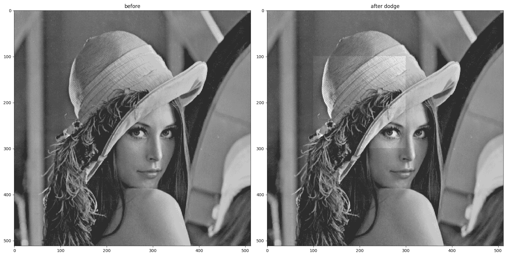

图片来源——“Lenna”由 Conor Lawless 提供，许可协议为 CC BY 2.0

如您所见，在右侧的照片中，亮化区域非常明显，因为过渡非常尖锐。有方法可以纠正这一点，我们将在下一节中探讨其中一种方法。

让我们学习如何使用二维卷积来获得高斯模糊。

# 使用二维卷积实现高斯模糊

高斯模糊是通过用高斯值核卷积图像来实现的。二维卷积在图像处理中应用非常广泛。通常，我们有一个大图片（让我们看看该特定图像的 5 x 5 子区域），我们有一个核（或过滤器），它是一个更小的矩阵（在我们的例子中，3 x 3）。

为了获取卷积值，假设我们想要获取位置（2, 3）的值。我们将核中心放在位置（2, 3），并计算叠加矩阵（以下图像中的高亮区域，红色）与核的点积，并取总和。得到的值（即 158.4）是我们写在另一个矩阵位置（2, 3）的值。

我们对所有的元素重复这个过程，得到的矩阵（右侧的矩阵）是核与图像的卷积。在下面的图中，左侧可以看到带有像素值的原始图像（值高于 100）。我们还看到一个橙色过滤器，每个单元格的右下角有值（0.1 或 0.2 的集合，总和为 1）。在右侧的矩阵中，您可以看到当过滤器应用于左侧图像时得到的值：

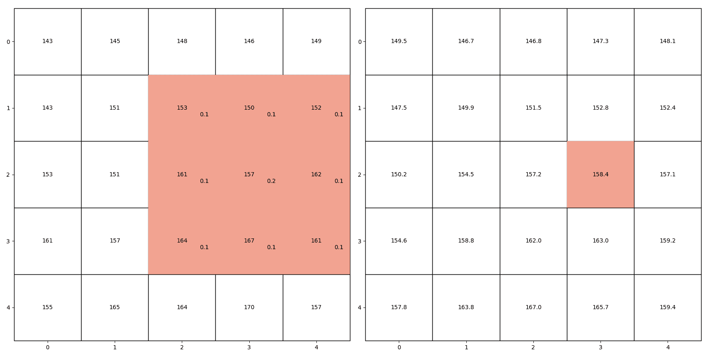

注意，对于边界上的点，核与矩阵不对齐，因此我们必须想出一个策略来为这些点赋值。没有一种适用于所有情况的单一良好策略；一些方法是将边界扩展为零，或者使用边界值进行扩展。

让我们看看如何将普通图片转换为铅笔素描。

# 应用铅笔素描转换

我们已经从上一节学到了一些技巧，现在我们可以准备查看整个流程了。

最终代码可以在`tools.py`文件中的`convert_to_pencil_sketch`函数中找到。

以下过程展示了如何将彩色图像转换为灰度图。之后，我们旨在将灰度图像与其模糊的负图像混合：

1.  首先，我们将 RGB 图像 (`imgRGB`) 转换为灰度图：

```py
img_gray = cv2.cvtColor(img_rgb, cv2.COLOR_RGB2GRAY) 
```

如您所见，我们已将 `cv2.COLOR_RGB2GRAY` 作为 `cv2.cvtColor` 函数的参数，这改变了颜色空间。请注意，输入图像是 RGB 还是 BGR（OpenCV 的默认设置）并不重要；最终我们都会得到一个漂亮的灰度图像。

1.  然后，我们使用大小为 `(21,21)` 的大高斯核对图像进行反转和模糊处理：

```py
    inv_gray = 255 - gray_image
    blurred_image = cv2.GaussianBlur(inv_gray, (21, 21), 0, 0)
```

1.  我们使用 `dodge` 将原始灰度图像与模糊的逆变换混合：

```py
    gray_sketch = cv2.divide(gray_image, 255 - blurred_image, 
    scale=256)
```

生成的图像看起来是这样的：

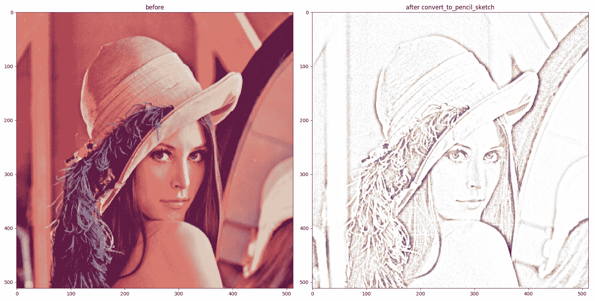

图片来源——“Lenna”由 Conor Lawless 提供，授权协议为 CC BY 2.0

你注意到我们的代码还可以进一步优化吗？让我们看看如何使用 OpenCV 进行优化。

# 使用高斯模糊的优化版本

高斯模糊基本上是一个与高斯函数的卷积。嗯，卷积的一个特性是它们的结合性质。这意味着我们首先反转图像然后模糊，还是先模糊图像然后反转，并不重要。

如果我们从模糊的图像开始，并将其逆变换传递给 `dodge` 函数，那么在该函数内部图像将被再次反转（`255-mask` 部分），本质上得到原始图像。如果我们去掉这些冗余操作，优化的 `convert_to_pencil_sketch` 函数将看起来像这样：

```py
def convert_to_pencil_sketch(rgb_image):
    gray_image = cv2.cvtColor(rgb_image, cv2.COLOR_RGB2GRAY)
    blurred_image = cv2.GaussianBlur(gray_image, (21, 21), 0, 0)
    gray_sketch = cv2.divide(gray_image, blurred_image, scale=256)
    return cv2.cvtColor(gray_sketch, cv2.COLOR_GRAY2RGB)
```

为了增添乐趣，我们想要将我们的变换图像 (`img_sketch`) 轻轻地与背景图像 (`canvas`) 混合，使其看起来像是在画布上绘制的。因此，在返回之前，我们希望如果存在 `canvas`，则与 `canvas` 混合：

```py
    if canvas is not None:
        gray_sketch = cv2.multiply(gray_sketch, canvas, scale=1 / 256)
```

我们将最终的函数命名为 `pencil_sketch_on_canvas`，它看起来是这样的（包括优化）：

```py
def pencil_sketch_on_canvas(rgb_image, canvas=None):
    gray_image = cv2.cvtColor(rgb_image, cv2.COLOR_RGB2GRAY)
    blurred_image = cv2.GaussianBlur(gray_image, (21, 21), 0, 0)
    gray_sketch = cv2.divide(gray_image, blurred_image, scale=256)
    if canvas is not None:
        gray_sketch = cv2.multiply(gray_sketch, canvas, scale=1 / 256)
    return cv2.cvtColor(gray_sketch, cv2.COLOR_GRAY2RGB)
```

这只是我们的 `convert_to_pencil_sketch` 函数，它有一个可选的 `canvas` 参数，可以为铅笔素描添加艺术感。

完成了！最终的输出看起来是这样的：

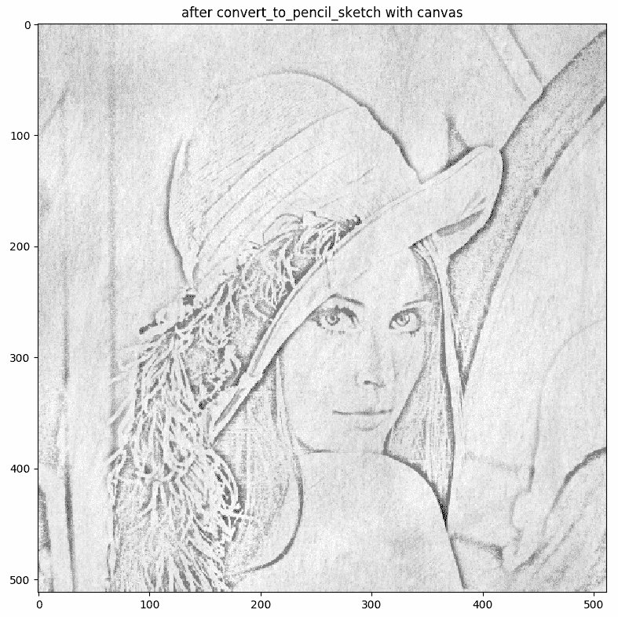

让我们看看如何在下一节中生成暖色和冷色滤镜，你将学习如何使用 **查找表** 进行图像处理。

# 生成暖色和冷色滤镜

当我们感知图像时，大脑会捕捉到许多细微的线索来推断场景的重要细节。例如，在晴朗的白天，高光可能带有轻微的黄色调，因为它们处于直射阳光下，而阴影可能因为蓝色天空的环境光而显得略带蓝色。当我们看到具有这种颜色特性的图像时，我们可能会立刻想到一个晴朗的日子。

这种效果对摄影师来说并不神秘，他们有时会故意操纵图像的白平衡来传达某种情绪。暖色通常被认为更愉快，而冷色则与夜晚和单调联系在一起。

为了操纵图像的感知色温，我们将实现一个曲线过滤器。这些过滤器控制颜色在不同图像区域之间的过渡，使我们能够微妙地改变色谱，而不会给图像添加看起来不自然的整体色调。

在下一节中，我们将探讨如何通过曲线平移来操纵颜色。

# 通过曲线平移进行颜色操纵

曲线过滤器本质上是一个函数，***y = f (x)***，它将输入像素值 *x* 映射到输出像素值 *y*。曲线由一组 ***n + 1*** 锚点参数化，如下所示：

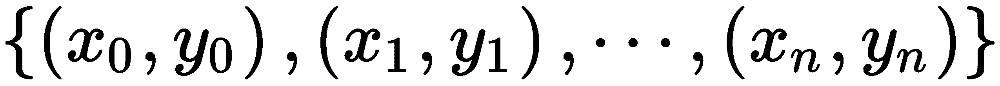

在这里，每个锚点是一对代表输入和输出像素值的数字。例如，对(30, 90)的配对意味着输入像素值 30 增加到输出值 90。锚点之间的值沿着一条平滑的曲线进行插值（因此得名曲线过滤器）。

这种过滤器可以应用于任何图像通道，无论是单个灰度通道还是 RGB 彩色图像的**R**（**红色**）、**G**（**绿色**）和**B**（**蓝色**）通道。因此，为了我们的目的，所有 *x* 和 *y* 的值都必须保持在 0 到 255 之间。

例如，如果我们想使灰度图像稍微亮一些，我们可以使用以下控制点的曲线过滤器：

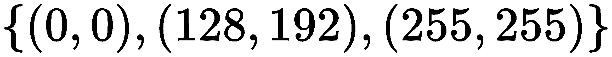

这意味着除了 **0** 和 **255** 以外的所有输入像素值都会略微增加，从而在图像上产生整体变亮的效果。

如果我们希望这样的过滤器产生看起来自然的图像，那么遵守以下两条规则是很重要的：

+   每组锚点都应该包括 **(0,0)** 和 **(255,255)**。这对于防止图像看起来像有整体色调很重要，因为黑色仍然是黑色，白色仍然是白色。

+   *f(x)* 函数应该是单调递增的。换句话说，通过增加 *x*，*f(x)* 要么保持不变，要么增加（即，它永远不会减少）。这对于确保阴影仍然是阴影，高光仍然是高光非常重要。

下一节将演示如何使用查找表实现曲线过滤器。

# 使用查找表实现曲线过滤器

曲线过滤器计算成本较高，因为当 *x* 不与预指定的锚点之一相匹配时，必须对 *f(x)* 的值进行插值。对我们遇到的每个图像帧的每个像素执行此计算将对性能产生重大影响。

相反，我们使用查找表。由于我们的目的是只有 256 个可能的像素值，因此我们只需要计算所有 256 个可能的 ***x*** 值的 ***f(x)***。插值由 `scipy.interpolate` 模块的 `UnivariateSpline` 函数处理，如下面的代码片段所示：

```py
from scipy.interpolate import UnivariateSpline 

def spline_to_lookup_table(spline_breaks: list, break_values: list):
    spl = UnivariateSpline(spline_breaks, break_values)
    return spl(range(256)
```

函数的 `return` 参数是一个包含每个可能的 *x* 值的插值 *f(x)* 值的 256 个元素的列表。

现在我们需要做的就是提出一组锚点，(*x[i]*, *y[i]*)，然后我们就可以将过滤器应用于灰度输入图像（`img_gray`）：

```py
import cv2 
import numpy as np 

x = [0, 128, 255] 
y = [0, 192, 255] 
myLUT = spline_to_lookup_table(x, y) 
img_curved = cv2.LUT(img_gray, myLUT).astype(np.uint8) 
```

结果看起来像这样（原始图像在 *左* 边，转换后的图像在 *右* 边）：

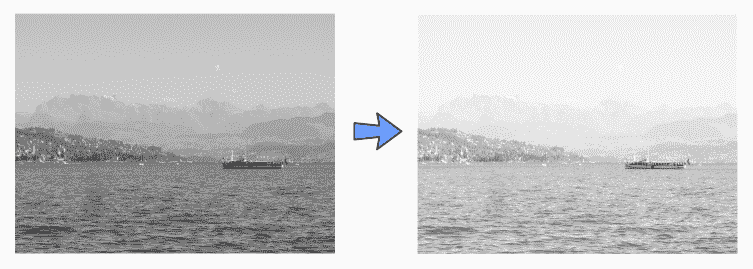

在下一节中，我们将设计暖色和冷色效果。你还将学习如何将查找表应用于彩色图像，以及暖色和冷色效果是如何工作的。

# 设计暖色和冷色效果

由于我们已经有了快速将通用曲线过滤器应用于任何图像通道的机制，我们现在可以转向如何操纵图像感知色温的问题。再次强调，最终的代码将在 `tools` 模块中拥有自己的函数。

如果你有多余的一分钟时间，我建议你尝试不同的曲线设置一段时间。你可以选择任意数量的锚点，并将曲线过滤器应用于你想到的任何图像通道（红色、绿色、蓝色、色调、饱和度、亮度、明度等等）。你甚至可以将多个通道组合起来，或者降低一个并移动另一个到所需区域。*结果会是什么样子？*

然而，如果可能性让你眼花缭乱，请采取更保守的方法。首先，通过利用我们在前面步骤中开发的 `spline_to_lookup_table` 函数，让我们定义两个通用曲线过滤器：一个（按趋势）增加通道的所有像素值，另一个通常减少它们：

```py
INCREASE_LOOKUP_TABLE = spline_to_lookup_table([0, 64, 128, 192, 256],
                                               [0, 70, 140, 210, 256])
DECREASE_LOOKUP_TABLE = spline_to_lookup_table([0, 64, 128, 192, 256],
                                               [0, 30, 80, 120, 192])
```

现在，让我们看看我们如何将查找表应用于 RGB 图像。OpenCV 有一个名为 `cv2.LUT` 的不错函数，它接受一个查找表并将其应用于矩阵。因此，首先，我们必须将图像分解为不同的通道：

```py
    c_r, c_g, c_b = cv2.split(rgb_image)
```

然后，如果需要，我们可以对每个通道应用过滤器：

```py
    if green_filter is not None:
        c_g = cv2.LUT(c_g, green_filter).astype(np.uint8)
```

对 RGB 图像中的所有三个通道都这样做，我们得到以下辅助函数：

```py
def apply_rgb_filters(rgb_image, *,
                      red_filter=None, green_filter=None, blue_filter=None):
    c_r, c_g, c_b = cv2.split(rgb_image)
    if red_filter is not None:
        c_r = cv2.LUT(c_r, red_filter).astype(np.uint8)
    if green_filter is not None:
        c_g = cv2.LUT(c_g, green_filter).astype(np.uint8)
    if blue_filter is not None:
        c_b = cv2.LUT(c_b, blue_filter).astype(np.uint8)
    return cv2.merge((c_r, c_g, c_b))
```

要让图像看起来像是在炎热的阳光明媚的日子里拍摄的（可能接近日落），最简单的方法是增加图像中的红色，并通过增加颜色饱和度使颜色看起来更加鲜艳。我们将分两步实现这一点：

1.  使用 `INCREASE_LOOKUP_TABLE` 和 `DECREASE_LOOKUP_TABLE` 分别增加 RGB 颜色图像中 **R 通道**（来自 RGB 图像）的像素值，并减少 **B 通道**的像素值：

```py
        interim_img = apply_rgb_filters(rgb_image,
                                        red_filter=INCREASE_LOOKUP_TABLE,
                                        blue_filter=DECREASE_LOOKUP_TABLE)
```

1.  将图像转换为**HSV**颜色空间（**H**代表**色调**，**S**代表**饱和度**，**V**代表**亮度**），并使用`INCREASE_LOOKUP_TABLE`增加**S 通道**。这可以通过以下函数实现，该函数期望一个 RGB 彩色图像和一个要应用的查找表（类似于`apply_rgb_filters`函数）作为输入：

```py
def apply_hue_filter(rgb_image, hue_filter):
    c_h, c_s, c_v = cv2.split(cv2.cvtColor(rgb_image, cv2.COLOR_RGB2HSV))
    c_s = cv2.LUT(c_s, hue_filter).astype(np.uint8)
    return cv2.cvtColor(cv2.merge((c_h, c_s, c_v)), cv2.COLOR_HSV2RGB)
```

结果看起来像这样：

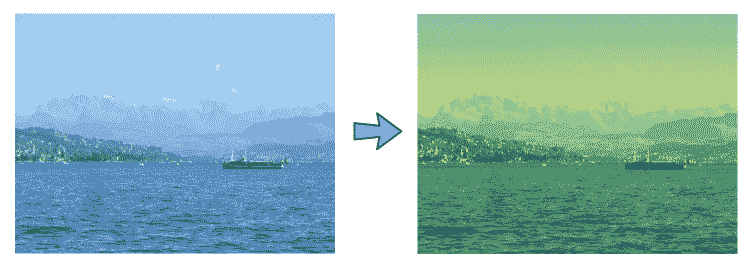

类似地，我们可以定义一个冷却滤波器，该滤波器增加 RGB 图像中的 B 通道的像素值，减少 R 通道的像素值，将图像转换为 HSV 颜色空间，并通过 S 通道降低色彩饱和度：

```py
    def _render_cool(rgb_image: np.ndarray) -> np.ndarray:
        interim_img = apply_rgb_filters(rgb_image,
                                        red_filter=DECREASE_LOOKUP_TABLE,
                                        blue_filter=INCREASE_LOOKUP_TABLE)
        return apply_hue_filter(interim_img, DECREASE_LOOKUP_TABLE)
```

现在的结果看起来像这样：

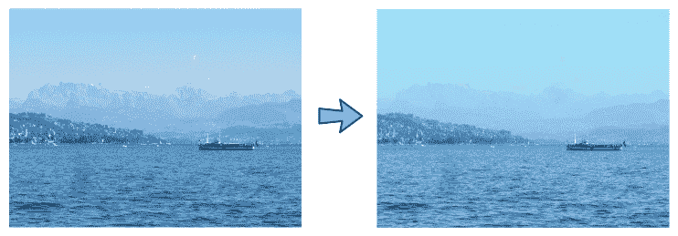

让我们在下一节中探讨如何卡通化图像，我们将学习双边滤波器是什么以及更多内容。

# 卡通化图像

在过去的几年里，专业的卡通化软件到处涌现。为了实现基本的卡通效果，我们只需要一个**双边滤波器**和一些**边缘检测**。

双边滤波器将减少图像的色彩调色板或使用的颜色数量。这模仿了卡通画，其中卡通画家通常只有很少的颜色可供选择。然后，我们可以对生成的图像应用边缘检测以生成醒目的轮廓。然而，真正的挑战在于双边滤波器的计算成本。因此，我们将使用一些技巧以实时产生可接受的卡通效果。

我们将遵循以下步骤将 RGB 彩色图像转换为卡通：

1.  首先，应用双边滤波器以减少图像的色彩调色板。

1.  然后，将原始彩色图像转换为灰度图。

1.  之后，应用**中值滤波**以减少图像噪声。

1.  使用**自适应阈值**在边缘掩码中检测和强调边缘。

1.  最后，将步骤 1 中的颜色图像与步骤 4 中的边缘掩码结合。

在接下来的章节中，我们将详细介绍之前提到的步骤。首先，我们将学习如何使用双边滤波器进行边缘感知平滑。

# 使用双边滤波器进行边缘感知平滑

强力的双边滤波器非常适合将 RGB 图像转换为彩色画或卡通，因为它在平滑平坦区域的同时保持边缘锐利。这个滤波器的唯一缺点是它的计算成本——它的速度比其他平滑操作（如高斯模糊）慢得多。

当我们需要降低计算成本时，首先要采取的措施是对低分辨率图像进行操作。为了将 RGB 图像（`imgRGB`）的大小缩小到原来的四分之一（即宽度高度减半），我们可以使用`cv2.resize`：

```py
    img_small = cv2.resize(img_rgb, (0, 0), fx=0.5, fy=0.5) 
```

调整大小后的图像中的像素值将对应于原始图像中一个小邻域的像素平均值。然而，这个过程可能会产生图像伪影，这也就是所说的**混叠**。虽然图像混叠本身就是一个大问题，但后续处理可能会增强其负面影响，例如边缘检测。

一个更好的选择可能是使用**高斯金字塔**进行下采样（再次减小到原始大小的四分之一）。高斯金字塔由在图像重采样之前执行的一个模糊操作组成，这减少了任何混叠效应：

```py
    downsampled_img = cv2.pyrDown(rgb_image)
```

然而，即使在这个尺度上，双边滤波器可能仍然运行得太慢，无法实时处理。另一个技巧是反复（比如，五次）对图像应用一个小双边滤波器，而不是一次性应用一个大双边滤波器：

```py
    for _ in range(num_bilaterals):
        filterd_small_img = cv2.bilateralFilter(downsampled_img, 9, 9, 7)
```

`cv2.bilateralFilter`中的三个参数控制像素邻域的直径（`d=9`）、在颜色空间中的滤波器标准差（`sigmaColor=9`）和坐标空间中的标准差（`sigmaSpace=7`）。

因此，运行我们使用的双边滤波器的最终代码如下：

1.  使用多个`pyrDown`调用对图像进行下采样：

```py
    downsampled_img = rgb_image
    for _ in range(num_pyr_downs):
        downsampled_img = cv2.pyrDown(downsampled_img)
```

1.  然后，应用多个双边滤波器：

```py
    for _ in range(num_bilaterals):
        filterd_small_img = cv2.bilateralFilter(downsampled_img, 9, 9, 7)
```

1.  最后，将其上采样到原始大小：

```py
    filtered_normal_img = filterd_small_img
    for _ in range(num_pyr_downs):
        filtered_normal_img = cv2.pyrUp(filtered_normal_img)
```

结果看起来像一幅模糊的彩色画，画的是一个令人毛骨悚然的程序员，如下所示：

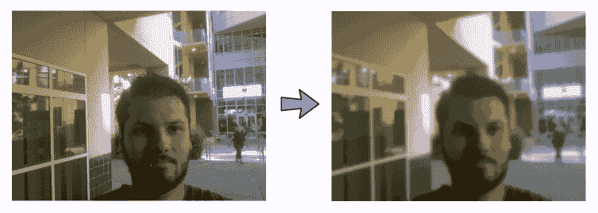

下一个部分将向您展示如何检测和强调突出边缘。

# 检测和强调突出边缘

再次强调，当涉及到边缘检测时，挑战通常不在于底层算法的工作方式，而在于选择哪种特定的算法来完成手头的任务。您可能已经熟悉各种边缘检测器。例如，**Canny 边缘检测**（`cv2.Canny`）提供了一种相对简单且有效的方法来检测图像中的边缘，但它容易受到噪声的影响。

**Sobel 算子**（`cv2.Sobel`）可以减少这种伪影，但它不是旋转对称的。**Scharr 算子**（`cv2.Scharr`）旨在纠正这一点，但它只查看第一图像导数。如果您感兴趣，还有更多算子供您选择，例如**Laplacian 脊算子**（它包括二阶导数），但它们要复杂得多。最后，对于我们的特定目的，它们可能看起来并不更好，也许是因为它们像任何其他算法一样容易受到光照条件的影响。

对于这个项目，我们将选择一个可能甚至与传统的边缘检测无关的函数——`cv2.adaptiveThreshold`。像`cv2.threshold`一样，这个函数使用一个阈值像素值将灰度图像转换为二值图像。也就是说，如果原始图像中的像素值高于阈值，则最终图像中的像素值将是 255。否则，它将是 0。

然而，自适应阈值的美妙之处在于它不会查看图像的整体属性。相反，它独立地检测每个小邻域中最显著的特征，而不考虑全局图像特征。这使得算法对光照条件极为鲁棒，这正是我们在寻求在物体和卡通中的人物周围绘制醒目的黑色轮廓时所希望的。

然而，这也使得算法容易受到噪声的影响。为了对抗这一点，我们将使用中值滤波器对图像进行预处理。中值滤波器做的是它名字所暗示的：它将每个像素值替换为一个小像素邻域中所有像素的中值。因此，为了检测边缘，我们遵循以下简短程序：

1.  我们首先将 RGB 图像（`rgb_image`）转换为灰度（`img_gray`），然后使用七像素局部邻域应用中值模糊：

```py
    # convert to grayscale and apply median blur
    img_gray = cv2.cvtColor(rgb_image, cv2.COLOR_RGB2GRAY)
    img_blur = cv2.medianBlur(img_gray, 7)
```

1.  在减少噪声后，现在可以安全地使用自适应阈值检测和增强边缘。即使有一些图像噪声残留，`cv2.ADAPTIVE_THRESH_MEAN_C`算法使用`blockSize=9`将确保阈值应用于 9 x 9 邻域的均值减去`C=2`：

```py
    gray_edges = cv2.adaptiveThreshold(img_blur, 255,
                                       cv2.ADAPTIVE_THRESH_MEAN_C,
                                       cv2.THRESH_BINARY, 9, 2)
```

自适应阈值的结果看起来像这样：

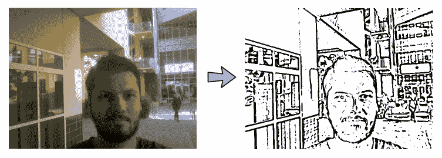

接下来，让我们看看如何在下一节中结合颜色和轮廓来制作卡通。

# 结合颜色和轮廓制作卡通

最后一步是将之前实现的两种效果结合起来。只需使用`cv2.bitwise_and`将两种效果融合成单个图像。完整的函数如下：

```py
def cartoonize(rgb_image, *,
               num_pyr_downs=2, num_bilaterals=7):
    # STEP 1 -- Apply a bilateral filter to reduce the color palette of
    # the image.
    downsampled_img = rgb_image
    for _ in range(num_pyr_downs):
        downsampled_img = cv2.pyrDown(downsampled_img)

    for _ in range(num_bilaterals):
        filterd_small_img = cv2.bilateralFilter(downsampled_img, 9, 9, 7)

    filtered_normal_img = filterd_small_img
    for _ in range(num_pyr_downs):
        filtered_normal_img = cv2.pyrUp(filtered_normal_img)

    # make sure resulting image has the same dims as original
    if filtered_normal_img.shape != rgb_image.shape:
        filtered_normal_img = cv2.resize(
            filtered_normal_img, rgb_image.shape[:2])

    # STEP 2 -- Convert the original color image into grayscale.
    img_gray = cv2.cvtColor(rgb_image, cv2.COLOR_RGB2GRAY)
    # STEP 3 -- Apply amedian blur to reduce image noise.
    img_blur = cv2.medianBlur(img_gray, 7)

    # STEP 4 -- Use adaptive thresholding to detect and emphasize the edges
    # in an edge mask.
    gray_edges = cv2.adaptiveThreshold(img_blur, 255,
                                       cv2.ADAPTIVE_THRESH_MEAN_C,
                                       cv2.THRESH_BINARY, 9, 2)
    # STEP 5 -- Combine the color image from step 1 with the edge mask
    # from step 4.
    rgb_edges = cv2.cvtColor(gray_edges, cv2.COLOR_GRAY2RGB)
    return cv2.bitwise_and(filtered_normal_img, rgb_edges)
```

结果看起来像这样：

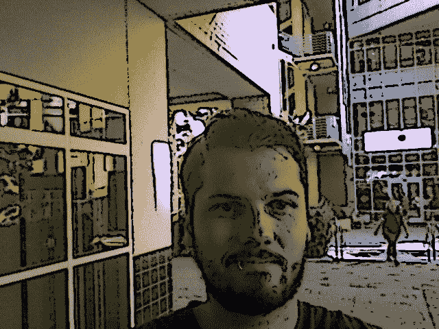

在下一节中，我们将设置主脚本并设计一个 GUI 应用程序。

# 将所有内容整合在一起

在前面的章节中，我们实现了一些很好的过滤器，展示了我们如何使用 OpenCV 获得很好的效果。在本节中，我们想要构建一个交互式应用程序，允许您实时将这些过滤器应用到您的笔记本电脑摄像头。

因此，我们需要编写一个**用户界面**（**UI**），它将允许我们捕获相机流并有一些按钮，以便您可以选择要应用哪个过滤器。我们将首先使用 OpenCV 设置相机捕获。然后，我们将使用`wxPython`构建一个漂亮的界面。

# 运行应用程序

要运行应用程序，我们将转向`chapter1.py`脚本。按照以下步骤操作：

1.  我们首先开始导入所有必要的模块：

```py
import wx
import cv2
import numpy as np
```

1.  我们还必须导入一个通用的 GUI 布局（来自`wx_gui`）和所有设计的图像效果（来自`tools`）：

```py
from wx_gui import BaseLayout
from tools import apply_hue_filter
from tools import apply_rgb_filters
from tools import load_img_resized
from tools import spline_to_lookup_table
from tools import cartoonize
from tools import pencil_sketch_on_canvas
```

1.  OpenCV 提供了一个简单的方法来访问计算机的摄像头或相机设备。以下代码片段使用`cv2.VideoCapture`打开计算机的默认摄像头 ID（`0`）：

```py
def main(): 
    capture = cv2.VideoCapture(0) 
```

1.  为了给我们的应用程序一个公平的机会在实时运行，我们将限制视频流的大小为`640` x `480`像素：

```py
    capture.set(cv2.CAP_PROP_FRAME_WIDTH, 640)
    capture.set(cv2.CAP_PROP_FRAME_HEIGHT, 480)
```

1.  然后，可以将`capture`流传递给我们的 GUI 应用程序，该应用程序是`FilterLayout`类的一个实例：

```py
    # start graphical user interface
    app = wx.App()
    layout = FilterLayout(capture, title='Fun with Filters')
    layout.Center()
    layout.Show()
    app.MainLoop()
```

在创建`FilterLayout`之后，我们将居中布局，使其出现在屏幕中央。然后我们调用`Show()`来实际显示布局。最后，我们调用`app.MainLoop()`，这样应用程序就开始工作，接收和处理事件。

现在唯一要做的就是设计这个 GUI。

# 映射 GUI 基类

`FilterLayout` GUI 将基于一个通用的、简单的布局类，称为`BaseLayout`，我们将在后续章节中也能使用它。

`BaseLayout`类被设计为一个**抽象基类**。你可以将这个类视为一个蓝图或配方，它将适用于我们尚未设计的所有布局，即一个骨架类，它将作为我们所有未来 GUI 代码的骨干。

我们从导入我们将使用的包开始——用于创建 GUI 的`wxPython`模块、用于矩阵操作的`numpy`以及当然的 OpenCV：

```py
import numpy as np
import wx
import cv2
```

该类设计为从蓝图或骨架派生，即`wx.Frame`类：

```py
class BaseLayout(wx.Frame):
```

在以后，当我们编写自己的自定义布局（`FilterLayout`）时，我们将使用相同的记法来指定该类基于`BaseLayout`蓝图（或骨架）类，例如，在`class FilterLayout(BaseLayout):`。但到目前为止，让我们专注于`BaseLayout`类。

抽象类至少有一个抽象方法。我们将通过确保如果该方法未实现，应用程序将无法运行并抛出异常来使其方法抽象：

```py
class BaseLayout(wx.Frame):
    ...
    ...
    ...
    def process_frame(self, frame_rgb: np.ndarray) -> np.ndarray:
        """Process the frame of the camera (or other capture device)

        :param frame_rgb: Image to process in rgb format, of shape (H, W, 3)
        :return: Processed image in rgb format, of shape (H, W, 3)
        """
        raise NotImplementedError()
```

然后，任何从它派生的类，如`FilterLayout`，都必须指定该方法的完整实现。这将使我们能够创建自定义布局，正如你将在下一刻看到的那样。

但首先，让我们继续到 GUI 构造函数。

# 理解 GUI 构造函数

`BaseLayout`构造函数接受一个 ID（`-1`）、一个标题字符串（`'Fun with Filters'`）、一个视频捕获对象和一个可选参数，该参数指定每秒的帧数。在构造函数中，首先要做的事情是尝试从捕获对象中读取一个帧，以确定图像大小：

```py
    def __init__(self,
                 capture: cv2.VideoCapture,
                 title: str = None,
                 parent=None,
                 window_id: int = -1,  # default value
                 fps: int = 10):
        self.capture = capture
        _, frame = self._acquire_frame()
        self.imgHeight, self.imgWidth = frame.shape[:2]
```

我们将使用图像大小来准备一个缓冲区，该缓冲区将存储每个视频帧作为位图，并设置 GUI 的大小。因为我们想在当前视频帧下方显示一串控制按钮，所以我们把 GUI 的高度设置为`self.imgHeight + 20`：

```py
        super().__init__(parent, window_id, title,
                         size=(self.imgWidth, self.imgHeight + 20))
        self.fps = fps
        self.bmp = wx.Bitmap.FromBuffer(self.imgWidth, self.imgHeight, frame)
```

在下一节中，我们将使用`wxPython`构建一个包含视频流和一些按钮的基本布局。

# 了解基本的 GUI 布局

最基本的布局仅由一个足够大的黑色面板组成，可以提供足够的空间来显示视频流：

```py
        self.video_pnl = wx.Panel(self, size=(self.imgWidth, self.imgHeight))
        self.video_pnl.SetBackgroundColour(wx.BLACK)
```

为了使布局可扩展，我们将它添加到一个垂直排列的`wx.BoxSizer`对象中：

```py
        # display the button layout beneath the video stream
        self.panels_vertical = wx.BoxSizer(wx.VERTICAL)
        self.panels_vertical.Add(self.video_pnl, 1, flag=wx.EXPAND | wx.TOP,
                                 border=1)
```

接下来，我们指定一个抽象方法`augment_layout`，我们将不会填写任何代码。相反，任何使用我们基类的用户都可以对基本布局进行自己的自定义修改：

```py
        self.augment_layout()
```

然后，我们只需设置结果的布局的最小尺寸并将其居中：

```py
        self.SetMinSize((self.imgWidth, self.imgHeight))
        self.SetSizer(self.panels_vertical)
        self.Centre()
```

下一节将向您展示如何处理视频流。

# 处理视频流

网络摄像头的视频流通过一系列步骤处理，这些步骤从`__init__`方法开始。这些步骤一开始可能看起来过于复杂，但它们是必要的，以便视频能够平滑运行，即使在更高的帧率下（也就是说，为了对抗闪烁）。

`wxPython`模块与事件和回调方法一起工作。当某个事件被触发时，它可以导致某个类方法被执行（换句话说，一个方法可以*绑定*到事件）。我们将利用这个机制，并使用以下步骤每隔一段时间显示一个新帧：

1.  我们创建一个定时器，每当`1000./self.fps`毫秒过去时，它就会生成一个`wx.EVT_TIMER`事件：

```py
        self.timer = wx.Timer(self)
        self.timer.Start(1000\. / self.fps)
```

1.  每当定时器结束时，我们希望调用`_on_next_frame`方法。它将尝试获取一个新的视频帧：

```py
        self.Bind(wx.EVT_TIMER, self._on_next_frame)
```

1.  `_on_next_frame`方法将处理新的视频帧并将处理后的帧存储在位图中。这将触发另一个事件，`wx.EVT_PAINT`。我们希望将此事件绑定到`_on_paint`方法，该方法将绘制新帧的显示。因此，我们为视频创建一个占位符并将`wx.EVT_PAINT`绑定到它：

```py
        self.video_pnl.Bind(wx.EVT_PAINT, self._on_paint)
```

`_on_next_frame`方法获取一个新帧，完成后，将帧发送到另一个方法`process_frame`进行进一步处理（这是一个抽象方法，应由子类实现）：

```py
    def _on_next_frame(self, event):
        """
        Capture a new frame from the capture device,
        send an RGB version to `self.process_frame`, refresh.
        """
        success, frame = self._acquire_frame()
        if success:
            # process current frame
            frame = self.process_frame(cv2.cvtColor(frame, cv2.COLOR_BGR2RGB))
            ...
```

处理后的帧（`frame`）随后被存储在位图缓冲区（`self.bmp`）中。调用`Refresh`会触发上述的`wx.EVT_PAINT`事件，该事件绑定到`_on_paint`：

```py
            ...
            # update buffer and paint (EVT_PAINT triggered by Refresh)
            self.bmp.CopyFromBuffer(frame)
            self.Refresh(eraseBackground=False)
```

`paint`方法随后从缓冲区获取帧并显示它：

```py
    def _on_paint(self, event):
        """ Draw the camera frame stored in `self.bmp` onto `self.video_pnl`.
        """
        wx.BufferedPaintDC(self.video_pnl).DrawBitmap(self.bmp, 0, 0)
```

下一节将向您展示如何创建自定义过滤器布局。

# 设计自定义过滤器布局

现在我们几乎完成了！如果我们想使用`BaseLayout`类，我们需要为之前留空的两个方法提供代码，如下所示：

+   `augment_layout`：这是我们可以对 GUI 布局进行特定任务修改的地方。

+   `process_frame`：这是我们对摄像头捕获的每一帧进行特定任务处理的地方。

我们还需要更改构造函数以初始化我们将需要的任何参数——在这种情况下，铅笔素描的画布背景：

```py
    def __init__(self, *args, **kwargs):
        super().__init__(*args, **kwargs)
        color_canvas = load_img_resized('pencilsketch_bg.jpg',
                                        (self.imgWidth, self.imgHeight))
        self.canvas = cv2.cvtColor(color_canvas, cv2.COLOR_RGB2GRAY)
```

要自定义布局，我们水平排列一系列单选按钮——每个图像效果模式一个按钮。在这里，`style=wx.RB_GROUP`选项确保一次只能选择一个`单选按钮`。并且为了使这些更改可见，`pnl`需要添加到现有面板列表`self.panels_vertical`中：

```py
    def augment_layout(self):
        """ Add a row of radio buttons below the camera feed. """

        # create a horizontal layout with all filter modes as radio buttons
        pnl = wx.Panel(self, -1)
        self.mode_warm = wx.RadioButton(pnl, -1, 'Warming Filter', (10, 10),
                                        style=wx.RB_GROUP)
        self.mode_cool = wx.RadioButton(pnl, -1, 'Cooling Filter', (10, 10))
        self.mode_sketch = wx.RadioButton(pnl, -1, 'Pencil Sketch', (10, 10))
        self.mode_cartoon = wx.RadioButton(pnl, -1, 'Cartoon', (10, 10))
        hbox = wx.BoxSizer(wx.HORIZONTAL)
        hbox.Add(self.mode_warm, 1)
        hbox.Add(self.mode_cool, 1)
        hbox.Add(self.mode_sketch, 1)
        hbox.Add(self.mode_cartoon, 1)
        pnl.SetSizer(hbox)

        # add panel with radio buttons to existing panels in a vertical
        # arrangement
        self.panels_vertical.Add(pnl, flag=wx.EXPAND | wx.BOTTOM | wx.TOP,
                                 border=1
```

最后要指定的方法是 `process_frame`。回想一下，每当接收到新的相机帧时，该方法就会被触发。我们所需做的就是选择要应用的正确图像效果，这取决于单选按钮的配置。我们只需检查哪个按钮当前被选中，并调用相应的 `render` 方法：

```py
    def process_frame(self, frame_rgb: np.ndarray) -> np.ndarray:
        """Process the frame of the camera (or other capture device)

        Choose a filter effect based on the which of the radio buttons
        was clicked.

        :param frame_rgb: Image to process in rgb format, of shape (H, W, 3)
        :return: Processed image in rgb format, of shape (H, W, 3)
        """
        if self.mode_warm.GetValue():
            return self._render_warm(frame_rgb)
        elif self.mode_cool.GetValue():
            return self._render_cool(frame_rgb)
        elif self.mode_sketch.GetValue():
            return pencil_sketch_on_canvas(frame_rgb, canvas=self.canvas)
        elif self.mode_cartoon.GetValue():
            return cartoonize(frame_rgb)
        else:
            raise NotImplementedError()
```

完成了！以下截图展示了使用不同滤镜的输出图片：

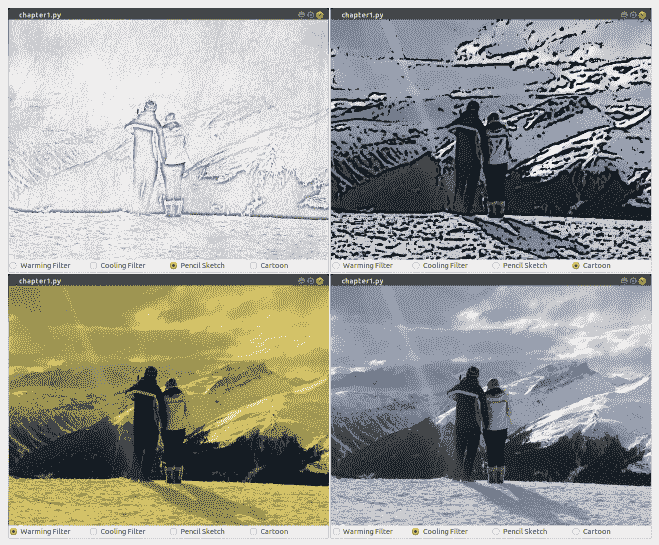

上一张截图展示了我们将创建的四个滤镜应用于单个图像的效果。

# 摘要

在本章中，我们探索了许多有趣的图像处理效果。我们使用 dodge 和 burn 来创建黑白铅笔素描效果，通过查找表实现了曲线滤镜的高效实现，并发挥创意制作了卡通效果。

使用的一种技术是二维卷积，它将一个滤波器和一张图像结合，创建一个新的图像。在本章中，我们提供了获取所需结果的滤波器，但并不总是拥有产生所需结果所需的滤波器。最近，深度学习出现了，它试图学习不同滤波器的值，以帮助它获得所需的结果。

在下一章中，我们将稍微改变方向，探索使用深度传感器，如 **Microsoft Kinect 3D**，来实时识别手势。

# 属性

`Lenna.png`—Lenna 图片由 Conor Lawless 提供，可在 [`www.flickr.com/photos/15489034@N00/3388463896`](http://www.flickr.com/photos/15489034@N00/3388463896) 找到，并遵循通用 CC 2.0 许可协议。
