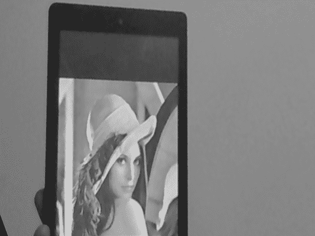
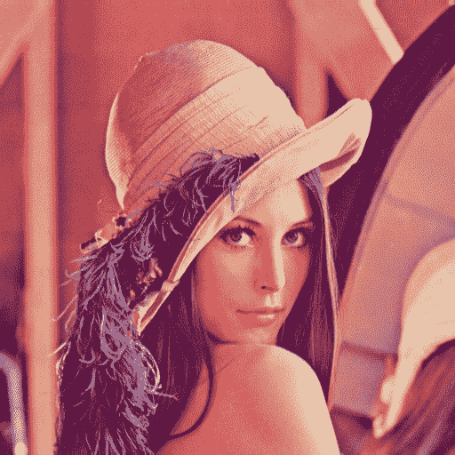
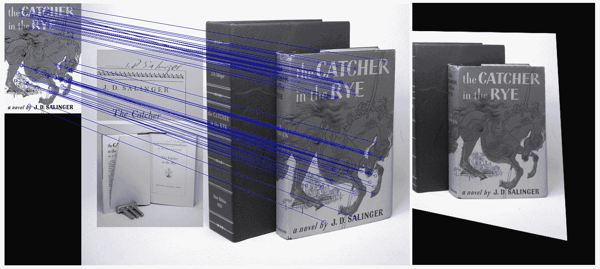
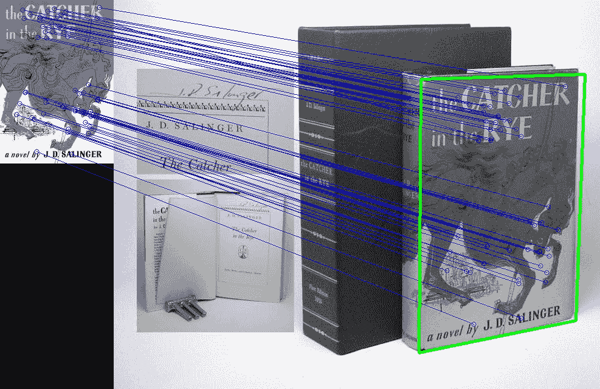
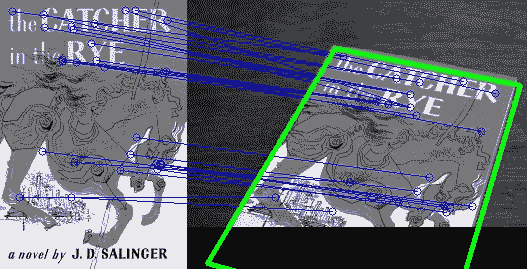
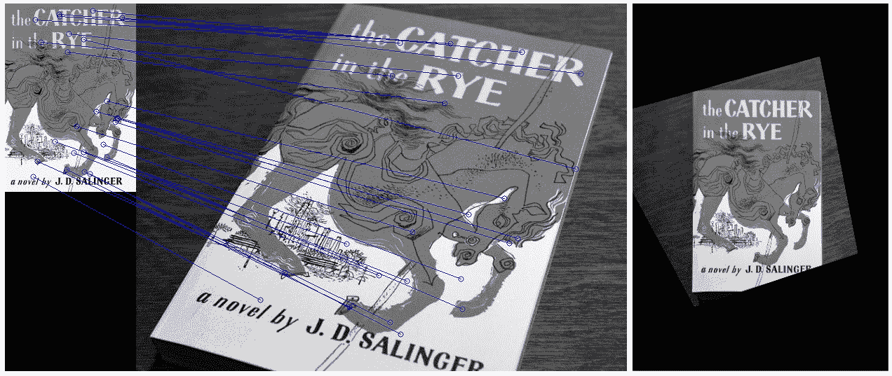
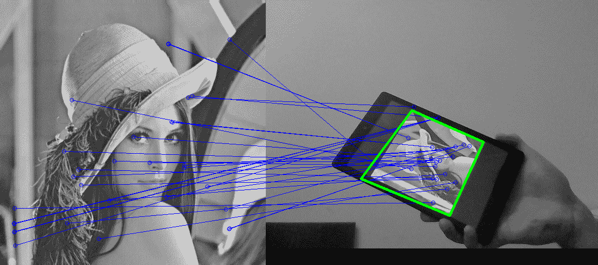
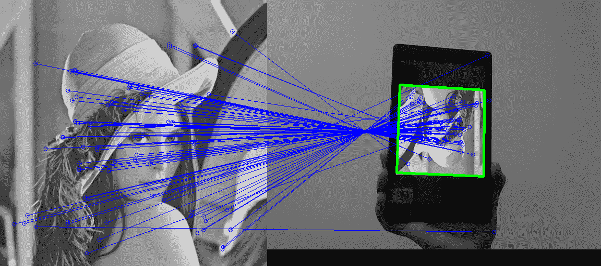
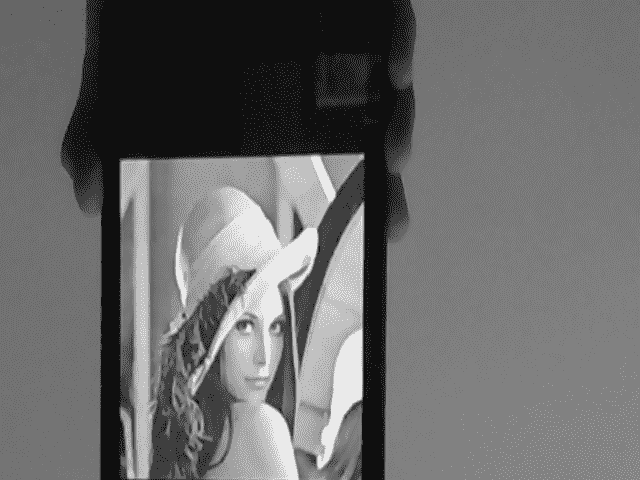

# 第三章：通过特征匹配和透视变换查找对象

在上一章中，你学习了如何在非常受控的环境中检测和跟踪一个简单对象（手的轮廓）。具体来说，我们指导我们的应用程序用户将手放置在屏幕中央区域，然后对对象（手）的大小和形状做出了假设。在本章中，我们希望检测和跟踪任意大小的对象，这些对象可能从几个不同的角度或部分遮挡下被观察。

为了做到这一点，我们将使用特征描述符，这是一种捕捉我们感兴趣对象重要属性的方法。我们这样做是为了即使对象嵌入在繁忙的视觉场景中，也能定位到该对象。我们将把我们的算法应用于网络摄像头的实时流，并尽力使算法既鲁棒又足够简单，以便实时运行。

本章将涵盖以下主题：

+   列出应用程序执行的任务

+   规划应用程序

+   设置应用程序

+   理解流程过程

+   学习特征提取

+   观察特征检测

+   理解特征描述符

+   理解特征匹配

+   学习特征跟踪

+   观察算法的实际应用

本章的目标是开发一个应用程序，可以在网络摄像头的视频流中检测和跟踪感兴趣的对象——即使对象从不同的角度、距离或部分遮挡下观察。这样的对象可以是书的封面图像、一幅画或任何具有复杂表面结构的其他东西。

一旦提供了模板图像，应用程序将能够检测该对象，估计其边界，然后在视频流中跟踪它。

# 开始学习

本章已在**OpenCV 4.1.1**上进行了测试。

注意，你可能需要从[`github.com/Itseez/opencv_contrib`](https://github.com/Itseez/opencv_contrib)获取所谓的额外模块。

我们通过设置`OPENCV_ENABLE_NONFREE`和`OPENCV_EXTRA_MODULES_PATH`变量来安装 OpenCV，以获取**加速鲁棒特征**（**SURF**）和**快速近似最近邻库**（**FLANN**）。你还可以使用存储库中可用的 Docker 文件，这些文件包含所有必需的安装。

此外，请注意，你可能需要获得许可证才能在商业应用程序中使用**SURF**。

本章的代码可以在 GitHub 书籍存储库中找到，该存储库位于[`github.com/PacktPublishing/OpenCV-4-with-Python-Blueprints-Second-Edition/tree/master/chapter3`](https://github.com/PacktPublishing/OpenCV-4-with-Python-Blueprints-Second-Edition/tree/master/chapter3)。

# 列出应用程序执行的任务

应用程序将分析每个捕获的帧以执行以下任务：

+   **特征提取**：我们将使用**加速鲁棒特征**（**SURF**）来描述感兴趣的物体，这是一种用于在图像中找到既具有尺度不变性又具有旋转不变性的显著关键点的算法。这些关键点将帮助我们确保在多个帧中跟踪正确的物体，因为物体的外观可能会随时间而变化。找到不依赖于物体观看距离或观看角度的关键点非常重要（因此，具有尺度和旋转不变性）。

+   **特征匹配**：我们将尝试使用**快速近似最近邻库**（**FLANN**）来建立关键点之间的对应关系，以查看帧中是否包含与我们的感兴趣物体中的关键点相似的关键点。如果我们找到一个好的匹配，我们将在每一帧上标记该物体。

+   **特征跟踪**：我们将使用各种形式的**早期****异常检测**和**异常拒绝**来跟踪从帧到帧的定位感兴趣物体，以加快算法的速度。

+   **透视变换**：我们将通过**扭曲透视**来反转物体所经历的任何平移和旋转，使得物体在屏幕中心看起来是垂直的。这会产生一种酷炫的效果，物体似乎被冻结在某个位置，而整个周围场景则围绕它旋转。

以下截图显示了前三个步骤的示例，即特征提取、匹配和跟踪：


截图中包含左边的感兴趣物体的模板图像和右边的手持打印模板图像。两个帧中的匹配特征用蓝色线条连接，右边的定位物体用绿色轮廓标出。

最后一步是将定位的物体转换，使其投影到正面平面上，如图中所示：



图像看起来大致与原始模板图像相似，呈现近距离视图，而整个场景似乎围绕它扭曲。

让我们首先规划本章将要创建的应用程序。

# 规划应用

最终的应用程序将包括一个用于检测、匹配和跟踪图像特征的 Python 类，以及一个访问摄像头并显示每个处理帧的脚本。

该项目将包含以下模块和脚本：

+   `feature_matching`：此模块包含特征提取、特征匹配和特征跟踪的算法。我们将此算法从应用程序的其余部分分离出来，以便它可以作为一个独立的模块使用。

+   `feature_matching.FeatureMatching`：这个类实现了整个特征匹配流程。它接受一个**蓝、绿、红（BGR）**相机帧，并尝试在其中定位感兴趣的物体。

+   `chapter3`：这是该章节的主要脚本。

+   `chapter3.main`：这是启动应用程序、访问相机、将每一帧发送到`FeatureMatching`类的实例进行处理的主体函数，以及显示结果的主要函数。

在深入到特征匹配算法的细节之前，让我们设置应用。

# 设置应用

在我们深入到特征匹配算法的细节之前，我们需要确保我们可以访问网络摄像头并显示视频流。

让我们在下一节中学习如何运行应用程序。

# 运行应用——`main()`函数主体

要运行我们的应用，我们需要执行`main()`函数主体。以下步骤显示了`main()`函数的执行：

1.  函数首先使用`VideoCapture`方法通过传递`0`作为参数来访问网络摄像头，这是一个默认网络摄像头的引用。如果无法访问网络摄像头，应用将被终止：

```py
import cv2 as cv
from feature_matching import FeatureMatching

def main():
    capture = cv.VideoCapture(0)
    assert capture.isOpened(), "Cannot connect to camera"
```

1.  然后，设置视频流的帧大小和每秒帧数。以下代码片段显示了设置视频帧大小和帧率的代码：

```py
 capture.set(cv.CAP_PROP_FPS, 10)
 capture.set(cv.CAP_PROP_FRAME_WIDTH, 640)
 capture.set(cv.CAP_PROP_FRAME_HEIGHT, 480)
```

1.  接下来，使用指向模板（或训练）文件的路径初始化`FeatureMatching`类的实例，该文件描述了感兴趣的对象。以下代码显示了`FeatureMatching`类：

```py
matching = FeatureMatching(train_image='train.png')
```

1.  之后，为了处理来自相机的帧，我们创建了一个从`capture.read`函数的迭代器，该迭代器将在无法返回帧时终止（返回`(False,None)`）。这可以在以下代码块中看到：

```py
    for success, frame in iter(capture.read, (False, None)):
        cv.imshow("frame", frame)
        match_succsess, img_warped, img_flann = matching.match(frame)
```

在前面的代码块中，`FeatureMatching.match`方法处理**BGR**图像（`capture.read`返回的`frame`为 BGR 格式）。如果当前帧中检测到对象，`match`方法将报告`match_success=True`并返回扭曲的图像以及说明匹配的图像——`img_flann`。

让我们继续，并显示我们的匹配方法将返回的结果。

# 显示结果

事实上，我们只能在`match`方法返回结果的情况下显示结果，对吧？这可以在下面的代码块中看到：

```py
        if match_succsess:
            cv.imshow("res", img_warped)
            cv.imshow("flann", img_flann)
        if cv.waitKey(1) & 0xff == 27:
            break
```

在 OpenCV 中显示图像是直接的，通过`imshow`方法完成，该方法接受窗口名称和图像。此外，设置了基于*Esc*按键的循环终止条件。

现在我们已经设置了我们的应用，让我们看看下一节中的流程图。

# 理解流程

特征由`FeatureMatching`类提取、匹配和跟踪——特别是通过公共的`match`方法。然而，在我们开始分析传入的视频流之前，我们还有一些作业要做。这些事情的含义可能一开始并不清楚（特别是对于 SURF 和 FLANN），但我们将详细讨论以下章节中的这些步骤。

目前，我们只需要关注初始化：

```py
class FeatureMatching: 
     def __init__(self, train_image: str = "train.png") -> None:
```

以下步骤涵盖了初始化过程：

1.  以下行设置了一个 SURF 检测器，我们将使用它来检测和从图像中提取特征（有关更多详细信息，请参阅*学习特征提取*部分），Hessian 阈值为 300 到 500，即`400`：

```py
self.f_extractor = cv.xfeatures2d_SURF.create(hessianThreshold=400)
```

1.  我们加载我们感兴趣的对象的模板（`self.img_obj`），或者在找不到时打印错误信息：

```py
self.img_obj = cv.imread(train_image, cv.CV_8UC1)
assert self.img_obj is not None, f"Could not find train image {train_image}"
```

1.  此外，我们存储图像的形状（`self.sh_train`）以方便使用：

```py
self.sh_train = self.img_obj.shape[:2]
```

我们将模板图像称为**训练图像**，因为我们的算法将被训练以找到此图像，而每个输入帧称为**查询图像**，因为我们将使用这些图像来查询**训练图像**。以下照片是训练图像：



图像版权——Lenna.png 由 Conor Lawless 提供，许可协议为 CC BY 2.0

之前的训练图像大小为 512 x 512 像素，将用于训练算法。

1.  接下来，我们将 SURF 应用于感兴趣的对象。这可以通过一个方便的函数调用完成，该调用返回关键点和描述符（你可以参阅*学习特征提取*部分以获得进一步解释）：

```py
self.key_train, self.desc_train = \
    self.f_extractor.detectAndCompute(self.img_obj, None)
```

我们将对每个输入帧做同样的事情，然后比较图像之间的特征列表。

1.  现在，我们设置一个 FLANN 对象，该对象将用于匹配训练图像和查询图像的特征（有关更多详细信息，请参阅*理解特征匹配*部分）。这需要通过字典指定一些额外的参数，例如使用哪种算法以及并行运行多少棵树：

```py
index_params = {"algorithm": 0, "trees": 5}
search_params = {"checks": 50}
self.flann = cv.FlannBasedMatcher(index_params, search_params)
```

1.  最后，初始化一些额外的记账变量。当我们想要使我们的特征跟踪既快又准确时，这些变量将很有用。例如，我们将跟踪最新的计算出的单应性矩阵和未定位我们感兴趣的对象的帧数（有关更多详细信息，请参阅*学习特征跟踪*部分）：

```py
self.last_hinv = np.zeros((3, 3))
self.max_error_hinv = 50.
self.num_frames_no_success = 0
self.max_frames_no_success = 5
```

然后，大部分工作由**`FeatureMatching.match`**方法完成。该方法遵循以下程序：

1.  它从每个输入视频帧中提取有趣的图像特征。

1.  它在模板图像和视频帧之间匹配特征。这是在`FeatureMatching.match_features`中完成的。如果没有找到此类匹配，它将跳到下一帧。

1.  它在视频帧中找到模板图像的角点。这是在`detect_corner_points`函数中完成的。如果任何角点（显著）位于帧外，它将跳到下一帧。

1.  它计算四个角点所围成的四边形的面积。如果面积要么太小要么太大，它将跳到下一帧。

1.  它在当前帧中勾勒出模板图像的角点。

1.  它找到必要的透视变换，将定位的对象从当前帧带到`frontoparallel`平面。如果结果与最近对早期帧的结果显著不同，它将跳到下一帧。

1.  它将当前帧的视角进行扭曲，使得感兴趣的对象居中且垂直。

在接下来的几节中，我们将详细讨论之前的步骤。

让我们先看看下一节中的特征提取步骤。这一步是算法的核心。它将在图像中找到信息丰富的区域，并以较低维度表示它们，这样我们就可以在之后使用这些表示来决定两张图像是否包含相似的特征。

# 学习特征提取

一般而言，在机器学习中，特征提取是一个数据降维的过程，它导致对数据元素的信息丰富描述。

在计算机视觉中，特征通常是指图像的*有趣区域*。它是关于图像所代表内容的非常信息丰富的可测量属性。通常，单个像素的灰度值（即*原始数据*）并不能告诉我们太多关于整个图像的信息。相反，我们需要推导出一个更具信息量的属性。

例如，知道图像中有看起来像眼睛、鼻子和嘴巴的区域，这将使我们能够推断出图像代表脸的可能性有多大。在这种情况下，描述数据所需资源的数量会大幅减少。数据指的是，例如，我们是否看到的是一张脸的图像。图像是否包含两只眼睛、一个鼻子或一个嘴巴？

更低层的特征，例如边缘、角点、块或脊的存在，通常更具信息量。某些特征可能比其他特征更好，这取决于应用。

一旦我们决定我们最喜欢的特征是什么，我们首先需要想出一个方法来检查图像是否包含这样的特征。此外，我们还需要找出它们在哪里，然后创建特征的描述符。让我们在下一节学习如何检测特征。

# 看看特征检测

在计算机视觉中，寻找图像中感兴趣区域的过程被称为特征检测。在底层，对于图像的每一个点，特征检测算法会决定该图像点是否包含感兴趣的特征。OpenCV 提供了一系列的特征检测（及描述）算法。

在 OpenCV 中，算法的细节被封装起来，并且它们都有相似的 API。以下是一些算法：

+   **Harris 角点检测**：我们知道边缘是所有方向上强度变化都很大的区域。Harris 和 Stephens 提出了这个算法，这是一种快速找到这种区域的方法。这个算法在 OpenCV 中实现为`cv2.cornerHarris`。

+   **Shi-Tomasi 角点检测**：Shi 和 Tomasi 开发了一种角点检测算法，这个算法通常比 Harris 角点检测更好，因为它找到了*N*个最强的角点。这个算法在 OpenCV 中实现为`cv2.goodFeaturesToTrack`。

+   **尺度不变特征变换** (**SIFT**)：当图像的尺度发生变化时，角点检测是不够的。为此，David Lowe 开发了一种方法来描述图像中的关键点，这些关键点与方向和大小无关（因此得名 **尺度不变**）。该算法在 OpenCV2 中实现为 `cv2.xfeatures2d_SIFT`，但由于其代码是专有的，它已经被移动到 OpenCV3 的 *extra* 模块中。

+   **SURF**: SIFT 已经被证明是非常好的，但它的速度对于大多数应用来说还不够快。这就是 SURF 发挥作用的地方，它用箱式滤波器替换了 SIFT 中昂贵的高斯拉普拉斯（函数）。该算法在 OpenCV2 中实现为 `cv2.xfeatures2d_SURF`，但，就像 SIFT 一样，由于其代码是专有的，它已经被移动到 OpenCV3 的 *extra* 模块中。

OpenCV 支持更多特征描述符，例如 **加速段测试特征** (**FAST**)、**二进制** **鲁棒独立基本特征** (**BRIEF**) 和 **方向性 FAST 和旋转 BRIEF** (**ORB**)，后者是 SIFT 或 SURF 的开源替代品。

在下一节中，我们将学习如何使用 SURF 在图像中检测特征。

# 使用 SURF 在图像中检测特征

在本章的剩余部分，我们将使用 SURF 检测器。SURF 算法可以大致分为两个不同的步骤，即检测兴趣点和制定描述符。

SURF 依赖于 Hessian 角点检测器进行兴趣点检测，这需要设置一个最小的 `minhessianThreshold`。此阈值决定了 Hessian 滤波器的输出必须有多大，才能将一个点用作兴趣点。

当值较大时，获取的兴趣点较少，但理论上它们更明显，反之亦然。请随意尝试不同的值。

在本章中，我们将选择 `400` 这个值，就像我们在之前的 `FeatureMatching.__init__` 中所做的那样，在那里我们使用以下代码片段创建了一个 SURF 描述符：

```py
self.f_extractor = cv2.xfeatures2d_SURF.create(hessianThreshold=400)
```

图像中的关键点可以一步获得，如下所示：

```py
key_query = self.f_extractor.detect(img_query)
```

在这里，`key_query` 是 `cv2.KeyPoint` 实例的列表，其长度等于检测到的关键点数量。每个 `KeyPoint` 包含有关位置 (`KeyPoint.pt`)、大小 (`KeyPoint.size`) 以及关于我们感兴趣点的其他有用信息。

我们现在可以很容易地使用以下函数绘制关键点：

```py
img_keypoints = cv2.drawKeypoints(img_query, key_query, None,
     (255, 0, 0), 4)
cv2.imshow("keypoints",img_keypoints) 
```

根据图像的不同，检测到的关键点数量可能非常大且在可视化时不清楚；我们使用 `len(keyQuery)` 来检查它。如果你只关心绘制关键点，尝试将 `min_hessian` 设置为一个较大的值，直到返回的关键点数量提供了一个良好的说明。

注意，SURF 受到专利法的保护。因此，如果你希望在商业应用中使用 SURF，你将需要获得许可证。

为了完成我们的特征提取算法，我们需要为检测到的关键点获取描述符，我们将在下一节中这样做。

# 使用 SURF 获取特征描述符

使用 OpenCV 和 SURF 从图像中提取特征的过程也是一个单步操作。这是通过特征提取器的`compute`方法完成的。后者接受一个图像和图像的关键点作为参数：

```py
key_query, desc_query = self.f_extractor.compute(img_query, key_query)
```

在这里，`desc_query`是一个形状为`(num_keypoints, descriptor_size)`的`NumPY` ndarray。你可以看到每个描述符都是一个*n*-维空间中的向量（一个*n*-长度的数字数组）。每个向量描述了相应的关键点，并提供了关于我们完整图像的一些有意义的信息。

因此，我们已经完成了必须提供关于我们图像在降维后的有意义信息的特征提取算法。算法的创建者决定描述符向量中包含什么类型的信息，但至少这些向量应该使得它们比出现在不同关键点的向量更接近相似的关键点。

我们的特征提取算法还有一个方便的方法来结合特征检测和描述符创建的过程：

```py
key_query, desc_query = self.f_extractor.detectAndCompute (img_query, None)
```

它在单步中返回关键点和描述符，并接受一个感兴趣区域的掩码，在我们的案例中，是整个图像。

在我们提取了特征之后，下一步是查询和训练包含相似特征的图像，这是通过特征匹配算法实现的。所以，让我们在下一节学习特征匹配。

# 理解特征匹配

一旦我们从两个（或更多）图像中提取了特征及其描述符，我们就可以开始询问这些特征是否出现在两个（或所有）图像中。例如，如果我们对我们的感兴趣对象（`self.desc_train`）和当前视频帧（`desc_query`）都有描述符，我们可以尝试找到当前帧中看起来像我们的感兴趣对象的部分。

这是通过以下方法实现的，它使用了 FLANN：

```py
good_matches = self.match_features(desc_query)
```

寻找帧间对应关系的过程可以表述为从另一组描述符集中为每个元素寻找最近邻。

第一组描述符通常被称为**训练集**，因为在机器学习中，这些描述符被用来训练一个模型，例如我们想要检测的对象模型。在我们的案例中，训练集对应于模板图像（我们感兴趣的对象）的描述符。因此，我们称我们的模板图像为**训练图像**（`self.img_train`）。

第二组通常被称为**查询集**，因为我们不断地询问它是否包含我们的训练图像。在我们的案例中，查询集对应于每个输入帧的描述符。因此，我们称一个帧为**查询图像**（`img_query`）。

特征可以通过多种方式匹配，例如，使用暴力匹配器（`cv2.BFMatcher`）来查找第一集中的每个描述符，并尝试每个描述符以找到第二集中的最近描述符（一种穷举搜索）。

在下一节中，我们将学习如何使用 FLANN 跨图像匹配特征。

# 使用 FLANN 跨图像匹配特征

另一种选择是使用基于快速第三方库 FLANN 的近似**k 最近邻**（**kNN**）算法来查找对应关系。以下代码片段展示了如何使用 kNN 与`k=2`进行匹配：

```py
def match_features(self, desc_frame: np.ndarray) -> List[cv2.DMatch]:
        matches = self.flann.knnMatch(self.desc_train, desc_frame, k=2)
```

`flann.knnMatch`的结果是两个描述符集之间的对应关系列表，这两个集都包含在`matches`变量中。这些是训练集，因为它对应于我们感兴趣的对象的模式图像，而查询集，因为它对应于我们正在搜索我们感兴趣的对象的图像。

现在我们已经找到了特征的最邻近邻居，让我们继续前进，在下一节中找出我们如何去除异常值。

# 测试用于去除异常值的比率

找到的正确匹配越多（这意味着模式到图像的对应关系越多），模式出现在图像中的可能性就越高。然而，一些匹配可能是假阳性。

一种用于去除异常值的有效技术称为比率测试。由于我们执行了`k=2`的 kNN 匹配，因此每个匹配返回两个最近的描述符。第一个匹配是最接近的邻居，第二个匹配是第二接近的邻居。直观上，正确的匹配将比其第二接近的邻居有更接近的第一个邻居。另一方面，两个最近的邻居将距离错误的匹配相似。

因此，我们可以通过观察距离之间的差异来找出匹配的好坏。比率测试表明，只有当第一匹配和第二匹配之间的距离比率小于一个给定的数字（通常约为 0.5）时，匹配才是好的。在我们的例子中，这个数字被选为`0.7`。以下代码片段用于找到好的匹配：

```py
# discard bad matches, ratio test as per Lowe's paper
good_matches = [ x[0] for x in matches 
    if x[0].distance < 0.7 * x[1].distance]
```

为了去除所有不满足此要求的匹配，我们过滤匹配列表，并将好的匹配存储在`good_matches`列表中。

然后，我们将我们找到的匹配传递给`FeatureMatching.match`，以便它们可以进一步处理：

```py
return good_matches 
```

然而，在我们详细阐述我们的算法之前，让我们首先在下一节中可视化我们的匹配。

# 可视化特征匹配

在 OpenCV 中，我们可以轻松地使用`cv2.drawMatches`绘制匹配。在这里，我们创建自己的函数，既是为了教育目的，也是为了便于自定义函数行为：

```py
def draw_good_matches(img1: np.ndarray,
                      kp1: Sequence[cv2.KeyPoint],
                      img2: np.ndarray,
                      kp2: Sequence[cv2.KeyPoint],
                      matches: Sequence[cv2.DMatch]) -> np.ndarray:
```

函数接受两个图像，在我们的例子中，是感兴趣物体的图像和当前视频帧。它还接受两个图像的关键点和匹配项。它将在单个插图图像上并排放置图像，在图像上展示匹配项，并返回图像。后者是通过以下步骤实现的：

1.  创建一个新输出图像，其大小足以将两个图像放在一起；为了在图像上绘制彩色线条，使其成为三通道：

```py
rows1, cols1 = img1.shape[:2]
rows2, cols2 = img2.shape[:2]
out = np.zeros((max([rows1, rows2]), cols1 + cols2, 3), dtype='uint8')
```

1.  将第一张图像放置在新图像的左侧，第二张图像放置在第一张图像的右侧：

```py
out[:rows1, :cols1, :] = img1[..., None]
out[:rows2, cols1:cols1 + cols2, :] = img2[..., None]
```

在这些表达式中，我们使用了 NumPy 数组的广播规则，这是当数组的形状不匹配但满足某些约束时的操作规则。在这里，`img[...,None]`为二维灰度图像（数组）的第三个（通道）维度分配了一个规则。接下来，一旦`NumPy`遇到一个不匹配的维度，但具有值为一的，它就会广播数组。这意味着相同的值用于所有三个通道。

1.  对于两个图像之间的每个匹配点对，我们想在每个图像上画一个小蓝色圆圈，并用线条连接两个圆圈。为此，使用`for`循环遍历匹配关键点的列表，从相应的关键点中提取中心坐标，并调整第二个中心坐标以进行绘制：

```py
for m in matches:
    c1 = tuple(map(int,kp1[m.queryIdx].pt))
    c2 = tuple(map(int,kp2[m.trainIdx].pt))
    c2 = c2[0]+cols1,c2[1]
```

关键点以 Python 中的元组形式存储，包含两个条目用于*x*和*y*坐标。每个匹配项`m`存储在关键点列表中的索引，其中`m.trainIdx`指向第一个关键点列表（`kp1`）中的索引，而`m.queryIdx`指向第二个关键点列表（`kp2`）中的索引。

1.  在相同的循环中，用四像素半径、蓝色和一像素粗细的圆圈绘制。然后，用线条连接圆圈：

```py
radius = 4
BLUE = (255, 0, 0)
thickness = 1
# Draw a small circle at both co-ordinates
cv2.circle(out, c1, radius, BLUE, thickness)
cv2.circle(out, c2, radius, BLUE, thickness)

# Draw a line in between the two points
cv2.line(out, c1, c2, BLUE, thickness)
```

1.  最后，`return`结果图像：

```py
return out
```

因此，现在我们有一个方便的功能，我们可以用以下代码来展示匹配：

```py
cv2.imshow('imgFlann', draw_good_matches(self.img_train, 
     self.key_train, img_query, key_query, good_matches))
```

蓝色线条将物体（左侧）中的特征与场景（右侧）中的特征连接起来，如图所示：


在这个简单的例子中，这工作得很好，但当场景中有其他物体时会发生什么？由于我们的物体包含一些看起来非常突出的文字，当场景中存在其他文字时会发生什么？

事实上，算法在这样的条件下也能正常工作，如下面的截图所示：



有趣的是，算法没有混淆左侧作者的名字与场景中书本旁边的黑白文字，尽管它们拼写出相同的名字。这是因为算法找到了一个不依赖于纯灰度表示的对象描述。另一方面，一个进行像素级比较的算法可能会轻易混淆。

现在我们已经匹配了我们的特征，让我们继续学习如何使用这些结果来突出显示感兴趣的对象，我们将通过下一节中的单应性估计来实现这一点。

# 投影单应性估计

由于我们假设我们感兴趣的对象是平面的（即图像）且刚性的，我们可以找到两个图像特征点之间的单应性变换。

在以下步骤中，我们将探讨如何使用单应性来计算将匹配的特征点从对象图像（`self.key_train`）转换到与当前图像帧（`key_query`）中对应特征点相同平面的透视变换：

1.  首先，为了方便起见，我们将所有匹配良好的关键点的图像坐标存储在列表中，如下代码片段所示：

```py
train_points = [self.key_train[good_match.queryIdx].pt
                for good_match in good_matches]
query_points = [key_query[good_match.trainIdx].pt
                for good_match in good_matches]
```

1.  现在，让我们将角点检测的逻辑封装到一个单独的函数中：

```py
def detect_corner_points(src_points: Sequence[Point],
                         dst_points: Sequence[Point],
                         sh_src: Tuple[int, int]) -> np.ndarray:
```

之前的代码显示了两个点的序列和源图像的形状，函数将返回点的角，这是通过以下步骤实现的：

+   1.  为给定的两个坐标序列找到透视变换（单应性矩阵，`H`）：

```py
H, _ = cv2.findHomography(np.array(src_points), np.array(dst_points), cv2.RANSAC)
```

为了找到变换，`cv2.findHomography`函数将使用**随机样本一致性**（**RANSAC**）方法来探测输入点的不同子集。

+   1.  如果方法无法找到单应性矩阵，我们将`raise`一个异常，我们将在应用程序中稍后捕获它：

```py
if H is None:
    raise Outlier("Homography not found")
```

+   1.  给定源图像的形状，我们将其角点的坐标存储在一个数组中：

```py
height, width = sh_src
src_corners = np.array([(0, 0), (width, 0),
                        (width, height),
                        (0, height)], dtype=np.float32)
```

+   1.  可以使用单应性矩阵将图案中的任何点转换到场景中，例如将训练图像中的角点转换为查询图像中的角点。换句话说，这意味着我们可以通过将角点从训练图像转换到查询图像来在查询图像中绘制书的封面轮廓。

为了做到这一点，我们需要从训练图像的角点列表（`src_corners`）中取出并通过对查询图像进行透视变换来投影：

```py
return cv2.perspectiveTransform(src_corners[None, :, :], H)[0]
```

此外，结果会立即返回，即一个包含图像点的数组（二维 NumPY 数组）。

1.  现在我们已经定义了我们的函数，我们可以调用它来检测角点：

```py
dst_corners = detect_corner_points(
                train_points, query_points, self.sh_train)
```

1.  我们需要做的只是在每个`dst_corners`中的点之间画线，我们将在场景中看到一个轮廓：

```py
dst_corners[:, 0] += self.sh_train[1]
cv2.polylines(
    img_flann,
    [dst_corners.astype(np.int)],
    isClosed=True,
    color=(0,255,0),
    thickness=3)
```

注意，为了绘制图像点，首先将点的*x*坐标偏移图案图像的宽度（因为我们是将两个图像并排放置）。然后，我们将图像点视为一个闭合的多边形线，并使用`cv2.polilines`绘制它。我们还需要将数据类型更改为整数以进行绘制。

1.  最后，书的封面草图绘制如下：



即使物体只部分可见，这种方法也有效，如下所示：



尽管书籍部分在框架之外，但书籍的轮廓是通过超出框架的轮廓边界预测的。

在下一节中，我们将学习如何扭曲图像，使其看起来更接近原始图像。

# 图像扭曲

我们也可以通过从探测场景到训练模式坐标进行相反的单应性估计/变换。这使得封面可以像直接从上方看它一样被带到前平面。为了实现这一点，我们可以简单地取单应性矩阵的逆来得到逆变换：

```py
Hinv = cv2.linalg.inverse(H) 
```

然而，这将把封面左上角映射到新图像的原点，这将切断封面左上方的所有内容。相反，我们希望在大约中心位置放置封面。因此，我们需要计算一个新的单应性矩阵。

封面的大小应该大约是新图像的一半。因此，我们不是使用训练图像的点坐标，而是以下方法演示了如何转换点坐标，使它们出现在新图像的中心：

1.  首先，找到缩放因子和偏差，然后应用线性缩放并转换坐标：

```py
@staticmethod
def scale_and_offset(points: Sequence[Point],
                     source_size: Tuple[int, int],
                     dst_size: Tuple[int, int],
                     factor: float = 0.5) -> List[Point]:
    dst_size = np.array(dst_size)
    scale = 1 / np.array(source_size) * dst_size * factor
    bias = dst_size * (1 - factor) / 2
    return [tuple(np.array(pt) * scale + bias) for pt in points]
```

1.  作为输出，我们希望得到一个与模式图像（`sh_query`）形状相同的图像：

```py
train_points_scaled = self.scale_and_offset(
    train_points, self.sh_train, sh_query)
```

1.  然后，我们可以找到查询图像中的点和训练图像变换后的点之间的单应性矩阵（确保列表被转换为 `NumPy` 数组）：

```py
Hinv, _ = cv2.findHomography(
    np.array(query_points), np.array(train_points_scaled), cv2.RANSAC)
```

1.  之后，我们可以使用单应性矩阵来转换图像中的每个像素（这也可以称为图像扭曲）：

```py
img_warp = cv2.warpPerspective(img_query, Hinv, (sh_query[1], sh_query[0]))
```

结果看起来是这样的（左边的匹配和右边的扭曲图像）：


由于透视变换后的图像可能不会与 `frontoparallel` 平面完美对齐，因为毕竟单应性矩阵只是给出了一个近似。然而，在大多数情况下，我们的方法仍然工作得很好，例如在以下屏幕截图中的示例所示：



现在我们已经对如何使用几幅图像完成特征提取和匹配有了相当好的了解，让我们继续完成我们的应用程序，并学习如何在下一节中跟踪特征。

# 学习特征跟踪

现在我们知道我们的算法适用于单帧，我们想要确保在一帧中找到的图像也会在下一帧中找到。

在 `FeatureMatching.__init__` 中，我们创建了一些用于特征跟踪的记账变量。主要思想是在从一个帧移动到下一个帧的过程中强制一些一致性。由于我们每秒捕获大约 10 帧，因此可以合理地假设从一个帧到下一个帧的变化不会太剧烈。

因此，我们可以确信在任何给定的帧中得到的任何结果都必须与前一帧中得到的结果相似。否则，我们丢弃该结果并继续到下一帧。

然而，我们必须小心，不要陷入一个我们认为合理但实际上是异常值的结果。为了解决这个问题，我们跟踪我们没有找到合适结果所花费的帧数。我们使用`self.num_frames_no_success`来保存帧数的值。如果这个值小于某个特定的阈值，比如说`self.max_frames_no_success`，我们就进行帧之间的比较。

如果它大于阈值，我们假设自上次获得结果以来已经过去了太多时间，在这种情况下，在帧之间比较结果是不合理的。让我们在下一节中了解早期异常值检测和拒绝。

# 理解早期异常值检测和拒绝

我们可以将异常值拒绝的概念扩展到计算的每一步。那么目标就变成了在最大化我们获得的结果是好的可能性的同时，最小化工作量。

用于早期异常值检测和拒绝的相应过程嵌入在`FeatureMatching.match`方法中。该方法首先将图像转换为灰度并存储其形状：

```py
def match(self, frame):
    # create a working copy (grayscale) of the frame
    # and store its shape for convenience
    img_query = cv2.cvtColor(frame, cv2.COLOR_BGR2GRAY)
    sh_query = img_query.shape # rows,cols 
```

如果在计算的任何步骤中检测到异常值，我们将引发一个`Outlier`异常来终止计算。以下步骤展示了匹配过程：

1.  首先，我们在模式和查询图像的特征描述符之间找到良好的匹配，然后存储来自训练和查询图像的相应点坐标：

```py
key_query, desc_query = self.f_extractor.detectAndCompute(
    img_query, None)
good_matches = self.match_features(desc_query)
train_points = [self.key_train[good_match.queryIdx].pt
                for good_match in good_matches]
query_points = [key_query[good_match.trainIdx].pt
                for good_match in good_matches]
```

为了使 RANSAC 在接下来的步骤中工作，我们需要至少四个匹配。如果找到的匹配更少，我们承认失败并引发一个带有自定义信息的`Outlier`异常。我们将异常检测包裹在一个`try`块中：

```py
try:
    # early outlier detection and rejection
    if len(good_matches) < 4:
        raise Outlier("Too few matches")
```

1.  然后，我们在查询图像中找到模式的角点（`dst_corners`）：

```py
dst_corners = detect_corner_points(
    train_points, query_points, self.sh_train)
```

如果这些点中的任何一个显著地位于图像之外（在我们的例子中是`20`像素），这意味着我们可能没有看到我们感兴趣的对象，或者感兴趣的对象并没有完全在图像中。在两种情况下，我们不需要继续，并引发或创建一个`Outlier`实例：

```py
if np.any((dst_corners < -20) | (dst_corners > np.array(sh_query) + 20)):
    raise Outlier("Out of image")
```

1.  如果恢复的四个角点不能形成一个合理的四边形（一个有四边的多边形），这意味着我们可能没有看到我们感兴趣的对象。四边形的面积可以用以下代码计算：

```py
for prev, nxt in zip(dst_corners, np.roll(
        dst_corners, -1, axis=0)):
    area += (prev[0] * nxt[1] - prev[1] * nxt[0]) / 2.
```

如果面积要么不合理地小，要么不合理地大，我们就丢弃该帧并引发异常：

```py
if not np.prod(sh_query) / 16\. < area < np.prod(sh_query) / 2.:
    raise Outlier("Area is unreasonably small or large")
```

1.  然后，我们缩放训练图像中的良好点并找到将对象带到正面面板的透视矩阵：

```py
train_points_scaled = self.scale_and_offset(
    train_points, self.sh_train, sh_query)
Hinv, _ = cv2.findHomography(
    np.array(query_points), np.array(train_points_scaled), cv2.RANSAC)
```

1.  如果恢复的单应性矩阵与我们上次恢复的矩阵（`self.last_hinv`）差异太大，这意味着我们可能正在观察一个不同的对象。然而，我们只想考虑`self.last_hinv`，如果它是相对较新的，比如说，在最近的`self.max_frames_no_success`帧内：

```py
similar = np.linalg.norm(
Hinv - self.last_hinv) < self.max_error_hinv
recent = self.num_frames_no_success < self.max_frames_no_success
if recent and not similar:
 raise Outlier("Not similar transformation")
```

这将帮助我们跟踪同一感兴趣对象随时间的变化。如果由于任何原因，我们超过`self.max_frames_no_success`帧未能追踪到模式图像，我们将跳过此条件并接受到该点为止恢复的任何单应性矩阵。这确保了我们不会陷入`self.last_hinv`矩阵，这实际上是一个异常值。

如果在异常值检测过程中检测到异常值，我们将增加`self.num_frame_no_success`并返回`False`。我们可能还想打印出异常值的信息，以便看到它确切出现的时间：

```py
except Outlier as e:
    print(f"Outlier:{e}")
    self.num_frames_no_success += 1
    return False, None, None
```

否则，如果没有检测到异常值，我们可以相当肯定，我们已经成功地在当前帧中定位了感兴趣的对象。在这种情况下，我们首先存储单应性矩阵并重置计数器：

```py
else:
    # reset counters and update Hinv
    self.num_frames_no_success = 0
    self.last_h = Hinv
```

以下行展示了图像扭曲的示例：

```py
img_warped = cv2.warpPerspective(
    img_query, Hinv, (sh_query[1], sh_query[0]))
```

最后，我们像之前一样绘制良好的匹配点和角点，并返回结果：

```py
img_flann = draw_good_matches(
    self.img_obj,
    self.key_train,
    img_query,
    key_query,
    good_matches)
# adjust x-coordinate (col) of corner points so that they can be drawn
# next to the train image (add self.sh_train[1])
dst_corners[:, 0] += self.sh_train[1]
cv2.polylines(
    img_flann,
    [dst_corners.astype(np.int)],
    isClosed=True,
    color=(0,255,0),
    thickness=3)
return True, img_warped, img_flann
```

在前面的代码中，如前所述，我们将角点的*x*坐标移动了训练图像的宽度，因为查询图像出现在训练图像旁边，我们将角点的数据类型更改为整数，因为`polilines`方法接受整数作为坐标。

在下一节中，我们将探讨算法的工作原理。

# 观察算法的实际运行

来自笔记本电脑摄像头的实时流中匹配过程的结果如下所示：



如您所见，模式图像中的大多数关键点都正确地与右侧查询图像中的对应点匹配。现在可以缓慢地移动、倾斜和旋转模式图像的打印输出。只要所有角点都保持在当前帧中，单应性矩阵就会相应更新，并正确绘制模式图像的轮廓。

即使打印输出是颠倒的，这也适用，如下所示：



在所有情况下，扭曲的图像将模式图像带到`frontoparallel`平面上方直立的中心位置。这创造了一种效果，即模式图像在屏幕中心被冻结，而周围的环境则围绕它扭曲和转动，就像这样：



在大多数情况下，扭曲后的图像看起来相当准确，如前所述。如果由于任何原因，算法接受了一个导致不合理扭曲图像的错误单应性矩阵，那么算法将丢弃异常值并在半秒内（即`self.max_frames_no_success`帧内）恢复，从而实现准确和高效的跟踪。

# 摘要

本章探讨了快速且足够鲁棒的特征跟踪方法，当应用于网络摄像头的实时流时，可以在实时中运行。

首先，算法向您展示如何从图像中提取和检测重要特征，这些特征与视角和大小无关，无论是我们感兴趣的对象（列车图像）的模板中，还是我们期望感兴趣的对象嵌入的更复杂的场景中（查询图像）。

通过使用快速最近邻算法的一个版本对关键点进行聚类，然后在两张图像中的特征点之间找到匹配。从那时起，就可以计算出一种透视变换，将一组特征点映射到另一组。有了这些信息，我们可以概述在查询图像中找到的列车图像，并将查询图像扭曲，使感兴趣的物体垂直地出现在屏幕中央。

拥有这些，我们现在有一个很好的起点来设计一个前沿的特征跟踪、图像拼接或增强现实应用。

在下一章中，我们将继续研究场景的几何特征，但这次我们将专注于运动。具体来说，我们将研究如何通过从相机运动中推断其几何特征来重建场景。为此，我们必须将我们对特征匹配的知识与光流和运动结构技术相结合。

# 归因

`Lenna.png`——Lenna 的图像可在[`www.flickr.com/photos/15489034@N00/3388463896`](http://www.flickr.com/photos/15489034@N00/3388463896)由 Conor Lawless 提供，根据 CC 2.0 通用归属权。
