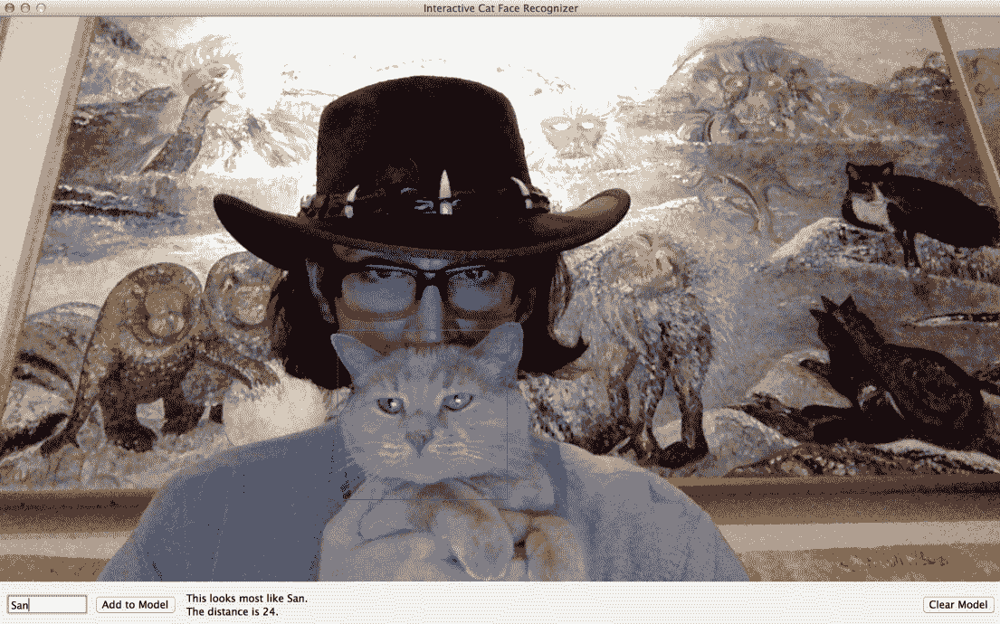
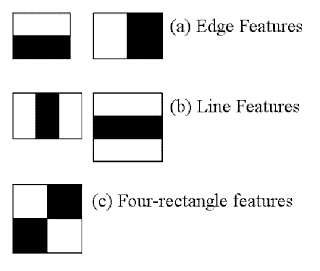
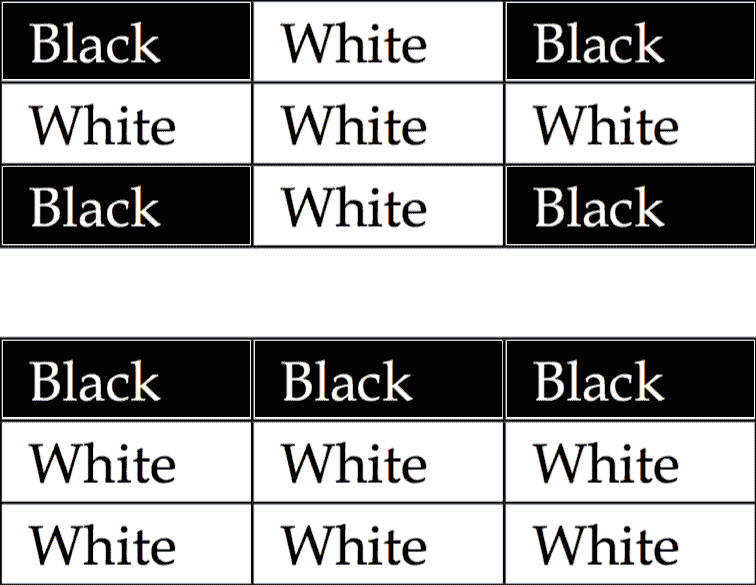
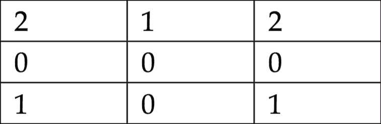
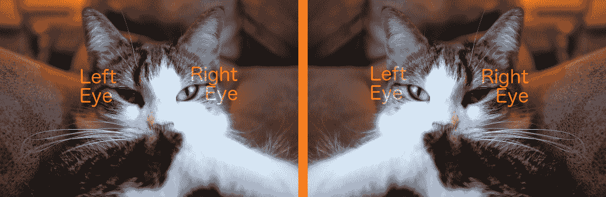
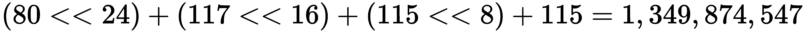
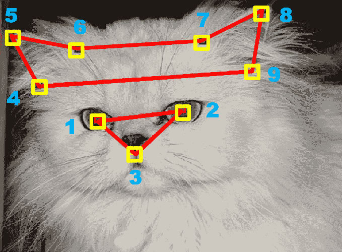
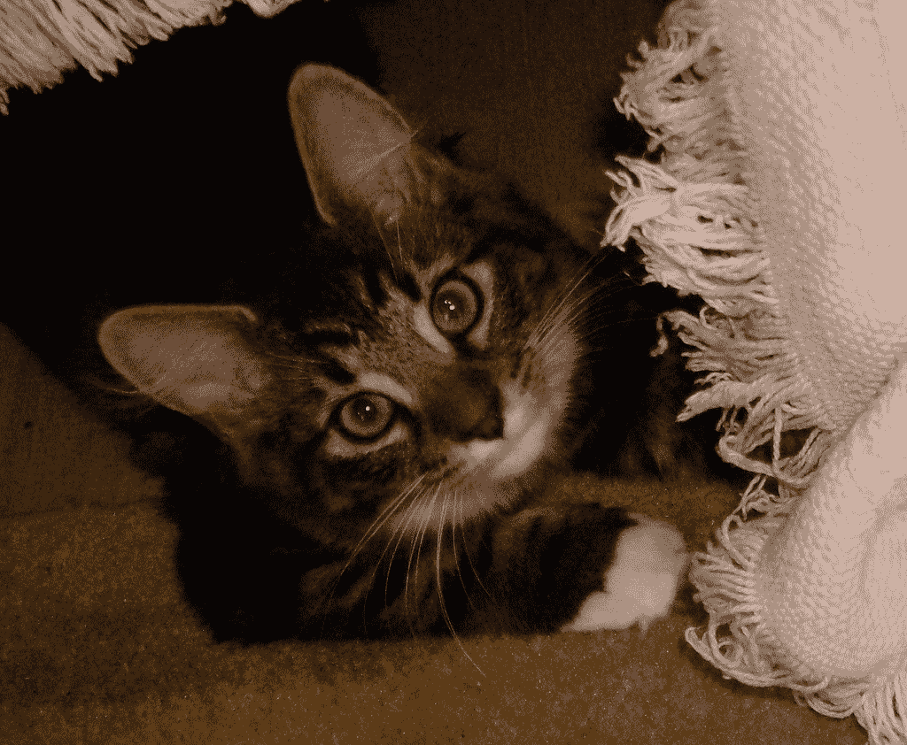
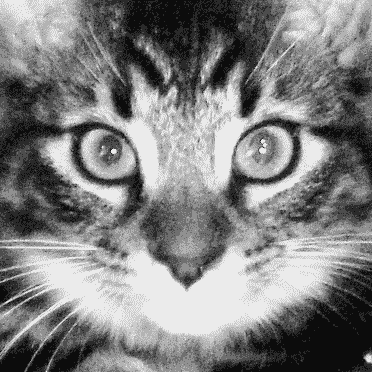
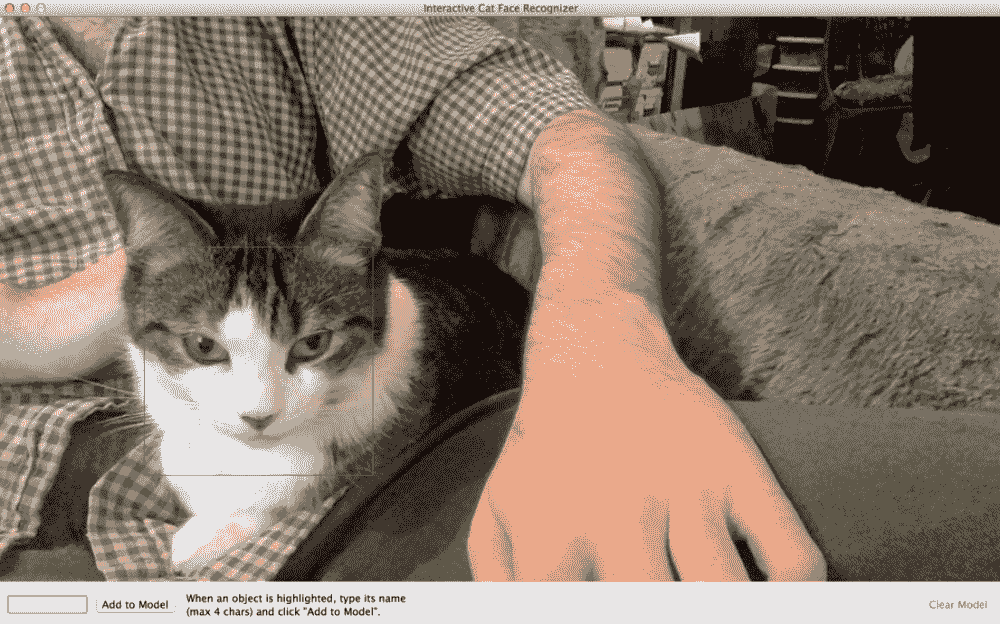

# 第三章：训练智能警报器识别恶棍和他的猫

“给猫取名是一件困难的事情。”

——T. S. 艾略特，《老猫的实用猫书》（1939 年）

“布洛菲尔德：我教过你爱鸡，爱它们的肉，爱它们的叫声。”

——《皇家密探》（1969 年）

想象一下，日期是 2015 年 1 月 1 日。世界力量的平衡再次发生转移。立陶宛加入欧元区。俄罗斯、白俄罗斯、亚美尼亚、哈萨克斯坦和吉尔吉斯斯坦正在组建欧亚经济联盟。《OpenCV for Secret Agents》的第一版即将付印。在这一天，如果你看到了恩斯特·斯塔罗·布洛菲尔德，你会认出他吗？

让我提醒你，布洛菲尔德作为**特别情报、恐怖主义、复仇和勒索执行处**（**SPECTRE**）的一把手，是一个超级恶棍，在多次逃脱詹姆斯·邦德的追捕后，由于知识产权纠纷而被写出了电影。布洛菲尔德最后一次出现在 1981 年电影《只为你的眼睛》的预告片中，我们看到他从直升机上坠落，沿着工厂的烟囱滚下，同时他喊道：“先生，波～哦～恩德！”

尽管这个戏剧性的结局，布洛菲尔德死亡的证据并不明确。毕竟，布洛菲尔德是一个众所周知难以识别的人。他的脸很少出现在镜头中。早在 20 世纪 60 年代，他就使用整形手术来改变身份，并将他的手下变成他的替身。半个世纪后，我们不得不问，布洛菲尔德是已经死去的人，还是只是经过改造，可能成为哥伦比亚肥皂剧中的美丽女演员？

一件事是肯定的。如果布洛菲尔德还活着，他会伴随着一只蓝眼睛的白色安哥拉猫（由兽医奇迹或标本保存）。抚摸这只猫是布洛菲尔德在每部电影中的标志性习惯。他的脸可能不同，但他的宠物猫是相同的。我们最后一次看到这只猫从布洛菲尔德的腿上跳出来，就在那场致命的直升机飞行之前。

一些评论员指出，布洛菲尔德和奥斯汀·鲍尔斯的宿敌德维尔博士有相似之处。然而，通过比较各自的宠物猫，我们可以证明这两个恶棍并非同一人。

道理是，两种识别方法比一种更好。尽管我们看不到这个人的脸，但我们不应该忽视他的猫。

当然，悬念在 2015 年 10 月 26 日结束，布洛菲尔德在《Spectre》中复出。他和猫在 34 年后看起来几乎没有变化。

为了自动化搜索恶棍及其猫，我们将开发一个名为`Angora Blue`的桌面或 Raspberry Pi 应用程序（一个听起来无辜的代号，指的是邦德反派角色布洛菲尔德的猫的蓝眼睛）。当它以一定程度的置信度识别到指定的恶棍或指定的猫时，`Angora Blue`会向我们发送电子邮件警报。我们还将开发一个名为`Interactive Recognizer`的 GUI 应用程序，该程序将根据我们提供的相机图像和名称训练 Angora Blue 的识别模型。为了从背景中区分面部，Interactive Recognizer 依赖于 OpenCV 附带的人类面部检测模型以及我们将使用原始脚本和第三方图像数据库训练的猫脸检测模型。

也许你听说过 OpenCV 附带了一套预训练的猫脸检测器。这是真的！我最初是为这本书的第一版开发它们的；我将它们贡献给了 OpenCV，并且我一直在对它们进行改进。本章涵盖了训练这些官方 OpenCV 猫脸检测器最新版本所使用的过程。

这是一个大章节，但它是有回报的，因为你将学习一个适用于检测和识别任何动物面部，甚至任何物体的过程！

# 技术要求

本章的项目有以下软件依赖项：

+   **以下模块的 Python 环境**：OpenCV（包括 opencv_contrib）、NumPy、SciPy、Requests、wxPython，以及可选的 PyInstaller

设置说明在第一章“准备任务”中介绍。请参考设置说明以了解任何版本要求。运行 Python 代码的基本说明在附录 C“使用 Snakes 运行（或，Python 的第一步）”中介绍。

本章的完成项目可以在本书的 GitHub 仓库中找到，[`github.com/PacktPublishing/OpenCV-4-for-Secret-Agents-Second-Edition`](https://github.com/PacktPublishing/OpenCV-4-for-Secret-Agents-Second-Edition)，在`Chapter003`文件夹中。

# 了解机器学习的一般概念

本章中的工作建立在机器学习技术的基础上，这意味着软件基于统计模型进行预测或决策。特别是，我们的方法是一种监督学习，这意味着我们（程序员和用户）向软件提供数据示例和正确响应。软件创建统计模型以从这些示例中进行外推。人类提供的示例被称为参考数据或训练数据（或在计算机视觉的上下文中称为参考图像或训练图像）。相反，软件的外推涉及测试数据（或在计算机视觉的上下文中称为测试图像或场景）。

监督学习与早期儿童教育中使用的闪卡教学法非常相似。老师向孩子展示一系列图片（训练图像）并说，

"这是一头牛。哞！这是一匹马。哞哞！"

然后，在一次农场（场景）的实地考察中，孩子可以希望区分马和牛。然而，我必须承认，我曾经把一匹马误认为是牛，并且在此之后多年里，我因为这种误分类而被人取笑。

除了在视觉和语义问题中广泛使用的监督学习之外，还有两种其他广泛的机器学习方法——无监督学习和强化学习。**无监督学习**要求软件在数据中找到某种结构，例如聚类，而人类没有分配任何意义或正确示例。分析生物结构，如基因组，是无监督学习的常见问题。另一方面，**强化学习**要求软件通过实验优化一系列问题的解决方案，其中人类分配最终目标，但软件必须设定中间目标。驾驶车辆和玩游戏是强化学习的常见问题。

除了是一个计算机视觉库之外，OpenCV 还提供了一个通用的机器学习模块，可以处理任何类型的数据，而不仅仅是图像。有关此模块和底层机器学习概念的更多信息，请参阅官方 OpenCV-Python 教程中的*机器学习*部分，链接为[`docs.opencv.org/4.0.0-beta/d6/de2/tutorial_py_table_of_contents_ml.html`](https://docs.opencv.org/4.0.0-beta/d6/de2/tutorial_py_table_of_contents_ml.html)。同时，我们的章节将继续介绍更专业的机器学习功能和概念，这些功能和概念是 OpenCV 用户经常应用于人脸检测和识别的。

# 规划交互式识别器应用

让我们从这个项目的中间层开始，即`交互式识别器`应用，以便了解所有层是如何连接的。就像第二章中提到的 Luxocator 项目一样，*全球寻找豪华住宿*，`交互式识别器`是一个使用 wxPython 构建的 GUI 应用。参考以下截图，展示了我的同事，首席科学官 Sanibel San Delphinium Andromeda，Numm 的祭司：



该应用使用一个从磁盘加载的人脸检测模型，并维护一个保存到磁盘的人脸识别模型，稍后从磁盘重新加载。用户可以指定任何检测到的人脸的身份，并将此输入添加到人脸识别模型中。检测结果通过在视频流中勾勒人脸轮廓来显示，而识别结果则通过在下面的文本中显示人脸名称来显示。为了详细说明，我们可以说该应用具有以下执行流程：

1.  从文件中加载一个人脸检测模型。检测模型的作用是从背景中区分人脸。

1.  如果在之前的`Interactive Recognizer`运行中保存了人脸识别模型，则从文件中加载人脸识别模型。如果没有这样的模型可以加载，则创建一个新的模型。识别模型的作用是区分不同个体的面部。

1.  从摄像头捕获并显示实时视频。

1.  对于视频的每一帧，如果存在，则检测最大的面部。如果检测到面部：

1.  在面部周围画一个矩形。

1.  允许用户输入面部的身份作为一个简短字符串（最多四个字符），例如`Joe`或`Puss`。当用户点击添加到模型按钮时，训练模型以识别用户指定的面部（`Joe`、`Puss`或另一个身份）。

1.  如果识别模型至少训练了一个面部，则显示识别器对当前面部的预测——即显示识别器根据识别结果认为当前面部的最可能身份，并显示该预测的距离（非置信度）度量。

1.  如果识别模型至少训练了一个面部，则允许用户按下清除模型按钮来删除模型（包括任何保存到文件中的版本）并创建一个新的模型。

1.  退出时，如果识别模型至少训练了一个面部，则将模型保存到文件中，以便在后续的`Interactive Recognizer`和`Angora Blue`运行中加载。

我们可以用“物体”这个词来泛化，而不是用“人脸”。根据加载的模型，`Interactive Recognizer`可以检测和识别任何类型的物体，而不仅仅是人脸。

我们使用一种称为**Haar 级联**的检测模型和一种称为**局部二值模式**（**LBP**）或**局部二值模式直方图**（**LBPH**）的识别模型。或者，我们可能使用 LBPH 进行检测和识别。与 Haar 级联相比，LBP 级联作为检测模型更快，但通常可靠性较低。OpenCV 附带了一些 Haar 级联和 LBP 级联文件，包括几个面部检测模型。OpenCV 还包含用于生成此类文件的命令行工具。API 提供了加载和使用 Haar 或 LBP 级联以及加载、保存、训练和使用 LBPH 识别模型的高级类。让我们看看这些模型的基本概念。

# 理解 Haar 级联和 LBPH

“Cookie Monster：嘿，你知道什么？一个被咬了一口的圆形饼干看起来像 C。一个被咬了一口的甜甜圈也看起来像 C！但它不如饼干好。哦，月亮有时也看起来像 C！但你不能吃那个。”

– “C 代表饼干，”芝麻街

想象一下云彩观察。如果你躺在地上，抬头看云彩，也许你会想象其中一朵云彩像盘子上的土豆泥堆。如果你乘坐飞机飞到这朵云彩上，你仍然会看到云彩表面与松软、多孔的土豆泥纹理之间的一些相似之处。然而，如果你能切下一块云彩并在显微镜下观察，你可能会看到与土豆泥的微观结构完全不相似的冰晶。

同样，在由像素组成的图像中，人或计算机视觉算法可以看到许多独特的形状或模式，这部分取决于放大倍数。在创建 Haar 级联的过程中，图像的各个部分会被裁剪和/或缩放，以便我们一次只考虑几个像素（尽管这些像素可能代表任何放大倍数）。这个图像样本被称为**窗口**。我们通过从其他像素中减去一些灰度像素值来测量窗口与某些常见形状的相似度，其中暗区域与亮区域相交。例如，包括边缘、角或细线，如下面的图所示。如果一个窗口与这些原型之一有很高的相似度，它可能被选为**特征**。我们期望在所有相同主题的图像中，相似特征在相对位置和放大倍数上都是相似的：



并非所有特征都具有同等的重要性。在一系列图像中，我们可以看到某个特征是否真正是包含我们的主题（**正训练集**）的图像的典型特征，以及是否是不包含我们的主题（**负训练集**）的图像的不典型特征。我们根据特征区分主题和非主题的能力给予它们不同的排名或**阶段**。一组阶段共同构成一个**级联**或一系列比较标准。每个阶段都必须通过才能达到阳性检测结果。相反，可以通过更少的阶段达到阴性检测结果，可能只有一个阶段（一个重要的优化）。像训练图像一样，场景通过各种窗口进行检查，我们最终可能在单个场景中检测到多个主题。

关于 OpenCV 中的 Haar 级联，请参阅官方文档[`docs.opencv.org/4.0.0-beta/d7/d8b/tutorial_py_face_detection.html`](https://docs.opencv.org/4.0.0-beta/d7/d8b/tutorial_py_face_detection.html)获取更多信息。

如其名所示，LBPH 模型基于一种直方图。对于窗口中的每个像素，我们记录在特定半径内的每个相邻像素是更亮还是更暗。我们的直方图计算每个相邻位置中的暗像素数量。例如，假设一个窗口包含以下两个半径为 1 像素的邻域：



计算这两个邻域（尚未计算窗口中的其他邻域），我们的直方图可以可视化如下：



如果我们为多个主题计算多组参考图像的 LBPH，我们可以确定哪一组 LBPH 参考与场景中某一部分（如检测到的人脸）的 LBPH 最接近。基于最接近的参考集，我们可以预测场景中人脸（或其他对象）的身份。

LBPH 模型擅长捕捉任何主题的精细纹理细节，而不仅仅是人脸。此外，它适用于模型需要更新的应用，例如`交互式识别器`。任何两张图像的直方图都是独立计算的，因此可以添加新的参考图像而无需重新计算模型的其他部分。

OpenCV 还实现了其他在人脸识别中流行的模型，即 Eigenfaces 和 Fisherfaces。我们使用 LBPH 是因为它支持实时更新，而 Eigenfaces 和 Fisherfaces 则不支持。有关这三个识别模型的更多信息，请参阅官方文档[`docs.opencv.org/4.0.0-beta/da/d60/tutorial_face_main.html`](https://docs.opencv.org/4.0.0-beta/da/d60/tutorial_face_main.html)。

或者，对于检测而不是识别，我们可以将 LBPH 模型组织成多个测试的级联，就像 Haar 级联一样。与 LBPH 识别模型不同，LBP 级联不能实时更新。

Haar 级联、LBP 级联和 LBPH 识别模型对旋转或翻转不稳健。例如，如果我们倒置地看一个脸，那么仅用直立脸训练的 Haar 级联将无法检测到它。同样，如果我们有一个为一只脸的左侧是黑色、右侧是橙色的猫训练的 LBPH 识别模型，那么在镜子中，模型可能无法识别出同一只猫。例外的情况是，我们可以将镜像图像包含在训练集中，但这样可能会对另一只脸的左侧是橙色、右侧是黑色的猫产生误报识别。

除非另有说明，否则我们可以假设 Haar 级联或 LBPH 模型是为一个**直立**的主题训练的。也就是说，主题在图像坐标空间中没有被倾斜或倒置。如果一个人头朝下站立，我们可以通过将相机倒置或，等价地，在软件中应用 180 度旋转来拍摄他的直立人脸照片。

一些其他方向术语也值得注意。一个*正面*、*背面*或*侧面*主题在图像中可见其正面、背面或侧面。包括 OpenCV 的作者在内的大多数计算机视觉人员，在图像坐标空间中表达*左*和*右*。例如，如果我们说*左眼*，对于一个直立、正面、非镜像的面孔，我们指的是主体的右手眼，因为在图像空间中，左右与直立、正面、非镜像主体的左手和右手方向相反。

以下截图显示了我们在非镜像图像（左）和镜像图像（右）中如何标记*左眼*和*右眼*：



我们的人类和猫检测器处理直立、正面的面孔。

当然，在现实世界的照片中，我们无法期望人脸完全直立。人的头部或相机可能略有倾斜。此外，我们无法期望边界区域，即人脸与背景相交的区域，在图像中相似。我们必须非常小心地预处理训练图像，以便人脸旋转到几乎完美的直立姿态，并裁剪掉边界区域。在裁剪时，我们应该将人脸的主要特征，如眼睛，放置在一致的位置。这些考虑在*规划猫检测模型*部分中进一步讨论，这部分在本章的后面。

如果我们必须检测各种旋转的人脸，一个选项是在将场景发送到检测器之前旋转场景。例如，我们可以尝试在原始场景中检测人脸，然后在旋转了 15 度的场景版本中检测，然后是旋转了 15 度（345 度）的场景版本，然后是旋转了 30 度的场景版本，依此类推。同样，我们可以将场景的镜像版本发送到检测器。根据测试场景变体的数量，这种方法可能对于实时使用来说太慢，因此我们在这章中没有使用它。

# 实现交互式识别器应用程序

让我们创建一个新的文件夹，我们将在这个文件夹中存储本章的项目，包括以下与`Interactive Recognizer`相关的子文件夹和文件：

+   `cascades/haarcascade_frontalface_alt.xml`: 这是一个用于检测正面人脸的检测模型。它应该与 OpenCV 一起包含在路径中，例如 `<opencv_unzip_destination>/data/haarcascades/haarcascade_frontalface_alt.xml`，或者对于 MacPorts 安装，在 `/opt/local/share/OpenCV/haarcascades/haarcascade_frontalface_alt.xml`。复制或链接到该版本。（或者，可以从本书的 GitHub 仓库中获取它）。

+   `cascades/lbpcascade_frontalface.xml`: 用于检测正面人脸的另一种（更快但可靠性较低）的检测模型。它应包含在 OpenCV 中，路径如`<opencv_unzip_destination>/data/lbpcascades/lbpcascade_frontalface.xml`，或者对于 MacPorts 安装，在`/opt/local/share/OpenCV/lbpcascades/lbpcascade_frontalface.xml`。复制或链接到该版本。或者，您也可以从本书的 GitHub 仓库中获取。

+   `cascades/haarcascade_frontalcatface.xml`: 用于检测正面猫科面部模型的检测模型。我们将在本章后面构建它。或者，您也可以从本书的 GitHub 仓库中获取预构建版本。

+   `cascades/haarcascade_frontalcatface_extended.xml`: 用于检测正面猫科面部面的另一种检测模型。此版本对对角线图案敏感，可能包括胡须和耳朵。我们将在本章后面构建它。（或者，您也可以从本书的 GitHub 仓库中获取预构建版本。）

+   `cascades/lbpcascade_frontalcatface.xml`: 用于检测正面猫科面部面的另一种（更快但可靠性较低）的检测模型。我们将在本章后面构建它。（或者，您也可以从本书的 GitHub 仓库中获取预构建版本。）

+   `recognizers/lbph_human_faces.xml`: 某些人类个体面部识别模型。它由`InteractiveHumanFaceRecognizer.py`生成，如下所述。

+   `recognizers/lbph_cat_faces.xml`: 某些猫科个体面部识别模型。它由`InteractiveCatFaceRecognizer.py`生成，如下所述。

+   `ResizeUtils.py`: 用于调整图像大小的实用函数。它复制或链接到上一章的`ResizeUtils.py`版本。我们将在本节中添加一个调整摄像头捕获尺寸的函数。

+   `WxUtils.py`: 用于 wxPython GUI 应用程序的实用函数。它复制或链接到第二章，*全球寻找豪华住宿*版本的`WxUtils.py`。

+   `BinasciiUtils.py`: 用于将可读标识符转换为数字及其反向转换的实用函数。

+   `InteractiveRecognizer.py`: 封装`Interactive Recognizer`应用程序的类，并公开某些配置变量。我们将在本节中实现它。

+   `InteractiveHumanFaceRecognizer.py`: 启动配置为检测正面人脸的 Interactive Recognizer 版本的脚本。我们将在本节中实现它。

+   `InteractiveCatFaceRecognizer.py`: 启动配置为检测正面猫科面部面的 Interactive Recognizer 版本的脚本。我们将在本节中实现它。

让我们从向现有的 `ResizeUtils` 模块添加功能开始。我们希望能够指定相机捕获图像的分辨率。相机输入由一个名为 `VideoCapture` 的 OpenCV 类表示，该类具有与各种相机参数相关的 `get` 和 `set` 方法，包括分辨率。（顺便提一下，`VideoCapture` 也可以表示视频文件。）不能保证给定的捕获分辨率被给定的相机支持。我们需要检查尝试设置捕获分辨率时的成功或失败。因此，让我们向 `ResizeUtils.py` 添加以下实用函数，以尝试设置捕获分辨率并返回实际的捕获分辨率：

```py
def cvResizeCapture(capture, preferredSize):

    # Try to set the requested dimensions.
    w, h = preferredSize
    capture.set(cv2.CAP_PROP_FRAME_WIDTH, w)
    capture.set(cv2.CAP_PROP_FRAME_HEIGHT, h)

    # Sometimes the dimensions fluctuate at the start of capture.
    # Discard two frames to allow for this.
    capture.read()
    capture.read()

    # Try to return the actual dimensions of the third frame.
    success, image = capture.read()
    if success and image is not None:
        h, w = image.shape[:2]
    return (w, h) 
```

现在，让我们考虑我们新的 `BinasciiUtils` 模块的要求。OpenCV 的识别器使用 32 位整数作为标识符。对于 GUI，要求用户给一个脸一个数字，而不是一个名字，并不是很友好。我们可以保留一个将数字映射到名字的字典，并且我们可以将这个字典与识别模型一起保存到磁盘上，但这是我的更懒惰的解决方案。四个或更少的 ASCII 字符可以转换为 32 位整数（反之亦然）。例如，考虑名字 *Puss*，其中字母的 ASCII 码分别是 *80*，*117*，*115* 和 *115*。记住每个字母是一个字节或 8 位，我们可以应用位移操作来获取以下值：



我们将允许用户输入最多四个字符的名字，而在幕后，我们将将其转换为模型存储的 32 位整数。让我们创建 `BinasciiUtils.py`，并将以下导入和转换函数放入其中：

```py
import binascii

def fourCharsToInt(s):
    return int(binascii.hexlify(bytearray(s, 'ascii')), 16)

def intToFourChars(i):
    return binascii.unhexlify(format(i, 'x')).decode('ascii')
```

现在，让我们开始编写 `InteractiveRecognizer.py`。它应该以以下 `import` 语句开始：

```py
import numpy
import cv2
import os
import sys
import threading
import wx

import BinasciiUtils
import ResizeUtils
import WxUtils
```

我们的 `InteractiveRecognizer` 应用程序类接受几个参数，允许我们创建具有不同标题、高亮颜色、识别模型、检测模型和检测行为调整的不同变体的应用程序。让我们看看初始化器的声明：

```py
class InteractiveRecognizer(wx.Frame):

    def __init__(self, recognizerPath, cascadePath,
                 scaleFactor=1.3, minNeighbors=4,
                 minSizeProportional=(0.25, 0.25),
                 rectColor=(0, 255, 0),
                 cameraDeviceID=0, imageSize=(1280, 720),
                 title='Interactive Recognizer'):
```

初始化器的参数定义如下：

+   `recognizerPath`：这是包含识别模型的文件。当应用程序启动时，此文件不需要存在。相反，当应用程序退出时，识别模型（如果有的话）将保存在这里。

+   `cascadePath`：这是包含检测模型的文件。当应用程序启动时，此文件必须存在。

+   `scaleFactor`：检测器在几个不同的尺度上搜索人脸。此参数指定每个尺度与下一个较小尺度之间的比率。较大的比率意味着搜索更快，但检测更少。

+   `minNeighbors`: 如果检测器遇到两个可能都被识别为面部且重叠的区域，它们被称为邻居。`minNeighbors`参数指定面部必须具有的最小邻居数才能通过检测。当`minNeighbors>0`时，其理由是真正的面部可以在几个不同的位置裁剪并仍然看起来像面部。所需邻居数量越多，检测越少，误报比例越低。

+   `minSizeProportional`: 面部的最小宽度和高度以相机垂直分辨率或水平分辨率（取较小者）的比例表示。例如，如果相机分辨率为*640 x 480*，且`minSizeProportional=(0.25, 0.25)`，则面部必须至少测量*120 x 120*（以像素为单位）才能通过检测。更大的最小尺寸意味着搜索更快，但检测更少。`(0.25, 0.25)`默认值适用于接近网络摄像头的面部。

+   `rectColor`: 这是用于描绘检测到的面部的矩形的颜色。像 OpenCV 中的大多数颜色元组一样，它以**蓝色、绿色和红色**（**BGR**）的顺序指定（不是 RGB）。

+   `cameraDeviceID`: 这是用于输入的相机的设备 ID。通常，网络摄像头从`0`开始编号，任何连接的外部网络摄像头都排在任何内部网络摄像头之前。一些相机驱动程序保留固定的设备 ID。例如，OpenNI 为 Kinect 保留`900`，为 Asus Xtion 保留`910`。

+   `imageSize`: 这是捕获图像的首选分辨率。如果相机不支持此分辨率，将使用另一个分辨率。

+   `title`: 应用程序标题，如窗口标题栏所示。

我们还提供了一个公共布尔变量来配置是否镜像相机流。默认情况下，它是镜像的，因为用户发现镜像中的自己图像更直观：

```py
        self.mirrored = True
```

另一个布尔值跟踪应用程序是否仍在运行或是否正在关闭。此信息与清理后台线程相关：

```py
        self._running = True
```

使用名为`cv2.VideoCapture`的 OpenCV 类，我们打开相机流并获取其分辨率，如下所示：

```py
        self._capture = cv2.VideoCapture(cameraDeviceID)
        size = ResizeUtils.cvResizeCapture(
                self._capture, imageSize)
        self._imageWidth, self._imageHeight = size
```

我们定义变量来存储我们将要捕获、处理和显示的图像。最初，这些变量为`None`。为了在一个线程中捕获和处理图像，然后在另一个线程中将它们绘制到屏幕上，我们将使用一种称为**双缓冲**的模式。当在一个线程上准备一个帧（**后缓冲区**）时，另一个帧（**前缓冲区**）将在第二个线程上绘制。当两个线程都完成了一轮工作后，我们将交换缓冲区，使旧的后缓冲区成为新的前缓冲区，反之亦然（通过简单地更改引用，而不复制数据）。为了以线程安全的方式完成此操作，我们需要声明一个**互斥锁**（也称为**mutex**），它代表一个权限或资源（在这种情况下，访问前缓冲区），一次只能由一个线程获取。我们将在本节的后续内容中看到锁的使用，在`_onVideoPanelPaint`和`_runCaptureLoop`方法中。现在，以下是图像和锁的初始声明：

```py
        self._image = None
        self._grayImage = None
        self._equalizedGrayImage = None

        self._imageFrontBuffer = None
        self._imageFrontBufferLock = threading.Lock()
```

接下来，我们设置与检测和识别相关的变量。其中许多变量仅用于存储后续使用的初始化参数。此外，我们保留对当前检测到的脸的引用，初始值为`None`。我们初始化一个 LBPH 识别器，并加载在之前的运行中可能保存的任何识别模型。同样，我们通过从文件加载 Haar 级联或 LBP 级联来初始化一个检测器。以下是相关代码：

```py
        self._currDetectedObject = None

        self._recognizerPath = recognizerPath
        self._recognizer = cv2.face.LBPHFaceRecognizer_create()
        if os.path.isfile(recognizerPath):
            self._recognizer.read(recognizerPath)
            self._recognizerTrained = True
        else:
            self._recognizerTrained = False

        self._detector = cv2.CascadeClassifier(cascadePath)
        self._scaleFactor = scaleFactor
        self._minNeighbors = minNeighbors
        minImageSize = min(self._imageWidth, self._imageHeight)
        self._minSize = (int(minImageSize * minSizeProportional[0]),
                         int(minImageSize * minSizeProportional[1]))
        self._rectColor = rectColor
```

在设置了与计算机视觉相关的变量之后，我们继续进行 GUI 实现，这主要是样板代码。首先，在以下代码片段中，我们设置了具有特定样式、大小、标题和背景色的窗口，并为其关闭事件绑定了一个处理程序：

```py
        style = wx.CLOSE_BOX | wx.MINIMIZE_BOX | wx.CAPTION | \
            wx.SYSTEM_MENU | wx.CLIP_CHILDREN
        wx.Frame.__init__(self, None, title=title,
                          style=style, size=size)
        self.SetBackgroundColour(wx.Colour(232, 232, 232))

        self.Bind(wx.EVT_CLOSE, self._onCloseWindow)
```

接下来，我们为*Escape*键设置一个回调。由于键不是一个 GUI 小部件，没有直接与键关联的`Bind`方法，我们需要以与我们之前使用 wxWidgets 看到的不同方式设置回调。我们将一个新的菜单事件和回调绑定到`InteractiveRecognizer`实例上，并使用名为`wx.AcceleratorTable`的类将键盘快捷键映射到菜单事件。（然而，请注意，我们的应用程序实际上没有菜单，也不需要实际的菜单项来使键盘快捷键工作。）以下是代码：

```py
        quitCommandID = wx.NewId()
        self.Bind(wx.EVT_MENU, self._onQuitCommand,
                  id=quitCommandID)
        acceleratorTable = wx.AcceleratorTable([
            (wx.ACCEL_NORMAL, wx.WXK_ESCAPE, quitCommandID)
        ])
        self.SetAcceleratorTable(acceleratorTable)
```

以下代码初始化了 GUI 小部件（包括视频面板、文本框、按钮和标签）并设置了它们的事件回调：

```py
        self._videoPanel = wx.Panel(self, size=size)
        self._videoPanel.Bind(
                wx.EVT_ERASE_BACKGROUND,
                self._onVideoPanelEraseBackground)
        self._videoPanel.Bind(
                wx.EVT_PAINT, self._onVideoPanelPaint)

        self._videoBitmap = None

        self._referenceTextCtrl = wx.TextCtrl(
                self, style=wx.TE_PROCESS_ENTER)
        self._referenceTextCtrl.SetMaxLength(4)
        self._referenceTextCtrl.Bind(
                wx.EVT_KEY_UP, self._onReferenceTextCtrlKeyUp)

        self._predictionStaticText = wx.StaticText(self)
        # Insert an endline for consistent spacing.
        self._predictionStaticText.SetLabel('\n')

        self._updateModelButton = wx.Button(
                self, label='Add to Model')
        self._updateModelButton.Bind(
                wx.EVT_BUTTON, self._updateModel)
        self._updateModelButton.Disable()

        self._clearModelButton = wx.Button(
                self, label='Clear Model')
        self._clearModelButton.Bind(
                wx.EVT_BUTTON, self._clearModel)
        if not self._recognizerTrained:
            self._clearModelButton.Disable()
```

与 Luxocator（第二章，*全球寻找豪华住宿*，项目）类似，`Interactive Recognizer`将图像放置在顶部，并在底部放置一行控件。以下是布局代码：

```py
        border = 12

        controlsSizer = wx.BoxSizer(wx.HORIZONTAL)
        controlsSizer.Add(self._referenceTextCtrl, 0,
                          wx.ALIGN_CENTER_VERTICAL | wx.RIGHT,
                          border)
        controlsSizer.Add(
                self._updateModelButton, 0,
                wx.ALIGN_CENTER_VERTICAL | wx.RIGHT, border)
        controlsSizer.Add(self._predictionStaticText, 0,
                          wx.ALIGN_CENTER_VERTICAL)
        controlsSizer.Add((0, 0), 1) # Spacer
        controlsSizer.Add(self._clearModelButton, 0,
                          wx.ALIGN_CENTER_VERTICAL)

        rootSizer = wx.BoxSizer(wx.VERTICAL)
        rootSizer.Add(self._videoPanel)
        rootSizer.Add(controlsSizer, 0, wx.EXPAND | wx.ALL, border)
        self.SetSizerAndFit(rootSizer)
```

最后，初始化器启动一个后台线程，执行图像捕获和图像处理，包括检测和识别。在后台线程上执行密集的计算机视觉工作很重要，这样就不会阻碍 GUI 事件的处理。以下是启动线程的代码：

```py
        self._captureThread = threading.Thread(
                target=self._runCaptureLoop)
        self._captureThread.start()
```

由于有各种输入事件和后台工作，`InteractiveRecognizer` 有许多方法以不确定的顺序运行。我们首先查看输入事件处理器，然后再继续到图像处理管道（捕获、处理和显示），这部分工作在后台线程上运行。

当窗口关闭时，我们确保后台线程停止。然后，如果识别模型已训练，我们将其保存到文件。以下是相关回调的实现：

```py
    def _onCloseWindow(self, event):
        self._running = False
        self._captureThread.join()
        if self._recognizerTrained:
            modelDir = os.path.dirname(self._recognizerPath)
            if not os.path.isdir(modelDir):
                os.makedirs(modelDir)
            self._recognizer.write(self._recognizerPath)
        self.Destroy()
```

除了点击窗口的标准 *X* 按钮关闭窗口外，我们还在 `_onQuitCommand` 回调中关闭它，该回调与 *Esc* 按钮相关联。回调的实现如下所示：

```py
    def _onQuitCommand(self, event):
        self.Close()
```

我们通过什么都不做来处理视频面板的擦除事件，因为我们只想在旧的视频帧上绘制，而不是擦除它。我们通过获取锁来处理视频面板的绘制事件，该锁为我们提供了对前图像缓冲区的线程安全访问，将图像转换为 wxPython 位图，然后将位图绘制到面板上。以下是以下代码中两个相关回调的实现：

```py
    def _onVideoPanelEraseBackground(self, event):
        pass

    def _onVideoPanelPaint(self, event):

        self._imageFrontBufferLock.acquire()

        if self._imageFrontBuffer is None:
            self._imageFrontBufferLock.release()
            return

        # Convert the image to bitmap format.
        self._videoBitmap = \
                WxUtils.wxBitmapFromCvImage(self._imageFrontBuffer)

        self._imageFrontBufferLock.release()

        # Show the bitmap.
        dc = wx.BufferedPaintDC(self._videoPanel)
        dc.DrawBitmap(self._videoBitmap, 0, 0)
```

当用户在文本字段中添加或删除文本时，我们的 `_onReferenceTextCtrlKeyUp` 回调（如下所示）调用一个辅助方法来检查是否应该启用或禁用“添加到模型”按钮：

```py
    def _onReferenceTextCtrlKeyUp(self, event):
        self._enableOrDisableUpdateModelButton()
```

当点击“添加到模型”按钮时，其回调为识别模型提供新的训练数据。如果 LBPH 模型没有先前的训练数据，我们必须使用识别器的 `train` 方法；否则，我们必须使用其 `update` 方法。两种方法都接受两个参数——一个图像列表（人脸）和一个整数 NumPy 数组（人脸标识符）。我们一次只使用一张图像来训练或更新模型，以便用户可以交互式地测试模型每次增量更改的效果。图像是最近检测到的人脸，标识符是通过我们的 `BinasciiUtils.fourCharsToInt` 函数从文本字段中的文本转换而来的。以下是“添加到模型”按钮回调的实现：

```py
    def _updateModel(self, event):
        labelAsStr = self._referenceTextCtrl.GetValue()
        labelAsInt = BinasciiUtils.fourCharsToInt(labelAsStr)
        src = [self._currDetectedObject]
        labels = numpy.array([labelAsInt])
        if self._recognizerTrained:
            self._recognizer.update(src, labels)
        else:
            self._recognizer.train(src, labels)
            self._recognizerTrained = True
            self._clearModelButton.Enable()
```

当点击“清除模型”按钮时，其回调删除识别模型（包括任何已保存到磁盘的版本）并创建一个新的模型。此外，我们记录模型未训练，并禁用“清除模型”按钮，直到模型重新训练。以下是以下代码中的实现：

```py
    def _clearModel(self, event=None):
        self._recognizerTrained = False
        self._clearModelButton.Disable()
        if os.path.isfile(self._recognizerPath):
            os.remove(self._recognizerPath)
        self._recognizer = cv2.face.LBPHFaceRecognizer_create()
```

我们的背景线程运行一个循环。在每次迭代中，我们使用 `VideoCapture` 对象的 `read` 方法捕获一个图像。与图像一起，`read` 方法返回一个 `success` 标志，我们不需要它，因为我们只是检查图像是否为 `None`。如果图像不是 `None`，我们调用一个名为 `_detectAndRecognize` 的辅助方法，然后我们可能镜像图像以进行显示。我们还获取锁以执行线程安全的交换前后图像缓冲区。交换后，我们告诉视频面板通过绘制新前缓冲区中的位图来刷新自己。以下是以下代码中循环的实现：

```py
    def _runCaptureLoop(self):
        while self._running:
            success, self._image = self._capture.read(
                    self._image)
            if self._image is not None:
                self._detectAndRecognize()
                if (self.mirrored):
                    self._image[:] = numpy.fliplr(self._image)

                # Perform a thread-safe swap of the front and
                # back image buffers.
                self._imageFrontBufferLock.acquire()
                self._imageFrontBuffer, self._image = \
                        self._image, self._imageFrontBuffer
                self._imageFrontBufferLock.release()

                # Send a refresh event to the video panel so
                # that it will draw the image from the front
                # buffer.
                self._videoPanel.Refresh()
```

通过调用 `self._capture.read(self._image)`，我们告诉 OpenCV 重新使用 `self._image` 中的图像缓冲区（如果 `self.image` 不是 `None` 且大小正确），这样每次捕获新帧时就不需要分配新内存。或者，也可以调用 `self._capture.read()` 而不带参数；在这种情况下，每次捕获新帧时都会分配新内存。

回想一下，我们的循环在 `_onCloseWindow` 回调将 `_running` 设置为 `False` 后结束。

`_detectAndRecognize` 辅助方法也在后台线程上运行。它首先创建图像的均衡灰度版本。均衡的图像具有大约均匀的直方图；也就是说，对于某个箱子大小，每个灰度值箱子中的像素数量大约相等。这是一种对比度调整，使得主题的外观在不同光照条件和不同图像的曝光设置下更加可预测；因此，它有助于检测或识别。我们将均衡的图像传递给分类器的 `detectMultiScale` 方法，同时使用在 `InteractiveRecognizer` 初始化期间指定的 `scaleFactor`、`minNeighbors` 和 `minSize` 参数。作为 `detectMultiScale` 的返回值，我们得到一系列矩形测量值，描述了检测到的面部边界。为了显示，我们在这些面部周围绘制绿色轮廓。如果至少检测到一个面部，我们将第一个面部的均衡灰度版本存储在 `_currDetectedObject` 成员变量中。以下是 `_detectAndRecognize` 方法第一部分的实现：

```py
    def _detectAndRecognize(self):
        self._grayImage = cv2.cvtColor(
                self._image, cv2.COLOR_BGR2GRAY,
                self._grayImage)
        self._equalizedGrayImage = cv2.equalizeHist(
                self._grayImage, self._equalizedGrayImage)
        rects = self._detector.detectMultiScale(
                self._equalizedGrayImage,
                scaleFactor=self._scaleFactor,
                minNeighbors=self._minNeighbors,
                minSize=self._minSize)
        for x, y, w, h in rects:
            cv2.rectangle(self._image, (x, y), (x+w, y+h),
                          self._rectColor, 1)
        if len(rects) > 0:
            x, y, w, h = rects[0]
            self._currDetectedObject = cv2.equalizeHist(
                    self._grayImage[y:y+h, x:x+w])
```

注意，我们在裁剪检测到的面部区域后单独对其进行均衡。这使得我们能够得到一个更好地适应面部局部对比度的均衡结果，而不是整个图像的全局对比度。

如果当前检测到人脸且识别模型至少为一个人训练过，我们可以继续预测人脸的身份。我们将均衡化的人脸传递给识别器的`predict`方法，并得到两个返回值——一个整数标识符和距离（非置信度）的度量。使用我们的`BinasciiUtils.intToFourChars`函数，我们将整数转换为字符串（最多四个字符），这将是用户之前输入的其中一个人脸名称。我们显示名称和距离。如果发生错误（例如，如果从文件加载了无效的模型），我们删除并重新创建模型。如果模型尚未训练，我们显示有关训练模型的说明。以下是`_detectAndRecognize`方法此中间部分的实现：

```py
            if self._recognizerTrained:
                try:
                    labelAsInt, distance = self._recognizer.predict(
                            self._currDetectedObject)
                    labelAsStr = BinasciiUtils.intToFourChars(labelAsInt)
                    self._showMessage(
                            'This looks most like %s.\n'
                            'The distance is %.0f.' % \
                            (labelAsStr, distance))
                except cv2.error:
                    print >> sys.stderr, \
                            'Recreating model due to error.'
                    self._clearModel()
            else:
                self._showInstructions()
```

如果没有检测到人脸，我们将`_currDetectedObject`设置为`None`，并显示说明（如果模型尚未训练）或没有描述性文本。在所有情况下，我们通过确保添加到模型按钮按适当的方式启用或禁用来结束`_detectAndRecognize`方法。以下是该方法实现的最后部分：

```py
        else:
            self._currDetectedObject = None
            if self._recognizerTrained:
                self._clearMessage()
            else:
                self._showInstructions()

        self._enableOrDisableUpdateModelButton()
```

只有当检测到人脸且文本字段不为空时，才应启用添加到模型按钮。我们可以以下述方式实现此逻辑：

```py
    def _enableOrDisableUpdateModelButton(self):
        labelAsStr = self._referenceTextCtrl.GetValue()
        if len(labelAsStr) < 1 or \
                    self._currDetectedObject is None:
            self._updateModelButton.Disable()
        else:
            self._updateModelButton.Enable()
```

由于我们在几种不同的条件下设置了标签的文本，我们使用以下辅助函数来减少代码的重复，如下面的代码所示：

```py
    def _showInstructions(self):
        self._showMessage(
                'When an object is highlighted, type its name\n'
                '(max 4 chars) and click "Add to Model".')

    def _clearMessage(self):
        # Insert an endline for consistent spacing.
        self._showMessage('\n')

    def _showMessage(self, message):
        wx.CallAfter(self._predictionStaticText.SetLabel, message)
```

注意使用`wx.CallAfter`函数以确保标签在主线程上更新。

这就是`交互式识别器`的所有功能。现在，我们只需要编写两个应用变体的`main`函数，从`交互式人脸识别器`开始。作为`InteractiveRecognizer`初始化器的参数，我们提供应用的标题以及相关检测模型和识别模型的 PyInstaller 兼容路径。我们运行应用。以下是实现，我们可能将其放在`InteractiveHumanFaceRecognizer.py`中：

```py
#!/usr/bin/env python

import wx

from InteractiveRecognizer import InteractiveRecognizer
import PyInstallerUtils

def main():
    app = wx.App()
    recognizerPath = PyInstallerUtils.resourcePath(
            'recognizers/lbph_human_faces.xml')
    cascadePath = PyInstallerUtils.resourcePath(
            # Uncomment the next argument for LBP.
            #'cascades/lbpcascade_frontalface.xml')
            # Uncomment the next argument for Haar.
            'cascades/haarcascade_frontalface_alt.xml')
    interactiveRecognizer = InteractiveRecognizer(
            recognizerPath, cascadePath,
            title='Interactive Human Face Recognizer')
    interactiveRecognizer.Show()
    app.MainLoop()

if __name__ == '__main__':
    main()
```

记住`cascades/haarcascade_frontalface_alt.xml`或`cascades/lpbcascade_frontalface.xml`需要从 OpenCV 样本或本书的 GitHub 仓库中获取。现在可以自由测试`交互式人脸识别器`了！

我们应用的第二个变体，`交互式猫脸识别器`，使用非常相似的代码。我们更改了应用标题和检测和识别模型的路径。此外，我们将`scaleFactor`值降低到`1.2`，将`minNeighbors`值降低到`1`，将`minSizeProportional`值设置为(`0.125`, `0.125`)，使检测器略微更敏感。（猫脸比人脸小，我们的猫脸检测模型最终证明比我们的人脸检测模型更不容易出现误报，因此这些调整是合适的。）以下是实现，我们可能将其放在`InteractiveCatFaceRecognizer.py`中：

```py
#!/usr/bin/env python

import wx

from InteractiveRecognizer import InteractiveRecognizer
import PyInstallerUtils

def main():
    app = wx.App()
    recognizerPath = PyInstallerUtils.resourcePath(
            'recognizers/lbph_cat_faces.xml')
    cascadePath = PyInstallerUtils.resourcePath(
            # Uncomment the next argument for LBP.
            #'cascades/lbpcascade_frontalcatface.xml')
            # Uncomment the next argument for Haar with basic
            # features.
            #'cascades/haarcascade_frontalcatface.xml')
            # Uncomment the next argument for Haar with extended
            # features.
            'cascades/haarcascade_frontalcatface_extended.xml')
    interactiveRecognizer = InteractiveRecognizer(
            recognizerPath, cascadePath,
            scaleFactor=1.2, minNeighbors=1,
            minSizeProportional=(0.125, 0.125),
            title='Interactive Cat Face Recognizer')
    interactiveRecognizer.Show()
    app.MainLoop()

if __name__ == '__main__':
    main()
```

在这个阶段，`交互式猫脸识别器`无法正常运行，因为`cascades/haarcascade_frontalcatface.xml`、`cascades/haarcascade_frontalcatface_extended.xml`或`cascades/lpbcascade_frontalcatface.xml`文件不存在（除非您已从本书的 GitHub 仓库中复制了预构建版本）。很快，我们将创建它！

# 计划猫检测模型

当我说“很快”时，我的意思是几天之内。训练 Haar 级联需要大量的处理时间。训练 LBP 级联相对较快。然而，在两种情况下，我们都需要在开始之前下载一些大型的图像集合。请确保有一个可靠的互联网连接、电源插座、至少 4GB 的空闲磁盘空间，以及你能找到的最快 CPU 和最大 RAM。不要在树莓派上尝试这个项目部分。请将计算机远离外部热源或可能阻挡其风扇的东西。我训练 Haar 级联的处理时间是 24 小时（或者更多，对于对对角线图案敏感的、对胡须友好的版本），在 MacBook Pro 上使用四个核心，CPU 主频为 2.6 GHz，RAM 为 16 GB。

我们使用以下几组图像，这些图像可以免费用于研究目的：

+   **PASCAL 视觉对象类别挑战 2007**（**VOC2007**）数据集。VOC2007 包含了 10,000 张在不同背景、不同光照条件下的不同主题图像，因此它适合作为我们负样本训练集的基础。这些图像附带注释数据，包括每张图像中猫的数量（通常是 0）。因此，在构建我们的负样本训练集时，我们可以轻松地排除包含猫的图像。

+   来自**加州理工学院**（**Caltech**）的正面人脸数据集。这个集合包含了 450 张在不同光照条件和不同背景下的正面人脸图像。这些图像对我们负样本训练集是一个有用的补充，因为我们的正面猫脸检测器可能会部署在正面人脸也可能存在的场所。这些图像中没有任何一张包含猫。

+   Urtho 负样本训练集，最初是名为**Urtho**的一个人脸和眼脸检测项目的一部分。这个集合包含了 3,000 张不同背景的图像。这些图像中没有任何一张包含猫。

+   微软研究院的猫头数据集（*微软猫数据集 2008*）包含 10,000 张猫在不同背景和光照条件下的图像。猫头的旋转各不相同，但在所有情况下，鼻子、嘴巴、两只眼睛和两只耳朵都清晰可见。因此，我们可以这样说，所有图像都包含正面人脸，适合用作我们的正训练集。每张图像都附带注释数据，指示嘴巴中心、眼睛中心和耳窝（每只耳朵三个角）的坐标。基于注释数据，我们可以将猫的脸部拉直并裁剪，以便使正训练图像更加相似，如下面的截图所示：



Urtho 负训练集的作者不详。其他注释数据集由以下作者慷慨提供，作为以下出版物的一部分：

+   永宁，M. 和范古尔，L. 和威廉姆斯，C. K. I. 和温，J.，以及齐瑟曼，A. *PASCAL 视觉对象类别挑战 2007（VOC2007）结果*。

+   韦伯，马克斯。*正面人脸数据集*。加州理工学院，1999 年。

+   张伟伟，孙剑，唐晓鸥。*猫头检测 - 如何有效利用形状和纹理特征*，《欧洲计算机视觉会议论文集》，第 4 卷，第 802-816 页，2008 年。

我们将预处理图像并生成描述正负训练集的文件。预处理后，所有训练图像都转换为均等灰度格式，正训练图像都是竖直裁剪的。描述文件符合 OpenCV 训练工具期望的某些格式。准备好训练集后，我们将使用适当的参数运行 OpenCV 训练工具。输出将是一个用于检测竖直正面猫脸的 Haar 级联文件。

# 实现猫检测模型的训练脚本

“普朗尼：我一生中从未见过这么多空中动作。那个人告诉我，他们的设备可以在 400 码外精确地定位到一声呼噜，而埃里克，作为一个如此快乐的猫，简直是小菜一碟。”

– 鱼牌草图，蒙提·派森飞行马戏团，第 23 集（1970 年）

本项目这一部分使用了成千上万的文件，包括图像、注释文件、脚本以及训练过程的中间和最终输出。让我们通过为我们的项目创建一个子文件夹，命名为`cascade_training`，来组织所有这些新材料，该文件夹最终将包含以下内容：

+   `cascade_training/CAT_DATASET_01`：这是微软猫数据集 2008 年的前半部分。

+   `cascade_training/CAT_DATASET_02`：这是微软猫数据集 2008 年的后半部分。

+   `cascade_training/faces`：这是 Caltech Faces 1999 数据集。

+   `cascade_training/urtho_negatives`：这是 Urtho 负数据集。

+   `cascade_training/VOC2007`：这是 VOC2007 数据集。

+   `cascade_training/describe.py`: 这是一个用于预处理和描述正负训练集的脚本。作为输出，它在之前的数据集目录中创建新的图像，并在以下文本描述文件中。

+   `cascade_training/negative_description.txt`: 这是一个描述负训练集的生成文本文件。

+   `cascade_training/positive_description.txt`: 这是一个描述正训练集的生成文本文件。

+   `cascade_training/train.bat`（Windows）或`cascade_training/train.sh`（Mac 或 Linux）：这是一个用于运行 OpenCV 级联训练工具的脚本，带有适当的参数。作为输入，它使用之前的文本描述文件。作为输出，它生成一个尚未提到的二进制描述文件和级联文件。

+   `cascade_training/binary_description`: 这是一个描述正训练集的生成二进制文件。

+   `cascade_training/lbpcascade_frontalcatface/*.xml`: 这提供了 LBP 级联训练的中间和最终结果。

+   `cascades/lbpcascade_frontalcatface.xml`: 这是 LBP 级联训练最终结果的副本，位于我们的应用程序期望的位置。

+   `cascade_training/haarcascade_frontalcatface/*.xml`: 这显示了 Haar 级联训练的中间和最终结果。

+   `cascades/haarcascade_frontalcatface.xml`: 这是 Haar 级联训练最终结果的副本，位于我们的应用程序期望的位置。

关于获取和提取 Microsoft Cat Dataset 2008、Caltech Faces 1999 数据集、Urtho 负样本数据集和 VOC2007 数据集的最新说明，请参阅本书 GitHub 网页上的 README 文件[`github.com/PacktPublishing/OpenCV-4-for-Secret-Agents-Second-Edition/`](https://github.com/PacktPublishing/OpenCV-4-for-Secret-Agents-Second-Edition/)。随着时间的推移，一些数据集的原始网站和镜像已经永久关闭，但其他镜像仍在上线。

一旦数据集下载并解压缩到正确的位置，让我们编写`describe.py`。它需要以下 shebang 行和导入：

```py
#!/usr/bin/env python

from __future__ import print_function

import cv2
import glob
import math
import sys
```

我们的所有源图像都需要一些预处理以优化它们作为训练图像。我们需要保存预处理版本，因此让我们全局定义一个我们将用于这些文件的扩展名：

```py
outputImageExtension = '.out.jpg'
```

为了使我们的训练图像在光照条件和曝光设置不同的情况下具有更可预测的外观，我们需要在脚本中的几个地方创建均衡的灰度图像。让我们编写以下辅助函数来完成此目的：

```py
def equalizedGray(image):
    return cv2.equalizeHist(cv2.cvtColor(
            image, cv2.COLOR_BGR2GRAY))
```

类似地，我们需要在脚本中的多个地方追加到负描述文件。负描述中的每一行只是一个图像路径。让我们添加以下辅助方法，它接受一个图像路径和一个负描述的文件对象，加载图像并保存均衡版本，并将均衡版本的路经追加到描述文件：

```py
def describeNegativeHelper(imagePath, output):
    outputImagePath = '%s%s' % (imagePath, outputImageExtension)
    image = cv2.imread(imagePath)
    # Save an equalized version of the image.
    cv2.imwrite(outputImagePath, equalizedGray(image))
    # Append the equalized image to the negative description.
    print(outputImagePath, file=output)
```

现在，让我们编写调用`describeNegativeHelper`的`describeNegative`函数。它首先以写入模式打开一个文件，以便我们可以写入负描述。然后，我们遍历 Caltech Faces 1999 集中的所有图像路径，该集中不包含猫。我们跳过任何在之前调用此函数时已写入的输出图像路径。我们将剩余的图像路径，以及新打开的负描述文件，按照以下方式传递给`describeNegativeHelper`：

```py
def describeNegative():
    output = open('negative_description.txt', 'w')
    # Append all images from Caltech Faces 1999, since all are
    # non-cats.
    for imagePath in glob.glob('faces/*.jpg'):
        if imagePath.endswith(outputImageExtension):
            # This file is equalized, saved on a previous run.
            # Skip it.
            continue
        describeNegativeHelper(imagePath, output)
```

对于 Urtho 负训练集中的每一张图像，我们按照以下方式传递文件路径到`describeNegativeHelper`：

```py
    # Append all images from the Urtho negative training set,
    # since all are non-cats.
    for imagePath in glob.glob('urtho_negatives/*.jpg'):
        if imagePath.endswith(outputImageExtension):
            # This file is equalized, saved on a previous run.
            # Skip it.
            continue
        describeNegativeHelper(imagePath, output)
```

`describeNegative`函数的其余部分负责将 VOC2007 图像集中的相关文件路径传递到`describeNegativeHelper`。VOC2007 中的某些图像确实包含猫。一个注释文件`VOC2007/ImageSets/Main/cat_test.txt`列出了图像 ID 和一个标志，表示图像中是否包含猫。标志可能是`1`（没有猫），`0`（一个或多个猫作为图像的背景或次要主题），或`1`（一个或多个猫作为图像的前景或前景主题）。我们解析这些注释数据，如果图像不包含猫，我们按照以下方式传递其路径和描述文件到`describeNegativeHelper`：

```py
    # Append non-cat images from VOC2007.
    input = open('VOC2007/ImageSets/Main/cat_test.txt', 'r')
    while True:
        line = input.readline().rstrip()
        if not line:
            break
        imageNumber, flag = line.split()
        if int(flag) < 0:
            # There is no cat in this image.
            imagePath = 'VOC2007/JPEGImages/%s.jpg' % imageNumber
            describeNegativeHelper(imagePath, output)
```

现在，让我们继续编写生成正描述的辅助函数。当将人脸旋转以使其直立时，我们还需要旋转表示人脸特征的坐标对列表。以下辅助函数接受这样的列表，以及旋转中心和旋转角度，并返回一个新的旋转坐标对列表：

```py
def rotateCoords(coords, center, angleRadians):
    # Positive y is down so reverse the angle, too.
    angleRadians = -angleRadians
    xs, ys = coords[::2], coords[1::2]
    newCoords = []
    n = min(len(xs), len(ys))
    i = 0
    centerX = center[0]
    centerY = center[1]
    cosAngle = math.cos(angleRadians)
    sinAngle = math.sin(angleRadians)
    while i < n:
        xOffset = xs[i] - centerX
        yOffset = ys[i] - centerY
        newX = xOffset * cosAngle - yOffset * sinAngle + centerX
        newY = xOffset * sinAngle + yOffset * cosAngle + centerY
        newCoords += [newX, newY]
        i += 1
    return newCoords
```

接下来，让我们编写一个长辅助函数来预处理单个正训练图像。这个函数接受两个参数——一个坐标对列表（命名为`coords`）和一个 OpenCV 图像。参考猫脸上的特征点图。点的编号表示它们在注释数据行和`coords`中的顺序。为了开始这个函数，我们获取眼睛和嘴巴的坐标。如果人脸是倒置的（在玩耍或困倦的猫中并不罕见），我们将左右眼睛的定义进行交换，以保持直立姿势的一致性。（在确定人脸是否倒置时，我们部分依赖于嘴巴相对于眼睛的位置。）然后，我们找到眼睛之间的角度，并将图像旋转，使人脸直立。使用名为`cv2.getRotationMatrix2D`的 OpenCV 函数来定义旋转，并使用名为`cv2.warpAffine`的另一个函数来应用它。由于旋转边界区域，图像中引入了一些空白区域。我们可以将这些区域的填充颜色作为`cv2.warpAffine`的参数指定。我们使用 50%灰色，因为它最不容易偏移图像的均衡。以下是`preprocessCatFace`函数这个第一部分的实现：

```py
def preprocessCatFace(coords, image):

    leftEyeX, leftEyeY = coords[0], coords[1]
    rightEyeX, rightEyeY = coords[2], coords[3]
    mouthX = coords[4]
    if leftEyeX > rightEyeX and leftEyeY < rightEyeY and \
            mouthX > rightEyeX:
        # The "right eye" is in the second quadrant of the face,
        # while the "left eye" is in the fourth quadrant (from the
        # viewer's perspective.) Swap the eyes' labels in order to
        # simplify the rotation logic.
        leftEyeX, rightEyeX = rightEyeX, leftEyeX
        leftEyeY, rightEyeY = rightEyeY, leftEyeY

    eyesCenter = (0.5 * (leftEyeX + rightEyeX),
                  0.5 * (leftEyeY + rightEyeY))

    eyesDeltaX = rightEyeX - leftEyeX
    eyesDeltaY = rightEyeY - leftEyeY
    eyesAngleRadians = math.atan2(eyesDeltaY, eyesDeltaX)
    eyesAngleDegrees = eyesAngleRadians * 180.0 / math.pi

    # Straighten the image and fill in gray for blank borders.
    rotation = cv2.getRotationMatrix2D(
            eyesCenter, eyesAngleDegrees, 1.0)
    imageSize = image.shape[1::-1]
    straight = cv2.warpAffine(image, rotation, imageSize,
                              borderValue=(128, 128, 128))
```

除了使图像变直外，我们还调用 `rotateCoords` 来生成与变直图像匹配的特征坐标。以下是此函数调用的代码：

```py
    # Straighten the coordinates of the features.
    newCoords = rotateCoords(
            coords, eyesCenter, eyesAngleRadians)
```

在这个阶段，图像和特征坐标被转换，使得猫的眼睛水平且垂直。接下来，让我们裁剪图像以消除大部分背景并标准化眼睛相对于边界的位置。任意地，我们定义裁剪的脸为一个正方形区域，宽度与猫耳朵外基点之间的距离相同。这个正方形的位置使得其一半面积位于猫眼睛中点的左侧，另一半位于右侧，40%位于上方，60%位于下方。对于一个理想的正面猫脸，这个裁剪排除了所有背景区域，但包括眼睛、下巴和几个肉质区域——鼻子、嘴巴和耳朵内部的一部分。我们均衡并返回裁剪的图像。因此，`preprocessCatFace` 的实现如下：

```py
    # Make the face as wide as the space between the ear bases.
    # (The ear base positions are specified in the reference
    # coordinates.)
    w = abs(newCoords[16] - newCoords[6])
    # Make the face square.
    h = w
    # Put the center point between the eyes at (0.5, 0.4) in
    # proportion to the entire face.
    minX = eyesCenter[0] - w/2
    if minX < 0:
        w += minX
        minX = 0
    minY = eyesCenter[1] - h*2/5
    if minY < 0:
        h += minY
        minY = 0

    # Crop the face.
    crop = straight[int(minY):int(minY+h), int(minX):int(minX+w)]
    # Convert the crop to equalized grayscale.
    crop = equalizedGray(crop)
    # Return the crop.
    return crop
```

在裁剪过程中，我们通常消除旋转过程中引入的空白边界区域。然而，如果猫脸靠近原始图像的边缘，一些旋转后的灰色边界区域可能仍然存在。

以下是一对截图，展示了 `processCatFace` 函数的输入和输出示例。首先，这是输入：



输出结果显示在以下截图：



要生成正描述文件，我们遍历 Microsoft Cat Dataset 2008 中的所有图片。对于每张图片，我们从相应的 `.cat` 文件中解析猫的特征坐标，并通过将坐标和原始图片传递给我们的 `processCatFace` 函数来生成直的、裁剪的、均衡化的图片。我们将每个处理后的图片路径和测量值追加到正描述文件中。以下是实现方式：

```py
def describePositive():
    output = open('positive_description.txt', 'w')
    dirs = ['CAT_DATASET_01/CAT_00',
            'CAT_DATASET_01/CAT_01',
            'CAT_DATASET_01/CAT_02',
            'CAT_DATASET_02/CAT_03',
            'CAT_DATASET_02/CAT_04',
            'CAT_DATASET_02/CAT_05',
            'CAT_DATASET_02/CAT_06']
    for dir in dirs:
        for imagePath in glob.glob('%s/*.jpg' % dir):
            if imagePath.endswith(outputImageExtension):
                # This file is a crop, saved on a previous run.
                # Skip it.
                continue
            # Open the '.cat' annotation file associated with this
            # image.
            input = open('%s.cat' % imagePath, 'r')
            # Read the coordinates of the cat features from the
            # file. Discard the first number, which is the number
            # of features.
            coords = [int(i) for i in input.readline().split()[1:]]
            # Read the image.
            image = cv2.imread(imagePath)
            # Straighten and crop the cat face.
            crop = preprocessCatFace(coords, image)
            if crop is None:
                sys.stderr.write(
                        'Failed to preprocess image at %s.\n' % \
                        imagePath)
                continue
            # Save the crop.
            cropPath = '%s%s' % (imagePath, outputImageExtension)
            cv2.imwrite(cropPath, crop)
            # Append the cropped face and its bounds to the
            # positive description.
            h, w = crop.shape[:2]
            print('%s 1 0 0 %d %d' % (cropPath, w, h), file=output)
```

在这里，让我们注意正描述文件的格式。每一行包含一个训练图像的路径，后面跟着一系列数字，表示图像中正物体的数量以及包含这些物体的矩形的测量值（x, y, 宽度和高度）。在我们的情况下，总是有一个猫脸填满整个裁剪图像，所以我们得到如下行，这是一张 *64 x 64* 的图像：

```py
CAT_DATASET_02/CAT_06/00001493_005.jpg.out.jpg 1 0 0 64 64
```

假设图像有两个 *8 x 8* 像素的猫脸位于对角线两端，其在描述文件中的行将看起来像这样：

```py
CAT_DATASET_02/CAT_06/00001493_005.jpg.out.jpg 2 0 0 8 8 56 56 8 8
```

`describe.py` 的主要功能简单地调用我们的 `describeNegative` 和 `describePositive` 函数，如下所示：

```py
def main(): 
    describeNegative()
    describePositive()

if __name__ == '__main__':
    main()
```

运行 `describe.py` 然后您可以自由地查看生成的文件，包括 `negative_description.txt`、`positive_description.txt` 以及遵循 `CAT_DATASET_*/CAT_*/*.out.jpg` 模式的裁剪猫脸图片。

接下来，我们将使用 OpenCV 的两个命令行工具。我们将它们称为 `<opencv_createsamples>` 和 `<opencv_traincascade>`。它们分别负责将正描述转换为二进制格式并生成 XML 格式的 Haar 级联。在 Windows 上，这些可执行文件命名为`opencv_createsamples.exe`和`opencv_traincascade.exe`。在 Mac 或 Linux 上，可执行文件命名为`opencv_createsamples`和`opencv_traincascade`。

关于获取 `<opencv_createsamples>` 和 `<opencv_traincascade>` 的最新说明，请参考本书 GitHub 网页上的 README 文件，网址为 [`github.com/PacktPublishing/OpenCV-4-for-Secret-Agents-Second-Edition/`](https://github.com/PacktPublishing/OpenCV-4-for-Secret-Agents-Second-Edition/)。在撰写本文时，这两个命令行工具还没有 OpenCV 4.x 版本，但它们的 OpenCV 3.4 版本是向前兼容的，并且已经提出在 2019 年夏季开发 4.x 版本。

可以使用许多标志来为 `<opencv_createsamples>` 和 `<opencv_traincascade>` 提供参数，具体请参阅官方文档中的描述，文档地址为 [`docs.opencv.org/master/dc/d88/tutorial_traincascade.html`](https://docs.opencv.org/master/dc/d88/tutorial_traincascade.html)。我们使用的标志和值如下：

+   `vec`：这是正训练图像二进制描述的路径。此文件由`opencv_createsamples`生成。

+   `info`：这是正训练图像文本描述的路径。我们使用`describe.py`生成了此文件。

+   `bg`：负训练图像文本描述的路径。我们使用`describe.py`生成了此文件。

+   `num`：`info`中正训练图像的数量。

+   `numStages`：级联中的阶段数量。正如我们之前在 *概念化 Haar 级联和 LBPH* 中讨论的那样，每个阶段是对图像区域应用的一个测试。如果该区域通过所有测试，则被分类为正面猫脸（或正训练集代表的任何对象类别）。我们使用`20`。

+   `numPos`：每个阶段使用的正训练图像数量。它应该远小于`num`。（否则，训练器将失败，并抱怨它已经没有新图像可用于新阶段。）我们使用`num`的 90%。

+   `numNeg`：每个阶段使用的负训练图像数量。我们使用`bg`中负训练图像数量的 90%。

+   `minHitRate`: **命中率**也称为**灵敏度**、**召回率**或**真阳性率**。在我们的情况下，它是正确分类为猫脸的猫脸比例。`minHitRate`参数指定了每个阶段必须达到的最小命中率。更高的比例意味着更长的训练时间，但模型与训练数据之间的拟合度更好。（更好的拟合通常是好事，尽管有可能**过拟合**，导致模型无法对训练数据之外的进行正确的外推。）我们使用`0.995`。如果有 20 个阶段，这意味着总的命中率为*0.995²⁰*，大约是 99%。

+   `maxFalseAlarmRate`: **误报率**也称为**漏报率**或**假阳性率**。在我们的情况下，它是将背景或非猫脸错误分类为猫脸的比例。`maxFalseAlarmRate`参数指定了每个阶段的最大误报率。我们使用`0.5`。如果有 20 个阶段，这意味着总的误报率为*0.5²⁰*，大约是百万分之一。

+   `featureType`: 使用的特征类型，可以是`HAAR`（默认值）或`LBP`。正如我们之前讨论的，Haar 级联通常更可靠，但训练和运行速度要慢得多。

+   `mode`: 这是使用的 Haar 特征的子集。（对于 LBP，此标志没有效果。）有效的选项是`BASIC`（默认值）、`CORE`和`ALL`。`CORE`选项会使模型训练和运行速度变慢，但好处是使模型对小点和粗线敏感。`ALL`选项更进一步，使模型训练和运行速度更慢，但增加了对对角线图案的敏感性（而`BASIC`和`CORE`只对水平和垂直图案敏感）。`ALL`选项与检测非直立物体无关。相反，它关系到检测包含对角线图案的物体。例如，猫的胡须和耳朵可能符合对角线图案的标准。

让我们编写一个 shell 脚本来运行`<opencv_createsamples>`和`<opencv_traincascade>`，并使用适当的标志，然后将生成的 Haar 级联复制到`Interactive Cat Face Recognizer`期望的路径。在 Windows 上，让我们将我们的脚本命名为`train.bat`，并实现如下：

```py
REM On Windows, opencv_createsamples and opencv_traincascades expect
REM absolute paths.
REM Set baseDir to be the absolute path to this script's directory.
set baseDir=%~dp0

REM Use baseDir to construct other absolute paths.

set vec=%baseDir%\binary_description
set info=%baseDir%\positive_description.txt
set bg=%baseDir%\negative_description.txt

REM Uncomment the next 4 variables for LBP training.
REM set featureType=LBP
REM set data=%baseDir%\lbpcascade_frontalcatface\\
REM set dst=%baseDir%\..\\cascades\\lbpcascade_frontalcatface.xml
REM set mode=BASIC

REM Uncomment the next 4 variables for Haar training with basic
REM features.
set featureType=HAAR
set data=%baseDir%\haarcascade_frontalcatface\\
set dst=%baseDir%\..\\cascades\\haarcascade_frontalcatface.xml
set mode=BASIC

REM Uncomment the next 4 variables for Haar training with
REM extended features.
REM set featureType=HAAR
REM set data=%baseDir%\haarcascade_frontalcatface_extended\\
REM set dst=%baseDir%\..\\cascades\\haarcascade_frontalcatface_extended.xml
REM set mode=ALL

REM Set numPosTotal to be the line count of info.
for /f %%c in ('find /c /v "" ^< "%info%"') do set numPosTotal=%%c

REM Set numNegTotal to be the line count of bg.
for /f %%c in ('find /c /v "" ^< "%bg%"') do set numNegTotal=%%c

set /a numPosPerStage=%numPosTotal%*9/10
set /a numNegPerStage=%numNegTotal%*9/10
set numStages=20
set minHitRate=0.995
set maxFalseAlarmRate=0.5

REM Ensure that the data directory exists and is empty.
if not exist "%data%" (mkdir "%data%") else del /f /q "%data%\*.xml"

opencv_createsamples -vec "%vec%" -info "%info%" -bg "%bg%" ^
        -num "%numPosTotal%"
opencv_traincascade -data "%data%" -vec "%vec%" -bg "%bg%" ^
        -numPos "%numPosPerStage%" -numNeg "%numNegPerStage%" ^
        -numStages "%numStages%" -minHitRate "%minHitRate%" ^
        -maxFalseAlarmRate "%maxFalseAlarmRate%" ^
        -featureType "%featureType%" -mode "%mode%"

copy /Y "%data%\cascade.xml" "%dst%"
```

在 Mac 或 Linux 上，我们可以将我们的脚本命名为`train.sh`，并实现如下：

```py
#!/bin/sh

vec=binary_description
info=positive_description.txt
bg=negative_description.txt

# Uncomment the next 4 variables for LBP training.
#featureType=LBP
#data=lbpcascade_frontalcatface/
#dst=../cascades/lbpcascade_frontalcatface.xml
#mode=BASIC

# Uncomment the next 4 variables for Haar training with basic
# features.
featureType=HAAR
data=haarcascade_frontalcatface/
dst=../cascades/haarcascade_frontalcatface.xml
mode=BASIC

# Uncomment the next 4 variables for Haar training with
# extended features.
#featureType=HAAR
#data=haarcascade_frontalcatface_extended/
#dst=../cascades/haarcascade_frontalcatface_extended.xml
#mode=ALL

# Set numPosTotal to be the line count of info.
numPosTotal=`wc -l < $info`

# Set numNegTotal to be the line count of bg.
numNegTotal=`wc -l < $bg`

numPosPerStage=$(($numPosTotal*9/10))
numNegPerStage=$(($numNegTotal*9/10))
numStages=20
minHitRate=0.995
maxFalseAlarmRate=0.5

# Ensure that the data directory exists and is empty.
if [ ! -d "$data" ]; then
    mkdir "$data"
else
    rm "$data/*.xml"
fi

opencv_createsamples -vec "$vec" -info "$info" -bg "$bg" \
        -num "$numPosTotal"
opencv_traincascade -data "$data" -vec "$vec" -bg "$bg" \
        -numPos "$numPosPerStage" -numNeg "$numNegPerStage" \
        -numStages "$numStages" -minHitRate "$minHitRate" \
        -maxFalseAlarmRate "$maxFalseAlarmRate" \
        -featureType "$featureType" -mode "$mode"

cp "$data/cascade.xml" "$dst"
```

前面的训练脚本版本配置为使用基本的 Haar 特征，运行时间会很长，可能超过一天。通过注释掉与基本 Haar 配置相关的变量，并取消注释与 LBP 配置相关的变量，我们可以将训练时间缩短到几分钟。作为第三种选择，也存在用于扩展 Haar 配置（对对角线图案敏感）的变量，但当前已被注释掉。

训练完成后，您可以随意查看生成的文件，包括以下内容：

+   对于基本的 Haar 特征，`cascades/haarcascade_frontalcatface.xml` 和 `cascade_training/haarcascade_frontalcatface/*`

+   对于扩展的 Haar 特征，`cascades/haarcascade_frontalcatface_extended.xml` 和 `cascade_training/haarcascade_frontalcatface_extended/*`

+   对于 LBP，`cascades/lbpcascade_frontalcatface.xml` 和 `cascade_training/lbpcascade_frontalcatface/*`

最后，让我们运行 `InteractiveCatFaceRecognizer.py` 来测试我们的级联！

记住，我们的检测器是为正面直立猫脸设计的。猫应该面对摄像头，可能需要一些激励来保持这个姿势。例如，你可以要求猫在毯子上或你的腿上坐下，你可以轻拍或梳理猫。请看以下我同事，Chancellor Josephine（*Little Jo*）Antoinette Puddingcat，GRL（Grand Rock of Lambda）为测试而坐的截图。

如果你没有猫（甚至人）愿意参与，那么你可以简单地从网上打印一些给定猫（或人）的图片。使用重而哑光的纸张，并将打印品面对摄像头。使用一些图片的打印品来训练识别器，其他图片的打印品来测试它：



我们的检测器在寻找正面猫脸方面相当出色。然而，我鼓励你进一步实验，使其变得更好，并分享你的结果！当前版本有时会将正面人脸的中心误认为是正面猫脸。也许我们应该使用更多的人脸数据库作为负训练图像。或者，如果我们使用了多种哺乳动物物种的人脸作为正训练图像，我们能否创建一个更通用的哺乳动物人脸检测器？告诉我你发现了什么！

# 规划 Angora Blue 应用

`Angora Blue` 重新使用了我们之前创建的相同的检测和识别模型。因为它没有图形用户界面，也不修改任何模型，所以它是一个相对线性且简单的应用。它只是从文件中加载检测和识别模型，然后默默地运行摄像头，直到以一定程度的置信度识别出人脸。在识别到人脸后，应用会发送电子邮件警报并退出。为了详细说明，我们可以说应用具有以下执行流程：

1.  从文件中加载人类和猫科动物的正面人脸检测和识别模型。

1.  从摄像头捕获实时视频。对于视频的每一帧，它可以执行以下操作：

+   在帧中检测所有人类人脸。对每个检测到的人脸进行识别。如果人脸以一定程度的置信度被识别，它会发送电子邮件警报并退出应用。

+   在帧中检测所有猫脸。丢弃与人类人脸相交的任何猫脸。（我们假设这样的猫脸是假阳性，因为我们的猫检测器有时会将人脸误认为是猫脸。）对于每个剩余的猫脸，它执行识别。如果人脸以一定程度的置信度被识别，它会发送电子邮件警报并退出应用。

`Angora Blue`能够在 Raspberry Pi 上运行。Pi 的小尺寸使其成为隐藏警报系统的理想平台！确保 Pi 或其他机器连接到互联网，以便发送电子邮件消息。

# 实现 Angora Blue 应用

`Angora Blue`应用使用三个新文件—`GeomUtils.py`、`MailUtils.py`和`AngoraBlue.py`，这些文件都应该在我们的项目顶层文件夹中。鉴于应用对我们先前工作的依赖，以下文件与`Angora Blue`相关：

+   `cascades/haarcascade_frontalface_alt.xml`

+   `cascades/haarcascade_frontalcatface.xml`

+   `recognizers/lbph_human_faces.xml`

+   `recognizers/lbph_cat_faces.xml`

+   `ResizeUtils.py`：用于调整图像大小的实用函数，包括相机捕获尺寸

+   `GeomUtils.py`：用于几何操作的实用函数

+   `MailUtils.py`：用于发送电子邮件的实用函数

+   `AngoraBlue.py`：当识别到人或猫时发送电子邮件警报的应用程序

首先，让我们创建`GeomUtils.py`。它不需要任何导入语句。让我们添加以下`intersects`函数，该函数接受两个矩形作为参数，并返回`True`（如果它们相交）或`False`（否则），如下所示：

```py
def intersects(rect0, rect1):
    x0, y0, w0, h0 = rect0
    x1, y1, w1, h1 = rect1
    if x0 > x1 + w1: # rect0 is wholly to right of rect1
        return False
    if x1 > x0 + w0: # rect1 is wholly to right of rect0
        return False
    if y0 > y1 + h1: # rect0 is wholly below rect1
        return False
    if y1 > y0 + h0: # rect1 is wholly below rect0
        return False
    return True
```

使用`intersects`函数，让我们编写以下`difference`函数，该函数接受两个矩形列表`rects0`和`rects1`，并返回一个新列表，其中包含`rects0`中不与`rects1`中的任何矩形相交的矩形：

```py
def difference(rects0, rects1):
    result = []
    for rect0 in rects0:
        anyIntersects = False
        for rect1 in rects1:
            if intersects(rect0, rect1):
                anyIntersects = True
                break
        if not anyIntersects:
            result += [rect0]
    return result
```

之后，我们将使用`difference`函数来过滤掉与人类面部相交的猫面部。

现在，让我们创建`MailUtils.py`。它需要以下`import`语句：

```py
import smtplib
```

对于发送电子邮件的任务，让我们从 Rosetta Code 复制以下函数，这是一个提供多种编程语言实用函数的免费维基百科，如下所示：

```py
def sendEmail(fromAddr, toAddrList, ccAddrList, subject, message,
              login, password, smtpServer='smtp.gmail.com:587'):

    # Taken from http://rosettacode.org/wiki/Send_an_email#Python

    header = 'From: %s\n' % fromAddr
    header += 'To: %s\n' % ','.join(toAddrList)
    header += 'Cc: %s\n' % ','.join(ccAddrList)
    header += 'Subject: %s\n\n' % subject
    message = header + message

    server = smtplib.SMTP(smtpServer)
    server.starttls()
    server.login(login,password)
    problems = server.sendmail(fromAddr, toAddrList, message)
    server.quit()
    return problems
```

默认情况下，`sendEmail`函数使用 Gmail。通过指定可选的`smtpServer`参数，我们可以使用不同的服务。

自 2014 年 7 月起，谷歌账户的默认安全设置要求应用在通过 Gmail 发送电子邮件时不仅要使用 SMTP 身份验证，还要使用 OAuth 身份验证。我们的`sendEmail`函数使用安全的 TLS 连接，但仅处理 SMTP 身份验证（因为这对于除 Gmail 之外的大多数电子邮件服务来说已经足够了）。为了使您的谷歌账户与我们的函数兼容，请登录您的账户，转到[`www.google.com/settings/security/lesssecureapps`](https://www.google.com/settings/security/lesssecureapps)，选择启用选项，然后点击完成。为了最佳安全性，您可能希望为此项目创建一个虚拟谷歌账户，并将自定义安全设置仅应用于此虚拟账户。或者，除了 Gmail 之外的大多数电子邮件服务通常不需要特殊配置。

现在，我们准备实现`AngoraBlue.py`。它以以下 shebang 行开始并导入：

```py
#!/usr/bin/env python

import numpy # Hint to PyInstaller
import cv2
import getpass
import os
import socket
import sys

import BinasciiUtils
import GeomUtils
import MailUtils
import PyInstallerUtils
import ResizeUtils
```

`Angora Blue` 仅使用一个 `main` 函数和一个辅助函数 `recognizeAndReport`。这个辅助函数从以下方式开始，通过遍历给定的面矩形列表，并使用给定的识别器（无论是人类识别器还是猫识别器）为每个面获取标签和距离（非置信度），如下面的代码所示：

```py
def recognizeAndReport(recognizer, grayImage, rects, maxDistance,
                       noun, smtpServer, login, password, fromAddr,
                       toAddrList, ccAddrList):
    for x, y, w, h in rects:
        crop = cv2.equalizeHist(grayImage[y:y+h, x:x+w])
        labelAsInt, distance = recognizer.predict(crop)
        labelAsStr = BinasciiUtils.intToFourChars(labelAsInt)
```

对于测试，在这里记录识别结果是有用的。然而，我们在最终版本中注释掉了日志记录，如下所示：

```py
        #print('%s %s %d' % (noun, labelAsStr, distance))
```

如果任何面部以一定程度的置信度被识别（基于 `maxDistance` 参数），我们尝试发送电子邮件警报。如果警报成功发送，函数返回 `True`，表示它确实识别并报告了一个面部。否则，它返回 `False`。以下是实现剩余部分的代码：

```py
        if distance <= maxDistance:
            subject = 'Angora Blue'
            message = 'We have sighted the %s known as %s.' % \
                    (noun, labelAsStr)
            try:
                problems = MailUtils.sendEmail(
                        fromAddr, toAddrList, ccAddrList, subject,
                        message, login, password, smtpServer)
                if problems:
                    sys.stderr.write(
                            'Email problems: {0}\n'.format(problems))
                else:
                    return True
            except socket.gaierror:
                sys.stderr.write('Unable to reach email server\n')
    return False
```

`main` 函数首先定义检测和识别模型的路径。如果任一识别模型不存在（因为它尚未训练），我们打印错误并退出，如下所示：

```py
def main():

    humanCascadePath = PyInstallerUtils.resourcePath(
            # Uncomment the next argument for LBP.
            #'cascades/lbpcascade_frontalface.xml')
            # Uncomment the next argument for Haar.
            'cascades/haarcascade_frontalface_alt.xml')
    humanRecognizerPath = PyInstallerUtils.resourcePath(
            'recognizers/lbph_human_faces.xml')
    if not os.path.isfile(humanRecognizerPath):
        sys.stderr.write(
                'Human face recognizer not trained. Exiting.\n')
        return

    catCascadePath = PyInstallerUtils.resourcePath(
            # Uncomment the next argument for LBP.
            #'cascades/lbpcascade_frontalcatface.xml')
            # Uncomment the next argument for Haar with basic
            # features.
            #'cascades/haarcascade_frontalcatface.xml')
            # Uncomment the next argument for Haar with extended
            # features.
            'cascades/haarcascade_frontalcatface_extended.xml')
    catRecognizerPath = PyInstallerUtils.resourcePath(
            'recognizers/lbph_cat_faces.xml')
    if not os.path.isfile(catRecognizerPath):
        sys.stderr.write(
                'Cat face recognizer not trained. Exiting.\n')
        return
```

我们提示用户输入电子邮件凭据和收件人，并将用户响应存储在局部变量中，如下面的代码所示：

```py
    print('What email settings shall we use to send alerts?')

    defaultSMTPServer = 'smtp.gmail.com:587'
    print('Enter SMTP server (default: %s):' % defaultSMTPServer)
    smtpServer = sys.stdin.readline().rstrip()
    if not smtpServer:
        smtpServer = defaultSMTPServer

    print('Enter username:')
    login = sys.stdin.readline().rstrip()

    print('Enter password:')
    password = getpass.getpass('')

    defaultAddr = '%s@gmail.com' % login
    print('Enter "from" email address (default: %s):' % defaultAddr)
    fromAddr = sys.stdin.readline().rstrip()
    if not fromAddr:
        fromAddr = defaultAddr

    print('Enter comma-separated "to" email addresses (default: '
          '%s):' % defaultAddr)
    toAddrList = sys.stdin.readline().rstrip().split(',')
    if toAddrList == ['']:
        toAddrList = [defaultAddr]

    print('Enter comma-separated "c.c." email addresses:')
    ccAddrList = sys.stdin.readline().rstrip().split(',')
```

与 `Interactive Recognizer` 类似，我们从摄像头开始捕获视频，并存储视频的分辨率以计算面部的相对、最小尺寸。以下是相关代码：

```py
    capture = cv2.VideoCapture(0)
    imageWidth, imageHeight = \
            ResizeUtils.cvResizeCapture(capture, (1280, 720))
    minImageSize = min(imageWidth, imageHeight)
```

我们从文件中加载检测器和识别器，并为检测设置最小面部尺寸，为识别设置最大距离（非置信度）。我们分别为人类和猫类主体指定值。您可能需要根据您的特定摄像头设置和模型调整这些值。代码继续如下：

```py
    humanDetector = cv2.CascadeClassifier(humanCascadePath)
    humanRecognizer = cv2.face.LBPHFaceRecognizer_create()
    humanRecognizer.read(humanRecognizerPath)
    humanMinSize = (int(minImageSize * 0.25),
                    int(minImageSize * 0.25))
    humanMaxDistance = 25

    catDetector = cv2.CascadeClassifier(catCascadePath)
    catRecognizer = cv2.face.LBPHFaceRecognizer_create()
    catRecognizer.read(catRecognizerPath)
    catMinSize = (int(minImageSize * 0.125),
                  int(minImageSize * 0.125))
    catMaxDistance = 25
```

我们从摄像头连续读取帧，直到由于面部识别而发送电子邮件警报。每个帧被转换为灰度并均衡。接下来，我们检测和识别人类面部，并可能发送警报，如下所示：

```py
    while True:
        success, image = capture.read()
        if image is not None:
            grayImage = cv2.cvtColor(image, cv2.COLOR_BGR2GRAY)
            equalizedGrayImage = cv2.equalizeHist(grayImage)

            humanRects = humanDetector.detectMultiScale(
                    equalizedGrayImage, scaleFactor=1.3,
                    minNeighbors=4, minSize=humanMinSize)
            if recognizeAndReport(
                    humanRecognizer, grayImage, humanRects,
                    humanMaxDistance, 'human', smtpServer, login,
                    password, fromAddr, toAddrList, ccAddrList):
                break
```

如果尚未发送警报，我们继续进行猫的检测和识别。对于猫检测，我们通过指定更高的 `minNeighbors` 值并过滤掉任何与人类面部相交的猫面部来额外努力消除误报。以下是 Angora Blue 实现的这部分最终代码：

```py
            catRects = catDetector.detectMultiScale(
                    equalizedGrayImage, scaleFactor=1.2,
                    minNeighbors=1, minSize=catMinSize)
            # Reject any cat faces that overlap with human faces.
            catRects = GeomUtils.difference(catRects, humanRects)
            if recognizeAndReport(
                    catRecognizer, grayImage, catRects,
                    catMaxDistance, 'cat', smtpServer, login,
                    password, fromAddr, toAddrList, ccAddrList):
                break

if __name__ == '__main__':
    main()
```

在测试 `Angora Blue` 之前，确保使用 `Interactive Human Face Recognizer` 和 `Interactive Cat Face Recognizer` 训练了两个识别模型。最好每个模型包含两个或更多个体。然后，在将正面人类面部和正面猫面部遇到的地方设置一台计算机和摄像头。尝试让您的朋友和宠物参与以下测试案例：

+   一位对模型未知的人类看向摄像头。不应该发生任何事情。如果您收到电子邮件警报，请增加 `humanMaxDistance` 并再次尝试。

+   一只对模型未知的猫看向摄像头。不应该发生任何事情。如果您收到电子邮件警报，请增加 `catMaxDistance` 并再次尝试。

+   一个模型已知的人类看向摄像头。你应该会收到电子邮件警报。如果没有，请降低`humanMaxDistance`或重新运行`Interactive Human Face Recognizer`以添加更多给定人类面部样本。再次尝试`Angora Blue`。

+   一个模型已知的猫看向摄像头。你应该会收到电子邮件警报。如果没有，请降低`catMaxDistance`或重新运行`Interactive Cat Face Recognizer`以添加更多给定猫面部样本。再次尝试`Angora Blue`。

再次，如果你没有足够的人类或猫志愿者，只需准备一些重而哑光的纸张，从网上打印人脸。将打印品拿在手中，使其从摄像头的视角可见（并且直立），但确保你自己不在视野中，这样识别器只会在打印品上运行，不会在你身上运行。

一旦调整好识别模型和`Angora Blue`，我们就可以将我们的警报系统部署到大量配备网络摄像头的计算机上！让我们开始寻找蓝眼睛安哥拉兔吧！

# 为分发构建 Angora Blue

我们可以使用 PyInstaller 将`Angora Blue`以及检测和识别模型捆绑在一起进行分发。由于构建脚本应该与我们用于 Luxocator（第二章，*全球寻找豪华住宿*）项目中的脚本相当相似，我们在这里不讨论它们的实现。然而，它们包含在本书的 GitHub 仓库中。

# 寻找猫的更多乐趣

**Kittydar**（意为**猫雷达**），由 Heather Arthur 编写，是一个用于检测直立正面猫脸的开源 JavaScript 库。你可以在[`harthur.github.io/kittydar/`](http://harthur.github.io/kittydar/)找到其演示应用程序，在[`github.com/harthur/kittydar`](https://github.com/harthur/kittydar)找到其源代码。

微软研究院使用微软猫数据集 2008 开发了一个用于直立正面猫脸的检测器。该检测器在以下研究论文中描述，但没有发布演示应用程序或源代码：

张伟伟，孙剑，唐晓鸥。猫头检测 - 如何有效地利用形状和纹理特征，*欧洲计算机视觉会议论文集*，第 4 卷，第 802-816 页，2008 年。

如果你知道有关猫检测器、识别器或数据集的其他工作，请写信告诉我！

# 摘要

像上一章一样，本章处理了分类任务，以及 OpenCV（图像来源）、GUI 之间的接口。这次，我们的分类标签具有更客观的含义（一个物种或个体的身份），因此分类器的成功或失败更为明显。为了应对这一挑战，我们使用了更大的训练图像集，我们对训练图像进行了预处理以增强一致性，并且依次应用了两种经过验证的分类技术（使用 Haar 级联或 LBP 级联进行检测，然后使用 LBPH 进行识别）。

本章中提出的这种方法，以及整个`Interactive Recognizer`应用程序和部分其他代码，在检测和识别的其他原创工作中具有很好的泛化能力。有了合适的训练图像，你可以在许多姿势中检测和识别出更多的动物。你甚至可以检测到像汽车这样的物体，并识别出蝙蝠车！

对于我们的下一个项目，我们将注意力转向一个移动的目标，字面上的移动目标。我们将尝试检测一个正在运动的人，然后识别特定的手势。
