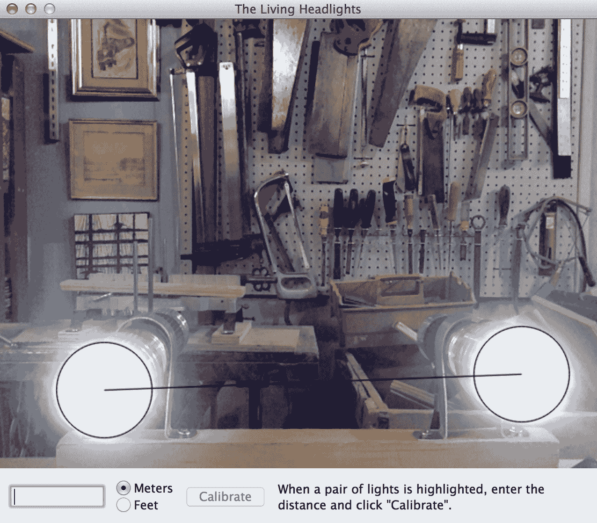
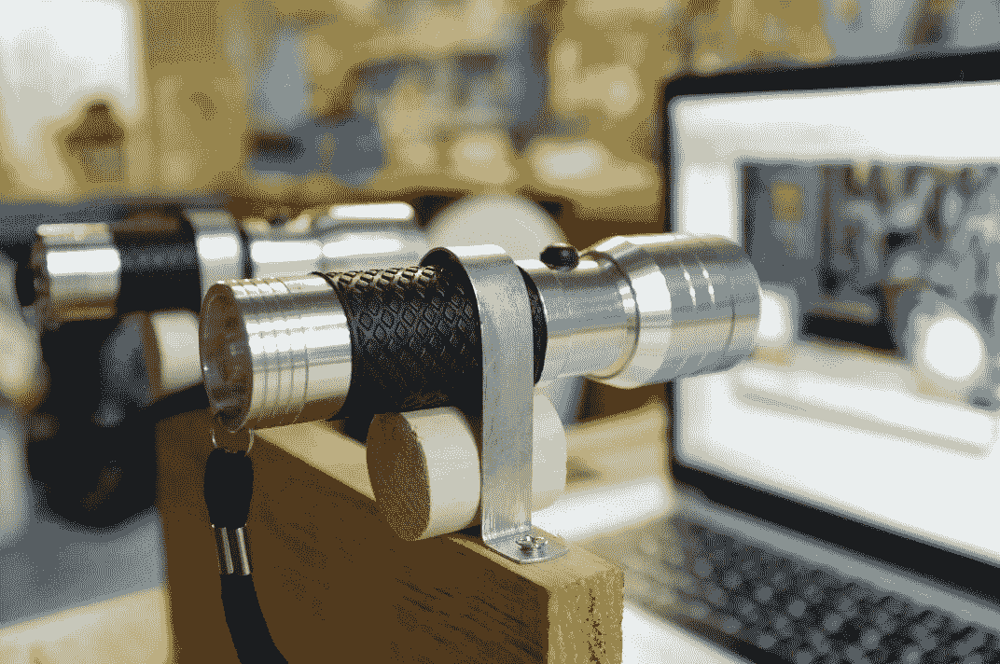
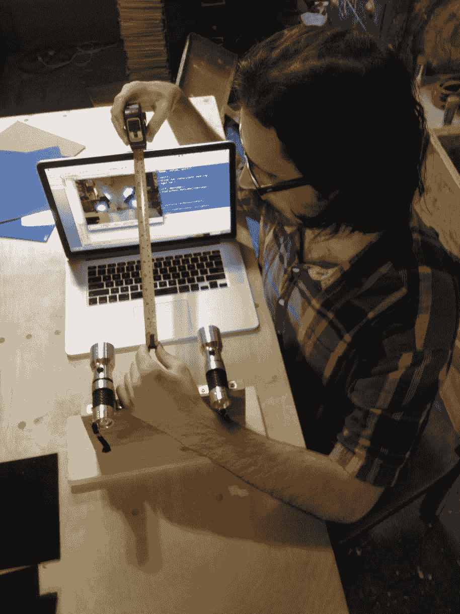
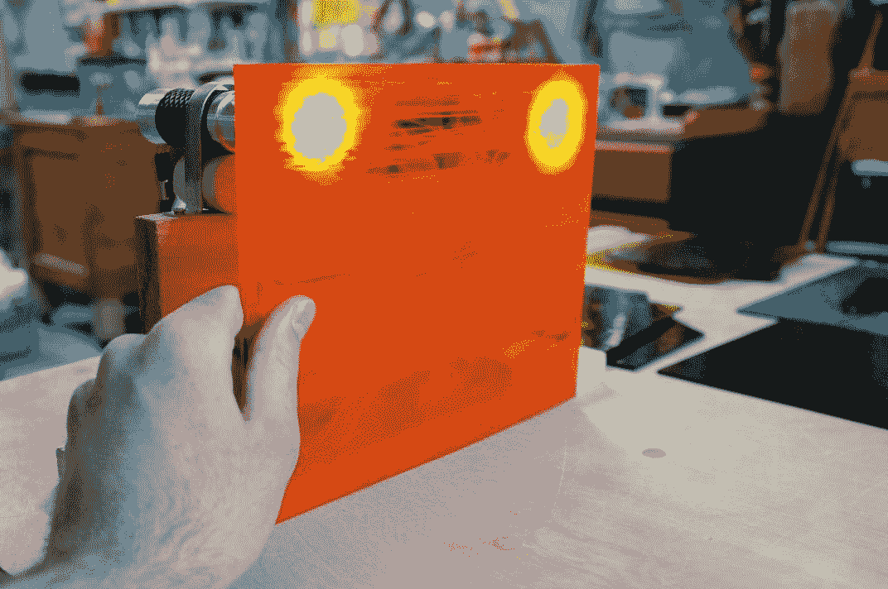
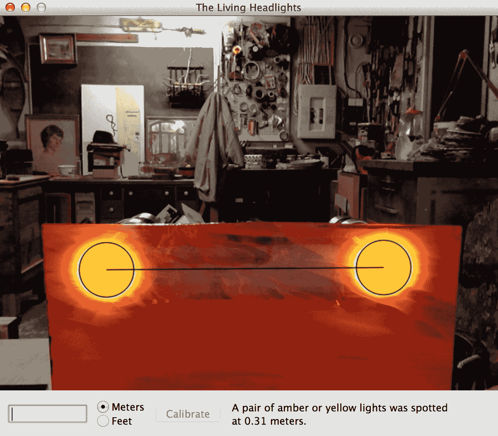
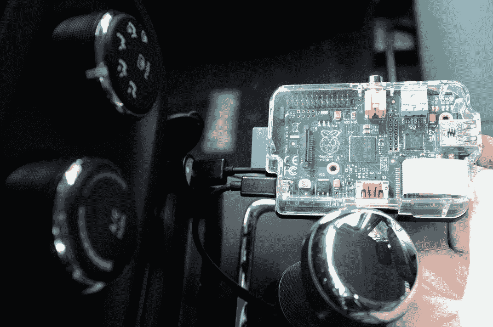
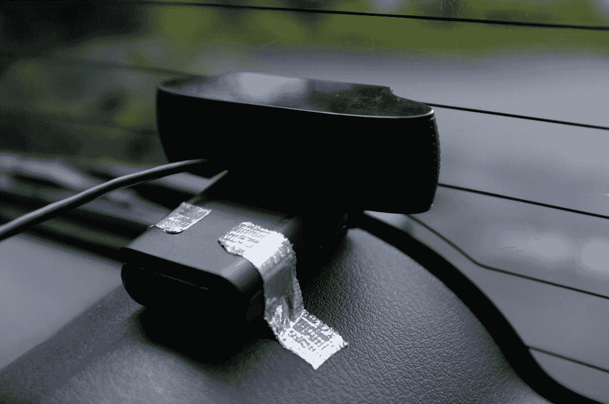
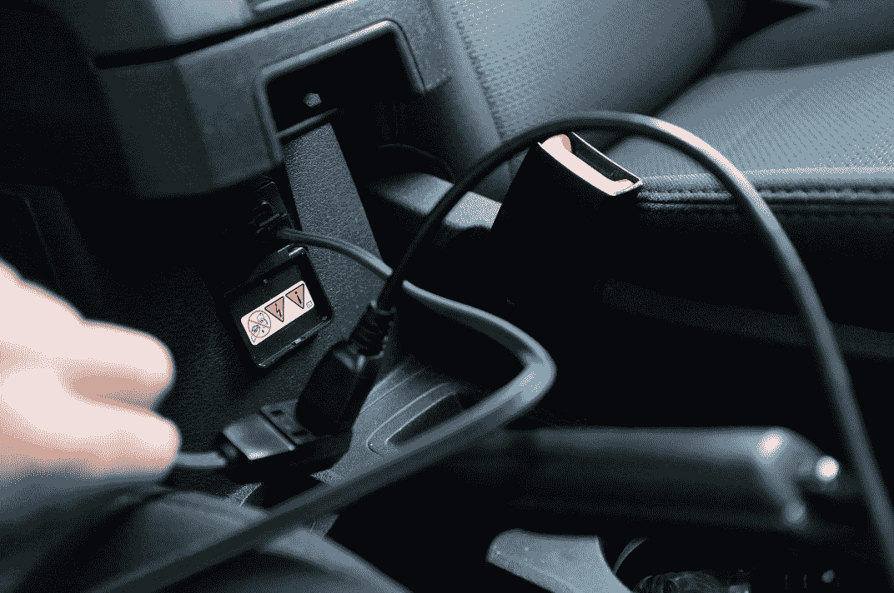
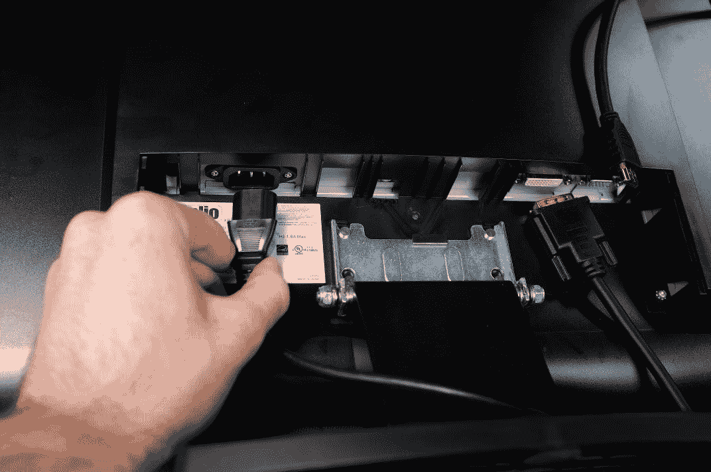

# 第五章：为您的汽车配备后视摄像头和危险检测

"当晨光来临，车灯逐渐消失。"

– 《致命武器》（1987）

詹姆斯·邦德是一个汽车盗贼。电影显示他偷了许多汽车，通常是从无辜的旁观者那里偷的。我们不知道这些不幸的人是否恢复了他们的财产，但即使他们恢复了，碰撞、沉没、子弹和火箭的损害也会对他们的保险费率产生持久的影响。邦德还偷了一架螺旋桨飞机、一辆坦克和一辆月球车。

这个人自从 1950 年代就开始开车，也许是他应该停止的时候了。

尽管如此，我们可以摆脱冷战时期对附带损害漠不关心的旧观念。利用现代技术，我们可以为驾驶员提供关于共享道路上的其他人的及时信息。这些信息可能有助于避免碰撞，并正确瞄准车辆的火箭发射器，以便有序地进行追逐场景，而不会压平整个城市街区。秘密特工不会损失那么多车，因此，他们不会感到有必要偷那么多。

由于驾驶辅助是一个广泛的话题，让我们专注于一个场景。黄昏和夜晚对驾驶员来说都是困难时期，包括秘密特工。我们可能会因为缺乏自然光或车灯的眩光而失明。然而，我们可以制作一个计算机视觉系统，该系统能够清楚地看到车灯（或尾灯），并可以估计它们与它们的距离。此系统还可以区分不同颜色的灯光，这一特性与识别信号和车辆类型相关。

我们将选择计算成本低的技巧，适合低功耗计算机——即 Raspberry Pi——我们可以通过适配器将其插入汽车的点烟器。一个液晶面板可以显示相关信息，以及一个比真实车灯不那么刺眼的实时倒车视频流。

这个项目给我们带来了几个新的主题和挑战，如下所示：

+   如何检测光斑并分类其颜色

+   如何估计从相机到已知实际尺寸的检测对象的距离

+   如何设置一个低成本实验室，我们可以在这里实验多种颜色的灯光

+   如何在车内设置 Raspberry Pi 和外围设备

实际上，我们的快速自制项目不足以作为汽车安全工具的依赖，所以请带着怀疑的态度看待它。然而，它是对分析信号灯和连接定制车载计算机的有趣介绍。选择 Raspberry Pi 作为平台挑战我们思考汽车作为快速原型设计环境。我们可以插入任何标准外围设备，包括摄像头、键盘、鼠标，甚至显示器，给我们一个完整的桌面 Linux 系统，带有 Python——在轮子上！（车里的蛇！）对于更复杂的项目，Pi 也与许多电子套件兼容！智能手机或平板电脑也是汽车中使用的良好替代品，比带显示器的 Pi 更容易供电，但 Pi 作为全面的原型设计工具表现出色。

我们现在需要的只是为我们项目起一个名字。因此，让这个应用程序被称为 `The Living Headlights`。

# 技术要求

本章的项目有以下软件依赖：

+   **具有以下模块的 Python 环境**：OpenCV, NumPy, SciPy, wxPython

设置说明在 第一章，*准备任务* 中介绍。请参阅设置说明以了解任何版本要求。运行 Python 代码的基本说明在 附录 C，*与蛇一起运行（或，Python 的第一步）* 中介绍。

本章的完成项目可以在本书的 GitHub 仓库中找到，[`github.com/PacktPublishing/OpenCV-4-for-Secret-Agents-Second-Edition`](https://github.com/PacktPublishing/OpenCV-4-for-Secret-Agents-Second-Edition)，在 `Chapter005` 文件夹中。

# 规划 `The Living Headlights` 应用程序

对于这个应用程序，我们需要回到跨平台的 wxPython 框架。可选地，我们也可以在 Windows、Mac 或 Linux 桌面或笔记本电脑上开发和测试我们的 wxPython 应用程序，然后再将其部署到我们的 Raspberry Pi 计算机上。使用 Raspbian 操作系统，Pi 可以运行 wxPython，就像任何 Linux 桌面一样。

`The Living Headlights` 的 GUI 包括实时视频流，一组用户可以输入他们与车头灯真实距离的控制，以及一个最初显示一组说明的标签，如下面的截图所示：



当检测到一对车头灯时，用户必须执行一次校准步骤。这一步骤包括输入相机和车头灯之间的真实距离（具体来说，是车头灯之间的中点）然后点击校准按钮。之后，应用程序会持续更新并显示车头灯距离和颜色的估计值，如下面的截图底部标签所示：


当应用关闭时，校准和选定的单位（米或英尺）存储在配置文件中。当应用重新打开时，它们从这个文件中重新加载。只要使用相同的相机和镜头，镜头不缩放，一对车头灯之间的间距对所有车头灯对保持大致恒定，校准就保持有效。

在视频流上方，用彩色圆圈标记检测到的灯光，并在颜色匹配的检测到的灯光对之间画线。这样的对被认为是车头灯的一组。

接下来，让我们考虑检测灯光和分类它们颜色的技术。

# 将灯光检测为块

对人眼来说，光可以显得既非常明亮又非常多彩。想象一下晴朗的风景或被霓虹灯照亮的店面；它们既明亮又多彩！然而，相机捕捉到的对比度范围要窄得多，且选择并不智能，因此晴朗的风景或霓虹灯照亮的店面可能会看起来褪色。这种对比度控制不佳的问题在廉价的相机或具有小传感器的相机（如网络摄像头）中尤为严重。因此，明亮的灯光源往往被成像为带有薄色边的白色块。这些块也倾向于模仿镜头的光圈——通常是一个近似圆形的多边形。

所有灯光都变成白色和圆形的想法，在我看来，让这个世界显得更加贫瘠。然而，在计算机视觉中，我们可以利用这种可预测的图案。我们可以寻找几乎圆形的白色块，并可以从包含边缘周围额外像素的样本中推断出它们的人类可感知颜色。

**块检测**实际上是计算机视觉的一个主要分支。与我们在前几章中讨论的面部检测器（或其他对象检测器）不同，块检测器没有经过训练。没有参考图像的概念，因此像“这个块是灯光”或“这个块是皮肤”这样的有意义的分类就更加复杂。分类超出了块检测器本身的范围。我们根据关于典型光源形状和颜色的先验知识，基于 webcam 捕获的图像，明确地定义了非灯光和灯光之间，以及不同人类可感知灯光颜色的阈值。

块的其他术语包括*连通分量*和*区域*。然而，在这本书中，我们只说*块*。

在最简单的层面上，块检测包括以下五个步骤：

1.  将图像分成两种或更多颜色。例如，这可以通过*二值阈值*（也称为**二值化**）来实现，其中所有高于阈值的灰度值被转换为白色，所有低于阈值的灰度值被转换为黑色。

1.  找到每个连续着色区域的*轮廓*，即每个块。轮廓是一组描述区域轮廓的点。

1.  合并被认为是邻居的块。

1.  可选地，确定每个块的特征。这些是更高层次的测量，例如中心点、半径和圆形度。这些特征的有用之处在于它们的简单性。对于进一步的块相关计算和逻辑，最好避免复杂的表示，例如轮廓的许多点。

1.  拒绝未能满足某些可测量标准的块。

OpenCV 在名为`cv2.SimpleBlobDetector`的类中实现了一个简单的块检测器（恰如其分）。这个类的构造函数接受一个名为`cv2.SimpleBlobDetector_Params`的辅助类实例，该实例描述了接受或拒绝候选块的标准。`SimpleBlobDetector_Params`有以下成员变量：

+   `thresholdStep`、`minThreshold`和`maxThreshold`：块搜索基于一系列二值化图像（类似于在第三章，*训练智能警报识别恶棍和他的猫*中描述的 Haar 级联检测器搜索的一系列缩放图像）。二值化的阈值基于这些变量给出的范围和步长。我们使用`8`、`191`和`255`。

+   `minRepeatability`：此变量减一是一个块必须拥有的最小邻居数。我们使用`2`，这意味着一个块必须至少有一个邻居。如果我们不要求至少有一个邻居，检测器往往会报告大量重叠的块。

+   `minDistBetweenBlobs`：块之间至少需要相隔这么多像素。彼此距离小于最小距离的块被视为邻居。我们使用一个计算为图像较大尺寸（通常是宽度）的 2%的最小距离。

+   `filterByColor`（`True`或`False`）和`blobColor`：如果`filterByColor`为`True`，则块的中心像素必须与`blobColor`完全匹配。我们使用`True`和`255`（白色），基于我们的假设，光源是白色块。

+   `filterByArea`（`True`或`False`）、`minArea`和`maxArea`：如果`filterByArea`为`True`，则块在像素中的面积必须在给定的范围内。我们使用`True`和计算为图像较大尺寸（通常是宽度）的 0.5%到 10%的范围。

+   `filterByCircularity`（`True`或`False`）、`minCircularity`和`maxCircularity`：如果`filterByCircularity`为`True`，则块必须在其给定的范围内，其中圆形度定义为`4 * PI * area / (perimeter ^ 2)`。圆的圆形度为 1.0，线的圆形度为 0.0。对于我们的大致圆形光源，我们使用`True`和范围 0.7 到 1.0。

+   `filterByInertia` (`True` 或 `False`), `minInertiaRatio`, 和 `maxInertiaRatio`: 如果 `filterByInertia` 是 `True`，则一个区域的惯性比必须在给定的范围内。相对较高的惯性比意味着区域相对细长（因此旋转其最长轴需要更大的扭矩）。圆的惯性比是 1.0，线的惯性比是 0.0。我们使用 `filterByInertia=False`（不按惯性过滤）是因为圆形测试已经足够控制形状以满足我们的目的。

+   `filterByConvexity` (`True` 或 `False`), `minConvexity`, 和 `maxConvexity`: 如果 `filterByConvexity` 是 `True`，则一个区域的凸性必须在给定的范围内，其中凸性定义为 `面积/凸包面积`。在这里，`凸包面积` 指的是凸包的面积——围绕轮廓所有点的最小面积的凸多边形。凸性始终大于 0.0 且小于 1.0。相对较高的凸性意味着轮廓相对平滑。我们使用 `filterByConvexity=False`（不按凸性过滤）是因为圆形测试已经足够控制形状以满足我们的目的。

虽然这些参数涵盖了许多有用的标准，但它们是为灰度图像设计的，并且不提供基于色调、饱和度和亮度单独标准的实际过滤或分类区域的手段。前面列表中建议的值是为了提取明亮的区域。然而，我们可能希望根据颜色在区域边缘的细微变化来分类这样的区域。

**色调**指的是颜色在色轮上的角度，其中 *0* 度是红色，*120* 度是绿色，*240* 度是蓝色。色调（以度为单位）可以通过以下公式从 RGB 值计算得出：


**饱和度**指的是颜色与灰度的距离。RGB 颜色的饱和度有几种不同的公式。我们使用以下公式，一些作者将其称为 **色度** 而不是饱和度：


我们可以根据区域和周围像素的平均色调和饱和度来分类光源的人眼可感知颜色。低饱和度和蓝色或黄色的色调组合往往意味着光线在人类视觉中会显得白色。其他光源可能（按色调升序排列）呈现为红色、橙色/琥珀色/黄色、绿色（从春绿色到翡翠的广泛范围）、蓝色/紫色（另一个广泛范围）或粉色，仅举几个例子。阈值值可以根据试错法选择。

使用我们提到的技术，我们可以检测光源的位置、像素半径和感知颜色。然而，我们需要额外的技术来估计相机与一对车头灯之间的实际距离。现在让我们关注这个问题。

# 估计距离（一种经济的方法）

假设我们有一个物体坐在针孔相机的前面。无论相机和物体之间的距离如何，以下方程始终成立：


我们可以在方程的左边使用任何单位（例如像素），在右边使用任何单位（例如米）（在方程的每一侧，除法会消除单位）。此外，我们可以根据我们在图像中可以检测到的任何线性特征来定义物体的大小，例如检测到的斑块的直径或检测到的面部矩形的宽度。

让我们重新排列方程，以说明物体到距离与图像中物体的大小成反比：


假设物体的真实尺寸和相机的焦距是恒定的（恒定焦距意味着镜头不会变焦，我们不会更换镜头）。考虑以下安排，它将这对常数隔离在方程的右边：


由于方程的右边是恒定的，所以左边也是。我们可以得出以下关系在时间上成立：


让我们解以下方程以得到新的距离：


现在，让我们考虑在软件中应用这个方程。为了提供一个基准，用户必须进行一次真实的距离测量，作为所有未来计算中使用的*旧*距离。此外，我们必须知道物体的旧像素大小及其随后的新大小，这样我们就可以在检测结果出现时计算新的距离。让我们回顾以下假设：

+   没有镜头畸变；应用针孔相机模型

+   焦距是恒定的；没有应用变焦，且镜头没有更换为不同镜头

+   物体是刚性的；其真实世界的测量值不会改变

+   相机总是观察物体的同一侧；相机和物体的相对旋转不会改变

你可能会想知道第一个假设是否有问题，因为网络摄像头通常配备便宜的广角镜头，具有显著的畸变。尽管存在镜头畸变，图像中的物体大小是否仍然与相机和物体之间的真实距离成反比？以下论文报告了对于看起来畸变很严重的镜头和位于非中心位置（在畸变可能特别严重的图像区域）的物体的实验结果——M. N. A. Wahab，N. Sivadev 和 K. Sundaraj。*使用单目视觉系统进行移动机器人目标距离估计*。**IEEE 开放系统会议**（**ICOS**）2011 年会议论文集，第 11 卷，第 15 期，第 25-28 页。2011 年 9 月。

使用指数回归，作者们表明以下模型是实验数据的良好拟合（*R²=0.995*）：

```py
distanceInCentimeters = 4042 * (objectSizeInPixels ^ -1.2)  
```

注意，指数接近于**-1**，因此统计模型并不远离理想的反比关系。（即使是质量较差的镜头和偏离中心的物体也没有否定我们的假设！）

我们也可以确保第二个假设（没有缩放和镜头交换）是正确的。

让我们考虑第三个和第四个假设（刚性和恒定旋转）在相机和物体的情况下一一对应——在高速公路上的每辆汽车上。除非发生碰撞，否则一辆汽车的大部分外部部件都是刚性的。除非在超车或停车时，一辆汽车通常直接跟在另一辆汽车后面，行驶在大部分平坦且大部分直线的路面上。然而，在多山或有许多转弯的道路上，这些假设开始失效。预测物体当前被观察的侧面变得更加困难；因此，说我们的参考测量是否适用于特定的侧面也更加困难。

当然，我们需要定义一个通用的汽车部件作为我们的**对象**。前灯（以及它们之间的空间）是一个不错的选择，因为我们有检测它们的方法，而且许多汽车的前灯距离是一致的——尽管并非所有汽车都是这样。

计算机视觉中的所有距离估计技术都依赖于一些假设或与相机、物体、相机与物体之间的关系或照明相关的校准步骤。为了比较，让我们考虑以下一些常见的距离估计技术：

+   **飞行时间**（**ToF**）相机向物体发射光线，并测量任何反射光的强度。这个强度被用来根据光源已知的衰减特性来估计每个像素的距离。一些 ToF 相机，如微软 Kinect，使用红外光源。其他更昂贵的 ToF 相机使用激光扫描场景，甚至使用激光阵列。如果正在成像其他明亮的光源，ToF 相机可能会受到干扰，因此它们不适合我们的应用。

+   **立体相机**由两个平行相机组成，它们之间有一个已知且固定的距离。在每一帧中，捕获一对图像，识别特征，并计算每对对应特征之间的**视差**或像素距离。我们可以根据相机的已知视场和它们之间的距离将视差转换为实际距离。对于我们的应用，立体技术是可行的，但它们在计算上也很昂贵，并且使用大量的输入总线带宽。优化这些技术在树莓派上将会是一个巨大的挑战。

+   **从运动结构**（**SfM**）技术只需要一个常规相机，但依赖于相机随时间移动已知距离。对于从相邻位置拍摄的每一对图像，都会计算视差，就像立体相机一样。在这种情况下，除了知道相机的移动外，我们还必须知道物体的移动或静止。由于这些限制，SfM 技术不适合我们的应用，因为我们的相机和物体都安装在两个自由移动的车辆上。

+   各种**3D 特征跟踪**技术包括估计物体的旋转、距离和其他坐标。边缘和纹理细节也被考虑在内。汽车模型之间的差异使得难以定义一套适用于 3D 跟踪的特征，因此 3D 特征跟踪不适合我们的应用。此外，3D 跟踪计算成本高，尤其是在像 Raspberry Pi 这样的低功耗计算机的标准下。

关于这些技术的更多信息，请参阅以下由 Packt Publishing 出版的书籍：

+   在我的第一版书籍《使用 Python 的 OpenCV 计算机视觉》中介绍了 Kinect 和其他 ToF 相机，具体是第五章“检测前景/背景区域和深度”。

+   3D 特征跟踪和 SfM（从运动结构）在《精通 OpenCV：基于实际计算机视觉项目的实践》一书中有所介绍，具体是第三章“无标记增强现实”和第四章“使用 OpenCV 探索从运动结构”。

+   立体视觉和 3D 特征跟踪在 Robert Laganière 的《OpenCV 3 计算机视觉应用编程食谱》一书中有所介绍，具体是第十章“在图像中估计投影关系”。

+   在 Alexey Spizhevoy 和 Aleksandr Rybnikov 的《使用 Python 的 OpenCV 3 计算机视觉食谱》一书中也介绍了立体视觉和 3D 姿态估计，具体是第九章“多视图几何”。

综合来看，基于像素距离与实际距离成反比这一简单方法，鉴于我们的应用和意图支持 Pi，是一个合理的选择。

# 实现 The Living Headlights 应用程序

`The Living Headlights`应用程序将使用以下文件：

+   `LivingHeadlights.py`：这是一个新文件，包含我们的应用程序类及其`main`函数。

+   `ColorUtils.py`：这是一个新文件，包含将颜色转换为不同表示所需的实用函数。

+   `GeomUtils.py`：这包含用于几何计算的实用函数。复制或链接到我们在第三章*，训练智能警报识别恶人和他的猫*中使用的版本。

+   `PyInstallerUtils.py`：这包含用于访问 PyInstaller 应用程序包中资源的实用函数。复制或链接到我们在第三章*，训练智能警报识别恶人和他的猫*中使用的版本。

+   `ResizeUtils.py`：这包含用于调整图像大小的实用函数，包括摄像头捕获尺寸。复制或链接到我们在 第三章*训练智能闹钟以识别恶人和他的猫* 中使用的版本。

+   `WxUtils.py`：这包含在 wxPython 应用中使用 OpenCV 图像的实用函数。复制或链接到我们在 第三章*训练智能闹钟以识别恶人和他的猫* 中使用的版本。

让我们从创建 `ColorUtils.py` 开始。在这里，我们需要根据 *检测灯光作为块* 部分中提到的公式计算颜色的色调和饱和度。该模块的实现如下面的代码所示：

```py
import math

def hueFromBGR(color):
    b, g, r = color
    # Note: sqrt(3) = 1.7320508075688772
    hue = math.degrees(math.atan2(
        1.7320508075688772 * (g - b), 2 * r - g - b))
    if hue < 0.0:
        hue += 360.0
    return hue

def saturationFromBGR(color):
    return max(color) - min(color)
```

如果我们想将整个图像（即每个像素）转换为色调、饱和度以及亮度或值，我们可以使用以下 OpenCV 方法，`cvtColor`：

```py
hslImage = cv2.cvtColor(bgrImage, cv2.COLOR_BGR2HLS)

hsvImage = cv2.cvtColor(bgrImage, cv2.COLOR_BGR2HSV)
```

有关饱和度、亮度和 HSV 和 HSL 颜色模型中值的定义，请参阅以下维基百科文章：[`en.wikipedia.org/wiki/HSL_and_HSV`](https://en.wikipedia.org/wiki/HSL_and_HSV)。我们在维基百科文章中的饱和度定义被称为 **色度**，这与 HSL 饱和度不同，并且又与 HSV 饱和度不同。此外，OpenCV 以两度（范围从 `0` 到 `180`）为单位表示色调，以便色调通道适合在一个字节内。

对于某些类型的图像分割问题，将整个图像转换为 HSV、HSL 或其他颜色模型是有用的。例如，参见 Rebecca Stone 关于分割海葵图像的博客文章：[`realpython.com/python-opencv-color-spaces/`](https://realpython.com/python-opencv-color-spaces/)，或 Vikas Gupta 关于分割魔方图像的博客文章：[`www.learnopencv.com/color-spaces-in-opencv-cpp-python/`](https://www.learnopencv.com/color-spaces-in-opencv-cpp-python/)。

我们编写了自己的转换函数，因为，对于我们的目的来说，转换整个图像是不必要的；我们只需要转换每个块的一个样本。我们还更喜欢更精确的浮点数表示，而不是 OpenCV 强制的字节大小整数表示。

我们还需要通过添加一个计算两个二维点之间欧几里得距离的函数来修改 `GeomUtils.py` 文件，例如计算图像中两个前灯的像素坐标。在文件顶部，让我们添加一个导入语句并实现该函数，如下面的代码所示：

```py
import math

def dist2D(p0, p1):
    deltaX = p1[0] - p0[0]
    deltaY = p1[1] - p0[1]
    return math.sqrt(deltaX * deltaX +
                     deltaY * deltaY)
```

使用 NumPy 的 `linalg.norm` 函数也可以计算距离（和其他量级），如下面的代码所示：

```py
dist = numpy.linalg.norm(a1 - a0)
```

在这里，`a0` 和 `a1` 可以是任何大小和形状。然而，对于二维或三维坐标向量这样的低维空间，使用 NumPy 数组的开销可能并不值得，因此像我们这样的实用函数是一个合理的替代方案。

前面的代码包含了所有新的实用函数。现在，让我们创建一个文件，名为 `LivingHeadlights.py`，用于应用程序的 `main` 类，`LivingHeadlights`。与 第三章*训练智能闹钟识别恶棍及其猫* 中的 `InteractiveRecognizer` 类一样，`LivingHeadlights` 是一个 wxPython 应用程序的类，它可以在后台线程中捕获和处理图像（以避免在主线程上阻塞 GUI），允许用户输入参考数据，在退出时序列化其参考数据，并在再次启动时反序列化其参考数据。这次，序列化和反序列化是通过 Python 的 `cPickle` 模块完成的，或者如果由于任何原因 `cPickle` 不可用，则使用较不优化的 `pickle` 模块。让我们在 `LivingHeadlights.py` 的开头添加以下导入语句：

```py
#!/usr/bin/env python

import numpy
import cv2
import os
import threading
import wx

try:
   import cPickle as pickle
except:
   import pickle

import ColorUtils
import GeomUtils
import PyInstallerUtils
import ResizeUtils
import WxUtils
```

让我们在模块的开头也定义一些 BGR 颜色值和名称。我们将根据每个 blob 的色调和饱和度将其分类为以下颜色之一：

```py
COLOR_Red =         ((  0,   0, 255), 'red')
COLOR_YellowWhite = ((223, 247, 255), 'yellowish white')
COLOR_AmberYellow = ((  0, 191, 255), 'amber or yellow')
COLOR_Green =       ((128, 255, 128), 'green')
COLOR_BlueWhite =   ((255, 231, 223), 'bluish white')
COLOR_BluePurple =  ((255,  64,   0), 'blue or purple')
COLOR_Pink =        ((240, 128, 255), 'pink')
```

现在，让我们开始实现这个类。初始化器接受与 blob 检测器和相机配置相关的几个参数。请参阅 *将灯光检测为 blob* 部分以了解 OpenCV 的 `SimpleBlobDetector` 和 `SimpleBlobDetector_Params` 类支持的 blob 检测参数的解释。类的声明和初始化器声明如下：

```py
class LivingHeadlights(wx.Frame):

    def __init__(self, configPath, thresholdStep=8.0,
                 minThreshold=191.0, maxThreshold=255.0,
                 minRepeatability=2,
                 minDistBetweenBlobsProportional=0.02,
                 minBlobAreaProportional=0.005,
                 maxBlobAreaProportional=0.1,
                 minBlobCircularity=0.7, cameraDeviceID=0,
                 imageSize=(640, 480),
                 title='The Living Headlights'):
```

我们从初始化器的实现开始，设置一个公共布尔变量，指示应用程序显示镜像图像，以及一个受保护的布尔变量，确保应用程序正在运行，如下所示：

```py
        self.mirrored = True

        self._running = True
```

如果应用程序的先前运行中保存了任何配置文件，我们将反序列化参考测量（灯光与灯光之间的像素距离以及灯光与相机之间实际的米距离），以及用户的首选计量单位（`meters` 或 `feet`），如下所示：

```py
        self._configPath = configPath
        self._pixelDistBetweenLights = None
        if os.path.isfile(configPath):
            with open(self._configPath, 'rb') as file:
                self._referencePixelDistBetweenLights = \
                        pickle.load(file)
                self._referenceMetersToCamera = \
                        pickle.load(file)
                self._convertMetersToFeet = pickle.load(file)
        else:
            self._referencePixelDistBetweenLights = None
            self._referenceMetersToCamera = None
            self._convertMetersToFeet = False
```

现在，我们初始化一个 `VideoCapture` 对象并尝试配置捕获图像的大小。如果请求的大小不受支持，我们将回退到默认大小，如下面的代码所示：

```py
        self._capture = cv2.VideoCapture(cameraDeviceID)
        size = ResizeUtils.cvResizeCapture(
                self._capture, imageSize)
        w, h = size
        self._imageWidth, self._imageHeight = w, h
```

我们还需要声明我们将要捕获、处理和显示的图像的变量。最初，这些是 `None`。我们还需要创建一个锁来管理对将在一个线程中捕获和处理的图像的线程安全访问，然后将其绘制到屏幕上的另一个线程。相关的声明如下：

```py
        self._image = None
        self._grayImage = None

        self._imageFrontBuffer = None
        self._imageFrontBufferLock = threading.Lock()
```

现在，我们创建一个 `SimpleBlobDetector_Params` 对象和一个基于传递给应用程序初始化器的参数的 `SimpleBlobDetector` 对象，如下所示：

```py
        minDistBetweenBlobs = \
                min(w, h) * \
                minDistBetweenBlobsProportional

        area = w * h
        minBlobArea = area * minBlobAreaProportional
        maxBlobArea = area * maxBlobAreaProportional

        detectorParams = cv2.SimpleBlobDetector_Params()

        detectorParams.minDistBetweenBlobs = \
                minDistBetweenBlobs

        detectorParams.thresholdStep = thresholdStep
        detectorParams.minThreshold = minThreshold
        detectorParams.maxThreshold = maxThreshold

        detectorParams.minRepeatability = minRepeatability

        detectorParams.filterByArea = True
        detectorParams.minArea = minBlobArea
        detectorParams.maxArea = maxBlobArea

        detectorParams.filterByColor = True
        detectorParams.blobColor = 255

        detectorParams.filterByCircularity = True
        detectorParams.minCircularity = minBlobCircularity

        detectorParams.filterByInertia = False

        detectorParams.filterByConvexity = False

        self._detector = cv2.SimpleBlobDetector_create(
                detectorParams)
```

在这里，我们指定应用程序窗口的样式并初始化以下基类，`wx.Frame`：

```py
        style = wx.CLOSE_BOX | wx.MINIMIZE_BOX | \
                wx.CAPTION | wx.SYSTEM_MENU | \
                wx.CLIP_CHILDREN
        wx.Frame.__init__(self, None, title=title,
                          style=style, size=size)
        self.SetBackgroundColour(wx.Colour(232, 232, 232))
```

我们现在需要将 *Esc* 键绑定到关闭应用程序的回调，如下所示：

```py
        self.Bind(wx.EVT_CLOSE, self._onCloseWindow)

        quitCommandID = wx.NewId()
        self.Bind(wx.EVT_MENU, self._onQuitCommand,
                  id=quitCommandID)
        acceleratorTable = wx.AcceleratorTable([
            (wx.ACCEL_NORMAL, wx.WXK_ESCAPE,
             quitCommandID)
        ])
        self.SetAcceleratorTable(acceleratorTable)
```

现在，让我们创建 GUI 元素，包括位图、参考距离的文本字段、单位（`meters`或`feet`）的单选按钮和校准按钮。我们还需要绑定各种输入事件的回调，如下所示：

```py
        self._videoPanel = wx.Panel(self, size=size)
        self._videoPanel.Bind(
                wx.EVT_ERASE_BACKGROUND,
                self._onVideoPanelEraseBackground)
        self._videoPanel.Bind(
                wx.EVT_PAINT, self._onVideoPanelPaint)

        self._videoBitmap = None

        self._calibrationTextCtrl = wx.TextCtrl(
                self, style=wx.TE_PROCESS_ENTER)
        self._calibrationTextCtrl.Bind(
                wx.EVT_KEY_UP,
                self._onCalibrationTextCtrlKeyUp)

        self._distanceStaticText = wx.StaticText(self)
        if self._referencePixelDistBetweenLights is None:
            self._showInstructions()
        else:
            self._clearMessage()

        self._calibrationButton = wx.Button(
                self, label='Calibrate')
        self._calibrationButton.Bind(
                wx.EVT_BUTTON, self._calibrate)
        self._calibrationButton.Disable()

        border = 12

        metersButton = wx.RadioButton(self,
                                      label='Meters')
        metersButton.Bind(wx.EVT_RADIOBUTTON,
                          self._onSelectMeters)

        feetButton = wx.RadioButton(self, label='Feet')
        feetButton.Bind(wx.EVT_RADIOBUTTON,
                        self._onSelectFeet)
```

我们需要确保适当的单选按钮以选中状态开始，这取决于我们之前反序列化的配置数据，如下所示：

```py
        if self._convertMetersToFeet:
            feetButton.SetValue(True)
        else:
            metersButton.SetValue(True)
```

接下来，我们使用`BoxSizer`垂直堆叠单选按钮，如下所示：

```py
        unitButtonsSizer = wx.BoxSizer(wx.VERTICAL)
        unitButtonsSizer.Add(metersButton)
        unitButtonsSizer.Add(feetButton)
```

我们随后将所有控件水平排列，再次使用`BoxSizer`，如下所示：

```py
        controlsSizer = wx.BoxSizer(wx.HORIZONTAL)
        style = wx.ALIGN_CENTER_VERTICAL | wx.RIGHT
        controlsSizer.Add(self._calibrationTextCtrl, 0,
                          style, border)
        controlsSizer.Add(unitButtonsSizer, 0, style,
                          border)
        controlsSizer.Add(self._calibrationButton, 0,
                          style, border)
        controlsSizer.Add(self._distanceStaticText, 0,
                          wx.ALIGN_CENTER_VERTICAL)
```

为了完成我们的布局，我们将控件放置在图像下方，如下所示：

```py
        rootSizer = wx.BoxSizer(wx.VERTICAL)
        rootSizer.Add(self._videoPanel)
        rootSizer.Add(controlsSizer, 0,
                      wx.EXPAND | wx.ALL, border)
        self.SetSizerAndFit(rootSizer)
```

在初始化器的最后，我们启动一个后台线程，使用以下代码从摄像头捕获和处理图像：

```py
        self._captureThread = threading.Thread(
                target=self._runCaptureLoop)
        self._captureThread.start()
```

当关闭应用程序时，我们首先确保捕获线程终止，就像我们在第三章的《训练一个智能警报器来识别恶棍和他的猫》中对`InteractiveRecognizer`所做的那样。我们还使用`pickle`或`cPickle`将参考测量值和首选单位（`meters`或`feet`）序列化到文件中。相关回调的实现如下：

```py
    def _onCloseWindow(self, event):
        self._running = False
        self._captureThread.join()
        configDir = os.path.dirname(self._configPath)
        if not os.path.isdir(configDir):
            os.makedirs(configDir)
        with open(self._configPath, 'wb') as file:
            pickle.dump(self._referencePixelDistBetweenLights,
                        file)
            pickle.dump(self._referenceMetersToCamera, file)
            pickle.dump(self._convertMetersToFeet, file)
        self.Destroy()
```

与*Esc*按钮关联的回调只是关闭应用程序，如下所示：

```py
    def _onQuitCommand(self, event):
        self.Close()
```

视频面板的擦除和绘制事件绑定到回调`_onVideoPanelEraseBackground`和`_onVideoPanelPaint`，它们的实现与第三章中的`InteractiveRecognizer`相同，如下所示：

```py
    def _onVideoPanelEraseBackground(self, event):
        pass

    def _onVideoPanelPaint(self, event):

        self._imageFrontBufferLock.acquire()

        if self._imageFrontBuffer is None:
            self._imageFrontBufferLock.release()
            return

        # Convert the image to bitmap format.
        self._videoBitmap = \
                WxUtils.wxBitmapFromCvImage(self._imageFrontBuffer)

        self._imageFrontBufferLock.release()

        # Show the bitmap.
        dc = wx.BufferedPaintDC(self._videoPanel)
        dc.DrawBitmap(self._videoBitmap, 0, 0)
```

当选择任一单选按钮时，我们需要记录新选中的测量单位，如下两个回调方法所示：

```py
    def _onSelectMeters(self, event):
        self._convertMetersToFeet = False

    def _onSelectFeet(self, event):
        self._convertMetersToFeet = True
```

每当在文本字段中输入新字符时，我们需要调用一个辅助方法来验证文本作为潜在输入，如下所示：

```py
    def _onCalibrationTextCtrlKeyUp(self, event):
        self._enableOrDisableCalibrationButton()
```

当点击校准按钮时，我们解析文本字段中的测量值，清除文本字段，如果需要，将测量值转换为`meters`，并存储它。按钮的回调实现如下：

```py
    def _calibrate(self, event):
        self._referencePixelDistBetweenLights = \
                self._pixelDistBetweenLights
        s = self._calibrationTextCtrl.GetValue()
        self._calibrationTextCtrl.SetValue('')
        self._referenceMetersToCamera = float(s)
        if self._convertMetersToFeet:
            self._referenceMetersToCamera *= 0.3048
```

如同第三章中所述的《训练一个智能警报器来识别恶棍和他的猫》，后台线程运行一个循环，该循环包括捕获图像、调用辅助方法处理图像，然后将图像交给另一个线程进行显示。可选地，在显示之前，图像可能被镜像（水平翻转）。循环的实现如下：

```py
    def _runCaptureLoop(self):
        while self._running:
            success, self._image = self._capture.read(
                    self._image)
            if self._image is not None:
                self._detectAndEstimateDistance()
                if (self.mirrored):
                    self._image[:] = numpy.fliplr(self._image)

                # Perform a thread-safe swap of the front and
                # back image buffers.
                self._imageFrontBufferLock.acquire()
                self._imageFrontBuffer, self._image = \
                        self._image, self._imageFrontBuffer
                self._imageFrontBufferLock.release()

                # Send a refresh event to the video panel so
                # that it will draw the image from the front
                # buffer.
                self._videoPanel.Refresh()
```

处理图像的辅助方法相当长，所以让我们分几个部分来看。首先，我们在图像的灰度版本中检测块，然后初始化一个字典来按颜色排序块，如下所示：

```py
    def _detectAndEstimateDistance(self):

        self._grayImage = cv2.cvtColor(
                self._image, cv2.COLOR_BGR2GRAY,
                self._grayImage)
        blobs = self._detector.detect(self._grayImage)
        blobsForColors = {}
```

对于每个块，我们裁剪出一个可能包含白色光圈和一些边缘饱和像素的方形区域，如下所示：

```py
        for blob in blobs:

            centerXAsInt, centerYAsInt = \
                    (int(n) for n in blob.pt)
            radiusAsInt = int(blob.size)

            minX = max(0, centerXAsInt - radiusAsInt)
            maxX = min(self._imageWidth,
                       centerXAsInt + radiusAsInt)
            minY = max(0, centerYAsInt - radiusAsInt)
            maxY = min(self._imageHeight,
                       centerYAsInt + radiusAsInt)

            region = self._image[minY:maxY, minX:maxX]
```

接下来，我们找到该区域的平均色调和饱和度，并使用这些值将块分类为我们模块顶部定义的颜色之一，如下所示：

```py
            # Get the region's dimensions, which may
            # differ from the blob's diameter if the blob
            # extends past the edge of the image.
            h, w = region.shape[:2]

            meanColor = region.reshape(w * h, 3).mean(0)
            meanHue = ColorUtils.hueFromBGR(meanColor)
            meanSaturation = ColorUtils.saturationFromBGR(
                    meanColor)

            if meanHue < 22.5 or meanHue > 337.5:
                color = COLOR_Red
            elif meanHue < 67.5:
                if meanSaturation < 25.0:
                    color = COLOR_YellowWhite
                else:
                    color = COLOR_AmberYellow
            elif meanHue < 172.5:
                color = COLOR_Green
            elif meanHue < 277.5:
                if meanSaturation < 25.0:
                    color = COLOR_BlueWhite
                else:
                    color = COLOR_BluePurple
            else:
                color = COLOR_Pink

            if color in blobsForColors:
                blobsForColors[color] += [blob]
            else:
                blobsForColors[color] = [blob]
```

根据你的摄像机的色彩表现，你可能需要调整一些色调和饱和度阈值。

注意，我们的颜色匹配逻辑基于感知（主观）相似性，而不是任何颜色模型（如 RGB、HSV 或 HSL）中的几何距离。从感知上来说，一束*绿色*光可能是翡翠绿（在几何上接近青色），霓虹绿，甚至是春绿色（在几何上接近黄色），但大多数人永远不会把春绿色光误认为是*琥珀色*光，也不会把黄橙色光误认为是*红色*光。在红色和黄色的范围内，大多数人感知到颜色之间的区别更为明显。

最后，在分类完所有块之后，我们调用一个处理分类结果的辅助方法，以及一个可能启用或禁用校准按钮的辅助方法，如下所示：

```py
        self._processBlobsForColors(blobsForColors)
        self._enableOrDisableCalibrationButton()
```

根据颜色分类结果，我们想要突出显示某些颜色的块，绘制连接相同颜色块的线条（如果有），并显示关于估计距离的第一对这样的块的消息。我们使用在模块顶部定义的 BGR 颜色值和可读的颜色名称。相关代码如下：

```py
    def _processBlobsForColors(self, blobsForColors):

        self._pixelDistBetweenLights = None

        for color in blobsForColors:

            prevBlob = None

            for blob in blobsForColors[color]:

                colorBGR, colorName = color

                centerAsInts = \
                        tuple(int(n) for n in blob.pt)
                radiusAsInt = int(blob.size)

                # Fill the circle with the selected color.
                cv2.circle(self._image, centerAsInts,
                           radiusAsInt, colorBGR,
                           cv2.FILLED, cv2.LINE_AA)
                # Outline the circle in black.
                cv2.circle(self._image, centerAsInts,
                           radiusAsInt, (0, 0, 0), 1,
                           cv2.LINE_AA)

                if prevBlob is not None:

                    if self._pixelDistBetweenLights is \
                            None:
                        self._pixelDistBetweenLights = \
                                GeomUtils.dist2D(blob.pt,
                                             prevBlob.pt)
                        wx.CallAfter(self._showDistance,
                                     colorName)

                    prevCenterAsInts = \
                        tuple(int(n) for n in prevBlob.pt)

                    # Connect the current and previous
                    # circle with a black line.
                    cv2.line(self._image, prevCenterAsInts,
                             centerAsInts, (0, 0, 0), 1,
                             cv2.LINE_AA)

                prevBlob = blob
```

接下来，让我们看看启用或禁用校准按钮的辅助方法。按钮只有在测量两个灯之间的像素距离并且文本字段中有一个数字（灯和相机之间的实际距离）时才应该启用。以下代码展示了这些条件的测试：

```py
    def _enableOrDisableCalibrationButton(self):
        s = self._calibrationTextCtrl.GetValue()
        if len(s) < 1 or \
                self._pixelDistBetweenLights is None:
            self._calibrationButton.Disable()
        else:
            # Validate that the input is a number.
            try:
                float(s)
                self._calibrationButton.Enable()
            except:
                self._calibrationButton.Disable()
```

显示说明信息的辅助方法如下：

```py
    def _showInstructions(self):
        self._showMessage(
                'When a pair of lights is highlighted, '
                'enter the\ndistance and click '
                '"Calibrate".')
```

显示估计距离为`米`或`英尺`的辅助方法如下：

```py
    def _showDistance(self, colorName):
        if self._referenceMetersToCamera is None:
            return
        value = self._referenceMetersToCamera * \
                self._referencePixelDistBetweenLights / \
                self._pixelDistBetweenLights
        if self._convertMetersToFeet:
            value /= 0.3048
            unit = 'feet'
        else:
            unit = 'meters'
        self._showMessage(
                'A pair of %s lights was spotted\nat '
                '%.2f %s.' % \
                (colorName, value, unit))
```

一旦消息被清除，我们需要留下一个换行符，这样标签的高度仍然和它被填充时一样，如下所示：

```py
    def _clearMessage(self):
        # Insert an endline for consistent spacing.
        self._showMessage('\n')
```

显示信息只是简单地改变`StaticText`对象的文本，如下面的辅助方法所示：

```py
    def _showMessage(self, message):
        self._distanceStaticText.SetLabel(message)
```

类已经完成。现在，我们只需要以下`main`函数（类似于我们之前 wxPython 应用的`main`函数），指定一个用于序列化和反序列化的文件路径，并启动应用，如下面的代码所示：

```py
def main():
    app = wx.App()
    configPath = PyInstallerUtils.resourcePath(
            'config.dat')
    livingHeadlights = LivingHeadlights(configPath)
    livingHeadlights.Show()
    app.MainLoop()

if __name__ == '__main__':
    main()
```

就这样！这就是“活车灯”应用的全部实现！这个项目的代码很短，但它确实包括一些设置和测试的非常规要求。现在让我们转向这些任务。

# 在家中测试“活车灯”应用

不要在夜间跑到高速公路上，把你的笔记本电脑的摄像头指向车灯！我们可以设计更方便、更安全的测试“活车灯”的方法，即使你没有车或者不驾驶。

一对 LED 手电筒可以作为一对前照灯的良好替代品。具有许多 LED（例如，19 个）的手电筒更可取，因为它产生一个更密集的光圈，更可能被检测为一个单独的物体。为了确保两个手电筒之间的距离保持恒定，我们可以使用夹具、夹具或胶带将它们固定在刚性物体上，如一块板。我的父亲鲍勃·豪斯擅长构建这类东西。请看以下图像中的我的手电筒支架：



以下图像显示了手电筒支架的前视图，包括装饰栅格：


将灯光设置在摄像头前面（与摄像头的镜头平行），运行应用程序，确保灯光被检测到。然后，使用卷尺，找到摄像头与灯光前部中心点之间的距离，如图所示：



将距离输入文本字段，然后点击校准。然后，将灯光移近或移远摄像头，确保它们与摄像头的镜头平行。检查应用程序是否适当地更新了距离估计。

要模拟彩色汽车灯光，请将一块厚厚的彩色玻璃放置在手电筒前面，尽可能靠近光源。彩色玻璃（用于教堂窗户的那种）效果很好，你可以在工艺品商店找到。摄影或视频摄影的彩色镜头过滤器也应该有效。它们在相机商店中广泛可用，无论是新的还是二手的。彩色醋酸酯或其他薄材料效果不佳，因为 LED 灯光非常强烈。以下图像显示了使用橙色或琥珀色彩色玻璃滤镜的现有照明设置：



以下截图显示了应用程序对照明设置的分析：



确认应用程序报告了检测到的灯光的正确颜色。根据你特定摄像机的色彩表现，你可能需要调整`detectAndEstimateDistance`方法中的某些色调和饱和度阈值。你也可能想通过调整初始化器中`SimpleBlobDetector_Params`对象的属性来实验它们对灯光和其他物体检测的影响。

一旦我们确信应用程序与我们的自制装置配合良好，我们就可以进行更现实的测试水平！

# 在汽车中测试“活前照灯”应用程序

在选择基于汽车的硬件时，考虑以下问题非常重要：

+   汽车的插座能否为硬件供电？

+   硬件能否方便地安装在车内？

树莓派通过其微型 USB 端口从 5V 电源供电。我们可以通过将 USB 适配器插入汽车的点烟器并使用 USB 到微型 USB 线将其连接到树莓派来满足这一电源需求。请确保您的适配器电压正好为 5V，并且其电流等于或大于您树莓派型号推荐的电流。例如，官方文档在[`www.raspberrypi.org/documentation/faqs/`](https://www.raspberrypi.org/documentation/faqs/)中推荐为 Raspberry Pi 3 Model B 提供 5V、2.5A 的电源。以下图片展示了使用第一代树莓派 Model A 的设置：



通常，点烟器是一个 12V 电源，因此可以通过适配器为各种设备供电。甚至可以为一个设备链供电，而树莓派不必是链中的第一个设备。在本节稍后，我们将讨论一个树莓派从 SunFounder LCD 显示屏的 USB 端口取电的例子，该显示屏通过适配器从点烟器插座取电。

标准 USB 外设，如摄像头、鼠标和键盘，可以从树莓派的 USB 端口获取足够的电源。尽管树莓派只有两个 USB 端口，但我们可以使用 USB 分线器同时为摄像头、鼠标和键盘供电。或者，一些键盘内置触摸板可以用作鼠标。另一个选择是简单地一次只使用两个外设，并在需要时交换其中一个外设以使用第三个外设。无论如何，一旦我们的应用程序启动并校准（以及一旦我们开始驾驶！），我们就不再需要键盘或鼠标输入。

摄像头应放置在汽车后窗的内侧。摄像头的镜头应尽可能靠近窗户，以减少污垢、湿气和反射（例如，摄像头*开启*灯的反射）的可见性。如果树莓派位于汽车前排座椅的后面，摄像头线应该能够到达后窗，而电源线仍然能够到达点烟器插座中的 USB 适配器。如果不能，请使用更长的 USB 到微型 USB 线供电，如果需要，将树莓派放置在车内更靠后的位置。或者，使用带有更长电缆的摄像头。以下图片显示了树莓派的建议位置：


同样，以下图片显示了摄像头的建议位置：



现在，是时候进行困难的部分了——显示器。对于视频输出，Pi 支持 HDMI（如新电视和许多新显示器中所示）。一些较老的 Pi 型号也支持复合 RCA（如旧电视中所示）。对于其他常见连接器，我们可以使用适配器，例如 HDMI 到 DVI 或 HDMI 到 VGA。Pi 还有限制性的支持（通过第三方内核扩展）通过 DSI 或 SPI 进行视频输出（如手机显示屏和原型套件中所示）。

不要在车辆或任何可能被撞击的环境中使用 CRT 电视或显示器。如果玻璃损坏，CRT 可能会爆炸。相反，请使用 LCD 电视或显示器。

小型显示器是首选，因为它可以更方便地安装在仪表盘上，并且消耗的电量更少。例如，SunFounder Raspberry Pi 10.1 HDMI IPS LCD Monitor 需要一个 12V，1A 的电源。此显示器包括一个 USB 端口，可以提供 5V，2A 的电力，这满足了大多数 Pi 版本（包括 Raspberry Pi 2 Model B）的推荐电源规格，但并不适用于 Raspberry Pi 3 Model B。更多信息，请参阅 SunFounder 网站上的产品页面，[`www.sunfounder.com/10-1-inch-hdmi-lcd.html`](https://www.sunfounder.com/10-1-inch-hdmi-lcd.html)。

通常情况下，显示器需要比点烟器能提供的电压和功率高得多。方便的是，一些汽车有一个看起来像墙插座的电源插座，具有该类型插座的标称电压，但最大功率较低。我的车有一个 110V，150W 的插座，用于两脚北美插头（NEMA 1-15P）。如图所示，我使用延长线将两脚连接转换为三脚连接（NEMA 5-15P），这是我的显示器电缆所使用的：



我尝试插入三个不同的显示器（当然是一个接一个），结果如下：

+   **HP Pavilion 25xi (25", 1920 x 1080)**: 无法开机。可能需要更高的功率。

+   **HP w2207 (22", 1680 x 1050, 19.8 lbs)**: 无法开机，但它的重量和坚固的铰链使其可以作为击退劫机的工具——以防火箭发射器失效。

+   **Xplio XP22WD (22", 1440 x 900)**: 开机并工作！

如果您无法从汽车的任何插座为显示器供电，另一种选择是使用电池块为显示器供电。另一种选择是使用笔记本电脑或上网本作为基于 Pi 的整个系统的替代品。

XP22WD 的端口如图所示。为了连接 Pi，我正在使用 HDMI 到 DVI 电缆，因为显示器没有 HDMI 端口：



不幸的是，我的显示器太大，无法安装在仪表盘上！然而，为了测试系统在我的车道上，将显示器放在乘客座位上是可行的，如下所示：


哇！我们已经证明汽车可以为 Pi、外围设备和台式显示器供电！一旦汽车启动，我们的系统就会以与 Linux 桌面完全相同的方式启动和运行。现在我们可以从命令行或从 IDE（如 Geany）启动“活车头灯”应用程序。我们的应用程序在 Pi 上的行为应该与其在传统桌面系统上的行为相同，只是在 Pi 上，我们将体验到较低的帧率（更少*频繁*的帧更新）和更大的延迟（更少*及时*的帧更新）。Raspberry Pi 的处理能力相对有限；因此，它需要更多的时间来处理每一帧，在软件处理旧帧的同时，会有更多的相机帧被丢弃。

一旦你的应用程序在汽车上运行，记得重新校准它，以便它根据真实车头灯的大小而不是手电筒装置的大小来估计距离！执行此校准的最实用方法是与两辆停着的汽车一起进行。一辆停着的汽车应该打开车头灯，并且它应该在包含 Pi 的汽车后面。测量两辆停着的汽车之间的距离，并使用这个值作为校准值。

# 摘要

本章为我们提供了将算法的复杂性降低以支持低功耗硬件的机会。我们还玩弄了五彩缤纷的灯光、一个自制的玩具车、一个适配器拼图，以及一辆真正的汽车！

扩展“活车头灯”功能的空间很大。例如，我们可以对多个参考测量值取平均值，或者为不同颜色的灯光存储不同的参考测量值。我们可以分析多个帧中闪烁的灯光模式，以判断我们后面的车辆是否是警车或道路维护卡车，甚至是否在打信号转弯。我们可以尝试检测火箭发射器的闪光，尽管测试可能存在问题。

下一章的项目不是驾驶员应该使用的！在下一章中，我们将一手拿笔和纸草图，另一手拿智能手机，将几何图形转换为物理模拟！
