# 第六章：基于笔和纸草图创建物理模拟

"詹姆斯·邦德生活在一个充满噩梦的世界，法律是由枪口写成的。"

– 尤里·祖科夫，《真理报》，1965 年 9 月 30 日

"稍等一下。来三份戈登的鸡尾酒，其中一份伏特加，半份金巴利。用力摇匀，直到冰凉，然后加入一大片柠檬皮。明白了吗？"

– 《皇家赌场》，第七章，红与黑（1953）

詹姆斯·邦德是一个严谨的人。就像一个物理学家一样，他似乎在别人看到混乱的世界中看到了秩序。另一个任务，另一个恋情，另一杯摇匀的饮料，另一场撞车或直升机或滑雪事故，以及另一声枪响，都不会改变世界的运作方式——冷战的方式。他似乎在这份一致性中找到了安慰。

心理学家可能会说，邦德在重演一个不幸的童年，小说以简短的片段向我们揭示了这一点。这个男孩没有一个固定的家。他的父亲是维克斯公司的国际军火商，所以为了工作，这个家庭经常搬家。当詹姆斯 11 岁时，他的父母在登山事故中去世，这是邦德传奇中许多戏剧性、过早的死亡中的第一次。肯特的一个阿姨收养了这个孤儿詹姆斯，但第二年他被送到伊顿公学寄宿。在那里，这个孤独的男孩迷恋上一个女仆，因此陷入麻烦，并被开除，这是他许多短暂而充满挑战的恋情中的第一次。接下来，他被送到更远的地方，去了苏格兰的费茨学院。这种流离失所和麻烦的模式已经形成。到 16 岁时，他试图在巴黎过一种花花公子的生活。到 20 岁时，他是日内瓦大学的辍学生，在第二次世界大战的高潮时期加入了皇家海军。

在所有这些动荡中，邦德确实学到了一些东西。他很聪明——不仅是因为他那令人捧腹的机智评论，还因为他解决涉及力学、运动学或物理学的谜题时的快速反应。他从未被完全击败（尽管他有时会以其他方式被击败）。

这个故事的意义是，特工必须练习他的物理学，即使在最艰难的情况下。一个应用程序可以帮助做到这一点。

当我想起几何或物理问题的时候，我喜欢用笔和纸把它们画出来。然而，我也喜欢看到动画。我们的应用程序`Rollingball`将允许我们结合这两种媒体。它将使用计算机视觉来检测用户可以在纸上绘制的简单几何形状。然后，基于检测到的形状，应用程序将创建一个用户可以观看的物理模拟。用户还可以通过倾斜设备来改变模拟的重力方向，从而影响模拟。这种体验就像设计和玩自己版本的迷宫球游戏，这是一个适合有志成为特工的人的精美玩具。

建造游戏很有趣，但不仅仅是游戏！在本章中，我们有一份新的技能列表要掌握：

+   使用霍夫变换检测线性边缘和圆形边缘

+   在 Unity 游戏引擎中使用 OpenCV

+   为 Android 构建 Unity 游戏

+   将坐标从 OpenCV 空间转换为 Unity 空间，并根据我们在 OpenCV 中的检测结果在 Unity 中创建三维对象

+   使用着色器、材质和物理材质自定义 Unity 中三维对象的外观和物理行为

+   使用 OpenGL 调用从 Unity 绘制线条和矩形

带着这些目标，让我们准备好玩球吧！

# 技术要求

本章的项目有以下软件依赖项：

+   Unity——一个支持 Windows 和 Mac 作为开发平台的跨平台游戏引擎。本章不支持在 Linux 上进行开发。

+   OpenCV for Unity。

+   Android SDK，它包含在 Android Studio 中。

如果没有其他说明，设置说明包含在第一章 *准备任务* 中，第一章。您可能希望在 第四章 *使用您的优雅手势控制手机应用* 中构建和运行项目，以确保 Android SDK 作为 Android Studio 的一部分正确设置。OpenCV for Unity 的设置说明包含在本章的 *设置 OpenCV for Unity* 部分。始终参考任何版本的设置说明。构建和运行 Unity 项目的说明包含在本章中。

本章的完成项目可以在本书的 GitHub 仓库中找到，位于 [`github.com/PacktPublishing/OpenCV-4-for-Secret-Agents-Second-Edition`](https://github.com/PacktPublishing/OpenCV-4-for-Secret-Agents-Second-Edition) 的 `Chapter006` 文件夹中。该仓库不包含 OpenCV for Unity 插件，该插件必须获得许可并添加到项目中，如本章 *设置 OpenCV for Unity* 部分中所述。

# 规划 Rollingball 应用

`Rollingball` 将是一个移动应用。我们将使用名为 **OpenCV for Unity** 的第三方插件在 Unity 游戏引擎中开发它。该应用将兼容 Android 和 iOS。我们的构建说明将专注于 Android，但我们也将为熟悉 iOS 构建过程的读者提供一些说明（在 Mac 上）。

关于设置 Unity 和查找相关文档和教程的说明，请参阅第一章 *准备任务* 中 *设置 Unity 和 OpenCV* 部分，第一章。在撰写本书时，Unity 的官方支持的开发环境是 Windows 和 Mac，尽管正在进行针对 Linux 支持的 beta 版开发。

使用移动设备的相机，`Rollingball` 将扫描两种原始形状——圆形和线条。用户将开始绘制这些原始形状的任何组合，或在平面背景上设置线性或圆形对象。例如，参考以下图像：

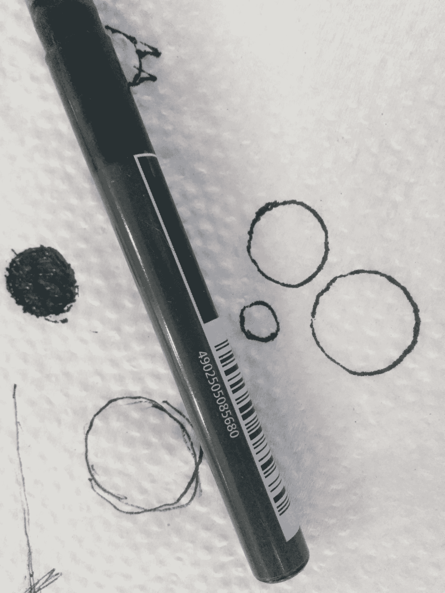

在这里，我们在一张纸巾上画了几个圆形。我们的检测器在轮廓上工作得最好，而不是实心圆形，尤其是平滑的轮廓，而不是凹凸不平或断裂的轮廓。对于这张图片，我们的检测器在两个最右边的圆形上工作得最好。我们还有一个笔，其边缘在纸的背景上看起来像是直线。我们的检测器可以很好地处理这些线性边缘。

`Rollingball`是一个简单的应用程序，用户主要与一个 Android 活动或一个 iOS 视图控制器进行交互。实时视频填充了大部分背景。当检测到圆形或线条时，它们会以红色突出显示，如下面的屏幕截图所示：

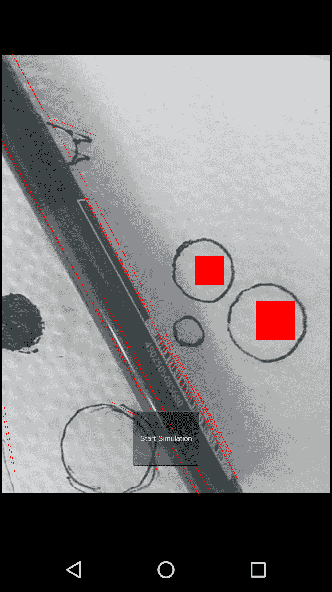

注意，一些线性边缘被检测了多次。光照效果和笔颜色的不连续性造成了对其边缘位置的不确定性。

用户可以按按钮开始物理模拟。在模拟过程中，视频暂停，检测器停止运行，红色突出显示的区域被替换为青色球体和线条。线条是静止的，但球体自由下落，可能会相互弹跳并沿着线条滚动。使用移动设备的重力传感器测量的现实世界重力被用来控制模拟的重力方向。然而，模拟是二维的，重力被压扁，使其指向屏幕的边缘。以下屏幕截图显示了球体在页面部分下落、弹跳分开并沿着线条滚动后的模拟效果：

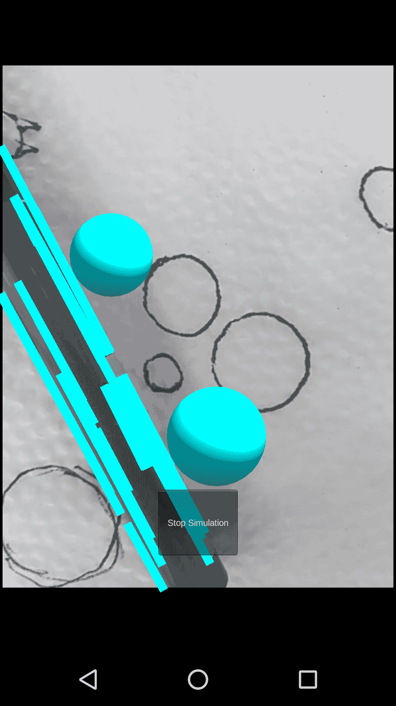

用户可以再次按按钮来清除所有模拟对象，并恢复实时视频和检测。这个循环可以无限进行，用户可以选择模拟不同的绘画或同一绘画的不同视图。

现在，让我们考虑检测圆形和线条的技术。

# 检测圆形和线条

从《活着的车灯》（我们项目中的第五章，*装备汽车后视摄像头和危险检测*)，我们已经熟悉了一种检测圆形的技术。我们将这个问题视为 blob 检测的特殊情况，并使用了一个 OpenCV 类，`SimpleBlobDetector`，它允许我们指定许多检测标准，例如 blob 的大小、颜色和圆形度（或非圆形度，即线性）。

**Blob**是一种填充了固体（或几乎固体）颜色的形状。这个定义意味着许多圆形或线性物体不能被检测为 blob。在下面的屏幕截图中，我们可以看到一个阳光照耀的桌子，上面有中国茶壶、中国碗和锡碗：

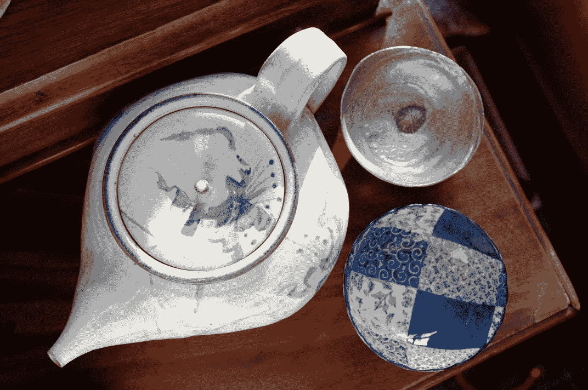

在这种俯视图中，茶壶的碗和盖子的大致轮廓是圆形的。然而，它们不太可能被检测为块状，因为每个形状的内部是多色的，尤其是在不均匀的光照下。

轮廓检测从简单的阈值滤波器开始（将明亮区域标记为白色，将暗淡区域标记为黑色）；形状检测的更通用方法应该从边缘检测滤波器开始（将边缘区域标记为白色，将内部区域标记为黑色），然后进行阈值处理。我们定义边缘为不同亮度区域之间不连续性。因此，边缘像素在一侧有较暗的邻居，而在另一侧有较亮的邻居。边缘检测滤波器从一侧减去邻居值，从另一侧添加它们，以便测量像素在给定方向上表现出这种边缘对比度的强度。为了实现一个与边缘方向无关的测量，我们可以应用多个滤波器（每个滤波器都针对不同方向的边缘），并将每个滤波器的输出视为向量的一个维度，其大小表示像素的整体**边缘性**。对于所有像素的这种测量集合有时被称为图像的**导数**。计算完图像的导数后，我们根据所需的边缘最小对比度选择一个阈值。高阈值只接受高对比度边缘，而低阈值也接受低对比度边缘。

一种流行的边缘检测技术是**Canny 算法**。OpenCV 的实现，`Imgproc.Canny`函数，执行过滤和阈值处理。作为参数，它接受一个灰度图像、一个输出图像、一个低阈值值和一个高阈值值。低阈值应该接受所有可能是良好边缘一部分的像素。高阈值应该只接受肯定是良好边缘一部分的像素。从可能是边缘像素的集合中，Canny 算法只接受与肯定边缘像素相连的成员。双重标准有助于确保我们可以接受主要边缘的细末端，同时拒绝整体微弱的边缘。例如，笔触或延伸到远处的道路边缘可能是一个主要边缘，但其末端较细。

在识别了边缘像素后，我们可以计算有多少个边缘像素被给定的原始形状相交。交点数越多，我们越有信心认为给定的原始形状正确地表示了图像中的边缘。每个交点被称为**投票**，一个形状需要达到指定数量的投票才能被接受为真实边缘的形状。在图像中所有可能的原始形状（给定种类）中，我们考虑一个均匀分布的代表性样本。我们通过指定形状的几何参数的步长来实现这一点。（例如，线的参数是一个点和角度，而圆的参数是中心点和半径。）这个可能的形状样本被称为**网格**，其中的单个形状被称为**单元格**，投票是在单元格中投下的。这个过程（实际边缘像素与可能的形状样本之间的匹配计数）是称为**霍夫变换**的技术核心，它有各种专门化，如**霍夫线检测**和**霍夫圆检测**。

在 OpenCV 中，霍夫线检测有两种实现方式——`Imgproc.HoughLines`，它基于原始的霍夫变换，以及`Imgproc.HoughLinesP`，它基于霍夫变换的概率变体。`Imgproc.HoughLines`会对给定的一对步长（以像素和弧度为单位）的所有可能线条进行穷举计数。`Imgproc.HoughLinesP`通常更快（尤其是在只有少量长线段的照片中），因为它以随机顺序考虑可能的线条，并在一个区域内找到一个好的线条后丢弃一些可能的线条。`Imgproc.HoughLines`将每条线表示为从原点到线的距离和角度，而`Imgproc.HoughLinesP`将每条线表示为两个点，即检测到的线段的端点，这种表示方式更有用，因为它允许我们将检测结果视为线段，而不是无限长的线。对于这两个函数，参数包括图像（应该使用 Canny 或其他类似算法进行预处理）、像素和弧度中的步长，以及接受线条所需的最小交点数。`Imgproc.HoughLinesP`的参数还包括端点之间的最小长度和最大间隙，其中间隙是指边缘像素之间相交的线上的非边缘像素。

OpenCV 中有一个 Hough 圆检测的实现，即`Imgproc.HoughCircles`，它基于一种利用边缘梯度信息的 Hough 变换变体。此函数的参数包括图像（不需要使用 Canny 或类似算法进行预处理，因为`Imgproc.HoughCircles`内部应用了 Canny 算法）、一个下采样因子（它有点像模糊因子，用于平滑潜在圆的边缘）、检测到的圆中心之间的最小距离、Canny 边缘检测阈值、接受圆所需的最小交点数以及最小和最大半径。指定的 Canny 阈值是上限阈值；内部，下限阈值被硬编码为上限阈值的一半。

关于 Canny 算法、Hough 变换以及 OpenCV 对这些算法的实现，请参阅 Robert Laganière 的书籍《OpenCV 3 计算机视觉应用编程食谱》（Packt Publishing，2017 年）的第七章“提取线、轮廓和组件”。

尽管`Imgproc.HoughCircles`比原始的 Hough 变换更高效，但它是一个计算成本较高的函数。尽管如此，我们在`Rollingball`中使用它，因为许多现代移动设备可以处理这种成本。对于低功耗设备，如 Raspberry Pi，我们会考虑使用区域检测作为更经济的替代方案。`Imgproc.HoughCircles`通常与圆的轮廓一起工作，而区域检测仅适用于实心圆。对于线检测，我们使用`Imgproc.HoughLinesP`函数，它比 OpenCV 的其他 Hough 检测器便宜。

在选择了算法及其 OpenCV 实现之后，让我们设置插件，以便我们可以在 Unity 中轻松访问这些功能。

# 设置 OpenCV for Unity

Unity 提供了一个跨平台的框架，用于使用 C#编写游戏脚本。然而，它也支持使用 C、C++、Objective-C（适用于 Mac 和 iOS）和 Java（适用于 Android）等语言编写的平台特定插件。开发者可以在 Unity Asset Store 上发布这些插件（和其他资产）。许多发布的插件代表了大量的高质量工作，购买一个可能比编写自己的更经济。

OpenCV for Unity，由 ENOX SOFTWARE（[`enoxsoftware.com`](https://enoxsoftware.com)）开发，是一款售价 95 美元的插件（本书撰写时）。它提供了一个基于 OpenCV 官方 Java（Android）绑定的 C# API。然而，该插件封装了 OpenCV 的 C++库，并且与 Android、iOS、Windows Phone、Windows、Mac、Linux 和 WebGL 兼容。在我的使用经验中，它非常可靠，并且它节省了我们大量原本需要投入到自定义 C++代码和 C#包装器中的工作。此外，它还附带了一些有价值的示例。

OpenCV for Unity 不是 OpenCV 的唯一第三方 C#绑定集。其他选择包括 OpenCvSharp ([`github.com/shimat/opencvsharp`](https://github.com/shimat/opencvsharp)) 和 Emgu CV ([`www.emgu.com`](http://www.emgu.com))。然而，在这本书中，我们使用 OpenCV for Unity，因为它与 Unity 的集成简单，并且当发布新的 OpenCV 版本时，它通常会快速更新。

让我们去购物。打开 Unity 并创建一个新的项目。从菜单栏中选择 Window | Asset Store。如果你还没有创建 Unity 账户，请按照提示创建一个。一旦你登录到商店，你应该会看到 Asset Store 窗口。在右上角的搜索栏中输入`OpenCV for Unity`。点击搜索结果中的 OpenCV for Unity 链接。你应该会看到类似于以下截图的内容：


点击“添加到购物车”按钮并按照指示完成交易。点击“下载”按钮并等待下载完成。点击“导入”按钮。你现在应该会看到如图所示的“导入 Unity 包”窗口：

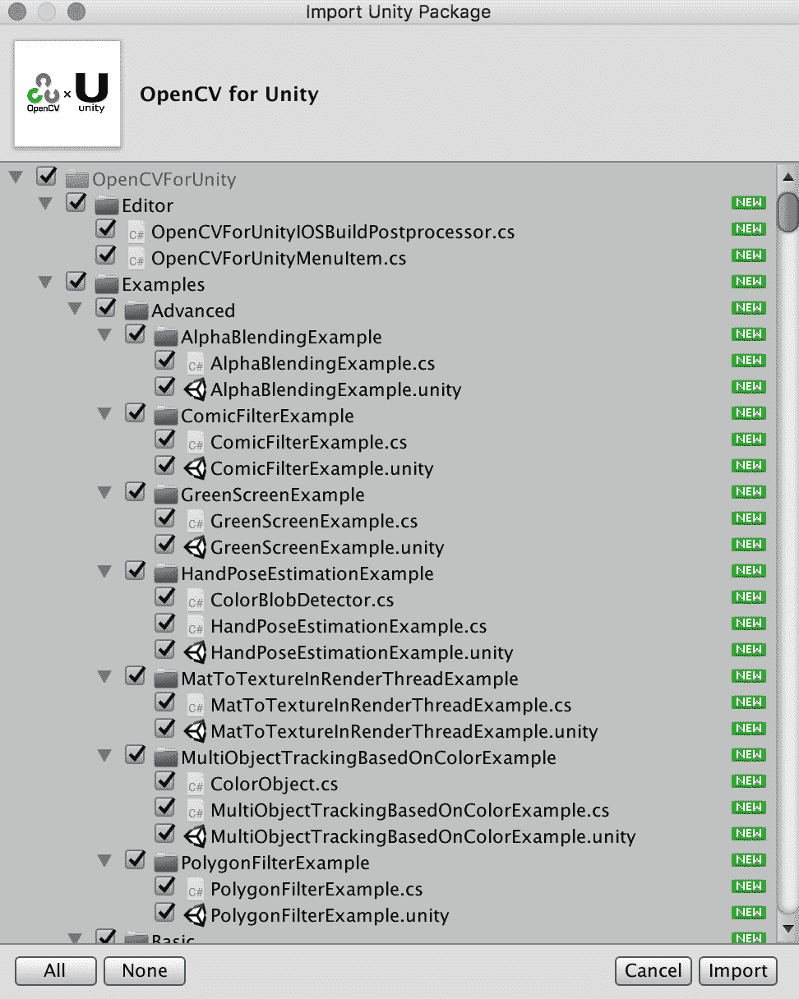

这是刚刚购买的包中所有文件的列表。确保所有复选框都已勾选，然后点击“导入”按钮。很快，你应该会在 Unity 编辑器的项目面板中看到所有文件。

该包包括在`OpenCVForUnity/ReadMe.pdf`文件中的进一步设置说明和有用的链接。如果你希望为 iOS 平台构建，请阅读包含有用说明的`ReadMe!`笔记。

在本章中，除非另有说明，否则路径相对于项目的`Assets`文件夹。

接下来，让我们尝试一下示例。

# 配置和构建 Unity 项目

Unity 支持许多目标平台。只要我们的插件支持，切换到新平台很容易。我们只需要设置一些构建配置值，其中一些在多个目标之间共享，而另一些则是特定于平台的。

从菜单栏中选择 Unity | 首选项...，这将打开首选项窗口。点击“外部工具”选项卡并将 Android SDK 设置为 Android SDK 安装的基路径。通常，对于 Android Studio 环境，Windows 上的 SDK 路径是`C:\Users\username\AppData\Local\Android\sdk\`，而 Mac 上的路径是`Users/<your_username>/Library/Android/sdk/`。现在，窗口应该看起来类似于以下截图：

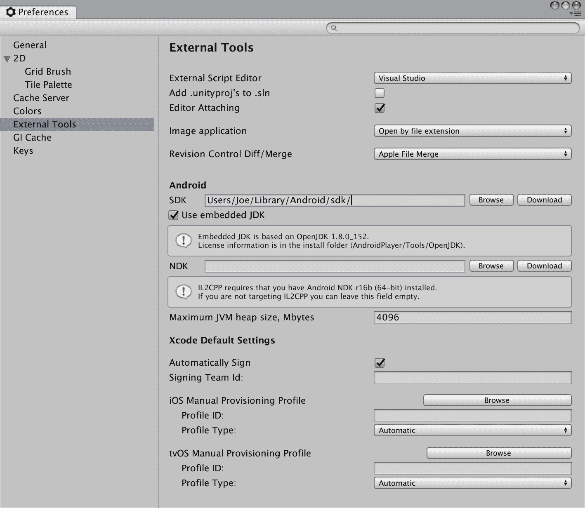

现在，从菜单栏中选择 File | Build Settings。 Build Settings 窗口应该会出现。将所有示例场景文件，例如 `OpenCVForUnity/Examples/OpenCVForUnityExample.unity` 和 `OpenCVForUnity/Examples/Advanced/ComicFilterExample/ComicFilterExample.unity`，从项目 面板拖动到 Build Settings 窗口中的 Scenes In Build 列表。列表中的第一个场景是启动场景。确保 `OpenCVForUnityExample` 是列表中的第一个。（拖动并放下列表项以重新排序。）同时，确保所有场景的复选框都已勾选。点击 Android 平台，然后点击 Switch Platform 按钮。窗口现在应该看起来类似于以下截图：

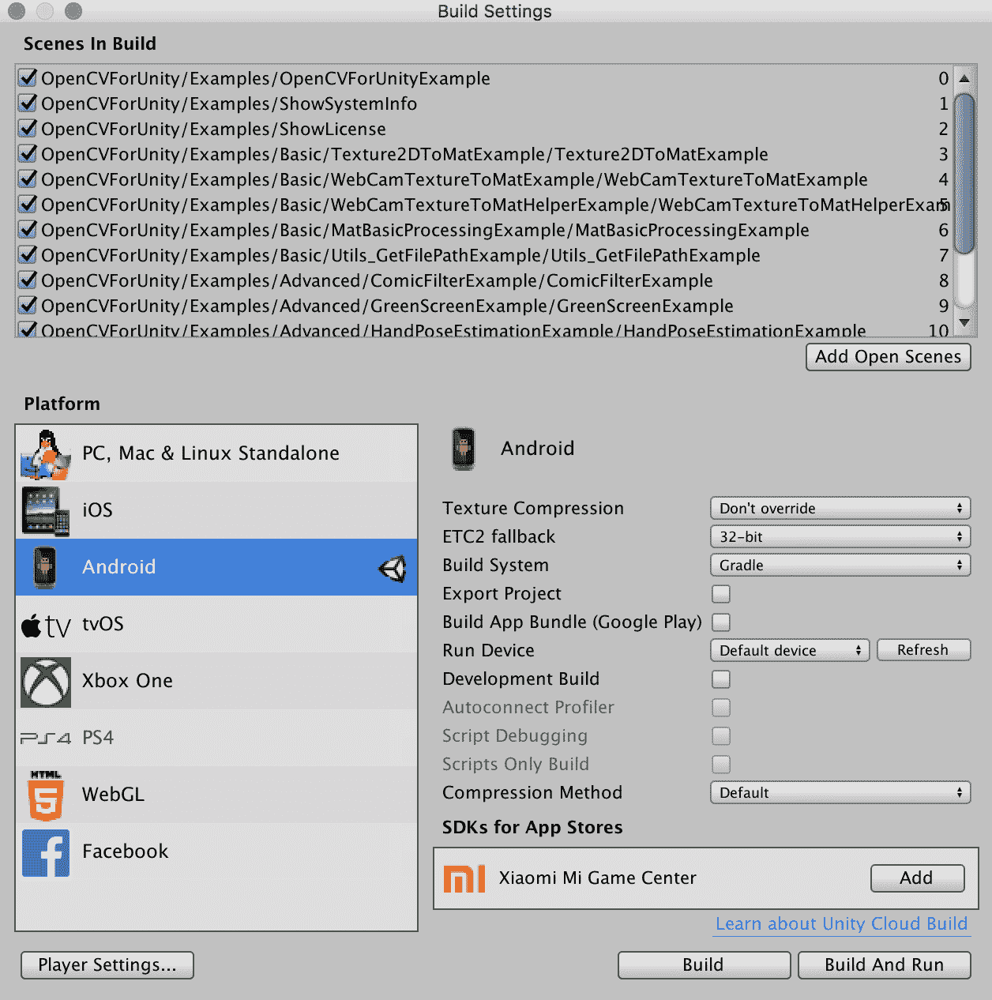

点击 Player Settings... 按钮。Unity 编辑器的检查器面板中应该会显示一个设置列表。填写一个公司名称，例如 `Nummist 媒体有限公司`，以及一个产品名称，例如 `Rollingball`。可选地，选择一个默认图标（必须是你在项目面板中添加的图像文件）。点击分辨率和展示以展开它，然后，对于默认方向，选择纵向。到目前为止，PlayerSettings 选项应该看起来类似于以下截图：

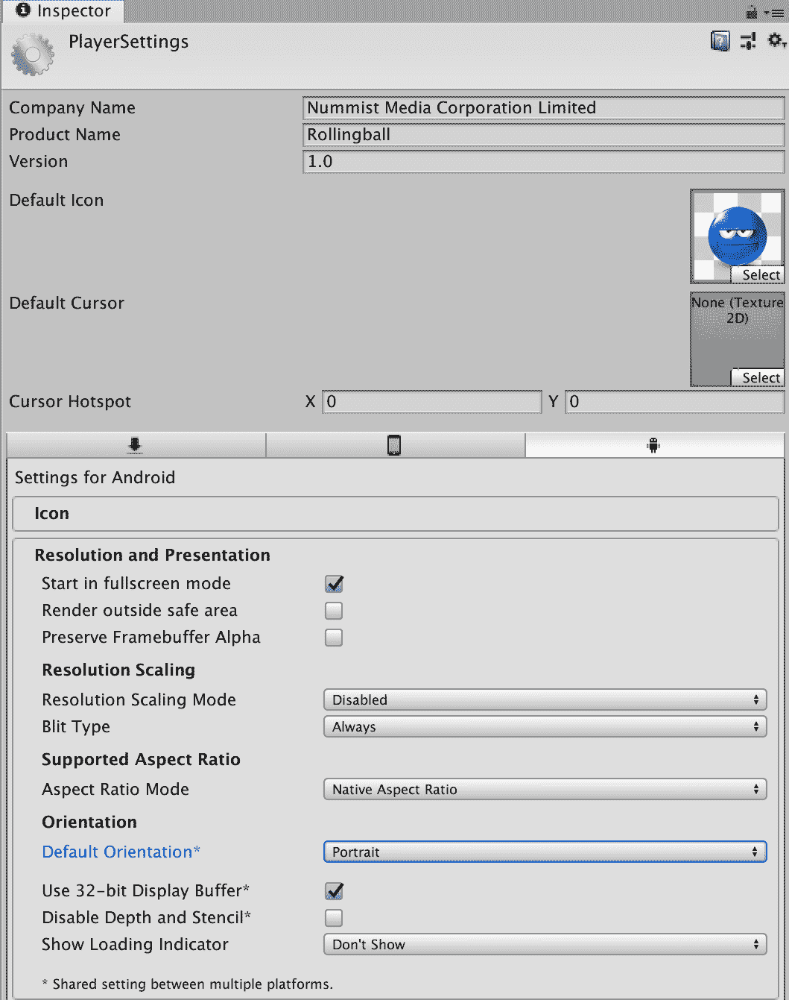

点击 Other Settings 以展开它，然后填写一个 Bundle Identifier，例如 `com.nummist.rollingball`。现在，我们已经完成了 PlayerSettings 选项。

确保已连接 Android 设备，并且设备上启用了 USB 调试。返回到 Build Settings 窗口，并点击 Build and Run。指定构建路径。将构建路径与 Unity 项目文件夹分开，就像你通常将构建与源代码分开一样。一旦开始构建，就会出现一个进度条。观察 Unity 编辑器的控制台面板，以确保没有构建错误发生。构建完成后，它将被复制到 Android 设备上，然后运行。

享受 OpenCV for Unity 的示例！如果你愿意，可以在 Unity 编辑器中浏览它们的源代码和场景。

接下来，我们有自己的场景要构建！

# 在 Unity 中创建 Rollingball 场景

让我们创建一个目录，`Rollingball`，以包含我们的应用程序特定代码和资源。在项目面板中右键单击，并从上下文菜单中选择 Create | Folder。将新文件夹重命名为 `Rollingball`。以类似的方式创建一个子文件夹，`Rollingball/Scenes`。

从菜单栏中选择 File | New Scene，然后选择 File | Save As.... 将场景保存为 `Rollingball/Scenes/Rollingball.unity`。

默认情况下，我们新创建的场景只包含一个摄像机（即虚拟世界的摄像机，不是一个捕获设备）和一个方向光。这个光将照亮我们物理模拟中的球体和线条。我们将以以下方式添加三个更多对象：

1.  从菜单栏中选择 GameObject | 3D Object | Quad。一个名为 `Quad` 的对象应该出现在 Hierarchy 面板中。将 `Quad` 重命名为 `VideoRenderer`。这个对象将代表实时视频流。

1.  从菜单栏中选择 GameObject | Create Empty。一个名为 `GameObject` 的对象应该出现在 Hierarchy 面板中。将 `GameObject` 重命名为 `QuitOnAndroidBack`。稍后，它将包含一个响应 Android 标准返回按钮的脚本组件。

Hierarchy 中的对象被称为 **游戏对象**，它们在检查器面板中可见的部分被称为 **组件**。

将主摄像机拖放到 VideoRenderer 上，使其成为后者的子对象。当父对象移动、旋转或缩放时，子对象也会移动、旋转和缩放。相关之处在于我们希望我们的摄像机与实时视频背景保持可预测的关系。

Hierarchy 中的父子关系不代表面向对象继承；换句话说，子对象与其父对象之间没有 **is a** 的关系。相反，一个具有一对多 **has a** 关系的父对象与它的子对象相关。

创建了新对象并将主摄像机重新分配父级后，Hierarchy 应该看起来像以下截图：

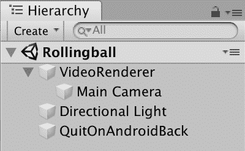

VideoRenderer 和主摄像机将根据移动设备视频摄像机的属性进行配置。但是，让我们设置一些合理的默认值。在 Hierarchy 中选择 VideoRenderer，然后在检查器面板中编辑其变换属性，以匹配以下截图：

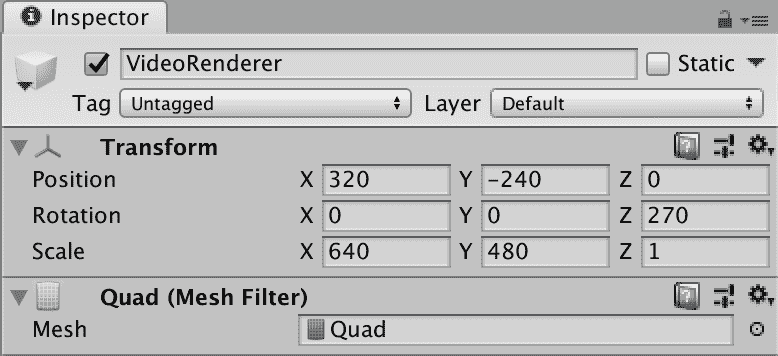

同样，选择主摄像机并编辑其变换和摄像机属性，以匹配以下截图：

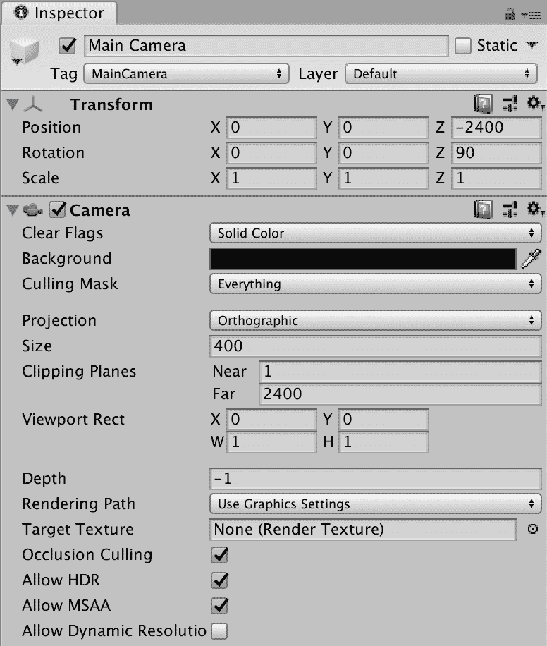

注意，我们已经配置了正交投影，这意味着对象的像素大小是恒定的，无论它们与摄像机的距离如何。这种配置适用于二维游戏或模拟，例如 `Rollingball`。

这四个对象是我们场景的基础。项目的其余部分涉及将这些对象附加自定义属性，并使用 C# 脚本控制它们，并在它们周围创建新对象。

# 创建 Unity 资产并将它们添加到场景中

Unity 项目中的自定义属性和行为是通过各种类型的文件定义的，这些文件统称为 **资产**。我们的项目还有四个剩余的问题和要求，我们必须通过创建和配置资产来解决：

+   场景中表面的外观是什么——即视频流、检测到的圆圈和线条以及模拟的球和线条？我们需要编写 *着色器* 代码并创建 *材质* 配置来定义这些表面的外观。

+   球的弹跳性如何？我们需要创建一个 *物理材质* 配置来回答这个所有重要的问题。

+   哪些对象代表模拟的球体和模拟的线条？我们需要创建和配置模拟可以实例化的*预制件*对象。

+   所有这些是如何表现的？我们需要编写 Unity *脚本*——具体来说，是子类化名为`MonoBehaviour`的 Unity 类的代码——以控制场景中对象在其生命周期各个阶段的操作。

下面的子节将逐一解决这些要求。

# 编写着色器和创建材质

**着色器**是一组在 GPU 上运行的函数。尽管这些函数可以应用于通用计算，但通常，它们用于图形渲染——即根据描述光照、几何、表面纹理以及其他变量（如时间）的输入来定义屏幕上输出像素的颜色。Unity 附带了许多用于三维和二维渲染的常见风格的着色器。我们也可以编写自己的着色器。

对于 Unity 着色器脚本编写的深入教程，请参阅由 John P. Doran 和 Alan Zucconi 编写的《Unity 2018 Shaders and Effects Cookbook》（Packt Publishing，2018 年）。

让我们在`Rollingball/Shaders`文件夹中创建一个文件夹，并在其中创建一个着色器（通过在项目面板的上下文菜单中点击“创建”|“着色器”|“标准表面着色器”）。将着色器重命名为`DrawSolidColor`。双击它以编辑它，并用以下代码替换其内容：

```py
Shader "Draw/Solid Color" {
  Properties {
    _Color ("Main Color", Color) = (1.0, 1.0, 1.0, 1.0)
  }
  SubShader {
    Pass { Color [_Color] }
  }
}
```

这个朴素的着色器有一个参数——一个颜色。着色器以这种颜色渲染像素，无论条件如何，如光照。对于检查器 GUI 的目的，着色器的名称是 Draw | Solid Color，其参数的名称是 Main Color。

材质具有着色器和一组着色器的参数值。相同的着色器可能被多个材质使用，这些材质可能使用不同的参数值。让我们创建一个绘制纯红色的材质。我们将使用这个材质来突出检测到的圆圈和线条。

在`Rollingball/Materials`文件夹中创建一个新文件夹，并在其中创建一个材质（通过在上下文菜单中点击“创建”|“材质”）。将材质重命名为`DrawSolidRed`。选择它，并在检查器中将其着色器设置为 Draw | Solid Color，其主颜色设置为红色（`255`, `0`, `0`, `255`）的 RGBA 值。检查器现在应该如下所示：

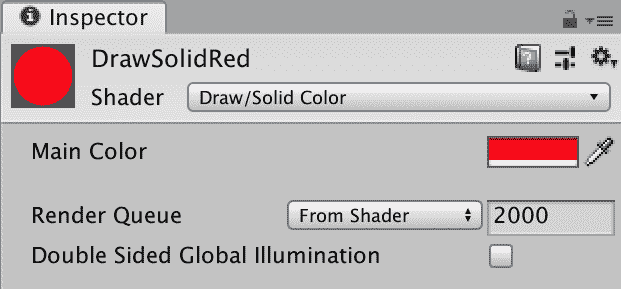

我们将使用 Unity 附带的一些着色器创建两个额外的材质。首先，创建一个材质，将其命名为`Cyan`，并配置其着色器为 Legacy Shaders | Diffuse，其主颜色为青色（`0`, `255`, `255`, `255`）。将基础（RBG）纹理设置为无。我们将把这个材质应用到模拟的球体和线条上。其检查器应该如下所示：

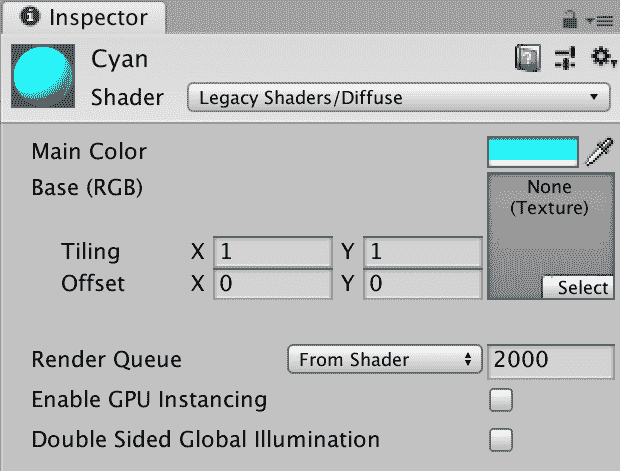

现在，创建一个名为 Video 的材质，并配置其着色器为 Unlit | Texture。将 Base (RBG)纹理设置为 None。稍后，我们将通过代码将视频纹理分配给这个材质。将 Video 材质（从项目面板中）拖到层次结构面板中的 VideoRenderer 上，以将材质分配给四边形。选择 VideoRenderer 并确认其检查器包括以下项目：

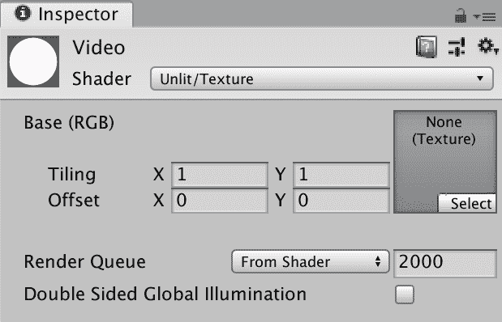

我们将在创建预制件和脚本后分配剩余的材料。

现在我们已经为渲染创建了材质，让我们看看物理材质的类似概念。

# 创建物理材质

虽然 Unity 的渲染管线可以运行我们在着色器中编写的自定义函数，但其物理管线运行固定函数。尽管如此，我们可以通过物理材质来配置这些函数的参数。

Unity 的物理引擎基于 NVIDIA PhysX。PhysX 支持通过 NVIDIA GeForce GPU 上的 CUDA 进行加速。然而，在典型的移动设备上，物理计算将在 CPU 上运行。

让我们创建一个名为`Rollingball/Physics Materials`的文件夹，并在其中创建一个物理材质（通过在上下文菜单中点击创建 | 物理材质）。将物理材质重命名为`Bouncy`。选择它，并注意在检查器中它有以下属性：

+   **动态摩擦**：这是两个物体相互挤压（例如，重力）的力与抵抗沿表面继续运动的摩擦力之间的比率。

+   **静摩擦**：这是两个物体相互挤压（例如，重力）的力与抵抗沿表面初始运动的摩擦力之间的比率。参考维基百科（[`en.wikipedia.org/wiki/Friction#Approximate_coefficients_of_friction`](https://en.wikipedia.org/wiki/Friction#Approximate_coefficients_of_friction)）获取示例值。对于静摩擦，0.04 的值类似于特氟龙在特氟龙上，1.0 的值类似于橡胶在混凝土上，1.05 的值类似于铜在铸铁上。

+   **弹性**：这是物体在从另一个表面弹跳时保留的动能比例。在这里，`0`的值表示物体不会弹跳。`1`的值表示物体无能量损失地弹跳。大于`1`的值表示物体在弹跳时（不切实际地）获得了能量。

+   **摩擦组合**：当物体碰撞时，哪个物体的摩擦值会影响这个物体？选项有平均值、最小值、乘法和最大值。

+   **弹跳组合**：当物体碰撞时，哪个物体的弹性值会影响这个物体？选项有平均值、最小值、乘法和最大值。

小心！那些物理材质是爆炸性的吗？

当物理模拟的值不断增长并超出系统的浮点数限制时，我们说它 **爆炸**。例如，如果一个碰撞的合并弹跳性大于 `1` 并且碰撞重复发生，那么随着时间的推移，力趋向于无穷大。嘭！我们破坏了物理引擎。

即使没有奇怪的物理材质，在极端大或小规模的场景中也会出现数值问题。例如，考虑一个使用来自 **全球定位系统**（**GPS**）的输入的多玩家游戏，以便 Unity 场景中的对象根据玩家的真实世界经纬度定位。物理模拟无法处理这个场景中的人形物体，因为物体及其作用力非常小，以至于它们在浮点误差的范围内消失！这是一个模拟内爆（而不是爆炸）的情况。

让我们将弹跳性设置为 `1`（非常弹跳！）并将其他值保留在默认设置。稍后，如果您愿意，您可以调整一切以符合您的口味。检查器应该看起来如下：

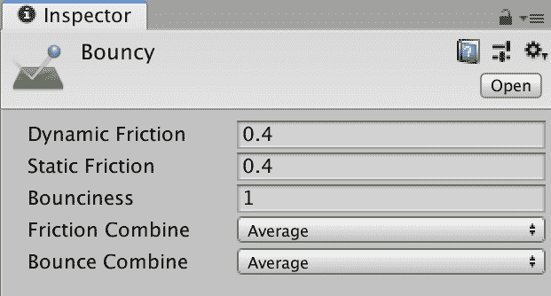

我们模拟的线条将使用默认的物理参数，因此不需要物理材质。

既然我们已经有了我们的渲染材质和物理材质，让我们为整个模拟球和整个模拟线条创建预制体。

# 创建预制体

**预制体**是一个不属于场景本身的物体，但设计用于在编辑或运行时被复制到场景中。它可以被复制多次以在场景中创建多个对象。在运行时，这些副本与预制体或彼此之间没有特殊连接，所有副本都可以独立行为。尽管预制体的作用有时被比作类的角色，但预制体并不是一个类型。

尽管预制体不是场景的一部分，但它们通常是通过场景创建和编辑的。让我们通过从菜单栏中选择 GameObject | 3D Object | Sphere 来在场景中创建一个球体。一个名为 **Sphere** 的对象应该出现在层次结构中。将其重命名为 `SimulatedCircle`。将以下资产从项目面板拖到层次结构中的 `SimulatedCircle`：

+   **青色**（在 `Rollingball/Materials` 中）

+   **Bouncy** (在 `Rollingball/PhysicsMaterials` 中)

现在，选择 SimulatedCircle。在检查器中，点击添加组件并选择 Physics | Rigidbody。检查器中应出现 Rigidbody 部分。在此部分中，展开约束字段并勾选 Freeze Position | Z。这种变化的效果是将球体的运动限制在二维。确认检查器看起来如下：

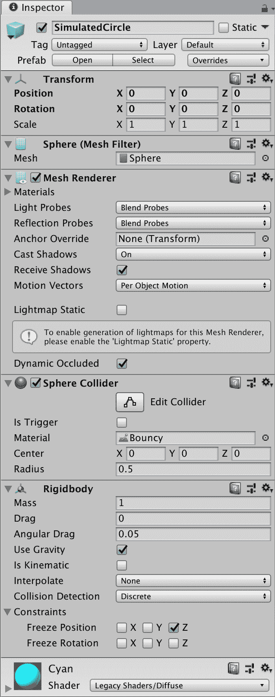

创建一个文件夹，`Rollingball/Prefabs`，并将 Hierarchy 中的 `SimulatedCircle` 拖动到 Project 窗格中的文件夹中。一个名为 `SimulatedCircle` 的预制件应该出现在文件夹中。同时，Hierarchy 中的 `SimulatedCircle` 对象名称应该变为蓝色，以表示该对象具有预制件连接。可以通过在场景对象 Inspector 中的 Apply 按钮上单击将场景中对象的更改应用到预制件。相反，预制件（在编辑时，而不是在运行时）的更改会自动应用到场景中的实例，除非实例有未应用更改的属性。

现在，让我们遵循类似的步骤来创建一个模拟线的预制件。从菜单栏中选择 GameObject | 3D Object | Cube 创建场景中的一个立方体。一个名为 Cube 的对象应该出现在 Hierarchy 中。将其重命名为 `SimulatedLine`。将 Project 窗格中的 Cyan 拖动到 Hierarchy 中的 SimulatedLine 上。选择 SimulatedLine，添加一个 Rigidbody 组件，并在其 Inspector 的 Rigidbody 部分中勾选 Is Kinematic，这意味着该对象不会被物理模拟移动（尽管它仍然是模拟的一部分，以便其他对象与之碰撞）。回想一下，我们希望线条保持静止。它们只是下落球体的障碍物。现在，Inspector 应该看起来像这样：


让我们清理场景，通过从 Hierarchy 中删除预制件的实例来删除场景中的任何圆或线。（然而，我们希望保留预制件本身在 Project 中，以便我们可以通过脚本稍后实例化它们。）现在，让我们将注意力转向脚本的编写，脚本能够复制预制件，这是其中之一。

# 编写我们的第一个 Unity 脚本

如我们之前提到的，Unity 脚本是 `MonoBehaviour` 的子类。一个 `MonoBehaviour` 对象可以获取对 Hierarchy 中对象的引用以及我们在 Inspector 中附加到这些对象的组件。`MonoBehaviour` 对象还有一个自己的 Inspector，我们可以在这里分配额外的引用，包括对 Project 资产（如预制件）的引用。在运行时，当某些事件发生时，Unity 会向所有 `MonoBehaviour` 对象发送消息。`MonoBehaviour` 的子类可以为这些消息中的任何一种实现回调。`MonoBehaviour` 支持超过 60 种标准消息回调。以下是一些示例：

+   `Awake`：在初始化期间调用。

+   `Start`：在 `Awake` 之后，但在第一次调用 `Update` 之前被调用。

+   `Update`：每帧都会调用。

+   `OnGUI`：当 GUI 投影层准备好渲染指令并且 GUI 事件准备好被处理时被调用。

+   `OnPostRender`：在场景渲染后调用。这是一个实现后处理效果的适当回调。

+   `OnDestroy`：当这个脚本的实例即将被销毁时调用。例如，当场景即将结束时会发生这种情况。

更多关于标准消息回调以及一些回调实现可能可选接受的参数的信息，请参阅官方文档[`docs.unity3d.com/ScriptReference/MonoBehaviour.html`](http://docs.unity3d.com/ScriptReference/MonoBehaviour.html)。另外，请注意，我们可以通过使用`SendMessage`方法向所有`MonoBehaviour`对象发送自定义消息。

这些实现以及 Unity 的其他回调可以是`private`、`protected`或`public`。Unity 会根据保护级别调用它们。

总结一下，脚本就像是胶水——游戏逻辑——将运行时事件连接到我们在项目、层次结构和检查器中看到的各个对象。

让我们创建一个文件夹，`Rollingball/Scripts`，并在其中创建一个脚本（通过在上下文菜单中点击“创建”|“C# 脚本”）。将脚本重命名为`QuitOnAndroidBack`，双击它以编辑它。用以下代码替换其内容：

```py
using UnityEngine;

namespace com.nummist.rollingball {

    public sealed class QuitOnAndroidBack : MonoBehaviour {

        void Start() {
            // Show the standard Android navigation bar.
            Screen.fullScreen = false;
        }

        void Update() {
            if (Input.GetKeyUp(KeyCode.Escape)) {
                Application.Quit();
            }
        }
    }
}
```

我们使用命名空间`com.nummist.rollingball`来组织我们的代码，并避免我们的类型名称与其他方代码中的类型名称之间可能出现的潜在冲突。C#中的命名空间类似于 Java 中的包。我们的类名为`QuitOnAndroidBack`。它扩展了 Unity 的`MonoBehaviour`类。我们使用`sealed`修饰符（类似于 Java 的`final`修饰符）来表示我们不打算创建`QuitOnAndroidBack`的子类。

注意，`MonoBehaviour`使用的是英国英语拼写行为。

多亏了 Unity 的回调系统，脚本中的`Start`方法在对象初始化后调用——在这种情况下，是在场景开始时。我们的`Start`方法确保标准 Android 导航栏可见。在`Start`之后，脚本中的`Update`方法每帧都会被调用。它检查用户是否按下了映射到`Escape`键码的键（或按钮）。在 Android 上，标准返回按钮映射到`Escape`。当按键（或按钮）被按下时，应用程序将退出。

保存脚本，并将其从**项目**面板拖动到层次结构中的`QuitOnAndroidBack`对象。单击`QuitOnAndroidBack`对象，确认其检查器看起来如下截图所示：

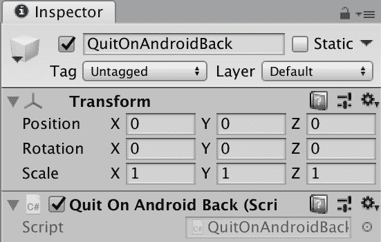

这段脚本很简单，对吧？下一个脚本稍微有点复杂，但更有趣，因为它处理了除了退出之外的所有事情。

# 编写 Rollingball 主脚本

让我们创建一个文件夹，`Rollingball/Scripts`，并在其中创建一个脚本（通过在上下文菜单中点击“创建”|“C# 脚本”）。将脚本重命名为`DetectAndSimulate`，双击它以编辑它。删除其默认内容，并从以下`import`语句开始编写代码：

```py
using UnityEngine;
using System.Collections;
using System.Collections.Generic;
using System.IO;

using OpenCVForUnity.CoreModule;
using OpenCVForUnity.ImgprocModule;
using OpenCVForUnity.UnityUtils;
```

接下来，让我们用以下代码声明我们的命名空间和类：

```py
namespace com.nummist.rollingball {

    [RequireComponent (typeof(Camera))]
    public sealed class DetectAndSimulate : MonoBehaviour {
```

注意，该类有一个属性 `[RequireComponent (typeof(Camera))]`，这意味着脚本只能附加到具有摄像头的游戏对象（不是视频摄像头，而是一个代表场景中玩家虚拟眼睛的游戏世界摄像头）。我们指定这个要求是因为我们将通过实现标准的 `OnPostRender` 回调来突出显示检测到的形状，而这个回调只为附加到具有摄像头的游戏对象的脚本调用。

`DetectAndSimulate` 需要存储在二维屏幕空间和三维世界空间中圆形和线的表示。屏幕空间中的坐标（即在用户的屏幕上）以像素为单位测量，屏幕的左上角像素是原点。世界空间中的坐标（即在最近定位 `VideoRenderer` 和 `Main Camera` 的游戏场景中）以任意单位测量，具有任意原点。圆形和线的表示不需要对应用程序中的任何其他类可见，因此将它们的类型定义为私有内部结构是合适的。我们的 `Circle` 类型存储在屏幕空间中表示圆心的二维坐标、表示屏幕空间中半径的浮点数以及表示世界空间中圆心的三维坐标。构造函数接受所有这些值作为参数。以下是 `Circle` 的实现：

```py
        struct Circle {

            public Vector2 screenPosition;
            public float screenDiameter;
            public Vector3 worldPosition;

            public Circle(Vector2 screenPosition,
                          float screenDiameter,
                          Vector3 worldPosition) {
                this.screenPosition = screenPosition;
                this.screenDiameter = screenDiameter;
                this.worldPosition = worldPosition;
            }
        }
```

我们定义了另一个内部结构 `Line`，用于存储在屏幕空间中表示端点的两套二维坐标和在世界空间中表示相同端点的两套三维坐标。构造函数接受所有这些值作为参数。以下是 `Line` 的实现：

```py
        struct Line {

            public Vector2 screenPoint0;
            public Vector2 screenPoint1;
            public Vector3 worldPoint0;
            public Vector3 worldPoint1;

            public Line(Vector2 screenPoint0,
                        Vector2 screenPoint1,
                        Vector3 worldPoint0,
                        Vector3 worldPoint1) {
                this.screenPoint0 = screenPoint0;
                this.screenPoint1 = screenPoint1;
                this.worldPoint0 = worldPoint0;
                this.worldPoint1 = worldPoint1;
            }
        }
```

接下来，我们定义了在检查器中可编辑的成员变量。这样的变量带有 `[SerializeField]` 属性，这意味着尽管它是非公共的，Unity 也会序列化该变量。（或者，公共变量也可以在检查器中编辑。）以下四个变量描述了我们对摄像头输入的偏好，包括摄像头面对的方向、其分辨率和帧率：

```py
        [SerializeField] bool useFrontFacingCamera = false;
        [SerializeField] int preferredCaptureWidth = 640;
        [SerializeField] int preferredCaptureHeight = 480;
        [SerializeField] int preferredFPS = 15;
```

在运行时，我们可用的摄像头设备和模式可能与这些偏好不同。

我们还将在检查器中使几个更多变量可编辑——具体来说，是视频背景渲染器的引用、用于突出显示检测到的形状的材料引用、调整模拟重力缩放因子的一个因子、模拟形状预制体的引用以及按钮的字体大小：

```py
        [SerializeField] Renderer videoRenderer;

        [SerializeField] Material drawPreviewMaterial;

        [SerializeField] float gravityScale = 8f;

        [SerializeField] GameObject simulatedCirclePrefab;
        [SerializeField] GameObject simulatedLinePrefab;

        [SerializeField] int buttonFontSize = 24;
```

我们还有一些成员变量不需要在检查器中可编辑。其中包含对游戏世界摄像头的引用、对现实世界摄像头视频纹理的引用、用于存储图像和中间处理结果的矩阵以及与摄像头图像、屏幕、模拟对象和按钮相关的测量值：

```py
        Camera _camera;

        WebCamTexture webCamTexture;
        Color32[] colors;
        Mat rgbaMat;
        Mat grayMat;
        Mat cannyMat;

        float screenWidth;
        float screenHeight;
        float screenPixelsPerImagePixel;
        float screenPixelsYOffset;

        float raycastDistance;
        float lineThickness;
        UnityEngine.Rect buttonRect;
```

我们以 OpenCV 的格式存储霍夫圆表示的矩阵（在这种情况下，对于景观图像具有图像坐标）以及以我们自己的 `Circle` 格式存储的圆表示列表（对于肖像屏幕具有屏幕坐标，以及游戏世界的三维坐标）：

```py
        Mat houghCircles;
        List<Circle> circles = new List<Circle>();
```

同样，我们以 OpenCV 的格式存储霍夫线表示的矩阵，以及以我们自己的 `Line` 格式存储的线表示列表：

```py
        Mat houghLines;
        List<Line> lines = new List<Line>();
```

我们持有陀螺仪输入设备的引用，并将用于物理模拟的重力幅度存储起来：

```py
        Gyroscope gyro;
        float gravityMagnitude;
```

我们（以及 Unity API）对 **陀螺仪** 和 **gyro** 术语的使用比较宽松。我们指的是可能包含或不包含真实陀螺仪的运动传感器的融合。陀螺仪可以通过使用其他真实传感器（如加速度计或重力传感器）来模拟，尽管模拟效果可能不佳。

Unity 提供了一个属性 `SystemInfo.supportsGyroscope`，用来指示设备是否具有真实的陀螺仪。然而，这个信息并不影响我们。我们只是使用 Unity 的 `Gyroscope.gravity` 属性，这个属性可能来自真实的重力传感器，或者可能通过使用其他真实传感器（如加速度计和/或陀螺仪）来模拟。默认情况下，Unity Android 应用配置为需要加速度计，因此我们可以安全地假设至少有一个模拟的重力传感器可用。

我们跟踪模拟对象的列表，并提供一个 `simulating` 属性，当列表非空时为 `true`：

```py
        List<GameObject> simulatedObjects =
                new List<GameObject>();
        bool simulating {
            get {
                return simulatedObjects.Count > 0;
            }
        }
```

现在，让我们将注意力转向方法。我们实现了标准的 `Start` 回调。实现过程首先获取附加摄像机的引用，初始化矩阵，获取陀螺仪的引用，并计算游戏世界中重力的幅度，如下面的代码所示：

```py
        void Start() {

            // Cache the reference to the game world's
            // camera.
            _camera = GetComponent<Camera>();

            houghCircles = new Mat();
            houghLines = new Mat();

            gyro = Input.gyro;
            gravityMagnitude = Physics.gravity.magnitude *
                               gravityScale;
```

`MonoBehaviour` 对象为可能附加到与脚本相同游戏对象的许多组件提供了获取器。这些组件将出现在检查器中与脚本并列。例如，`camera` 获取器返回一个 `Camera` 对象（如果没有，则为 `null`）。这些获取器很昂贵，因为它们使用了反射。因此，如果你需要反复引用一个组件，使用如 `_camera = camera;` 这样的语句将引用存储在成员变量中会更高效。

你可能想知道为什么我们在 `Start` 方法中初始化 `Mat` 对象，而不是在声明它们时或在 `DetectAndSimulate` 构造函数中初始化。原因是 OpenCV 库不一定在 `DetectAndSimulate` 等脚本构建之后才被加载。

`Start` 方法的实现继续通过查找面向所需方向（根据前面的 `useFrontFacingCamera` 字段值，可以是正面或背面）的摄像头。如果我们正在 Unity 编辑器中播放场景（为了在开发期间调试脚本和场景），我们将摄像头方向硬编码为正面，以支持典型的网络摄像头。如果没有找到合适的摄像头，该方法会提前返回，如下面的代码所示：

```py
#if UNITY_EDITOR
            useFrontFacingCamera = true;
#endif

            // Try to find a (physical) camera that faces
            // the required direction.
            WebCamDevice[] devices = WebCamTexture.devices;
            int numDevices = devices.Length;
            for (int i = 0; i < numDevices; i++) {
                WebCamDevice device = devices[i];
                if (device.isFrontFacing ==
                            useFrontFacingCamera) {
                    string name = device.name;
                    Debug.Log("Selecting camera with " +
                              "index " + i + " and name " +
                              name);
                    webCamTexture = new WebCamTexture(
                            name, preferredCaptureWidth,
                            preferredCaptureHeight,
                            preferredFPS);
                    break;
                }
            }

            if (webCamTexture == null) {
                // No camera faces the required direction.
                // Give up.
                Debug.LogError("No suitable camera found");
                Destroy(this);
                return;
            }
```

在我们实现 `DetectAndSimulate` 的过程中，当我们遇到无法恢复的运行时问题时，我们会调用 `Destroy(this);`，从而删除脚本的实例，防止进一步的消息到达其回调函数。

`Start` 回调通过激活摄像头和陀螺仪（包括重力传感器）并启动一个名为 `Init` 的辅助协程来结束：

```py
            // Ask the camera to start capturing.
            webCamTexture.Play();

            if (gyro != null) {
                gyro.enabled = true;
            }

            // Wait for the camera to start capturing.
            // Then, initialize everything else.
            StartCoroutine(Init());
        }
```

**协程** 是一种不一定在一个帧内运行到完成的方法。相反，它可以 `yield` 一个或多个帧，以等待某个条件得到满足或在一个定义的延迟后发生某些事情。请注意，协程在主线程上运行。

我们的 `Init` 协程首先等待摄像头捕获第一帧。然后，我们确定帧的尺寸并创建与这些尺寸匹配的 OpenCV 矩阵。以下是该方法实现的第一部分：

```py
        IEnumerator Init() {

            // Wait for the camera to start capturing.
            while (!webCamTexture.didUpdateThisFrame) {
                yield return null;
            }

            int captureWidth = webCamTexture.width;
            int captureHeight = webCamTexture.height;
            float captureDiagonal = Mathf.Sqrt(
                    captureWidth * captureWidth +
                    captureHeight * captureHeight);
            Debug.Log("Started capturing frames at " +
                      captureWidth + "x" + captureHeight);

            colors = new Color32[
                    captureWidth * captureHeight];

            rgbaMat = new Mat(captureHeight, captureWidth,
                              CvType.CV_8UC4);
            grayMat = new Mat(captureHeight, captureWidth,
                              CvType.CV_8UC1);
            cannyMat = new Mat(captureHeight, captureWidth,
                               CvType.CV_8UC1);
```

协程继续通过配置游戏世界的正交摄像头和视频四边形以匹配捕获分辨率并渲染视频纹理：

```py
            transform.localPosition =
                    new Vector3(0f, 0f, -captureWidth);
            _camera.nearClipPlane = 1;
            _camera.farClipPlane = captureWidth + 1;
            _camera.orthographicSize =
                    0.5f * captureDiagonal;
            raycastDistance = 0.5f * captureWidth;

            Transform videoRendererTransform =
                    videoRenderer.transform;
            videoRendererTransform.localPosition =
                    new Vector3(captureWidth / 2,
                                -captureHeight / 2, 0f);
            videoRendererTransform.localScale =
                    new Vector3(captureWidth,
                                captureHeight, 1f);

            videoRenderer.material.mainTexture =
                    webCamTexture;
```

设备的屏幕和捕获的摄像头图像可能具有不同的分辨率。此外，回想一下，我们的应用程序配置为竖屏方向（在 PlayerSettings 中）。这种方向影响屏幕坐标，但不影响摄像头图像中的坐标，摄像头图像将保持横屏方向。因此，我们需要计算图像坐标和屏幕坐标之间的转换系数，如下面的代码所示：

```py
            // Calculate the conversion factors between
            // image and screen coordinates.
            // Note that the image is landscape but the
            // screen is portrait.
            screenWidth = (float)Screen.width;
            screenHeight = (float)Screen.height;
            screenPixelsPerImagePixel =
                    screenWidth / captureHeight;
            screenPixelsYOffset =
                    0.5f * (screenHeight - (screenWidth *
                    captureWidth / captureHeight));
```

我们的转换将基于将视频背景适配到竖屏宽度，如果需要，则在顶部和底部进行信箱或裁剪视频。

模拟线的厚度和按钮的尺寸基于屏幕分辨率，如下面的代码所示，这标志着 `Init` 协程的结束：

```py
            lineThickness = 0.01f * screenWidth;

            buttonRect = new UnityEngine.Rect(
                    0.4f * screenWidth,
                    0.75f * screenHeight,
                    0.2f * screenWidth,
                    0.1f * screenHeight);
        }
```

我们通过处理重力传感器输入和处理满足某些条件的摄像头输入来实现标准的 `Update` 回调。在方法开始时，如果 OpenCV 对象尚未初始化，该方法会提前返回。否则，根据设备重力传感器检测到的真实世界重力方向，更新游戏世界重力方向。以下是该方法实现的第一部分：

```py
        void Update() {

            if (rgbaMat == null) {
                // Initialization is not yet complete.
                return;
            }

            if (gyro != null) {
                // Align the game-world gravity to real-world
                // gravity.
                Vector3 gravity = gyro.gravity;
                gravity.z = 0f;
                gravity = gravityMagnitude *
                          gravity.normalized;
                Physics.gravity = gravity;
            }
```

接下来，如果没有准备好新的相机帧或者当前正在运行模拟，该方法会提前返回。否则，我们将帧转换为 OpenCV 的格式，将其转换为灰度，找到边缘，并调用两个辅助方法，`UpdateCircles`和`UpdateLines`，以执行形状检测。以下是相关代码，它总结了`Update`方法：

```py
            if (!webCamTexture.didUpdateThisFrame) {
                // No new frame is ready.
                return;
            }

            if (simulating) {
                // No new detection results are needed.
                return;
            }

            // Convert the RGBA image to OpenCV's format using
            // a utility function from OpenCV for Unity.
            Utils.webCamTextureToMat(webCamTexture,
                                     rgbaMat, colors);

            // Convert the OpenCV image to gray and
            // equalize it.
            Imgproc.cvtColor(rgbaMat, grayMat,
                             Imgproc.COLOR_RGBA2GRAY);
            Imgproc.Canny(grayMat, cannyMat, 50.0, 200.0);

            UpdateCircles();
            UpdateLines();
        }
```

我们的`UpdateCircles`辅助方法首先执行 Hough 圆检测。我们寻找至少`10.0`像素间隔的圆，半径至少`5.0`像素，最多`60`像素。我们指定内部`HoughCircles`应使用 Canny 上限阈值`200`，以`2`倍进行下采样，并需要`150.0`个交点来接受一个圆。我们清除之前检测到的任何圆的列表。然后，我们遍历 Hough 圆检测的结果。以下是方法实现的开始部分：

```py
        void UpdateCircles() {

            // Detect blobs.
            Imgproc.HoughCircles(grayMat, houghCircles,
                                 Imgproc.HOUGH_GRADIENT, 2.0,
                                 10.0, 200.0, 150.0, 5, 60);

            //
            // Calculate the circles' screen coordinates
            // and world coordinates.
            //

            // Clear the previous coordinates.
            circles.Clear();

            // Count the elements in the matrix of Hough circles.
            // Each circle should have 3 elements:
            // { x, y, radius }
            int numHoughCircleElems = houghCircles.cols() *
                                      houghCircles.rows() *
                                      houghCircles.channels();

            if (numHoughCircleElems == 0) {
                return;
            }

            // Convert the matrix of Hough circles to a 1D array:
            // { x_0, y_0, radius_0, ..., x_n, y_n, radius_n }
            float[] houghCirclesArray = new float[numHoughCircleElems];
            houghCircles.get(0, 0, houghCirclesArray);

            // Iterate over the circles.
            for (int i = 0; i < numHoughCircleElems; i += 3) {
```

我们使用一个辅助方法，`ConvertToScreenPosition`，将每个圆的中心点从图像空间转换为屏幕空间。我们还将它的直径进行转换：

```py
                // Convert circles' image coordinates to
                // screen coordinates.
                Vector2 screenPosition =
                        ConvertToScreenPosition(
                                houghCirclesArray[i],
                                houghCirclesArray[i + 1]);
                float screenDiameter =
                        houghCirclesArray[i + 2] *
                        screenPixelsPerImagePixel;
```

我们使用另一个辅助方法，`ConvertToWorldPosition`，将圆的中心点从屏幕空间转换为世界空间。我们还将它的直径进行转换。完成转换后，我们实例化一个`Circle`并将其添加到列表中。以下是完成`UpdateCircles`方法的代码：

```py
                // Convert screen coordinates to world
                // coordinates based on raycasting.
                Vector3 worldPosition =
                        ConvertToWorldPosition(
                                screenPosition);

                Circle circle = new Circle(
                        screenPosition, screenDiameter,
                        worldPosition);
                circles.Add(circle);
            }
        }
```

我们的`UpdateLines`辅助方法首先执行概率 Hough 线检测，步长为每个像素和每个度。对于每条线，我们要求至少有`50`个与边缘像素的检测交点，长度至少`50`像素，并且没有超过`10.0`像素的间隙。我们清除之前检测到的任何线的列表。然后，我们遍历 Hough 线检测的结果。以下是方法实现的第一部分：

```py
        void UpdateLines() {

            // Detect lines.
            Imgproc.HoughLinesP(cannyMat, houghLines, 1.0,
                                Mathf.PI / 180.0, 50,
                                50.0, 10.0);

            //
            // Calculate the lines' screen coordinates and
            // world coordinates.
            //

            // Clear the previous coordinates.
            lines.Clear();

            // Count the elements in the matrix of Hough lines.
            // Each line should have 4 elements:
            // { x_start, y_start, x_end, y_end }
            int numHoughLineElems = houghLines.cols() *
                                    houghLines.rows() *
                                    houghLines.channels();

            if (numHoughLineElems == 0) {
                return;
            }

            // Convert the matrix of Hough circles to a 1D array:
            // { x_start_0, y_start_0, x_end_0, y_end_0, ...,
            //   x_start_n, y_start_n, x_end_n, y_end_n }
            int[] houghLinesArray = new int[numHoughLineElems];
            houghLines.get(0, 0, houghLinesArray);

            // Iterate over the lines.
            for (int i = 0; i < numHoughLineElems; i += 4) {
```

我们使用`ConvertToScreenPosition`辅助方法将每条线的端点从图像空间转换为屏幕空间：

```py
                // Convert lines' image coordinates to
                // screen coordinates.
                Vector2 screenPoint0 =
                        ConvertToScreenPosition(
                                houghLinesArray[i],
                                houghLinesArray[i + 1]);
                Vector2 screenPoint1 =
                        ConvertToScreenPosition(
                                houghLinesArray[i + 2],
                                houghLinesArray[i + 3]);
```

类似地，我们使用`ConvertToWorldPosition`辅助方法将线的端点从屏幕空间转换为世界空间。完成转换后，我们实例化一个`Line`并将其添加到列表中。以下是完成`UpdateLines`方法的代码：

```py
                // Convert screen coordinates to world
                // coordinates based on raycasting.
                Vector3 worldPoint0 =
                        ConvertToWorldPosition(
                                screenPoint0);
                Vector3 worldPoint1 =
                        ConvertToWorldPosition(
                                screenPoint1);

                Line line = new Line(
                        screenPoint0, screenPoint1,
                        worldPoint0, worldPoint1);
                lines.Add(line);
            }
        }
```

我们的`ConvertToScreenPosition`辅助方法考虑到我们的屏幕坐标是竖屏格式，而我们的图像坐标是横屏格式。图像空间到屏幕空间的转换实现如下：

```py
        Vector2 ConvertToScreenPosition(float imageX,
                                        float imageY) {
            float screenX = screenWidth - imageY *
                            screenPixelsPerImagePixel;
            float screenY = screenHeight - imageX *
                            screenPixelsPerImagePixel -
                            screenPixelsYOffset;
            return new Vector2(screenX, screenY);
        }
```

我们的`ConvertToWorldPosition`辅助方法使用 Unity 内置的射线投射功能以及我们指定的目标距离`raycastDistance`，将给定的二维屏幕坐标转换为三维世界坐标：

```py
        Vector3 ConvertToWorldPosition(
                Vector2 screenPosition) {
            Ray ray = _camera.ScreenPointToRay(
                    screenPosition);
            return ray.GetPoint(raycastDistance);
        }
```

我们通过检查是否有任何模拟的球或线存在，如果没有，则调用辅助方法`DrawPreview`来实现标准的`OnPostRender`回调。以下是代码：

```py
        void OnPostRender() {
            if (!simulating) {
                DrawPreview();
            }
        }
```

`DrawPreview`辅助方法的作用是显示检测到的圆和线的位置和尺寸（如果有）。为了避免不必要的绘制调用，如果没有要绘制的对象，该方法会提前返回，如下面的代码所示：

```py
        void DrawPreview() {

            // Draw 2D representations of the detected
            // circles and lines, if any.

            int numCircles = circles.Count;
            int numLines = lines.Count;
            if (numCircles < 1 && numLines < 1) {
                return;
            }
```

确定有检测到的形状需要绘制后，该方法通过使用`drawPreviewMaterial`配置 OpenGL 上下文以在屏幕空间中绘制。这种设置如下面的代码所示：

```py
            GL.PushMatrix();
            if (drawPreviewMaterial != null) {
                drawPreviewMaterial.SetPass(0);
            }
            GL.LoadPixelMatrix();
```

如果有检测到的圆，我们进行一次绘制调用以突出显示它们。具体来说，我们告诉 OpenGL 开始绘制四边形，我们给它提供近似圆的正方形屏幕坐标，然后我们告诉它停止绘制四边形。以下是代码：

```py
            if (numCircles > 0) {
                // Draw the circles.
                GL.Begin(GL.QUADS);
                for (int i = 0; i < numCircles; i++) {
                    Circle circle = circles[i];
                    float centerX =
                            circle.screenPosition.x;
                    float centerY =
                            circle.screenPosition.y;
                    float radius =
                            0.5f * circle.screenDiameter;
                    float minX = centerX - radius;
                    float maxX = centerX + radius;
                    float minY = centerY - radius;
                    float maxY = centerY + radius;
                    GL.Vertex3(minX, minY, 0f);
                    GL.Vertex3(minX, maxY, 0f);
                    GL.Vertex3(maxX, maxY, 0f);
                    GL.Vertex3(maxX, minY, 0f);
                }
                GL.End();
            }
```

类似地，如果有检测到的线，我们进行一次绘制调用以突出显示它们。具体来说，我们告诉 OpenGL 开始绘制线，我们给它提供线的屏幕坐标，然后我们告诉它停止绘制线。以下是代码，它完成了`DrawPreview`方法：

```py
            if (numLines > 0) {
                // Draw the lines.
                GL.Begin(GL.LINES);
                for (int i = 0; i < numLines; i++) {
                    Line line = lines[i];
                    GL.Vertex(line.screenPoint0);
                    GL.Vertex(line.screenPoint1);
                }
                GL.End();
            }

            GL.PopMatrix();
        }
```

我们通过绘制一个按钮来实现标准的`OnGUI`回调。根据是否有模拟的球和线存在，按钮上显示的是停止模拟或开始模拟。但是，如果没有模拟的球或线，也没有检测到的球或线，则按钮根本不会显示。当按钮被点击时，会调用一个辅助方法（`StopSimulation`或`StartSimulation`）。以下是`OnGUI`的代码：

```py
        void OnGUI() {
            GUI.skin.button.fontSize = buttonFontSize;
            if (simulating) {
                if (GUI.Button(buttonRect,
                               "Stop Simulation")) {
                    StopSimulation();
                }
            } else if (circles.Count > 0 || lines.Count > 0) {
                if (GUI.Button(buttonRect,
                               "Start Simulation")) {
                    StartSimulation();
                }
            }
        }
```

`StartSimulation`辅助方法首先暂停视频流，并将`simulatedCirclePrefab`的副本放置在检测到的圆上。每个实例都按检测到的圆的直径进行缩放。以下是该方法的第一部分：

```py
        void StartSimulation() {

            // Freeze the video background
            webCamTexture.Pause();

            // Create the circles' representation in the
            // physics simulation.
            int numCircles = circles.Count;
            for (int i = 0; i < numCircles; i++) {
                Circle circle = circles[i];
                GameObject simulatedCircle =
                        (GameObject)Instantiate(
                                simulatedCirclePrefab);
                Transform simulatedCircleTransform =
                        simulatedCircle.transform;
                simulatedCircleTransform.position =
                        circle.worldPosition;
                simulatedCircleTransform.localScale =
                        circle.screenDiameter *
                        Vector3.one;
                simulatedObjects.Add(simulatedCircle);
            }
```

该方法通过放置`simulatedLinePrefab`的副本在检测到的线上结束。每个实例都按检测到的线的长度进行缩放。以下是该方法的其他部分：

```py
            // Create the lines' representation in the
            // physics simulation.
            int numLines = lines.Count;
            for (int i = 0; i < numLines; i++) {
                Line line = lines[i];
                GameObject simulatedLine =
                        (GameObject)Instantiate(
                                simulatedLinePrefab);
                Transform simulatedLineTransform =
                        simulatedLine.transform;
                float angle = -Vector2.Angle(
                        Vector2.right, line.screenPoint1 -
                                line.screenPoint0);
                Vector3 worldPoint0 = line.worldPoint0;
                Vector3 worldPoint1 = line.worldPoint1;
                simulatedLineTransform.position =
                        0.5f * (worldPoint0 + worldPoint1);
                simulatedLineTransform.eulerAngles =
                        new Vector3(0f, 0f, angle);
                simulatedLineTransform.localScale =
                        new Vector3(
                                Vector3.Distance(
                                        worldPoint0,
                                        worldPoint1),
                                lineThickness,
                                lineThickness);
                simulatedObjects.Add(simulatedLine);
            }
        }
```

`StopSimulation`辅助方法简单地用于恢复视频流，删除所有模拟的球和线，并清除包含这些模拟对象的列表。列表为空时，检测器再次满足运行条件（在`Update`方法中）。`StopSimulation`的实现如下：

```py
        void StopSimulation() {

            // Unfreeze the video background.
            webCamTexture.Play();

            // Destroy all objects in the physics simulation.
            int numSimulatedObjects =
                    simulatedObjects.Count;
            for (int i = 0; i < numSimulatedObjects; i++) {
                GameObject simulatedObject =
                        simulatedObjects[i];
                Destroy(simulatedObject);
            }
            simulatedObjects.Clear();
        }
```

当脚本的实例被销毁（场景结束时），我们确保释放了摄像头和陀螺仪，如下面的代码所示：

```py
        void OnDestroy() {
            if (webCamTexture != null) {
                webCamTexture.Stop();
            }
            if (gyro != null) {
                gyro.enabled = false;
            }
        }
    }
}
```

保存脚本，并将其从项目面板拖动到层次结构中的主摄像机对象。点击主摄像机对象，在其检查器的“检测和模拟（脚本）”部分，将以下对象拖到以下字段：

+   将`VideoRenderer`（来自层次结构）拖到检查器的视频渲染器字段

+   将`DrawSolidRed`（来自项目面板中的`Rollingball/Materials`）拖到检查器的绘制预览材质字段

+   将`SimulatedCircle`（来自项目面板中的`Rollingball/Prefabs`）拖到检查器的模拟圆预制件字段

+   将`SimulatedLine`（从项目面板中的`Rollingball/Prefabs`）拖动到“模拟线预制体”字段（在检查器中）

这些更改后，脚本在“检查器”中的部分应如下截图所示：

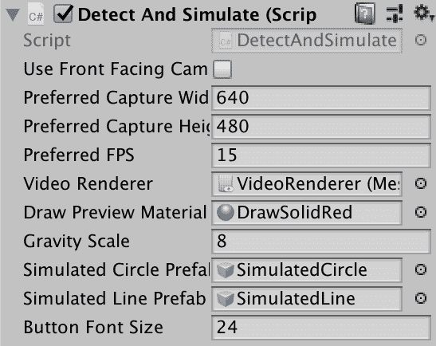

我们的主要场景已完成！现在，我们需要一个简单的启动器场景，该场景负责获取用户访问摄像头的权限，并启动主要场景。

# 在 Unity 中创建启动器场景

我们的`Rollingball`场景，特别是`DetectAndSimulate`脚本，试图通过 Unity 的`WebCamDevice`和`WebCamTexture`类访问摄像头。Unity 在 Android 上的摄像头权限方面有些智能。在`Rollingball`场景开始时（或任何需要访问摄像头的场景），Unity 会自动检查用户是否已授予摄像头访问权限；如果没有，Unity 将请求权限。不幸的是，这种自动请求对于`DetectAndSimulate`在它的`Start`和`Init`方法中正确访问摄像头来说来得太晚了。为了避免这类问题，最好编写一个带有脚本的开机场景，该脚本明确请求摄像头访问权限。

创建一个新的场景，并将其保存为`Launcher`在`Rollingball/Scenes`文件夹中。从场景中删除方向光。添加一个空对象并命名为`Launcher`。现在，场景的“层次结构”应如下所示：

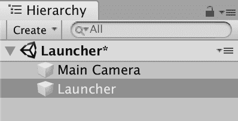

在检查器中编辑“主摄像头”，给它一个实心的黑色背景，如下截图所示：

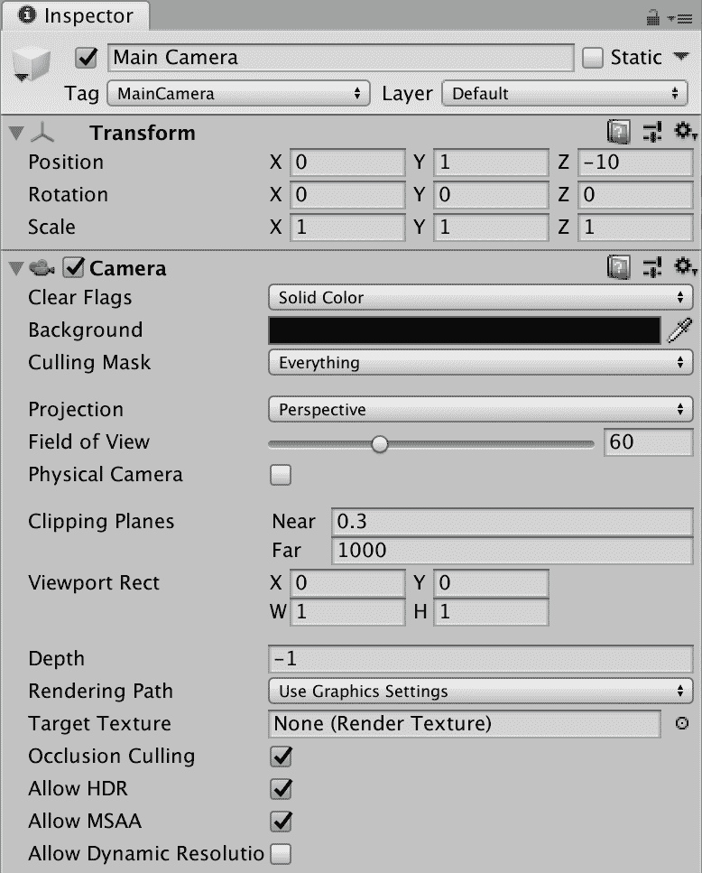

在`Rollingball/Scripts`中创建一个新的脚本，将其重命名为`Launcher`，编辑它，并用以下代码替换其内容：

```py
using UnityEngine;
using UnityEngine.SceneManagement;

#if PLATFORM_ANDROID
using UnityEngine.Android;
#endif

namespace com.nummist.rollingball {

    public class Launcher : MonoBehaviour {

        void Start() {

#if PLATFORM_ANDROID
            if (!Permission.HasUserAuthorizedPermission(
                    Permission.Camera))
            {
                // Ask the user's permission for camera access.
                Permission.RequestUserPermission(Permission.Camera);
            }
#endif

            SceneManager.LoadScene("Rollingball");
        }
    }
}
```

在`Start`时，此脚本检查用户是否已授予访问摄像头的权限。如果没有，脚本通过显示标准的 Android 权限请求对话框来请求权限。`Start`方法通过加载我们之前创建的`Rollingball`场景来完成。

保存脚本，并将其从“项目”面板拖动到“启动器”对象中。点击“启动器”对象，确认其“检查器”看起来如下：

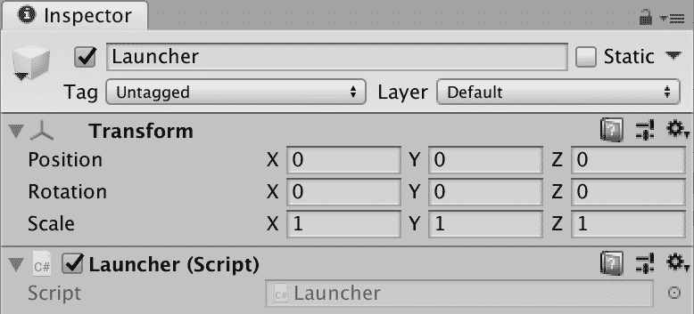

我们的启动器场景已完成。剩下的只是配置、构建和测试我们的项目。

# 整理和测试

让我们回到“构建设置”窗口（文件 | 构建设置...）。我们不再希望在构建中包含 OpenCV for Unity 演示。通过取消选中它们或选择并删除它们（Windows 上的*删除*或 Mac 上的*Cmd* + *Del*）来删除它们。然后，通过从“项目”面板拖动到“构建中的场景”列表中，添加“启动器”和`Rollingball`场景。完成时，“构建设置”窗口应如下截图所示：

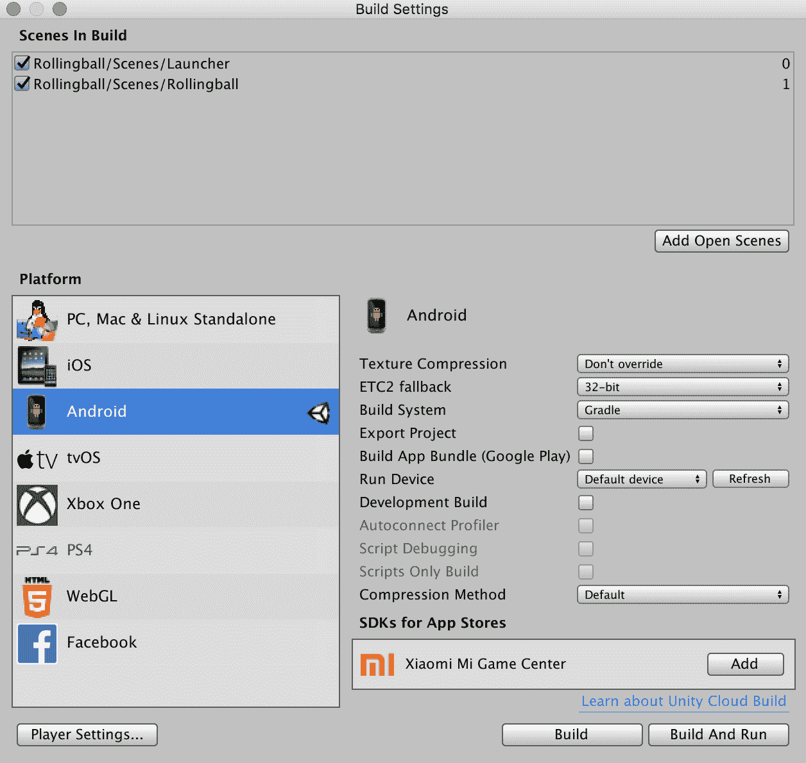

点击“构建和运行”按钮，覆盖任何之前的构建，让好时光继续！

如果你是在为 iOS 构建，请记住遵循`OpenCVForUnity/ReadMe.pdf`中的附加说明。特别是，确保项目的相机使用描述设置为有用的描述字符串，例如`Rollingball`使用相机来检测圆和线（显然！）并且将目标最低 iOS 版本设置为`8.0`。

通过绘制和扫描各种大小、各种笔触风格的点和线来测试应用。也可以尝试扫描一些不是绘图的东西。随时可以回到代码中，编辑检测器的参数，重新构建，看看灵敏度是如何变化的。

# 摘要

这一章真正丰富了我们的经验，并为我们的成就划上了句号。你已经学会了如何通过使用霍夫变换来检测原始形状。我们还一起使用了 OpenCV 和 Unity，将笔和纸的草图转换成了一个物理玩具。我们甚至超越了 Q 所能让笔做到的事情！

然而，一个秘密特工不能仅凭墨水和纸张就能解决所有问题。接下来，我们将摘下我们的阅读眼镜，放下我们的物理模拟，并考虑分解我们周围世界中的真实运动的方法。准备好通过频率域的万花筒来观察！
