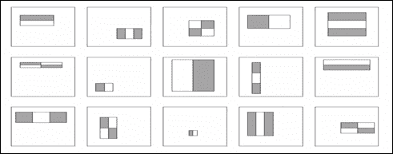
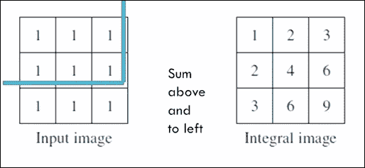
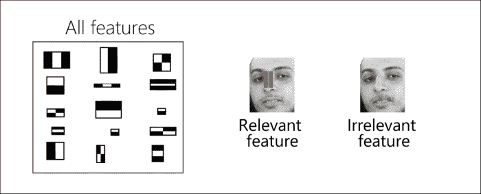
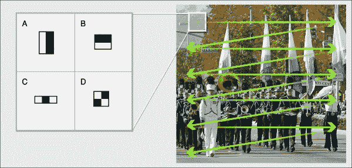

# 六、应用 4 –自动自拍

在本章中，我们将开始开发新的应用。 该应用的目标是能够在不触摸手机屏幕的情况下自拍。 您的应用将能够检测到某个手势，该手势将触发保存当前相机帧的过程。

我们将介绍的主题包括：

*   用于对象检测的级联分类器
*   使用 OpenCV 操纵摄像机帧
*   使用训练过的级联分类器检测对象

# 级联分类器

在本节中，我们将讨论强大的级联分类器及其组件，Haar 特征，积分图像，**自适应提升**（**Adaboost**）和级联以构建一个物体检测器。

简而言之，要构造对象检测器，您可以使用正样本（例如，尺寸为`24x24`的人脸）和负样本（任何其他非人脸的图像）对其进行训练。 您将不断完善训练过程，以最大程度地减少训练错误（分类为非面部的面部总数和分类为面部的非面部总数）。

训练完成后，我们得到一张新图像，我们要求检测器检查其是否有正面样本（即面部）。 这样做的步骤如下：

1.  检测器将使用扫描窗口扫描输入图像，并且每个扫描的窗口都会得到一个分数。
2.  然后，如果检测器的分数大于某个阈值，则检测器将说该窗口包含正面样本。 否则，事实并非如此。

## 类 Haar 的特征

类 Haar 的特征是的另一种类型的特征，用于来检测诸如面孔，行人等的刚性物体。

《使用简单特征的增强级联的快速目标检测》论文，由 *Paul Viola* 和 *Michael Jones* 于 2001 年提出，介绍了类似 Haar 的特征的使用自适应提升和级联来检测人脸。 从那时起，许多其他特征和增强变化被用于产生许多其他对象类别的分类器。


建立用于对象检测的级联分类器的第一步是尝试对有关正样本和负样本的丰富信息进行编码。 换句话说，我们需要确定哪些特征被认为足够好，可以将面孔和非面孔分开。 在本节中，我们将讨论与第 5 章，“App 3：全景查看器”中看到的特征不同的其他类型的特征。 此处使用的特征是固定大小的像素网格，在这种情况下，由于固定大小的网格定义了描述区域，因此无需检测兴趣点。

类似 Haar 的特征是固定大小的像素网格，分为黑色和白色区域，与我们在第 2 章，“应用 1-建立自己的暗室”中讨论的卷积核非常相似。 。 将 Haar 特征应用于给定的图像区域时，可以通过从黑色区域下的强度总和中减去白色区域下的像素强度之和来描述相应的图像区域，从而得到一个值。

类似 Haar 的特征设计灵活； 例如，您可以具有多个 Type 1 特征，但是将不同的高度和/或宽度应用于图像的不同区域。 因此，给定这些参数（特征类型（1、2、3、4 或 5），特征宽度，特征高度和应用该特征的图像区域），您将获得大量可用于描述正面和负面样本的特征。

### 注意

在 Viola 和 Jones 的工作中，该算法使用`24x24`窗口作为基本窗口大小（所有面部和非面部的尺寸都调整为`24x24`像素），如果考虑所有参数（类型，比例和位置），则我们最终拥有大小为 160,000 个特征的池。

下图是特征部件池的示例：



拥有如此众多的特征，将这样的算法应用于实时应用将是一个挑战。 因此，我们需要开始进行一些优化。

可以用来消除冗余特征或选择真正有区别的特征子集的一种优化技术是“自适应提升”，本章稍后将回到该算法的详细信息。

另一种优化技术用于计算特征值（即从黑色区域中减去白色区域），并且可以通过计算所谓的积分图像来实现。

## 完整图片

每当我们想要计算特征值时，我们都需要将白色斑块相加并从黑色斑块中减去，然后快速进行操作，Viola 和 Jones 提出了一个很好的技巧，称为积分图像， 如下：



积分图像是与输入图像尺寸相同的图像，但是每个积分像素`(i, j)`是在输入像素`(i, j)`上方和左侧的所有输入像素的总和。 例如，当左上像素用`(0, 0)`索引时，值`6`的整数像素`(1, 2)`是所有输入像素`(i, j)`的总和，其中`i <= 1`，`j <= 2`。

计算完积分图像后，获得图像中任何区域的输入像素的总和将成为`O(1)`运算。

例如，考虑具有四个区域的积分图像：`A`，`B`，`C`和`D`。`1`表示的整数像素将所有输入像素的总和存储在区域`A`中，`2`表示的整数像素是区域`A`和`B`中所有输入像素的总和，由`3`表示的整数像素是区域`A`中所有输入像素的总和。`C`和`C`相同，积分像素`4`相同，它们将输入像素的总和存储在`A`，`B`，`C`和`D`。

现在，要获得区域`D`中输入像素的总和，您只需要四个整数角像素 1、2、3 和 4 的值，并使用简单的算术运算`D = 4 + 1 - 2 - 3`，您将获得输入区域总和，如下所示：


## 自适应提升

现在，我们已经使用使用积分图像技巧来优化特征计算，我们需要最小化要使用的特征数量。

为此，Viola 和 Jones 使用 Adaboost 算法选择了可以区分正样本和负样本的相关特征子集（也称为弱分类器），如下图所示：



最简单形式的 Adaboost 算法可以描述如下：

1.  从均匀的正负样本权重开始。 所有样本（正样本或负样本）同等重要。
2.  遍历特征/弱分类器池，然后选择加权加权分类误差最小的分类器。

    ### 注意

    分类错误是使用此特征将多少张面孔分类为非面孔，将多少张非面孔分类为面孔。

3.  增加错误分类的样本（负样本或正样本）的权重，以强调在下一次迭代中正确分类这些样本的重要性。
4.  重复步骤 2 和 3，直到收敛为止。 在许多情况下，可以通过选择最多 N 个特征来收敛。

一旦我们获得了这些特征（弱分类器）的列表，便可以将它们线性组合以形成更强的分类器，其表现优于任何单独的弱分类器，最后确定一个阈值以最佳地将面孔和非面孔分开。

对于要分类的新图像，我们计算在输入图像上使用 Adaboost 选择的`N`个相关特征的数量，并根据所选阈值确定它是人脸还是非人脸。

## 级联

最后一个技巧为这种类型的分类器起了名字，以加快对任何给定图像的检测速度，其依据是我们需要使用尺寸为`24x24`的窗口扫描输入图像，例如 Viola 和 Jones 的作品。 但是，我们知道，在许多此类窗口中，不存在感兴趣的对象，因此需要对算法进行修改，以便尽快拒绝否定窗口并集中于可能的肯定窗口。

为此，我们构建了一系列强分类器，而不是训练一个强分类器。 因此，所有选定的特征都被分组为多个阶段，其中每个阶段都用于确定给定窗口是否肯定是包含感兴趣对象的否定窗口或可能是肯定窗口。 基本上，此更新使我们能够使用较小的一组相关特征尽早消除大量的负面窗口，如下所示：


训练过程完成后，我们得到一系列强大的分类器，这些分类器可以在任何给定图像上应用固定大小的滑动窗口，并检测给定窗口是否包含感兴趣的对象：



在下一部分中，我们将使用已经训练好的级联分类器，该分类器可以检测图像中的闭合手掌，并且将闭合手掌的存在作为提示来保存当前图像帧。

# 使用级联分类器检测对象

在本节中，我们将使用级联分类器来检测手机摄像头馈送中的闭合手掌，但首先，我们将介绍如何使用 OpenCV 访问手机摄像头。

## 使用 OpenCV 访问手机的摄像头

我们将按照前面章节中使用的相同步骤，首先创建一个名为`AutoSelfie`的空白活动新应用。

为了使应用能够访问手机的相机并能够保存图片，您需要在清单文件中添加以下两个权限：

```java
<uses-permissionandroid:name="android.permission.CAMERA"/>
<uses-permissionandroid:name="android.permission.WRITE_EXTERNAL_STORAGE"/>
```

您可以通过本章随附的代码捆绑包查找其余配置。

### 相机预览

OpenCV 为相机预览类提供 Java 实现，该类用于处理设备相机和 OpenCV 库之间的交互。 `org.opencv.android.JavaCameraView`类使相机可以在设备屏幕上处理和绘制帧。

到目前为止，使用`JavaCameraView`预览相机帧已经足够； 但是，我们将需要定义自己的相机视图类，以便以后能够扩展`JavaCameraView`类的功能。 现在，让我们看看如何定义自己的相机视图类：

1.  创建一个名为`com.app4.autodselfie.CamView`的新 Java 类。
2.  使新类扩展到`org.opencv.android.JavaCameraView`。
3.  如下定义`CamView`类构造器：

    ```java
    public CamView(Context context, AttributeSet attrs) {
      super(context, attrs);
    }
    ```

就是这个。 稍后，当我们向应用中添加拍照功能时，我们将回到此类。

#### UI 定义

在应用布局文件`activity_auto_selfie.xml`中，我们将主视图定义为`CamView`类（因为它是`android.view.SurfaceView`类的子类）：

```java
<LinearLayout xmlns:android="http://schemas.android.com/apk/res/android"
xmlns:tools="http://schemas.android.com/tools"
android:layout_width="match_parent"
android:layout_height="match_parent">

<com.app4.autoselfie.CamView
android:layout_width="fill_parent"
android:layout_height="fill_parent"
android:id="@+id/auto_selfie_activity_surface_view"/>

</LinearLayout>
```

#### 预览相机帧

返回活动`AutoSelfie`，我们将按照以下步骤开始从设备的摄像机接收帧：

1.  更改活动类以实现`CvCameraViewListener2`接口，该接口会将活动类转变为用于监听我们`CamView`类，相机视图开始，相机视图停止和收到的相机帧的三个生命事件的监听器：

    ```java
    public class AutoSelfie extends Activity implements CvCameraViewListener2
    ```

2.  我们声明两个空的`Mat`对象-一个用于保存当前相机帧的 RGB 版本，另一个用于保存灰度版本：

    ```java
    private Mat mRgba;
    private Mat mGray;
    ```

3.  我们实现了`CvCameraViewListener2`的三个缺失事件处理器。 开始摄影机视图后，我们将初始化两个`Mat`对象。 当摄像机视图停止时，我们将其释放，当我们开始接收摄像机帧时，我们将返回要在屏幕上绘制的当前帧的 RGB 版本：

    ```java
    public void onCameraViewStarted(int width, int height) {
      mGray = new Mat();
      mRgba = new Mat();
    }

    public void onCameraViewStopped() {
      mGray.release();
      mRgba.release();
    }

    public Mat onCameraFrame(CvCameraViewFrame inputFrame) {
      mRgba=inputFrame.rgba();
      return mRgba;
    }
    ```

4.  更新`onCreate()`方法以找到我们在应用布局文件中定义的`CamView`对象，将相机设置为连接（正面或背面），在本例中，我们将连接至正面相机，最后 ，将我们的活动注册为`CamView`对象生命事件的监听器：

    ```java
    mOpenCvCameraView = (CamView) findViewById(R.id.auto_selfie_activity_surface_view);
    mOpenCvCameraView.setCameraIndex(1);
    mOpenCvCameraView.setCvCameraViewListener(this);
    ```

5.  最后，在成功加载 OpenCV 库后，我们可以使`CamView` 对象连接到设备摄像机； 只有这样`onCameraViewStarted()`才会被调用，`CamView`对象变为活动状态：

    ```java
    private BaseLoaderCallback  mLoaderCallback = new BaseLoaderCallback(this) {
      @Override
      public void onManagerConnected(int status) {
        switch (status) {
          case LoaderCallbackInterface.SUCCESS:
          {
            Log.i(TAG, "OpenCV loaded successfully");
     mOpenCvCameraView.enableView();
          } break;
          default:
          {
            super.onManagerConnected(status);
          } break;
        }
      }
    };
    ```

### 注意

您会注意到，将设备直立放置时，绘制的框架会翻转。 不用担心，我们稍后会处理此问题。

## 检测摄像头框架中闭合的手掌

自动自拍应用的下一步是检测提示以捕获当前相机帧。 我发现，闭合的手掌是足够好的提示，您可以考虑其他提示，例如笑脸等。

正如我们在“级联分类器”部分中提到的那样，我们的检测器将是使用类似 Haar 特征的级联分类器。

### 注意

训练有素的阶段和所选特征将保存在 XML 文件中。 您可以直接从[这个页面](https://github.com/Aravindlivewire/Opencv/blob/master/haarcascade/aGest.xml)下载文件，也可以在本章随附的项目文件夹中找到该文件。

### 使用基于 Java 的级联分类器

一旦使训练有素的分类器检测到您选择的对象（在我们的情况下为闭合手掌），OpenCV 便会提供多尺度滑动窗口检测器，它将在滑动式窗口中运行训练有素的分类器，并在输入图像的多个比例上，以不同比例返回检测到的对象周围的边界框。

### 注意

使用我们在第 5 章，“App 3：全景查看器”中遇到的图像金字塔的概念构造了多个比例尺。

使用`org.opencv.objdetect.CascadeClassifier`类作为现成的滑动窗口检测器非常容易。 我们首先需要将训练有素的分类器 XML 文件复制到应用原始资源文件夹`\res\raw\haarhand.xml`中。

接下来，我们通过如下更改`BaseLoaderCallback`实现来声明并初始化`org.opencv.objdetect.CascadeClassifier`对象：

```java
private File cascadeFile;
private CascadeClassifier cascadeClassifier;
private BaseLoaderCallback mLoaderCallback = new BaseLoaderCallback(this) {
  @Override
  public void onManagerConnected(int status) {
    switch (status) {
      case LoaderCallbackInterface.SUCCESS:
      {
        Log.i(TAG, "OpenCV loaded successfully");
        try {
          // load cascade file from application resources
          InputStream is = getResources().openRawResource(R.raw.haarhand);
          File cascadeDir = getDir("cascade", Context.MODE_PRIVATE);
 cascadeFile = new File(cascadeDir, "haarhand.xml");
          FileOutputStream os = new FileOutputStream(cascadeFile);

          byte[] buffer = new byte[4096];
          int bytesRead;
          while ((bytesRead = is.read(buffer)) != -1) {
            os.write(buffer, 0, bytesRead);
          }
          is.close();os.close();
          //Initialize the Cascade Classifier object using the 
          // trained cascade file
 cascadeClassifier = new CascadeClassifier(cascadeFile.getAbsolutePath());
          if (cascadeClassifier.empty()) {
            Log.e(TAG, "Failed to load cascade classifier");
            cascadeClassifier = null;
          } else
            Log.i(TAG, "Loaded cascade classifier from " + cascadeFile.getAbsolutePath());
          cascadeDir.delete();
        } catch (IOException e) {
          e.printStackTrace();
          Log.e(TAG, "Failed to load cascade. Exception thrown: " + e);
        }
        mOpenCvCameraView.enableView();
      } break;
      default:
      {
        super.onManagerConnected(status);
      } 
      break;
    }
  }
};
```

现在，我们准备处理每个相机帧，以检测闭合的手掌并自动拍照。

我们将使用的算法总结如下：

1.  计算我们正在寻找的对象的最小尺寸（宽度和高度）。 在我们的情况下，最小尺寸将为框架尺寸的 20%。 当然，您可以根据需要更改最小大小，但是请注意，我们正在寻找的对象越小，检测算法将运行得越慢。
2.  运行我们在当前帧上初始化的滑动窗口检测器，以第 1 步中指定的最小大小查找感兴趣的对象。
3.  忽略假正面检测。 当滑动窗口检测器返回一个实际上不包含感兴趣对象的边界框时，就会发生误报检测。 为了最大程度地减少误报并稳定检测，我们执行以下操作：
    *   首先，我们为每 100 个像素量化边界框。 换句话说，我们将相机帧划分为`100x100`像素的空间存储桶，每个边界框根据其位置放置在相应的空间存储桶中。
    *   其次，在`N`个帧之后，我们检查是否有一个包含`N`边界框的存储桶。 这意味着对于`N`个连续帧来说，检测是稳定的，因此，它是假正例的可能性非常低。

    

4.  一旦有了稳定的真实正检测（实际闭合手掌），便会保存当前的相机帧。

要开始实现此算法，我们首先需要更改`CamView`类以实现`android.hardware.Camera.PictureCallback`，以便为`onPictureTaken()`回调方法提供实现以保存给定的相机帧。

新的`CamView`类如下所示：

```java
public class CamView extends JavaCameraView implements PictureCallback {
  private static final String TAG = "AutoSelfie::camView";
  private String mPictureFileName;
  public CamView(Context context, AttributeSet attrs) {
    super(context, attrs);
  }

  @Override
  public void onPictureTaken(byte[] data, Camera camera) {
    Log.i(TAG, "Saving a bitmap to file");
    // The camera preview was automatically stopped. Start it
    // again.
    mCamera.startPreview();
    mCamera.setPreviewCallback(this);

    // Write the image in a file (in jpeg format)
    try {
      FileOutputStream fos = new FileOutputStream(mPictureFileName);
      fos.write(data);
      fos.close();
    } catch (java.io.IOException e) {
      Log.e("PictureDemo", "Exception in photoCallback", e);
    }
  }

  public void takePicture(final String fileName) {
    Log.i(TAG, "Taking picture");
    this.mPictureFileName = fileName;
    // Postview and jpeg are sent in the same buffers if the 
    //queue is not empty when performing a capture.
    // Clear up buffers to avoid mCamera.takePicture to be stuck 
    //because of a memory issue
    mCamera.setPreviewCallback(null);
    // PictureCallback is implemented by the current class
    mCamera.takePicture(null, null, this);
  }
}
```

一旦具备了保存相机帧的函数，就可以通过更改`onCameraFrame()`的实现来更新`AutoSelfie` 活动类，以便检测闭合的手掌：

```java
public Mat onCameraFrame(CvCameraViewFrame inputFrame) {
  //Flip around the Y axis
  Core.flip(inputFrame.rgba(), mRgba, 1);
  Core.flip(inputFrame.gray(),mGray,1);

  if (mAbsoluteFaceSize == 0) {
    int height = mGray.rows();
    if (Math.round(height * mRelativeFaceSize) > 0) {
      mAbsoluteFaceSize = Math.round(height * mRelativeFaceSize);
    }
  }

  MatOfRect closedHands = new MatOfRect();
  if (cascadeClassifier != null)
    cascadeClassifier.detectMultiScale(mGray, closedHands, 1.1, 2, 2,new Size(mAbsoluteFaceSize, mAbsoluteFaceSize), new Size());

  Rect[] facesArray = closedHands.toArray();
  for (int i = 0; i < facesArray.length; i++)
  {
    Core.rectangle(mRgba, facesArray[i].tl(), facesArray[i].br(), HAND_RECT_COLOR, 3);
    Point quatnizedTL=new Point(((int)(facesArray[i].tl().x/100))*100,((int)(facesArray[i].tl().y/100))*100);

    Point quatnizedBR=new Point(((int)(facesArray[i].br().x/100))*100,((int)(facesArray[i].br().y/100))*100);

    int bucktID=quatnizedTL.hashCode()+quatnizedBR.hashCode()*2;
    if(rectBuckts.containsKey(bucktID))
    {
      rectBuckts.put(bucktID, rectBuckts.get(bucktID)+1);
      rectCue.put(bucktID, new Rect(quatnizedTL,quatnizedBR));
    }
    else
    {
      rectBuckts.put(bucktID, 1);
    }
  }
  int maxDetections=0;
  int maxDetectionsKey=0;
  for(Entry<Integer,Integer> e : rectBuckts.entrySet())
  {
    if(e.getValue()>maxDetections)
    {
      maxDetections=e.getValue();
      maxDetectionsKey=e.getKey();
    }
  }
  if(maxDetections>5)
  {
    Core.rectangle(mRgba, rectCue.get(maxDetectionsKey).tl(), rectCue.get(maxDetectionsKey).br(), CUE_RECT_COLOR, 3);
    SimpleDateFormat sdf = new SimpleDateFormat("yyyy-MM-dd_HH-mm-ss");
    String currentDateandTime = sdf.format(new Date());
    String fileName = Environment.getExternalStorageDirectory().getPath() + "/sample_picture_" + currentDateandTime + ".jpg";

    mOpenCvCameraView.takePicture(fileName);

    Message msg = handler.obtainMessage();
    msg.arg1 = 1;
    Bundle b=new Bundle();
    b.putString("msg", fileName + " saved");
    msg.setData(b);
    handler.sendMessage(msg);
    rectBuckts.clear();
  }
  return mRgba;
}
```

让我们逐步讲解至的代码：

1.  我们在 y 轴上翻转输入框以消除镜像效果：

    ```java
        //Flip around the Y axis
        Core.flip(inputFrame.rgba(), mRgba, 1);
        Core.flip(inputFrame.gray(),mGray,1);
    ```

2.  根据输入框的高度计算最小对象尺寸：

    ```java
    if (mAbsoluteFaceSize == 0) {
    int height = mGray.rows();
    if (Math.round(height * mRelativeFaceSize) > 0) {
      mAbsoluteFaceSize = Math.round(height * mRelativeFaceSize);}}
    ```

3.  我们在级联分类器对象上调用`detectMultiScale()`方法来构建图像金字塔并在每个比例尺上运行滑动窗口检测器：

    ```java
    MatOfRect closedHands = new MatOfRect();
    if (cascadeClassifier != null)
    cascadeClassifier.detectMultiScale(mGray, closedHands, 1.1, 2, Objdetect.CASCADE_SCALE_IMAGE,new Size(mAbsoluteFaceSize, mAbsoluteFaceSize), new Size());
    ```

    我们使用以下参数调用`detectMultiScale()`：

    *   相机帧的灰度版本
    *   空的`MatOfRect`对象，用于存储检测到的边界框
    *   比例因子，用于确定在每个比例下将输入帧减少多少（`1.1`意味着将当前比例减少 10% 以构造金字塔中的下一个比例；具有较高的值意味着以更快的速度进行计算） 如果缩放比例在某些尺寸下未闭合手掌，则可能会丢失正面检测值）
    *   最小邻域大小，用于指定每次检测应保留多少个邻居才能保留； 否则，它将被丢弃（此参数用于减少误报，因为由于使用不同的比例，由于在同一区域中检测到许多真实邻居，因此真实误报会出现）-`flagCASCADE_SCALE_IMAGE`缩放图像以构建图像金字塔 （因为还有另一种方法可以通过缩放特征来检测不同比例的对象），因此，为了提高表现和简化操作，我们将坚持在第 5 章，“应用 3-全景查看器”
    *   可以找到感兴趣对象的最小和最大尺寸
4.  有了检测列表后，我们希望将它们分组为大小为`100 x 100`像素的空间分区，以通过不同的帧稳定检测并消除误报：

    ```java
    Rect[] facesArray = closedHands.toArray();
    for (int i = 0; i < facesArray.length; i++){
      //draw the unstable detection using the color red
      Core.rectangle(mRgba, facesArray[i].tl(), facesArray[i].br(), HAND_RECT_COLOR, 3);
      //group the detections by the top-left corner
      Point quatnizedTL=new Point(((int)(facesArray[i].tl().x/100))*100,((int)(facesArray[i].tl().y/100))*100);
      //group the detections by the bottom-right corner
      Point quatnizedBR=new Point(((int)(facesArray[i].br().x/100))*100,((int)(facesArray[i].br().y/100))*100);
      //get the spatial bucket ID using the grouped corners hashcodes
      int bucktID= quatnizedTL.hashCode()+quatnizedBR.hashCode()*2;
      //add or increase the number of grouped detections per bucket
      if(rectBuckts.containsKey(bucktID)){
        rectBuckts.put(bucktID, rectBuckts.get(bucktID)+1);
        rectCue.put(bucktID, new Rect(quatnizedTL,quatnizedBR));
      }
      else{
        rectBuckts.put(bucktID,1);
      }
    }
    ```

5.  我们对检测到对象的帧数进行阈值指示稳定检测。 如果帧数大于阈值，则保存当前帧：

    ```java
    int maxDetections=0;
    int maxDetectionsKey=0;
    for(Entry<Integer,Integer> e : rectBuckts.entrySet()){
      if(e.getValue()>maxDetections){
        maxDetections=e.getValue();
        maxDetectionsKey=e.getKey();
        }
      }
      //Threshold for a stable detection
      if(maxDetections>5){
        //Draw the stable detection in green
        Core.rectangle(mRgba, rectCue.get(maxDetectionsKey).tl(), rectCue.get(maxDetectionsKey).br(), CUE_RECT_COLOR, 3);
        //build the file name
        SimpleDateFormat sdf = new SimpleDateFormat("yyyy-MM-dd_HH-mm-ss");
        String currentDateandTime = sdf.format(new Date());
        String fileName = Environment.getExternalStorageDirectory().getPath() +"/sample_picture_" + currentDateandTime + ".jpg";
        //take the picture
        mOpenCvCameraView.takePicture(fileName);
        //show a notification that the picture is saved
        Message msg = handler.obtainMessage();msg.arg1 = 1;
        Bundle b=new Bundle();b.putString("msg", fileName + " saved");
        msg.setData(b);handler.sendMessage(msg);
        //clear the spatial buckets and start over
        rectBuckts.clear();
      }
      return mRgba;
    }
    ```

# 总结

在本章中，我们基于著名的层叠分类器构建了一个用于自动拍照的新应用。 我们已经看到了从使用的特征类型到自适应提升学习算法和级联构建级联分类器的过程。 您还学习了如何使用经过训练的分类器来初始化和使用基于多尺度滑动窗口的检测器，以检测手掌闭合手势，并将这些检测作为提示从设备的相机捕获帧。