# 第七章：使用模型可解释性

模型选择和性能的合理性与模型训练同样重要。您可以使用*N*个使用不同算法训练的模型，并且所有这些模型都将能够对现实世界问题做出足够好的预测。那么，您如何从它们中选择一个用于生产服务，以及您如何向您的利益相关者证明您选择的模型比其他模型更好，尽管其他模型也能在一定程度上做出准确的预测？一个答案是性能指标，但正如我们在上一章中看到的，有大量的性能指标，并且它们衡量不同类型的性能。选择正确的性能指标归结于您的机器学习问题的上下文。我们还能使用什么来帮助我们选择正确的模型，并进一步帮助我们证明这一选择是合理的？

答案是可视化图表。人类是视觉生物，因此，一张图片胜过千言万语。一个好的图表可以比任何指标数字更好地解释一个模型。图表的多样性在解释模型的行为以及它如何作为我们机器学习问题的解决方案方面非常有用。

H2O 的可解释性界面是一个独特功能，它封装了 H2O 为模型或模型列表自动计算的各种可解释性功能和可视化，包括 H2O AutoML 对象。

在本章中，我们将探讨 H2O 可解释性界面及其与 H2O AutoML 对象的工作方式。我们还将实现一个实际示例，以了解如何在 Python 和 R 中使用可解释性界面。最后，我们将了解并理解我们作为输出获得的所有各种可解释性功能。

本章我们将涵盖以下主要主题：

+   使用模型可解释性界面

+   探索各种可解释性功能

到本章结束时，您应该对如何通过查看模型可解释性界面描述的各种性能指标来解释模型性能有一个很好的了解。

# 技术要求

对于本章，您需要以下内容：

+   您首选网络浏览器的最新版本。

+   您选择的**集成开发环境**（**IDE**）或终端。

+   本章中进行的所有实验都是在终端上进行的。您可以根据相同的设置自由跟随，或者您可以使用您选择的任何 IDE 执行相同的实验。

本章的所有代码示例都可以在 GitHub 上找到，网址为[`github.com/PacktPublishing/Practical-Automated-Machine-Learning-on-H2O/tree/main/Chapter%207`](https://github.com/PacktPublishing/Practical-Automated-Machine-Learning-on-H2O/tree/main/Chapter%207)。

那么，让我们首先了解模型可解释性界面是如何工作的。

# 使用模型可解释性界面

**模型可解释性接口** 是一个简单的函数，它包含有关模型及其工作方式的多种图表和信息。H2O 中有两个主要的模型可解释性函数：

+   `h2o.explain()` 函数，用于解释整个测试数据集中模型的行为。这也被称为 **全局解释**。

+   `h2o.explain_row()` 函数，用于解释测试数据集中单个行的模型行为。这也被称为 **局部解释**。

这两个函数可以在单个 H2O 模型对象、H2O 模型对象列表或 H2O AutoML 对象上工作。这些函数生成一个包含各种图形图表的结果列表，例如 **变量重要性图**、**部分依赖图**和 **排行榜**（如果用于多个模型）。

对于图表和其他视觉结果，`explain` 对象依赖于可视化引擎来渲染图形：

+   对于 R 接口，H2O 使用 `ggplot2` 包进行渲染。

+   对于 Python 接口，H2O 使用 `matplotlib` 包进行渲染。

考虑到这一点，我们需要确保每次我们使用可解释性接口获取视觉图表时，都在支持图形渲染的环境中运行。此接口在终端和其他非图形命令行界面中用处不大。本章中的示例是在 **Jupyter Notebook** 中运行的，但任何支持绘图渲染的环境都应该可以正常工作。

可解释性函数具有以下参数：

+   `newdata`/`frame`: 此参数用于指定计算某些可解释性特征（如 `newdata`）所需的 H2O 测试 DataFrame，而在 Python 可解释性接口中则是 `frame`。

+   `columns`: 此参数用于指定在基于列的解释中要考虑的列，例如 **个体条件期望图** 或 **部分依赖图**。

+   `top_n_features`: 此参数用于指定基于特征重要性排名进行基于列的解释时需要考虑的列数。默认值为 `5`。

可解释性函数将考虑 `columns` 参数或 `top_n_features` 参数。优先考虑 `columns` 参数，因此如果两个参数都传递了值，则 `top_n_features` 将被忽略。

+   `include_explanations`: 此参数用于指定您希望从可解释性函数输出中获取的解释。

+   `exclude_explanations`: 此参数用于指定您不希望从可解释性函数输出中获取的解释。`include_explanations` 和 `exclude_explanations` 是互斥参数。这两个参数的有效值如下：

    +   `leaderboard`: 此值仅适用于模型列表或 AutoML 对象。

    +   `residual_analysis`: 此值仅适用于回归模型。

    +   `confusion_matrix`：这个值仅对分类模型有效。

    +   `varimp`：这个值代表变量重要性，仅对基础模型有效，对堆叠集成模型无效。

    +   `varimp_heatmap`：这个值代表变量重要性的热图。

    +   `model_correlation_heatmap`：这个值代表模型相关性的热图。

    +   `shap_summary`：这个值代表 Shapley 加性解释。

    +   `pdp`：这个值代表部分依赖图。

    +   `ice`：这个值代表单个条件期望图。

+   `plot_overrides`：此参数用于覆盖单个解释图的值。如果您想在一个图中考虑前 10 个特征，但在另一个图中考虑特定列，则此参数很有用：

    ```py
    list(pdp = list(top_n_features = 8))
    ```

+   `object`：此参数用于指定 H2O 模型或 H2O AutoML 对象，我们将在稍后介绍。此参数是 R 可解释性接口特有的。

现在我们已经了解了可解释性接口的工作原理及其各种参数，让我们通过一个实现示例来更好地理解它。

我们将使用**费舍尔的鸢尾花数据集**，我们在*第一章*，“理解 H2O AutoML 基础知识”中使用它来使用 AutoML 训练模型。然后我们将使用 AutoML 对象上的可解释性接口来显示它提供的所有可解释性特征。

让我们从在 Python 中实现它开始。

## 在 Python 中实现模型可解释性界面

要在 Python 中实现模型可解释性函数，请按照以下步骤操作：

1.  导入`h2o`库并启动本地 H2O 服务器：

    ```py
    library(h2o)
    h2o.init(max_mem_size = "12g")
    ```

可解释性界面在后台进行大量计算，以计算绘制图表所需的数据。为了加快处理速度，建议使用尽可能多的内存初始化 H2O 服务器。

1.  使用`h2o.importFile(“Dataset/iris.data”)`导入数据集：

    ```py
    data = h2o.import_file("Dataset/iris.data")
    ```

1.  设置哪些列是特征列，哪些列是标签列：

    ```py
    features = data.columns
    label = "C5"
    ```

1.  从特征中移除标签：

    ```py
    features.remove(label)
    ```

1.  将 DataFrame 拆分为训练集和测试集：

    ```py
    train_dataframe, test_dataframe = data.split_frame([0.8])
    ```

1.  初始化 H2O AutoML 对象：

    ```py
    aml = h2o.automl.H2OAutoML(max_models=10, seed = 1)
    ```

1.  触发 H2O AutoML 对象，使其开始自动训练模型：

    ```py
    aml.train(x = features, y = label, training_frame = train_dataframe)
    ```

1.  一旦训练完成，我们就可以使用 H2O 可解释性接口`h2o.explain()`对现在训练好的`aml`对象进行操作：

    ```py
    aml.explain(test_dataframe)
    ```

`explain`函数将花费一些时间来完成计算。一旦完成，您应该看到一个列出所有可解释性特征的输出。输出应该如下所示：

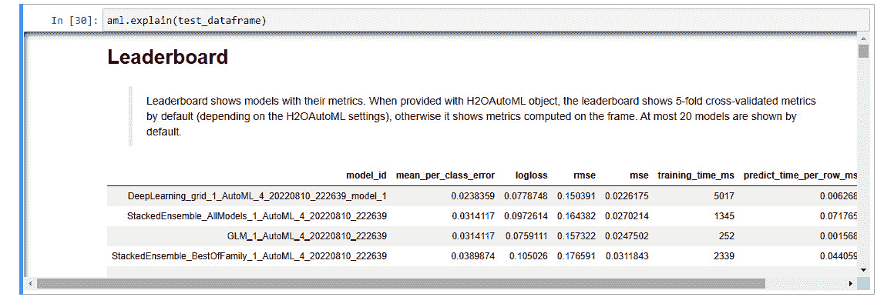

图 7.1 – 模型可解释性界面输出

1.  您还可以使用`h2o.explain_row()`接口来显示数据集单行的模型可解释性特征：

    ```py
    aml.explain_row(test_dataframe, row_index=0)
    ```

此输出应为您提供对数据集第一行进行预测的模型的排行榜。

1.  要从可解释性角度获取关于模型的更多信息，你可以通过在领先模型上使用 `explain_row()` 函数进一步扩展可解释性界面，如下所示：

    ```py
    aml.leader.explain_row(test_dataframe, row_index=0)
    ```

这个输出应该会给出基于该行预测的所有适用的图形模型可解释性功能。

现在我们知道了如何在 Python 中使用模型可解释性界面，让我们看看我们如何在 R 语言中使用这个界面。

## 在 R 中实现模型可解释性界面

与我们在 Python 中实现可解释性界面类似，H2O 也提供了在 R 编程语言中使用可解释性界面的方法。

要在 R 中实现模型可解释性功能，请按照以下步骤操作：

1.  导入 `h2o` 库并启动本地 H2O 服务器：

    ```py
    library(h2o)
    h2o.init(max_mem_size = "12g")
    ```

1.  使用 `h2o.importFile(“Dataset/iris.data”)` 导入数据集：

    ```py
    data = h2o.import_file("Dataset/iris.data")
    ```

1.  将 `C5` 列设置为标签：

    ```py
    label <- "C5"
    ```

1.  将 DataFrame 分割为训练和测试 DataFrame，并将它们分配给适当的变量：

    ```py
    splits <- h2o.splitFrame(data, ratios = 0.8, seed = 7)
    train_dataframe <- splits[[1]]
    test_dataframe <- splits[[2]]
    ```

1.  运行 H2O AutoML 训练：

    ```py
    aml <- h2o.automl(y = label, training_frame = train_dataframe, max_models = 10)
    ```

1.  在现在已训练的 `aml` 对象上使用 H2O 可解释性界面：

    ```py
    explanability_object <- h2o.explain(aml, test_dataframe)
    ```

一旦可解释性对象完成其计算，你应该会看到一个列出所有可解释性功能的大输出。

1.  就像 Python 一样，你还可以扩展模型可解释性界面函数，使其可以通过使用 `h2o.explain_row()` 函数在单行上运行，如下所示：

    ```py
    h2o.explain_row(aml, test, row_index = 1)
    ```

这将给出在数据集的第一行上进行预测的模型的排行榜。

1.  同样，你可以通过在领先模型上使用 `h2o.explain_row()` 函数来扩展这个可解释性界面，以获取关于领先模型的更高级信息：

    ```py
    h2o.explain_row(aml@leader, test, row_index = 1)
    ```

在这些示例中，我们使用了 Iris 花数据集来解决多项分类问题。同样，我们可以在训练好的回归模型上使用可解释性界面。一些可解释性功能仅根据训练模型是回归模型还是分类模型而可用。

现在我们知道了如何在 Python 和 R 中实现模型可解释性界面，让我们更深入地查看界面的输出，并尝试理解 H2O 计算的各种可解释性功能。

# 探索各种可解释性功能

可解释性界面的输出是一个 `H2OExplanation` 对象。`H2OExplanation` 对象不过是带有可解释性功能名称作为键的简单字典。你可以通过使用特征的关键名称作为可解释性对象的 `dict` 键来检索单个可解释性功能。

如果你向下滚动 H2O AutoML 对象的可解释性界面输出，你会注意到有很多带有解释的标题。在这些标题下面，是对可解释性功能的简要描述。一些包含图形图表，而其他可能包含表格。

各种可解释性功能如下：

+   **排行榜**：这是一个排行榜，包括所有训练模型及其从最佳性能到最差性能的基本指标。此功能仅在解释性界面在 H2O AutoML 对象或 H2O 模型列表上运行时计算。

+   **混淆矩阵**：这是一个性能指标，它生成一个矩阵，跟踪分类模型的正确和错误预测。它仅适用于分类模型。对于多个模型，混淆矩阵仅针对领先模型计算。

+   **残差分析**：此功能在用于解释性界面的测试数据集上绘制预测值与残差的关系。它仅分析基于排行榜模型排名的领先模型。它仅适用于回归模型。对于多个模型，残差分析仅在领先模型上执行。

+   **变量重要性**：此功能绘制了数据集中变量的重要性。它适用于所有模型，除了堆叠模型。对于多个模型，它仅在领先模型上执行，该模型不是堆叠模型。

+   **变量重要性热图**：此功能绘制了所有模型中变量重要性的热图。它适用于比较所有模型，除了堆叠模型。

+   **模型相关性热图**：此功能绘制了不同模型预测值之间的相关性。这有助于将具有相似性能的模型分组在一起。它仅适用于多个模型解释。

+   **顶级树模型 SHAP 摘要**：此功能绘制了变量在复杂树模型（如随机森林和神经网络）的决策制定中的重要性。此功能为排行榜中排名最高的树模型计算此图。

+   **部分依赖多图**：此功能绘制了目标特征与数据集中我们认为重要的某些特征集之间的依赖关系。

+   **个体条件期望**（**ICE**）**图**：此功能绘制了目标特征与数据集中我们认为对每个实例单独重要的某些特征集之间的依赖关系。

将此与我们在“使用模型解释性界面”部分进行的实验中从模型解释性界面获得的输出进行比较，您会注意到输出中缺少一些解释性功能。这是因为其中一些功能仅适用于训练的模型类型。例如，残差分析仅适用于回归模型，而我们在“使用模型解释性界面”部分进行的实验是一个分类问题，训练了一个分类模型。因此，您在模型的解释性输出中找不到残差分析。

您可以使用回归问题进行相同的实验；模型可解释性界面将输出回归支持的可解释性特征。

既然我们已经了解了在解释界面中可用的不同可解释性特征，那么让我们逐一深入探讨它们，以深入了解它们的含义。我们将通过我们在 Python 和 R 中实现的可解释性界面的输出进行说明。

在前面的章节中，我们了解了排行榜和混淆矩阵是什么。那么，让我们从下一个解释特征：剩余分析开始。

## 理解剩余分析

**剩余分析**是对**回归模型**进行的。如*第五章*中所述，“理解 AutoML 算法”部分，在“理解广义线性模型”和“线性回归简介”部分，**残差**是回归模型预测的值与同一行数据的实际值之间的差异。分析这些残差值是诊断模型中任何问题的绝佳方式。

剩余分析图是你在其中绘制**残差值**与**预测值**的图表。我们在*第五章*中学习到，在“理解广义线性模型”和“理解线性回归的假设”部分，线性回归的一个主要假设是残差的分布是**正态分布**。

因此，相应地，我们期望我们的残差图是一个无定形的点集。残差值和预测值之间不应有任何模式。

剩余分析可以突出训练模型中**异方差性**的存在。如果预测值的标准差在不同特征值上发生变化，则称为发生了异方差性。

考虑以下图表：

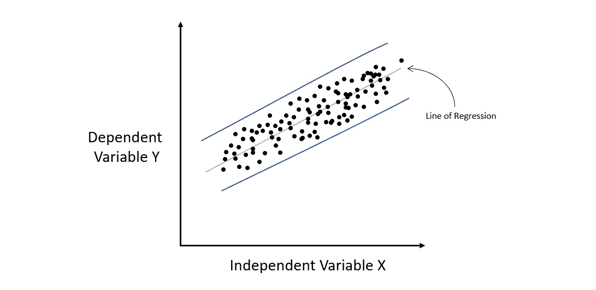

图 7.2 – 同方差数据集的回归图

上述图表显示了一个回归图，其中我们有一些样本数据，这些数据映射了*X*和*Y*之间的关系。让我们通过这些数据拟合一条直线，这代表我们的线性模型。如果我们从*X*轴的左侧到右侧计算每个点的残差，我们会注意到误差率在整个*X*值的范围内保持相对恒定。这意味着所有误差值都位于平行蓝色线之间。在整个独立变量中，误差或残差的分布保持恒定的情况称为同方差性。

**同方差性**的相反面是**异方差性**。这是指误差率随着*X*值的变化而变化。参考以下图表：

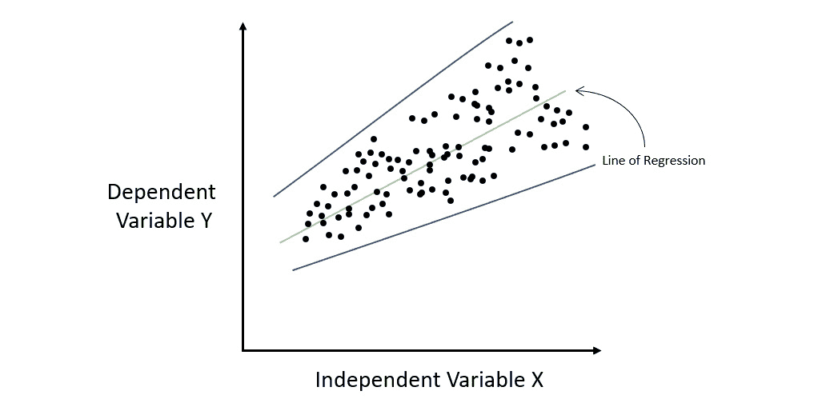

图 7.3 – 异方差数据集的回归图

如您所见，线性模型所犯错误的幅度随着 X 的增加而增加。如果你绘制包含所有错误的蓝色误差线，那么你会注意到它们逐渐扩散开来，并且不是平行的。这种在整个自变量中误差或残差分布不恒定的情况称为异方差性。

异方差性告诉我们，模型未能捕捉和学习的某些信息。异方差性也违反了线性回归的基本假设。因此，它可以帮助你确定你可能需要将缺失信息添加到你的数据集中以正确训练你的线性模型，或者你可能需要实现一些非线性回归算法以获得性能更好的模型。

由于残差分析是回归特定的模型可解释性特征，我们不能使用我们在“使用模型可解释性界面”部分进行的 Iris 数据集分类实验。相反，我们需要训练一个回归模型，然后在该模型上使用模型可解释性界面来获取残差分析输出。因此，让我们看看使用红葡萄酒质量数据集的回归问题。您可以在[`archive.ics.uci.edu/ml/datasets/wine+quality`](https://archive.ics.uci.edu/ml/datasets/wine+quality)找到这个数据集。

这个数据集包括以下特征：

+   **固定酸度**: 这个特征解释了非挥发性酸度的含量，意味着它不会在一段时间内蒸发。

+   **挥发性酸度**: 这个特征解释了挥发性酸度的含量，意味着它会在一段时间内蒸发。

+   **柠檬酸**: 这个特征解释了葡萄酒中存在的柠檬酸含量。

+   **残余糖分**: 这个特征解释了葡萄酒中存在的残余糖分含量。

+   **氯化物**: 这个特征解释了葡萄酒中存在的氯化物数量。

+   **游离二氧化硫**: 这个特征解释了葡萄酒中存在的游离二氧化硫含量。

+   **总二氧化硫**: 这个特征解释了葡萄酒中存在的总二氧化硫含量。

+   **密度**: 这个特征解释了葡萄酒的密度。

+   **pH 值**: 这个特征解释了葡萄酒的 pH 值，其中 0 表示最酸，14 表示最碱。

+   **硫酸盐**: 这个特征解释了葡萄酒中存在的硫酸盐数量。

+   **酒精含量**: 这个特征解释了葡萄酒中存在的酒精含量。

+   **质量**: 这是响应列，表示葡萄酒的质量。0 表示葡萄酒非常差，而 10 表示葡萄酒非常好。

我们将运行我们的基本 H2O AutoML 流程来训练模型，然后使用训练好的 AutoML 对象上的模型可解释性界面来获取残差分析图。

现在，让我们观察从这个实现中得到的残差分析图，然后看看我们如何从图中检索所需的信息。参考以下图表：

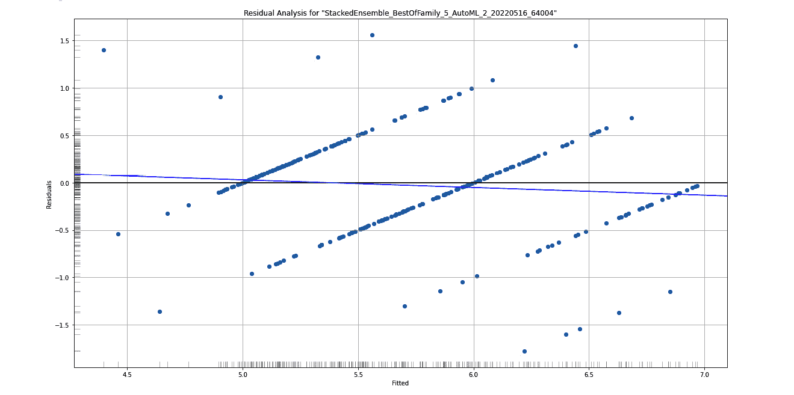

图 7.4 – 红酒质量数据集的残差分析图

在这里，你可以看到堆叠集成模型的残差分析，这是 AutoML 训练模型的领导者。在*X*轴上，你有**拟合值**，也称为预测值，而在*Y*轴上，你有**残差**。

在*Y*轴的左侧和*X*轴下方，你会看到一个**灰度**列和一个行，分别。这些帮助你观察这些残差在*X*和*Y*轴上的分布。

为了确保残差的分布是正态的，并且数据不是异方差性的，你需要观察*Y*轴上的这个灰度。理想的正态分布会给你一个在中心最暗，向外逐渐变亮的灰度。

现在你已经了解了如何解读残差分析图，让我们进一步学习下一个可解释性特征：变量重要性。

## 理解变量重要性

**变量重要性**，也称为**特征重要性**，正如其名，解释了数据集中不同变量/特征在预测中的重要性。在任何机器学习问题中，你的数据集通常会有多个变量，这些变量会影响你的预测列的特征。然而，在大多数情况下，你通常会有一些特征比其他特征贡献更多。

这种理解可以帮助科学家和工程师从数据集中移除任何引入噪声的不需要的特征。这可以进一步提高模型的质量。

H2O 为不同类型的算法计算变量重要性不同。首先，让我们了解变量重要性是如何在**基于树的算法**中计算的。

基于树的算法中的变量重要性是根据两个标准计算的：

+   决策树变量选择

+   由于选择而导致的整个树上的平方误差改进

每当 H2O 在训练基于树的模型时构建决策树，它将使用一个特征作为节点来进一步分割树。正如我们在*第五章*“理解 AutoML 算法”部分所研究的，在“理解分布式随机森林算法”部分，我们知道决策树中的每个节点分割都旨在减少整体平方误差。这个扣除的值就是父节点与子节点平方误差之间的差异。

H2O 在计算特征重要性时考虑了平方误差的减少。基于树的模型中每个节点的平方误差导致该节点的响应值方差降低。

因此，相应地，计算树平方误差的方程如下：


这里，我们有以下内容：

+   *MSE* 表示均方误差

+   *N* 表示观测值的总数

+   *VAR* 表示方差

计算方差的公式如下：


这里，我们有以下内容：

+   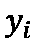 表示观测值的数值

+   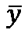 表示所有观测值的平均值

+   *N* 表示观测值的总数

对于基于树的集成算法，如 **梯度提升算法**（**GBM**），决策树是顺序训练的。每一棵树都是建立在上一棵树的错误之上的。因此，特征重要性计算与我们在单个决策树中的单个节点计算相同。

对于 **分布式随机森林**（**DRF**），决策树是并行训练的，因此 H2O 只是平均结果来计算特征重要性。

对于 **XGBoost**，H2O 在构建树时，从单个特征的损失函数增益中计算特征重要性。

对于 **深度学习**，H2O 使用一种称为 **Gedeon 方法** 的特殊方法来计算特征重要性。

对于 **广义线性模型**（**GLMs**），变量重要性与预测权重相同，也称为系数幅度。如果在训练过程中，你决定标准化数据，则返回标准化系数。

以下图表显示了我们对爱丽丝花数据集进行的实验中计算的特征重要性：

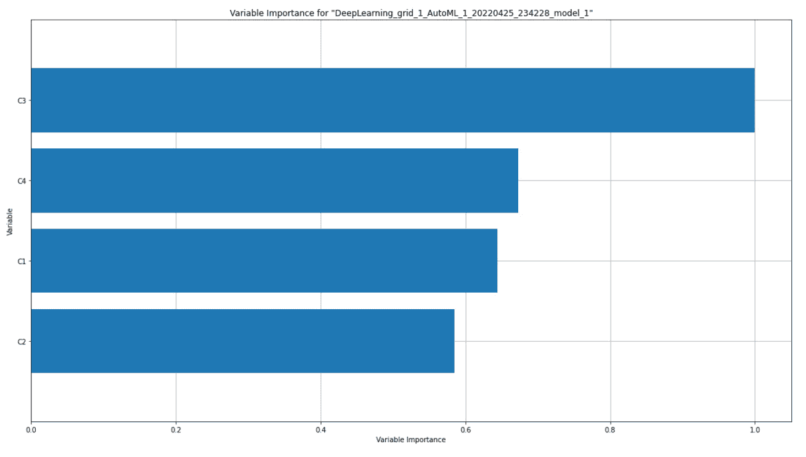

图 7.5 – 爱丽丝花数据集的变量重要性图

上述图表显示了深度学习模型的变量重要性图。如果你与你的排行榜进行比较，你会看到变量重要性图是为最领先的模型绘制的，这并不是一个堆叠集成模型。

在图表的 *Y* 轴上，你有特征名称 – 在我们的案例中，是爱丽丝花数据集的 **C1**、**C2**、**C3** 和 **C4** 列。在 *X* 轴上，你有这些变量的重要性。可以得到特征重要性的原始指标值，但 H2O 通过将其缩放到 **0** 到 **1** 之间来显示重要性值，其中 **1** 表示最重要的变量，而 **0** 表示最不重要的变量。

由于变量重要性对分类和回归模型都可用，你也会在红酒质量回归模型的可解释性功能中获得一个变量重要性图。图表应该如下所示：

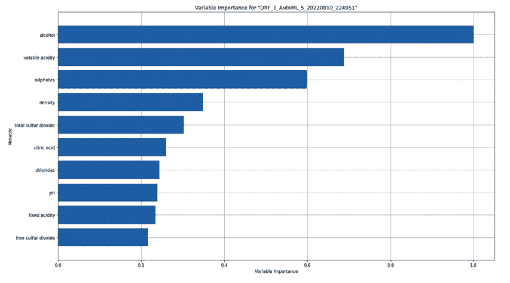

图 7.6 – 红酒质量数据集的变量重要性图

现在你已经了解了如何解释特征重要性图，让我们来理解特征重要性热图。

## 理解特征重要性热图

当显示特定模型的特征重要性时，将其表示为直方图或条形图相对容易。然而，我们经常需要比较不同模型的特征重要性，以便了解哪个模型认为哪些特征是重要的，以及我们如何利用这些信息来比较模型性能。H2O AutoML 会自动训练多个具有不同机器学习算法的模型。因此，对模型性能的比较是必不可少的，而特征重要性的图形表示对科学家和工程师来说非常有帮助。

为了在单个图表中表示 H2O AutoML 训练的所有模型的特征重要性，H2O 生成一个特征重要性热图。

热图是一种数据可视化图表，其中图表的颜色受特定值的密度或大小的影响。

一些 H2O 模型会在分类列的编码版本上计算变量重要性。不同的模型也有不同的编码分类值的方式。因此，比较所有模型中这些分类列的变量重要性可能会很棘手。H2O 通过汇总所有特征上的变量重要性，并返回一个代表原始分类特征的单一变量重要性值来完成这个比较。

以下是为鸢尾花数据集实验生成的特征重要性热图：

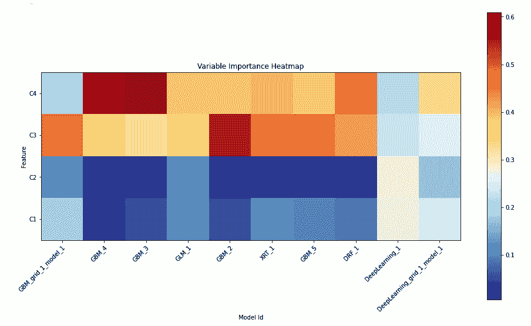

图 7.7 – 变量重要性热图

在这里，我们可以看到排行榜上排名前 10 的模型。

热图在 Y 轴上具有**C1**、**C2**、**C3**和**C4**特征，而在 X 轴上则是模型 ID。图表的颜色表示模型在预测过程中认为特征的重要程度。重要性越高，价值越大，相应的图表就会变成红色。重要性越低，特征的重要性值就越低；颜色会变得更冷，变成蓝色。

现在你已经了解了如何解释特征重要性热图，让我们来学习模型相关性热图。

## 理解模型相关性热图

多个模型之间另一个重要的比较是**模型相关性**。模型相关性可以理解为当你比较它们的预测值时，模型在性能上的相似程度。

如果一个模型做出的预测与另一个模型做出的预测相同或相似，那么使用相同或不同机器学习算法训练的不同模型被认为是高度相关的。

在模型相关性热图中，H2O 比较了它所训练的所有模型的预测值，并将它们相互比较。

以下是我们从鸢尾花数据集实验中得到的模型相关性热图：

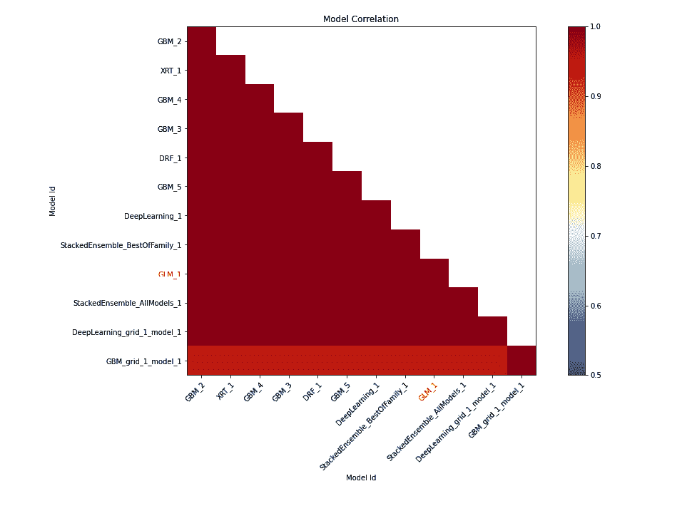

图 7.8 – 鸢尾花数据集的模型相关性热图

小贴士

要了解这个可解释性特征图，请参考您在代码中执行 `explain()` 函数后得到的输出中的 *模型相关性* 部分。

在 *X* 和 *Y* 轴上，我们有模型 ID。它们在图上的截面表示它们之间的相关性值。您会注意到图上 *X* 和 *Y* 轴之间的热点具有相同的模型 ID，这始终是 1；因此，图表始终是红色的。这是正确的，因为技术上它们是同一个模型，当您比较一个模型的预测值与自身的预测值时，会有 100% 的相关性。

要更好地了解不同模型之间的相关性，您可以参考这些热值。深红色点表示高度相关，而那些具有凉爽蓝色值的点表示低相关性。用红色突出显示的模型是可解释模型，如 GLM。

您可能会注意到，由于模型相关性热图支持堆叠集成模型，而特征重要性热图不支持，如果您忽略模型相关性热图（*图 7.8*）中的堆叠集成模型，其余的模型与特征重要性热图（*图 7.7*）中的模型相同。

现在您已经知道了如何解释模型相关性热图，让我们再来了解部分依赖图。

## 理解部分依赖图

**部分依赖图**（**PDP**）是一个图表，展示了在边际化我们不感兴趣的输入特征值的情况下，预测值与我们感兴趣的输入特征集之间的依赖关系。

另一种理解 PDP 的方法是，它表示了一个输入特征的函数，该函数给出了预期的预测值作为输出。

PDP 是一个非常有趣的图表，有助于向那些不太擅长数据科学领域的组织成员展示和解释模型训练结果。

在学习如何计算它之前，让我们先了解如何解释一个 DPD。以下是我们使用鸢尾花数据集进行实验时得到的 PDP 图：

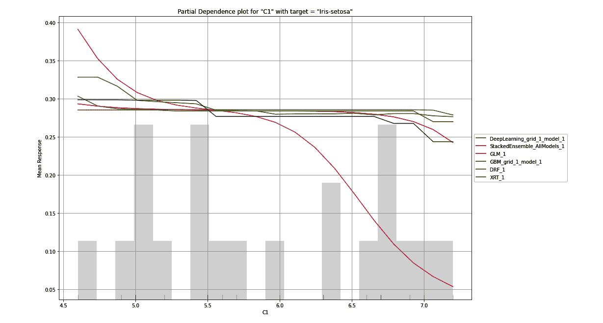

图 7.9 – 以 Iris-setosa 为目标的 C1 列的 PDP

小贴士

要理解这个可解释性特征图，请参考您在代码中执行`explain()`函数后得到的输出中的*部分依赖图*部分。

PDP 图是一个显示特征对响应值边际效应的图表。在图表的*X*轴上，您有选定的特征及其值范围。在*Y*轴上，您有目标值的平均响应值。PDP 图旨在告诉观众模型对选定特征的给定值预测的平均响应值。

在*图 7.9*中，PDP 图是为目标值**Iris-setosa**的**C1**列绘制的。在*X*轴上，我们有**C1**列，代表花的萼片长度（以厘米为单位）。这些值的范围从数据集中的最小值到最大值。在*Y*轴上，我们有平均响应值。对于这个实验，平均响应值是花是 Iris-setosa 的概率，这是图表选定的目标值。图上的彩色线条表示 H2O AutoML 为**C1**值范围预测的不同模型预测的平均响应值。

观察这个图表能让我们很好地了解响应值如何依赖于每个模型的单个特征，**C1**。我们可以看到，只要花瓣的萼片长度在 4.5 到 6.5 厘米之间，大多数模型显示的近似概率是花属于 Iris-setosa 类的可能性有 35%。

类似地，在下面的图表中，我们绘制了**C1**列的 PDP 图，但这次的目标响应列是**Iris-versicolor**：

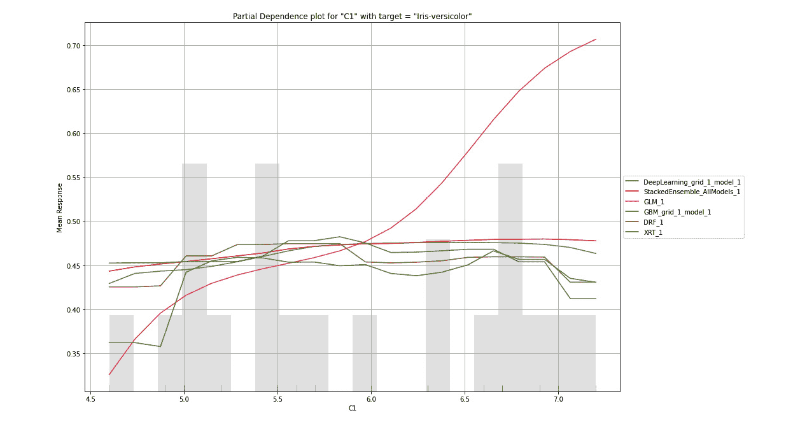

图 7.10 – 以 Iris-versicolor 为目标列的 PDP 图

小贴士

要理解这个可解释性特征图，请参考您在代码中执行`explain()`函数后得到的输出中的*部分依赖图*部分。

在这里，我们可以看到，只要**C1**的值在 4.5 到 6.5 之间，花属于 Iris-versicolor 类的可能性大约在 27%到 40%之间。现在，让我们看看以下针对**C1**的第三个目标值，**Iris-virginica**的 PDP 图：

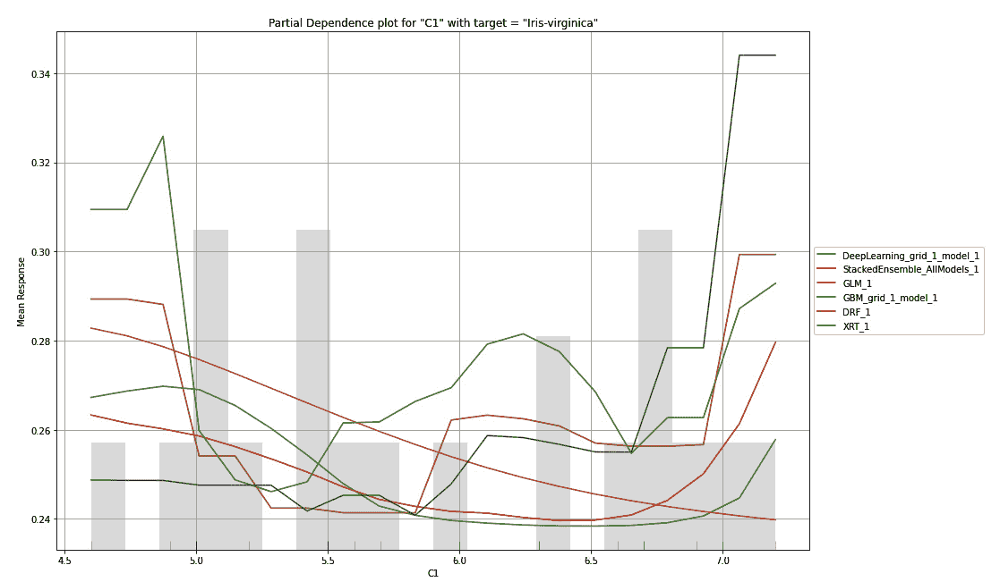

图 7.11 – 以 Iris-virginica 为目标列的 PDP 图

小贴士

为了更好地理解这个可解释性特征图，请参考您在代码中执行`explain()`函数后得到的输出中的*部分依赖图*部分。

您会注意到，对于**Iris-virginica**，所有模型对相同的**C1**值预测不同。这可能意味着**Iris-virginica**类并不强烈依赖于花的萼片长度，即**C1**值。

PDP 可能还有助于模型选择。假设你确信你的数据集中某个特定特征将对响应值产生很大贡献，并且你针对它训练了多个模型。然后，你可以选择最适合这种关系的模型，因为这个模型将做出最真实准确的预测。

现在，让我们尝试理解 PDP 图是如何生成的，以及 H2O 是如何计算这些绘图值的。

PDP 图数据可以按以下方式计算：

1.  选择一个特征和目标值来绘制依赖关系。

1.  从验证数据集中自助生成一个数据集，其中所选特征的值设置为验证数据集中所有行的最小值。

1.  将此自助数据集传递给由 H2O AutoML 训练的其中一个模型，并计算它对所有行的预测值的平均值。

1.  将此值绘制在该模型的 PDP 图上。

1.  对剩余的模型重复*步骤 3*和*步骤 4*。

1.  重复*步骤 2*，但这次，将所选特征的值增加到验证数据集中存在的下一个值。然后，重复剩余的步骤。

你将对验证数据集中所有特征值进行此操作，并将它们绘制在所有模型的同一 PDP 图上。

完成后，你将对特征和目标响应值的组合进行不同的操作。

H2O 将为所有特征和响应值的组合创建多个 PDP 图。以下是一个 PDP 图，其中所选特征是**C2**，所选目标值是**Iris-setosa**：

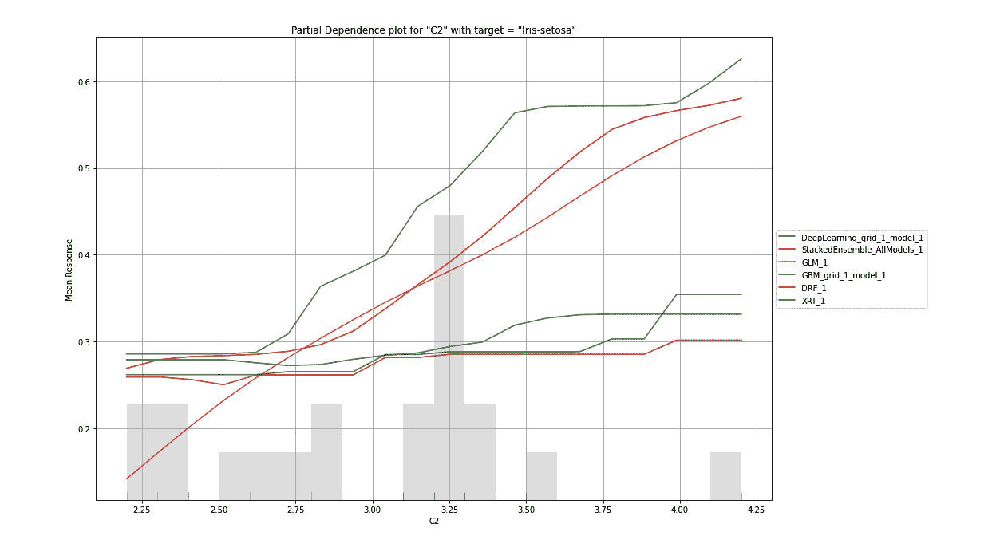

图 7.12 – 以 Iris-setosa 为目标列的 C2 列 PDP 图

小贴士

为了更好地理解这个可解释性特征图，请参考你在代码中执行`explain()`函数后得到的输出中的*部分依赖性图*部分。

类似地，它为**C3**和**C4**特征创建了不同的 PDP 图组合。以下是一个 PDP 图，其中所选特征是**C3**，所选目标值是**Iris-versicolor**：

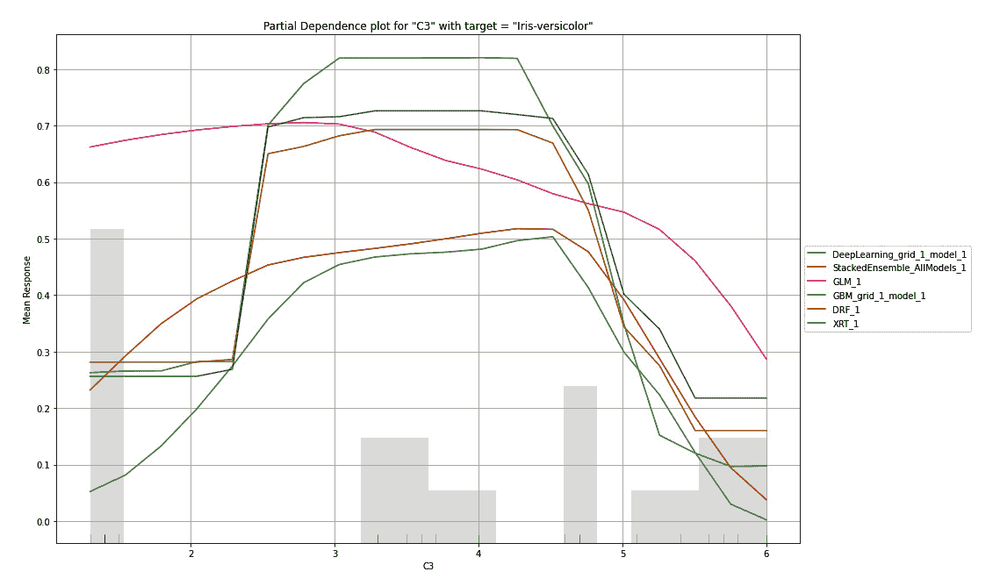

图 7.13 – 以 Iris-versicolor 为目标列的 PDP 图

小贴士

为了更好地理解这个可解释性特征图，请参考你在代码中执行`explain()`函数后得到的输出中的*部分依赖性图*部分。

现在你已经知道如何解释特征重要性热图，让我们来了解 SHAP 摘要图。

## 理解 SHAP 摘要图

对于复杂的问题，基于树的模型可能难以理解。复杂的树模型可能非常大且难以理解。**SHAP 摘要图**是基于树的模型的简化图，它为你提供了一个模型复杂性和行为的概述视图。

**SHAP**代表**Shapley Additive Explanations**。SHAP 是一种模型可解释性特征，它采用博弈论的方法来解释机器学习模型的输出。SHAP 摘要图显示了特征对预测值的贡献，类似于 PDPs。

让我们尝试从一个例子中解释 SHAP 值。以下是从红葡萄酒质量数据集中得到的 SHAP 摘要：

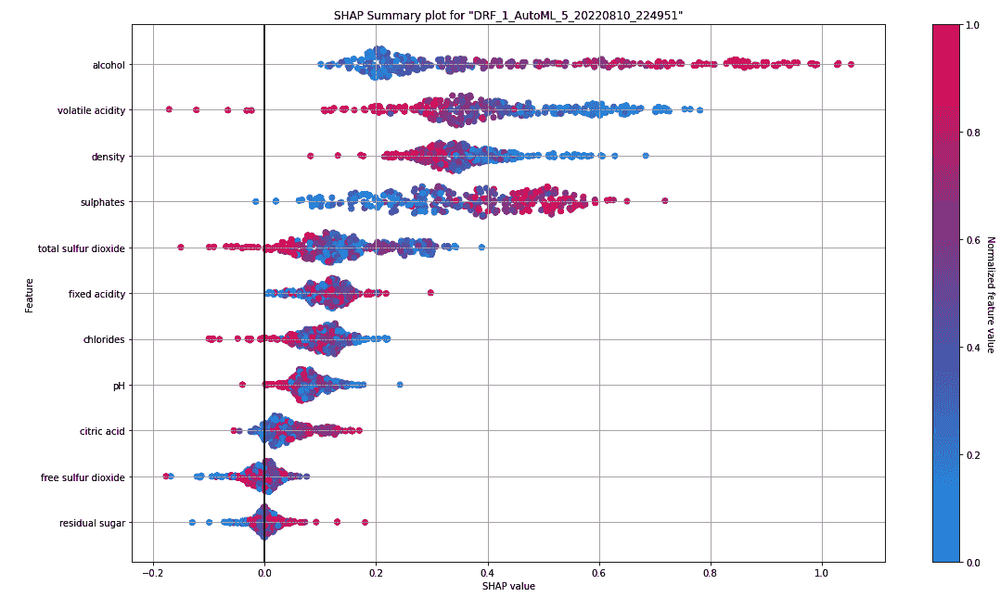

图 7.14 – 红葡萄酒质量数据集的 SHAP 摘要图

小贴士

为了更好地理解这个可解释性特征图，请参考执行回归模型的`explain()`函数后得到的输出中的*SHAP 摘要*部分。

在右侧，你可以看到一个蓝红色条形。这个条形表示葡萄酒质量的归一化值，用颜色表示。颜色越红，质量越好；颜色越蓝，葡萄酒质量越差。在二项问题中，颜色将在红色和蓝色之间形成鲜明对比。然而，在我们的例子中，回归问题，我们可以有一个完整的颜色光谱，表示可能的数值范围。

在*Y*轴上，你有数据集中的特征。它们根据特征的重要性从上到下按降序排列。在我们的例子中，酒精含量是数据集中最重要的特征；它对最终预测值的影响更大。

在*X*轴上，你有**SHAP 值**。SHAP 值表示特征如何帮助模型达到预期的结果。SHAP 值越正，该特征对结果的影响就越大。

让我们以 SHAP 摘要中的酒精为例。基于此，我们可以看到酒精在所有其他特征中具有最高的 SHAP 值。因此，酒精对模型的预测贡献很大。此外，具有最高 SHAP 值的酒精在图中的点用红色表示。这也表明高酒精含量有助于产生积极的结果。考虑到这一点，我们可以从这张图中提取的信息是，特征酒精含量在预测葡萄酒质量方面起着重要作用，而且酒精含量越高，葡萄酒的质量越好。

同样，你也可以从其他特征中解释相同的知识。这可以帮助你比较和理解哪些特征是重要的，以及它们如何对模型的最终预测做出贡献。

关于 SHAP 摘要和 PDP 的一个有趣的问题是，它们之间有什么区别？嗯，这两个之间的主要区别是，PDP 解释了仅替换一个特征对输出的影响，而 SHAP 摘要考虑了该特征与数据集中其他特征的总体交互。因此，PDP 基于你的特征相互独立的假设，而 SHAP 则考虑了不同特征的组合贡献及其对总体预测的综合影响。

计算 SHAP 值是一个复杂的过程，它源于博弈论。如果你对扩展你的博弈论知识以及 SHAP 值是如何计算的感兴趣，请随时以自己的节奏探索。理解 SHAP 的一个好起点是遵循 https://shap.readthedocs.io/en/latest/index.xhtml 上的解释。在撰写本文时，H2O 充当 SHAP 库的包装器，并在内部使用此库来计算 SHAP 值。

现在我们已经知道了如何解释 SHAP 摘要图，让我们来了解可解释性特征，**单个条件期望**（**ICE**）图。

## 理解单个条件期望图

**ICE**图是一个显示每个观察实例的线图的图表，它显示了当特征值变化时给定观察的预测如何变化。

ICE 图类似于 PDP 图。PDP 关注特征变化对预测结果的整体平均影响，而 ICE 图关注结果对特征值单个实例的依赖性。如果你平均 ICE 图值，你应该得到一个 PDP。

计算 ICE 图的方法非常简单，如下截图所示：

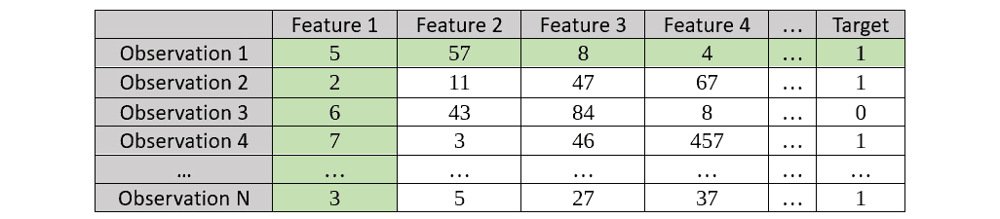

图 7.15 – ICE 图绘制示例数据集突出显示观察到 1

一旦你的模型已经训练好，你必须执行以下步骤来计算 ICE 图：

1.  考虑第一个观察 – 在我们的例子中，**观察到 1** – 并绘制**特征 1**与相应的**目标**值之间的关系。

1.  保持**特征 1**的值不变，创建一个引导数据集，同时将所有其他特征值替换为原始数据集中**观察到 1**中看到的值；将所有其他观察标记为**观察到 1**。

1.  使用你的训练模型计算观察的**目标**值。

参考以下截图以获取引导数据集：

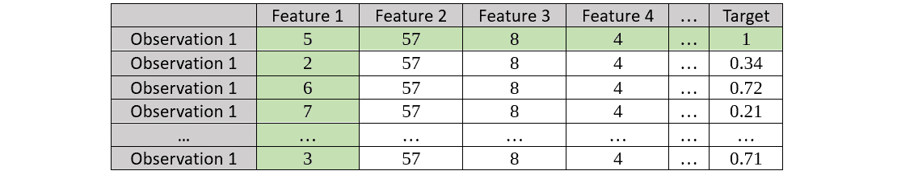

图 7.16 – 观察到 1 的 1 号特征的引导数据集

1.  对下一个观察重复相同的操作。考虑第二个观察 – 在我们的例子中，**观察到 2** – 并绘制**特征 1**与相应的**目标**值之间的关系：

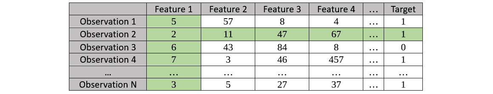

图 7.17 – 强调观察 2 的样本数据集的 ICE 图

1.  保持**特征 1**的值不变，创建一个自举数据集；然后，使用训练好的模型计算**目标**值。参考以下生成的自举数据集：

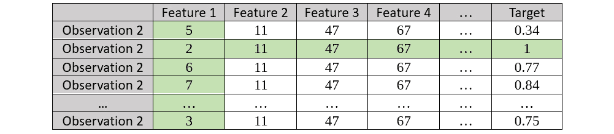

图 7.18 – 特征 1 的观察 2 的自举数据集

1.  我们对所有观察结果和所有特征重复此过程。

1.  从这些自举数据集中观察到的结果绘制在每个特征的单独 ICE 图上。

让我们看看如何解释 ICE 图并从中提取可观察的信息。参考以下截图，它显示了在训练在红酒质量数据集上的 AutoML 对象上运行模型可解释性界面后得到的 ICE 图：

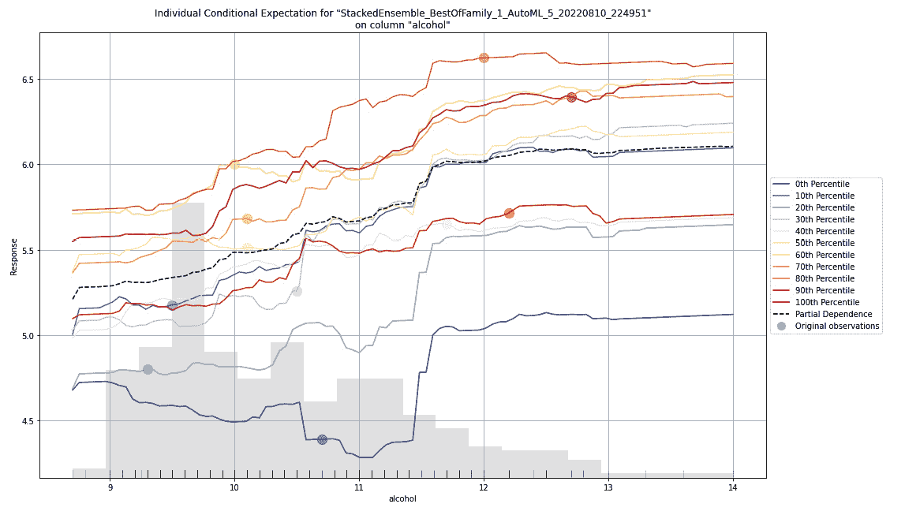

图 7.19 – 红酒质量数据集的 ICE 图

如标题所述，这是一个 H2O AutoML 训练的堆叠集成模型的酒精特征列的 ICE 图。请注意，这个模型是 AutoML 训练的模型列表中的领导者。ICE 图只为数据集的领导者绘制。您还可以通过提取具有其模型 ID 的其他模型并对其运行`ice_plot()`函数来观察其他模型的 ICE 图。参考以下代码示例：

```py
model = h2o.get_model("XRT_1_AutoML_2_20220516_64004")
model.ice_plot(test_dataframe, "alcohol")
```

在图表的*X*轴上，有酒精特征的值范围。在*Y*轴上，有预测结果的值范围——即葡萄酒的质量。

在图表的左侧，您可以看到说明不同类型线条及其百分位数的图例。ICE 图绘制了每个十分位的效果。所以，从技术上讲，在绘制 ICE 图时，您为每个观察结果计算一条线。然而，在一个包含数千行甚至数百万行数据的数据集中，您将在图表上得到相等数量的线条。这将使 ICE 图变得混乱。这就是为什么为了更好地观察这些数据，您必须将线条聚合到最近的十分位，并为每个百分位数分区绘制一条单独的线条。

点状黑色线是所有这些其他百分位数线的平均值，也就是该特征的 PDP 线。

现在您已经知道如何解释 ICE 图，让我们看看学习曲线图。

## 理解学习曲线图

**学习曲线图**是数据科学家观察模型学习率最常用的图表之一。**学习曲线**显示了模型如何从数据集中学习以及它学习的效率。

当处理一个机器学习问题时，一个经常需要回答的重要问题是，“我们需要多少数据来训练最准确的模型？”学习曲线图可以帮助您了解增加数据集如何影响您的整体模型性能。

使用这些信息，您可以决定增加数据集的大小是否会导致更好的模型性能，或者您是否需要改进模型训练以提高模型性能。

让我们观察我们从红葡萄酒质量数据集上的 XRT 模型训练实验中获得的学习曲线图：


图 7.20 – 在红葡萄酒质量数据集上的 XRT 模型学习曲线图

在图表的 X 轴上，您有 XRT 算法创建的树的数量。如您所见，该算法总共创建了大约 40 到 50 棵树。在 Y 轴上，您有性能指标 RMSE，这是在算法创建树的过程中在每个阶段计算的。

如前一张截图所示，随着算法创建更多的树，RMSE 指标逐渐降低。最终，在创建了一定数量的树之后，RMSE 降低的速度会逐渐减慢。超过这个数量创建的树不会对模型性能的整体提升做出贡献。因此，随着树的数量增加，学习率最终会降低。

图表上的线条描述了算法在训练过程中使用的各种数据集以及在每个创建树实例中的相应 RMSE。

在撰写本文时，截至 H2O 版本*3.36.1*，学习曲线图不是默认模型可解释性界面的一部分。要绘制学习曲线，您必须使用以下函数在相应的模型对象上绘制：

```py
model = h2o.get_model("GLM_1_AutoML_2_20220516_64004")
model.learning_curve_plot()
```

不同算法的学习曲线图是不同的。以下截图显示了在相同数据集上由 AutoML 训练的 GLM 模型的学习图：

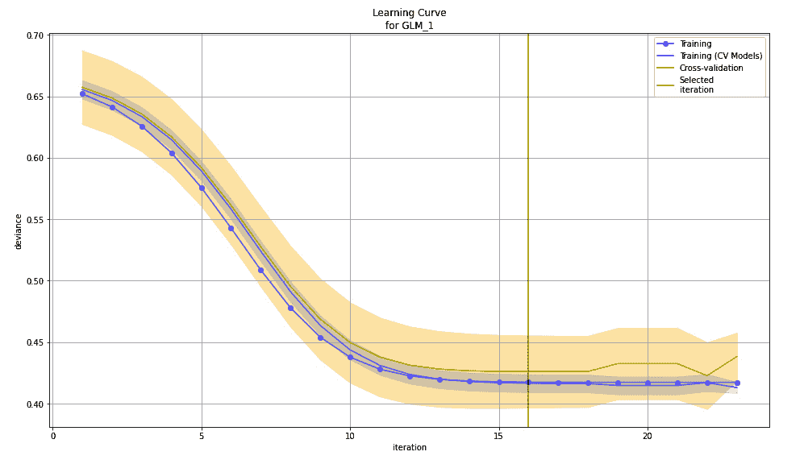

图 7.21 – 在红葡萄酒质量数据集上的 GLM 模型学习曲线图

如您所见，现在在 X 轴上不再是树的数量，而是迭代次数。树的数量对于基于树的算法（如 XRT 和 DRF）是相关的，但运行在线性算法上的线性模型（如 GLM）更有助于学习。在 Y 轴上，您有偏差而不是 RMSE，因为偏差更适合衡量线性模型的表现。

学习曲线对于不同类型的算法是不同的，包括堆叠集成模型。您可以自由探索不同算法的学习曲线的不同变体。H2O 已经根据算法选择合适的性能指标和学习步骤，因此您不必担心是否选择了正确的指标来衡量学习率。

# 摘要

在本章中，我们专注于理解 H2O 提供的模型可解释性界面。首先，我们了解了可解释性界面如何提供不同的可解释性功能，帮助用户获取关于训练模型的详细信息。然后，我们学习了如何在 H2O 的 AutoML 训练的模型上实现这一功能，无论是使用 Python 还是 R。

一旦我们对其实施感到满意，我们就开始探索和理解可解释性界面输出显示的各种可解释性图表，从残差分析开始。我们观察到残差分析如何帮助突出数据集中的异方差性，以及它是如何帮助您识别数据集中是否存在任何缺失信息的。

然后，我们探讨了变量重要性以及它是如何帮助您识别数据集中的重要特征的。在此基础上，我们学习了特征重要性热图如何帮助您观察 AutoML 训练的所有模型中的特征重要性。

然后，我们发现如何解释模型相关性热图，以及它们如何帮助我们识别从模型列表中具有相似预测行为的模型。

之后，我们学习了 PDP 图以及它们如何表达整体结果对数据集个别特征的依赖性。带着这些知识，我们探索了 SHAP 摘要和 ICE 图，我们了解了这两张图以及它们如何分别关注结果对个别特征的依赖性的不同方面。

最后，我们探讨了学习曲线是什么以及它是如何帮助我们理解模型在观察次数、迭代或树的数量上的性能改进，也称为学习，这取决于训练模型所使用的算法类型。

在下一章中，我们将运用从前几章学到的所有知识，探索在使用 H2O 的 AutoML 功能时可以使用的其他高级参数。

# 第三部分 H2O AutoML 高级实现与产品化

这一部分将帮助您了解 H2O AutoML 的高级特性和参数，这些参数用于定制 AutoML 的某些特性以适应特定需求。这将帮助您获得通用机器学习无法提供的个性化结果。它还将解释 H2O AutoML 如何与不同类型的技术一起使用，您将了解如何将您的机器学习模型部署到生产环境中，并商业性地使用它们来满足业务需求。

本节包括以下章节：

+   *第八章*, *探索 H2O AutoML 的可选参数*

+   *第九章*, [*探索 H2O AutoML 中的其他功能*](https://epic.packtpub.com/index.php?module=oss_Chapters&action=DetailView&record=3a065625-7e22-e0bf-231f-61a9d1f3e976)

+   *第十章*, [*与普通 Java 对象（POJOs）一起工作*](https://epic.packtpub.com/index.php?module=oss_Chapters&action=DetailView&record=bb77c8ca-d15c-48c5-2b00-61a9d1abce98)

+   *第十一章*, *与模型对象优化（MOJO）一起工作*

+   *第十二章*, [*使用 H2O AutoML 和 Apache Spark*](https://epic.packtpub.com/index.php?module=oss_Chapters&action=DetailView&record=854f151d-1690-0982-b488-61a9d16f9b67)

+   *第十三章*, *使用 H2O AutoML 与其他技术*
