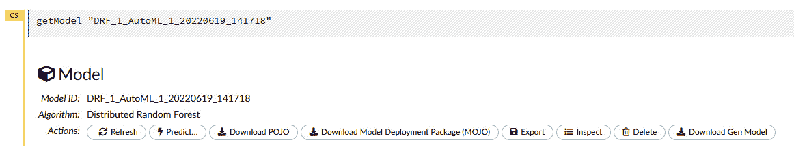

# 第十章：与普通旧 Java 对象（POJOs）一起工作

公司通常使用多种策略，以满足预期的服务标准。对于使用**机器学习**（**ML**）的服务，他们需要考虑如何快速且容易地在生产中构建、提取和部署他们的模型，而不会影响他们正在进行的业务。

因此，训练好的模型的便携性非常重要。你是如何将使用某种技术构建的训练管道创建的模型对象用于可能使用不同技术的预测管道呢？理想情况下，模型对象应该是一个自包含且易于分发的对象。

在软件工程的世界里，Java 编程语言一直被认为是使用最广泛的平台无关编程语言之一。当 Java 编译程序时，它会将其转换为平台无关的字节码，任何安装了**Java 虚拟机**（**JVM**）的机器都可以解释这些字节码。在此基础上，你有了**普通旧 Java 对象**（**POJOs**）。

POJOs 是普通对象，任何 Java 程序都可以运行，而不管任何框架。这使得 POJOs 在部署到不同类型的机器时非常便携。H2O 还提供了提取训练模型为 POJOs 的功能，这些 POJOs 可以用于生产部署。

在本章中，我们将深入探讨 POJOs 是什么，以及如何在 Python、R 和 H2O Flow 中成功训练模型后下载它们。然后，我们将学习如何将 POJO 加载到简单的 Java 程序中以进行预测。

本章我们将涵盖以下主题：

+   POJOs 简介

+   将 H2O 模型提取为 POJOs

+   使用 H2O 模型作为 POJO

到本章结束时，你应该能够使用 Python、R 或 H2O Flow 提取训练好的模型，并以 POJOs 的形式加载这些模型到你的机器学习程序中进行预测。

# 技术要求

对于本章，你需要以下内容：

+   您首选网络浏览器的最新版本。

+   您选择的**集成开发环境**（**IDE**）。

+   （可选）Project Jupyter 的 Jupyter Notebook ([`jupyter.org/`](https://jupyter.org/))

本章中进行的所有实验都是在 Jupyter 笔记本上进行的，以提供更好的输出可视化示例。你可以自由地使用相同的设置来跟随，或者在你使用的特定语言环境中执行相同的实验。本章的所有代码示例都可以在 GitHub 上找到：[`github.com/PacktPublishing/Practical-Automated-Machine-Learning-on-H2O/tree/main/Chapter%2010`](https://github.com/PacktPublishing/Practical-Automated-Machine-Learning-on-H2O/tree/main/Chapter%2010)。

# POJOs 简介

**POJO** 是由 Martin Fowler、Rebecca Parsons 和 Josh Mackenzie 在 2000 年 9 月提出的术语。它是一个普通的 Java 对象，但使其成为“平凡旧”的不是它应该做什么，而是它不应该做什么。

在以下情况下，Java 对象可以是 POJO：

+   Java 对象不扩展自任何类。

+   Java 对象不实现任何接口。

+   Java 对象不使用任何来自外部的注解。

这三个限制导致的结果是一个不依赖于任何其他库或自身之外的 Java 对象，并且足够自包含以在其自身上执行其逻辑。由于它们的可移植性，你可以轻松地将 POJO 嵌入任何 Java 环境，并且由于 Java 的平台独立性，它们可以在任何机器上运行。

H2O 可以以 POJO 的形式导出训练好的模型。然后，这些 POJO 模型可以被部署并用于对传入数据进行预测。使用 POJO 模型的唯一依赖是 `h2o-genmodel.jar` 文件。这是一个必要的 JAR 文件，用于编译和运行 H2O 模型 POJO。这个 JAR 文件是一个库，包含基类和 `GenModel`，一个辅助类，用于支持由 Java 生成的模型，模型 POJO 从中派生。这个相同的库还负责通过使用模型 POJO 进行评分。

在生产环境中使用模型 POJO 时，您需要 `h2o-genmodel.jar` 文件来编译、部署和运行您的模型 POJO。POJO 是简单的 Java 代码，不绑定到任何特定的 H2O 版本。然而，仍然建议使用 `h2o-genmodel.jar` 的最新版本，因为它可以加载当前版本的 POJO，以及旧版本的 POJO。您可以在 [`docs.h2o.ai/h2o/latest-stable/h2o-genmodel/javadoc/index.xhtml`](https://docs.h2o.ai/h2o/latest-stable/h2o-genmodel/javadoc/index.xhtml) 找到有关 `h2o-genmodel.jar` 的详细文档。

现在我们已经了解了 POJO 是什么以及 H2O 模型 POJO 的工作原理，让我们通过简单的示例学习如何使用 AutoML 将训练好的 H2O 模型提取为 POJO。

# 将 H2O 模型提取为 POJO

使用 H2O 的 AutoML 训练的模型也可以提取为 POJO，以便将它们部署到您的生产系统中。

在以下子节中，我们将学习如何使用 Python 和 R 编程语言提取模型 POJO，以及如何使用 H2O Flow 提取模型 POJO。

## 在 Python 中将 H2O 模型作为 POJO 下载

让我们通过一个简单的 Python 示例来看看如何将 H2O 模型提取为 POJO。我们将使用迄今为止一直在使用的相同的 Iris 花数据集。此数据集可在 [`archive.ics.uci.edu/ml/datasets/iris`](https://archive.ics.uci.edu/ml/datasets/iris) 找到。

按照以下步骤在 Python 中使用 H2O AutoML 训练模型。完成此操作后，您将提取领先模型并将其作为 POJO 下载：

1.  导入 `h2o` 模块并启动您的 H2O 服务器：

    ```py
    import h2o
    h2o.init()
    ```

1.  通过传递系统中的数据集位置导入数据集。执行以下命令：

    ```py
    data_frame = h2o.import_file("Dataset/iris.data")
    ```

1.  通过执行以下命令设置特征和标签名称：

    ```py
    features = data_frame.columns
    label = "C5"
    features.remove(label)
    ```

1.  通过执行以下命令初始化 H2O AutoML 对象并将 `max_model` 参数设置为 `10`，将 `seed` 值设置为 `5`：

    ```py
    aml=h2o.automl.H2OAutoML(max_models=10, seed = 5)
    ```

1.  通过传递训练数据集、特征列和标签列作为参数来触发 AutoML，如下所示：

    ```py
    aml.train(x = features, y = label, training_frame = data_frame)
    ```

1.  一旦训练完成，H2O AutoML 应该已经训练了几个模型，并根据默认的排名性能指标在排行榜上对它们进行了排名。排行榜上排名最高的模型被称为 *领导者*，可以通过使用 `aml.leader` 命令直接访问。使用此引用，您可以通过运行以下命令下载领导者模型作为 POJO：

    ```py
    h2o.download_pojo(aml.leader, path="~/Downloads/", jar_name="AutoMLModel")
    ```

这应该会下载一个名为 `AutoMLModel` 的模型 POJO，如 `jar_name` 参数中指定的，到 `path` 参数中指定的路径。如果未设置 `path` 参数，则 H2O 将在控制台上打印模型 POJO 的详细信息，而不是将其作为 JAR 文件下载。

您还可以通过在任何编辑器中打开文件来查看 POJO 的内容。该文件将包含一个名为您的领导者模型并扩展 `GenModel` 类的公共类，该类是 `h2o-genmodel.jar` 的一部分。

现在我们知道了如何使用 Python 提取 POJO 模型，让我们看看 R 编程语言中的类似示例。

## 在 R 中下载 H2O 模型作为 POJO

与我们可以在 Python 中从 AutoML 排行榜中提取模型的方式类似，我们也可以在 R 编程语言中做到这一点。在本节中，我们将使用相同的 Iris 花朵数据集。按照以下步骤使用 H2O AutoML 训练模型，然后提取领导者模型以将其作为 POJO 下载：

1.  导入 `h2o` 模块并启动您的 H2O 服务器：

    ```py
    library(h2o)
    h2o.init()
    ```

1.  通过传递系统中的数据集位置导入数据集。执行以下命令：

    ```py
    data_frame <- h2o.importFile("Dataset/iris.data")
    ```

1.  通过执行以下命令设置特征和标签名称：

    ```py
    label <- "C5"
    features <- setdiff(names(data), label)
    ```

1.  通过传递训练数据集、特征列和标签列作为参数来触发 AutoML。同时，将 `max_models` 设置为 `10`，将 `seed` 值设置为 `5`：

    ```py
    aml <- h2o.automl(x = features, y = label, training_frame = data_frame, max_models=10, seed = 5)
    ```

1.  一旦训练完成并且您有了排行榜，您可以使用 `aml@leaderboard` 访问领导者模型。我们还可以通过执行以下命令下载领导者模型作为 POJO：

    ```py
    h2o.download_pojo(aml@leaderboard, path="~/Downloads/", jar_name="AutoMLModel")
    ```

这将开始将 `AutoMLModel` 模型 POJO 下载到您指定的路径上的设备。

现在我们知道了如何在 R 编程语言中提取 POJO 模型，让我们看看如何在 H2O Flow 中做到这一点。

## 在 H2O Flow 中下载 H2O 模型作为 POJO

在 H2O Flow 中下载模型 POJO 非常简单。H2O 允许通过简单地点击按钮将模型下载为 POJO。在 *第二章* 的 *使用 H2O Flow (H2O 的 Web UI)* 部分的 *在 H2O Flow 中使用模型训练函数* 部分，您学习了如何访问特定模型的信息。

在 H2O Flow 中，每个模型的输出信息在**Actions**子部分中，你都会看到一个名为**Download POJO**的交互式按钮，如下截图所示：



图 10.1 – 使用“Download POJO”按钮收集模型信息

你可以简单地点击**Download POJO**按钮来下载模型作为 POJO。你可以通过在 H2O Flow 中使用这个交互式按钮下载 H2O 训练的所有模型。

现在我们已经探讨了如何在 Python、R 和 H2O Flow 中下载模型为 POJO，让我们学习如何使用这个模型 POJO 进行预测。

# 使用 H2O 模型作为 POJO

如前所述，模型 POJO 可以在任何安装了 JVM 的平台中使用。唯一的依赖项是`h2o-genmodel.jar`文件，这是一个 JAR 文件，用于编译和运行模型 POJO 以进行预测。

因此，让我们完成一个实验，我们可以使用模型 POJO 和`h2o-genmodel.jar`文件来了解我们如何在任何具有 JVM 的环境中使用模型 POJO。我们将编写一个 Java 程序，导入`h2o-genmodel.jar`文件，并使用它将模型 POJO 加载到程序中。一旦模型 POJO 被加载，我们将使用它对样本数据进行预测。

因此，让我们首先创建一个文件夹，我们可以在这里保存实验所需的 H2O POJO 文件，然后编写一些使用它的代码。按照以下步骤操作：

1.  打开你的终端，通过执行以下命令创建一个空文件夹：

    ```py
    mkdir H2O_POJO
    cd H2O_POJO
    ```

1.  现在，通过执行以下命令将你的模型 POJO 文件复制到文件夹中：

    ```py
    mv {path_to_download_location}/{name_of_model_POJO} .
    ```

请记住，你可能需要提及你下载的模型名称，以及你下载模型 POJO 文件的路径。

1.  然后，你需要下载`h2o-genmodel.jar`文件。你有两种方法可以做到这一点：

    1.  你可以通过运行以下命令从当前运行的本地 H2O 服务器下载`h2o-genmodel.jar`文件：

    ```py
    curl http://localhost:54321/3/h2o-genmodel.jar > h2o-genmodel.jar
    ```

请记住，你需要一个正在运行的 H2O 服务器，该服务器位于`localhost:54321`。如果你的服务器运行在不同的端口上，请使用适当的端口号编辑命令。

1.  `h2o-genmodel.jar`文件也作为`pom.xml`文件中的`dependencies`标签的一部分提供，最好是最新版本：

```py
<dependency>
<dependency>
        <groupId>ai.h2o</groupId>
        <artifactId>h2o-genmodel</artifactId>
        <version>3.35.0.2</version>
</dependency>

```

这个 Maven 仓库可以在这里找到：https://mvnrepository.com/artifact/ai.h2o/h2o-genmodel。

1.  现在，让我们创建一个使用模型 POJO 和`h2o-genmodel.jar`文件对随机数据值进行预测的样本 Java 程序。通过在终端中执行以下命令创建一个名为`main.java`的 Java 程序：

    ```py
    vim main.java
    ```

这应该会为你打开`vim`编辑器，以便你可以在其中编写程序。

1.  让我们开始编写我们的 Java 程序：

    1.  首先，导入必要的依赖项，如下所示：

    ```py
    import hex.genmodel.easy.RowData;
    import hex.genmodel.easy.EasyPredictModelWrapper;
    import hex.genmodel.easy.prediction.*;
    ```

    1.  然后，创建`main`类，如下所示：

    ```py
    public class main { }
    ```

    1.  在`main`类内部，声明我们的模型 POJO 的类名，如下所示：

    ```py
    private static final String modelPOJOClassName = "{name_of_model_POJO}";
    ```

    1.  然后，在`main`类内部创建一个`main`函数，如下所示：

    ```py
    public static void main(String[] args) throws Exception { }
    ```

    1.  在这个`main`函数内部，将`rawModel`变量声明为`GenModel`对象，并通过创建一个`modelPOJOClassName`实例来初始化它，如下所示：

    ```py
    hex.genmodel.GenModel rawModel;
    rawModel = (hex.genmodel.GenModel) Class.forName(modelPOJOClassName).getDeclaredConstructor().newInstance();
    ```

    1.  现在，让我们将这个`rawModel`对象包装在`EasyPredictModelWrapper`类中。这个类带有易于使用的函数，这将使我们的预测变得容易。将以下代码添加到你的文件中：

    ```py
    EasyPredictModelWrapper model = new EasyPredictModelWrapper(rawModel);
    ```

    1.  现在我们已经加载了`modelPOJO`对象并将其包装在`EasyPredictModelWrapper`中，让我们创建一些用于预测的样本数据。由于我们使用的是使用 Iris 数据集训练的模型，让我们创建一个包含`C1`、`C2`、`C3`和`C4`作为特征和一些适当值的`RowData`。将以下代码添加到你的文件中：

    ```py
    RowData row = new RowData();
    row.put("C1", 5.1);
    row.put("C2", 3.5);
    row.put("C3", 1.4);
    row.put("C4", 0.2);
    ```

    1.  现在，我们需要创建一个预测处理对象，我们可以用它来存储预测结果。由于 Iris 数据集是用于多项式分类问题，我们将创建一个适当的多元预测处理对象，如下所示：

    ```py
    MultinomialModelPrediction predictionResultHandler = model.predictMultinomial(row);
    ```

对于不同类型的问题，你需要使用适当的预测处理对象类型。你可以在以下链接中找到更多信息：[`docs.h2o.ai/h2o/latest-stable/h2o-genmodel/javadoc/index.xhtml`](https://docs.h2o.ai/h2o/latest-stable/h2o-genmodel/javadoc/index.xhtml)。

1.  现在，让我们添加一些`print`语句，以便我们可以得到干净且易于理解的输出。添加以下`print`语句：

```py
System.out.println("Predicted Class of Iris flower is: " + predictionResultHandler.label);
```

`predictionResultHandler.label`将包含预测的标签值。

1.  让我们也打印出不同类别的概率，这样我们就可以了解标签预测的概率是多少：

```py
System.out.println("Class probabilities are: ");
for (int labelClassIndex = 0; labelClassIndex < predictionResultHandler.classProbabilities.length; labelClassIndex++) {
        System.out.println(predictionResultHandler.classProbabilities[labelClassIndex]);
}
```

1.  最后，作为最重要的步骤，确保所有的大括号都正确关闭并保存文件。

1.  一旦你的文件准备就绪，只需执行以下命令来编译文件：

    ```py
    javac -cp h2o-genmodel.jar -J-Xmx2g -J-XX:MaxPermSize=128m DRF_1_AutoML_1_20220619_210236.java main.java
    ```

1.  一旦编译成功，通过在终端运行以下命令来执行编译后的文件：

    ```py
    java -cp .:h2o-genmodel.jar main
    ```

你应该得到以下输出：


图 10.2 – H2O 模型 POJO 实现中的预测结果

如您所见，使用模型 POJO 非常简单——你只需要创建 POJO 并在任何常规 Java 程序中使用它，通过实现`h2o-genmodel.jar`文件。

小贴士

如果你计划在生产中使用模型 POJO，那么深入了解`h2o-genmodel.jar`库是非常推荐的。这个库可以为你提供许多功能和特性，让你的部署体验变得简单。你可以在以下链接中了解更多关于这个库的信息：[`docs.h2o.ai/h2o/latest-stable/h2o-genmodel/javadoc/index.xhtml`](https://docs.h2o.ai/h2o/latest-stable/h2o-genmodel/javadoc/index.xhtml)。

恭喜！这一章已经帮助你理解了如何构建、提取和部署模型 POJO 以对传入数据进行预测。你现在离在生产中使用 H2O 又近了一步。

# 摘要

在本章中，我们首先了解了在生产中使用 ML 服务时通常会遇到的问题。我们理解了软件以及 ML 模型的可移植性在无缝部署中扮演着重要角色。我们还理解了 Java 的平台独立性使其适合部署，以及 POJO 在其中扮演的角色。

然后，我们探讨了 POJO 是什么以及它们如何在 Java 领域中作为独立运作的对象。我们还了解到，H2O 提供了提取由 AutoML 训练的模型的功能，这些模型以 POJO 的形式存在，我们可以将其用作自包含的 ML 模型，能够进行预测。

在此基础上，我们学习了如何在 H2O 中以 Python、R 和 H2O Flow 的形式提取 ML 模型作为 POJO。一旦我们了解了如何下载 H2O ML 模型作为 POJO，我们就学习了如何使用它们进行预测。

首先，我们了解到我们需要`h2o-genmodel.jar`库，并且它负责在 Java 中解释模型 POJO。然后，我们创建了一个实验，其中我们下载了 H2O 模型 POJO 和`h2o-genmodel.jar`，并创建了一个简单的 Java 程序，该程序使用这两个文件对一些样本数据进行预测；这让我们在处理模型 POJO 方面获得了一些实践经验。

在下一章中，我们将探讨 MOJO，这些对象类似于 POJO，但具有一些特殊的好处，也可以在生产中使用。
