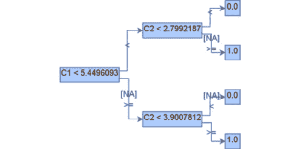

# 第十一章：与模型对象，优化（MOJO）一起工作

如我们在*第十章*中学习的，*与普通 Java 对象（POJOs）一起工作*，当与生产系统一起工作时，我们需要易于部署到我们生产服务器的可移植软件。在**机器学习**（**ML**）服务中，ML 模型的可移植性和自给自足性尤为重要。这有助于工程师定期部署新模型，而无需担心由于任何依赖性问题而破坏他们的生产系统。

H2O 的模型 POJOs 是解决这个问题的良好方案。模型 POJOs 是 H2O 模型，可以以 Java POJOs 的形式提取，您可以直接使用`h2o-genmodel.jar`运行它们。

然而，模型 POJOs 存在一些缺点，这阻碍了它们成为解决所有这些问题的最佳方案。当涉及到包括 POJOs 在内的软件包的可移植性时，对象越小，部署它就越快。POJOs 在源文件大小上有一个固有的限制，最大为 1 GB。因此，大于 1 GB 的大型模型不能被提取为 POJOs，同时，大型模型的部署和性能可能会较慢。

正因如此，H2O.ai 团队创建了一个名为**模型对象，优化**（**MOJO**）的 POJOs 的替代方案。MOJOs 是低延迟、自给自足且独立的对象，可以轻松部署到生产环境中。它们是比 POJOs 更小、更快的替代品，并且与 POJOs 一样易于提取和使用。

在本章中，我们将涵盖以下主题：

+   理解什么是 MOJO

+   将 H2O 模型提取为 MOJOs

+   查看模型 MOJOs

+   使用 H2O AutoML 模型 MOJOs 进行预测

到本章结束时，您将能够理解 POJOs 和 MOJOs 之间的区别，使用 Python、R 或 H2O Flow 以 MOJOs 的形式提取训练模型，然后使用这些 MOJO 模型将您的 ML 程序加载以进行预测。

# 技术要求

在本章中，您需要以下内容：

+   您首选网络浏览器的最新版本

+   您选择的**集成开发环境**（**IDE**）

+   （可选）Project Jupyter 的 Jupyter Notebook ([`jupyter.org/`](https://jupyter.org/))

本章中进行的所有实验都是在终端上进行的。您可以选择使用相同的设置来跟进，或者使用您选择的任何 IDE 执行相同的实验。本章的所有代码示例都可以在 GitHub 上找到：[`github.com/PacktPublishing/Practical-Automated-Machine-Learning-on-H2O/tree/main/Chapter%2011`](https://github.com/PacktPublishing/Practical-Automated-Machine-Learning-on-H2O/tree/main/Chapter%2011)。

# 理解什么是 MOJO

**MOJOs**是 H2O 模型 POJOs 的对立面，在技术上以相同的方式工作。H2O 可以构建和提取以 MOJOs 形式训练的模型，您可以使用提取的 MOJOs 来部署并对传入数据进行预测。

那么，是什么让 MOJOs 与 POJOs 不同？

POJOs 存在某些缺点，使得它们在生产环境中使用略逊于理想，如下所示：

+   对于大于 1 GB 的源文件，不支持 POJOs，因此任何大于 1 GB 的模型都不能编译为 POJOs。

+   POJOs 不支持堆叠集成模型或 Word2Vec 模型。

另一方面，MOJOs 具有以下额外的好处：

+   MOJOs 没有尺寸限制

+   MOJOs 通过移除 ML 树并使用通用的树遍历算法来导航模型，从而解决了大型尺寸问题。

+   MOJOs 的尺寸比 POJOs 小，且速度更快

+   MOJOs 支持使用 H2O AutoML 训练的所有类型的模型

根据 H2O 的内部实验和测试，如 https://docs.h2o.ai/h2o/latest-stable/h2o-docs/productionizing.xhtml#benefits-of-mojos-over-pojos 中所述，注意到 MOJO 模型在磁盘空间上大约比相应的 POJO 模型小 20-25 倍。在**热评分**时，即 JVM 能够优化执行路径之后进行评分时，MOJOs 比 POJOs 快两倍。在**冷评分**时，即 JVM 优化执行路径之前进行评分时，MOJOs 比 POJOs 快约 10-40 倍。随着模型尺寸的增加，MOJOs 比 POJOs 更高效。

H2O 的内部测试也显示，当使用 5,000 个深度为 25 的树进行测试时，在运行深度约为 50 且深度为 5 的小树上的二项式分类时，POJOs 的表现更好，但 MOJOs 在多项式分类中表现更佳。

现在我们已经了解了 MOJOs 以及它们的优点，让我们看看如何使用简单的示例提取使用 H2O 的 AutoML 训练的模型作为 MOJOs。

# 将 H2O 模型提取为 MOJOs

就像 POJOs 一样，您可以使用任何 H2O 支持的语言提取使用 H2O 的 AutoML 训练的模型。

在以下子节中，我们将学习如何使用 Python 和 R 编程语言提取模型 MOJOs，以及如何使用 H2O Flow 提取模型 MOJOs。

## 在 Python 中将 H2O 模型提取为 MOJOs

让我们看看如何使用 Python 提取模型为 MOJOs。我们将使用相同的**鸢尾花数据集**来运行 AutoML。

按照以下步骤使用 H2O AutoML 训练模型。然后，我们将提取领先模型并将其作为 MOJO 下载：

1.  导入 `h2o` 模块并启动 H2O 服务器：

    ```py
    import h2o
    h2o.init()
    ```

1.  通过在系统中传递数据集的适当位置导入 Iris 数据集。执行以下命令：

    ```py
    data_frame = h2o.import_file("Dataset/iris.data")
    ```

1.  通过执行以下命令设置特征和标签名称：

    ```py
    features = data_frame.columns
    label = "C5"
    features.remove(label)
    ```

1.  通过执行以下命令，通过将 `max_model` 参数的值设置为 `10` 和将 `seed` 值设置为 `5` 来初始化 H2O AutoML 对象：

    ```py
    aml=h2o.automl.H2OAutoML(max_models=10, seed = 5)
    ```

1.  通过传递训练数据集、特征列和标签列作为参数来启动 AutoML 过程，如下所示：

    ```py
    aml.train(x = features, y = label, training_frame = data_frame) 
    ```

1.  一旦训练完成，您可以通过执行以下命令来查看 AutoML 排行榜：

    ```py
    print(aml.leaderboard)
    ```

你应该得到以下排行榜：


图 11.1 – 提取 MOJO 的 AutoML 排行榜

1.  你可以使用 `aml.leader` 获取 AutoML 训练的领先模型。所有模型都有一个内置函数，`download_mojo()`，用于提取和下载模型 MOJO 文件：

    ```py
    aml.leader.download_mojo()
    ```

这应该将模型 MOJO 下载到你的设备。你也可以使用 `model_id` 从排行榜下载特定的模型。让我们下载排名第四的 DRF 模型。执行以下命令：

```py
DRF_model = h2o.get_model(aml.leaderboard[3,0])
DRF_model.download_mojo()
```

你也可以通过将 `path` 参数与位置一起传递给 `download_mojo()` 函数来指定你想要 MOJO 文件下载的路径。你还可以通过在 `download_mojo()` 函数中将 `get_genmodel_jar` 设置为 `True` 来下载 `h2o-genmodel.jar` 文件，以及 MOJO 文件。

让我们看看如何在 R 编程语言中做同样的事情。

## 在 R 中提取 H2O 模型作为 MOJO

类似于我们可以在 Python 中的 AutoML 排行榜中提取模型，我们也可以在 R 编程语言中做同样的事情。我们将再次使用相同的 Iris 花数据集来训练模型，使用 H2O AutoML 并提取排行榜中的领先模型以下载为 POJO。按照以下步骤操作：

1.  导入 `h2o` 模块并启动你的 H2O 服务器：

    ```py
    library(h2o)
    h2o.init()
    ```

1.  通过传递数据集在系统中的位置来导入数据集。执行以下命令：

    ```py
    data_frame <- h2o.importFile("Dataset/iris.data")
    ```

1.  通过执行以下命令设置特征和标签名称：

    ```py
    label <- "C5"
    features <- setdiff(names(data), label)
    ```

1.  通过传递训练数据集、特征列和标签列作为参数来触发 AutoML。同时，将 `max_models` 设置为 `10` 和 `seed` 值设置为 `5`：

    ```py
    aml <- h2o.automl(x = features, y = label, training_frame = data_frame, max_models=10, seed = 5)
    ```

1.  一旦训练完成并且你有了排行榜，你可以使用 `aml@leaderboard` 访问排行榜模型。使用相同的命令，我们可以下载排行榜模型作为 MOJO，如下所示：

    ```py
    h2o.download_pojo(aml@leaderboard)
    ```

这将开始将模型 MOJO ZIP 文件下载到你的设备。类似于 Python，在 R 中，你也可以指定下载路径，并将 `get_genmodel_jar` 参数设置为 *True* 以下载 `h2o-genmodel.jar` 文件，以及 MOJO ZIP 文件。

现在我们知道了如何在 R 编程语言中提取模型 MOJO，让我们学习如何在 H2O 流中做同样的事情。

## 在 H2O 流中提取 H2O 模型作为 MOJO

在 H2O 流中下载模型 MOJO 与使用 POJO 一样简单。在 **下载 POJO** 按钮旁边，你还有一个按钮用于下载 MOJO 模型。

如你在 *第二章* 中所学的，在 *使用 H2O 流（H2O 的 Web UI）* 部分，在 *使用 H2O 流中的模型训练函数* 部分，你可以访问特定模型的信息。

在 **操作** 子部分中，你有一个名为 **模型部署包（MOJO）** 的交互式按钮，如下面的截图所示：


图 11.2 – 下载模型部署包（MOJO）按钮

简单地点击此按钮即可将模型下载为 MOJO。所有模型都可以通过使用 H2O Flow 中的此交互式按钮以这种方式下载。

与 POJOs 不同，您只有一个 Java 文件，MOJOs 可以下载为**ZIP 文件**，其中包含一组特定的**配置设置**以及其他文件。如果您愿意，可以提取并探索这些文件，但从实现的角度来看，我们将使用整个 ZIP 文件，并在我们的服务中使用它。

但无论文件类型如何不同，无论是 Java 文件还是 ZIP 文件，`h2o-genmodel.jar`都提供了对这两种文件类型的解释器和读取器，您可以使用它们来读取模型并做出预测。

现在我们已经提取了模型 MOJO，让我们探索 MOJO 中的一个特殊功能，我们可以通过图形化查看训练模型的内部内容。

# 查看模型 MOJO

您可以使用名为**Graphviz**的 Java 工具将 MOJO 模型视为简单的人类可读图。Graphviz 是一款用于以图表或图形的形式图形化展示结构信息的可视化软件。这是一个方便的工具，常用于以简单图像的形式展示网络、网页设计和机器学习中的技术细节。

您可以在不同的操作系统上安装 Graphviz 库，如下所示：

+   **Linux**：您只需在您的终端中运行以下命令即可下载库：

    ```py
    sudo apt install graphviz
    ```

+   使用`brew`在您的 Mac 系统中安装此库。在 Mac 终端中执行以下命令：

    ```py
    brew install graphviz
    ```

+   **Windows**：Graphviz 有一个 Windows 安装程序，您可以从 http://www.graphviz.org/download/下载。

一旦您安装了 Graphviz，您可以使用终端中的`PrintMojo`函数来图形化查看模型。

让我们试试。执行以下步骤：

1.  一旦您下载了模型 MOJO 文件并安装了 Graphviz，您需要将`h2o.jar`文件放在同一路径下，以便在`hex`类中访问`printMojo()`函数。您可以从 http://h2o-release.s3.amazonaws.com/h2o/rel-zumbo/2/index.xhtml 下载`h2o.jar`文件。

1.  一旦您的文件准备就绪，在相同目录下打开您的终端并执行以下命令：

    ```py
    java -cp h2o.jar hex.genmodel.tools.PrintMojo --tree 0 -i "DRF_1_AutoML_4_20220801_225630.zip" -o model.gv -f 20 -d 3
    ```

我们正在使用我们从*提取 H2O 模型作为 Python 中的 MOJO*部分进行的实验中下载的 DRF 模型。此命令生成一个`model.gv`文件，Graphviz 可视化工具可以使用它来可视化模型。

1.  现在，使用 Graphviz 工具通过`model.gv`文件构建一个 PNG 文件。执行以下代码：

    ```py
    dot -Tpng model.gv -o model.png
    ```

这将生成`model.png`文件。

1.  现在，打开`model.png`文件；您应该看到一个模型的图像。模型应该看起来如下：


图 11.3 – 使用 Graphviz 从 MOJO 生成的模型图像

上述图表是`PrintMojo`函数决策树的一个很好的图形表示，无需 Graphviz 库。然而，此选项仅在 Java 8 及以上版本中可用。

1.  让我们尝试使用`PrintMojo`函数生成模型图像。按照顺序执行以下步骤以生成不使用 Graphviz 的模型图像。

1.  与之前使用 Graphviz 打印模型 MOJO 的实验类似，请确保您已下载模型 MOJO 并将其复制到目录中，包括您的`h2o.jar`文件。现在，在同一文件夹中打开一个终端并执行以下命令：

    ```py
    java -cp h2o.jar hex.genmodel.tools.PrintMojo --tree 0 -i "DRF_1_AutoML_7_20220622_170835.zip" -o tree.png --format png
    ```

此命令的输出应生成一个包含决策树图像的`tree.png`文件夹。图表应如下所示：



图 11.4 – 使用 PrintMojo 和 Graphviz 生成 Iris-setosa 类的图形图像

由于我们使用的是在 Iris 数据集上训练的 ML 模型，因此我们有一个多项式分类模型。因此，在`tree.png`文件中，您将为每个类别有单独的图像 – 一个用于`Iris-setosa`，一个用于`Iris-virginica`，一个用于`Iris-versicolor`。

注意，此功能仅适用于基于树的算法，如 DRF、GBM 和 XGBoost。GLM 等线性模型和深度学习模型不支持查看。

现在我们已经知道如何从模型 MOJO 中查看模型，让我们学习如何使用 MOJO 进行预测。

# 使用 H2O AutoML 模型 MOJO 进行预测

使用 MOJO 进行预测与使用模型 POJO 进行预测的方法相同，尽管有一些小的变化。类似于 POJOs，编译和运行模型 MOJO 进行预测依赖于`h2o-genmodel.jar`文件。

因此，让我们快速运行一个实验，在这个实验中，我们可以使用`h2o-genmodel.jar`文件与模型 MOJO 进行预测。我们将编写一个 Java 程序，导入`h2o-genmodel.jar`文件并使用其类来加载和使用我们的模型 MOJO 进行预测。

因此，让我们首先创建一个文件夹，用于存放实验所需的 H2O MOJO 文件，然后编写一些使用它的代码。

按照以下步骤操作：

1.  打开您的终端并执行以下命令创建一个空文件夹：

    ```py
    mkdir H2O_MOJO
    cd H2O_MOJO
    ```

1.  现在，通过执行以下命令将您的模型 MOJO 文件复制到文件夹中：

    ```py
    mv ~/Downloads/DRF_1_AutoML_7_20220622_170835.zip .
    ```

确保将模型 MOJO 的名称`DRF_1_AutoML_7_20220622_170835.zip`更改为您正在使用的模型 MOJO。

1.  然后，您需要下载`h2o-genmodel.jar`文件。正如您在*第十章*中学习的，*与 Plain Old Java Objects (POJOs)一起工作*，您有两种方法可以这样做。您可以从当前运行的本地 H2O 服务器下载`h2o-genmodel.jar`文件，或者如果您正在使用`h2o-genmodel`，如下所示：

    ```py
    <dependency>
            <groupId>ai.h2o</groupId>
            <artifactId>h2o-genmodel</artifactId>
            <version>3.35.0.2</version>
    </dependency>
    ```

这个 Maven 仓库可以在以下位置找到：https://mvnrepository.com/artifact/ai.h2o/h2o-genmodel。

1.  现在，让我们创建一个 Java 程序，该程序将使用模型 MOJO 进行预测。通过在终端执行以下命令创建一个名为`main.java`的 Java 程序：

    ```py
    vim main.java
    ```

这应该会打开`vim`编辑器，你可以在其中编写代码。

1.  让我们开始编写我们的 Java 程序：

    1.  首先，导入必要的依赖项，如下所示：

    ```py
    import hex.genmodel.easy.RowData;
    import hex.genmodel.easy.EasyPredictModelWrapper;
    import hex.genmodel.easy.prediction.*;
    import hex.genmodel.MojoModel;
    ```

    1.  然后，创建`main`类，如下所示：

    ```py
    public class main { }
    ```

    1.  然后，在`main`类中，创建一个`main`函数，如下所示：

    ```py
    public static void main(String[] args) throws Exception { }
    ```

    1.  在这个`main`函数内部，通过使用`MojoModel.load()`函数并传递你的模型 MOJO 的位置来创建`EasyPredictModelWrapper`对象。相应的代码如下：

    ```py
    EasyPredictModelWrapper modelMOJO = new EasyPredictModelWrapper(MojoModel.load("DRF_1_AutoML_7_20220622_170835.zip"));
    ```

    1.  现在我们已经加载并包装了我们的模型 MOJO，让我们创建我们将用于进行预测的样本数据。将以下代码添加到你的文件中：

    ```py
    RowData row = new RowData();
    row.put("C1", 5.1);
    row.put("C2", 3.5);
    row.put("C3", 1.4);
    row.put("C4", 0.2);
    ```

    1.  与我们使用模型 POJO 进行预测时的方式相似，我们需要一个预测处理程序来存储模型 MOJOs 的预测结果。用于 POJOs 的预测处理程序也可以与 MOJOs 一起使用。因此，让我们创建一个适当的多元预测处理程序对象，如下所示：

    ```py
    MultinomialModelPrediction predictionResultHandler = modelMOJO.predictMultinomial(row);
    ```

    1.  现在，让我们添加必要的`print`语句，以便我们有干净且易于理解输出的方式。添加以下`print`语句：

    ```py
    System.out.println("Predicted Class of Iris flower is: " + predictionResultHandler.label);
    ```

`predictionResultHandler.label`将包含预测的标签值。

1.  让我们也打印出不同的类别概率。添加以下代码：

```py
System.out.println("Class probabilities are: ");
for (int labelClassIndex = 0; labelClassIndex < predictionResultHandler.classProbabilities.length; labelClassIndex++) {
        System.out.println(predictionResultHandler.classProbabilities[labelClassIndex]);
}
```

1.  确保所有大括号都已正确关闭，并保存文件。

1.  一旦你的文件准备就绪，只需通过执行以下命令来编译文件：

    ```py
    javac -cp h2o-genmodel.jar -J-Xmx2g -J-XX:MaxPermSize=128m main.java
    ```

1.  一旦编译成功，通过在终端运行以下命令来执行编译后的文件：

    ```py
    java -cp .:h2o-genmodel.jar main
    ```

你应该得到以下输出：


图 11.5 – H2O 模型 MOJO 实现的预测结果

如你所见，使用模型 MOJO 和 POJO 一样简单。两者都易于提取并在生产中使用。然而，MOJOs 由于模型尺寸较大且运行更快而具有优势，这使得它们相对于 POJOs 略胜一筹。

恭喜！你现在知道如何构建、提取和部署模型 MOJOs 进行预测。

# 摘要

在本章中，我们首先了解了 POJOs 的缺点。然后，我们学习了 H2O 为 POJOs 创建了一个对应物，称为 MOJOs，它们没有 POJOs 所具有的问题。然后，我们学习了 MOJOs 是什么以及与 POJOs 相比使用它们的优点。我们了解到 MOJOs 比 POJOs 更小、更快。在 H2O 的内部实验中，发现 MOJOs 在处理大型机器学习模型时表现更好。

之后，我们学习了如何实际地将使用 AutoML 训练的机器学习模型提取为 MOJOs。我们了解了如何在 Python、R 和 H2O Flow 中下载 MOJOs。我们还发现 MOJOs 的一个好处是存在一个名为`PrintMojo`的特殊函数，它可以用来创建人类可读的机器学习模型的图形化图片。这也使得理解机器学习模型的内容变得容易。

在这个知识的基础上，我们实施了一个实验，在该实验中，我们使用了`h2o-genmodel.jar`文件以及模型 MOJO，对样本数据进行预测，从而帮助我们更好地理解如何在生产环境中使用 MOJOs。

在下一章中，我们将探讨我们可以用来实现 H2O AutoML 的各种设计模式。这将帮助我们理解如何使用 H2O AutoML 实现理想的机器学习解决方案。
