# 第五章：卷积神经网络

在上一章中，我们讨论了特征的重要性及其应用。我们现在明白，特征越好，结果越准确。在最近的一段时间里，特征变得更加精确，因此实现了更高的准确性。这得益于一种新的特征提取器，称为 **卷积神经网络**（**CNNs**），它们在复杂任务中表现出显著的准确性，例如在具有挑战性的领域进行目标检测，以及以高精度对图像进行分类，现在在从智能手机照片增强到卫星图像分析的应用中相当普遍。

在本章中，我们将从神经网络介绍开始，然后继续解释 CNNs 以及如何实现它们。在本章之后，你将能够从头开始编写自己的 CNN，用于图像分类等应用。本章包括：

+   本章各节使用的数据集和库

+   简单神经网络介绍

+   CNN 解释及其涉及的各种组件

+   创建用于图像分类的 CNN 的示例

+   转移学习和各种深度学习模型的统计数据描述

# 使用的数据集和库

在本章中，我们将使用 Keras 以 TensorFlow 作为后端来编写神经网络。详细的安装过程在 第二章，*库、开发平台和数据集* 中有解释。要检查你是否已安装 Keras，请在 shell 中运行：

```py
python -c "import keras;print(keras.__version__)"
```

这将打印出 Keras 版本以及你正在使用的后端。如果你已经安装了 TensorFlow 并且 Keras 正在使用 TensorFlow，它将打印 `using Tensorflow backend`。如果你安装了较旧的 Keras 和 TensorFlow 版本，可能会出现一些问题，因此请安装或升级到最新版本。我们还将使用其他库，如 `NumPy` 和 `OpenCV`。

我们将使用 Zalando SE 的 `Fashion–MNIST` 数据集，该数据集可在 [`github.com/zalandoresearch/fashion-mnist`](https://github.com/zalandoresearch/fashion-mnist) 获取。这可以直接使用 Keras 下载，无需单独下载。`Fashion-MNIST` 是 MIT 许可证（MIT）版权所有 © [2017] Zalando SE。

# 神经网络介绍

神经网络已经存在一段时间了，最初的论文发表超过了几十年。最近的热度是由于更好的算法软件和适当的硬件来运行它们。最初，神经网络受到人类感知世界的方式的启发，并按照生物神经元功能进行建模。随着时间的推移，这不断被修改，并因此不断进化以获得更好的性能。

# 简单神经网络

一个简单的神经网络由一个节点组成，该节点接收输入或输入列表并执行转换。以下图示了一个示例：

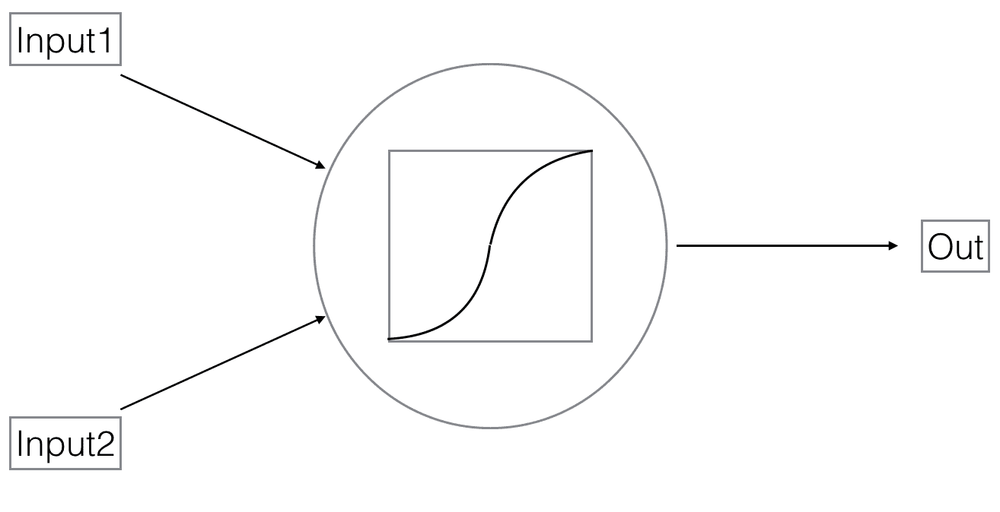

从数学上讲，它对输入 *x* 应用一个变换 *W* 来得到输出 *y*：

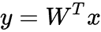

输入 *x* 可以是一个向量或多维数组。根据变换矩阵 *W*，我们得到输出 *y* 也是一个向量或多维数组。这种结构通过包括非线性变换 *F* 进一步修改：

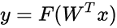

现在，输出 *y* 与输入 *x* 的线性依赖性不再，因此，*x* 的变化不会成比例地改变 *y*。更常见的是，这些非线性变换包括在将变换矩阵 *W* 应用到输入 *x* 之后剪切所有负值。一个神经元由这个完整操作组成。

这些网络以分层结构堆叠，如下图所示：

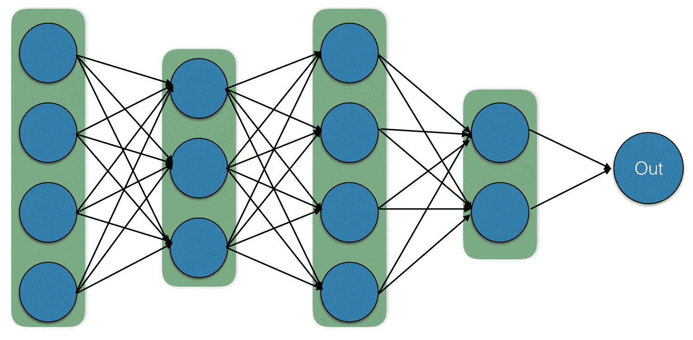

这些网络也被称为**前馈网络**，因为没有循环，输入以一个方向通过网络，就像在**有向无环图**（**DAG**）中一样。在这些网络中，参数被称为**权重**，它们对输入进行转换。

使用机器学习方法来学习这些权重，我们可以得到一个执行所需操作且精度良好的最优网络。为此，需要有一个标记输入的数据集；例如，对于一个给定的输入 *x*，我们已知输出值 *y*。在神经网络权重的学习过程中，也称为**训练**，对于这个数据集，输入会逐层通过网络。在每一层，前一层输入根据该层的特性进行转换。最终输出是我们对 *y* 的预测，我们可以测量我们的 *y* 预测与实际值之间的差距。一旦我们有了这个度量，称为**损失**，我们就可以使用基于导数的**梯度下降**方法来更新权重。每个权重根据损失相对于权重的变化进行更新。

我们将使用 `NumPy` 库描述一个简单的神经网络示例。在这个例子中，我们将输入 `x` 视为一个大小为 `1000` 的向量，并希望计算一个大小为 `2` 的输出：

```py
dim_x = 1000 # input dims
dim_y = 2 # output dims
```

我们创建一个神经网络，它接受这个输入 *x* 并使用权重矩阵 *W* 应用非线性变换：

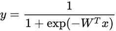

以下是一个示例：

```py
def net(x, w):
 """
 A simple neural net that performs non-linear transformation
 Function : 1 / (1 + e^(-w*x)) 
 x: inputs 
 w: weight matrix
 Returns the function value
 """
 return 1/(1+np.exp(-x.dot(w)))
```

要学习这些权重 `w`，我们将遵循梯度下降方法。对于每个输入，我们将计算损失相对于 `w` 的梯度，并按以下方式更新权重：

```py
 # feed forward pass
 y_pred = net(x, w)

 # compute loss
 loss = compute_loss(y, y_pred)
 print("Loss:", loss, "at step:", i)

 # compute grads using backprop on given net
 w_grad = backprop(y, y_pred, w, x) 

 # update weights with some learning rate
 w -= lr * w_grad
```

这个步骤会反复在我们的标记数据集上迭代，直到我们的损失没有显著变化或损失值开始遵循某种重复。`损失`函数定义为：

```py
def compute_loss(y, y_pred):
 """
 Loss function : sum(y_pred**2 - y**2)
 y: ground truth targets 
 y_pred: predicted target values
 """
 return np.mean((y_pred-y)**2) 
```

整体代码如下：

```py
import numpy as np 

dim_x = 1000 # input dims
dim_y = 2 # output dims
batch = 10 # batch size for training 
lr = 1e-4 # learning rate for weight update
steps = 5000 # steps for learning 

# create random input and targets
x = np.random.randn(batch, dim_x)
y = np.random.randn(batch, dim_y)

# initialize weight matrix 
w = np.random.randn(dim_x, dim_y)

def net(x, w):
 """
 A simple neural net that performs non-linear transformation
 Function : 1 / (1 + e^(-w*x)) 
 x: inputs 
 w: weight matrix
 Returns the function value
 """
 return 1/(1+np.exp(-x.dot(w)))

def compute_loss(y, y_pred):
 """
 Loss function : sum(y_pred**2 - y**2)
 y: ground truth targets 
 y_pred: predicted target values
 """
 return np.mean((y_pred-y)**2) 

def backprop(y, y_pred, w, x):
 """
 Backpropagation to compute gradients of weights
 y : ground truth targets 
 y_pred : predicted targets 
 w : weights for the network
 x : inputs to the net 
 """
 # start from outer most
 y_grad = 2.0 * (y_pred - y)

 # inner layer grads 
 w_grad = x.T.dot(y_grad * y_pred * (1 - y_pred))
 return w_grad

for i in range(steps):

 # feed forward pass
 y_pred = net(x, w)

 # compute loss
 loss = compute_loss(y, y_pred)
 print("Loss:", loss, "at step:", i)

 # compute grads using backprop on given net
 w_grad = backprop(y, y_pred, w, x) 

 # update weights with some learning rate
 w -= lr * w_grad
```

在运行前面的代码后，我们可以看到`loss`的值逐渐降低并稳定下来。这里的参数是学习率和初始`w`值。这些值的良好选择可能会导致损失更快地减少并提前稳定；然而，不良的选择可能会导致损失没有减少，有时在多次迭代后损失会增加。

在本节中，我们看到了如何构建一个简单的神经网络。你可以使用这段代码，对其进行修改或添加复杂结构来玩玩。在我们进一步深入之前，为了解释 CNN，在下一节中我们将简要回顾卷积操作，这在上一章中已经解释过了。

# 回顾卷积操作

在第三章 *OpenCV 中的图像滤波和变换*中，我们讨论了滤波器之后，卷积操作是将一个平移的核矩阵与给定的输入图像进行点积。这个过程在下面的图中解释：

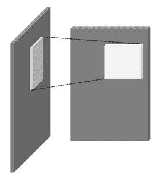

如前图所示，核是一个小的二维数组，它与输入图像（在左侧）进行点积，以创建输出图像的块（在右侧）。

在卷积中，输出图像是通过将**输入**图像与**核**矩阵之间的点积生成的。然后它沿着图像进行平移，并在每次平移后，使用点积生成输出对应值：

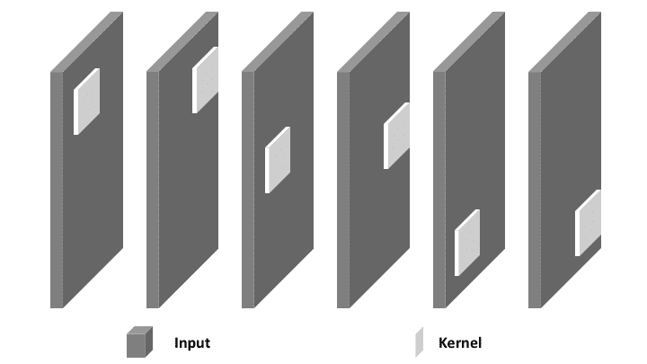

如我们在上一章中看到的，我们可以使用以下方式使用 OpenCV 执行卷积操作：

```py
kernel = np.ones((5,5),np.float32)/25
dst = cv2.filter2D(gray,-1,kernel)
```

这里，我们假设一个具有相等值且总和为 1 的核，用于对灰度图像进行卷积。在第三章 *OpenCV 中的图像滤波和变换*中，这被称为**平滑操作**，因为如果我们有一个有噪声的灰度图像，输出看起来会更平滑。

在这种情况下，为了执行平滑操作，我们已经知道了核的值。如果我们知道用于提取更复杂特征的核，我们可以从图像中做出更好的推理。然而，当我们必须执行图像分类和目标检测等任务时，手动设置值是不切实际的。在这种情况下，如 CNN 之类的模型提取良好的特征，并且比以前的方法表现更好。在下一节中，我们将定义一个结构，该结构将学习这些核矩阵值，并为各种应用计算更丰富的特征。

# 卷积神经网络

卷积神经网络，也称为**ConvNets**，在神经网络中使用这种卷积属性来计算更好的特征，这些特征可以用于分类图像或检测对象。如前所述，卷积由核组成，通过滑动和与输入图像进行点积运算来计算输出。在简单的神经网络中，一层的神经元连接到下一层的所有神经元，但 CNN 由具有感受野属性的卷积层组成。只有前一层的少量神经元连接到当前层的神经元。因此，如图所示，通过每一层计算小的区域特征：

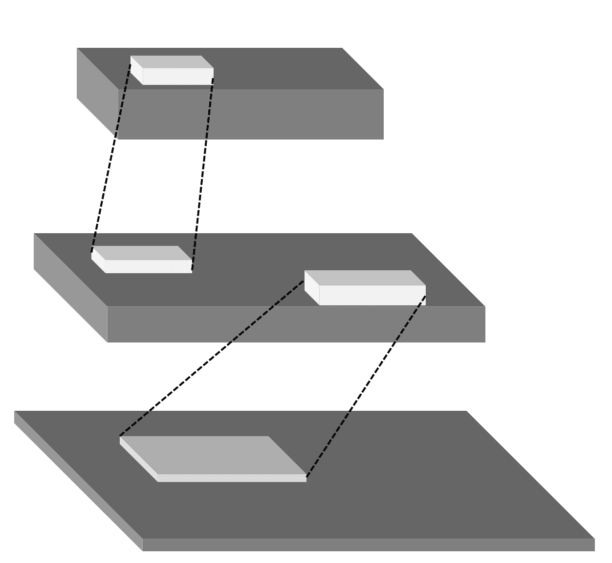

正如我们在简单的神经网络中看到的，神经元从先前神经元的一个或多个输出中获取输入以执行非线性变换。在 CNN 中，这进一步结合了卷积方法。我们假设一组具有不同值的核，称为**权重**。每个这样的核都与输入进行卷积以创建响应矩阵。然后对卷积输出的每个值进行称为**激活**的非线性变换。激活后的每个核的输出被堆叠以创建我们操作的输出，这样对于 *K* 个核，输出的大小为 *K x H[o] x W[o]*，其中 *H[o]* 和 *W[o]* 分别是输出的高度和宽度。这构成了 CNN 的一层。

前一层的输出随后再次用作下一层的输入，并使用另一组核 *K[2]*，通过首先卷积每个核然后对响应进行非线性变换来计算新的响应。

通常，CNN 由以下类型的层组成：

+   卷积层

+   全连接层

+   激活层

+   池化层

这些层将在以下章节中逐一解释。在最近的发展中，CNN 中增加了一些更多组件，但前面的组件仍然非常重要。

# 卷积层

CNN 的一个关键组件是卷积层，它通过将核矩阵与图像的一部分进行点积运算并生成输出。随后是对整个图像进行平移和重复相同的操作，这被称为**卷积**。用于点积运算的输入区域被称为卷积层的**感受野**。在每一层卷积中，都有一组核，它们共同被称为**过滤器**。

卷积层的输入是一个 n 维数组，这意味着输入是一个形式为*宽度 x 高度 x 深度*的图像。例如，如果我们有一个 32 x 32 大小的灰度图像，宽度和高度，那么输入是 32 x 32 x 1，其中深度是这种情况下的颜色通道数，由第三维表示。同样，对于 512 x 512 大小的彩色图像，输入是 512 x 512 x 3。过滤器中的所有内核也具有与输入相同的深度。

层的参数包括滤波器的数量、滤波器大小、步长和填充值。在这些参数中，*滤波器*值是唯一可学习的参数。*步长*指的是内核在像素中的移动量。步长为 1 时，内核向左移动 1 个像素，并与相应的输入区域进行点积。步长为 2 时，内核移动 2 个像素，并执行相同的操作。在每个输入的边界上，内核只能与图像内部的一定区域重叠。因此，边界用零填充，以便内核捕获完整的图像区域。填充值设置了填充图像边界的方式。

输出的大小取决于这些参数值。我们可以使用 Keras 编写 CNN 并在图像上执行操作。编写一个卷积层的例子如下：

```py
y = Conv2D(filters=32, 
 kernel_size=(5,5), 
 strides=1, padding="same")(x)
```

让我们创建一个示例模型来查看卷积层的特性：

```py
from keras.layers import Conv2D, Input
from keras.models import Model

def print_model():
 """
 Creates a sample model and prints output shape
 Use this to analyse convolution parameters
 """
 # create input with given shape 
 x = Input(shape=(512,512,3))

 # create a convolution layer
 y = Conv2D(filters=32, 
 kernel_size=(5,5), 
 strides=1, padding="same",
 use_bias=False)(x)

 # create model 
 model = Model(inputs=x, outputs=y)

 # prints our model created
 model.summary()

print_model()
```

当你执行代码时，请忽略显示的警告，例如：您的 CPU 支持此 TensorFlow 二进制未编译以使用的指令：SSE4.1 SSE4.2 AVX AVX2 FMA。

执行此代码后，我们可以看到每个层后的我们的模型和输出：

```py
_________________________________________________________________
Layer (type) Output Shape Param #
=================================================================
input_1 (InputLayer) (None, 512, 512, 3) 0
_________________________________________________________________
conv2d_1 (Conv2D) (None, 512, 512, 32) 2400
=================================================================
Total params: 2,400
Trainable params: 2,400
Non-trainable params: 0
_________________________________________________________________
```

在这里，我们将输入设置为 512 x 512 x 3 的形状，对于卷积，我们使用 32 个大小为 5 x 5 的滤波器。我们设置的步长值为 1，并使用相同的填充来确保内核捕获所有图像。在这个例子中，我们不会使用偏差。卷积后的输出形状为(None, 512, 512, 32)，形状为(samples, 宽度, 高度, 滤波器)。在讨论中，我们将忽略样本值。输出的宽度和高度为 512，深度为 32。我们使用的滤波器数量设置了输出深度的值。此层的总参数数量为 5 x 5 x 3 x 32（内核大小乘以滤波器数量），即 2400。

让我们尝试再次运行。现在，我们在之前的代码中将步长设置为 2。执行后，我们得到以下输出：

```py
_________________________________________________________________
Layer (type) Output Shape Param #
=================================================================
input_1 (InputLayer) (None, 512, 512, 3) 0
_________________________________________________________________
conv2d_1 (Conv2D) (None, 256, 256, 32) 2400
=================================================================
Total params: 2,400
Trainable params: 2,400
Non-trainable params: 0
_________________________________________________________________
```

如我们所见，卷积输出的形状（宽度，高度）减少到输入大小的一半。这是由于我们选择的步长选项。使用步长 2，它会跳过一个像素，使得输出是输入的一半。让我们将步长增加到 4。输出将是：

```py
_________________________________________________________________
Layer (type) Output Shape Param #
=================================================================
input_1 (InputLayer) (None, 512, 512, 3) 0
_________________________________________________________________
conv2d_1 (Conv2D) (None, 128, 128, 32) 2400
=================================================================
Total params: 2,400
Trainable params: 2,400
Non-trainable params: 0
_________________________________________________________________ 
```

在这里，我们可以看到输出形状（宽度和高度）减少到输入的四分之一。

如果我们将步长设置为 1，并将填充设置为 valid，输出将是：

```py
_________________________________________________________________
Layer (type) Output Shape Param #
=================================================================
input_1 (InputLayer) (None, 512, 512, 3) 0
_________________________________________________________________
conv2d_1 (Conv2D) (None, 508, 508, 32) 2400
=================================================================
Total params: 2,400
Trainable params: 2,400
Non-trainable params: 0
_________________________________________________________________
```

现在，即使我们将步长设置为 1，输出形状（宽度和高度）也减少到 `508`。这是由于没有设置填充，内核无法应用于输入的边缘。

我们可以计算输出形状为 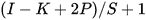，其中 *I* 是输入大小，*K* 是内核大小，*P* 是使用的填充，*S* 是步长值。如果我们使用相同的填充，则 *P* 值为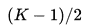。否则，如果我们使用有效填充，则 *P* 值为零。

在这里，我们设置了另一个参数 `use_bias=False`。将其设置为 true 时，它将为每个内核添加一个常数值，对于卷积层，偏置参数与使用的滤波器数量相同。因此，如果我们设置 `use_bias` 为 True，步长为 1 且填充相同，我们得到：

```py
_________________________________________________________________
Layer (type) Output Shape Param #
=================================================================
input_1 (InputLayer) (None, 512, 512, 3) 0
_________________________________________________________________
conv2d_1 (Conv2D) (None, 512, 512, 32) 2432
=================================================================
Total params: 2,432
Trainable params: 2,432
Non-trainable params: 0
_________________________________________________________________
```

参数总数增加了 `32`，这是该层使用的滤波器数量。我们已经看到了如何设计卷积层，以及当我们为卷积层使用不同的参数时会发生什么。

关键问题是，哪些滤波器中的核值将给出所需的输出？为了获得良好的性能，我们希望输出由输入中的高质量特征组成。由于滤波器的数量相当大，并且这些值的组合实际上无限，因此手动设置滤波器值是不可行的。我们使用优化技术来学习滤波器值，这些技术使用输入和目标的数据集，并试图尽可能接近目标。优化然后在每次迭代后更新权重。

# 激活层

正如我们在简单神经网络案例中看到的那样，加权输出通过非线性变换。这个非线性层通常被称为激活层。一些常见的激活类型包括：

+   Sigmoid: 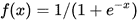

+   ReLU: 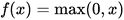

+   Tanh: 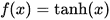

+   Leaky ReLU: 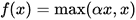 其中 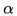是一个小的正浮点数

+   Softmax: 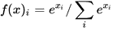 这通常用于表示一个类别的概率

最常见的激活函数选择是 **Rectified Linear Unit** (**ReLU**)，它在大多数情况下表现良好。在我们的前一个代码中，我们可以添加一个激活层，如下所示：

```py
from keras.layers import Conv2D, Input, Activation
from keras.models import Model

def print_model():
 """
 Creates a sample model and prints output shape
 Use this to analyse convolution parameters
 """
 # create input with given shape 
 x = Input(shape=(512,512,3))

 # create a convolution layer
 conv = Conv2D(filters=32, 
 kernel_size=(5,5), 
 strides=1, padding="same",
 use_bias=True)(x)

 # add activation layer
 y = Activation('relu')(conv)

 # create model 
 model = Model(inputs=x, outputs=y)

 # prints our model created
 model.summary()

print_model()  
```

执行代码的输出如下：

```py
_________________________________________________________________
Layer (type) Output Shape Param #
=================================================================
input_1 (InputLayer) (None, 512, 512, 3) 0
_________________________________________________________________
conv2d_1 (Conv2D) (None, 512, 512, 32) 2432
_________________________________________________________________
activation_1 (Activation) (None, 512, 512, 32) 0
=================================================================
Total params: 2,432
Trainable params: 2,432
Non-trainable params: 0
_________________________________________________________________
```

从我们激活函数的公式中可以看出，它不包含任何可训练的参数。在 Keras 中，激活层也可以添加到卷积层，如下所示：

```py
conv = Conv2D(filters=32, 
 kernel_size=(5,5), activation="relu", 
 strides=1, padding="same",
 use_bias=True)(x)
```

# 池化层

池化接收一个输入区域，并产生该区域的最大值或平均值作为输出。实际上，它通过在局部区域采样来减少输入的大小。此层通常插入在 2 到 3 个卷积层之间，以减少输出分辨率，从而减少参数需求。池化操作的视觉表示如下：


在之前的图中，输入是一个 2 x 2 大小的二维数组，经过池化操作后输出大小为 1 x 1。这可以通过取前一个数组中值的平均值或最大值来生成。

为了展示此操作后输出形状的变化，我们可以使用以下代码：

```py
from keras.layers import Conv2D, Input, MaxPooling2D
from keras.models import Model

def print_model():
 """
 Creates a sample model and prints output shape
 Use this to analyse Pooling parameters
 """
 # create input with given shape 
 x = Input(shape=(512,512,3))

 # create a convolution layer
 conv = Conv2D(filters=32, 
 kernel_size=(5,5), activation="relu", 
 strides=1, padding="same",
 use_bias=True)(x)

 pool = MaxPooling2D(pool_size=(2,2))(conv)

 # create model 
 model = Model(inputs=x, outputs=pool)

 # prints our model created
 model.summary()

print_model()
```

在之前的代码中，我们使用了一个卷积层，并对其添加了池化操作。当我们执行它时，预期的输出是：

```py
_________________________________________________________________
Layer (type) Output Shape Param #
=================================================================
input_1 (InputLayer) (None, 512, 512, 3) 0
_________________________________________________________________
conv2d_1 (Conv2D) (None, 512, 512, 32) 2432
_________________________________________________________________
max_pooling2d_1 (MaxPooling2 (None, 256, 256, 32) 0
=================================================================
Total params: 2,432
Trainable params: 2,432
Non-trainable params: 0
_________________________________________________________________
```

在这里，我们将池化参数设置为`(2,2)`，表示池化操作的宽度和高度。池化的深度将根据池化层的输入深度设置。结果输出在宽度和高度方面是原来的一半；然而，深度大小没有变化。

# 完全连接层

这是一个简单的神经网络层，其中当前层的每个神经元都与前一层的所有神经元相连。这通常在各种深度学习库中被称为`Dense`或`Linear`。在 Keras 中，可以这样实现：

```py
from keras.layers import Dense, Input
from keras.models import Model

def print_model():
 """
 Creates a sample model and prints output shape
 Use this to analyse dense/Fully Connected parameters
 """
 # create input with given shape 
 x = Input(shape=(512,))

 # create a fully connected layer layer
 y = Dense(32)(x)

 # create model 
 model = Model(inputs=x, outputs=y)

 # prints our model created
 model.summary()

print_model()
```

当我们执行此代码时，我们可以看到输出形状以及可训练参数的数量，如下所示：

```py
Layer (type) Output Shape Param #
=================================================================
input_1 (InputLayer) (None, 512) 0
_________________________________________________________________
dense_1 (Dense) (None, 32) 16416
=================================================================
Total params: 16,416
Trainable params: 16,416
Non-trainable params: 0
_________________________________________________________________
```

此层的总参数数由以下公式给出：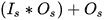，其中*I[s]*是输入形状，*O[s]*是输出形状。在我们的例子中，我们使用了形状为`512`的输入和形状为`32`的输出，并得到带有偏置的总共 16416 个参数。这与类似的卷积层块相比相当大，因此，在最近的模型中，有一种趋势是使用更多的卷积块而不是完全连接块。尽管如此，此层在设计简单的卷积神经网络块中仍然发挥着重要作用。

在本节中，我们了解了 CNN 是什么以及它们的组成部分。然而，我们还没有看到设置参数值的方法。此外，我们还没有看到其他几个层结构，例如批标准化和 Dropout。这些其他层在 CNN 模型设计中也扮演着重要角色。

# 批标准化

这将应用于将输入层的输出标准化为均值为 0 和方差为 1：

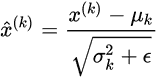

此层还具有可学习的参数（在大多数深度学习库中是可选的），用于将输出压缩到给定范围内：

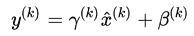

在这里 γ 和 β 是可学习的参数。批量归一化通过加快收敛速度以及作为一种正则化手段来提高训练效果。然而，由于存在可学习参数，归一化的效果在训练和测试中是不同的。

# Dropout

有助于防止过拟合的一个重要层是 Dropout。它以一定的概率随机丢弃前一层中的神经元，作为下一层的输入。这就像我们在训练一个神经网络集成。

在以下部分，我们将看到如何在 Keras 中实现模型并执行参数学习，这是我们本节中跳过的内容。

# CNN 实践

我们现在将开始使用 Keras 实现卷积神经网络。在我们的示例案例中，我们将训练一个网络来分类 `Fashion-MNIST`。这是一个包含时尚产品灰度图像的数据集，尺寸为 28 x 28。总共有 70,000 张图像，其中 60,000 张用于训练，10,000 张用于测试。该数据集中有十个类别，分别是 T 恤、裤子、套头衫、连衣裙、外套、凉鞋、衬衫、运动鞋、包和踝靴。每个类别的标签用 0-9 的类别数字标记。

我们可以如下加载这个数据集：

```py
from keras.datasets import fashion_mnist
(x_train, y_train), (x_test, y_test) = fashion_mnist.load_data()
```

之前的代码块没有输出数据集的可视化，所以以下图像将展示我们将使用的数据集：


它将数据分割成训练集和测试集，包括输入 `x` 以及标签 `y`。

卷积层编写如下：

```py
def conv3x3(input_x,nb_filters):
 """
 Wrapper around convolution layer
 Inputs:
 input_x: input layer / tensor
 nb_filter: Number of filters for convolution
 """
 return Conv2D(nb_filters, kernel_size=(3,3), use_bias=False,
 activation='relu', padding="same")(input_x)
```

池化层编写如下：

```py
x = MaxPooling2D(pool_size=(2,2))(input)
```

整体输出层如下：

```py
preds = Dense(nb_class, activation='softmax')(x)
```

完整的模型如下：

```py
def create_model(img_h=28, img_w=28):
 """
 Creates a CNN model for training. 
 Inputs: 
 img_h: input image height
 img_w: input image width
 Returns:
 Model structure 
 """

 inputs = Input(shape=(img_h, img_w, 1))

 x = conv3x3(inputs, 32)
 x = conv3x3(x, 32)
 x = MaxPooling2D(pool_size=(2,2))(x) 
 x = conv3x3(x, 64)
 x = conv3x3(x, 64)
 x = MaxPooling2D(pool_size=(2,2))(x) 
 x = conv3x3(x, 128)
 x = MaxPooling2D(pool_size=(2,2))(x) 
 x = Flatten()(x)
 x = Dense(128, activation="relu")(x)
 preds = Dense(nb_class, activation='softmax')(x)

 model = Model(inputs=inputs, outputs=preds)
 print(model.summary())
 return model
```

在运行之前的代码块后，可以看到创建的模型，其中每一行是按顺序排列的层类型，输入层在顶部：

```py
Layer (type) Output Shape Param #
=================================================================
input_1 (InputLayer) (None, 28, 28, 1) 0
_________________________________________________________________
conv2d_1 (Conv2D) (None, 28, 28, 32) 288
_________________________________________________________________
conv2d_2 (Conv2D) (None, 28, 28, 32) 9216
_________________________________________________________________
max_pooling2d_1 (MaxPooling2 (None, 14, 14, 32) 0
_________________________________________________________________
conv2d_3 (Conv2D) (None, 14, 14, 64) 18432
_________________________________________________________________
conv2d_4 (Conv2D) (None, 14, 14, 64) 36864
_________________________________________________________________
max_pooling2d_2 (MaxPooling2 (None, 7, 7, 64) 0
_________________________________________________________________
conv2d_5 (Conv2D) (None, 7, 7, 128) 73728
_________________________________________________________________
max_pooling2d_3 (MaxPooling2 (None, 3, 3, 128) 0
_________________________________________________________________
flatten_1 (Flatten) (None, 1152) 0
_________________________________________________________________
dense_1 (Dense) (None, 128) 147584
_________________________________________________________________
dense_2 (Dense) (None, 10) 1290
=================================================================
Total params: 287,402
Trainable params: 287,402
Non-trainable params: 0
_________________________________________________________________
```

# `Fashion-MNIST` 分类器训练代码

在本节中，我们将看到在 `Fashion-MNIST` 数据集上的分类器模型。它将接受输入灰度图像并输出预定义的 10 个类别之一。在以下步骤中，我们将构建模型：

1.  首先，我们导入相关的库和模块：

```py
import keras 
import keras.backend as K
from keras.layers import Dense, Conv2D, Input, MaxPooling2D, Flatten
from keras.models import Model
from keras.datasets import fashion_mnist
from keras.callbacks import ModelCheckpoint
```

1.  我们定义了在整个过程中使用的输入高度和宽度参数，以及其他参数。在这里，一个 epoch 定义了对所有数据的单次迭代。因此，`epochs` 的数量意味着对所有数据的总迭代次数：

```py
# setup parameters
batch_sz = 128  # batch size 
nb_class = 10  # target number of classes
nb_epochs = 10 # training epochs
img_h, img_w = 28, 28  # input dimensions
```

1.  让我们下载并准备用于训练和验证的数据集。在 Keras 中已经内置了一个函数来做这件事：

```py
def get_dataset():
 """
 Return processed and reshaped dataset for training
 In this cases Fashion-mnist dataset.
 """
 # load mnist dataset
 (x_train, y_train), (x_test, y_test) = fashion_mnist.load_data()

 # test and train datasets
 print("Nb Train:", x_train.shape[0], "Nb test:",x_test.shape[0])
 x_train = x_train.reshape(x_train.shape[0], img_h, img_w, 1)
 x_test = x_test.reshape(x_test.shape[0], img_h, img_w, 1)
 in_shape = (img_h, img_w, 1)

 # normalize inputs
 x_train = x_train.astype('float32')
 x_test = x_test.astype('float32')
 x_train /= 255.0
 x_test /= 255.0

 # convert to one hot vectors 
 y_train = keras.utils.to_categorical(y_train, nb_class)
 y_test = keras.utils.to_categorical(y_test, nb_class)
 return x_train, x_test, y_train, y_test

x_train, x_test, y_train, y_test = get_dataset()
```

1.  我们将使用之前定义的包装卷积函数来构建模型：

```py
def conv3x3(input_x,nb_filters):
 """
 Wrapper around convolution layer
 Inputs:
 input_x: input layer / tensor
 nb_filter: Number of filters for convolution
 """
 return Conv2D(nb_filters, kernel_size=(3,3), use_bias=False,
 activation='relu', padding="same")(input_x)

def create_model(img_h=28, img_w=28):
 """
 Creates a CNN model for training. 
 Inputs: 
 img_h: input image height
 img_w: input image width
 Returns:
 Model structure 
 """

 inputs = Input(shape=(img_h, img_w, 1))

 x = conv3x3(inputs, 32)
 x = conv3x3(x, 32)
 x = MaxPooling2D(pool_size=(2,2))(x) 
 x = conv3x3(x, 64)
 x = conv3x3(x, 64)
 x = MaxPooling2D(pool_size=(2,2))(x) 
 x = conv3x3(x, 128)
 x = MaxPooling2D(pool_size=(2,2))(x) 
 x = Flatten()(x)
 x = Dense(128, activation="relu")(x)
 preds = Dense(nb_class, activation='softmax')(x)

 model = Model(inputs=inputs, outputs=preds)
 print(model.summary())
 return model

model = create_model()
```

1.  让我们设置 `optimizer`、`loss` 函数和 `metrics` 来评估我们的预测：

```py
# setup optimizer, loss function and metrics for model
model.compile(loss=keras.losses.categorical_crossentropy,
 optimizer=keras.optimizers.Adam(),
 metrics=['accuracy'])
```

1.  如果我们希望在每轮迭代后保存我们的模型，这是可选的：

```py
# To save model after each epoch of training
callback = ModelCheckpoint('mnist_cnn.h5')
```

1.  让我们开始训练我们的模型：

```py
# start training
model.fit(x_train, y_train,
 batch_size=batch_sz,
 epochs=nb_epochs,
 verbose=1,
 validation_data=(x_test, y_test), 
 callbacks=[callback])
```

1.  如果你只使用 CPU，前一段代码将运行一段时间。经过 10 个 epoch 后，它将显示`val_acc= 0.92`（大约）。这意味着我们的训练模型可以在未见过的`Fashion-MNIST`数据上以大约 92%的准确率执行。

1.  一旦所有 epoch 训练完成，最终评估将计算如下：

```py
# Evaluate and print accuracy
score = model.evaluate(x_test, y_test, verbose=0)
print('Test loss:', score[0])
print('Test accuracy:', score[1])
```

# CNN 分析

不同类型的 CNN 的研究仍在进行中，年复一年，我们在复杂数据集上的模型准确率都有所提高。这些改进既包括模型结构，也包括如何有效地训练这些模型。

# 流行 CNN 架构

在最近几年，以下内容在各种实际应用中变得流行。在本节中，我们将看到一些流行的架构以及如何在 Keras 中加载它们。

# VGGNet

这是由 Karen Simonyan 和 Andrew Zisserman 在 2014 年提出的，论文名为*Very Deep Convolutional Networks for Large-Scale Image Recognition*，[`arxiv.org/abs/1409.1556`](https://arxiv.org/abs/1409.1556)。

这是一篇最初改进了物体分类模型性能的论文之一，也是 2014 年**ImageNet 大规模视觉识别挑战赛**（**ILSVRC**）中的顶级性能模型之一。该数据集在第二章中介绍，*库、开发平台和数据集*。性能提升大约为前一个最佳模型的 4%，因此它变得相当流行。该模型有多个版本，但最受欢迎的是 VGG16 和 VGG19。我们可以在 Keras 中看到一个预训练的 VGG16 模型：

```py
from keras.applications.vgg16 import VGG16

def print_model():
 """
 Loads VGGNet and prints model structure
 """

 # create model 
 model = VGG16(weights='imagenet')

 # prints our model created
 model.summary()

print_model()
```

在执行过程中，我们可以看到以下输出：

```py
_________________________________________________________________
Layer (type) Output Shape Param #
=================================================================
input_1 (InputLayer) (None, 224, 224, 3) 0
_________________________________________________________________
block1_conv1 (Conv2D) (None, 224, 224, 64) 1792
_________________________________________________________________
block1_conv2 (Conv2D) (None, 224, 224, 64) 36928
_________________________________________________________________
block1_pool (MaxPooling2D) (None, 112, 112, 64) 0
_________________________________________________________________
block2_conv1 (Conv2D) (None, 112, 112, 128) 73856
_________________________________________________________________
block2_conv2 (Conv2D) (None, 112, 112, 128) 147584
_________________________________________________________________
block2_pool (MaxPooling2D) (None, 56, 56, 128) 0
_________________________________________________________________
block3_conv1 (Conv2D) (None, 56, 56, 256) 295168
_________________________________________________________________
block3_conv2 (Conv2D) (None, 56, 56, 256) 590080
_________________________________________________________________
block3_conv3 (Conv2D) (None, 56, 56, 256) 590080
_________________________________________________________________
block3_pool (MaxPooling2D) (None, 28, 28, 256) 0
_________________________________________________________________
block4_conv1 (Conv2D) (None, 28, 28, 512) 1180160
_________________________________________________________________
block4_conv2 (Conv2D) (None, 28, 28, 512) 2359808
_________________________________________________________________
block4_conv3 (Conv2D) (None, 28, 28, 512) 2359808
_________________________________________________________________
block4_pool (MaxPooling2D) (None, 14, 14, 512) 0
_________________________________________________________________
block5_conv1 (Conv2D) (None, 14, 14, 512) 2359808
_________________________________________________________________
block5_conv2 (Conv2D) (None, 14, 14, 512) 2359808
_________________________________________________________________
block5_conv3 (Conv2D) (None, 14, 14, 512) 2359808
_________________________________________________________________
block5_pool (MaxPooling2D) (None, 7, 7, 512) 0
_________________________________________________________________
flatten (Flatten) (None, 25088) 0
_________________________________________________________________
fc1 (Dense) (None, 4096) 102764544
_________________________________________________________________
fc2 (Dense) (None, 4096) 16781312
_________________________________________________________________
predictions (Dense) (None, 1000) 4097000
=================================================================
Total params: 138,357,544
Trainable params: 138,357,544
Non-trainable params: 0
_________________________________________________________________
```

由于参数总数相当大，从头开始训练这样的模型也需要大约几万的数据量。

# Inception 模型

这些在卷积网络中使用并行结构方面取得了成功，进一步提高了同一竞赛中模型的性能。它是由 Christian Szegedy、Vincent Vanhoucke、Sergey Ioffe、Jonathon Shlens 和 Zbigniew Wojna 在论文*Rethinking the Inception Architecture for Computer Vision*中提出和完善的，[`arxiv.org/abs/1512.00567`](https://arxiv.org/abs/1512.00567)。inception-v3 的模型结构如下：


我们可以在 Keras 中使用此模型：

```py
from keras.applications.inception_v3 import InceptionV3

def print_model():
 """
 Loads InceptionV3 model and prints model structure
 """

 # create model 
 model = InceptionV3(weights='imagenet')

 # prints our model created
 model.summary()

print_model()
```

在执行过程中，它将打印出模型结构。

# ResNet 模型

在并行结构上进一步扩展，Kaiming He、Xiangyu Zhang、Shaoqing Ren 和 Jian Sun 介绍了使用跳过连接的*Deep Residual Learning for Image Recognition*，[`arxiv.org/abs/1512.03385`](https://arxiv.org/abs/1512.03385)。ResNet 的基本块如下：

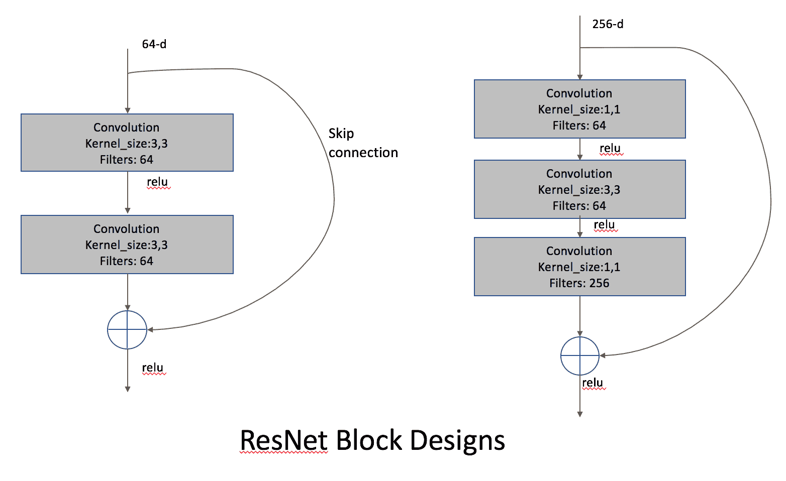

这些块被重复并堆叠起来，以创建一个深度为 18 的大型网络，18 块为 18 块，50 块为 50 块，依此类推。它们在准确性和计算时间方面都表现出卓越的性能。在下面的代码中，我们将看到如何使用这种方法从图像中预测前 5 个可能的类别。

模型的输入是以下火车机车图像，这是一张普通的智能手机照片。我们想看看预训练的 ResNet-50 模型能否接近真实预测：


让我们加载所需的导入：

```py
from keras.applications.resnet50 import ResNet50
import numpy as np 
import cv2 
from keras.applications.resnet50 import preprocess_input, decode_predictions
import time
```

我们现在开始创建一个模型来检测先前显示的图像中的对象：

1.  我们首先做的是设置加载 ResNet-50 预训练模型：

```py
def get_model():
 """
 Loads Resnet and prints model structure
 Returns resnet as model.
 """

 # create model 
 model = ResNet50(weights='imagenet')

 # To print our model loaded
 model.summary()
 return model
```

1.  我们需要预处理图像以适应 ResNet 的特定输入类型。在这种情况下，输入是平均值，归一化到大小（1, 224, 224, 3）：

```py
def preprocess_img(img):
 # apply opencv preprocessing
 img = cv2.cvtColor(img, cv2.COLOR_BGR2RGB)
 img = cv2.resize(img, (224, 224)) 
 img = img[np.newaxis, :, :, :]
 # convert to float type
 img = np.asarray(img, dtype=np.float) 

 # further use imagenet specific preprocessing
 # this applies color channel specific mean normalization
 x = preprocess_input(img)
 print(x.shape)
 return x
```

1.  让我们继续加载图像并应用预处理：

```py
# read input image and preprocess
img = cv2.imread('../figures/train1.png')
input_x = preprocess_img(img)
```

1.  现在，我们将加载模型并将处理后的输入通过训练模型。这也计算了运行时间：

```py
# create model with pretrained weights
resnet_model = get_model()

# run predictions only , no training
start = time.time()
preds = resnet_model.predict(input_x)
print(time.time() - start)
```

1.  我们得到了预测，但这些只是概率值，而不是类别名称。现在我们将打印出与仅前 5 个可能预测相对应的类别名称：

```py
# decode prediction to index of classes, top 5 predictions
print('Predicted:', decode_predictions(preds, top=5)[0]) 
```

这个输出的结果如下：

```py
Predicted: [('n04310018', 'steam_locomotive', 0.89800948), ('n03895866', 'passenger_car', 0.066653267), ('n03599486', 'jinrikisha', 0.0083348891), ('n03417042', 'garbage_truck', 0.0052676937), ('n04266014', 'space_shuttle', 0.0040852665)]
```

`n04310018`和`steam_locomotive`是类别索引和名称。之后的值是预测的概率。因此，预训练模型有 89%的概率认为输入图像是蒸汽机车。这相当令人印象深刻，因为输入图像是一张机车，它已经不再使用，并且可能在训练期间从未被模型看到。

# 迁移学习

在上一节中，我们看到了三种不同的模型类型，但在深度学习模型中，我们并不局限于这些。每年都有更好的模型架构被发布。然而，这些模型的性能完全取决于训练数据，它们的性能归因于它们在训练中使用的数百万张图像。获取如此大的数据集并针对特定任务进行训练既不经济，也耗时。尽管如此，通过进行一种特殊的训练类型，即**迁移学习**，这些模型可以在各种领域中使用。

在迁移学习中，我们固定模型从输入到给定层的一部分（也称为**冻结模型**），这样预训练的权重将有助于从图像中计算丰富的特征。剩余部分在特定任务数据集上训练。因此，即使数据集很小，模型的剩余部分也能学习到更好的特征。模型冻结多少取决于可用的数据集和重复实验。

此外，我们将展示先前模型的比较，以更好地了解使用哪种模型。第一个图是每个模型中的参数数量。随着新模型的发布，它们在训练参数数量方面变得更加高效：

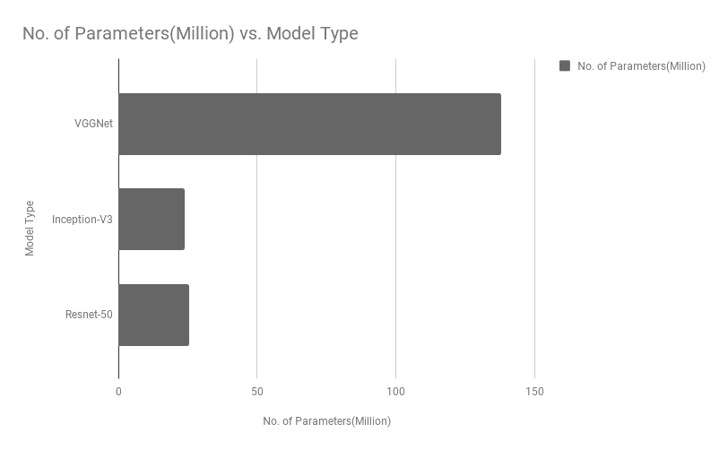

此外，我们还展示了不同年份 ILSVRC 挑战赛中准确率的比较。这表明，随着参数的减少和模型结构的优化，模型会变得更好：

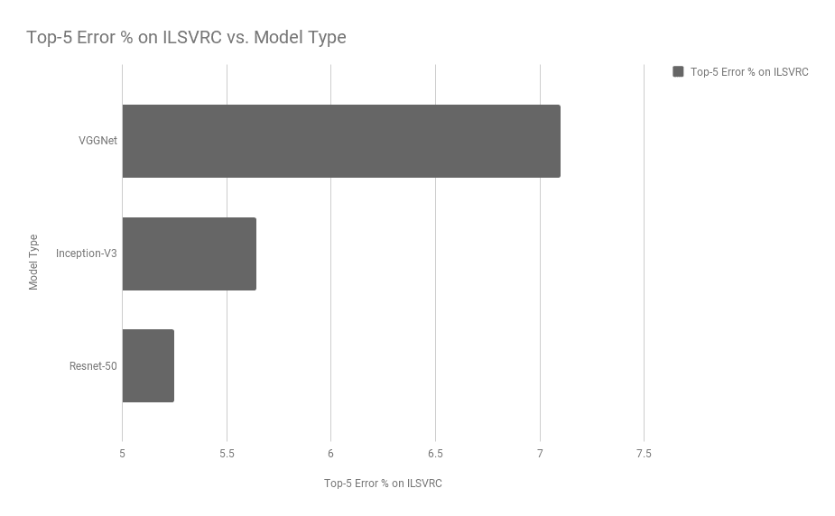

在本节中，我们了解到，即使对于特定任务缺乏大量数据集，我们仍然可以通过从训练在其他相似数据集上的模型中迁移学习来实现良好的性能。在大多数实际应用中，我们使用在 ImageNet 数据集上训练的模型，然而模型的选择是由用户根据诸如更高精度模型或更快模型等标准来决定的。

# 摘要

在本章中，我们介绍了卷积神经网络（CNNs）及其基本组件。我们还看到了如何在一个示例数据集上从头开始训练模型。随后，我们学习了如何使用预训练模型进行预测，以及如何进行迁移学习以重新利用训练好的模型来完成我们的任务。

这些训练好的模型和 CNN 不仅用于图像分类，还用于更复杂如目标检测和分割等任务，我们将在接下来的章节中看到。
