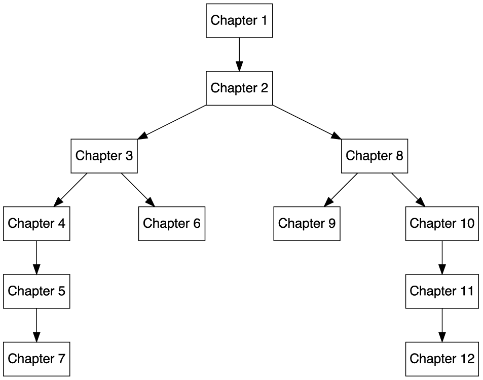

# 前言

*看到自然的想象力远远大于人类的想象力。*

— 理查德·费曼

许多人认为量子计算很难学习，他们认为这需要了解深奥和晦涩的数学分支，并且只有具备强大的物理背景才能掌握。我们完全不同意这种看法。事实上，进入量子计算深度的先决条件出人意料地少：只需要一些基本的线性代数知识，一些概率论的概念，以及一些对计算机编程的熟悉。所有这些都是在大学一年级的学生中获得的。

因此，几年前，我们中的一人开始设计量子计算课程，这些课程只关注核心内容，试图消除神秘感，让尽可能多的学生能够接触。在这些课程中，最突出的是 2020 年在 CERN 在线讲授的“量子计算实用入门：从量子比特到量子机器学习及其应用”系列讲座（你可以在[`indico.cern.ch/event/970903/`](https://indico.cern.ch/event/970903/)找到材料和录音）。

这本书的种子已经存在于那一系列讲座（以及在其他地方，如奥维耶多大学、卡斯蒂利亚-拉曼查大学和阿尔梅里亚大学等地方讲授的讲座）中。其中一些材料（经过大幅改编和扩展）来自为 CERN 课程准备的资料，更重要的是，设计讲座的主要指导原则（在[26]中详细讨论）在准备你现在阅读的这本书时保持不变。

这些原则中的第一个是我们坚信量子计算应该关乎计算。让我们稍微澄清一下这一点。这意味着我们的最终目标将是让你能够在量子计算机上运行量子算法并使用它们解决问题。为了实现这一点，你需要知道如何编写实现某些量子算法的代码。如果你只从纯粹理论的角度研究量子计算，你将无法做到这一点。实际上，你需要亲自动手，至少学习一种量子编程语言，并能够将抽象的量子操作转换为可执行的指令。

这就是为什么本书的大部分内容都致力于介绍不同的量子编程框架（Qiskit、PennyLane、D-Wave 的 Ocean）以及如何使用它们运行不同的量子算法。与其他（优秀的！）量子计算书籍不同，在这里你会发现代码。大量的代码。这些代码你可以在模拟器和实际的量子计算机上直接运行。你可以修改这些代码，进行实验，并将其适应你自己的问题和项目。

但这不仅仅是一本量子编程书籍。我们的目标不是给你提供解决特定问题特定实例的食谱。我们的目标是让你*理解*量子计算。因此，我们的第二个指导原则是承诺讨论书中涵盖的每个量子算法背后的所有数学，以及我们示例中每行代码背后的数学——至少在合理的详细程度上。

这有几个原因很重要。一方面，量子计算仍然是一个年轻的领域。每天都有新的、改进的算法在科学出版物中提出，其中一些将在短期内或中期内成为标准。最终，你将想要理解和使用这些算法。但如果你不完全理解它们所基于的算法，你将无法做到这一点。

另一方面，成功编程和运行一个算法是检验你是否真正理解其原理的终极测试。计算机是无情的。它们不容忍不精确或含糊不清。你真的需要了解算法的每一个细节才能实现它。我们完全同意唐纳德·克努特的说法：“一个人直到能够教给计算机某样东西，才能真正理解它。”

因此，这两根柱子是我们构建这本书的主要基石：代码及其背后的数学。足够的数学知识来理解代码，以及足够的代码来使数学清晰且有用。我们不会向你撒谎：在两者之间找到平衡是困难的。有时你可能觉得我们的数学解释太冗长。但请耐心一点，我们承诺当你看到公式在示例中生动起来时，这一切都会得到回报。

这两个柱子已经在 CERN 的讲座中存在了。但那里涵盖的主题和我们在本书中选定的主题之间有所不同。我们决定不包含像量子隐形传态[14, 19]和基于 BB84 协议的量子密钥分发[13]，或者像 Deutsch 和 Jozsa[29]和 Shor[87]那样的规范算法等基本方法。

幸运的是，现在关于量子计算的材料比四五年前我们开始开发入门课程时要多得多。我们认为，已经没有必要解释那些在其他书籍中已经得到充分讨论的方法，例如（强烈推荐）Sutor 的书籍[92]。

然而，我们确实感觉到，对于许多现代量子计算的核心算法，存在一个统一、详细且以实践为导向的解释的需求，这些算法很难在单一来源中找到。这包括许多为使用量子计算机解决优化问题而开发的方法，以及量子机器学习领域的多数算法（尤其是基于变分电路的算法）。

许多这些算法都是最近提出的，并且被设计为在当今可用的量子计算机上运行（小型、未完全连接且易受噪声影响），而不是在理想化的、容错的量子处理器上运行。因此，这些算法目前是研究的热点，因为它们的真正能力尚未完全理解。有一些证据表明，它们可能在某些任务上超越经典算法，但这一点还没有像 Shor 等较老量子算法那样得到很好的确立。

这是否意味着这本书是高级的，或者只适合已经对量子计算有经验的读者？绝不是这样！虽然传统上，人们通常通过几个量子比特的协议开始学习量子计算，然后学习 Deutsch-Jozsa 的、Simon 的[89]、Bernstein-Vazirani 的[29]算法，一直学到 Shor 的和 Grover 的[48]方法。如果你了解这些算法，那么这些知识肯定是有用的，但无论如何，理解我们将要讨论的主题并不是必要的或预期的。

通过这本书，我们希望为你提供对现代量子算法背后原理的坚实基础理解，这些算法被提出用于优化和机器学习领域，同时向你展示如何在量子模拟器和真实量子硬件上实现和运行它们。这将使你能够立即开始实验你自己的问题。我们坚信，现在是开始寻找当前量子计算机用例的完美时机。我们在这本书中提出的算法是未来不久将在实际情况下首先应用的热门候选者，因为它们大多数需要的资源比其他早期的量子算法（如 Shor 的）要少得多，而且不需要纠错。此外，它们可以在不了解该领域先前发展的前提下被理解和使用。

事实上，我们设计这本书是假设你完全没有量子计算的经验（我们确实假设你对复数和线性代数有实际的知识，尽管我们在附录中也提供了这两个主题的复习）。

我们的表述风格主要是非正式的，不遵循许多数学文本中常见的定义-定理-证明-推论的常规结构，但本书的任何地方都没有牺牲严谨性。在可能的情况下，我们给出详细的推导过程，以证明我们在发展和分析中使用的数学性质（或者至少，我们提供一个可以通过添加一些小的技术细节扩展为完整证明的论点）。在证明某个特定事实超出了本书范围的情况下，我们提供参考，其中可以找到完整的处理方法。

在整本书中，我们提出了练习题，这些练习题将帮助您理解重要概念，并培养操作公式和编写您自己的量子代码的实用技能。它们旨在易于解决（我们试图为那些稍微有点挑战性的练习提供有用的提示），但在书的最后，我们提供了完整、详细的解决方案，以便您检查自己对主题的理解。

量子计算是一个不断发展的领域，因此我们认为指出新的发展、本书中提出的算法的变体以及解决我们研究的问题的替代方法尤为重要。我们通过包含带有“了解更多……”标签的多个框来实现这一点。如果您愿意，可以跳过这些框，因为它们不是跟随主要文本所必需的。然而，我们强烈建议您阅读它们，因为它们有助于将研究的话题置于更广泛的环境中。本书中使用的其他框用于强调重要事实、警告关于微妙之处，或提醒您记住中心定义和公式。这些不应该被跳过。它们被标记为“重要提示”是有原因的！

我们在撰写这本书的过程中度过了愉快的时光，并且希望这一点能体现出来。但最重要的是，我们希望您觉得这本书有用。如果它帮助您更好地理解量子计算机这一迷人的领域，我们将认为我们的使命已经完成。

# 本书面向对象

本书面向来自各种背景的专业人士，包括计算机科学家和程序员、工程师、物理学家、化学家和数学家。假设您具备线性代数的基本知识和一些编程技能（例如，Python），尽管所有数学先决条件将在附录中涵盖。

# 本书涵盖内容

本书分为三部分，一个结语和一些附录，如下所示：

**第一部分** ****I****，一人，欢迎我们的新量子统治者****

**第** **一** **章** *****, 量子计算基础*，简要回顾了量子电路模型背后的关键思想，并固定了本书中我们将使用的符号。它探讨了核心思想和概念，讨论了量子态、量子门和测量；所有内容都是从零开始。它还使本书对具有不同背景的读者更具自包含性和可访问性。*

**第** **二** **章** *****, 量子计算中的工具箱*，介绍了你可以用来实现和运行量子方法的不同的量子编程库，特别关注 Qiskit 和 PennyLane。本章将指导你通过实现量子电路并在模拟器和实际量子计算机上运行它们的过程。*

**第** **二** **部分** ******, 时间即金：量子优化工具**

**第** **三** **章** *****, 处理二次无约束二进制优化问题*，介绍了一个数学框架，这将帮助我们以允许我们使用量子算法解决组合优化问题的方法来制定组合优化问题。它还提供了许多如何在实践中使用这种形式主义的示例。*

**第** **四** **章** *****, 退火量子计算和量子退火*，致力于量子退火，我们的第一种量子优化方法。它首先解释了该算法背后的所有数学细节，然后涵盖了使用它解决优化问题的所有实际方面。它还介绍了 Ocean，我们用来在量子退火器上运行程序的库。*

**第** **五** **章** *****, QAOA：量子近似优化算法*，展示了如何将量子退火背后的思想适应到量子电路模型中。它介绍了 QAOA，这是最受欢迎的现代量子算法之一，并研究了其数学性质。本章还详细解释了如何使用 Qiskit 和 PennyLane 来使用此算法。*

**第** **六** **章** *****, GAS：Grover 自适应搜索*，介绍了 Grover 算法并解释了如何使用它来解决优化问题。它侧重于设计优化问题的或然性以及使用 Qiskit 运行该方法。*

**第** **七** **章** *****, VQE：变分量子本征求解器*，将之前章节中研究的量子优化方法的应用范围扩展到非组合问题，包括来自物理学或量子化学等领域的任务。它还展示了如何使用 Qiskit 和 PennyLane 运行 VQE，包括如何使用重要的技术，如噪声模拟和错误缓解。*

**第** **三** **部分** ******, 天作之合：量子机器学习**

***第* **8** *章，什么是量子机器学习？,* 提供了对（经典）机器学习的自包含介绍。它还解释了量子计算如何被用来定义新的机器学习方法。

**第* **9** *章，量子支持向量机,* 研究了我们第一个量子机器学习模型：著名的支持向量机的量子版本。它解释了它们如何从数学上推导出来，并展示了如何使用 Qiskit 和 PennyLane 来解决分类问题。

**第* **10** *章，量子神经网络,* 展示了如何通过使用在模型中扮演不同角色的变分电路来构建神经网络的量子版本。它还提供了如何使用 PennyLane 和 Qiskit 定义和运行这些模型的详细示例。

**第* **11** *章，两者之最：混合架构,* 是一个非常实用和动手的章节。它展示了如何混合量子神经网络和经典神经网络以创建混合模型。它还指导你完成在 PennyLane 和 Qiskit 中实现这些架构所需的所有步骤。

**第* **12** *章，量子生成对抗网络,* 展示了如何创建量子生成模型，这是经典生成对抗网络（或 GANs）的量子版本。除了解释模型的架构外，它还提供了详细的示例，包括在 PennyLane 和 Qiskit 中如何在实际中使用它们。

***结语和附录***

*第* **13** *章，结语：量子计算的未来,* 总结了书中讨论的所有内容，并暗示了量子计算在短期和中期的一些可能的发展。

**附录* **A**, 复数,* 提供了复数最相关属性的快速回顾以及如何操作它们。

**附录* **B**, 基础线性代数,* 是对线性代数基础知识的复习，包括向量、矩阵，以及基和特征值等重要概念，甚至还有一些模算术的概念。

**附录* **C**, 计算复杂性,* 作为对使用算法解决问题所需资源的快速介绍。它定义了重要概念，如大 O 符号和归约，以及如著名的  和  这样的复杂性类别。

**附录* **D**, 安装工具,* 指导你完成安装运行本书中包含的源代码所需的库的过程。

**附录* **E**, 制作笔记,* 提供了撰写像这样一本技术书籍的过程的概述，包括用于排版公式和创建图表的软件。

**评估** 包含了正文中提出的所有练习的解决方案。

**部分** **II** 和 **III** 主要独立于彼此（尽管在正文中，我们指出它们之间存在的联系）。它们可用于量子优化和量子机器学习的自学，或教授这两个短课程或一个关于现代量子算法的完整课程。章节之间最强的依赖关系在 **图** **1** 中显示，因此您可以知道哪些章节可以跳过而不会失去解释的线索。***

****

**图 1**：章节之间最强的依赖关系

# 要充分利用本书

通过实现解决实际问题的算法并在模拟器和实际量子计算机上运行，可以更好地理解本书中解释的概念。您将从本书的开头开始学习如何做到这一切，但为了运行代码，您需要安装一些工具。

我们建议您从以下部分提供的链接下载 Jupyter 笔记本，并遵循 *附录* **D** 中给出的说明，即 *安装工具*，以便准备好您的环境。

*# 下载示例代码文件

本书代码包托管在 GitHub 上，网址为 [`github.com/PacktPublishing/A-Practical-Guide-to-Quantum-Machine-Learning-and-Quantum-Optimization`](https://github.com/PacktPublishing/A-Practical-Guide-to-Quantum-Machine-Learning-and-Quantum-Optimization)。如果代码有更新，它将在现有的 GitHub 仓库中更新。

我们还有其他来自我们丰富的书籍和视频目录的代码包，可在 [`github.com/PacktPublishing/`](https://github.com/PacktPublishing/) 获取。查看它们！

# 下载彩色图像

我们还提供了一份包含本书中使用的截图/图表彩色图像的 PDF 文件。您可以从这里下载：[`packt.link/FtU9t`](https://packt.link/FtU9t)。

# 使用的约定

本书使用了多种文本约定。

`CodeInText`：表示文本中的代码单词、数据库表名、文件夹名、文件名、文件扩展名、路径名、虚拟 URL 和用户输入。以下是一个示例：“我们可以创建一个 `GroverOptimizer` 对象，并直接使用其 `solve` 方法与 `qp`。”

代码块设置如下：

```py
import dimod 

J = {(0,1):1, (0,2):1} 

h = {} 

problem = dimod.BinaryQuadraticModel(h, J, 0.0, dimod.SPIN) 

print("The problem we are going to solve is:") 

print(problem)

```

任何命令行输入或输出都如下所示：

```py
$ python3 script.py

```

重要观点在如下所示的框中突出显示：

重要提示

我是一个盒子。我感觉很重要。那是因为我很重要。

我们有时包括那些想了解更多的人的材料。我们将其格式化为如下：

要了解更多...

如果您不想，不必阅读我。

文本中有一些练习，如下所示：

练习 .1

证明每个大于两的偶数都可以写成两个质数的和。

# 联系我们

我们始终欢迎读者的反馈。

**一般反馈**: 如果您对这本书的任何方面有疑问，请在邮件主题中提及书名，并通过 mailto:customercare@packtpub.com 给我们发邮件。

**勘误**: 尽管我们已经尽一切努力确保内容的准确性，但错误仍然可能发生。如果您在这本书中发现了错误，如果您能向我们报告，我们将不胜感激。请访问[www.packtpub.com/support/errata](https://www.packtpub.com/support/errata)并填写表格。

**盗版**: 如果您在互联网上以任何形式遇到我们作品的非法副本，如果您能提供位置地址或网站名称，我们将不胜感激。请通过 mailto:copyright@packtpub.com 与我们联系，并提供材料的链接。

**如果您有兴趣成为作者**: 如果您在某个领域有专业知识，并且您有兴趣撰写或为书籍做出贡献，请访问[authors.packtpub.com](https://authors.packtpub.com)。

# 分享您的想法

一旦您阅读了《量子机器学习实用指南》和《量子优化》，我们非常乐意听到您的想法！请[点击此处直接进入该书的亚马逊评论页面](https://packt.link/r/1-804-61383-5)并分享您的反馈。

您的评论对我们和科技社区都非常重要，它将帮助我们确保我们提供高质量的内容。

# 下载这本书的免费 PDF 副本

感谢您购买这本书！

您喜欢在路上阅读，但无法携带您的印刷书籍到处走？您的电子书购买是否与您选择的设备不兼容？

请放心，现在购买每本 Packt 书籍，您都可以免费获得该书的 DRM 免费 PDF 版本。

在任何地方、任何设备上阅读。直接从您最喜欢的技术书籍中搜索、复制和粘贴代码到您的应用程序中。

优惠远不止于此，您还可以获得独家折扣、时事通讯以及每天收件箱中的优质免费内容。

按照以下简单步骤获取优惠：

1.  扫描下面的二维码或访问以下链接：

    

    [`packt.link/free-ebook/9781804613832`](https://packt.link/free-ebook/9781804613832)

1.  提交您的购买证明。

1.  就这样！我们将直接将您的免费 PDF 和其他优惠发送到您的邮箱。***************************
