# 第一章

量子计算基础

*开始总是今天。*

——玛丽·雪莱

你可能听说过，理解量子计算所需的数学是晦涩、神秘且困难的……但我们完全不同意！实际上，在本章中，我们将介绍你为了跟随本书后面将要学习的量子算法所需的所有概念。实际上，你可能会惊讶地发现，我们只会依赖一些线性代数和一点（极其简单的）三角学。

我们将首先简要概述量子计算是什么，当前的技术水平如何，以及预期的主要应用是什么。之后，我们将介绍**量子电路模型**。量子计算有几种计算模型，但这是最受欢迎的一个，而且，更重要的是，这是我们将在本书的大部分内容中使用的模型。然后，我们将详细描述量子比特是什么，我们如何通过使用量子门来操作它们，以及我们如何通过执行测量来获取结果。我们将从最简单的情况开始——只是一个谦逊的量子比特！然后，我们将逐步构建，直到我们学会如何处理我们想要的任意数量的量子比特。

本章将涵盖以下主题：

+   量子计算：全景

+   量子电路模型的基本原理

+   与一个量子比特和布洛赫球一起工作

+   与两个量子比特和纠缠一起工作

+   与多个量子比特和通用性一起工作

在阅读本章后，你将获得对量子计算基础知识的牢固理解，并且将准备好学习如何开发实用的量子算法。

# 1.1 量子计算：全景

2019 年 10 月，谷歌研究团队发布的一项公告震惊了科学界。这是首次展示了量子计算优势的实用演示。发表在享有盛誉的《自然》杂志[9]上的结果报告称，一台量子计算机仅用几分钟就解决了需要世界上最强大的经典超级计算机数千年才能解决的问题。

虽然量子计算机解决的问题没有直接的实际应用，后来也有人声称使用经典资源所需的计算时间被高估了（参见[75]和，也参见[73]），但这项成就仍然是计算史上的一个里程碑，并在全世界范围内激发了人们对量子计算的兴趣。那么，这些神秘的量子计算机能做什么？它们是如何工作的，才能实现这些令人惊叹的加速？

我们可以将量子计算定义为研究量子系统（如叠加、纠缠和干涉）的性质在加速某些计算任务中的应用。这些性质在我们的宏观世界中并不显现，尽管它们在我们的计算设备的基本层面上存在，但它们并没有在传统的计算模型中明确使用，这些模型是我们用来构建微处理器和设计算法的。因此，量子计算机的行为与经典计算机截然不同，这使得解决某些任务比使用传统计算设备更加高效。

量子算法在解决经典方法无法解决的某些问题方面具有巨大优势的最著名问题之一是找到大整数的质因数。为此任务而知的最佳经典算法所需的时间几乎与数字的长度呈指数增长（参见*附录* **C*，*计算复杂性*，其中所有涉及计算复杂性的概念，包括指数增长）。因此，用经典计算机分解几千位长的数字变得不可行，这种低效性是某些广泛使用的加密协议（如由 Rivest、Shamir 和 Adleman 提出的 RSA[80]）的基础。*

*尽管如此，二十多年前，数学家彼得·肖尔在一篇著名的论文[87]中证明了，量子计算机可以在不随输入大小呈指数增长的时间内分解数字，而是仅以多项式时间进行。其他量子算法优于经典算法的例子包括从未排序的列表中找到满足给定条件的元素（使用 Grover 算法[48])或从线性方程组的解中采样（使用著名的 HHL 算法[49])。*

尽管这些量子算法的特性非常出色，但它们需要比目前可用的量子计算机更强大且容错的量子计算机。这就是为什么在过去的几年里，许多研究人员专注于研究量子算法，这些算法试图在现在可用的噪声中等规模量子计算机（也称为**NISQ** **设备**)上获得一些优势。**NISQ**这个名字是由约翰·普雷斯凯尔在一篇非常有趣的文章[78]中提出的，并且已被广泛采用来描述量子硬件目前所处的*进化阶段*。

机器学习和优化是 NISQ 时代正在积极探索的两个领域。在这些领域，近年来已经提出了许多有趣的算法；一些例子包括**量子** **近似优化算法**（**QAOA**）、**变分** **量子本征值求解器**（**VQE**）或不同的量子机器学习模型，包括**量子支持向量机**（**QSVMs**）和**量子神经网络**（**QNNs**）。

由于这些算法相对较新，我们仍然缺乏对其全部能力的完整理解。然而，一些部分理论结果显示了一些证据，表明这些方法可以提供一些优于经典计算机的优势，例如，通过提供更好的**组合优化** **问题**的近似解，或者在学习特定**数据集**时表现出更好的性能。

探索这些 NISQ 计算机的真正可能性以及设计来利用它们的算法，在短期和中期内将是至关重要的，并且很可能为量子计算在现实世界问题上的首次实际应用铺平道路。

我们相信您能够参与到将量子计算应用变为现实这一激动人心的任务中来，并且我们愿意帮助您在这段旅程中。但是，为了做到这一点，我们需要首先建立我们将在这本书中使用的工具。

如果您已经熟悉量子电路模型，您可以跳过本章的剩余部分。然而，我们建议您至少浏览以下部分，以便您能够熟悉我们将在这本书中使用的约定和符号选择。

# 1.2 量子电路模型的基本原理

我们提到，量子计算依赖于量子现象，如**叠加**、**纠缠**和**干涉**来执行计算。但这究竟意味着什么呢？为了使这一点明确，我们需要定义一个特定的计算模型，使我们能够从数学上描述如何利用所有这些属性。

有许多这样的模型，包括**量子图灵机**、**基于测量的量子计算**（也称为**单向** **量子计算**）或**绝热量子计算**，它们在能力上都是等效的。然而，最受欢迎的一个——也是我们将在本书的大部分内容中使用的一个——是**量子电路** **模型**。

要了解更多...

除了量子电路模型之外，有时我们也会使用绝热模型。所有必要的概念都将在第 **4* 章，*量子绝热计算与量子退火*中介绍。

*每个计算有三个元素：**数据**、**操作**和**输出**。在量子电路模型中，这些对应于你可能已经听说过的概念：**量子比特**、**量子门**和**测量**。在本章的剩余部分，我们将简要回顾所有这些概念，突出一些在讨论量子机器学习和量子优化算法时特别重要的细节；同时，我们将展示本书中将使用的符号。但在我们做出承诺之前，让我们快速概述一下**量子电路**是什么。

让我们来看看*图**1.1*。它展示了一个简单的量子电路。你看到的这三条水平线有时被称为**线**，它们代表我们正在处理的量子比特。因此，在这种情况下，我们有三个量子比特。电路的阅读顺序是从左到右，它代表了在量子比特上执行的所有不同操作。通常假设，在最开始时，所有量子比特都处于状态。你目前不需要担心的含义，但请注意，我们通过在每个线的左侧写上来表示这确实是所有线的初始状态。

*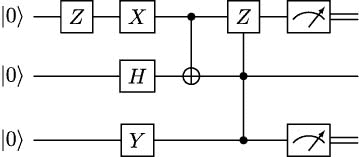

**图 1.1**：一个简单量子电路的示例。

在那个电路中，我们首先在顶部的量子比特上应用一个称为门的操作；我们将在下一节解释所有这些操作的作用，但请注意，我们用带有操作名称的小方块来表示它们。在初始的门之后，我们在顶部、中间和底部的量子比特上分别应用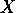、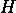和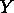门，然后是一个作用于顶部和中间量子比特的两量子比特门，接着是一个作用于所有量子比特的三量子比特门。最后，我们测量顶部和底部的量子比特（我们将在下一节介绍测量，不用担心），我们使用**仪表符号**来表示这一点。请注意，在这些测量之后，线用双线表示，以表明我们已经得到了一个结果——技术上，我们说量子比特的状态已经**坍缩**到一个经典值。这意味着从这一点开始，我们不再有量子数据，只有经典比特。这种坍缩可能有点神秘（确实是！），但不用担心。在下一节中，我们将详细解释量子信息（量子比特）如何转换为经典数据（比特）的过程。

如你所注意到的，量子电路在某种程度上类似于数字电路，其中我们有代表比特的线以及不同的逻辑门，如**AND**、**OR**和**NOT**作用于它们。然而，我们的量子比特、量子门和测量遵循量子力学的规则，并显示出一些在经典电路中找不到的性质。本章的其余部分致力于详细解释所有这些内容，从最简单的情况，即单个量子比特的情况开始，一直扩展到可以使用所需数量量子比特和门的完整量子电路。

准备好了吗？那么，让我们开始吧！

# 1.3 使用一个量子比特和布洛赫球体

使用计算模型的一个优点是，你可以忘记你计算机物理实现的特殊性，而专注于你存储信息元素的性质以及你可以对这些元素执行的操作。例如，我们可以定义量子比特为一个（物理）量子系统，它能够处于两种不同的状态。在实践中，它可能是一个具有两种可能偏振的光子，一个具有两种可能自旋值的粒子，或者一个电流可以沿两个方向流动的超导电路。当使用量子电路模型时，我们可以忘记这些实现细节，只需定义量子比特…作为一个数学向量！

## 1.3.1 什么是量子比特？

事实上，**量子比特**（简称**量子位**，有时也写作**qbit**、**Qbit**或甚至**q-bit**）是量子计算中的最小信息单位。就像**比特**（简称**二进制位**）可以处于状态或状态一样，量子比特可以处于状态  或状态 。在这里，我们使用所谓的**狄拉克符号**，其中围绕和的这些看起来很奇怪的符号被称为**基**，用于表示我们处理的是向量而不是常规数字。实际上，和并不是量子比特状态的唯一可能性，在一般情况下，它可能处于以下形式的**叠加**状态

其中  和  是复数，称为**振幅**，满足 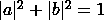。量  被称为状态的**范数**或**长度**，当它等于  时，我们说该状态是**归一化**的。

要了解更多...

如果你需要复习复数或向量空间，请参阅**附录** ***A*，**复数**，以及**附录** ***B*，**基础线性** **代数**。

**所有这些单个量子比特的状态的可能值都是存在于二维复向量空间中的向量（实际上，它们存在于所谓的**希尔伯特空间**中，但由于我们只会在有限维度上工作，所以实际上没有真正的区别）。因此，我们将向量  和  固定为一个特殊**基**的元素，我们将称之为**计算基**。我们将这些计算基的组成部分表示为列向量

因此

如果我们被给定一个量子比特，并且想要确定或，更确切地说，估计其状态，我们能做的只是进行测量，并得到两种可能的结果之一：0 或 1。然而，我们已经看到量子比特可以处于无限多种状态，那么量子比特的状态是如何决定测量结果的呢？正如你可能已经知道的，在量子物理学中，这些测量不是确定的，而是概率性的。特别是，对于任何量子比特 ，测量得到  的概率是 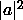, 而得到  的概率是 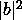. 自然地，这两个概率必须加起来等于 1，因此需要满足**归一化** **条件** .

如果在测量一个量子比特后，我们得到，比如说，，那么我们就知道，在测量之后，量子比特的状态是，我们说量子比特已经**坍缩**到这个状态。如果我们得到，状态就坍缩到。由于我们得到的结果对应于和，我们说我们在**计算基**下进行测量。

练习 1.1

如果一个量子比特的状态是 ，那么测量得到 0 的概率是多少？测量得到 1 的概率又是多少？如果量子比特的状态是 呢？如果它是 呢？

因此，从数学上讲，量子比特只是一个满足归一化条件的二维向量。谁能想到呢？但惊喜还没有结束。在下一小节中，我们将看到我们如何使用那些看起来很奇怪的矢量以非常简单的方式计算内积。

## 1.3.2 狄拉克符号和内积

狄拉克符号不仅可以用于列向量，也可以用于行向量。在这种情况下，我们谈论**内积**，它与**矢量**一起可以用来形成**内积对**。这个名字是一个双关语，因为正如我们即将展示的，内积对实际上是写成——你猜对了——括号之间的内积。为了更精确地数学上描述，我们可以与每个矢量关联一个**共轭转置**或**厄米转置**的**伴随**或**共轭**。为了获得这个伴随，我们取矢量的列向量，将其转置并对其每个坐标（正如我们已知，它们是复数）进行共轭。我们用来表示与关联的伴随，用来表示与关联的伴随，所以我们有

并且，一般来说，

其中，按照惯例，我们使用 dagger 符号 () 表示伴随矩阵。

重要提示

在寻找伴随矩阵时，不要忘记对复数进行共轭！例如，以下等式成立

Dirac 符号之所以在处理量子系统时如此受欢迎，其中一个原因是通过使用它，我们可以轻松地计算 kets 和 bras 的内积。例如，我们可以很容易地证明

这证明了和不仅是一组基的元素，而且是**正交归一**的，因为和是正交的，且长度为 1。因此，我们可以通过注意到来计算两个状态和的内积，即

![\begin{array}{rlrl} \left\langle \psi_{1} \middle| \psi_{2} \right\rangle & {= \left( {a^{\ast}\left\langle 0 \right| + b^{\ast}\left\langle 1 \right|} \right)\left( {c\left| 0 \right\rangle + d\left| 1 \right\rangle} \right)\qquad} & & \qquad \\ & {= a^{\ast}c\left\langle 0 \middle| 0 \right\rangle + a^{\ast}d\left\langle 0 \middle| 1 \right\rangle + b^{\ast}c\left\langle 1 \middle| 0 \right\rangle + b^{\ast}d\left\langle 1 \middle| 1 \right\rangle\qquad} & & \qquad \\ & {= a^{\ast}c + b^{\ast}d,\qquad} & & \qquad \\ \end{array}](img/right)\left( {c\left| 0 \right\rangle + d\left| 1 \right\rangle} \right)\qquad} & & \qquad \\  & {= a^{\ast}c\left\langle 0 \middle| 0 \right\rangle + a^{\ast}d\left\langle 0 \middle| 1 \right\rangle + b^{\ast}c\left\langle 1 \middle| 0 \right\rangle + b^{\ast}d\left\langle 1 \middle| 1 \right\rangle\qquad} & & \qquad \\  & {= a^{\ast}c + b^{\ast}d,\qquad} & & \qquad \\ \end{array}")

其中和是和的复共轭。

练习 1.2

 和  的内积是什么？以及  和  的内积是什么？

要了解更多…

注意，如果 ，那么 ，这是在状态  下测量  的概率。这不是偶然的。例如，在 *第* * *7* * 章 * *VQE: 变分量子* *本征值求解器* 中，我们将使用除了计算基以外的正交归一基的测量，我们将看到在这种情况下，测量与给定正交归一基中的一个元素  相关的结果的概率正好是 .*

*我们现在已经知道了量子比特是什么，如何测量它们，甚至如何利用狄拉克符号进行一些有用的计算。唯一剩下的事情就是研究如何操作量子比特。你准备好了吗？是时候让我们向您介绍强大的量子门了！*

## 1.3.3 单量子比特量子门

到目前为止，我们关注的是量子比特在其状态中存储信息的方式，以及我们如何通过测量来访问（部分）这些信息。但为了开发有用的算法，我们还需要一种方法来操纵量子比特的状态以执行计算。

由于量子比特本质上是一个量子系统，其演化遵循量子力学的规律。更确切地说，如果我们假设我们的系统与其环境是隔离的，它遵循著名的**薛定谔****方程**。

要了解更多…

静态薛定谔方程可以写成

} \right\rangle = i\hslash\frac{\partial}{\partial t}\left| {\psi(t)} \right\rangle,")

其中  是系统的**哈密顿量**，} \right\rangle") 是时间  时系统的状态向量， 是虚数单位，而  是约化普朗克常数。

我们将在 *第 *3* 章 *QUBO:* *二次无约束二进制优化*，*第 *4* 章 *量子* *绝热计算和量子退火*，以及 *第 *7* 章 *VQE:* *变分量子本征值求解器* 中更多地讨论哈密顿量。

**不要慌张！要编程量子计算机，你不需要知道如何解薛定谔方程。事实上，你需要知道的是，其解总是特殊类型的线性变换。对于量子电路模型，由于我们在有限维空间中工作，并且已经固定了一个基，操作可以通过应用于表示量子比特状态的向量的矩阵来描述**。

但并非任何类型的矩阵都能起到作用。根据量子力学，我们所能使用的只有所谓的**单位矩阵**，即满足以下条件的  矩阵：

其中 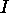 是单位矩阵，而  是  的伴随矩阵，即通过转置  并将每个元素替换为其复共轭得到的矩阵。这意味着任何单位矩阵  都是可逆的，其逆矩阵由  给出。在量子电路模型中，这些矩阵所表示的操作被称为量子门。

要了解更多信息…

检查单位矩阵保持向量长度相对容易（例如，参见 Robert Sutor 的《与量子比特共舞》第 *5.7.5* 节 [92]）。也就是说，如果  是一个单位矩阵，而  是一个量子态（因此，其范数为 ，正如我们已知的那样），那么  也是一个有效的量子态，因为其范数仍然是 。因此，我们可以安全地将单位矩阵应用于我们的量子态，并确信得到的结果将满足归一化条件。

当我们只有一个量子比特时，我们的单位矩阵需要是的大小，因为状态向量的维度是 2。因此，量子门的最简单例子是 2 维的单位矩阵，它通过...好吧，通过根本不改变量子比特的状态来实现转换。一个不那么无聊的例子是门，其矩阵如下所示

门也被称为**非门**，因为其对计算基的元素的作用是

这正是经典数字电路中非门（NOT gate）所做的事情。

练习 1.3

检查矩阵确实是一个幺正矩阵。的逆矩阵是什么？对一个处于形式的一般量子比特的作用是什么？

没有经典对应的量子门是**哈达玛门**（Hadamard gate）或门，其定义为

这个门在量子计算中非常有用，因为它可以创建叠加态。更准确地说，如果我们对一个处于状态的量子比特应用门，我们得到

![H\left| 0 \right\rangle = \frac{1}{\sqrt{2}}\left| 0 \right\rangle + \frac{1}{\sqrt{2}}\left| 1 \right\rangle = \frac{1}{\sqrt{2}}\left( {\left| 0 \right\rangle + \left| 1 \right\rangle} \right)].](img/file60.png "H\left| 0 \right\rangle = \frac{1}{\sqrt{2}}\left| 0 \right\rangle + \frac{1}{\sqrt{2}}\left| 1 \right\rangle = \frac{1}{\sqrt{2}}\left( {\left| 0 \right\rangle + \left| 1 \right\rangle} \right).")

这种状态非常重要，因此它有自己的名字和符号。它被称为**正**状态，用表示。以类似的方式，我们有

")

如你所猜，这种状态被称为**负**状态，它用表示。

练习 1.4

检查门的矩阵是否确实是幺正的。对和的作用是什么？对和的作用是什么？

当然，我们可以依次将多个门应用到同一个量子比特上。例如，考虑以下电路：

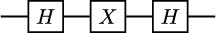

我们从左到右读取门，所以在前面的电路中，我们首先应用一个门，然后是一个门，最后再应用另一个门。你可以很容易地检查，如果量子比特的初始状态是，它最终会回到状态。但如果它的初始状态是，最终状态将变为。

这种操作也非常重要，当然，它有自己的名字：我们称之为门。从其对和的作用，我们可以看出其矩阵将是

我们也可以通过依次相乘门、和的矩阵来推断出这一点。

练习 1.5

检查  和  以两种不同的方式。首先，使用狄拉克符号和  和  的作用（记住我们已将  定义为 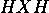）)。然后，通过执行矩阵乘法得到相同的结果

由于存在  和  门，你可能想知道是否也存在  门。确实存在一个，由矩阵  给出。

要了解更多…

集合 , 被称为 **泡利矩阵** 集合，在量子计算中非常重要。它的许多有趣性质之一是它构成了  复数矩阵空间的基。例如，我们将在 *第* * *7* *章* * *7* *，*变分量子本征值求解器* *中* 使用它。

*其他重要的单量子比特门包括 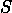 和  门，它们的矩阵如下

但，当然，存在（不可数！）无限多的二维幺正矩阵，我们无法在这里列出它们所有。我们将要做的是引入单量子比特状态的美丽几何表示，并且，通过它，我们将解释所有单量子比特量子门实际上可以理解为某些类型的旋转。进入布洛赫球体！

练习 1.6

检查 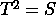。然后，使用最美丽的公式（即欧拉公式 ) 来检查 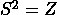。还要检查  和  是单位算子。将  和  表示为  和  的幂。

## 1.3.4 毕洛球和旋转

一个量子比特的通用状态可以用两个复数来描述。由于每个数都有两个实数分量，所以自然会想到我们需要一个四维实空间来表示量子比特的状态。令人惊讶的是，所有可能的量子比特状态都可以绘制在旧式球面上，这是一个二维对象！

为了展示如何实现这一点，我们需要记住一个复数  可以用极坐标表示为

其中 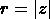 是一个非负实数， 是  区间内的一个角度。考虑一个处于状态  的量子比特，并将  和  用极坐标表示为

我们知道 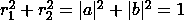，并且由于 ，必须存在一个角度  在  区间内，使得  = r_{1} \right.") 和  = r_{2} \right.")。考虑  而不是  在余弦和正弦中的原因将在稍后变得明显。注意，到目前为止，我们有

另一个重要的观察是，我们可以将乘以一个绝对值为 1 的复数，而不会改变其状态。实际上，很容易看出在计算基下测量时不会影响得到 0 和 1 的概率（检查一下！）并且，通过线性关系，它在应用量子门（即 = cU\left| \psi \right\rangle"))时出现。因此，没有操作——无论是幺正变换还是测量——能够让我们区分和。我们称为**全局相位**，并且我们已经证明它是物理上无关紧要的。

重要提示

然而，请注意，**相对相位**与全局相位不同，确实是相关的！例如，")和")仅在的相位上有所不同，但我们可以通过首先应用到这些状态，然后在计算基下测量它们来轻松地区分它们。

因此，我们可以将乘以来获得一个等效表示

其中我们定义.

以这种方式，我们可以用两个数字和来描述任意量子比特的状态，我们可以将它们解释为极角和方位角，分别（即我们使用所谓的**球坐标**）。这给我们一个三维点

")

这将量子比特的状态定位在被称为**布洛赫球**（见*图**1.2*）的球面上。

*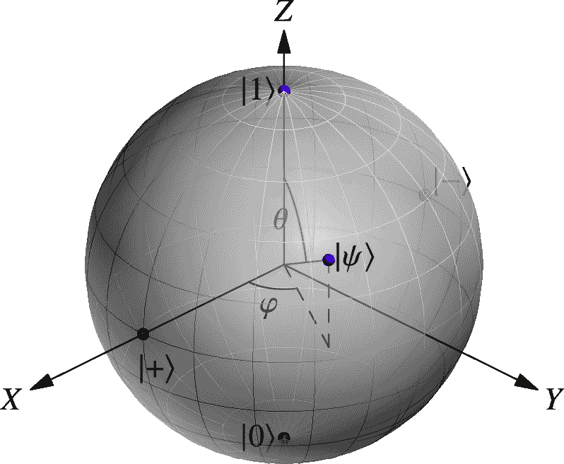*

**图 1.2**：在布洛赫球体上表示的量子比特状态。

注意到从到变化，以覆盖从球体顶部到底部的整个范围。这就是为什么我们在表示先前的量子比特时使用了。我们只需要达到，因为我们的角度是在正弦和余弦函数中！

在布洛赫球体中，映射到北极，映射到南极。一般来说，相对于内积正交的状态在球面上是相反的。例如，和都位于赤道上，但在球体的相对位置上。正如我们已经知道的，门将映射到，将映射到，但至少在无关的全局相位上保持和不变。事实上，这意味着门在布洛赫球体的轴上旋转弧度……，所以现在你知道为什么我们用那个名字来命名这个门了！同样地，和分别在和轴上旋转弧度。

我们可以将这种行为推广到在布洛赫球体的任何轴上旋转任意角度。例如，对于、和轴，我们可以定义

 = e^{- i\frac{\theta}{2}X} = \cos\frac{\theta}{2}I - i\sin\frac{\theta}{2}X = \begin{pmatrix} {\cos\frac{\theta}{2}} & {- i\sin\frac{\theta}{2}} \\ {- i\sin\frac{\theta}{2}} & {\cos\frac{\theta}{2}} \\ \end{pmatrix},")

 = e^{- i\frac{\theta}{2}Y} = \cos\frac{\theta}{2}I - i\sin\frac{\theta}{2}Y = \begin{pmatrix} {\cos\frac{\theta}{2}} & {- \sin\frac{\theta}{2}} \\ {\sin\frac{\theta}{2}} & {\cos\frac{\theta}{2}} \\ \end{pmatrix},")

 = e^{- i\frac{\theta}{2}Z} = \cos\frac{\theta}{2}I - i\sin\frac{\theta}{2}Z = \begin{pmatrix} e^{- i\frac{\theta}{2}} & 0 \\ 0 & e^{i\frac{\theta}{2}} \\ \end{pmatrix} \equiv \begin{pmatrix} 1 & 0 \\ 0 & e^{i\theta} \\ \end{pmatrix},")

其中我们使用符号表示等效操作，直到全局相位。注意， \equiv X"),  \equiv Y"),  \equiv Z"),  \equiv S"), 和 \equiv T").

练习 1.7

通过代入, , 和的定义中的角度来检查这些等价性。

实际上，可以证明（例如，参见 Nielsen 和 Chuang 的书籍[69]），对于任何单量子比特门，存在一个单位向量")和一个角度，使得

.")

例如，选择和 \right.")，我们可以得到 Hadamard 门，因为

.")

此外，还可以证明，对于任何单量子比特门 ，存在三个角度 ，，和 ，使得

R_{Y}(\beta)R_{Z}(\gamma).")

事实上，只要两个旋转轴不平行，你就可以为任何两个旋转轴获得这样的分解，而不仅仅是  和 。

此外，在某些量子计算架构中（包括 IBM 等公司使用的架构），通常使用一个**通用**的单量子比特门，称为**-门**，它依赖于三个角度，并且能够生成任何其他单量子比特门。其矩阵是

 = \begin{pmatrix} {\cos\frac{\theta}{2}} & {- e^{i\lambda}\sin\frac{\theta}{2}} \\ {e^{i\varphi}\sin\frac{\theta}{2}} & {e^{i{({\varphi + \lambda})}}\cos\frac{\theta}{2}} \\ \end{pmatrix}.")

练习 1.8

证明 ") 是幺正的。检查  = U(\theta, - \pi\slash 2,\pi\slash 2) \right.")， = U(\theta,0,0)")，以及，在全局相位上， = R_{Z}(0,0,\theta)").

所有这些关于如何从旋转和参数化族构造单量子比特门观察都将对我们讨论第 **9* 章 *量子支持向量机* 和第 **10* 章 *量子神经网络* 中的变分形式和特征图非常重要，以及在此章后面构建受控门。

**## 1.3.5 量子世界，你好！

为了将我们所学的一切整合起来，我们将创建我们第一个完整的量子电路。它看起来是这样的：

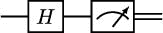

这看起来并不十分令人印象深刻，但让我们逐部分进行分析。正如你所知，遵循惯例，我们的量子比特的初始状态被假定为 ，这就是我们在做任何事情之前所拥有的状态。然后我们应用  门，因此状态变为 。最后，我们测量量子比特。获得  的概率将是 ，而获得  的概率也将是 ，因此我们创建了一个电路——至少在理论上——能够生成完全均匀分布的随机比特。

了解更多…

我们可以将之前的电路修改为获得我们想要的任何关于  和  的分布。如果我们想要测量  的概率为 ，我们只需考虑  以及以下电路：

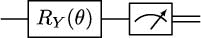

练习 1.9

请检查，在先前的电路中，测量前的状态是 |1>")，因此测量的概率是，测量的概率是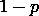。

目前，这就是我们关于单量子比特状态、门和测量的所有需要了解的内容。让我们继续探讨双量子比特系统，那里纠缠的奥秘正等待着被揭示！

# 1.4 使用两个量子比特和纠缠

现在我们已经掌握了单个量子比特的内部工作原理，我们准备提高难度。在本节中，我们将学习双量子比特系统以及它们如何变得纠缠。我们首先定义双量子比特系统的数学表示以及如何测量它们。之后，我们将研究可以同时作用于两个量子比特的不同量子门，并探讨它们的一些非常有趣且略带困惑的特性。最后，我们将通过一个简单但富有启发性的双量子比特电路的例子来结束。我们保证这次旅程将会非常精彩！

## 1.4.1 双量子比特状态

到目前为止，我们一直在独立处理量子比特。但除非量子比特能够相互通信，否则量子计算的真实力量无法发挥。我们将从考虑量子系统中最简单的量子比特相互作用情况开始：双量子比特系统。

当然，在双量子比特系统中，每个量子比特可以处于状态或状态。因此，对于两个量子比特，我们有四种可能的组合：两者都处于状态，第一个处于状态而第二个处于状态，第一个处于状态而第二个处于状态，或者两者都处于状态。这四种可能性构成了一个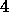维空间的基础（称为**计算基**），我们分别用以下方式表示它们：

在这里，是**张量积**的符号。两个列向量的张量积定义为

![\begin{pmatrix} a_{1} \\ a_{2} \\ {\vdots} \\ a_{n} \\ \end{pmatrix} \otimes \begin{pmatrix} b_{1} \\ b_{2} \\ {\vdots} \\ b_{m} \\ \end{pmatrix} = \begin{pmatrix} {a_{1}\begin{pmatrix} b_{1} \\ b_{2} \\ {\vdots} \\ b_{m} \\ \end{pmatrix}} \\ {a_{2}\begin{pmatrix} b_{1} \\ b_{2} \\ {\vdots} \\ b_{m} \\ \end{pmatrix}} \\ {\vdots} \\ {a_{n}\begin{pmatrix} b_{1} \\ b_{2} \\ {\vdots} \\ b_{m} \\ \end{pmatrix}} \\ \end{pmatrix} = \begin{pmatrix} {a_{1}b_{1}} \\ {a_{1}b_{2}} \\ {\vdots} \\ {a_{1}b_{m}} \\ {a_{2}b_{1}} \\ {a_{2}b_{2}} \\ {\vdots} \\ {a_{2}b_{m}} \\ {\vdots} \\ {a_{n}b_{1}} \\ {a_{n}b_{2}} \\ {\vdots} \\ {a_{n}b_{m}} \\ \end{pmatrix}.](img/end{pmatrix}.")

因此，四个基态可以用由四个维度的列向量表示，具体如下

通常，我们省略符号，直接写成

或者

或者甚至

显然，在这种情况下，我们使用的量子比特数必须从上下文中清楚，以免将一量子比特系统的状态  与两量子比特系统的状态  ——或者，就像我们很快就会看到的，任何其他多量子比特系统的状态——混淆！

正如我们提到的，这四个状态构成了一个两量子比特系统可能状态向量空间的基。这样一个系统的状态的一般表达式是

其中 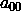, 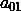, 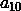, 和 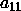 是复数（称为振幅，记住？），使得 .

如果我们在计算基下测量我们正在考虑的这个通用状态下的两个量子比特，我们将以概率  得到 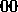，以概率  得到 ，以概率  得到 ，以概率  得到 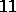。在所有这些情况下，状态将坍缩到与测量结果相对应的状态，就像在一量子比特系统中一样。

现在假设我们只测量其中一个量子比特。那么会发生什么？假设我们测量第一个量子比特。那么，获得的概率将是, 这就是第一个量子比特可以是的所有可能结果的概率之和。如果我们测量第一个量子比特，并且结果为，系统不会完全坍缩，但它将保持在以下状态

其中我们除以以保持状态归一化。测量结果为的情况类似。

练习 1.10

推导出在一般两比特态中测量第一个量子比特上的概率公式，以及测量后的系统状态。

狄拉克符号也用于计算两比特态的内积。我们只需要注意到

\left( {\left| \varphi_{1} \right\rangle \otimes \left| \varphi_{2} \right\rangle} \right) = \left\langle \psi_{1} \middle| \varphi_{1} \right\rangle\left\langle \psi_{2} \middle| \varphi_{2} \right\rangle,")

应用分配律，并在从基态获得共轭态时记住要取复系数的共轭。

然后，例如，我们可以注意到和的内积是

![\begin{array}{rlrl} & {\left( {\frac{4}{5}\left\langle {01} \right| - \frac{3i}{5}\left\langle {11} \right|} \right)\left( {\frac{1}{\sqrt{2}}\left| {00} \right\rangle + \frac{1}{\sqrt{2}}\left| {11} \right\rangle} \right) = \qquad} & & \qquad \\ & {\quad\frac{4}{5\sqrt{2}}\left\langle 01 \middle| 00 \right\rangle + \frac{4}{5\sqrt{2}}\left\langle 01 \middle| 11 \right\rangle - \frac{3i}{5\sqrt{2}}\left\langle 11 \middle| 00 \right\rangle - \frac{3i}{5\sqrt{2}}\left\langle 11 \middle| 11 \right\rangle = \qquad} & & \qquad \\ & {\quad\frac{4}{5\sqrt{2}}\left\langle 0 \middle| 0 \right\rangle\left\langle 1 \middle| 0 \right\rangle + \frac{4}{5\sqrt{2}}\left\langle 0 \middle| 1 \right\rangle\left\langle 1 \middle| 1 \right\rangle - \frac{3i}{5\sqrt{2}}\left\langle 1 \middle| 0 \right\rangle\left\langle 1 \middle| 0 \right\rangle - \frac{3i}{5\sqrt{2}}\left\langle 1 \middle| 1 \right\rangle\left\langle 1 \middle| 1 \right\rangle = - \frac{3i}{5\sqrt{2}},\qquad} & & \qquad \\ \end{array}](img/right)\left( {\frac{1}{\sqrt{2}}\left| {00} \right\rangle + \frac{1}{\sqrt{2}}\left| {11} \right\rangle} \right) = \qquad} & & \qquad \\  & {\quad\frac{4}{5\sqrt{2}}\left\langle 01 \middle| 00 \right\rangle + \frac{4}{5\sqrt{2}}\left\langle 01 \middle| 11 \right\rangle - \frac{3i}{5\sqrt{2}}\left\langle 11 \middle| 00 \right\rangle - \frac{3i}{5\sqrt{2}}\left\langle 11 \middle| 11 \right\rangle = \qquad} & & \qquad \\  & {\quad\frac{4}{5\sqrt{2}}\left\langle 0 \middle| 0 \right\rangle\left\langle 1 \middle| 0 \right\rangle + \frac{4}{5\sqrt{2}}\left\langle 0 \middle| 1 \right\rangle\left\langle 1 \middle| 1 \right\rangle - \frac{3i}{5\sqrt{2}}\left\langle 1 \middle| 0 \right\rangle\left\langle 1 \middle| 0 \right\rangle - \frac{3i}{5\sqrt{2}}\left\langle 1 \middle| 1 \right\rangle\left\langle 1 \middle| 1 \right\rangle = - \frac{3i}{5\sqrt{2}},\qquad} & & \qquad \\ \end{array}")

由于  和 .

## 1.4.2 双量子比特门：张量积

当然，我们可以在双量子比特系统上进行的操作必须是幺正的。因此，双量子比特量子门是幺正矩阵，作用于 4 维列向量。构建此类矩阵的最简单方法是通过两个单量子比特量子门的张量积。也就是说，如果我们考虑两个单量子比特门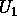和以及两个单量子比特状态和，我们可以形成一个作用于的双量子比特门，其作用如下

\left( {\left| \psi_{1} \right\rangle \otimes \left| \psi_{2} \right\rangle} \right) = \left( {U_{1}\left| \psi_{1} \right\rangle} \right) \otimes \left( {U_{2}\left| \psi_{2} \right\rangle} \right).")

通过线性，我们可以将扩展到任何双量子比特状态的组合，并且我们可以将一个矩阵与关联起来。实际上，这个矩阵是由与和关联的矩阵的张量积给出的。更具体地说，矩阵和的张量积的表达式是

![\begin{array}{rlrl} {\begin{pmatrix} a_{11} & a_{12} \\ a_{21} & a_{22} \\ \end{pmatrix} \otimes \begin{pmatrix} b_{11} & b_{12} \\ b_{21} & b_{22} \\ \end{pmatrix}} & {= \begin{pmatrix} {a_{11}\begin{pmatrix} b_{11} & b_{12} \\ b_{21} & b_{22} \\ \end{pmatrix}} & {a_{12}\begin{pmatrix} b_{11} & b_{12} \\ b_{21} & b_{22} \\ \end{pmatrix}} \\ {a_{21}\begin{pmatrix} b_{11} & b_{12} \\ b_{21} & b_{22} \\ \end{pmatrix}} & {a_{22}\begin{pmatrix} b_{11} & b_{12} \\ b_{21} & b_{22} \\ \end{pmatrix}} \\ \end{pmatrix}\qquad} & & \qquad \\ & {= \begin{pmatrix} {a_{11}b_{11}} & {a_{11}b_{12}} & {a_{12}b_{11}} & {a_{12}b_{12}} \\ {a_{11}b_{21}} & {a_{11}b_{22}} & {a_{12}b_{21}} & {a_{12}b_{22}} \\ {a_{21}b_{11}} & {a_{21}b_{12}} & {a_{22}b_{11}} & {a_{22}b_{12}} \\ {a_{21}b_{21}} & {a_{21}b_{22}} & {a_{22}b_{21}} & {a_{22}b_{22}} \\ \end{pmatrix}.\qquad} & & \qquad \\ \end{array}](img/end{array}")

现在很容易验证这个操作确实是幺正的，因此它值得被称为量子门。

练习 1.11

检查给定任何一对幺正矩阵  和 ， 的逆是 ，并且 }^{\dagger} = U_{1}^{\dagger} \otimes U_{2}^{\dagger}").

当我们有两个量子比特的电路，并且每个量子比特都作用着一对单个量子比特门时，门之间的张量积自然出现。例如，在下面的电路中，门  作用于两个量子比特，然后紧接着是门 ，其中  是单位门：

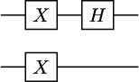

练习 1.12

明确计算门  和  的矩阵。

你可能会抱怨到目前为止我们还没有做任何新的事情。你是对的！实际上，通过单量子比特门的张量积获得的量子门可以看作是对孤立量子比特的操作，这些操作恰好同时应用。但请稍等！在下一小节中，我们将介绍一种完全不同的作用于双量子比特系统的方式。

## 1.4.3 CNOT 门

通过将单量子比特门进行张量积，我们只能获得作用于每个量子比特的单独操作。但这仅仅给我们留下了一个（相当无聊的）所有可能双量子比特门的子集。有许多不可表示为其他简单矩阵张量积的单位矩阵。在双量子比特的情况下，可能最重要的一种是**受控非**（或**受控-**)门，通常称为**CNOT 门**，由以下单位矩阵给出

看看这个门如何作用于双量子比特计算基的元素是很有启发性的。正如你很容易检查的那样，我们得到

这意味着只有当第一个量子比特的值为时，第二个量子比特的值才会翻转。或者，换句话说，对第二个量子比特（我们称之为**目标**）应用 NOT 门（我们称之为**受控**）是由第一个量子比特控制的。现在这个门的名字就更有意义了，不是吗？

在量子电路中，CNOT 门表示如下：

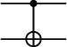

注意，控制量子比特由一个实心黑色圆圈表示，目标量子比特由符号（门的符号也可以用来代替）表示。

有时，技术困难限制了在量子计算机上实际可以实现的 CNOT 门数量。例如，在某些量子芯片上，你可能有可能应用一个目标为量子比特且由量子比特控制的 CNOT 门，但反之则不行。如果你发现自己处于这种情况，没有必要惊慌。如果你使用以下电路

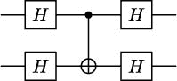

你实际上是在应用一个目标在顶层量子比特、控制在下层量子比特的 CNOT 门。这就是你如何拯救世界的方法！

CNOT 门也可以通过以下电路来交换或**交换**两个量子比特的状态：

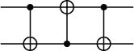

练习 1.13

以两种不同的方式检查这些等价性：通过计算电路的矩阵，以及通过使用量子比特在状态 、、 和  上使用它们的结果。

在任何情况下，CNOT 门最显著的使用无疑是其创建纠缠的能力，这是量子系统的一个引人入胜的特性，我们将在下一节中研究。

## 1.4.4 纠缠

令人奇怪的是，为了定义量子系统何时是纠缠的，我们首先需要定义它何时**不是**纠缠的。我们说一个状态  是一个**乘积态**，如果它可以写成两个其他状态  和  的张量积，每个状态至少包含一个量子比特，

如下

如果  不是一个乘积态，我们说它是**纠缠**的。

例如， 是一个乘积态，因为我们知道它只是另一种写法 。同样，") 也是一个乘积态，因为我们可以在第二个量子比特上分解  以获得

 = \left( {\frac{1}{\sqrt{2}}\left( {\left| 0 \right\rangle + \left| 1 \right\rangle} \right)} \right)\left| 0 \right\rangle.")

另一方面，") 是一个纠缠态。无论你如何努力，都无法将其表示为两个单量子比特态的乘积。假设，为了矛盾，这是可能的。那么，你就会有

} & {= \left( {a\left| 0 \right\rangle + b\left| 1 \right\rangle} \right)\left( {c\left| 0 \right\rangle + d\left| 1 \right\rangle} \right)\qquad} & & \qquad \\ & {= ac\left| {00} \right\rangle + ad\left| {01} \right\rangle + bc\left| {01} \right\rangle + bd\left| {11} \right\rangle.\qquad} & & \qquad \\ \end{array}")

但是这迫使 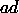 必须是 ，因为我们没有  成分在 ") 中。然后，要么 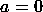，在这种情况下 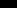 是 ，要么 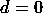，从而得出 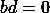。在这两种情况下，都无法达到我们需要的等式。因此，可以得出结论，该态是纠缠态。

练习 1.14

") 是否是纠缠态？还有 ") 呢？

当被测量时，纠缠态可以显示出超越经典物理可以解释的相关性。例如，如果我们有一个纠缠态 ") 并测量第一个量子比特，我们可以获得  或 ，每个结果出现的概率都是 。然而，如果我们随后测量第二个量子比特，结果将完全由测量第一个量子比特时获得的价值决定，并且实际上将是完全相同的。如果我们颠倒顺序，首先测量第二个量子比特，那么结果将是  或 ，概率相等。但在这个情况下，随后的第一个量子比特的测量结果将完全被确定！

即使我们将两个量子比特分开成数千光年之远，这种情况仍然会发生，就像一个量子比特能够以某种方式知道测量另一个量子比特的结果一样。这种奇特的行为在 20 世纪困扰了许多物理学家，包括阿尔伯特·爱因斯坦，他将这种现象称为*“超距作用”*（参见 [34]）。然而，纠缠效应在无数实验中得到了反复的证明（实际上，2022 年诺贝尔物理学奖授予了 Alain Aspect、John F. Clauser 和 Anton Zeilinger，他们是研究并实际测试这一现象的先驱 [10, 25, 41, 19]）。而且，对我们来说非常重要的一点是，纠缠是量子计算中最强大的资源之一。

但纠缠绝不是量子比特系统唯一令人困惑的特性。在下一小节中，我们将从数学上证明复制量子信息，一个你可能认为理所当然的操作，在一般情况下是不可能的。这些量子比特确实充满了惊喜！

## 1.4.5 不可克隆定理

量子系统的一个奇特性质是，通常情况下，它们不允许我们**复制信息**。尽管这看起来可能令人惊讶，但这只是量子门线性性质的一个简单后果。为了说明原因，让我们更精确地了解我们需要什么来复制信息，例如，仅使用两个量子比特。我们希望有一个两个量子比特的量子门 ，它能够将第一个量子比特复制到第二个量子比特。也就是说，对于任何给定的量子态 ，我们需要

然后， 和 ，并且根据线性关系，

} \right) = \frac{1}{\sqrt{2}}\left( {U\left| {00} \right\rangle + U\left| {10} \right\rangle} \right) = \frac{1}{\sqrt{2}}\left( {\left| {00} \right\rangle + \left| {11} \right\rangle} \right).")

我们应该强调，我们获得的状态是纠缠的，正如我们在前一小节中证明的那样。

然而，请注意，在我们的原始状态下，我们可以将第二个  因式分解出来，得到

 = \left( \frac{\left| 0 \right\rangle + \left| 1 \right\rangle}{\sqrt{2}} \right)\left| 0 \right\rangle.")

然后，由于的作用，我们应该有

} \right) = U\left( {\left( \frac{\left| 0 \right\rangle + \left| 1 \right\rangle}{\sqrt{2}} \right)\left| 0 \right\rangle} \right) = \frac{(\left| 0 \right\rangle + \left| 1 \right\rangle)}{\sqrt{2}}\frac{(\left| 0 \right\rangle + \left| 1 \right\rangle)}{\sqrt{2}},")

这是一种产品态。然而，我们之前已经得到，) = \sqrt{\left. 1\slash 2 \right.}(\left| {00} \right\rangle + \left| {11} \right\rangle)"),这是纠缠的！这个矛盾表明，唉，这样的不存在。

这个显著的结果被称为**不克隆定理**，我们应该更详细地解释其含义。一方面，请注意，这并不意味着我们不能复制经典信息。事实上，如果只是或，我们可以通过将设为 CNOT 门轻松实现。另一方面，定理适用于未知状态。如果我们知道是什么——也就是说，如果我们知道一个从开始准备的电路——那么，当然，我们可以创建尽可能多的独立副本。然而，如果被我们以没有任何关于其状态的信息的方式提供，不克隆定理表明我们通常无法复制其状态。

要了解更多…

不克隆定理在量子密钥分发协议的安全性中起着重要作用，如著名的**BB84**协议，该协议由贝内特和布拉萨德于 1984 年提出[13]。

在这次短暂的偏离之后，让我们回到我们关于双量子比特量子门的研究。在下一个小节中，我们将展示如何构建许多有趣的受控双量子比特幺正操作，其作用受其输入之一控制。

## 1.4.6 受控门

你可能想知道，除了受控-（或 CNOT）门之外，是否还有 **受控-**, **受控-**, 或 **受控-** 门。答案是响亮的肯定，实际上，对于任何量子门 ，都可以定义一个 **受控-**（或，简单地说，) 门，其作用在计算基上是

练习 1.15

检查  的矩阵是

其中 }_{i,j = 1}^{2}") 是  的矩阵。同时检查  是否为单位算子。 的伴随算子是什么？

 门的电路表示与用于 CNOT 门的类似，即

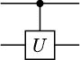 ,

其中实心黑色圆圈表示控制，带  的方框表示目标。

构建受控门比看起来要简单，前提是你的量子计算机已经实现了旋转门和双量子比特 CNOT 门。实际上，从我们在 *第 1.3.4 节* 结尾提到的旋转分解中可以证明（参见 Nielsen 和 Chuang 的书籍 [69，推论 4.2]），任何单量子比特量子门  都可以写成以下形式*

*

对于某个角度  和门 , , 以及 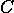，使得 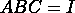。然后，以下电路实现了 :

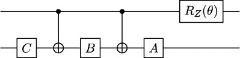

有时，构建一个受控门要容易得多。例如，可以证明一个受控- 门可以通过一个受控- 门和两个  门获得，如下面电路的等价性所示：

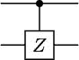  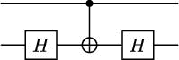

练习 1.16

证明前面的等价性。

我们现在拥有了构建我们第一个双量子比特量子电路所需的一切。让我们让那些量子比特纠缠起来！

## 1.4.7 欢迎来到纠缠世界！

为了完成我们对双量子比特系统的学习，让我们展示如何借助 CNOT 门创建纠缠态。考虑以下电路：

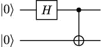

初始时，系统的状态是 。在我们应用  门后，我们进入状态 ")。最后，当我们应用 CNOT 门时，状态变为 "),正如我们在 *第* * *1.4.4* *节中证明的那样，这确实是一个纠缠态。*

*该状态 ") 被称为**贝尔态**，共有四种。其他三种分别是 "), "), 和 "). 它们都是纠缠态，可以使用类似于前述的电路来制备。*

练习 1.17

证明所有四个贝尔态都是纠缠态。获得制备它们的电路。*提示*：你可以在前述电路中的 CNOT 门之后使用  和  门。

我们现在已经准备好迎接重大时刻。在下一节中，我们将最终学习如何与量子计算机中我们能得到的任意数量的量子比特一起工作。

# 1.5 使用多个量子比特和通用性

现在我们已经掌握了与双量子比特系统工作的方法，将我们所学到的所有概念推广到电路中量子比特数量任意大的情况将变得相当直接。你知道这个过程：我们首先将数学上定义什么是多量子比特系统，然后学习如何测量它，最后我们将介绍同时作用于多个量子比特的量子门。

## 1.5.1 多量子比特系统

基于我们迄今为止所学到的知识，现在理解如何与**多量子比特系统**工作将变得非常容易。

如你所可能推断出的，如果我们有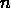个量子比特，构成计算基的状态是

我们通常省略符号来写

或者

或者简单地说

重要提示

当使用表示基态时，总量子比特数必须从上下文中明确。否则，例如，状态可能意味着、、或任何以开头并以结尾的字符串，这将导致无法容忍的歧义！

当然，系统的通用状态将是以下形式

唯一的条件是振幅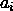应该是复数，使得。我们亲爱的老朋友，归一化条件！

要了解更多…

注意，描述-比特系统通用状态所需的参数数量在上是指数级的。对于高度纠缠的状态，我们不知道如何以更简洁的方式表示所有这些信息，并且强烈怀疑这是不可能的。量子计算的力量部分来自于通过仅操作个量子比特来隐式地处理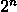个复数的可能性。

练习 1.18

检查基态是否由一个维列向量表示，其-th 个分量是 1，其余都是 0（*提示*：使用我们在*第* * *1.4.1* *节*中讨论的列向量的张量积表达式，以及张量积的结合律）。由此推断，任何-比特状态都可以用一个-维列向量表示，其长度为 1。

*如果我们决定在计算基中对系统的所有量子比特进行测量，我们将以概率获得。如果是这样，状态将坍缩到。但如果我们只测量一个量子比特，比如说第个，那么我们将以概率

其中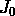是第位为的数字集合。在这种情况下，测量后系统的状态将是

练习 1.19

推导测量结果为的情况下的公式。

练习 1.20

测量第二个量子比特时得到的概率是多少？如果我们确实得到了，测量后的状态会是什么？

在狄拉克符号中计算 n 量子比特系统的内积与两个量子比特系统的计算非常相似。这个过程与我们展示在*第* * *1.4.1* *节中的类似，但需要考虑到*

*\left( {\left| \varphi_{1} \right\rangle \otimes \ldots \otimes \left| \varphi_{n} \right\rangle} \right) = \left\langle \psi_{1} \middle| \varphi_{1} \right\rangle\ldots\left\langle \psi_{n} \middle| \varphi_{n} \right\rangle.")*

练习 1.21

计算态 \(\left| x \right\rangle)") 和 \(\left| y \right\rangle)") 的内积，其中 \(\left| x \right\rangle") 和 \(\left| y \right\rangle") 都是长度为 \(\left| n \right\rangle") 的二进制字符串。使用你的结果来证明 \(\{\left| x \right\rangle\}_{x \in \{ 0,1\}}^{n} 确实是一个正交归一基。

练习 1.22

计算态 \(\sqrt{\left. \frac{1}{2} \right.}\left( {\left| {000} \right\rangle + \left| {111} \right\rangle} \right)\)")") 和 \(\left. \frac{1}{2}\left( {\left| {000} \right\rangle + \left| {011} \right\rangle + \left| {101} \right\rangle + \left| {110} \right\rangle} \right)\right.\right.")\) 的内积。

我们现在可以转向如何同时操作多个量子的问题。让我们定义多量子门！

## 1.5.2 多量子门

由于 \(\left| n \right\rangle\) 个量子态由 \(\left| 2^{n} \right\rangle\) 维列向量表示，\(\left| n \right\rangle\) 个量子门可以与 \(\left| 2^{n} \times 2^{n} \right\rangle\) 个单位矩阵相对应。类似于双量子门的情况，我们可以通过将较小数量量子门的张量积来构造 \(\left| n \right\rangle\) 个量子门。也就是说，如果 \(\left| U_{1} \right\rangle\) 是一个 \(\left| n_{1} \right\rangle\) 个量子门，\(\left| U_{2} \right\rangle\) 是一个 \(\left| n_{2} \right\rangle\) 个量子门，那么 \(\left| U_{1} \otimes U_{2} \right\rangle\) 是一个 \(\left| (n_{1} + n_{2}) \right\rangle")\) 个量子门，其矩阵由 \(\left| U_{1} \right\rangle\) 和 \(\left| U_{2} \right\rangle\) 的矩阵的张量积给出。

了解更多...

两个矩阵 \(\left| A \right\rangle\) 和 \(\left| B \right\rangle\) 的张量积表达式

")

然而，存在 -比特门不能作为较小门的张量积来构造。一个这样的例子是 **Toffoli** 或 **CCNOT** 门，这是一个作用于计算基的三量子比特门，其作用如下：

} \right\rangle,")

其中  是 **XOR** 函数，而  是 AND 布尔函数的符号。因此，CCNOT 对第三个量子比特应用了双重控制的（在这种情况下，由前两个量子比特控制）非门——这就是其名称的由来！

练习 1.23

获取 CCNOT 门的矩阵并验证它是幺正的。

Toffoli 门很重要，因为它和辅助量子比特的帮助下，我们可以构造任何经典布尔运算符。例如，（其中  是  的否定）和 。这表明，使用量子电路，我们可以以使用一些额外的辅助量子比特为代价来模拟任何经典数字电路的行为，因为任何布尔函数都可以仅用否定和合取来构建。这有点令人惊讶，因为我们知道所有量子门都是可逆的，而并非所有布尔函数都是。因此，我们可以通过仅实现 Toffoli 门的经典版本来使所有我们的数字电路可逆！

我们将不会研究任何作用于三个（或更多！）量子比特的门的具体例子，因为实际上我们可以用只使用单比特和双比特门的电路来模拟它们的行为。继续阅读以了解如何！

## 1.5.3 量子计算中的通用门

当前的量子计算机无法实现每个可能的量子门。相反，它们依赖于**通用性结果**，这些结果展示了任何单位运算都可以分解为使用一组**原始**门的电路。在前面几节中，我们提到，例如，任何单量子比特门都可以通过仅使用  和  旋转来获得。结果证明，对于 -量子比特量子门的一般情况也存在类似的结果。

对我们来说，了解任何单位运算都可以使用单量子比特门和 CNOT 门构建一个实现它的电路，这一点将非常重要。因此，我们说这些门是**通用的**——就像例如，否定和合取对于布尔逻辑是通用的那样。这一事实将对我们研究**特征映射**和**变分形式**与**量子神经网络**和其他量子机器学习模型的关系至关重要。

要了解更多…

除了单量子比特门加上 CNOT 之外，还有许多其他集合的通用门。例如，可以证明三个门 , , 和 CNOT 可以用来近似任何单位运算到任何所需的精度——并且在这个意义上它们是通用的。参见 Nielsen 和 Chuang 的书籍的第*4.5*节[69]，以了解这些事实的证明和更多通用门集的例子。

为了说明如何使用 CNOT 和单量子比特门来实现任何其他量子门，以下电路展示了针对顶部量子比特的 Toffoli 门的可能分解：

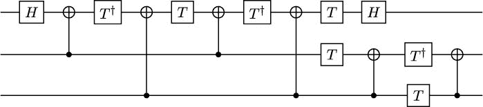 .

练习 1.24

通过检查计算基态的动作来验证前面的电路是否实现了 Toffoli 门。

这就结束了我们对量子计算基础知识的回顾。自从本章开始以来，我们已经走了很长的路，但现在我们已经掌握了我们为了研究量子机器学习和量子优化算法所需的所有数学知识。很快，我们将看到所有这些概念的实际应用！

# 摘要

在本章中，我们介绍了量子电路模型及其所依赖的主要概念：量子比特、门和测量。我们首先研究的是最简单的电路，那些只有一个或两个量子比特的电路，但我们利用对这些电路的经验，一直发展到多量子比特系统。在这个过程中，我们发现了一些强大的特性，如叠加和纠缠，并且我们掌握了与它们一起工作的数学——主要是线性代数——所需的知识。

这些概念对我们来说将极其宝贵，因为它们构成了我们将用来描述本书后面将要学习的机器学习和优化量子算法的语言。很快，所有的碎片都将汇聚在一起，形成一个美丽的结构。而且，由于我们现在已经获得的坚实基础，我们将能够完全欣赏和理解它。

在下一章中，我们将开始应用我们所学的所有知识，通过在量子模拟器和实际量子计算机上实现和运行量子电路来做到这一点。我们不知道你们的情况如何，但我们非常兴奋！*****************
