# 第九章

量子支持向量机

*人工智能是新的电力*

— 安德鲁·吴

在上一章中，我们学习了机器学习的基础，并提前了解了量子机器学习。现在是时候开始处理我们的第一个量子机器学习模型家族了：**量子****支持向量机**（通常缩写为**QSVM**）。这些是非常受欢迎的模型，它们最自然地用于二元分类问题。

在本章中，我们将学习什么是（经典）支持向量机以及它们是如何被使用的，并将这些知识作为理解量子支持向量机的基础。此外，我们将探讨如何使用 Qiskit 和 PennyLane 实现和训练量子支持向量机。

本章的内容如下：

+   支持向量机

+   走向量子

+   PennyLane 中的量子支持向量机

+   Qiskit 中的量子支持向量机

# 9.1 支持向量机

QSVMs 实际上是**支持向量机**（简称**SVM**）的特殊情况。在本节中，我们将探讨这些 SVM 是如何工作的，以及它们在机器学习中的应用。我们将首先通过一些简单的例子来激发 SVM 公式的动机，然后逐步深入：一直到如何使用核技巧来解决复杂分类问题。

## 9.1.1 你能想到的最简单的分类器

让我们暂时忘记数据，先考虑一个非常简单的问题。假设我们想在实数线上构建一个非常简单的分类器。为了做到这一点，我们只需要将实数线分成两个不相交的类别，使得任何数都属于这两个类别之一。因此，如果我们给出任何输入（一个实数），我们的分类器将返回它所属的类别。

你认为最简单的方法是什么？很可能是你首先选择一个点，并将实数线分成小于的数（类别）和大于的数的集合。当然，你还得将分配给两个类别中的一个，所以你的类别可以是以下两种之一：

+   实数集，满足，以及实数集，满足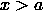

+   实数集，满足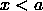，以及实数集，满足

任何选择都是合理的。

了解更多…

实际上，关于将  包括在哪个类别中的选择，在某种程度上是没有意义的。最终，如果你随机选择一个实数，它正好是  的概率是零。这个有趣的事实是由概率和测度理论赞助的！

这很简单。现在让我们说，我们想在实平面上（通常的 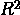）做同样的事情。在这种情况下，一个点不足以将其分割，但我们可以考虑一条古老的直线！这可以在 *图* *9.1* 中看到。任何一条直线都可以完美地将实平面分成两类。

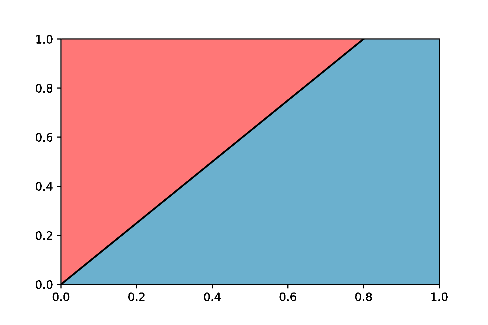

**图 9.1**：直线  \cdot \overset{\rightarrow}{x} + 0 = 0 \right.")，可以等价地写成 x \right.")，可以用来将实平面分成两个不相交的类别，这些类别被涂成不同的颜色。图片没有指定这条线属于哪个类别

如果你回顾一下你的线性代数笔记，你可能还记得，在平面上任何一条直线都可以用向量  和标量  来描述，即点集 ") 满足 。当然，我们使用  表示标量积（即 ，前提是 ")")). 向量  定义了直线的**法线**或垂直方向，而常数 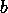 决定了直线与  和 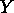 轴的交点。

当我们处理一维情况并使用一个点来分割实线时，决定任何输入属于哪个类别是显而易见的。在这种情况下，稍微复杂一些，但并不太多。通过一些基本的几何知识，你可以检查出任何数  将位于由  定义的线的两侧之一，这取决于  的符号。也就是说，如果  和  有相同的符号（两者都小于零或两者都大于零），我们将知道  和  将属于同一类别。否则，我们知道它们不会属于同一类别。

没有理由我们只停留在二维，让我们再提高一个层次，考虑一个  维欧几里得空间 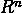. 就像我们用一条线分割  一样，我们也可以用…一个 (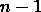) 维超平面来分割 . 例如，我们可以用一个普通平面来分割 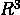.

 中的这些超平面由它们的法向量  和一些常数  定义。类似于我们在  中看到的情况，它们的点是满足以下形式的方程的 。

|  |
| --- |

此外，我们可以根据  的符号来确定某个  属于超平面的哪一侧。

要了解更多...

如果你对所有这些方程感到困惑，并且好奇它们从何而来，让我们快速解释一下。一个（仿射）超平面可以通过一个法向量 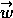 和平面上的一个点 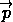 来定义。因此，一个点 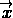 将属于超平面，当且仅当存在一个向量 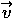，它是  的正交向量，即 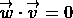。通过结合这两个表达式，我们知道  将属于超平面，当且仅当 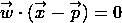，这可以重写为

|  |
| --- |

其中我们隐式地定义了 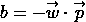。

此外，我们刚刚看到是与的标量积，其中是平面的一个固定法向量。这解释了为什么它的符号决定了位于超平面的哪一侧。记住，从几何上讲，两个向量的点积等于，其中表示它们之间的最小角度。

到目前为止我们所做的一切，我们已经拥有了在任意欧几里得空间上构建（诚然是简单的）二元分类器的工具。我们只需固定一个超平面即可做到这一点！

这对我们为什么很重要？结果是支持向量机正是我们之前讨论过的。

重要提示

支持向量机在维欧几里得空间(的分量和常数。

为了得到任意点的标签，我们只需查看的符号。

正如你可能已经怀疑的那样，纯支持向量机（vanilla SVMs）本身并不是最强大的二元分类模型：它们本质上是线性的，并且不适合捕捉复杂的模式。我们将在本章后面通过“核技巧”释放 SVMs 的全部潜力时解决这个问题（敬请期待！）无论如何，现在让我们为我们的模型简单性感到高兴，并学习如何训练它。

## 9.1.2 如何训练支持向量机：硬间隔情况

假设我们有一个二元分类问题，并且我们得到了一些训练数据，这些数据包括中的数据点以及它们相应的标签。自然地，当我们为这个问题训练 SVM 时，我们希望寻找在训练数据集中最好地分离两个类别的超平面。现在我们必须使这个直观的想法变得精确。

我们的训练数据集中的数据点为 ，它们的预期标签为 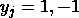（分别读作正和负）。目前，我们假设我们的数据可以被一个超平面完美地分开。在后面的章节中，我们将看到当这种情况不成立时应该怎么做。

注意，在假设至少存在一个可以分离我们的数据的超平面的情况下，必然会有无限多个这样的分离超平面（参见*图* *9.2*）。它们中的任何一个都适合我们的目标，即构建一个分类器吗？如果我们只关心训练数据，那么是的，任何一个都可以做到这一点。事实上，这正是我们在*第* *8* *章* *“什么是量子机器学习”*中讨论的感知器模型所做的事情：它只是寻找一个可以分离训练数据的超平面。

*然而，正如你肯定记得的，当我们训练一个分类器时，我们感兴趣的是获得低泛化误差。在我们的情况下，尝试实现这一目标的一种方法是在寻找一个可以最大化其自身与训练数据点之间距离的分离超平面。这正是 SVMs 实际训练的方式。背后的原理是清晰的：我们期望新的、未见过的数据点遵循我们在训练数据中看到的类似分布。因此，新的一类例子很可能比同一类的训练例子更接近。因此，如果我们的分离超平面离某个训练数据点太近，我们就有风险让同一类的另一个数据点穿过超平面的另一边并被错误分类。例如，在*图* *9.2*中，虚线确实分离了训练数据点，但它肯定比例如连续线更冒险的选择。

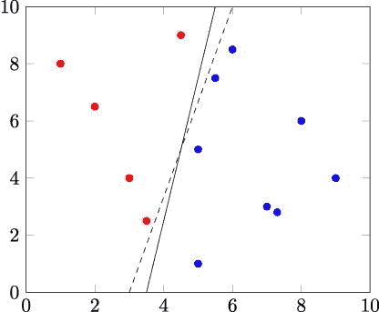

**图 9.2**：两条线（超平面）都分离了两个类别，但连续线比虚线更接近数据点

然后 SVM 训练背后的思想就清晰了：我们寻求的不仅仅是一个分离超平面，而是一个尽可能远离训练点的超平面。这看起来可能很难实现，但它可以表述为一个相当直接的优化问题。让我们更详细地解释一下如何实现它。

在第一种方法中，我们只需考虑分离超平面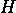到训练数据集中所有点的距离，然后尝试找到一种方法来调整，以最大化这个距离，同时确保仍然正确地分离数据。然而，这并不是展示问题的最佳方式。相反，我们可能会注意到，我们可以将每个数据点与一个唯一的、与平行的超平面关联起来，该超平面包含该数据点。更重要的是，穿过与最近的点的平行超平面本身也将是一个分离超平面——其反射在上也将是。这如图*9.3*所示。

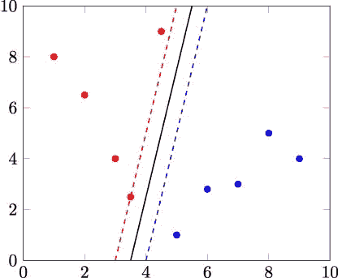

**图 9.3**：连续的黑色线条代表分离超平面。其中一条虚线是穿过最近的点的平行超平面，其在上的反射是另一条虚线

这对超平面——穿过最近点的平行平面及其反射——将是两个等距的平行超平面，它们彼此之间距离最远，同时仍然分离数据。它们是独有的。它们之间的距离被称为**间隔**，这是我们试图最大化的目标。这如图*9.4*所示。

我们已经知道，任何分离超平面  都可以用形式为  的方程来描述。此外，任何平行于  的超平面——特别是那些定义边界的超平面——都可以用  来描述，其中  是某个常数。不仅如此，它们在  上的反射也将由方程  来描述。因此，我们知道，对于某个常数 ，定义  边界的超平面可以用方程  来表示。

尽管如此，我们在这里并没有阻止我们将整个表达式除以 。因此，如果我们让  和 ，我们知道超平面  仍然可以用  来表示，但定义边界的超平面将用以下方程来描述：

|  |
| --- |

这看起来要整洁得多！

让我们总结一下我们已经学到的内容。我们希望找到一个超平面，它不仅能够正确地分离数据，而且还要最大化到训练数据集中点的距离。我们已经看到，我们可以将这个问题看作是寻找一个最大化边界的超平面：两个等距平行超平面之间的距离最大，同时仍然能够分离数据。我们刚刚已经证明，对于任何分离超平面，我们总能找到一些  和  的值，使得那些定义边界的超平面可以用以下形式表示：

|  |
| --- |

可以证明这两个超平面之间的距离是 。因此，最大化间隔的问题可以等价地表述为在约束条件  正确分离数据的情况下，最大化  的问题。

练习 9.1

证明，正如我们所声称的，超平面  之间的距离是 。

现在让我们考虑一个任意的元素  和一个由  定义的超平面 。当  的值为零时，我们知道  在超平面内，并且随着这个值远离零，点会越来越远离超平面。如果它增加并且介于 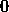 和 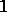 之间，点  就位于超平面  和超平面  之间。当这个值达到  时，点就在这个后者的超平面内。而当它的值大于  时，它就超出了这两个超平面。类似地，如果这个值减少并且介于  和 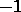 之间，点  就位于超平面  和  之间。当这个值达到  时，点就在这个最后的超平面内。而当它小于  时，它已经超出了  和  这两个超平面。

由于我们假设没有点在边界内，当对于所有正项，，而所有负项都满足  时，超平面  将正确地分离数据。我们可以将这个条件写成

|  \geq 1,") |
| --- |

因为当我们考虑-th 个示例属于正类时，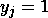，而当它属于负类时，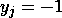。

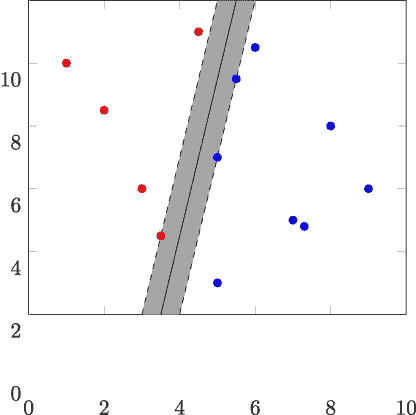

**图 9.4**：支持向量机可能返回的超平面用黑色连续线表示，而虚线表示的是相互之间距离最远但仍能分离数据的等距平行超平面。因此，边界是彩色区域厚度的一半。

对于所有这些，寻找最佳分离数据的超平面的问题可以表述为以下优化问题：

 \geq 1,\qquad} & & \qquad \\ \end{array}")

其中，当然，每个定义了一个单独的约束。这种表述存在一个小问题。欧几里得范数很棒，直观且几何性强，但它包含平方根。我们个人对平方根没有意见——我们最好的朋友中就有几个是平方根——但大多数优化算法对它们都有一些抵触。所以为了让我们更容易生活，我们可能考虑以下（等价）问题。

重要提示

如果训练数据集中的数据可以通过一个超平面分离，那么训练支持向量机的问题可以表述为以下优化问题：

 \geq 1.\qquad} & & \qquad \\ \end{array}")

这被称为**硬边界**训练，因为我们允许训练数据集中没有任何元素被错误分类，甚至被包含在边界内。

那个可爱而单纯的正方形将帮助我们避免许多麻烦。顺便说一下，我们已经引入了一个因子在旁边。这是出于技术方便的考虑，但并不是真正重要的。

在硬间隔训练中，我们需要我们的训练数据能够被超平面完美地分离，因为否则，我们不会找到我们刚刚定义的优化问题的任何可行解。这种情况在大多数情况下过于严格。幸运的是，我们可以采取一种称为**软间隔训练**的替代方法。

## 9.1.3 软间隔训练

软间隔训练类似于硬间隔训练。唯一的区别是它还包含一些可调整的**松弛**或“容忍”参数，这将增加约束的灵活性。这样，我们不是考虑约束 \geq 1")，而是使用

|  \geq 1 - \xi_{j}.") |
| --- |

因此，当  时，我们将允许  接近超平面，甚至位于空间的错误一侧（由超平面分隔）。更重要的是， 的值越大， 将越深入错误一侧。

自然地，我们希望这些 尽可能小，因此我们需要将它们包含在我们想要最小化的成本函数中。考虑到所有这些因素，我们在软间隔训练中要考虑的优化问题将是以下内容。

重要提示

一个可能无法**必然**使用超平面正确分离训练数据的支持向量机可以通过解决以下优化问题进行训练：

 \geq 1 - \xi_{j},\qquad} & & \qquad \\  & {\xi_{j} \geq 0.\qquad} & & \qquad \\ \end{array}")

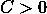的值是一个可以随意选择的超参数。越大，我们对训练示例落在间隔内或超平面的错误一侧的容忍度就越低。

这个公式被称为 SVM 的**软间隔训练**。

让我们现在尝试消化这个公式。正如预期的那样，我们也让对我们的代价函数做出了贡献，这样它们取大值将会受到惩罚。此外，我们引入了这个常数，并表示它可以随意调整。正如我们之前提到的，从广义上讲，它越大，我们越不愿意接受训练数据集中被错误分类的元素。实际上，如果存在一个可以完美分离数据的超平面，将设置为一个很大的值将等同于进行硬间隔训练。起初，可能会觉得将设置得很大很有吸引力，但这样做会使我们的模型更容易过拟合。完美的拟合并不那么好！平衡的值是成功 SVM 训练背后的许多关键之一。

要了解更多…

当我们训练 SVM 时，我们实际上想要最小化的损失函数是

|  = \max\{ 0,1 - y(\overset{\rightarrow}{w} \cdot \overset{\rightarrow}{x} + b)\},") |
| --- |

这被称为**铰链损失**。实际上，我们的变量是那个损失的直接代表。最小化这个损失函数的期望值将与最小化错误分类元素的比例相关——这正是我们最终想要的。

如果在我们的公式中没有这个因子，那么这就是我们要最小化的训练损失。然而，我们包括了这一因子，因为一个小的（即一个大的间隔）使 SVM 模型对过拟合更加鲁棒。

我们将通过展示其优化问题的等价公式来结束对软间隔训练的分析。这个公式被称为我们之前提出的优化问题的**拉格朗日对偶**。我们不会讨论为什么这两个公式是等价的，但你可以相信我们的话——或者你可以查看 Abu-Mostafa、Magdon-Ismail 和 Lin 的精彩解释[2]。

重要提示

软间隔训练问题可以用一些可优化的参数等价地表示如下：

,\qquad} & & \qquad \\ {\text{subject~to}\quad} & {0 \leq \alpha_{j} \leq C,\qquad} & & \qquad \\  & {\sum\limits_{j}\alpha_{j}y_{j} = 0.\qquad} & & \qquad \\ \end{array}")

SVM 软间隔训练问题的这种表述，在实践中大多数情况下更容易解决，这也是我们将要使用的方法。一旦我们获得了  的值，我们也可以回到原始的表述。实际上，从  的值中，我们可以恢复  和 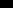。例如，以下等式成立：


注意到  只依赖于训练点 ，对于这些点 。这些向量被称为**支持向量**，正如你所想象的那样，这也是 SVM 模型名称的由来。

此外，我们还可以通过找到位于边缘边界的一些  来恢复 ，并解一个简单的方程——有关所有细节，请参阅 [2]。然后，为了对点  进行分类，我们只需计算

 + b,")

并根据结果是否大于 0 来决定  是否属于正类或负类。

我们现在已经涵盖了训练支持向量机所需的所有知识。但是，使用我们的工具，我们只能训练这些模型以获得数据之间的线性分离，这，嗯，并不是最令人兴奋的前景。在下一节中，我们将通过一个简单而强大的技巧来克服这一限制。

## 9.1.4 核技巧

基础 SVM 只能训练以找到数据元素之间的线性分离。例如，*图* *9.5a* 中所示的数据无法通过任何 SVM 有效地分离，因为没有方法可以线性地将其分离。

我们如何克服这一点？使用**核技巧**。这种技术包括将数据从其原始空间  映射到一个更高维的空间 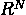，所有这些都是在希望在那个空间中可能有一种方法可以使用超平面来分离数据。这个更高维的空间被称为**特征空间**，我们将把将原始数据输入到特征空间的函数  称为**特征** **映射**。

例如，*图* *9.5a* 中的数据位于  维实数线上，但我们可以使用以下函数将其映射到  维平面：

|  = (x,x^{2}).") |
| --- |

正如我们在 *图* *9.5b* 中所看到的，这样做之后，有一个超平面可以完美地分离我们的数据集中的两个类别。

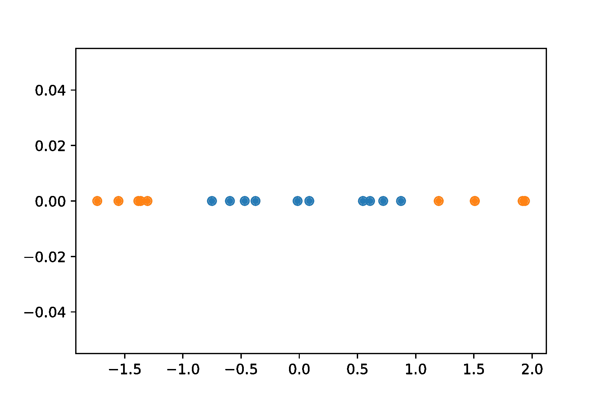

**(a)** 实数线上的原始数据

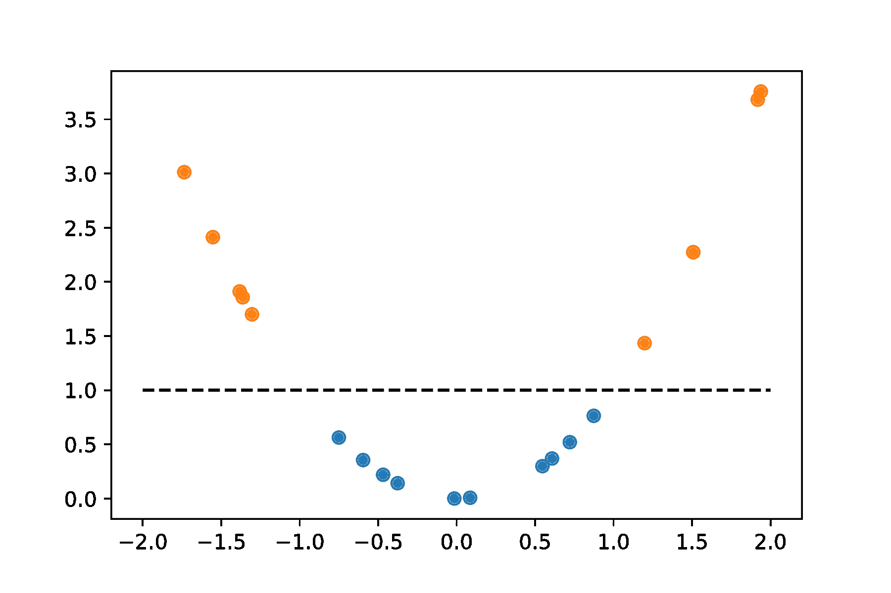

**(b)** 特征空间中的数据

**图 9.5**：原始数据无法通过超平面分离，但通过使用特征映射将其带到更高维的空间，它可以被分离。分离超平面用虚线表示

观察软间隔 SVM 优化问题的对偶形式，我们可以看到，为了在具有特征映射  的某个特征空间上训练 SVM——以及后来对新数据进行分类——我们只需要“知道”如何计算特征映射返回的元素在该特征空间中的标量积。这是因为，在整个训练过程中，唯一依赖于  点的操作是内积 ——或者当分类新点  时，内积 。如果我们不是有 ，而是有 "),我们只需要知道如何计算  \cdot \varphi({\overset{\rightarrow}{x}}_{k})")——或者  \cdot \varphi(\overset{\rightarrow}{x})")来对新数据 进行分类。

也就是说，我们只需要能够计算这个函数

|  = \varphi(\overset{\rightarrow}{x}) \cdot \varphi(\overset{\rightarrow}{y}),") |
| --- |

这就是我们在特征空间中需要执行的单个且唯一的计算。这是一个关键事实。这个函数是所谓的**核函数**的特例。广义而言，核函数是可以表示为某些空间中内积的函数。Mercer 定理（参见[2])从某些性质（如对称性以及一些其他条件）的角度给出了它们的一个很好的描述。在我们将要考虑的案例中，这些条件总是会被满足，所以我们不需要过于担心它们。

通过这一点，我们对支持向量机在一般情况下的应用，特别是在经典设置中的应用有了总体理解。我们现在已经具备了进入量子领域的所有必要背景知识。准备好去探索量子支持向量机。

# 9.2 进入量子领域

正如我们之前提到的，量子支持向量机是支持向量机的特例。更准确地说，它们是依赖于核技巧的支持向量机的特例。

在上一节中，我们已经看到，通过核技巧，我们将数据转换到特征空间：一个更高维的空间，我们希望在这个空间中，通过选择合适的特征图，数据可以被一个超平面分开。这个特征空间通常是普通的欧几里得空间，但，嗯，维度更高。但是，我们可以考虑其他选择。比如…量子态的空间？

## 9.2.1 量子支持向量机背后的通用思想

QSVM 的工作方式与依赖于核技巧的普通 SVM 相同——唯一的区别是它使用一个特定的量子态空间作为特征空间。

正如我们之前讨论的，每当使用核技巧时，我们只需要从特征空间中获得核函数。这是唯一涉及特征空间的成分，它是训练基于核的 SVM 并使用它进行预测所必需的。这个想法启发了某些工作，例如 Havlíček 等人著名的论文[52]，尝试使用量子电路来计算核函数，并希望通过在复杂的特征空间中工作获得一些优势。

考虑到这一点，为了训练并使用量子支持向量机进行分类，我们能够像往常一样进行操作——完全采用经典方式——除了核函数的计算。这个函数将必须依赖于量子计算机来完成以下工作：

1.  输入原始数据空间中的两个向量。

1.  通过**特征图**将它们映射到量子态。

1.  计算量子态的内积并返回它。

我们将在下一小节讨论如何实现这些（量子）特征图，但本质上，它们只是由原始（经典）数据参数化的电路，从而准备一个只依赖于该数据的量子态。现在，我们只需将这些特征图视为已知。

因此，假设我们有一个特征图 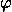。这将通过一个电路  来实现，它将依赖于原始空间中的某些经典数据：对于每个输入 ，我们将有一个电路 ")，使得特征图的输出将是量子态  = Φ(x→)|0⟩")。有了准备好的特征图，我们就可以选择我们的核函数了

|  = | <φ(a) | φ(b)> | ² = | <0 | Φ†(a)Φ(b) | 0> | ².") |
| --- | --- | --- | --- | --- | --- | --- | --- | --- | --- | --- | --- | --- | --- | --- |

这是我们可以从量子计算机中轻易得到的东西！正如你很容易自己检查的那样，这不过是准备状态 Φ(→b)|0⟩") 后测量所有零的概率。这源于计算基是正交归一的事实。

如果你想知道如何计算 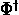 的电路，请注意，这仅仅是  的逆，因为量子电路总是由幺正操作表示的。但是  将由一系列量子门给出。所以你只需要从右到左应用电路中的门，并对每个门进行求逆。

这就是实现量子核函数的方法。你取一个特征映射，它将为任何输入  返回一个 ") 电路，你为要计算核的向量对准备状态 Φ(→b)|0⟩")，然后你返回测量所有量子位为零的概率。

顺便说一下，如果你担心的话，按照我们定义的，所有量子核都满足作为核函数所需的条件 [85]。事实上，我们现在要求你检查这些条件中的一个！

练习 9.2

函数  成为核的一个条件是它必须是对称的。证明任何量子核确实是对称的。(k(→a,→b) = k(→b,→a) = k(→b,→a)") 对于任何输入)。

让我们现在研究如何实际构建这些特征映射。

## 9.2.2 特征映射

正如我们所说的，特征图通常由一个参数化的电路 ") 定义，它依赖于原始数据，因此可以用来制备一个依赖于它的状态。在本节中，我们将研究一些有趣的特征图，这些特征图我们将贯穿整本书。它们也将作为例子，使我们能够更好地说明特征图实际上是什么。

**角度编码** 我们将从一个简单但强大的特征图开始，这个特征图被称为 **角度编码**。当应用于  量子比特电路时，这个特征图可以接受多达  个数值输入 。其电路的作用是在每个量子比特  上应用一个由 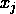 的值参数化的旋转门。在这个特征图中，我们使用  值作为旋转的角度，因此得名编码。

在角度编码中，我们可以自由地使用我们选择的任何旋转门。然而，如果我们使用 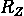 门，并将  作为我们的初始状态……那么我们的特征图的作用将没有任何效果，这可以从  的定义中轻松检查出来。这就是为什么，当使用  门时，通常会在它们之前使用作用于每个量子比特的哈达玛门。所有这些都在 *图* *9.6* 中展示。

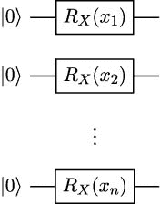

**图 9.6**：使用不同的旋转门对输入 ") 进行角度编码

输入到角度编码特征图中的变量应在一定区间内归一化。如果它们在  和  之间归一化，那么数据将被映射到特征空间的一个更宽的区域，例如，如果它们在  和  之间归一化。然而，这将以在特征图的作用下识别数据集的两个极值为代价。这是因为 0 和  是完全相同的角，在我们的旋转门定义中，我们将输入角除以 。

因此，归一化的选择将在特征空间中分离极值和在该空间中使用尽可能宽的区域之间进行权衡。

**振幅编码** 角度编码可以在  个量子比特上接受  个输入。这看起来足够好吗？好吧，准备好一个大跳跃。当在一个 -比特电路中实现时，**振幅编码** 特征图可以接受 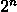 个输入。这很多，并且将使我们能够有效地在具有大量变量的数据集上训练 QSVM。那么，它是如何工作的呢？

如果振幅编码特征图被给定输入 , 它仅仅准备状态

| } \right\rangle = \frac{1}{\sqrt{\sum\limits_{k}x_{k}^{2}}}\sum\limits_{k = 0}^{2^{n} - 1}x_{k}\left&#124; k \right\rangle.") |
| --- |

注意我们是如何包括一个归一化因子以确保输出确实是一个量子态的。记得从*第* *1*，*量子计算基础*，所有量子态都需要是归一化向量！从定义中很容易看出，振幅编码可以适用于任何输入，除了零向量——对于零向量，振幅编码是未定义的。我们不能除以零！

将这个特征图用基本量子门实现绝非简单。如果你想了解所有细节，可以查阅 Schuld 和 Petruccione 的书籍[106]。幸运的是，它已经内置在大多数量子计算框架中。

顺便说一下，在使用振幅编码时，如果你决定“将特征图推到极限”，那么不可避免地会有信息损失。一般来说，你不会使用它提供的所有  个参数——你只会使用其中的一些，并将剩余的用零或任何其他你选择的价值填充。但是，如果你使用所有  个输入来编码变量，那么会有一个小问题：一个 -比特态的自由度实际上是 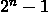，而不是 .无论如何，这都不是什么大问题。对于足够大的  值，这种信息损失可以忽略不计。

**ZZ 特征图**最后，我们将介绍一个已知的特征图，它可能会让你想起*第**5**章，*QAOA：量子近似优化*算法，在那里我们实现了具有项的哈密顿量电路。它被称为**ZZ 特征图**。它由 Qiskit 实现，可以在个量子比特上接受个输入，就像角度嵌入一样。其参数化电路是按照以下步骤构建的：

1.  在每个量子比特上应用一个哈达玛门。

1.  在每个量子比特上应用旋转").

1.  对于每个元素对，其中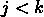，执行以下操作：

    1.  在量子比特上应用一个 CNOT 门，由量子比特控制。

    1.  在量子比特上应用旋转(\pi - x_{k})} \right)").

    1.  重复步骤 3a。

在**图***9.7*中，你可以找到三个量子比特上的 ZZ 特征图的表示。

与角度编码一样，归一化在 ZZ 特征图中起着重要作用。为了保证在分离数据集的极值和尽可能在特征空间中使用大区域之间保持健康平衡，变量可以被归一化到或，例如。

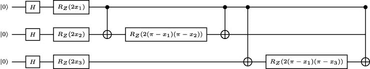

**图 9.7**：三个量子比特上的 ZZ 特征图，输入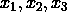

当然，在设计量子特征图时，你的想象力是唯一的限制。我们在这里展示的是一些最受欢迎的——你将在 PennyLane 和 Qiskit 等框架中找到的——但量子特征图及其性质的研究是一个活跃的领域。如果你想看看其他可能性，我们可以推荐 Sim、Johnson 和 Aspuru-Guzik 的论文[88]。

但现在就足够理论了！让我们通过实现一些使用 PennyLane 和 Qiskit 的 QSVM 来将我们所学付诸实践。

# 9.3 PennyLane 中的量子支持向量机

这已经是一条漫长的旅程，但最终，我们准备好看到 QSVMs 的实际应用了。在本节中，我们将使用 PennyLane 训练和运行一系列 QSVM 模型。为了开始，让我们导入 NumPy 并设置一个种子，以确保我们的结果是可复制的：

```py

import numpy as np 

seed = 1234 

np.random.seed(seed)

```

## 9.3.1 为训练 QSVM 设置场景

现在，如果我们想训练 QSVMs，我们需要一些数据来工作。在当今不断变化的就业市场中，你应该始终保持开放的选择，尽管量子机器学习前景广阔，你可能还想有一个备选的职业计划。好吧，我们已经为你准备好了。你有没有想过成为一名世界级的品酒师？今天是你幸运的一天！（我们当然是在开玩笑，但我们将使用这个葡萄酒主题来为我们的示例增添一些风味！）

我们已经看到 scikit-learn 包为机器学习提供了大量的工具和资源。结果证明，其中包含一组预定义的数据集，这些数据集可以用于训练机器学习模型，其中之一就是“葡萄酒识别数据集”[32]。这是一个带有葡萄酒信息的标记数据集。总共有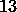个数值变量描述了颜色强度、酒精浓度以及其他我们一无所知含义和重要性的复杂事物。标签对应着葡萄酒的种类。有三个可能的标签，所以如果我们忽略其中一个，我们就会剩下一个非常适合二元分类问题的美好数据集。

我们可以使用`sklearn.datasets`中的`load_wine`函数来加载这个集合，如下所示：

```py

from sklearn.datasets import load_wine 

x,y = load_wine(return_X_y = True)

```

我们已经将`return_X_y`设置为 true，这样我们也会得到标签。

你可以在其在线文档中找到关于这个数据集的所有详细信息（[`scikit-learn.org/stable/datasets/toy_dataset.html#wine-dataset`](https://scikit-learn.org/stable/datasets/toy_dataset.html#wine-dataset) 或 [`archive.ics.uci.edu/ml/datasets/Wine`](https://archive.ics.uci.edu/ml/datasets/Wine)，如果你想检查数据的原始来源）。根据它，数据集中的前个元素必须属于第一个类别（标签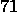个元素必须属于第二个类别（标签

```

我们不会进行直接模型比较，也不会使用验证损失，因此我们不会使用验证数据集。

正如我们之前讨论的，大多数特征图都期望我们的数据是归一化的，而且，不管怎样，在机器学习中归一化你的数据通常是一个好的实践。所以这就是我们现在要做的！我们将实际上使用最简单的归一化技术：线性缩放每个变量，使得每个变量的最大绝对值取值为。这可以通过`sklearn``.``preprocessing`中的`MaxAbsScaler`对象来实现，如下所示：

```py

from sklearn.preprocessing import MaxAbsScaler 

scaler = MaxAbsScaler() 

x_tr = scaler.fit_transform(x_tr)

```

有了这个，我们知道——由于所有我们的变量都是正的——训练数据集中的所有值将在和之间。如果有负值，我们的缩放变量将取值在之间。请注意，我们只归一化了训练数据集。同时归一化整个数据集在某种程度上是作弊，因为我们可能会用测试数据集的信息污染训练数据集。例如，如果测试数据集中有一个异常值，某个变量的值非常高——这是训练数据集中从未达到的值——这将在归一化中反映出来，从而可能损害测试数据集的独立性。

现在训练数据集已经归一化，我们需要使用与训练数据集相同的比例来归一化测试数据集。这样，训练数据集就不会收到关于测试数据集的信息。这可以通过以下代码片段实现：

```py

x_test = scaler.transform(x_test) 

x_test = np.clip(x_test,0,1)

```

注意我们如何使用与之前相同的 `scaler` 对象，但我们调用的是 `transform` 方法而不是 `fit_transform`。这样，scaler 使用它之前保存的比例。此外，我们还运行了一个指令来“切割”测试数据集中的值在  和  之间——以防有异常值，并且为了符合我们将使用的某些特征图的归一化要求。

## 9.3.2 PennyLane 和 scikit-learn 的第一次约会

我们已经无数次地说过：QSVMs 就像正常的 SVMs，但有一个量子核。所以让我们用 PennyLane 实现这个核。

我们的数据集有  个变量。在  个变量上使用角度编码或 ZZ 特征图将需要我们使用  个量子比特，如果我们想在一些不太强大的计算机上模拟我们的核，这可能不可行。因此，我们可以求助于使用  个量子比特的振幅编码。正如我们之前提到的，这个特征图可以接受多达 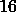 个输入；我们将用零填充剩余的输入——PennyLane 会使这变得容易。

这就是我们实现量子核的方法：

```py

import pennylane as qml 

nqubits = 4 

dev = qml.device("lightning.qubit", wires = nqubits) 

@qml.qnode(dev) 

def kernel_circ(a, b): 

    qml.AmplitudeEmbedding( 

        a, wires=range(nqubits), pad_with=0, normalize=True) 

    qml.adjoint(qml.AmplitudeEmbedding( 

        b, wires=range(nqubits), pad_with=0, normalize=True)) 

    return qml.probs(wires = range(nqubits))

```

现在，这里有几个要点需要消化。我们首先导入 PennyLane，设置一个变量中的量子比特数量，并定义一个设备；没有什么新东西。然后是定义我们的核电路。在这个定义中，我们使用了 `AmplitudeEmbedding`，它返回一个与其第一个参数等价的操作。在我们的情况下，我们使用数组 `a` 和 `b` 作为这个第一个参数。它们是我们核函数作为输入接受的经典数据。除此之外，我们还要求 `AmplitudeEmbedding` 为我们归一化每个输入向量，就像振幅编码需要我们做的那样，并且，由于我们的数组有  个元素而不是所需的 ，我们将 `pad_with` 设置为 `0` 以用零填充剩余的值。此外，请注意，我们正在使用 `qml``.``adjoint` 来计算 `b` 的振幅编码的伴随（或逆）。

最后，我们检索一个包含测量计算基中每个可能状态的概率的数组。这个数组的第一元素（即所有量子比特得到零值的概率）将是我们的核的输出。

现在我们几乎准备好了量子核。如果你想要检查电路是否按预期工作，你可以在训练数据集的一些元素上尝试它。例如，你可以运行 `kernel_circ``(``x_tr``[0], ` `x_tr``[1])`。如果两个参数相同，请记住，你应该总是得到  在返回数组的第一条记录中（正如我们提到的，这对应于核的输出）。

练习 9.3

证明，确实，任何在两个相同条目上评估的量子核总是需要返回的输出。

我们下一步将使用这个量子核在 SVM 中。我们熟悉的 scikit-learn 有它自己的支持向量机实现，即`SVC`，并且它支持自定义核，所以这就解决了！为了使用自定义核，你需要提供一个接受两个数组`A`和`B`并返回一个矩阵的`kernel`函数，该矩阵的条目为")，包含对`A[j]`和`B[k]`应用核的结果。一旦核准备好了，就可以使用`fit`方法训练 SVM。所有这些都在以下代码片段中完成：

```py

from sklearn.svm import SVC 

def qkernel(A, B): 

    return np.array([[kernel_circ(a, b)[0] for b in B] for a in A]) 

svm = SVC(kernel = qkernel).fit(x_tr, y_tr)

```

训练可能需要几分钟，具体取决于你电脑的性能。一旦完成，你可以使用以下说明检查你训练的模型的准确率：

```py

from sklearn.metrics import accuracy_score 

print(accuracy_score(svm.predict(x_test), y_test))

```

在我们的情况下，这给出了的准确率，这意味着支持向量机（SVM）能够正确地分类测试数据集中的大部分元素。

这展示了如何以相当简单的方式训练和运行量子支持向量机。但我们可以考虑更复杂的情况。你准备好了吗？

## 9.3.3 降低数据集的维度

我们刚刚看到了如何使用振幅编码充分利用数据集的个变量，同时只使用个量子位。在大多数情况下，这是一个好的方法。但也有一些问题，在这些问题中，减少数据集中的变量数量可能证明更好——当然是在尽量减少信息损失的同时——从而能够使用可能产生更好结果的其它特征映射。

在本小节中，我们将展示这种方法。我们将尝试将数据集中的变量数量减少到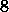，然后，我们将使用角度编码在这些新的、减少的变量上训练一个 QSVM。

如果你想在最小化信息损失的同时降低数据集的维度，正如我们现在要做的，有许多选项可供选择。例如，你可能想看看自动编码器。无论如何，为了本节的目的，我们将考虑一种称为**主成分分析**的技术。

要了解更多…

在实际使用主成分分析之前，你可能合理地好奇这个听起来很高级的技术是如何工作的。

当你有一个包含个变量的数据集时，你本质上有一个中的点集。有了这个集合，你可以考虑所谓的**主****方向**。第一个主方向是最佳拟合数据的线的方向，按均方误差来衡量。第二个主方向是最佳拟合数据的线的方向，同时与第一个主方向正交。这样一直进行下去，-th 主方向是最佳拟合数据的线的方向，同时与第一个、第二个，一直到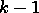-th 主方向正交。

因此，我们可以考虑一个的正交基，其中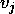指向第个主成分的方向。这个正交基中的向量将具有形式 \in R^{n}")。当然，上标不是指数！它们只是上标。

在使用主成分分析时，我们只需计算上述基的向量。然后，我们定义变量

|  |
| --- |

最后，为了将我们的数据集维度降低到个变量，我们只需保留变量。这一切都是在假设变量按照我们定义的顺序，按问题相关性的递减顺序排序的情况下进行的。

那么，我们如何使用主成分分析来减少数据集中变量的数量呢？嗯，scikit-learn 就在这里拯救了这一天。它实现了一个`PCA`类，其工作方式与我们之前使用的`MaxAbsScaler`类类似。

这个`PCA`类包含一个`fit`方法，它分析数据并找出使用主成分分析降低其维度的最佳方式。然后，此外，它还包含一个`transform`方法，可以在调用`fit`时以学习到的方式进行数据转换。同样，就像`MaxAbsScaler`一样，`PCA`类还有一个`fit_transform`方法，它可以同时拟合和转换数据：

```py

from sklearn.decomposition import PCA 

pca = PCA(n_components = 8) 

xs_tr = pca.fit_transform(x_tr) 

xs_test = pca.transform(x_test)

```

通过这种方式，我们实际上已经将数据集中的变量数量减少到了 。顺便说一下，注意我们是如何在训练数据上使用 `fit_transform` 方法，在测试数据上使用 `transform` 方法，所有这些都是为了保持测试数据集的独立性。

现在我们已经准备好使用角度编码来实现和训练一个 QSVM。为此，我们可以使用 PennyLane 提供的 `AngleEmbedding` 操作符。以下代码块定义了训练过程；它与我们的先前内核定义非常相似，因此相当直观：

```py

nqubits = 8 

dev = qml.device("lightning.qubit", wires=nqubits) 

@qml.qnode(dev) 

def kernel_circ(a, b): 

    qml.AngleEmbedding(a, wires=range(nqubits)) 

    qml.adjoint(qml.AngleEmbedding(b, wires=range(nqubits))) 

    return qml.probs(wires = range(nqubits))

```

一旦我们有一个内核，我们就可以像之前一样训练一个 QSVM，这次重新使用 `qkernel` 函数，它将使用新的 `kernel_circ` 定义：

```py

svm = SVC(kernel = qkernel).fit(xs_tr, y_tr) 

print(accuracy_score(svm.predict(xs_test), y_test))

```

测试数据集上的返回准确率是 。在这种情况下，分类完美无缺。

## 9.3.4 实现和使用自定义特征映射

PennyLane 随带了许多内置的特征映射；你可以在在线文档中找到它们全部（[`pennylane.readthedocs.io/en/stable/introduction/templates.html`](https://pennylane.readthedocs.io/en/stable/introduction/templates.html)）。尽管如此，你可能想定义自己的。在本节中，我们将使用我们自己的 ZZ 特征映射实现来在缩减数据集上训练 QSVM。让我们自己动手处理特征映射吧！

我们可以从实现以下代码块中的函数作为特征映射开始：

```py

from itertools import combinations 

def ZZFeatureMap(nqubits, data): 

    # Number of variables that we will load: 

    # could be smaller than the number of qubits. 

    nload = min(len(data), nqubits) 

    for i in range(nload): 

        qml.Hadamard(i) 

        qml.RZ(2.0 * data[i], wires = i) 

    for pair in list(combinations(range(nload), 2)): 

        q0 = pair[0] 

        q1 = pair[1] 

        qml.CZ(wires = [q0, q1]) 

        qml.RZ(2.0 * (np.pi - data[q0]) * 

            (np.pi - data[q1]), wires = q1) 

        qml.CZ(wires = [q0, q1])

```

在这个实现中，我们使用了 `itertools` 模块中的 `combinations` 函数。它接受两个参数：一个数组 `arr` 和一个整数 `l`。它返回一个数组，包含所有长度为 `l` 的、由数组 `arr` 中的元素组成的排序元组。

注意我们是如何编写 `ZZFeatureMap` 函数的，就像编写任何电路一样，充分利用了 PennyLane 给我们的所有灵活性。定义了这个 ZZ 特征映射函数之后，我们可以在内核函数中使用它，然后像之前一样训练一个 QSVM：

```py

nqubits = 4 

dev = qml.device("lightning.qubit", wires = nqubits) 

@qml.qnode(dev) 

def kernel_circ(a, b): 

    ZZFeatureMap(nqubits, a) 

    qml.adjoint(ZZFeatureMap)(nqubits, b) 

    return qml.probs(wires = range(nqubits)) 

svm = SVC(kernel=qkernel).fit(xs_tr, y_tr) 

print(accuracy_score(svm.predict(xs_test), y_test))

```

在这种情况下，测试准确率是 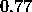。

这里有一个细节需要注意，那就是 `qml``.``adjoint` 是作用于 `ZZFeatureMap` 函数本身，而不是其输出！记住，取电路的伴随矩阵等同于考虑该电路的逆。

关于 PennyLane 中的 QSVM，我们已经介绍完毕。现在是我们看看 Qiskit 领域是如何操作的时候了。

# 9.4 Qiskit 中的量子支持向量机

在上一节中，我们掌握了在 PennyLane 中使用 QSVM 的方法。你可能想回顾 *子节* *9.3.1* 和 *子节* *9.3.3* 的开头。那里我们准备了我们将在这里使用的数据集。除了运行那些子节中的代码外，你还需要执行以下导入：

```py

from sklearn.metrics import accuracy_score

```

现在是我们切换到 Qiskit 的时候了。在某些方面，Qiskit 可能比 PennyLane 更容易使用——尽管这可能是个人口味的问题。此外，Qiskit 将使我们能够直接使用 IBM Quantum 提供的真实量子计算机训练和运行我们的 QSVM 模型。尽管如此，现在让我们从我们心爱的 Qiskit Aer 模拟器上的 QSVM 开始。

## 9.4.1 Qiskit Aer 上的 QSVM

为了开始，让我们只导入 Qiskit：

```py

from qiskit import *

```

当我们在 PennyLane 中定义 QSVM 时，我们必须“手动”实现一个核函数，以便将其传递给 scikit-learn。在 Qiskit 中，这个过程简化了，定义量子核只需要实例化一个`QuantumKernel`对象。在初始化器中，我们被要求提供一个`backend`参数，这当然将是量子核将要运行的底层对象。默认情况下，量子核将使用的特征图是具有两个量子比特的 ZZ 特征图，但我们可以通过传递一个值给`feature_map`对象来使用不同的特征图。这个值应该是一个表示特征图的参数化电路。

在 Qiskit 中定义参数化电路实际上相当简单。如果你想在电路中使用单个参数，你只需从`qiskit``.``circuit`导入`Parameter`即可。你可以定义一个参数对象为`Parameter``(``"``label``"``)`，使用你选择的任何标签。这个对象然后可以在量子电路中使用。例如，我们可能定义一个通过旋转参数化的电路，如下所示：

```py

from qiskit.circuit import Parameter 

parameter = Parameter("x") 

qc = QuantumCircuit(1) 

qc.rx(parameter, 0)

```

如果你想在电路中使用参数数组，你可以定义一个`ParameterVector`对象。它也可以从`qiskit``.``circuit`导入，除了必须的标签外，它还接受一个可选的`length`参数，用于设置数组的长度。默认情况下，这个长度设置为零。我们可以像以下示例中使用这些参数向量对象：

```py

from qiskit.circuit import ParameterVector 

parameter = ParameterVector("x", length = 2) 

qc = QuantumCircuit(2) 

qc.rx(parameter[0], 0) 

qc.rx(parameter[1], 1)

```

练习 9.4

定义一个`AngleEncodingX``(``n` `)`函数，该函数使用旋转在`n`个量子比特上对角度进行编码的特征图。

使用参数化电路，我们可以为量子核定义任何我们选择的特征图；例如，我们只需将之前代码片段中创建的任何`qc`对象作为`feature_map`参数传递给`QuantumKernel`构造函数。尽管如此，Qiskit 已经自带了一些预定义的特征图。对于我们的情况，我们可以使用以下代码生成一个在八个量子比特上的 ZZ 特征图的电路：

```py

from qiskit.circuit.library import ZZFeatureMap 

zzfm = ZZFeatureMap(8)

```

实际上，这个特征图可以通过提供额外的参数进一步定制。我们将在下一章中使用它们。

一旦我们有了特征图，我们就可以简单地设置一个依赖于 Aer 模拟器的量子核，如下所示：

```py

from qiskit_machine_learning.kernels import QuantumKernel 

from qiskit.providers.aer import AerSimulator 

qkernel = QuantumKernel(feature_map = zzfm, 

            quantum_instance = AerSimulator())

```

这就是全部！顺便说一句，我们在这里使用的是 Qiskit 机器学习包。请参阅*附录**D**，安装工具*，以获取安装说明。

如果我们想使用我们刚刚创建的核来训练 QSVM 模型，我们可以使用 Qiskit 对 scikit-learn 提供的 SVC 类的扩展。它被称为`QSVC`，可以从`quantum_machine_learning``.``algorithms`导入。它的工作方式与原始的`SVC`类相同，但它接受一个`quantum_kernel`参数，我们可以传递`QuantumKernel`对象。

因此，这些是我们必须运行以训练带有我们核的 QSVM 的指令：

```py

from qiskit_machine_learning.algorithms import QSVC 

qsvm = QSVC(quantum_kernel = qkernel) 

qsvm.fit(xs_tr, y_tr)

```

与 PennyLane 一样，这需要几分钟的时间来运行。顺便说一下，请注意，我们使用了减少的数据集（`xs_tr`），因为我们正在使用 8 个量子比特的 ZZ 特征图。

一旦训练完成，我们就可以像往常一样在测试数据集上获得准确率：

```py

print(accuracy_score(qsvm.predict(xs_test), y_test))

```

在这种情况下，返回的准确率是。

这就是您需要了解的所有关于如何在 Aer 模拟器上运行 QSVM 的信息。现在，让我们来点实际的。

## 9.4.2 IBM 量子计算机上的 QSVM

使用 Qiskit 在真实硬件上训练和使用 QSVM 非常简单。我们将在本小节中展示如何做到这一点。

首先，正如我们在*第二章**2*，*量子计算中的工具*中做的那样，我们将加载我们的 IBM 量子账户：

```py

provider = IBMQ.load_account()

```

自然地，为了使这可行，你应该事先保存了你的访问令牌。在撰写本文时，免费账户无法访问任何具有八个量子比特的真实量子设备，但有一些具有七个量子比特。我们可以使用以下代码选择最不繁忙的一个：

```py

from qiskit.providers.ibmq import * 

dev_list = provider.backends( 

    filters = lambda x: x.configuration().n_qubits >= 7, 

    simulator = False) 

dev = least_busy(dev_list)

```

当然，我们不得不进一步将我们的数据减少到七个变量，但这很容易做到：

```py

from sklearn.decomposition import PCA 

pca = PCA(n_components = 7) 

xss_tr = pca.fit_transform(x_tr) 

xss_test = pca.transform(x_test)

```

然后，有了这些，我们就准备好了所有必要的成分来在真实硬件上训练 QSVM！我们不得不遵循与之前相同的步骤——只是这次我们将在量子核的实例化中使用我们的真实设备作为`quantum_instance`！

```py

zzfm = ZZFeatureMap(7) 

qkernel = QuantumKernel(feature_map = zzfm, quantum_instance = dev) 

qsvm = QSVC(quantum_kernel = qkernel) 

qsvm.fit(xss_tr, y_tr)

```

当你执行这段代码时，所有电路参数都是预先知道的。因此，Qiskit 会尝试同时发送尽可能多的电路。然而，这些作业仍然需要排队等待。根据你的数据集中的点数和你的访问权限，这可能需要相当长的时间才能完成！

这样，我们就可以结束在 Qiskit 中对 QSVM 的研究。

# 摘要

在本章中，我们首先学习了什么是支持向量机，以及它们如何被训练来解决二元分类问题。我们首先考虑了普通向量机，然后介绍了核技巧——这开辟了一个全新的世界！特别是，我们看到了 QSVM 实际上只是一个带有量子核的支持向量机。

从那时起，我们学习了量子核实际上是如何工作的，以及如何实现它们。我们探讨了特征映射的关键作用，并讨论了几种最著名的映射。

最后，我们学习了如何使用 PennyLane 和 Qiskit 实现、训练和使用量子支持向量机。此外，得益于 Qiskit 与 IBM Quantum 的接口，我们能够非常容易地在真实硬件上运行 QSVMs。

如此一来，QSVMs 如何帮助你像专家一样识别葡萄酒——或者解决任何其他分类任务——就基本涵盖了，同时愉快地忽略葡萄酒的“灰分碱性”是什么。谁知道呢？也许这些 SVM 模型能为你开启享受波西米亚式葡萄酒品鉴生活的大门！无需感谢我们。

在下一章中，我们将考虑另一类量子机器学习模型：量子神经网络。事情即将变得复杂！*
