# 附录 C

计算复杂性

*算法是对无限多个问题的有限回答*

— 斯蒂芬·克莱尼

计算复杂性理论是理论计算机科学的一个分支，它关注于量化算法解决问题所需的资源。它提出的问题包括“需要多少时间来乘以两个位整数？”、“解决一个问题是否需要比检查其解决方案更多的内存空间？”或者“随机性在计算任务中是否有用？”。

在本节对计算复杂性的简要介绍中，我们将主要关注涉及估计解决某些问题所需时间的概念。对于这个主题和其他主题（包括空间或内存复杂性、计算中的随机性作用、近似算法和其他高级问题）的深入探讨，您可以查阅标准计算复杂性书籍，如 Sipser [90]、Papadimitriou [74] 或 Arora 和 Barak [8] 的著作。

为了研究计算复杂性理论中提出的问题，我们首先需要引入一个计算模型，该模型允许我们测量计算时间、内存和其他资源。通常的选择是**图灵机**。本书的范围不包括对图灵机进行数学定义（有关详情，请参阅前一段中引用的书籍），但至少让我们给出一个非正式的描述，以便您了解我们如何使用它们来模拟计算任务以及如何测量使用它们解决问题所涉及的资源。请注意，不同的教科书对图灵机的定义略有不同，但可以很容易地证明它们在能力上是等效的。

# C.1 关于图灵机的几点说明

图灵机是一种（理论上的）设备，它有一个（可能无限大的）**带子**，带子被分成**单元格**。这些单元格中的每一个都可以存储来自有限且固定数量的可能性的符号（通常，、以及一个表示空单元格的“空白”符号）。机器还有一个**头**，在任何给定时刻，它正在扫描带子上的一个单元格。此外，机器在计算过程中的任何一步都处于一个**状态**（也是从有限数量的固定选项中选择的一个状态）。

机器有一系列指令，这些指令根据机器的状态和头正在扫描的单元格的内容，告诉机器接下来应该做什么。这可能包括改变机器状态，在正在扫描的单元格上写上不同的符号，并将头移动一个单元格到左边或右边。例如，这样的指令可能包括“如果状态是 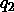 并且正在读取的符号是 ，则将状态改为 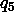，将符号改为 ，并保持在同一单元格”，而另一个可能包括“如果状态是 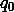 并且符号是 ，则将状态改为 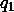，符号保持不变，并将头向右移动一个单元格。”

重要提示

图灵机是一种（理论上的）设备，它有一个无限长的带子，带子被分成单元格，并且有一个头扫描这些单元格中的一个。在任何给定时刻，机器处于有限数量的内部状态之一。机器的指令根据机器状态和头正在扫描的单元格的内容指定下一个状态、单元格的新内容以及机器的动作（例如，向左移动、向右移动或保持不动）。

为了执行计算，输入作为带子上有限符号的字符串给出（其余部分留空）。然后，图灵机按照以下方式操作：它从一个预定义的初始状态开始，并且头扫描输入的第一个符号；然后，它根据其指令在离散步骤中改变其状态、带子内容和头位置。最终，机器可以停止，因为它达到了一个预定义的、停止状态。如果机器停止，计算的输出是带子上写下的符号字符串。

要了解更多信息…

并不能保证图灵机对所有输入都会停止。实际上，可以证明，确定一个图灵机是否最终会停止给定输入（通常称为**停机问题**）以一种非常精确的方式是不可解的：没有算法可以为每个可能的图灵机和每个可能的输入给出正确答案。请参阅 Sipser 的书籍[90]以了解这一惊人事实的证明。

图灵机可能看起来太简单了，但可以证明，任何可以用任何其他合理计算模型完成的计算也可以用图灵机完成（可能有一些减速）。例如，可以相当直接地证明，如果我们通过给图灵机添加多个磁带（**多带图灵机**）或非确定性地选择相同状态-符号情况下的几个指令的可能性（**非确定性图灵机**）来扩展图灵机，新设备并不比我们原始的单带确定性图灵机更强大（再次，请参阅 Sipser 的书籍[90]以获取所有详细信息）。如果我们考虑更接近现代计算机实际架构的模型，例如**随机访问机**模型（参见 Savage 的书籍中的第 3.4 节[84]），或者基于常见编程语言的模型，如**while 程序**（参见 Kfoury、Moll 和 Arbib 的书籍[58]），情况也是如此。

这导致了坚定的信念，即图灵机确实形式上捕捉了算法的非正式概念。这个事实通常被称为**丘奇-图灵论题**。

# C.2 计算时间测量

我们可以说，丘奇-图灵论题只是简单地陈述，如果你只对确定哪些任务可以通过算法解决以及哪些不能解决感兴趣，你只需使用大量等效模型中的任何一个：单带图灵机、多带图灵机、非确定性图灵机、随机访问机、while 程序，以及许多其他模型。每个模型都会给你带来完全相同的能力。

但要小心！如果你关心执行计算所需的资源（这正是计算复杂性的全部内容），那么模型的选择可能很重要。因此，现在让我们固定单带图灵机（我们在上一节中非正式地描述过的那些）作为我们的计算模型。这样，我们可以很容易地测量使用这些图灵机之一完成特定计算所需的时间，即它必须完成它的步骤数。

这对于具有特定输入的固定图灵机效果很好，但我们通常更感兴趣的是分析运行时间如何随着输入大小的增长而增长，而不是寻找具体问题实例的具体运行时间值。例如，我们可能想知道，对于某个任务所需的时间增长是否如此之快，以至于当输入大小适中时，解决问题变得不可行。

因此，我们将图灵机的运行时间定义为输入长度的函数，而不是特定输入的函数。也就是说，图灵机  的运行时间是一个函数 ，它接受一个非负整数  作为输入，并在停止之前返回  在  位输入  上执行的最大步数。请注意，这是一个最坏情况的定义：它是基于需要最多时间处理的字符串来定义的。还要注意，如果一个机器对于某些输入不会停止，那么这些长度的输入的运行时间将是无限的。这对我们来说不是问题，因为我们只会考虑总是停止的机器。

重要注意事项

图灵机  的运行时间是一个函数 ，其中 ") 是  在给定长度为  的输入时执行的最大步数。

对于其他计算模型，运行时间可以以类似的方式定义。例如，对于多带图灵机，运行时间再次被测量为在大小为  的输入上执行的最大步数。对于使用理想化编程语言（例如 while-Programs 模型）或抽象架构（例如随机访问机器模型）的计算模型，运行时间可以定义为在大小为  的输入上执行的最大基本指令（将变量设置为 0，增加变量，比较两个变量的值...）。

# C.3 渐近复杂度

为了比较不同图灵机相关的不同运行时间，进行一些简化是方便的。我们通常不关心一个图灵机的运行时间是否正好是  = 4321n^{2} + 784n + 142") 或者，更确切地说， = n^{3} + 3n^{2} + 5n + 3")。实际上，我们更感兴趣的是 ") 是否大致像 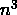 或者像 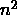 增长，因为这表明了质的差异：对于足够大的  值，任何三次多项式都比任何二次多项式增长得更快。在计算复杂度理论的背景下，我们总是更倾向于 ") 以  的速度增长，而不是以  的速度增长，因为它的行为对于大输入（即其渐近增长）更好。

这个直观的想法被著名的 **大 O 符号** 所捕捉。给定两个时间函数 ") 和 "), 我们说 ") 是 )")（并且我们读作“") 是 ") 的大 O”）如果存在一个整数常数 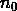 和一个实数常数 ，使得对于所有 ，它都成立。

 \leq CT_{2}(n).")

例如，你可以检查 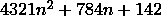 是 ").

这个定义背后的主要思想是，如果 ") 是 )")，那么 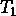 的增长不会比 ") 差。例如，很容易证明当  时，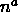 是 ")，并且对于任何 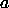， 是 ")。但是，另一方面， 不是 ")， 也不是 ")。参见 *图* * *C.1* 以了解线性、二次、三次和指数函数的增长示例。注意指数函数最终如何支配所有其他函数，尽管其系数为 。

*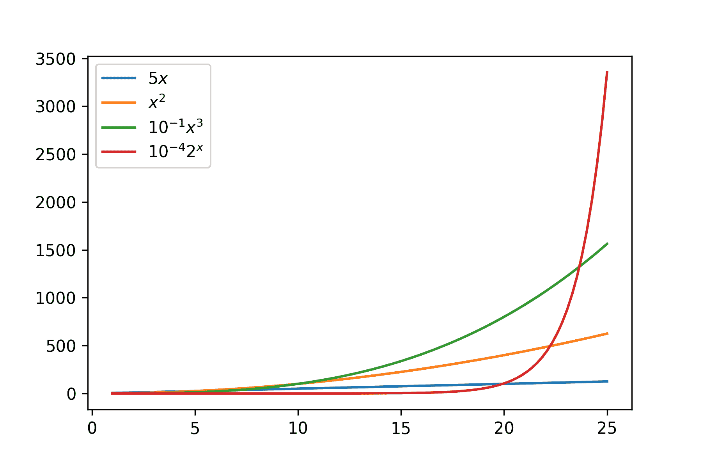

**图 C.1**：线性、二次、三次和指数函数的增长

重要提示

给定两个非负函数 ") 和 "), 我们说 ") 是 )")，如果存在  和  使得

 \leq CT_{2}(n)")

对于每个 。

大 O 符号对于估计运行时间的行为非常有用，而无需关注小而繁琐的细节。如果图灵机的运行时间是 ，我们只需说它是 ")，并忘记时间函数中的特定系数。这也是为什么我们可以抽象地思考步骤的数量，而不是例如毫秒。每个步骤所花费的特定时间是一个常数，将被“吸收”到大 O 符号中。

然而，这也有代价。例如，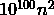这样的运行时间当然是")。但除非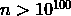，这在实际情况下永远不会发生，因为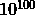远远大于可见宇宙中的原子数量。所以请明智地使用这个符号：大 O 意味着大责任。

# C.4 P 和 NP

正如我们在附录开头提到的，计算复杂性理论研究用算法解决问题所需资源量。到目前为止，我们关注的是如何借助图灵机来数学上定义算法的概念，以及如何测量使用它们进行计算所需的时间。现在，我们将注意力转向定义计算问题和根据它们被解决所需的时间对它们进行分类。也就是说，我们将从它们固有的复杂性来思考，而不是从特定的算法来思考。

在计算复杂性理论中，一个**问题**由需要返回输出值的无穷多个实例或输入组成。例如，我们可能被给出两个自然数并要求计算它们的乘积。或者我们可能被给出一个图并要求检查它是否有哈密顿路径。在这两种情况下，可能的输入数量是无限的，并且与每个这样的输入相关联都有一个定义良好的输出或答案。

问题实例通常以某种方式编码为二进制字符串。例如，我们可以用其二进制展开式来表示一个自然数，或者用一个图及其邻接矩阵的行（连接）来表示一个图。同样，输出也可以用二进制字符串表示。因此，一个问题可以用一个函数来识别，该函数以二进制字符串作为输入并返回二进制字符串作为输出。但图灵机正是这样做的：它接收二进制字符串作为输入并返回二进制字符串作为输出。这使得我们可以研究哪些问题可以用图灵机解决以及解决它们需要多少时间。

在计算复杂性理论中，我们可以考虑的最简单的问题类别是**决策问题**，其输出是一个单一的比特（我们通常将与“真”相对应，将与“假”相对应）。决策问题的例子包括确定一个自然数是否为素数，确定一个图是否具有哈密顿路径，以及确定图灵机是否对所有输入都停止。

我们说一个图灵机是某个决策问题的**决定器**，如果给定一个表示问题实例的二进制字符串作为输入，它最终会停止并返回该实例的正确输出（ 或 ）。在这种情况下，我们也说图灵机**解决**或**决定**了该问题。存在决定器可以解决确定一个数是否为素数和确定一个图是否具有哈密顿路径的问题，但不存在决定器可以解决确定图灵机对所有输入都停止的问题（这是之前提到的停机问题不可解性的一个后果）。

一旦我们知道一个问题有一个决定器，我们就可以通过考虑决定器使用的资源来进一步细化其分类。这导致了著名的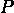（代表“多项式时间”）类的定义。我们说一个决策问题属于，如果存在一个决定的图灵机，它在多项式时间内运行。也就是说，存在一个图灵机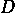可以决定，并且其运行时间")对于某个非负整数是")。请注意，对于一个问题来说，要属于类，找到其中一个多项式时间的决定器就足够了。然而，为了证明一个决策问题不属于，我们需要证明没有任何运行在多项式时间内的图灵机能够决定。这通常要难得多。

例如，Agrawal、Kayal 和 Saxen [5] 提出的一个著名结果表明，确定一个自然数是否为素数的问题确实属于  类。 类中的其他，更简单的问题示例包括检查一个数是否为完全平方数或检查一个二进制字符串是否为回文（即从左到右和从右到左读都一样）。然而，对于确定一个图是否有哈密顿路径的问题，我们不知道它是否属于  类。我们非常坚信它不属于  类，但尽管数千名数学家在几十年的时间里付出了最大的努力，我们仍然无法证明这一点。

重要提示

我们将  定义为可以用图灵机在多项式时间内解决的问题的决策问题类。

实际上， 类有几个有趣的原因。首先，它非常稳健。我们是用单带图灵机所需的计算时间来定义它的。然而，如果我们选择了另一个计算模型，例如，多带图灵机，那么我们会得到完全相同的问题集合。这是因为可以用单带图灵机模拟多带图灵机，只需在运行时间上增加多项式开销。对于任何其他合理的（经典）计算模型也是如此，因此，尽管特定的运行时间可能因模型而异（例如，单带图灵机上的 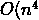) 和 -带图灵机上的 ")），一个将是多项式时间，当且仅当另一个是。

更重要的是， 类似乎很好地捕捉了问题可高效求解的概念。诚然，在  类中，我们允许运行时间如 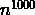，这几乎不能被认为是高效的。然而，我们可以证明属于  类的自然发生问题的运行时间通常要温和得多，例如 ") 或 ")。此外，如果一个决策问题不属于  类，那么其任何决策器的运行时间将比任何多项式增长得更快（至少，对于无限多个输入）。这是我们明确归类为完全不高效的事情。

计算复杂性中的另一个核心问题类是 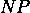。它同样是一个决策问题类。但在这个情况下，定义属性不是我们能否高效地解决它们（如  的情况），而是我们能否用高效的算法检查它们的解。为了使这个想法形式化，我们说，如果存在一个运行在多项式时间内的图灵机  和一个多项式 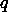，那么问题  有一个**多项式时间验证器**。

+   如果  是问题  的大小为  的一个实例，其答案为“true”，那么存在一个长度最多为 ") 的二进制字符串 ，使得  在输入 ") 时返回 。这个字符串  通常被称为  的**证据**、**证书**或**证明**。

+   如果  是问题  的大小为  的一个实例，其答案为“false”，那么对于长度最多为 ") 的每一个二进制字符串 ， 在输入 ") 时返回 。

这个定义有点复杂，让我们详细分析一下。这里的想法是，对于  的一个实例 ，其答案为正，我们可以找到一个不长的证书 （其长度是  大小的多项式），并且当我们得到  和  时，可以使用一个高效的算法来验证。然而，对于答案为负的实例，不存在这样的证书。注意， 在 ") 上的总运行时间是  长度的多项式，因为  在整个输入上以多项式时间运行，而  的长度是  的多项式。因此，这个定义真正捕捉了通过高效的算法检查  的答案为正（通过证书 ）的概念。

利用这个概念，我们现在可以将  定义为存在多项式时间验证器的决策问题类。

要了解更多…

可以用非确定性图灵机的术语给出  的另一种但等价的定义。实际上， 是 “非确定性多项式时间” 的缩写。你可以在 Sipser 的书中找到所有细节 [90]。

让我们通过一个例子来说明这个定义。确定一个图是否有哈密顿路径的问题属于  类。在这种情况下，证书  可以仅仅是图中的一个哈密顿路径。实际上，编写一个程序（例如用 Python）来检查给定的图  和由  表示的顶点序列是否是访问图中所有顶点的路径是很容易的。此外，我们可以很容易地在多项式时间内完成这个计算，并且证书的大小总是与图顶点数线性相关。正如所要求的，对于有哈密顿路径的图，至少存在一个证书。然而，对于没有哈密顿路径的图，没有任何  会使验证器输出 。如果需要，我们可以将我们的算法翻译成图灵机指令；这是一个繁琐的过程，但并没有真正的困难。

重要提示

 是一类决策问题，其解决方案可以用多项式时间内的图灵机进行验证。

可以给出类似的论据来证明许多重要问题都属于  类，包括确定一个布尔公式是否可满足、确定一个图是否 -可着色，或者确定一个图的割集大小是否大于给定的整数 。当然，它们的证书可以是满足的赋值、图的 -着色，以及大于  的割集。所有这些证书的大小都与它们所证明的问题实例相当，并且可以用明显的程序高效地检查。

此外，任何属于  类的问题也属于  类。这很容易证明。根据定义， 类中的问题  有一个决定器。但我们可以直接使用这个决定器来获得  的验证器：我们只需要忽略候选证书  并用决定器本身来计算答案。如果机器自己知道如何在多项式时间内解决问题，它就不需要任何外部帮助！

因此，我们知道包含在中。而且，看起来我们应该能够证明它们是不同的，因为一定存在我们可以高效检查其解，但在合理的时间内无法找到这些解的问题，对吧？然而，事实证明这绝对不是一项容易的任务。事实上，这可以说是千禧年问题！

判断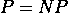是否成立是克莱数学研究所于 2000 年选出的七个千禧年问题之一，被认为是整个数学中最重要的问题之一（关于千禧年问题的易懂描述，请参阅基思·德维林的书 [30]）。任何能够给出证明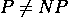或证明中的每个问题也在中的证明者，将获得一百万美元的奖金，并成为世界闻名的人物。

重要提示

中的每个问题也在中。是否存在中不能在多项式时间内解决的问题，这是整个数学中最重要的未解问题之一。

几乎所有计算复杂性领域的专家都相信，实际上，。所有证据都指向这个方向。而且，从逻辑上讲，*检查*一个解应该比*找到*一个解更容易。然而，到目前为止，还没有人成功证明在中存在不在中的问题，而且最自然的证明技术已经被证明是不够的（参见摩尔和梅伦斯撰写的史诗般巨著中的*第 6.5 节* [68]）。

# C.5 难度、完备性和归约

尽管我们目前的数学工具还不够强大，无法给出计算问题所需资源的满意下界，但我们确实对比较问题的相对难度了解得更多。用于这种比较的主要概念就是我们所说的**归约**。

直观地说，归约是一种从不同问题的解来解决一个问题的过程。我们可以这样说，我们将解决问题归约为解决问题。所以，如果我们知道如何用算法解决问题，我们就可以使用那个算法和一些额外的计算来解决问题。

更正式地说，考虑两个问题  和 ，并想象我们有一个算法 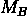 可以解决 。 通常被称为  的 **预言机**。如果我们能够通过一个  的预言机来解决 ，我们就说  是 **可归约** 到  的。例如，乘以两个数可以归约到加法：如果我们有一个加法的预言机，我们可以通过重复加法来使用它进行乘法。

当然，当我们研究计算类如  和  时，我们感兴趣的是那些需要多项式时间复杂度的归约。但我们应该如何形式化地捕捉这个想法呢？嗯，我们可以简单地认为每次对预言机的调用只是计算过程中的另一个步骤。然后，我们说一个问题  是 **多项式时间** **可归约** 到一个问题 ，如果给定  的预言机 ，我们可以用总计算步骤加上对  的调用次数（这些次数在  的大小上是多项式的）来解决  的任何实例。另一种看待这个问题的方法是想象我们扩展了我们的图灵机，使其能够在单步中计算 （这些新设备不出所料地被称为 **预言机图灵机**）。然后，证明  是多项式时间可归约到  与找到一台预言机图灵机（具有  的预言机）在多项式时间内解决  是相同的。

注意到  是多项式时间可归约到  有重要的后果。第一个后果是，如果  在  中，那么  也在  中。这是因为，如果  在  中，我们可以用解决  并在多项式时间内运行的图灵机来替换每个对  的调用，从而使解决  所涉及的总时间也是多项式的。这也意味着，如果  不在  中，那么  也不能在  中，因为这会导致我们产生矛盾。

现在，我们说一个问题是**-hard**，如果中的每个问题都可以在多项式时间内被归约到。这意味着至少和中的任何问题一样难，因为如果我们知道如何有效地解决，那么我们也会知道如何有效地解决。而且，如果中至少有一个问题不能在多项式时间内解决，那么这也意味着也不能在多项式时间内解决。

重要提示

一个问题是-hard，如果中的每个问题都可以在多项式时间内归约到它。

成为-hard 看起来是一个非常强的属性。真的可能对于中的**每个**问题都可以归约到单个问题吗？尽管这听起来可能令人惊讶，但我们知道有数百（如果不是数千）个在实践中自然出现并且确实是-hard 的问题。一个显著的例子是确定布尔公式是否可满足的问题，也称为 SAT。SAT 是-hard 的内容是著名的 Cook-Levin 定理的内容（参见 Sipser 的书籍以获取证明[90]）。在*第* *3* *章* **3*，*处理二次无约束二进制优化问题*中，我们处理了许多-hard 问题。对于许多其他例子以及关于-hardness 概念的更多内容，你可以查看 Garey 和 Johnson 的经典书籍[44]。

*实际上，我们能够证明 SAT 和中的其他决策问题具有一种比-hardness 更强的属性，称为**-completeness**。为了讨论这个问题，我们首先需要谈论一种在研究决策问题时非常有用的特殊归约类型。我们说一个决策问题是**单射归约**到决策问题的，如果存在一个算法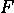，可以将的一个实例转换成的一个实例")，并且具有以下性质：在中的答案是正的，当且仅当在中的答案是正的。

注意，在这种情况下，我们确实在更一般的意义上减少了我们之前讨论的内容。如果我们给定一个的预言机，我们可以通过计算")并应用到")上来解决的任何实例。在这里，我们只使用了一次的调用，但在一般化简中，我们可以根据需要多次使用。因此，单射化简是化简的一种特殊情况。此外，如果变换可以在多项式时间内计算，我们说我们有一个**多项式时间**的单射化简。

重要提示

一个决策问题到决策问题的多项式时间单射化简是一个多项式时间算法，它将的实例转换为的实例")，并且具有以下性质：在中的答案是“真”当且仅当在中")的答案是“真”。

现在，我们可以实际上定义我们之前提到的-难问题的子类：**-完全**问题类。我们说一个问题是-完全的，如果它既在中，并且中的每个问题都可以通过多项式时间单射化简到它。正如我们之前提到的，SAT，例如，是-完全的。其他-完全问题包括确定一个图是否是-可着色的，确定二进制线性规划的限制是否可以满足，确定一个图是否有一个大于给定整数的割，以及许多其他自然决策问题。

-完全问题对于问题的研究至关重要，因为当且仅当至少一个-完全问题在中。因此，你可以专注于，比如说，只研究 SAT。如果你找到了它的多项式时间算法，那么。相反，如果你证明在多项式时间内解决 SAT 是不可能的，那么你找到了一个中不在中的问题，然后，立即，你可以得出结论。

重要提示

一个问题是-complete，如果它在中，并且中的每一个其他问题都可以通过多项式时间单射归约到。

当然，存在一些-hard 问题，它们并不是-complete。例如，如果你有一个-hard 问题，它不是一个决策问题（因此，不能在中），这种情况就会发生。我们在*第* *3* *章* **3*，*处理二次无约束二进制优化问题*中研究的大多数问题都属于这一类。例如，找到一个图的最小着色显然是-hard。如果你知道如何高效地解决这个问题，那么你也可以确定一个图是否是-可着色的（你只需要计算最小着色并检查其颜色数是否不超过）。但是检查一个图是否是-可着色的也是-hard，因此找到最小着色也是-hard。

*许多其他问题的优化版本也是-hard，包括在合取范式布尔公式中确定可以同时满足的最大子句数（MAX-SAT 问题）、在一个图中找到最大割（Max-Cut 问题）、找到二进制线性规划的最小成本解，或者解决旅行商问题。然而，它们都不是-complete，因为它们不在中：它们一开始就不是决策问题，而且，你能否高效地检查候选解确实是最优解，这一点远不清楚！

# C.6 量子计算复杂性的简要介绍

到目前为止，我们只关注了使用经典模型来衡量时间复杂度。然而，这是一本关于量子计算的书，所以考虑量子计算模型会发生什么变化是很自然的。这属于**量子计算复杂性理论**的研究范畴，这是一个非常迷人的主题，但它完全超出了本书的范围。

然而，让我们简要地谈谈当考虑量子模型而不是经典图灵机时出现的概念类型。这并不是理解本书其他部分所必需的，所以请随意跳过。我们需要简要说明，但你可以参考 Watrous 的综述[96]以获取更多细节。

结果表明，可以定义一类问题，这些问题可以看作是的量子对应物。这类问题被称为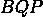，它包含那些可以用量子算法在多项式时间内以有界错误率解决的问题。

在这里需要澄清的几件事情中，第一点是量子算法是概率性的，我们不能期望决策问题的正确答案总是被获得。相反，我们要求对于每个输入，这个正确答案以高概率返回。形式上，要求是对于每个正实例，当算法的输入是时，获得的概率至少为；同样，对于每个负实例，当算法在上运行时，获得的概率至少为。这样，我们可以用相同的输入重复执行程序几次，并取多数结果。如果重复的次数足够多（但固定），我们可以在保持总运行时间多项式的同时，使错误概率任意小。

要了解更多…

并不完全等同于，而是等同于另一个（经典）计算类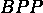。类包含那些可以用概率图灵机在多项式时间内以有界错误率解决的问题（即，在特定状态-符号情况下有多个指令的图灵机，并且可以根据随机比特序列决定执行哪个指令）。代表**有界错误概率多项式时间**，而代表**有界错误量子多项式时间**。

关于我们对的定义需要澄清的另一件事是我们对量子算法的确切理解。在经典情况下，我们将这个概念与（单带）图灵机相联系。可以定义图灵机的量子版本（例如，参见 Bernstein 和 Vazirani 的论文[16])，并将其用于我们的定义。但由于本书中我们主要的量子计算模型是量子电路模型，一个自然的问题是，我们是否也可以用它来形式化量子算法的概念。

实际上，我们可以用量子电路来定义什么是量子算法，这个定义在计算能力上与基于量子图灵机的定义等价（在运行时间上多项式等价）。然而，存在一些需要面对的细微差别。

第一个问题与能够一致地测量量子电路的执行时间有关。为了做到这一点，我们需要固定一个有限集的门，并使用这些门来表示每一个电路。然后，我们可以将每个这些门的成本设为 1 个单位，并测量电路的运行时间为其总门数。否则，如果我们允许任意门，那么我们可以认为任何电路只是一个单一的单位门（加上一些测量），这在分析其复杂度方面显然是没有意义的。请注意，固定一个允许的有限集门也允许我们将每个电路描述为一个有限的二进制字符串，例如，给出我们使用的门和它们作用在哪些量子位上的列表。

需要选择有限集的门，以便我们可以以任意精度逼近任何给定的量子电路。这种做法在 Watrous 的综述中有所解释[96]。

我们需要解决的第二个技术问题是，虽然图灵机可以处理任何大小的输入，但每个量子电路都有固定数量的量子位，因此只能接受固定大小的输入。因此，我们不能只用一个量子电路来表示一个完整的算法（该算法需要能够解决所有可能的问题实例）：我们需要考虑一个无限多的电路族，每个电路对应一个输入大小。所以，量子算法不是一个单一的量子电路，而是一组电路，每个电路对应一个自然数，使得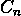可以接受个量子位作为其输入。

我们需要解决的最后一个问题与我们选择那个无限电路家族的方式有关。如果我们允许任何电路集合来表示量子算法，那么我们可能会陷入病态的情况，比如能够解决（与停机问题等价的问题），我们知道这是不可计算的！这是因为我们可以为每个大小选择一个完全不同的、完全不相关的量子电路，使得量子电路已经“知道”其输入大小的停机问题的答案。这不仅仅是对量子电路而言的。经典布尔电路也会发生同样的事情（正如我们提到的，这是一个微妙的问题；参见 Kitaev 等人书中第 2.2 节[60]或 Arora 和 Barak 的书中第六章[8]，特别是关于问题类的内容）。

解决这个问题的方法是统一地指定这个量子电路家族中的所有量子电路。例如，我们可以规定存在一个（经典）图灵机，给定一个自然数，在多项式时间内（在上）生成大小为的电路。这样，我们无法在量子电路的选择中隐藏任何额外的复杂性。记住，我们可以将我们的量子电路表示为有限二进制字符串（因为我们已经固定了允许的量子门的有限数量），因此从图灵机的输出中获得它们是有意义的。此外，每个电路都将具有多项式大小（毕竟，多项式时间的图灵机只能输出多项式数量的位）和多项式运行时间。

重要提示

是可以通过多项式时间均匀量子电路家族以有界误差解决决策问题的类别。

现在我们已经定义了，很自然地会询问它与和的关系，以便能够评估量子计算机与经典计算机相比的能力。

很容易证明，也就是说，中的每个问题也在中。这直接源于我们可以用量子电路模拟任何经典布尔电路（正如我们在*第 1.5.2 节*中所示）以及多项式时间的经典电路的均匀家族与多项式时间的图灵机等价（参见 Arora 和 Barak 的书中第 6.2 节[8]）。但这并不令人惊讶，因为我们期望量子计算机至少与经典计算机一样强大。

*因此，我们真正应该问的问题是，在中是否存在一些在中不存在的难题。简短的回答是……我们不知道。证明这一点将意味着不仅在量子计算复杂性理论，而且在经典计算复杂性理论方面都将取得重大突破。可以证明包含在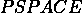中，即可解在多项式空间中的决策问题集合。证明与不同，也将意味着与不同，这是计算复杂性中的一个重大未解问题（尽管它应该比与问题更容易解决，因为也包含在中）。

话虽如此，我们有充分的理由相信，在中存在一些在中不存在的难题。事实上，我们有一个非常好的候选者：分解问题（给定自然数和，检查是否有小于的因子），由于 Shor 算法 [87]，它属于，但如果它属于，那将是非常，非常令人惊讶的。实际上，许多目前使用的加密协议都基于分解不在中的假设。所以，每次你在网上购物并发送信用卡号码时，你都在隐含地相信和不相等（以及没有人拥有足够强大的量子计算机！）。

那么，关于和的情况又是如何呢？那里的情况要复杂一些。我们拥有的证据似乎暗示，在中存在一些在中不存在的难题（在这个方向上最强大的结果之一可以在 Raz 和 Tal 最近的一篇论文中找到 [79]）。但也有一些证据似乎表明，在中存在一些在中不存在的难题，这是由于 Bennett、Bernstein、Brassard 和 Vazirani [15]的研究结果，这些结果表明 Grover 算法在某种意义上是量子算法在搜索任务中的最优算法。

如果这一切都是真的，那么它将意味着存在一些问题，我们可以用量子算法高效地解决，即使是非确定性机器也无法高效解决。但是，与媒体上有时读到的相反，这也意味着并非所有  中的问题都能用量子计算机高效解决，即使它是容错的。特别是，它将意味着没有任何 -完全问题可以用量子算法高效解决（我们已在 *图* **C.2*) 中表示了所有这些关系）。*

*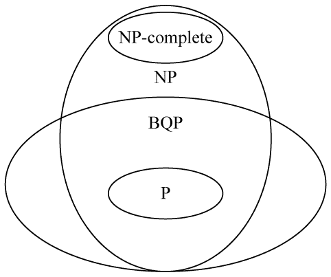*

**图 C.2**：根据现有证据和最广泛接受的猜想，、、 和 -完全问题之间可能的关系。请注意：这些类别中的一些最终可能完全相等！

这是否意味着量子计算机对优化问题完全没有用处？不一定。本书 *第 **II* *部分中描述的方法可能无法为所有优化问题提供最优解。但它们提供了近似算法，可能比仅使用经典算法所能做到的更好。例如，我们在 *第 **5* *章 *QAOA: Quantum Approximate Optimization *Algorithm* 中研究的 QAOA 算法被认为是这种优势的可能候选者（关于这一方向的一些最新结果，请参阅 Basso 等人的论文 [12] 和 Farhi 等人的论文 [38]，但也请查看 Hastings 的回应 [51]。即使情况并非如此，量子退火（在第 **4* 章 *Adiabatic Quantum Computing and Quantum *Annealing* 中描述）或 QAOA 等方法也可能提供有用的启发式方法，这在实践中是有用的，就像遗传算法、模拟退火或粒子群优化在许多不同领域中用于解决实际问题一样。********
