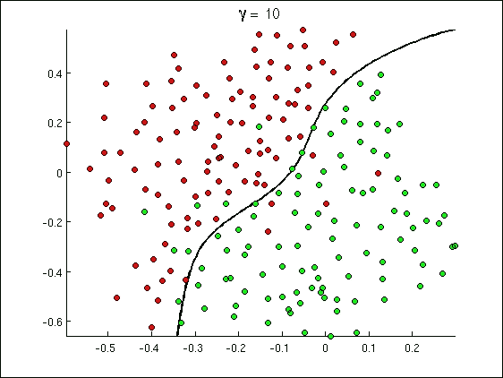
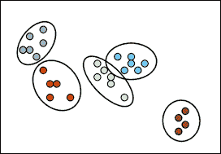
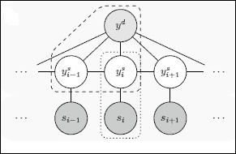
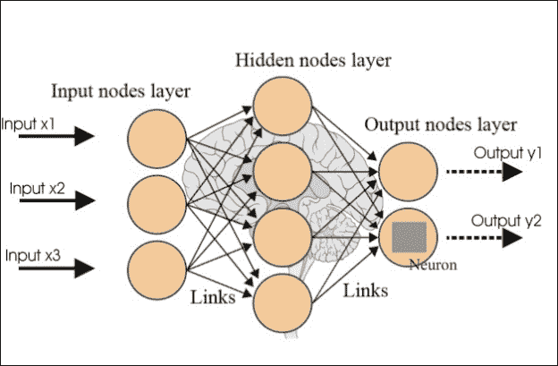
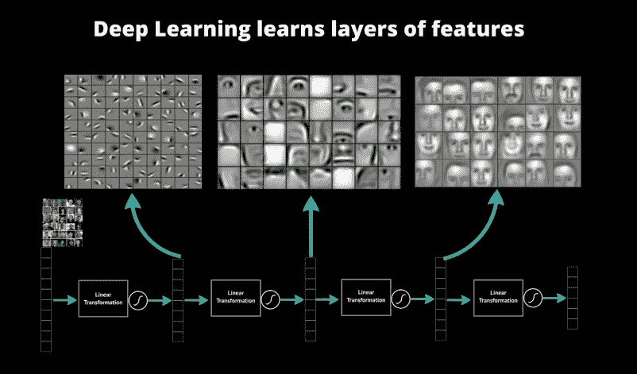

# 第一章：机器学习简介

在本章中，我们将介绍机器学习的基础知识以及机器学习涵盖的各种主题。在本章中，你将学习以下主题：

+   什么是机器学习？

+   分类概述

+   聚类概述

+   模型选择和正则化概述

+   非线性的概述

+   监督学习概述

+   无监督学习的概述

+   强化学习概述

+   结构化预测概述

+   神经网络的概述

+   深度学习概述

# 什么是机器学习？

人类从出生开始就接触数据。眼睛、耳朵、鼻子、皮肤和舌头持续收集各种形式的数据，大脑将这些数据转化为视觉、听觉、嗅觉、触觉和味觉。大脑随后通过感官器官接收到的各种原始数据，将其转化为语言，用于表达对所接收到的原始数据性质的意见。

在当今世界，机器上安装的传感器被用来收集数据。数据通过各种网站和社交网站从互联网收集。数字化后的古老手稿的电子形式也增加了数据集。数据还通过各种网站和社交网站从互联网收集。数据还从其他电子形式中收集，例如数字化后的古老手稿。这些来自多个来源的丰富数据形式需要处理，以便获得洞察力，并理解更有意义的模式。

机器学习算法有助于从各种来源收集数据，转换丰富数据集，并帮助我们根据提供的结果采取智能行动。机器学习算法被设计为高效和准确，并提供一般学习以执行以下操作：

+   处理大规模问题

+   做出准确的预测

+   处理各种不同的学习问题

+   可学习的内容及其可学习的条件

机器学习算法的一些应用领域如下：

+   基于销售的定价预测

+   药物分子反应的预测

+   检测机动车保险欺诈

+   分析股市回报

+   识别风险禁贷

+   预测风力发电场预测

+   跟踪和监控医疗设备的利用和位置

+   计算能源的高效利用

+   理解智能城市交通增长趋势

+   矿业矿石储备估计

# 分类概述

线性回归模型呈现的是性质为定量的响应变量。然而，某些响应变量是定性的。例如，态度（强烈不同意、不同意、中立、同意和强烈同意）就是定性的。对观察到的定性响应进行预测可以称为对该观察进行分类，因为它涉及到将观察分配到某个类别或类别中。分类器是许多任务中不可或缺的工具，例如医学或基因组学预测、垃圾邮件检测、人脸识别和金融。

# 聚类概述

聚类是将数据划分为相似对象组的过程。每个对象（聚类）由彼此相似且与其他组对象不相似的对象组成。聚类的目标是确定一组未标记数据中的内在分组。聚类可用于数据挖掘（DNA 分析、市场研究、保险研究等）、文本挖掘、信息检索、统计计算语言学家和基于语料库的计算词典学等领域。聚类算法必须满足的一些要求如下：

+   可扩展性

+   处理各种类型的属性

+   发现任意形状的聚类

+   处理噪声和异常值的能力

+   可解释性和可用性

以下图表展示了聚类的表示：

# 监督学习概述

监督学习涉及学习一组输入变量（通常是一个向量）与输出变量（也称为监督信号）之间的映射，并将此映射应用于预测未见数据。监督方法试图发现输入变量和目标变量之间的关系。发现的关系以称为模型的结构表示。通常，模型描述和解释隐藏在数据集中的现象，并可用于在知道输入属性值的情况下预测目标属性的值。

监督学习是机器学习任务，从监督训练数据（训练样本集）中推断出一个函数。训练数据由一组训练样本组成。在监督学习中，每个样本都是一个由输入对象和期望输出值组成的对。监督学习算法分析训练数据并产生一个推断函数。

为了解决监督学习问题，必须执行以下步骤：

1.  确定训练样本的类型。

1.  收集训练集。

1.  确定学习函数的输入变量。

1.  确定学习函数的结构和相应的学习算法。

1.  完成设计。

1.  评估学习函数的准确性。

监督方法可以在营销、金融和制造等各种领域实现。

在监督学习中需要考虑的一些问题如下：

+   偏差-方差权衡

+   函数复杂度和训练数据量

+   输入空间的维度

+   输出值中的噪声

+   数据的同质性

+   数据的冗余

+   存在交互和非线性

# 无监督学习概述

无监督学习研究系统如何以反映整体输入模式集合的统计结构的方式学习表示特定的输入模式。无监督学习很重要，因为它在脑中可能比监督学习更常见。例如，眼睛中光感受器的活动始终随着视觉世界的变化而变化。它们继续提供所有可用的信息，以表明世界中有什么物体，它们是如何呈现的，光照条件如何，等等。然而，在学习过程中，关于场景内容的信息基本上都是不可用的。这使得无监督方法变得至关重要，并允许它们被用作突触适应的计算模型。

在无监督学习中，机器接收输入但既不获得监督目标输出，也不从其环境中获得奖励。想象机器在没有从其环境中获得任何反馈的情况下可能学习到什么，这似乎有些神秘。然而，可以基于机器的目标是构建可用于决策、预测未来输入、高效地将输入传达给另一台机器等表示，为无监督学习开发一个形式化的框架。从某种意义上说，无监督学习可以被视为在数据中找到模式，这些模式超越了被认为是噪声的内容。

无监督学习的一些目标如下：

+   在不要求目标期望输出的情况下，在大数据集中发现有用的结构

+   提高输入的学习速度

+   通过为每个可能的数据向量分配一个分数或概率来构建数据向量的模型

# 强化学习概述

强化学习是让智能体在世界中采取行动以最大化其奖励的问题。它关乎做什么以及如何将情况映射到动作，以最大化数值奖励信号。学习者没有被告知采取哪些动作，如大多数机器学习形式，而是必须通过尝试来发现哪些动作能带来最多的奖励。强化学习的两个最重要的区分特征是试错和搜索以及延迟奖励。以下是一些强化学习的例子：

+   下棋的玩家在走棋时，选择既受计划的影响，也受预期可能的回应和反回应的影响。

+   一个自适应控制器实时调整石油精炼厂操作参数。控制器根据指定的边际成本优化产量/成本/质量权衡，而不严格遵循工程师最初建议的设定点。

+   一只羚羊小牛出生后几分钟就努力站起来。半小时后，它就能以每小时 20 英里的速度奔跑。

+   教狗学新把戏——你不能告诉它做什么，但如果它做对了/做错了，你可以奖励/惩罚它。它必须弄清楚是什么让它得到了奖励/惩罚，这被称为信用分配问题。

强化学习就像试错学习。智能体应该从其对环境的经验中找到一条好的策略，而在这个过程中不要损失太多的奖励。**探索**是指寻找更多关于环境的信息，而**利用**则是利用已知信息来最大化奖励。例如：

+   **餐厅选择**：利用；去你最喜欢的餐厅。探索；尝试一家新餐厅。

+   **石油钻探**：利用；在已知最佳位置钻探。探索；在新的位置钻探。

强化学习的主要组成部分如下：

+   **策略**：这是一个智能体的行为函数。它决定了从感知到的环境状态到采取行动的映射，当处于这些状态时。在心理学中，这相当于一套刺激-反应规则或联想。

+   **价值函数**：这是一个对未来奖励的预测。一个状态的价值是一个智能体从该状态开始，在未来可以期望积累的总奖励量。而奖励决定了环境状态的即时、内在的吸引力，而价值则表示在考虑了可能跟随的状态以及那些状态中可用的奖励后，状态的长期吸引力。

+   **模型**：模型预测环境接下来会做什么。它预测下一个状态以及下一个状态中的即时奖励。

# 结构化预测概述

结构化预测是机器学习在多个领域应用中的重要领域。考虑输入 *x* 和输出 *y*，例如时间步的标记、图像的属性集合、句子的解析或图像分割成对象，这些问题具有挑战性，因为 *y* 的数量与构成它的输出变量的数量呈指数关系。这些计算上具有挑战性，因为预测需要搜索巨大的空间，并且还需要考虑统计因素，因为从有限的数据中学习准确模型需要推理不同结构输出之间的共性。结构化预测本质上是一个表示问题，其中表示必须捕捉 *x* 和 *y* 之间的判别性交互，并允许对 *y* 进行有效的组合优化。

结构化预测是关于从输入数据预测结构化输出，而不是像分类或回归那样预测单个数字。例如：

+   **自然语言处理**--自动翻译（输出：句子）或句子解析（输出：解析树）

+   **生物信息学**--二级结构预测（输出：二分图）或酶功能预测（输出：树中的路径）

+   **语音处理**--自动转录（输出：句子）或文本转语音（输出：音频信号）

+   **机器人学**--规划（输出：动作序列）

# 神经网络的概述

神经网络代表了信息处理的大脑隐喻。这些模型是生物启发的，而不是大脑实际功能的精确复制品。神经网络已被证明在许多预测应用和商业分类应用中是非常有前途的系统，这得益于它们从数据中学习的能力。

人工神经网络通过更新网络架构和连接权重来学习，以便网络能够高效地执行任务。它可以从可用的训练模式中学习，或者从示例或输入输出关系中自动学习。学习过程由以下之一设计：

+   了解可用信息

+   学习范式--从环境中获得模型

+   学习规则--弄清楚权重更新过程

+   学习算法--通过学习规则识别调整权重的程序

有四种基本类型的学习规则：

+   错误校正规则

+   伯尔兹曼

+   赫布理论

+   竞争学习

# 深度学习的概述

深度学习指的是一类相当广泛的机器学习技术和架构，其标志是使用许多层非线性信息处理，这些处理在本质上是有层次的。深度学习架构大致分为三类：

+   用于无监督或生成学习的深度网络

+   用于监督学习的深度网络

+   混合深度网络

