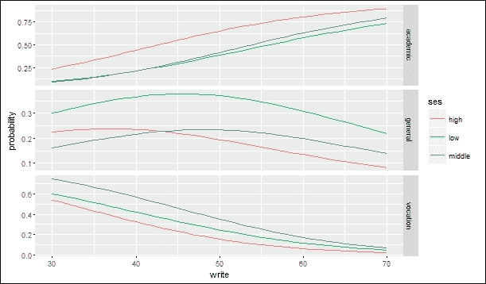
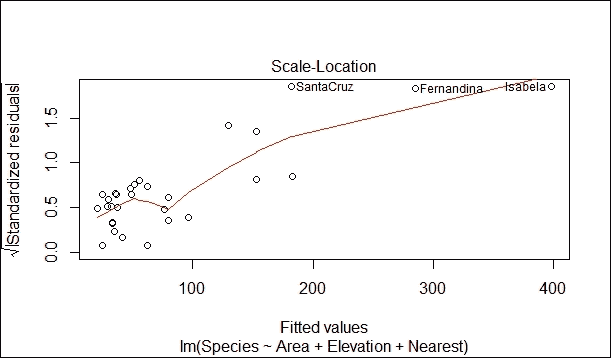
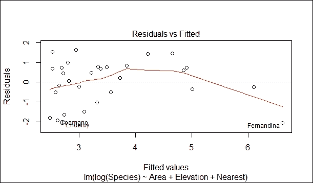

# 第二章. 分类

在本章中，我们将介绍以下食谱：

+   判别函数分析 - 对来自井的卤水进行地质测量

+   多项式逻辑回归 - 理解学生做出的课程选择

+   托比特回归 - 测量学生的学术能力

+   泊松回归 - 理解加勒比海群岛上的物种

# 简介

**判别分析**用于区分不同的观测集，并将新的观测分配到先前定义的组中。例如，如果一项研究旨在调查区分（1）灵长类动物、（2）鸟类或（3）松鼠所食用的水果的变量，研究人员可以收集关于每个动物群体所食用的水果的众多特征数据。大多数水果自然会落入三个类别之一。然后可以使用判别分析来确定哪些变量是预测水果是否被鸟类、灵长类动物或松鼠食用的最佳预测变量。判别分析常用于生物物种分类、肿瘤的医学分类、面部识别技术以及信用卡和保险行业中的风险评估。判别分析的主要目标是判别和分类。关于判别分析的前提假设包括多元正态性、组内方差协方差相等以及变量的低多重共线性。

**多项式逻辑回归**用于根据多个自变量预测因变量的分类位置或类别成员的概率。当因变量有超过两个名义或无序类别时使用，此时独立变量的虚拟编码相当常见。独立变量可以是二元的（二进制）或连续的（尺度上的区间或比率）。多项式逻辑回归使用最大似然估计来评估类别成员的概率。它使用最大似然估计而不是传统多元回归中使用的最小二乘估计。假设分布的一般形式。使用估计参数的起始值，并计算样本来自具有这些参数的群体的似然性。通过迭代调整估计参数的值，直到获得估计参数的最大似然值。

**Tobit 回归**用于描述非负因变量与自变量之间的关系。它也被称为截断回归模型，旨在估计变量之间的线性关系，当因变量中存在左截断或右截断时。截断发生在具有某个阈值或以上值的案例中，所有这些案例都采用该阈值的价值，因此真实值可能等于该阈值，但也可能更高。Tobit 模型已在大量应用中使用，其中样本中的一些个体的因变量被观察到为零（汽车支出、医疗支出、工作时间、工资等）。此模型适用于度量因变量，并且它在观察到的值仅在它高于或低于某个截断水平时才被观察到的意义上是有限的。例如：

+   工资可能因最低工资限制而从下限受限。

+   捐赠给慈善机构的金额

+   顶码收入

+   个人的时间使用和休闲活动

**泊松回归**处理因变量为计数的情形。泊松回归类似于常规的多重回归，除了因变量（Y）是一个遵循泊松分布的观察计数。因此，Y 的可能值是非负整数：0，1，2，3，等等。假设大计数是罕见的。因此，泊松回归类似于逻辑回归，后者也有一个离散的响应变量。然而，响应值并不限于特定值，正如逻辑回归中的那样。

# 鉴别函数分析 - 来自井的卤水地质测量

假设需要对从矿山收集的古文物进行研究。已经从矿山收集了岩石样本。在收集的岩石样本上进行了地球化学测量。对收集到的文物也进行了类似的研究。为了将样本分离到它们挖掘的矿山，可以使用 DFA 作为函数。然后可以将该函数应用于文物以预测每个文物的来源矿山。

## 准备就绪

为了进行鉴别函数分析，我们将使用从矿山收集的数据集。

### 第 1 步 - 收集和描述数据

应使用名为`BRINE`的地质数据分析数据集。这可以从[`www.kgs.ku.edu/Mathgeo/Books/Stat/ASCII/BRINE.TXT`](http://www.kgs.ku.edu/Mathgeo/Books/Stat/ASCII/BRINE.TXT) 获取。数据集采用标准形式，行对应样本，列对应变量。每个样本被分配到一个地层单元，列在最后一列列出。数据集中有 19 个案例和 8 个变量。八个数值测量包括以下内容：

+   `No`

+   `HCO3`

+   `SO4`

+   `CL`

+   `CA`

+   `MG`

+   `NA`

+   `Group`

## 如何做...

让我们深入了解。

### 第 2 步 - 探索数据

第一步是加载以下包：

```py
    > library(MASS)

```

### 注意

版本信息：本页面的代码在 R 版本 3.2.3（2015-12-10）中进行了测试

让我们探索数据并了解变量之间的关系。我们将从导入名为`brine.txt`的 txt 数据文件开始。我们将把数据保存到`brine`数据框中，如下所示：

```py
> brine <- read.table("d:/brine.txt", header=TRUE, sep=",", row.names=1)

```

接下来我们将打印`brine`数据框。`head()`函数返回`brine`数据框。将`brine`数据框作为输入参数传递。使用以下代码：

```py
    > head(brine)

```

结果如下：

```py
 HCO3    SO4      Cl      Ca      Mg       Na   GROUP
1   10.4   30.0    967.1    95.9    53.7    857.7     1
2    6.2   29.6   1174.9   111.7    43.9   1054.7     1
3    2.1   11.4   2387.1   348.3   119.3   1932.4     1
4    8.5   22.5   2186.1   339.6    73.6   1803.4     1
5    6.7   32.8   2015.5   287.6    75.1   1691.8     1
6    3.8   18.9   2175.8   340.4    63.8   1793.9     1

```

DFA 假设多元正态性。在进行分析之前，必须检查数据以验证正态性。

为了验证转换的适当性，执行数据绘图。使用`pairs` `()`函数绘制数据。它产生一个散点矩阵。交叉图应仅比较第 1-6 列的测量变量，最后一列（第 7 列）是组名。考虑以下内容：

```py
> pairs(brine[ ,1:6])

```

图形如下所示：


### 第 3 步 - 转换数据

可以明显看出数据具有彗星形状的分布模式。这表明需要对数据进行对数转换，这在地球化学数据中很常见。一个好的做法是首先复制整个数据集，然后只对地球化学测量值应用对数转换。由于数据中包含零；应对数据集执行`log+1`转换而不是`log`转换。将`brine`数据框复制到`brine.log`数据框。对数据框执行对数转换。如前所述，执行对数转换。查看以下代码：

```py
 > brine.log <- brine
 > brine.log[ ,1:6] <- log(brine[ ,1:6]+1)
 > pairs(brine.log[ ,1:6])

```

数据转换后，为了使用`pairs()`函数数据框重新评估正态性条件，重新绘制`brine.log`。分布看起来更接近正态。与之前的图形相比，偏度已经降低：

```py
    > pairs(brine.log[ ,1:6])

```

图形如下所示：


### 第 4 步 - 训练模型

下一步是训练模型。这是通过判别函数分析来完成的。调用`lda()`函数执行判别函数分析，如下所示：

```py
> brine.log.lda <- lda(GROUP ~ HCO3 + SO4 + Cl + Ca + Mg + Na, data=brine.log)

```

这个调用的格式与线性回归或方差分析非常相似，即我们指定一个公式。在这里，`GROUP`变量应被视为因变量，地球化学测量值作为自变量。在这种情况下，没有建模变量之间的交互作用，因此变量通过`+`而不是`*`添加。由于没有调用`attach()`，必须提供数据框的名称作为数据参数。运行 DFA 后，第一步是查看结果，如下所示：

```py
    > brine.log.lda

```

结果如下：

```py
Call:
lda(GROUP ~ HCO3 + SO4 + Cl + Ca + Mg + Na, data = brine.log)
Prior probabilities of groups:
 1             2             3 
0.3684211     0.3157895     0.3157895 
Group means:
 HCO3        SO4         Cl         Ca         Mg         Na
1   1.759502   3.129009   7.496891   5.500942   4.283490   7.320686
2   2.736481   3.815399   6.829565   4.302573   4.007725   6.765017
3   1.374438   2.378965   6.510211   4.641049   3.923851   6.289692
Coefficients of linear discriminants:
 LD1             LD2
HCO3      -1.67799521      0.64415802
SO4        0.07983656      0.02903096
Cl         22.27520614     -0.31427770
Ca        -1.26859368      2.54458682
Mg        -1.88732009     -2.89413332
Na       -20.86566883      1.29368129
Proportion of trace:
 LD1        LD2 
 0.7435     0.2565

```

+   输出的第一部分显示了拟合的公式。

+   第二部分是组的先验概率，它反映了每个组在数据集中的比例。换句话说，如果你没有任何测量，并且测量的样本数量代表了组的实际相对丰度，那么先验概率将描述任何未知样本属于每个组的概率。

+   第三部分显示了组均值，这是一个表格，列出了每个组中每个变量的平均值。扫描这个表格可以帮助你看到组是否在某个或多个变量方面具有独特性。

+   第四部分报告了判别函数的系数（a、b 和 c）。因为有三个组，所以有 3-1 个线性判别函数（如果你只有两个组，你只需要 1 个 [2-1] 线性判别函数）。对于每个线性判别函数（`LD1` 和 `LD2`），有一个系数依次对应于每个变量。

+   最后，第五部分显示了迹的比率，它给出了每个判别函数解释的方差。在这里，首先判别函数解释了 75% 的方差，其余的方差由第二个判别函数解释。

### 第 5 步 - 分类数据

`predict()` 函数，也是 `MASS` 包的一部分，使用 `lda()` 的结果将样本分配到组中。换句话说，由于 `lda()` 推导出一个线性函数，该函数应该用于分类组，因此 `predict()` 允许您将此函数应用于相同的数据以查看分类函数的成功程度。遵循统计惯例，x-hat 是 x 的预测（在对象名称中添加帽子以使其清晰，这些是预测）。考虑以下内容：

```py
    > brine.log.hat <- predict(brine.log.lda)

```

让我们按照以下方式打印 `brine.log.hat`：

```py
> brine.log.hat

```

结果如下：

```py
$class
 [1] 2 1 1 1 1 1 1 2 2 2 2 2 2 3 3 3 3 3 3
Levels: 1 2 3
$posterior
 1                2                3
1    2.312733e-01     7.627845e-01     5.942270e-03
2    9.488842e-01     3.257237e-02     1.854347e-02
3    8.453057e-01     9.482540e-04     1.537461e-01
4    9.990242e-01     8.794725e-04     9.632578e-05
5    9.965920e-01     2.849903e-03     5.581176e-04
6    9.984987e-01     1.845534e-05     1.482872e-03
7    8.676660e-01     7.666611e-06     1.323263e-01
8    4.938019e-03     9.949035e-01     1.584755e-04
9    4.356152e-03     9.956351e-01     8.770078e-06
10   2.545287e-05     9.999439e-01     3.066264e-05
11   2.081510e-02     9.791728e-01     1.210748e-05
12   1.097540e-03     9.989023e-01     1.455693e-07
13   1.440307e-02     9.854613e-01     1.356671e-04
14   4.359641e-01     2.367602e-03     5.616683e-01
15   6.169265e-02     1.540353e-04     9.381533e-01
16   7.500357e-04     4.706701e-09     9.992500e-01
17   1.430433e-03     1.095281e-06     9.985685e-01
18   2.549733e-04     3.225658e-07     9.997447e-01
19   6.433759e-02     8.576694e-03     9.270857e-01
$x
 LD1            LD2
1      -1.1576284     -0.1998499
2     -0.1846803      0.6655823
3       1.0179998      0.6827867
4      -0.3939366      2.6798084
5      -0.3167164      2.0188002
6       1.0061340      2.6434491
7       2.0725443      1.5714400
8      -2.0387449     -0.9731745
9      -2.6054261     -0.2774844
10     -2.5191350     -2.8304663
11     -2.4915044      0.3194247
12     -3.4448401      0.1869864
13     -2.0343204     -0.4674925
14      1.0441237     -0.0991014
15      1.6987023     -0.6036252
16      3.9138884     -0.7211078
17      2.7083649     -1.3896956
18      2.9310268     -1.9243611
19      0.7941483     -1.2819190

```

输出从每个样本的分配分类开始。接下来，它列出了每个样本对每个组的后验概率，其中每行的概率（即，对于每个样本）总和为 1.0。这些后验概率衡量了每个分类的强度。如果一个样本的这些概率中有一个远大于其他所有概率，那么这个样本就非常确定地分配到了一个组。如果有两个或更多概率几乎相等，那么分配就不是很确定。如果有许多组，以下命令是快速找到每个样本最大概率的方法：

```py
> apply(brine.log.hat$posterior, MARGIN=1, FUN=max)
 1           2             3  4             5         6             7         8 
0.7627845 0.9488842 0.8453057 0.9990242 0.9965920 0.9984987 0.8676660 0.9949035 
 9          10          11        12          13        14          15        16 
0.9956351 0.9999439 0.9791728 0.9989023 0.9854613 0.5616683 0.9381533 0.9992500 
 17          18          19 
0.9985685 0.9997447 0.9270857

```

由于数据集中的大部分概率都很大（>0.9），这表明该集合中的大多数样本已经被分配到了一个组。

如果这些概率中的大多数都很大，则整体分类成功。`predict()`输出的最后部分列出了每个样本在每个判别函数轴上的得分。这些得分可以绘制成图，以图形方式显示组在判别函数中的分布，就像主成分分析得分可以绘制一样，如下所示：

```py
> plot(brine.log.lda)

```

三个组占据明显不同且不重叠的区域。只有一个第 1 组靠近第 2 组，因此可以清楚地声明判别是成功的。

图如下所示：


第二种类型的图显示了数据沿特定判别函数轴的分布，如下所示：

```py
> plot(brine.log.lda, dimen=1, type="both")

```


再次注意，组在判别函数 1 上的分离很好，尤其是第 2 组。

### 第 6 步 - 评估模型

必须评估 DFA 在分类组中的有效性，这是通过比较`predict()`所做的分配与实际组分配来完成的。`table()`函数对此非常有用。按照惯例，它使用实际分配作为第一个参数，拟合分配作为第二个参数，如下所示：

```py
> tab <- table(brine.log$GROUP, brine.log.hat$class)

```

打印制表符的值。

```py
 > tab

```

结果如下：

```py
 1   2   3
 1   6   1   0
 2   0   6   0
 3   0   0   6

```

输出的行对应于原始数据中指定的组，列对应于 DFA 所做的分类。在完美的分类中，大值将沿对角线排列，对角线外的值为零，这表明所有属于第 1 组的样本都被 DFA 判别为属于第 1 组，依此类推。这种表格的形式可以让你对哪些组被可靠地区分开来有相当大的洞察力。它还可以显示哪些组可能被混淆，以及哪些类型的误分类比其他类型更常见。以下命令将计算整体预测准确率，即沿对角线排列的案例比例：

```py
> sum(tab[row(tab) == col(tab)]) / sum(tab)

```

结果如下：

```py
[1] 0.9473684

```

这里预测准确率几乎为 95%，相当成功。这种方法衡量的是所谓的重置误差，即当所有样本都用于开发判别函数时，样本被分类得有多好。

评估 DFA 的第二种方法是留一法交叉验证（也称为刀切验证），它排除一个观测值。这种评估 DFA 的方法使用被排除的数据，即排除一个观测值。我们现在剩下 n - 1 个观测值。这种交叉验证技术会自动对数据集中的每个样本进行。为此，将`CV=TRUE`（考虑交叉验证）添加到`lda()`调用中，如下所示：

```py
> brine.log.lda <- lda(GROUP ~ HCO3 + SO4 + Cl + Ca + Mg + Na, data=brine.log, CV=TRUE) 

```

可以用类似的方式衡量判别的成功，如下所示：

```py
> tab <- table(brine.log$GROUP, brine.log.lda$class)

```

按如下方式打印制表符的值：

```py
> tab

```

结果如下：

```py
 1   2   3
 1  6   1   0
 2   1   4   1
 3   1   0   5
> sum(tab[row(tab) == col(tab)]) / sum(tab)

```

结果如下：

```py
[1] 0.7894737

```

在这个数据集中，Jackknife 验证的准确性相当低（只有 79%的准确性），反映出重置误差总是高估 DFA 的性能。这种差异在这个小型数据集中尤其常见，而判别函数分析在大数据集中通常要成功得多。

# 多项式逻辑回归 - 理解学生做出的课程选择

假设高中生将被录取到某个课程。学生有机会选择他们喜欢的课程。学生的选择基于三个选项。这些选择是一般课程、职业教育课程和学术课程。每个学生的选择基于每个学生的写作分数和社会经济状况。

## 准备工作

为了完成这个食谱，我们将使用一个学生数据集。第一步是收集数据。

### 第 1 步 - 收集数据

正在使用标题为 `hsbdemo` 的学生数据集。数据集以 MS Excel 格式提供，可在以下网址找到：[`voia.yolasite.com/resources/hsbdemo.csv`](http://voia.yolasite.com/resources/hsbdemo.csv)。数据集中有 201 个数据行和 13 个变量。八个数值测量值如下：

+   `id`

+   `read`

+   `write`

+   `math`

+   `science`

+   `socst`

+   `awards`

+   `cid`

非数值测量值如下：

+   `gender`

+   `ses`

+   `schtyp`

+   `prog`

+   `honors`

## 如何操作...

让我们深入了解细节。

### 第 2 步 - 探索数据

第一步是加载包。如果包不存在，`library()` 函数会返回错误。请使用以下命令：

```py
 > library(foreign)
 > library (nnet)
 > library (ggplot2)
 > library (reshape2)

```

### 注意

版本信息：本页面的代码在 R 版本 3.2.3（2015-12-10）上进行了测试。

探索数据使数据的关联关系更加清晰。标题为 `hsbdemo.csv` 的 CSV 文件需要导入到 R 环境中。导入的数据被保存在标题为 `ml` 的数据框中，如下所示：

```py
> ml <- read.table("d:/hsbdemo.csv", header=TRUE, sep=",", row.names="id")

```

使用 `with()` 函数执行对感兴趣的变量的描述性统计探索，如下所示：

```py
> with(ml, table(ses, prog))

```

结果如下：

```py
 prog
 ses         academic         general    vocation
 high           42                9           7
 low            19               16          12
 middle         44               20          31

```

让我们按照以下方式获取平均值和标准差：

```py
> with(ml, do.call(rbind, tapply(write, prog, function(x) c(M = mean(x), SD = sd(x)))))

```

结果如下：

```py
 M           SD
academic     56.25714     7.943343
general      51.33333     9.397775
vocation     46.76000     9.318754

```

平均值最高的是学术课程，标准差最高的是普通课程。

### 第 3 步 - 训练模型

为了估计多项式逻辑回归，使用 `multinom()` 函数。`multinom()` 函数不需要对数据进行重塑。

选择结果参考组很重要。我们可以选择我们希望用作基线的结果水平。这由`relevel()`函数指定。然后，我们使用`multinom()`函数运行我们的模型。由于没有对回归系数进行 p 值计算，因此使用 Wald 测试（z 测试）进行 p 值测试。`multinom()`函数中提到的公式形式为 response ~ predictors。数据框`ml`是要解释公式中出现的变量的数据框，如下所示：

```py
 > ml$prog2 <- relevel(ml$prog, ref = "academic") 
 > test <- multinom(prog2 ~ ses + write, data = ml)

```

结果如下：

```py
# weights:  15 (8 variable)
initial  value          219.722458 
iter     10 value     179.983731
final    value         179.981726 
converged

```

```py
 > summary(test)

```

结果如下：

```py
 Call:
multinom(formula = prog2 ~ ses + write, data = ml)
Coefficients:
 (Intercept)       seslow   sesmiddle         write
general     1.689478       1.1628411   0.6295638   -0.05793086
vocation    4.235574       0.9827182   1.2740985   -0.11360389

```

```py
 Std. Errors:
 (Intercept)       seslow   sesmiddle        write
general     1.226939       0.5142211   0.4650289   0.02141101
vocation    1.204690       0.5955688   0.5111119   0.02222000
Residual Deviance: 359.9635 
AIC: 375.9635 

```

接下来，将系数的测试总结除以标准误差的测试总结，如下所示：

```py
> z <- summary(test)$coefficients/summary(test)$standard.errors

```

按如下方式显示`z`的值：

```py
> z

```

结果如下：

```py
 (Intercept)     seslow     sesmiddle       write
general       1.376987   2.261364      1.353816   -2.705658
vocation      3.515904   1.650050      2.492798   -5.112687

```

### 第 4 步 - 测试模型的输出结果

进行双尾 z 测试，如下所示：

```py
> p <- (1 - pnorm(abs(z), 0, 1))*2

```

按如下方式显示 p 的值：

```py
> p

```

结果如下：

```py
 (Intercept)       seslow     sesmiddle          write
general    0.1685163893   0.02373673     0.1757949   6.816914e-03
vocation   0.0004382601   0.09893276     0.0126741   3.176088e-07

```

### 第 5 步 - 提高模型性能

相对风险定义为选择一个结果类别与选择基线类别之间的比率。相对风险是线性方程右侧的指数。指数回归系数是预测变量单位变化的相对风险比。

从模型中提取系数，并按如下方式对其进行指数运算：

```py
> exp(coef(test))

```

结果如下：

```py
 (Intercept)   seslow         sesmiddle       write
general         5.416653   3.199009    1.876792   0.9437152
vocation       69.101326   2.671709    3.575477   0.8926115

```

变量 write 增加一个单位时，相对于普通项目与学术项目的相对风险比是`.9437`。从`ses = 1`切换到`3`时，相对于普通项目与学术项目的相对风险比是`.3126`。使用预测的概率来深入了解模型。使用`fitted()`函数按如下方式计算每个结果级别的预测概率：

```py
> head(pp <- fitted(test))

```

结果如下：

```py
 academic     general    vocation
45     .1482721   0.3382509   0.5134769
108   0.1201988   0.1806335   0.6991678
15    0.4186768   0.2368137   0.3445095
67    0.1726839   0.3508433   0.4764728
153   0.1001206   0.1689428   0.7309367
51    0.3533583   0.2378047   0.4088370

```

检查与两个变量之一（`ses`和`write`）相关的概率变化。创建小数据集，改变一个变量而保持另一个变量不变。首先，将 write 变量保持在平均值，然后按如下方式检查`ses`变量每个级别的预测概率：

```py
 > dses <- data.frame(ses = c("low", "middle", "high"),write = mean(ml$write))
 > predict(test, newdata = dses, "probs")

```

结果如下：

```py
 academic     general      vocation
1   0.4396813   0.3581915   0.2021272
2   0.4777451   0.2283359   0.2939190
3   0.7009046   0.1784928   0.1206026

```

通过查看不同连续预测变量值的平均预测概率，使用如下预测概率：

```py
> dwrite <- data.frame(ses = rep(c("low", "middle", "high"), each = 41), write = rep(c(30:70), 3))

```

将每个`ses`值的预测概率存储下来，并按如下方式写入：

```py
> pp.write <- cbind(dwrite, predict(test, newdata = dwrite, type = "probs", se = TRUE))

```

按如下方式计算`ses`每个级别的平均概率：

```py
> by(pp.write[, 3:5], pp.write$ses, colMeans)

```

结果如下：

```py
pp.write$ses: high
 academic     general      vocation 
 0.6164348   0.1808049   0.2027603 
-------------------------------------------------------------------------- 
pp.write$ses: low
 academic     general      vocation 
 0.3972955   0.3278180   0.2748864 
-------------------------------------------------------------------------- 
pp.write$ses: middle 
 academic     general      vocation 
 0.4256172   0.2010877   0.3732951 

```

有时，几个图表可以传达大量信息。使用我们之前为`pp.write`对象生成的预测，我们可以根据`ses`的不同水平绘制预测概率与写作分数的关系图。`melt()`函数将宽格式数据转换为单列数据。`lpp`数据帧用于指定数据帧如下：

```py
> lpp <- melt(pp.write, id.vars = c("ses", "write"), value.name = "probability")

```

按照以下方式打印`head`的值：

```py
> head(lpp)

```

结果如下：

```py
 ses   write   variable     probability
1  low      30   academic    0.09843258
2   low      31   academic    0.10716517
3   low      32   academic    0.11650018
4   low      33   academic    0.12645441
5   low      34   academic    0.13704163
6   low      35   academic    0.14827211

```

接下来，我们按`ses`的每个水平绘制预测概率与写作值的关系图，按项目类型细分如下：

```py
> ggplot(lpp, aes(x = write, y = probability, colour = ses)) +
+     geom_line() +
+     facet_grid(variable ~ ., scales="free")

```



# Tobit 回归 - 测量学生的学术能力

让我们测量学生在 200-800 分范围内的学术能力。这种测量基于阅读和数学分数的模型。学生所注册的项目的性质也需考虑。有三种类型的课程：学术、普通和职业。问题是，一些学生可能正确回答学术能力测试的所有问题，得分 800 分，尽管这些学生可能并不真正在能力上相等。这可能适用于所有可能回答所有问题错误并得分 200 分的学生。

## 准备工作

为了完成这个食谱，我们将使用一个学生的数据集。第一步是收集数据。

### 第 1 步 - 收集数据

为了开发 Tobit 回归模型，我们将使用名为 tobit 的学生数据集，该数据集以 MS Excel 格式存储在[`www.ats.ucla.edu/stat/data/tobit.csv`](http://www.ats.ucla.edu/stat/data/tobit.csv)。数据集中有 201 个数据行和五个变量。四个数值测量值如下：

+   `id`

+   `read`

+   `math`

+   `apt`

非数值测量值如下：

+   `prog`

## 如何做到这一点...

让我们深入了解细节。

### 第 2 步 - 探索数据

第一步是加载以下包。`require()`函数是为在其它函数中使用而设计的；如果包不存在，它返回`FALSE`并给出警告（而不是默认的`library()`函数产生的错误）。使用以下命令：

```py
    > require(ggplot2)
    > require(GGally)
    > require(VGAM)

```

### 注意

版本信息：本页面的代码在 R 版本 3.2.3（2015-12-10）上进行了测试

探索数据并理解变量之间的关系。首先导入名为`gala.txt`的 CSV 数据文件。这将数据保存到`dat`数据帧中如下：

```py
> dat <- read.table("d:/tobit.csv", header=TRUE, sep=",", row.names="id")

```

在这个数据集中，`apt`的最小值是 352。这表明没有学生得到最低的 200 分。尽管存在向下截断的可能性，但在这个数据集中并不需要。使用以下命令：

```py
> summary(dat)

```

结果如下：

```py
Id         read         math      prog           apt 
Min.   :  1.0   Min.   :28.0   Min.   :33.0   academic  : 45 Min.   :352
1st Qu.: 50.8   1st Qu.:44.0   1st Qu.:45.0   general   :105 1st Qu.:576
Median :100.5   Median :50.0   Median :52.0   vocational: 50 Median :633
Mean   :100.5   Mean   :52.2   Mean   :52.6      Mean   :640
3rd Qu.:150.2   3rd Qu.:60.0   3rd Qu.:59.0      3rd Qu.:705
Max.   :200.0   Max.   :76.0   Max.   :75.0       Max.   :800

```

### 第 3 步 - 绘制数据

`Write` 是一个函数，它给出了给定均值和标准差的正态分布密度，该密度已在计数度量上进行了缩放。为了生成直方图，使用以下代码将计数表示为 *密度 * 样本大小 * 箱宽：

```py
    > f <- function(x, var, bw = 15) {
    dnorm(x, mean = mean(var), sd(var)) * length(var) * bw
    }

```

现在我们将按照以下方式设置基础图表：

```py
> p <- ggplot(dat, aes(x = apt, fill=prog))

```

现在我们将准备一个按不同项目比例着色的直方图，并叠加正态分布，如下所示：

```py
> p + stat_bin(binwidth=15) +
 stat_function(fun = f, size = 1,
 args = list(var = dat$apt))

```

绘制的直方图如下所示：


观察前面的直方图，我们可以看到 `apt` 值的截断，也就是说，与分布的其他部分相比，得分在 750 到 800 之间的案例数量远多于预期。

在以下替代直方图中，`apt`=800 的情况过剩已被突出显示。在以下直方图中，breaks 选项产生一个直方图，其中 `apt` 的每个唯一值都有自己的条形（通过将 breaks 设置为包含 `apt` 最小值和最大值值的向量的向量）。因为 `apt` 是连续的，所以数据集中大多数 `apt` 的值是唯一的，尽管在分布的接近中心处有几个 `apt` 的值有两个或三个案例。

直方图最右侧的峰值是 `apt`=800 的情况的条形，这个条形的高度相对于其他所有条形，清楚地显示了具有此值的案例数量过剩。使用以下命令：

```py
> p + stat_bin(binwidth = 1) + stat_function(fun = f, size = 1, args = list(var = dat$apt, 
 bw = 1))

```


### 步骤 4 - 探索关系

以下命令使我们能够探索数据集中的双变量关系：

```py
> cor(dat[, c("read", "math", "apt")])

```

结果如下：

```py
 read        math             apt
read     1.0000000   0.6622801   0.6451215
math     0.6622801   1.0000000   0.7332702
apt      0.6451215   0.7332702   1.0000000

```

现在按照以下方式绘制矩阵：

```py
> ggpairs(dat[, c("read", "math", "apt")])

```


在散点图矩阵的第一行中，散点图显示了 `read` 和 `apt` 之间的关系。也建立了 `math` 和 `apt` 之间的关系。

### 步骤 5 - 训练模型

使用 VGAM 包中的 `vglm` 函数运行 Tobit 模型，使用以下命令：

```py
    > summary(m <- vglm(apt ~ read + math + prog, tobit(Upper = 800), data = dat))

```

结果如下：

```py
Call:
vglm(formula = apt ~ read + math + prog, family = tobit(Upper = 800), 
 data = dat)

```

```py
Pearson residuals:
 Min        1Q           Median        3Q       Max
mu           -2.5684    -0.7311        -0.03976    0.7531     2.802
loge(sd)     -0.9689    -0.6359        -0.33365    0.2364     4.845

```

```py
Coefficients:
 Estimate Std.       Error     z value     Pr(>|z|) 
(Intercept):1     209.55956     32.54590     6.439     1.20e-10 ***
(Intercept):2       4.18476      0.05235    79.944      < 2e-16 ***
read                2.69796      0.61928     4.357     1.32e-05 ***
math                5.91460      0.70539     8.385      < 2e-16 ***
proggeneral       -12.71458     12.40857    -1.025     0.305523 
progvocational   -46.14327     13.70667    -3.366     0.000761 ***
---
Signif. codes:    0 '***'   0.001 '**'   0.01 '*'   0.05 '.' 0.1 ' ' 1
Number of linear predictors:  2 
Names of linear predictors: mu, loge(sd)
Dispersion Parameter for tobit family:   1
Log-likelihood: -1041.063 on 394 degrees of freedom
Number of iterations: 5 

```

前面的输出告诉我们指定了哪些选项。

标有系数的表格给出了系数、标准误差和 z 统计量。总结表中不包含 p 值。

Tobit 回归系数的解释与 OLS 回归系数类似。线性系数影响未截断的潜在变量：

+   对于 `read` 增加 1 个单位，`apt` 的预测值增加 `2.6981` 分。

+   `math` 增加 1 个单位与 `apt` 预测值增加 `5.9146` 个单位相关。

+   `prog` 的术语有略微不同的解释。对于职业教育项目中的学生，预测的 `apt` 值比学术项目中的学生低 `46.1419` 分。

+   标有 `(Intercept):1` 的系数是模型的截距或常数。

+   标记为`(Intercept):2`的系数是一个辅助统计量。此值的指数与 OLS 回归中残差方差的平方根类似。`65.6773`的值可以与学术能力倾向的标准差`99.21`进行比较，这是一个显著的降低。

最终对数似然值为`-1041.0629`，显示在输出结果的底部；它可以用于嵌套模型的比较。

### 第 6 步 - 测试模型

模型中每个系数的 p 值计算如下。使用 z 值计算每个系数的 p 值，然后以表格形式展示。`read`、`math`和`prog` = 3（职业）的系数在统计上具有显著性，如下所示：

```py
    > ctable <- coef(summary(m))
> pvals <- 2 * pt(abs(ctable[, "z value"]), df.residual(m), lower.tail = FALSE) 
    > cbind(ctable, pvals)

```

结果如下：

```py
 Estimate    Std. Error      z value       Pr(>|z|)       pvals
(Intercept):1    209.559557   32.54589921    6.438893   1.203481e-10  3.505839e-10
(Intercept):2      4.184759    0.05234618   79.943922   0.000000e+00 1.299833e-245
read               2.697959    0.61927743    4.356625   1.320835e-05  1.686815e-05
math               5.914596    0.70538721    8.384892   5.077232e-17  9.122434e-16
proggeneral      -12.714581   12.40856959   -1.024661   3.055230e-01  3.061517e-01
progvocational   -46.143271   13.70667208   -3.366482   7.613343e-04  8.361912e-04

```

我们可以通过拟合一个没有程序的模型并使用似然比检验来测试程序类型的整体显著性，如下所示：

```py
> m2 <- vglm(apt ~ read + math, tobit(Upper = 800), data = dat) 
    > (p <- pchisq(2 * (logLik(m) - logLik(m2)), df = 2, lower.tail = FALSE))

```

结果如下：

```py
 [1] 0.003155176

```

变量 prog 的统计显著性由 p 值等于`0.0032`表示。我们如下计算系数的上下 95%置信区间：

```py
    > b <- coef(m)
    > se <- sqrt(diag(vcov(m)))
    > cbind(LL = b - qnorm(0.975) * se, UL = b + qnorm(0.975) * se)

```

结果如下：

```py
 LL             UL
(Intercept):1      145.770767   273.348348
(Intercept):2        4.082163     4.287356
read                 1.484198     3.911721
math                 4.532062     7.297129
proggeneral        -37.034931    11.605768
progvocational     -73.007854   -19.278687

```

通过绘制残差图，我们可以评估绝对值以及相对值（皮尔逊值）和假设，如正态性和方差齐性。这将有助于检查模型和数据拟合。

我们还可能希望检查我们的模型与数据拟合得如何。一种方法是绘制残差图来评估它们的绝对值以及相对值（皮尔逊值）和假设，如正态性和方差齐性。使用以下命令：

```py
    > dat$yhat <- fitted(m)[,1]
    > dat$rr <- resid(m, type = "response")
    > dat$rp <- resid(m, type = "pearson")[,1]
    > par(mfcol = c(2, 3))
    > with(dat, {
 plot(yhat, rr, main = "Fitted vs Residuals")
      qqnorm(rr)
      plot(yhat, rp, main = "Fitted vs Pearson Residuals")
      qqnorm(rp)
      plot(apt, rp, main = "Actual vs Pearson Residuals")
      plot(apt, yhat, main = "Actual vs Fitted")
    })

```

图表如下所示：


建立如下相关性：

```py
> (r <- with(dat, cor(yhat, apt)))

```

结果如下：

```py
[1] 0.7825

```

解释方差如下计算：

```py
> r²

```

结果如下：

```py
[1] 0.6123

```

预测值和观察值之间的相关系数为`0.7825`。如果我们平方这个值，我们得到多重平方相关系数，这表明预测值与`apt`共享 61.23%的方差。

# 泊松回归 - 理解加拉帕戈斯群岛中的物种

加拉帕戈斯群岛位于太平洋上，距离厄瓜多尔海岸约 1000 公里。群岛由 13 个岛屿组成，其中 5 个有人居住。岛屿生物多样，动植物资源丰富。科学家们仍然对这样一个物种多样的集合能在如此小且偏远的岛屿群中繁荣感到困惑。

## 准备工作

为了完成这个食谱，我们将使用物种数据集。第一步是收集数据。

### 第 1 步 - 收集和描述数据

我们将利用名为`gala`的物种数量数据集，该数据集可在[`github.com/burakbayramli/kod/blob/master/books/Practical_Regression_Anove_Using_R_Faraway/gala.txt`](https://github.com/burakbayramli/kod/blob/master/books/Practical_Regression_Anove_Using_R_Faraway/gala.txt)找到。

数据集包括 30 个案例和七个变量。数据集中的七个数值测量包括以下内容：

+   `Species`

+   `Endemics`

+   `Area`

+   `Elevation`

+   `Nearest`

+   `Scruz`

+   `Adjcacent`

## 如何做到这一点...

让我们深入了解细节。

### 第 2 步 - 探索数据

探索数据将有助于了解关系。首先导入名为 `gala.txt` 的 txt 数据文件。我们将如下将数据保存到 gala 数据框中：

```py
> gala <- read.table("d:/gala.txt")

```

`regpois()` 给出的是从生态学角度预期可能重要的变量的泊松回归，如下所示：

```py
> regpois <- glm( Species ~ Area + Elevation + Nearest, family=poisson, data=gala)

```

接下来提供数据的摘要如下：

```py
> summary(regpois)

```

`summary` 函数将提供偏差残差、系数、`signif` 代码、零偏差、残差偏差、AIC 和 Fisher 分数迭代次数。结果如下：

```py
Deviance residuals:
 Min          1Q      Median          3Q         Max
-17.1900     -6.1715     -2.7125      0.7063     21.4237

```

```py
Coefficients:
 Estimate      Std. Error     z value      Pr(>|z|) 
(Intercept)    3.548e+00       3.933e-02      90.211       < 2e-16 *** 
Area          -5.529e-05        1.890e-05      -2.925       0.00344 ** 
Elevation      1.588e-03        5.040e-05      31.502        < 2e-16 ***
Nearest        5.921e-03       1.466e-03      4.039          5.38e-05 ***
---

```

```py
Signif. codes:
 0 '***' 0.001 '**' 0.01 '*' 0.05 '.' 0.1 ' ' 1

```

（泊松家族的离散参数取为 1）

```py
Null deviance:
3510.7  on 29  degrees of freedom

```

```py
Residual deviance:
1797.8  on 26  degrees of freedom

```

```py
AIC:
1966.7

```

Fisher 分数迭代次数：

```py
5
> plot(regpois$fit,gala$Species)

```

图表显示在以下截图上：


### 第 3 步 - 绘制数据和测试经验数据

`ppois()` 是参数为 `lambda=regpois$fit` 的泊松分布的分布函数，它在 `gala$Species` 中如下计算：

```py
> p <- ppois(gala$Species,regpois$fit)

```

这些值在自然界中应该是接近均匀的。通过以下方式绘制值来检查均匀性：

```py
> hist(p,breaks=10)

```

图形结果显示在截图上：


图表清楚地显示它们不是均匀的。

现在执行关于经验数据是否符合给定分布的 Kolmogorov-Smirnov 测试。

Kolmogorov-Smirnov 测试是拟合优度检验，它通常涉及检查来自某个未知分布的随机样本，以检验零假设，即未知分布函数实际上是一个已知、指定的函数。我们通常使用 Kolmogorov-Smirnov 测试来检查方差分析中的正态性假设。

Kolmogorov-Smirnov 测试被构建为一个统计假设检验。我们确定一个零假设，即，我们正在测试的两个样本来自相同的分布。然后我们寻找证据表明这个假设应该被拒绝，并以概率的形式表达这一点。如果样本来自不同分布的似然性超过我们要求的置信水平，那么原始假设将被拒绝，以支持假设，即，两个样本来自不同的分布。

要做到这一点，我们设计一个从样本计算出的单一数值，即一个统计量。技巧是找到一个统计量，其值域不依赖于我们不知道的事情，例如在这种情况下实际的潜在分布。

Kolmogorov-Smirnov 测试中的检验统计量非常简单；它只是两个样本的经验累积分布函数之间的最大垂直距离。一个样本的经验累积分布是样本值小于或等于给定值的比例。

一个样本 Kolmogorov-Smirnov 测试如下：

```py
> ks.test(p,"punif")

```

结果如下：

```py
One-sample Kolmogorov-Smirnov test
data:  p
D = 0.57731, p-value = 4.134e-09
alternative hypothesis: two-sided 

```

因此，我们可以安全地得出结论，该模型不足。

### 第 4 步 - 矫正泊松模型的离散化

由于泊松是离散的，现在进行更正。变化如下：

```py
 p = 1/2*(F(Y)+F(Y-1)) 
 ; where Y are the data, 
 ; and F are the distribution functions coming from Poisson

```

对程序进行了更正，考虑了离散分布，如下所示：

```py
> p <- 0.5*(ppois(gala$Species,regpois$fit) + ppois(gala$Species-1,regpois$fit))

```

按如下方式绘制值以检查均匀性：

```py
> hist(p,breaks=10)

```

图形结果如下所示：


更正并没有带来太大的变化。图清楚地显示它们并不均匀。

现在，让我们再次进行 Kolmogorov-Smirnov 测试，以验证经验数据是否适合给定的分布，如下所示：

```py
> ks.test(p,"punif")

```

结果如下：

```py
 One-sample Kolmogorov-Smirnov test
data:  p
D = 0.58571, p-value = 2.3e-09
alternative hypothesis: two-sided

```

### 第 5 步 - 使用链接函数训练和评估模型

我们将看到如何使用`glm( )`函数来拟合广义线性模型：

```py
> regpois2 <- glm( Species ~ Area + Elevation + Nearest, family=poisson(link=sqrt), data=gala)

```

按如下方式打印`regpois2`的结果：

```py
> summary(regpois2)

```

结果如下：

```py
Call:
glm(formula = Species ~ Area + Elevation + Nearest, family = poisson(link = sqrt), 
 data = gala)
Deviance Residuals: 
 Min         1Q       Median         3Q          Max 
-19.108     -5.129     -1.335      1.846       16.918 
Coefficients:
 Estimate   Std. Error   z value     Pr(>|z|) 
(Intercept)    4.1764222    0.1446592    28.871    < 2e-16 ***
Area          -0.0004844    0.0001655    -2.926      0.00343 ** 
Elevation      0.0110143    0.0003372    32.664    < 2e-16 ***
Nearest        0.0083908    0.0065858     1.274      0.20264 
---
Signif. codes:    0 '***' 0.001 '**' 0.01 '*' 0.05 '.' 0.1 ' ' 1
(Dispersion parameter for poisson family taken to be 1)
Null deviance:   3510.7 on 29 degrees of freedom
Residual deviance:   1377.5 on 26 degrees of freedom
AIC: 1546.3
Number of Fisher Scoring iterations: 5

```

### 第 6 步 - 使用泊松模型重新评估

对程序进行了更正，考虑了离散分布，如下所示：

```py
> p2 <- 0.5*(ppois(gala$Species,regpois2$fit) + ppois(gala$Species-1,regpois2$fit)) 

```

按如下方式绘制值以检查均匀性：

```py
> hist(p,breaks=10)

```

图形结果如下所示：


再次进行 Kolmogorov-Smirnov 测试，以验证经验数据是否适合给定的分布，如下所示：

```py
> ks.test(p2,"punif")

```

按如下方式执行一个样本 Kolmogorov-Smirnov 测试：

```py
data:  p2
D = 0.47262, p-value = 3.023e-06
alternative hypothesis: two-sided

```

结果仍然没有通过测试。

### 第 7 步 - 使用线性模型重新评估

应用常规线性模型：`lm()`函数用于拟合线性模型。它可以用于执行回归、单层方差分析和协方差分析（尽管`[aov](https://stat.ethz.ch/R-manual/R-devel/library/stats/html/aov.html)`可能为这些操作提供更方便的界面）。`reg`数据框用于存储`lm()`函数返回的结果，如下所示：

```py
> reg <- lm(Species ~ Area+Elevation+Nearest, data=gala)

```

现在让我们使用以下命令查看`reg`数据框的结果：

```py
> summary(reg)

```

结果如下：

```py
Call:
lm(formula = Species ~ Area + Elevation + Nearest, data = gala)
Residuals:
 Min         1Q       Median         3Q          Max 
-191.856    -33.111    -18.626      5.673      262.209 
Coefficients:
 Estimate   Std. Error   t value     Pr(>|t|) 
(Intercept)   16.46471     23.38884     0.704      0.48772 
Area           0.01908      0.02676     0.713      0.48216 
Elevation      0.17134      0.05452     3.143      0.00415 **
Nearest        0.07123      1.06481     0.067      0.94718 
---
Signif. codes:    0 '***' 0.001 '**' 0.01 '*' 0.05 '.' 0.1 ' ' 1
Residual standard error:   80.84 on 26 degrees of freedom
Multiple R-squared:      0.5541,  Adjusted R-squared:  0.5027 
F-statistic:       10.77 on 3 and 26 DF,  p-value: 8.817e-05

```

现在，让我们按如下方式绘制`reg`数据框：

```py
> plot(reg)

```

**残差与拟合**图如下所示：


正态 Q-Q 线性模型图如下截图所示：


**尺度-位置**线性模型图如下所示：



现在让我们使用以下平方根函数进行转换。`reg2`数据框用于存储`lm`函数返回的结果：

```py
> reg2 <- lm(sqrt(Species) ~ Area+Elevation+Nearest, data=gala)

```

让我们按照以下步骤查看`reg`数据框的结果：

```py
> summary(reg2)

```

结果如下：

```py
Call:
lm(formula = sqrt(Species) ~ Area + Elevation + Nearest, data = gala)
Residuals:
 Min          1Q      Median        3Q         Max 
-8.8057   -2.1775   -0.2086    1.3943    8.8730 
Coefficients:
 Estimate   Std. Error   t value     Pr(>|t|) 
(Intercept)    3.744e+00    1.072e+00     3.492     0.001729 ** 
Area          -2.253e-05    1.227e-03    -0.018     0.985485 
Elevation      9.795e-03    2.499e-03     3.920 0\.  000576 ***
Nearest        2.002e-02    4.880e-02     0.410     0.685062 
---
Signif. codes:  0 '***' 0.001 '**' 0.01 '*' 0.05 '.' 0.1 ' ' 1
Residual standard error:   3.705 on 26 degrees of freedom
Multiple R-squared:    0.5799,  Adjusted R-squared:  0.5315 
F-statistic:     11.96 on 3 and 26 DF,  p-value: 4.144e-05

```

现在让我们按照以下步骤绘制`reg2`数据框：

```py
> plot(reg2)

```

**残差与拟合值**图如下所示：


**正态 Q-Q**线性模型图如下所示：


泊松回归的**尺度-位置**线性模型图如下截图所示：


**尺度-位置**线性模型图如下所示：


让我们进行 Shapiro 测试。给定一个包含 n 个实值观测值的样本 X1, ..., Xn，Shapiro-Wilk 测试（Shapiro 和 Wilk，1965）是对复合假设的检验，即数据是**独立同分布**（**独立且同分布**）且正态分布的，即对于某些未知的实数µ和某些σ > 0，N(µ, σ2)。使用以下命令：

```py
> shapiro.test(reg2$res)

```

结果如下：

```py
Shapiro-Wilk normality test
data:  reg2$res
W = 0.9633, p-value = 0.375

```

现在让我们使用对数函数进行以下转换。

`reg3`数据框用于存储`lm()`函数返回的结果如下：

```py
> reg3 <- lm(log(Species) ~ Area+Elevation+Nearest, data=gala)

```

现在让我们按照以下步骤查看`reg3`数据框的结果：

```py
> summary(reg3)

```

结果如下：

```py
Call:
lm(formula = log(Species) ~ Area + Elevation + Nearest, data = gala)
Residuals: 
 Min        1Q      Median        3Q         Max 
-2.0739   -0.5161    0.3307    0.7472    1.6271 
Coefficients:
 Estimate   Std. Error   t value     Pr(>|t|) 
(Intercept)    2.3724325    0.3448586     6.879     2.65e-07 ***
Area          -0.0002687    0.0003946    -0.681    0.50197 
Elevation      0.0029096    0.0008039     3.620      0.00125 ** 
Nearest        0.0133869    0.0157001     0.853      0.40163 
---
Signif. codes:  0 '***' 0.001 '**' 0.01 '*' 0.05 '.' 0.1 ' ' 1
Residual standard error:   1.192 on 26 degrees of freedom
Multiple R-squared:      0.4789,  Adjusted R-squared:  0.4187 
F-statistic:       7.964 on 3 and 26 DF,  p-value: 0.0006281

```

现在让我们按照以下步骤绘制`reg3`数据框：

```py
> plot(reg3)

```

**残差与拟合值**图如下所示：



**正态 Q-Q**线性模型图如下所示：


**尺度-位置**线性模型图如下所示：


让我们按照以下步骤进行 Shapiro 测试：

```py
> shapiro.test(reg3$res)

```

结果如下：

```py
Shapiro-Wilk normality test
data:  reg3$res
W = 0.91925, p-value = 0.02565

```
