# 第四章：模型选择和正则化

在本章中，我们将介绍以下内容：

+   收敛方法 - 每日燃烧的卡路里

+   维度缩减方法 - Delta 的飞机机队

+   主成分分析 - 理解世界美食

# 引言

**子集选择**：在机器学习中，监督分类的主要挑战之一是使用标记示例来诱导一个将对象分类到有限已知类别的模型。数值或名义特征向量用于描述各种示例。在特征子集选择问题中，学习算法面临的问题是在选择一些特征子集上集中注意力，同时忽略其余部分。

当拟合线性回归模型时，我们感兴趣的变量子集是最好描述数据的。在寻找变量集时，可以采用多种不同的策略来选择最佳子集。如果有 *m* 个变量，并且最佳回归模型由 *p* 个变量组成，*p≤m*，那么选择最佳子集的更通用方法可能是尝试所有可能的 *p* 个变量的组合，并选择最适合数据的模型。

然而，存在 *m! p!(m−p)!* 种可能的组合，随着 *m* 值的增加而增加，例如，*m = 20* 和 *p = 4* 会产生 4,845 种可能的组合。此外，通过使用更少的特点，我们可以降低获取数据成本并提高分类模型的易理解性。

**收敛方法**：收敛回归指的是回归情况下的估计或预测的收敛方法；当回归变量之间存在多重共线性时很有用。在数据集相对于研究的协变量数量较小的情况下，收敛技术可以提高预测。常见的收敛方法如下：

+   线性收敛因子--以相同的因子收缩所有系数

+   岭回归--惩罚最大似然，惩罚因子添加到似然函数中，使得系数根据每个协变量的方差单独收缩

+   Lasso--通过在标准化协变量的系数绝对值之和上设置约束，将一些系数收缩到零

收敛方法保留预测变量的一部分，同时丢弃其余部分。子集选择产生一个可解释的模型，并且可能比全模型产生更低的预测误差，而不会降低全模型的预测误差。收敛方法更连续，并且不会像高变异性那样受到很大影响。当线性回归模型中有许多相关变量时，它们的系数难以确定，并且表现出高方差。

**降维方法**：在包括模式识别、数据压缩、机器学习和数据库导航在内的广泛信息处理领域中，降维是一个重要的挑战。测量的数据向量是高维的，在许多情况下，数据位于一个低维流形附近。高维数据的主要挑战是它们是多元的；它们间接地测量了底层来源，这通常不能直接测量。降维也可以被视为推导出一组自由度的过程，这些自由度可以用来再现数据集的大部分变异性。

# 收缩方法 - 每日燃烧卡路里

为了比较人类的代谢率，**基础代谢率**（**BMR**）的概念在临床环境中至关重要，作为确定人类甲状腺状态的手段。哺乳动物的基础代谢率与体重成正比，与场代谢率具有相同的异速增长指数，以及许多生理和生化速率。Fitbit 作为一种设备，使用基础代谢率和一天中进行的活动来估计一天中燃烧的卡路里。

## 准备中

为了执行收缩方法，我们将使用从 Fitbit 收集的数据集和燃烧卡路里数据集。

### 第 1 步 - 收集和描述数据

应使用标题为`fitbit_export_20160806.csv`的 CSV 格式数据集。数据集是标准格式。有 30 行数据，10 个变量。数值变量如下：

+   `Calories Burned`

+   `Steps`

+   `Distance`

+   `Floors`

+   `Minutes Sedentary`

+   `Minutes Lightly Active`

+   `Minutes Fairly Active`

+   `ExAng`

+   `Minutes Very Active`

+   `Activity Calories`

非数值变量如下：

+   `Date`

## 如何操作...

让我们深入了解。

### 第 2 步 - 探索数据

作为第一步，需要加载以下包：

```py
    > install.packages("glmnet")
    > install.packages("dplyr")
    > install.packages("tidyr")
    > install.packages("ggplot2")
    > install.packages("caret")
    > install.packages("boot")
    > install.packages("RColorBrewer")
    > install.packages("Metrics")
    > library(dplyr)
    > library(tidyr)
    > library(ggplot2)
    > library(caret)
    > library(glmnet)
    > library(boot)
    > library(RColorBrewer)
    > library(Metrics)

```

### 备注

版本信息：本页面的代码在 R 版本 3.3.0（2016-05-03）中进行了测试

让我们探索数据并了解变量之间的关系。我们将从导入名为`fitbit_export_20160806.csv`的 csv 数据文件开始。我们将把数据保存到`fitbit_details`框架中：

```py
> fitbit_details <- read.csv("https://raw.githubusercontent.com/ellisp/ellisp.github.io/source/data/fitbit_export_20160806.csv", 
    + skip = 1, stringsAsFactors = FALSE) %>%
    + mutate(
    + Calories.Burned = as.numeric(gsub(",", "", Calories.Burned)),
    + Steps = as.numeric(gsub(",", "", Steps)),
    + Activity.Calories = as.numeric(gsub(",", "", Activity.Calories)),
    + Date = as.Date(Date, format = "%d/%m/%Y")
    + )

```

将`fitbit_details`数据框存储到`fitbit`数据框中：

```py
> fitbit <- fitbit_details

```

打印`fitbit`数据框。`head()`函数返回`fitbit`数据框的第一部分。`fitbit`数据框作为输入参数传递：

```py
 > head(fitbit)

```

结果如下：

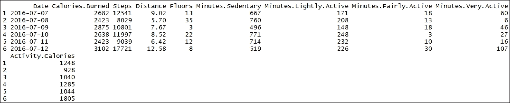

将`Activity.Calories`和`Date`值设置为 NULL：

```py
> fitbit$Activity.Calories <- NULL

```

```py
> fitbit$Date <- NULL

```

将缩放系数设置为每千步卡路里。然后将结果设置为`fitbit$Steps`数据框：

```py
> fitbit$Steps <- fitbit$Steps / 1000

```

打印`fitbit$Steps`数据框：

```py
> fitbit$Steps

```

结果如下：

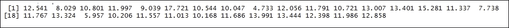

探索所有候选变量。计算相关系数的函数：

```py
    > panel_correlations <- function(x, y, digits = 2, prefix = "", cex.cor, ...){
    # combining multiple plots into one overall graph
    + usr <- par("usr")
    + on.exit(par(usr))
    + par(usr = c(0, 1, 0, 1))
    # computing the absolute value
    + r <- abs(cor(x, y))
# Formatting object 
    + txt <- format(c(r, 0.123456789), digits = digits)[1]
    + txt <- paste0(prefix, txt)
    + if(missing(cex.cor)) cex.cor <- 0.8/strwidth(txt)
    + text(0.5, 0.5, txt, cex = cex.cor * r)
    + }

```

生成散点矩阵。`pairs()`函数以矩阵形式生成散点图。"fitbit"是散点图的数据集。距离可以直接从"Steps"中几乎精确地计算出来：

```py
> pairs(fitbit[ , -1], lower.panel = panel_correlations, main = "Pairwise Relationship - Fitbit's Measured Activities")

```

结果如下：

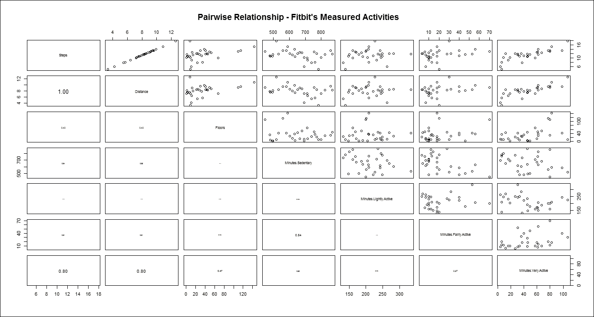

打印`fitbit 数据框`：

```py
> ggplot(fitbit, aes(x = Distance / Steps)) + geom_rug() + geom_density() +ggtitle("Stride Length Reverse- Engineered from Fitbit Data", subtitle = "Not all strides identical, due to rounding or other jitter")

```

结果如下：

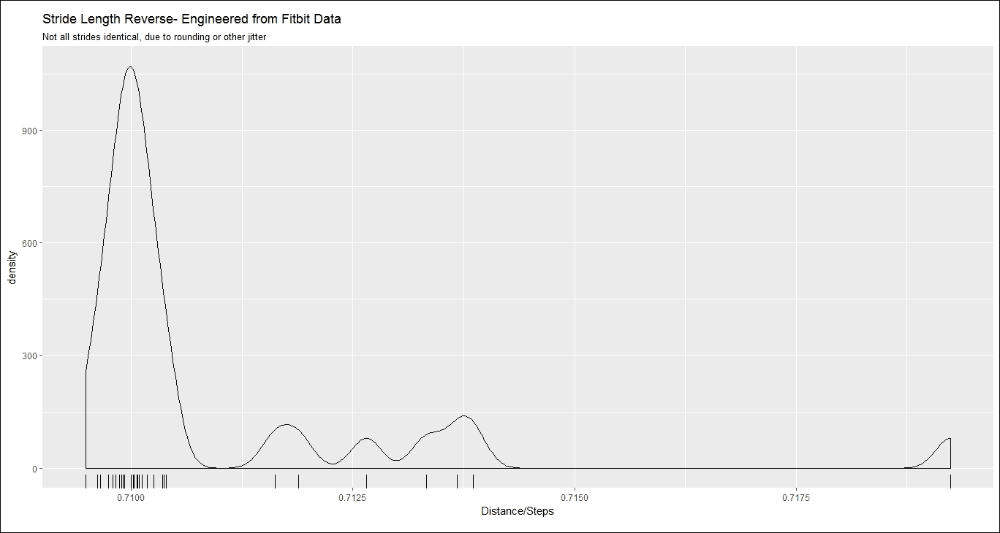

### 步骤 3 - 构建模型

使用"Steps"作为唯一解释变量和"Calories.Burned"作为响应变量构建普通最小二乘估计。"lm()"作为一个函数用于拟合线性模型。"Calories.Burned ~ Steps"是公式，而"fitbit"是数据框。结果存储在`moderate`数据框中：

```py
> moderate <- lm(Calories.Burned ~ Steps, data = fitbit)

```

打印`moderate`数据框：

```py
> moderate

```

结果如下：

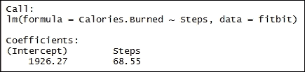

将`moderate`数据框的值四舍五入：

```py
> round(coef(moderate))

```

结果如下：

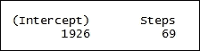

使用模型中的残差绘制预测卡路里。`plot()`函数是一个通用的绘图 R 对象的函数。`moderate`数据框作为函数值传递。`bty`参数确定围绕绘图绘制的框的类型：

```py
> plot(moderate, which = 1, bty = "l", main = "Predicted Calories compared with Residuals")

```

结果如下：

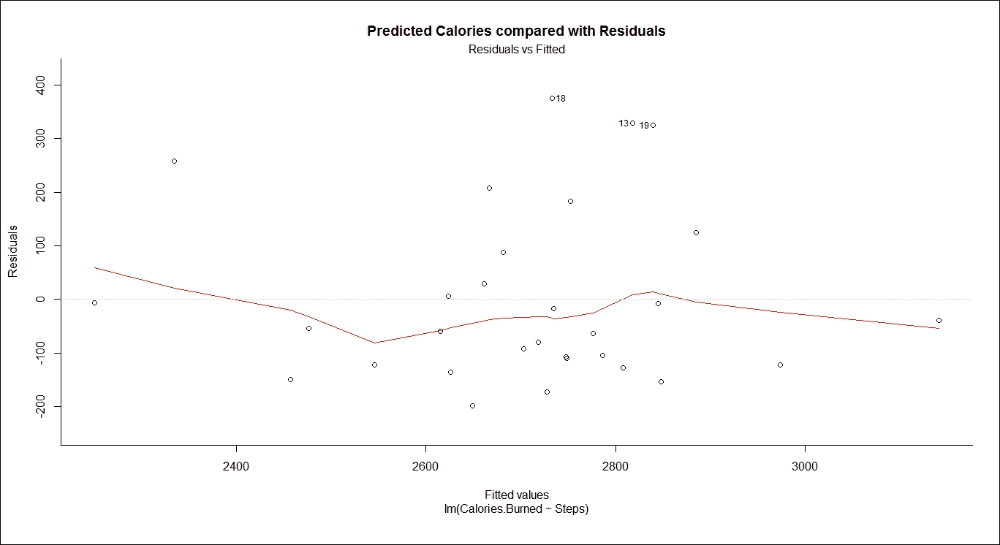

检查残差的偏自相关函数。"pacf()"用于计算偏自相关。"resid()"作为一个函数计算因变量观测数据之间的差异。"moderate"作为一个数据框传递给"resid()"函数，以计算因变量观测数据之间的差异：

```py
> pacf(resid(moderate), main = "Partial Autocorrelation of residuals from single variable regression")

```

`grid()`函数向绘制的数据添加网格：

```py
> grid()

```

结果如下：

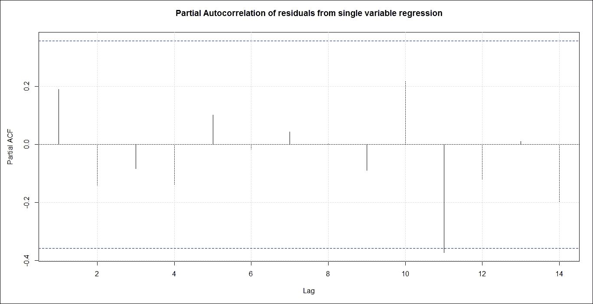

### 步骤 4 - 改进模型

根据所有七个解释变量预测每日卡路里。使用拟合模型在多个不同 alpha 值下对样本进行拟合，使用拟合模型从原始样本中预测未在重新抽样的样本中的外袋点。这是通过选择适当的 alpha 值来在岭回归和 lasso 估计的极端之间创建平衡。

通过标准化创建矩阵`X`。`as.matrix()`函数将`fitbit[ , -1]`（即除日期列之外的部分）转换为矩阵：

```py
 > X <- as.matrix(fitbit[ , -1])

```

打印`X`数据框。"head()"函数返回`X`数据框的第一部分。"X"数据框作为输入参数传递：

```py
> head(X)

```

结果如下：

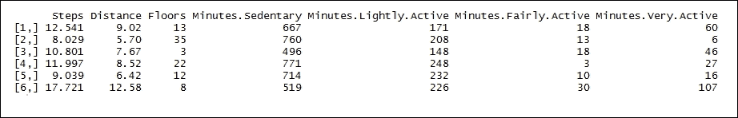

通过标准化创建向量`Y`：

```py
> Y <- fitbit$Calories.Burned

```

打印`Y`数据框：

```py
> Y

```

结果如下：

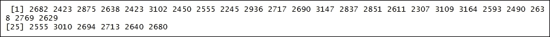

```py
> set.seed(123)

```

生成常规序列：

```py
 > alphas <- seq(from = 0, to  = 1, length.out = 10)
 > res <- matrix(0, nrow = length(alphas), ncol = 6)

```

创建每个 CV 运行的五次重复：

```py
    > for(i in 1:length(alphas)){
    + for(j in 2:6){
    # k-fold cross-validation for glmnet
    + cvmod <- cv.glmnet(X, Y, alpha = alphas[i])
    + res[i, c(1, j)] <- c(alphas[i], sqrt(min(cvmod$cvm)))
    + }
    + }

```

创建要使用的数据集。"data.frame()"函数用于根据紧密耦合的变量集创建数据框。这些变量共享矩阵的性质：

```py
> res <- data.frame(res)

```

打印`res`数据框：

```py
> res

```

结果如下：

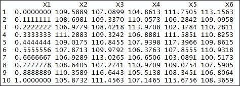

创建`average_rmse`向量：

```py
> res$average_rmse <- apply(res[ , 2:6], 1, mean)

```

打印`res$average_rmse`向量：

```py
> res$average_rmse

```

结果如下：

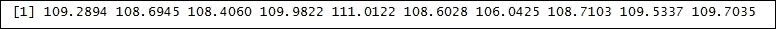

将`res$average_rmse`按升序排列。结果存储在`res`数据框中：

```py
> res <- res[order(res$average_rmse), ]

```

打印`res`数据框：

```py
> res

```

结果如下：

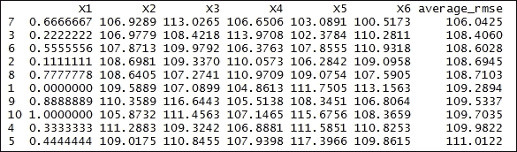

```py
    > names(res)[1] <- "alpha"
    > res %>%
    + select(-average_rmse) %>%
    + gather(trial, rmse, -alpha) %>%
    + ggplot(aes(x = alpha, y = rmse)) +
    + geom_point() +
    + geom_smooth(se = FALSE) +
    + labs(y = "Root Mean Square Error") +
    + ggtitle("Cross Validation best RMSE for differing values of alpha")

```

结果如下：

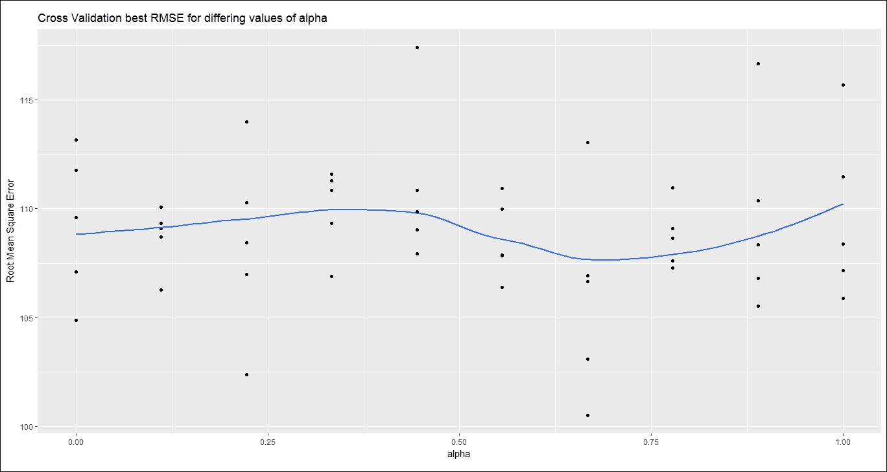

```py
> bestalpha <- res[1, 1]

```

打印`bestalpha`数据框：

```py
> bestalpha

```

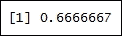

使用弹性网络比较普通最小二乘等价物与八个系数（七个解释变量加一个截距）的估计值。

确定 alpha 的最佳值处的 lambda。通过调用`cv.glmnet()`函数计算`glmnet`的 k 折交叉验证：

```py
> crossvalidated <- cv.glmnet(X, Y, alpha = bestalpha)

```

创建模型。`glmnet()`通过惩罚最大似然估计拟合广义线性模型。正则化路径在正则化参数 lambda 的值网格上计算，对于 lasso 或`elasticnet`惩罚。`X`是输入矩阵，而`Y`是响应变量。`alpha`是`elasticnet`混合参数，范围是 0 ≤ α ≤ 1：

```py
> moderate1 <- glmnet(X, Y, alpha = bestalpha)

```

建立普通最小二乘估计，以`fitbit`作为唯一的解释变量，以`Calories.Burned`作为响应变量。使用`lm()`函数拟合线性模型。`Calories.Burned ~ Steps`是公式，而`fitbit`是数据框。结果存储在`OLSmodel`数据框中：

```py
> OLSmodel <- lm(Calories.Burned ~ ., data = fitbit)

```

打印`OLSmodel`数据框：

```py
> OLSmodel

```

结果如下：

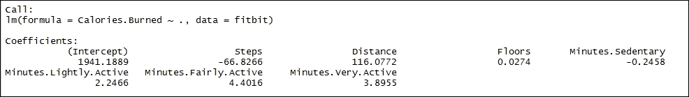

比较普通最小二乘等价物与八个系数（七个解释变量加一个截距）的估计值。结果存储在`coeffs`数据框中：

```py
 > coeffs <- data.frame(original = coef(OLSmodel), 
 + shrunk = as.vector(coef(moderate1, s = crossvalidated$lambda.min)),
 + very.shrunk = as.vector(coef(moderate1, s = crossvalidated$lambda.1se)))

```

打印`coeffs`数据框：

```py
> coeffs

```

结果如下：

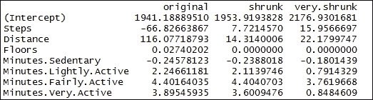

将`moderate`数据框的值四舍五入到三位有效数字：

```py
> round(coeffs, 3)

```

结果如下：

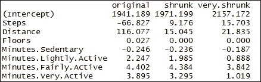

创建模型。`glmnet()`通过惩罚最大似然估计拟合广义线性模型：

```py
> moderate2 <- glmnet(X, Y, lambda = 0)

```

打印`moderate2`数据框：

```py
> moderate2

```

结果如下：

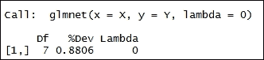

将值四舍五入到三位有效数字：

```py
> round(data.frame("elastic, lambda = 0" = as.vector(coef(moderate2)), "lm" = coef(OLSmodel), check.names = FALSE), 3)

```

结果如下：

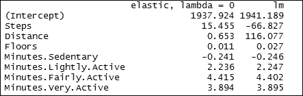

创建模型。在消除距离列后，`glmnet()`通过惩罚最大似然估计拟合广义线性模型：

```py
> moderate3 <- glmnet(X[ , -2], Y, lambda = 0)

```

打印`moderate3`数据框：

```py
> moderate3

```

结果如下：

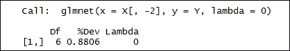

建立普通最小二乘估计`Y ~ X[ , -2]`是公式。结果存储在`moderate4`数据框中：

```py
> moderate4 <- lm(Y ~ X[ , -2])

```

打印`moderate4`数据框：

```py
> moderate4

```

结果如下：

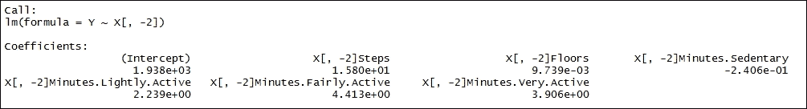

将数值四舍五入到三位有效数字：

```py
> round(data.frame("elastic, lambda = 0" = as.vector(coef(moderate3)), "lm" = coef(moderate4), check.names = FALSE), 3)

```

结果如下：

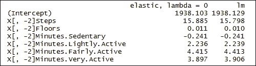

### 步骤 5 - 比较模型

通过使用 bootstrapping 比较不同模型的预测能力，其中建模方法应用于数据的 bootstrap 重采样。然后使用估计模型来预测完整的原始数据集。

传递给 boot 以进行弹性建模的函数：

```py
    > modellingfucn1 <- function(data, i){
    + X <- as.matrix(data[i , -1])
    + Y <- data[i , 1]
    # k-fold cross-validation for glmnet
    + crossvalidated <- cv.glmnet(X, Y, alpha = 1, nfolds = 30)
    # Fitting a generalized linear model via penalized maximum likelihood
    + moderate1 <- glmnet(X, Y, alpha = 1)
    # Computing the root mean squared error
    + rmse(predict(moderate1, newx = as.matrix(data[ , -1]), s =     crossvalidated$lambda.min), data[ , 1])
    + }

```

生成应用于数据的统计量的 R bootstrap 副本。`fitbit`是数据集，`statistic = modellingfucn1`是函数，当应用于`fitbit`时，返回包含感兴趣统计量的向量。`R = 99`表示 bootstrap 副本的数量：

```py
> elastic_boot <- boot(fitbit, statistic = modellingfucn1, R = 99)

```

打印`elastic_boot`数据框：

```py
 > elastic_boot

```

结果如下：

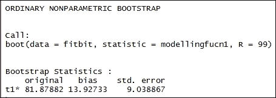

传递给 boot 以进行 OLS 建模的函数：

```py
    > modellingOLS <- function(data, i){
    + mod0 <- lm(Calories.Burned ~ Steps, data = data[i, ])
    + rmse(predict(moderate, newdata = data), data[ , 1])
    + }

```

生成应用于数据的统计量的 R bootstrap 副本。`fitbit`是数据集，`statistic = modellingOLS`是函数，当应用于`fitbit`时，返回包含感兴趣统计量的向量。`R = 99`表示 bootstrap 副本的数量：

```py
> lmOLS_boot <- boot(fitbit, statistic = modellingOLS, R = 99)

```

打印`lmOLS_boot`数据框：

```py
> lmOLS_boot

```

结果如下：

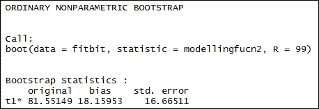

生成应用于数据的统计量的 R bootstrap 副本。`fitbit`是数据集，`statistic = modellingfucn2`是函数，当应用于`fitbit`时，返回包含感兴趣统计量的向量。`R = 99`表示 bootstrap 副本的数量：

```py
> lm_boot <- boot(fitbit, statistic = modellingfucn2, R = 99)

```

打印`lm_boot`数据框：

```py
> lm_boot

```

结果如下：

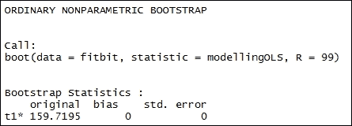

```py
 > round(c("elastic modelling" = mean(elastic_boot$t), 
 + "OLS modelling" = mean(lm_boot$t),
 + "OLS modelling, only one explanatory variable" = mean(lmOLS_boot$t)), 1)

```

结果如下：

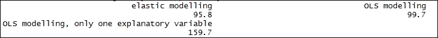

使用缩放变量重新拟合模型。

创建模型。`glmnet()`通过惩罚最大似然估计拟合广义线性模型。

```py
 > ordering <- c(7,5,6,2,1,3,4)
 > par(mar = c(5.1, 4.1, 6.5, 1), bg = "grey90")
 > model_scaled <- glmnet(scale(X), Y, alpha = bestalpha)
 > the_palette <- brewer.pal(7, "Set1")
 > plot(model_scaled, xvar = "dev", label = TRUE, col = the_pallete, lwd = 2, main = "Increasing contribution of different explanatory variablesnas penalty for including them is relaxed")
 > legend("topleft", legend = colnames(X)[ordering], text.col = the_palette[ordering], lwd = 2, bty = "n", col = the_palette[ordering])

```

结果如下：

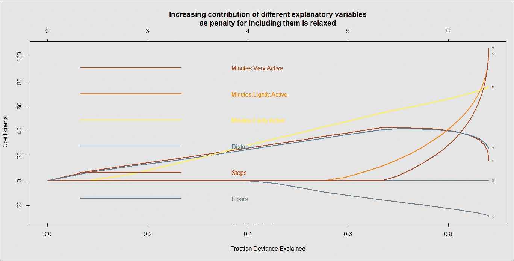

# 维度缩减方法 - Delta 的机队

航空公司战略规划过程中的一个部分是机队规划。机队是指航空公司运营的飞机总数，以及构成总机队的具体飞机类型。飞机采购的航空公司选择标准基于技术/性能特性、经济和财务影响、环境法规和限制、营销考虑以及政治现实。机队构成是航空公司公司的关键长期战略决策。每种飞机类型都有不同的技术性能特性，例如，携带有效载荷在最大飞行距离或范围内的能力。它影响财务状况、运营成本，尤其是服务特定路线的能力。

## 准备中

为了进行降维，我们将使用收集于 Delta 航空公司机队的数据集。

### 第一步 - 收集和描述数据

应使用标题为 `delta.csv` 的数据集。该数据集采用标准格式。共有 44 行数据，34 个变量。

## 如何做到这一点...

让我们深入了解细节。

### 步骤 2 - 探索数据

第一步是加载以下包：

```py
    > install.packages("rgl")
    > install.packages("RColorBrewer")
    > install.packages("scales")
    > library(rgl)
    > library(RColorBrewer)
    > library(scales)

```

### 注意

版本信息：本页面的代码在 R 版本 3.3.2（2016-10-31）上进行了测试

让我们探索数据并了解变量之间的关系。我们将首先导入名为 `delta.csv` 的 csv 数据文件。我们将把数据保存到 delta 数据框中：

```py
 > delta <- read.csv(file="d:/delta.csv", header=T, sep=",", row.names=1)

```

探索 `delta` 数据框的内部结构。`str()` 函数显示数据框的内部结构。将作为 R 对象传递给 `str()` 函数的详细信息：

```py
> str(delta)

```

结果如下：

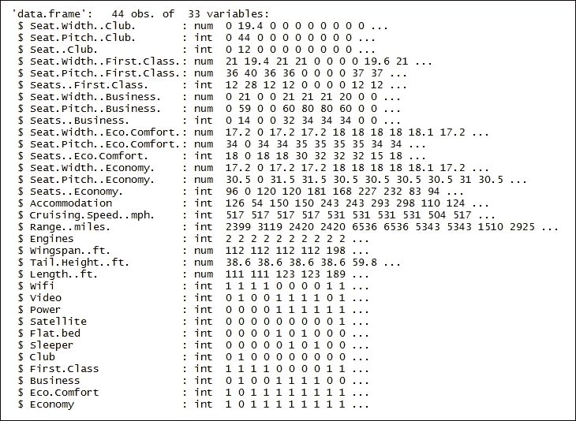

探索与飞机物理特性相关的中间定量变量：住宿、巡航速度、航程、引擎、翼展、尾高和 `Length.Scatter` 折线图矩阵。`plot()` 函数是一个用于绘制 R 对象的通用函数。将 `delta[,16:22]` 数据框作为函数值传递：

```py
> plot(delta[,16:22], main = "Aircraft Physical Characteristics", col = "red")

```

结果如下：

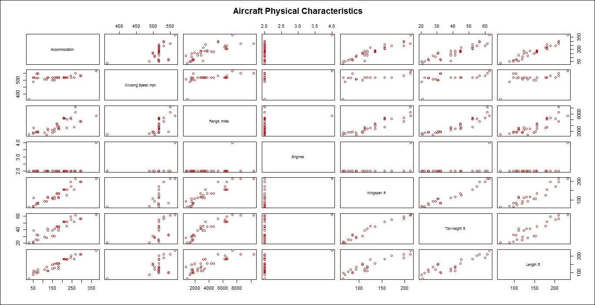

所有这些变量之间都存在正相关关系，因为它们都与飞机的整体尺寸有关。

### 步骤 3 - 应用主成分分析

可视化高维数据集，如引擎数量。对数据进行主成分分析。`princomp()` 函数对 `delta` 数据矩阵执行主成分分析。结果是 `principal_comp_analysis`，它是一个 `princomp` 类的对象：

```py
> principal_comp_analysis <- princomp(delta)

```

打印 `principal_comp_analysis` 数据框：

```py
> principal_comp_analysis

```

结果如下：

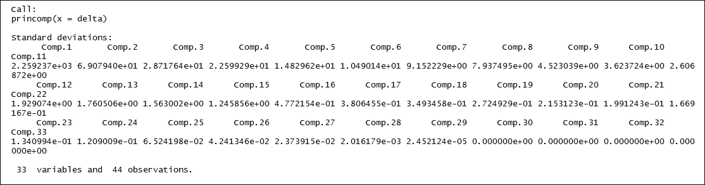

绘制 `principal_comp_analysis` 数据：

```py
> plot(principal_comp_analysis, main ="Principal Components Analysis of Raw Data", col ="blue")

```

结果如下：

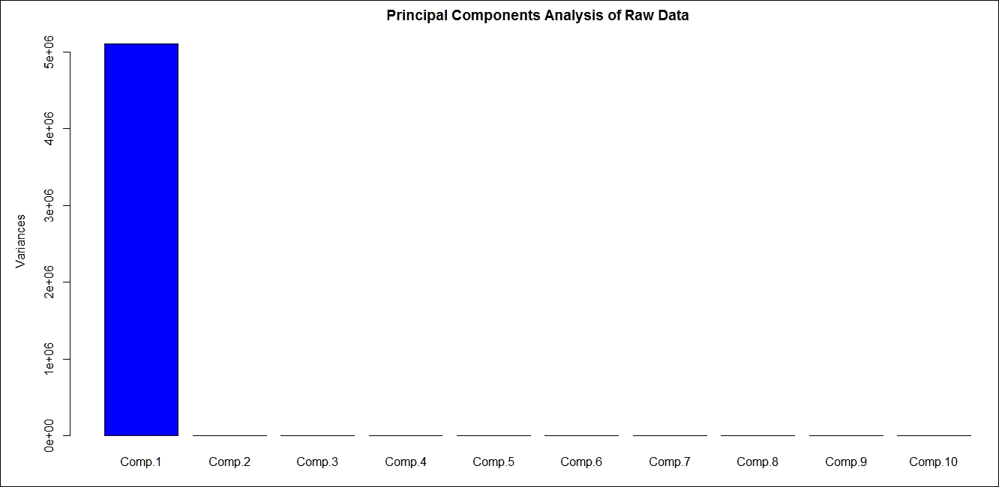

可以证明，第一个主成分具有标准差，它解释了数据中超过 99.8% 的方差。

打印主成分分析加载项。`loadings()` 函数使用 `principal_comp_analysis` 主成分分析数据对象作为输入：

```py
> loadings(principal_comp_analysis)

```

结果如下：

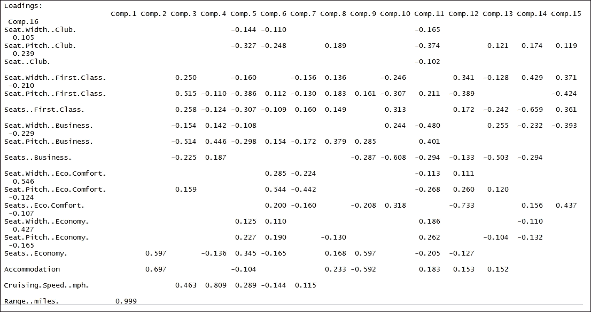

观察加载的第一个列，很明显，第一个主成分仅仅是航程，以英里为单位。数据集中每个变量的尺度都不同。

在常规尺度上绘制方差。`barplot()` 绘制垂直和水平条形图。`sapply()` 是一个包装函数，它返回与 `delta.horiz=T` 相同长度的列表，表示条形图将水平绘制，第一个在底部：

```py
 > mar <- par()$mar
 > par(mar=mar+c(0,5,0,0))
 > barplot(sapply(delta, var), horiz=T, las=1, cex.names=0.8, main = "Regular Scaling of Variance", col = "Red", xlab = "Variance")

```

结果如下：

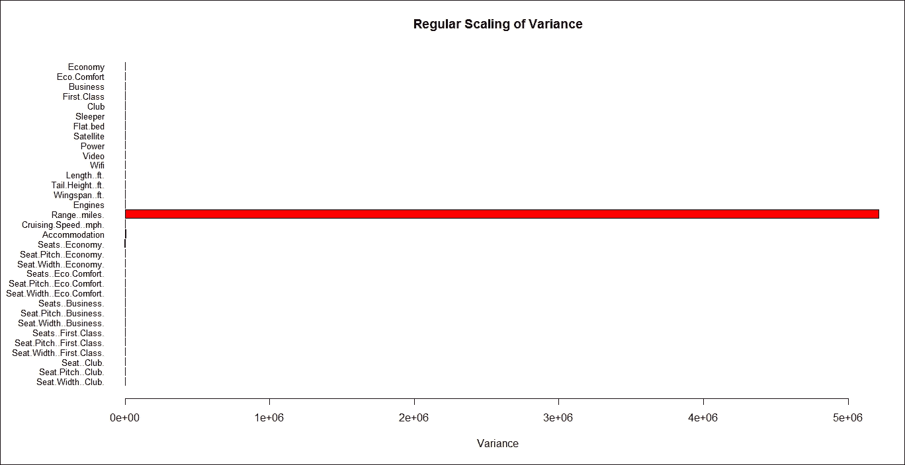

在对数尺度上绘制方差。`barplot()` 绘制垂直和水平条形：

```py
> barplot(sapply(delta, var), horiz=T, las=1, cex.names=0.8, log='x', main = "Logarithmic  Scaling of Variance", col = "Blue", xlab = "Variance")

```

结果如下：

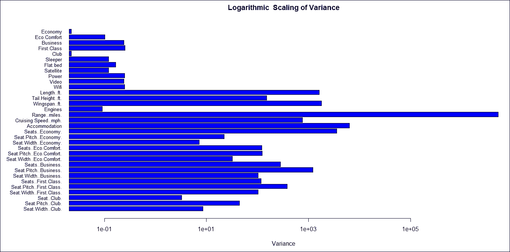

```py
> par(mar=mar)

```

### 第 4 步 - 缩放数据

在某些情况下，缩放 `delta` 数据是有用的，因为变量跨越不同的范围。`scale()` 函数作为函数对 `delta` 矩阵的列进行中心化和/或缩放。结果存储在 `delta2` 数据框中：

```py
> delta2 <- data.frame(scale(delta))

```

验证方差是否均匀：

```py
> plot(sapply(delta2, var), main = "Variances Across Different Variables", ylab = "Variances")

```

结果如下：

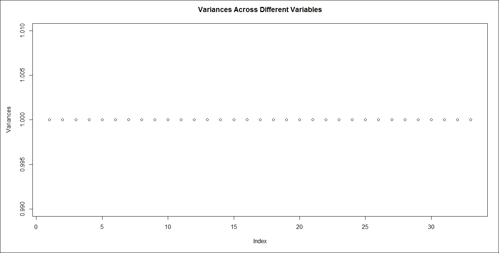

现在方差在变量间是恒定的。

将主成分应用于缩放后的数据 `delta2`。`princomp()` 函数对 `delta2` 数据矩阵执行主成分分析。结果是 `principal_comp_analysis`，它是一个 `princomp` 类的对象：

```py
> principal_comp_analysis <- princomp(delta2)

```

绘制 `principal_comp_analysis` 对象：

```py
> plot(principal_comp_analysis, main ="Principal Components Analysis of Scaled Data", col ="red")

```

结果如下：

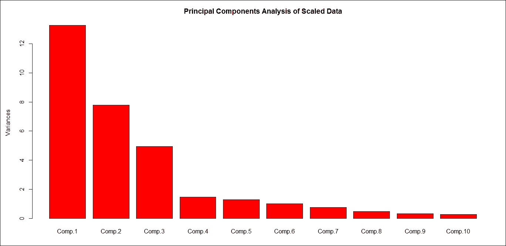

```py
> plot(principal_comp_analysis, type='l', main ="Principal Components Analysis of Scaled Data")

```

结果如下：

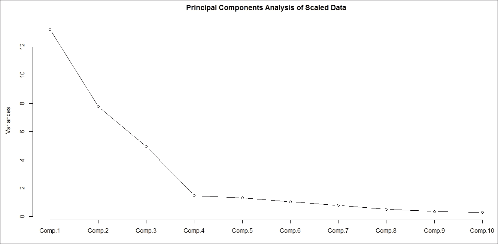

使用 `summary()` 函数生成各种模型拟合函数结果的摘要：

```py
> summary(principal_comp_analysis)

```

结果如下：

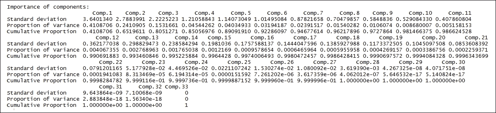

将主成分应用于缩放后的数据 `delta2`。`prcomp()` 函数对 `delta2` 数据矩阵执行主成分分析。结果是 `principal_comp_analysis`，它是一个 `prcomp` 类的对象：

```py
> principal_comp_vectors <- prcomp(delta2)

```

创建 `principal_comp_vectors` 的数据框：

```py
> comp <- data.frame(principal_comp_vectors$x[,1:4])

```

使用 `k = 4` 进行 k 均值聚类。`kmeans()` 函数对 comp 执行 k 均值聚类。`nstart=25` 表示要选择的随机集的数量。`iter.max=1000` 是允许的最大迭代次数：

```py
> k_means <- kmeans(comp, 4, nstart=25, iter.max=1000)

```

创建一个包含九种连续颜色的向量：

```py
> palette(alpha(brewer.pal(9,'Set1'), 0.5))

```

绘制 comp：

```py
> plot(comp, col=k_means$clust, pch=16)

```

结果如下：

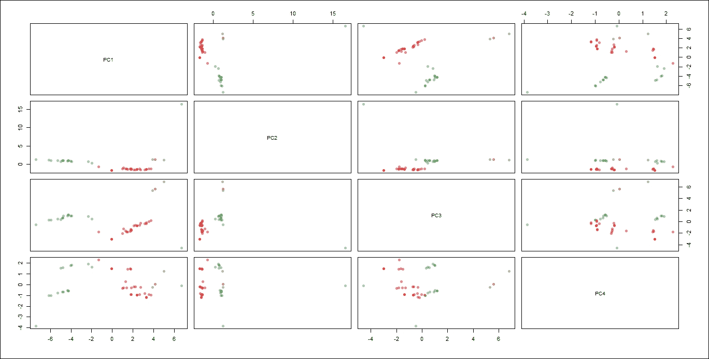

### 第 5 步 - 在 3D 图中可视化

在 3D 中绘制 `comp$PC1`、`comp$PC2`、`comp$PC3`：

```py
> plot3d(comp$PC1, comp$PC2, comp$PC3, col=k_means$clust) 

```

结果如下：

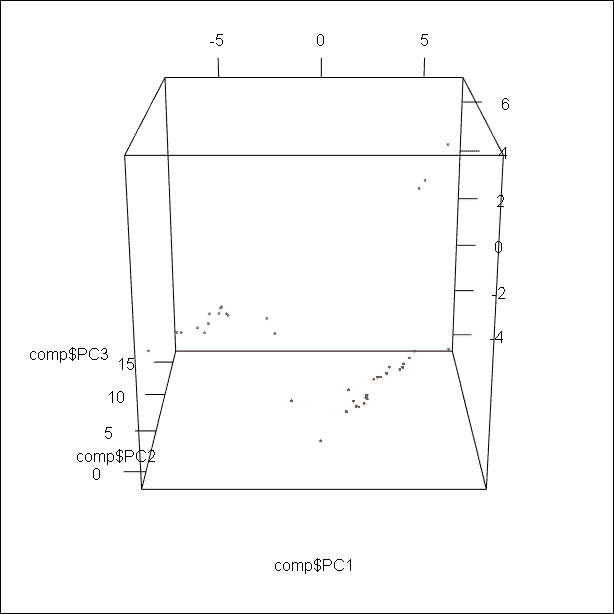

在 3D 中绘制 `comp$PC1`、`comp$PC3`、`comp$PC4`：

```py
> plot3d(comp$PC1, comp$PC3, comp$PC4, col=k_means$clust)

```

结果如下：

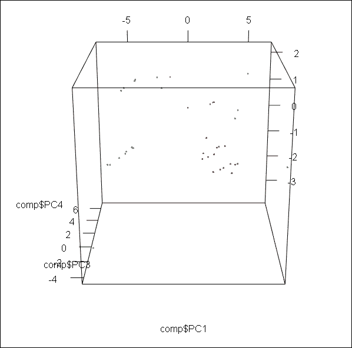

按照大小顺序检查簇：

```py
> sort(table(k_means$clust))

```

结果如下：

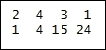

```py
> clust <- names(sort(table(k_means$clust)))

```

如第一簇中显示的名称：

```py
> row.names(delta[k_means$clust==clust[1],])

```

结果如下：

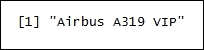

如第二簇中显示的名称：

```py
> row.names(delta[k_means$clust==clust[2],])

```

结果如下：

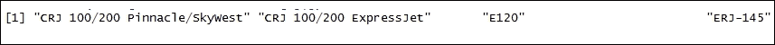

如第三簇中显示的名称：

```py
> row.names(delta[k_means$clust==clust[3],])

```

结果如下：

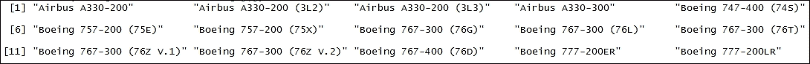

如第四簇中显示的名称：

```py
> row.names(delta[k_means$clust==clust[4],])

```

结果如下：

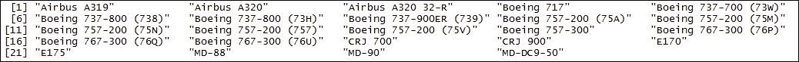

# 主成分分析 - 理解世界美食

食物是我们身份的强大象征。有许多类型的食物识别，如民族、宗教和阶级识别。在存在味觉外国人（如出国或在外国人访问家乡时）的情况下，民族食物偏好成为身份标志。

## 准备工作

为了进行主成分分析，我们将使用在 Epicurious 菜谱数据集上收集的数据集。

### 第 1 步 - 收集和描述数据

将使用标题为 `epic_recipes.txt` 的数据集。该数据集为标准格式。

## 如何操作...

让我们深入了解细节。

### 第 2 步 - 探索数据

第一步是加载以下包：

```py
> install.packages("glmnet") 
    > library(ggplot2)
    > library(glmnet)

```

### 注意

版本信息：本页代码在 R 版本 3.3.2（2016-10-31）上进行了测试

让我们探索数据并了解变量之间的关系。我们将首先导入名为 `epic_recipes.txt` 的 TXT 数据文件。我们将数据保存到 `datafile` 数据框中：

```py
> datafile <- file.path("d:","epic_recipes.txt")

```

从表格格式文件中读取文件并创建数据框。`datafile` 是文件名，作为输入传递：

```py
> recipes_data <- read.table(datafile, fill=TRUE, col.names=1:max(count.fields(datafile)), na.strings=c("", "NA"), stringsAsFactors = FALSE)

```

### 第 3 步 - 准备数据

将数据拆分为子集。`aggregate()` 函数将 `recipes_data[,-1]` 拆分并计算汇总统计信息。`recipes_data[,-1]` 是一个分组元素列表，每个元素与数据框中的变量长度相同。结果存储在 `agg` 数据框中：

```py
> agg <- aggregate(recipes_data[,-1], by=list(recipes_data[,1]), paste, collapse=",")

```

创建一个向量、数组或值列表：

```py
> agg$combined <- apply(agg[,2:ncol(agg)], 1, paste, collapse=",")

```

替换所有模式出现。`gsub()` 函数在搜索 `agg$combined` 后将每个 `,NA` 替换为 `""`：

```py
> agg$combined <- gsub(",NA","",agg$combined)

```

提取所有菜系的名称：

```py
> cuisines <- as.data.frame(table(recipes_data[,1]))

```

打印菜系数据框：

```py
> cuisines

```

结果如下：

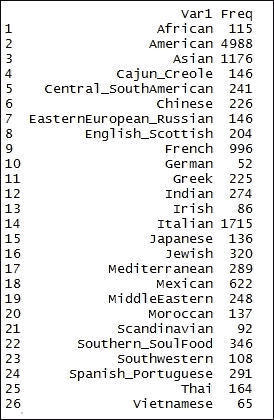

提取成分的频率：

```py
 > ingredients_freq <- lapply(lapply(strsplit(a$combined,","), table), as.data.frame) 
 > names(ingredients_freq) <- agg[,1]

```

标准化成分的频率：

```py
 > proportion <- lapply(seq_along(ingredients_freq), function(i) {
 + colnames(ingredients_freq[[i]])[2] <- names(ingredients_freq)[i]
 + ingredients_freq[[i]][,2] <- ingredients_freq[[i]][,2]/cuisines[i,2] 
 + ingredients_freq[[i]]}
 + )

```

包含 26 个元素，每个元素对应一种菜系：

```py
    > names(proportion) <- a[,1]
    > final <- Reduce(function(...) merge(..., all=TRUE, by="Var1"), proportion)
    > row.names(final) <- final[,1]
    > final <- final[,-1]
    > final[is.na(final)] <- 0
    > prop_matrix <- t(final)
    > s <- sort(apply(prop_matrix, 2, sd), decreasing=TRUE)

```

`scale()` 函数将 `prop_matrix` 矩阵的列进行居中和/或缩放。结果存储在 `final_impdata` 数据框中：

```py
 > final_imp <- scale(subset(prop_matrix, select=names(which(s > 0.1))))

```

创建热图。`final_imp` 是作为输入传递的数据框。`trace="none"` 表示字符串，指示是否在行或列上绘制实线 `"trace"`，`"both"` 或 `"none"`。`key=TRUE` 值表示应显示颜色键：

```py
> heatmap.2(final_imp, trace="none", margins = c(6,11), col=topo.colors(7), key=TRUE, key.title=NA, keysize=1.2, density.info="none")

```

结果如下：

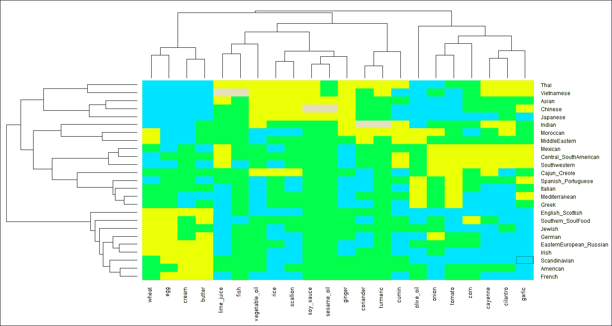

### 第 4 步 - 应用主成分分析

对数据进行主成分分析。`princomp()` 函数对 `final_imp` 数据矩阵执行主成分分析。结果是 `pca_computation`，它是一个 `princomp` 类的对象：

```py
> pca_computation <- princomp(final_imp) 

```

打印 `pca_computation` 数据框：

```py
> pca_computation

```

结果如下：

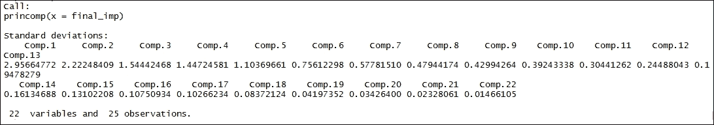

生成双变量图。`pca_computation` 是一个 `princomp` 类的对象。`pc.biplot=TRUE` 表示它是一个主成分双变量图：

```py
> biplot(pca_computation, pc.biplot=TRUE, col=c("black","red"), cex=c(0.9,0.8), xlim=c(-2.5,2.5), xlab="PC1, 39.7%", ylab="PC2, 24.5%")

```

结果如下：

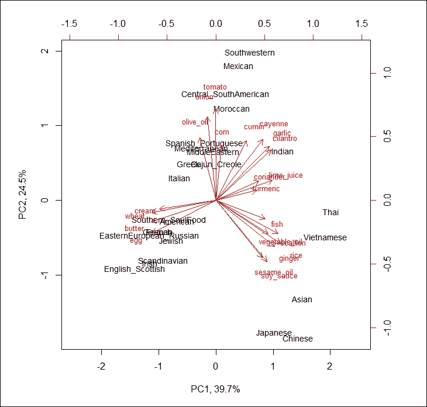
